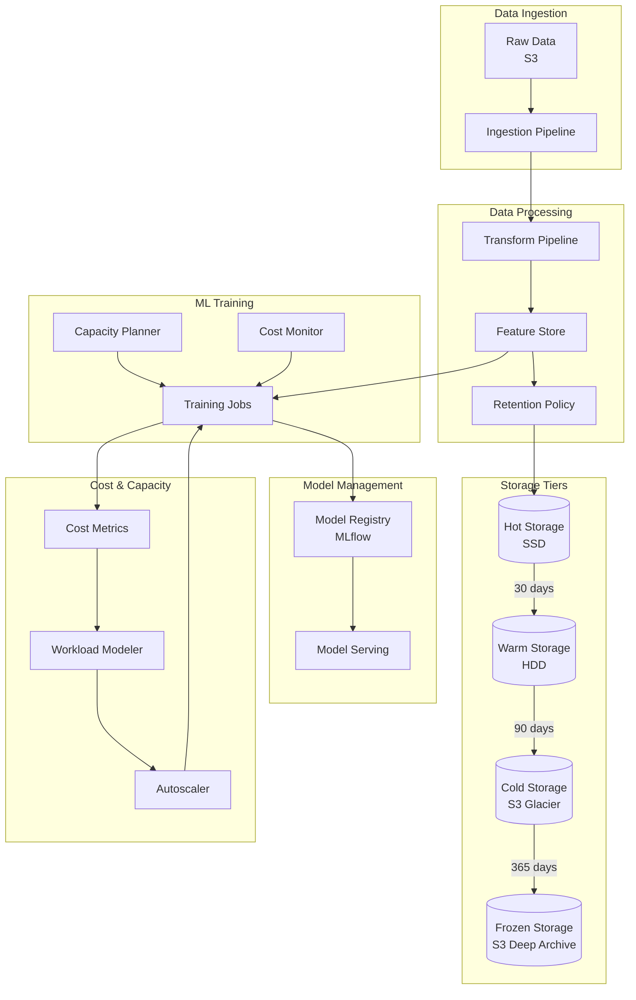

# Cost-Optimized ML Pipeline with Capacity Planning and Data Retention: A Complete Integration Tutorial

**Objective**: Build a production-ready ML pipeline that integrates cost-aware architecture, capacity planning and workload modeling, data retention and archival strategies, and ML systems architecture. This tutorial demonstrates how to build cost-efficient ML systems that scale intelligently and manage data lifecycle effectively.

This tutorial combines:
- **[Cost-Aware Architecture & Resource-Efficiency Governance](../best-practices/architecture-design/cost-aware-architecture-and-efficiency-governance.md)** - Cost measurement and optimization
- **[Holistic Capacity Planning, Scaling Economics, and Workload Modeling](../best-practices/architecture-design/capacity-planning-and-workload-modeling.md)** - Workload modeling and scaling
- **[Data Retention, Archival Strategy, Lifecycle Governance](../best-practices/data-governance/data-retention-archival-lifecycle-governance.md)** - Data lifecycle management
- **[ML Systems Architecture: Feature Stores, Model Serving, Experiment Governance](../best-practices/ml-ai/ml-systems-architecture-governance.md)** - Complete ML lifecycle

## 1) Prerequisites

```bash
# Required tools
docker --version          # >= 20.10
docker compose --version  # >= 2.0
python --version          # >= 3.10
kubectl --version         # >= 1.28
mlflow --version          # >= 2.8
prefect --version         # >= 2.14

# Python packages
pip install mlflow prefect pandas scikit-learn \
    prometheus-client kubecost kubernetes \
    boto3 s3fs pyarrow
```

**Why**: Cost-optimized ML systems require ML frameworks (MLflow), orchestration (Prefect), cost monitoring (Kubecost), and data lifecycle management (S3, Parquet) to balance performance and cost.

## 2) Architecture Overview

We'll build a **Cost-Optimized ML Training Pipeline** with intelligent capacity planning:



**Cost Optimization Strategies**:
1. **Right-sizing**: Match resources to workload requirements
2. **Spot Instances**: Use spot instances for training jobs
3. **Data Lifecycle**: Move data to cheaper storage tiers
4. **Capacity Planning**: Predict and provision optimal resources
5. **Auto-scaling**: Scale down when not in use

## 3) Repository Layout

```
cost-optimized-ml/
├── docker-compose.yaml
├── pipelines/
│   ├── ingestion/
│   │   ├── ingest_data.py
│   │   └── retention_policy.py
│   ├── training/
│   │   ├── train_model.py
│   │   ├── capacity_planner.py
│   │   └── cost_optimizer.py
│   └── serving/
│       └── serve_model.py
├── mlflow/
│   └── mlflow_config.yaml
├── retention/
│   ├── policies.yaml
│   └── lifecycle_manager.py
├── capacity/
│   ├── workload_modeler.py
│   └── autoscaler.py
└── monitoring/
    ├── cost_dashboard.json
    └── capacity_metrics.py
```

## 4) Capacity Planning and Workload Modeling

Create `capacity/workload_modeler.py`:

```python
"""Workload modeling and capacity planning for ML pipelines."""
from dataclasses import dataclass
from typing import Dict, List, Optional
from datetime import datetime, timedelta
import numpy as np
from prometheus_client import Gauge, Histogram

capacity_metrics = {
    "cpu_utilization": Gauge("ml_capacity_cpu_utilization", "CPU utilization", ["workload"]),
    "memory_utilization": Gauge("ml_capacity_memory_utilization", "Memory utilization", ["workload"]),
    "gpu_utilization": Gauge("ml_capacity_gpu_utilization", "GPU utilization", ["workload"]),
    "training_duration": Histogram("ml_training_duration_seconds", "Training duration", ["model_type"]),
}


@dataclass
class WorkloadProfile:
    """Workload profile for capacity planning."""
    name: str
    cpu_cores: int
    memory_gb: int
    gpu_count: int
    gpu_type: Optional[str] = None
    duration_minutes: int = 60
    frequency: str = "daily"  # daily, weekly, monthly
    peak_concurrent: int = 1


@dataclass
class CapacityRequirement:
    """Capacity requirement calculation."""
    workload: WorkloadProfile
    total_cpu_cores: float
    total_memory_gb: float
    total_gpu_count: int
    estimated_cost_per_hour: float
    recommended_instance_type: str


class WorkloadModeler:
    """Models workloads and predicts capacity needs."""
    
    def __init__(self):
        self.workloads: Dict[str, WorkloadProfile] = {}
        self.historical_data: List[Dict] = []
    
    def register_workload(self, workload: WorkloadProfile):
        """Register a workload profile."""
        self.workloads[workload.name] = workload
    
    def record_training_run(
        self,
        workload_name: str,
        cpu_used: float,
        memory_used: float,
        gpu_used: Optional[float] = None,
        duration_seconds: float = 0
    ):
        """Record actual training run metrics."""
        self.historical_data.append({
            "workload": workload_name,
            "timestamp": datetime.utcnow(),
            "cpu_used": cpu_used,
            "memory_used": memory_used,
            "gpu_used": gpu_used,
            "duration_seconds": duration_seconds
        })
        
        # Update metrics
        capacity_metrics["cpu_utilization"].labels(workload=workload_name).set(cpu_used)
        capacity_metrics["memory_utilization"].labels(workload=workload_name).set(memory_used)
        if gpu_used:
            capacity_metrics["gpu_utilization"].labels(workload=workload_name).set(gpu_used)
        capacity_metrics["training_duration"].labels(model_type=workload_name).observe(duration_seconds)
    
    def calculate_capacity_requirement(
        self,
        workload: WorkloadProfile,
        instance_costs: Dict[str, float]
    ) -> CapacityRequirement:
        """Calculate capacity requirements for a workload."""
        # Account for overhead (20% buffer)
        cpu_required = workload.cpu_cores * 1.2
        memory_required = workload.memory_gb * 1.2
        
        # Calculate based on frequency
        if workload.frequency == "daily":
            hours_per_month = workload.duration_minutes / 60 * 30
        elif workload.frequency == "weekly":
            hours_per_month = workload.duration_minutes / 60 * 4
        else:  # monthly
            hours_per_month = workload.duration_minutes / 60
        
        # Find optimal instance type
        optimal_instance = self._find_optimal_instance(
            cpu_required,
            memory_required,
            workload.gpu_count,
            workload.gpu_type,
            instance_costs
        )
        
        cost_per_hour = instance_costs.get(optimal_instance, 0.0)
        estimated_cost = cost_per_hour * hours_per_month
        
        return CapacityRequirement(
            workload=workload,
            total_cpu_cores=cpu_required,
            total_memory_gb=memory_required,
            total_gpu_count=workload.gpu_count,
            estimated_cost_per_hour=cost_per_hour,
            recommended_instance_type=optimal_instance
        )
    
    def _find_optimal_instance(
        self,
        cpu_required: float,
        memory_required: float,
        gpu_count: int,
        gpu_type: Optional[str],
        instance_costs: Dict[str, float]
    ) -> str:
        """Find optimal instance type based on requirements."""
        # Simplified instance selection logic
        # In production, use actual cloud provider APIs
        
        if gpu_count > 0:
            if gpu_type == "a100":
                return "g5.2xlarge"  # Example
            elif gpu_type == "t4":
                return "g4dn.xlarge"
            else:
                return "g4dn.xlarge"
        else:
            if cpu_required <= 2 and memory_required <= 8:
                return "t3.medium"
            elif cpu_required <= 4 and memory_required <= 16:
                return "t3.large"
            elif cpu_required <= 8 and memory_required <= 32:
                return "t3.xlarge"
            else:
                return "m5.2xlarge"
    
    def predict_future_capacity(
        self,
        days_ahead: int = 30
    ) -> Dict[str, CapacityRequirement]:
        """Predict capacity needs for future period."""
        predictions = {}
        
        for workload_name, workload in self.workloads.items():
            # Use historical data to refine predictions
            historical = [
                d for d in self.historical_data
                if d["workload"] == workload_name
            ]
            
            if historical:
                # Calculate average utilization
                avg_cpu = np.mean([d["cpu_used"] for d in historical])
                avg_memory = np.mean([d["memory_used"] for d in historical])
                
                # Adjust workload profile based on historical data
                adjusted_workload = WorkloadProfile(
                    name=workload.name,
                    cpu_cores=int(workload.cpu_cores * avg_cpu),
                    memory_gb=int(workload.memory_gb * avg_memory),
                    gpu_count=workload.gpu_count,
                    gpu_type=workload.gpu_type,
                    duration_minutes=workload.duration_minutes,
                    frequency=workload.frequency
                )
            else:
                adjusted_workload = workload
            
            # Calculate requirement
            instance_costs = {
                "t3.medium": 0.0416,
                "t3.large": 0.0832,
                "t3.xlarge": 0.1664,
                "g4dn.xlarge": 0.526,
                "g5.2xlarge": 1.008,
            }
            
            predictions[workload_name] = self.calculate_capacity_requirement(
                adjusted_workload,
                instance_costs
            )
        
        return predictions
```

## 5) Cost-Aware Architecture

Create `pipelines/training/cost_optimizer.py`:

```python
"""Cost optimization for ML training pipelines."""
from typing import Dict, List, Optional
from dataclasses import dataclass
from datetime import datetime
import boto3
from prometheus_client import Counter, Gauge, Histogram

cost_metrics = {
    "training_cost": Counter("ml_training_cost_total", "Total training cost", ["workload", "instance_type"]),
    "spot_savings": Counter("ml_spot_savings_total", "Spot instance savings", ["workload"]),
    "idle_cost": Gauge("ml_idle_cost_per_hour", "Idle resource cost per hour"),
    "cost_per_experiment": Histogram("ml_cost_per_experiment", "Cost per experiment", ["workload"]),
}


@dataclass
class CostProfile:
    """Cost profile for ML workloads."""
    workload_name: str
    on_demand_cost_per_hour: float
    spot_cost_per_hour: float
    storage_cost_per_gb_month: float
    data_transfer_cost_per_gb: float
    estimated_savings_percent: float = 0.0


class CostOptimizer:
    """Optimizes costs for ML training."""
    
    def __init__(self, use_spot: bool = True, spot_discount: float = 0.7):
        self.use_spot = use_spot
        self.spot_discount = spot_discount
        self.ec2 = boto3.client("ec2")
        self.cost_profiles: Dict[str, CostProfile] = {}
    
    def calculate_training_cost(
        self,
        instance_type: str,
        duration_hours: float,
        storage_gb: float,
        data_transfer_gb: float = 0.0
    ) -> float:
        """Calculate total training cost."""
        # Get instance pricing (simplified)
        on_demand_price = self._get_instance_price(instance_type, on_demand=True)
        spot_price = self._get_instance_price(instance_type, on_demand=False)
        
        # Compute cost
        if self.use_spot:
            compute_cost = spot_price * duration_hours
            savings = (on_demand_price - spot_price) * duration_hours
            cost_metrics["spot_savings"].labels(workload=instance_type).inc(savings)
        else:
            compute_cost = on_demand_price * duration_hours
        
        storage_cost = storage_gb * 0.023 / 730  # S3 standard storage per hour
        transfer_cost = data_transfer_gb * 0.09  # Data transfer cost
        
        total_cost = compute_cost + storage_cost + transfer_cost
        
        cost_metrics["training_cost"].labels(
            workload=instance_type,
            instance_type=instance_type
        ).inc(total_cost)
        
        return total_cost
    
    def _get_instance_price(self, instance_type: str, on_demand: bool = True) -> float:
        """Get instance price (simplified - in production use Pricing API)."""
        prices = {
            "t3.medium": 0.0416,
            "t3.large": 0.0832,
            "t3.xlarge": 0.1664,
            "g4dn.xlarge": 0.526,
            "g5.2xlarge": 1.008,
        }
        
        base_price = prices.get(instance_type, 0.1)
        if not on_demand:
            return base_price * self.spot_discount
        return base_price
    
    def recommend_cost_optimization(
        self,
        workload_name: str,
        current_cost: float,
        usage_pattern: Dict
    ) -> List[str]:
        """Recommend cost optimizations."""
        recommendations = []
        
        # Check for idle resources
        if usage_pattern.get("idle_hours", 0) > 0:
            recommendations.append(
                f"Stop idle resources to save ${usage_pattern['idle_hours'] * 0.1:.2f}/month"
            )
        
        # Check for over-provisioning
        if usage_pattern.get("cpu_utilization", 100) < 50:
            recommendations.append(
                "Downsize instance type - CPU utilization is low"
            )
        
        # Check for spot instance usage
        if not self.use_spot and usage_pattern.get("interruptible", True):
            recommendations.append(
                f"Use spot instances to save ~{int(self.spot_discount * 100)}%"
            )
        
        # Check for storage optimization
        if usage_pattern.get("old_data_gb", 0) > 100:
            recommendations.append(
                f"Archive {usage_pattern['old_data_gb']}GB to cold storage"
            )
        
        return recommendations
    
    def track_idle_resources(self, idle_instances: List[Dict]):
        """Track and report idle resource costs."""
        total_idle_cost = 0.0
        
        for instance in idle_instances:
            cost_per_hour = self._get_instance_price(instance["type"])
            idle_cost = cost_per_hour * instance["idle_hours"]
            total_idle_cost += idle_cost
        
        cost_metrics["idle_cost"].set(total_idle_cost)
        return total_idle_cost
```

## 6) Data Retention and Lifecycle Management

Create `retention/lifecycle_manager.py`:

```python
"""Data retention and lifecycle management for ML pipelines."""
from typing import Dict, List, Optional
from datetime import datetime, timedelta
from dataclasses import dataclass
import boto3
from botocore.exceptions import ClientError

from prometheus_client import Counter, Gauge

retention_metrics = {
    "data_archived": Counter("ml_data_archived_total", "Total data archived", ["tier"]),
    "data_deleted": Counter("ml_data_deleted_total", "Total data deleted"),
    "storage_cost": Gauge("ml_storage_cost_per_month", "Storage cost per month", ["tier"]),
    "retention_policy_applied": Counter("ml_retention_policy_applied_total", "Retention policies applied"),
}


@dataclass
class RetentionPolicy:
    """Data retention policy."""
    name: str
    dataset_pattern: str  # Pattern to match datasets
    hot_retention_days: int = 30
    warm_retention_days: int = 90
    cold_retention_days: int = 365
    frozen_retention_days: Optional[int] = None  # None = indefinite
    delete_after_days: Optional[int] = None


@dataclass
class StorageTier:
    """Storage tier configuration."""
    name: str
    storage_class: str  # S3 storage class
    cost_per_gb_month: float
    access_time: str  # "instant", "minutes", "hours", "days"


class DataLifecycleManager:
    """Manages data lifecycle and retention."""
    
    def __init__(self, s3_bucket: str):
        self.s3 = boto3.client("s3")
        self.bucket = s3_bucket
        self.policies: Dict[str, RetentionPolicy] = {}
        self.tiers = {
            "hot": StorageTier("hot", "STANDARD", 0.023, "instant"),
            "warm": StorageTier("warm", "STANDARD_IA", 0.0125, "instant"),
            "cold": StorageTier("cold", "GLACIER", 0.004, "hours"),
            "frozen": StorageTier("frozen", "DEEP_ARCHIVE", 0.00099, "days"),
        }
    
    def register_policy(self, policy: RetentionPolicy):
        """Register a retention policy."""
        self.policies[policy.name] = policy
    
    def apply_lifecycle_policy(self, dataset_path: str, policy_name: str):
        """Apply lifecycle policy to a dataset."""
        if policy_name not in self.policies:
            raise ValueError(f"Policy {policy_name} not found")
        
        policy = self.policies[policy_name]
        now = datetime.utcnow()
        
        # Get dataset metadata
        try:
            obj = self.s3.head_object(Bucket=self.bucket, Key=dataset_path)
            created_time = obj["LastModified"]
            age_days = (now - created_time).days
        except ClientError:
            return  # Object doesn't exist
        
        # Determine current tier and next action
        if age_days <= policy.hot_retention_days:
            current_tier = "hot"
            next_action = None
        elif age_days <= policy.warm_retention_days:
            current_tier = "warm"
            if age_days > policy.hot_retention_days:
                self._transition_to_tier(dataset_path, "warm")
        elif age_days <= policy.cold_retention_days:
            current_tier = "cold"
            if age_days > policy.warm_retention_days:
                self._transition_to_tier(dataset_path, "cold")
        elif policy.frozen_retention_days and age_days <= policy.frozen_retention_days:
            current_tier = "frozen"
            if age_days > policy.cold_retention_days:
                self._transition_to_tier(dataset_path, "frozen")
        else:
            # Check if should delete
            if policy.delete_after_days and age_days > policy.delete_after_days:
                self._delete_dataset(dataset_path)
                return
        
        retention_metrics["retention_policy_applied"].inc()
    
    def _transition_to_tier(self, dataset_path: str, tier: str):
        """Transition dataset to storage tier."""
        tier_config = self.tiers[tier]
        
        # Copy to new storage class
        copy_source = {"Bucket": self.bucket, "Key": dataset_path}
        
        self.s3.copy_object(
            CopySource=copy_source,
            Bucket=self.bucket,
            Key=dataset_path,
            StorageClass=tier_config.storage_class,
            MetadataDirective="COPY"
        )
        
        retention_metrics["data_archived"].labels(tier=tier).inc()
    
    def _delete_dataset(self, dataset_path: str):
        """Delete dataset after retention period."""
        self.s3.delete_object(Bucket=self.bucket, Key=dataset_path)
        retention_metrics["data_deleted"].inc()
    
    def calculate_storage_cost(self, dataset_sizes: Dict[str, float]) -> Dict[str, float]:
        """Calculate storage costs by tier."""
        costs = {}
        
        for tier_name, tier_config in self.tiers.items():
            # Simplified - in production, query actual S3 usage
            tier_size_gb = sum(
                size for path, size in dataset_sizes.items()
                if self._get_tier_for_path(path) == tier_name
            )
            cost = tier_size_gb * tier_config.cost_per_gb_month
            costs[tier_name] = cost
            retention_metrics["storage_cost"].labels(tier=tier_name).set(cost)
        
        return costs
    
    def _get_tier_for_path(self, path: str) -> str:
        """Determine storage tier for a path (simplified)."""
        # In production, check actual S3 storage class
        return "hot"  # Default
```

## 7) ML Training Pipeline with Cost Optimization

Create `pipelines/training/train_model.py`:

```python
"""Cost-optimized ML training pipeline."""
from prefect import flow, task
from datetime import datetime
import mlflow
import pandas as pd
from sklearn.ensemble import RandomForestClassifier
from sklearn.model_selection import train_test_split

from capacity.workload_modeler import WorkloadModeler, WorkloadProfile
from pipelines.training.cost_optimizer import CostOptimizer
from retention.lifecycle_manager import DataLifecycleManager, RetentionPolicy


@task
def load_training_data(data_path: str) -> pd.DataFrame:
    """Load training data."""
    df = pd.read_parquet(data_path)
    return df


@task
def train_model(df: pd.DataFrame, model_name: str):
    """Train ML model with cost tracking."""
    start_time = datetime.utcnow()
    
    # Prepare data
    X = df.drop("target", axis=1)
    y = df["target"]
    X_train, X_test, y_train, y_test = train_test_split(X, y, test_size=0.2)
    
    # Train model
    model = RandomForestClassifier(n_estimators=100, random_state=42)
    model.fit(X_train, y_train)
    
    # Evaluate
    score = model.score(X_test, y_test)
    
    # Log to MLflow
    with mlflow.start_run(run_name=model_name):
        mlflow.log_param("n_estimators", 100)
        mlflow.log_metric("accuracy", score)
        mlflow.sklearn.log_model(model, "model")
    
    duration = (datetime.utcnow() - start_time).total_seconds()
    
    return {
        "model": model,
        "score": score,
        "duration_seconds": duration
    }


@flow(name="cost_optimized_ml_training")
def cost_optimized_training_flow(
    data_path: str,
    model_name: str = "cost_optimized_model",
    use_spot: bool = True
):
    """Main training flow with cost optimization."""
    # Initialize components
    workload_modeler = WorkloadModeler()
    cost_optimizer = CostOptimizer(use_spot=use_spot)
    lifecycle_manager = DataLifecycleManager("ml-data-bucket")
    
    # Register workload
    workload = WorkloadProfile(
        name=model_name,
        cpu_cores=4,
        memory_gb=16,
        gpu_count=0,
        duration_minutes=60,
        frequency="daily"
    )
    workload_modeler.register_workload(workload)
    
    # Load data
    df = load_training_data(data_path)
    
    # Train model
    result = train_model(df, model_name)
    
    # Record metrics
    workload_modeler.record_training_run(
        workload_name=model_name,
        cpu_used=0.75,  # 75% utilization
        memory_used=12.0,  # 12GB used
        duration_seconds=result["duration_seconds"]
    )
    
    # Calculate costs
    instance_type = "t3.xlarge"
    duration_hours = result["duration_seconds"] / 3600
    cost = cost_optimizer.calculate_training_cost(
        instance_type=instance_type,
        duration_hours=duration_hours,
        storage_gb=df.memory_usage(deep=True).sum() / 1e9
    )
    
    print(f"Training cost: ${cost:.2f}")
    print(f"Model accuracy: {result['score']:.4f}")
    
    # Apply retention policy
    retention_policy = RetentionPolicy(
        name="training_data",
        dataset_pattern="training/*",
        hot_retention_days=30,
        warm_retention_days=90,
        cold_retention_days=365
    )
    lifecycle_manager.register_policy(retention_policy)
    lifecycle_manager.apply_lifecycle_policy(data_path, "training_data")
    
    # Get capacity predictions
    predictions = workload_modeler.predict_future_capacity(days_ahead=30)
    for workload_name, requirement in predictions.items():
        print(f"{workload_name}: {requirement.recommended_instance_type} "
              f"(${requirement.estimated_cost_per_hour:.2f}/hour)")
    
    return result


if __name__ == "__main__":
    cost_optimized_training_flow(
        data_path="s3://ml-data-bucket/training/data.parquet",
        model_name="cost_optimized_rf",
        use_spot=True
    )
```

## 8) Testing the System

### 8.1) Run Training Pipeline

```bash
# Start Prefect server
prefect server start

# Run training pipeline
python -m pipelines.training.train_model

# Monitor costs
kubectl port-forward -n kubecost svc/kubecost-cost-analyzer 9090:9090
```

### 8.2) View Capacity Predictions

```python
from capacity.workload_modeler import WorkloadModeler, WorkloadProfile

modeler = WorkloadModeler()
workload = WorkloadProfile(
    name="daily_training",
    cpu_cores=4,
    memory_gb=16,
    duration_minutes=60,
    frequency="daily"
)
modeler.register_workload(workload)

predictions = modeler.predict_future_capacity(days_ahead=30)
for name, req in predictions.items():
    print(f"{name}: {req.recommended_instance_type}")
```

## 9) Best Practices Integration Summary

This tutorial demonstrates:

1. **Cost-Aware Architecture**: Cost tracking, optimization recommendations, spot instance usage
2. **Capacity Planning**: Workload modeling, capacity predictions, right-sizing
3. **Data Retention**: Lifecycle policies, storage tier transitions, cost optimization
4. **ML Systems Architecture**: Complete ML lifecycle with cost considerations

**Key Integration Points**:
- Capacity planning informs cost optimization decisions
- Data retention policies reduce storage costs
- Cost metrics feed into capacity planning
- ML training uses cost-optimized resources

## 10) Next Steps

- Add GPU workload modeling
- Implement automated cost alerts
- Add multi-cloud cost comparison
- Integrate with FinOps tools
- Add cost attribution by team/project

---

*This tutorial demonstrates how multiple best practices integrate to create cost-efficient, scalable ML systems.*

