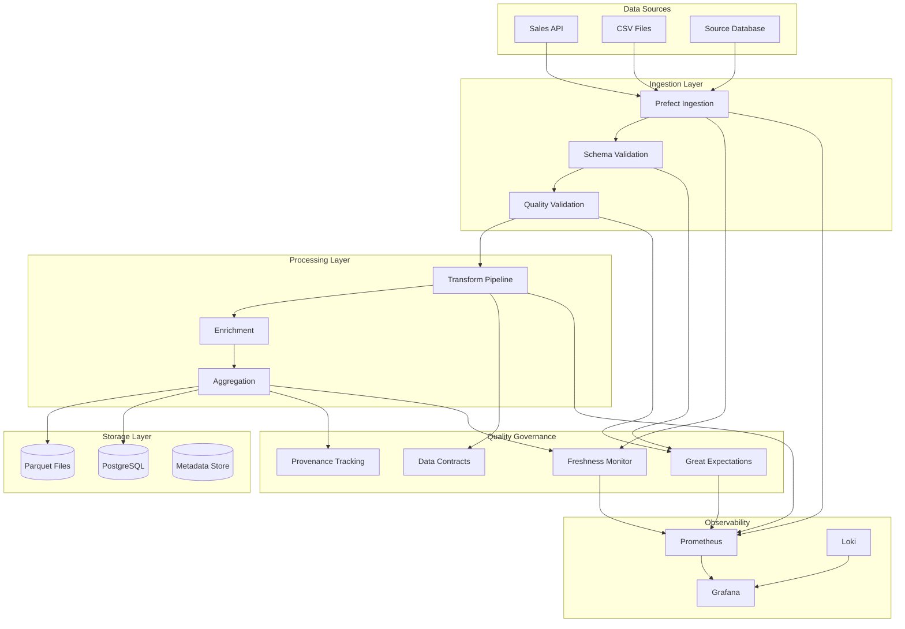

# Data Pipeline with Quality Governance and Observability: A Complete Integration Tutorial

**Objective**: Build a production-ready data pipeline that integrates data quality governance, data validation and contract governance, metadata provenance tracking, data freshness SLAs, and observability. This tutorial demonstrates how to ensure data quality throughout the entire pipeline lifecycle.

This tutorial combines:
- **[Data Quality SLAs, Validation Layers, and Observability](../best-practices/data-governance/data-quality-sla-validation-observability.md)** - Multi-layer validation and quality SLAs
- **[Data Validation and Contract Governance](../best-practices/data-governance/data-validation-and-contract-governance.md)** - Schema validation and data contracts
- **[Metadata Standards, Schema Governance & Data Provenance](../best-practices/data-governance/metadata-provenance-contracts.md)** - Metadata and lineage tracking
- **[Data Freshness, SLA/SLO Governance](../best-practices/data-governance/data-freshness-sla-governance.md)** - Freshness monitoring and SLAs
- **[Observability-Driven Development](../best-practices/operations-monitoring/observability-driven-development.md)** - Telemetry-first data pipelines

## 1) Prerequisites

```bash
# Required tools
docker --version          # >= 20.10
docker compose --version  # >= 2.0
python --version          # >= 3.10
prefect --version         # >= 2.14
duckdb --version          # >= 0.9.0
psql --version           # For PostgreSQL access
curl --version           # For API testing

# Python packages
pip install prefect great-expectations duckdb psycopg2-binary \
    pandas pyarrow prometheus-client opentelemetry-api \
    opentelemetry-sdk opentelemetry-exporter-prometheus
```

**Why**: Data quality governance requires validation frameworks (Great Expectations), data processing (DuckDB, Prefect), and observability (Prometheus, OpenTelemetry) to ensure data quality throughout the pipeline.

## 2) Architecture Overview

We'll build a **Sales Data Pipeline** with comprehensive quality governance:



**Pipeline Stages**:
1. **Ingestion**: Extract data from sources with schema validation
2. **Validation**: Multi-layer quality validation (schema, statistical, business rules)
3. **Transformation**: Data transformation with contract enforcement
4. **Storage**: Store validated data with metadata and provenance
5. **Monitoring**: Continuous quality and freshness monitoring

## 3) Repository Layout

```
data-pipeline-quality/
├── docker-compose.yaml
├── pipelines/
│   ├── ingestion/
│   │   ├── __init__.py
│   │   ├── ingest_sales.py
│   │   └── validate_schema.py
│   ├── transformation/
│   │   ├── __init__.py
│   │   ├── transform_sales.py
│   │   └── enrich_data.py
│   └── quality/
│       ├── __init__.py
│       ├── expectations.py
│       ├── contracts.py
│       └── freshness.py
├── expectations/
│   ├── sales_data_expectations.json
│   └── quality_suite.json
├── contracts/
│   ├── sales_contract.json
│   └── schema_contract.json
├── metadata/
│   ├── __init__.py
│   ├── provenance.py
│   └── lineage.py
├── observability/
│   ├── __init__.py
│   ├── metrics.py
│   ├── tracing.py
│   └── logging.py
├── storage/
│   ├── init.sql
│   └── metadata_schema.sql
└── tests/
    ├── test_validation.py
    └── test_contracts.py
```

## 4) Data Contracts

### 4.1) Schema Contract

Create `contracts/schema_contract.json`:

```json
{
  "name": "sales_data_schema",
  "version": "1.0.0",
  "description": "Schema contract for sales data",
  "schema": {
    "type": "object",
    "required": ["order_id", "customer_id", "product_id", "quantity", "price", "timestamp"],
    "properties": {
      "order_id": {
        "type": "string",
        "pattern": "^ORD-[0-9]{8}$",
        "description": "Order ID in format ORD-XXXXXXXX"
      },
      "customer_id": {
        "type": "string",
        "pattern": "^CUST-[0-9]{6}$",
        "description": "Customer ID in format CUST-XXXXXX"
      },
      "product_id": {
        "type": "string",
        "pattern": "^PROD-[0-9]{6}$",
        "description": "Product ID in format PROD-XXXXXX"
      },
      "quantity": {
        "type": "integer",
        "minimum": 1,
        "maximum": 1000,
        "description": "Quantity ordered"
      },
      "price": {
        "type": "number",
        "minimum": 0.01,
        "maximum": 100000.00,
        "description": "Price per unit"
      },
      "timestamp": {
        "type": "string",
        "format": "date-time",
        "description": "ISO 8601 timestamp"
      },
      "discount": {
        "type": "number",
        "minimum": 0,
        "maximum": 1,
        "default": 0,
        "description": "Discount percentage (0-1)"
      }
    }
  },
  "business_rules": [
    {
      "rule": "total_amount",
      "description": "Total amount must equal quantity * price * (1 - discount)",
      "expression": "total == quantity * price * (1 - discount)"
    },
    {
      "rule": "timestamp_range",
      "description": "Timestamp must be within last 30 days",
      "expression": "timestamp >= now() - 30 days"
    }
  ]
}
```

### 4.2) Quality Contract

Create `contracts/sales_contract.json`:

```json
{
  "name": "sales_data_quality",
  "version": "1.0.0",
  "sla": {
    "freshness": {
      "max_age_minutes": 60,
      "alert_threshold_minutes": 45
    },
    "completeness": {
      "min_percentage": 95.0,
      "alert_threshold": 90.0
    },
    "accuracy": {
      "max_error_rate": 0.01,
      "alert_threshold": 0.005
    },
    "validity": {
      "max_invalid_percentage": 1.0,
      "alert_threshold": 0.5
    }
  },
  "expectations": [
    {
      "expectation_type": "expect_column_values_to_not_be_null",
      "column": "order_id"
    },
    {
      "expectation_type": "expect_column_values_to_be_unique",
      "column": "order_id"
    },
    {
      "expectation_type": "expect_column_values_to_be_between",
      "column": "quantity",
      "min_value": 1,
      "max_value": 1000
    },
    {
      "expectation_type": "expect_column_values_to_be_between",
      "column": "price",
      "min_value": 0.01,
      "max_value": 100000.00
    },
    {
      "expectation_type": "expect_column_values_to_match_regex",
      "column": "order_id",
      "regex": "^ORD-[0-9]{8}$"
    }
  ]
}
```

## 5) Great Expectations Suite

Create `pipelines/quality/expectations.py`:

```python
"""Great Expectations suite for sales data quality."""
import great_expectations as gx
from great_expectations.core import ExpectationSuite
from great_expectations.dataset import PandasDataset

def create_sales_expectation_suite(context: gx.DataContext) -> ExpectationSuite:
    """Create expectation suite for sales data."""
    suite = context.create_expectation_suite(
        expectation_suite_name="sales_data_quality",
        overwrite_existing=True
    )
    
    # Schema expectations
    suite.expect_column_to_exist("order_id")
    suite.expect_column_to_exist("customer_id")
    suite.expect_column_to_exist("product_id")
    suite.expect_column_to_exist("quantity")
    suite.expect_column_to_exist("price")
    suite.expect_column_to_exist("timestamp")
    
    # Data type expectations
    suite.expect_column_values_to_be_of_type("order_id", "str")
    suite.expect_column_values_to_be_of_type("customer_id", "str")
    suite.expect_column_values_to_be_of_type("quantity", "int")
    suite.expect_column_values_to_be_of_type("price", "float")
    suite.expect_column_values_to_be_of_type("timestamp", "datetime64[ns]")
    
    # Completeness expectations
    suite.expect_column_values_to_not_be_null("order_id")
    suite.expect_column_values_to_not_be_null("customer_id")
    suite.expect_column_values_to_not_be_null("product_id")
    suite.expect_column_values_to_not_be_null("quantity")
    suite.expect_column_values_to_not_be_null("price")
    suite.expect_column_values_to_not_be_null("timestamp")
    
    # Uniqueness expectations
    suite.expect_column_values_to_be_unique("order_id")
    
    # Range expectations
    suite.expect_column_values_to_be_between(
        "quantity",
        min_value=1,
        max_value=1000
    )
    suite.expect_column_values_to_be_between(
        "price",
        min_value=0.01,
        max_value=100000.00
    )
    
    # Pattern expectations
    suite.expect_column_values_to_match_regex(
        "order_id",
        regex=r"^ORD-[0-9]{8}$"
    )
    suite.expect_column_values_to_match_regex(
        "customer_id",
        regex=r"^CUST-[0-9]{6}$"
    )
    suite.expect_column_values_to_match_regex(
        "product_id",
        regex=r"^PROD-[0-9]{6}$"
    )
    
    # Statistical expectations
    suite.expect_column_mean_to_be_between(
        "price",
        min_value=10.0,
        max_value=1000.0
    )
    suite.expect_column_std_to_be_between(
        "price",
        min_value=5.0,
        max_value=500.0
    )
    
    # Cross-column expectations
    suite.expect_multicolumn_sum_to_equal(
        columns=["quantity", "price"],
        sum_total=1000000.0,
        tolerance=0.1
    )
    
    return suite


def validate_dataframe(df: PandasDataset, suite: ExpectationSuite) -> dict:
    """Validate DataFrame against expectation suite."""
    validator = gx.from_pandas(df, expectation_suite=suite)
    results = validator.validate()
    
    return {
        "success": results.success,
        "statistics": results.statistics,
        "results": [
            {
                "expectation_type": result.expectation_config.expectation_type,
                "success": result.success,
                "result": result.result
            }
            for result in results.results
        ]
    }
```

## 6) Data Validation Pipeline

Create `pipelines/ingestion/validate_schema.py`:

```python
"""Schema validation with contracts."""
import json
import jsonschema
from typing import Dict, Any, List
from datetime import datetime
import pandas as pd

from observability.metrics import validation_metrics
from observability.tracing import trace_operation


class SchemaValidator:
    """Validates data against schema contracts."""
    
    def __init__(self, contract_path: str):
        with open(contract_path) as f:
            self.contract = json.load(f)
        self.schema = self.contract["schema"]
        self.validator = jsonschema.Draft7Validator(self.schema)
    
    @trace_operation("validate_schema")
    def validate_record(self, record: Dict[str, Any]) -> tuple[bool, List[str]]:
        """Validate a single record against schema."""
        errors = []
        
        try:
            self.validator.validate(record)
            validation_metrics.records_validated.labels(status="valid").inc()
            return True, []
        except jsonschema.ValidationError as e:
            errors.append(f"Schema validation failed: {e.message}")
            validation_metrics.records_validated.labels(status="invalid").inc()
            return False, errors
        except Exception as e:
            errors.append(f"Validation error: {str(e)}")
            validation_metrics.records_validated.labels(status="error").inc()
            return False, errors
    
    @trace_operation("validate_batch")
    def validate_batch(self, records: List[Dict[str, Any]]) -> Dict[str, Any]:
        """Validate a batch of records."""
        results = {
            "total": len(records),
            "valid": 0,
            "invalid": 0,
            "errors": []
        }
        
        for i, record in enumerate(records):
            is_valid, errors = self.validate_record(record)
            if is_valid:
                results["valid"] += 1
            else:
                results["invalid"] += 1
                results["errors"].append({
                    "index": i,
                    "record": record,
                    "errors": errors
                })
        
        # Calculate validity percentage
        validity_pct = (results["valid"] / results["total"]) * 100
        validation_metrics.validity_percentage.observe(validity_pct)
        
        # Check SLA
        if validity_pct < 95.0:
            validation_metrics.sla_violations.labels(
                metric="validity",
                threshold="95%"
            ).inc()
        
        return results
    
    def validate_business_rules(self, record: Dict[str, Any]) -> tuple[bool, List[str]]:
        """Validate business rules."""
        errors = []
        
        for rule in self.contract.get("business_rules", []):
            rule_name = rule["rule"]
            expression = rule["expression"]
            
            # Evaluate business rule (simplified)
            try:
                # In production, use a proper expression evaluator
                if rule_name == "total_amount":
                    total = record.get("total", 0)
                    quantity = record.get("quantity", 0)
                    price = record.get("price", 0)
                    discount = record.get("discount", 0)
                    expected = quantity * price * (1 - discount)
                    
                    if abs(total - expected) > 0.01:
                        errors.append(
                            f"Business rule violation: total_amount. "
                            f"Expected {expected}, got {total}"
                        )
            except Exception as e:
                errors.append(f"Error evaluating rule {rule_name}: {str(e)}")
        
        return len(errors) == 0, errors
```

## 7) Provenance Tracking

Create `metadata/provenance.py`:

```python
"""Metadata and provenance tracking."""
from datetime import datetime
from typing import Dict, Any, Optional
import hashlib
import json

from sqlalchemy import create_engine, Column, String, DateTime, JSON, Text
from sqlalchemy.ext.declarative import declarative_base
from sqlalchemy.orm import sessionmaker

Base = declarative_base()


class DataProvenance(Base):
    """Provenance record for data lineage."""
    __tablename__ = "data_provenance"
    
    id = Column(String, primary_key=True)
    dataset_name = Column(String, nullable=False)
    version = Column(String, nullable=False)
    source = Column(String, nullable=False)
    transformation = Column(Text)
    schema_version = Column(String)
    quality_score = Column(String)
    record_count = Column(String)
    checksum = Column(String)
    created_at = Column(DateTime, default=datetime.utcnow)
    metadata = Column(JSON)


class ProvenanceTracker:
    """Tracks data provenance and lineage."""
    
    def __init__(self, database_url: str):
        engine = create_engine(database_url)
        Base.metadata.create_all(engine)
        Session = sessionmaker(bind=engine)
        self.session = Session()
    
    def calculate_checksum(self, data: Any) -> str:
        """Calculate checksum for data."""
        data_str = json.dumps(data, sort_keys=True, default=str)
        return hashlib.sha256(data_str.encode()).hexdigest()
    
    def record_provenance(
        self,
        dataset_name: str,
        version: str,
        source: str,
        transformation: Optional[str] = None,
        schema_version: Optional[str] = None,
        quality_score: Optional[float] = None,
        record_count: Optional[int] = None,
        data: Optional[Any] = None,
        metadata: Optional[Dict[str, Any]] = None
    ) -> str:
        """Record provenance information."""
        provenance_id = f"{dataset_name}_{version}_{datetime.utcnow().isoformat()}"
        
        checksum = None
        if data is not None:
            checksum = self.calculate_checksum(data)
        
        provenance = DataProvenance(
            id=provenance_id,
            dataset_name=dataset_name,
            version=version,
            source=source,
            transformation=transformation,
            schema_version=schema_version,
            quality_score=str(quality_score) if quality_score else None,
            record_count=str(record_count) if record_count else None,
            checksum=checksum,
            metadata=metadata or {}
        )
        
        self.session.add(provenance)
        self.session.commit()
        
        return provenance_id
    
    def get_lineage(self, dataset_name: str, version: str) -> Optional[DataProvenance]:
        """Get lineage information for a dataset."""
        return self.session.query(DataProvenance).filter_by(
            dataset_name=dataset_name,
            version=version
        ).first()
```

## 8) Freshness Monitoring

Create `pipelines/quality/freshness.py`:

```python
"""Data freshness monitoring and SLA enforcement."""
from datetime import datetime, timedelta
from typing import Dict, Any, Optional
import logging

from observability.metrics import freshness_metrics
from observability.tracing import trace_operation

logger = logging.getLogger(__name__)


class FreshnessMonitor:
    """Monitors data freshness and enforces SLAs."""
    
    def __init__(self, sla_config: Dict[str, Any]):
        self.sla_config = sla_config
        self.max_age_minutes = sla_config["freshness"]["max_age_minutes"]
        self.alert_threshold_minutes = sla_config["freshness"]["alert_threshold_minutes"]
    
    @trace_operation("check_freshness")
    def check_freshness(
        self,
        dataset_name: str,
        last_update_time: datetime,
        current_time: Optional[datetime] = None
    ) -> Dict[str, Any]:
        """Check data freshness against SLA."""
        if current_time is None:
            current_time = datetime.utcnow()
        
        age_minutes = (current_time - last_update_time).total_seconds() / 60
        
        result = {
            "dataset": dataset_name,
            "last_update": last_update_time.isoformat(),
            "current_time": current_time.isoformat(),
            "age_minutes": age_minutes,
            "max_age_minutes": self.max_age_minutes,
            "alert_threshold_minutes": self.alert_threshold_minutes,
            "status": "fresh",
            "sla_violation": False
        }
        
        # Record metric
        freshness_metrics.data_age_minutes.labels(
            dataset=dataset_name
        ).set(age_minutes)
        
        # Check SLA
        if age_minutes > self.max_age_minutes:
            result["status"] = "stale"
            result["sla_violation"] = True
            freshness_metrics.sla_violations.labels(
                dataset=dataset_name,
                metric="freshness"
            ).inc()
            logger.error(
                f"Freshness SLA violation for {dataset_name}: "
                f"{age_minutes:.2f} minutes (max: {self.max_age_minutes})"
            )
        elif age_minutes > self.alert_threshold_minutes:
            result["status"] = "warning"
            logger.warning(
                f"Freshness warning for {dataset_name}: "
                f"{age_minutes:.2f} minutes (threshold: {self.alert_threshold_minutes})"
            )
        
        return result
    
    def get_latest_timestamp(self, dataset_name: str) -> Optional[datetime]:
        """Get latest timestamp for a dataset."""
        # In production, query from metadata store
        # For demo, return current time minus some offset
        return datetime.utcnow() - timedelta(minutes=30)
```

## 9) Prefect Pipeline with Quality Gates

Create `pipelines/ingestion/ingest_sales.py`:

```python
"""Prefect pipeline with quality governance."""
from prefect import flow, task
from prefect.tasks import task_inputs
from datetime import datetime
import pandas as pd
import json

from pipelines.ingestion.validate_schema import SchemaValidator
from pipelines.quality.expectations import create_sales_expectation_suite, validate_dataframe
from pipelines.quality.freshness import FreshnessMonitor
from metadata.provenance import ProvenanceTracker
from observability.metrics import pipeline_metrics
from observability.tracing import trace_operation


@task
@trace_operation("extract_data")
def extract_sales_data(source: str) -> pd.DataFrame:
    """Extract sales data from source."""
    # Simulate data extraction
    data = {
        "order_id": ["ORD-12345678", "ORD-12345679"],
        "customer_id": ["CUST-123456", "CUST-123457"],
        "product_id": ["PROD-123456", "PROD-123457"],
        "quantity": [2, 5],
        "price": [29.99, 49.99],
        "timestamp": [datetime.utcnow().isoformat()] * 2
    }
    return pd.DataFrame(data)


@task
@trace_operation("validate_schema")
def validate_schema_task(df: pd.DataFrame, validator: SchemaValidator) -> dict:
    """Validate schema."""
    records = df.to_dict("records")
    results = validator.validate_batch(records)
    return results


@task
@trace_operation("validate_quality")
def validate_quality_task(df: pd.DataFrame, suite) -> dict:
    """Validate data quality with Great Expectations."""
    results = validate_dataframe(df, suite)
    return results


@task
@trace_operation("check_freshness")
def check_freshness_task(monitor: FreshnessMonitor, dataset_name: str) -> dict:
    """Check data freshness."""
    latest_timestamp = monitor.get_latest_timestamp(dataset_name)
    if latest_timestamp:
        return monitor.check_freshness(dataset_name, latest_timestamp)
    return {"status": "unknown"}


@task
@trace_operation("store_data")
def store_data_task(df: pd.DataFrame, output_path: str) -> str:
    """Store validated data."""
    df.to_parquet(output_path, index=False)
    return output_path


@task
@trace_operation("record_provenance")
def record_provenance_task(
    tracker: ProvenanceTracker,
    dataset_name: str,
    version: str,
    source: str,
    quality_results: dict,
    record_count: int
) -> str:
    """Record provenance."""
    provenance_id = tracker.record_provenance(
        dataset_name=dataset_name,
        version=version,
        source=source,
        quality_score=quality_results.get("statistics", {}).get("success_percent"),
        record_count=record_count,
        metadata={"quality_results": quality_results}
    )
    return provenance_id


@flow(name="sales_data_pipeline")
def sales_data_pipeline(
    source: str = "api",
    output_path: str = "data/sales.parquet"
):
    """Main data pipeline with quality governance."""
    pipeline_metrics.pipelines_started.labels(pipeline="sales_data").inc()
    start_time = datetime.utcnow()
    
    try:
        # Initialize components
        validator = SchemaValidator("contracts/schema_contract.json")
        with open("contracts/sales_contract.json") as f:
            sla_config = json.load(f)
        monitor = FreshnessMonitor(sla_config["sla"])
        tracker = ProvenanceTracker("postgresql://localhost/data_quality")
        
        # Create expectation suite
        import great_expectations as gx
        context = gx.get_context()
        suite = create_sales_expectation_suite(context)
        
        # Extract
        df = extract_sales_data(source)
        pipeline_metrics.records_extracted.labels(pipeline="sales_data").inc(len(df))
        
        # Validate schema
        schema_results = validate_schema_task(df, validator)
        if schema_results["invalid"] > 0:
            pipeline_metrics.validation_failures.labels(
                pipeline="sales_data",
                stage="schema"
            ).inc(schema_results["invalid"])
            raise ValueError(f"Schema validation failed: {schema_results['invalid']} invalid records")
        
        # Validate quality
        quality_results = validate_quality_task(df, suite)
        if not quality_results["success"]:
            pipeline_metrics.validation_failures.labels(
                pipeline="sales_data",
                stage="quality"
            ).inc()
            raise ValueError("Quality validation failed")
        
        # Check freshness
        freshness_results = check_freshness_task(monitor, "sales_data")
        if freshness_results.get("sla_violation"):
            pipeline_metrics.sla_violations.labels(
                pipeline="sales_data",
                metric="freshness"
            ).inc()
        
        # Store data
        output_file = store_data_task(df, output_path)
        
        # Record provenance
        provenance_id = record_provenance_task(
            tracker,
            dataset_name="sales_data",
            version="1.0.0",
            source=source,
            quality_results=quality_results,
            record_count=len(df)
        )
        
        duration = (datetime.utcnow() - start_time).total_seconds()
        pipeline_metrics.pipeline_duration.labels(pipeline="sales_data").observe(duration)
        pipeline_metrics.pipelines_completed.labels(pipeline="sales_data").inc()
        
        return {
            "status": "success",
            "output_file": output_file,
            "provenance_id": provenance_id,
            "quality_results": quality_results,
            "freshness": freshness_results
        }
    
    except Exception as e:
        pipeline_metrics.pipelines_failed.labels(pipeline="sales_data").inc()
        raise


if __name__ == "__main__":
    sales_data_pipeline()
```

## 10) Observability Metrics

Create `observability/metrics.py`:

```python
"""Prometheus metrics for data quality."""
from prometheus_client import Counter, Histogram, Gauge

# Pipeline metrics
pipelines_started = Counter(
    "data_pipeline_started_total",
    "Total pipelines started",
    ["pipeline"]
)

pipelines_completed = Counter(
    "data_pipeline_completed_total",
    "Total pipelines completed",
    ["pipeline"]
)

pipelines_failed = Counter(
    "data_pipeline_failed_total",
    "Total pipelines failed",
    ["pipeline"]
)

pipeline_duration = Histogram(
    "data_pipeline_duration_seconds",
    "Pipeline execution duration",
    ["pipeline"],
    buckets=[1, 5, 10, 30, 60, 300, 600]
)

records_extracted = Counter(
    "data_records_extracted_total",
    "Total records extracted",
    ["pipeline"]
)

# Validation metrics
records_validated = Counter(
    "data_records_validated_total",
    "Total records validated",
    ["status"]
)

validity_percentage = Histogram(
    "data_validity_percentage",
    "Percentage of valid records",
    buckets=[0, 50, 75, 90, 95, 98, 99, 99.5, 100]
)

validation_failures = Counter(
    "data_validation_failures_total",
    "Total validation failures",
    ["pipeline", "stage"]
)

# Quality metrics
sla_violations = Counter(
    "data_sla_violations_total",
    "Total SLA violations",
    ["pipeline", "metric"]
)

# Freshness metrics
data_age_minutes = Gauge(
    "data_age_minutes",
    "Age of data in minutes",
    ["dataset"]
)

freshness_sla_violations = Counter(
    "data_freshness_sla_violations_total",
    "Total freshness SLA violations",
    ["dataset"]
)
```

## 11) Testing the Pipeline

### 11.1) Run Pipeline

```bash
# Start Prefect server
prefect server start

# Run pipeline
python -m pipelines.ingestion.ingest_sales

# Or use Prefect CLI
prefect deployment run sales_data_pipeline/default
```

### 11.2) View Metrics

```bash
# Prometheus: http://localhost:9090
# Grafana: http://localhost:3000
```

## 12) Best Practices Integration Summary

This tutorial demonstrates:

1. **Data Quality Governance**: Multi-layer validation (schema, statistical, business rules)
2. **Data Contracts**: JSON Schema contracts with business rule validation
3. **Provenance Tracking**: Complete lineage tracking with checksums and metadata
4. **Freshness Monitoring**: SLA-based freshness monitoring with alerts
5. **Observability**: Comprehensive metrics, tracing, and logging

**Key Integration Points**:
- Validation results feed into provenance metadata
- Freshness checks integrate with pipeline execution
- Quality metrics trigger SLA violation alerts
- Provenance enables data lineage queries

## 13) Next Steps

- Add data quality dashboards in Grafana
- Implement automated data quality reports
- Add data retention policies
- Integrate with data catalog
- Add ML-based anomaly detection

---

*This tutorial demonstrates how multiple best practices integrate to ensure data quality throughout the entire pipeline lifecycle.*

