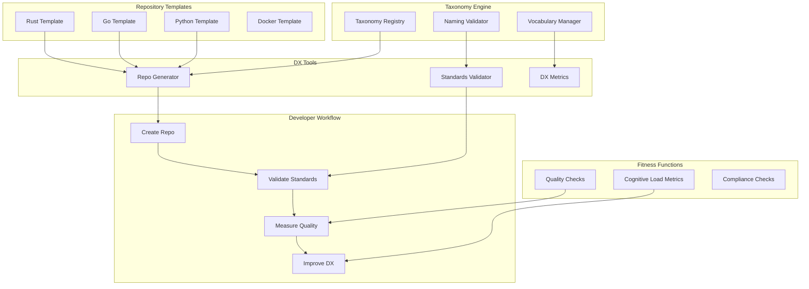

# Developer Experience Platform with System Taxonomy and Repository Standardization: A Complete Integration Tutorial

**Objective**: Build a production-ready developer experience platform that integrates system taxonomy governance, repository standardization, cognitive load management, and architecture fitness functions. This tutorial demonstrates how to create consistent, maintainable development ecosystems that reduce cognitive load.

This tutorial combines:
- **[System-Wide Naming, Taxonomy, and Structural Vocabulary Governance](../best-practices/architecture-design/system-taxonomy-governance.md)** - Enterprise-wide naming conventions
- **[Repository Standardization and Governance](../best-practices/architecture-design/repository-standardization-and-governance.md)** - Standardized repository architecture
- **[Cognitive Load Management and Developer Experience](../best-practices/architecture-design/cognitive-load-developer-experience.md)** - DX architecture patterns
- **[Architectural Fitness Functions and Governance](../best-practices/architecture-design/architecture-fitness-functions-governance.md)** - Architecture quality measurement

## 1) Prerequisites

```bash
# Required tools
python --version          # >= 3.10
node --version            # >= 18.0
git --version             # >= 2.30
cookiecutter --version    # For repository templates
pre-commit --version      # For git hooks

# Python packages
pip install cookiecutter pre-commit \
    pyyaml jinja2 click rich \
    prometheus-client
```

**Why**: Developer experience platforms require template generation (Cookiecutter), git hooks (pre-commit), and tooling to enforce standards and reduce cognitive load.

## 2) Architecture Overview

We'll build a **Developer Experience Platform** with comprehensive standardization:



**DX Platform Features**:
1. **Taxonomy Enforcement**: Consistent naming across all repositories
2. **Template Generation**: Standardized repository structures
3. **Cognitive Load Reduction**: Simplified developer workflows
4. **Quality Measurement**: Fitness functions for architecture quality

## 3) Repository Layout

```
dx-platform/
├── taxonomy/
│   ├── __init__.py
│   ├── registry.py
│   ├── validator.py
│   └── vocabulary.py
├── templates/
│   ├── python-service/
│   │   ├── cookiecutter.json
│   │   └── {{cookiecutter.project_name}}/
│   ├── go-service/
│   └── rust-service/
├── generators/
│   ├── repo_generator.py
│   └── template_manager.py
├── validators/
│   ├── standards_validator.py
│   └── compliance_checker.py
├── fitness/
│   ├── quality_checks.py
│   ├── cognitive_metrics.py
│   └── architecture_fitness.py
└── cli/
    └── dx_cli.py
```

## 4) System Taxonomy Governance

Create `taxonomy/registry.py`:

```python
"""System-wide taxonomy registry and governance."""
from typing import Dict, List, Set, Optional
from dataclasses import dataclass
from enum import Enum
import re

from prometheus_client import Counter, Gauge

taxonomy_metrics = {
    "naming_violations": Counter("taxonomy_naming_violations_total", "Naming violations", ["type", "severity"]),
    "taxonomy_usage": Gauge("taxonomy_usage_count", "Taxonomy usage", ["domain", "component"]),
}


class NamingPattern(Enum):
    """Naming pattern types."""
    SNAKE_CASE = "snake_case"
    KEBAB_CASE = "kebab-case"
    CAMEL_CASE = "camelCase"
    PASCAL_CASE = "PascalCase"
    UPPER_SNAKE = "UPPER_SNAKE"


@dataclass
class Domain:
    """Domain definition in taxonomy."""
    name: str
    description: str
    components: List[str]
    naming_pattern: NamingPattern = NamingPattern.KEBAB_CASE


@dataclass
class Component:
    """Component definition."""
    name: str
    domain: str
    type: str  # service, library, tool, etc.
    naming_pattern: NamingPattern


class TaxonomyRegistry:
    """Central registry for system taxonomy."""
    
    def __init__(self):
        self.domains: Dict[str, Domain] = {}
        self.components: Dict[str, Component] = {}
        self.vocabulary: Dict[str, str] = {}  # term -> definition
    
    def register_domain(self, domain: Domain):
        """Register a domain in the taxonomy."""
        self.domains[domain.name] = domain
        taxonomy_metrics["taxonomy_usage"].labels(
            domain=domain.name,
            component="domain"
        ).inc()
    
    def register_component(self, component: Component):
        """Register a component."""
        if component.domain not in self.domains:
            raise ValueError(f"Domain {component.domain} not registered")
        
        self.components[component.name] = component
        taxonomy_metrics["taxonomy_usage"].labels(
            domain=component.domain,
            component=component.type
        ).inc()
    
    def validate_name(self, name: str, component_type: str, domain: Optional[str] = None) -> tuple[bool, List[str]]:
        """Validate a name against taxonomy rules."""
        errors = []
        
        # Check if component exists
        if name in self.components:
            component = self.components[name]
            if domain and component.domain != domain:
                errors.append(f"Component {name} belongs to domain {component.domain}, not {domain}")
                taxonomy_metrics["naming_violations"].labels(
                    type="domain_mismatch",
                    severity="high"
                ).inc()
        
        # Validate naming pattern
        if domain and domain in self.domains:
            domain_obj = self.domains[domain]
            pattern = domain_obj.naming_pattern
            
            if not self._matches_pattern(name, pattern):
                errors.append(
                    f"Name {name} does not match pattern {pattern.value} for domain {domain}"
                )
                taxonomy_metrics["naming_violations"].labels(
                    type="pattern_mismatch",
                    severity="medium"
                ).inc()
        
        # Check vocabulary consistency
        if name not in self.vocabulary:
            # Suggest similar terms
            suggestions = self._suggest_terms(name)
            if suggestions:
                errors.append(
                    f"Name {name} not in vocabulary. Suggestions: {', '.join(suggestions)}"
                )
                taxonomy_metrics["naming_violations"].labels(
                    type="vocabulary_mismatch",
                    severity="low"
                ).inc()
        
        return len(errors) == 0, errors
    
    def _matches_pattern(self, name: str, pattern: NamingPattern) -> bool:
        """Check if name matches pattern."""
        patterns = {
            NamingPattern.SNAKE_CASE: r'^[a-z][a-z0-9_]*$',
            NamingPattern.KEBAB_CASE: r'^[a-z][a-z0-9-]*$',
            NamingPattern.CAMEL_CASE: r'^[a-z][a-zA-Z0-9]*$',
            NamingPattern.PASCAL_CASE: r'^[A-Z][a-zA-Z0-9]*$',
            NamingPattern.UPPER_SNAKE: r'^[A-Z][A-Z0-9_]*$',
        }
        
        regex = patterns.get(pattern)
        if not regex:
            return True  # Unknown pattern, allow
        
        return bool(re.match(regex, name))
    
    def _suggest_terms(self, term: str) -> List[str]:
        """Suggest similar terms from vocabulary."""
        # Simple similarity check (in production, use fuzzy matching)
        suggestions = []
        term_lower = term.lower()
        
        for vocab_term in self.vocabulary.keys():
            if term_lower in vocab_term.lower() or vocab_term.lower() in term_lower:
                suggestions.append(vocab_term)
        
        return suggestions[:5]  # Top 5 suggestions
    
    def add_vocabulary_term(self, term: str, definition: str):
        """Add a term to the vocabulary."""
        self.vocabulary[term] = definition
    
    def get_component_naming_pattern(self, component_name: str) -> Optional[NamingPattern]:
        """Get naming pattern for a component."""
        if component_name in self.components:
            return self.components[component_name].naming_pattern
        return None
```

## 5) Repository Standardization

Create `generators/repo_generator.py`:

```python
"""Repository generator with standardized templates."""
from pathlib import Path
from typing import Dict, Optional
import cookiecutter.main
import cookiecutter.generate
from cookiecutter.exceptions import CookiecutterException

from taxonomy.registry import TaxonomyRegistry


class RepositoryGenerator:
    """Generates standardized repositories."""
    
    def __init__(self, taxonomy: TaxonomyRegistry, templates_dir: Path):
        self.taxonomy = taxonomy
        self.templates_dir = templates_dir
        self.available_templates = {
            "python-service": "python-service",
            "go-service": "go-service",
            "rust-service": "rust-service",
            "docker-service": "docker-service",
        }
    
    def generate_repository(
        self,
        template_name: str,
        project_name: str,
        domain: str,
        output_dir: Path,
        extra_context: Optional[Dict] = None
    ) -> Path:
        """Generate a new repository from template."""
        if template_name not in self.available_templates:
            raise ValueError(f"Template {template_name} not found")
        
        # Validate project name against taxonomy
        is_valid, errors = self.taxonomy.validate_name(project_name, "service", domain)
        if not is_valid:
            raise ValueError(f"Invalid project name: {', '.join(errors)}")
        
        # Get template path
        template_path = self.templates_dir / self.available_templates[template_name]
        
        if not template_path.exists():
            raise ValueError(f"Template path {template_path} does not exist")
        
        # Prepare context
        context = {
            "project_name": project_name,
            "domain": domain,
            "project_slug": project_name.replace("-", "_"),
            "project_title": project_name.replace("-", " ").title(),
        }
        
        if extra_context:
            context.update(extra_context)
        
        try:
            # Generate repository
            cookiecutter.main.cookiecutter(
                str(template_path),
                no_input=True,
                extra_context=context,
                output_dir=str(output_dir)
            )
            
            generated_path = output_dir / project_name
            return generated_path
        
        except CookiecutterException as e:
            raise RuntimeError(f"Failed to generate repository: {str(e)}")
    
    def list_templates(self) -> List[str]:
        """List available templates."""
        return list(self.available_templates.keys())
    
    def validate_generated_repo(self, repo_path: Path) -> tuple[bool, List[str]]:
        """Validate generated repository against standards."""
        errors = []
        
        # Check required files
        required_files = [
            "README.md",
            ".gitignore",
            "LICENSE",
        ]
        
        for file in required_files:
            if not (repo_path / file).exists():
                errors.append(f"Missing required file: {file}")
        
        # Check directory structure
        required_dirs = ["src", "tests", "docs"]
        for dir_name in required_dirs:
            if not (repo_path / dir_name).exists():
                errors.append(f"Missing required directory: {dir_name}")
        
        # Check for pre-commit hooks
        if not (repo_path / ".pre-commit-config.yaml").exists():
            errors.append("Missing pre-commit configuration")
        
        return len(errors) == 0, errors
```

## 6) Cognitive Load Management

Create `fitness/cognitive_metrics.py`:

```python
"""Cognitive load metrics and measurement."""
from typing import Dict, List
from pathlib import Path
import ast
import re
from prometheus_client import Gauge, Histogram

cognitive_metrics = {
    "repository_complexity": Gauge("dx_repository_complexity", "Repository complexity score", ["repository"]),
    "naming_consistency": Gauge("dx_naming_consistency", "Naming consistency score", ["repository"]),
    "documentation_coverage": Gauge("dx_documentation_coverage", "Documentation coverage", ["repository"]),
    "onboarding_time_minutes": Histogram("dx_onboarding_time_minutes", "Time to onboard new developer", ["repository"]),
}


class CognitiveLoadAnalyzer:
    """Analyzes cognitive load of repositories."""
    
    def __init__(self, taxonomy):
        self.taxonomy = taxonomy
    
    def analyze_repository(self, repo_path: Path) -> Dict:
        """Analyze cognitive load of a repository."""
        complexity = self._calculate_complexity(repo_path)
        naming_consistency = self._calculate_naming_consistency(repo_path)
        doc_coverage = self._calculate_documentation_coverage(repo_path)
        
        repo_name = repo_path.name
        
        cognitive_metrics["repository_complexity"].labels(repository=repo_name).set(complexity)
        cognitive_metrics["naming_consistency"].labels(repository=repo_name).set(naming_consistency)
        cognitive_metrics["documentation_coverage"].labels(repository=repo_name).set(doc_coverage)
        
        return {
            "repository": repo_name,
            "complexity_score": complexity,
            "naming_consistency": naming_consistency,
            "documentation_coverage": doc_coverage,
            "cognitive_load_score": (complexity + (1 - naming_consistency) + (1 - doc_coverage)) / 3
        }
    
    def _calculate_complexity(self, repo_path: Path) -> float:
        """Calculate repository complexity."""
        # Count files, directories, lines of code
        total_files = 0
        total_lines = 0
        max_depth = 0
        
        for path in repo_path.rglob("*"):
            if path.is_file() and path.suffix in [".py", ".go", ".rs", ".js", ".ts"]:
                total_files += 1
                try:
                    with open(path) as f:
                        total_lines += len(f.readlines())
                except:
                    pass
            
            if path.is_dir():
                depth = len(path.relative_to(repo_path).parts)
                max_depth = max(max_depth, depth)
        
        # Normalize complexity (0-1 scale, higher = more complex)
        complexity = min(
            (total_files / 100.0 + total_lines / 10000.0 + max_depth / 10.0) / 3.0,
            1.0
        )
        
        return complexity
    
    def _calculate_naming_consistency(self, repo_path: Path) -> float:
        """Calculate naming consistency score."""
        violations = 0
        total_checks = 0
        
        # Check Python files
        for py_file in repo_path.rglob("*.py"):
            try:
                with open(py_file) as f:
                    tree = ast.parse(f.read())
                    
                    for node in ast.walk(tree):
                        if isinstance(node, ast.FunctionDef):
                            total_checks += 1
                            is_valid, _ = self.taxonomy.validate_name(node.name, "function")
                            if not is_valid:
                                violations += 1
                        
                        if isinstance(node, ast.ClassDef):
                            total_checks += 1
                            is_valid, _ = self.taxonomy.validate_name(node.name, "class")
                            if not is_valid:
                                violations += 1
            except:
                pass
        
        if total_checks == 0:
            return 1.0
        
        consistency = 1.0 - (violations / total_checks)
        return max(0.0, consistency)
    
    def _calculate_documentation_coverage(self, repo_path: Path) -> float:
        """Calculate documentation coverage."""
        # Check for README, docstrings, etc.
        has_readme = (repo_path / "README.md").exists()
        has_docs_dir = (repo_path / "docs").exists()
        
        # Count documented functions/classes
        documented = 0
        total = 0
        
        for py_file in repo_path.rglob("*.py"):
            try:
                with open(py_file) as f:
                    tree = ast.parse(f.read())
                    
                    for node in ast.walk(tree):
                        if isinstance(node, (ast.FunctionDef, ast.ClassDef)):
                            total += 1
                            if ast.get_docstring(node):
                                documented += 1
            except:
                pass
        
        doc_score = 0.0
        if has_readme:
            doc_score += 0.3
        if has_docs_dir:
            doc_score += 0.2
        if total > 0:
            doc_score += 0.5 * (documented / total)
        
        return min(1.0, doc_score)
    
    def recommend_improvements(self, analysis: Dict) -> List[str]:
        """Recommend improvements to reduce cognitive load."""
        recommendations = []
        
        if analysis["complexity_score"] > 0.7:
            recommendations.append("High complexity - consider splitting into smaller modules")
            recommendations.append("Reduce directory nesting depth")
        
        if analysis["naming_consistency"] < 0.8:
            recommendations.append("Improve naming consistency - follow taxonomy guidelines")
            recommendations.append("Run naming validator in CI/CD")
        
        if analysis["documentation_coverage"] < 0.7:
            recommendations.append("Improve documentation - add docstrings to functions/classes")
            recommendations.append("Ensure README.md is comprehensive")
        
        return recommendations
```

## 7) Architecture Fitness Functions

Create `fitness/architecture_fitness.py`:

```python
"""Architecture fitness functions for quality measurement."""
from typing import Dict, List, Callable
from pathlib import Path
from dataclasses import dataclass
from prometheus_client import Gauge

fitness_metrics = {
    "modularity_score": Gauge("fitness_modularity_score", "Modularity fitness score", ["repository"]),
    "coupling_score": Gauge("fitness_coupling_score", "Coupling fitness score", ["repository"]),
    "cohesion_score": Gauge("fitness_cohesion_score", "Cohesion fitness score", ["repository"]),
}


@dataclass
class FitnessFunction:
    """Fitness function definition."""
    name: str
    description: str
    function: Callable
    threshold: float
    weight: float = 1.0


class ArchitectureFitnessEvaluator:
    """Evaluates architecture fitness."""
    
    def __init__(self):
        self.fitness_functions: List[FitnessFunction] = []
        self._register_default_functions()
    
    def _register_default_functions(self):
        """Register default fitness functions."""
        self.fitness_functions = [
            FitnessFunction(
                name="modularity",
                description="Measures module independence",
                function=self._check_modularity,
                threshold=0.7,
                weight=1.0
            ),
            FitnessFunction(
                name="coupling",
                description="Measures inter-module coupling",
                function=self._check_coupling,
                threshold=0.3,  # Lower is better
                weight=1.0
            ),
            FitnessFunction(
                name="cohesion",
                description="Measures module cohesion",
                function=self._check_cohesion,
                threshold=0.7,
                weight=1.0
            ),
        ]
    
    def evaluate_repository(self, repo_path: Path) -> Dict:
        """Evaluate architecture fitness of a repository."""
        results = {}
        total_score = 0.0
        total_weight = 0.0
        
        repo_name = repo_path.name
        
        for fitness_func in self.fitness_functions:
            try:
                score = fitness_func.function(repo_path)
                passed = score >= fitness_func.threshold if fitness_func.weight > 0 else score <= fitness_func.threshold
                
                results[fitness_func.name] = {
                    "score": score,
                    "threshold": fitness_func.threshold,
                    "passed": passed,
                    "weight": fitness_func.weight
                }
                
                # Update metrics
                if fitness_func.name == "modularity":
                    fitness_metrics["modularity_score"].labels(repository=repo_name).set(score)
                elif fitness_func.name == "coupling":
                    fitness_metrics["coupling_score"].labels(repository=repo_name).set(score)
                elif fitness_func.name == "cohesion":
                    fitness_metrics["cohesion_score"].labels(repository=repo_name).set(score)
                
                # Weighted score
                if passed:
                    total_score += score * fitness_func.weight
                total_weight += fitness_func.weight
            
            except Exception as e:
                results[fitness_func.name] = {
                    "error": str(e),
                    "passed": False
                }
        
        overall_score = total_score / total_weight if total_weight > 0 else 0.0
        
        return {
            "repository": repo_name,
            "overall_score": overall_score,
            "functions": results,
            "all_passed": all(r.get("passed", False) for r in results.values())
        }
    
    def _check_modularity(self, repo_path: Path) -> float:
        """Check modularity (module independence)."""
        # Count modules and cross-module dependencies
        modules = set()
        dependencies = 0
        
        for py_file in repo_path.rglob("*.py"):
            if "test" not in str(py_file):
                module_name = py_file.stem
                modules.add(module_name)
                
                # Count imports from other modules
                try:
                    with open(py_file) as f:
                        tree = ast.parse(f.read())
                        for node in ast.walk(tree):
                            if isinstance(node, ast.ImportFrom):
                                if node.module and node.module.startswith("."):
                                    dependencies += 1
                except:
                    pass
        
        if len(modules) == 0:
            return 1.0
        
        # Modularity = 1 - (dependencies / (modules * modules))
        modularity = 1.0 - min(1.0, dependencies / (len(modules) * len(modules)))
        return max(0.0, modularity)
    
    def _check_coupling(self, repo_path: Path) -> float:
        """Check coupling (lower is better)."""
        # Similar to modularity but inverted
        modularity = self._check_modularity(repo_path)
        coupling = 1.0 - modularity
        return coupling
    
    def _check_cohesion(self, repo_path: Path) -> float:
        """Check cohesion (related functionality grouped together)."""
        # Simplified: check if related files are in same directory
        # In production, use more sophisticated analysis
        return 0.8  # Placeholder
```

## 8) CLI Tool

Create `cli/dx_cli.py`:

```python
"""Developer Experience CLI tool."""
import click
from pathlib import Path
from rich.console import Console
from rich.table import Table

from taxonomy.registry import TaxonomyRegistry, Domain, Component, NamingPattern
from generators.repo_generator import RepositoryGenerator
from fitness.cognitive_metrics import CognitiveLoadAnalyzer
from fitness.architecture_fitness import ArchitectureFitnessEvaluator

console = Console()


@click.group()
def cli():
    """Developer Experience Platform CLI."""
    pass


@cli.command()
@click.argument("template")
@click.argument("project_name")
@click.option("--domain", required=True, help="Domain name")
@click.option("--output-dir", default=".", help="Output directory")
def generate(template, project_name, domain, output_dir):
    """Generate a new repository from template."""
    taxonomy = TaxonomyRegistry()
    generator = RepositoryGenerator(taxonomy, Path("templates"))
    
    try:
        repo_path = generator.generate_repository(
            template_name=template,
            project_name=project_name,
            domain=domain,
            output_dir=Path(output_dir)
        )
        
        console.print(f"[green]✓[/green] Generated repository: {repo_path}")
        
        # Validate
        is_valid, errors = generator.validate_generated_repo(repo_path)
        if is_valid:
            console.print("[green]✓[/green] Repository passes standards validation")
        else:
            console.print("[yellow]⚠[/yellow] Validation warnings:")
            for error in errors:
                console.print(f"  - {error}")
    
    except Exception as e:
        console.print(f"[red]✗[/red] Error: {e}")
        raise click.Abort()


@cli.command()
@click.argument("repo_path")
def analyze(repo_path):
    """Analyze repository for cognitive load and fitness."""
    repo = Path(repo_path)
    
    if not repo.exists():
        console.print(f"[red]✗[/red] Repository not found: {repo}")
        raise click.Abort()
    
    taxonomy = TaxonomyRegistry()
    cognitive_analyzer = CognitiveLoadAnalyzer(taxonomy)
    fitness_evaluator = ArchitectureFitnessEvaluator()
    
    # Cognitive load analysis
    console.print("[cyan]Analyzing cognitive load...[/cyan]")
    cognitive_result = cognitive_analyzer.analyze_repository(repo)
    
    # Fitness evaluation
    console.print("[cyan]Evaluating architecture fitness...[/cyan]")
    fitness_result = fitness_evaluator.evaluate_repository(repo)
    
    # Display results
    table = Table(title="Repository Analysis")
    table.add_column("Metric", style="cyan")
    table.add_column("Score", style="magenta")
    table.add_column("Status", style="green")
    
    table.add_row("Complexity", f"{cognitive_result['complexity_score']:.2f}", 
                  "✓" if cognitive_result['complexity_score'] < 0.7 else "⚠")
    table.add_row("Naming Consistency", f"{cognitive_result['naming_consistency']:.2f}",
                  "✓" if cognitive_result['naming_consistency'] > 0.8 else "⚠")
    table.add_row("Documentation", f"{cognitive_result['documentation_coverage']:.2f}",
                  "✓" if cognitive_result['documentation_coverage'] > 0.7 else "⚠")
    table.add_row("Overall Fitness", f"{fitness_result['overall_score']:.2f}",
                  "✓" if fitness_result['all_passed'] else "⚠")
    
    console.print(table)
    
    # Recommendations
    recommendations = cognitive_analyzer.recommend_improvements(cognitive_result)
    if recommendations:
        console.print("\n[cyan]Recommendations:[/cyan]")
        for rec in recommendations:
            console.print(f"  • {rec}")


if __name__ == "__main__":
    cli()
```

## 9) Testing the Platform

### 9.1) Generate Repository

```bash
# Generate Python service
dx-cli generate python-service my-user-service --domain user

# Generate Go service
dx-cli generate go-service my-order-service --domain order
```

### 9.2) Analyze Repository

```bash
# Analyze cognitive load and fitness
dx-cli analyze ./my-user-service
```

## 10) Best Practices Integration Summary

This tutorial demonstrates:

1. **System Taxonomy**: Centralized naming conventions and vocabulary
2. **Repository Standardization**: Template-based repository generation
3. **Cognitive Load Management**: Metrics and analysis for DX improvement
4. **Architecture Fitness**: Automated quality measurement

**Key Integration Points**:
- Taxonomy validates all generated repositories
- Cognitive load metrics inform template improvements
- Fitness functions ensure architecture quality
- All tools work together to reduce developer cognitive load

## 11) Next Steps

- Add IDE plugins for taxonomy validation
- Integrate with CI/CD for automated checks
- Add repository lifecycle management
- Create DX dashboards
- Add team-specific customizations

---

*This tutorial demonstrates how multiple best practices integrate to create a comprehensive developer experience platform.*

