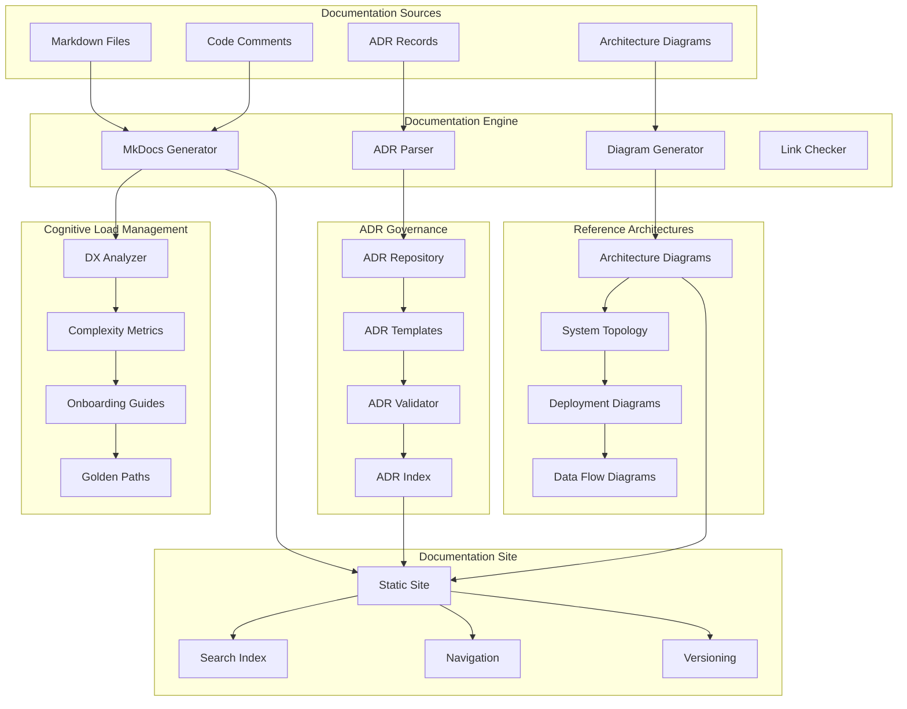

# Documentation-Driven Development with ADR Governance and Reference Architectures: A Complete Integration Tutorial

**Objective**: Build a comprehensive documentation-driven development platform that integrates documentation best practices, ADR (Architecture Decision Records) governance, reference architecture diagrams, and cognitive load management. This tutorial demonstrates how to build self-documenting systems that minimize cognitive load and maximize developer productivity.

This tutorial combines:
- **[Documentation Best Practices](../../best-practices/architecture-design/documentation.md)** - Writing and organizing useful documentation
- **[ADR and Technical Decision Governance](../../best-practices/architecture-design/adr-decision-governance.md)** - Architecture Decision Records
- **[Reference Architecture Diagrams](../../best-practices/architecture-design/reference-architecture-diagrams.md)** - System documentation
- **[Cognitive Load Management and Developer Experience](../../best-practices/architecture-design/cognitive-load-developer-experience.md)** - Developer experience optimization

## 1) Prerequisites

```bash
# Required tools
python --version          # >= 3.10
node --version            # >= 18.0
git --version             # >= 2.30
mkdocs --version          # Documentation generator
mermaid-cli --version      # Diagram generation

# Python packages
pip install mkdocs mkdocs-material \
    mkdocs-mermaid2-plugin \
    mkdocs-git-revision-date-localized-plugin \
    mkdocs-macros-plugin \
    pymdown-extensions \
    markdown-include

# Node packages
npm install -g @mermaid-js/mermaid-cli \
    d3-graphviz \
    graphviz
```

**Why**: Documentation-driven development requires documentation generators (MkDocs), diagram tools (Mermaid), ADR management, and cognitive load optimization to create maintainable, discoverable documentation.

## 2) Architecture Overview

We'll build a **Documentation Platform** with comprehensive governance:



**Platform Capabilities**:
1. **Documentation Generation**: Automated documentation from multiple sources
2. **ADR Governance**: Structured decision records with validation
3. **Reference Architectures**: Visual system documentation
4. **Cognitive Load Management**: Optimized developer experience

## 3) Repository Layout

```
documentation-platform/
├── mkdocs.yml
├── docs/
│   ├── index.md
│   ├── getting-started.md
│   ├── architecture/
│   │   ├── overview.md
│   │   ├── system-topology.md
│   │   └── deployment.md
│   ├── adr/
│   │   ├── index.md
│   │   ├── 0001-template-standard.md
│   │   ├── 0002-use-protobuf.md
│   │   └── 0003-adopt-kafka.md
│   └── guides/
│       ├── onboarding.md
│       └── golden-paths.md
├── scripts/
│   ├── generate_docs.sh
│   ├── validate_adr.py
│   ├── generate_diagrams.py
│   └── check_links.py
├── templates/
│   ├── adr-template.md
│   └── architecture-template.md
└── tools/
    ├── adr_manager.py
    ├── diagram_generator.py
    └── dx_analyzer.py
```

## 4) MkDocs Configuration

Create `mkdocs.yml`:

```yaml
site_name: Documentation Platform
site_description: Comprehensive documentation with ADR governance
site_author: Engineering Team
site_url: https://docs.example.com

repo_name: company/documentation-platform
repo_url: https://github.com/company/documentation-platform
edit_uri: edit/main/docs/

theme:
  name: material
  palette:
    - scheme: default
      primary: blue
      accent: blue
      toggle:
        icon: material/brightness-7
        name: Switch to dark mode
    - scheme: slate
      primary: blue
      accent: blue
      toggle:
        icon: material/brightness-4
        name: Switch to light mode
  features:
    - navigation.tabs
    - navigation.sections
    - navigation.expand
    - navigation.top
    - search.suggest
    - search.highlight
    - content.code.annotate
    - content.code.copy

markdown_extensions:
  - pymdownx.highlight:
      anchor_linenums: true
  - pymdownx.inlinehilite
  - pymdownx.snippets:
      auto_append:
        - docs/macros.md
  - pymdownx.superfences:
      custom_fences:
        - name: mermaid
          class: mermaid
          format: !!python/name:pymdownx.superfences.fence_code_format
  - pymdownx.tabbed:
      alternate_style: true
  - pymdownx.tasklist:
      custom_checkbox: true
  - admonition
  - pymdownx.details
  - attr_list
  - md_in_html
  - tables
  - toc:
      permalink: true

plugins:
  - search
  - git-revision-date-localized:
      enable_creation_date: true
  - macros:
      include_dir: docs
  - mermaid2:
      arguments:
        theme: default
        themeVariables:
          primaryColor: '#2196F3'
          primaryTextColor: '#fff'
          primaryBorderColor: '#1976D2'
          lineColor: '#1976D2'
          secondaryColor: '#006100'
          tertiaryColor: '#fff'

nav:
  - Home: index.md
  - Getting Started: getting-started.md
  - Architecture:
    - Overview: architecture/overview.md
    - System Topology: architecture/system-topology.md
    - Deployment: architecture/deployment.md
  - ADRs:
    - ADR Index: adr/index.md
    - ADR-0001: Template Standard: adr/0001-template-standard.md
    - ADR-0002: Use Protocol Buffers: adr/0002-use-protobuf.md
    - ADR-0003: Adopt Kafka: adr/0003-adopt-kafka.md
  - Guides:
    - Onboarding: guides/onboarding.md
    - Golden Paths: guides/golden-paths.md
```

## 5) ADR Manager

Create `tools/adr_manager.py`:

```python
"""ADR (Architecture Decision Record) manager."""
from typing import List, Dict, Optional, Any
from dataclasses import dataclass, field
from datetime import datetime
from pathlib import Path
import re
import yaml
import frontmatter

from prometheus_client import Counter, Gauge

adr_metrics = {
    "adr_created": Counter("adr_created_total", "ADRs created", ["status"]),
    "adr_updated": Counter("adr_updated_total", "ADRs updated"),
    "adr_superseded": Counter("adr_superseded_total", "ADRs superseded"),
    "active_adrs": Gauge("active_adrs_count", "Active ADRs"),
}


@dataclass
class ADR:
    """Architecture Decision Record."""
    number: int
    title: str
    status: str  # proposed, accepted, rejected, deprecated, superseded
    date: datetime
    deciders: List[str]
    context: str
    decision: str
    consequences: str
    alternatives: List[Dict[str, str]] = field(default_factory=list)
    related_adrs: List[int] = field(default_factory=list)
    superseded_by: Optional[int] = None
    tags: List[str] = field(default_factory=list)
    content: str = ""


class ADRManager:
    """Manages Architecture Decision Records."""
    
    def __init__(self, adr_directory: Path):
        self.adr_directory = Path(adr_directory)
        self.adr_directory.mkdir(parents=True, exist_ok=True)
        self.adrs: Dict[int, ADR] = {}
        self._load_adrs()
    
    def _load_adrs(self):
        """Load all ADRs from directory."""
        for file_path in self.adr_directory.glob("*.md"):
            if file_path.stem.startswith("0000") or file_path.stem == "index":
                continue
            
            try:
                adr = self._parse_adr_file(file_path)
                if adr:
                    self.adrs[adr.number] = adr
            except Exception as e:
                logging.error(f"Failed to parse ADR {file_path}: {e}")
        
        adr_metrics["active_adrs"].set(len([a for a in self.adrs.values() if a.status == "accepted"]))
    
    def _parse_adr_file(self, file_path: Path) -> Optional[ADR]:
        """Parse ADR from markdown file."""
        with open(file_path, 'r') as f:
            post = frontmatter.load(f)
        
        metadata = post.metadata
        content = post.content
        
        # Extract ADR number from filename
        match = re.match(r'(\d+)-', file_path.stem)
        if not match:
            return None
        
        number = int(match.group(1))
        
        # Parse content sections
        context = self._extract_section(content, "Context")
        decision = self._extract_section(content, "Decision")
        consequences = self._extract_section(content, "Consequences")
        alternatives = self._extract_alternatives(content)
        
        return ADR(
            number=number,
            title=metadata.get("title", file_path.stem),
            status=metadata.get("status", "proposed"),
            date=datetime.fromisoformat(metadata.get("date", datetime.utcnow().isoformat())),
            deciders=metadata.get("deciders", []),
            context=context,
            decision=decision,
            consequences=consequences,
            alternatives=alternatives,
            related_adrs=metadata.get("related_adrs", []),
            superseded_by=metadata.get("superseded_by"),
            tags=metadata.get("tags", []),
            content=content
        )
    
    def _extract_section(self, content: str, section_name: str) -> str:
        """Extract section from markdown content."""
        pattern = rf"## {section_name}\s*\n(.*?)(?=\n## |\Z)"
        match = re.search(pattern, content, re.DOTALL)
        return match.group(1).strip() if match else ""
    
    def _extract_alternatives(self, content: str) -> List[Dict[str, str]]:
        """Extract alternatives from content."""
        alternatives = []
        
        # Look for alternatives section
        pattern = r"## Alternatives\s*\n(.*?)(?=\n## |\Z)"
        match = re.search(pattern, content, re.DOTALL)
        if match:
            alt_section = match.group(1)
            
            # Extract each alternative
            alt_pattern = r"### (.*?)\s*\n(.*?)(?=\n### |\Z)"
            for alt_match in re.finditer(alt_pattern, alt_section, re.DOTALL):
                alternatives.append({
                    "name": alt_match.group(1).strip(),
                    "description": alt_match.group(2).strip()
                })
        
        return alternatives
    
    def create_adr(
        self,
        title: str,
        context: str,
        decision: str,
        consequences: str,
        deciders: List[str],
        alternatives: Optional[List[Dict[str, str]]] = None,
        tags: Optional[List[str]] = None
    ) -> ADR:
        """Create a new ADR."""
        # Get next ADR number
        next_number = max(self.adrs.keys(), default=0) + 1
        
        adr = ADR(
            number=next_number,
            title=title,
            status="proposed",
            date=datetime.utcnow(),
            deciders=deciders,
            context=context,
            decision=decision,
            consequences=consequences,
            alternatives=alternatives or [],
            tags=tags or []
        )
        
        # Write ADR file
        self._write_adr_file(adr)
        
        self.adrs[adr.number] = adr
        adr_metrics["adr_created"].labels(status="proposed").inc()
        
        return adr
    
    def _write_adr_file(self, adr: ADR):
        """Write ADR to file."""
        file_path = self.adr_directory / f"{adr.number:04d}-{self._slugify(adr.title)}.md"
        
        # Generate frontmatter
        frontmatter_data = {
            "title": adr.title,
            "status": adr.status,
            "date": adr.date.isoformat(),
            "deciders": adr.deciders,
            "tags": adr.tags
        }
        
        if adr.related_adrs:
            frontmatter_data["related_adrs"] = adr.related_adrs
        
        if adr.superseded_by:
            frontmatter_data["superseded_by"] = adr.superseded_by
        
        # Generate content
        content = f"""# {adr.number:04d}. {adr.title}

**Status**: {adr.status.title()}  
**Date**: {adr.date.strftime('%Y-%m-%d')}  
**Deciders**: {', '.join(adr.deciders)}

## Context

{adr.context}

## Decision

{adr.decision}

## Consequences

{adr.consequences}
"""
        
        if adr.alternatives:
            content += "\n## Alternatives\n\n"
            for alt in adr.alternatives:
                content += f"### {alt['name']}\n\n{alt['description']}\n\n"
        
        if adr.related_adrs:
            content += "\n## Related ADRs\n\n"
            for related_num in adr.related_adrs:
                related_adr = self.adrs.get(related_num)
                if related_adr:
                    content += f"- [{related_num:04d}. {related_adr.title}]({related_num:04d}-{self._slugify(related_adr.title)}.md)\n"
        
        # Write file with frontmatter
        post = frontmatter.Post(content, **frontmatter_data)
        with open(file_path, 'wb') as f:
            frontmatter.dump(post, f)
    
    def _slugify(self, text: str) -> str:
        """Convert text to URL-friendly slug."""
        text = text.lower()
        text = re.sub(r'[^\w\s-]', '', text)
        text = re.sub(r'[-\s]+', '-', text)
        return text.strip('-')
    
    def update_adr_status(self, adr_number: int, new_status: str):
        """Update ADR status."""
        adr = self.adrs.get(adr_number)
        if not adr:
            raise ValueError(f"ADR {adr_number} not found")
        
        adr.status = new_status
        self._write_adr_file(adr)
        adr_metrics["adr_updated"].inc()
    
    def supersede_adr(self, old_adr_number: int, new_adr_number: int):
        """Mark ADR as superseded by another."""
        old_adr = self.adrs.get(old_adr_number)
        if not old_adr:
            raise ValueError(f"ADR {old_adr_number} not found")
        
        old_adr.status = "superseded"
        old_adr.superseded_by = new_adr_number
        
        new_adr = self.adrs.get(new_adr_number)
        if new_adr:
            new_adr.related_adrs.append(old_adr_number)
        
        self._write_adr_file(old_adr)
        if new_adr:
            self._write_adr_file(new_adr)
        
        adr_metrics["adr_superseded"].inc()
    
    def generate_index(self) -> str:
        """Generate ADR index markdown."""
        index_lines = [
            "# Architecture Decision Records (ADRs)",
            "",
            "This directory contains Architecture Decision Records (ADRs) for this project.",
            "",
            "## ADR Index",
            "",
            "| Number | Title | Status | Date | Deciders |",
            "|--------|-------|--------|------|----------|"
        ]
        
        for adr in sorted(self.adrs.values(), key=lambda a: a.number):
            status_badge = self._status_badge(adr.status)
            date_str = adr.date.strftime('%Y-%m-%d')
            deciders_str = ', '.join(adr.deciders[:2])  # Limit display
            if len(adr.deciders) > 2:
                deciders_str += f" +{len(adr.deciders) - 2}"
            
            index_lines.append(
                f"| [{adr.number:04d}]({adr.number:04d}-{self._slugify(adr.title)}.md) | "
                f"{adr.title} | {status_badge} | {date_str} | {deciders_str} |"
            )
        
        return "\n".join(index_lines)
    
    def _status_badge(self, status: str) -> str:
        """Generate status badge."""
        badges = {
            "proposed": "🟡 Proposed",
            "accepted": "✅ Accepted",
            "rejected": "❌ Rejected",
            "deprecated": "⚠️ Deprecated",
            "superseded": "🔄 Superseded"
        }
        return badges.get(status, status)
    
    def validate_adr(self, adr_number: int) -> List[str]:
        """Validate ADR structure and content."""
        errors = []
        adr = self.adrs.get(adr_number)
        
        if not adr:
            errors.append(f"ADR {adr_number} not found")
            return errors
        
        # Check required fields
        if not adr.context:
            errors.append("Context section is required")
        
        if not adr.decision:
            errors.append("Decision section is required")
        
        if not adr.consequences:
            errors.append("Consequences section is required")
        
        if not adr.deciders:
            errors.append("At least one decider is required")
        
        # Check status
        if adr.status not in ["proposed", "accepted", "rejected", "deprecated", "superseded"]:
            errors.append(f"Invalid status: {adr.status}")
        
        return errors
```

## 6) Diagram Generator

Create `tools/diagram_generator.py`:

```python
"""Diagram generator for reference architectures."""
from typing import Dict, List, Optional
from pathlib import Path
import subprocess
import json

from prometheus_client import Counter

diagram_metrics = {
    "diagrams_generated": Counter("diagrams_generated_total", "Diagrams generated", ["diagram_type"]),
}


class DiagramGenerator:
    """Generates architecture diagrams."""
    
    def __init__(self, output_directory: Path):
        self.output_directory = Path(output_directory)
        self.output_directory.mkdir(parents=True, exist_ok=True)
    
    def generate_system_topology(
        self,
        services: List[Dict[str, Any]],
        connections: List[Dict[str, str]],
        output_file: str = "system-topology"
    ) -> str:
        """Generate system topology diagram."""
        mermaid_code = """graph TB
"""
        
        # Add services
        for service in services:
            service_id = service["id"].replace("-", "_")
            service_name = service["name"]
            service_type = service.get("type", "service")
            
            mermaid_code += f'    {service_id}["{service_name}<br/>{service_type}"]\n'
        
        # Add connections
        for conn in connections:
            from_id = conn["from"].replace("-", "_")
            to_id = conn["to"].replace("-", "_")
            label = conn.get("label", "")
            
            mermaid_code += f'    {from_id} -->|"{label}"| {to_id}\n'
        
        # Write mermaid file
        mermaid_file = self.output_directory / f"{output_file}.mmd"
        with open(mermaid_file, 'w') as f:
            f.write(mermaid_code)
        
        # Generate PNG/SVG
        self._render_mermaid(mermaid_file, output_file)
        
        diagram_metrics["diagrams_generated"].labels(diagram_type="system_topology").inc()
        
        return mermaid_code
    
    def generate_deployment_diagram(
        self,
        environments: List[Dict[str, Any]],
        output_file: str = "deployment"
    ) -> str:
        """Generate deployment diagram."""
        mermaid_code = """graph TB
    subgraph "Production"
"""
        
        for env in environments:
            env_name = env["name"]
            services = env.get("services", [])
            
            mermaid_code += f'    subgraph "{env_name}"\n'
            for service in services:
                service_id = service["id"].replace("-", "_")
                mermaid_code += f'        {service_id}["{service["name"]}"]\n'
            mermaid_code += "    end\n"
        
        mermaid_code += "```"
        
        # Write and render
        mermaid_file = self.output_directory / f"{output_file}.mmd"
        with open(mermaid_file, 'w') as f:
            f.write(mermaid_code)
        
        self._render_mermaid(mermaid_file, output_file)
        
        diagram_metrics["diagrams_generated"].labels(diagram_type="deployment").inc()
        
        return mermaid_code
    
    def generate_data_flow(
        self,
        data_sources: List[Dict[str, Any]],
        transformations: List[Dict[str, Any]],
        data_sinks: List[Dict[str, Any]],
        output_file: str = "data-flow"
    ) -> str:
        """Generate data flow diagram."""
        mermaid_code = """flowchart LR
"""
        
        # Add sources
        for source in data_sources:
            source_id = source["id"].replace("-", "_")
            mermaid_code += f'    {source_id}["{source["name"]}<br/>Source"]\n'
        
        # Add transformations
        for trans in transformations:
            trans_id = trans["id"].replace("-", "_")
            mermaid_code += f'    {trans_id}["{trans["name"]}<br/>Transform"]\n'
        
        # Add sinks
        for sink in data_sinks:
            sink_id = sink["id"].replace("-", "_")
            mermaid_code += f'    {sink_id}["{sink["name"]}<br/>Sink"]\n'
        
        # Add connections (simplified)
        for source in data_sources:
            for trans in transformations:
                if trans.get("input") == source["id"]:
                    source_id = source["id"].replace("-", "_")
                    trans_id = trans["id"].replace("-", "_")
                    mermaid_code += f'    {source_id} --> {trans_id}\n'
        
        for trans in transformations:
            for sink in data_sinks:
                if sink.get("input") == trans["id"]:
                    trans_id = trans["id"].replace("-", "_")
                    sink_id = sink["id"].replace("-", "_")
                    mermaid_code += f'    {trans_id} --> {sink_id}\n'
        
        # Write and render
        mermaid_file = self.output_directory / f"{output_file}.mmd"
        with open(mermaid_file, 'w') as f:
            f.write(mermaid_code)
        
        self._render_mermaid(mermaid_file, output_file)
        
        diagram_metrics["diagrams_generated"].labels(diagram_type="data_flow").inc()
        
        return mermaid_code
    
    def _render_mermaid(self, mermaid_file: Path, output_name: str):
        """Render Mermaid diagram to PNG/SVG."""
        try:
            # Generate PNG
            subprocess.run([
                "mmdc",
                "-i", str(mermaid_file),
                "-o", str(self.output_directory / f"{output_name}.png"),
                "-w", "1920",
                "-H", "1080"
            ], check=True)
            
            # Generate SVG
            subprocess.run([
                "mmdc",
                "-i", str(mermaid_file),
                "-o", str(self.output_directory / f"{output_name}.svg"),
                "-t", "default"
            ], check=True)
        except subprocess.CalledProcessError as e:
            logging.error(f"Failed to render diagram {mermaid_file}: {e}")
        except FileNotFoundError:
            logging.warning("mmdc (mermaid-cli) not found. Install with: npm install -g @mermaid-js/mermaid-cli")
```

## 7) DX Analyzer

Create `tools/dx_analyzer.py`:

```python
"""Developer Experience (DX) analyzer for cognitive load management."""
from typing import Dict, List, Optional, Any
from pathlib import Path
import ast
import re
from dataclasses import dataclass

from prometheus_client import Gauge

dx_metrics = {
    "documentation_completeness": Gauge("documentation_completeness_percent", "Documentation completeness", ["component"]),
    "onboarding_time_minutes": Gauge("onboarding_time_minutes", "Estimated onboarding time", ["role"]),
    "cognitive_load_score": Gauge("cognitive_load_score", "Cognitive load score", ["component"]),
}


@dataclass
class DXMetrics:
    """Developer Experience metrics."""
    component: str
    documentation_completeness: float
    code_complexity: float
    onboarding_time_minutes: float
    cognitive_load_score: float
    issues: List[str]


class DXAnalyzer:
    """Analyzes developer experience and cognitive load."""
    
    def __init__(self, code_directory: Path, docs_directory: Path):
        self.code_directory = Path(code_directory)
        self.docs_directory = Path(docs_directory)
        self.metrics: Dict[str, DXMetrics] = {}
    
    def analyze_component(self, component_name: str) -> DXMetrics:
        """Analyze DX for a component."""
        # Check documentation
        doc_completeness = self._check_documentation(component_name)
        
        # Check code complexity
        code_complexity = self._check_code_complexity(component_name)
        
        # Estimate onboarding time
        onboarding_time = self._estimate_onboarding_time(component_name, doc_completeness, code_complexity)
        
        # Calculate cognitive load score
        cognitive_load = self._calculate_cognitive_load(doc_completeness, code_complexity)
        
        # Find issues
        issues = self._find_issues(component_name, doc_completeness, code_complexity)
        
        metrics = DXMetrics(
            component=component_name,
            documentation_completeness=doc_completeness,
            code_complexity=code_complexity,
            onboarding_time_minutes=onboarding_time,
            cognitive_load_score=cognitive_load,
            issues=issues
        )
        
        self.metrics[component_name] = metrics
        
        # Update Prometheus metrics
        dx_metrics["documentation_completeness"].labels(component=component_name).set(doc_completeness)
        dx_metrics["onboarding_time_minutes"].labels(role="developer").set(onboarding_time)
        dx_metrics["cognitive_load_score"].labels(component=component_name).set(cognitive_load)
        
        return metrics
    
    def _check_documentation(self, component_name: str) -> float:
        """Check documentation completeness (0-100)."""
        doc_file = self.docs_directory / f"{component_name}.md"
        
        if not doc_file.exists():
            return 0.0
        
        with open(doc_file, 'r') as f:
            content = f.read()
        
        # Check for required sections
        required_sections = ["Overview", "Getting Started", "API Reference", "Examples"]
        found_sections = sum(1 for section in required_sections if f"## {section}" in content)
        
        completeness = (found_sections / len(required_sections)) * 100
        
        # Check for code examples
        if "```" in content:
            completeness += 10
        
        # Check for diagrams
        if "```mermaid" in content or "![diagram]" in content:
            completeness += 10
        
        return min(100.0, completeness)
    
    def _check_code_complexity(self, component_name: str) -> float:
        """Check code complexity (0-100, higher = more complex)."""
        component_path = self.code_directory / component_name
        
        if not component_path.exists():
            return 0.0
        
        total_complexity = 0
        file_count = 0
        
        for py_file in component_path.rglob("*.py"):
            try:
                with open(py_file, 'r') as f:
                    tree = ast.parse(f.read())
                
                # Count complexity metrics
                functions = [node for node in ast.walk(tree) if isinstance(node, ast.FunctionDef)]
                classes = [node for node in ast.walk(tree) if isinstance(node, ast.ClassDef)]
                
                # Simple complexity: functions + classes + nesting
                complexity = len(functions) + len(classes) * 2
                
                for func in functions:
                    # Count nested structures
                    for node in ast.walk(func):
                        if isinstance(node, (ast.If, ast.For, ast.While, ast.Try)):
                            complexity += 1
                
                total_complexity += complexity
                file_count += 1
            except:
                pass
        
        if file_count == 0:
            return 0.0
        
        avg_complexity = total_complexity / file_count
        
        # Normalize to 0-100 scale (arbitrary threshold)
        normalized = min(100.0, (avg_complexity / 50.0) * 100)
        
        return normalized
    
    def _estimate_onboarding_time(
        self,
        component_name: str,
        doc_completeness: float,
        code_complexity: float
    ) -> float:
        """Estimate onboarding time in minutes."""
        base_time = 60.0  # 1 hour base
        
        # Adjust for documentation
        if doc_completeness < 50:
            base_time += 120  # +2 hours if poor docs
        elif doc_completeness < 80:
            base_time += 60  # +1 hour if moderate docs
        
        # Adjust for complexity
        complexity_multiplier = 1 + (code_complexity / 100)
        base_time *= complexity_multiplier
        
        return base_time
    
    def _calculate_cognitive_load(
        self,
        doc_completeness: float,
        code_complexity: float
    ) -> float:
        """Calculate cognitive load score (0-100, higher = more load)."""
        # Inverse documentation completeness (lower docs = higher load)
        doc_load = 100 - doc_completeness
        
        # Direct complexity (higher complexity = higher load)
        complexity_load = code_complexity
        
        # Weighted average
        cognitive_load = (doc_load * 0.4) + (complexity_load * 0.6)
        
        return cognitive_load
    
    def _find_issues(
        self,
        component_name: str,
        doc_completeness: float,
        code_complexity: float
    ) -> List[str]:
        """Find DX issues."""
        issues = []
        
        if doc_completeness < 50:
            issues.append("Documentation is incomplete (< 50%)")
        
        if code_complexity > 70:
            issues.append("Code complexity is high (> 70)")
        
        if doc_completeness < 50 and code_complexity > 70:
            issues.append("High cognitive load: poor documentation and high complexity")
        
        return issues
    
    def generate_golden_path(self, component_name: str) -> str:
        """Generate golden path guide for component."""
        metrics = self.metrics.get(component_name)
        if not metrics:
            metrics = self.analyze_component(component_name)
        
        golden_path = f"""# Golden Path: {component_name}

## Quick Start

This is the recommended path for getting started with {component_name}.

### Prerequisites

- [ ] Prerequisite 1
- [ ] Prerequisite 2

### Steps

1. **Step 1**: Description
2. **Step 2**: Description
3. **Step 3**: Description

## Common Tasks

### Task 1
Description and steps.

### Task 2
Description and steps.

## Troubleshooting

Common issues and solutions.

## Next Steps

- Link to detailed documentation
- Link to examples
- Link to API reference
"""
        
        return golden_path
```

## 8) ADR Template

Create `templates/adr-template.md`:

```markdown
# {ADR_NUMBER}. {TITLE}

**Status**: {STATUS}  
**Date**: {DATE}  
**Deciders**: {DECIDERS}  
**Tags**: {TAGS}

## Context

{CONTEXT}

## Decision

We will {DECISION}.

## Consequences

### Positive

- {POSITIVE_CONSEQUENCE_1}
- {POSITIVE_CONSEQUENCE_2}

### Negative

- {NEGATIVE_CONSEQUENCE_1}
- {NEGATIVE_CONSEQUENCE_2}

## Alternatives Considered

### Alternative 1: {NAME}

{DESCRIPTION}

**Pros:**
- {PRO}

**Cons:**
- {CON}

### Alternative 2: {NAME}

{DESCRIPTION}

**Pros:**
- {PRO}

**Cons:**
- {CON}

## Related ADRs

- [ADR-XXXX](link) - Related decision
```

## 9) Example ADR

Create `docs/adr/0002-use-protobuf.md`:

```markdown
---
title: Use Protocol Buffers for API Serialization
status: accepted
date: 2024-01-15
deciders:
  - Engineering Team
  - API Team
tags:
  - api
  - serialization
  - polyglot
related_adrs:
  - 0001
---

# 0002. Use Protocol Buffers for API Serialization

**Status**: Accepted  
**Date**: 2024-01-15  
**Deciders**: Engineering Team, API Team

## Context

We need to choose a serialization format for our polyglot microservices architecture. Services are written in Python, Go, and Rust, and need to communicate efficiently with type safety.

## Decision

We will use Protocol Buffers (protobuf) for all inter-service communication and API serialization.

## Consequences

### Positive

- **Type Safety**: Strong typing across languages prevents serialization errors
- **Performance**: Binary format is more efficient than JSON
- **Schema Evolution**: Backward compatibility built-in
- **Code Generation**: Automatic code generation for all languages
- **Polyglot Support**: Native support for Python, Go, Rust, and more

### Negative

- **Learning Curve**: Team needs to learn protobuf syntax and tooling
- **Tooling**: Requires protoc compiler and language-specific plugins
- **Debugging**: Binary format is harder to debug than JSON
- **Human Readability**: Not human-readable like JSON

## Alternatives Considered

### Alternative 1: JSON

Use JSON for all API communication.

**Pros:**
- Human-readable
- Easy to debug
- Universal support

**Cons:**
- No type safety
- Larger payload size
- No schema enforcement
- Manual serialization/deserialization

### Alternative 2: Avro

Use Apache Avro for serialization.

**Pros:**
- Schema evolution support
- Efficient binary format

**Cons:**
- Less mature tooling
- Limited language support compared to protobuf
- More complex schema definition

## Related ADRs

- [ADR-0001](0001-template-standard.md) - ADR Template Standard
```

## 10) Documentation Generation Script

Create `scripts/generate_docs.sh`:

```bash
#!/bin/bash

set -e

echo "Generating documentation..."

# Generate ADR index
python tools/adr_manager.py generate-index > docs/adr/index.md

# Generate diagrams
python tools/diagram_generator.py \
    --system-topology \
    --deployment \
    --data-flow

# Analyze DX
python tools/dx_analyzer.py \
    --analyze-all \
    --output docs/dx-analysis.md

# Build MkDocs site
mkdocs build

# Validate links
python scripts/check_links.py

echo "Documentation generated successfully!"
```

## 11) Testing the Platform

### 11.1) Create ADR

```python
from tools.adr_manager import ADRManager

manager = ADRManager("docs/adr")

adr = manager.create_adr(
    title="Use Protocol Buffers for API Serialization",
    context="We need to choose a serialization format for our polyglot microservices...",
    decision="We will use Protocol Buffers (protobuf) for all inter-service communication.",
    consequences="Positive: Type safety, performance, schema evolution. Negative: Learning curve, tooling requirements.",
    deciders=["Engineering Team", "API Team"],
    alternatives=[
        {
            "name": "JSON",
            "description": "Use JSON for all API communication."
        },
        {
            "name": "Avro",
            "description": "Use Apache Avro for serialization."
        }
    ],
    tags=["api", "serialization", "polyglot"]
)

print(f"Created ADR {adr.number}: {adr.title}")
```

### 11.2) Generate Diagrams

```python
from tools.diagram_generator import DiagramGenerator

generator = DiagramGenerator("docs/images")

# Generate system topology
services = [
    {"id": "order-service", "name": "Order Service", "type": "gRPC"},
    {"id": "payment-service", "name": "Payment Service", "type": "gRPC"},
    {"id": "inventory-service", "name": "Inventory Service", "type": "gRPC"}
]

connections = [
    {"from": "order-service", "to": "payment-service", "label": "Process Payment"},
    {"from": "order-service", "to": "inventory-service", "label": "Reserve Items"}
]

generator.generate_system_topology(services, connections)
```

### 11.3) Build Documentation

```bash
# Generate all documentation
./scripts/generate_docs.sh

# Serve locally
mkdocs serve

# Build for production
mkdocs build --clean
```

## 12) Best Practices Integration Summary

This tutorial demonstrates:

1. **Documentation Best Practices**: Comprehensive, discoverable documentation with MkDocs
2. **ADR Governance**: Structured decision records with validation and indexing
3. **Reference Architecture Diagrams**: Visual system documentation with Mermaid
4. **Cognitive Load Management**: DX analysis and golden paths for onboarding

**Key Integration Points**:
- ADR manager creates structured decision records
- Diagram generator creates visual architecture documentation
- DX analyzer identifies cognitive load issues
- MkDocs integrates all documentation sources
- Golden paths provide optimized onboarding

## 13) CI/CD Integration

### 13.1) Automated ADR Validation

Create `.github/workflows/validate-adr.yml`:

```yaml
name: Validate ADRs

on:
  pull_request:
    paths:
      - 'docs/adr/**'

jobs:
  validate:
    runs-on: ubuntu-latest
    steps:
      - uses: actions/checkout@v3
      
      - name: Set up Python
        uses: actions/setup-python@v4
        with:
          python-version: '3.10'
      
      - name: Install dependencies
        run: |
          pip install frontmatter pyyaml
      
      - name: Validate ADRs
        run: |
          python scripts/validate_adr.py
      
      - name: Check ADR index
        run: |
          python tools/adr_manager.py generate-index > /tmp/index.md
          diff docs/adr/index.md /tmp/index.md || echo "ADR index needs update"
```

### 13.2) Documentation Build Check

Create `.github/workflows/build-docs.yml`:

```yaml
name: Build Documentation

on:
  push:
    branches: [main]
  pull_request:
    paths:
      - 'docs/**'
      - 'mkdocs.yml'

jobs:
  build:
    runs-on: ubuntu-latest
    steps:
      - uses: actions/checkout@v3
      
      - name: Set up Python
        uses: actions/setup-python@v4
        with:
          python-version: '3.10'
      
      - name: Install dependencies
        run: |
          pip install mkdocs mkdocs-material
          npm install -g @mermaid-js/mermaid-cli
      
      - name: Build documentation
        run: |
          ./scripts/generate_docs.sh
          mkdocs build
      
      - name: Check for broken links
        run: |
          python scripts/check_links.py
```

## 14) Advanced Features

### 14.1) Documentation Analytics

Track documentation usage and effectiveness:

```python
"""Documentation analytics."""
from typing import Dict, List
from datetime import datetime
import json

class DocumentationAnalytics:
    """Tracks documentation usage and effectiveness."""
    
    def __init__(self):
        self.page_views: Dict[str, int] = {}
        self.search_queries: List[str] = []
        self.feedback: Dict[str, List[str]] = {}
    
    def track_page_view(self, page: str):
        """Track page view."""
        self.page_views[page] = self.page_views.get(page, 0) + 1
    
    def track_search(self, query: str):
        """Track search query."""
        self.search_queries.append({
            "query": query,
            "timestamp": datetime.utcnow().isoformat()
        })
    
    def get_popular_pages(self, limit: int = 10) -> List[Dict[str, Any]]:
        """Get most popular pages."""
        sorted_pages = sorted(
            self.page_views.items(),
            key=lambda x: x[1],
            reverse=True
        )
        return [
            {"page": page, "views": views}
            for page, views in sorted_pages[:limit]
        ]
```

### 14.2) Interactive Architecture Diagrams

Create interactive diagrams with D3.js:

```javascript
// Interactive system topology diagram
function createInteractiveDiagram(data) {
    const svg = d3.select("#diagram-container")
        .append("svg")
        .attr("width", 1200)
        .attr("height", 800);
    
    // Add nodes
    const nodes = svg.selectAll("circle")
        .data(data.services)
        .enter()
        .append("circle")
        .attr("r", 20)
        .attr("cx", d => d.x)
        .attr("cy", d => d.y)
        .on("click", function(d) {
            showServiceDetails(d);
        });
    
    // Add links
    const links = svg.selectAll("line")
        .data(data.connections)
        .enter()
        .append("line")
        .attr("stroke", "#999")
        .attr("stroke-width", 2);
}
```

## 15) Best Practices Integration Summary

This tutorial demonstrates:

1. **Documentation Best Practices**: Comprehensive, discoverable documentation with MkDocs
2. **ADR Governance**: Structured decision records with validation and indexing
3. **Reference Architecture Diagrams**: Visual system documentation with Mermaid
4. **Cognitive Load Management**: DX analysis and golden paths for onboarding

**Key Integration Points**:
- ADR manager creates structured decision records
- Diagram generator creates visual architecture documentation
- DX analyzer identifies cognitive load issues
- MkDocs integrates all documentation sources
- Golden paths provide optimized onboarding
- CI/CD validates documentation quality

## 16) Next Steps

- Add automated ADR validation in CI/CD
- Integrate code documentation extraction
- Add interactive architecture diagrams
- Implement documentation versioning
- Add search and discovery features
- Integrate documentation analytics
- Add automated diagram generation from code
- Implement documentation review workflows

---

*This tutorial demonstrates how multiple best practices integrate to create a comprehensive documentation platform that minimizes cognitive load and maximizes developer productivity.*

