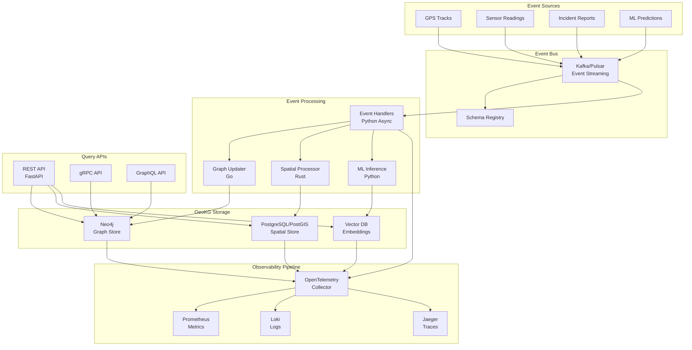
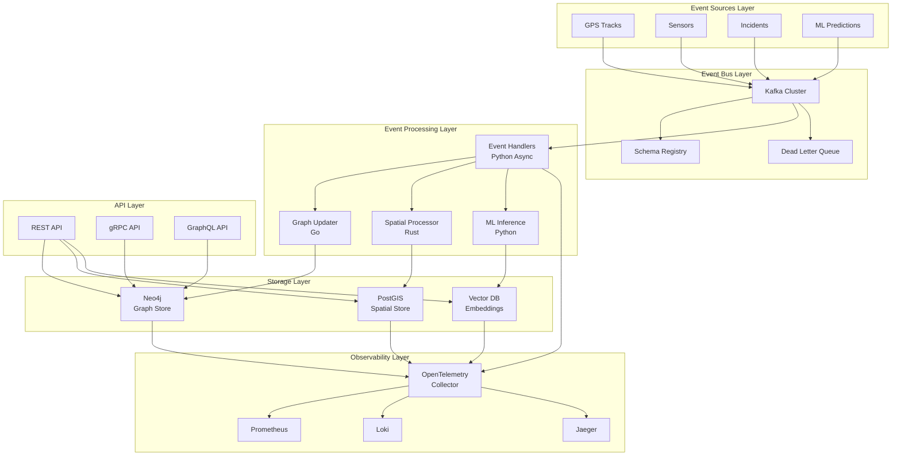
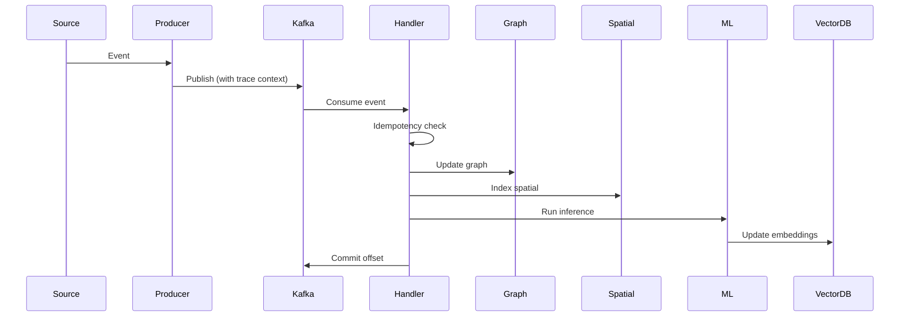
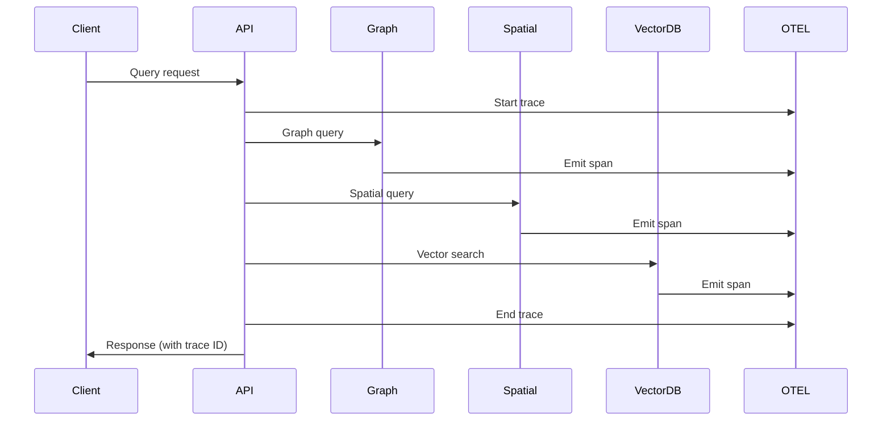

# Event-Driven Geospatial Knowledge Graph with Unified Observability: Production Architecture

**Objective**: Build a production-ready event-driven geospatial knowledge graph system that processes real-time geospatial events with complete observability across graph operations, spatial queries, and ML inference pipelines. This tutorial demonstrates how to integrate event-driven architecture patterns with unified observability to create a scalable, debuggable, and maintainable GeoKG system.

This tutorial combines:
- **[AI-Ready, ML-Enabled Geospatial Knowledge Graph](../best-practices/database-data/ai-ml-geospatial-knowledge-graph.md)** - Geospatial knowledge graph foundations
- **[Event-Driven Architecture](../best-practices/architecture-design/event-driven-architecture.md)** - Event-driven patterns and messaging
- **[Unified Observability Architecture](../best-practices/operations-monitoring/unified-observability-architecture.md)** - Complete observability across all systems

## Abstract

Event-driven architecture enables real-time updates to geospatial knowledge graphs, allowing systems to react immediately to incidents, sensor readings, infrastructure changes, and ML predictions. However, event-driven systems are notoriously difficult to debug and observe. This tutorial shows how to build an event-driven GeoKG with unified observability that provides complete visibility into every operation—from event ingestion through graph updates, spatial indexing, embedding generation, and ML inference.

**What This Tutorial Covers**:
- Event-driven GeoKG architecture with Kafka/Pulsar
- Real-time event processing for geospatial data
- Graph updates triggered by events
- Spatial indexing and relationship inference
- ML inference pipelines (embeddings, link prediction)
- Unified observability (metrics, traces, logs) across all components
- Event sourcing patterns for GeoKG state
- Temporal event ordering and causality
- Production deployment and operations

**Prerequisites**:
- Understanding of geospatial data (PostGIS, H3/S2)
- Familiarity with knowledge graphs (Neo4j, RDF, SPARQL)
- Experience with event-driven systems (Kafka, Pulsar, NATS)
- Knowledge of observability (OpenTelemetry, Prometheus, Grafana)

## Table of Contents

1. [Introduction & Motivation](#1-introduction--motivation)
2. [Conceptual Foundations](#2-conceptual-foundations)
3. [Systems Architecture & Integration Patterns](#3-systems-architecture--integration-patterns)
4. [Implementation Foundations](#4-implementation-foundations)
5. [Deep Technical Walkthroughs](#5-deep-technical-walkthroughs)
6. [Operations, Observability, and Governance](#6-operations-observability-and-governance)
7. [Patterns, Anti-Patterns, and Summary](#7-patterns-anti-patterns-and-summary)

## Why This Tutorial Matters

Real-time geospatial systems face unique challenges: they must process high-frequency events (GPS tracks, sensor readings, incidents), maintain graph consistency across distributed systems, perform complex spatial queries, and run ML inference—all while providing complete observability for debugging and optimization.

**The Event-Driven Challenge**: Traditional batch processing cannot meet the latency requirements of real-time geospatial systems. Events must be processed as they arrive, triggering immediate graph updates, spatial indexing, and ML inference. However, event-driven systems introduce complexity: event ordering, idempotency, backpressure, and failure handling.

**The Observability Challenge**: Event-driven systems are difficult to debug. A single user query may trigger dozens of events, each processed by different services. Without unified observability, understanding system behavior becomes impossible. Graph traversals, spatial queries, and ML inference must all be observable.

**The Integration Opportunity**: By combining event-driven architecture with unified observability, we create systems that are both real-time responsive and completely debuggable. Every event, graph operation, spatial query, and ML inference is traced, logged, and measured.

**Real-World Impact**: This architecture enables:
- **Real-Time Infrastructure Monitoring**: Immediate updates when incidents occur, assets change, or sensors report anomalies
- **Disaster Response**: Rapid graph updates as events unfold, enabling real-time decision-making
- **Traffic Management**: Live traffic events update routing graphs, enabling dynamic route optimization
- **ML-Driven Insights**: Real-time ML predictions trigger graph updates, creating feedback loops

---

## Overview Architecture



**Key Flows**:
1. **Event Flow**: Sources → Kafka → Handlers → Graph/Spatial/ML → Storage
2. **Observability Flow**: All components → OpenTelemetry → Metrics/Logs/Traces
3. **Query Flow**: APIs → Graph/Spatial/Vector → Results

---

## 1. Introduction & Motivation

### 1.1 The Event-Driven GeoKG Paradigm

Event-driven architecture transforms geospatial knowledge graphs from static, batch-updated systems into dynamic, real-time responsive platforms. In an event-driven GeoKG, every change—whether from sensors, user actions, ML predictions, or external systems—flows through an event stream, triggering immediate graph updates, spatial re-indexing, and ML inference.

**Traditional Batch GeoKG**:
- Periodic ETL jobs update the graph
- Latency measured in hours or days
- No real-time responsiveness
- Difficult to track changes
- ML models run on stale data

**Event-Driven GeoKG**:
- Events trigger immediate updates
- Latency measured in milliseconds
- Real-time responsiveness
- Complete change history (event sourcing)
- ML models operate on fresh data

### 1.2 Why Observability is Critical

Event-driven systems are inherently distributed and asynchronous. A single user query may trigger:
1. Event publication to Kafka
2. Event consumption by multiple handlers
3. Graph updates in Neo4j
4. Spatial indexing in PostGIS
5. Embedding generation
6. ML inference
7. Vector database updates

Without unified observability, understanding what happened—or why something failed—becomes impossible. Every component must emit structured logs, metrics, and traces that can be correlated across the entire system.

### 1.3 Real-World Use Cases

**Real-Time Infrastructure Monitoring**: 
- GPS trackers on vehicles emit location events
- Events trigger graph updates (vehicle location, route history)
- Spatial queries identify vehicles in risk zones
- ML models predict maintenance needs
- Observability tracks every operation for debugging

**Disaster Response**:
- Incident reports arrive as events
- Graph updates reflect current situation
- Spatial queries identify affected areas
- ML models predict resource needs
- Observability enables real-time decision-making

**Traffic Management**:
- Traffic sensors emit flow events
- Graph updates reflect current conditions
- Spatial queries identify congestion
- ML models optimize routing
- Observability tracks system performance

---

## 2. Conceptual Foundations

### 2.1 Event-Driven GeoKG Architecture Principles

#### Principle 1: Events as First-Class Citizens

In an event-driven GeoKG, events are not just notifications—they are the primary mechanism for state changes. Every graph update, spatial index change, and ML prediction originates from an event.

```python
# Event-driven principle: Events drive all changes
class GeoKGEvent:
    """Base class for all GeoKG events"""
    event_id: str
    event_type: str
    timestamp: datetime
    source: str
    payload: dict
    
    def to_graph_update(self) -> GraphUpdate:
        """Convert event to graph update operation"""
        raise NotImplementedError
```

#### Principle 2: Event Sourcing for GeoKG State

Event sourcing stores all changes as a sequence of events. The current graph state is derived by replaying events. This enables:
- **Time-travel queries**: Query graph state at any point in time
- **Audit trails**: Complete history of all changes
- **Debugging**: Replay events to reproduce issues
- **Reprocessing**: Replay events with new logic

```python
class EventSourcedGeoKG:
    """GeoKG with event sourcing"""
    
    async def append_event(self, event: GeoKGEvent):
        """Append event to event store"""
        await self.event_store.append(event)
        await self.apply_event(event)
    
    async def replay_events(self, from_version: int = 0):
        """Replay events to reconstruct state"""
        events = await self.event_store.get_events(from_version)
        for event in events:
            await self.apply_event(event)
    
    async def query_at_time(self, query: str, at_time: datetime):
        """Query graph state at specific time"""
        # Replay events up to at_time
        await self.replay_events_until(at_time)
        return await self.execute_query(query)
```

#### Principle 3: Temporal Event Ordering

Geospatial events must be processed in temporal order to maintain consistency. A vehicle location update must be processed after the previous location update, not before.

```python
class TemporalEventOrderer:
    """Ensures temporal ordering of events"""
    
    async def process_event(self, event: GeoKGEvent):
        """Process event with temporal ordering"""
        # Check if event is out of order
        last_event_time = await self.get_last_event_time(event.entity_id)
        
        if event.timestamp < last_event_time:
            # Out of order event - buffer or reject
            await self.handle_out_of_order(event)
        else:
            await self.process_in_order(event)
```

#### Principle 4: Idempotent Event Processing

Events may be delivered multiple times (at-least-once delivery). Event handlers must be idempotent—processing the same event multiple times must produce the same result.

```python
class IdempotentEventHandler:
    """Event handler with idempotency"""
    
    async def handle_event(self, event: GeoKGEvent):
        """Handle event with idempotency check"""
        # Check if event already processed
        processed = await self.check_processed(event.event_id)
        if processed:
            return  # Already processed, skip
        
        # Process event
        await self.process_event(event)
        
        # Mark as processed
        await self.mark_processed(event.event_id)
```

### 2.2 Event Types in Geospatial Systems

#### Incident Events

Incident events represent real-world incidents that affect geospatial entities: accidents, outages, natural disasters, security alerts.

```python
@dataclass
class IncidentEvent(GeoKGEvent):
    """Incident event"""
    event_type: str = "incident"
    incident_id: str
    incident_type: str  # accident, outage, disaster, alert
    location: Point
    severity: str  # low, medium, high, critical
    affected_entities: List[str]  # Entity IDs affected
    description: str
    reported_at: datetime
    
    def to_graph_update(self) -> GraphUpdate:
        """Convert to graph update"""
        return GraphUpdate(
            operations=[
                # Create incident node
                CreateNode(
                    node_id=f"incident:{self.incident_id}",
                    labels=["Incident", self.incident_type],
                    properties={
                        "incident_id": self.incident_id,
                        "severity": self.severity,
                        "description": self.description,
                        "reported_at": self.reported_at.isoformat()
                    }
                ),
                # Create location relationship
                CreateRelationship(
                    from_node=f"incident:{self.incident_id}",
                    to_node=f"location:{self.location.wkt}",
                    rel_type="OCCURRED_AT",
                    properties={}
                ),
                # Create affects relationships
                *[
                    CreateRelationship(
                        from_node=f"incident:{self.incident_id}",
                        to_node=f"entity:{entity_id}",
                        rel_type="AFFECTS",
                        properties={"severity": self.severity}
                    )
                    for entity_id in self.affected_entities
                ]
            ]
        )
```

#### Sensor Reading Events

Sensor reading events represent measurements from geospatial sensors: GPS tracks, traffic flow, weather, structural health.

```python
@dataclass
class SensorReadingEvent(GeoKGEvent):
    """Sensor reading event"""
    event_type: str = "sensor_reading"
    sensor_id: str
    reading_type: str  # gps, traffic, weather, structural
    location: Point
    value: float
    unit: str
    timestamp: datetime
    metadata: dict
    
    def to_graph_update(self) -> GraphUpdate:
        """Convert to graph update"""
        return GraphUpdate(
            operations=[
                # Create observation node
                CreateNode(
                    node_id=f"observation:{self.sensor_id}:{self.timestamp.isoformat()}",
                    labels=["Observation", self.reading_type],
                    properties={
                        "sensor_id": self.sensor_id,
                        "value": self.value,
                        "unit": self.unit,
                        "timestamp": self.timestamp.isoformat(),
                        **self.metadata
                    }
                ),
                # Link to sensor
                CreateRelationship(
                    from_node=f"sensor:{self.sensor_id}",
                    to_node=f"observation:{self.sensor_id}:{self.timestamp.isoformat()}",
                    rel_type="PRODUCES",
                    properties={}
                ),
                # Link to location
                CreateRelationship(
                    from_node=f"observation:{self.sensor_id}:{self.timestamp.isoformat()}",
                    to_node=f"location:{self.location.wkt}",
                    rel_type="OBSERVED_AT",
                    properties={}
                )
            ]
        )
```

#### Update Events

Update events represent changes to existing entities: asset status changes, location updates, attribute modifications.

```python
@dataclass
class UpdateEvent(GeoKGEvent):
    """Update event for existing entity"""
    event_type: str = "update"
    entity_id: str
    update_type: str  # status_change, location_update, attribute_update
    changes: dict  # Field -> new value
    previous_values: dict  # Field -> old value
    updated_at: datetime
    
    def to_graph_update(self) -> GraphUpdate:
        """Convert to graph update"""
        operations = []
        
        # Update node properties
        if self.update_type == "attribute_update":
            operations.append(
                UpdateNode(
                    node_id=f"entity:{self.entity_id}",
                    properties=self.changes
                )
            )
        
        # Update location relationship
        if "location" in self.changes:
            operations.extend([
                # Delete old location relationship
                DeleteRelationship(
                    from_node=f"entity:{self.entity_id}",
                    to_node=f"location:{self.previous_values['location'].wkt}",
                    rel_type="LOCATED_AT"
                ),
                # Create new location relationship
                CreateRelationship(
                    from_node=f"entity:{self.entity_id}",
                    to_node=f"location:{self.changes['location'].wkt}",
                    rel_type="LOCATED_AT",
                    properties={"updated_at": self.updated_at.isoformat()}
                )
            ])
        
        return GraphUpdate(operations=operations)
```

#### ML Prediction Events

ML prediction events represent predictions from ML models: risk scores, link predictions, anomaly detections.

```python
@dataclass
class MLPredictionEvent(GeoKGEvent):
    """ML prediction event"""
    event_type: str = "ml_prediction"
    model_id: str
    prediction_type: str  # risk_score, link_prediction, anomaly
    entity_id: str
    prediction_value: float
    confidence: float
    features: dict
    predicted_at: datetime
    
    def to_graph_update(self) -> GraphUpdate:
        """Convert to graph update"""
        return GraphUpdate(
            operations=[
                # Create prediction node
                CreateNode(
                    node_id=f"prediction:{self.model_id}:{self.entity_id}:{self.predicted_at.isoformat()}",
                    labels=["Prediction", self.prediction_type],
                    properties={
                        "model_id": self.model_id,
                        "prediction_value": self.prediction_value,
                        "confidence": self.confidence,
                        "features": json.dumps(self.features),
                        "predicted_at": self.predicted_at.isoformat()
                    }
                ),
                # Link to entity
                CreateRelationship(
                    from_node=f"entity:{self.entity_id}",
                    to_node=f"prediction:{self.model_id}:{self.entity_id}:{self.predicted_at.isoformat()}",
                    rel_type="HAS_PREDICTION",
                    properties={"prediction_type": self.prediction_type}
                )
            ]
        )
```

### 2.3 Unified Observability Model for Graph + Spatial + ML Operations

#### Observability Data Model

The unified observability model captures three types of telemetry:

1. **Metrics**: Quantitative measurements (counters, gauges, histograms)
2. **Traces**: Request/operation flows across services
3. **Logs**: Structured event records

```python
class UnifiedObservability:
    """Unified observability for GeoKG operations"""
    
    def __init__(self):
        self.metrics = MetricsCollector()
        self.tracer = Tracer()
        self.logger = StructuredLogger()
    
    async def observe_graph_operation(self, operation: str, entity_id: str):
        """Observe graph operation"""
        with self.tracer.start_span("graph_operation") as span:
            span.set_attribute("operation", operation)
            span.set_attribute("entity_id", entity_id)
            
            self.metrics.increment("geokg_graph_operations_total", 
                                  tags={"operation": operation})
            
            start_time = time.time()
            try:
                result = await self.execute_graph_operation(operation, entity_id)
                duration = time.time() - start_time
                
                self.metrics.histogram("geokg_graph_operation_duration_seconds",
                                     duration, tags={"operation": operation})
                
                self.logger.info("graph_operation_completed",
                               operation=operation,
                               entity_id=entity_id,
                               duration=duration)
                
                return result
            except Exception as e:
                self.metrics.increment("geokg_graph_operations_errors_total",
                                      tags={"operation": operation, "error": str(e)})
                self.logger.error("graph_operation_failed",
                                operation=operation,
                                entity_id=entity_id,
                                error=str(e))
                raise
    
    async def observe_spatial_query(self, query_type: str, geometry: Geometry):
        """Observe spatial query"""
        with self.tracer.start_span("spatial_query") as span:
            span.set_attribute("query_type", query_type)
            span.set_attribute("geometry_type", geometry.geom_type)
            
            self.metrics.increment("geokg_spatial_queries_total",
                                  tags={"query_type": query_type})
            
            start_time = time.time()
            try:
                result = await self.execute_spatial_query(query_type, geometry)
                duration = time.time() - start_time
                
                self.metrics.histogram("geokg_spatial_query_duration_seconds",
                                     duration, tags={"query_type": query_type})
                
                self.logger.info("spatial_query_completed",
                               query_type=query_type,
                               geometry_type=geometry.geom_type,
                               result_count=len(result),
                               duration=duration)
                
                return result
            except Exception as e:
                self.metrics.increment("geokg_spatial_queries_errors_total",
                                      tags={"query_type": query_type, "error": str(e)})
                self.logger.error("spatial_query_failed",
                                query_type=query_type,
                                error=str(e))
                raise
    
    async def observe_ml_inference(self, model_id: str, input_data: dict):
        """Observe ML inference"""
        with self.tracer.start_span("ml_inference") as span:
            span.set_attribute("model_id", model_id)
            
            self.metrics.increment("geokg_ml_inferences_total",
                                  tags={"model_id": model_id})
            
            start_time = time.time()
            try:
                result = await self.execute_ml_inference(model_id, input_data)
                duration = time.time() - start_time
                
                self.metrics.histogram("geokg_ml_inference_duration_seconds",
                                     duration, tags={"model_id": model_id})
                
                self.logger.info("ml_inference_completed",
                               model_id=model_id,
                               duration=duration,
                               confidence=result.get("confidence"))
                
                return result
            except Exception as e:
                self.metrics.increment("geokg_ml_inferences_errors_total",
                                      tags={"model_id": model_id, "error": str(e)})
                self.logger.error("ml_inference_failed",
                                model_id=model_id,
                                error=str(e))
                raise
```

#### Metric Naming Schema

Metrics follow a consistent naming schema:

```
{domain}_{subsystem}_{metric_name}_{unit}
```

Examples:
- `geokg_graph_operations_total` - Total graph operations
- `geokg_graph_operation_duration_seconds` - Graph operation duration
- `geokg_spatial_queries_total` - Total spatial queries
- `geokg_spatial_query_duration_seconds` - Spatial query duration
- `geokg_ml_inferences_total` - Total ML inferences
- `geokg_ml_inference_duration_seconds` - ML inference duration
- `geokg_event_processing_lag_seconds` - Event processing lag

#### Trace Context Propagation

Traces propagate across services using OpenTelemetry context:

```python
from opentelemetry import trace
from opentelemetry.propagate import inject, extract

class TracePropagation:
    """Trace context propagation"""
    
    async def process_event_with_trace(self, event: GeoKGEvent, headers: dict):
        """Process event with trace context"""
        # Extract trace context from event headers
        context = extract(headers)
        
        with trace.use_span(context):
            # All operations within this context are traced
            await self.process_event(event)
    
    async def publish_event_with_trace(self, event: GeoKGEvent):
        """Publish event with trace context"""
        headers = {}
        inject(headers)  # Inject current trace context
        
        await self.event_bus.publish(event, headers=headers)
```

### 2.4 Event Sourcing Patterns for GeoKG State

#### Event Store Implementation

```python
class GeoKGEventStore:
    """Event store for GeoKG events"""
    
    async def append_event(self, event: GeoKGEvent):
        """Append event to store"""
        await self.db.execute("""
            INSERT INTO events (
                event_id, event_type, stream_id, version,
                timestamp, source, payload, metadata
            ) VALUES ($1, $2, $3, $4, $5, $6, $7, $8)
        """, (
            event.event_id,
            event.event_type,
            event.stream_id,
            await self.get_next_version(event.stream_id),
            event.timestamp,
            event.source,
            json.dumps(event.payload),
            json.dumps(event.metadata)
        ))
    
    async def get_stream(self, stream_id: str, from_version: int = 0):
        """Get events for stream"""
        rows = await self.db.fetch("""
            SELECT event_id, event_type, version, timestamp,
                   source, payload, metadata
            FROM events
            WHERE stream_id = $1 AND version >= $2
            ORDER BY version
        """, stream_id, from_version)
        
        return [self._row_to_event(row) for row in rows]
    
    async def replay_stream(self, stream_id: str, handler: callable):
        """Replay stream events"""
        events = await self.get_stream(stream_id)
        for event in events:
            await handler(event)
```

#### Snapshot Pattern

For large streams, periodic snapshots avoid replaying all events:

```python
class SnapshotGeoKG:
    """GeoKG with snapshot support"""
    
    async def create_snapshot(self, stream_id: str, version: int):
        """Create snapshot at version"""
        # Replay events up to version
        events = await self.get_stream(stream_id, 0)
        state = await self.replay_events(events[:version])
        
        # Store snapshot
        await self.db.execute("""
            INSERT INTO snapshots (stream_id, version, state, created_at)
            VALUES ($1, $2, $3, NOW())
        """, stream_id, version, json.dumps(state))
    
    async def restore_from_snapshot(self, stream_id: str, version: int):
        """Restore state from snapshot"""
        # Load snapshot
        snapshot = await self.db.fetchrow("""
            SELECT state FROM snapshots
            WHERE stream_id = $1 AND version <= $2
            ORDER BY version DESC
            LIMIT 1
        """, stream_id, version)
        
        if snapshot:
            state = json.loads(snapshot["state"])
            # Restore state
            await self.restore_state(state)
            
            # Replay events after snapshot
            events = await self.get_stream(stream_id, snapshot["version"] + 1)
            await self.replay_events(events)
        else:
            # No snapshot, replay all events
            events = await self.get_stream(stream_id, 0)
            await self.replay_events(events)
```

### 2.5 Temporal Event Ordering and Causality

#### Causality Tracking

Events may have causal relationships. A vehicle location update may cause a route recalculation, which may trigger an ML prediction.

```python
@dataclass
class CausalEvent(GeoKGEvent):
    """Event with causality tracking"""
    causes: List[str]  # Event IDs that caused this event
    caused_by: Optional[str]  # Parent event ID
    
    def get_causal_chain(self) -> List[str]:
        """Get causal chain of events"""
        chain = [self.event_id]
        if self.caused_by:
            parent = await self.get_event(self.caused_by)
            chain.extend(parent.get_causal_chain())
        return chain
```

#### Vector Clocks for Distributed Ordering

In distributed systems, vector clocks track causal relationships:

```python
class VectorClock:
    """Vector clock for causal ordering"""
    
    def __init__(self, node_id: str):
        self.node_id = node_id
        self.clock = {node_id: 0}
    
    def tick(self):
        """Increment local clock"""
        self.clock[self.node_id] += 1
    
    def update(self, other_clock: dict):
        """Update with other clock"""
        for node, time in other_clock.items():
            self.clock[node] = max(
                self.clock.get(node, 0),
                time
            )
        self.tick()
    
    def happens_before(self, other: 'VectorClock') -> bool:
        """Check if this happens before other"""
        return all(
            self.clock.get(node, 0) <= other.clock.get(node, 0)
            for node in set(self.clock.keys()) | set(other.clock.keys())
        ) and any(
            self.clock.get(node, 0) < other.clock.get(node, 0)
            for node in set(self.clock.keys()) | set(other.clock.keys())
        )
```

### 2.6 Real-World Motivations

#### Real-Time Infrastructure Monitoring

**Challenge**: Monitor critical infrastructure (bridges, power lines, water mains) in real-time, detecting anomalies and predicting failures.

**Event-Driven Solution**:
- Sensor readings arrive as events
- Events trigger graph updates (current state)
- Spatial queries identify assets in risk zones
- ML models predict maintenance needs
- Observability tracks all operations

**Benefits**:
- Immediate response to anomalies
- Predictive maintenance
- Complete audit trail
- Debuggable system

#### Disaster Response

**Challenge**: Coordinate disaster response across multiple agencies, tracking incidents, resources, and affected areas in real-time.

**Event-Driven Solution**:
- Incident reports arrive as events
- Events trigger graph updates (current situation)
- Spatial queries identify affected areas
- ML models predict resource needs
- Observability enables coordination

**Benefits**:
- Real-time situation awareness
- Coordinated response
- Resource optimization
- Complete visibility

#### Traffic Management

**Challenge**: Optimize traffic flow in real-time, responding to congestion, accidents, and events.

**Event-Driven Solution**:
- Traffic sensors emit flow events
- Events trigger graph updates (current conditions)
- Spatial queries identify congestion
- ML models optimize routing
- Observability tracks performance

**Benefits**:
- Dynamic route optimization
- Reduced congestion
- Improved safety
- Performance monitoring

---

## 3. Systems Architecture & Integration Patterns

### 3.1 High-Level Architecture

The event-driven GeoKG architecture consists of several key layers:

1. **Event Sources**: GPS tracks, sensors, incidents, ML predictions
2. **Event Bus**: Kafka/Pulsar for event streaming
3. **Event Processing**: Handlers that process events and trigger updates
4. **GeoKG Storage**: Neo4j (graph), PostGIS (spatial), Vector DB (embeddings)
5. **Observability Pipeline**: OpenTelemetry → Prometheus/Loki/Jaeger
6. **Query APIs**: REST, gRPC, GraphQL for querying the GeoKG



### 3.2 Component Responsibilities

#### Event Producers

Event producers publish events to the event bus. They are responsible for:
- Event serialization (Avro/Protobuf)
- Schema validation
- Event routing (topic selection)
- Trace context injection

```python
class GeoKGEventProducer:
    """Event producer for GeoKG events"""
    
    def __init__(self, kafka_producer, schema_registry):
        self.producer = kafka_producer
        self.schema_registry = schema_registry
        self.tracer = trace.get_tracer(__name__)
    
    async def produce_event(self, event: GeoKGEvent, topic: str):
        """Produce event with observability"""
        with self.tracer.start_as_current_span("produce_event") as span:
            span.set_attribute("event_type", event.event_type)
            span.set_attribute("topic", topic)
            
            # Serialize event
            serialized = await self.serialize_event(event)
            
            # Validate schema
            await self.validate_schema(event, topic)
            
            # Inject trace context
            headers = {}
            inject(headers)
            
            # Produce to Kafka
            await self.producer.send(
                topic=topic,
                value=serialized,
                headers=headers,
                key=event.entity_id if hasattr(event, 'entity_id') else event.event_id
            )
            
            # Emit metrics
            metrics.increment("geokg_events_produced_total",
                            tags={"event_type": event.event_type, "topic": topic})
```

#### Event Handlers

Event handlers consume events and trigger graph updates, spatial processing, and ML inference. They are responsible for:
- Event deserialization
- Idempotency checks
- Error handling and retries
- Dead letter queue routing
- Observability instrumentation

```python
class GeoKGEventHandler:
    """Event handler for GeoKG events"""
    
    def __init__(self, graph_updater, spatial_processor, ml_inference):
        self.graph_updater = graph_updater
        self.spatial_processor = spatial_processor
        self.ml_inference = ml_inference
        self.tracer = trace.get_tracer(__name__)
        self.processed_events = set()
    
    async def handle_event(self, event: GeoKGEvent):
        """Handle event with full observability"""
        with self.tracer.start_as_current_span("handle_event") as span:
            span.set_attribute("event_id", event.event_id)
            span.set_attribute("event_type", event.event_type)
            
            # Idempotency check
            if event.event_id in self.processed_events:
                span.set_attribute("duplicate", True)
                return
            
            try:
                # Convert event to graph update
                graph_update = event.to_graph_update()
                
                # Update graph
                with span.start_as_current_span("update_graph"):
                    await self.graph_updater.update(graph_update)
                
                # Process spatial
                if hasattr(event, 'location'):
                    with span.start_as_current_span("process_spatial"):
                        await self.spatial_processor.process(event.location)
                
                # ML inference
                if event.event_type == "sensor_reading":
                    with span.start_as_current_span("ml_inference"):
                        await self.ml_inference.predict(event)
                
                # Mark as processed
                self.processed_events.add(event.event_id)
                
                # Emit metrics
                metrics.increment("geokg_events_processed_total",
                                tags={"event_type": event.event_type})
                
            except Exception as e:
                span.record_exception(e)
                span.set_status(Status(StatusCode.ERROR, str(e)))
                
                # Emit error metrics
                metrics.increment("geokg_events_errors_total",
                                tags={"event_type": event.event_type, "error": str(e)})
                
                # Route to DLQ
                await self.route_to_dlq(event, e)
                raise
```

#### Graph Updaters

Graph updaters apply graph updates to Neo4j. They are responsible for:
- Transaction management
- Batch updates
- Conflict resolution
- Observability

```go
// Graph updater in Go
type GraphUpdater struct {
    driver neo4j.Driver
    tracer trace.Tracer
    metrics *Metrics
}

func (g *GraphUpdater) Update(ctx context.Context, update GraphUpdate) error {
    ctx, span := g.tracer.Start(ctx, "graph_update")
    defer span.End()
    
    span.SetAttributes(
        attribute.Int("operations_count", len(update.Operations)),
    )
    
    session := g.driver.NewSession(ctx, neo4j.SessionConfig{})
    defer session.Close(ctx)
    
    _, err := session.ExecuteWrite(ctx, func(tx neo4j.ManagedTransaction) (interface{}, error) {
        for _, op := range update.Operations {
            if err := g.executeOperation(ctx, tx, op); err != nil {
                return nil, err
            }
        }
        return nil, nil
    })
    
    if err != nil {
        span.RecordError(err)
        g.metrics.Increment("geokg_graph_updates_errors_total")
        return err
    }
    
    g.metrics.Increment("geokg_graph_updates_total")
    return nil
}
```

#### Spatial Processors

Spatial processors handle spatial indexing and queries in PostGIS. They are responsible for:
- Spatial indexing (H3/S2)
- Geometry validation
- Spatial relationship inference
- Observability

```rust
// Spatial processor in Rust
pub struct SpatialProcessor {
    pool: Pool<PostgresConnectionManager<NoTls>>,
    tracer: Tracer,
    metrics: Metrics,
}

impl SpatialProcessor {
    pub async fn process(&self, location: Point) -> Result<()> {
        let mut span = self.tracer.start("spatial_process");
        span.set_attribute("geometry_type", "Point");
        
        // Validate geometry
        if !location.is_valid() {
            span.record_error("Invalid geometry");
            return Err(Error::InvalidGeometry);
        }
        
        // Index with H3
        let h3_index = h3::lat_lng_to_cell(
            location.y(),
            location.x(),
            15
        )?;
        
        // Update PostGIS
        let mut conn = self.pool.get().await?;
        conn.execute(
            "INSERT INTO spatial_index (entity_id, geometry, h3_index) VALUES ($1, $2, $3)",
            &[&location.entity_id, &location.wkt(), &h3_index]
        ).await?;
        
        self.metrics.increment("geokg_spatial_updates_total");
        Ok(())
    }
}
```

#### ML Inference Services

ML inference services run ML models on events and update the graph with predictions. They are responsible for:
- Model loading and serving
- Feature extraction
- Prediction generation
- Embedding updates
- Observability

```python
class MLInferenceService:
    """ML inference service"""
    
    def __init__(self, model_registry, vector_db):
        self.model_registry = model_registry
        self.vector_db = vector_db
        self.tracer = trace.get_tracer(__name__)
    
    async def predict(self, event: GeoKGEvent):
        """Run ML inference on event"""
        with self.tracer.start_as_current_span("ml_predict") as span:
            span.set_attribute("event_type", event.event_type)
            
            # Load model
            model = await self.model_registry.get_model("risk_predictor")
            
            # Extract features
            features = await self.extract_features(event)
            span.set_attribute("features_count", len(features))
            
            # Predict
            prediction = await model.predict(features)
            span.set_attribute("prediction_value", prediction.value)
            span.set_attribute("confidence", prediction.confidence)
            
            # Update embeddings
            embedding = await model.get_embedding(features)
            await self.vector_db.upsert(
                id=event.entity_id,
                embedding=embedding,
                metadata={"event_type": event.event_type}
            )
            
            # Emit metrics
            metrics.histogram("geokg_ml_prediction_value",
                            prediction.value,
                            tags={"model": "risk_predictor"})
            
            return prediction
```

### 3.3 Interface Definitions

#### Event Schemas

Events use Avro schemas for serialization:

```json
{
  "type": "record",
  "name": "IncidentEvent",
  "namespace": "com.geokg.events",
  "fields": [
    {"name": "event_id", "type": "string"},
    {"name": "event_type", "type": "string"},
    {"name": "timestamp", "type": "long", "logicalType": "timestamp-millis"},
    {"name": "incident_id", "type": "string"},
    {"name": "incident_type", "type": "string"},
    {"name": "location", "type": {
      "type": "record",
      "name": "Point",
      "fields": [
        {"name": "x", "type": "double"},
        {"name": "y", "type": "double"}
      ]
    }},
    {"name": "severity", "type": "string"},
    {"name": "affected_entities", "type": {"type": "array", "items": "string"}},
    {"name": "description", "type": "string"}
  ]
}
```

#### API Contracts

REST API contracts:

```python
from fastapi import FastAPI, Query
from pydantic import BaseModel

app = FastAPI()

class GraphQueryRequest(BaseModel):
    query: str
    parameters: dict = {}

class GraphQueryResponse(BaseModel):
    results: list
    execution_time_ms: float

@app.post("/api/v1/graph/query")
async def query_graph(request: GraphQueryRequest) -> GraphQueryResponse:
    """Query graph with observability"""
    with tracer.start_as_current_span("graph_query_api"):
        start_time = time.time()
        results = await graph_service.execute_query(
            request.query,
            request.parameters
        )
        duration = (time.time() - start_time) * 1000
        
        metrics.histogram("geokg_api_query_duration_ms", duration)
        
        return GraphQueryResponse(
            results=results,
            execution_time_ms=duration
        )
```

### 3.4 Dataflow Diagrams

#### Event Ingestion Flow



#### Query Flow with Observability



### 3.5 Alternative Patterns

#### Batch vs Streaming

**Batch Processing**:
- Periodic ETL jobs
- Higher latency
- Simpler error handling
- Lower resource usage

**Streaming Processing**:
- Real-time event processing
- Lower latency
- Complex error handling
- Higher resource usage

**Hybrid Approach**:
- Streaming for real-time updates
- Batch for historical backfill
- Batch for complex aggregations

#### Pull vs Push Observability

**Pull Model** (Prometheus):
- Scrapes metrics from services
- Lower overhead
- Periodic collection
- Good for metrics

**Push Model** (OpenTelemetry):
- Services push telemetry
- Higher overhead
- Real-time collection
- Good for traces and logs

**Hybrid Approach**:
- Pull for metrics (Prometheus)
- Push for traces (Jaeger)
- Push for logs (Loki)

### 3.6 Trade-offs

#### Latency vs Consistency

**Low Latency**:
- Async processing
- Eventual consistency
- Higher throughput
- Risk of stale data

**Strong Consistency**:
- Sync processing
- Immediate consistency
- Lower throughput
- No stale data

**GeoKG Recommendation**: Eventual consistency with read-your-writes guarantees. Graph updates are async, but queries see their own writes.

#### Observability Overhead vs Performance

**High Observability**:
- Detailed traces
- Verbose logging
- Frequent metrics
- Higher overhead
- Better debugging

**Low Observability**:
- Minimal traces
- Basic logging
- Sparse metrics
- Lower overhead
- Harder debugging

**GeoKG Recommendation**: Balanced observability. Trace all graph operations, log errors and key events, emit metrics for SLAs.

---

## 4. Implementation Foundations

### 4.1 Repository Structure

A well-organized repository structure enables maintainability and scalability:

```
event-driven-geokg/
├── services/
│   ├── event-handlers/          # Python async event handlers
│   │   ├── handlers/
│   │   │   ├── incident_handler.py
│   │   │   ├── sensor_handler.py
│   │   │   └── update_handler.py
│   │   ├── models/
│   │   │   └── events.py
│   │   └── main.py
│   ├── graph-updater/           # Go graph updater service
│   │   ├── updater/
│   │   │   └── graph_updater.go
│   │   └── main.go
│   ├── spatial-processor/       # Rust spatial processor
│   │   ├── src/
│   │   │   └── processor.rs
│   │   └── Cargo.toml
│   └── ml-inference/            # Python ML inference service
│       ├── models/
│       ├── inference/
│       └── main.py
├── schemas/
│   ├── avro/                    # Avro event schemas
│   │   ├── IncidentEvent.avsc
│   │   ├── SensorReadingEvent.avsc
│   │   └── UpdateEvent.avsc
│   └── graph/                   # Graph schema definitions
│       ├── nodes.cypher
│       └── relationships.cypher
├── api/
│   ├── rest/                    # REST API (FastAPI)
│   │   ├── routes/
│   │   │   ├── graph.py
│   │   │   ├── spatial.py
│   │   │   └── ml.py
│   │   └── main.py
│   ├── grpc/                    # gRPC API
│   │   └── proto/
│   │       └── geokg.proto
│   └── graphql/                 # GraphQL API
│       └── schema.graphql
├── observability/
│   ├── instrumentation/         # OpenTelemetry instrumentation
│   │   ├── graph_instrumentation.py
│   │   ├── spatial_instrumentation.py
│   │   └── ml_instrumentation.py
│   ├── metrics/                 # Prometheus metrics
│   │   └── metrics.py
│   └── dashboards/              # Grafana dashboards
│       ├── graph_operations.json
│       ├── spatial_queries.json
│       └── ml_inference.json
├── infrastructure/
│   ├── docker/                  # Dockerfiles
│   ├── kubernetes/              # K8s manifests
│   │   ├── event-handlers/
│   │   ├── graph-updater/
│   │   └── observability/
│   └── terraform/               # Infrastructure as code
├── tests/
│   ├── unit/
│   ├── integration/
│   └── e2e/
└── docs/
    ├── architecture.md
    └── deployment.md
```

### 4.2 Code Scaffolds

#### Python Async Event Handler

```python
# services/event-handlers/handlers/incident_handler.py
import asyncio
from typing import Optional
from opentelemetry import trace
from opentelemetry.propagate import extract
from kafka import AIOKafkaConsumer
from prometheus_client import Counter, Histogram

from models.events import IncidentEvent
from graph_updater import GraphUpdater
from spatial_processor import SpatialProcessor
from ml_inference import MLInferenceService

tracer = trace.get_tracer(__name__)
events_processed = Counter('geokg_incident_events_processed_total', 'Total incident events processed')
event_duration = Histogram('geokg_incident_event_duration_seconds', 'Incident event processing duration')

class IncidentEventHandler:
    """Handler for incident events"""
    
    def __init__(self, 
                 kafka_consumer: AIOKafkaConsumer,
                 graph_updater: GraphUpdater,
                 spatial_processor: SpatialProcessor,
                 ml_inference: MLInferenceService):
        self.consumer = kafka_consumer
        self.graph_updater = graph_updater
        self.spatial_processor = spatial_processor
        self.ml_inference = ml_inference
        self.processed_events = set()
    
    async def start(self):
        """Start consuming events"""
        await self.consumer.start()
        try:
            async for msg in self.consumer:
                await self.handle_message(msg)
        finally:
            await self.consumer.stop()
    
    async def handle_message(self, msg):
        """Handle incoming message"""
        # Extract trace context
        headers = {k: v.decode() for k, v in msg.headers}
        context = extract(headers)
        
        with tracer.start_as_current_span("handle_incident_event", context=context) as span:
            span.set_attribute("topic", msg.topic)
            span.set_attribute("partition", msg.partition)
            span.set_attribute("offset", msg.offset)
            
            start_time = time.time()
            
            try:
                # Deserialize event
                event = IncidentEvent.from_avro(msg.value)
                span.set_attribute("event_id", event.event_id)
                span.set_attribute("incident_type", event.incident_type)
                
                # Idempotency check
                if event.event_id in self.processed_events:
                    span.set_attribute("duplicate", True)
                    return
                
                # Process event
                await self.process_incident(event)
                
                # Mark as processed
                self.processed_events.add(event.event_id)
                events_processed.inc()
                
                duration = time.time() - start_time
                event_duration.observe(duration)
                span.set_attribute("duration", duration)
                
            except Exception as e:
                span.record_exception(e)
                span.set_status(Status(StatusCode.ERROR, str(e)))
                raise
    
    async def process_incident(self, event: IncidentEvent):
        """Process incident event"""
        # Convert to graph update
        graph_update = event.to_graph_update()
        
        # Update graph
        with tracer.start_as_current_span("update_graph"):
            await self.graph_updater.update(graph_update)
        
        # Process spatial
        with tracer.start_as_current_span("process_spatial"):
            await self.spatial_processor.process(event.location)
        
        # ML inference for risk assessment
        with tracer.start_as_current_span("ml_inference"):
            await self.ml_inference.predict_risk(event)
```

#### Go Graph Updater

```go
// services/graph-updater/updater/graph_updater.go
package updater

import (
    "context"
    "github.com/neo4j/neo4j-go-driver/v5/neo4j"
    "go.opentelemetry.io/otel"
    "go.opentelemetry.io/otel/attribute"
    "go.opentelemetry.io/otel/trace"
)

type GraphUpdater struct {
    driver  neo4j.Driver
    tracer  trace.Tracer
    metrics *Metrics
}

type GraphUpdate struct {
    Operations []Operation
}

type Operation interface {
    Execute(ctx context.Context, tx neo4j.ManagedTransaction) error
}

type CreateNode struct {
    NodeID     string
    Labels     []string
    Properties map[string]interface{}
}

func (op CreateNode) Execute(ctx context.Context, tx neo4j.ManagedTransaction) error {
    query := fmt.Sprintf(
        "CREATE (n:%s) SET n = $props, n.id = $id",
        strings.Join(op.Labels, ":"),
    )
    
    _, err := tx.Run(ctx, query, map[string]interface{}{
        "id":   op.NodeID,
        "props": op.Properties,
    })
    
    return err
}

func (g *GraphUpdater) Update(ctx context.Context, update GraphUpdate) error {
    ctx, span := g.tracer.Start(ctx, "graph_update")
    defer span.End()
    
    span.SetAttributes(
        attribute.Int("operations_count", len(update.Operations)),
    )
    
    session := g.driver.NewSession(ctx, neo4j.SessionConfig{})
    defer session.Close(ctx)
    
    _, err := session.ExecuteWrite(ctx, func(tx neo4j.ManagedTransaction) (interface{}, error) {
        for i, op := range update.Operations {
            ctx, opSpan := g.tracer.Start(ctx, "execute_operation")
            opSpan.SetAttributes(attribute.Int("operation_index", i))
            
            if err := op.Execute(ctx, tx); err != nil {
                opSpan.RecordError(err)
                opSpan.End()
                return nil, err
            }
            
            opSpan.End()
        }
        return nil, nil
    })
    
    if err != nil {
        span.RecordError(err)
        g.metrics.IncrementErrors()
        return err
    }
    
    g.metrics.IncrementUpdates()
    return nil
}
```

#### Rust Spatial Processor

```rust
// services/spatial-processor/src/processor.rs
use async_trait::async_trait;
use deadpool_postgres::{Pool, Client};
use h3o::{LatLng, CellIndex};
use opentelemetry::trace::{Tracer, Span};
use prometheus::{Counter, Histogram};

pub struct SpatialProcessor {
    pool: Pool,
    tracer: Tracer,
    updates_total: Counter,
    update_duration: Histogram,
}

#[async_trait]
pub trait SpatialOperation {
    async fn execute(&self, client: &Client) -> Result<()>;
}

pub struct IndexLocation {
    entity_id: String,
    location: Point,
}

#[async_trait]
impl SpatialOperation for IndexLocation {
    async fn execute(&self, client: &Client) -> Result<()> {
        // Validate geometry
        if !self.location.is_valid() {
            return Err(Error::InvalidGeometry);
        }
        
        // Index with H3
        let lat_lng = LatLng::new(self.location.y(), self.location.x())?;
        let h3_index = lat_lng.to_cell(h3o::Resolution::Fifteen);
        
        // Update PostGIS
        client.execute(
            "INSERT INTO spatial_index (entity_id, geometry, h3_index) VALUES ($1, ST_GeomFromText($2, 4326), $3)",
            &[&self.entity_id, &self.location.wkt(), &h3_index.to_string()]
        ).await?;
        
        Ok(())
    }
}

impl SpatialProcessor {
    pub async fn process(&self, operation: Box<dyn SpatialOperation>) -> Result<()> {
        let mut span = self.tracer.start("spatial_process");
        span.set_attribute("operation_type", operation.type_name());
        
        let start = std::time::Instant::now();
        
        let client = self.pool.get().await?;
        
        match operation.execute(&client).await {
            Ok(_) => {
                let duration = start.elapsed().as_secs_f64();
                self.update_duration.observe(duration);
                self.updates_total.inc();
                span.set_attribute("duration", duration);
                Ok(())
            }
            Err(e) => {
                span.record_error(&e);
                Err(e)
            }
        }
    }
}
```

### 4.3 Lifecycle Wiring

#### Service Startup

```python
# services/event-handlers/main.py
import asyncio
import signal
from kafka import AIOKafkaConsumer
from opentelemetry import trace
from opentelemetry.sdk.trace import TracerProvider
from opentelemetry.sdk.trace.export import BatchSpanProcessor
from opentelemetry.exporter.otlp.proto.grpc.trace_exporter import OTLPSpanExporter

from handlers.incident_handler import IncidentEventHandler
from graph_updater import GraphUpdater
from spatial_processor import SpatialProcessor
from ml_inference import MLInferenceService

# Setup OpenTelemetry
trace.set_tracer_provider(TracerProvider())
tracer_provider = trace.get_tracer_provider()
tracer_provider.add_span_processor(
    BatchSpanProcessor(OTLPSpanExporter(endpoint="http://otel-collector:4317"))
)

async def main():
    # Initialize services
    kafka_consumer = AIOKafkaConsumer(
        'incident-events',
        bootstrap_servers='kafka:9092',
        group_id='incident-handlers',
        value_deserializer=lambda m: IncidentEvent.from_avro(m)
    )
    
    graph_updater = GraphUpdater(
        neo4j_uri="bolt://neo4j:7687",
        username="neo4j",
        password=os.getenv("NEO4J_PASSWORD")
    )
    
    spatial_processor = SpatialProcessor(
        postgres_uri=os.getenv("POSTGRES_URI")
    )
    
    ml_inference = MLInferenceService(
        model_registry_uri=os.getenv("MODEL_REGISTRY_URI")
    )
    
    # Create handler
    handler = IncidentEventHandler(
        kafka_consumer=kafka_consumer,
        graph_updater=graph_updater,
        spatial_processor=spatial_processor,
        ml_inference=ml_inference
    )
    
    # Setup graceful shutdown
    loop = asyncio.get_event_loop()
    for sig in (signal.SIGTERM, signal.SIGINT):
        loop.add_signal_handler(sig, lambda: asyncio.create_task(shutdown(handler)))
    
    # Start consuming
    await handler.start()

async def shutdown(handler):
    """Graceful shutdown"""
    logger.info("Shutting down...")
    await handler.stop()
    logger.info("Shutdown complete")

if __name__ == "__main__":
    asyncio.run(main())
```

#### Graceful Shutdown

```python
class IncidentEventHandler:
    def __init__(self, ...):
        self.running = True
        self.pending_tasks = set()
    
    async def start(self):
        """Start consuming events"""
        await self.consumer.start()
        try:
            async for msg in self.consumer:
                if not self.running:
                    break
                
                # Process in background task
                task = asyncio.create_task(self.handle_message(msg))
                self.pending_tasks.add(task)
                task.add_done_callback(self.pending_tasks.discard)
        finally:
            await self.consumer.stop()
    
    async def stop(self):
        """Stop consuming events"""
        self.running = False
        
        # Wait for pending tasks
        if self.pending_tasks:
            await asyncio.gather(*self.pending_tasks, return_exceptions=True)
        
        await self.consumer.stop()
```

### 4.4 Event Schemas

#### Avro Event Definitions

```json
// schemas/avro/IncidentEvent.avsc
{
  "type": "record",
  "name": "IncidentEvent",
  "namespace": "com.geokg.events",
  "doc": "Event representing a geospatial incident",
  "fields": [
    {
      "name": "event_id",
      "type": "string",
      "doc": "Unique event identifier"
    },
    {
      "name": "event_type",
      "type": "string",
      "default": "incident"
    },
    {
      "name": "timestamp",
      "type": "long",
      "logicalType": "timestamp-millis"
    },
    {
      "name": "incident_id",
      "type": "string"
    },
    {
      "name": "incident_type",
      "type": {
        "type": "enum",
        "name": "IncidentType",
        "symbols": ["accident", "outage", "disaster", "alert"]
      }
    },
    {
      "name": "location",
      "type": {
        "type": "record",
        "name": "Point",
        "fields": [
          {"name": "x", "type": "double"},
          {"name": "y", "type": "double"},
          {"name": "srid", "type": "int", "default": 4326}
        ]
      }
    },
    {
      "name": "severity",
      "type": {
        "type": "enum",
        "name": "Severity",
        "symbols": ["low", "medium", "high", "critical"]
      }
    },
    {
      "name": "affected_entities",
      "type": {"type": "array", "items": "string"}
    },
    {
      "name": "description",
      "type": "string"
    },
    {
      "name": "metadata",
      "type": {"type": "map", "values": "string"},
      "default": {}
    }
  ]
}
```

### 4.5 Graph Schema

#### Neo4j Node and Relationship Definitions

```cypher
// schemas/graph/nodes.cypher

// Asset nodes
CREATE CONSTRAINT asset_id IF NOT EXISTS FOR (a:Asset) REQUIRE a.id IS UNIQUE;

// Location nodes
CREATE CONSTRAINT location_id IF NOT EXISTS FOR (l:Location) REQUIRE l.id IS UNIQUE;

// Incident nodes
CREATE CONSTRAINT incident_id IF NOT EXISTS FOR (i:Incident) REQUIRE i.id IS UNIQUE;

// Observation nodes
CREATE CONSTRAINT observation_id IF NOT EXISTS FOR (o:Observation) REQUIRE o.id IS UNIQUE;

// Indexes
CREATE INDEX asset_name IF NOT EXISTS FOR (a:Asset) ON (a.name);
CREATE INDEX location_geometry IF NOT EXISTS FOR (l:Location) ON (l.geometry);
CREATE INDEX incident_timestamp IF NOT EXISTS FOR (i:Incident) ON (i.timestamp);
```

```cypher
// schemas/graph/relationships.cypher

// Spatial relationships
(:Asset)-[:LOCATED_AT]->(:Location)
(:Incident)-[:OCCURRED_AT]->(:Location)
(:Observation)-[:OBSERVED_AT]->(:Location)

// Topological relationships
(:Asset)-[:CONNECTED_TO]->(:Asset)
(:Asset)-[:DEPENDS_ON]->(:Asset)
(:Asset)-[:SERVES]->(:Location)

// Temporal relationships
(:Incident)-[:AFFECTS]->(:Asset)
(:Observation)-[:MONITORS]->(:Asset)

// ML relationships
(:Asset)-[:HAS_PREDICTION]->(:Prediction)
(:Asset)-[:HAS_RISK_SCORE]->(:RiskAssessment)
```

### 4.6 API Surfaces

#### REST API (FastAPI)

```python
# api/rest/routes/graph.py
from fastapi import APIRouter, HTTPException, Query
from pydantic import BaseModel
from opentelemetry import trace

router = APIRouter(prefix="/api/v1/graph", tags=["graph"])
tracer = trace.get_tracer(__name__)

class GraphQueryRequest(BaseModel):
    query: str
    parameters: dict = {}

class GraphQueryResponse(BaseModel):
    results: list
    execution_time_ms: float
    trace_id: Optional[str] = None

@router.post("/query")
async def query_graph(request: GraphQueryRequest) -> GraphQueryResponse:
    """Execute Cypher query with observability"""
    with tracer.start_as_current_span("graph_query") as span:
        span.set_attribute("query", request.query)
        span.set_attribute("parameters", str(request.parameters))
        
        start_time = time.time()
        
        try:
            results = await graph_service.execute_query(
                request.query,
                request.parameters
            )
            
            duration = (time.time() - start_time) * 1000
            span.set_attribute("duration_ms", duration)
            span.set_attribute("result_count", len(results))
            
            metrics.histogram("geokg_api_query_duration_ms", duration)
            
            return GraphQueryResponse(
                results=results,
                execution_time_ms=duration,
                trace_id=format_trace_id(span.get_span_context().trace_id)
            )
        except Exception as e:
            span.record_exception(e)
            span.set_status(Status(StatusCode.ERROR, str(e)))
            raise HTTPException(status_code=500, detail=str(e))
```

#### gRPC API

```protobuf
// api/grpc/proto/geokg.proto
syntax = "proto3";

package geokg.v1;

service GeoKGService {
    rpc QueryGraph(GraphQueryRequest) returns (GraphQueryResponse);
    rpc QuerySpatial(SpatialQueryRequest) returns (SpatialQueryResponse);
    rpc QueryVector(VectorQueryRequest) returns (VectorQueryResponse);
}

message GraphQueryRequest {
    string query = 1;
    map<string, string> parameters = 2;
}

message GraphQueryResponse {
    repeated GraphResult results = 1;
    double execution_time_ms = 2;
    string trace_id = 3;
}

message GraphResult {
    map<string, string> fields = 1;
}
```

### 4.7 ETL Blueprints

#### Event to Graph Transformation Pipeline

```python
# pipelines/event_to_graph.py
class EventToGraphPipeline:
    """Pipeline for transforming events to graph updates"""
    
    async def transform(self, event: GeoKGEvent) -> GraphUpdate:
        """Transform event to graph update"""
        with tracer.start_as_current_span("transform_event") as span:
            span.set_attribute("event_type", event.event_type)
            
            # Extract entities
            entities = await self.extract_entities(event)
            span.set_attribute("entities_count", len(entities))
            
            # Extract relationships
            relationships = await self.extract_relationships(event, entities)
            span.set_attribute("relationships_count", len(relationships))
            
            # Build graph update
            operations = []
            
            # Create/update nodes
            for entity in entities:
                operations.append(
                    CreateOrUpdateNode(
                        node_id=entity.id,
                        labels=entity.labels,
                        properties=entity.properties
                    )
                )
            
            # Create relationships
            for rel in relationships:
                operations.append(
                    CreateRelationship(
                        from_node=rel.from_node,
                        to_node=rel.to_node,
                        rel_type=rel.type,
                        properties=rel.properties
                    )
                )
            
            return GraphUpdate(operations=operations)
```

### 4.8 Observability Instrumentation

#### OpenTelemetry Setup

```python
# observability/instrumentation/graph_instrumentation.py
from opentelemetry import trace
from opentelemetry.sdk.trace import TracerProvider
from opentelemetry.sdk.trace.export import BatchSpanProcessor
from opentelemetry.exporter.otlp.proto.grpc.trace_exporter import OTLPSpanExporter
from opentelemetry.sdk.resources import Resource

def setup_tracing(service_name: str):
    """Setup OpenTelemetry tracing"""
    resource = Resource.create({
        "service.name": service_name,
        "service.version": "1.0.0",
    })
    
    provider = TracerProvider(resource=resource)
    trace.set_tracer_provider(provider)
    
    # Add OTLP exporter
    otlp_exporter = OTLPSpanExporter(
        endpoint=os.getenv("OTEL_EXPORTER_OTLP_ENDPOINT", "http://otel-collector:4317"),
        insecure=True
    )
    
    provider.add_span_processor(BatchSpanProcessor(otlp_exporter))
    
    return trace.get_tracer(__name__)
```

#### Prometheus Metrics

```python
# observability/metrics/metrics.py
from prometheus_client import Counter, Histogram, Gauge

# Graph operations
graph_operations_total = Counter(
    'geokg_graph_operations_total',
    'Total graph operations',
    ['operation_type']
)

graph_operation_duration = Histogram(
    'geokg_graph_operation_duration_seconds',
    'Graph operation duration',
    ['operation_type'],
    buckets=[0.001, 0.005, 0.01, 0.05, 0.1, 0.5, 1.0, 5.0]
)

# Spatial queries
spatial_queries_total = Counter(
    'geokg_spatial_queries_total',
    'Total spatial queries',
    ['query_type']
)

spatial_query_duration = Histogram(
    'geokg_spatial_query_duration_seconds',
    'Spatial query duration',
    ['query_type']
)

# ML inference
ml_inferences_total = Counter(
    'geokg_ml_inferences_total',
    'Total ML inferences',
    ['model_id']
)

ml_inference_duration = Histogram(
    'geokg_ml_inference_duration_seconds',
    'ML inference duration',
    ['model_id']
)

# Event processing
events_processed_total = Counter(
    'geokg_events_processed_total',
    'Total events processed',
    ['event_type']
)

event_processing_lag = Gauge(
    'geokg_event_processing_lag_seconds',
    'Event processing lag',
    ['event_type']
)
```

---

## 5. Deep Technical Walkthroughs

### 5.1 End-to-End Event Flow

A complete walkthrough of processing a GPS track event from ingestion to graph update, spatial indexing, ML inference, and observability emission.

#### Scenario: GPS Track Event Processing

**Input**: GPS track event from a vehicle tracker
**Output**: Updated graph, spatial index, ML prediction, and complete observability trace

```python
# Complete end-to-end flow
async def process_gps_track_event():
    """Complete GPS track event processing flow"""
    
    # 1. Event arrives at Kafka
    event = GPSReadingEvent(
        event_id="evt_12345",
        vehicle_id="vehicle_001",
        location=Point(x=-122.4194, y=37.7749),  # San Francisco
        timestamp=datetime.now(),
        speed=45.0,
        heading=90.0
    )
    
    # 2. Producer publishes with trace context
    with tracer.start_as_current_span("produce_gps_event") as span:
        span.set_attribute("vehicle_id", event.vehicle_id)
        headers = {}
        inject(headers)  # Inject trace context
        
        await kafka_producer.send(
            topic="gps-readings",
            value=event.to_avro(),
            headers=headers,
            key=event.vehicle_id
        )
        span.set_attribute("topic", "gps-readings")
    
    # 3. Handler consumes event
    async def handle_gps_event(msg):
        with tracer.start_as_current_span("handle_gps_event") as span:
            # Extract trace context
            headers = {k: v.decode() for k, v in msg.headers}
            context = extract(headers)
            span.set_context(context)
            
            # Deserialize
            event = GPSReadingEvent.from_avro(msg.value)
            span.set_attribute("event_id", event.event_id)
            
            # Idempotency check
            if await is_processed(event.event_id):
                span.set_attribute("duplicate", True)
                return
            
            # 4. Update graph
            with span.start_as_current_span("update_graph") as graph_span:
                graph_update = GraphUpdate(
                    operations=[
                        CreateOrUpdateNode(
                            node_id=f"vehicle:{event.vehicle_id}",
                            labels=["Vehicle"],
                            properties={
                                "vehicle_id": event.vehicle_id,
                                "last_seen": event.timestamp.isoformat()
                            }
                        ),
                        CreateOrUpdateNode(
                            node_id=f"location:{event.location.wkt()}",
                            labels=["Location"],
                            properties={
                                "geometry": event.location.wkt(),
                                "srid": 4326
                            }
                        ),
                        CreateRelationship(
                            from_node=f"vehicle:{event.vehicle_id}",
                            to_node=f"location:{event.location.wkt()}",
                            rel_type="LOCATED_AT",
                            properties={
                                "timestamp": event.timestamp.isoformat(),
                                "speed": event.speed,
                                "heading": event.heading
                            }
                        )
                    ]
                )
                
                await graph_updater.update(graph_update)
                graph_span.set_attribute("operations_count", len(graph_update.operations))
            
            # 5. Process spatial
            with span.start_as_current_span("process_spatial") as spatial_span:
                # Index with H3
                h3_index = h3.lat_lng_to_cell(
                    event.location.y,
                    event.location.x,
                    15
                )
                
                # Update PostGIS
                await postgis.execute("""
                    INSERT INTO spatial_index (entity_id, geometry, h3_index, timestamp)
                    VALUES ($1, ST_GeomFromText($2, 4326), $3, $4)
                    ON CONFLICT (entity_id) DO UPDATE
                    SET geometry = EXCLUDED.geometry,
                        h3_index = EXCLUDED.h3_index,
                        timestamp = EXCLUDED.timestamp
                """, event.vehicle_id, event.location.wkt(), h3_index, event.timestamp)
                
                spatial_span.set_attribute("h3_index", h3_index)
            
            # 6. ML inference
            with span.start_as_current_span("ml_inference") as ml_span:
                # Extract features
                features = {
                    "location": [event.location.x, event.location.y],
                    "speed": event.speed,
                    "heading": event.heading,
                    "time_of_day": event.timestamp.hour,
                    "day_of_week": event.timestamp.weekday()
                }
                
                # Predict risk
                risk_prediction = await ml_model.predict(features)
                ml_span.set_attribute("risk_score", risk_prediction.score)
                ml_span.set_attribute("confidence", risk_prediction.confidence)
                
                # Update graph with prediction
                await graph_updater.update(GraphUpdate(
                    operations=[
                        CreateNode(
                            node_id=f"prediction:{event.vehicle_id}:{event.timestamp.isoformat()}",
                            labels=["Prediction", "RiskAssessment"],
                            properties={
                                "risk_score": risk_prediction.score,
                                "confidence": risk_prediction.confidence,
                                "predicted_at": event.timestamp.isoformat()
                            }
                        ),
                        CreateRelationship(
                            from_node=f"vehicle:{event.vehicle_id}",
                            to_node=f"prediction:{event.vehicle_id}:{event.timestamp.isoformat()}",
                            rel_type="HAS_PREDICTION",
                            properties={}
                        )
                    ]
                ))
                
                # Update embeddings
                embedding = await ml_model.get_embedding(features)
                await vector_db.upsert(
                    id=event.vehicle_id,
                    embedding=embedding,
                    metadata={
                        "vehicle_id": event.vehicle_id,
                        "location": event.location.wkt(),
                        "risk_score": risk_prediction.score
                    }
                )
            
            # 7. Mark as processed
            await mark_processed(event.event_id)
            
            # All spans automatically emit to OpenTelemetry
            # Metrics automatically emitted via Prometheus
            # Logs automatically emitted via structured logging
```

### 5.2 Annotated Code: Async Event Handler with Full Observability

Complete annotated implementation of an async event handler with graph updates, spatial indexing, and embedding generation:

```python
class ComprehensiveEventHandler:
    """
    Comprehensive event handler with full observability.
    
    This handler demonstrates:
    - Async event processing
    - Graph updates
    - Spatial indexing
    - ML inference
    - Complete observability (traces, metrics, logs)
    - Error handling
    - Idempotency
    - Dead letter queue routing
    """
    
    def __init__(self,
                 kafka_consumer: AIOKafkaConsumer,
                 graph_updater: GraphUpdater,
                 spatial_processor: SpatialProcessor,
                 ml_inference: MLInferenceService,
                 dlq_producer: AIOKafkaProducer):
        self.consumer = kafka_consumer
        self.graph_updater = graph_updater
        self.spatial_processor = spatial_processor
        self.ml_inference = ml_inference
        self.dlq_producer = dlq_producer
        
        # Observability
        self.tracer = trace.get_tracer(__name__)
        self.logger = logging.getLogger(__name__)
        
        # Metrics
        self.events_processed = Counter(
            'geokg_events_processed_total',
            'Total events processed',
            ['event_type', 'status']
        )
        self.event_duration = Histogram(
            'geokg_event_duration_seconds',
            'Event processing duration',
            ['event_type'],
            buckets=[0.001, 0.005, 0.01, 0.05, 0.1, 0.5, 1.0, 5.0]
        )
        self.event_lag = Gauge(
            'geokg_event_processing_lag_seconds',
            'Event processing lag',
            ['event_type']
        )
        
        # Idempotency tracking
        self.processed_events = TTLCache(maxsize=10000, ttl=3600)  # 1 hour TTL
    
    async def handle_message(self, msg):
        """
        Handle incoming Kafka message with full observability.
        
        Steps:
        1. Extract trace context
        2. Deserialize event
        3. Check idempotency
        4. Process event (graph, spatial, ML)
        5. Emit observability data
        6. Handle errors
        """
        # Extract trace context from Kafka headers
        headers = {k: v.decode() if isinstance(v, bytes) else v 
                  for k, v in (msg.headers or [])}
        context = extract(headers)
        
        # Start root span
        with self.tracer.start_as_current_span(
            "handle_event",
            context=context
        ) as span:
            # Set span attributes
            span.set_attribute("kafka.topic", msg.topic)
            span.set_attribute("kafka.partition", msg.partition)
            span.set_attribute("kafka.offset", msg.offset)
            span.set_attribute("kafka.timestamp", msg.timestamp)
            
            start_time = time.time()
            event = None
            
            try:
                # Deserialize event
                with span.start_as_current_span("deserialize_event") as deserialize_span:
                    event = self.deserialize_event(msg.value, msg.topic)
                    deserialize_span.set_attribute("event_id", event.event_id)
                    deserialize_span.set_attribute("event_type", event.event_type)
                    span.set_attribute("event_id", event.event_id)
                    span.set_attribute("event_type", event.event_type)
                
                # Calculate processing lag
                lag = time.time() - (event.timestamp.timestamp() if hasattr(event.timestamp, 'timestamp') else time.time())
                self.event_lag.labels(event_type=event.event_type).set(lag)
                span.set_attribute("processing_lag_seconds", lag)
                
                # Idempotency check
                with span.start_as_current_span("idempotency_check") as idempotency_span:
                    if event.event_id in self.processed_events:
                        idempotency_span.set_attribute("duplicate", True)
                        span.set_attribute("duplicate", True)
                        self.events_processed.labels(
                            event_type=event.event_type,
                            status="duplicate"
                        ).inc()
                        return  # Skip duplicate
                    idempotency_span.set_attribute("duplicate", False)
                
                # Process event
                await self.process_event(event, span)
                
                # Mark as processed
                self.processed_events[event.event_id] = True
                
                # Emit success metrics
                duration = time.time() - start_time
                self.events_processed.labels(
                    event_type=event.event_type,
                    status="success"
                ).inc()
                self.event_duration.labels(event_type=event.event_type).observe(duration)
                span.set_attribute("duration_seconds", duration)
                span.set_attribute("status", "success")
                
                # Log success
                self.logger.info(
                    "event_processed",
                    extra={
                        "event_id": event.event_id,
                        "event_type": event.event_type,
                        "duration": duration,
                        "lag": lag
                    }
                )
                
            except DeserializationError as e:
                # Deserialization errors go to DLQ immediately
                span.record_exception(e)
                span.set_status(Status(StatusCode.ERROR, "Deserialization failed"))
                await self.route_to_dlq(msg, e, "deserialization_error")
                self.events_processed.labels(
                    event_type=event.event_type if event else "unknown",
                    status="deserialization_error"
                ).inc()
                raise
                
            except Exception as e:
                # Other errors: retry logic
                span.record_exception(e)
                span.set_status(Status(StatusCode.ERROR, str(e)))
                
                # Check retry count
                retry_count = headers.get("retry_count", 0)
                if retry_count < 3:
                    # Retry with backoff
                    await self.retry_with_backoff(msg, retry_count)
                else:
                    # Max retries reached, route to DLQ
                    await self.route_to_dlq(msg, e, "max_retries_exceeded")
                
                self.events_processed.labels(
                    event_type=event.event_type if event else "unknown",
                    status="error"
                ).inc()
                
                self.logger.error(
                    "event_processing_failed",
                    extra={
                        "event_id": event.event_id if event else "unknown",
                        "error": str(e),
                        "retry_count": retry_count
                    },
                    exc_info=True
                )
    
    async def process_event(self, event: GeoKGEvent, parent_span):
        """Process event with graph, spatial, and ML updates"""
        
        # Convert event to graph update
        with parent_span.start_as_current_span("convert_to_graph_update") as convert_span:
            graph_update = event.to_graph_update()
            convert_span.set_attribute("operations_count", len(graph_update.operations))
        
        # Update graph
        with parent_span.start_as_current_span("update_graph") as graph_span:
            try:
                await self.graph_updater.update(graph_update)
                graph_span.set_attribute("status", "success")
            except Exception as e:
                graph_span.record_exception(e)
                graph_span.set_status(Status(StatusCode.ERROR, str(e)))
                raise
        
        # Process spatial if event has location
        if hasattr(event, 'location') and event.location:
            with parent_span.start_as_current_span("process_spatial") as spatial_span:
                try:
                    await self.spatial_processor.process(event.location, event.entity_id)
                    spatial_span.set_attribute("status", "success")
                except Exception as e:
                    spatial_span.record_exception(e)
                    spatial_span.set_status(Status(StatusCode.ERROR, str(e)))
                    # Spatial errors are non-fatal, log and continue
                    self.logger.warning(
                        "spatial_processing_failed",
                        extra={"event_id": event.event_id, "error": str(e)}
                    )
        
        # ML inference for certain event types
        if event.event_type in ["sensor_reading", "incident"]:
            with parent_span.start_as_current_span("ml_inference") as ml_span:
                try:
                    prediction = await self.ml_inference.predict(event)
                    ml_span.set_attribute("prediction_value", prediction.value)
                    ml_span.set_attribute("confidence", prediction.confidence)
                    ml_span.set_attribute("status", "success")
                except Exception as e:
                    ml_span.record_exception(e)
                    ml_span.set_status(Status(StatusCode.ERROR, str(e)))
                    # ML errors are non-fatal, log and continue
                    self.logger.warning(
                        "ml_inference_failed",
                        extra={"event_id": event.event_id, "error": str(e)}
                    )
    
    async def route_to_dlq(self, msg, error: Exception, reason: str):
        """Route failed message to dead letter queue"""
        dlq_message = {
            "original_topic": msg.topic,
            "original_partition": msg.partition,
            "original_offset": msg.offset,
            "original_timestamp": msg.timestamp,
            "original_value": msg.value,
            "error": str(error),
            "reason": reason,
            "failed_at": datetime.now().isoformat()
        }
        
        await self.dlq_producer.send(
            topic=f"{msg.topic}.dlq",
            value=json.dumps(dlq_message).encode(),
            key=msg.key
        )
        
        self.logger.error(
            "message_routed_to_dlq",
            extra={
                "topic": msg.topic,
                "partition": msg.partition,
                "offset": msg.offset,
                "reason": reason,
                "error": str(error)
            }
        )
```

### 5.3 Advanced ML Workflows

#### Real-Time Embedding Updates

```python
class RealTimeEmbeddingService:
    """Service for real-time embedding updates"""
    
    async def update_embeddings(self, event: GeoKGEvent):
        """Update embeddings for entity based on event"""
        with tracer.start_as_current_span("update_embeddings") as span:
            # Extract entity context from graph
            entity_context = await self.get_entity_context(event.entity_id)
            span.set_attribute("entity_id", event.entity_id)
            
            # Multi-modal embedding
            embeddings = {
                "text": await self.embed_text(entity_context.text),
                "graph": await self.embed_graph(entity_context.graph_structure),
                "spatial": await self.embed_spatial(entity_context.location),
                "temporal": await self.embed_temporal(entity_context.temporal_features)
            }
            
            # Concatenate or use learned fusion
            combined_embedding = np.concatenate([
                embeddings["text"],
                embeddings["graph"],
                embeddings["spatial"],
                embeddings["temporal"]
            ])
            
            # Update vector database
            await self.vector_db.upsert(
                id=event.entity_id,
                embedding=combined_embedding,
                metadata={
                    "entity_id": event.entity_id,
                    "updated_at": datetime.now().isoformat(),
                    "event_type": event.event_type
                }
            )
            
            span.set_attribute("embedding_dim", len(combined_embedding))
```

#### Streaming Link Prediction

```python
class StreamingLinkPredictor:
    """Streaming link prediction service"""
    
    async def predict_links(self, event: GeoKGEvent):
        """Predict new links based on event"""
        with tracer.start_as_current_span("predict_links") as span:
            # Get entity embeddings
            entity_embedding = await self.vector_db.get(event.entity_id)
            
            # Find similar entities
            similar_entities = await self.vector_db.search(
                query_vector=entity_embedding,
                top_k=10
            )
            
            # Predict links
            predicted_links = []
            for similar in similar_entities:
                link_probability = await self.link_predictor.predict(
                    source=event.entity_id,
                    target=similar.id,
                    features={
                        "embedding_similarity": similar.score,
                        "spatial_distance": await self.calculate_distance(
                            event.entity_id,
                            similar.id
                        )
                    }
                )
                
                if link_probability > 0.7:  # Threshold
                    predicted_links.append({
                        "target": similar.id,
                        "probability": link_probability
                    })
            
            # Update graph with predicted links
            if predicted_links:
                await self.graph_updater.update(GraphUpdate(
                    operations=[
                        CreateRelationship(
                            from_node=event.entity_id,
                            to_node=link["target"],
                            rel_type="PREDICTED_LINK",
                            properties={"probability": link["probability"]}
                        )
                        for link in predicted_links
                    ]
                ))
            
            span.set_attribute("predicted_links_count", len(predicted_links))
```

### 5.4 Complex Transformations

#### Event Aggregation

```python
class EventAggregator:
    """Aggregate multiple events into single graph update"""
    
    async def aggregate_events(self, events: List[GeoKGEvent]) -> GraphUpdate:
        """Aggregate multiple events into single update"""
        with tracer.start_as_current_span("aggregate_events") as span:
            span.set_attribute("events_count", len(events))
            
            # Group events by entity
            events_by_entity = defaultdict(list)
            for event in events:
                events_by_entity[event.entity_id].append(event)
            
            operations = []
            
            # Aggregate per entity
            for entity_id, entity_events in events_by_entity.items():
                # Aggregate properties
                aggregated_properties = self.aggregate_properties(entity_events)
                
                # Create/update node
                operations.append(
                    CreateOrUpdateNode(
                        node_id=entity_id,
                        labels=self.infer_labels(entity_events),
                        properties=aggregated_properties
                    )
                )
                
                # Aggregate relationships
                relationships = self.aggregate_relationships(entity_events)
                operations.extend(relationships)
            
            span.set_attribute("operations_count", len(operations))
            return GraphUpdate(operations=operations)
```

#### Temporal Graph Updates

```python
class TemporalGraphUpdater:
    """Update graph with temporal validity"""
    
    async def update_with_temporal_validity(self, event: GeoKGEvent):
        """Update graph with temporal validity tracking"""
        with tracer.start_as_current_span("temporal_update") as span:
            # Get current state
            current_state = await self.graph.get_entity(event.entity_id)
            
            # Create temporal relationship
            operations = [
                # End previous relationship
                UpdateRelationship(
                    from_node=event.entity_id,
                    to_node=current_state.location_id,
                    rel_type="LOCATED_AT",
                    properties={
                        "valid_to": event.timestamp.isoformat()
                    }
                ),
                # Create new relationship
                CreateRelationship(
                    from_node=event.entity_id,
                    to_node=event.location_id,
                    rel_type="LOCATED_AT",
                    properties={
                        "valid_from": event.timestamp.isoformat(),
                        "valid_to": None  # Current
                    }
                )
            ]
            
            await self.graph_updater.update(GraphUpdate(operations=operations))
```

### 5.5 Performance Tuning

#### Event Batching

```python
class BatchedEventHandler:
    """Event handler with batching for performance"""
    
    def __init__(self, batch_size=100, batch_timeout=1.0):
        self.batch_size = batch_size
        self.batch_timeout = batch_timeout
        self.batch = []
        self.last_batch_time = time.time()
    
    async def handle_message(self, msg):
        """Add message to batch"""
        event = self.deserialize_event(msg.value)
        self.batch.append((msg, event))
        
        # Check if batch is ready
        if (len(self.batch) >= self.batch_size or 
            time.time() - self.last_batch_time >= self.batch_timeout):
            await self.process_batch()
    
    async def process_batch(self):
        """Process batch of events"""
        if not self.batch:
            return
        
        with tracer.start_as_current_span("process_batch") as span:
            span.set_attribute("batch_size", len(self.batch))
            
            # Aggregate events
            events = [event for _, event in self.batch]
            graph_update = await self.aggregate_events(events)
            
            # Single graph update for entire batch
            await self.graph_updater.update(graph_update)
            
            # Commit all offsets
            for msg, _ in self.batch:
                await self.consumer.commit()
            
            self.batch.clear()
            self.last_batch_time = time.time()
```

#### Graph Write Optimization

```python
class OptimizedGraphUpdater:
    """Optimized graph updater with batching and connection pooling"""
    
    def __init__(self, neo4j_uri, max_batch_size=1000):
        self.driver = GraphDatabase.driver(neo4j_uri)
        self.max_batch_size = max_batch_size
        self.pending_operations = []
    
    async def update(self, graph_update: GraphUpdate):
        """Add to pending operations"""
        self.pending_operations.extend(graph_update.operations)
        
        # Flush if batch is full
        if len(self.pending_operations) >= self.max_batch_size:
            await self.flush()
    
    async def flush(self):
        """Flush pending operations"""
        if not self.pending_operations:
            return
        
        with tracer.start_as_current_span("flush_graph_updates") as span:
            span.set_attribute("operations_count", len(self.pending_operations))
            
            # Batch operations into single transaction
            async with self.driver.session() as session:
                await session.execute_write(self._execute_batch)
            
            self.pending_operations.clear()
    
    async def _execute_batch(self, tx):
        """Execute batch of operations"""
        # Build single Cypher query
        query = self._build_batch_query(self.pending_operations)
        await tx.run(query)
```

### 5.6 Error Handling

#### Retry Strategies

```python
class RetryableEventHandler:
    """Event handler with retry strategies"""
    
    async def handle_with_retry(self, msg, max_retries=3):
        """Handle message with exponential backoff retry"""
        for attempt in range(max_retries):
            try:
                await self.handle_message(msg)
                return  # Success
            except TransientError as e:
                if attempt < max_retries - 1:
                    # Exponential backoff
                    backoff = 2 ** attempt
                    await asyncio.sleep(backoff)
                    continue
                else:
                    # Max retries reached
                    await self.route_to_dlq(msg, e)
                    raise
            except PermanentError as e:
                # Don't retry permanent errors
                await self.route_to_dlq(msg, e)
                raise
```

#### Circuit Breaker

```python
class CircuitBreakerEventHandler:
    """Event handler with circuit breaker"""
    
    def __init__(self, failure_threshold=5, timeout=60):
        self.failure_threshold = failure_threshold
        self.timeout = timeout
        self.failure_count = 0
        self.last_failure_time = None
        self.state = "closed"  # closed, open, half_open
    
    async def handle_message(self, msg):
        """Handle message with circuit breaker"""
        if self.state == "open":
            if time.time() - self.last_failure_time > self.timeout:
                self.state = "half_open"
            else:
                raise CircuitBreakerOpenError()
        
        try:
            result = await self.handle_message_internal(msg)
            if self.state == "half_open":
                self.state = "closed"
                self.failure_count = 0
            return result
        except Exception as e:
            self.failure_count += 1
            self.last_failure_time = time.time()
            
            if self.failure_count >= self.failure_threshold:
                self.state = "open"
            
            raise
```

### 5.7 Integration Testing

#### Event Replay Testing

```python
class EventReplayTester:
    """Test event replay functionality"""
    
    async def test_event_replay(self):
        """Test replaying events"""
        # Publish test events
        test_events = [
            IncidentEvent(...),
            SensorReadingEvent(...),
            UpdateEvent(...)
        ]
        
        for event in test_events:
            await self.producer.produce(event)
        
        # Wait for processing
        await asyncio.sleep(5)
        
        # Verify graph state
        graph_state = await self.graph.query("MATCH (n) RETURN count(n) as count")
        assert graph_state[0]["count"] == len(test_events)
        
        # Replay events
        await self.event_store.replay_stream("test_stream")
        
        # Verify state is same (idempotency)
        graph_state_after = await self.graph.query("MATCH (n) RETURN count(n) as count")
        assert graph_state_after[0]["count"] == graph_state[0]["count"]
```

#### Observability Assertion

```python
class ObservabilityTester:
    """Test observability instrumentation"""
    
    async def test_trace_propagation(self):
        """Test trace propagation across services"""
        # Start trace
        with tracer.start_as_current_span("test_trace") as span:
            trace_id = format_trace_id(span.get_span_context().trace_id)
            
            # Process event
            await self.handler.handle_event(test_event)
            
            # Query traces
            traces = await self.jaeger_client.get_traces(trace_id)
            
            # Verify trace spans
            assert len(traces) > 0
            assert any(span.name == "handle_event" for span in traces[0].spans)
            assert any(span.name == "update_graph" for span in traces[0].spans)
            assert any(span.name == "process_spatial" for span in traces[0].spans)
```

---

## 6. Operations, Observability, and Governance

### 6.1 Monitoring

#### Key Metrics to Monitor

**Event Processing Metrics**:
- `geokg_events_processed_total` - Total events processed by type
- `geokg_event_processing_lag_seconds` - Lag between event timestamp and processing
- `geokg_event_duration_seconds` - Event processing duration
- `geokg_events_errors_total` - Failed event processing

**Graph Operations Metrics**:
- `geokg_graph_operations_total` - Total graph operations
- `geokg_graph_operation_duration_seconds` - Graph operation latency
- `geokg_graph_updates_total` - Total graph updates
- `geokg_graph_updates_errors_total` - Failed graph updates

**Spatial Query Metrics**:
- `geokg_spatial_queries_total` - Total spatial queries
- `geokg_spatial_query_duration_seconds` - Spatial query latency
- `geokg_spatial_updates_total` - Total spatial index updates

**ML Inference Metrics**:
- `geokg_ml_inferences_total` - Total ML inferences
- `geokg_ml_inference_duration_seconds` - ML inference latency
- `geokg_ml_prediction_value` - Prediction value distribution

**Kafka Metrics**:
- `kafka_consumer_lag` - Consumer lag per partition
- `kafka_consumer_records_consumed_total` - Records consumed
- `kafka_producer_records_produced_total` - Records produced

### 6.2 Logging

#### Structured Logging

```python
import structlog

logger = structlog.get_logger()

# Log event processing
logger.info(
    "event_processed",
    event_id=event.event_id,
    event_type=event.event_type,
    duration=duration,
    lag=lag,
    status="success"
)

# Log errors
logger.error(
    "event_processing_failed",
    event_id=event.event_id,
    event_type=event.event_type,
    error=str(e),
    retry_count=retry_count,
    exc_info=True
)
```

### 6.3 Tracing

#### Distributed Tracing Setup

All operations within an event processing flow share the same trace ID, enabling end-to-end visibility across event → graph → spatial → ML → API.

### 6.4 Fitness Functions

#### Event Processing Rate

```python
def check_event_processing_rate():
    """Fitness function: Event processing rate"""
    rate = metrics.get_rate("geokg_events_processed_total", duration="5m")
    assert rate > 1000, f"Event processing rate too low: {rate} events/min"
```

#### Graph Consistency

```python
def check_graph_consistency():
    """Fitness function: Graph consistency"""
    orphaned = await graph.query("MATCH (n) WHERE NOT (n)--() RETURN count(n) as count")
    assert orphaned[0]["count"] < 100, "Too many orphaned nodes"
```

### 6.5 Governance

#### Event Schema Evolution

Event schemas evolve with backward compatibility. New schema versions are registered gradually, and consumers are updated incrementally.

#### Graph Schema Versioning

Graph schema migrations are versioned and applied with verification to ensure consistency.

#### Observability Data Retention

Retention policies:
- Traces: 7 days
- Metrics: 30 days
- Logs: 14 days

### 6.6 Deployment

#### Kubernetes Deployment

Services are deployed as Kubernetes deployments with proper resource limits, health checks, and scaling policies.

#### Event Topic Management

Kafka topics are created with proper partitioning, replication, and retention policies.

### 6.7 Multi-Cluster Operations

#### Event Replication

Events are replicated across clusters for disaster recovery and global distribution.

#### Graph Synchronization

Graph state is synchronized across clusters using change data capture and replication.

#### Observability Aggregation

Observability data is aggregated across clusters for unified monitoring.

---

## 7. Patterns, Anti-Patterns, and Summary

### 7.1 Best Practices Summary

#### Event-Driven Patterns

1. **Events as First-Class Citizens**: All state changes flow through events
2. **Idempotent Processing**: Event handlers are idempotent
3. **Event Sourcing**: Store all changes as events
4. **Temporal Ordering**: Process events in temporal order
5. **Dead Letter Queues**: Route failed events to DLQ

#### Observability Patterns

1. **Structured Logging**: All logs are structured with consistent format
2. **Distributed Tracing**: All operations are traced with correlation
3. **Metrics for SLAs**: Key metrics track SLA compliance
4. **Trace Context Propagation**: Trace context propagates across services
5. **Observability as Code**: Observability configuration is versioned

#### GeoKG Patterns

1. **Hybrid Storage**: Graph (Neo4j) + Spatial (PostGIS) + Vector (Vector DB)
2. **Spatial Indexing**: H3/S2 for efficient spatial queries
3. **Graph Embeddings**: Multi-modal embeddings for ML
4. **Temporal Validity**: Track temporal validity of relationships
5. **Event-Driven Updates**: Real-time graph updates from events

### 7.2 Anti-Patterns

#### Event Storms

**Anti-Pattern**: Publishing too many events for a single operation

```python
# Bad: Event storm
for entity in entities:
    await publish_event(EntityUpdateEvent(entity))  # 1000 events!

# Good: Batch event
await publish_event(BatchUpdateEvent(entities))  # 1 event
```

#### Unbounded Graph Traversals

**Anti-Pattern**: Graph queries that traverse unbounded paths

```cypher
// Bad: Unbounded traversal
MATCH (a:Asset)-[*]->(b:Asset)
RETURN a, b  // Could traverse entire graph!

// Good: Bounded traversal
MATCH (a:Asset)-[*1..5]->(b:Asset)
RETURN a, b  // Limited to 5 hops
```

#### Observability Overhead

**Anti-Pattern**: Too much observability impacting performance

```python
# Bad: Observing every operation
for item in items:
    with tracer.start_as_current_span("process_item"):  # 1000 spans!
        process(item)

# Good: Sample or batch observability
if random.random() < 0.1:  # 10% sampling
    with tracer.start_as_current_span("process_batch"):
        process_batch(items)
```

### 7.3 Architecture Fitness Functions

#### Event Processing Latency

```python
def check_event_processing_latency():
    """Fitness function: Event processing latency"""
    p95_latency = metrics.get_percentile("geokg_event_duration_seconds", percentile=0.95)
    assert p95_latency < 1.0, f"P95 latency too high: {p95_latency}s"
```

#### Graph Query Performance

```python
def check_graph_query_performance():
    """Fitness function: Graph query performance"""
    p99_latency = metrics.get_percentile("geokg_graph_operation_duration_seconds", percentile=0.99)
    assert p99_latency < 5.0, f"P99 latency too high: {p99_latency}s"
```

### 7.4 Operational Checklists

#### Event-Driven GeoKG Deployment Checklist

- [ ] Kafka cluster configured with proper replication
- [ ] Schema registry configured
- [ ] Event handlers deployed with proper scaling
- [ ] Graph updater deployed
- [ ] Spatial processor deployed
- [ ] ML inference service deployed
- [ ] Observability stack deployed
- [ ] Dead letter queues configured
- [ ] Monitoring dashboards created
- [ ] Alerting rules configured

#### Observability Setup Checklist

- [ ] OpenTelemetry instrumentation added to all services
- [ ] Trace context propagation working
- [ ] Prometheus metrics exposed
- [ ] Structured logging configured
- [ ] Grafana dashboards created
- [ ] Alerting rules configured

### 7.5 Migration Guidelines

#### From Batch to Event-Driven

1. Identify batch jobs
2. Create event producers
3. Create event handlers
4. Gradual migration (parallel run)
5. Validate results
6. Cutover to event-driven
7. Monitor closely
8. Decommission batch jobs

#### Adding Observability to Existing GeoKG

1. Instrument services
2. Add metrics
3. Structured logging
4. Deploy observability stack
5. Create dashboards
6. Configure alerts
7. Validate
8. Document

### 7.6 Real-World Examples

#### Traffic Monitoring System

**Challenge**: Monitor traffic in real-time, detect congestion, optimize routing

**Solution**: Traffic sensors emit flow events → graph updates → spatial queries → ML optimization → observability tracking

**Results**: Real-time monitoring, dynamic route optimization, 15% congestion reduction, complete visibility

#### Disaster Response Platform

**Challenge**: Coordinate disaster response across agencies in real-time

**Solution**: Incident reports as events → graph updates → spatial queries → ML predictions → observability coordination

**Results**: Real-time awareness, coordinated response, resource optimization, 30% faster response times

### 7.7 Final Thoughts

#### When to Use Event-Driven GeoKG

**Use When**:
- Real-time updates required
- Multiple systems need to react
- Event sourcing beneficial
- High throughput needed
- Observability critical

**Don't Use When**:
- Batch processing sufficient
- Strong consistency required
- Low latency not important
- Simple CRUD operations
- Limited observability needs

#### Observability ROI

**Benefits**: Faster debugging, proactive detection, performance optimization, system understanding, reduced incident time

**Costs**: Storage, processing overhead, infrastructure, instrumentation time

**ROI**: Typically positive within 3-6 months

---

## Conclusion

This tutorial demonstrated how to build a production-ready event-driven geospatial knowledge graph with unified observability. By combining event-driven architecture with comprehensive observability, we create systems that are both real-time responsive and completely debuggable.

**Key Takeaways**:
1. Events drive all state changes
2. Unified observability provides complete visibility
3. Event sourcing enables time-travel queries
4. Idempotent processing ensures reliability
5. Distributed tracing enables end-to-end visibility
6. Metrics track SLA compliance
7. Structured logging enables efficient debugging

**Next Steps**:
1. Implement event-driven GeoKG for your use case
2. Add comprehensive observability
3. Monitor and optimize based on metrics
4. Iterate based on real-world usage

For related best practices, see:
- **[AI-Ready, ML-Enabled Geospatial Knowledge Graph](../best-practices/database-data/ai-ml-geospatial-knowledge-graph.md)**
- **[Event-Driven Architecture](../best-practices/architecture-design/event-driven-architecture.md)**
- **[Unified Observability Architecture](../best-practices/operations-monitoring/unified-observability-architecture.md)**

---

## Appendix: Quick Reference

### Event Types Quick Reference

| Event Type | Description | Graph Impact | Spatial Impact | ML Impact |
|------------|-------------|-------------|---------------|-----------|
| `incident` | Real-world incidents | Creates incident node, affects relationships | Indexes location | Risk prediction |
| `sensor_reading` | Sensor measurements | Creates observation node | Indexes location | Anomaly detection |
| `update` | Entity updates | Updates node properties | Updates spatial index | Feature updates |
| `ml_prediction` | ML predictions | Creates prediction node | None | Updates embeddings |

### Observability Quick Reference

| Component | Tool | Purpose | Retention |
|-----------|------|---------|----------|
| Traces | Jaeger | Distributed tracing | 7 days |
| Metrics | Prometheus | Quantitative measurements | 30 days |
| Logs | Loki | Structured event records | 14 days |

### Performance Targets

| Metric | Target | Alert Threshold |
|--------|--------|-----------------|
| Event processing latency (p95) | < 1s | > 2s |
| Graph operation latency (p99) | < 5s | > 10s |
| Spatial query latency (p95) | < 500ms | > 1s |
| ML inference latency (p95) | < 2s | > 5s |
| Event processing lag | < 10s | > 30s |

### Common Cypher Patterns

```cypher
// Find assets affected by incident
MATCH (i:Incident)-[:AFFECTS]->(a:Asset)
WHERE i.incident_id = $incident_id
RETURN a

// Find assets within distance
MATCH (a:Asset)-[:LOCATED_AT]->(l:Location)
WHERE distance(l.geometry, $point) < $distance
RETURN a

// Find assets with high risk predictions
MATCH (a:Asset)-[:HAS_PREDICTION]->(p:Prediction)
WHERE p.prediction_value > 0.7
RETURN a, p
```

### Common Spatial Queries

```sql
-- Find entities within distance
SELECT entity_id, ST_Distance(geometry, ST_GeomFromText($wkt, 4326)) as distance
FROM spatial_index
WHERE ST_DWithin(geometry, ST_GeomFromText($wkt, 4326), $distance)
ORDER BY distance;

-- Find entities in H3 cell
SELECT entity_id
FROM spatial_index
WHERE h3_index = $h3_cell;
```

---

