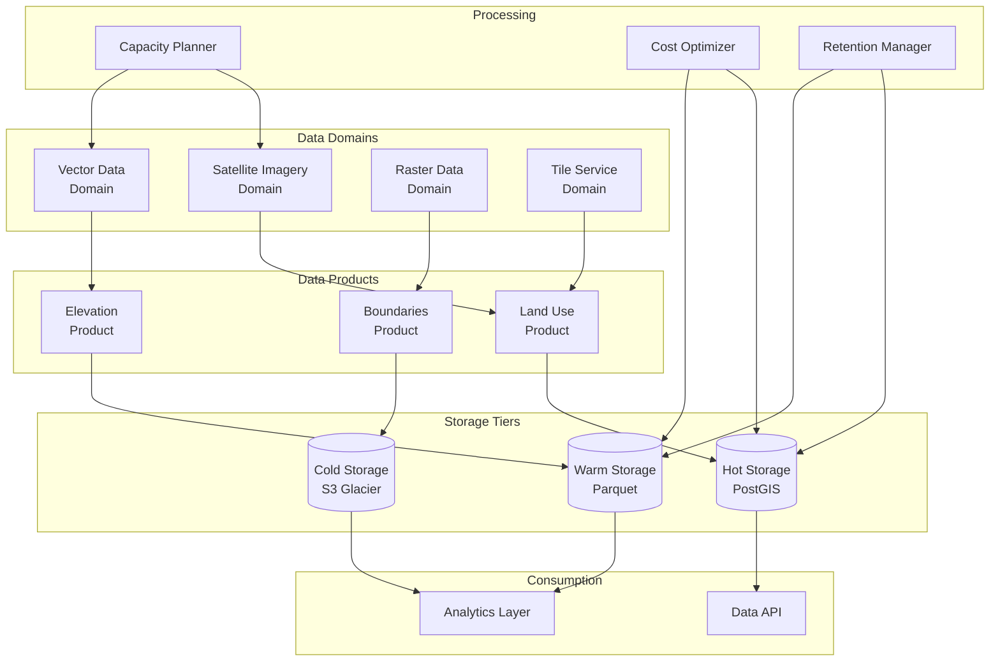

# Geospatial Data Mesh with Cost Optimization and Capacity Planning: A Complete Integration Tutorial

**Objective**: Build a production-ready geospatial data mesh that integrates data mesh architecture, cost-aware architecture, capacity planning and workload modeling, and data retention strategies. This tutorial demonstrates how to build scalable, cost-efficient geospatial data systems.

This tutorial combines:
- **[Data Mesh Architecture](../../best-practices/architecture-design/data-mesh-architecture.md)** - Domain-oriented data architecture
- **[Cost-Aware Architecture & Resource-Efficiency Governance](../../best-practices/architecture-design/cost-aware-architecture-and-efficiency-governance.md)** - Cost optimization
- **[Holistic Capacity Planning, Scaling Economics, and Workload Modeling](../../best-practices/architecture-design/capacity-planning-and-workload-modeling.md)** - Workload modeling
- **[Data Retention, Archival Strategy, Lifecycle Governance](../../best-practices/data-governance/data-retention-archival-lifecycle-governance.md)** - Data lifecycle

## 1) Prerequisites

```bash
# Required tools
docker --version          # >= 20.10
python --version          # >= 3.10
postgis --version         # >= 3.0
duckdb --version          # >= 0.9.0
kubectl --version         # >= 1.28

# Python packages
pip install geopandas shapely pyproj \
    duckdb postgis pandas pyarrow \
    boto3 s3fs prometheus-client
```

**Why**: Geospatial data mesh requires spatial databases (PostGIS), analytics (DuckDB), data formats (GeoParquet), and cost optimization for large geospatial datasets.

## 2) Architecture Overview

We'll build a **Geospatial Data Mesh** with cost optimization:



**Data Mesh Principles**: Domain ownership, data as products, self-serve infrastructure, federated governance.

## 3) Repository Layout

```
geospatial-data-mesh/
├── domains/
│   ├── satellite/
│   │   ├── data_product.py
│   │   └── pipeline.py
│   ├── vector/
│   └── raster/
├── infrastructure/
│   ├── capacity_planner.py
│   ├── cost_optimizer.py
│   └── retention_manager.py
├── storage/
│   ├── postgis_store.py
│   ├── parquet_store.py
│   └── s3_store.py
└── api/
    └── data_api.py
```

## 4) Data Mesh Domain

Create `domains/satellite/data_product.py`:

```python
"""Satellite imagery data product for data mesh."""
from typing import Dict, List, Optional
from datetime import datetime
from dataclasses import dataclass
import geopandas as gpd
from shapely.geometry import box

from prometheus_client import Counter, Gauge

data_product_metrics = {
    "data_products_created": Counter("data_mesh_products_created_total", "Data products created", ["domain", "product"]),
    "data_volume_gb": Gauge("data_mesh_volume_gb", "Data volume", ["domain", "product", "tier"]),
    "access_count": Counter("data_mesh_access_total", "Data product access", ["domain", "product"]),
}


@dataclass
class DataProduct:
    """Data product definition."""
    name: str
    domain: str
    description: str
    schema: Dict
    storage_tier: str = "hot"
    retention_days: int = 365
    cost_per_gb_month: float = 0.023


class SatelliteDataProduct(DataProduct):
    """Satellite imagery data product."""
    
    def __init__(self):
        super().__init__(
            name="satellite-imagery",
            domain="satellite",
            description="Satellite imagery data product",
            schema={
                "image_id": "string",
                "timestamp": "datetime",
                "geometry": "geometry",
                "resolution": "float",
                "bands": "array"
            },
            storage_tier="warm",  # Large files, warm storage
            retention_days=730,
            cost_per_gb_month=0.0125  # S3 Standard-IA
        )
    
    def ingest(self, data_path: str, metadata: Dict):
        """Ingest satellite imagery data."""
        # In production, process and store imagery
        print(f"Ingesting satellite data from {data_path}")
        
        data_product_metrics["data_products_created"].labels(
            domain=self.domain,
            product=self.name
        ).inc()
    
    def query(self, bbox: box, time_range: Optional[tuple] = None) -> gpd.GeoDataFrame:
        """Query satellite imagery data."""
        # In production, query from storage
        data_product_metrics["access_count"].labels(
            domain=self.domain,
            product=self.name
        ).inc()
        
        # Return empty GeoDataFrame for demo
        return gpd.GeoDataFrame()
```

## 5) Capacity Planning for Geospatial

Create `infrastructure/capacity_planner.py`:

```python
"""Capacity planning for geospatial workloads."""
from typing import Dict, List
from dataclasses import dataclass
from enum import Enum
import numpy as np

from prometheus_client import Gauge

capacity_metrics = {
    "geospatial_capacity": Gauge("geospatial_capacity_gb", "Geospatial data capacity", ["domain", "tier"]),
    "processing_capacity": Gauge("geospatial_processing_capacity", "Processing capacity", ["workload_type"]),
}


class GeospatialWorkloadType(Enum):
    """Geospatial workload types."""
    RASTER_PROCESSING = "raster_processing"
    VECTOR_ANALYSIS = "vector_analysis"
    TILE_GENERATION = "tile_generation"
    SPATIAL_JOIN = "spatial_join"


@dataclass
class GeospatialWorkload:
    """Geospatial workload profile."""
    workload_type: GeospatialWorkloadType
    data_size_gb: float
    cpu_cores: int
    memory_gb: int
    gpu_required: bool = False
    storage_io_mbps: float = 100.0


class GeospatialCapacityPlanner:
    """Plans capacity for geospatial workloads."""
    
    def __init__(self):
        self.workloads: Dict[str, GeospatialWorkload] = {}
        self.storage_tiers = {
            "hot": {"capacity_gb": 1000, "cost_per_gb_month": 0.023},
            "warm": {"capacity_gb": 5000, "cost_per_gb_month": 0.0125},
            "cold": {"capacity_gb": 10000, "cost_per_gb_month": 0.004},
        }
    
    def register_workload(self, workload: GeospatialWorkload):
        """Register a geospatial workload."""
        self.workloads[workload.workload_type.value] = workload
    
    def calculate_storage_capacity(self, domain: str, data_volume_gb: float) -> Dict:
        """Calculate required storage capacity."""
        recommendations = {}
        
        # Distribute across tiers based on access patterns
        hot_percent = 0.1  # 10% hot
        warm_percent = 0.3  # 30% warm
        cold_percent = 0.6  # 60% cold
        
        hot_gb = data_volume_gb * hot_percent
        warm_gb = data_volume_gb * warm_percent
        cold_gb = data_volume_gb * cold_percent
        
        recommendations["hot"] = {
            "capacity_gb": hot_gb,
            "cost_per_month": hot_gb * self.storage_tiers["hot"]["cost_per_gb_month"]
        }
        recommendations["warm"] = {
            "capacity_gb": warm_gb,
            "cost_per_month": warm_gb * self.storage_tiers["warm"]["cost_per_gb_month"]
        }
        recommendations["cold"] = {
            "capacity_gb": cold_gb,
            "cost_per_month": cold_gb * self.storage_tiers["cold"]["cost_per_gb_month"]
        }
        
        # Update metrics
        capacity_metrics["geospatial_capacity"].labels(domain=domain, tier="hot").set(hot_gb)
        capacity_metrics["geospatial_capacity"].labels(domain=domain, tier="warm").set(warm_gb)
        capacity_metrics["geospatial_capacity"].labels(domain=domain, tier="cold").set(cold_gb)
        
        return recommendations
    
    def calculate_processing_capacity(self, workload_type: GeospatialWorkloadType) -> Dict:
        """Calculate processing capacity requirements."""
        if workload_type.value not in self.workloads:
            return {"error": "Workload not registered"}
        
        workload = self.workloads[workload_type.value]
        
        # Calculate based on workload characteristics
        if workload.workload_type == GeospatialWorkloadType.RASTER_PROCESSING:
            # Raster processing is CPU and memory intensive
            cpu_required = workload.cpu_cores * 1.5  # 50% overhead
            memory_required = workload.memory_gb * 1.3
            gpu_required = workload.gpu_required
        
        elif workload.workload_type == GeospatialWorkloadType.TILE_GENERATION:
            # Tile generation is I/O intensive
            cpu_required = workload.cpu_cores
            memory_required = workload.memory_gb
            storage_io_required = workload.storage_io_mbps * 1.2
        
        else:
            cpu_required = workload.cpu_cores
            memory_required = workload.memory_gb
        
        capacity_metrics["processing_capacity"].labels(
            workload_type=workload_type.value
        ).set(cpu_required)
        
        return {
            "workload_type": workload_type.value,
            "cpu_cores": cpu_required,
            "memory_gb": memory_required,
            "gpu_required": workload.gpu_required if hasattr(workload, 'gpu_required') else False
        }
    
    def optimize_for_cost(self, domain: str, budget_per_month: float) -> Dict:
        """Optimize capacity for cost constraints."""
        # Get current capacity
        current_capacity = self.calculate_storage_capacity(domain, 1000)  # Example
        
        total_cost = sum(tier["cost_per_month"] for tier in current_capacity.values())
        
        if total_cost <= budget_per_month:
            return {
                "within_budget": True,
                "current_cost": total_cost,
                "recommendations": []
            }
        
        # Optimize by moving more data to cold storage
        recommendations = []
        cost_savings = 0.0
        
        # Move 20% from warm to cold
        warm_to_cold_gb = current_capacity["warm"]["capacity_gb"] * 0.2
        savings = warm_to_cold_gb * (
            self.storage_tiers["warm"]["cost_per_gb_month"] -
            self.storage_tiers["cold"]["cost_per_gb_month"]
        )
        
        recommendations.append({
            "action": "move_to_cold",
            "data_gb": warm_to_cold_gb,
            "savings_per_month": savings
        })
        cost_savings += savings
        
        return {
            "within_budget": (total_cost - cost_savings) <= budget_per_month,
            "current_cost": total_cost,
            "optimized_cost": total_cost - cost_savings,
            "savings": cost_savings,
            "recommendations": recommendations
        }
```

## 6) Cost Optimization

Create `infrastructure/cost_optimizer.py`:

```python
"""Cost optimization for geospatial data mesh."""
from typing import Dict, List
from datetime import datetime
from prometheus_client import Counter, Gauge

cost_metrics = {
    "storage_cost": Gauge("geospatial_storage_cost_per_month", "Storage cost", ["domain", "tier"]),
    "processing_cost": Gauge("geospatial_processing_cost_per_hour", "Processing cost", ["workload"]),
    "optimization_savings": Counter("geospatial_cost_savings_total", "Cost savings", ["optimization_type"]),
}


class GeospatialCostOptimizer:
    """Optimizes costs for geospatial data mesh."""
    
    def __init__(self):
        self.storage_costs = {
            "postgis": 0.023,  # Per GB/month (simplified)
            "parquet_s3_standard": 0.023,
            "parquet_s3_ia": 0.0125,
            "parquet_s3_glacier": 0.004,
        }
        self.compute_costs = {
            "cpu_hour": 0.1,
            "gpu_hour": 1.0,
        }
    
    def calculate_storage_cost(
        self,
        domain: str,
        data_size_gb: float,
        storage_type: str,
        access_pattern: str = "frequent"
    ) -> float:
        """Calculate storage cost."""
        # Select storage tier based on access pattern
        if access_pattern == "frequent":
            tier = "postgis" if storage_type == "database" else "parquet_s3_standard"
        elif access_pattern == "infrequent":
            tier = "parquet_s3_ia"
        else:  # archive
            tier = "parquet_s3_glacier"
        
        cost_per_gb = self.storage_costs.get(tier, 0.023)
        monthly_cost = data_size_gb * cost_per_gb
        
        cost_metrics["storage_cost"].labels(domain=domain, tier=tier).set(monthly_cost)
        
        return monthly_cost
    
    def recommend_optimizations(
        self,
        domain: str,
        current_costs: Dict,
        data_access_patterns: Dict
    ) -> List[Dict]:
        """Recommend cost optimizations."""
        recommendations = []
        
        # Check for underutilized hot storage
        if current_costs.get("hot_storage_gb", 0) > 0:
            hot_access = data_access_patterns.get("hot_access_count", 0)
            if hot_access < 100:  # Low access
                # Recommend moving to warm
                recommendations.append({
                    "type": "move_to_warm",
                    "data_gb": current_costs["hot_storage_gb"],
                    "savings_per_month": current_costs["hot_storage_gb"] * (
                        self.storage_costs["parquet_s3_standard"] -
                        self.storage_costs["parquet_s3_ia"]
                    ),
                    "reason": "Low access frequency"
                })
        
        # Check for old data in warm storage
        if current_costs.get("warm_storage_gb", 0) > 0:
            warm_age_days = data_access_patterns.get("warm_data_age_days", 0)
            if warm_age_days > 90:
                # Recommend moving to cold
                recommendations.append({
                    "type": "move_to_cold",
                    "data_gb": current_costs["warm_storage_gb"] * 0.5,  # Move 50%
                    "savings_per_month": current_costs["warm_storage_gb"] * 0.5 * (
                        self.storage_costs["parquet_s3_ia"] -
                        self.storage_costs["parquet_s3_glacier"]
                    ),
                    "reason": "Data older than 90 days"
                })
        
        # Track savings
        for rec in recommendations:
            cost_metrics["optimization_savings"].labels(
                optimization_type=rec["type"]
            ).inc(rec["savings_per_month"])
        
        return recommendations
```

## 7) Data Retention for Geospatial

Create `infrastructure/retention_manager.py`:

```python
"""Data retention management for geospatial data mesh."""
from typing import Dict, List
from datetime import datetime, timedelta
from dataclasses import dataclass
from prometheus_client import Counter, Gauge

retention_metrics = {
    "data_archived": Counter("geospatial_data_archived_total", "Data archived", ["domain", "tier"]),
    "data_deleted": Counter("geospatial_data_deleted_total", "Data deleted", ["domain"]),
    "retention_applied": Counter("geospatial_retention_applied_total", "Retention policies applied", ["domain"]),
}


@dataclass
class GeospatialRetentionPolicy:
    """Retention policy for geospatial data."""
    domain: str
    data_type: str  # raster, vector, tiles
    hot_retention_days: int = 30
    warm_retention_days: int = 90
    cold_retention_days: int = 365
    delete_after_days: Optional[int] = None


class GeospatialRetentionManager:
    """Manages data retention for geospatial data mesh."""
    
    def __init__(self):
        self.policies: Dict[str, GeospatialRetentionPolicy] = {}
    
    def register_policy(self, policy: GeospatialRetentionPolicy):
        """Register a retention policy."""
        key = f"{policy.domain}:{policy.data_type}"
        self.policies[key] = policy
    
    def apply_retention(self, domain: str, data_type: str, data_path: str, created_date: datetime):
        """Apply retention policy to data."""
        key = f"{domain}:{data_type}"
        if key not in self.policies:
            return {"error": "Policy not found"}
        
        policy = self.policies[key]
        age_days = (datetime.utcnow() - created_date).days
        
        # Determine action
        if age_days <= policy.hot_retention_days:
            action = "keep_hot"
        elif age_days <= policy.warm_retention_days:
            action = "move_to_warm"
            self._move_to_warm(data_path)
        elif age_days <= policy.cold_retention_days:
            action = "move_to_cold"
            self._move_to_cold(data_path)
        elif policy.delete_after_days and age_days > policy.delete_after_days:
            action = "delete"
            self._delete_data(data_path)
            retention_metrics["data_deleted"].labels(domain=domain).inc()
        else:
            action = "keep_cold"
        
        retention_metrics["retention_applied"].labels(domain=domain).inc()
        
        return {
            "domain": domain,
            "data_type": data_type,
            "age_days": age_days,
            "action": action
        }
    
    def _move_to_warm(self, data_path: str):
        """Move data to warm storage."""
        print(f"Moving {data_path} to warm storage")
        retention_metrics["data_archived"].labels(domain="default", tier="warm").inc()
    
    def _move_to_cold(self, data_path: str):
        """Move data to cold storage."""
        print(f"Moving {data_path} to cold storage")
        retention_metrics["data_archived"].labels(domain="default", tier="cold").inc()
    
    def _delete_data(self, data_path: str):
        """Delete data after retention period."""
        print(f"Deleting {data_path} after retention period")
```

## 8) Testing the System

### 8.1) Create Data Product

```python
from domains.satellite.data_product import SatelliteDataProduct

product = SatelliteDataProduct()
product.ingest("s3://data/satellite/imagery.tif", {"resolution": 10.0})
```

### 8.2) Plan Capacity

```python
from infrastructure.capacity_planner import GeospatialCapacityPlanner, GeospatialWorkload, GeospatialWorkloadType

planner = GeospatialCapacityPlanner()

workload = GeospatialWorkload(
    workload_type=GeospatialWorkloadType.RASTER_PROCESSING,
    data_size_gb=1000.0,
    cpu_cores=8,
    memory_gb=32
)
planner.register_workload(workload)

capacity = planner.calculate_storage_capacity("satellite", 1000.0)
print(f"Storage capacity: {capacity}")
```

## 9) Best Practices Integration Summary

This tutorial demonstrates:

1. **Data Mesh Architecture**: Domain-oriented data products with ownership
2. **Cost Optimization**: Storage tier optimization and cost monitoring
3. **Capacity Planning**: Workload modeling for geospatial processing
4. **Data Retention**: Lifecycle management for large geospatial datasets

**Key Integration Points**:
- Capacity planning informs cost optimization
- Retention policies reduce storage costs
- Data mesh domains own their capacity planning
- Cost metrics track optimization effectiveness

## 10) Next Steps

- Add geospatial-specific workload patterns
- Implement tile caching strategies
- Add multi-region data replication
- Integrate with geospatial processing frameworks
- Add data quality validation for geospatial data

---

*This tutorial demonstrates how multiple best practices integrate to create cost-efficient, scalable geospatial data mesh systems.*

