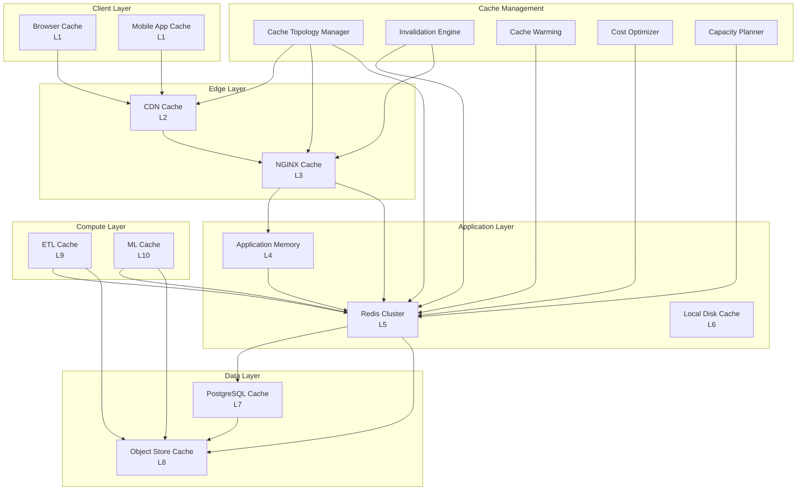

# High-Performance Caching Architecture with Cache Topology and Performance Layers: A Complete Integration Tutorial

**Objective**: Build a production-ready high-performance caching system that integrates cache-topology architecture, end-to-end caching strategy, cost-aware architecture, and capacity planning. This tutorial demonstrates how to build multi-tier caching systems that optimize performance while controlling costs and capacity.

This tutorial combines:
- **[Cache-Topology Architecture](../best-practices/architecture-design/cache-topology-architecture.md)** - Multi-tier cache topology patterns
- **[End-to-End Caching Strategy & Performance Layering](../best-practices/performance/end-to-end-caching-strategy.md)** - Complete caching framework
- **[Cost-Aware Architecture & Resource-Efficiency Governance](../best-practices/architecture-design/cost-aware-architecture-and-efficiency-governance.md)** - Cost optimization
- **[Holistic Capacity Planning, Scaling Economics, and Workload Modeling](../best-practices/architecture-design/capacity-planning-and-workload-modeling.md)** - Capacity planning

## 1) Prerequisites

```bash
# Required tools
docker --version          # >= 20.10
python --version          # >= 3.10
redis --version           # >= 7.0
nginx --version           # >= 1.24
kubectl --version         # >= 1.28

# Python packages
pip install redis redis-py-cluster \
    nginx-config-parser \
    prometheus-client \
    fastapi uvicorn \
    cachetools diskcache \
    boto3
```

**Why**: High-performance caching requires multiple cache layers (Redis, NGINX, application memory), capacity planning, and cost optimization to balance performance and economics.

## 2) Architecture Overview

We'll build a **Multi-Tier Caching System** with comprehensive topology:



**Cache Hierarchy**: 10-tier caching from browser to object storage with intelligent placement and invalidation.

## 3) Repository Layout

```
high-performance-caching/
├── docker-compose.yaml
├── cache/
│   ├── __init__.py
│   ├── topology.py
│   ├── l1_browser.py
│   ├── l2_cdn.py
│   ├── l3_nginx.py
│   ├── l4_app_memory.py
│   ├── l5_redis.py
│   ├── l6_local_disk.py
│   ├── l7_postgres.py
│   ├── l8_object_store.py
│   ├── l9_etl.py
│   └── l10_ml.py
├── management/
│   ├── invalidation.py
│   ├── warming.py
│   ├── cost_optimizer.py
│   └── capacity_planner.py
├── nginx/
│   └── nginx.conf
└── monitoring/
    ├── cache_metrics.py
    └── dashboards.json
```

## 4) Cache Topology Manager

Create `cache/topology.py`:

```python
"""Multi-tier cache topology management."""
from typing import Dict, List, Optional, Tuple, Any
from enum import Enum
from dataclasses import dataclass, field
from datetime import datetime, timedelta
import asyncio
import hashlib
import json

from prometheus_client import Counter, Histogram, Gauge

cache_metrics = {
    "cache_hits": Counter("cache_hits_total", "Cache hits", ["tier", "cache_key"]),
    "cache_misses": Counter("cache_misses_total", "Cache misses", ["tier", "cache_key"]),
    "cache_sets": Counter("cache_sets_total", "Cache sets", ["tier"]),
    "cache_evictions": Counter("cache_evictions_total", "Cache evictions", ["tier", "reason"]),
    "cache_latency": Histogram("cache_latency_seconds", "Cache operation latency", ["tier", "operation"]),
    "cache_size": Gauge("cache_size_bytes", "Cache size", ["tier"]),
    "cache_hit_ratio": Gauge("cache_hit_ratio", "Cache hit ratio", ["tier"]),
}


class CacheTier(Enum):
    """Cache tier enumeration."""
    L1_BROWSER = "l1_browser"
    L2_CDN = "l2_cdn"
    L3_NGINX = "l3_nginx"
    L4_APP_MEMORY = "l4_app_memory"
    L5_REDIS = "l5_redis"
    L6_LOCAL_DISK = "l6_local_disk"
    L7_POSTGRES = "l7_postgres"
    L8_OBJECT_STORE = "l8_object_store"
    L9_ETL = "l9_etl"
    L10_ML = "l10_ml"


@dataclass
class CacheConfig:
    """Cache configuration."""
    tier: CacheTier
    enabled: bool = True
    ttl_seconds: int = 3600
    max_size_bytes: int = 0
    eviction_policy: str = "lru"  # lru, lfu, fifo, random
    cost_per_gb_hour: float = 0.0
    latency_ms: float = 0.0


@dataclass
class CacheEntry:
    """Cache entry."""
    key: str
    value: Any
    tier: CacheTier
    ttl_seconds: int
    created_at: datetime
    access_count: int = 0
    last_accessed: datetime = field(default_factory=datetime.utcnow)
    size_bytes: int = 0


class CacheTopology:
    """Manages multi-tier cache topology."""
    
    def __init__(self):
        self.tiers: Dict[CacheTier, 'CacheLayer'] = {}
        self.configs: Dict[CacheTier, CacheConfig] = {}
        self.routing_rules: List[Dict[str, Any]] = []
        self._initialize_tiers()
    
    def _initialize_tiers(self):
        """Initialize cache tiers."""
        # L1: Browser (handled by HTTP headers)
        self.configs[CacheTier.L1_BROWSER] = CacheConfig(
            tier=CacheTier.L1_BROWSER,
            ttl_seconds=300,
            cost_per_gb_hour=0.0,  # Client-side
            latency_ms=0.0
        )
        
        # L2: CDN
        self.configs[CacheTier.L2_CDN] = CacheConfig(
            tier=CacheTier.L2_CDN,
            ttl_seconds=3600,
            cost_per_gb_hour=0.085,  # CloudFront example
            latency_ms=10.0
        )
        
        # L3: NGINX
        self.configs[CacheTier.L3_NGINX] = CacheConfig(
            tier=CacheTier.L3_NGINX,
            ttl_seconds=600,
            cost_per_gb_hour=0.0,  # Infrastructure cost
            latency_ms=1.0
        )
        
        # L4: Application Memory
        self.configs[CacheTier.L4_APP_MEMORY] = CacheConfig(
            tier=CacheTier.L4_APP_MEMORY,
            ttl_seconds=60,
            max_size_bytes=100 * 1024 * 1024,  # 100MB
            cost_per_gb_hour=0.0,  # Included in compute
            latency_ms=0.1
        )
        
        # L5: Redis Cluster
        self.configs[CacheTier.L5_REDIS] = CacheConfig(
            tier=CacheTier.L5_REDIS,
            ttl_seconds=3600,
            max_size_bytes=10 * 1024 * 1024 * 1024,  # 10GB
            cost_per_gb_hour=0.05,  # Redis Cloud example
            latency_ms=2.0
        )
        
        # L6: Local Disk
        self.configs[CacheTier.L6_LOCAL_DISK] = CacheConfig(
            tier=CacheTier.L6_LOCAL_DISK,
            ttl_seconds=86400,  # 24 hours
            max_size_bytes=100 * 1024 * 1024 * 1024,  # 100GB
            cost_per_gb_hour=0.0,  # Included in compute
            latency_ms=5.0
        )
        
        # L7: PostgreSQL
        self.configs[CacheTier.L7_POSTGRES] = CacheConfig(
            tier=CacheTier.L7_POSTGRES,
            ttl_seconds=0,  # Managed by PostgreSQL
            cost_per_gb_hour=0.023,  # RDS example
            latency_ms=10.0
        )
        
        # L8: Object Store
        self.configs[CacheTier.L8_OBJECT_STORE] = CacheConfig(
            tier=CacheTier.L8_OBJECT_STORE,
            ttl_seconds=604800,  # 7 days
            cost_per_gb_hour=0.023,  # S3 Standard
            latency_ms=50.0
        )
    
    def get_cache_tier(
        self,
        cache_key: str,
        data_size_bytes: int,
        access_pattern: str = "frequent"  # frequent, infrequent, one-time
    ) -> List[CacheTier]:
        """Determine optimal cache tiers for a key."""
        recommended_tiers = []
        
        # Routing rules based on data characteristics
        if data_size_bytes < 1024:  # < 1KB - use fast tiers
            recommended_tiers = [
                CacheTier.L4_APP_MEMORY,
                CacheTier.L5_REDIS,
                CacheTier.L3_NGINX
            ]
        elif data_size_bytes < 1024 * 1024:  # < 1MB
            recommended_tiers = [
                CacheTier.L5_REDIS,
                CacheTier.L6_LOCAL_DISK,
                CacheTier.L3_NGINX
            ]
        else:  # >= 1MB
            recommended_tiers = [
                CacheTier.L6_LOCAL_DISK,
                CacheTier.L8_OBJECT_STORE,
                CacheTier.L2_CDN
            ]
        
        # Adjust based on access pattern
        if access_pattern == "frequent":
            # Prefer faster tiers
            recommended_tiers = [t for t in recommended_tiers if t.value.startswith("l")]
        elif access_pattern == "one-time":
            # Skip caching or use cheapest
            recommended_tiers = [CacheTier.L8_OBJECT_STORE]
        
        return recommended_tiers
    
    async def get(
        self,
        cache_key: str,
        tiers: Optional[List[CacheTier]] = None
    ) -> Optional[Tuple[Any, CacheTier]]:
        """Get value from cache hierarchy."""
        if tiers is None:
            # Try all tiers in order
            tiers = [
                CacheTier.L4_APP_MEMORY,
                CacheTier.L5_REDIS,
                CacheTier.L6_LOCAL_DISK,
                CacheTier.L7_POSTGRES,
                CacheTier.L8_OBJECT_STORE
            ]
        
        for tier in tiers:
            try:
                layer = self.tiers.get(tier)
                if layer:
                    start_time = datetime.utcnow()
                    value = await layer.get(cache_key)
                    duration = (datetime.utcnow() - start_time).total_seconds()
                    
                    cache_metrics["cache_latency"].labels(
                        tier=tier.value,
                        operation="get"
                    ).observe(duration)
                    
                    if value is not None:
                        cache_metrics["cache_hits"].labels(
                            tier=tier.value,
                            cache_key=cache_key
                        ).inc()
                        return value, tier
                    else:
                        cache_metrics["cache_misses"].labels(
                            tier=tier.value,
                            cache_key=cache_key
                        ).inc()
            except Exception as e:
                logging.error(f"Cache get failed for tier {tier}: {e}")
                continue
        
        return None, None
    
    async def set(
        self,
        cache_key: str,
        value: Any,
        data_size_bytes: int,
        access_pattern: str = "frequent"
    ):
        """Set value in appropriate cache tiers."""
        recommended_tiers = self.get_cache_tier(cache_key, data_size_bytes, access_pattern)
        
        # Set in multiple tiers (write-through)
        for tier in recommended_tiers:
            try:
                layer = self.tiers.get(tier)
                if layer:
                    config = self.configs[tier]
                    if config.enabled:
                        start_time = datetime.utcnow()
                        await layer.set(cache_key, value, ttl_seconds=config.ttl_seconds)
                        duration = (datetime.utcnow() - start_time).total_seconds()
                        
                        cache_metrics["cache_latency"].labels(
                            tier=tier.value,
                            operation="set"
                        ).observe(duration)
                        cache_metrics["cache_sets"].labels(tier=tier.value).inc()
            except Exception as e:
                logging.error(f"Cache set failed for tier {tier}: {e}")
    
    async def invalidate(
        self,
        cache_key: str,
        pattern: Optional[str] = None
    ):
        """Invalidate cache across tiers."""
        tiers_to_invalidate = [
            CacheTier.L4_APP_MEMORY,
            CacheTier.L5_REDIS,
            CacheTier.L6_LOCAL_DISK,
            CacheTier.L3_NGINX,
            CacheTier.L2_CDN
        ]
        
        for tier in tiers_to_invalidate:
            try:
                layer = self.tiers.get(tier)
                if layer:
                    if pattern:
                        await layer.invalidate_pattern(pattern)
                    else:
                        await layer.invalidate(cache_key)
            except Exception as e:
                logging.error(f"Cache invalidation failed for tier {tier}: {e}")
```

## 5) L4: Application Memory Cache

Create `cache/l4_app_memory.py`:

```python
"""L4: Application memory cache."""
from typing import Optional, Any, Dict
from cachetools import TTLCache, LRUCache
from functools import wraps
import time
import hashlib
import json

from cache.topology import CacheTier
from prometheus_client import Gauge

memory_cache_metrics = {
    "memory_cache_size": Gauge("memory_cache_size_items", "Memory cache size", ["cache_name"]),
    "memory_cache_hits": Gauge("memory_cache_hits", "Memory cache hits", ["cache_name"]),
    "memory_cache_misses": Gauge("memory_cache_misses", "Memory cache misses", ["cache_name"]),
}


class ApplicationMemoryCache:
    """Application-level in-memory cache."""
    
    def __init__(self, max_size: int = 1000, ttl_seconds: int = 60):
        self.cache = TTLCache(maxsize=max_size, ttl=ttl_seconds)
        self.stats: Dict[str, int] = {"hits": 0, "misses": 0}
    
    async def get(self, key: str) -> Optional[Any]:
        """Get value from memory cache."""
        try:
            value = self.cache.get(key)
            if value is not None:
                self.stats["hits"] += 1
                memory_cache_metrics["memory_cache_hits"].labels(cache_name="default").inc()
                return value
            else:
                self.stats["misses"] += 1
                memory_cache_metrics["memory_cache_misses"].labels(cache_name="default").inc()
                return None
        except KeyError:
            self.stats["misses"] += 1
            return None
    
    async def set(self, key: str, value: Any, ttl_seconds: Optional[int] = None):
        """Set value in memory cache."""
        self.cache[key] = value
        memory_cache_metrics["memory_cache_size"].labels(cache_name="default").set(len(self.cache))
    
    async def invalidate(self, key: str):
        """Invalidate key."""
        self.cache.pop(key, None)
    
    async def invalidate_pattern(self, pattern: str):
        """Invalidate keys matching pattern."""
        keys_to_remove = [key for key in self.cache.keys() if pattern in str(key)]
        for key in keys_to_remove:
            self.cache.pop(key, None)
    
    def get_stats(self) -> Dict[str, Any]:
        """Get cache statistics."""
        hit_ratio = self.stats["hits"] / (self.stats["hits"] + self.stats["misses"]) if (self.stats["hits"] + self.stats["misses"]) > 0 else 0.0
        
        return {
            "size": len(self.cache),
            "hits": self.stats["hits"],
            "misses": self.stats["misses"],
            "hit_ratio": hit_ratio
        }


def cached_memory(ttl_seconds: int = 60, max_size: int = 1000):
    """Decorator for function result caching."""
    cache = TTLCache(maxsize=max_size, ttl=ttl_seconds)
    
    def decorator(func):
        @wraps(func)
        async def wrapper(*args, **kwargs):
            # Generate cache key from function name and arguments
            key_parts = [func.__name__] + [str(args)] + [str(sorted(kwargs.items()))]
            cache_key = hashlib.md5("|".join(key_parts).encode()).hexdigest()
            
            # Try cache
            if cache_key in cache:
                return cache[cache_key]
            
            # Execute function
            result = await func(*args, **kwargs)
            
            # Cache result
            cache[cache_key] = result
            
            return result
        return wrapper
    return decorator
```

## 6) L5: Redis Cluster Cache

Create `cache/l5_redis.py`:

```python
"""L5: Redis cluster cache."""
from typing import Optional, Any, List
import redis
from redis.cluster import RedisCluster
import json
import pickle
from datetime import timedelta

from cache.topology import CacheTier
from prometheus_client import Gauge, Counter

redis_metrics = {
    "redis_connections": Gauge("redis_connections", "Redis connections", ["cluster"]),
    "redis_memory_used": Gauge("redis_memory_used_bytes", "Redis memory used", ["cluster"]),
    "redis_keys": Gauge("redis_keys_count", "Redis keys count", ["cluster"]),
}


class RedisCache:
    """Redis cluster cache implementation."""
    
    def __init__(
        self,
        startup_nodes: List[Dict[str, str]],
        password: Optional[str] = None,
        decode_responses: bool = False
    ):
        self.cluster = RedisCluster(
            startup_nodes=startup_nodes,
            password=password,
            decode_responses=decode_responses,
            skip_full_coverage_check=True
        )
        self.cluster_name = startup_nodes[0].get("host", "default")
    
    async def get(self, key: str) -> Optional[Any]:
        """Get value from Redis."""
        try:
            value = self.cluster.get(key)
            if value:
                # Deserialize
                try:
                    return json.loads(value)
                except:
                    return pickle.loads(value)
            return None
        except Exception as e:
            logging.error(f"Redis get failed: {e}")
            return None
    
    async def set(
        self,
        key: str,
        value: Any,
        ttl_seconds: Optional[int] = None
    ):
        """Set value in Redis."""
        try:
            # Serialize
            try:
                serialized = json.dumps(value)
            except:
                serialized = pickle.dumps(value)
            
            if ttl_seconds:
                self.cluster.setex(key, ttl_seconds, serialized)
            else:
                self.cluster.set(key, serialized)
        except Exception as e:
            logging.error(f"Redis set failed: {e}")
    
    async def invalidate(self, key: str):
        """Invalidate key."""
        self.cluster.delete(key)
    
    async def invalidate_pattern(self, pattern: str):
        """Invalidate keys matching pattern."""
        keys = []
        for node in self.cluster.get_nodes():
            keys.extend(node.keys(pattern))
        
        if keys:
            self.cluster.delete(*keys)
    
    def get_stats(self) -> Dict[str, Any]:
        """Get Redis cluster statistics."""
        info = self.cluster.info()
        
        redis_metrics["redis_memory_used"].labels(cluster=self.cluster_name).set(
            info.get("used_memory", 0)
        )
        redis_metrics["redis_keys"].labels(cluster=self.cluster_name).set(
            info.get("keyspace", {}).get("keys", 0)
        )
        
        return {
            "memory_used": info.get("used_memory", 0),
            "keys": info.get("keyspace", {}).get("keys", 0),
            "connected_clients": info.get("connected_clients", 0)
        }
```

## 7) Cache Invalidation Engine

Create `management/invalidation.py`:

```python
"""Cache invalidation engine."""
from typing import Dict, List, Set, Optional
from dataclasses import dataclass
from datetime import datetime
from enum import Enum
import asyncio

from prometheus_client import Counter, Histogram

invalidation_metrics = {
    "invalidations": Counter("cache_invalidations_total", "Cache invalidations", ["tier", "strategy"]),
    "invalidation_duration": Histogram("cache_invalidation_duration_seconds", "Invalidation duration"),
    "stale_data_detected": Counter("cache_stale_data_detected_total", "Stale data detected"),
}


class InvalidationStrategy(Enum):
    """Invalidation strategy."""
    TIME_BASED = "time_based"
    EVENT_BASED = "event_based"
    TAG_BASED = "tag_based"
    VERSION_BASED = "version_based"


@dataclass
class InvalidationRule:
    """Cache invalidation rule."""
    rule_id: str
    strategy: InvalidationStrategy
    cache_keys: List[str]
    cache_patterns: List[str]
    tags: List[str]
    ttl_seconds: Optional[int] = None
    event_types: List[str] = field(default_factory=list)


class CacheInvalidationEngine:
    """Manages cache invalidation across tiers."""
    
    def __init__(self, cache_topology):
        self.topology = cache_topology
        self.rules: Dict[str, InvalidationRule] = {}
        self.invalidation_queue: asyncio.Queue = asyncio.Queue()
        self.running = False
    
    def register_rule(self, rule: InvalidationRule):
        """Register invalidation rule."""
        self.rules[rule.rule_id] = rule
    
    async def invalidate_on_event(
        self,
        event_type: str,
        event_data: Dict[str, Any]
    ):
        """Invalidate cache based on event."""
        start_time = datetime.utcnow()
        
        # Find rules that match event
        matching_rules = [
            rule for rule in self.rules.values()
            if rule.strategy == InvalidationStrategy.EVENT_BASED
            and event_type in rule.event_types
        ]
        
        invalidated_keys = set()
        
        for rule in matching_rules:
            # Determine keys to invalidate
            keys_to_invalidate = self._resolve_keys(rule, event_data)
            
            for key in keys_to_invalidate:
                await self.topology.invalidate(key)
                invalidated_keys.add(key)
            
            invalidation_metrics["invalidations"].labels(
                tier="all",
                strategy=rule.strategy.value
            ).inc(len(keys_to_invalidate))
        
        duration = (datetime.utcnow() - start_time).total_seconds()
        invalidation_metrics["invalidation_duration"].observe(duration)
        
        return list(invalidated_keys)
    
    def _resolve_keys(self, rule: InvalidationRule, event_data: Dict[str, Any]) -> List[str]:
        """Resolve cache keys from rule and event data."""
        keys = []
        
        # Direct keys
        keys.extend(rule.cache_keys)
        
        # Pattern-based keys
        for pattern in rule.cache_patterns:
            # In production, query cache for matching keys
            # For demo, use pattern matching
            if "order" in pattern and "order_id" in event_data:
                keys.append(pattern.replace("*", event_data["order_id"]))
        
        # Tag-based keys
        if rule.tags:
            # In production, use tag index
            pass
        
        return keys
    
    async def invalidate_by_tag(self, tag: str):
        """Invalidate all cache entries with a tag."""
        matching_rules = [
            rule for rule in self.rules.values()
            if tag in rule.tags
        ]
        
        for rule in matching_rules:
            for pattern in rule.cache_patterns:
                await self.topology.invalidate(pattern=pattern)
    
    async def start_background_invalidation(self):
        """Start background invalidation worker."""
        self.running = True
        
        while self.running:
            try:
                # Process invalidation queue
                if not self.invalidation_queue.empty():
                    invalidation_task = await self.invalidation_queue.get()
                    await self._process_invalidation(invalidation_task)
                
                # Check time-based invalidations
                await self._check_time_based_invalidations()
                
                await asyncio.sleep(1.0)
            
            except Exception as e:
                logging.error(f"Invalidation worker error: {e}")
                await asyncio.sleep(5.0)
    
    async def _check_time_based_invalidations(self):
        """Check and execute time-based invalidations."""
        time_based_rules = [
            rule for rule in self.rules.values()
            if rule.strategy == InvalidationStrategy.TIME_BASED
            and rule.ttl_seconds
        ]
        
        # In production, check TTLs and invalidate expired entries
        pass
    
    async def _process_invalidation(self, task: Dict[str, Any]):
        """Process invalidation task."""
        keys = task.get("keys", [])
        pattern = task.get("pattern")
        
        if pattern:
            await self.topology.invalidate(pattern=pattern)
        else:
            for key in keys:
                await self.topology.invalidate(key)
```

## 8) Cache Warming

Create `management/warming.py`:

```python
"""Cache warming strategies."""
from typing import List, Dict, Any, Callable, Optional
from dataclasses import dataclass
from datetime import datetime
import asyncio

from prometheus_client import Counter, Histogram

warming_metrics = {
    "cache_warming_operations": Counter("cache_warming_operations_total", "Cache warming operations", ["strategy"]),
    "cache_warming_duration": Histogram("cache_warming_duration_seconds", "Cache warming duration"),
    "cache_warming_items": Counter("cache_warming_items_total", "Items warmed", ["tier"]),
}


@dataclass
class WarmingStrategy:
    """Cache warming strategy."""
    strategy_id: str
    name: str
    key_generator: Callable[[], List[str]]
    data_loader: Callable[[str], Any]
    tiers: List[str]
    priority: int = 0  # Higher priority = warm first


class CacheWarmer:
    """Warms cache with frequently accessed data."""
    
    def __init__(self, cache_topology):
        self.topology = cache_topology
        self.strategies: List[WarmingStrategy] = []
        self.warming_history: List[Dict[str, Any]] = []
    
    def register_strategy(self, strategy: WarmingStrategy):
        """Register warming strategy."""
        self.strategies.append(strategy)
        self.strategies.sort(key=lambda s: s.priority, reverse=True)
    
    async def warm_cache(self, strategy_id: Optional[str] = None):
        """Warm cache using strategies."""
        strategies_to_execute = [
            s for s in self.strategies
            if strategy_id is None or s.strategy_id == strategy_id
        ]
        
        for strategy in strategies_to_execute:
            start_time = datetime.utcnow()
            
            try:
                # Generate keys to warm
                keys = strategy.key_generator()
                
                # Load and cache data
                warmed_count = 0
                for key in keys:
                    try:
                        # Load data
                        data = await strategy.data_loader(key)
                        
                        # Determine data size (simplified)
                        data_size = len(str(data).encode())
                        
                        # Cache in appropriate tiers
                        await self.topology.set(
                            cache_key=key,
                            value=data,
                            data_size_bytes=data_size,
                            access_pattern="frequent"
                        )
                        
                        warmed_count += 1
                        warming_metrics["cache_warming_items"].labels(tier="all").inc()
                    
                    except Exception as e:
                        logging.error(f"Failed to warm key {key}: {e}")
                
                duration = (datetime.utcnow() - start_time).total_seconds()
                warming_metrics["cache_warming_duration"].observe(duration)
                warming_metrics["cache_warming_operations"].labels(
                    strategy=strategy.strategy_id
                ).inc()
                
                self.warming_history.append({
                    "strategy_id": strategy.strategy_id,
                    "keys_warmed": warmed_count,
                    "duration_seconds": duration,
                    "timestamp": start_time
                })
            
            except Exception as e:
                logging.error(f"Cache warming failed for strategy {strategy_id}: {e}")
    
    async def warm_on_schedule(self, interval_seconds: int = 3600):
        """Warm cache on schedule."""
        while True:
            await self.warm_cache()
            await asyncio.sleep(interval_seconds)
    
    async def warm_on_startup(self):
        """Warm cache on application startup."""
        # Warm high-priority strategies
        high_priority = [s for s in self.strategies if s.priority >= 5]
        for strategy in high_priority:
            await self.warm_cache(strategy.strategy_id)
```

## 9) Cost Optimizer for Caching

Create `management/cost_optimizer.py`:

```python
"""Cost optimization for caching."""
from typing import Dict, List, Optional, Tuple
from dataclasses import dataclass
from datetime import datetime, timedelta
import statistics

from cache.topology import CacheTier, CacheConfig
from prometheus_client import Gauge, Counter

cost_metrics = {
    "cache_cost_per_hour": Gauge("cache_cost_per_hour", "Cache cost per hour", ["tier"]),
    "cache_cost_savings": Counter("cache_cost_savings_total", "Cost savings", ["optimization"]),
    "cache_utilization": Gauge("cache_utilization_percent", "Cache utilization", ["tier"]),
}


@dataclass
class CacheCostProfile:
    """Cache cost profile."""
    tier: CacheTier
    current_cost_per_hour: float
    data_size_gb: float
    hit_ratio: float
    access_rate_per_hour: float
    estimated_savings: float = 0.0


class CacheCostOptimizer:
    """Optimizes cache costs."""
    
    def __init__(self, cache_topology):
        self.topology = cache_topology
        self.cost_profiles: Dict[CacheTier, CacheCostProfile] = {}
        self.optimization_history: List[Dict[str, Any]] = []
    
    def calculate_tier_cost(
        self,
        tier: CacheTier,
        data_size_gb: float,
        hit_ratio: float,
        access_rate_per_hour: float
    ) -> CacheCostProfile:
        """Calculate cost for a cache tier."""
        config = self.topology.configs.get(tier)
        if not config:
            return None
        
        # Storage cost
        storage_cost = data_size_gb * config.cost_per_gb_hour
        
        # Compute cost (for managed services)
        compute_cost = 0.0  # In production, calculate based on instance type
        
        # Data transfer cost (for CDN/object store)
        transfer_cost = 0.0
        if tier in [CacheTier.L2_CDN, CacheTier.L8_OBJECT_STORE]:
            # Estimate transfer based on miss rate
            miss_rate = 1.0 - hit_ratio
            transfer_gb = access_rate_per_hour * miss_rate * 0.001  # Assume 1KB per request
            transfer_cost = transfer_gb * 0.09  # $0.09/GB transfer cost
        
        total_cost = storage_cost + compute_cost + transfer_cost
        
        profile = CacheCostProfile(
            tier=tier,
            current_cost_per_hour=total_cost,
            data_size_gb=data_size_gb,
            hit_ratio=hit_ratio,
            access_rate_per_hour=access_rate_per_hour
        )
        
        self.cost_profiles[tier] = profile
        
        cost_metrics["cache_cost_per_hour"].labels(tier=tier.value).set(total_cost)
        cost_metrics["cache_utilization"].labels(tier=tier.value).set(hit_ratio * 100)
        
        return profile
    
    def recommend_optimizations(
        self,
        target_cost_reduction_percent: float = 20.0
    ) -> List[Dict[str, Any]]:
        """Recommend cost optimizations."""
        recommendations = []
        total_cost = sum(p.current_cost_per_hour for p in self.cost_profiles.values())
        target_cost = total_cost * (1 - target_cost_reduction_percent / 100)
        
        # Sort by cost (highest first)
        sorted_profiles = sorted(
            self.cost_profiles.values(),
            key=lambda p: p.current_cost_per_hour,
            reverse=True
        )
        
        for profile in sorted_profiles:
            if profile.current_cost_per_hour == 0:
                continue
            
            # Check for low hit ratio
            if profile.hit_ratio < 0.5:
                savings = profile.current_cost_per_hour * 0.3  # 30% savings potential
                recommendations.append({
                    "tier": profile.tier.value,
                    "optimization": "disable_low_hit_ratio",
                    "savings_per_hour": savings,
                    "reason": f"Hit ratio {profile.hit_ratio:.2%} is below threshold"
                })
            
            # Check for oversized cache
            if profile.data_size_gb > 100 and profile.hit_ratio < 0.7:
                # Move to cheaper tier
                cheaper_tier = self._find_cheaper_tier(profile.tier)
                if cheaper_tier:
                    savings = profile.current_cost_per_hour * 0.5
                    recommendations.append({
                        "tier": profile.tier.value,
                        "optimization": f"move_to_{cheaper_tier.value}",
                        "savings_per_hour": savings,
                        "reason": "Large cache with low hit ratio - move to cheaper tier"
                    })
            
            # Check for underutilized cache
            if profile.access_rate_per_hour < 10:
                savings = profile.current_cost_per_hour
                recommendations.append({
                    "tier": profile.tier.value,
                    "optimization": "disable_underutilized",
                    "savings_per_hour": savings,
                    "reason": f"Low access rate: {profile.access_rate_per_hour}/hour"
                })
        
        # Track savings
        total_savings = sum(r["savings_per_hour"] for r in recommendations)
        if total_savings > 0:
            cost_metrics["cache_cost_savings"].labels(optimization="recommendations").inc(total_savings)
        
        return recommendations
    
    def _find_cheaper_tier(self, current_tier: CacheTier) -> Optional[CacheTier]:
        """Find cheaper cache tier."""
        current_cost = self.topology.configs[current_tier].cost_per_gb_hour
        
        cheaper_tiers = [
            tier for tier, config in self.topology.configs.items()
            if config.cost_per_gb_hour < current_cost
        ]
        
        if cheaper_tiers:
            # Return cheapest
            return min(cheaper_tiers, key=lambda t: self.topology.configs[t].cost_per_gb_hour)
        
        return None
    
    def optimize_tier_placement(
        self,
        cache_key: str,
        data_size_bytes: int,
        access_pattern: str,
        current_tier: CacheTier
    ) -> Optional[CacheTier]:
        """Optimize tier placement for a cache key."""
        recommended_tiers = self.topology.get_cache_tier(
            cache_key,
            data_size_bytes,
            access_pattern
        )
        
        if recommended_tiers and recommended_tiers[0] != current_tier:
            # Check cost difference
            current_cost = self.topology.configs[current_tier].cost_per_gb_hour
            recommended_cost = self.topology.configs[recommended_tiers[0]].cost_per_gb_hour
            
            if recommended_cost < current_cost:
                return recommended_tiers[0]
        
        return None
```

## 10) Capacity Planning for Caching

Create `management/capacity_planner.py`:

```python
"""Capacity planning for cache systems."""
from typing import Dict, List, Optional, Tuple
from dataclasses import dataclass
from datetime import datetime, timedelta
import numpy as np

from cache.topology import CacheTier, CacheConfig
from prometheus_client import Gauge, Histogram

capacity_metrics = {
    "cache_capacity_gb": Gauge("cache_capacity_gb", "Cache capacity", ["tier"]),
    "cache_usage_gb": Gauge("cache_usage_gb", "Cache usage", ["tier"]),
    "cache_usage_percent": Gauge("cache_usage_percent", "Cache usage percentage", ["tier"]),
    "capacity_planning_duration": Histogram("capacity_planning_duration_seconds", "Capacity planning duration"),
}


@dataclass
class CacheWorkload:
    """Cache workload profile."""
    workload_id: str
    cache_keys_per_second: float
    average_key_size_bytes: int
    hit_ratio: float
    access_pattern: str  # random, sequential, hot_cold
    peak_hours: List[int]  # Hours of day with peak load


@dataclass
class CapacityRequirement:
    """Capacity requirement for cache tier."""
    tier: CacheTier
    required_capacity_gb: float
    required_throughput_ops_sec: float
    recommended_instance_type: str
    estimated_cost_per_hour: float
    utilization_percent: float


class CacheCapacityPlanner:
    """Plans capacity for cache systems."""
    
    def __init__(self, cache_topology):
        self.topology = cache_topology
        self.workloads: Dict[str, CacheWorkload] = {}
        self.historical_data: List[Dict[str, Any]] = []
    
    def register_workload(self, workload: CacheWorkload):
        """Register cache workload."""
        self.workloads[workload.workload_id] = workload
    
    def record_usage(
        self,
        tier: CacheTier,
        data_size_gb: float,
        operations_per_second: float,
        hit_ratio: float
    ):
        """Record cache usage metrics."""
        self.historical_data.append({
            "tier": tier.value,
            "timestamp": datetime.utcnow(),
            "data_size_gb": data_size_gb,
            "operations_per_second": operations_per_second,
            "hit_ratio": hit_ratio
        })
        
        capacity_metrics["cache_usage_gb"].labels(tier=tier.value).set(data_size_gb)
        capacity_metrics["cache_usage_percent"].labels(tier=tier.value).set(
            (data_size_gb / self._get_tier_capacity(tier)) * 100
        )
    
    def _get_tier_capacity(self, tier: CacheTier) -> float:
        """Get tier capacity in GB."""
        config = self.topology.configs.get(tier)
        if config and config.max_size_bytes > 0:
            return config.max_size_bytes / (1024 ** 3)
        return 100.0  # Default
    
    def calculate_capacity_requirement(
        self,
        tier: CacheTier,
        workloads: List[CacheWorkload]
    ) -> CapacityRequirement:
        """Calculate capacity requirements for a tier."""
        start_time = datetime.utcnow()
        
        # Aggregate workload requirements
        total_keys_per_second = sum(w.cache_keys_per_second for w in workloads)
        total_data_size_gb = sum(
            (w.cache_keys_per_second * w.average_key_size_bytes * 3600) / (1024 ** 3)
            for w in workloads
        )
        
        # Add 20% buffer
        required_capacity_gb = total_data_size_gb * 1.2
        required_throughput = total_keys_per_second * 1.2
        
        # Find appropriate instance type
        recommended_instance = self._select_instance_type(
            tier,
            required_capacity_gb,
            required_throughput
        )
        
        # Calculate cost
        config = self.topology.configs.get(tier)
        cost_per_hour = required_capacity_gb * config.cost_per_gb_hour if config else 0.0
        
        # Calculate utilization
        tier_capacity = self._get_tier_capacity(tier)
        utilization = (required_capacity_gb / tier_capacity) * 100 if tier_capacity > 0 else 0.0
        
        duration = (datetime.utcnow() - start_time).total_seconds()
        capacity_metrics["capacity_planning_duration"].observe(duration)
        capacity_metrics["cache_capacity_gb"].labels(tier=tier.value).set(required_capacity_gb)
        
        return CapacityRequirement(
            tier=tier,
            required_capacity_gb=required_capacity_gb,
            required_throughput_ops_sec=required_throughput,
            recommended_instance_type=recommended_instance,
            estimated_cost_per_hour=cost_per_hour,
            utilization_percent=utilization
        )
    
    def _select_instance_type(
        self,
        tier: CacheTier,
        capacity_gb: float,
        throughput_ops_sec: float
    ) -> str:
        """Select appropriate instance type."""
        if tier == CacheTier.L5_REDIS:
            # Redis instance selection
            if capacity_gb <= 1.0:
                return "cache.t3.micro"
            elif capacity_gb <= 6.0:
                return "cache.t3.small"
            elif capacity_gb <= 13.0:
                return "cache.t3.medium"
            else:
                return "cache.m5.large"
        
        elif tier == CacheTier.L2_CDN:
            # CDN doesn't need instance selection
            return "cdn_distribution"
        
        else:
            return "default"
    
    def predict_future_capacity(
        self,
        tier: CacheTier,
        days_ahead: int = 30
    ) -> Dict[str, Any]:
        """Predict future capacity needs."""
        # Get historical data for tier
        tier_data = [
            d for d in self.historical_data
            if d["tier"] == tier.value
        ]
        
        if not tier_data:
            return {"error": "Insufficient historical data"}
        
        # Extract time series
        timestamps = [d["timestamp"] for d in tier_data]
        data_sizes = [d["data_size_gb"] for d in tier_data]
        ops_rates = [d["operations_per_second"] for d in tier_data]
        
        # Simple linear regression (in production, use more sophisticated forecasting)
        if len(data_sizes) > 1:
            # Calculate trend
            size_trend = np.polyfit(range(len(data_sizes)), data_sizes, 1)
            ops_trend = np.polyfit(range(len(ops_rates)), ops_rates, 1)
            
            # Project forward
            future_size = size_trend[0] * days_ahead + size_trend[1]
            future_ops = ops_trend[0] * days_ahead + ops_trend[1]
            
            return {
                "tier": tier.value,
                "days_ahead": days_ahead,
                "predicted_capacity_gb": max(0, future_size),
                "predicted_throughput_ops_sec": max(0, future_ops),
                "growth_rate_gb_per_day": size_trend[0]
            }
        
        return {"error": "Insufficient data for prediction"}
    
    def recommend_scaling(
        self,
        tier: CacheTier,
        current_utilization_percent: float,
        target_utilization_percent: float = 70.0
    ) -> Dict[str, Any]:
        """Recommend scaling actions."""
        if current_utilization_percent < target_utilization_percent * 0.5:
            # Underutilized - scale down
            return {
                "action": "scale_down",
                "reason": f"Utilization {current_utilization_percent:.1f}% is below threshold",
                "recommended_utilization": target_utilization_percent
            }
        
        elif current_utilization_percent > target_utilization_percent:
            # Overutilized - scale up
            scale_factor = current_utilization_percent / target_utilization_percent
            
            return {
                "action": "scale_up",
                "reason": f"Utilization {current_utilization_percent:.1f}% exceeds threshold",
                "scale_factor": scale_factor,
                "recommended_utilization": target_utilization_percent
            }
        
        return {
            "action": "maintain",
            "reason": f"Utilization {current_utilization_percent:.1f}% is within target range"
        }
```

## 11) NGINX Cache Configuration

Create `nginx/nginx.conf`:

```nginx
# NGINX cache configuration (L3 tier)
http {
    # Cache zones
    proxy_cache_path /var/cache/nginx levels=1:2 keys_zone=api_cache:10m max_size=1g 
                     inactive=10m use_temp_path=off;
    
    proxy_cache_path /var/cache/nginx/static levels=1:2 keys_zone=static_cache:50m max_size=10g 
                     inactive=60m use_temp_path=off;
    
    # Cache key configuration
    proxy_cache_key "$scheme$request_method$host$request_uri$http_accept_encoding";
    
    # Cache validity
    proxy_cache_valid 200 302 10m;
    proxy_cache_valid 404 1m;
    proxy_cache_valid any 5m;
    
    # Cache headers
    add_header X-Cache-Status $upstream_cache_status;
    add_header X-Cache-Tier "L3-NGINX";
    
    # Upstream services
    upstream api_backend {
        least_conn;
        server api-service-1:8000;
        server api-service-2:8000;
        server api-service-3:8000;
    }
    
    # API caching
    server {
        listen 80;
        server_name api.example.com;
        
        location /api/ {
            proxy_pass http://api_backend;
            proxy_cache api_cache;
            proxy_cache_bypass $http_cache_control;
            proxy_no_cache $http_cache_control;
            
            # Cache warming
            proxy_cache_use_stale error timeout updating http_500 http_502 http_503 http_504;
            proxy_cache_background_update on;
            
            # Cache lock to prevent thundering herd
            proxy_cache_lock on;
            proxy_cache_lock_timeout 5s;
        }
        
        # Static asset caching
        location /static/ {
            proxy_pass http://api_backend;
            proxy_cache static_cache;
            proxy_cache_valid 200 1h;
            expires 1h;
            add_header Cache-Control "public, immutable";
        }
    }
    
    # Microcache for dynamic content
    server {
        listen 80;
        server_name dynamic.example.com;
        
        location / {
            proxy_pass http://api_backend;
            proxy_cache api_cache;
            proxy_cache_valid 200 5s;  # Very short TTL for dynamic content
            proxy_cache_min_uses 1;
            proxy_cache_lock on;
        }
    }
}
```

## 12) Complete Caching Service

Create `cache_service.py`:

```python
"""Complete caching service with all tiers."""
from fastapi import FastAPI, HTTPException, Header
from typing import Optional, Dict, Any
import asyncio

from cache.topology import CacheTopology, CacheTier
from cache.l4_app_memory import ApplicationMemoryCache
from cache.l5_redis import RedisCache
from management.invalidation import CacheInvalidationEngine
from management.warming import CacheWarmer
from management.cost_optimizer import CacheCostOptimizer
from management.capacity_planner import CacheCapacityPlanner

app = FastAPI(title="High-Performance Caching Service")

# Initialize components
topology = CacheTopology()
topology.tiers[CacheTier.L4_APP_MEMORY] = ApplicationMemoryCache(max_size=1000, ttl_seconds=60)
topology.tiers[CacheTier.L5_REDIS] = RedisCache(
    startup_nodes=[{"host": "redis", "port": "6379"}]
)

invalidation_engine = CacheInvalidationEngine(topology)
cache_warmer = CacheWarmer(topology)
cost_optimizer = CacheCostOptimizer(topology)
capacity_planner = CacheCapacityPlanner(topology)


@app.get("/cache/{cache_key}")
async def get_cache(cache_key: str):
    """Get value from cache."""
    value, tier = await topology.get(cache_key)
    
    if value is None:
        raise HTTPException(status_code=404, detail="Cache miss")
    
    return {
        "key": cache_key,
        "value": value,
        "tier": tier.value if tier else None
    }


@app.post("/cache/{cache_key}")
async def set_cache(
    cache_key: str,
    value: Dict[str, Any],
    ttl_seconds: Optional[int] = None,
    access_pattern: str = "frequent"
):
    """Set value in cache."""
    data_size = len(str(value).encode())
    
    await topology.set(
        cache_key=cache_key,
        value=value,
        data_size_bytes=data_size,
        access_pattern=access_pattern
    )
    
    return {"status": "cached", "key": cache_key}


@app.delete("/cache/{cache_key}")
async def invalidate_cache(cache_key: str):
    """Invalidate cache key."""
    await topology.invalidate(cache_key)
    return {"status": "invalidated", "key": cache_key}


@app.post("/cache/invalidate/event")
async def invalidate_on_event(
    event_type: str,
    event_data: Dict[str, Any]
):
    """Invalidate cache based on event."""
    invalidated_keys = await invalidation_engine.invalidate_on_event(
        event_type,
        event_data
    )
    return {"invalidated_keys": invalidated_keys}


@app.post("/cache/warm")
async def warm_cache(strategy_id: Optional[str] = None):
    """Warm cache."""
    await cache_warmer.warm_cache(strategy_id)
    return {"status": "warming_complete"}


@app.get("/cache/cost/analysis")
async def get_cost_analysis():
    """Get cache cost analysis."""
    recommendations = cost_optimizer.recommend_optimizations()
    return {
        "recommendations": recommendations,
        "total_potential_savings": sum(r["savings_per_hour"] for r in recommendations)
    }


@app.get("/cache/capacity/requirements")
async def get_capacity_requirements():
    """Get capacity requirements."""
    requirements = []
    for tier in CacheTier:
        if tier in topology.tiers:
            req = capacity_planner.calculate_capacity_requirement(
                tier,
                list(capacity_planner.workloads.values())
            )
            requirements.append(req.__dict__)
    
    return {"requirements": requirements}
```

## 13) Testing the System

### 13.1) Start Services

```bash
# Start Redis cluster
docker compose up -d redis

# Start NGINX
docker compose up -d nginx

# Start caching service
uvicorn cache_service:app --reload
```

### 13.2) Test Multi-Tier Caching

```python
from cache.topology import CacheTopology

topology = CacheTopology()

# Set value (automatically placed in optimal tiers)
await topology.set(
    cache_key="user:123",
    value={"name": "John", "email": "john@example.com"},
    data_size_bytes=100,
    access_pattern="frequent"
)

# Get value (searches all tiers)
value, tier = await topology.get("user:123")
print(f"Retrieved from tier: {tier}")
```

## 14) Best Practices Integration Summary

This tutorial demonstrates:

1. **Cache-Topology Architecture**: 10-tier cache hierarchy from browser to object storage
2. **End-to-End Caching Strategy**: Complete caching framework with invalidation and warming
3. **Cost-Aware Architecture**: Cost optimization and tier placement based on economics
4. **Capacity Planning**: Workload modeling and capacity prediction for cache systems

**Key Integration Points**:
- Cache topology determines optimal tier placement
- Cost optimizer recommends tier migrations
- Capacity planner predicts future needs
- Invalidation engine maintains consistency
- Cache warmer preloads frequently accessed data

## 15) Next Steps

- Add cache coherence protocols
- Implement distributed cache invalidation
- Add cache analytics and insights
- Integrate with CDN providers
- Add cache performance dashboards

---

*This tutorial demonstrates how multiple best practices integrate to create a high-performance, cost-optimized multi-tier caching system.*

