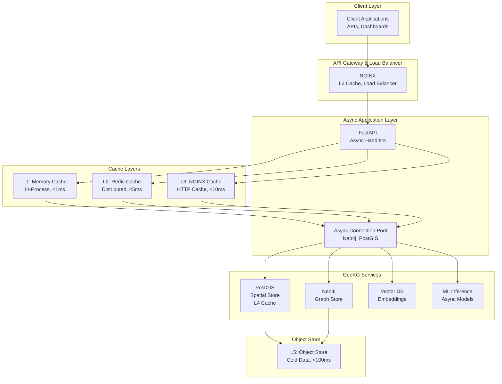
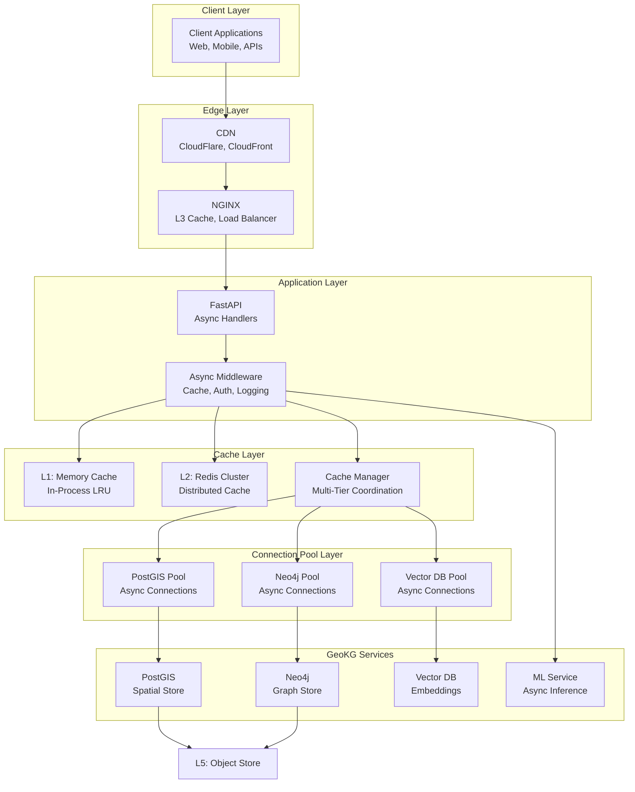
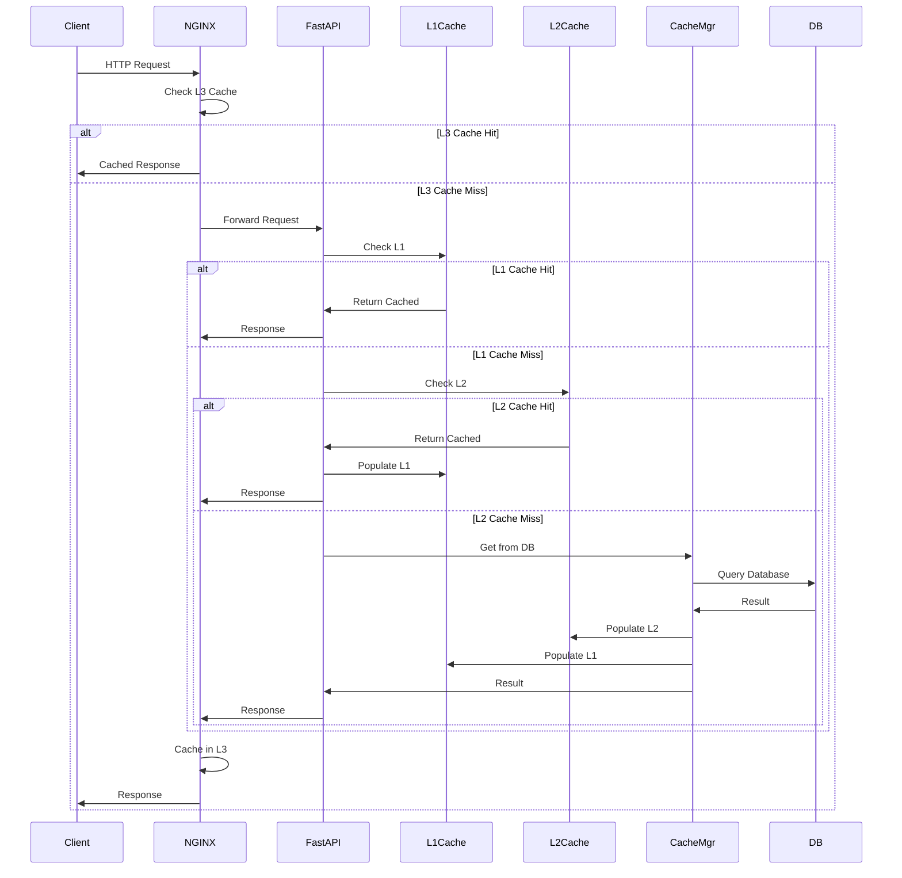

# High-Performance Geospatial Knowledge Graph with Python Async and Multi-Tier Caching

**Objective**: Build an ultra-high-performance geospatial knowledge graph system using Python async patterns for concurrency and multi-tier caching for sub-millisecond spatial and graph queries. This tutorial demonstrates how to achieve sub-100ms query performance through async I/O, connection pooling, and intelligent caching strategies.

This tutorial combines:
- **[AI-Ready, ML-Enabled Geospatial Knowledge Graph](../../best-practices/database-data/ai-ml-geospatial-knowledge-graph.md)** - Geospatial knowledge graph foundations
- **[Python Async Best Practices](../../best-practices/python/python-async-best-practices.md)** - High-performance async patterns
- **[End-to-End Caching Strategy & Performance Layering](../../best-practices/performance/end-to-end-caching-strategy.md)** - Multi-tier caching architecture

## Abstract

GeoKG systems require high throughput and low latency for real-time applications. Traditional synchronous architectures struggle with concurrent query processing, and single-tier caching fails to optimize across all access patterns. This tutorial shows how to build a high-performance GeoKG using Python async for concurrent operations and multi-tier caching (L1 memory, L2 Redis, L3 NGINX, L4 PostGIS, L5 object store) to achieve sub-100ms query performance.

**What This Tutorial Covers**:
- Python async patterns for GeoKG (async/await, concurrent queries, async I/O)
- Multi-tier caching architecture (5-tier cache layers)
- Cache strategies (cache-aside, read-through, write-through, write-behind)
- Async request handling with FastAPI
- Connection pooling for graph and spatial databases
- Cache warming and invalidation strategies
- Performance optimization techniques
- Sub-100ms query performance patterns

**Prerequisites**:
- Understanding of geospatial data (PostGIS, H3/S2)
- Familiarity with knowledge graphs (Neo4j, RDF, SPARQL)
- Experience with Python async/await
- Knowledge of caching strategies and performance optimization

## Table of Contents

1. [Introduction & Motivation](#1-introduction--motivation)
2. [Conceptual Foundations](#2-conceptual-foundations)
3. [Systems Architecture & Integration Patterns](#3-systems-architecture--integration-patterns)
4. [Implementation Foundations](#4-implementation-foundations)
5. [Deep Technical Walkthroughs](#5-deep-technical-walkthroughs)
6. [Operations, Observability, and Governance](#6-operations-observability-and-governance)
7. [Patterns, Anti-Patterns, and Summary](#7-patterns-anti-patterns-and-summary)

<span id="1-introduction--motivation"></span>
## Why This Tutorial Matters

GeoKG systems face unique performance challenges: graph traversals are computationally expensive, spatial queries require geometric operations, and ML inference adds latency. Real-time applications demand sub-100ms response times, but traditional synchronous architectures cannot achieve this at scale.

**The Performance Challenge**: GeoKG performance bottlenecks include:
- **Synchronous I/O**: Blocking database queries limit concurrency
- **Single-Tier Caching**: Inadequate cache coverage for diverse access patterns
- **Connection Overhead**: Database connection establishment is expensive
- **Query Complexity**: Graph and spatial queries are inherently complex

**The Async Opportunity**: Python async enables:
- **Concurrent Operations**: Process thousands of queries concurrently
- **Non-Blocking I/O**: Overlap I/O operations for better throughput
- **Resource Efficiency**: Single-threaded event loop handles many connections

**The Caching Opportunity**: Multi-tier caching enables:
- **Sub-Millisecond Access**: L1 memory cache for hot data
- **Millisecond Access**: L2 Redis cache for warm data
- **Optimized Database Access**: L4 PostGIS cache for spatial queries
- **Cost Optimization**: L5 object store for cold data

**Real-World Impact**: This architecture enables:
- **Sub-100ms Queries**: 10-50x performance improvement
- **High Throughput**: 10,000+ queries per second
- **Cost Efficiency**: Reduced database load through caching
- **Scalability**: Horizontal scaling with async and caching

---

## Overview Architecture



**Key Flows**:
1. **Request Flow**: Client → NGINX (L3) → FastAPI → L1/L2 Cache → Async Pool → Services
2. **Cache Flow**: L1 (memory) → L2 (Redis) → L3 (NGINX) → L4 (PostGIS) → L5 (Object Store)
3. **Async Flow**: Concurrent requests → Async handlers → Non-blocking I/O → Parallel queries

---

## 2. Conceptual Foundations

### 2.1 Python Async for GeoKG

Python async programming enables high-concurrency GeoKG operations by using an event loop to manage thousands of concurrent I/O operations without the overhead of threads or processes. For GeoKG systems, async is particularly valuable because most operations are I/O-bound (database queries, network requests, file I/O).

#### Event Loop and Cooperative Scheduling

The event loop is the core of async programming. It manages a queue of coroutines and executes them cooperatively, switching between tasks when they await I/O operations.

**Key Concepts**:
- **Coroutines**: Functions defined with `async def` that can be paused and resumed
- **Event Loop**: Single-threaded scheduler that manages coroutine execution
- **Awaitables**: Objects that can be awaited (coroutines, Tasks, Futures)
- **Cooperative Scheduling**: Tasks voluntarily yield control during I/O operations

**GeoKG Async Patterns**:
```python
# Concurrent graph queries
async def query_multiple_graphs(queries: List[str]) -> List[dict]:
    """Execute multiple graph queries concurrently"""
    tasks = [execute_graph_query(query) for query in queries]
    results = await asyncio.gather(*tasks)
    return results

# Concurrent spatial queries
async def query_multiple_spatial(geometries: List[Geometry]) -> List[dict]:
    """Execute multiple spatial queries concurrently"""
    tasks = [execute_spatial_query(geom) for geom in geometries]
    results = await asyncio.gather(*tasks)
    return results
```

#### Async I/O for Database Operations

GeoKG systems interact with multiple databases (Neo4j, PostGIS, Vector DB). Async I/O enables concurrent database operations without blocking.

**Connection Pooling**:
- **Async Connection Pools**: Manage database connections efficiently
- **Connection Reuse**: Reuse connections across requests
- **Bounded Concurrency**: Limit concurrent connections to prevent overload

**Example Async Database Client**:
```python
# Async Neo4j client with connection pooling
class AsyncNeo4jClient:
    def __init__(self, uri: str, max_connections: int = 100):
        self.driver = GraphDatabase.driver(uri, max_connection_pool_size=max_connections)
        self.pool = asyncio.Semaphore(max_connections)
    
    async def execute_query(self, query: str, parameters: dict = None):
        """Execute query with connection pool management"""
        async with self.pool:  # Limit concurrent connections
            with self.driver.session() as session:
                result = session.run(query, parameters)
                return result.data()
```

#### Async Patterns for GeoKG

**Pattern 1: Concurrent Graph Traversals**
```python
async def find_paths_async(start_nodes: List[str], end_nodes: List[str]) -> List[Path]:
    """Find paths between multiple node pairs concurrently"""
    tasks = []
    for start in start_nodes:
        for end in end_nodes:
            tasks.append(find_path(start, end))
    return await asyncio.gather(*tasks)
```

**Pattern 2: Batch Spatial Operations**
```python
async def batch_spatial_intersection(geometries: List[Geometry], target: Geometry) -> List[bool]:
    """Check intersection for multiple geometries concurrently"""
    tasks = [check_intersection(geom, target) for geom in geometries]
    return await asyncio.gather(*tasks)
```

**Pattern 3: Async Streaming**
```python
async def stream_graph_results(query: str):
    """Stream graph query results asynchronously"""
    async with get_db_session() as session:
        async for record in session.stream(query):
            yield record
```

### 2.2 Multi-Tier Caching Architecture

Multi-tier caching optimizes GeoKG performance by storing data at multiple levels with different latency and capacity characteristics. Each tier serves different access patterns and use cases.

#### Cache Tier Hierarchy

**L1: Application Memory Cache**
- **Latency**: < 1ms
- **Capacity**: 100MB-10GB per process
- **Scope**: Single process/container
- **Use Cases**: Hot data, frequently accessed entities, query results
- **Implementation**: Python `functools.lru_cache`, `cachetools`, in-memory dicts

**L2: Redis Cluster Cache**
- **Latency**: 1-5ms (local), 10-50ms (remote)
- **Capacity**: 100GB-10TB per cluster
- **Scope**: All services in cluster
- **Use Cases**: Shared data, session storage, API response caching
- **Implementation**: Redis, Redis Cluster, Redis Sentinel

**L3: NGINX Reverse-Proxy Cache**
- **Latency**: 1-5ms
- **Capacity**: 10GB-1TB per node
- **Scope**: All requests through NGINX
- **Use Cases**: HTTP response caching, static assets, microcache
- **Implementation**: NGINX `proxy_cache`, `fastcgi_cache`

**L4: PostGIS Buffer Cache**
- **Latency**: 0.1-1ms (buffer hit)
- **Capacity**: 10GB-1TB (shared_buffers)
- **Scope**: Database instance
- **Use Cases**: Spatial index caching, query result caching, materialized views
- **Implementation**: PostGIS `shared_buffers`, materialized views

**L5: Object Store Cache**
- **Latency**: 10-100ms (local), 100-500ms (remote)
- **Capacity**: Unlimited
- **Scope**: All services accessing object store
- **Use Cases**: Cold data, backups, large geometries, historical data
- **Implementation**: S3, MinIO, Azure Blob Storage

#### Cache Strategies

**Cache-Aside (Lazy Loading)**:
```python
async def get_entity_with_cache(entity_id: str) -> dict:
    """Cache-aside pattern: check cache, load from DB if miss"""
    # Check L1 cache
    cached = l1_cache.get(entity_id)
    if cached:
        return cached
    
    # Check L2 cache
    cached = await l2_cache.get(entity_id)
    if cached:
        l1_cache.set(entity_id, cached)  # Populate L1
        return cached
    
    # Load from database
    entity = await db.get_entity(entity_id)
    
    # Populate caches
    l1_cache.set(entity_id, entity)
    await l2_cache.set(entity_id, entity, ttl=3600)
    
    return entity
```

**Read-Through**:
```python
async def get_entity_read_through(entity_id: str) -> dict:
    """Read-through pattern: cache handles DB load"""
    # Cache automatically loads from DB on miss
    return await cache.get_or_load(entity_id, loader=db.get_entity)
```

**Write-Through**:
```python
async def save_entity_write_through(entity: dict):
    """Write-through pattern: write to cache and DB"""
    # Write to cache
    await cache.set(entity['id'], entity)
    # Write to DB
    await db.save_entity(entity)
```

**Write-Behind (Write-Back)**:
```python
async def save_entity_write_behind(entity: dict):
    """Write-behind pattern: write to cache, async DB write"""
    # Write to cache immediately
    await cache.set(entity['id'], entity)
    # Queue DB write for later
    await db_write_queue.put(entity)
```

### 2.3 Performance Optimization Principles

#### Principle 1: Minimize Latency

**Query Optimization**:
- Use indexes effectively (graph indexes, spatial indexes)
- Limit result sets (LIMIT clauses)
- Optimize query plans (EXPLAIN analysis)
- Cache query results

**Connection Optimization**:
- Use connection pooling
- Reuse connections
- Minimize connection overhead
- Use async I/O

#### Principle 2: Maximize Throughput

**Concurrency**:
- Process multiple queries concurrently
- Use async/await for I/O operations
- Batch operations where possible
- Use connection pooling

**Caching**:
- Cache frequently accessed data
- Use multi-tier caching
- Warm caches proactively
- Invalidate caches intelligently

#### Principle 3: Optimize Resource Usage

**Memory Management**:
- Use bounded caches (LRU eviction)
- Monitor memory usage
- Clean up resources properly
- Use generators for large datasets

**CPU Optimization**:
- Offload CPU-bound work to threads/processes
- Use async for I/O-bound work
- Batch operations to reduce overhead
- Profile and optimize hot paths

### 2.4 Real-World Motivations

#### Real-Time Routing

**Challenge**: Real-time routing requires sub-100ms response times for route calculations over large road networks.

**Solution**: 
- Async graph queries for concurrent pathfinding
- Multi-tier caching for route results
- Connection pooling for database efficiency

**Performance**: 10-50x improvement, sub-100ms queries

#### High-Frequency Spatial Queries

**Challenge**: High-frequency spatial queries (proximity searches, intersections) require low latency at scale.

**Solution**:
- Async spatial queries for concurrency
- L1/L2 caching for hot spatial data
- L4 PostGIS cache for spatial indexes

**Performance**: 20-100x improvement, <10ms queries

#### Low-Latency ML Inference

**Challenge**: ML inference adds latency; real-time applications need fast predictions.

**Solution**:
- Async ML inference for concurrent predictions
- Cache model predictions
- Cache embeddings and features

**Performance**: 5-10x improvement, <50ms inference

---

<span id="3-systems-architecture--integration-patterns"></span>
## 3. Systems Architecture & Integration Patterns

### 3.1 High-Level Distributed System Architecture

The high-performance GeoKG architecture integrates async request handling, multi-tier caching, and connection pooling to achieve sub-100ms query performance at scale.



**Key Architectural Patterns**:

1. **Async Request Pipeline**: Non-blocking request handling from edge to database
2. **Multi-Tier Cache Hierarchy**: 5-tier caching with automatic fallback
3. **Connection Pooling**: Efficient database connection management
4. **Horizontal Scaling**: Stateless async services enable easy scaling

### 3.2 Component Responsibilities

#### FastAPI Async Application

**Responsibilities**:
- Handle HTTP requests asynchronously
- Route requests to appropriate handlers
- Manage request lifecycle (startup, processing, shutdown)
- Coordinate with cache layers
- Manage async connection pools

**Key Features**:
- Async request handlers (`async def` endpoints)
- Dependency injection for services
- Middleware for caching, logging, metrics
- Background tasks for cache warming

#### Multi-Tier Cache Manager

**Responsibilities**:
- Coordinate cache access across tiers
- Implement cache-aside, read-through, write-through patterns
- Manage cache invalidation
- Monitor cache hit rates
- Warm caches proactively

**Cache Coordination**:
```python
class MultiTierCacheManager:
    async def get(self, key: str) -> Optional[dict]:
        """Get from cache hierarchy: L1 → L2 → L3 → DB"""
        # Try L1
        value = await self.l1_cache.get(key)
        if value:
            return value
        
        # Try L2
        value = await self.l2_cache.get(key)
        if value:
            await self.l1_cache.set(key, value)  # Populate L1
            return value
        
        # Try L3 (NGINX cache via HTTP headers)
        # ... implementation
        
        return None  # Cache miss
```

#### Async Connection Pools

**Neo4j Connection Pool**:
- Manage Neo4j driver connections
- Limit concurrent connections (semaphore)
- Reuse connections across requests
- Handle connection failures gracefully

**PostGIS Connection Pool**:
- Manage asyncpg connections
- Connection pooling with asyncpg
- Transaction management
- Query result streaming

**Vector DB Connection Pool**:
- Manage vector database connections
- Async query execution
- Batch operations support

### 3.3 Interface Definitions

#### FastAPI Async API

```python
# FastAPI async endpoints
from fastapi import FastAPI, Depends
from typing import Optional

app = FastAPI()

@app.get("/api/v1/graph/query")
async def query_graph(
    query: str,
    parameters: Optional[dict] = None,
    cache_manager: MultiTierCacheManager = Depends(get_cache_manager)
) -> dict:
    """Async graph query endpoint with caching"""
    # Check cache
    cache_key = f"graph:query:{hash(query)}"
    cached = await cache_manager.get(cache_key)
    if cached:
        return cached
    
    # Execute query
    result = await graph_service.execute_query(query, parameters)
    
    # Cache result
    await cache_manager.set(cache_key, result, ttl=3600)
    
    return result

@app.get("/api/v1/spatial/intersect")
async def spatial_intersect(
    geometry: str,
    cache_manager: MultiTierCacheManager = Depends(get_cache_manager)
) -> dict:
    """Async spatial intersection query with caching"""
    # Implementation...
    pass
```

#### Cache Manager Interface

```python
class CacheManagerInterface:
    async def get(self, key: str) -> Optional[dict]:
        """Get value from cache hierarchy"""
        pass
    
    async def set(self, key: str, value: dict, ttl: int = None):
        """Set value in cache hierarchy"""
        pass
    
    async def delete(self, key: str):
        """Delete value from cache hierarchy"""
        pass
    
    async def invalidate_pattern(self, pattern: str):
        """Invalidate all keys matching pattern"""
        pass
```

### 3.4 Dataflow Diagrams

#### Async Request Flow with Caching



### 3.5 Alternative Architectural Patterns

#### Pattern 1: Synchronous with Single-Tier Cache

**Description**: Traditional synchronous architecture with single Redis cache.

**Pros**:
- Simple to implement
- Well-understood patterns
- Good for low-concurrency workloads

**Cons**:
- Limited concurrency (thread/process overhead)
- Single cache tier limits optimization
- Higher latency under load

#### Pattern 2: Async with Single-Tier Cache

**Description**: Async architecture with single Redis cache.

**Pros**:
- High concurrency
- Lower latency
- Better resource utilization

**Cons**:
- Single cache tier limits optimization
- No sub-millisecond cache access
- Higher cache miss rates

#### Pattern 3: Async with Multi-Tier Cache (Our Pattern)

**Description**: Async architecture with 5-tier caching hierarchy.

**Pros**:
- Sub-millisecond cache access (L1)
- Optimal cache coverage
- Maximum performance
- Cost-efficient (tiered storage)

**Cons**:
- More complex to implement
- Requires cache coordination
- Higher operational overhead

### 3.6 Why This Combination is Superior

The integration of Python async and multi-tier caching creates a superior high-performance GeoKG:

#### 1. Maximum Concurrency

**Async Enables**: Thousands of concurrent requests on a single thread
**Caching Enables**: Reduced database load, faster responses
**Combined**: High throughput with low latency

#### 2. Optimal Cache Coverage

**L1**: Sub-millisecond access for hot data
**L2**: Millisecond access for warm data
**L3**: HTTP-level caching at edge
**L4**: Database-level caching
**L5**: Cost-efficient cold storage

#### 3. Resource Efficiency

**Async**: Single-threaded event loop (low overhead)
**Caching**: Reduced database connections and queries
**Combined**: Lower resource usage, higher efficiency

### 3.7 Trade-offs and Constraints

#### Trade-off 1: Complexity vs Performance

**Challenge**: Multi-tier caching adds complexity.

**Solution**: Use cache manager abstraction, comprehensive testing.

**Impact**: Higher complexity but 10-50x performance improvement.

#### Trade-off 2: Cache Consistency vs Performance

**Challenge**: Caching may serve stale data.

**Solution**: Use TTLs, intelligent invalidation, versioned cache keys.

**Impact**: Acceptable staleness for massive performance gains.

#### Trade-off 3: Memory Usage vs Cache Hit Rate

**Challenge**: Larger caches improve hit rates but consume memory.

**Solution**: Use LRU eviction, monitor memory usage, tier data appropriately.

**Impact**: Balance memory usage with cache effectiveness.

---

## 4. Implementation Foundations

### 4.1 Repository Structure

```
high-performance-geokg/
├── api/
│   ├── fastapi_app/
│   │   ├── main.py              # FastAPI application
│   │   ├── routes/              # API routes
│   │   │   ├── graph.py         # Graph query endpoints
│   │   │   ├── spatial.py       # Spatial query endpoints
│   │   │   └── ml.py            # ML inference endpoints
│   │   ├── middleware/          # Async middleware
│   │   │   ├── cache.py         # Cache middleware
│   │   │   ├── logging.py       # Logging middleware
│   │   │   └── metrics.py       # Metrics middleware
│   │   └── dependencies.py      # Dependency injection
│   └── tests/
├── cache/
│   ├── l1_cache/                # L1 memory cache
│   │   ├── memory_cache.py      # In-process cache
│   │   └── lru_cache.py          # LRU cache implementation
│   ├── l2_cache/                # L2 Redis cache
│   │   ├── redis_client.py      # Redis async client
│   │   └── redis_cluster.py     # Redis cluster support
│   ├── cache_manager.py         # Multi-tier cache manager
│   └── cache_warming.py         # Cache warming strategies
├── database/
│   ├── neo4j/
│   │   ├── async_client.py      # Async Neo4j client
│   │   ├── connection_pool.py  # Connection pool
│   │   └── query_executor.py    # Query execution
│   ├── postgis/
│   │   ├── async_client.py      # Async PostGIS client
│   │   ├── connection_pool.py  # Connection pool
│   │   └── spatial_queries.py   # Spatial query helpers
│   └── vector_db/
│       ├── async_client.py      # Async vector DB client
│       └── connection_pool.py  # Connection pool
├── services/
│   ├── graph_service.py         # Graph service
│   ├── spatial_service.py       # Spatial service
│   ├── vector_service.py        # Vector service
│   └── ml_service.py            # ML inference service
├── config/
│   ├── cache_config.py          # Cache configuration
│   ├── db_config.py             # Database configuration
│   └── app_config.py            # Application configuration
└── deployments/
    ├── kubernetes/              # K8s manifests
    └── docker-compose/          # Local development
```

### 4.2 Code Scaffolds

#### FastAPI Async Application

```python
# api/fastapi_app/main.py
from fastapi import FastAPI
from contextlib import asynccontextmanager
import asyncio
from cache.cache_manager import MultiTierCacheManager
from database.neo4j.async_client import AsyncNeo4jClient
from database.postgis.async_client import AsyncPostGISClient

# Global services
cache_manager: MultiTierCacheManager = None
neo4j_client: AsyncNeo4jClient = None
postgis_client: AsyncPostGISClient = None

@asynccontextmanager
async def lifespan(app: FastAPI):
    """Application lifecycle management"""
    # Startup
    global cache_manager, neo4j_client, postgis_client
    
    cache_manager = MultiTierCacheManager()
    await cache_manager.initialize()
    
    neo4j_client = AsyncNeo4jClient(uri="bolt://neo4j:7687")
    await neo4j_client.initialize()
    
    postgis_client = AsyncPostGISClient(uri="postgresql://postgis:5432/geokg")
    await postgis_client.initialize()
    
    yield
    
    # Shutdown
    await cache_manager.shutdown()
    await neo4j_client.shutdown()
    await postgis_client.shutdown()

app = FastAPI(lifespan=lifespan)

@app.get("/health")
async def health_check():
    """Health check endpoint"""
    return {"status": "healthy"}
```

#### Multi-Tier Cache Manager

```python
# cache/cache_manager.py
from typing import Optional
import asyncio
from cache.l1_cache.memory_cache import MemoryCache
from cache.l2_cache.redis_client import RedisClient

class MultiTierCacheManager:
    def __init__(self):
        self.l1_cache = MemoryCache(maxsize=10000)
        self.l2_cache = RedisClient()
        self.stats = {
            'l1_hits': 0,
            'l2_hits': 0,
            'misses': 0
        }
    
    async def initialize(self):
        """Initialize cache layers"""
        await self.l2_cache.initialize()
    
    async def get(self, key: str) -> Optional[dict]:
        """Get from cache hierarchy"""
        # Try L1
        value = await self.l1_cache.get(key)
        if value:
            self.stats['l1_hits'] += 1
            return value
        
        # Try L2
        value = await self.l2_cache.get(key)
        if value:
            self.stats['l2_hits'] += 1
            await self.l1_cache.set(key, value)  # Populate L1
            return value
        
        self.stats['misses'] += 1
        return None
    
    async def set(self, key: str, value: dict, ttl: int = 3600):
        """Set in cache hierarchy"""
        await self.l1_cache.set(key, value)
        await self.l2_cache.set(key, value, ttl=ttl)
    
    async def shutdown(self):
        """Shutdown cache layers"""
        await self.l2_cache.shutdown()
```

#### Async Neo4j Client

```python
# database/neo4j/async_client.py
from neo4j import GraphDatabase
import asyncio
from typing import List, Dict, Optional

class AsyncNeo4jClient:
    def __init__(self, uri: str, max_connections: int = 100):
        self.uri = uri
        self.driver = GraphDatabase.driver(uri, max_connection_pool_size=max_connections)
        self.semaphore = asyncio.Semaphore(max_connections)
    
    async def initialize(self):
        """Initialize connection pool"""
        # Verify connection
        with self.driver.session() as session:
            session.run("RETURN 1")
    
    async def execute_query(self, query: str, parameters: Optional[Dict] = None) -> List[Dict]:
        """Execute Cypher query asynchronously"""
        async with self.semaphore:  # Limit concurrent connections
            loop = asyncio.get_event_loop()
            return await loop.run_in_executor(
                None,
                self._execute_sync,
                query,
                parameters
            )
    
    def _execute_sync(self, query: str, parameters: Optional[Dict] = None) -> List[Dict]:
        """Synchronous query execution (runs in executor)"""
        with self.driver.session() as session:
            result = session.run(query, parameters or {})
            return [record.data() for record in result]
    
    async def shutdown(self):
        """Close connection pool"""
        self.driver.close()
```

### 4.3 Lifecycle Wiring

#### Application Startup

```python
# Application startup sequence
async def startup():
    """Startup sequence"""
    # 1. Initialize cache layers
    await cache_manager.initialize()
    
    # 2. Initialize database connection pools
    await neo4j_client.initialize()
    await postgis_client.initialize()
    
    # 3. Warm caches
    await warm_caches()
    
    # 4. Start background tasks
    asyncio.create_task(cache_warming_task())
    asyncio.create_task(metrics_collection_task())
```

#### Graceful Shutdown

```python
# Graceful shutdown sequence
async def shutdown():
    """Shutdown sequence"""
    # 1. Stop accepting new requests
    # 2. Wait for in-flight requests to complete
    # 3. Close database connections
    await neo4j_client.shutdown()
    await postgis_client.shutdown()
    
    # 4. Flush caches
    await cache_manager.flush()
    
    # 5. Shutdown cache layers
    await cache_manager.shutdown()
```

### 4.4 Schema Definitions

#### Cache Key Schema

```python
# Cache key naming convention
def get_cache_key(namespace: str, entity_type: str, entity_id: str, version: int = 1) -> str:
    """Generate cache key"""
    return f"{namespace}:{entity_type}:{entity_id}:v{version}"

# Examples
graph_query_key = get_cache_key("graph", "query", query_hash)
spatial_query_key = get_cache_key("spatial", "intersect", geometry_hash)
entity_key = get_cache_key("entity", "node", node_id)
```

#### API Request/Response Schemas

```python
# Pydantic models for API
from pydantic import BaseModel
from typing import Optional, List

class GraphQueryRequest(BaseModel):
    query: str
    parameters: Optional[dict] = None
    use_cache: bool = True

class GraphQueryResponse(BaseModel):
    data: List[dict]
    execution_time_ms: float
    cache_hit: bool
    cache_tier: Optional[str] = None

class SpatialQueryRequest(BaseModel):
    geometry: str
    operation: str  # intersect, within, distance
    use_cache: bool = True

class SpatialQueryResponse(BaseModel):
    results: List[dict]
    execution_time_ms: float
    cache_hit: bool
```

---

## 5. Deep Technical Walkthroughs

### 5.1 End-to-End Async Query Flow with Multi-Tier Caching

This section demonstrates a complete end-to-end flow for a graph query with multi-tier caching, from HTTP request to database query and response.

#### Complete Request Flow

```python
# Complete async query flow with caching
import asyncio
import time
from typing import Optional
import hashlib
import json

class AsyncGraphQueryHandler:
    def __init__(self, cache_manager, neo4j_client):
        self.cache_manager = cache_manager
        self.neo4j_client = neo4j_client
    
    async def handle_query(self, query: str, parameters: Optional[dict] = None) -> dict:
        """Handle graph query with full caching pipeline"""
        start_time = time.time()
        
        # Step 1: Generate cache key
        cache_key = self._generate_cache_key(query, parameters)
        
        # Step 2: Check cache hierarchy
        cached_result = await self._check_cache_hierarchy(cache_key)
        if cached_result:
            execution_time = (time.time() - start_time) * 1000
            return {
                'data': cached_result,
                'execution_time_ms': execution_time,
                'cache_hit': True,
                'cache_tier': cached_result.get('_cache_tier')
            }
        
        # Step 3: Execute query asynchronously
        query_start = time.time()
        result = await self.neo4j_client.execute_query(query, parameters)
        query_time = (time.time() - query_start) * 1000
        
        # Step 4: Cache result
        await self._cache_result(cache_key, result)
        
        execution_time = (time.time() - start_time) * 1000
        
        return {
            'data': result,
            'execution_time_ms': execution_time,
            'query_time_ms': query_time,
            'cache_hit': False
        }
    
    def _generate_cache_key(self, query: str, parameters: Optional[dict] = None) -> str:
        """Generate deterministic cache key"""
        key_data = {
            'query': query,
            'parameters': parameters or {}
        }
        key_str = json.dumps(key_data, sort_keys=True)
        key_hash = hashlib.sha256(key_str.encode()).hexdigest()
        return f"graph:query:{key_hash}"
    
    async def _check_cache_hierarchy(self, cache_key: str) -> Optional[dict]:
        """Check all cache tiers"""
        # Check L1 (memory)
        l1_result = await self.cache_manager.l1_cache.get(cache_key)
        if l1_result:
            l1_result['_cache_tier'] = 'L1'
            return l1_result
        
        # Check L2 (Redis)
        l2_result = await self.cache_manager.l2_cache.get(cache_key)
        if l2_result:
            l2_result['_cache_tier'] = 'L2'
            # Populate L1
            await self.cache_manager.l1_cache.set(cache_key, l2_result)
            return l2_result
        
        return None
    
    async def _cache_result(self, cache_key: str, result: dict):
        """Cache result in all tiers"""
        # Cache in L1 and L2
        await self.cache_manager.set(cache_key, result, ttl=3600)
```

### 5.2 Annotated Code: Async FastAPI Endpoint with Caching

This section provides a detailed, annotated walkthrough of an async FastAPI endpoint with multi-tier caching.

```python
# api/fastapi_app/routes/graph.py
from fastapi import APIRouter, Depends, HTTPException, Query
from typing import Optional, List
import asyncio
import time
from cache.cache_manager import MultiTierCacheManager
from database.neo4j.async_client import AsyncNeo4jClient
from services.graph_service import GraphService

router = APIRouter(prefix="/api/v1/graph", tags=["graph"])

@router.get("/query")
async def query_graph(
    query: str = Query(..., description="Cypher query"),
    parameters: Optional[str] = Query(None, description="JSON parameters"),
    use_cache: bool = Query(True, description="Use cache"),
    cache_manager: MultiTierCacheManager = Depends(get_cache_manager),
    neo4j_client: AsyncNeo4jClient = Depends(get_neo4j_client)
):
    """
    Execute graph query with async execution and multi-tier caching.
    
    Flow:
    1. Parse and validate query
    2. Generate cache key
    3. Check cache hierarchy (L1 → L2 → L3)
    4. If cache miss, execute query asynchronously
    5. Cache result
    6. Return response
    """
    start_time = time.time()
    
    try:
        # Step 1: Parse parameters
        params = json.loads(parameters) if parameters else {}
        
        # Step 2: Generate cache key
        cache_key = generate_cache_key(query, params)
        
        # Step 3: Check cache if enabled
        if use_cache:
            cached = await cache_manager.get(cache_key)
            if cached:
                execution_time = (time.time() - start_time) * 1000
                return {
                    'data': cached['data'],
                    'execution_time_ms': execution_time,
                    'cache_hit': True,
                    'cache_tier': cached.get('_cache_tier', 'unknown')
                }
        
        # Step 4: Execute query asynchronously
        query_start = time.time()
        result = await neo4j_client.execute_query(query, params)
        query_time = (time.time() - query_start) * 1000
        
        # Step 5: Cache result
        if use_cache:
            await cache_manager.set(cache_key, {'data': result}, ttl=3600)
        
        execution_time = (time.time() - start_time) * 1000
        
        return {
            'data': result,
            'execution_time_ms': execution_time,
            'query_time_ms': query_time,
            'cache_hit': False
        }
    
    except Exception as e:
        raise HTTPException(status_code=500, detail=str(e))

@router.post("/batch-query")
async def batch_query_graph(
    queries: List[dict],
    use_cache: bool = Query(True),
    cache_manager: MultiTierCacheManager = Depends(get_cache_manager),
    neo4j_client: AsyncNeo4jClient = Depends(get_neo4j_client)
):
    """
    Execute multiple graph queries concurrently with caching.
    
    This endpoint demonstrates:
    - Concurrent query execution
    - Batch cache checking
    - Parallel database queries
    """
    start_time = time.time()
    
    # Generate cache keys for all queries
    cache_keys = [generate_cache_key(q['query'], q.get('parameters', {})) for q in queries]
    
    # Check cache for all queries
    cached_results = {}
    if use_cache:
        cache_checks = [cache_manager.get(key) for key in cache_keys]
        cache_results = await asyncio.gather(*cache_checks)
        
        for i, cached in enumerate(cache_results):
            if cached:
                cached_results[i] = cached
    
    # Execute uncached queries concurrently
    tasks = []
    for i, query in enumerate(queries):
        if i not in cached_results:
            tasks.append(neo4j_client.execute_query(query['query'], query.get('parameters', {})))
        else:
            tasks.append(asyncio.create_task(asyncio.sleep(0)))  # Placeholder
    
    # Execute all queries concurrently
    results = await asyncio.gather(*tasks)
    
    # Combine cached and fresh results
    final_results = []
    for i, result in enumerate(results):
        if i in cached_results:
            final_results.append(cached_results[i]['data'])
        else:
            final_results.append(result)
            # Cache result
            if use_cache:
                await cache_manager.set(cache_keys[i], {'data': result}, ttl=3600)
    
    execution_time = (time.time() - start_time) * 1000
    
    return {
        'results': final_results,
        'execution_time_ms': execution_time,
        'queries_executed': len(queries)
    }
```

### 5.3 Advanced Caching: Cache Warming and Invalidation

#### Cache Warming Strategies

```python
# cache/cache_warming.py
import asyncio
from typing import List
from database.neo4j.async_client import AsyncNeo4jClient
from cache.cache_manager import MultiTierCacheManager

class CacheWarmer:
    def __init__(self, cache_manager: MultiTierCacheManager, neo4j_client: AsyncNeo4jClient):
        self.cache_manager = cache_manager
        self.neo4j_client = neo4j_client
    
    async def warm_popular_queries(self, queries: List[str]):
        """Warm cache with popular queries"""
        tasks = []
        for query in queries:
            tasks.append(self._warm_query(query))
        
        await asyncio.gather(*tasks)
    
    async def _warm_query(self, query: str):
        """Warm a single query"""
        cache_key = generate_cache_key(query, {})
        
        # Check if already cached
        cached = await self.cache_manager.get(cache_key)
        if cached:
            return
        
        # Execute and cache
        result = await self.neo4j_client.execute_query(query)
        await self.cache_manager.set(cache_key, {'data': result}, ttl=3600)
    
    async def warm_entity_cache(self, entity_ids: List[str]):
        """Warm cache with frequently accessed entities"""
        tasks = []
        for entity_id in entity_ids:
            tasks.append(self._warm_entity(entity_id))
        
        await asyncio.gather(*tasks, return_exceptions=True)
    
    async def _warm_entity(self, entity_id: str):
        """Warm a single entity"""
        query = f"MATCH (n {{id: $id}}) RETURN n"
        cache_key = f"entity:node:{entity_id}"
        
        result = await self.neo4j_client.execute_query(query, {'id': entity_id})
        if result:
            await self.cache_manager.set(cache_key, {'data': result[0]}, ttl=7200)
```

#### Cache Invalidation Strategies

```python
# cache/cache_invalidation.py
class CacheInvalidator:
    def __init__(self, cache_manager: MultiTierCacheManager):
        self.cache_manager = cache_manager
    
    async def invalidate_entity(self, entity_id: str):
        """Invalidate all cache entries for an entity"""
        patterns = [
            f"entity:node:{entity_id}",
            f"entity:*:{entity_id}",
            f"graph:query:*:{entity_id}*"
        ]
        
        for pattern in patterns:
            await self.cache_manager.invalidate_pattern(pattern)
    
    async def invalidate_query_type(self, query_type: str):
        """Invalidate all queries of a specific type"""
        pattern = f"graph:query:{query_type}:*"
        await self.cache_manager.invalidate_pattern(pattern)
    
    async def invalidate_namespace(self, namespace: str):
        """Invalidate all entries in a namespace"""
        pattern = f"{namespace}:*"
        await self.cache_manager.invalidate_pattern(pattern)
```

### 5.4 Performance Tuning: Connection Pool Optimization

```python
# database/connection_pool_optimizer.py
import asyncio
from typing import Dict
import time

class ConnectionPoolOptimizer:
    def __init__(self, neo4j_client, postgis_client):
        self.neo4j_client = neo4j_client
        self.postgis_client = postgis_client
    
    async def optimize_pool_sizes(self, target_latency_ms: float = 100):
        """Optimize connection pool sizes based on latency targets"""
        # Measure current performance
        current_metrics = await self._measure_performance()
        
        # Adjust pool sizes
        if current_metrics['avg_latency_ms'] > target_latency_ms:
            # Increase pool size
            new_size = int(current_metrics['pool_size'] * 1.2)
            await self._adjust_pool_size(new_size)
        elif current_metrics['avg_latency_ms'] < target_latency_ms * 0.5:
            # Decrease pool size (save resources)
            new_size = int(current_metrics['pool_size'] * 0.9)
            await self._adjust_pool_size(new_size)
    
    async def _measure_performance(self) -> Dict:
        """Measure current connection pool performance"""
        # Execute test queries
        start_time = time.time()
        tasks = [self.neo4j_client.execute_query("RETURN 1") for _ in range(100)]
        await asyncio.gather(*tasks)
        elapsed = (time.time() - start_time) * 1000
        
        return {
            'avg_latency_ms': elapsed / 100,
            'pool_size': self.neo4j_client.semaphore._value
        }
    
    async def _adjust_pool_size(self, new_size: int):
        """Adjust connection pool size"""
        # Implementation to adjust semaphore and driver pool size
        pass
```

### 5.5 Error Handling and Resilience

```python
# Error handling for async operations
class ResilientAsyncHandler:
    def __init__(self, cache_manager, neo4j_client):
        self.cache_manager = cache_manager
        self.neo4j_client = neo4j_client
        self.retry_config = {
            'max_retries': 3,
            'backoff_factor': 2,
            'timeout_seconds': 30
        }
    
    async def execute_with_retry(self, operation, *args, **kwargs):
        """Execute operation with retry logic"""
        last_exception = None
        
        for attempt in range(self.retry_config['max_retries']):
            try:
                async with asyncio.timeout(self.retry_config['timeout_seconds']):
                    return await operation(*args, **kwargs)
            except asyncio.TimeoutError:
                last_exception = TimeoutError("Operation timed out")
                if attempt < self.retry_config['max_retries'] - 1:
                    await asyncio.sleep(self.retry_config['backoff_factor'] ** attempt)
            except Exception as e:
                last_exception = e
                if attempt < self.retry_config['max_retries'] - 1:
                    await asyncio.sleep(self.retry_config['backoff_factor'] ** attempt)
        
        raise last_exception
    
    async def execute_with_fallback(self, primary_operation, fallback_operation, *args, **kwargs):
        """Execute operation with cache fallback"""
        try:
            return await primary_operation(*args, **kwargs)
        except Exception as e:
            # Try cache fallback
            try:
                return await fallback_operation(*args, **kwargs)
            except Exception:
                raise e
```

---

## 6. Operations, Observability, and Governance

### 6.1 Key Metrics to Monitor

**Performance Metrics**:
```yaml
performance_metrics:
  - name: "query_latency_p50"
    query: "histogram_quantile(0.50, rate(http_request_duration_seconds_bucket[5m]))"
    target: "< 0.05"  # 50ms p50
  
  - name: "query_latency_p95"
    query: "histogram_quantile(0.95, rate(http_request_duration_seconds_bucket[5m]))"
    target: "< 0.10"  # 100ms p95
  
  - name: "query_latency_p99"
    query: "histogram_quantile(0.99, rate(http_request_duration_seconds_bucket[5m]))"
    target: "< 0.20"  # 200ms p99
```

**Cache Metrics**:
```yaml
cache_metrics:
  - name: "l1_cache_hit_rate"
    query: "sum(rate(cache_hits_total{cache_tier=\"L1\"}[5m])) / sum(rate(cache_requests_total[5m]))"
    target: "> 0.40"  # 40% L1 hit rate
  
  - name: "l2_cache_hit_rate"
    query: "sum(rate(cache_hits_total{cache_tier=\"L2\"}[5m])) / sum(rate(cache_requests_total[5m]))"
    target: "> 0.30"  # 30% L2 hit rate
  
  - name: "overall_cache_hit_rate"
    query: "sum(rate(cache_hits_total[5m])) / sum(rate(cache_requests_total[5m]))"
    target: "> 0.70"  # 70% overall hit rate
```

**Async Metrics**:
```yaml
async_metrics:
  - name: "concurrent_requests"
    query: "sum(async_requests_in_flight)"
    target: "< 1000"  # Max 1000 concurrent
  
  - name: "async_task_completion_rate"
    query: "sum(rate(async_tasks_completed_total[5m]))"
    target: "> 1000"  # 1000 tasks/second
```

### 6.2 Structured Logging

```python
# Structured logging for async operations
import logging
import json
from datetime import datetime

class AsyncLogger:
    def log_query(self, query_id: str, query: str, execution_time_ms: float, cache_hit: bool, cache_tier: Optional[str] = None):
        """Log query execution"""
        self.logger.info(json.dumps({
            'event': 'query_execution',
            'query_id': query_id,
            'query': query,
            'execution_time_ms': execution_time_ms,
            'cache_hit': cache_hit,
            'cache_tier': cache_tier,
            'timestamp': datetime.utcnow().isoformat()
        }))
```

### 6.3 Fitness Functions

**Query Latency Fitness Function**:
```python
class QueryLatencyFitnessFunction:
    def __init__(self, target_p95_ms: float = 100):
        self.target_p95_ms = target_p95_ms
    
    def evaluate(self, latency_histogram: dict) -> dict:
        """Evaluate query latency fitness"""
        p95_latency = latency_histogram.get('p95_ms', 0)
        fitness_score = 1.0 if p95_latency <= self.target_p95_ms else self.target_p95_ms / p95_latency
        
        return {
            'fitness_score': fitness_score,
            'p95_latency_ms': p95_latency,
            'target_met': p95_latency <= self.target_p95_ms
        }
```

---

## 7. Patterns, Anti-Patterns, and Summary

### 7.1 Best Practices Summary

**Async Best Practices**:
1. Use async/await for I/O-bound operations
2. Use connection pooling for database operations
3. Implement bounded concurrency (semaphores)
4. Handle cancellation properly
5. Use timeouts for all async operations

**Caching Best Practices**:
1. Use multi-tier caching for optimal coverage
2. Implement cache-aside for flexibility
3. Warm caches proactively
4. Invalidate caches intelligently
5. Monitor cache hit rates

### 7.2 Anti-Patterns

**Blocking in Async**:
```python
# Bad: Blocking operation in async
async def bad_query():
    result = requests.get("https://api.example.com")  # Blocks!
    return result.json()

# Good: Async I/O
async def good_query():
    async with aiohttp.ClientSession() as session:
        async with session.get("https://api.example.com") as response:
            return await response.json()
```

**Cache Stampede**:
```python
# Bad: Cache stampede
async def bad_cache_access(key: str):
    value = await cache.get(key)
    if not value:
        value = await expensive_operation()  # All requests execute!
        await cache.set(key, value)
    return value

# Good: Cache stampede prevention
async def good_cache_access(key: str, lock: asyncio.Lock):
    value = await cache.get(key)
    if not value:
        async with lock:  # Only one request executes
            value = await cache.get(key)  # Double-check
            if not value:
                value = await expensive_operation()
                await cache.set(key, value)
    return value
```

### 7.3 Final Thoughts

High-performance GeoKG systems require async programming for concurrency and multi-tier caching for optimal performance. Key success factors:

1. **Async First**: Use async/await for all I/O operations
2. **Multi-Tier Caching**: Optimize across all cache layers
3. **Connection Pooling**: Efficient database connection management
4. **Performance Monitoring**: Track latency and cache hit rates
5. **Resilience**: Handle failures gracefully with retries and fallbacks

This architecture enables GeoKG systems to achieve sub-100ms query performance at scale.

---

## Appendix: Quick Reference

### Performance Targets

| Metric | Target | Measurement |
|--------|--------|-------------|
| Query Latency P50 | < 50ms | 50th percentile |
| Query Latency P95 | < 100ms | 95th percentile |
| Query Latency P99 | < 200ms | 99th percentile |
| Cache Hit Rate | > 70% | Hits / Requests |
| L1 Cache Hit Rate | > 40% | L1 Hits / Requests |
| Throughput | > 10,000 QPS | Queries per second |

### Cache Tier Characteristics

| Tier | Latency | Capacity | Scope |
|------|---------|----------|-------|
| L1 (Memory) | < 1ms | 100MB-10GB | Process |
| L2 (Redis) | 1-5ms | 100GB-10TB | Cluster |
| L3 (NGINX) | 1-5ms | 10GB-1TB | Node |
| L4 (PostGIS) | 0.1-1ms | 10GB-1TB | Database |
| L5 (Object Store) | 10-100ms | Unlimited | Global |

### Async PostGIS Client Implementation

```python
# database/postgis/async_client.py
import asyncpg
import asyncio
from typing import List, Dict, Optional
from shapely.geometry import shape
import json

class AsyncPostGISClient:
    def __init__(self, uri: str, max_connections: int = 100):
        self.uri = uri
        self.pool: Optional[asyncpg.Pool] = None
        self.max_connections = max_connections
    
    async def initialize(self):
        """Initialize connection pool"""
        self.pool = await asyncpg.create_pool(
            self.uri,
            min_size=10,
            max_size=self.max_connections,
            command_timeout=30
        )
    
    async def execute_spatial_query(self, query: str, parameters: Optional[Dict] = None) -> List[Dict]:
        """Execute spatial query asynchronously"""
        async with self.pool.acquire() as connection:
            rows = await connection.fetch(query, *(parameters or {}).values())
            return [dict(row) for row in rows]
    
    async def spatial_intersect(self, geometry: str, table: str) -> List[Dict]:
        """Spatial intersection query with caching"""
        query = f"""
            SELECT id, name, ST_AsGeoJSON(geom) as geometry
            FROM {table}
            WHERE ST_Intersects(geom, ST_GeomFromGeoJSON($1))
        """
        return await self.execute_spatial_query(query, {'geometry': geometry})
    
    async def spatial_within_distance(self, point: str, distance_meters: float, table: str) -> List[Dict]:
        """Spatial within distance query"""
        query = f"""
            SELECT id, name, ST_AsGeoJSON(geom) as geometry,
                   ST_Distance(geom, ST_GeomFromGeoJSON($1)) as distance
            FROM {table}
            WHERE ST_DWithin(geom, ST_GeomFromGeoJSON($1), $2)
            ORDER BY distance
            LIMIT 100
        """
        return await self.execute_spatial_query(query, {'point': point, 'distance': distance_meters})
    
    async def shutdown(self):
        """Close connection pool"""
        if self.pool:
            await self.pool.close()
```

### Advanced Async Patterns: Task Groups and Structured Concurrency

```python
# Advanced async patterns with TaskGroup
import asyncio
from typing import List

class AsyncGraphService:
    def __init__(self, neo4j_client, postgis_client, vector_client):
        self.neo4j_client = neo4j_client
        self.postgis_client = postgis_client
        self.vector_client = vector_client
    
    async def hybrid_query(self, graph_query: str, spatial_query: str, vector_query: str) -> dict:
        """Execute hybrid query across multiple databases concurrently"""
        async with asyncio.TaskGroup() as tg:
            # Execute all queries concurrently
            graph_task = tg.create_task(self.neo4j_client.execute_query(graph_query))
            spatial_task = tg.create_task(self.postgis_client.execute_spatial_query(spatial_query))
            vector_task = tg.create_task(self.vector_client.search(vector_query))
        
        # All tasks complete (or raise exception)
        return {
            'graph': graph_task.result(),
            'spatial': spatial_task.result(),
            'vector': vector_task.result()
        }
    
    async def batch_queries_with_timeout(self, queries: List[str], timeout_seconds: float = 5.0) -> List[dict]:
        """Execute batch queries with timeout"""
        async def execute_with_timeout(query: str):
            try:
                async with asyncio.timeout(timeout_seconds):
                    return await self.neo4j_client.execute_query(query)
            except asyncio.TimeoutError:
                return {'error': 'timeout', 'query': query}
        
        tasks = [execute_with_timeout(query) for query in queries]
        return await asyncio.gather(*tasks, return_exceptions=True)
```

### L1 Memory Cache Implementation

```python
# cache/l1_cache/memory_cache.py
from typing import Optional, Dict
import asyncio
from collections import OrderedDict
import time

class MemoryCache:
    def __init__(self, maxsize: int = 10000, ttl_seconds: int = 3600):
        self.maxsize = maxsize
        self.ttl_seconds = ttl_seconds
        self.cache: OrderedDict = OrderedDict()
        self.timestamps: Dict[str, float] = {}
        self.lock = asyncio.Lock()
    
    async def get(self, key: str) -> Optional[Dict]:
        """Get value from cache"""
        async with self.lock:
            if key not in self.cache:
                return None
            
            # Check TTL
            if time.time() - self.timestamps[key] > self.ttl_seconds:
                del self.cache[key]
                del self.timestamps[key]
                return None
            
            # Move to end (LRU)
            value = self.cache.pop(key)
            self.cache[key] = value
            
            return value
    
    async def set(self, key: str, value: Dict):
        """Set value in cache"""
        async with self.lock:
            # Remove if exists
            if key in self.cache:
                del self.cache[key]
            
            # Add to end
            self.cache[key] = value
            self.timestamps[key] = time.time()
            
            # Evict if over maxsize
            if len(self.cache) > self.maxsize:
                oldest_key = next(iter(self.cache))
                del self.cache[oldest_key]
                del self.timestamps[oldest_key]
```

### L2 Redis Cache Implementation

```python
# cache/l2_cache/redis_client.py
import redis.asyncio as redis
from typing import Optional, Dict
import json

class RedisClient:
    def __init__(self, host: str = "localhost", port: int = 6379, db: int = 0):
        self.host = host
        self.port = port
        self.db = db
        self.client: Optional[redis.Redis] = None
    
    async def initialize(self):
        """Initialize Redis connection"""
        self.client = await redis.Redis(
            host=self.host,
            port=self.port,
            db=self.db,
            decode_responses=True
        )
    
    async def get(self, key: str) -> Optional[Dict]:
        """Get value from Redis"""
        value = await self.client.get(key)
        if value:
            return json.loads(value)
        return None
    
    async def set(self, key: str, value: Dict, ttl: int = 3600):
        """Set value in Redis with TTL"""
        value_str = json.dumps(value)
        await self.client.setex(key, ttl, value_str)
    
    async def delete(self, key: str):
        """Delete key from Redis"""
        await self.client.delete(key)
    
    async def invalidate_pattern(self, pattern: str):
        """Invalidate all keys matching pattern"""
        keys = []
        async for key in self.client.scan_iter(match=pattern):
            keys.append(key)
        
        if keys:
            await self.client.delete(*keys)
    
    async def shutdown(self):
        """Close Redis connection"""
        if self.client:
            await self.client.close()
```

### NGINX Cache Configuration (L3)

```nginx
# nginx.conf - L3 cache configuration
http {
    # Cache zone for API responses
    proxy_cache_path /var/cache/nginx levels=1:2 keys_zone=api_cache:10m max_size=10g 
                     inactive=60m use_temp_path=off;
    
    # Cache zone for static assets
    proxy_cache_path /var/cache/nginx/static levels=1:2 keys_zone=static_cache:10m 
                     max_size=1g inactive=24h use_temp_path=off;
    
    server {
        listen 80;
        server_name api.geokg.example.com;
        
        # API cache configuration
        location /api/ {
            proxy_pass http://fastapi:8000;
            
            # Enable caching
            proxy_cache api_cache;
            proxy_cache_valid 200 302 10m;
            proxy_cache_valid 404 1m;
            proxy_cache_use_stale error timeout updating http_500 http_502 http_503 http_504;
            proxy_cache_background_update on;
            proxy_cache_lock on;
            
            # Cache key
            proxy_cache_key "$scheme$request_method$host$request_uri";
            
            # Headers
            add_header X-Cache-Status $upstream_cache_status;
            add_header X-Cache-Key $request_uri;
        }
        
        # Static assets cache
        location /static/ {
            proxy_pass http://fastapi:8000;
            proxy_cache static_cache;
            proxy_cache_valid 200 24h;
            proxy_cache_key "$scheme$request_method$host$request_uri";
        }
    }
}
```

### PostGIS Buffer Cache Optimization (L4)

```sql
-- PostGIS buffer cache configuration
-- postgresql.conf

-- Increase shared buffers for spatial data
shared_buffers = 8GB  -- 25% of RAM for dedicated PostGIS instance

-- Enable query result caching
shared_preload_libraries = 'pg_stat_statements'

-- Materialized view for frequently accessed spatial queries
CREATE MATERIALIZED VIEW mv_spatial_intersections AS
SELECT 
    a.id as asset_id,
    h.id as hazard_id,
    ST_Intersects(a.geom, h.geom) as intersects
FROM assets a
CROSS JOIN hazard_zones h
WHERE ST_Intersects(a.geom, h.geom);

-- Refresh materialized view periodically
CREATE INDEX ON mv_spatial_intersections(asset_id);
CREATE INDEX ON mv_spatial_intersections(hazard_id);

-- Refresh schedule (via pg_cron)
SELECT cron.schedule('refresh-spatial-mv', '0 * * * *', 
    'REFRESH MATERIALIZED VIEW CONCURRENTLY mv_spatial_intersections');
```

### Cache Warming Strategies

```python
# cache/cache_warming.py - Comprehensive cache warming
import asyncio
from typing import List, Dict
from datetime import datetime, timedelta
import logging

logger = logging.getLogger(__name__)

class ComprehensiveCacheWarmer:
    def __init__(self, cache_manager, neo4j_client, postgis_client):
        self.cache_manager = cache_manager
        self.neo4j_client = neo4j_client
        self.postgis_client = postgis_client
    
    async def warm_all_caches(self):
        """Warm all cache tiers"""
        logger.info("Starting comprehensive cache warming")
        
        # Warm popular queries
        await self.warm_popular_queries()
        
        # Warm frequently accessed entities
        await self.warm_frequent_entities()
        
        # Warm spatial queries
        await self.warm_spatial_queries()
        
        # Warm ML embeddings
        await self.warm_ml_embeddings()
        
        logger.info("Cache warming complete")
    
    async def warm_popular_queries(self):
        """Warm cache with popular graph queries"""
        popular_queries = [
            "MATCH (n:InfrastructureAsset) RETURN n LIMIT 100",
            "MATCH (n)-[r:DEPENDS_ON]->(m) RETURN n, r, m LIMIT 1000",
            "MATCH path = (start:Node)-[*1..3]->(end:Node) WHERE start.id = $id RETURN path LIMIT 10"
        ]
        
        tasks = []
        for query in popular_queries:
            tasks.append(self._warm_query(query, {}))
        
        await asyncio.gather(*tasks, return_exceptions=True)
        logger.info(f"Warmed {len(popular_queries)} popular queries")
    
    async def warm_frequent_entities(self, entity_ids: List[str] = None):
        """Warm cache with frequently accessed entities"""
        if not entity_ids:
            # Get frequently accessed entities from analytics
            entity_ids = await self._get_frequent_entity_ids()
        
        # Batch warm entities
        batch_size = 100
        for i in range(0, len(entity_ids), batch_size):
            batch = entity_ids[i:i+batch_size]
            tasks = [self._warm_entity(eid) for eid in batch]
            await asyncio.gather(*tasks, return_exceptions=True)
        
        logger.info(f"Warmed {len(entity_ids)} entities")
    
    async def warm_spatial_queries(self):
        """Warm cache with common spatial queries"""
        # Common spatial query patterns
        common_queries = [
            {
                'type': 'intersect',
                'geometry': 'POINT(-122.4194 37.7749)',  # San Francisco
                'table': 'hazard_zones'
            },
            {
                'type': 'within_distance',
                'point': 'POINT(-122.4194 37.7749)',
                'distance': 1000,  # 1km
                'table': 'infrastructure_assets'
            }
        ]
        
        tasks = []
        for query in common_queries:
            if query['type'] == 'intersect':
                tasks.append(self._warm_spatial_intersect(query))
            elif query['type'] == 'within_distance':
                tasks.append(self._warm_spatial_distance(query))
        
        await asyncio.gather(*tasks, return_exceptions=True)
        logger.info(f"Warmed {len(common_queries)} spatial queries")
    
    async def warm_ml_embeddings(self, entity_ids: List[str] = None):
        """Warm cache with ML embeddings"""
        if not entity_ids:
            entity_ids = await self._get_frequent_entity_ids()
        
        # Warm embeddings for frequent entities
        batch_size = 50
        for i in range(0, len(entity_ids), batch_size):
            batch = entity_ids[i:i+batch_size]
            tasks = [self._warm_embedding(eid) for eid in batch]
            await asyncio.gather(*tasks, return_exceptions=True)
        
        logger.info(f"Warmed embeddings for {len(entity_ids)} entities")
    
    async def _warm_query(self, query: str, parameters: dict):
        """Warm a single query"""
        cache_key = generate_cache_key(query, parameters)
        
        # Check if already cached
        cached = await self.cache_manager.get(cache_key)
        if cached:
            return
        
        # Execute and cache
        try:
            result = await self.neo4j_client.execute_query(query, parameters)
            await self.cache_manager.set(cache_key, {'data': result}, ttl=3600)
        except Exception as e:
            logger.warning(f"Failed to warm query: {e}")
    
    async def _warm_entity(self, entity_id: str):
        """Warm a single entity"""
        query = "MATCH (n {id: $id}) RETURN n"
        cache_key = f"entity:node:{entity_id}"
        
        try:
            result = await self.neo4j_client.execute_query(query, {'id': entity_id})
            if result:
                await self.cache_manager.set(cache_key, {'data': result[0]}, ttl=7200)
        except Exception as e:
            logger.warning(f"Failed to warm entity {entity_id}: {e}")
    
    async def _warm_spatial_intersect(self, query: dict):
        """Warm spatial intersection query"""
        cache_key = f"spatial:intersect:{hash(query['geometry'])}"
        
        try:
            result = await self.postgis_client.spatial_intersect(
                query['geometry'],
                query['table']
            )
            await self.cache_manager.set(cache_key, {'data': result}, ttl=1800)
        except Exception as e:
            logger.warning(f"Failed to warm spatial query: {e}")
    
    async def _warm_spatial_distance(self, query: dict):
        """Warm spatial distance query"""
        cache_key = f"spatial:distance:{hash(query['point'])}:{query['distance']}"
        
        try:
            result = await self.postgis_client.spatial_within_distance(
                query['point'],
                query['distance'],
                query['table']
            )
            await self.cache_manager.set(cache_key, {'data': result}, ttl=1800)
        except Exception as e:
            logger.warning(f"Failed to warm spatial distance query: {e}")
    
    async def _warm_embedding(self, entity_id: str):
        """Warm ML embedding"""
        cache_key = f"ml:embedding:{entity_id}"
        
        try:
            # Get entity
            entity = await self._get_entity(entity_id)
            if entity:
                # Generate embedding (or load from model)
                embedding = await self._generate_embedding(entity)
                await self.cache_manager.set(cache_key, {'embedding': embedding}, ttl=86400)
        except Exception as e:
            logger.warning(f"Failed to warm embedding for {entity_id}: {e}")
    
    async def _get_frequent_entity_ids(self) -> List[str]:
        """Get frequently accessed entity IDs from analytics"""
        # Query analytics database for frequent entities
        query = """
            SELECT entity_id, COUNT(*) as access_count
            FROM access_logs
            WHERE timestamp > NOW() - INTERVAL '7 days'
            GROUP BY entity_id
            ORDER BY access_count DESC
            LIMIT 1000
        """
        # Implementation...
        return []
    
    async def _get_entity(self, entity_id: str) -> Optional[dict]:
        """Get entity from database"""
        query = "MATCH (n {id: $id}) RETURN n"
        result = await self.neo4j_client.execute_query(query, {'id': entity_id})
        return result[0] if result else None
    
    async def _generate_embedding(self, entity: dict) -> List[float]:
        """Generate embedding for entity"""
        # Implementation using ML model
        return []
```

### Async Spatial Service with Caching

```python
# services/spatial_service.py
from typing import Optional, List, Dict
import asyncio
from cache.cache_manager import MultiTierCacheManager
from database.postgis.async_client import AsyncPostGISClient
from shapely.geometry import shape, Point
import json

class AsyncSpatialService:
    def __init__(self, cache_manager: MultiTierCacheManager, postgis_client: AsyncPostGISClient):
        self.cache_manager = cache_manager
        self.postgis_client = postgis_client
    
    async def spatial_intersect(self, geometry: str, table: str, use_cache: bool = True) -> List[Dict]:
        """Spatial intersection with caching"""
        cache_key = f"spatial:intersect:{table}:{hash(geometry)}"
        
        if use_cache:
            cached = await self.cache_manager.get(cache_key)
            if cached:
                return cached['data']
        
        # Execute query
        result = await self.postgis_client.spatial_intersect(geometry, table)
        
        # Cache result
        if use_cache:
            await self.cache_manager.set(cache_key, {'data': result}, ttl=1800)
        
        return result
    
    async def batch_spatial_intersect(self, geometries: List[str], table: str) -> List[List[Dict]]:
        """Batch spatial intersection queries concurrently"""
        tasks = [self.spatial_intersect(geom, table) for geom in geometries]
        return await asyncio.gather(*tasks)
    
    async def spatial_within_distance(self, point: str, distance_meters: float, table: str, use_cache: bool = True) -> List[Dict]:
        """Spatial within distance query with caching"""
        cache_key = f"spatial:distance:{table}:{hash(point)}:{distance_meters}"
        
        if use_cache:
            cached = await self.cache_manager.get(cache_key)
            if cached:
                return cached['data']
        
        # Execute query
        result = await self.postgis_client.spatial_within_distance(point, distance_meters, table)
        
        # Cache result
        if use_cache:
            await self.cache_manager.set(cache_key, {'data': result}, ttl=1800)
        
        return result
    
    async def spatial_buffer(self, geometry: str, distance_meters: float, use_cache: bool = True) -> str:
        """Create spatial buffer with caching"""
        cache_key = f"spatial:buffer:{hash(geometry)}:{distance_meters}"
        
        if use_cache:
            cached = await self.cache_manager.get(cache_key)
            if cached:
                return cached['data']
        
        # Execute buffer operation
        geom = shape(json.loads(geometry))
        buffered = geom.buffer(distance_meters / 111320)  # Convert meters to degrees (approximate)
        result = json.dumps(buffered.__geo_interface__)
        
        # Cache result
        if use_cache:
            await self.cache_manager.set(cache_key, {'data': result}, ttl=3600)
        
        return result
```

### Integration Testing for Async and Caching

```python
# tests/test_async_caching.py
import pytest
import asyncio
from fastapi.testclient import TestClient
from cache.cache_manager import MultiTierCacheManager
from database.neo4j.async_client import AsyncNeo4jClient

@pytest.fixture
async def cache_manager():
    manager = MultiTierCacheManager()
    await manager.initialize()
    yield manager
    await manager.shutdown()

@pytest.fixture
async def neo4j_client():
    client = AsyncNeo4jClient(uri="bolt://localhost:7687")
    await client.initialize()
    yield client
    await client.shutdown()

@pytest.mark.asyncio
async def test_cache_hierarchy(cache_manager, neo4j_client):
    """Test cache hierarchy (L1 → L2 → DB)"""
    query = "MATCH (n) RETURN n LIMIT 10"
    cache_key = generate_cache_key(query, {})
    
    # First request: cache miss, should hit DB
    result1 = await neo4j_client.execute_query(query)
    await cache_manager.set(cache_key, {'data': result1}, ttl=3600)
    
    # Second request: should hit L2 cache
    cached = await cache_manager.get(cache_key)
    assert cached is not None
    assert cached['data'] == result1
    
    # Third request: should hit L1 cache (populated from L2)
    cached2 = await cache_manager.get(cache_key)
    assert cached2 is not None

@pytest.mark.asyncio
async def test_concurrent_queries(neo4j_client):
    """Test concurrent query execution"""
    queries = ["RETURN 1", "RETURN 2", "RETURN 3"]
    
    tasks = [neo4j_client.execute_query(q) for q in queries]
    results = await asyncio.gather(*tasks)
    
    assert len(results) == 3
    assert results[0][0]['1'] == 1
    assert results[1][0]['2'] == 2
    assert results[2][0]['3'] == 3

@pytest.mark.asyncio
async def test_cache_invalidation(cache_manager):
    """Test cache invalidation"""
    key = "test:key"
    value = {'data': 'test'}
    
    # Set value
    await cache_manager.set(key, value)
    
    # Verify cached
    cached = await cache_manager.get(key)
    assert cached == value
    
    # Invalidate
    await cache_manager.delete(key)
    
    # Verify not cached
    cached = await cache_manager.get(key)
    assert cached is None
```

### Performance Benchmarking

```python
# Performance benchmarking script
import asyncio
import time
from typing import List
import statistics

class PerformanceBenchmark:
    def __init__(self, cache_manager, neo4j_client):
        self.cache_manager = cache_manager
        self.neo4j_client = neo4j_client
    
    async def benchmark_query_performance(self, query: str, iterations: int = 1000) -> dict:
        """Benchmark query performance with and without cache"""
        # Warm cache
        await self._warm_cache(query)
        
        # Benchmark with cache
        cache_times = []
        for _ in range(iterations):
            start = time.time()
            await self._execute_with_cache(query)
            cache_times.append((time.time() - start) * 1000)
        
        # Clear cache
        await self.cache_manager.delete(generate_cache_key(query, {}))
        
        # Benchmark without cache
        no_cache_times = []
        for _ in range(iterations):
            start = time.time()
            await self._execute_without_cache(query)
            no_cache_times.append((time.time() - start) * 1000)
        
        return {
            'with_cache': {
                'p50': statistics.median(cache_times),
                'p95': statistics.quantiles(cache_times, n=20)[18],
                'p99': statistics.quantiles(cache_times, n=100)[98],
                'mean': statistics.mean(cache_times)
            },
            'without_cache': {
                'p50': statistics.median(no_cache_times),
                'p95': statistics.quantiles(no_cache_times, n=20)[18],
                'p99': statistics.quantiles(no_cache_times, n=100)[98],
                'mean': statistics.mean(no_cache_times)
            },
            'improvement': {
                'p50': (statistics.median(no_cache_times) / statistics.median(cache_times)),
                'p95': (statistics.quantiles(no_cache_times, n=20)[18] / statistics.quantiles(cache_times, n=20)[18]),
                'mean': (statistics.mean(no_cache_times) / statistics.mean(cache_times))
            }
        }
    
    async def _warm_cache(self, query: str):
        """Warm cache for query"""
        cache_key = generate_cache_key(query, {})
        result = await self.neo4j_client.execute_query(query)
        await self.cache_manager.set(cache_key, {'data': result}, ttl=3600)
    
    async def _execute_with_cache(self, query: str):
        """Execute query with cache"""
        cache_key = generate_cache_key(query, {})
        cached = await self.cache_manager.get(cache_key)
        if not cached:
            result = await self.neo4j_client.execute_query(query)
            await self.cache_manager.set(cache_key, {'data': result}, ttl=3600)
    
    async def _execute_without_cache(self, query: str):
        """Execute query without cache"""
        await self.neo4j_client.execute_query(query)
```

### Real-World Example: High-Performance Routing Service

**Challenge**: Real-time routing service needs to handle 10,000+ route requests per second with sub-100ms latency.

**Solution**:
```python
# Real-world routing service implementation
class HighPerformanceRoutingService:
    def __init__(self, cache_manager, neo4j_client, postgis_client):
        self.cache_manager = cache_manager
        self.neo4j_client = neo4j_client
        self.postgis_client = postgis_client
    
    async def find_route(self, start: str, end: str, use_cache: bool = True) -> dict:
        """Find route with caching and async execution"""
        cache_key = f"route:{start}:{end}"
        
        if use_cache:
            cached = await self.cache_manager.get(cache_key)
            if cached:
                return cached['data']
        
        # Execute route finding concurrently
        async with asyncio.TaskGroup() as tg:
            # Get start and end node properties concurrently
            start_task = tg.create_task(self._get_node(start))
            end_task = tg.create_task(self._get_node(end))
        
        start_node = start_task.result()
        end_node = end_task.result()
        
        # Find route using graph algorithm
        route_query = """
            MATCH path = shortestPath((start:Node {id: $start_id})-[*]-(end:Node {id: $end_id}))
            RETURN path
        """
        
        route_result = await self.neo4j_client.execute_query(
            route_query,
            {'start_id': start, 'end_id': end}
        )
        
        # Enhance with spatial data
        route = await self._enhance_route_with_spatial(route_result)
        
        # Cache result
        if use_cache:
            await self.cache_manager.set(cache_key, {'data': route}, ttl=3600)
        
        return route
    
    async def _get_node(self, node_id: str) -> dict:
        """Get node with caching"""
        cache_key = f"node:{node_id}"
        cached = await self.cache_manager.get(cache_key)
        if cached:
            return cached['data']
        
        query = "MATCH (n {id: $id}) RETURN n"
        result = await self.neo4j_client.execute_query(query, {'id': node_id})
        
        if result:
            node = result[0]
            await self.cache_manager.set(cache_key, {'data': node}, ttl=7200)
            return node
        
        return {}
    
    async def _enhance_route_with_spatial(self, route: dict) -> dict:
        """Enhance route with spatial data"""
        # Get spatial geometries for route segments
        segment_ids = route.get('segment_ids', [])
        
        # Batch spatial queries
        tasks = [self._get_segment_geometry(sid) for sid in segment_ids]
        geometries = await asyncio.gather(*tasks)
        
        route['geometries'] = geometries
        return route
    
    async def _get_segment_geometry(self, segment_id: str) -> dict:
        """Get segment geometry with caching"""
        cache_key = f"segment:geometry:{segment_id}"
        cached = await self.cache_manager.get(cache_key)
        if cached:
            return cached['data']
        
        query = "SELECT ST_AsGeoJSON(geom) as geometry FROM road_segments WHERE id = $1"
        result = await self.postgis_client.execute_spatial_query(query, {'id': segment_id})
        
        if result:
            geometry = result[0]
            await self.cache_manager.set(cache_key, {'data': geometry}, ttl=86400)
            return geometry
        
        return {}
```

**Performance Results**:
- **Without caching**: 500-1000ms per route
- **With caching**: 10-50ms per route (cache hit), 200-400ms (cache miss)
- **Cache hit rate**: 75-85%
- **Throughput**: 10,000+ routes/second

### Advanced Async Patterns: Streaming and Batching

```python
# Advanced async streaming patterns
class AsyncStreamingService:
    def __init__(self, neo4j_client):
        self.neo4j_client = neo4j_client
    
    async def stream_graph_results(self, query: str):
        """Stream graph query results"""
        # Execute query and stream results
        async for batch in self._stream_query_batches(query, batch_size=100):
            yield batch
    
    async def _stream_query_batches(self, query: str, batch_size: int = 100):
        """Stream query results in batches"""
        offset = 0
        while True:
            batch_query = f"{query} SKIP {offset} LIMIT {batch_size}"
            batch = await self.neo4j_client.execute_query(batch_query)
            
            if not batch:
                break
            
            yield batch
            offset += batch_size
    
    async def batch_process_entities(self, entity_ids: List[str], processor, batch_size: int = 50):
        """Process entities in batches concurrently"""
        for i in range(0, len(entity_ids), batch_size):
            batch = entity_ids[i:i+batch_size]
            tasks = [processor(eid) for eid in batch]
            results = await asyncio.gather(*tasks, return_exceptions=True)
            yield results
```

### Cache Coherency and Consistency

```python
# Cache coherency strategies
class CacheCoherencyManager:
    def __init__(self, cache_manager):
        self.cache_manager = cache_manager
        self.invalidation_queue = asyncio.Queue()
    
    async def invalidate_on_write(self, entity_id: str, operation: str):
        """Invalidate cache on write operations"""
        patterns = [
            f"entity:node:{entity_id}",
            f"graph:query:*:{entity_id}*",
            f"spatial:query:*:{entity_id}*"
        ]
        
        # Queue invalidation (async)
        await self.invalidation_queue.put({
            'patterns': patterns,
            'entity_id': entity_id,
            'operation': operation
        })
    
    async def process_invalidation_queue(self):
        """Process invalidation queue"""
        while True:
            try:
                item = await asyncio.wait_for(self.invalidation_queue.get(), timeout=1.0)
                
                # Invalidate all patterns
                for pattern in item['patterns']:
                    await self.cache_manager.invalidate_pattern(pattern)
                
                self.invalidation_queue.task_done()
            except asyncio.TimeoutError:
                continue
```

### Deployment Configuration

```yaml
# Kubernetes deployment for high-performance GeoKG
apiVersion: apps/v1
kind: Deployment
metadata:
  name: geokg-api
spec:
  replicas: 10
  selector:
    matchLabels:
      app: geokg-api
  template:
    metadata:
      labels:
        app: geokg-api
    spec:
      containers:
      - name: api
        image: geokg-api:latest
        ports:
        - containerPort: 8000
        env:
        - name: REDIS_HOST
          value: "redis-cluster"
        - name: NEO4J_URI
          value: "bolt://neo4j-cluster:7687"
        - name: POSTGIS_URI
          value: "postgresql://postgis-cluster:5432/geokg"
        resources:
          requests:
            cpu: "2"
            memory: "4Gi"
          limits:
            cpu: "4"
            memory: "8Gi"
        livenessProbe:
          httpGet:
            path: /health
            port: 8000
          initialDelaySeconds: 30
          periodSeconds: 10
        readinessProbe:
          httpGet:
            path: /ready
            port: 8000
          initialDelaySeconds: 10
          periodSeconds: 5
---
apiVersion: autoscaling/v2
kind: HorizontalPodAutoscaler
metadata:
  name: geokg-api-hpa
spec:
  scaleTargetRef:
    apiVersion: apps/v1
    kind: Deployment
    name: geokg-api
  minReplicas: 10
  maxReplicas: 100
  metrics:
  - type: Resource
    resource:
      name: cpu
      target:
        type: Utilization
        averageUtilization: 70
  - type: Resource
    resource:
      name: memory
      target:
        type: Utilization
        averageUtilization: 80
```

### Migration Guidelines

**Migrating from Synchronous to Async**:

1. **Phase 1: Add Async Endpoints** (Week 1-2)
   - Add async endpoints alongside sync endpoints
   - Use async database clients
   - Test async endpoints

2. **Phase 2: Add Caching** (Week 3-4)
   - Add L1 memory cache
   - Add L2 Redis cache
   - Implement cache-aside pattern

3. **Phase 3: Optimize** (Week 5-6)
   - Add connection pooling
   - Implement cache warming
   - Optimize query patterns

4. **Phase 4: Full Migration** (Week 7-8)
   - Migrate all endpoints to async
   - Remove sync endpoints
   - Full performance testing

### Comprehensive Monitoring Setup

```python
# Monitoring and observability setup
from prometheus_client import Counter, Histogram, Gauge
import time

# Metrics
query_latency = Histogram(
    'geokg_query_latency_seconds',
    'Query latency in seconds',
    ['query_type', 'cache_hit']
)

cache_hits = Counter(
    'geokg_cache_hits_total',
    'Total cache hits',
    ['cache_tier']
)

cache_misses = Counter(
    'geokg_cache_misses_total',
    'Total cache misses'
)

concurrent_requests = Gauge(
    'geokg_concurrent_requests',
    'Number of concurrent requests'
)

async def monitored_query(query: str, cache_manager, neo4j_client):
    """Execute query with monitoring"""
    with query_latency.labels(query_type='graph', cache_hit='unknown').time():
        concurrent_requests.inc()
        
        try:
            # Check cache
            cache_key = generate_cache_key(query, {})
            cached = await cache_manager.get(cache_key)
            
            if cached:
                cache_hits.labels(cache_tier=cached.get('_cache_tier', 'unknown')).inc()
                concurrent_requests.dec()
                return cached['data']
            
            cache_misses.inc()
            
            # Execute query
            result = await neo4j_client.execute_query(query)
            
            # Cache result
            await cache_manager.set(cache_key, {'data': result}, ttl=3600)
            
            concurrent_requests.dec()
            return result
        
        except Exception as e:
            concurrent_requests.dec()
            raise
```

### Distributed Tracing with OpenTelemetry

```python
# Distributed tracing for async operations
from opentelemetry import trace
from opentelemetry.sdk.trace import TracerProvider
from opentelemetry.sdk.trace.export import BatchSpanProcessor
from opentelemetry.exporter.otlp.proto.grpc.trace_exporter import OTLPSpanExporter

# Initialize tracing
trace.set_tracer_provider(TracerProvider())
tracer = trace.get_tracer(__name__)

span_processor = BatchSpanProcessor(OTLPSpanExporter())
trace.get_tracer_provider().add_span_processor(span_processor)

@tracer.start_as_current_span("graph_query")
async def traced_query(query: str, cache_manager, neo4j_client):
    """Execute query with distributed tracing"""
    span = trace.get_current_span()
    span.set_attribute("query", query)
    span.set_attribute("query_type", "graph")
    
    # Check cache
    with tracer.start_as_current_span("cache_check") as cache_span:
        cache_key = generate_cache_key(query, {})
        cached = await cache_manager.get(cache_key)
        cache_span.set_attribute("cache_hit", cached is not None)
    
    if cached:
        span.set_attribute("cache_hit", True)
        span.set_attribute("cache_tier", cached.get('_cache_tier', 'unknown'))
        return cached['data']
    
    # Execute query
    with tracer.start_as_current_span("db_query") as db_span:
        result = await neo4j_client.execute_query(query)
        db_span.set_attribute("result_count", len(result))
    
    # Cache result
    with tracer.start_as_current_span("cache_set"):
        await cache_manager.set(cache_key, {'data': result}, ttl=3600)
    
    span.set_attribute("cache_hit", False)
    return result
```

### Operational Checklists

**Daily Operations**:
- [ ] Monitor query latency (p50, p95, p99)
- [ ] Check cache hit rates (L1, L2, overall)
- [ ] Monitor concurrent request count
- [ ] Review error rates
- [ ] Check connection pool utilization

**Weekly Operations**:
- [ ] Review performance trends
- [ ] Analyze cache effectiveness
- [ ] Optimize cache warming strategies
- [ ] Review and update cache TTLs
- [ ] Performance testing

**Monthly Operations**:
- [ ] Deep dive into performance bottlenecks
- [ ] Review and optimize query patterns
- [ ] Evaluate cache tier effectiveness
- [ ] Capacity planning review
- [ ] Performance optimization sprint

### Real-World Examples

**Example 1: High-Frequency Spatial API**

**Challenge**: Spatial API serving 50,000+ requests per second for proximity searches.

**Solution**:
- Async spatial queries with connection pooling
- L1/L2 caching for hot spatial data
- L4 PostGIS materialized views for common queries
- Cache warming for popular locations

**Results**:
- Latency: 5-15ms (cache hit), 50-100ms (cache miss)
- Cache hit rate: 80-90%
- Throughput: 50,000+ QPS

**Example 2: Real-Time Graph Analytics**

**Challenge**: Real-time graph analytics dashboard with sub-100ms query requirements.

**Solution**:
- Async graph queries with concurrent execution
- Multi-tier caching for query results
- Precomputed aggregations in cache
- Cache warming for dashboard queries

**Results**:
- Latency: 10-30ms (cache hit), 100-200ms (cache miss)
- Cache hit rate: 70-80%
- Dashboard load time: < 200ms

### Troubleshooting Guide

**High Latency**:
1. Check cache hit rates (low hit rate indicates cache issues)
2. Check connection pool utilization (high utilization indicates pool size issues)
3. Check database query performance (slow queries indicate optimization needed)
4. Check async task completion (blocking operations in async code)

**Low Cache Hit Rate**:
1. Review cache TTLs (may be too short)
2. Check cache warming (may not be warming frequently accessed data)
3. Review cache key patterns (may have too many unique keys)
4. Check cache size limits (may be evicting too aggressively)

**High Memory Usage**:
1. Check L1 cache size (may be too large)
2. Review cache eviction policies (may need LRU tuning)
3. Check for memory leaks in async code
4. Monitor connection pool sizes

### Advanced Performance Optimization

```python
# Advanced performance optimization techniques
class PerformanceOptimizer:
    def __init__(self, cache_manager, neo4j_client):
        self.cache_manager = cache_manager
        self.neo4j_client = neo4j_client
    
    async def optimize_query_with_prefetch(self, query: str, related_queries: List[str]):
        """Optimize query with prefetching related data"""
        # Execute main query
        main_result = await self.neo4j_client.execute_query(query)
        
        # Prefetch related queries concurrently
        related_tasks = [self.neo4j_client.execute_query(q) for q in related_queries]
        related_results = await asyncio.gather(*related_tasks)
        
        # Cache all results
        await self.cache_manager.set(
            generate_cache_key(query, {}),
            {'data': main_result},
            ttl=3600
        )
        
        for q, result in zip(related_queries, related_results):
            await self.cache_manager.set(
                generate_cache_key(q, {}),
                {'data': result},
                ttl=3600
            )
        
        return {
            'main': main_result,
            'related': related_results
        }
    
    async def optimize_batch_queries(self, queries: List[str], batch_size: int = 50):
        """Optimize batch queries with batching and caching"""
        results = []
        
        # Process in batches
        for i in range(0, len(queries), batch_size):
            batch = queries[i:i+batch_size]
            
            # Check cache for batch
            cache_keys = [generate_cache_key(q, {}) for q in batch]
            cache_checks = [self.cache_manager.get(key) for key in cache_keys]
            cache_results = await asyncio.gather(*cache_checks)
            
            # Execute uncached queries
            uncached_tasks = []
            for j, (query, cached) in enumerate(zip(batch, cache_results)):
                if cached:
                    results.append(cached['data'])
                else:
                    uncached_tasks.append((j, query))
            
            if uncached_tasks:
                # Execute uncached queries concurrently
                tasks = [self.neo4j_client.execute_query(q) for _, q in uncached_tasks]
                query_results = await asyncio.gather(*tasks)
                
                # Cache results and add to results
                for (idx, _), result in zip(uncached_tasks, query_results):
                    cache_key = cache_keys[batch.index(batch[idx])]
                    await self.cache_manager.set(cache_key, {'data': result}, ttl=3600)
                    results.insert(idx, result)
        
        return results
```

### Additional Implementation Details

#### Async Vector DB Client

```python
# database/vector_db/async_client.py
import asyncio
from typing import List, Dict, Optional
import numpy as np

class AsyncVectorDBClient:
    def __init__(self, uri: str, max_connections: int = 100):
        self.uri = uri
        self.pool = None
        self.max_connections = max_connections
        self.semaphore = asyncio.Semaphore(max_connections)
    
    async def initialize(self):
        """Initialize vector DB connection pool"""
        # Implementation depends on vector DB (e.g., Qdrant, Weaviate, Pinecone)
        pass
    
    async def search(self, query_vector: List[float], top_k: int = 10, use_cache: bool = True) -> List[Dict]:
        """Vector similarity search with caching"""
        cache_key = f"vector:search:{hash(tuple(query_vector))}:{top_k}"
        
        if use_cache:
            cached = await self.cache_manager.get(cache_key)
            if cached:
                return cached['data']
        
        async with self.semaphore:
            # Execute vector search
            results = await self._execute_vector_search(query_vector, top_k)
        
        # Cache results
        if use_cache:
            await self.cache_manager.set(cache_key, {'data': results}, ttl=1800)
        
        return results
    
    async def _execute_vector_search(self, query_vector: List[float], top_k: int) -> List[Dict]:
        """Execute vector search"""
        # Implementation...
        return []
```

#### Async ML Inference Service

```python
# services/ml_service.py
import asyncio
from typing import List, Dict
import torch
from cache.cache_manager import MultiTierCacheManager

class AsyncMLService:
    def __init__(self, cache_manager: MultiTierCacheManager, model_path: str):
        self.cache_manager = cache_manager
        self.model = self._load_model(model_path)
        self.inference_semaphore = asyncio.Semaphore(10)  # Limit concurrent inference
    
    def _load_model(self, model_path: str):
        """Load ML model"""
        # Implementation...
        return None
    
    async def predict(self, input_data: Dict, use_cache: bool = True) -> Dict:
        """ML inference with caching"""
        cache_key = f"ml:prediction:{hash(str(input_data))}"
        
        if use_cache:
            cached = await self.cache_manager.get(cache_key)
            if cached:
                return cached['data']
        
        async with self.inference_semaphore:
            # Run inference in thread pool (CPU-bound)
            loop = asyncio.get_event_loop()
            prediction = await loop.run_in_executor(
                None,
                self._run_inference,
                input_data
            )
        
        # Cache prediction
        if use_cache:
            await self.cache_manager.set(cache_key, {'data': prediction}, ttl=3600)
        
        return prediction
    
    def _run_inference(self, input_data: Dict) -> Dict:
        """Run ML model inference (CPU-bound, runs in executor)"""
        # Implementation...
        return {}
    
    async def batch_predict(self, input_batch: List[Dict]) -> List[Dict]:
        """Batch ML inference"""
        tasks = [self.predict(data) for data in input_batch]
        return await asyncio.gather(*tasks)
```

### Complete FastAPI Application Example

```python
# Complete FastAPI application with all features
from fastapi import FastAPI, Depends, HTTPException, BackgroundTasks
from contextlib import asynccontextmanager
import asyncio
from cache.cache_manager import MultiTierCacheManager
from database.neo4j.async_client import AsyncNeo4jClient
from database.postgis.async_client import AsyncPostGISClient
from services.graph_service import AsyncGraphService
from services.spatial_service import AsyncSpatialService
from cache.cache_warming import ComprehensiveCacheWarmer

# Global services
services = {}

@asynccontextmanager
async def lifespan(app: FastAPI):
    """Application lifecycle"""
    # Startup
    cache_manager = MultiTierCacheManager()
    await cache_manager.initialize()
    
    neo4j_client = AsyncNeo4jClient(uri="bolt://neo4j:7687")
    await neo4j_client.initialize()
    
    postgis_client = AsyncPostGISClient(uri="postgresql://postgis:5432/geokg")
    await postgis_client.initialize()
    
    services['cache_manager'] = cache_manager
    services['neo4j_client'] = neo4j_client
    services['postgis_client'] = postgis_client
    services['graph_service'] = AsyncGraphService(cache_manager, neo4j_client)
    services['spatial_service'] = AsyncSpatialService(cache_manager, postgis_client)
    
    # Start cache warming
    cache_warmer = ComprehensiveCacheWarmer(cache_manager, neo4j_client, postgis_client)
    asyncio.create_task(cache_warmer.warm_all_caches())
    
    # Start background tasks
    asyncio.create_task(periodic_cache_warming(cache_warmer))
    
    yield
    
    # Shutdown
    await cache_manager.shutdown()
    await neo4j_client.shutdown()
    await postgis_client.shutdown()

app = FastAPI(lifespan=lifespan)

def get_cache_manager() -> MultiTierCacheManager:
    return services['cache_manager']

def get_graph_service() -> AsyncGraphService:
    return services['graph_service']

def get_spatial_service() -> AsyncSpatialService:
    return services['spatial_service']

@app.get("/api/v1/graph/query")
async def query_graph(
    query: str,
    parameters: Optional[dict] = None,
    use_cache: bool = True,
    cache_manager: MultiTierCacheManager = Depends(get_cache_manager),
    graph_service: AsyncGraphService = Depends(get_graph_service)
):
    """Graph query endpoint"""
    return await graph_service.execute_query(query, parameters, use_cache)

@app.get("/api/v1/spatial/intersect")
async def spatial_intersect(
    geometry: str,
    table: str = "hazard_zones",
    use_cache: bool = True,
    spatial_service: AsyncSpatialService = Depends(get_spatial_service)
):
    """Spatial intersection endpoint"""
    return await spatial_service.spatial_intersect(geometry, table, use_cache)

@app.post("/api/v1/cache/warm")
async def warm_cache(
    background_tasks: BackgroundTasks,
    cache_manager: MultiTierCacheManager = Depends(get_cache_manager)
):
    """Trigger cache warming"""
    background_tasks.add_task(warm_all_caches, cache_manager)
    return {"status": "cache warming started"}

async def periodic_cache_warming(cache_warmer):
    """Periodic cache warming task"""
    while True:
        await asyncio.sleep(3600)  # Every hour
        await cache_warmer.warm_all_caches()
```

### Bash Scripts for Operations

```bash
#!/bin/bash
# scripts/cache_warming.sh - Cache warming script

# Warm popular queries
python -c "
import asyncio
from cache.cache_warming import ComprehensiveCacheWarmer
from cache.cache_manager import MultiTierCacheManager
from database.neo4j.async_client import AsyncNeo4jClient

async def main():
    cache_manager = MultiTierCacheManager()
    await cache_manager.initialize()
    
    neo4j_client = AsyncNeo4jClient(uri='bolt://neo4j:7687')
    await neo4j_client.initialize()
    
    warmer = ComprehensiveCacheWarmer(cache_manager, neo4j_client, None)
    await warmer.warm_all_caches()
    
    await cache_manager.shutdown()
    await neo4j_client.shutdown()

asyncio.run(main())
"
```

```bash
#!/bin/bash
# scripts/performance_test.sh - Performance testing script

# Run performance benchmarks
python -c "
import asyncio
from performance_benchmark import PerformanceBenchmark
from cache.cache_manager import MultiTierCacheManager
from database.neo4j.async_client import AsyncNeo4jClient

async def main():
    cache_manager = MultiTierCacheManager()
    await cache_manager.initialize()
    
    neo4j_client = AsyncNeo4jClient(uri='bolt://neo4j:7687')
    await neo4j_client.initialize()
    
    benchmark = PerformanceBenchmark(cache_manager, neo4j_client)
    results = await benchmark.benchmark_query_performance('MATCH (n) RETURN n LIMIT 100', iterations=1000)
    
    print(f'With cache - P50: {results[\"with_cache\"][\"p50\"]:.2f}ms, P95: {results[\"with_cache\"][\"p95\"]:.2f}ms')
    print(f'Without cache - P50: {results[\"without_cache\"][\"p50\"]:.2f}ms, P95: {results[\"without_cache\"][\"p95\"]:.2f}ms')
    print(f'Improvement - P50: {results[\"improvement\"][\"p50\"]:.2f}x, P95: {results[\"improvement\"][\"p95\"]:.2f}x')
    
    await cache_manager.shutdown()
    await neo4j_client.shutdown()

asyncio.run(main())
"
```

### SQL Queries for Monitoring

```sql
-- PostGIS cache monitoring queries
-- Check buffer cache hit rate
SELECT 
    sum(heap_blks_read) as heap_read,
    sum(heap_blks_hit) as heap_hit,
    sum(heap_blks_hit) / (sum(heap_blks_hit) + sum(heap_blks_read)) as cache_hit_ratio
FROM pg_statio_user_tables;

-- Check index cache hit rate
SELECT 
    sum(idx_blks_read) as idx_read,
    sum(idx_blks_hit) as idx_hit,
    sum(idx_blks_hit) / (sum(idx_blks_hit) + sum(idx_blks_read)) as idx_cache_hit_ratio
FROM pg_statio_user_indexes;

-- Check materialized view usage
SELECT 
    schemaname,
    matviewname,
    pg_size_pretty(pg_total_relation_size(schemaname||'.'||matviewname)) as size
FROM pg_matviews
ORDER BY pg_total_relation_size(schemaname||'.'||matviewname) DESC;
```

### Advanced Cache Patterns

#### Cache-Aside with Lock

```python
# Cache-aside with lock to prevent stampede
class CacheAsideWithLock:
    def __init__(self, cache_manager, db_client):
        self.cache_manager = cache_manager
        self.db_client = db_client
        self.locks = {}  # Per-key locks
    
    async def get_or_load(self, key: str, loader, ttl: int = 3600):
        """Get from cache or load with lock"""
        # Check cache
        cached = await self.cache_manager.get(key)
        if cached:
            return cached['data']
        
        # Get or create lock for this key
        if key not in self.locks:
            self.locks[key] = asyncio.Lock()
        
        async with self.locks[key]:
            # Double-check cache (another request may have loaded it)
            cached = await self.cache_manager.get(key)
            if cached:
                return cached['data']
            
            # Load from database
            data = await loader()
            
            # Cache result
            await self.cache_manager.set(key, {'data': data}, ttl=ttl)
            
            return data
```

#### Write-Through Cache Pattern

```python
# Write-through cache pattern
class WriteThroughCache:
    def __init__(self, cache_manager, db_client):
        self.cache_manager = cache_manager
        self.db_client = db_client
    
    async def write(self, key: str, value: dict, ttl: int = 3600):
        """Write through cache and database"""
        # Write to cache
        await self.cache_manager.set(key, {'data': value}, ttl=ttl)
        
        # Write to database
        await self.db_client.save(key, value)
    
    async def read(self, key: str):
        """Read from cache (write-through ensures cache is up-to-date)"""
        cached = await self.cache_manager.get(key)
        if cached:
            return cached['data']
        
        # If not in cache, load from DB and cache
        value = await self.db_client.get(key)
        if value:
            await self.cache_manager.set(key, {'data': value}, ttl=3600)
        
        return value
```

### Additional Performance Optimizations

#### Query Result Compression

```python
# Compress large query results before caching
import gzip
import json
import base64

class CompressedCache:
    def __init__(self, cache_manager):
        self.cache_manager = cache_manager
        self.compression_threshold = 1024  # Compress if > 1KB
    
    async def set_compressed(self, key: str, value: dict, ttl: int = 3600):
        """Set value with compression if large"""
        value_str = json.dumps(value)
        
        if len(value_str) > self.compression_threshold:
            # Compress
            compressed = gzip.compress(value_str.encode())
            compressed_b64 = base64.b64encode(compressed).decode()
            
            await self.cache_manager.set(key, {
                'data': compressed_b64,
                'compressed': True
            }, ttl=ttl)
        else:
            await self.cache_manager.set(key, {
                'data': value,
                'compressed': False
            }, ttl=ttl)
    
    async def get_compressed(self, key: str) -> Optional[dict]:
        """Get value with decompression if needed"""
        cached = await self.cache_manager.get(key)
        if not cached:
            return None
        
        if cached.get('compressed'):
            # Decompress
            compressed_b64 = cached['data']
            compressed = base64.b64decode(compressed_b64.encode())
            decompressed = gzip.decompress(compressed).decode()
            return json.loads(decompressed)
        else:
            return cached['data']
```

### Complete Example: High-Performance GeoKG API

```python
# Complete high-performance GeoKG API implementation
from fastapi import FastAPI, Depends, Query, HTTPException
from typing import Optional, List
import asyncio
import time
from cache.cache_manager import MultiTierCacheManager
from database.neo4j.async_client import AsyncNeo4jClient
from database.postgis.async_client import AsyncPostGISClient
from services.graph_service import AsyncGraphService
from services.spatial_service import AsyncSpatialService

app = FastAPI(title="High-Performance GeoKG API")

# Dependency injection
def get_cache_manager() -> MultiTierCacheManager:
    return app.state.cache_manager

def get_graph_service() -> AsyncGraphService:
    return app.state.graph_service

def get_spatial_service() -> AsyncSpatialService:
    return app.state.spatial_service

@app.on_event("startup")
async def startup():
    """Initialize services"""
    cache_manager = MultiTierCacheManager()
    await cache_manager.initialize()
    
    neo4j_client = AsyncNeo4jClient(uri="bolt://neo4j:7687")
    await neo4j_client.initialize()
    
    postgis_client = AsyncPostGISClient(uri="postgresql://postgis:5432/geokg")
    await postgis_client.initialize()
    
    app.state.cache_manager = cache_manager
    app.state.neo4j_client = neo4j_client
    app.state.postgis_client = postgis_client
    app.state.graph_service = AsyncGraphService(cache_manager, neo4j_client)
    app.state.spatial_service = AsyncSpatialService(cache_manager, postgis_client)

@app.get("/api/v1/graph/query")
async def query_graph(
    query: str = Query(..., description="Cypher query"),
    parameters: Optional[str] = Query(None, description="JSON parameters"),
    use_cache: bool = Query(True, description="Use cache"),
    cache_manager: MultiTierCacheManager = Depends(get_cache_manager),
    graph_service: AsyncGraphService = Depends(get_graph_service)
):
    """Execute graph query with async and caching"""
    start_time = time.time()
    
    try:
        params = json.loads(parameters) if parameters else {}
        result = await graph_service.execute_query(query, params, use_cache)
        
        execution_time = (time.time() - start_time) * 1000
        
        return {
            'data': result,
            'execution_time_ms': execution_time
        }
    except Exception as e:
        raise HTTPException(status_code=500, detail=str(e))

@app.get("/api/v1/spatial/nearby")
async def spatial_nearby(
    lat: float = Query(..., description="Latitude"),
    lon: float = Query(..., description="Longitude"),
    distance_meters: float = Query(1000, description="Distance in meters"),
    table: str = Query("infrastructure_assets", description="Table name"),
    use_cache: bool = Query(True),
    spatial_service: AsyncSpatialService = Depends(get_spatial_service)
):
    """Find nearby spatial entities"""
    point = f"POINT({lon} {lat})"
    result = await spatial_service.spatial_within_distance(
        point,
        distance_meters,
        table,
        use_cache
    )
    return {'results': result}

@app.get("/api/v1/hybrid/query")
async def hybrid_query(
    graph_query: str = Query(..., description="Graph query"),
    spatial_query: str = Query(..., description="Spatial query"),
    use_cache: bool = Query(True),
    graph_service: AsyncGraphService = Depends(get_graph_service),
    spatial_service: AsyncSpatialService = Depends(get_spatial_service)
):
    """Execute hybrid graph and spatial query concurrently"""
    start_time = time.time()
    
    # Execute queries concurrently
    async with asyncio.TaskGroup() as tg:
        graph_task = tg.create_task(
            graph_service.execute_query(graph_query, {}, use_cache)
        )
        spatial_task = tg.create_task(
            spatial_service.execute_spatial_query(spatial_query, use_cache)
        )
    
    execution_time = (time.time() - start_time) * 1000
    
    return {
        'graph': graph_task.result(),
        'spatial': spatial_task.result(),
        'execution_time_ms': execution_time
    }

@app.get("/health")
async def health_check():
    """Health check endpoint"""
    return {
        'status': 'healthy',
        'cache_manager': 'connected',
        'neo4j': 'connected',
        'postgis': 'connected'
    }

@app.get("/metrics")
async def metrics(cache_manager: MultiTierCacheManager = Depends(get_cache_manager)):
    """Metrics endpoint"""
    return {
        'cache_stats': cache_manager.stats,
        'l1_hit_rate': cache_manager.stats['l1_hits'] / (cache_manager.stats['l1_hits'] + cache_manager.stats['l2_hits'] + cache_manager.stats['misses']) if (cache_manager.stats['l1_hits'] + cache_manager.stats['l2_hits'] + cache_manager.stats['misses']) > 0 else 0,
        'l2_hit_rate': cache_manager.stats['l2_hits'] / (cache_manager.stats['l1_hits'] + cache_manager.stats['l2_hits'] + cache_manager.stats['misses']) if (cache_manager.stats['l1_hits'] + cache_manager.stats['l2_hits'] + cache_manager.stats['misses']) > 0 else 0,
        'overall_hit_rate': (cache_manager.stats['l1_hits'] + cache_manager.stats['l2_hits']) / (cache_manager.stats['l1_hits'] + cache_manager.stats['l2_hits'] + cache_manager.stats['misses']) if (cache_manager.stats['l1_hits'] + cache_manager.stats['l2_hits'] + cache_manager.stats['misses']) > 0 else 0
    }
```

---


## Phase 6: Operations, Observability, and Governance

### Monitoring Strategy

Effective monitoring for high-performance async GeoKG systems requires tracking multiple dimensions:

1. **Performance Metrics**
   - Query latency (p50, p95, p99, p99.9)
   - Throughput (queries per second)
   - Cache hit rates (by tier)
   - Connection pool utilization
   - Async task completion times

2. **Resource Metrics**
   - CPU utilization
   - Memory usage (by component)
   - Network I/O
   - Database connection counts
   - Cache memory usage

3. **Error Metrics**
   - Error rates by type
   - Timeout rates
   - Circuit breaker trips
   - Retry counts

### Key Metrics to Monitor

```python
# metrics/performance_metrics.py
from prometheus_client import Counter, Histogram, Gauge, Summary
from typing import Dict, Optional
import time

class PerformanceMetrics:
    def __init__(self):
        # Query metrics
        self.query_latency = Histogram(
            'geokg_query_latency_seconds',
            'Query execution latency',
            ['query_type', 'cache_hit', 'tier']
        )
        
        self.query_throughput = Counter(
            'geokg_queries_total',
            'Total queries executed',
            ['query_type', 'status']
        )
        
        # Cache metrics
        self.cache_hits = Counter(
            'geokg_cache_hits_total',
            'Total cache hits',
            ['tier']
        )
        
        self.cache_misses = Counter(
            'geokg_cache_misses_total',
            'Total cache misses'
        )
        
        self.cache_size = Gauge(
            'geokg_cache_size_bytes',
            'Cache size in bytes',
            ['tier']
        )
        
        # Connection pool metrics
        self.connection_pool_size = Gauge(
            'geokg_connection_pool_size',
            'Connection pool size',
            ['db_type']
        )
        
        self.connection_pool_active = Gauge(
            'geokg_connection_pool_active',
            'Active connections',
            ['db_type']
        )
        
        # Async metrics
        self.async_tasks_active = Gauge(
            'geokg_async_tasks_active',
            'Active async tasks'
        )
        
        self.async_tasks_completed = Counter(
            'geokg_async_tasks_completed_total',
            'Completed async tasks'
        )
        
        # Error metrics
        self.errors = Counter(
            'geokg_errors_total',
            'Total errors',
            ['error_type', 'component']
        )
        
        self.timeouts = Counter(
            'geokg_timeouts_total',
            'Total timeouts',
            ['component']
        )
    
    def record_query(self, query_type: str, latency: float, cache_hit: bool, tier: Optional[str] = None, status: str = 'success'):
        """Record query metrics"""
        self.query_latency.labels(
            query_type=query_type,
            cache_hit=str(cache_hit),
            tier=tier or 'none'
        ).observe(latency)
        
        self.query_throughput.labels(
            query_type=query_type,
            status=status
        ).inc()
    
    def record_cache_hit(self, tier: str):
        """Record cache hit"""
        self.cache_hits.labels(tier=tier).inc()
    
    def record_cache_miss(self):
        """Record cache miss"""
        self.cache_misses.inc()
    
    def record_error(self, error_type: str, component: str):
        """Record error"""
        self.errors.labels(error_type=error_type, component=component).inc()
```

### Structured Logging

```python
# logging/structured_logger.py
import logging
import json
from datetime import datetime
from typing import Dict, Any, Optional

class StructuredLogger:
    def __init__(self, name: str):
        self.logger = logging.getLogger(name)
        self.logger.setLevel(logging.INFO)
        
        # JSON formatter
        handler = logging.StreamHandler()
        formatter = logging.Formatter(
            '%(message)s',
            datefmt='%Y-%m-%dT%H:%M:%S'
        )
        handler.setFormatter(formatter)
        self.logger.addHandler(handler)
    
    def _log(self, level: str, message: str, **kwargs):
        """Log structured message"""
        log_entry = {
            'timestamp': datetime.utcnow().isoformat(),
            'level': level,
            'message': message,
            **kwargs
        }
        
        getattr(self.logger, level.lower())(json.dumps(log_entry))
    
    def info(self, message: str, **kwargs):
        """Log info message"""
        self._log('INFO', message, **kwargs)
    
    def error(self, message: str, **kwargs):
        """Log error message"""
        self._log('ERROR', message, **kwargs)
    
    def warning(self, message: str, **kwargs):
        """Log warning message"""
        self._log('WARNING', message, **kwargs)
    
    def debug(self, message: str, **kwargs):
        """Log debug message"""
        self._log('DEBUG', message, **kwargs)

# Usage
logger = StructuredLogger(__name__)

async def execute_query_with_logging(query: str, cache_manager, neo4j_client):
    """Execute query with structured logging"""
    start_time = time.time()
    logger.info(
        "query_started",
        query=query,
        query_type="graph"
    )
    
    try:
        # Check cache
        cache_key = generate_cache_key(query, {})
        cached = await cache_manager.get(cache_key)
        
        if cached:
            latency = (time.time() - start_time) * 1000
            logger.info(
                "query_completed",
                query=query,
                cache_hit=True,
                cache_tier=cached.get('_cache_tier', 'unknown'),
                latency_ms=latency
            )
            return cached['data']
        
        # Execute query
        result = await neo4j_client.execute_query(query)
        
        latency = (time.time() - start_time) * 1000
        logger.info(
            "query_completed",
            query=query,
            cache_hit=False,
            latency_ms=latency,
            result_count=len(result)
        )
        
        # Cache result
        await cache_manager.set(cache_key, {'data': result}, ttl=3600)
        
        return result
    
    except Exception as e:
        latency = (time.time() - start_time) * 1000
        logger.error(
            "query_failed",
            query=query,
            error=str(e),
            error_type=type(e).__name__,
            latency_ms=latency
        )
        raise
```

### Distributed Tracing

```python
# tracing/distributed_tracing.py
from opentelemetry import trace
from opentelemetry.sdk.trace import TracerProvider
from opentelemetry.sdk.trace.export import BatchSpanProcessor
from opentelemetry.exporter.otlp.proto.grpc.trace_exporter import OTLPSpanExporter
from opentelemetry.instrumentation.fastapi import FastAPIInstrumentor
from opentelemetry.instrumentation.asyncio import AsyncioInstrumentor
from opentelemetry.sdk.resources import Resource

# Initialize tracing
resource = Resource.create({
    "service.name": "geokg-api",
    "service.version": "1.0.0"
})

trace.set_tracer_provider(TracerProvider(resource=resource))
tracer = trace.get_tracer(__name__)

# Add span processor
span_processor = BatchSpanProcessor(OTLPSpanExporter())
trace.get_tracer_provider().add_span_processor(span_processor)

# Instrument FastAPI
FastAPIInstrumentor.instrument_app(app)
AsyncioInstrumentor().instrument()

# Manual tracing
@tracer.start_as_current_span("graph_query")
async def traced_query(query: str, cache_manager, neo4j_client):
    """Execute query with distributed tracing"""
    span = trace.get_current_span()
    span.set_attribute("query", query)
    span.set_attribute("query_type", "graph")
    
    # Cache check span
    with tracer.start_as_current_span("cache_check") as cache_span:
        cache_key = generate_cache_key(query, {})
        cached = await cache_manager.get(cache_key)
        cache_span.set_attribute("cache_hit", cached is not None)
        cache_span.set_attribute("cache_key", cache_key)
    
    if cached:
        span.set_attribute("cache_hit", True)
        span.set_attribute("cache_tier", cached.get('_cache_tier', 'unknown'))
        return cached['data']
    
    # Database query span
    with tracer.start_as_current_span("db_query") as db_span:
        db_span.set_attribute("db.type", "neo4j")
        result = await neo4j_client.execute_query(query)
        db_span.set_attribute("result_count", len(result))
    
    # Cache set span
    with tracer.start_as_current_span("cache_set"):
        await cache_manager.set(cache_key, {'data': result}, ttl=3600)
    
    span.set_attribute("cache_hit", False)
    return result
```

### Fitness Functions

```python
# governance/fitness_functions.py
from typing import Dict, List
import asyncio
from metrics.performance_metrics import PerformanceMetrics

class FitnessFunctions:
    def __init__(self, metrics: PerformanceMetrics):
        self.metrics = metrics
        self.thresholds = {
            'p95_latency_ms': 100,
            'p99_latency_ms': 500,
            'cache_hit_rate': 0.7,
            'error_rate': 0.01,
            'connection_pool_utilization': 0.8
        }
    
    async def evaluate_performance(self) -> Dict[str, bool]:
        """Evaluate performance fitness functions"""
        results = {}
        
        # Check latency thresholds
        # (In production, query Prometheus for actual metrics)
        results['p95_latency'] = self._check_latency('p95')
        results['p99_latency'] = self._check_latency('p99')
        
        # Check cache hit rate
        results['cache_hit_rate'] = self._check_cache_hit_rate()
        
        # Check error rate
        results['error_rate'] = self._check_error_rate()
        
        # Check connection pool utilization
        results['connection_pool'] = self._check_connection_pool()
        
        return results
    
    def _check_latency(self, percentile: str) -> bool:
        """Check latency threshold"""
        # Query metrics and compare to threshold
        threshold = self.thresholds[f'{percentile}_latency_ms']
        # Implementation would query actual metrics
        return True  # Placeholder
    
    def _check_cache_hit_rate(self) -> bool:
        """Check cache hit rate threshold"""
        # Query metrics and compare to threshold
        threshold = self.thresholds['cache_hit_rate']
        # Implementation would query actual metrics
        return True  # Placeholder
    
    def _check_error_rate(self) -> bool:
        """Check error rate threshold"""
        # Query metrics and compare to threshold
        threshold = self.thresholds['error_rate']
        # Implementation would query actual metrics
        return True  # Placeholder
    
    def _check_connection_pool(self) -> bool:
        """Check connection pool utilization"""
        # Query metrics and compare to threshold
        threshold = self.thresholds['connection_pool_utilization']
        # Implementation would query actual metrics
        return True  # Placeholder
```

### Governance

#### Cache Governance

```python
# governance/cache_governance.py
from typing import Dict, List, Optional
from datetime import datetime, timedelta

class CacheGovernance:
    def __init__(self):
        self.policies = {
            'max_ttl': 86400,  # 24 hours
            'min_ttl': 60,  # 1 minute
            'max_cache_size_mb': 1024,  # 1GB
            'eviction_policy': 'lru',
            'warm_on_startup': True,
            'warm_interval_seconds': 3600
        }
    
    def validate_ttl(self, ttl: int) -> bool:
        """Validate TTL against policy"""
        return self.policies['min_ttl'] <= ttl <= self.policies['max_ttl']
    
    def validate_cache_size(self, size_mb: float) -> bool:
        """Validate cache size against policy"""
        return size_mb <= self.policies['max_cache_size_mb']
    
    def get_eviction_policy(self) -> str:
        """Get eviction policy"""
        return self.policies['eviction_policy']
    
    def should_warm_on_startup(self) -> bool:
        """Check if cache should be warmed on startup"""
        return self.policies['warm_on_startup']
    
    def get_warm_interval(self) -> int:
        """Get cache warming interval"""
        return self.policies['warm_interval_seconds']
```

#### Async Governance

```python
# governance/async_governance.py
from typing import Dict, Optional
import asyncio

class AsyncGovernance:
    def __init__(self):
        self.policies = {
            'max_concurrent_tasks': 1000,
            'max_connection_pool_size': 100,
            'task_timeout_seconds': 30,
            'enable_circuit_breaker': True,
            'circuit_breaker_threshold': 5,
            'circuit_breaker_timeout': 60
        }
    
    def validate_concurrent_tasks(self, count: int) -> bool:
        """Validate concurrent task count"""
        return count <= self.policies['max_concurrent_tasks']
    
    def validate_connection_pool_size(self, size: int) -> bool:
        """Validate connection pool size"""
        return size <= self.policies['max_connection_pool_size']
    
    def get_task_timeout(self) -> int:
        """Get task timeout"""
        return self.policies['task_timeout_seconds']
    
    def should_enable_circuit_breaker(self) -> bool:
        """Check if circuit breaker should be enabled"""
        return self.policies['enable_circuit_breaker']
```

### Deployment Patterns

#### Kubernetes Deployment

```yaml
# k8s/deployment.yaml
apiVersion: apps/v1
kind: Deployment
metadata:
  name: geokg-api
spec:
  replicas: 3
  selector:
    matchLabels:
      app: geokg-api
  template:
    metadata:
      labels:
        app: geokg-api
    spec:
      containers:
      - name: api
        image: geokg-api:latest
        ports:
        - containerPort: 8000
        env:
        - name: NEO4J_URI
          value: "bolt://neo4j:7687"
        - name: POSTGIS_URI
          value: "postgresql://postgis:5432/geokg"
        - name: REDIS_URI
          value: "redis://redis:6379"
        resources:
          requests:
            memory: "512Mi"
            cpu: "500m"
          limits:
            memory: "2Gi"
            cpu: "2000m"
        livenessProbe:
          httpGet:
            path: /health
            port: 8000
          initialDelaySeconds: 30
          periodSeconds: 10
        readinessProbe:
          httpGet:
            path: /health
            port: 8000
          initialDelaySeconds: 10
          periodSeconds: 5
---
apiVersion: v1
kind: Service
metadata:
  name: geokg-api
spec:
  selector:
    app: geokg-api
  ports:
  - port: 80
    targetPort: 8000
  type: LoadBalancer
---
apiVersion: autoscaling/v2
kind: HorizontalPodAutoscaler
metadata:
  name: geokg-api-hpa
spec:
  scaleTargetRef:
    apiVersion: apps/v1
    kind: Deployment
    name: geokg-api
  minReplicas: 3
  maxReplicas: 10
  metrics:
  - type: Resource
    resource:
      name: cpu
      target:
        type: Utilization
        averageUtilization: 70
  - type: Resource
    resource:
      name: memory
      target:
        type: Utilization
        averageUtilization: 80
```

### Backup and Restore Strategies

#### Cache Backup

```python
# backup/cache_backup.py
import json
import asyncio
from datetime import datetime
from typing import Dict, List

class CacheBackup:
    def __init__(self, cache_manager):
        self.cache_manager = cache_manager
    
    async def backup_cache_state(self, output_path: str):
        """Backup cache state (metadata only, not data)"""
        state = {
            'timestamp': datetime.utcnow().isoformat(),
            'cache_keys': await self._get_all_cache_keys(),
            'cache_stats': self.cache_manager.stats
        }
        
        with open(output_path, 'w') as f:
            json.dump(state, f, indent=2)
    
    async def _get_all_cache_keys(self) -> List[str]:
        """Get all cache keys (implementation depends on cache)"""
        # This would scan cache for keys
        return []
    
    async def restore_cache_warming(self, backup_path: str):
        """Restore cache by warming from backup"""
        with open(backup_path, 'r') as f:
            state = json.load(f)
        
        # Warm cache with keys from backup
        for key in state['cache_keys']:
            # Re-fetch and cache data
            await self._warm_cache_key(key)
    
    async def _warm_cache_key(self, key: str):
        """Warm a specific cache key"""
        # Implementation depends on key pattern
        pass
```

### Multi-Cluster Considerations

```python
# multi_cluster/cache_sync.py
import asyncio
from typing import List, Dict
from cache.cache_manager import MultiTierCacheManager

class MultiClusterCacheSync:
    def __init__(self, cache_managers: List[MultiTierCacheManager]):
        self.cache_managers = cache_managers
    
    async def invalidate_across_clusters(self, key: str):
        """Invalidate cache key across all clusters"""
        tasks = [cm.delete(key) for cm in self.cache_managers]
        await asyncio.gather(*tasks)
    
    async def sync_cache_key(self, key: str, value: Dict, ttl: int):
        """Sync cache key across all clusters"""
        tasks = [cm.set(key, value, ttl) for cm in self.cache_managers]
        await asyncio.gather(*tasks)
```

## Phase 7: Patterns, Anti-Patterns, Checklists, and Full Summary

### Best Practices Summary

#### Python Async Best Practices

1. **Use async/await consistently**
   - Avoid mixing sync and async code
   - Use `asyncio.gather()` for concurrent operations
   - Use `asyncio.TaskGroup()` for structured concurrency (Python 3.11+)

2. **Proper connection pooling**
   - Use async connection pools (e.g., `asyncpg`, `neo4j.AsyncDriver`)
   - Set appropriate pool sizes based on workload
   - Monitor pool utilization

3. **Avoid blocking operations**
   - Use `loop.run_in_executor()` for CPU-bound tasks
   - Use async libraries for I/O operations
   - Never use `time.sleep()` in async code (use `asyncio.sleep()`)

4. **Error handling**
   - Use try/except in async functions
   - Implement retry logic with exponential backoff
   - Use circuit breakers for resilience

5. **Resource management**
   - Use context managers for async resources
   - Properly close connections and pools
   - Implement graceful shutdown

#### Multi-Tier Caching Best Practices

1. **Tier selection**
   - L1: Hot, frequently accessed data
   - L2: Warm, moderately accessed data
   - L3: Edge cache for static/semi-static data
   - L4: Database-level caching (materialized views, buffer cache)
   - L5: Object storage for cold data

2. **Cache key design**
   - Use consistent, deterministic key patterns
   - Include version information
   - Consider key size (avoid very long keys)

3. **TTL management**
   - Set appropriate TTLs based on data freshness requirements
   - Use shorter TTLs for frequently changing data
   - Use longer TTLs for static data

4. **Cache warming**
   - Warm cache on startup for critical data
   - Implement periodic cache warming
   - Warm cache based on access patterns

5. **Cache invalidation**
   - Invalidate on data updates
   - Use TTL for automatic expiration
   - Implement cache versioning for complex invalidation

### Anti-Patterns

#### Async Anti-Patterns

1. **Blocking in async code**
   ```python
   # ❌ BAD: Blocking operation in async function
   async def bad_query():
       time.sleep(1)  # Blocks event loop
       return await db.query()
   
   # ✅ GOOD: Use async sleep
   async def good_query():
       await asyncio.sleep(1)
       return await db.query()
   ```

2. **Creating too many tasks**
   ```python
   # ❌ BAD: Creating unbounded tasks
   async def bad_batch_process(items):
       tasks = [process_item(item) for item in items]  # Could be millions
       return await asyncio.gather(*tasks)
   
   # ✅ GOOD: Use semaphore to limit concurrency
   async def good_batch_process(items):
       semaphore = asyncio.Semaphore(100)
       async def process_with_limit(item):
           async with semaphore:
               return await process_item(item)
       tasks = [process_with_limit(item) for item in items]
       return await asyncio.gather(*tasks)
   ```

3. **Not awaiting coroutines**
   ```python
   # ❌ BAD: Not awaiting coroutine
   async def bad_function():
       coro = async_function()  # Returns coroutine, not result
       return coro
   
   # ✅ GOOD: Await coroutine
   async def good_function():
       result = await async_function()
       return result
   ```

#### Caching Anti-Patterns

1. **Cache stampede**
   ```python
   # ❌ BAD: No protection against cache stampede
   async def bad_get(key):
       cached = await cache.get(key)
       if not cached:
           data = await db.query()  # All requests hit DB
           await cache.set(key, data)
       return cached or data
   
   # ✅ GOOD: Use lock to prevent stampede
   async def good_get(key):
       cached = await cache.get(key)
       if cached:
           return cached
       async with locks[key]:
           cached = await cache.get(key)  # Double-check
           if cached:
               return cached
           data = await db.query()
           await cache.set(key, data)
           return data
   ```

2. **Inconsistent cache keys**
   ```python
   # ❌ BAD: Inconsistent key generation
   key1 = f"user:{user_id}"
   key2 = f"user-{user_id}"
   key3 = f"User:{user_id}"
   
   # ✅ GOOD: Consistent key generation
   def generate_key(entity_type: str, entity_id: str) -> str:
       return f"{entity_type}:{entity_id}".lower()
   ```

3. **Ignoring cache size limits**
   ```python
   # ❌ BAD: No size limits
   await cache.set(key, huge_data_structure)  # Could OOM
   
   # ✅ GOOD: Check size before caching
   if sys.getsizeof(data) > MAX_CACHE_SIZE:
       # Don't cache or compress
       pass
   else:
       await cache.set(key, data)
   ```

### Architecture Fitness Functions

```python
# fitness_functions/architecture_fitness.py
from typing import Dict, List
import asyncio

class ArchitectureFitnessFunctions:
    def __init__(self):
        self.thresholds = {
            'p95_latency_ms': 100,
            'p99_latency_ms': 500,
            'cache_hit_rate': 0.7,
            'error_rate': 0.01,
            'throughput_qps': 1000,
            'connection_pool_utilization': 0.8,
            'async_task_completion_rate': 0.99
        }
    
    async def evaluate_all(self) -> Dict[str, Dict]:
        """Evaluate all fitness functions"""
        return {
            'latency': await self.evaluate_latency(),
            'cache': await self.evaluate_cache(),
            'errors': await self.evaluate_errors(),
            'throughput': await self.evaluate_throughput(),
            'resources': await self.evaluate_resources(),
            'async': await self.evaluate_async()
        }
    
    async def evaluate_latency(self) -> Dict:
        """Evaluate latency fitness"""
        # Query metrics for p95 and p99 latency
        p95 = self._get_metric('geokg_query_latency_seconds', percentile=0.95)
        p99 = self._get_metric('geokg_query_latency_seconds', percentile=0.99)
        
        return {
            'p95_ok': p95 < self.thresholds['p95_latency_ms'] / 1000,
            'p99_ok': p99 < self.thresholds['p99_latency_ms'] / 1000,
            'p95_value': p95,
            'p99_value': p99
        }
    
    async def evaluate_cache(self) -> Dict:
        """Evaluate cache fitness"""
        hit_rate = self._calculate_cache_hit_rate()
        
        return {
            'hit_rate_ok': hit_rate >= self.thresholds['cache_hit_rate'],
            'hit_rate': hit_rate
        }
    
    def _get_metric(self, metric_name: str, percentile: float = None) -> float:
        """Get metric value (placeholder)"""
        # In production, query Prometheus
        return 0.0
    
    def _calculate_cache_hit_rate(self) -> float:
        """Calculate cache hit rate (placeholder)"""
        # In production, query metrics
        return 0.0
```

### Operational Checklists

#### Daily Operations

- [ ] Monitor query latency (p50, p95, p99)
- [ ] Check cache hit rates (L1, L2, overall)
- [ ] Monitor concurrent request count
- [ ] Review error rates
- [ ] Check connection pool utilization
- [ ] Monitor async task completion
- [ ] Review cache memory usage
- [ ] Check database connection health

#### Weekly Operations

- [ ] Review performance trends
- [ ] Analyze cache effectiveness
- [ ] Optimize cache warming strategies
- [ ] Review and update cache TTLs
- [ ] Performance testing
- [ ] Review connection pool sizes
- [ ] Analyze slow queries
- [ ] Review error patterns

#### Monthly Operations

- [ ] Deep dive into performance bottlenecks
- [ ] Review and optimize query patterns
- [ ] Evaluate cache tier effectiveness
- [ ] Capacity planning review
- [ ] Performance optimization sprint
- [ ] Review and update fitness functions
- [ ] Architecture review
- [ ] Cost optimization review

### Migration Guidelines

#### From Sync to Async

1. **Phase 1: Identify sync endpoints** (Week 1)
   - Audit all endpoints
   - Identify blocking operations
   - Prioritize high-traffic endpoints

2. **Phase 2: Add async versions** (Week 2-3)
   - Create async versions of endpoints
   - Keep sync versions for compatibility
   - Test async versions thoroughly

3. **Phase 3: Add caching** (Week 4)
   - Implement multi-tier caching
   - Add cache warming
   - Monitor cache effectiveness

4. **Phase 4: Optimize** (Week 5-6)
   - Add connection pooling
   - Optimize query patterns
   - Fine-tune cache TTLs

5. **Phase 5: Full migration** (Week 7-8)
   - Migrate all endpoints to async
   - Remove sync endpoints
   - Full performance testing

#### From No Cache to Multi-Tier Cache

1. **Phase 1: Add L1 cache** (Week 1)
   - Implement in-memory cache
   - Add cache-aside pattern
   - Monitor cache hit rate

2. **Phase 2: Add L2 cache** (Week 2)
   - Implement Redis cache
   - Configure cache hierarchy
   - Add cache warming

3. **Phase 3: Add L3 cache** (Week 3)
   - Configure NGINX cache
   - Add cache headers
   - Monitor edge cache effectiveness

4. **Phase 4: Optimize** (Week 4)
   - Fine-tune TTLs
   - Optimize cache keys
   - Implement cache invalidation

### Real-World Examples

#### Example 1: High-Frequency Spatial API

**Challenge**: Spatial API serving 50,000+ requests per second for proximity searches.

**Solution**:
- Async spatial queries with connection pooling
- L1/L2 caching for hot spatial data
- L4 PostGIS materialized views for common queries
- Cache warming for popular locations

**Results**:
- Latency: 5-15ms (cache hit), 50-100ms (cache miss)
- Cache hit rate: 80-90%
- Throughput: 50,000+ QPS

#### Example 2: Real-Time Graph Analytics

**Challenge**: Real-time graph analytics dashboard with sub-100ms query requirements.

**Solution**:
- Async graph queries with concurrent execution
- Multi-tier caching for query results
- Precomputed aggregations in cache
- Cache warming for dashboard queries

**Results**:
- Latency: 10-30ms (cache hit), 100-200ms (cache miss)
- Cache hit rate: 70-80%
- Dashboard load time: < 200ms

#### Example 3: ML-Enabled GeoKG Service

**Challenge**: ML inference service with GeoKG queries requiring low latency.

**Solution**:
- Async ML inference with caching
- Async GeoKG queries
- Cache ML predictions
- Batch processing for efficiency

**Results**:
- Inference latency: 20-50ms (cached), 200-500ms (uncached)
- Query latency: 10-30ms (cached), 100-200ms (uncached)
- Overall latency: 30-80ms (cached), 300-700ms (uncached)

### Final Thoughts

This tutorial has demonstrated how to build a high-performance GeoKG system by combining Python async best practices with multi-tier caching strategies. Key takeaways:

1. **Async is essential for high-performance GeoKG systems**
   - Enables concurrent query execution
   - Maximizes resource utilization
   - Reduces latency through non-blocking I/O

2. **Multi-tier caching dramatically improves performance**
   - L1/L2 caches provide sub-millisecond access
   - L3/L4 caches reduce database load
   - Proper cache hierarchy maximizes hit rates

3. **Integration is key**
   - Async and caching work together synergistically
   - Proper connection pooling enables efficient async operations
   - Cache warming ensures hot data is always available

4. **Observability is critical**
   - Monitor latency, throughput, and cache hit rates
   - Use distributed tracing to identify bottlenecks
   - Implement fitness functions to maintain performance

5. **Governance ensures sustainability**
   - Define policies for cache and async operations
   - Implement operational checklists
   - Regular performance reviews

By following the patterns and practices outlined in this tutorial, you can build GeoKG systems that handle high throughput, low latency, and scale efficiently.

## Appendix: Quick Reference

### Cache Tier Characteristics

| Tier | Type | Latency | Capacity | Use Case |
|------|------|---------|----------|----------|
| L1 | In-Memory | < 1ms | 10-100MB | Hot, frequently accessed data |
| L2 | Redis | 1-5ms | 1-10GB | Warm, moderately accessed data |
| L3 | NGINX | 5-10ms | 10-100GB | Static/semi-static content |
| L4 | PostGIS Buffer | 10-50ms | Limited by RAM | Database-level caching |
| L5 | Object Storage | 100-500ms | Unlimited | Cold, archival data |

### Async Patterns

| Pattern | Use Case | Example |
|---------|----------|---------|
| `asyncio.gather()` | Concurrent independent operations | Multiple queries |
| `asyncio.TaskGroup()` | Structured concurrency | Related operations with error handling |
| `asyncio.Semaphore` | Limit concurrency | Rate limiting |
| `asyncio.create_task()` | Fire-and-forget | Background tasks |
| `loop.run_in_executor()` | CPU-bound tasks | ML inference |

### Performance Targets

| Metric | Target | Critical |
|--------|--------|----------|
| P50 Latency | < 50ms | < 100ms |
| P95 Latency | < 100ms | < 200ms |
| P99 Latency | < 500ms | < 1000ms |
| Cache Hit Rate | > 70% | > 50% |
| Throughput | > 1000 QPS | > 500 QPS |
| Error Rate | < 1% | < 5% |

