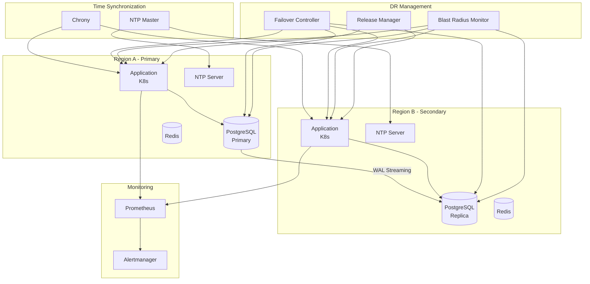

# Multi-Region Disaster Recovery with Temporal Governance and Blast Radius Reduction: A Complete Integration Tutorial

**Objective**: Build a production-ready multi-region disaster recovery system that integrates multi-region DR strategy, temporal governance and time synchronization, blast radius risk modeling, and release management. This tutorial demonstrates how to build resilient, time-consistent systems with controlled failure domains.

This tutorial combines:
- **[Multi-Region, Multi-Cluster Disaster Recovery, Failover Topologies](../best-practices/architecture-design/multi-region-dr-strategy.md)** - Cross-region DR strategies
- **[Temporal Governance and Time Synchronization](../best-practices/architecture-design/temporal-governance-and-time-synchronization.md)** - Time consistency across regions
- **[Operational Risk Modeling, Blast Radius Reduction](../best-practices/operations-monitoring/blast-radius-risk-modeling.md)** - Failure domain architecture
- **[Release Management, Change Governance, and Progressive Delivery](../best-practices/operations-monitoring/release-management-and-progressive-delivery.md)** - Safe cross-region deployments

## 1) Prerequisites

```bash
# Required tools
docker --version          # >= 20.10
docker compose --version  # >= 2.0
kubectl --version         # >= 1.28
helm --version            # >= 3.12
chrony --version          # For time synchronization
psql --version           # For PostgreSQL

# Python packages
pip install kubernetes prometheus-client \
    psycopg2-binary python-dateutil
```

**Why**: Multi-region DR requires Kubernetes orchestration, time synchronization (Chrony/NTP), database replication (PostgreSQL), and risk modeling to ensure consistency and resilience.

## 2) Architecture Overview

We'll build a **Multi-Region Web Application** with comprehensive DR:



**DR Strategy**: Active-Passive with automatic failover, time-synchronized across regions, with blast radius containment.

## 3) Repository Layout

```
multi-region-dr/
├── docker-compose.yaml
├── regions/
│   ├── region-a/
│   │   ├── k8s/
│   │   │   ├── app-deployment.yaml
│   │   │   └── postgres-statefulset.yaml
│   │   └── ntp/
│   │       └── chrony.conf
│   └── region-b/
│       ├── k8s/
│       └── ntp/
├── dr/
│   ├── failover_controller.py
│   ├── blast_radius.py
│   └── release_manager.py
├── temporal/
│   ├── time_sync.py
│   └── clock_drift_monitor.py
└── monitoring/
    ├── dr_metrics.py
    └── alerts.yaml
```

## 4) Temporal Governance

Create `temporal/time_sync.py`:

```python
"""Time synchronization and temporal governance."""
from datetime import datetime, timezone
from typing import Dict, List, Optional
import subprocess
import socket
from prometheus_client import Gauge, Histogram

time_metrics = {
    "clock_offset_seconds": Gauge("time_clock_offset_seconds", "Clock offset from NTP", ["region", "host"]),
    "ntp_sync_status": Gauge("time_ntp_sync_status", "NTP sync status", ["region", "host"]),
    "time_drift_seconds": Histogram("time_drift_seconds", "Time drift between regions", ["region_pair"]),
}


class TimeSynchronizer:
    """Manages time synchronization across regions."""
    
    def __init__(self, ntp_servers: List[str], region: str):
        self.ntp_servers = ntp_servers
        self.region = region
        self.max_drift_seconds = 1.0  # Maximum allowed drift
    
    def check_ntp_sync(self) -> Dict[str, any]:
        """Check NTP synchronization status."""
        try:
            # Query chrony or ntpd
            result = subprocess.run(
                ["chronyc", "tracking"],
                capture_output=True,
                text=True,
                timeout=5
            )
            
            if result.returncode == 0:
                # Parse chrony output
                lines = result.stdout.split("\n")
                offset = 0.0
                sync_status = 0
                
                for line in lines:
                    if "Last offset" in line:
                        # Extract offset value
                        parts = line.split()
                        offset = float(parts[3])
                    if "System time" in line:
                        sync_status = 1
                
                time_metrics["clock_offset_seconds"].labels(
                    region=self.region,
                    host=socket.gethostname()
                ).set(offset)
                
                time_metrics["ntp_sync_status"].labels(
                    region=self.region,
                    host=socket.gethostname()
                ).set(sync_status)
                
                return {
                    "synced": sync_status == 1,
                    "offset_seconds": offset,
                    "within_tolerance": abs(offset) < self.max_drift_seconds
                }
        except Exception as e:
            return {
                "synced": False,
                "error": str(e),
                "within_tolerance": False
            }
        
        return {"synced": False, "within_tolerance": False}
    
    def compare_region_times(self, other_region_time: datetime) -> float:
        """Compare time with another region."""
        local_time = datetime.now(timezone.utc)
        drift = (local_time - other_region_time).total_seconds()
        
        time_metrics["time_drift_seconds"].labels(
            region_pair=f"{self.region}_to_other"
        ).observe(abs(drift))
        
        return drift
    
    def ensure_temporal_consistency(self) -> bool:
        """Ensure temporal consistency before operations."""
        sync_status = self.check_ntp_sync()
        
        if not sync_status.get("within_tolerance", False):
            raise TemporalInconsistencyError(
                f"Clock drift {sync_status.get('offset_seconds', 0)}s exceeds tolerance"
            )
        
        return True


class TemporalInconsistencyError(Exception):
    """Raised when temporal consistency cannot be guaranteed."""
    pass


class EventOrderingValidator:
    """Validates event ordering for temporal consistency."""
    
    def __init__(self):
        self.events: List[Dict] = []
    
    def record_event(self, event_id: str, timestamp: datetime, region: str):
        """Record an event with timestamp."""
        self.events.append({
            "id": event_id,
            "timestamp": timestamp,
            "region": region
        })
    
    def validate_causality(self, event_id: str) -> bool:
        """Validate that event maintains causality."""
        event = next((e for e in self.events if e["id"] == event_id), None)
        if not event:
            return True
        
        # Check if any later event has earlier timestamp (causality violation)
        for other in self.events:
            if other["timestamp"] < event["timestamp"] and other["region"] != event["region"]:
                # Potential causality violation - check if it's a real issue
                time_diff = (event["timestamp"] - other["timestamp"]).total_seconds()
                if abs(time_diff) > 5.0:  # 5 second threshold
                    return False
        
        return True
```

## 5) Blast Radius Risk Modeling

Create `dr/blast_radius.py`:

```python
"""Blast radius risk modeling and failure domain architecture."""
from typing import Dict, List, Set, Optional
from dataclasses import dataclass
from enum import Enum
from prometheus_client import Gauge, Counter

blast_radius_metrics = {
    "failure_domain_size": Gauge("dr_failure_domain_size", "Size of failure domain", ["domain", "region"]),
    "blast_radius_score": Gauge("dr_blast_radius_score", "Blast radius risk score", ["service", "region"]),
    "containment_events": Counter("dr_containment_events_total", "Failure containment events", ["domain"]),
}


class FailureDomainType(Enum):
    """Types of failure domains."""
    NETWORK = "network"
    COMPUTE = "compute"
    STORAGE = "storage"
    DATABASE = "database"
    REGION = "region"


@dataclass
class FailureDomain:
    """Failure domain definition."""
    name: str
    domain_type: FailureDomainType
    region: str
    services: Set[str]
    dependencies: Set[str]
    blast_radius_score: float = 0.0


@dataclass
class Service:
    """Service definition for blast radius analysis."""
    name: str
    region: str
    dependencies: Set[str]
    dependents: Set[str]
    criticality: str = "medium"  # low, medium, high, critical


class BlastRadiusAnalyzer:
    """Analyzes blast radius and failure domains."""
    
    def __init__(self):
        self.services: Dict[str, Service] = {}
        self.failure_domains: Dict[str, FailureDomain] = {}
    
    def register_service(self, service: Service):
        """Register a service for analysis."""
        self.services[service.name] = service
    
    def register_failure_domain(self, domain: FailureDomain):
        """Register a failure domain."""
        self.failure_domains[domain.name] = domain
    
    def calculate_blast_radius(self, service_name: str) -> Dict:
        """Calculate blast radius for a service failure."""
        if service_name not in self.services:
            return {"error": "Service not found"}
        
        service = self.services[service_name]
        
        # Calculate affected services (transitive dependencies)
        affected = self._get_transitive_dependents(service_name)
        
        # Calculate blast radius score
        score = self._calculate_score(service, affected)
        
        blast_radius_metrics["blast_radius_score"].labels(
            service=service_name,
            region=service.region
        ).set(score)
        
        return {
            "service": service_name,
            "region": service.region,
            "affected_services": list(affected),
            "blast_radius_score": score,
            "criticality": service.criticality
        }
    
    def _get_transitive_dependents(self, service_name: str) -> Set[str]:
        """Get all services that depend on this service (transitively)."""
        visited = set()
        to_visit = {service_name}
        dependents = set()
        
        while to_visit:
            current = to_visit.pop()
            if current in visited:
                continue
            visited.add(current)
            
            if current in self.services:
                service = self.services[current]
                dependents.update(service.dependents)
                to_visit.update(service.dependents)
        
        return dependents
    
    def _calculate_score(self, service: Service, affected: Set[str]) -> float:
        """Calculate blast radius risk score."""
        base_score = len(affected)
        
        # Weight by criticality
        criticality_weights = {
            "low": 0.5,
            "medium": 1.0,
            "high": 2.0,
            "critical": 5.0
        }
        weight = criticality_weights.get(service.criticality, 1.0)
        
        # Weight by affected service criticality
        affected_weight = sum(
            criticality_weights.get(self.services.get(s, Service("", "", set(), set())).criticality, 1.0)
            for s in affected
        )
        
        return base_score * weight * (1 + affected_weight / 10)
    
    def analyze_failure_domain(self, domain_name: str) -> Dict:
        """Analyze failure domain impact."""
        if domain_name not in self.failure_domains:
            return {"error": "Failure domain not found"}
        
        domain = self.failure_domains[domain_name]
        
        # Calculate total affected services
        all_affected = set()
        for service_name in domain.services:
            affected = self._get_transitive_dependents(service_name)
            all_affected.update(affected)
        
        domain_size = len(all_affected)
        
        blast_radius_metrics["failure_domain_size"].labels(
            domain=domain_name,
            region=domain.region
        ).set(domain_size)
        
        return {
            "domain": domain_name,
            "type": domain.domain_type.value,
            "region": domain.region,
            "services_in_domain": list(domain.services),
            "affected_services": list(all_affected),
            "domain_size": domain_size
        }
    
    def recommend_containment(self, service_name: str) -> List[str]:
        """Recommend containment strategies."""
        recommendations = []
        
        blast_radius = self.calculate_blast_radius(service_name)
        score = blast_radius["blast_radius_score"]
        
        if score > 50:
            recommendations.append("High blast radius - implement circuit breakers")
            recommendations.append("Add bulkheads to isolate failure domain")
            recommendations.append("Implement graceful degradation")
        
        if score > 100:
            recommendations.append("Critical blast radius - consider service decomposition")
            recommendations.append("Implement multi-region failover")
            recommendations.append("Add rate limiting and backpressure")
        
        return recommendations
```

## 6) Multi-Region Failover Controller

Create `dr/failover_controller.py`:

```python
"""Multi-region failover controller with temporal consistency."""
from typing import Dict, Optional
from datetime import datetime, timezone
from enum import Enum
import kubernetes
from prometheus_client import Counter, Gauge

failover_metrics = {
    "failover_events": Counter("dr_failover_events_total", "Failover events", ["from_region", "to_region"]),
    "failover_duration": Gauge("dr_failover_duration_seconds", "Failover duration", ["region_pair"]),
    "rpo_seconds": Gauge("dr_rpo_seconds", "Recovery Point Objective", ["region"]),
    "rto_seconds": Gauge("dr_rto_seconds", "Recovery Time Objective", ["region"]),
}


class RegionRole(Enum):
    """Region role in DR setup."""
    PRIMARY = "primary"
    SECONDARY = "secondary"
    STANDBY = "standby"


class FailoverController:
    """Manages multi-region failover."""
    
    def __init__(
        self,
        primary_region: str,
        secondary_region: str,
        rpo_seconds: int = 60,  # Recovery Point Objective
        rto_seconds: int = 300   # Recovery Time Objective
    ):
        self.primary_region = primary_region
        self.secondary_region = secondary_region
        self.rpo_seconds = rpo_seconds
        self.rto_seconds = rto_seconds
        self.current_primary = primary_region
        self.region_roles = {
            primary_region: RegionRole.PRIMARY,
            secondary_region: RegionRole.SECONDARY
        }
    
    def check_region_health(self, region: str) -> Dict:
        """Check health of a region."""
        # In production, check multiple health indicators
        # - Application health endpoints
        # - Database connectivity
        # - Network latency
        # - Resource availability
        
        return {
            "region": region,
            "healthy": True,  # Simplified
            "timestamp": datetime.now(timezone.utc)
        }
    
    def initiate_failover(self, from_region: str, to_region: str, reason: str):
        """Initiate failover from one region to another."""
        start_time = datetime.now(timezone.utc)
        
        # Validate temporal consistency before failover
        from temporal.time_sync import TimeSynchronizer
        time_sync = TimeSynchronizer([], to_region)
        time_sync.ensure_temporal_consistency()
        
        # Update region roles
        self.region_roles[from_region] = RegionRole.SECONDARY
        self.region_roles[to_region] = RegionRole.PRIMARY
        self.current_primary = to_region
        
        # Promote database replica (in production, use Patroni or similar)
        self._promote_database_replica(to_region)
        
        # Update DNS/routing (in production, use Route53, CloudFlare, etc.)
        self._update_routing(to_region)
        
        # Update application configuration
        self._update_app_config(to_region)
        
        end_time = datetime.now(timezone.utc)
        duration = (end_time - start_time).total_seconds()
        
        failover_metrics["failover_events"].labels(
            from_region=from_region,
            to_region=to_region
        ).inc()
        
        failover_metrics["failover_duration"].labels(
            region_pair=f"{from_region}_{to_region}"
        ).set(duration)
        
        # Check RTO compliance
        if duration > self.rto_seconds:
            print(f"WARNING: Failover duration {duration}s exceeds RTO {self.rto_seconds}s")
        
        return {
            "success": True,
            "from_region": from_region,
            "to_region": to_region,
            "duration_seconds": duration,
            "rto_compliant": duration <= self.rto_seconds
        }
    
    def _promote_database_replica(self, region: str):
        """Promote database replica to primary."""
        # In production, use Patroni or similar for PostgreSQL HA
        print(f"Promoting database replica in {region} to primary")
    
    def _update_routing(self, region: str):
        """Update DNS/routing to point to new primary region."""
        print(f"Updating routing to point to {region}")
    
    def _update_app_config(self, region: str):
        """Update application configuration for new primary."""
        print(f"Updating application configuration for {region}")
    
    def monitor_and_failover(self):
        """Monitor regions and initiate failover if needed."""
        primary_health = self.check_region_health(self.current_primary)
        
        if not primary_health["healthy"]:
            # Check secondary health
            secondary_health = self.check_region_health(self.secondary_region)
            
            if secondary_health["healthy"]:
                # Initiate failover
                self.initiate_failover(
                    from_region=self.current_primary,
                    to_region=self.secondary_region,
                    reason="Primary region unhealthy"
                )
            else:
                print("WARNING: Both regions unhealthy!")
        
        # Update RPO metric
        # In production, calculate actual RPO from database replication lag
        failover_metrics["rpo_seconds"].labels(region=self.current_primary).set(30)
        failover_metrics["rto_seconds"].labels(region=self.current_primary).set(self.rto_seconds)
```

## 7) Release Management for Multi-Region

Create `dr/release_manager.py`:

```python
"""Release management for multi-region deployments."""
from typing import Dict, List
from enum import Enum
from datetime import datetime
from prometheus_client import Counter, Histogram

release_metrics = {
    "deployments": Counter("dr_deployments_total", "Deployments", ["region", "status"]),
    "deployment_duration": Histogram("dr_deployment_duration_seconds", "Deployment duration", ["region"]),
    "rollbacks": Counter("dr_rollbacks_total", "Rollbacks", ["region", "reason"]),
}


class DeploymentStrategy(Enum):
    """Deployment strategies for multi-region."""
    BLUE_GREEN = "blue_green"
    CANARY = "canary"
    ROLLING = "rolling"
    REGIONAL_CANARY = "regional_canary"  # Deploy to one region first


class MultiRegionReleaseManager:
    """Manages releases across multiple regions."""
    
    def __init__(self, regions: List[str], primary_region: str):
        self.regions = regions
        self.primary_region = primary_region
        self.deployment_history: List[Dict] = []
    
    def deploy_to_region(
        self,
        region: str,
        version: str,
        strategy: DeploymentStrategy = DeploymentStrategy.ROLLING
    ) -> Dict:
        """Deploy to a specific region."""
        start_time = datetime.utcnow()
        
        # Validate temporal consistency
        from temporal.time_sync import TimeSynchronizer
        time_sync = TimeSynchronizer([], region)
        time_sync.ensure_temporal_consistency()
        
        # Deploy based on strategy
        if strategy == DeploymentStrategy.BLUE_GREEN:
            success = self._blue_green_deploy(region, version)
        elif strategy == DeploymentStrategy.CANARY:
            success = self._canary_deploy(region, version)
        elif strategy == DeploymentStrategy.REGIONAL_CANARY:
            success = self._regional_canary_deploy(region, version)
        else:
            success = self._rolling_deploy(region, version)
        
        duration = (datetime.utcnow() - start_time).total_seconds()
        
        status = "success" if success else "failed"
        release_metrics["deployments"].labels(region=region, status=status).inc()
        release_metrics["deployment_duration"].labels(region=region).observe(duration)
        
        self.deployment_history.append({
            "region": region,
            "version": version,
            "strategy": strategy.value,
            "status": status,
            "duration_seconds": duration,
            "timestamp": start_time
        })
        
        return {
            "region": region,
            "version": version,
            "success": success,
            "duration_seconds": duration
        }
    
    def deploy_multi_region(
        self,
        version: str,
        strategy: DeploymentStrategy = DeploymentStrategy.REGIONAL_CANARY
    ) -> Dict:
        """Deploy to multiple regions with controlled rollout."""
        results = {}
        
        if strategy == DeploymentStrategy.REGIONAL_CANARY:
            # Deploy to secondary region first
            secondary_regions = [r for r in self.regions if r != self.primary_region]
            
            for region in secondary_regions:
                result = self.deploy_to_region(region, version, DeploymentStrategy.ROLLING)
                results[region] = result
                
                if not result["success"]:
                    # Stop deployment if secondary fails
                    return {"success": False, "results": results, "stopped_at": region}
            
            # Deploy to primary after secondary succeeds
            result = self.deploy_to_region(self.primary_region, version, DeploymentStrategy.BLUE_GREEN)
            results[self.primary_region] = result
        else:
            # Deploy to all regions simultaneously
            for region in self.regions:
                result = self.deploy_to_region(region, version, strategy)
                results[region] = result
        
        overall_success = all(r["success"] for r in results.values())
        return {"success": overall_success, "results": results}
    
    def _blue_green_deploy(self, region: str, version: str) -> bool:
        """Blue-green deployment."""
        print(f"Blue-green deployment to {region}: {version}")
        # In production, use Kubernetes or cloud provider blue-green
        return True
    
    def _canary_deploy(self, region: str, version: str) -> bool:
        """Canary deployment."""
        print(f"Canary deployment to {region}: {version}")
        # In production, use Istio, Linkerd, or similar
        return True
    
    def _rolling_deploy(self, region: str, version: str) -> bool:
        """Rolling deployment."""
        print(f"Rolling deployment to {region}: {version}")
        # In production, use Kubernetes rolling update
        return True
    
    def _regional_canary_deploy(self, region: str, version: str) -> bool:
        """Regional canary - deploy to one region first."""
        print(f"Regional canary deployment to {region}: {version}")
        return True
    
    def rollback_region(self, region: str, reason: str) -> bool:
        """Rollback deployment in a region."""
        if not self.deployment_history:
            return False
        
        # Get previous version
        previous_deployments = [
            d for d in self.deployment_history
            if d["region"] == region and d["status"] == "success"
        ]
        
        if not previous_deployments:
            return False
        
        previous_version = previous_deployments[-1]["version"]
        
        # Rollback
        result = self.deploy_to_region(region, previous_version)
        
        release_metrics["rollbacks"].labels(region=region, reason=reason).inc()
        
        return result["success"]
```

## 8) Testing the System

### 8.1) Setup Time Synchronization

```bash
# Configure Chrony on all nodes
sudo chrony sources -v

# Check synchronization
chronyc tracking
```

### 8.2) Test Failover

```python
from dr.failover_controller import FailoverController

controller = FailoverController(
    primary_region="us-east-1",
    secondary_region="us-west-2",
    rpo_seconds=60,
    rto_seconds=300
)

# Monitor and failover
controller.monitor_and_failover()
```

### 8.3) Test Blast Radius

```python
from dr.blast_radius import BlastRadiusAnalyzer, Service, FailureDomain, FailureDomainType

analyzer = BlastRadiusAnalyzer()

# Register services
analyzer.register_service(Service(
    name="api-service",
    region="us-east-1",
    dependencies=set(),
    dependents={"web-service", "mobile-service"},
    criticality="high"
))

# Calculate blast radius
result = analyzer.calculate_blast_radius("api-service")
print(f"Blast radius score: {result['blast_radius_score']}")
```

## 9) Best Practices Integration Summary

This tutorial demonstrates:

1. **Multi-Region DR**: Active-passive failover with RTO/RPO compliance
2. **Temporal Governance**: Time synchronization and event ordering validation
3. **Blast Radius Reduction**: Failure domain analysis and containment strategies
4. **Release Management**: Safe multi-region deployments with regional canaries

**Key Integration Points**:
- Temporal consistency validated before failover
- Blast radius analysis informs failover decisions
- Release management respects DR boundaries
- All operations maintain time synchronization

## 10) Next Steps

- Add automated failover testing
- Implement RPO/RTO monitoring dashboards
- Add network partition detection
- Integrate with cloud provider DR services
- Add data sovereignty compliance

---

*This tutorial demonstrates how multiple best practices integrate to create resilient, time-consistent multi-region systems.*

