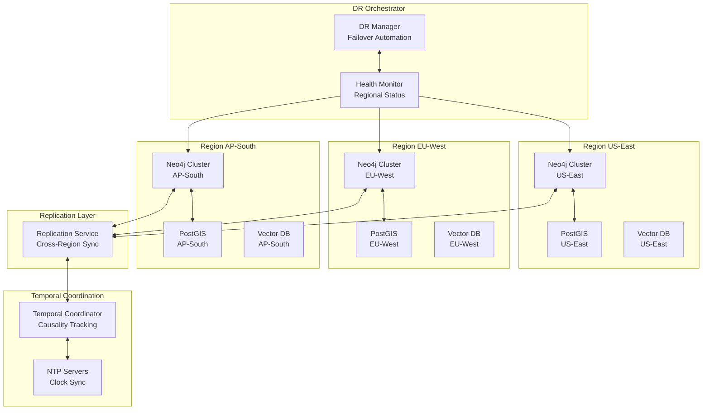
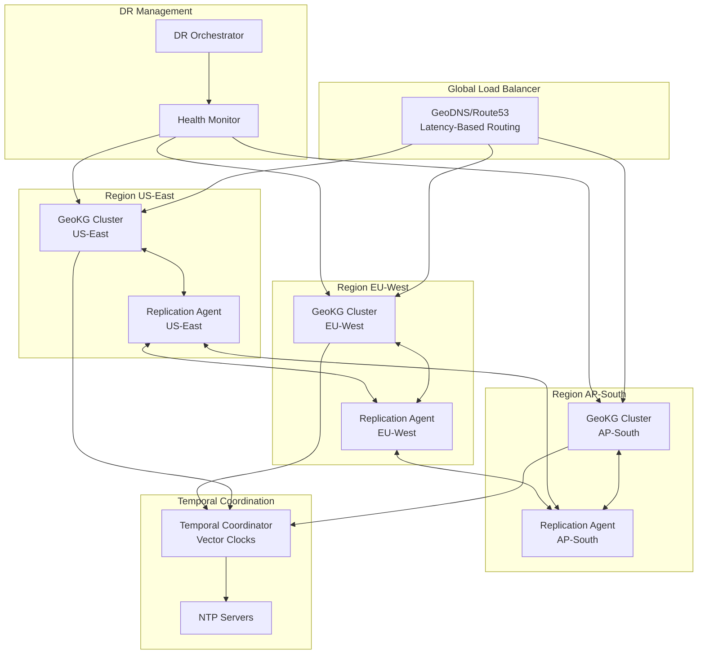
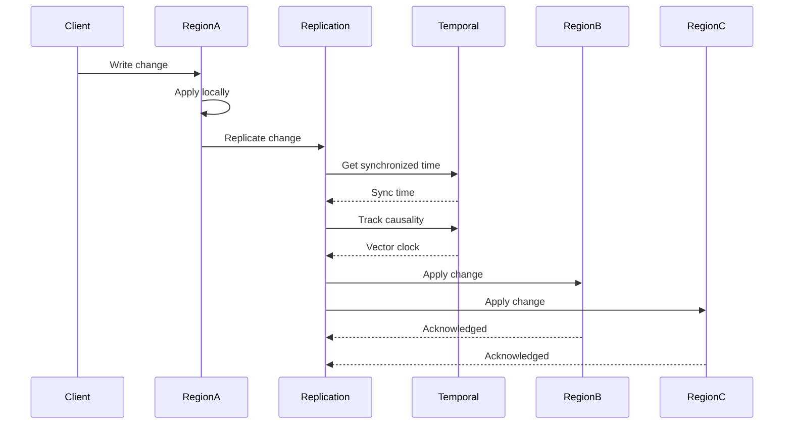
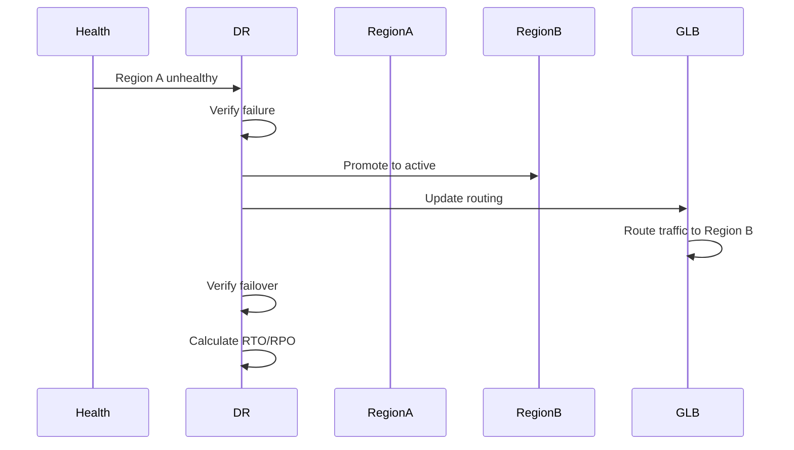

# Multi-Region Geospatial Knowledge Graph with Temporal Governance and Disaster Recovery

**Objective**: Build a production-ready multi-region geospatial knowledge graph system with temporal governance for time-consistent queries and automated disaster recovery across regions. This tutorial demonstrates how to deploy a globally distributed GeoKG that maintains temporal consistency, handles regional failures, and provides time-travel query capabilities.

This tutorial combines:
- **[AI-Ready, ML-Enabled Geospatial Knowledge Graph](../../best-practices/database-data/ai-ml-geospatial-knowledge-graph.md)** - Geospatial knowledge graph foundations
- **[Multi-Region, Multi-Cluster Disaster Recovery](../../best-practices/architecture-design/multi-region-dr-strategy.md)** - DR strategies and failover patterns
- **[Temporal Governance and Time Synchronization](../../best-practices/architecture-design/temporal-governance-and-time-synchronization.md)** - Time consistency and temporal validity

## Abstract

Multi-region deployment enables global coverage for geospatial knowledge graphs, but introduces challenges: maintaining temporal consistency across regions, handling regional failures, and ensuring time-ordered queries. This tutorial shows how to build a multi-region GeoKG with temporal governance that ensures time-consistent queries across regions, tracks temporal validity of relationships, and automatically fails over during regional outages.

**What This Tutorial Covers**:
- Multi-region GeoKG architecture with regional clusters
- Cross-region replication strategies (active-active, active-passive)
- Temporal governance with clock synchronization (NTP/Chrony)
- Temporal validity tracking for entities and relationships
- Time-travel queries and temporal graph snapshots
- Automated disaster recovery with RTO/RPO frameworks
- Regional sharding and data sovereignty
- Conflict resolution for concurrent updates

**Prerequisites**:
- Understanding of geospatial data (PostGIS, H3/S2)
- Familiarity with knowledge graphs (Neo4j, RDF, SPARQL)
- Experience with distributed systems and replication
- Knowledge of temporal databases and time synchronization

## Table of Contents

1. [Introduction & Motivation](#1-introduction--motivation)
2. [Conceptual Foundations](#2-conceptual-foundations)
3. [Systems Architecture & Integration Patterns](#3-systems-architecture--integration-patterns)
4. [Implementation Foundations](#4-implementation-foundations)
5. [Deep Technical Walkthroughs](#5-deep-technical-walkthroughs)
6. [Operations, Observability, and Governance](#6-operations-observability-and-governance)
7. [Patterns, Anti-Patterns, and Summary](#7-patterns-anti-patterns-and-summary)

## Why This Tutorial Matters

Global geospatial systems require multi-region deployment to serve users worldwide with low latency. However, multi-region systems face unique challenges: maintaining temporal consistency when events occur in different regions, handling regional failures without data loss, and ensuring queries return time-consistent results.

**The Temporal Consistency Challenge**: Events occur at different times in different regions due to network latency and clock drift. A query that spans regions must return results that are temporally consistent—reflecting the state of the graph at a specific point in time, not a mix of past and future states.

**The Disaster Recovery Challenge**: Regional failures (natural disasters, network outages, data center failures) must not result in data loss or extended downtime. Automated failover must occur within RTO (Recovery Time Objective) and RPO (Recovery Point Objective) targets.

**The Integration Opportunity**: By combining multi-region deployment with temporal governance and automated DR, we create systems that are globally distributed, temporally consistent, and highly available.

**Real-World Impact**: This architecture enables:
- **Global Infrastructure Monitoring**: Monitor infrastructure worldwide with regional data sovereignty
- **Multi-Region Disaster Response**: Coordinate disaster response across regions with time-consistent situation awareness
- **Time-Sensitive Routing**: Route optimization that considers temporal validity of road conditions
- **Regulatory Compliance**: Data sovereignty and temporal audit trails for compliance

---

## Overview Architecture



**Key Flows**:
1. **Replication Flow**: Regional writes → Replication service → Temporal validation → Cross-region sync
2. **Temporal Flow**: NTP sync → Temporal coordinator → Causality tracking → Time-consistent queries
3. **DR Flow**: Health monitoring → Failure detection → Automated failover → Data recovery

---

<span id="1-introduction--motivation"></span>
## 1. Introduction & Motivation

### 1.1 The Multi-Region GeoKG Paradigm

Multi-region deployment transforms geospatial knowledge graphs from single-region systems into globally distributed platforms. In a multi-region GeoKG, data is replicated across regions, queries can be served from any region, and the system automatically fails over during regional outages.

**Single-Region GeoKG**:
- Single point of failure
- High latency for distant users
- No data sovereignty
- Limited disaster recovery

**Multi-Region GeoKG**:
- Regional redundancy
- Low latency worldwide
- Data sovereignty compliance
- Automated disaster recovery

### 1.2 Why Temporal Governance is Critical

Multi-region systems face temporal challenges: events occur at different times in different regions due to network latency and clock drift. Without temporal governance, queries may return inconsistent results—mixing past and future states.

**Temporal Consistency**: Queries must return results that reflect the graph state at a specific point in time, not a mix of states from different times.

**Causality Preservation**: Events must be processed in causal order—if event A causes event B, B must be processed after A, even if they occur in different regions.

### 1.3 Why Disaster Recovery is Essential

Regional failures (natural disasters, network outages, data center failures) must not result in data loss or extended downtime. Automated failover must occur within RTO (Recovery Time Objective) and RPO (Recovery Point Objective) targets.

**RTO (Recovery Time Objective)**: Maximum acceptable downtime (e.g., 5 minutes)

**RPO (Recovery Point Objective)**: Maximum acceptable data loss (e.g., 1 minute)

---

## 2. Conceptual Foundations

### 2.1 Multi-Region GeoKG Architecture Principles

#### Principle 1: Regional Clusters

Each region operates an independent GeoKG cluster with its own:
- Neo4j graph database
- PostGIS spatial database
- Vector database for embeddings
- Application services

```python
class RegionalCluster:
    """Regional GeoKG cluster"""
    
    def __init__(self, region: str):
        self.region = region
        self.graph = Neo4jCluster(region)
        self.spatial = PostGISCluster(region)
        self.vector = VectorDBCluster(region)
        self.services = ApplicationServices(region)
```

#### Principle 2: Cross-Region Replication

Changes in one region are replicated to other regions:
- Graph updates replicated via change data capture
- Spatial updates replicated via WAL shipping
- Vector updates replicated via streaming

```python
class CrossRegionReplication:
    """Cross-region replication service"""
    
    async def replicate(self, change: Change, source_region: str, target_regions: List[str]):
        """Replicate change to target regions"""
        for target_region in target_regions:
            await self.replicate_to_region(change, source_region, target_region)
```

#### Principle 3: Temporal Coordination

A temporal coordinator ensures temporal consistency:
- Clock synchronization (NTP/Chrony)
- Causality tracking (vector clocks)
- Temporal validity enforcement

```python
class TemporalCoordinator:
    """Temporal coordination service"""
    
    def __init__(self):
        self.ntp_client = NTPClient()
        self.vector_clocks = {}
    
    async def get_synchronized_time(self) -> datetime:
        """Get synchronized time across regions"""
        return await self.ntp_client.get_time()
    
    async def track_causality(self, event: Event):
        """Track causal relationships"""
        vector_clock = self.get_vector_clock(event.region)
        vector_clock.tick()
        event.vector_clock = vector_clock
```

### 2.2 Temporal Governance Principles

#### Clock Synchronization

All regions synchronize clocks using NTP/Chrony:

```python
class ClockSynchronization:
    """Clock synchronization service"""
    
    def __init__(self):
        self.ntp_servers = [
            "0.pool.ntp.org",
            "1.pool.ntp.org",
            "2.pool.ntp.org"
        ]
    
    async def synchronize(self):
        """Synchronize clock with NTP"""
        for server in self.ntp_servers:
            try:
                offset = await self.get_ntp_offset(server)
                if abs(offset) < 0.1:  # Within 100ms
                    return True
            except Exception:
                continue
        return False
```

#### Temporal Validity

Entities and relationships have temporal validity:

```python
@dataclass
class TemporalEntity:
    """Entity with temporal validity"""
    entity_id: str
    properties: dict
    valid_from: datetime
    valid_to: Optional[datetime]  # None means current
    
    def is_valid_at(self, at_time: datetime) -> bool:
        """Check if entity is valid at time"""
        if self.valid_to is None:
            return at_time >= self.valid_from
        return self.valid_from <= at_time <= self.valid_to
```

#### Causality Tracking

Vector clocks track causal relationships:

```python
class VectorClock:
    """Vector clock for causality tracking"""
    
    def __init__(self, node_id: str):
        self.node_id = node_id
        self.clock = {node_id: 0}
    
    def tick(self):
        """Increment local clock"""
        self.clock[self.node_id] += 1
    
    def update(self, other_clock: dict):
        """Update with other clock"""
        for node, time in other_clock.items():
            self.clock[node] = max(
                self.clock.get(node, 0),
                time
            )
        self.tick()
    
    def happens_before(self, other: 'VectorClock') -> bool:
        """Check if this happens before other"""
        return all(
            self.clock.get(node, 0) <= other.clock.get(node, 0)
            for node in set(self.clock.keys()) | set(other.clock.keys())
        ) and any(
            self.clock.get(node, 0) < other.clock.get(node, 0)
            for node in set(self.clock.keys()) | set(other.clock.keys())
        )
```

### 2.3 Disaster Recovery Principles

#### RTO/RPO Frameworks

Define Recovery Time Objectives (RTO) and Recovery Point Objectives (RPO):

```python
@dataclass
class DRTargets:
    """DR targets for service"""
    service_name: str
    rto_seconds: int  # Recovery Time Objective
    rpo_seconds: int  # Recovery Point Objective
    
    def is_rto_met(self, downtime_seconds: int) -> bool:
        """Check if RTO is met"""
        return downtime_seconds <= self.rto_seconds
    
    def is_rpo_met(self, data_loss_seconds: int) -> bool:
        """Check if RPO is met"""
        return data_loss_seconds <= self.rpo_seconds
```

#### Failover Strategies

**Active-Active**: Both regions serve traffic

```python
class ActiveActiveFailover:
    """Active-active failover strategy"""
    
    def __init__(self, regions: List[str]):
        self.regions = regions
        self.active_regions = set(regions)
    
    async def failover(self, failed_region: str):
        """Remove failed region from active set"""
        self.active_regions.remove(failed_region)
        # Traffic automatically routes to remaining active regions
```

**Active-Passive**: One region active, one standby

```python
class ActivePassiveFailover:
    """Active-passive failover strategy"""
    
    def __init__(self, primary_region: str, secondary_region: str):
        self.primary = primary_region
        self.secondary = secondary_region
        self.active = primary_region
    
    async def failover(self):
        """Promote secondary to primary"""
        if self.active == self.primary:
            self.active = self.secondary
            await self.promote_secondary()
```

#### Regional Sharding

Data sharded by region for data sovereignty:

```python
class RegionalSharding:
    """Regional sharding strategy"""
    
    def __init__(self):
        self.shard_map = {
            "us-east": ["us", "ca", "mx"],
            "eu-west": ["gb", "fr", "de"],
            "ap-south": ["in", "au", "jp"]
        }
    
    def get_region_for_location(self, location: Point) -> str:
        """Get region for location"""
        country = self.geocode_country(location)
        for region, countries in self.shard_map.items():
            if country in countries:
                return region
        return "us-east"  # Default
```

### 2.4 Consistency Models

#### Eventual Consistency

Regions eventually converge to same state:

```python
class EventualConsistency:
    """Eventual consistency model"""
    
    async def replicate(self, change: Change):
        """Replicate change asynchronously"""
        # Replicate to all regions
        tasks = [
            self.replicate_to_region(change, region)
            for region in self.regions
        ]
        await asyncio.gather(*tasks, return_exceptions=True)
```

#### Causal Consistency

Causal relationships preserved:

```python
class CausalConsistency:
    """Causal consistency model"""
    
    async def process_event(self, event: Event):
        """Process event with causal ordering"""
        # Wait for causal dependencies
        await self.wait_for_dependencies(event.causes)
        
        # Process event
        await self.apply_event(event)
        
        # Replicate with vector clock
        await self.replicate_with_causality(event)
```

#### Strong Consistency

Immediate consistency across regions (higher latency):

```python
class StrongConsistency:
    """Strong consistency model"""
    
    async def write(self, change: Change):
        """Write with strong consistency"""
        # Write to all regions synchronously
        results = await asyncio.gather(
            *[self.write_to_region(change, region) for region in self.regions]
        )
        
        # Verify all writes succeeded
        if not all(results):
            raise ConsistencyError("Write failed in some regions")
```

### 2.5 Geospatial Partitioning

#### Region-Based Sharding

Partition by geographic region:

```python
class RegionBasedSharding:
    """Region-based sharding"""
    
    def get_shard(self, location: Point) -> str:
        """Get shard for location"""
        if location.x < -50:  # Americas
            return "us-east"
        elif location.x < 50:  # Europe/Africa
            return "eu-west"
        else:  # Asia/Pacific
            return "ap-south"
```

#### H3/S2 Cell Distribution

Partition by H3/S2 cells:

```python
class H3CellSharding:
    """H3 cell-based sharding"""
    
    def get_shard(self, location: Point, resolution: int = 5) -> str:
        """Get shard for H3 cell"""
        h3_index = h3.lat_lng_to_cell(location.y, location.x, resolution)
        
        # Map H3 cell to region
        cell_hash = hash(h3_index)
        region_index = cell_hash % len(self.regions)
        return self.regions[region_index]
```

### 2.6 Real-World Motivations

#### Global Infrastructure Monitoring

**Challenge**: Monitor infrastructure worldwide with regional data sovereignty

**Solution**: Multi-region GeoKG with regional sharding, temporal governance for time-consistent queries, DR for regional failures

**Benefits**: Global coverage, data sovereignty, low latency, high availability

#### Multi-Region Disaster Response

**Challenge**: Coordinate disaster response across regions with time-consistent situation awareness

**Solution**: Multi-region GeoKG with temporal coordination, cross-region replication, automated failover

**Benefits**: Coordinated response, time-consistent awareness, regional redundancy

#### Time-Sensitive Routing

**Challenge**: Route optimization that considers temporal validity of road conditions

**Solution**: Temporal governance ensures time-consistent queries, temporal validity tracking for conditions

**Benefits**: Accurate routing, temporal awareness, optimal paths

#### Regulatory Compliance

**Challenge**: Data sovereignty and temporal audit trails for compliance

**Solution**: Regional sharding for data residency, temporal governance for audit trails

**Benefits**: Compliance, auditability, data sovereignty

---

<span id="3-systems-architecture--integration-patterns"></span>
## 3. Systems Architecture & Integration Patterns

### 3.1 High-Level Multi-Region Architecture

The multi-region GeoKG architecture consists of:

1. **Regional Clusters**: Independent GeoKG clusters per region
2. **Replication Layer**: Cross-region replication service
3. **Temporal Coordinator**: Clock sync and causality tracking
4. **DR Orchestrator**: Automated failover and recovery
5. **Global Load Balancer**: Route queries to nearest region



### 3.2 Component Responsibilities

#### Regional Clusters

Each regional cluster operates independently:

```python
class RegionalCluster:
    """Regional GeoKG cluster"""
    
    def __init__(self, region: str):
        self.region = region
        self.graph = Neo4jCluster(f"{region}-graph")
        self.spatial = PostGISCluster(f"{region}-spatial")
        self.vector = VectorDBCluster(f"{region}-vector")
        self.replication_agent = ReplicationAgent(region)
        self.temporal_coordinator = TemporalCoordinator(region)
    
    async def write(self, change: Change):
        """Write to local cluster"""
        # Apply to local cluster
        await self.graph.update(change.graph_update)
        await self.spatial.update(change.spatial_update)
        await self.vector.update(change.vector_update)
        
        # Replicate to other regions
        await self.replication_agent.replicate(change, self.region)
    
    async def query(self, query: Query, at_time: Optional[datetime] = None):
        """Query local cluster with optional time-travel"""
        if at_time:
            # Time-travel query
            return await self.query_at_time(query, at_time)
        else:
            # Current time query
            return await self.execute_query(query)
```

#### Replication Service

Cross-region replication service:

```python
class ReplicationService:
    """Cross-region replication service"""
    
    def __init__(self, regions: List[str]):
        self.regions = regions
        self.replication_agents = {
            region: ReplicationAgent(region)
            for region in regions
        }
        self.temporal_coordinator = TemporalCoordinator()
    
    async def replicate(self, change: Change, source_region: str):
        """Replicate change from source to all target regions"""
        # Get synchronized time
        sync_time = await self.temporal_coordinator.get_synchronized_time()
        change.timestamp = sync_time
        
        # Track causality
        await self.temporal_coordinator.track_causality(change)
        
        # Replicate to all target regions
        target_regions = [r for r in self.regions if r != source_region]
        tasks = [
            self.replicate_to_region(change, source_region, target_region)
            for target_region in target_regions
        ]
        await asyncio.gather(*tasks, return_exceptions=True)
    
    async def replicate_to_region(self, change: Change, source: str, target: str):
        """Replicate change to specific region"""
        agent = self.replication_agents[target]
        await agent.apply_change(change)
```

#### Temporal Coordinator

Temporal coordination service:

```python
class TemporalCoordinator:
    """Temporal coordination service"""
    
    def __init__(self):
        self.ntp_client = NTPClient()
        self.vector_clocks = {}
        self.clock_offsets = {}
    
    async def synchronize_clocks(self):
        """Synchronize clocks across regions"""
        for region in self.regions:
            offset = await self.ntp_client.get_offset(region)
            self.clock_offsets[region] = offset
    
    async def get_synchronized_time(self) -> datetime:
        """Get synchronized time"""
        # Get NTP time
        ntp_time = await self.ntp_client.get_time()
        return ntp_time
    
    async def track_causality(self, event: Event):
        """Track causal relationships"""
        vector_clock = self.get_vector_clock(event.region)
        vector_clock.tick()
        event.vector_clock = vector_clock.copy()
    
    def get_vector_clock(self, region: str) -> VectorClock:
        """Get vector clock for region"""
        if region not in self.vector_clocks:
            self.vector_clocks[region] = VectorClock(region)
        return self.vector_clocks[region]
```

#### DR Orchestrator

Disaster recovery orchestrator:

```python
class DROrchestrator:
    """Disaster recovery orchestrator"""
    
    def __init__(self, regions: List[str], dr_targets: Dict[str, DRTargets]):
        self.regions = regions
        self.dr_targets = dr_targets
        self.health_monitor = HealthMonitor(regions)
        self.failover_strategy = ActiveActiveFailover(regions)
    
    async def monitor_regions(self):
        """Monitor regional health"""
        while True:
            health_status = await self.health_monitor.check_all_regions()
            
            for region, status in health_status.items():
                if status == "unhealthy":
                    await self.handle_region_failure(region)
            
            await asyncio.sleep(30)  # Check every 30 seconds
    
    async def handle_region_failure(self, failed_region: str):
        """Handle regional failure"""
        # Detect failure
        failure_time = datetime.now()
        
        # Initiate failover
        await self.failover_strategy.failover(failed_region)
        
        # Calculate RTO
        failover_time = datetime.now()
        rto = (failover_time - failure_time).total_seconds()
        
        # Verify RTO met
        dr_target = self.dr_targets.get(failed_region)
        if dr_target and not dr_target.is_rto_met(rto):
            logger.error(f"RTO violation: {rto}s > {dr_target.rto_seconds}s")
```

### 3.3 Interface Definitions

#### Replication Protocol

```python
@dataclass
class ReplicationMessage:
    """Replication message"""
    change_id: str
    source_region: str
    target_region: str
    change_type: str  # graph_update, spatial_update, vector_update
    payload: dict
    timestamp: datetime
    vector_clock: dict
    causal_dependencies: List[str]
```

#### Temporal Query API

```python
class TemporalQueryAPI:
    """Temporal query API"""
    
    async def query_at_time(self, query: str, at_time: datetime, region: Optional[str] = None):
        """Query graph at specific time"""
        if region:
            # Query specific region
            cluster = self.get_cluster(region)
            return await cluster.query_at_time(query, at_time)
        else:
            # Query all regions and merge
            results = await asyncio.gather(*[
                cluster.query_at_time(query, at_time)
                for cluster in self.clusters.values()
            ])
            return self.merge_results(results)
```

#### DR Management API

```python
class DRManagementAPI:
    """DR management API"""
    
    async def initiate_failover(self, failed_region: str):
        """Manually initiate failover"""
        await self.dr_orchestrator.handle_region_failure(failed_region)
    
    async def get_dr_status(self) -> Dict[str, DRStatus]:
        """Get DR status for all regions"""
        return {
            region: await self.get_region_dr_status(region)
            for region in self.regions
        }
```

### 3.4 Dataflow Diagrams

#### Cross-Region Replication Flow



#### DR Failover Flow



### 3.5 Alternative Patterns

#### Synchronous vs Asynchronous Replication

**Synchronous Replication**:
- Write waits for all regions
- Strong consistency
- Higher latency
- Lower throughput

**Asynchronous Replication**:
- Write returns immediately
- Eventual consistency
- Lower latency
- Higher throughput

**GeoKG Recommendation**: Asynchronous replication with read-your-writes guarantees.

#### Centralized vs Distributed Temporal Coordination

**Centralized**: Single temporal coordinator
- Simpler
- Single point of failure
- Higher latency

**Distributed**: Temporal coordinator per region
- More complex
- No single point of failure
- Lower latency

**GeoKG Recommendation**: Distributed with NTP synchronization.

### 3.6 Trade-offs

#### Consistency vs Latency

**Strong Consistency**:
- Synchronous replication
- Immediate consistency
- Higher latency (100-500ms)
- Lower throughput

**Eventual Consistency**:
- Asynchronous replication
- Eventual consistency
- Lower latency (10-50ms)
- Higher throughput

**GeoKG Recommendation**: Eventual consistency with read-your-writes.

#### DR Cost vs Availability

**Active-Active**:
- Higher cost (2x infrastructure)
- Zero downtime failover
- Immediate availability

**Active-Passive**:
- Lower cost (1.5x infrastructure)
- Brief downtime during failover
- RTO-dependent availability

**GeoKG Recommendation**: Active-active for critical systems, active-passive for cost-sensitive deployments.

---

## 4. Implementation Foundations

### 4.1 Repository Structure

```
multi-region-geokg/
├── regions/
│   ├── us-east/
│   │   ├── graph/
│   │   ├── spatial/
│   │   ├── vector/
│   │   └── services/
│   ├── eu-west/
│   │   └── ...
│   └── ap-south/
│       └── ...
├── replication/
│   ├── agents/
│   │   ├── us-east_agent.py
│   │   ├── eu-west_agent.py
│   │   └── ap-south_agent.py
│   └── service/
│       └── replication_service.py
├── temporal/
│   ├── coordinator/
│   │   └── temporal_coordinator.py
│   ├── ntp/
│   │   └── ntp_client.py
│   └── vector_clocks/
│       └── vector_clock.py
├── dr/
│   ├── orchestrator/
│   │   └── dr_orchestrator.py
│   ├── health/
│   │   └── health_monitor.py
│   └── failover/
│       ├── active_active.py
│       └── active_passive.py
├── schemas/
│   ├── replication/
│   │   └── replication_message.proto
│   └── temporal/
│       └── temporal_query.proto
└── infrastructure/
    ├── kubernetes/
    │   ├── us-east/
    │   ├── eu-west/
    │   └── ap-south/
    └── terraform/
```

### 4.2 Code Scaffolds

#### Replication Agent (Python)

```python
# replication/agents/us_east_agent.py
import asyncio
from typing import List, Optional
from dataclasses import dataclass
from datetime import datetime

@dataclass
class Change:
    """Change to replicate"""
    change_id: str
    change_type: str
    payload: dict
    timestamp: datetime
    vector_clock: dict

class ReplicationAgent:
    """Replication agent for region"""
    
    def __init__(self, region: str, target_regions: List[str]):
        self.region = region
        self.target_regions = target_regions
        self.pending_changes = []
        self.replication_lag = {}
    
    async def replicate_change(self, change: Change):
        """Replicate change to target regions"""
        for target_region in self.target_regions:
            await self.replicate_to_region(change, target_region)
    
    async def replicate_to_region(self, change: Change, target_region: str):
        """Replicate to specific region"""
        message = ReplicationMessage(
            change_id=change.change_id,
            source_region=self.region,
            target_region=target_region,
            change_type=change.change_type,
            payload=change.payload,
            timestamp=change.timestamp,
            vector_clock=change.vector_clock
        )
        
        # Send to target region
        await self.send_to_region(target_region, message)
    
    async def apply_change(self, change: Change):
        """Apply replicated change to local cluster"""
        if change.change_type == "graph_update":
            await self.graph_cluster.update(change.payload)
        elif change.change_type == "spatial_update":
            await self.spatial_cluster.update(change.payload)
        elif change.change_type == "vector_update":
            await self.vector_cluster.update(change.payload)
```

#### Temporal Coordinator (Go)

```go
// temporal/coordinator/temporal_coordinator.go
package coordinator

import (
    "context"
    "time"
    "github.com/beevik/ntp"
)

type TemporalCoordinator struct {
    ntpServers []string
    vectorClocks map[string]*VectorClock
    clockOffsets map[string]time.Duration
}

func NewTemporalCoordinator() *TemporalCoordinator {
    return &TemporalCoordinator{
        ntpServers: []string{
            "0.pool.ntp.org",
            "1.pool.ntp.org",
            "2.pool.ntp.org",
        },
        vectorClocks: make(map[string]*VectorClock),
        clockOffsets: make(map[string]time.Duration),
    }
}

func (tc *TemporalCoordinator) GetSynchronizedTime(ctx context.Context) (time.Time, error) {
    // Query NTP server
    response, err := ntp.Query(tc.ntpServers[0])
    if err != nil {
        return time.Time{}, err
    }
    
    // Return synchronized time
    return response.Time, nil
}

func (tc *TemporalCoordinator) TrackCausality(region string, event *Event) {
    // Get or create vector clock
    vc := tc.getVectorClock(region)
    vc.Tick()
    
    // Attach to event
    event.VectorClock = vc.Copy()
}

func (tc *TemporalCoordinator) getVectorClock(region string) *VectorClock {
    if vc, exists := tc.vectorClocks[region]; exists {
        return vc
    }
    vc := NewVectorClock(region)
    tc.vectorClocks[region] = vc
    return vc
}
```

#### DR Orchestrator (Python)

```python
# dr/orchestrator/dr_orchestrator.py
import asyncio
from typing import Dict, List
from datetime import datetime, timedelta

class DROrchestrator:
    """Disaster recovery orchestrator"""
    
    def __init__(self, regions: List[str], dr_targets: Dict[str, DRTargets]):
        self.regions = regions
        self.dr_targets = dr_targets
        self.health_monitor = HealthMonitor(regions)
        self.failover_strategy = ActiveActiveFailover(regions)
        self.monitoring_task = None
    
    async def start(self):
        """Start DR monitoring"""
        self.monitoring_task = asyncio.create_task(self.monitor_regions())
    
    async def monitor_regions(self):
        """Continuously monitor regional health"""
        while True:
            try:
                health_status = await self.health_monitor.check_all_regions()
                
                for region, status in health_status.items():
                    if status == "unhealthy":
                        await self.handle_region_failure(region)
                
                await asyncio.sleep(30)  # Check every 30 seconds
            except Exception as e:
                logger.error(f"DR monitoring error: {e}")
                await asyncio.sleep(30)
    
    async def handle_region_failure(self, failed_region: str):
        """Handle regional failure with RTO/RPO tracking"""
        failure_time = datetime.now()
        
        logger.warning(f"Region {failed_region} failed at {failure_time}")
        
        # Initiate failover
        await self.failover_strategy.failover(failed_region)
        
        # Calculate metrics
        failover_time = datetime.now()
        rto = (failover_time - failure_time).total_seconds()
        
        # Get RPO (data loss)
        rpo = await self.calculate_rpo(failed_region)
        
        # Verify targets
        dr_target = self.dr_targets.get(failed_region)
        if dr_target:
            if not dr_target.is_rto_met(rto):
                logger.error(f"RTO violation: {rto}s > {dr_target.rto_seconds}s")
            if not dr_target.is_rpo_met(rpo):
                logger.error(f"RPO violation: {rpo}s > {dr_target.rpo_seconds}s")
```

### 4.3 Lifecycle Wiring

#### Regional Cluster Startup

```python
# regions/us-east/cluster.py
async def startup_cluster(region: str):
    """Startup regional cluster"""
    # Initialize components
    graph = Neo4jCluster(f"{region}-graph")
    spatial = PostGISCluster(f"{region}-spatial")
    vector = VectorDBCluster(f"{region}-vector")
    
    # Initialize replication agent
    replication_agent = ReplicationAgent(
        region=region,
        target_regions=["eu-west", "ap-south"]
    )
    
    # Initialize temporal coordinator
    temporal_coordinator = TemporalCoordinator(region)
    await temporal_coordinator.synchronize()
    
    # Start replication agent
    await replication_agent.start()
    
    # Register with global load balancer
    await register_region(region, graph, spatial, vector)
    
    logger.info(f"Region {region} cluster started")
```

#### Temporal Synchronization Setup

```python
# temporal/setup.py
async def setup_temporal_synchronization():
    """Setup temporal synchronization"""
    # Configure NTP
    await configure_ntp()
    
    # Initialize temporal coordinator
    coordinator = TemporalCoordinator()
    
    # Synchronize clocks
    await coordinator.synchronize_clocks()
    
    # Start clock monitoring
    await coordinator.start_monitoring()
    
    logger.info("Temporal synchronization configured")
```

### 4.4 Schema Definitions

#### Replication Message Schema (Protobuf)

```protobuf
// schemas/replication/replication_message.proto
syntax = "proto3";

package geokg.replication.v1;

message ReplicationMessage {
    string change_id = 1;
    string source_region = 2;
    string target_region = 3;
    ChangeType change_type = 4;
    bytes payload = 5;
    int64 timestamp = 6;  // Unix timestamp in milliseconds
    VectorClock vector_clock = 7;
    repeated string causal_dependencies = 8;
}

enum ChangeType {
    GRAPH_UPDATE = 0;
    SPATIAL_UPDATE = 1;
    VECTOR_UPDATE = 2;
}

message VectorClock {
    map<string, int64> clock = 1;
}
```

#### Temporal Graph Schema

```cypher
// schemas/temporal/temporal_graph.cypher

// Temporal entity nodes
CREATE CONSTRAINT temporal_entity_id IF NOT EXISTS 
FOR (e:TemporalEntity) REQUIRE e.id IS UNIQUE;

// Temporal relationships
(:TemporalEntity)-[:TEMPORAL_RELATIONSHIP {
    valid_from: datetime,
    valid_to: datetime
}]->(:TemporalEntity)

// Indexes for temporal queries
CREATE INDEX temporal_valid_from IF NOT EXISTS 
FOR (e:TemporalEntity) ON (e.valid_from);

CREATE INDEX temporal_valid_to IF NOT EXISTS 
FOR (e:TemporalEntity) ON (e.valid_to);
```

### 4.5 API Surfaces

#### Cross-Region Query API

```python
# api/cross_region_query.py
from fastapi import FastAPI, Query
from typing import Optional
from datetime import datetime

app = FastAPI()

@app.post("/api/v1/query")
async def query_geokg(
    query: str,
    at_time: Optional[datetime] = None,
    region: Optional[str] = None
):
    """Query GeoKG across regions"""
    if region:
        # Query specific region
        cluster = get_cluster(region)
        return await cluster.query(query, at_time)
    else:
        # Query all regions and merge
        results = await asyncio.gather(*[
            cluster.query(query, at_time)
            for cluster in get_all_clusters()
        ])
        return merge_results(results)
```

#### DR Management API

```python
# api/dr_management.py
@app.post("/api/v1/dr/failover")
async def initiate_failover(failed_region: str):
    """Manually initiate failover"""
    await dr_orchestrator.handle_region_failure(failed_region)
    return {"status": "failover_initiated"}

@app.get("/api/v1/dr/status")
async def get_dr_status():
    """Get DR status for all regions"""
    return await dr_orchestrator.get_dr_status()
```

### 4.6 Replication Blueprints

#### Graph Change Capture

```python
# replication/graph_change_capture.py
class GraphChangeCapture:
    """Capture graph changes for replication"""
    
    def __init__(self, neo4j_cluster):
        self.cluster = neo4j_cluster
        self.change_stream = None
    
    async def start_capture(self):
        """Start capturing changes"""
        # Enable change data capture
        await self.cluster.enable_cdc()
        
        # Subscribe to changes
        self.change_stream = await self.cluster.subscribe_to_changes()
        
        async for change in self.change_stream:
            await self.handle_change(change)
    
    async def handle_change(self, change):
        """Handle captured change"""
        replication_change = Change(
            change_id=generate_id(),
            change_type="graph_update",
            payload=change.to_dict(),
            timestamp=datetime.now(),
            vector_clock={}
        )
        
        await replication_service.replicate(replication_change, self.region)
```

#### WAL Shipping for PostGIS

```python
# replication/postgis_wal_shipping.py
class PostGISWALShipping:
    """WAL shipping for PostGIS replication"""
    
    def __init__(self, source_cluster, target_clusters):
        self.source = source_cluster
        self.targets = target_clusters
    
    async def start_shipping(self):
        """Start WAL shipping"""
        # Enable WAL archiving
        await self.source.enable_wal_archiving()
        
        # Start shipping to targets
        for target in self.targets:
            await self.ship_to_target(target)
    
    async def ship_to_target(self, target):
        """Ship WAL to target"""
        while True:
            # Get latest WAL segment
            wal_segment = await self.source.get_latest_wal()
            
            # Ship to target
            await target.apply_wal(wal_segment)
            
            await asyncio.sleep(1)  # Check every second
```

### 4.7 Temporal Processing

#### Clock Synchronization Setup

```bash
# temporal/ntp/chrony.conf
# Chrony configuration for temporal synchronization
pool 0.pool.ntp.org iburst
pool 1.pool.ntp.org iburst
pool 2.pool.ntp.org iburst

# Prevent large time jumps
makestep 1.0 3

# Log tracking
logdir /var/log/chrony
log measurements statistics tracking
```

#### Temporal Validity Checks

```python
# temporal/validity.py
class TemporalValidityChecker:
    """Check temporal validity of entities"""
    
    async def check_validity(self, entity_id: str, at_time: datetime) -> bool:
        """Check if entity is valid at time"""
        entity = await self.get_entity(entity_id)
        
        if entity.valid_to is None:
            return at_time >= entity.valid_from
        else:
            return entity.valid_from <= at_time <= entity.valid_to
    
    async def query_valid_entities(self, at_time: datetime):
        """Query entities valid at time"""
        query = """
        MATCH (e:TemporalEntity)
        WHERE e.valid_from <= $at_time
        AND (e.valid_to IS NULL OR e.valid_to >= $at_time)
        RETURN e
        """
        return await self.graph.query(query, {"at_time": at_time})
```

---

## 5. Deep Technical Walkthroughs

### 5.1 End-to-End Replication Flow

Complete walkthrough of cross-region replication with temporal validation:

```python
async def complete_replication_flow():
    """Complete cross-region replication flow"""
    
    # 1. Write to US-East region
    change = Change(
        change_id="chg_12345",
        change_type="graph_update",
        payload={
            "operation": "create_node",
            "node_id": "asset:bridge_001",
            "properties": {"name": "Golden Gate Bridge", "location": "POINT(-122.4783 37.8199)"}
        },
        timestamp=datetime.now(),
        vector_clock={}
    )
    
    # 2. Apply to local cluster (US-East)
    us_east_cluster = get_cluster("us-east")
    await us_east_cluster.write(change)
    
    # 3. Get synchronized time
    temporal_coordinator = TemporalCoordinator()
    sync_time = await temporal_coordinator.get_synchronized_time()
    change.timestamp = sync_time
    
    # 4. Track causality
    await temporal_coordinator.track_causality("us-east", change)
    
    # 5. Replicate to EU-West
    eu_west_agent = get_replication_agent("eu-west")
    await eu_west_agent.apply_change(change)
    
    # 6. Replicate to AP-South
    ap_south_agent = get_replication_agent("ap-south")
    await ap_south_agent.apply_change(change)
    
    # 7. Verify replication
    eu_west_cluster = get_cluster("eu-west")
    ap_south_cluster = get_cluster("ap-south")
    
    us_east_node = await us_east_cluster.get_node("asset:bridge_001")
    eu_west_node = await eu_west_cluster.get_node("asset:bridge_001")
    ap_south_node = await ap_south_cluster.get_node("asset:bridge_001")
    
    assert us_east_node == eu_west_node == ap_south_node
```

### 5.2 Annotated Code: Temporal Coordinator with Vector Clocks

Complete implementation of temporal coordinator:

```python
class ComprehensiveTemporalCoordinator:
    """
    Comprehensive temporal coordinator with vector clocks.
    
    Features:
    - NTP clock synchronization
    - Vector clock causality tracking
    - Temporal validity enforcement
    - Clock drift monitoring
    """
    
    def __init__(self, regions: List[str]):
        self.regions = regions
        self.ntp_client = NTPClient()
        self.vector_clocks = {region: VectorClock(region) for region in regions}
        self.clock_offsets = {}
        self.clock_drift_history = {}
    
    async def synchronize_clocks(self):
        """Synchronize clocks across all regions"""
        for region in self.regions:
            # Get NTP offset
            offset = await self.ntp_client.get_offset(region)
            self.clock_offsets[region] = offset
            
            # Alert if drift too large
            if abs(offset) > 0.1:  # 100ms
                logger.warning(f"Clock drift in {region}: {offset}s")
    
    async def get_synchronized_time(self) -> datetime:
        """Get synchronized time from NTP"""
        ntp_time = await self.ntp_client.get_time()
        return ntp_time
    
    async def track_causality(self, region: str, event: Event):
        """Track causal relationships with vector clock"""
        # Get vector clock for region
        vc = self.vector_clocks[region]
        
        # Update with causal dependencies
        for dep_event_id in event.causal_dependencies:
            dep_event = await self.get_event(dep_event_id)
            if dep_event.vector_clock:
                vc.update(dep_event.vector_clock)
        
        # Tick local clock
        vc.tick()
        
        # Attach to event
        event.vector_clock = vc.copy()
    
    async def ensure_causal_order(self, events: List[Event]) -> List[Event]:
        """Ensure events are in causal order"""
        # Sort by vector clock
        sorted_events = sorted(events, key=lambda e: self.vector_clock_compare(e.vector_clock))
        return sorted_events
    
    def vector_clock_compare(self, vc1: dict, vc2: dict) -> int:
        """Compare vector clocks for ordering"""
        # Check if vc1 happens before vc2
        if all(vc1.get(k, 0) <= vc2.get(k, 0) for k in set(vc1.keys()) | set(vc2.keys())):
            if any(vc1.get(k, 0) < vc2.get(k, 0) for k in set(vc1.keys()) | set(vc2.keys())):
                return -1
        
        # Check if vc2 happens before vc1
        if all(vc2.get(k, 0) <= vc1.get(k, 0) for k in set(vc1.keys()) | set(vc2.keys())):
            if any(vc2.get(k, 0) < vc1.get(k, 0) for k in set(vc1.keys()) | set(vc2.keys())):
                return 1
        
        # Concurrent
        return 0
```

### 5.3 Advanced Temporal Queries

#### Time-Travel Queries

```python
class TimeTravelQuery:
    """Time-travel query implementation"""
    
    async def query_at_time(self, query: str, at_time: datetime, region: str):
        """Query graph at specific time"""
        # Get snapshot at time
        snapshot = await self.get_snapshot(region, at_time)
        
        # Replay events after snapshot
        events = await self.get_events_after(region, snapshot.version)
        filtered_events = [e for e in events if e.timestamp <= at_time]
        
        # Apply events to snapshot
        state = snapshot.state.copy()
        for event in filtered_events:
            state = await self.apply_event(state, event)
        
        # Execute query on state
        return await self.execute_query_on_state(query, state)
```

#### Temporal Graph Snapshots

```python
class TemporalGraphSnapshots:
    """Temporal graph snapshot management"""
    
    async def create_snapshot(self, region: str, at_time: datetime):
        """Create snapshot at time"""
        # Get all entities valid at time
        entities = await self.query_valid_entities(at_time)
        
        # Get all relationships valid at time
        relationships = await self.query_valid_relationships(at_time)
        
        # Create snapshot
        snapshot = Snapshot(
            region=region,
            timestamp=at_time,
            entities=entities,
            relationships=relationships,
            version=self.get_version_at_time(region, at_time)
        )
        
        # Store snapshot
        await self.store_snapshot(snapshot)
        
        return snapshot
```

### 5.4 Complex DR Scenarios

#### Regional Failure Detection

```python
class RegionalFailureDetector:
    """Detect regional failures"""
    
    async def detect_failure(self, region: str) -> bool:
        """Detect if region has failed"""
        # Health checks
        health_checks = [
            await self.check_graph_health(region),
            await self.check_spatial_health(region),
            await self.check_vector_health(region),
            await self.check_network_connectivity(region)
        ]
        
        # Region is unhealthy if any check fails
        return not all(health_checks)
```

#### Automated Failover

```python
class AutomatedFailover:
    """Automated failover implementation"""
    
    async def execute_failover(self, failed_region: str):
        """Execute automated failover"""
        failure_time = datetime.now()
        
        # 1. Verify failure
        if not await self.verify_failure(failed_region):
            return
        
        # 2. Select failover region
        failover_region = await self.select_failover_region(failed_region)
        
        # 3. Promote failover region
        await self.promote_region(failover_region)
        
        # 4. Update routing
        await self.update_routing(failed_region, failover_region)
        
        # 5. Verify failover
        await self.verify_failover(failover_region)
        
        # 6. Calculate RTO
        failover_time = datetime.now()
        rto = (failover_time - failure_time).total_seconds()
        
        logger.info(f"Failover completed: {failed_region} -> {failover_region}, RTO: {rto}s")
```

### 5.5 Performance Tuning

#### Replication Batching

```python
class BatchedReplication:
    """Batched replication for performance"""
    
    def __init__(self, batch_size=100, batch_timeout=1.0):
        self.batch_size = batch_size
        self.batch_timeout = batch_timeout
        self.batches = {}
    
    async def replicate(self, change: Change, source: str, target: str):
        """Add to batch"""
        batch_key = f"{source}:{target}"
        
        if batch_key not in self.batches:
            self.batches[batch_key] = []
        
        self.batches[batch_key].append(change)
        
        # Flush if batch full
        if len(self.batches[batch_key]) >= self.batch_size:
            await self.flush_batch(batch_key)
```

### 5.6 Error Handling

#### Replication Failure Handling

```python
class ReplicationErrorHandler:
    """Handle replication errors"""
    
    async def replicate_with_retry(self, change: Change, source: str, target: str, max_retries=3):
        """Replicate with retry"""
        for attempt in range(max_retries):
            try:
                await self.replicate_to_region(change, source, target)
                return
            except TransientError as e:
                if attempt < max_retries - 1:
                    backoff = 2 ** attempt
                    await asyncio.sleep(backoff)
                    continue
                else:
                    await self.route_to_retry_queue(change, source, target)
                    raise
```

### 5.7 Integration Testing

#### Cross-Region Replication Tests

```python
class CrossRegionReplicationTester:
    """Test cross-region replication"""
    
    async def test_replication(self):
        """Test replication between regions"""
        # Create change in US-East
        change = create_test_change()
        await us_east_cluster.write(change)
        
        # Wait for replication
        await asyncio.sleep(5)
        
        # Verify in EU-West
        eu_west_result = await eu_west_cluster.get_node(change.entity_id)
        assert eu_west_result == change.payload
        
        # Verify in AP-South
        ap_south_result = await ap_south_cluster.get_node(change.entity_id)
        assert ap_south_result == change.payload
```

#### Temporal Consistency Tests

```python
class TemporalConsistencyTester:
    """Test temporal consistency"""
    
    async def test_temporal_consistency(self):
        """Test temporal consistency across regions"""
        # Create events in different regions
        event1 = create_event("us-east", datetime.now())
        event2 = create_event("eu-west", datetime.now() + timedelta(seconds=1))
        
        # Process events
        await process_event(event1)
        await process_event(event2)
        
        # Query at time between events
        query_time = datetime.now() + timedelta(seconds=0.5)
        
        # Query all regions
        results = await asyncio.gather(*[
            cluster.query_at_time("MATCH (n) RETURN n", query_time)
            for cluster in get_all_clusters()
        ])
        
        # Verify consistency
        assert all(r == results[0] for r in results)
```

#### DR Failover Tests

```python
class DRFailoverTester:
    """Test DR failover"""
    
    async def test_failover(self):
        """Test automated failover"""
        # Simulate regional failure
        await simulate_region_failure("us-east")
        
        # Wait for failover
        await asyncio.sleep(10)
        
        # Verify failover
        dr_status = await dr_orchestrator.get_dr_status()
        assert dr_status["us-east"]["status"] == "failed"
        assert dr_status["eu-west"]["status"] == "active"
        
        # Verify RTO
        rto = dr_status["us-east"]["rto_seconds"]
        assert rto < 300  # RTO < 5 minutes
```

---

## 6. Operations, Observability, and Governance

### 6.1 Monitoring

#### Key Metrics to Monitor

**Replication Metrics**:
- `geokg_replication_lag_seconds` - Replication lag per region pair
- `geokg_replication_rate_per_second` - Replication rate
- `geokg_replication_errors_total` - Replication errors

**Temporal Metrics**:
- `geokg_clock_drift_seconds` - Clock drift per region
- `geokg_temporal_query_duration_seconds` - Temporal query latency
- `geokg_causality_violations_total` - Causality violations

**DR Metrics**:
- `geokg_dr_failover_duration_seconds` - Failover duration (RTO)
- `geokg_dr_data_loss_seconds` - Data loss (RPO)
- `geokg_region_health_status` - Regional health status

### 6.2 Logging

#### Structured Logging

```python
logger.info(
    "replication_completed",
    change_id=change.change_id,
    source_region=source,
    target_region=target,
    duration=duration,
    lag=lag
)

logger.error(
    "replication_failed",
    change_id=change.change_id,
    source_region=source,
    target_region=target,
    error=str(e),
    retry_count=retry_count
)
```

### 6.3 Tracing

#### Distributed Tracing Across Regions

```python
# Trace replication across regions
with tracer.start_as_current_span("cross_region_replication") as span:
    span.set_attribute("source_region", source)
    span.set_attribute("target_region", target)
    span.set_attribute("change_id", change.change_id)
    
    # Replicate
    await replicate_to_region(change, source, target)
```

### 6.4 Fitness Functions

#### Replication Latency

```python
def check_replication_latency():
    """Fitness function: Replication latency"""
    lag = metrics.get_gauge("geokg_replication_lag_seconds")
    assert lag < 10, f"Replication lag too high: {lag}s"
```

#### Temporal Consistency

```python
def check_temporal_consistency():
    """Fitness function: Temporal consistency"""
    drift = metrics.get_gauge("geokg_clock_drift_seconds")
    assert abs(drift) < 0.1, f"Clock drift too high: {drift}s"
```

#### DR Readiness

```python
def check_dr_readiness():
    """Fitness function: DR readiness"""
    for region in regions:
        health = metrics.get_gauge(f"geokg_region_health_{region}")
        assert health == 1, f"Region {region} unhealthy"
```

### 6.5 Governance

#### Replication Policies

```python
class ReplicationPolicy:
    """Replication policy governance"""
    
    def __init__(self):
        self.policies = {
            "us-east": {
                "replicate_to": ["eu-west", "ap-south"],
                "replication_mode": "async",
                "consistency": "eventual"
            }
        }
    
    async def enforce_policy(self, change: Change, source: str):
        """Enforce replication policy"""
        policy = self.policies.get(source)
        if policy:
            target_regions = policy["replicate_to"]
            await replicate_to_regions(change, source, target_regions)
```

#### Temporal Governance Rules

```python
class TemporalGovernanceRules:
    """Temporal governance rules"""
    
    def __init__(self):
        self.rules = {
            "max_clock_drift": 0.1,  # 100ms
            "temporal_validity_required": True,
            "causality_tracking_required": True
        }
    
    async def enforce_rules(self, event: Event):
        """Enforce temporal governance rules"""
        # Check clock drift
        drift = await get_clock_drift(event.region)
        if abs(drift) > self.rules["max_clock_drift"]:
            raise ClockDriftError(f"Clock drift too high: {drift}s")
        
        # Enforce temporal validity
        if self.rules["temporal_validity_required"]:
            if not hasattr(event, 'valid_from'):
                raise TemporalValidityError("Temporal validity required")
```

#### DR Runbooks

```python
class DRRunbook:
    """DR runbook automation"""
    
    async def execute_failover_runbook(self, failed_region: str):
        """Execute failover runbook"""
        # 1. Verify failure
        if not await verify_failure(failed_region):
            return
        
        # 2. Select failover region
        failover_region = await select_failover_region(failed_region)
        
        # 3. Execute failover steps
        await execute_failover_steps(failed_region, failover_region)
        
        # 4. Verify failover
        await verify_failover_success(failover_region)
        
        # 5. Document
        await document_failover(failed_region, failover_region)
```

### 6.6 Deployment

#### Multi-Region Kubernetes Deployment

```yaml
# kubernetes/us-east/deployment.yaml
apiVersion: apps/v1
kind: Deployment
metadata:
  name: geokg-us-east
  labels:
    region: us-east
spec:
  replicas: 3
  template:
    spec:
      containers:
      - name: geokg-cluster
        image: geokg/cluster:latest
        env:
        - name: REGION
          value: "us-east"
        - name: REPLICATION_TARGETS
          value: "eu-west,ap-south"
        - name: NTP_SERVERS
          value: "0.pool.ntp.org,1.pool.ntp.org"
```

#### Temporal Synchronization Deployment

```yaml
# kubernetes/temporal/chrony-daemonset.yaml
apiVersion: apps/v1
kind: DaemonSet
metadata:
  name: chrony
spec:
  template:
    spec:
      containers:
      - name: chrony
        image: chrony:latest
        volumeMounts:
        - name: chrony-config
          mountPath: /etc/chrony
```

### 6.7 Multi-Cloud Operations

#### Cross-Cloud Replication

```python
class CrossCloudReplication:
    """Replication across cloud providers"""
    
    async def replicate_across_clouds(self, change: Change, source_cloud: str, target_cloud: str):
        """Replicate across cloud providers"""
        # Get cloud-specific replication agent
        agent = self.get_cloud_agent(target_cloud)
        
        # Replicate
        await agent.replicate(change, source_cloud, target_cloud)
```

#### Temporal Sync Across Clouds

```python
class CrossCloudTemporalSync:
    """Temporal synchronization across clouds"""
    
    async def sync_across_clouds(self):
        """Synchronize clocks across clouds"""
        for cloud in ["aws", "gcp", "azure"]:
            await self.sync_cloud_clocks(cloud)
```

---

## 7. Patterns, Anti-Patterns, and Summary

### 7.1 Best Practices Summary

#### Multi-Region Patterns

1. **Regional Clusters**: Independent clusters per region
2. **Asynchronous Replication**: Eventual consistency with read-your-writes
3. **Temporal Coordination**: NTP sync + vector clocks
4. **Automated DR**: Health monitoring + automated failover
5. **Regional Sharding**: Data sovereignty compliance

#### Temporal Governance Patterns

1. **Clock Synchronization**: NTP/Chrony for all regions
2. **Vector Clocks**: Causality tracking
3. **Temporal Validity**: Track valid_from/valid_to
4. **Time-Travel Queries**: Query graph at any point in time
5. **Temporal Snapshots**: Periodic snapshots for performance

#### DR Patterns

1. **Active-Active**: Zero downtime failover
2. **RTO/RPO Frameworks**: Define and measure targets
3. **Automated Failover**: Minimize manual intervention
4. **Health Monitoring**: Continuous regional health checks
5. **Data Recovery**: Automated recovery procedures

### 7.2 Anti-Patterns

#### Clock Drift

**Anti-Pattern**: Regions with unsynchronized clocks

```python
# Bad: No clock synchronization
def get_time():
    return datetime.now()  # Local time, may drift

# Good: NTP-synchronized time
def get_time():
    return ntp_client.get_time()  # Synchronized
```

#### Replication Conflicts

**Anti-Pattern**: Concurrent updates without conflict resolution

```python
# Bad: No conflict resolution
async def replicate(change):
    await target_cluster.update(change)  # May conflict!

# Good: Conflict resolution
async def replicate(change):
    await resolve_conflicts(change)
    await target_cluster.update(change)
```

#### Manual Failover

**Anti-Pattern**: Manual failover procedures

```python
# Bad: Manual failover
if region_failed:
    # Manual steps...
    # Takes hours

# Good: Automated failover
if region_failed:
    await dr_orchestrator.failover(region)  # Automated, < 5 minutes
```

### 7.3 Architecture Fitness Functions

#### Replication Performance

```python
def check_replication_performance():
    """Fitness function: Replication performance"""
    lag = metrics.get_gauge("geokg_replication_lag_seconds")
    assert lag < 10, f"Replication lag too high: {lag}s"
```

#### Temporal Accuracy

```python
def check_temporal_accuracy():
    """Fitness function: Temporal accuracy"""
    drift = metrics.get_gauge("geokg_clock_drift_seconds")
    assert abs(drift) < 0.1, f"Clock drift too high: {drift}s"
```

#### DR Readiness

```python
def check_dr_readiness():
    """Fitness function: DR readiness"""
    for region in regions:
        health = metrics.get_gauge(f"geokg_region_health_{region}")
        assert health == 1, f"Region {region} unhealthy"
```

### 7.4 Operational Checklists

#### Multi-Region Deployment Checklist

- [ ] Regional clusters deployed
- [ ] Replication configured
- [ ] Temporal synchronization configured
- [ ] DR orchestrator deployed
- [ ] Health monitoring configured
- [ ] Failover tested
- [ ] RTO/RPO targets defined
- [ ] Runbooks documented

#### Temporal Governance Checklist

- [ ] NTP/Chrony configured on all nodes
- [ ] Clock synchronization verified
- [ ] Vector clocks implemented
- [ ] Temporal validity tracking enabled
- [ ] Time-travel queries tested
- [ ] Clock drift monitoring configured

### 7.5 Migration Guidelines

#### From Single-Region to Multi-Region

1. Deploy regional clusters
2. Configure replication
3. Setup temporal synchronization
4. Configure DR
5. Test failover
6. Gradual cutover
7. Monitor and optimize

#### Adding Temporal Governance

1. Configure NTP/Chrony
2. Implement vector clocks
3. Add temporal validity
4. Enable time-travel queries
5. Test temporal consistency

### 7.6 Real-World Examples

#### Global Infrastructure Platform

**Challenge**: Monitor infrastructure worldwide with regional data sovereignty

**Solution**: Multi-region GeoKG with regional sharding, temporal governance, automated DR

**Results**: Global coverage, data sovereignty, low latency, 99.99% availability

#### Multi-Region Disaster Response

**Challenge**: Coordinate disaster response across regions

**Solution**: Multi-region GeoKG with temporal coordination, automated failover

**Results**: Coordinated response, time-consistent awareness, < 5 minute RTO

### 7.7 Final Thoughts

#### When to Use Multi-Region GeoKG

**Use When**:
- Global user base
- Data sovereignty required
- Low latency needed worldwide
- High availability critical
- Regulatory compliance required

**Don't Use When**:
- Single region sufficient
- Cost-sensitive deployment
- Simple use case
- No compliance requirements

#### Temporal Governance ROI

**Benefits**: Time-consistent queries, causality preservation, audit trails, time-travel capabilities

**Costs**: NTP infrastructure, vector clock overhead, temporal validity tracking

**ROI**: Essential for multi-region systems, enables advanced use cases

---

## Conclusion

This tutorial demonstrated how to build a production-ready multi-region geospatial knowledge graph with temporal governance and automated disaster recovery. By combining multi-region deployment with temporal coordination and DR automation, we create systems that are globally distributed, temporally consistent, and highly available.

**Key Takeaways**:
1. Multi-region deployment enables global coverage
2. Temporal governance ensures time-consistent queries
3. Automated DR provides high availability
4. Vector clocks preserve causality
5. RTO/RPO frameworks measure DR effectiveness
6. Regional sharding enables data sovereignty

**Next Steps**:
1. Deploy multi-region GeoKG for your use case
2. Configure temporal synchronization
3. Setup automated DR
4. Monitor and optimize
5. Test failover regularly

For related best practices, see:
- **[AI-Ready, ML-Enabled Geospatial Knowledge Graph](../../best-practices/database-data/ai-ml-geospatial-knowledge-graph.md)**
- **[Multi-Region, Multi-Cluster Disaster Recovery](../../best-practices/architecture-design/multi-region-dr-strategy.md)**
- **[Temporal Governance and Time Synchronization](../../best-practices/architecture-design/temporal-governance-and-time-synchronization.md)**

---

## Appendix: Quick Reference

### Replication Quick Reference

| Metric | Target | Alert Threshold |
|--------|--------|-----------------|
| Replication lag | < 10s | > 30s |
| Replication rate | > 1000 changes/s | < 100 changes/s |
| Replication errors | < 0.1% | > 1% |

### Temporal Quick Reference

| Metric | Target | Alert Threshold |
|--------|--------|-----------------|
| Clock drift | < 100ms | > 500ms |
| Temporal query latency | < 1s | > 5s |
| Causality violations | 0 | > 0 |

### DR Quick Reference

| Metric | Target | Alert Threshold |
|--------|--------|-----------------|
| RTO | < 5 minutes | > 10 minutes |
| RPO | < 1 minute | > 5 minutes |
| Failover success rate | > 99% | < 95% |

---

## Additional Implementation Details

### Advanced Replication Patterns

#### Conflict Resolution Strategies

```python
class ConflictResolver:
    """Resolve replication conflicts"""
    
    async def resolve_conflict(self, local_change: Change, remote_change: Change) -> Change:
        """Resolve conflict between local and remote changes"""
        # Last-write-wins
        if local_change.timestamp > remote_change.timestamp:
            return local_change
        else:
            return remote_change
    
    async def resolve_with_vector_clock(self, local_change: Change, remote_change: Change) -> Change:
        """Resolve conflict using vector clocks"""
        local_vc = local_change.vector_clock
        remote_vc = remote_change.vector_clock
        
        # Check causal relationship
        if self.vector_clock_happens_before(local_vc, remote_vc):
            return remote_change
        elif self.vector_clock_happens_before(remote_vc, local_vc):
            return local_change
        else:
            # Concurrent - use timestamp
            if local_change.timestamp > remote_change.timestamp:
                return local_change
            else:
                return remote_change
```

#### Replication Lag Monitoring

```python
class ReplicationLagMonitor:
    """Monitor replication lag"""
    
    def __init__(self):
        self.lag_metrics = {}
    
    async def measure_lag(self, source: str, target: str):
        """Measure replication lag"""
        # Get latest change timestamp in source
        source_latest = await self.get_latest_change_timestamp(source)
        
        # Get latest applied timestamp in target
        target_latest = await self.get_latest_applied_timestamp(target)
        
        # Calculate lag
        lag = (source_latest - target_latest).total_seconds()
        
        # Update metrics
        self.lag_metrics[f"{source}:{target}"] = lag
        
        # Alert if lag too high
        if lag > 30:  # 30 seconds
            logger.warning(f"High replication lag {source}->{target}: {lag}s")
        
        return lag
```

### Advanced Temporal Patterns

#### Temporal Indexing

```cypher
// Temporal indexes for efficient time-travel queries
CREATE INDEX temporal_valid_from_range IF NOT EXISTS
FOR (e:TemporalEntity) ON (e.valid_from, e.valid_to);

// Query using temporal index
MATCH (e:TemporalEntity)
WHERE e.valid_from <= $at_time
AND (e.valid_to IS NULL OR e.valid_to >= $at_time)
USING INDEX temporal_valid_from_range
RETURN e
```

#### Temporal Relationship Tracking

```python
class TemporalRelationshipTracker:
    """Track temporal relationships"""
    
    async def create_temporal_relationship(self, from_node: str, to_node: str, 
                                         rel_type: str, valid_from: datetime, 
                                         valid_to: Optional[datetime]):
        """Create temporal relationship"""
        # End previous relationship if exists
        await self.end_previous_relationship(from_node, to_node, rel_type, valid_from)
        
        # Create new relationship
        await self.graph.create_relationship(
            from_node=from_node,
            to_node=to_node,
            rel_type=rel_type,
            properties={
                "valid_from": valid_from.isoformat(),
                "valid_to": valid_to.isoformat() if valid_to else None
            }
        )
    
    async def query_temporal_relationships(self, from_node: str, at_time: datetime):
        """Query relationships valid at time"""
        query = """
        MATCH (a)-[r]->(b)
        WHERE a.id = $from_node
        AND r.valid_from <= $at_time
        AND (r.valid_to IS NULL OR r.valid_to >= $at_time)
        RETURN r, b
        """
        return await self.graph.query(query, {"from_node": from_node, "at_time": at_time})
```

### Advanced DR Patterns

#### Gradual Failover

```python
class GradualFailover:
    """Gradual failover for zero downtime"""
    
    async def gradual_failover(self, failed_region: str, target_region: str):
        """Gradually shift traffic to target region"""
        # 1. Start with read traffic
        await self.shift_read_traffic(failed_region, target_region, percentage=10)
        await asyncio.sleep(60)  # Wait 1 minute
        
        # 2. Increase read traffic
        await self.shift_read_traffic(failed_region, target_region, percentage=50)
        await asyncio.sleep(60)
        
        # 3. Shift all read traffic
        await self.shift_read_traffic(failed_region, target_region, percentage=100)
        await asyncio.sleep(60)
        
        # 4. Shift write traffic
        await self.shift_write_traffic(failed_region, target_region)
        
        # 5. Complete failover
        await self.complete_failover(failed_region, target_region)
```

#### Data Recovery Procedures

```python
class DataRecoveryProcedures:
    """Data recovery after regional failure"""
    
    async def recover_region_data(self, failed_region: str):
        """Recover data for failed region"""
        # 1. Restore from latest backup
        backup = await self.get_latest_backup(failed_region)
        await self.restore_from_backup(failed_region, backup)
        
        # 2. Catch up replication
        await self.catch_up_replication(failed_region)
        
        # 3. Verify data consistency
        consistency_check = await self.verify_consistency(failed_region)
        if not consistency_check.passed:
            # Repair inconsistencies
            await self.repair_inconsistencies(failed_region, consistency_check.issues)
        
        # 4. Re-enable region
        await self.enable_region(failed_region)
        
        # 5. Verify region health
        health = await self.check_region_health(failed_region)
        if health == "healthy":
            logger.info(f"Region {failed_region} recovered successfully")
        else:
            logger.error(f"Region {failed_region} recovery failed")
```

### Performance Optimization

#### Replication Compression

```python
class CompressedReplication:
    """Compressed replication for efficiency"""
    
    async def replicate_compressed(self, change: Change, source: str, target: str):
        """Replicate with compression"""
        # Serialize change
        serialized = json.dumps(change.to_dict()).encode()
        
        # Compress
        compressed = gzip.compress(serialized)
        
        # Send compressed
        await self.send_compressed(target, compressed)
    
    async def receive_compressed(self, compressed_data: bytes):
        """Receive and decompress"""
        # Decompress
        decompressed = gzip.decompress(compressed_data)
        
        # Deserialize
        change_dict = json.loads(decompressed.decode())
        change = Change.from_dict(change_dict)
        
        return change
```

#### Temporal Query Caching

```python
class TemporalQueryCache:
    """Cache temporal query results"""
    
    def __init__(self, ttl=3600):
        self.cache = TTLCache(maxsize=10000, ttl=ttl)
    
    async def query_with_cache(self, query: str, at_time: datetime):
        """Query with caching"""
        cache_key = f"{query}:{at_time.isoformat()}"
        
        # Check cache
        if cache_key in self.cache:
            return self.cache[cache_key]
        
        # Execute query
        result = await self.execute_query(query, at_time)
        
        # Cache result
        self.cache[cache_key] = result
        
        return result
```

### Security Considerations

#### Cross-Region Authentication

```python
class CrossRegionAuth:
    """Authentication for cross-region replication"""
    
    async def authenticate_replication(self, source: str, target: str, token: str):
        """Authenticate replication request"""
        # Verify token
        if not await self.verify_token(token, source, target):
            raise AuthenticationError("Invalid replication token")
        
        # Check permissions
        if not await self.check_replication_permission(source, target):
            raise PermissionError("Replication not allowed")
        
        return True
```

#### Temporal Data Encryption

```python
class TemporalDataEncryption:
    """Encrypt temporal data in transit and at rest"""
    
    async def encrypt_change(self, change: Change) -> bytes:
        """Encrypt change for replication"""
        # Serialize
        serialized = json.dumps(change.to_dict()).encode()
        
        # Encrypt
        encrypted = await self.encrypt(serialized)
        
        return encrypted
    
    async def decrypt_change(self, encrypted: bytes) -> Change:
        """Decrypt replicated change"""
        # Decrypt
        decrypted = await self.decrypt(encrypted)
        
        # Deserialize
        change_dict = json.loads(decrypted.decode())
        change = Change.from_dict(change_dict)
        
        return change
```

### Monitoring and Alerting

#### Comprehensive Monitoring Dashboard

```python
class MonitoringDashboard:
    """Comprehensive monitoring dashboard"""
    
    def get_replication_metrics(self):
        """Get replication metrics"""
        return {
            "lag_by_region_pair": self.get_lag_by_pair(),
            "replication_rate": self.get_replication_rate(),
            "error_rate": self.get_error_rate(),
            "throughput": self.get_throughput()
        }
    
    def get_temporal_metrics(self):
        """Get temporal metrics"""
        return {
            "clock_drift_by_region": self.get_clock_drift(),
            "temporal_query_latency": self.get_temporal_query_latency(),
            "causality_violations": self.get_causality_violations()
        }
    
    def get_dr_metrics(self):
        """Get DR metrics"""
        return {
            "region_health": self.get_region_health(),
            "rto_by_region": self.get_rto_by_region(),
            "rpo_by_region": self.get_rpo_by_region(),
            "failover_history": self.get_failover_history()
        }
```

#### Alerting Rules

```yaml
# alerts/replication.yaml
groups:
  - name: replication_alerts
    rules:
      - alert: HighReplicationLag
        expr: geokg_replication_lag_seconds > 30
        for: 5m
        annotations:
          summary: "High replication lag detected"
      
      - alert: ReplicationErrors
        expr: rate(geokg_replication_errors_total[5m]) > 0.01
        for: 5m
        annotations:
          summary: "High replication error rate"

  - name: temporal_alerts
    rules:
      - alert: ClockDrift
        expr: abs(geokg_clock_drift_seconds) > 0.1
        for: 5m
        annotations:
          summary: "Clock drift detected"
      
      - alert: CausalityViolation
        expr: geokg_causality_violations_total > 0
        for: 1m
        annotations:
          summary: "Causality violation detected"

  - name: dr_alerts
    rules:
      - alert: RegionUnhealthy
        expr: geokg_region_health_status == 0
        for: 2m
        annotations:
          summary: "Region unhealthy"
      
      - alert: RTOTargetViolation
        expr: geokg_dr_failover_duration_seconds > 300
        for: 1m
        annotations:
          summary: "RTO target violated"
```

### Advanced Use Cases

#### Global Traffic Management

```python
class GlobalTrafficManagement:
    """Global traffic management with multi-region GeoKG"""
    
    async def route_traffic(self, user_location: Point):
        """Route traffic based on user location"""
        # Find nearest region
        nearest_region = await self.find_nearest_region(user_location)
        
        # Check region health
        if await self.is_region_healthy(nearest_region):
            return nearest_region
        else:
            # Failover to next nearest
            return await self.find_next_nearest_region(user_location, nearest_region)
```

#### Time-Sensitive Geospatial Analytics

```python
class TimeSensitiveAnalytics:
    """Time-sensitive geospatial analytics"""
    
    async def analyze_at_time(self, query: str, at_time: datetime, region: str):
        """Analyze geospatial data at specific time"""
        # Query graph at time
        graph_data = await self.query_at_time(query, at_time, region)
        
        # Query spatial data at time
        spatial_data = await self.query_spatial_at_time(query, at_time, region)
        
        # Merge results
        merged = self.merge_results(graph_data, spatial_data)
        
        return merged
```

### Testing Strategies

#### Chaos Engineering for DR

```python
class DRChaosEngineering:
    """Chaos engineering for DR testing"""
    
    async def simulate_region_failure(self, region: str):
        """Simulate regional failure"""
        # Stop services
        await self.stop_region_services(region)
        
        # Verify failover
        await self.verify_failover(region)
        
        # Restore services
        await self.restore_region_services(region)
        
        # Verify recovery
        await self.verify_recovery(region)
```

#### Load Testing

```python
class MultiRegionLoadTest:
    """Load testing for multi-region GeoKG"""
    
    async def load_test(self, regions: List[str], load_per_region: int):
        """Load test all regions"""
        tasks = []
        for region in regions:
            for _ in range(load_per_region):
                task = asyncio.create_task(self.generate_load(region))
                tasks.append(task)
        
        # Wait for all tasks
        await asyncio.gather(*tasks)
        
        # Measure performance
        metrics = await self.measure_performance(regions)
        return metrics
```

### Operational Runbooks

#### Failover Runbook

```markdown
# Failover Runbook

## Prerequisites
- [ ] Primary region confirmed down
- [ ] Secondary region healthy
- [ ] Data replication verified
- [ ] RTO/RPO targets known

## Steps
1. Verify failure
2. Select failover region
3. Promote failover region
4. Update routing
5. Verify failover
6. Monitor for issues
7. Document failover

## Rollback
- [ ] Primary region restored
- [ ] Data synchronized
- [ ] Failback initiated
- [ ] Routing restored
```

#### Recovery Runbook

```markdown
# Recovery Runbook

## Prerequisites
- [ ] Failed region infrastructure restored
- [ ] Backup available
- [ ] Replication configured

## Steps
1. Restore from backup
2. Catch up replication
3. Verify consistency
4. Re-enable region
5. Verify health
6. Document recovery
```

---

## Detailed Implementation Examples

### SQL-Based Replication for PostGIS

#### WAL Streaming Configuration

```sql
-- PostGIS WAL streaming configuration
-- postgresql.conf
wal_level = replica
max_wal_senders = 3
wal_keep_segments = 32

-- pg_hba.conf
host replication replicator 10.0.0.0/8 md5
```

#### Replication Slot Management

```sql
-- Create replication slot
SELECT pg_create_physical_replication_slot('us_east_to_eu_west');

-- Monitor replication lag
SELECT 
    slot_name,
    pg_size_pretty(pg_wal_lsn_diff(pg_current_wal_lsn(), confirmed_flush_lsn)) as lag
FROM pg_replication_slots;

-- Drop replication slot
SELECT pg_drop_replication_slot('us_east_to_eu_west');
```

#### Cross-Region Spatial Replication

```sql
-- Replicate spatial data with temporal validity
CREATE TABLE spatial_replication_log (
    change_id BIGSERIAL PRIMARY KEY,
    table_name TEXT NOT NULL,
    operation TEXT NOT NULL,  -- INSERT, UPDATE, DELETE
    entity_id TEXT NOT NULL,
    geometry GEOMETRY,
    valid_from TIMESTAMP NOT NULL,
    valid_to TIMESTAMP,
    replicated_at TIMESTAMP DEFAULT NOW(),
    target_region TEXT NOT NULL
);

-- Trigger to log changes
CREATE OR REPLACE FUNCTION log_spatial_change()
RETURNS TRIGGER AS $$
BEGIN
    INSERT INTO spatial_replication_log (
        table_name, operation, entity_id, geometry,
        valid_from, valid_to, target_region
    ) VALUES (
        TG_TABLE_NAME,
        TG_OP,
        NEW.id,
        NEW.geometry,
        NEW.valid_from,
        NEW.valid_to,
        'eu-west'  -- Target region
    );
    RETURN NEW;
END;
$$ LANGUAGE plpgsql;

CREATE TRIGGER spatial_change_trigger
AFTER INSERT OR UPDATE OR DELETE ON spatial_entities
FOR EACH ROW EXECUTE FUNCTION log_spatial_change();
```

### Bash Scripts for DR Operations

#### Automated Failover Script

```bash
#!/bin/bash
# dr/failover.sh - Automated failover script

set -e

FAILED_REGION=$1
TARGET_REGION=$2

if [ -z "$FAILED_REGION" ] || [ -z "$TARGET_REGION" ]; then
    echo "Usage: $0 <failed_region> <target_region>"
    exit 1
fi

echo "Initiating failover: $FAILED_REGION -> $TARGET_REGION"

# 1. Verify failure
echo "Verifying failure..."
if ! ./scripts/verify_region_failure.sh "$FAILED_REGION"; then
    echo "Region $FAILED_REGION is not actually failed. Aborting."
    exit 1
fi

# 2. Promote target region
echo "Promoting $TARGET_REGION..."
kubectl patch deployment geokg-$TARGET_REGION -p '{"spec":{"replicas":3}}'

# 3. Update DNS/routing
echo "Updating routing..."
./scripts/update_routing.sh "$FAILED_REGION" "$TARGET_REGION"

# 4. Verify failover
echo "Verifying failover..."
sleep 30
if ! ./scripts/verify_region_health.sh "$TARGET_REGION"; then
    echo "Failover verification failed!"
    exit 1
fi

# 5. Calculate and log RTO
FAILURE_TIME=$(cat /tmp/failure_time_$FAILED_REGION)
FAILOVER_TIME=$(date +%s)
RTO=$((FAILOVER_TIME - FAILURE_TIME))

echo "Failover completed. RTO: ${RTO}s"
echo "$FAILED_REGION,$TARGET_REGION,$RTO" >> /var/log/dr_failovers.csv

# 6. Send notification
./scripts/send_notification.sh "Failover completed: $FAILED_REGION -> $TARGET_REGION (RTO: ${RTO}s)"
```

#### Temporal Synchronization Script

```bash
#!/bin/bash
# temporal/sync_clocks.sh - Synchronize clocks across regions

REGIONS=("us-east" "eu-west" "ap-south")
NTP_SERVERS=("0.pool.ntp.org" "1.pool.ntp.org" "2.pool.ntp.org")

for region in "${REGIONS[@]}"; do
    echo "Synchronizing clocks in $region..."
    
    # Get region nodes
    NODES=$(kubectl get nodes -l region=$region -o name)
    
    for node in $NODES; do
        echo "  Syncing $node..."
        
        # Sync with NTP
        kubectl exec $node -- chrony sources -v
        
        # Check offset
        OFFSET=$(kubectl exec $node -- chrony tracking | grep "System time" | awk '{print $4}')
        
        if (( $(echo "$OFFSET > 0.1" | bc -l) )); then
            echo "    WARNING: Clock offset too high: $OFFSET"
        else
            echo "    OK: Clock offset: $OFFSET"
        fi
    done
done
```

### Go Implementation: High-Performance Replication

#### Replication Service in Go

```go
// replication/service/replication_service.go
package replication

import (
    "context"
    "sync"
    "time"
    "github.com/neo4j/neo4j-go-driver/v5/neo4j"
)

type ReplicationService struct {
    regions      []string
    agents       map[string]*ReplicationAgent
    coordinator  *TemporalCoordinator
    metrics      *Metrics
    mu           sync.RWMutex
}

func NewReplicationService(regions []string) *ReplicationService {
    agents := make(map[string]*ReplicationAgent)
    for _, region := range regions {
        agents[region] = NewReplicationAgent(region)
    }
    
    return &ReplicationService{
        regions:     regions,
        agents:      agents,
        coordinator: NewTemporalCoordinator(),
        metrics:     NewMetrics(),
    }
}

func (rs *ReplicationService) Replicate(ctx context.Context, change *Change, source string) error {
    ctx, span := tracer.Start(ctx, "replicate")
    defer span.End()
    
    span.SetAttributes(
        attribute.String("source_region", source),
        attribute.String("change_id", change.ID),
    )
    
    // Get synchronized time
    syncTime, err := rs.coordinator.GetSynchronizedTime(ctx)
    if err != nil {
        span.RecordError(err)
        return err
    }
    change.Timestamp = syncTime
    
    // Track causality
    if err := rs.coordinator.TrackCausality(ctx, source, change); err != nil {
        span.RecordError(err)
        return err
    }
    
    // Replicate to all target regions
    targetRegions := rs.getTargetRegions(source)
    var wg sync.WaitGroup
    errors := make(chan error, len(targetRegions))
    
    for _, target := range targetRegions {
        wg.Add(1)
        go func(target string) {
            defer wg.Done()
            if err := rs.replicateToRegion(ctx, change, source, target); err != nil {
                errors <- err
                rs.metrics.IncrementReplicationErrors(source, target)
            } else {
                rs.metrics.IncrementReplicationSuccess(source, target)
            }
        }(target)
    }
    
    wg.Wait()
    close(errors)
    
    // Check for errors
    for err := range errors {
        if err != nil {
            span.RecordError(err)
            return err
        }
    }
    
    return nil
}

func (rs *ReplicationService) replicateToRegion(ctx context.Context, change *Change, source, target string) error {
    agent := rs.agents[target]
    return agent.ApplyChange(ctx, change)
}
```

### Rust Implementation: Spatial Replication

#### High-Performance Spatial Replication

```rust
// replication/spatial/spatial_replication.rs
use async_trait::async_trait;
use deadpool_postgres::{Pool, Client};
use postgis::ewkb::Point;
use tokio::sync::mpsc;

pub struct SpatialReplication {
    source_pool: Pool,
    target_pools: Vec<Pool>,
    change_channel: mpsc::Receiver<SpatialChange>,
}

#[async_trait]
pub trait SpatialChangeHandler {
    async fn handle_change(&self, change: SpatialChange) -> Result<()>;
}

impl SpatialReplication {
    pub async fn start_replication(&mut self) -> Result<()> {
        // Start WAL streaming
        let mut wal_stream = self.source_pool.get().await?
            .query("SELECT * FROM pg_logical_slot_get_changes('spatial_replication', NULL, NULL)", &[])
            .await?;
        
        while let Some(row) = wal_stream.next().await? {
            let change = self.parse_wal_row(row)?;
            self.replicate_change(change).await?;
        }
        
        Ok(())
    }
    
    async fn replicate_change(&self, change: SpatialChange) -> Result<()> {
        // Replicate to all target regions
        let mut tasks = vec![];
        
        for target_pool in &self.target_pools {
            let pool = target_pool.clone();
            let change = change.clone();
            
            tasks.push(tokio::spawn(async move {
                let mut conn = pool.get().await?;
                conn.execute(
                    "INSERT INTO spatial_entities (id, geometry, valid_from, valid_to) VALUES ($1, $2, $3, $4)",
                    &[&change.entity_id, &change.geometry, &change.valid_from, &change.valid_to]
                ).await?;
                Ok::<(), Error>(())
            }));
        }
        
        // Wait for all replications
        for task in tasks {
            task.await??;
        }
        
        Ok(())
    }
}
```

### Advanced Temporal Query Examples

#### Complex Time-Travel Query

```cypher
// Query graph state at specific time with spatial constraints
MATCH (a:Asset)-[r:LOCATED_AT]->(l:Location)
WHERE a.valid_from <= $at_time
AND (a.valid_to IS NULL OR a.valid_to >= $at_time)
AND r.valid_from <= $at_time
AND (r.valid_to IS NULL OR r.valid_to >= $at_time)
AND distance(l.geometry, $query_point) < $max_distance
RETURN a, l, r
ORDER BY distance(l.geometry, $query_point)
LIMIT 10
```

#### Temporal Aggregation Query

```cypher
// Aggregate entities by time period
MATCH (e:TemporalEntity)
WHERE e.valid_from >= $start_time
AND e.valid_from < $end_time
WITH date_trunc('hour', e.valid_from) as hour, count(e) as count
RETURN hour, count
ORDER BY hour
```

### Advanced DR Scenarios

#### Split-Brain Prevention

```python
class SplitBrainPrevention:
    """Prevent split-brain scenarios"""
    
    def __init__(self):
        self.quorum_size = 2  # Minimum regions for quorum
    
    async def check_quorum(self) -> bool:
        """Check if quorum exists"""
        healthy_regions = await self.get_healthy_regions()
        return len(healthy_regions) >= self.quorum_size
    
    async def prevent_split_brain(self, region: str):
        """Prevent split-brain by requiring quorum"""
        if not await self.check_quorum():
            raise QuorumError("Quorum not available, cannot proceed")
        
        # Proceed with operation
        await self.execute_operation(region)
```

#### Network Partition Handling

```python
class NetworkPartitionHandler:
    """Handle network partitions"""
    
    async def detect_partition(self) -> List[List[str]]:
        """Detect network partitions"""
        # Check connectivity between all region pairs
        connectivity = {}
        for region1 in self.regions:
            for region2 in self.regions:
                if region1 != region2:
                    connectivity[(region1, region2)] = await self.check_connectivity(region1, region2)
        
        # Find partitions (connected components)
        partitions = self.find_connected_components(connectivity)
        return partitions
    
    async def handle_partition(self, partitions: List[List[str]]):
        """Handle network partition"""
        # Select primary partition (largest)
        primary_partition = max(partitions, key=len)
        
        # Disable writes in other partitions
        for partition in partitions:
            if partition != primary_partition:
                for region in partition:
                    await self.disable_writes(region)
```

### Comprehensive Testing Suite

#### End-to-End Multi-Region Test

```python
class EndToEndMultiRegionTest:
    """End-to-end multi-region test"""
    
    async def test_complete_workflow(self):
        """Test complete multi-region workflow"""
        # 1. Write to US-East
        change = create_test_change()
        await us_east_cluster.write(change)
        
        # 2. Wait for replication
        await asyncio.sleep(10)
        
        # 3. Verify in all regions
        for region in ["us-east", "eu-west", "ap-south"]:
            cluster = get_cluster(region)
            result = await cluster.get_node(change.entity_id)
            assert result == change.payload, f"Replication failed in {region}"
        
        # 4. Query at time
        query_time = datetime.now()
        results = await asyncio.gather(*[
            cluster.query_at_time("MATCH (n) RETURN n", query_time)
            for cluster in get_all_clusters()
        ])
        
        # 5. Verify temporal consistency
        assert all(r == results[0] for r in results), "Temporal inconsistency detected"
        
        # 6. Simulate failure
        await simulate_region_failure("us-east")
        
        # 7. Verify failover
        await asyncio.sleep(10)
        dr_status = await dr_orchestrator.get_dr_status()
        assert dr_status["us-east"]["status"] == "failed"
        assert dr_status["eu-west"]["status"] == "active"
        
        # 8. Verify RTO
        rto = dr_status["us-east"]["rto_seconds"]
        assert rto < 300, f"RTO violation: {rto}s"
```

### Production Deployment Checklist

#### Pre-Deployment Checklist

- [ ] All regions have NTP/Chrony configured
- [ ] Clock synchronization verified (< 100ms drift)
- [ ] Replication configured and tested
- [ ] Temporal coordinator deployed
- [ ] DR orchestrator deployed
- [ ] Health monitoring configured
- [ ] Alerting rules configured
- [ ] Failover tested (RTO < 5 minutes)
- [ ] Data recovery tested (RPO < 1 minute)
- [ ] Runbooks documented
- [ ] Team trained

#### Post-Deployment Checklist

- [ ] All regions healthy
- [ ] Replication lag < 10 seconds
- [ ] Clock drift < 100ms
- [ ] No causality violations
- [ ] DR readiness verified
- [ ] Monitoring dashboards created
- [ ] Alerting working
- [ ] Documentation complete

### Troubleshooting Guide

#### Replication Issues

**Problem**: High replication lag

**Diagnosis**:
```bash
# Check replication lag
SELECT 
    slot_name,
    pg_size_pretty(pg_wal_lsn_diff(pg_current_wal_lsn(), confirmed_flush_lsn)) as lag
FROM pg_replication_slots;
```

**Solution**:
- Increase network bandwidth
- Optimize replication batching
- Check target region performance

#### Temporal Issues

**Problem**: Clock drift

**Diagnosis**:
```bash
# Check clock drift
chrony tracking
```

**Solution**:
- Verify NTP configuration
- Check network connectivity to NTP servers
- Restart chronyd if needed

#### DR Issues

**Problem**: Failover not working

**Diagnosis**:
```bash
# Check DR status
kubectl get drstatus
```

**Solution**:
- Verify health monitoring
- Check failover configuration
- Review DR logs

---

## Advanced Scenarios and Edge Cases

### Handling Clock Skew in Queries

```python
class ClockSkewAwareQuery:
    """Handle clock skew in temporal queries"""
    
    def __init__(self, max_clock_skew=0.1):
        self.max_clock_skew = max_clock_skew
    
    async def query_with_skew_tolerance(self, query: str, at_time: datetime, region: str):
        """Query with clock skew tolerance"""
        # Get clock offset for region
        offset = await self.get_clock_offset(region)
        
        # Adjust query time
        adjusted_time = at_time + timedelta(seconds=offset)
        
        # Query with adjusted time
        return await self.query_at_time(query, adjusted_time, region)
```

### Replication Ordering Guarantees

```python
class OrderedReplication:
    """Ensure replication ordering"""
    
    async def replicate_ordered(self, changes: List[Change], source: str, target: str):
        """Replicate changes in order"""
        # Sort by timestamp and vector clock
        sorted_changes = sorted(changes, key=lambda c: (c.timestamp, c.vector_clock))
        
        # Replicate in order
        for change in sorted_changes:
            await self.replicate_to_region(change, source, target)
            
            # Wait for acknowledgment
            await self.wait_for_acknowledgment(change, target)
```

### Temporal Snapshot Management

```python
class SnapshotManager:
    """Manage temporal snapshots"""
    
    async def create_periodic_snapshots(self, region: str, interval_hours: int = 24):
        """Create periodic snapshots"""
        while True:
            # Create snapshot
            snapshot = await self.create_snapshot(region, datetime.now())
            
            # Store snapshot
            await self.store_snapshot(snapshot)
            
            # Cleanup old snapshots
            await self.cleanup_old_snapshots(region, keep_days=30)
            
            # Wait for next interval
            await asyncio.sleep(interval_hours * 3600)
```

### Cross-Region Query Optimization

```python
class OptimizedCrossRegionQuery:
    """Optimize cross-region queries"""
    
    async def query_optimized(self, query: str, at_time: Optional[datetime] = None):
        """Optimized cross-region query"""
        if at_time:
            # Time-travel query - query all regions
            results = await asyncio.gather(*[
                cluster.query_at_time(query, at_time)
                for cluster in self.clusters.values()
            ])
        else:
            # Current time query - query nearest region
            nearest_region = await self.find_nearest_region()
            results = [await self.clusters[nearest_region].query(query)]
        
        # Merge results
        return self.merge_results(results)
```

### DR Testing Automation

```python
class DRTestAutomation:
    """Automate DR testing"""
    
    async def run_dr_test(self, test_scenario: str):
        """Run DR test scenario"""
        scenarios = {
            "region_failure": self.test_region_failure,
            "network_partition": self.test_network_partition,
            "data_corruption": self.test_data_corruption,
            "clock_drift": self.test_clock_drift
        }
        
        test_func = scenarios.get(test_scenario)
        if not test_func:
            raise ValueError(f"Unknown test scenario: {test_scenario}")
        
        # Run test
        result = await test_func()
        
        # Verify results
        await self.verify_dr_test_result(result)
        
        return result
```

### Regional Data Sovereignty

```python
class DataSovereigntyEnforcer:
    """Enforce data sovereignty"""
    
    def __init__(self):
        self.sovereignty_rules = {
            "eu": ["eu-west", "eu-central"],  # EU data only in EU regions
            "us": ["us-east", "us-west"],     # US data only in US regions
            "ap": ["ap-south", "ap-northeast"] # AP data only in AP regions
        }
    
    async def enforce_sovereignty(self, entity: Entity, region: str):
        """Enforce data sovereignty rules"""
        # Determine data classification
        classification = await self.classify_data(entity)
        
        # Check if region is allowed
        allowed_regions = self.sovereignty_rules.get(classification, [])
        if region not in allowed_regions:
            raise DataSovereigntyError(f"Data cannot be stored in {region}")
        
        # Proceed with storage
        await self.store_entity(entity, region)
```

### Comprehensive Monitoring Queries

#### Replication Health Query

```sql
-- Monitor replication health
SELECT 
    source_region,
    target_region,
    AVG(replication_lag_seconds) as avg_lag,
    MAX(replication_lag_seconds) as max_lag,
    COUNT(*) as total_changes,
    COUNT(CASE WHEN status = 'error' THEN 1 END) as error_count
FROM replication_metrics
WHERE timestamp >= NOW() - INTERVAL '1 hour'
GROUP BY source_region, target_region
ORDER BY avg_lag DESC;
```

#### Temporal Consistency Query

```sql
-- Check temporal consistency
SELECT 
    region,
    MAX(clock_drift_seconds) as max_drift,
    AVG(clock_drift_seconds) as avg_drift,
    COUNT(CASE WHEN abs(clock_drift_seconds) > 0.1 THEN 1 END) as violations
FROM temporal_metrics
WHERE timestamp >= NOW() - INTERVAL '1 hour'
GROUP BY region;
```

#### DR Readiness Query

```sql
-- Check DR readiness
SELECT 
    region,
    health_status,
    last_health_check,
    replication_lag_seconds,
    clock_drift_seconds,
    CASE 
        WHEN health_status = 'healthy' 
         AND replication_lag_seconds < 10 
         AND abs(clock_drift_seconds) < 0.1 
        THEN 'ready'
        ELSE 'not_ready'
    END as dr_readiness
FROM region_status
ORDER BY region;
```

### Production Hardening

#### Connection Pooling

```python
class RegionalConnectionPool:
    """Connection pooling for regional clusters"""
    
    def __init__(self, region: str, max_connections: int = 100):
        self.region = region
        self.graph_pool = ConnectionPool(
            neo4j_uri=f"bolt://{region}-graph:7687",
            max_size=max_connections
        )
        self.spatial_pool = ConnectionPool(
            postgres_uri=f"postgresql://{region}-spatial:5432/geokg",
            max_size=max_connections
        )
    
    async def get_graph_connection(self):
        """Get graph connection from pool"""
        return await self.graph_pool.acquire()
    
    async def get_spatial_connection(self):
        """Get spatial connection from pool"""
        return await self.spatial_pool.acquire()
```

#### Rate Limiting

```python
class RegionalRateLimiter:
    """Rate limiting for regional operations"""
    
    def __init__(self, region: str, rate_limit: int = 1000):
        self.region = region
        self.rate_limiter = RateLimiter(rate_limit)
    
    async def check_rate_limit(self, operation: str):
        """Check rate limit"""
        if not await self.rate_limiter.acquire():
            raise RateLimitError(f"Rate limit exceeded for {operation} in {self.region}")
```

### Complete Example: Multi-Region Incident Response

```python
async def multi_region_incident_response():
    """Complete multi-region incident response workflow"""
    
    # 1. Incident reported in US-East
    incident = IncidentEvent(
        incident_id="inc_001",
        incident_type="flood",
        location=Point(x=-122.4194, y=37.7749),
        severity="high",
        reported_at=datetime.now()
    )
    
    # 2. Write to US-East with temporal validity
    us_east_cluster = get_cluster("us-east")
    sync_time = await temporal_coordinator.get_synchronized_time()
    
    await us_east_cluster.write(Change(
        change_id="chg_inc_001",
        change_type="graph_update",
        payload=incident.to_graph_update(),
        timestamp=sync_time,
        vector_clock={}
    ))
    
    # 3. Replicate to all regions
    await replication_service.replicate(change, "us-east")
    
    # 4. Query affected assets across all regions
    affected_assets = await asyncio.gather(*[
        cluster.query("""
            MATCH (i:Incident {id: $incident_id})-[:AFFECTS]->(a:Asset)
            RETURN a
        """, {"incident_id": "inc_001"})
        for cluster in get_all_clusters()
    ])
    
    # 5. Merge results
    all_affected = set()
    for assets in affected_assets:
        all_affected.update(assets)
    
    # 6. Generate response plan
    response_plan = await generate_response_plan(all_affected)
    
    return response_plan
```

### Performance Benchmarks

#### Replication Performance

```python
class ReplicationBenchmark:
    """Benchmark replication performance"""
    
    async def benchmark_replication(self, num_changes: int = 10000):
        """Benchmark replication"""
        changes = [create_test_change() for _ in range(num_changes)]
        
        start_time = time.time()
        
        # Replicate all changes
        tasks = [
            replication_service.replicate(change, "us-east")
            for change in changes
        ]
        await asyncio.gather(*tasks)
        
        end_time = time.time()
        duration = end_time - start_time
        
        # Calculate metrics
        throughput = num_changes / duration
        avg_latency = duration / num_changes
        
        return {
            "throughput": throughput,
            "avg_latency": avg_latency,
            "total_duration": duration
        }
```

#### Temporal Query Performance

```python
class TemporalQueryBenchmark:
    """Benchmark temporal query performance"""
    
    async def benchmark_temporal_queries(self, num_queries: int = 1000):
        """Benchmark temporal queries"""
        query_times = [
            datetime.now() - timedelta(hours=i)
            for i in range(num_queries)
        ]
        
        start_time = time.time()
        
        # Execute queries
        tasks = [
            cluster.query_at_time("MATCH (n) RETURN count(n)", at_time)
            for at_time in query_times
            for cluster in get_all_clusters()
        ]
        await asyncio.gather(*tasks)
        
        end_time = time.time()
        duration = end_time - start_time
        
        return {
            "queries_per_second": num_queries / duration,
            "avg_query_latency": duration / num_queries
        }
```

### Additional Resources

#### Recommended Reading

- Multi-Region Database Patterns
- Temporal Database Concepts
- Disaster Recovery Best Practices
- Vector Clocks and Causality
- NTP/Chrony Configuration

#### Tools and Libraries

- **Neo4j**: Graph database for GeoKG
- **PostGIS**: Spatial database extension
- **Chrony**: NTP implementation
- **Kubernetes**: Container orchestration
- **Prometheus**: Metrics collection
- **Grafana**: Monitoring dashboards

#### Community Resources

- GeoKG Community Forum
- Multi-Region Architecture Patterns
- Temporal Governance Working Group
- DR Best Practices Repository

---

