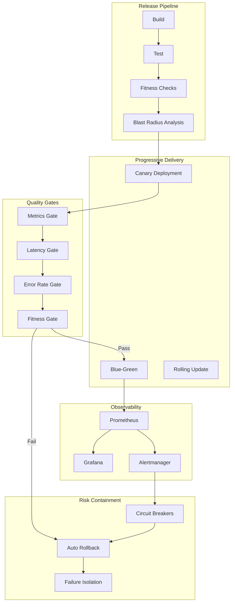

# Progressive Delivery System with Release Management and Fitness Functions: A Complete Integration Tutorial

**Objective**: Build a production-ready progressive delivery system that integrates release management and progressive delivery, architecture fitness functions, blast radius risk modeling, and observability-driven development. This tutorial demonstrates how to safely deploy changes with quality gates and risk containment.

This tutorial combines:
- **[Release Management, Change Governance, and Progressive Delivery](../../best-practices/operations-monitoring/release-management-and-progressive-delivery.md)** - Safe release practices
- **[Architectural Fitness Functions and Governance](../../best-practices/architecture-design/architecture-fitness-functions-governance.md)** - Architecture quality measurement
- **[Operational Risk Modeling, Blast Radius Reduction](../../best-practices/operations-monitoring/blast-radius-risk-modeling.md)** - Risk containment
- **[Observability-Driven Development](../../best-practices/operations-monitoring/observability-driven-development.md)** - Telemetry-first releases

## 1) Prerequisites

```bash
# Required tools
docker --version          # >= 20.10
kubectl --version         # >= 1.28
helm --version            # >= 3.12
istioctl --version        # For service mesh (optional)
argo-rollouts --version   # For progressive delivery

# Python packages
pip install kubernetes prometheus-client \
    argo-rollouts istio-client \
    click rich
```

**Why**: Progressive delivery requires Kubernetes orchestration, service mesh (Istio), progressive delivery tools (Argo Rollouts), and observability to safely roll out changes.

## 2) Architecture Overview

We'll build a **Progressive Delivery Platform** with quality gates:



**Progressive Delivery Strategy**: Canary → Blue-Green → Full rollout with fitness function gates and automatic rollback.

## 3) Repository Layout

```
progressive-delivery/
├── deployments/
│   ├── canary/
│   │   └── rollout.yaml
│   ├── blue-green/
│   │   └── rollout.yaml
│   └── fitness/
│       └── checks.yaml
├── release/
│   ├── release_manager.py
│   ├── quality_gates.py
│   └── rollback_manager.py
├── fitness/
│   ├── fitness_evaluator.py
│   └── architecture_checks.py
├── blast_radius/
│   ├── risk_analyzer.py
│   └── containment.py
└── observability/
    ├── metrics_collector.py
    └── alert_manager.py
```

## 4) Release Management

Create `release/release_manager.py`:

```python
"""Release management with progressive delivery."""
from typing import Dict, List, Optional
from enum import Enum
from datetime import datetime
from dataclasses import dataclass
from prometheus_client import Counter, Histogram, Gauge

release_metrics = {
    "releases": Counter("release_total", "Total releases", ["strategy", "status"]),
    "release_duration": Histogram("release_duration_seconds", "Release duration", ["strategy"]),
    "rollbacks": Counter("release_rollbacks_total", "Rollbacks", ["reason"]),
    "canary_traffic_percent": Gauge("release_canary_traffic_percent", "Canary traffic percentage"),
}


class ReleaseStrategy(Enum):
    """Release strategies."""
    CANARY = "canary"
    BLUE_GREEN = "blue_green"
    ROLLING = "rolling"


@dataclass
class ReleaseConfig:
    """Release configuration."""
    version: str
    strategy: ReleaseStrategy
    canary_steps: List[int] = None  # Traffic percentages for canary
    analysis_duration: int = 300  # Seconds to analyze before promotion
    max_errors: int = 5  # Max errors before rollback
    max_latency_p99_ms: int = 500  # Max p99 latency in ms


class ReleaseManager:
    """Manages progressive releases."""
    
    def __init__(self, namespace: str = "default"):
        self.namespace = namespace
        self.releases: Dict[str, Dict] = {}
    
    def create_release(self, config: ReleaseConfig) -> Dict:
        """Create and execute a release."""
        start_time = datetime.utcnow()
        
        try:
            if config.strategy == ReleaseStrategy.CANARY:
                result = self._canary_release(config)
            elif config.strategy == ReleaseStrategy.BLUE_GREEN:
                result = self._blue_green_release(config)
            else:
                result = self._rolling_release(config)
            
            duration = (datetime.utcnow() - start_time).total_seconds()
            
            release_metrics["releases"].labels(
                strategy=config.strategy.value,
                status="success"
            ).inc()
            
            release_metrics["release_duration"].labels(
                strategy=config.strategy.value
            ).observe(duration)
            
            self.releases[config.version] = {
                "config": config,
                "result": result,
                "duration_seconds": duration,
                "timestamp": start_time
            }
            
            return result
        
        except Exception as e:
            release_metrics["releases"].labels(
                strategy=config.strategy.value,
                status="failed"
            ).inc()
            raise
    
    def _canary_release(self, config: ReleaseConfig) -> Dict:
        """Execute canary release."""
        steps = config.canary_steps or [10, 25, 50, 100]
        
        for traffic_percent in steps:
            # Update canary traffic
            self._set_canary_traffic(traffic_percent)
            release_metrics["canary_traffic_percent"].set(traffic_percent)
            
            # Wait and analyze
            from release.quality_gates import QualityGate
            gate = QualityGate()
            
            passed = gate.evaluate(
                duration_seconds=config.analysis_duration,
                max_errors=config.max_errors,
                max_latency_p99_ms=config.max_latency_p99_ms
            )
            
            if not passed:
                # Rollback
                self._rollback(config.version, reason="quality_gate_failed")
                return {"success": False, "stopped_at_traffic": traffic_percent}
        
        # Full rollout
        return {"success": True, "traffic_percent": 100}
    
    def _blue_green_release(self, config: ReleaseConfig) -> Dict:
        """Execute blue-green release."""
        # Deploy green version
        self._deploy_green(config.version)
        
        # Switch traffic
        self._switch_traffic_to_green()
        
        # Monitor
        from release.quality_gates import QualityGate
        gate = QualityGate()
        
        passed = gate.evaluate(
            duration_seconds=config.analysis_duration,
            max_errors=config.max_errors,
            max_latency_p99_ms=config.max_latency_p99_ms
        )
        
        if not passed:
            # Switch back to blue
            self._switch_traffic_to_blue()
            return {"success": False, "rolled_back": True}
        
        # Keep green, remove blue
        self._remove_blue()
        return {"success": True}
    
    def _rolling_release(self, config: ReleaseConfig) -> Dict:
        """Execute rolling release."""
        # Standard Kubernetes rolling update
        self._update_deployment(config.version)
        return {"success": True}
    
    def _set_canary_traffic(self, percent: int):
        """Set canary traffic percentage."""
        # In production, use Istio VirtualService or Argo Rollouts
        print(f"Setting canary traffic to {percent}%")
    
    def _deploy_green(self, version: str):
        """Deploy green version."""
        print(f"Deploying green version: {version}")
    
    def _switch_traffic_to_green(self):
        """Switch traffic to green."""
        print("Switching traffic to green")
    
    def _switch_traffic_to_blue(self):
        """Switch traffic back to blue."""
        print("Switching traffic back to blue")
    
    def _remove_blue(self):
        """Remove blue version."""
        print("Removing blue version")
    
    def _update_deployment(self, version: str):
        """Update deployment to new version."""
        print(f"Updating deployment to version: {version}")
    
    def _rollback(self, version: str, reason: str):
        """Rollback release."""
        from release.rollback_manager import RollbackManager
        rollback_mgr = RollbackManager()
        rollback_mgr.rollback(version, reason)
        
        release_metrics["rollbacks"].labels(reason=reason).inc()
```

## 5) Quality Gates

Create `release/quality_gates.py`:

```python
"""Quality gates for progressive delivery."""
from typing import Dict, List
from datetime import datetime, timedelta
from prometheus_client import Gauge, Counter
import requests

quality_metrics = {
    "gate_evaluations": Counter("quality_gate_evaluations_total", "Quality gate evaluations", ["gate", "result"]),
    "error_rate": Gauge("quality_gate_error_rate", "Error rate", ["service"]),
    "latency_p99": Gauge("quality_gate_latency_p99_ms", "P99 latency", ["service"]),
    "throughput": Gauge("quality_gate_throughput", "Throughput", ["service"]),
}


class QualityGate:
    """Quality gate evaluator."""
    
    def __init__(self, prometheus_url: str = "http://localhost:9090"):
        self.prometheus_url = prometheus_url
        self.gates: List[Dict] = []
    
    def evaluate(
        self,
        duration_seconds: int = 300,
        max_errors: int = 5,
        max_latency_p99_ms: int = 500,
        min_throughput: int = 100
    ) -> bool:
        """Evaluate quality gates."""
        import time
        time.sleep(duration_seconds)  # Wait for metrics
        
        # Evaluate each gate
        error_rate_ok = self._check_error_rate(max_errors)
        latency_ok = self._check_latency(max_latency_p99_ms)
        throughput_ok = self._check_throughput(min_throughput)
        
        # Fitness function gate
        from fitness.fitness_evaluator import FitnessEvaluator
        fitness_eval = FitnessEvaluator()
        fitness_ok = fitness_eval.evaluate_post_deployment()
        
        all_passed = error_rate_ok and latency_ok and throughput_ok and fitness_ok
        
        quality_metrics["gate_evaluations"].labels(
            gate="all",
            result="pass" if all_passed else "fail"
        ).inc()
        
        return all_passed
    
    def _check_error_rate(self, max_errors: int) -> bool:
        """Check error rate gate."""
        # Query Prometheus for error rate
        query = 'rate(http_requests_total{status=~"5.."}[5m])'
        error_rate = self._query_prometheus(query)
        
        quality_metrics["error_rate"].labels(service="default").set(error_rate)
        
        passed = error_rate < max_errors
        quality_metrics["gate_evaluations"].labels(
            gate="error_rate",
            result="pass" if passed else "fail"
        ).inc()
        
        return passed
    
    def _check_latency(self, max_latency_ms: int) -> bool:
        """Check latency gate."""
        query = 'histogram_quantile(0.99, rate(http_request_duration_seconds_bucket[5m])) * 1000'
        latency_p99 = self._query_prometheus(query)
        
        quality_metrics["latency_p99"].labels(service="default").set(latency_p99)
        
        passed = latency_p99 < max_latency_ms
        quality_metrics["gate_evaluations"].labels(
            gate="latency",
            result="pass" if passed else "fail"
        ).inc()
        
        return passed
    
    def _check_throughput(self, min_throughput: int) -> bool:
        """Check throughput gate."""
        query = 'rate(http_requests_total[5m])'
        throughput = self._query_prometheus(query)
        
        quality_metrics["throughput"].labels(service="default").set(throughput)
        
        passed = throughput >= min_throughput
        quality_metrics["gate_evaluations"].labels(
            gate="throughput",
            result="pass" if passed else "fail"
        ).inc()
        
        return passed
    
    def _query_prometheus(self, query: str) -> float:
        """Query Prometheus."""
        try:
            response = requests.get(
                f"{self.prometheus_url}/api/v1/query",
                params={"query": query},
                timeout=5
            )
            data = response.json()
            if data.get("status") == "success" and data.get("data", {}).get("result"):
                value = float(data["data"]["result"][0]["value"][1])
                return value
        except Exception:
            pass
        return 0.0
```

## 6) Architecture Fitness Functions

Create `fitness/fitness_evaluator.py`:

```python
"""Architecture fitness function evaluator."""
from typing import Dict, List
from prometheus_client import Gauge, Counter

fitness_metrics = {
    "fitness_score": Gauge("fitness_score", "Overall fitness score", ["deployment"]),
    "fitness_violations": Counter("fitness_violations_total", "Fitness violations", ["function", "severity"]),
}


class FitnessEvaluator:
    """Evaluates architecture fitness functions."""
    
    def __init__(self):
        self.fitness_functions: List[Dict] = [
            {
                "name": "coupling",
                "threshold": 0.3,
                "weight": 1.0
            },
            {
                "name": "cohesion",
                "threshold": 0.7,
                "weight": 1.0
            },
            {
                "name": "latency",
                "threshold": 500,  # ms
                "weight": 1.0
            },
            {
                "name": "error_rate",
                "threshold": 0.01,  # 1%
                "weight": 2.0
            },
        ]
    
    def evaluate_post_deployment(self) -> bool:
        """Evaluate fitness functions after deployment."""
        all_passed = True
        
        for func in self.fitness_functions:
            passed = self._evaluate_function(func)
            if not passed:
                all_passed = False
                fitness_metrics["fitness_violations"].labels(
                    function=func["name"],
                    severity="high" if func["weight"] >= 2.0 else "medium"
                ).inc()
        
        # Calculate overall score
        score = self._calculate_overall_score()
        fitness_metrics["fitness_score"].labels(deployment="current").set(score)
        
        return all_passed
    
    def _evaluate_function(self, func: Dict) -> bool:
        """Evaluate a single fitness function."""
        name = func["name"]
        threshold = func["threshold"]
        
        if name == "coupling":
            # Check service coupling (simplified)
            return True  # Placeholder
        
        elif name == "cohesion":
            # Check module cohesion
            return True  # Placeholder
        
        elif name == "latency":
            # Check latency from metrics
            from release.quality_gates import QualityGate
            gate = QualityGate()
            latency = gate._check_latency(threshold)
            return latency
        
        elif name == "error_rate":
            # Check error rate
            from release.quality_gates import QualityGate
            gate = QualityGate()
            error_rate = gate._check_error_rate(threshold * 100)  # Convert to count
            return error_rate
        
        return True
    
    def _calculate_overall_score(self) -> float:
        """Calculate overall fitness score."""
        # Simplified scoring
        return 0.85  # Placeholder
```

## 7) Blast Radius Containment

Create `blast_radius/containment.py`:

```python
"""Blast radius containment for releases."""
from typing import Dict, List
from prometheus_client import Counter, Gauge

containment_metrics = {
    "containment_actions": Counter("containment_actions_total", "Containment actions", ["action", "service"]),
    "blast_radius": Gauge("blast_radius_score", "Current blast radius", ["deployment"]),
}


class BlastRadiusContainment:
    """Manages blast radius containment during releases."""
    
    def __init__(self):
        self.containment_strategies: Dict[str, List[str]] = {}
    
    def analyze_blast_radius(self, service_name: str, version: str) -> Dict:
        """Analyze blast radius for a service release."""
        from blast_radius.risk_analyzer import BlastRadiusAnalyzer
        analyzer = BlastRadiusAnalyzer()
        
        result = analyzer.calculate_blast_radius(service_name)
        score = result.get("blast_radius_score", 0.0)
        
        containment_metrics["blast_radius"].labels(deployment=version).set(score)
        
        # Recommend containment based on score
        if score > 50:
            strategies = ["circuit_breaker", "bulkhead", "rate_limit"]
        elif score > 20:
            strategies = ["circuit_breaker", "rate_limit"]
        else:
            strategies = ["monitoring"]
        
        self.containment_strategies[service_name] = strategies
        
        return {
            "service": service_name,
            "blast_radius_score": score,
            "containment_strategies": strategies
        }
    
    def apply_containment(self, service_name: str, strategies: List[str]):
        """Apply containment strategies."""
        for strategy in strategies:
            if strategy == "circuit_breaker":
                self._enable_circuit_breaker(service_name)
            elif strategy == "bulkhead":
                self._enable_bulkhead(service_name)
            elif strategy == "rate_limit":
                self._enable_rate_limit(service_name)
            
            containment_metrics["containment_actions"].labels(
                action=strategy,
                service=service_name
            ).inc()
    
    def _enable_circuit_breaker(self, service_name: str):
        """Enable circuit breaker for service."""
        print(f"Enabling circuit breaker for {service_name}")
    
    def _enable_bulkhead(self, service_name: str):
        """Enable bulkhead isolation."""
        print(f"Enabling bulkhead for {service_name}")
    
    def _enable_rate_limit(self, service_name: str):
        """Enable rate limiting."""
        print(f"Enabling rate limit for {service_name}")
```

## 8) Testing the System

### 8.1) Create Release

```python
from release.release_manager import ReleaseManager, ReleaseConfig, ReleaseStrategy

manager = ReleaseManager()

config = ReleaseConfig(
    version="v1.2.0",
    strategy=ReleaseStrategy.CANARY,
    canary_steps=[10, 25, 50, 100],
    analysis_duration=300,
    max_errors=5,
    max_latency_p99_ms=500
)

result = manager.create_release(config)
print(f"Release result: {result}")
```

### 8.2) Monitor Quality Gates

```python
from release.quality_gates import QualityGate

gate = QualityGate()
passed = gate.evaluate(
    duration_seconds=300,
    max_errors=5,
    max_latency_p99_ms=500
)

print(f"Quality gates passed: {passed}")
```

## 9) Best Practices Integration Summary

This tutorial demonstrates:

1. **Release Management**: Progressive delivery with canary and blue-green strategies
2. **Quality Gates**: Automated quality checks before promotion
3. **Fitness Functions**: Architecture quality measurement
4. **Blast Radius Containment**: Risk mitigation during releases

**Key Integration Points**:
- Fitness functions are quality gates in release pipeline
- Blast radius analysis determines containment strategies
- Quality gates use observability metrics
- All gates must pass before promotion

## 10) Next Steps

- Add automated A/B testing
- Integrate with feature flags
- Add deployment dashboards
- Implement automated rollback triggers
- Add release analytics

---

*This tutorial demonstrates how multiple best practices integrate to create safe, quality-gated progressive delivery systems.*

