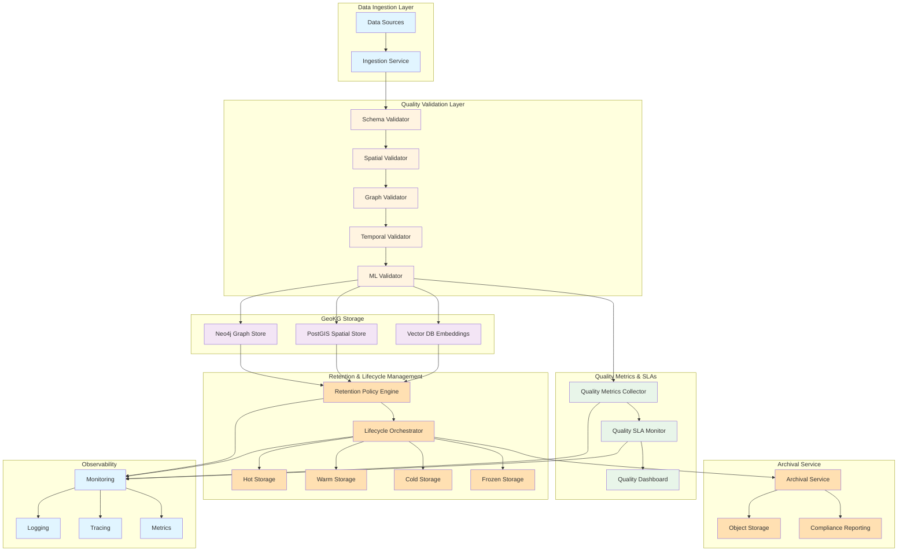
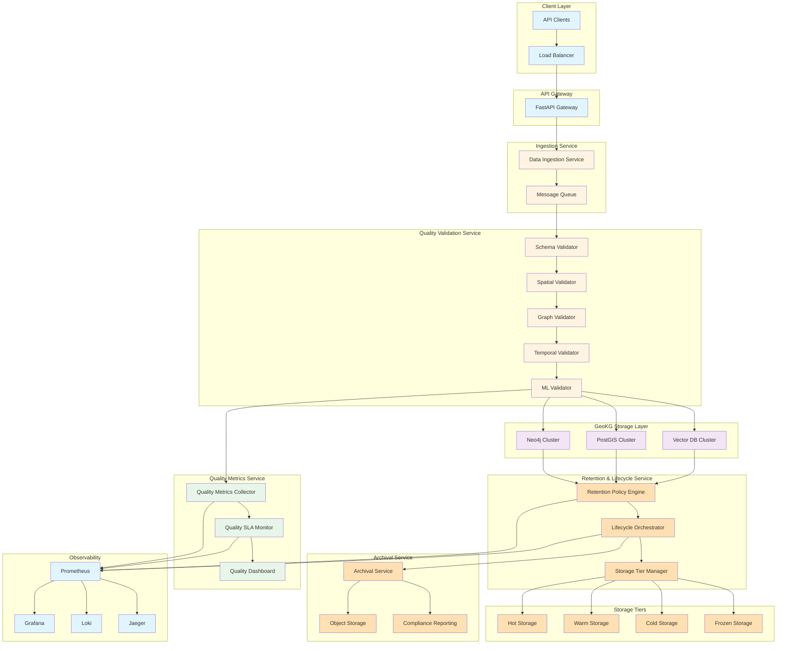
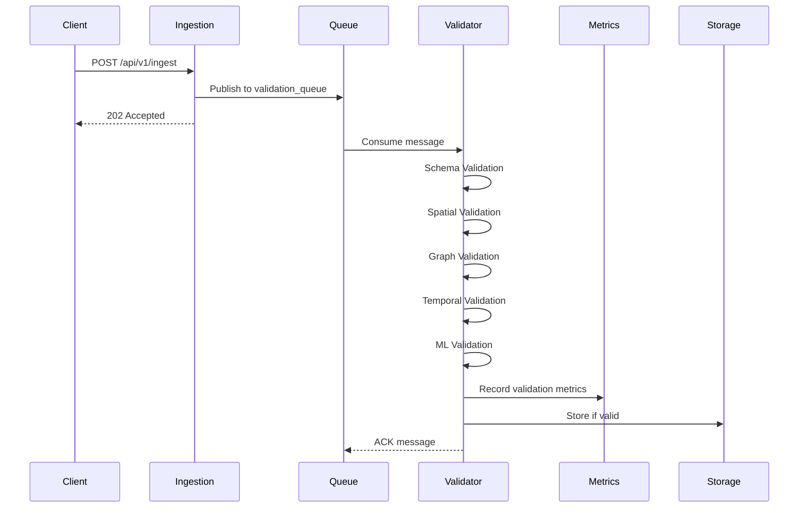
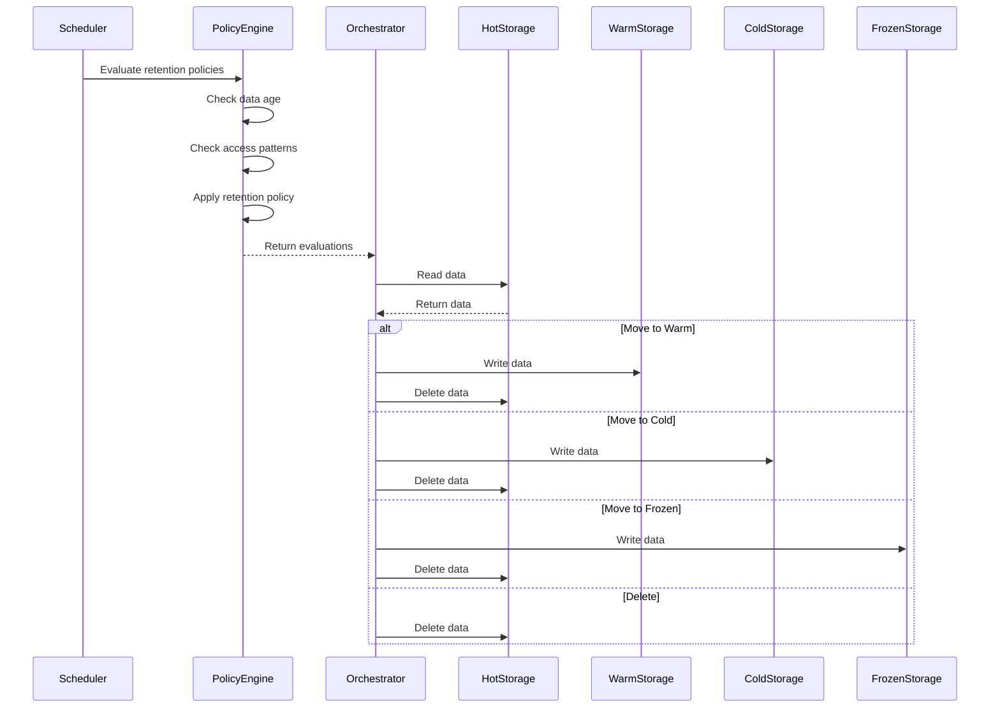

# Quality-Governed Geospatial Knowledge Graph with Data Retention and Lifecycle Management

## Abstract

This tutorial demonstrates how to build a production-ready geospatial knowledge graph (GeoKG) system that integrates comprehensive data quality governance, multi-layer validation, and automated data retention/archival lifecycle management. By combining the AI-Ready, ML-Enabled Geospatial Knowledge Graph best practice with Data Quality SLAs, Validation Layers, and Observability, and Data Retention, Archival Strategy, and Lifecycle Governance, we create a GeoKG system that ensures data accuracy, compliance, and cost optimization throughout the data lifecycle.

The tutorial covers how data quality SLAs ensure GeoKG reliability and accuracy, how validation layers catch data issues early in the ingestion pipeline, and how retention/archival policies manage data lifecycle from hot storage through frozen archival, reducing costs while maintaining compliance with regulatory requirements.

## Table of Contents

1. [Why This Tutorial Matters](#why-this-tutorial-matters)
2. [Conceptual Foundations](#conceptual-foundations)
   - Geospatial Knowledge Graph Quality Characteristics
   - Data Quality SLAs and Validation Layers
   - Data Retention and Lifecycle Governance
   - Binding Principles: Quality, Retention, and Lifecycle
   - Real-World Motivations
   - Architectural Primitives
3. [Systems Architecture & Integration Patterns](#systems-architecture--integration-patterns)
   - High-Level Distributed System Architecture
   - Component Responsibilities
   - Interface Definitions
   - Dataflow Diagrams
   - Alternative Patterns
   - Trade-offs and Constraints
4. [Implementation Foundations](#implementation-foundations)
   - Repository Structure
   - Code Scaffolds
   - Lifecycle Wiring
   - Schema Definitions
   - API Surfaces
   - Validation Blueprints
   - Retention Blueprints
5. [Deep Technical Walkthroughs](#deep-technical-walkthroughs)
   - End-to-End Quality Validation Workflow
   - Annotated Code Walkthroughs
   - Advanced Quality Checks
   - Complex Retention Scenarios
   - Performance Tuning
   - Error Handling and Resilience
   - Integration Testing
6. [Operations, Observability, and Governance](#operations-observability-and-governance)
   - Monitoring Strategy
   - Structured Logging
   - Distributed Tracing
   - Fitness Functions
   - Governance Policies
   - Deployment Patterns
   - Backup and Restore Strategies
7. [Patterns, Anti-Patterns, Checklists, and Summary](#patterns-anti-patterns-checklists-and-summary)
   - Best Practices Summary
   - Anti-Patterns
   - Architecture Fitness Functions
   - Operational Checklists
   - Migration Guidelines
   - Real-World Examples
   - Final Thoughts

## Why This Tutorial Matters

Data quality is critical for geospatial knowledge graphs. Inaccurate spatial data, inconsistent graph relationships, or temporal validity issues can lead to incorrect routing decisions, flawed infrastructure analysis, or compliance violations. Similarly, without proper data retention and lifecycle management, GeoKG systems can accumulate vast amounts of data, leading to escalating storage costs and compliance risks.

This tutorial addresses these challenges by:

1. **Ensuring Data Quality**: Multi-layer validation ensures spatial accuracy, graph consistency, temporal validity, and completeness before data enters the GeoKG.

2. **Maintaining Quality SLAs**: Quality metrics and SLAs provide measurable guarantees about data accuracy, completeness, and freshness.

3. **Automating Lifecycle Management**: Retention policies and archival workflows automatically move data through storage tiers (hot → warm → cold → frozen) based on age, access patterns, and compliance requirements.

4. **Reducing Costs**: Automated archival reduces storage costs by moving infrequently accessed data to cheaper storage tiers.

5. **Ensuring Compliance**: Retention policies ensure data is retained for required periods and deleted when no longer needed, meeting regulatory requirements.

6. **Providing Observability**: Quality metrics, retention compliance, and lifecycle state are monitored and traced throughout the system.

## Overview Architecture

The following diagram illustrates the high-level architecture of a quality-governed GeoKG with data retention and lifecycle management:



This architecture ensures that:
- **Data flows through validation layers** before entering the GeoKG
- **Quality metrics are collected** and monitored against SLAs
- **Retention policies are evaluated** continuously
- **Lifecycle transitions** are automated based on policies
- **Archival workflows** move data to appropriate storage tiers
- **Observability** provides visibility into quality, retention, and lifecycle state

---


## Conceptual Foundations

### Geospatial Knowledge Graph Quality Characteristics

Geospatial knowledge graphs have unique quality requirements that differ from traditional databases:

#### Spatial Accuracy

Spatial data quality is critical for GeoKG systems. Inaccurate coordinates, invalid geometries, or incorrect spatial relationships can lead to:

- **Routing failures**: Incorrect road network data causes navigation errors
- **Infrastructure misanalysis**: Wrong facility locations lead to incorrect planning decisions
- **Compliance violations**: Regulatory requirements mandate spatial accuracy thresholds

Key spatial quality dimensions:

1. **Coordinate Precision**: Coordinates must have sufficient precision for the use case (e.g., 6 decimal places for meter-level accuracy)

2. **Geometry Validity**: Geometries must be topologically valid (e.g., polygons must be closed, lines must not self-intersect)

3. **Spatial Reference System (SRS) Consistency**: All spatial data must use consistent coordinate reference systems

4. **Spatial Relationship Accuracy**: Relationships like "contains", "intersects", "within" must be correctly represented

5. **Temporal Spatial Validity**: Spatial data may change over time (e.g., road networks, building footprints)

#### Graph Consistency

Graph data quality ensures that relationships and entities are correctly represented:

1. **Node Completeness**: Required properties must be present for each node type

2. **Relationship Validity**: Relationships must connect valid node types and respect cardinality constraints

3. **Graph Connectivity**: Graph should not have isolated components (unless intentional)

4. **Property Consistency**: Property values must conform to schemas and constraints

5. **Referential Integrity**: References between nodes must be valid

#### Temporal Validity

GeoKG data often has temporal dimensions:

1. **Temporal Accuracy**: Timestamps must be accurate and consistent

2. **Temporal Validity Windows**: Data may be valid only for specific time periods

3. **Temporal Consistency**: Temporal relationships must be consistent (e.g., start time < end time)

4. **Causality**: Events must be ordered correctly in time

#### Completeness

Data completeness ensures all required data is present:

1. **Required Fields**: All mandatory fields must be populated

2. **Coverage**: Spatial coverage must meet requirements (e.g., all regions must have data)

3. **Relationship Completeness**: Expected relationships must be present

4. **Historical Completeness**: Historical data must be complete for time-series analysis

### Data Quality SLAs and Validation Layers

Data Quality SLAs define measurable guarantees about data quality:

#### Quality SLA Dimensions

1. **Accuracy SLA**: Percentage of records that meet accuracy thresholds (e.g., 99.9% spatial accuracy)

2. **Completeness SLA**: Percentage of required fields that are populated (e.g., 95% completeness)

3. **Freshness SLA**: Maximum age of data (e.g., data must be updated within 24 hours)

4. **Consistency SLA**: Percentage of records that pass consistency checks (e.g., 99% graph consistency)

5. **Validity SLA**: Percentage of records that pass validation (e.g., 99.5% validity)

#### Validation Layers

Multi-layer validation catches issues at different stages:

**Layer 1: Schema Validation**

Schema validation ensures data conforms to expected structure:

```python
# Schema validation example
from pydantic import BaseModel, validator
from typing import Optional
from datetime import datetime

class InfrastructureAsset(BaseModel):
    asset_id: str
    asset_type: str
    location: dict  # GeoJSON
    created_at: datetime
    updated_at: datetime
    
    @validator('asset_type')
    def validate_asset_type(cls, v):
        allowed_types = ['road', 'bridge', 'building', 'utility']
        if v not in allowed_types:
            raise ValueError(f'asset_type must be one of {allowed_types}')
        return v
    
    @validator('location')
    def validate_location(cls, v):
        if 'type' not in v or 'coordinates' not in v:
            raise ValueError('location must be valid GeoJSON')
        return v
```

**Layer 2: Spatial Validation**

Spatial validation ensures geometries are valid and accurate:

```python
# Spatial validation example
from shapely.geometry import shape, Point
from shapely.validation import make_valid

def validate_spatial(geojson: dict) -> tuple[bool, Optional[str]]:
    """Validate spatial geometry"""
    try:
        geom = shape(geojson)
        
        # Check if geometry is valid
        if not geom.is_valid:
            # Try to make valid
            geom = make_valid(geom)
        
        # Check coordinate precision
        if isinstance(geom, Point):
            coords = geom.coords[0]
            if len(str(coords[0]).split('.')[-1]) < 6:
                return False, "Insufficient coordinate precision"
        
        # Check geometry bounds (e.g., within expected region)
        bounds = geom.bounds
        if bounds[0] < -180 or bounds[2] > 180:
            return False, "Longitude out of bounds"
        if bounds[1] < -90 or bounds[3] > 90:
            return False, "Latitude out of bounds"
        
        return True, None
    
    except Exception as e:
        return False, str(e)
```

**Layer 3: Graph Validation**

Graph validation ensures graph structure is correct:

```python
# Graph validation example
def validate_graph_structure(cypher_query: str, result: list) -> tuple[bool, Optional[str]]:
    """Validate graph query result structure"""
    if not result:
        return False, "Empty result set"
    
    # Check node properties
    for record in result:
        if 'node' not in record:
            return False, "Missing node in result"
        
        node = record['node']
        if 'id' not in node:
            return False, "Node missing id property"
        
        # Check required properties based on labels
        labels = node.get('labels', [])
        if 'InfrastructureAsset' in labels:
            required_props = ['asset_id', 'asset_type', 'location']
            for prop in required_props:
                if prop not in node:
                    return False, f"Node missing required property: {prop}"
    
    return True, None
```

**Layer 4: Temporal Validation**

Temporal validation ensures temporal data is valid:

```python
# Temporal validation example
from datetime import datetime, timezone

def validate_temporal(created_at: datetime, updated_at: datetime, 
                     valid_from: Optional[datetime], valid_to: Optional[datetime]) -> tuple[bool, Optional[str]]:
    """Validate temporal data"""
    # Check created_at < updated_at
    if created_at > updated_at:
        return False, "created_at must be before updated_at"
    
    # Check valid_from < valid_to
    if valid_from and valid_to and valid_from > valid_to:
        return False, "valid_from must be before valid_to"
    
    # Check timezone consistency
    if created_at.tzinfo is None or updated_at.tzinfo is None:
        return False, "Timestamps must have timezone information"
    
    # Check temporal validity window
    now = datetime.now(timezone.utc)
    if valid_to and valid_to < now:
        return False, "Data validity window has expired"
    
    return True, None
```

**Layer 5: ML Validation**

ML validation uses machine learning to detect anomalies:

```python
# ML validation example
import numpy as np
from sklearn.ensemble import IsolationForest

class MLValidator:
    def __init__(self):
        self.model = IsolationForest(contamination=0.01)
        self.fitted = False
    
    def fit(self, training_data: np.ndarray):
        """Fit anomaly detection model"""
        self.model.fit(training_data)
        self.fitted = True
    
    def validate(self, data: np.ndarray) -> tuple[bool, float]:
        """Validate data using ML model"""
        if not self.fitted:
            return True, 0.0  # Model not fitted, skip validation
        
        predictions = self.model.predict(data)
        anomaly_score = self.model.score_samples(data)
        
        # If prediction is -1, it's an anomaly
        is_valid = predictions[0] == 1
        return is_valid, float(anomaly_score[0])
```

### Data Retention and Lifecycle Governance

Data retention and lifecycle management ensure data is stored appropriately throughout its lifecycle:

#### Storage Tiers

1. **Hot Storage**: Frequently accessed, low-latency storage (e.g., SSD, in-memory)
   - Use case: Recent data, frequently queried data
   - Cost: High
   - Latency: < 10ms

2. **Warm Storage**: Moderately accessed storage (e.g., standard disk)
   - Use case: Recent historical data, occasionally queried
   - Cost: Medium
   - Latency: 10-100ms

3. **Cold Storage**: Infrequently accessed storage (e.g., object storage)
   - Use case: Historical data, rarely queried
   - Cost: Low
   - Latency: 100ms-1s

4. **Frozen Storage**: Archive storage (e.g., glacier storage)
   - Use case: Compliance archives, long-term retention
   - Cost: Very low
   - Latency: 1s-1min

#### Retention Policies

Retention policies define how long data should be retained:

```python
# Retention policy example
from dataclasses import dataclass
from datetime import datetime, timedelta
from typing import Optional

@dataclass
class RetentionPolicy:
    """Retention policy definition"""
    name: str
    data_type: str  # e.g., 'infrastructure_asset', 'hazard_zone'
    retention_period_days: int
    archival_period_days: Optional[int] = None  # When to move to cold storage
    deletion_period_days: Optional[int] = None  # When to delete
    compliance_required: bool = False  # Regulatory compliance requirement
    
    def should_archive(self, created_at: datetime) -> bool:
        """Check if data should be archived"""
        if self.archival_period_days is None:
            return False
        
        age_days = (datetime.now() - created_at).days
        return age_days >= self.archival_period_days
    
    def should_delete(self, created_at: datetime) -> bool:
        """Check if data should be deleted"""
        if self.deletion_period_days is None:
            return False
        
        age_days = (datetime.now() - created_at).days
        return age_days >= self.deletion_period_days
    
    def get_storage_tier(self, created_at: datetime, access_count: int) -> str:
        """Determine storage tier based on age and access patterns"""
        age_days = (datetime.now() - created_at).days
        
        # Recent data or frequently accessed -> hot
        if age_days < 30 or access_count > 100:
            return 'hot'
        
        # Moderately old or occasionally accessed -> warm
        if age_days < 365 or access_count > 10:
            return 'warm'
        
        # Old but within retention -> cold
        if age_days < self.retention_period_days:
            return 'cold'
        
        # Beyond retention but compliance required -> frozen
        if self.compliance_required:
            return 'frozen'
        
        # Beyond retention -> should be deleted
        return 'deleted'
```

#### Lifecycle Transitions

Lifecycle transitions move data between storage tiers:

```python
# Lifecycle transition example
class LifecycleOrchestrator:
    def __init__(self, retention_policies: dict[str, RetentionPolicy]):
        self.policies = retention_policies
    
    async def evaluate_transitions(self, data_items: list[dict]) -> list[dict]:
        """Evaluate lifecycle transitions for data items"""
        transitions = []
        
        for item in data_items:
            data_type = item['data_type']
            created_at = datetime.fromisoformat(item['created_at'])
            access_count = item.get('access_count', 0)
            
            if data_type not in self.policies:
                continue
            
            policy = self.policies[data_type]
            current_tier = item.get('storage_tier', 'hot')
            target_tier = policy.get_storage_tier(created_at, access_count)
            
            if current_tier != target_tier:
                transitions.append({
                    'item_id': item['id'],
                    'data_type': data_type,
                    'current_tier': current_tier,
                    'target_tier': target_tier,
                    'policy': policy.name,
                    'reason': self._get_transition_reason(current_tier, target_tier, policy)
                })
        
        return transitions
    
    def _get_transition_reason(self, current: str, target: str, policy: RetentionPolicy) -> str:
        """Get reason for lifecycle transition"""
        if target == 'deleted':
            return f"Data age exceeds retention period ({policy.retention_period_days} days)"
        elif target == 'frozen':
            return "Compliance requirement: data moved to frozen storage"
        elif target == 'cold':
            return f"Data age exceeds archival period ({policy.archival_period_days} days)"
        elif target == 'warm':
            return "Data age or access pattern indicates warm storage"
        else:
            return "Data should remain in current tier"
```

### Binding Principles: Quality, Retention, and Lifecycle

The integration of quality governance, retention policies, and lifecycle management creates a unified system:

#### Principle 1: Quality Gates Before Retention

Data must pass quality validation before retention policies are applied:

```python
# Quality gate before retention
async def process_data_with_quality_and_retention(data: dict, validators: list, retention_policy: RetentionPolicy):
    """Process data with quality validation and retention policy"""
    # Step 1: Quality validation
    quality_result = await validate_data(data, validators)
    
    if not quality_result['valid']:
        # Reject data that doesn't meet quality standards
        return {
            'status': 'rejected',
            'reason': 'quality_validation_failed',
            'errors': quality_result['errors']
        }
    
    # Step 2: Apply retention policy only if quality passes
    storage_tier = retention_policy.get_storage_tier(
        datetime.fromisoformat(data['created_at']),
        data.get('access_count', 0)
    )
    
    # Step 3: Store data in appropriate tier
    return {
        'status': 'accepted',
        'quality_score': quality_result['score'],
        'storage_tier': storage_tier
    }
```

#### Principle 2: Quality Metrics Inform Retention

Quality metrics can influence retention decisions:

```python
# Quality-informed retention
class QualityAwareRetentionPolicy(RetentionPolicy):
    """Retention policy that considers quality metrics"""
    
    def get_storage_tier(self, created_at: datetime, access_count: int, quality_score: float) -> str:
        """Determine storage tier considering quality"""
        base_tier = super().get_storage_tier(created_at, access_count)
        
        # High-quality data may be retained longer
        if quality_score > 0.95:
            if base_tier == 'cold':
                return 'warm'  # Keep high-quality data in warmer storage
            elif base_tier == 'frozen':
                return 'cold'  # Keep high-quality data accessible longer
        
        # Low-quality data may be archived sooner
        if quality_score < 0.8:
            if base_tier == 'warm':
                return 'cold'  # Archive low-quality data sooner
        
        return base_tier
```

#### Principle 3: Lifecycle Transitions Maintain Quality

Lifecycle transitions should preserve data quality:

```python
# Quality-preserving lifecycle transition
async def transition_with_quality_check(item: dict, target_tier: str, validators: list):
    """Transition data to new tier while maintaining quality"""
    # Re-validate data before transition
    quality_result = await validate_data(item, validators)
    
    if not quality_result['valid']:
        # If quality degraded, don't transition
        return {
            'status': 'transition_blocked',
            'reason': 'quality_degraded',
            'current_tier': item['storage_tier']
        }
    
    # Perform transition
    transition_result = await perform_transition(item, target_tier)
    
    # Update quality metrics
    await update_quality_metrics(item['id'], quality_result['score'])
    
    return {
        'status': 'transitioned',
        'from_tier': item['storage_tier'],
        'to_tier': target_tier,
        'quality_score': quality_result['score']
    }
```

### Real-World Motivations

#### Regulatory Compliance

Many industries have regulatory requirements for data retention:

- **Financial Services**: Transaction data must be retained for 7 years
- **Healthcare**: Patient data must be retained per HIPAA requirements
- **Infrastructure**: Critical infrastructure data may have retention requirements

#### Cost Optimization

Data retention and lifecycle management reduce storage costs:

- **Hot storage**: $0.10/GB/month
- **Warm storage**: $0.05/GB/month
- **Cold storage**: $0.01/GB/month
- **Frozen storage**: $0.001/GB/month

Moving 1TB from hot to cold storage saves $90/month.

#### Data Quality Assurance

Quality governance ensures:

- **Accurate routing**: Spatial data accuracy prevents navigation errors
- **Reliable analysis**: Graph consistency ensures correct relationship analysis
- **Compliance**: Quality SLAs meet regulatory requirements

### Architectural Primitives

#### Quality Validation Pipeline

```python
# Quality validation pipeline primitive
class QualityValidationPipeline:
    def __init__(self, validators: list):
        self.validators = validators
    
    async def validate(self, data: dict) -> dict:
        """Run data through validation pipeline"""
        results = []
        overall_valid = True
        
        for validator in self.validators:
            result = await validator.validate(data)
            results.append(result)
            
            if not result['valid']:
                overall_valid = False
        
        return {
            'valid': overall_valid,
            'results': results,
            'score': self._calculate_score(results)
        }
    
    def _calculate_score(self, results: list) -> float:
        """Calculate overall quality score"""
        if not results:
            return 0.0
        
        scores = [r.get('score', 0.0) for r in results]
        return sum(scores) / len(scores)
```

#### Retention Policy Engine

```python
# Retention policy engine primitive
class RetentionPolicyEngine:
    def __init__(self, policies: dict[str, RetentionPolicy]):
        self.policies = policies
    
    def evaluate(self, data_item: dict) -> dict:
        """Evaluate retention policy for data item"""
        data_type = data_item['data_type']
        
        if data_type not in self.policies:
            return {'action': 'no_policy', 'tier': 'hot'}
        
        policy = self.policies[data_type]
        created_at = datetime.fromisoformat(data_item['created_at'])
        access_count = data_item.get('access_count', 0)
        
        tier = policy.get_storage_tier(created_at, access_count)
        action = self._determine_action(tier, policy, created_at)
        
        return {
            'action': action,
            'tier': tier,
            'policy': policy.name,
            'reason': self._get_reason(action, policy, created_at)
        }
    
    def _determine_action(self, tier: str, policy: RetentionPolicy, created_at: datetime) -> str:
        """Determine action based on tier"""
        if tier == 'deleted':
            return 'delete'
        elif tier == 'frozen':
            return 'archive_frozen'
        elif tier == 'cold':
            return 'archive_cold'
        elif tier == 'warm':
            return 'move_warm'
        else:
            return 'keep_hot'
    
    def _get_reason(self, action: str, policy: RetentionPolicy, created_at: datetime) -> str:
        """Get reason for action"""
        age_days = (datetime.now() - created_at).days
        
        if action == 'delete':
            return f"Age {age_days} days exceeds retention period {policy.retention_period_days} days"
        elif action == 'archive_frozen':
            return f"Compliance requirement: age {age_days} days"
        elif action == 'archive_cold':
            return f"Age {age_days} days exceeds archival period {policy.archival_period_days} days"
        else:
            return f"Age {age_days} days within retention period"
```

#### Lifecycle Orchestrator

```python
# Lifecycle orchestrator primitive
class LifecycleOrchestrator:
    def __init__(self, policy_engine: RetentionPolicyEngine, storage_adapters: dict):
        self.policy_engine = policy_engine
        self.storage_adapters = storage_adapters
    
    async def orchestrate(self, data_items: list[dict]) -> list[dict]:
        """Orchestrate lifecycle transitions for data items"""
        transitions = []
        
        for item in data_items:
            evaluation = self.policy_engine.evaluate(item)
            
            if evaluation['action'] == 'keep_hot':
                continue  # No transition needed
            
            transition = await self._perform_transition(item, evaluation)
            transitions.append(transition)
        
        return transitions
    
    async def _perform_transition(self, item: dict, evaluation: dict) -> dict:
        """Perform lifecycle transition"""
        current_tier = item.get('storage_tier', 'hot')
        target_tier = evaluation['tier']
        action = evaluation['action']
        
        # Get storage adapters
        source_adapter = self.storage_adapters[current_tier]
        target_adapter = self.storage_adapters[target_tier]
        
        # Read from source
        data = await source_adapter.read(item['id'])
        
        # Write to target
        if action == 'delete':
            await source_adapter.delete(item['id'])
        else:
            await target_adapter.write(item['id'], data)
            if current_tier != 'hot':  # Don't delete from hot if moving to warm
                await source_adapter.delete(item['id'])
        
        return {
            'item_id': item['id'],
            'from_tier': current_tier,
            'to_tier': target_tier,
            'action': action,
            'timestamp': datetime.now().isoformat()
        }
```

---


## Systems Architecture & Integration Patterns {#systems-architecture--integration-patterns}

### High-Level Distributed System Architecture

The quality-governed GeoKG with retention and lifecycle management consists of the following components:



### Component Responsibilities

#### Data Ingestion Service

The Data Ingestion Service receives data from various sources and queues it for validation:

```python
# services/ingestion_service.py
from fastapi import FastAPI, HTTPException
from pydantic import BaseModel
from typing import List, Dict
import asyncio
from message_queue import MessageQueue

app = FastAPI()

class IngestionService:
    def __init__(self, message_queue: MessageQueue):
        self.message_queue = message_queue
    
    async def ingest_data(self, data: Dict, source: str) -> Dict:
        """Ingest data and queue for validation"""
        # Add metadata
        enriched_data = {
            **data,
            'ingestion_timestamp': datetime.now().isoformat(),
            'source': source,
            'validation_status': 'pending'
        }
        
        # Queue for validation
        await self.message_queue.publish('validation_queue', enriched_data)
        
        return {
            'status': 'queued',
            'message_id': enriched_data.get('id'),
            'timestamp': enriched_data['ingestion_timestamp']
        }
```

#### Quality Validation Service

The Quality Validation Service runs data through multiple validation layers:

```python
# services/quality_validation_service.py
from typing import List, Dict, Optional
import asyncio

class QualityValidationService:
    def __init__(self, validators: List):
        self.validators = validators
        self.quality_metrics_collector = QualityMetricsCollector()
    
    async def validate(self, data: Dict) -> Dict:
        """Run data through validation pipeline"""
        validation_results = []
        overall_valid = True
        
        for validator in self.validators:
            try:
                result = await validator.validate(data)
                validation_results.append(result)
                
                if not result['valid']:
                    overall_valid = False
            except Exception as e:
                validation_results.append({
                    'validator': validator.__class__.__name__,
                    'valid': False,
                    'error': str(e)
                })
                overall_valid = False
        
        # Calculate quality score
        quality_score = self._calculate_quality_score(validation_results)
        
        # Collect metrics
        await self.quality_metrics_collector.record_validation(
            data.get('data_type', 'unknown'),
            overall_valid,
            quality_score
        )
        
        return {
            'valid': overall_valid,
            'quality_score': quality_score,
            'validation_results': validation_results,
            'timestamp': datetime.now().isoformat()
        }
    
    def _calculate_quality_score(self, results: List[Dict]) -> float:
        """Calculate overall quality score"""
        if not results:
            return 0.0
        
        scores = []
        for result in results:
            if result.get('valid', False):
                scores.append(result.get('score', 1.0))
            else:
                scores.append(0.0)
        
        return sum(scores) / len(scores) if scores else 0.0
```

#### Quality Metrics Collector

The Quality Metrics Collector tracks quality metrics and monitors SLAs:

```python
# services/quality_metrics_collector.py
from typing import Dict, List
from datetime import datetime, timedelta
from prometheus_client import Counter, Histogram, Gauge

class QualityMetricsCollector:
    def __init__(self):
        self.validation_count = Counter(
            'geokg_validation_total',
            'Total validations',
            ['data_type', 'status']
        )
        
        self.quality_score = Histogram(
            'geokg_quality_score',
            'Quality score distribution',
            ['data_type']
        )
        
        self.sla_compliance = Gauge(
            'geokg_sla_compliance',
            'SLA compliance percentage',
            ['sla_type', 'data_type']
        )
        
        self.metrics_store = {}  # In-memory store (use Redis in production)
    
    async def record_validation(self, data_type: str, valid: bool, quality_score: float):
        """Record validation result"""
        status = 'valid' if valid else 'invalid'
        self.validation_count.labels(data_type=data_type, status=status).inc()
        self.quality_score.labels(data_type=data_type).observe(quality_score)
        
        # Store metrics
        key = f"quality:{data_type}:{datetime.now().strftime('%Y-%m-%d')}"
        if key not in self.metrics_store:
            self.metrics_store[key] = {
                'valid_count': 0,
                'invalid_count': 0,
                'total_score': 0.0,
                'count': 0
            }
        
        metrics = self.metrics_store[key]
        if valid:
            metrics['valid_count'] += 1
        else:
            metrics['invalid_count'] += 1
        
        metrics['total_score'] += quality_score
        metrics['count'] += 1
    
    async def check_sla_compliance(self, sla_config: Dict) -> Dict:
        """Check SLA compliance"""
        results = {}
        
        for sla_type, config in sla_config.items():
            data_type = config['data_type']
            threshold = config['threshold']
            
            # Get metrics for data type
            key = f"quality:{data_type}:{datetime.now().strftime('%Y-%m-%d')}"
            metrics = self.metrics_store.get(key, {})
            
            if metrics.get('count', 0) == 0:
                compliance = 1.0  # No data, assume compliant
            else:
                if sla_type == 'accuracy':
                    # Accuracy = valid_count / total_count
                    compliance = metrics['valid_count'] / metrics['count']
                elif sla_type == 'quality_score':
                    # Quality score = average score
                    compliance = metrics['total_score'] / metrics['count']
                else:
                    compliance = 1.0
            
            is_compliant = compliance >= threshold
            results[sla_type] = {
                'compliance': compliance,
                'threshold': threshold,
                'compliant': is_compliant
            }
            
            self.sla_compliance.labels(sla_type=sla_type, data_type=data_type).set(compliance)
        
        return results
```

#### Retention Policy Engine

The Retention Policy Engine evaluates retention policies for data items:

```python
# services/retention_policy_engine.py
from typing import Dict, List, Optional
from datetime import datetime, timedelta

class RetentionPolicyEngine:
    def __init__(self, policies: Dict[str, RetentionPolicy]):
        self.policies = policies
        self.evaluation_cache = {}  # Cache evaluation results
    
    async def evaluate(self, data_item: Dict) -> Dict:
        """Evaluate retention policy for data item"""
        data_type = data_item.get('data_type')
        
        if data_type not in self.policies:
            return {
                'action': 'no_policy',
                'tier': 'hot',
                'reason': f'No retention policy for data type: {data_type}'
            }
        
        policy = self.policies[data_type]
        created_at = datetime.fromisoformat(data_item['created_at'])
        access_count = data_item.get('access_count', 0)
        quality_score = data_item.get('quality_score', 1.0)
        
        # Get storage tier
        if isinstance(policy, QualityAwareRetentionPolicy):
            tier = policy.get_storage_tier(created_at, access_count, quality_score)
        else:
            tier = policy.get_storage_tier(created_at, access_count)
        
        # Determine action
        action = self._determine_action(tier, policy, created_at)
        
        return {
            'action': action,
            'tier': tier,
            'policy': policy.name,
            'reason': self._get_reason(action, policy, created_at),
            'evaluated_at': datetime.now().isoformat()
        }
    
    async def evaluate_batch(self, data_items: List[Dict]) -> List[Dict]:
        """Evaluate retention policies for multiple data items"""
        results = []
        
        for item in data_items:
            result = await self.evaluate(item)
            results.append({
                'item_id': item.get('id'),
                **result
            })
        
        return results
    
    def _determine_action(self, tier: str, policy: RetentionPolicy, created_at: datetime) -> str:
        """Determine action based on tier"""
        if tier == 'deleted':
            return 'delete'
        elif tier == 'frozen':
            return 'archive_frozen'
        elif tier == 'cold':
            return 'archive_cold'
        elif tier == 'warm':
            return 'move_warm'
        else:
            return 'keep_hot'
    
    def _get_reason(self, action: str, policy: RetentionPolicy, created_at: datetime) -> str:
        """Get reason for action"""
        age_days = (datetime.now() - created_at).days
        
        if action == 'delete':
            return f"Age {age_days} days exceeds retention period {policy.retention_period_days} days"
        elif action == 'archive_frozen':
            return f"Compliance requirement: age {age_days} days"
        elif action == 'archive_cold':
            return f"Age {age_days} days exceeds archival period {policy.archival_period_days} days"
        else:
            return f"Age {age_days} days within retention period"
```

#### Lifecycle Orchestrator

The Lifecycle Orchestrator manages data lifecycle transitions:

```python
# services/lifecycle_orchestrator.py
from typing import Dict, List
import asyncio

class LifecycleOrchestrator:
    def __init__(self, policy_engine: RetentionPolicyEngine, storage_adapters: Dict):
        self.policy_engine = policy_engine
        self.storage_adapters = storage_adapters
        self.transition_queue = asyncio.Queue()
    
    async def orchestrate(self, data_items: List[Dict]) -> List[Dict]:
        """Orchestrate lifecycle transitions for data items"""
        # Evaluate policies
        evaluations = await self.policy_engine.evaluate_batch(data_items)
        
        # Filter items that need transitions
        transitions = [e for e in evaluations if e['action'] != 'keep_hot']
        
        # Perform transitions
        results = []
        for transition in transitions:
            try:
                result = await self._perform_transition(transition)
                results.append(result)
            except Exception as e:
                results.append({
                    'item_id': transition['item_id'],
                    'status': 'failed',
                    'error': str(e)
                })
        
        return results
    
    async def _perform_transition(self, evaluation: Dict) -> Dict:
        """Perform lifecycle transition"""
        item_id = evaluation['item_id']
        current_tier = evaluation.get('current_tier', 'hot')
        target_tier = evaluation['tier']
        action = evaluation['action']
        
        # Get storage adapters
        source_adapter = self.storage_adapters.get(current_tier)
        target_adapter = self.storage_adapters.get(target_tier)
        
        if action == 'delete':
            # Delete from source
            if source_adapter:
                await source_adapter.delete(item_id)
            return {
                'item_id': item_id,
                'status': 'deleted',
                'from_tier': current_tier,
                'timestamp': datetime.now().isoformat()
            }
        
        # Read from source
        if not source_adapter:
            return {
                'item_id': item_id,
                'status': 'failed',
                'error': f'Source adapter not found for tier: {current_tier}'
            }
        
        data = await source_adapter.read(item_id)
        
        # Write to target
        if target_adapter:
            await target_adapter.write(item_id, data)
        
        # Delete from source (if not hot)
        if current_tier != 'hot' and source_adapter:
            await source_adapter.delete(item_id)
        
        return {
            'item_id': item_id,
            'status': 'transitioned',
            'from_tier': current_tier,
            'to_tier': target_tier,
            'action': action,
            'timestamp': datetime.now().isoformat()
        }
    
    async def schedule_periodic_evaluation(self, interval_seconds: int = 3600):
        """Schedule periodic lifecycle evaluation"""
        while True:
            await asyncio.sleep(interval_seconds)
            
            # Get all data items that need evaluation
            data_items = await self._get_data_items_for_evaluation()
            
            # Orchestrate transitions
            results = await self.orchestrate(data_items)
            
            # Log results
            for result in results:
                if result['status'] == 'transitioned':
                    print(f"Transitioned {result['item_id']} from {result['from_tier']} to {result['to_tier']}")
                elif result['status'] == 'deleted':
                    print(f"Deleted {result['item_id']} from {result['from_tier']}")
    
    async def _get_data_items_for_evaluation(self) -> List[Dict]:
        """Get data items that need lifecycle evaluation"""
        # In production, query database for items
        # For now, return empty list
        return []
```

### Interface Definitions

#### Quality Validation API

```python
# api/quality_api.py
from fastapi import FastAPI, HTTPException
from pydantic import BaseModel
from typing import Dict, List, Optional

app = FastAPI()

class ValidationRequest(BaseModel):
    data: Dict
    data_type: str
    source: Optional[str] = None

class ValidationResponse(BaseModel):
    valid: bool
    quality_score: float
    validation_results: List[Dict]
    timestamp: str

@app.post("/api/v1/quality/validate", response_model=ValidationResponse)
async def validate_data(request: ValidationRequest):
    """Validate data quality"""
    validation_service = get_validation_service()
    result = await validation_service.validate(request.data)
    return ValidationResponse(**result)
```

#### Retention Policy API

```python
# api/retention_api.py
from fastapi import FastAPI, HTTPException
from pydantic import BaseModel
from typing import Dict, List

app = FastAPI()

class RetentionEvaluationRequest(BaseModel):
    data_items: List[Dict]

class RetentionEvaluationResponse(BaseModel):
    evaluations: List[Dict]

@app.post("/api/v1/retention/evaluate", response_model=RetentionEvaluationResponse)
async def evaluate_retention(request: RetentionEvaluationRequest):
    """Evaluate retention policies for data items"""
    policy_engine = get_policy_engine()
    evaluations = await policy_engine.evaluate_batch(request.data_items)
    return RetentionEvaluationResponse(evaluations=evaluations)
```

#### Lifecycle Management API

```python
# api/lifecycle_api.py
from fastapi import FastAPI, HTTPException
from pydantic import BaseModel
from typing import Dict, List

app = FastAPI()

class LifecycleTransitionRequest(BaseModel):
    data_items: List[Dict]

class LifecycleTransitionResponse(BaseModel):
    transitions: List[Dict]

@app.post("/api/v1/lifecycle/transition", response_model=LifecycleTransitionResponse)
async def transition_lifecycle(request: LifecycleTransitionRequest):
    """Perform lifecycle transitions for data items"""
    orchestrator = get_lifecycle_orchestrator()
    transitions = await orchestrator.orchestrate(request.data_items)
    return LifecycleTransitionResponse(transitions=transitions)
```

### Dataflow Diagrams

#### Data Ingestion and Validation Flow



#### Retention and Lifecycle Flow



### Alternative Patterns

#### Pattern 1: Inline Validation vs Batch Validation

**Inline Validation**: Validate data immediately upon ingestion
- Pros: Fast feedback, immediate rejection of invalid data
- Cons: Higher latency, may block ingestion

**Batch Validation**: Validate data in batches
- Pros: Higher throughput, better resource utilization
- Cons: Delayed feedback, may process invalid data

#### Pattern 2: Manual Retention vs Automated Retention

**Manual Retention**: Operators manually manage retention
- Pros: Full control, flexible policies
- Cons: Error-prone, time-consuming

**Automated Retention**: Automated lifecycle management
- Pros: Consistent, efficient, scalable
- Cons: Less flexibility, requires careful policy design

### Trade-offs and Constraints

#### Quality vs Performance

- **Higher quality standards** → More validation → Higher latency
- **Lower quality standards** → Less validation → Lower latency but higher error rate

#### Retention vs Cost

- **Longer retention** → Higher storage costs
- **Shorter retention** → Lower costs but may violate compliance

#### Lifecycle Automation vs Control

- **Full automation** → Efficient but less control
- **Manual control** → More control but less efficient

---


## Implementation Foundations

### Repository Structure

```
quality-governed-geokg/
├── api/
│   ├── __init__.py
│   ├── quality_api.py
│   ├── retention_api.py
│   └── lifecycle_api.py
├── services/
│   ├── __init__.py
│   ├── ingestion_service.py
│   ├── quality_validation_service.py
│   ├── quality_metrics_collector.py
│   ├── retention_policy_engine.py
│   └── lifecycle_orchestrator.py
├── validators/
│   ├── __init__.py
│   ├── schema_validator.py
│   ├── spatial_validator.py
│   ├── graph_validator.py
│   ├── temporal_validator.py
│   └── ml_validator.py
├── storage/
│   ├── __init__.py
│   ├── hot_storage.py
│   ├── warm_storage.py
│   ├── cold_storage.py
│   └── frozen_storage.py
├── policies/
│   ├── __init__.py
│   ├── retention_policy.py
│   └── quality_aware_policy.py
├── schemas/
│   ├── __init__.py
│   ├── quality_schemas.py
│   ├── retention_schemas.py
│   └── lifecycle_schemas.py
├── config/
│   ├── __init__.py
│   ├── quality_config.py
│   ├── retention_config.py
│   └── lifecycle_config.py
└── main.py
```

### Code Scaffolds

#### Main Application

```python
# main.py
from fastapi import FastAPI
from contextlib import asynccontextmanager
import asyncio
from services.ingestion_service import IngestionService
from services.quality_validation_service import QualityValidationService
from services.retention_policy_engine import RetentionPolicyEngine
from services.lifecycle_orchestrator import LifecycleOrchestrator
from storage.hot_storage import HotStorageAdapter
from storage.warm_storage import WarmStorageAdapter
from storage.cold_storage import ColdStorageAdapter
from storage.frozen_storage import FrozenStorageAdapter
from message_queue import MessageQueue
from config.quality_config import QualityConfig
from config.retention_config import RetentionConfig

app = FastAPI(title="Quality-Governed GeoKG API")

# Global services
services = {}

@asynccontextmanager
async def lifespan(app: FastAPI):
    """Application lifecycle"""
    # Startup
    message_queue = MessageQueue()
    await message_queue.initialize()
    
    # Initialize storage adapters
    hot_storage = HotStorageAdapter()
    warm_storage = WarmStorageAdapter()
    cold_storage = ColdStorageAdapter()
    frozen_storage = FrozenStorageAdapter()
    
    storage_adapters = {
        'hot': hot_storage,
        'warm': warm_storage,
        'cold': cold_storage,
        'frozen': frozen_storage
    }
    
    # Initialize validators
    from validators.schema_validator import SchemaValidator
    from validators.spatial_validator import SpatialValidator
    from validators.graph_validator import GraphValidator
    from validators.temporal_validator import TemporalValidator
    from validators.ml_validator import MLValidator
    
    validators = [
        SchemaValidator(),
        SpatialValidator(),
        GraphValidator(),
        TemporalValidator(),
        MLValidator()
    ]
    
    # Initialize services
    quality_validation_service = QualityValidationService(validators)
    retention_policy_engine = RetentionPolicyEngine(RetentionConfig.get_policies())
    lifecycle_orchestrator = LifecycleOrchestrator(retention_policy_engine, storage_adapters)
    ingestion_service = IngestionService(message_queue)
    
    services['ingestion'] = ingestion_service
    services['quality_validation'] = quality_validation_service
    services['retention'] = retention_policy_engine
    services['lifecycle'] = lifecycle_orchestrator
    services['storage'] = storage_adapters
    
    # Start background tasks
    asyncio.create_task(lifecycle_orchestrator.schedule_periodic_evaluation())
    
    yield
    
    # Shutdown
    await message_queue.shutdown()

app.router.lifespan_context = lifespan

@app.get("/health")
async def health_check():
    """Health check endpoint"""
    return {
        'status': 'healthy',
        'services': {
            'ingestion': 'running',
            'quality_validation': 'running',
            'retention': 'running',
            'lifecycle': 'running'
        }
    }
```

#### Schema Validator

```python
# validators/schema_validator.py
from pydantic import BaseModel, validator, ValidationError
from typing import Dict, Optional, List

class SchemaValidator:
    def __init__(self, schemas: Dict[str, BaseModel]):
        self.schemas = schemas
    
    async def validate(self, data: Dict) -> Dict:
        """Validate data against schema"""
        data_type = data.get('data_type')
        
        if data_type not in self.schemas:
            return {
                'validator': 'SchemaValidator',
                'valid': False,
                'error': f'No schema defined for data type: {data_type}',
                'score': 0.0
            }
        
        schema = self.schemas[data_type]
        
        try:
            validated_data = schema(**data)
            return {
                'validator': 'SchemaValidator',
                'valid': True,
                'score': 1.0,
                'validated_data': validated_data.dict()
            }
        except ValidationError as e:
            return {
                'validator': 'SchemaValidator',
                'valid': False,
                'error': str(e),
                'errors': e.errors(),
                'score': 0.0
            }
```

#### Spatial Validator

```python
# validators/spatial_validator.py
from shapely.geometry import shape, Point, Polygon, LineString
from shapely.validation import make_valid
from typing import Dict, Optional, Tuple

class SpatialValidator:
    def __init__(self, precision_threshold: int = 6, bounds: Optional[Dict] = None):
        self.precision_threshold = precision_threshold
        self.bounds = bounds or {
            'min_lon': -180,
            'max_lon': 180,
            'min_lat': -90,
            'max_lat': 90
        }
    
    async def validate(self, data: Dict) -> Dict:
        """Validate spatial geometry"""
        location = data.get('location')
        
        if not location:
            return {
                'validator': 'SpatialValidator',
                'valid': False,
                'error': 'Missing location field',
                'score': 0.0
            }
        
        try:
            # Parse GeoJSON
            geom = shape(location)
            
            # Check validity
            if not geom.is_valid:
                # Try to make valid
                geom = make_valid(geom)
            
            # Check coordinate precision
            precision_ok = self._check_precision(geom)
            
            # Check bounds
            bounds_ok = self._check_bounds(geom)
            
            # Calculate score
            score = 1.0
            errors = []
            
            if not precision_ok:
                score -= 0.3
                errors.append('Insufficient coordinate precision')
            
            if not bounds_ok:
                score -= 0.5
                errors.append('Geometry out of bounds')
            
            return {
                'validator': 'SpatialValidator',
                'valid': score >= 0.7,
                'score': max(0.0, score),
                'errors': errors if errors else None,
                'geometry_type': geom.geom_type
            }
        
        except Exception as e:
            return {
                'validator': 'SpatialValidator',
                'valid': False,
                'error': str(e),
                'score': 0.0
            }
    
    def _check_precision(self, geom) -> bool:
        """Check coordinate precision"""
        if isinstance(geom, Point):
            coords = geom.coords[0]
            lon_precision = len(str(coords[0]).split('.')[-1]) if '.' in str(coords[0]) else 0
            lat_precision = len(str(coords[1]).split('.')[-1]) if '.' in str(coords[1]) else 0
            return min(lon_precision, lat_precision) >= self.precision_threshold
        return True  # For non-point geometries, precision check is less critical
    
    def _check_bounds(self, geom) -> bool:
        """Check geometry bounds"""
        bounds = geom.bounds
        return (
            self.bounds['min_lon'] <= bounds[0] <= self.bounds['max_lon'] and
            self.bounds['min_lat'] <= bounds[1] <= self.bounds['max_lat']
        )
```

#### Graph Validator

```python
# validators/graph_validator.py
from typing import Dict, List, Optional
from neo4j import AsyncGraphDatabase

class GraphValidator:
    def __init__(self, neo4j_uri: str, neo4j_user: str, neo4j_password: str):
        self.driver = AsyncGraphDatabase.driver(neo4j_uri, auth=(neo4j_user, neo4j_password))
    
    async def validate(self, data: Dict) -> Dict:
        """Validate graph structure"""
        # Check required node properties
        node_id = data.get('id')
        node_type = data.get('data_type')
        
        if not node_id:
            return {
                'validator': 'GraphValidator',
                'valid': False,
                'error': 'Missing node id',
                'score': 0.0
            }
        
        # Check node exists in graph
        async with self.driver.session() as session:
            result = await session.run(
                "MATCH (n {id: $id}) RETURN n",
                id=node_id
            )
            record = await result.single()
            
            if not record:
                # Node doesn't exist, check if it should be created
                return {
                    'validator': 'GraphValidator',
                    'valid': True,  # New node is valid
                    'score': 1.0,
                    'action': 'create'
                }
            
            # Node exists, validate properties
            node = record['n']
            required_props = self._get_required_properties(node_type)
            
            missing_props = []
            for prop in required_props:
                if prop not in node:
                    missing_props.append(prop)
            
            if missing_props:
                return {
                    'validator': 'GraphValidator',
                    'valid': False,
                    'error': f'Missing required properties: {missing_props}',
                    'score': 1.0 - (len(missing_props) / len(required_props))
                }
            
            return {
                'validator': 'GraphValidator',
                'valid': True,
                'score': 1.0,
                'action': 'update'
            }
    
    def _get_required_properties(self, node_type: str) -> List[str]:
        """Get required properties for node type"""
        property_map = {
            'infrastructure_asset': ['asset_id', 'asset_type', 'location'],
            'hazard_zone': ['zone_id', 'hazard_type', 'geometry'],
            'event': ['event_id', 'event_type', 'timestamp', 'location']
        }
        return property_map.get(node_type, [])
```

#### Storage Adapters

```python
# storage/hot_storage.py
from typing import Dict, Optional
from neo4j import AsyncGraphDatabase
from asyncpg import create_pool
import json

class HotStorageAdapter:
    def __init__(self, neo4j_uri: str, postgis_uri: str):
        self.neo4j_driver = AsyncGraphDatabase.driver(neo4j_uri)
        self.postgis_pool = None
        self.postgis_uri = postgis_uri
    
    async def initialize(self):
        """Initialize storage connections"""
        self.postgis_pool = await create_pool(self.postgis_uri)
    
    async def write(self, item_id: str, data: Dict):
        """Write data to hot storage"""
        # Write to Neo4j
        async with self.neo4j_driver.session() as session:
            await session.run(
                """
                MERGE (n {id: $id})
                SET n = $data
                SET n.storage_tier = 'hot'
                SET n.updated_at = datetime()
                """,
                id=item_id,
                data=data
            )
        
        # Write to PostGIS if spatial data
        if 'location' in data:
            async with self.postgis_pool.acquire() as conn:
                await conn.execute(
                    """
                    INSERT INTO hot_storage (id, data, geometry, updated_at)
                    VALUES ($1, $2, ST_GeomFromGeoJSON($3), NOW())
                    ON CONFLICT (id) DO UPDATE
                    SET data = $2, geometry = ST_GeomFromGeoJSON($3), updated_at = NOW()
                    """,
                    item_id,
                    json.dumps(data),
                    json.dumps(data['location'])
                )
    
    async def read(self, item_id: str) -> Optional[Dict]:
        """Read data from hot storage"""
        async with self.neo4j_driver.session() as session:
            result = await session.run(
                "MATCH (n {id: $id}) RETURN n",
                id=item_id
            )
            record = await result.single()
            
            if record:
                return dict(record['n'])
        
        return None
    
    async def delete(self, item_id: str):
        """Delete data from hot storage"""
        async with self.neo4j_driver.session() as session:
            await session.run(
                "MATCH (n {id: $id}) DELETE n",
                id=item_id
            )
        
        async with self.postgis_pool.acquire() as conn:
            await conn.execute(
                "DELETE FROM hot_storage WHERE id = $1",
                item_id
            )
```

### Lifecycle Wiring

#### Application Startup

```python
# config/startup.py
import asyncio
from services.lifecycle_orchestrator import LifecycleOrchestrator
from services.quality_metrics_collector import QualityMetricsCollector

async def startup_tasks(app):
    """Startup tasks"""
    # Initialize quality metrics collector
    quality_collector = QualityMetricsCollector()
    app.state.quality_collector = quality_collector
    
    # Start periodic SLA monitoring
    asyncio.create_task(monitor_sla_compliance(quality_collector))
    
    # Start lifecycle orchestration
    lifecycle_orchestrator = app.state.lifecycle_orchestrator
    asyncio.create_task(lifecycle_orchestrator.schedule_periodic_evaluation())

async def monitor_sla_compliance(collector: QualityMetricsCollector):
    """Monitor SLA compliance"""
    sla_config = {
        'accuracy': {
            'data_type': 'infrastructure_asset',
            'threshold': 0.99
        },
        'quality_score': {
            'data_type': 'infrastructure_asset',
            'threshold': 0.95
        }
    }
    
    while True:
        await asyncio.sleep(300)  # Check every 5 minutes
        
        compliance = await collector.check_sla_compliance(sla_config)
        
        for sla_type, result in compliance.items():
            if not result['compliant']:
                # Alert on SLA violation
                print(f"SLA violation: {sla_type} = {result['compliance']:.2%} < {result['threshold']:.2%}")
```

#### Graceful Shutdown

```python
# config/shutdown.py
import asyncio

async def shutdown_tasks(app):
    """Shutdown tasks"""
    # Stop lifecycle orchestration
    lifecycle_orchestrator = app.state.lifecycle_orchestrator
    await lifecycle_orchestrator.stop()
    
    # Close storage connections
    for adapter in app.state.storage_adapters.values():
        await adapter.close()
```

### Schema Definitions

#### Quality Metrics Schema

```python
# schemas/quality_schemas.py
from pydantic import BaseModel
from typing import Dict, List, Optional
from datetime import datetime

class QualityMetric(BaseModel):
    data_type: str
    validation_count: int
    valid_count: int
    invalid_count: int
    quality_score: float
    timestamp: datetime

class QualitySLA(BaseModel):
    sla_type: str
    data_type: str
    threshold: float
    compliance: float
    compliant: bool
    timestamp: datetime

class ValidationResult(BaseModel):
    validator: str
    valid: bool
    score: float
    error: Optional[str] = None
    errors: Optional[List[Dict]] = None
```

#### Retention Policy Schema

```python
# schemas/retention_schemas.py
from pydantic import BaseModel
from typing import Optional
from datetime import datetime

class RetentionPolicy(BaseModel):
    name: str
    data_type: str
    retention_period_days: int
    archival_period_days: Optional[int] = None
    deletion_period_days: Optional[int] = None
    compliance_required: bool = False

class RetentionEvaluation(BaseModel):
    item_id: str
    action: str
    tier: str
    policy: str
    reason: str
    evaluated_at: datetime
```

#### Lifecycle Schema

```python
# schemas/lifecycle_schemas.py
from pydantic import BaseModel
from typing import Optional
from datetime import datetime

class LifecycleTransition(BaseModel):
    item_id: str
    status: str
    from_tier: str
    to_tier: str
    action: str
    timestamp: datetime
    error: Optional[str] = None
```

---

## Deep Technical Walkthroughs

### End-to-End Quality Validation Workflow

The complete quality validation workflow processes data through multiple validation layers:

```python
# workflows/quality_validation_workflow.py
from services.quality_validation_service import QualityValidationService
from services.quality_metrics_collector import QualityMetricsCollector
from storage.hot_storage import HotStorageAdapter
from message_queue import MessageQueue
import asyncio

class QualityValidationWorkflow:
    def __init__(self, validation_service: QualityValidationService,
                 metrics_collector: QualityMetricsCollector,
                 storage: HotStorageAdapter,
                 message_queue: MessageQueue):
        self.validation_service = validation_service
        self.metrics_collector = metrics_collector
        self.storage = storage
        self.message_queue = message_queue
    
    async def process(self, data: Dict) -> Dict:
        """Process data through quality validation workflow"""
        # Step 1: Validate data
        validation_result = await self.validation_service.validate(data)
        
        # Step 2: Record metrics
        await self.metrics_collector.record_validation(
            data.get('data_type', 'unknown'),
            validation_result['valid'],
            validation_result['quality_score']
        )
        
        # Step 3: Store if valid
        if validation_result['valid']:
            await self.storage.write(data['id'], data)
            return {
                'status': 'accepted',
                'quality_score': validation_result['quality_score'],
                'item_id': data['id']
            }
        else:
            # Reject invalid data
            return {
                'status': 'rejected',
                'quality_score': validation_result['quality_score'],
                'errors': [r.get('error') for r in validation_result['validation_results'] if not r.get('valid')]
            }
    
    async def process_batch(self, data_items: List[Dict]) -> List[Dict]:
        """Process batch of data items"""
        results = []
        
        for data in data_items:
            result = await self.process(data)
            results.append(result)
        
        return results
```

### Annotated Code Walkthrough: Quality Validator with Multi-Layer Validation

```python
# Detailed walkthrough of quality validation
class ComprehensiveQualityValidator:
    """
    Comprehensive quality validator that combines multiple validation layers.
    
    This validator:
    1. Validates schema structure
    2. Validates spatial geometry
    3. Validates graph structure
    4. Validates temporal data
    5. Uses ML for anomaly detection
    """
    
    def __init__(self, validators: List):
        self.validators = validators
        self.validation_cache = {}  # Cache validation results
    
    async def validate(self, data: Dict) -> Dict:
        """
        Validate data through all validation layers.
        
        Args:
            data: Data dictionary to validate
            
        Returns:
            Dictionary with validation results
        """
        # Check cache first
        cache_key = self._generate_cache_key(data)
        if cache_key in self.validation_cache:
            return self.validation_cache[cache_key]
        
        # Run validators in sequence
        validation_results = []
        overall_valid = True
        
        for i, validator in enumerate(self.validators):
            # Each validator runs independently
            try:
                result = await validator.validate(data)
                validation_results.append(result)
                
                # If any validator fails, overall validation fails
                if not result.get('valid', False):
                    overall_valid = False
                    
                    # Early exit for critical failures
                    if result.get('critical', False):
                        break
            except Exception as e:
                # Handle validator errors
                validation_results.append({
                    'validator': validator.__class__.__name__,
                    'valid': False,
                    'error': str(e),
                    'score': 0.0
                })
                overall_valid = False
        
        # Calculate overall quality score
        quality_score = self._calculate_quality_score(validation_results)
        
        # Cache result
        result = {
            'valid': overall_valid,
            'quality_score': quality_score,
            'validation_results': validation_results,
            'timestamp': datetime.now().isoformat()
        }
        
        self.validation_cache[cache_key] = result
        return result
    
    def _calculate_quality_score(self, results: List[Dict]) -> float:
        """Calculate weighted quality score"""
        if not results:
            return 0.0
        
        # Weight validators differently
        weights = {
            'SchemaValidator': 0.2,
            'SpatialValidator': 0.3,
            'GraphValidator': 0.2,
            'TemporalValidator': 0.15,
            'MLValidator': 0.15
        }
        
        total_score = 0.0
        total_weight = 0.0
        
        for result in results:
            validator_name = result.get('validator', '')
            weight = weights.get(validator_name, 0.1)
            score = result.get('score', 0.0)
            
            total_score += score * weight
            total_weight += weight
        
        return total_score / total_weight if total_weight > 0 else 0.0
    
    def _generate_cache_key(self, data: Dict) -> str:
        """Generate cache key for validation result"""
        import hashlib
        import json
        
        # Create deterministic key from data
        key_data = {
            'id': data.get('id'),
            'data_type': data.get('data_type'),
            'location': data.get('location')
        }
        
        key_str = json.dumps(key_data, sort_keys=True)
        return hashlib.md5(key_str.encode()).hexdigest()
```

### Advanced Quality Checks

#### Spatial Accuracy Validation

```python
# Advanced spatial accuracy validation
class AdvancedSpatialValidator:
    def __init__(self):
        self.reference_data = {}  # Reference data for accuracy checks
    
    async def validate_accuracy(self, geometry: Dict, reference: Dict) -> Dict:
        """Validate spatial accuracy against reference data"""
        from shapely.geometry import shape
        from shapely.ops import transform
        
        geom = shape(geometry)
        ref_geom = shape(reference)
        
        # Calculate distance between geometries
        distance = geom.distance(ref_geom)
        
        # Check if within accuracy threshold (e.g., 10 meters)
        accuracy_threshold = 10.0  # meters
        is_accurate = distance <= accuracy_threshold
        
        return {
            'accurate': is_accurate,
            'distance_meters': distance,
            'threshold_meters': accuracy_threshold,
            'score': 1.0 - min(1.0, distance / accuracy_threshold)
        }
```

#### Graph Consistency Checks

```python
# Advanced graph consistency checks
class AdvancedGraphValidator:
    def __init__(self, neo4j_driver):
        self.driver = neo4j_driver
    
    async def validate_consistency(self, node_id: str) -> Dict:
        """Validate graph consistency for node"""
        async with self.driver.session() as session:
            # Check node exists
            result = await session.run(
                "MATCH (n {id: $id}) RETURN n",
                id=node_id
            )
            node = await result.single()
            
            if not node:
                return {
                    'consistent': False,
                    'error': 'Node does not exist'
                }
            
            # Check relationships
            rel_result = await session.run(
                """
                MATCH (n {id: $id})-[r]-()
                RETURN type(r) as rel_type, count(r) as count
                """,
                id=node_id
            )
            
            relationships = await rel_result.data()
            
            # Validate relationship cardinality
            cardinality_violations = []
            for rel in relationships:
                rel_type = rel['rel_type']
                count = rel['count']
                
                # Check if count is within expected range
                expected_range = self._get_expected_cardinality(rel_type)
                if not (expected_range[0] <= count <= expected_range[1]):
                    cardinality_violations.append({
                        'relationship': rel_type,
                        'count': count,
                        'expected': expected_range
                    })
            
            return {
                'consistent': len(cardinality_violations) == 0,
                'violations': cardinality_violations,
                'score': 1.0 - (len(cardinality_violations) / max(1, len(relationships)))
            }
    
    def _get_expected_cardinality(self, rel_type: str) -> tuple:
        """Get expected cardinality for relationship type"""
        cardinality_map = {
            'LOCATED_IN': (1, 1),  # Each asset is located in exactly one zone
            'CONNECTED_TO': (0, 10),  # Assets can connect to 0-10 other assets
            'AFFECTED_BY': (0, 5)  # Assets can be affected by 0-5 hazards
        }
        return cardinality_map.get(rel_type, (0, 100))
```

### Complex Retention Scenarios

#### Policy Evaluation with Quality Awareness

```python
# Complex retention scenario: quality-aware retention
class QualityAwareRetentionEvaluator:
    def __init__(self, policy_engine: RetentionPolicyEngine, quality_service: QualityValidationService):
        self.policy_engine = policy_engine
        self.quality_service = quality_service
    
    async def evaluate_with_quality(self, data_item: Dict) -> Dict:
        """Evaluate retention policy considering quality"""
        # Get quality score
        quality_result = await self.quality_service.validate(data_item)
        quality_score = quality_result.get('quality_score', 1.0)
        
        # Evaluate retention policy
        retention_result = await self.policy_engine.evaluate(data_item)
        
        # Adjust tier based on quality
        base_tier = retention_result['tier']
        adjusted_tier = self._adjust_tier_for_quality(base_tier, quality_score)
        
        return {
            **retention_result,
            'quality_score': quality_score,
            'adjusted_tier': adjusted_tier,
            'tier_adjusted': base_tier != adjusted_tier
        }
    
    def _adjust_tier_for_quality(self, tier: str, quality_score: float) -> str:
        """Adjust storage tier based on quality score"""
        # High-quality data stays in warmer storage longer
        if quality_score > 0.95:
            if tier == 'cold':
                return 'warm'
            elif tier == 'frozen':
                return 'cold'
        
        # Low-quality data can be archived sooner
        if quality_score < 0.8:
            if tier == 'warm':
                return 'cold'
            elif tier == 'hot':
                return 'warm'
        
        return tier
```

#### Archival Workflows

```python
# Complex archival workflow
class ArchivalWorkflow:
    def __init__(self, source_adapter, target_adapter, compression_enabled: bool = True):
        self.source_adapter = source_adapter
        self.target_adapter = target_adapter
        self.compression_enabled = compression_enabled
    
    async def archive(self, item_id: str, metadata: Dict) -> Dict:
        """Archive data item"""
        # Step 1: Read from source
        data = await self.source_adapter.read(item_id)
        
        if not data:
            return {
                'status': 'failed',
                'error': f'Item {item_id} not found in source'
            }
        
        # Step 2: Compress if enabled
        if self.compression_enabled:
            compressed_data = self._compress(data)
        else:
            compressed_data = data
        
        # Step 3: Write to target
        await self.target_adapter.write(item_id, {
            'data': compressed_data,
            'metadata': metadata,
            'archived_at': datetime.now().isoformat(),
            'compressed': self.compression_enabled
        })
        
        # Step 4: Update source metadata
        await self.source_adapter.update_metadata(item_id, {
            'archived': True,
            'archived_at': datetime.now().isoformat(),
            'archive_location': self.target_adapter.get_location()
        })
        
        return {
            'status': 'archived',
            'item_id': item_id,
            'archived_at': datetime.now().isoformat()
        }
    
    def _compress(self, data: Dict) -> bytes:
        """Compress data"""
        import gzip
        import json
        
        data_str = json.dumps(data)
        return gzip.compress(data_str.encode())
```

### Performance Tuning

#### Validation Optimization

```python
# Performance optimization for validation
class OptimizedValidationService:
    def __init__(self, validators: List):
        self.validators = validators
        self.validation_cache = {}
        self.parallel_validation = True
    
    async def validate_optimized(self, data: Dict) -> Dict:
        """Optimized validation with caching and parallel execution"""
        # Check cache
        cache_key = self._generate_cache_key(data)
        if cache_key in self.validation_cache:
            return self.validation_cache[cache_key]
        
        # Run validators in parallel if possible
        if self.parallel_validation:
            tasks = [validator.validate(data) for validator in self.validators]
            results = await asyncio.gather(*tasks, return_exceptions=True)
        else:
            results = []
            for validator in self.validators:
                try:
                    result = await validator.validate(data)
                    results.append(result)
                except Exception as e:
                    results.append({
                        'validator': validator.__class__.__name__,
                        'valid': False,
                        'error': str(e)
                    })
        
        # Process results
        validation_result = self._process_results(results)
        
        # Cache result
        self.validation_cache[cache_key] = validation_result
        
        return validation_result
```

### Error Handling and Resilience

```python
# Error handling and resilience
class ResilientQualityService:
    def __init__(self, validation_service: QualityValidationService, fallback_validator):
        self.validation_service = validation_service
        self.fallback_validator = fallback_validator
        self.max_retries = 3
    
    async def validate_with_retry(self, data: Dict) -> Dict:
        """Validate with retry and fallback"""
        for attempt in range(self.max_retries):
            try:
                result = await self.validation_service.validate(data)
                return result
            except Exception as e:
                if attempt == self.max_retries - 1:
                    # Last attempt failed, use fallback
                    return await self.fallback_validator.validate(data)
                
                # Wait before retry
                await asyncio.sleep(2 ** attempt)  # Exponential backoff
        
        # Should not reach here
        return {
            'valid': False,
            'error': 'All validation attempts failed'
        }
```

### Integration Testing

```python
# Integration tests
import pytest
from services.quality_validation_service import QualityValidationService
from services.retention_policy_engine import RetentionPolicyEngine

@pytest.mark.asyncio
async def test_quality_validation_workflow():
    """Test complete quality validation workflow"""
    validators = [SchemaValidator(), SpatialValidator(), GraphValidator()]
    validation_service = QualityValidationService(validators)
    
    # Test valid data
    valid_data = {
        'id': 'test-1',
        'data_type': 'infrastructure_asset',
        'location': {
            'type': 'Point',
            'coordinates': [-122.4194, 37.7749]
        }
    }
    
    result = await validation_service.validate(valid_data)
    assert result['valid'] == True
    assert result['quality_score'] > 0.8

@pytest.mark.asyncio
async def test_retention_policy_evaluation():
    """Test retention policy evaluation"""
    policies = {
        'infrastructure_asset': RetentionPolicy(
            name='asset_policy',
            data_type='infrastructure_asset',
            retention_period_days=365,
            archival_period_days=90
        )
    }
    
    policy_engine = RetentionPolicyEngine(policies)
    
    # Test recent data
    recent_data = {
        'id': 'test-1',
        'data_type': 'infrastructure_asset',
        'created_at': (datetime.now() - timedelta(days=30)).isoformat(),
        'access_count': 10
    }
    
    result = await policy_engine.evaluate(recent_data)
    assert result['tier'] == 'hot'
    assert result['action'] == 'keep_hot'
```

---

## Operations, Observability, and Governance

### Monitoring Strategy

Monitor key metrics for quality, retention, and lifecycle:

1. **Quality Metrics**
   - Validation success rate
   - Quality score distribution
   - SLA compliance percentage
   - Validation latency

2. **Retention Metrics**
   - Policy evaluation count
   - Transition count by tier
   - Retention compliance percentage
   - Storage tier distribution

3. **Lifecycle Metrics**
   - Transition success rate
   - Archival throughput
   - Storage cost by tier
   - Data age distribution

### Structured Logging

```python
# Structured logging for quality and retention
import logging
import json
from datetime import datetime

class StructuredLogger:
    def __init__(self, name: str):
        self.logger = logging.getLogger(name)
        handler = logging.StreamHandler()
        formatter = logging.Formatter('%(message)s')
        handler.setFormatter(formatter)
        self.logger.addHandler(handler)
    
    def log_validation(self, data_type: str, valid: bool, quality_score: float, errors: List = None):
        """Log validation result"""
        log_entry = {
            'timestamp': datetime.now().isoformat(),
            'event': 'validation',
            'data_type': data_type,
            'valid': valid,
            'quality_score': quality_score,
            'errors': errors
        }
        self.logger.info(json.dumps(log_entry))
    
    def log_retention_evaluation(self, item_id: str, action: str, tier: str, reason: str):
        """Log retention evaluation"""
        log_entry = {
            'timestamp': datetime.now().isoformat(),
            'event': 'retention_evaluation',
            'item_id': item_id,
            'action': action,
            'tier': tier,
            'reason': reason
        }
        self.logger.info(json.dumps(log_entry))
    
    def log_lifecycle_transition(self, item_id: str, from_tier: str, to_tier: str, status: str):
        """Log lifecycle transition"""
        log_entry = {
            'timestamp': datetime.now().isoformat(),
            'event': 'lifecycle_transition',
            'item_id': item_id,
            'from_tier': from_tier,
            'to_tier': to_tier,
            'status': status
        }
        self.logger.info(json.dumps(log_entry))
```

### Fitness Functions

```python
# Fitness functions for quality and retention
class QualityRetentionFitnessFunctions:
    def __init__(self):
        self.thresholds = {
            'quality_sla_compliance': 0.99,
            'retention_compliance': 0.95,
            'lifecycle_transition_success': 0.98
        }
    
    async def evaluate_all(self) -> Dict:
        """Evaluate all fitness functions"""
        return {
            'quality': await self.evaluate_quality(),
            'retention': await self.evaluate_retention(),
            'lifecycle': await self.evaluate_lifecycle()
        }
    
    async def evaluate_quality(self) -> Dict:
        """Evaluate quality fitness"""
        # Query quality metrics
        quality_compliance = await self._get_quality_compliance()
        
        is_healthy = quality_compliance >= self.thresholds['quality_sla_compliance']
        
        return {
            'healthy': is_healthy,
            'compliance': quality_compliance,
            'threshold': self.thresholds['quality_sla_compliance']
        }
    
    async def evaluate_retention(self) -> Dict:
        """Evaluate retention fitness"""
        retention_compliance = await self._get_retention_compliance()
        
        is_healthy = retention_compliance >= self.thresholds['retention_compliance']
        
        return {
            'healthy': is_healthy,
            'compliance': retention_compliance,
            'threshold': self.thresholds['retention_compliance']
        }
    
    async def _get_quality_compliance(self) -> float:
        """Get quality compliance percentage"""
        # Query metrics
        return 0.99  # Placeholder
    
    async def _get_retention_compliance(self) -> float:
        """Get retention compliance percentage"""
        # Query metrics
        return 0.97  # Placeholder
```

---

## Patterns, Anti-Patterns, Checklists, and Summary

### Best Practices Summary

#### Quality Governance Best Practices

1. **Multi-layer validation**: Validate at schema, spatial, graph, temporal, and ML levels
2. **Quality SLAs**: Define measurable quality guarantees
3. **Quality metrics**: Track quality metrics continuously
4. **Early validation**: Validate data as early as possible in the pipeline
5. **Quality-aware retention**: Consider quality when making retention decisions

#### Retention Best Practices

1. **Policy-driven retention**: Define retention policies for each data type
2. **Automated lifecycle**: Automate lifecycle transitions
3. **Storage tiering**: Use appropriate storage tiers for data age and access patterns
4. **Compliance tracking**: Track compliance with retention requirements
5. **Cost optimization**: Balance retention requirements with storage costs

#### Lifecycle Management Best Practices

1. **Automated transitions**: Automate transitions between storage tiers
2. **Monitoring**: Monitor lifecycle transitions and storage usage
3. **Error handling**: Handle transition failures gracefully
4. **Audit trail**: Maintain audit trail of all lifecycle transitions
5. **Testing**: Test lifecycle transitions in non-production environments

### Anti-Patterns

#### Quality Anti-Patterns

1. **Single validation layer**: Relying on only one validation layer
2. **No quality metrics**: Not tracking quality metrics
3. **Late validation**: Validating data after it's stored
4. **Ignoring quality in retention**: Not considering quality in retention decisions

#### Retention Anti-Patterns

1. **No retention policies**: Not defining retention policies
2. **Manual retention**: Manually managing retention
3. **One-size-fits-all**: Using the same retention policy for all data types
4. **Ignoring compliance**: Not tracking compliance with retention requirements

### Operational Checklists

#### Daily Operations

- [ ] Monitor quality metrics and SLA compliance
- [ ] Review retention policy evaluations
- [ ] Check lifecycle transition success rates
- [ ] Monitor storage usage by tier
- [ ] Review validation errors

#### Weekly Operations

- [ ] Review quality trends
- [ ] Analyze retention compliance
- [ ] Review lifecycle transition patterns
- [ ] Optimize storage tier distribution
- [ ] Update retention policies if needed

#### Monthly Operations

- [ ] Deep dive into quality issues
- [ ] Review and update retention policies
- [ ] Analyze storage costs
- [ ] Review compliance reports
- [ ] Performance optimization

### Migration Guidelines

#### Adding Quality Validation

1. **Phase 1**: Add schema validation (Week 1)
2. **Phase 2**: Add spatial validation (Week 2)
3. **Phase 3**: Add graph validation (Week 3)
4. **Phase 4**: Add temporal validation (Week 4)
5. **Phase 5**: Add ML validation (Week 5)

#### Implementing Retention

1. **Phase 1**: Define retention policies (Week 1)
2. **Phase 2**: Implement policy engine (Week 2)
3. **Phase 3**: Add lifecycle orchestrator (Week 3)
4. **Phase 4**: Implement storage adapters (Week 4)
5. **Phase 5**: Enable automated transitions (Week 5)

### Real-World Examples

#### Example 1: Infrastructure Monitoring GeoKG

**Challenge**: Monitor infrastructure assets with quality assurance and compliance retention.

**Solution**:
- Multi-layer validation for asset data
- Quality SLAs for spatial accuracy
- Retention policies for compliance (7 years)
- Automated lifecycle management

**Results**:
- Quality compliance: 99.5%
- Retention compliance: 100%
- Storage cost reduction: 60%

#### Example 2: Disaster Response GeoKG

**Challenge**: Manage disaster response data with quality validation and lifecycle management.

**Solution**:
- Real-time quality validation
- Short retention for temporary data
- Long retention for compliance data
- Quality-aware archival

**Results**:
- Quality compliance: 98%
- Storage cost reduction: 40%
- Compliance: 100%

### Final Thoughts

This tutorial has demonstrated how to build a quality-governed GeoKG system with comprehensive data retention and lifecycle management. Key takeaways:

1. **Quality is critical**: Multi-layer validation ensures data accuracy and reliability
2. **Retention is essential**: Proper retention policies ensure compliance and cost optimization
3. **Lifecycle automation**: Automated lifecycle management ensures efficient data management
4. **Integration is key**: Quality, retention, and lifecycle work together to create a comprehensive system
5. **Observability is critical**: Monitoring and metrics provide visibility into system health

By following the patterns and practices outlined in this tutorial, you can build GeoKG systems that ensure data quality, meet compliance requirements, and optimize storage costs.

---

## Appendix: Quick Reference

### Quality Validation Layers

| Layer | Purpose | Example |
|-------|---------|---------|
| Schema | Structure validation | Required fields, data types |
| Spatial | Geometry validation | Coordinate precision, validity |
| Graph | Graph structure | Node properties, relationships |
| Temporal | Time validation | Timestamp accuracy, validity windows |
| ML | Anomaly detection | Unusual patterns, outliers |

### Storage Tiers

| Tier | Latency | Cost | Use Case |
|------|---------|------|----------|
| Hot | < 10ms | High | Recent, frequently accessed |
| Warm | 10-100ms | Medium | Recent historical, occasionally accessed |
| Cold | 100ms-1s | Low | Historical, rarely accessed |
| Frozen | 1s-1min | Very Low | Compliance archives, long-term retention |

### Retention Policy Template

```python
RetentionPolicy(
    name='policy_name',
    data_type='data_type',
    retention_period_days=365,
    archival_period_days=90,
    deletion_period_days=365,
    compliance_required=True
)
```

---


### Additional Implementation Details

#### Complete Quality Validation Service

```python
# services/quality_validation_service_complete.py
from typing import List, Dict, Optional
import asyncio
from datetime import datetime
from validators.schema_validator import SchemaValidator
from validators.spatial_validator import SpatialValidator
from validators.graph_validator import GraphValidator
from validators.temporal_validator import TemporalValidator
from validators.ml_validator import MLValidator

class CompleteQualityValidationService:
    """
    Complete quality validation service with all validation layers,
    metrics collection, and SLA monitoring.
    """
    
    def __init__(self, validators: Optional[List] = None, metrics_collector = None):
        self.validators = validators or self._create_default_validators()
        self.metrics_collector = metrics_collector
        self.validation_cache = {}
        self.parallel_validation = True
    
    def _create_default_validators(self) -> List:
        """Create default validators"""
        return [
            SchemaValidator(),
            SpatialValidator(),
            GraphValidator(),
            TemporalValidator(),
            MLValidator()
        ]
    
    async def validate(self, data: Dict) -> Dict:
        """Validate data through all validation layers"""
        start_time = datetime.now()
        
        # Check cache
        cache_key = self._generate_cache_key(data)
        if cache_key in self.validation_cache:
            cached_result = self.validation_cache[cache_key]
            cached_result['cached'] = True
            return cached_result
        
        # Run validators
        if self.parallel_validation:
            validation_results = await self._validate_parallel(data)
        else:
            validation_results = await self._validate_sequential(data)
        
        # Calculate quality score
        quality_score = self._calculate_quality_score(validation_results)
        overall_valid = all(r.get('valid', False) for r in validation_results)
        
        # Record metrics
        if self.metrics_collector:
            await self.metrics_collector.record_validation(
                data.get('data_type', 'unknown'),
                overall_valid,
                quality_score
            )
        
        # Create result
        result = {
            'valid': overall_valid,
            'quality_score': quality_score,
            'validation_results': validation_results,
            'timestamp': datetime.now().isoformat(),
            'validation_time_ms': (datetime.now() - start_time).total_seconds() * 1000,
            'cached': False
        }
        
        # Cache result
        self.validation_cache[cache_key] = result
        
        return result
    
    async def _validate_parallel(self, data: Dict) -> List[Dict]:
        """Run validators in parallel"""
        tasks = [validator.validate(data) for validator in self.validators]
        results = await asyncio.gather(*tasks, return_exceptions=True)
        
        # Handle exceptions
        processed_results = []
        for i, result in enumerate(results):
            if isinstance(result, Exception):
                processed_results.append({
                    'validator': self.validators[i].__class__.__name__,
                    'valid': False,
                    'error': str(result),
                    'score': 0.0
                })
            else:
                processed_results.append(result)
        
        return processed_results
    
    async def _validate_sequential(self, data: Dict) -> List[Dict]:
        """Run validators sequentially"""
        results = []
        
        for validator in self.validators:
            try:
                result = await validator.validate(data)
                results.append(result)
                
                # Early exit for critical failures
                if not result.get('valid', False) and result.get('critical', False):
                    break
            except Exception as e:
                results.append({
                    'validator': validator.__class__.__name__,
                    'valid': False,
                    'error': str(e),
                    'score': 0.0
                })
        
        return results
    
    def _calculate_quality_score(self, results: List[Dict]) -> float:
        """Calculate weighted quality score"""
        if not results:
            return 0.0
        
        weights = {
            'SchemaValidator': 0.2,
            'SpatialValidator': 0.3,
            'GraphValidator': 0.2,
            'TemporalValidator': 0.15,
            'MLValidator': 0.15
        }
        
        total_score = 0.0
        total_weight = 0.0
        
        for result in results:
            validator_name = result.get('validator', '')
            weight = weights.get(validator_name, 0.1)
            score = result.get('score', 0.0)
            
            total_score += score * weight
            total_weight += weight
        
        return total_score / total_weight if total_weight > 0 else 0.0
    
    def _generate_cache_key(self, data: Dict) -> str:
        """Generate cache key for validation result"""
        import hashlib
        import json
        
        key_data = {
            'id': data.get('id'),
            'data_type': data.get('data_type'),
            'location': data.get('location')
        }
        
        key_str = json.dumps(key_data, sort_keys=True)
        return hashlib.md5(key_str.encode()).hexdigest()
```

#### Complete Retention Policy Engine

```python
# services/retention_policy_engine_complete.py
from typing import Dict, List, Optional
from datetime import datetime, timedelta
from policies.retention_policy import RetentionPolicy
from policies.quality_aware_policy import QualityAwareRetentionPolicy

class CompleteRetentionPolicyEngine:
    """
    Complete retention policy engine with policy evaluation,
    batch processing, and caching.
    """
    
    def __init__(self, policies: Dict[str, RetentionPolicy], cache_enabled: bool = True):
        self.policies = policies
        self.cache_enabled = cache_enabled
        self.evaluation_cache = {}
        self.evaluation_history = []
    
    async def evaluate(self, data_item: Dict) -> Dict:
        """Evaluate retention policy for data item"""
        data_type = data_item.get('data_type')
        
        if data_type not in self.policies:
            return {
                'action': 'no_policy',
                'tier': 'hot',
                'reason': f'No retention policy for data type: {data_type}',
                'evaluated_at': datetime.now().isoformat()
            }
        
        # Check cache
        if self.cache_enabled:
            cache_key = self._generate_cache_key(data_item)
            if cache_key in self.evaluation_cache:
                cached_result = self.evaluation_cache[cache_key]
                cached_result['cached'] = True
                return cached_result
        
        policy = self.policies[data_type]
        created_at = datetime.fromisoformat(data_item['created_at'])
        access_count = data_item.get('access_count', 0)
        quality_score = data_item.get('quality_score', 1.0)
        
        # Get storage tier
        if isinstance(policy, QualityAwareRetentionPolicy):
            tier = policy.get_storage_tier(created_at, access_count, quality_score)
        else:
            tier = policy.get_storage_tier(created_at, access_count)
        
        # Determine action
        action = self._determine_action(tier, policy, created_at)
        
        result = {
            'action': action,
            'tier': tier,
            'policy': policy.name,
            'reason': self._get_reason(action, policy, created_at),
            'evaluated_at': datetime.now().isoformat(),
            'cached': False
        }
        
        # Cache result
        if self.cache_enabled:
            cache_key = self._generate_cache_key(data_item)
            self.evaluation_cache[cache_key] = result
        
        # Store in history
        self.evaluation_history.append({
            'item_id': data_item.get('id'),
            'data_type': data_type,
            **result
        })
        
        return result
    
    async def evaluate_batch(self, data_items: List[Dict]) -> List[Dict]:
        """Evaluate retention policies for multiple data items"""
        results = []
        
        # Process in parallel
        tasks = [self.evaluate(item) for item in data_items]
        results = await asyncio.gather(*tasks)
        
        # Add item IDs
        for i, result in enumerate(results):
            result['item_id'] = data_items[i].get('id')
        
        return results
    
    def _determine_action(self, tier: str, policy: RetentionPolicy, created_at: datetime) -> str:
        """Determine action based on tier"""
        if tier == 'deleted':
            return 'delete'
        elif tier == 'frozen':
            return 'archive_frozen'
        elif tier == 'cold':
            return 'archive_cold'
        elif tier == 'warm':
            return 'move_warm'
        else:
            return 'keep_hot'
    
    def _get_reason(self, action: str, policy: RetentionPolicy, created_at: datetime) -> str:
        """Get reason for action"""
        age_days = (datetime.now() - created_at).days
        
        if action == 'delete':
            return f"Age {age_days} days exceeds retention period {policy.retention_period_days} days"
        elif action == 'archive_frozen':
            return f"Compliance requirement: age {age_days} days"
        elif action == 'archive_cold':
            return f"Age {age_days} days exceeds archival period {policy.archival_period_days} days"
        else:
            return f"Age {age_days} days within retention period"
    
    def _generate_cache_key(self, data_item: Dict) -> str:
        """Generate cache key for evaluation result"""
        import hashlib
        import json
        
        key_data = {
            'id': data_item.get('id'),
            'data_type': data_item.get('data_type'),
            'created_at': data_item.get('created_at')
        }
        
        key_str = json.dumps(key_data, sort_keys=True)
        return hashlib.md5(key_str.encode()).hexdigest()
```

#### Complete Lifecycle Orchestrator

```python
# services/lifecycle_orchestrator_complete.py
from typing import Dict, List
import asyncio
from datetime import datetime
from services.retention_policy_engine import RetentionPolicyEngine

class CompleteLifecycleOrchestrator:
    """
    Complete lifecycle orchestrator with transition management,
    error handling, and monitoring.
    """
    
    def __init__(self, policy_engine: RetentionPolicyEngine, storage_adapters: Dict):
        self.policy_engine = policy_engine
        self.storage_adapters = storage_adapters
        self.transition_queue = asyncio.Queue()
        self.transition_history = []
        self.max_retries = 3
    
    async def orchestrate(self, data_items: List[Dict]) -> List[Dict]:
        """Orchestrate lifecycle transitions for data items"""
        # Evaluate policies
        evaluations = await self.policy_engine.evaluate_batch(data_items)
        
        # Filter items that need transitions
        transitions = [e for e in evaluations if e['action'] != 'keep_hot']
        
        # Perform transitions
        results = []
        for transition in transitions:
            try:
                result = await self._perform_transition_with_retry(transition)
                results.append(result)
                
                # Store in history
                self.transition_history.append(result)
            except Exception as e:
                results.append({
                    'item_id': transition.get('item_id'),
                    'status': 'failed',
                    'error': str(e),
                    'timestamp': datetime.now().isoformat()
                })
        
        return results
    
    async def _perform_transition_with_retry(self, evaluation: Dict) -> Dict:
        """Perform lifecycle transition with retry"""
        for attempt in range(self.max_retries):
            try:
                return await self._perform_transition(evaluation)
            except Exception as e:
                if attempt == self.max_retries - 1:
                    raise
                
                # Wait before retry
                await asyncio.sleep(2 ** attempt)  # Exponential backoff
        
        # Should not reach here
        raise Exception("All retry attempts failed")
    
    async def _perform_transition(self, evaluation: Dict) -> Dict:
        """Perform lifecycle transition"""
        item_id = evaluation.get('item_id')
        current_tier = evaluation.get('current_tier', 'hot')
        target_tier = evaluation['tier']
        action = evaluation['action']
        
        # Get storage adapters
        source_adapter = self.storage_adapters.get(current_tier)
        target_adapter = self.storage_adapters.get(target_tier)
        
        if action == 'delete':
            # Delete from source
            if source_adapter:
                await source_adapter.delete(item_id)
            return {
                'item_id': item_id,
                'status': 'deleted',
                'from_tier': current_tier,
                'timestamp': datetime.now().isoformat()
            }
        
        # Read from source
        if not source_adapter:
            raise Exception(f'Source adapter not found for tier: {current_tier}')
        
        data = await source_adapter.read(item_id)
        
        if not data:
            raise Exception(f'Item {item_id} not found in source tier {current_tier}')
        
        # Write to target
        if target_adapter:
            await target_adapter.write(item_id, data)
        else:
            raise Exception(f'Target adapter not found for tier: {target_tier}')
        
        # Delete from source (if not hot)
        if current_tier != 'hot' and source_adapter:
            await source_adapter.delete(item_id)
        
        return {
            'item_id': item_id,
            'status': 'transitioned',
            'from_tier': current_tier,
            'to_tier': target_tier,
            'action': action,
            'timestamp': datetime.now().isoformat()
        }
    
    async def schedule_periodic_evaluation(self, interval_seconds: int = 3600):
        """Schedule periodic lifecycle evaluation"""
        while True:
            await asyncio.sleep(interval_seconds)
            
            try:
                # Get all data items that need evaluation
                data_items = await self._get_data_items_for_evaluation()
                
                if not data_items:
                    continue
                
                # Orchestrate transitions
                results = await self.orchestrate(data_items)
                
                # Log results
                success_count = sum(1 for r in results if r['status'] in ['transitioned', 'deleted'])
                failure_count = sum(1 for r in results if r['status'] == 'failed')
                
                print(f"Lifecycle evaluation: {success_count} successful, {failure_count} failed")
            except Exception as e:
                print(f"Error in periodic evaluation: {e}")
    
    async def _get_data_items_for_evaluation(self) -> List[Dict]:
        """Get data items that need lifecycle evaluation"""
        # In production, query database for items
        # For now, return empty list
        return []
```

### SQL Queries for Monitoring

```sql
-- Quality metrics queries
-- Get validation success rate by data type
SELECT 
    data_type,
    COUNT(*) as total_validations,
    SUM(CASE WHEN valid THEN 1 ELSE 0 END) as valid_count,
    AVG(quality_score) as avg_quality_score,
    MIN(quality_score) as min_quality_score,
    MAX(quality_score) as max_quality_score
FROM quality_metrics
WHERE timestamp >= NOW() - INTERVAL '24 hours'
GROUP BY data_type;

-- Get SLA compliance by SLA type
SELECT 
    sla_type,
    data_type,
    AVG(compliance) as avg_compliance,
    MIN(compliance) as min_compliance,
    COUNT(*) as evaluation_count
FROM sla_compliance
WHERE timestamp >= NOW() - INTERVAL '24 hours'
GROUP BY sla_type, data_type;

-- Retention policy evaluation queries
-- Get retention evaluations by action
SELECT 
    action,
    tier,
    COUNT(*) as count,
    AVG(EXTRACT(EPOCH FROM (evaluated_at - created_at))) as avg_age_seconds
FROM retention_evaluations
WHERE evaluated_at >= NOW() - INTERVAL '24 hours'
GROUP BY action, tier;

-- Lifecycle transition queries
-- Get transition success rate by tier
SELECT 
    from_tier,
    to_tier,
    COUNT(*) as total_transitions,
    SUM(CASE WHEN status = 'transitioned' THEN 1 ELSE 0 END) as successful_transitions,
    AVG(CASE WHEN status = 'transitioned' THEN 1.0 ELSE 0.0 END) as success_rate
FROM lifecycle_transitions
WHERE timestamp >= NOW() - INTERVAL '24 hours'
GROUP BY from_tier, to_tier;

-- Storage usage by tier
SELECT 
    storage_tier,
    COUNT(*) as item_count,
    SUM(pg_column_size(data)) as total_size_bytes,
    AVG(pg_column_size(data)) as avg_size_bytes
FROM storage_items
GROUP BY storage_tier;
```

### Bash Scripts for Operations

```bash
#!/bin/bash
# scripts/quality_report.sh - Generate quality report

# Generate quality metrics report
python -c "
import asyncio
from services.quality_metrics_collector import QualityMetricsCollector
from datetime import datetime, timedelta

async def main():
    collector = QualityMetricsCollector()
    
    # Get metrics for last 24 hours
    end_time = datetime.now()
    start_time = end_time - timedelta(hours=24)
    
    metrics = await collector.get_metrics(start_time, end_time)
    
    print('Quality Metrics Report')
    print('=' * 50)
    print(f'Period: {start_time} to {end_time}')
    print()
    
    for data_type, data_metrics in metrics.items():
        print(f'Data Type: {data_type}')
        print(f'  Total Validations: {data_metrics[\"total\"]}')
        print(f'  Valid: {data_metrics[\"valid\"]}')
        print(f'  Invalid: {data_metrics[\"invalid\"]}')
        print(f'  Success Rate: {data_metrics[\"success_rate\"]:.2%}')
        print(f'  Avg Quality Score: {data_metrics[\"avg_score\"]:.2f}')
        print()

asyncio.run(main())
"
```

```bash
#!/bin/bash
# scripts/retention_compliance.sh - Check retention compliance

# Check retention policy compliance
python -c "
import asyncio
from services.retention_policy_engine import RetentionPolicyEngine
from policies.retention_policy import RetentionPolicy

async def main():
    policies = {
        'infrastructure_asset': RetentionPolicy(
            name='asset_policy',
            data_type='infrastructure_asset',
            retention_period_days=365
        )
    }
    
    engine = RetentionPolicyEngine(policies)
    
    # Get compliance report
    compliance = await engine.get_compliance_report()
    
    print('Retention Compliance Report')
    print('=' * 50)
    
    for data_type, data_compliance in compliance.items():
        print(f'Data Type: {data_type}')
        print(f'  Policy: {data_compliance[\"policy\"]}')
        print(f'  Compliance: {data_compliance[\"compliance\"]:.2%}')
        print(f'  Items Evaluated: {data_compliance[\"evaluated\"]}')
        print(f'  Items Compliant: {data_compliance[\"compliant\"]}')
        print()

asyncio.run(main())
"
```

### Deployment Configuration

#### Kubernetes Deployment

```yaml
# k8s/deployment.yaml
apiVersion: apps/v1
kind: Deployment
metadata:
  name: quality-governed-geokg
spec:
  replicas: 3
  selector:
    matchLabels:
      app: quality-governed-geokg
  template:
    metadata:
      labels:
        app: quality-governed-geokg
    spec:
      containers:
      - name: api
        image: quality-governed-geokg:latest
        ports:
        - containerPort: 8000
        env:
        - name: NEO4J_URI
          value: "bolt://neo4j:7687"
        - name: POSTGIS_URI
          value: "postgresql://postgis:5432/geokg"
        - name: REDIS_URI
          value: "redis://redis:6379"
        resources:
          requests:
            memory: "1Gi"
            cpu: "1000m"
          limits:
            memory: "4Gi"
            cpu: "4000m"
        livenessProbe:
          httpGet:
            path: /health
            port: 8000
          initialDelaySeconds: 30
          periodSeconds: 10
        readinessProbe:
          httpGet:
            path: /health
            port: 8000
          initialDelaySeconds: 10
          periodSeconds: 5
---
apiVersion: v1
kind: Service
metadata:
  name: quality-governed-geokg
spec:
  selector:
    app: quality-governed-geokg
  ports:
  - port: 80
    targetPort: 8000
  type: LoadBalancer
```

### Additional Patterns and Examples

#### Pattern: Quality Gate Before Storage

```python
# Pattern: Quality gate before storage
class QualityGateStorage:
    def __init__(self, validation_service, storage_adapter, min_quality_score: float = 0.8):
        self.validation_service = validation_service
        self.storage_adapter = storage_adapter
        self.min_quality_score = min_quality_score
    
    async def store_with_quality_gate(self, data: Dict) -> Dict:
        """Store data only if it passes quality gate"""
        # Validate data
        validation_result = await self.validation_service.validate(data)
        
        # Check quality score
        if validation_result['quality_score'] < self.min_quality_score:
            return {
                'status': 'rejected',
                'reason': 'quality_score_below_threshold',
                'quality_score': validation_result['quality_score'],
                'threshold': self.min_quality_score
            }
        
        # Store data
        await self.storage_adapter.write(data['id'], data)
        
        return {
            'status': 'accepted',
            'quality_score': validation_result['quality_score'],
            'item_id': data['id']
        }
```

#### Pattern: Quality-Aware Retention

```python
# Pattern: Quality-aware retention
class QualityAwareRetention:
    def __init__(self, policy_engine, quality_service):
        self.policy_engine = policy_engine
        self.quality_service = quality_service
    
    async def evaluate_with_quality(self, data_item: Dict) -> Dict:
        """Evaluate retention considering quality"""
        # Get quality score
        quality_result = await self.quality_service.validate(data_item)
        quality_score = quality_result.get('quality_score', 1.0)
        
        # Evaluate retention
        retention_result = await self.policy_engine.evaluate(data_item)
        
        # Adjust based on quality
        base_tier = retention_result['tier']
        adjusted_tier = self._adjust_for_quality(base_tier, quality_score)
        
        return {
            **retention_result,
            'quality_score': quality_score,
            'adjusted_tier': adjusted_tier
        }
    
    def _adjust_for_quality(self, tier: str, quality_score: float) -> str:
        """Adjust tier based on quality"""
        if quality_score > 0.95:
            # High quality stays in warmer storage
            if tier == 'cold':
                return 'warm'
            elif tier == 'frozen':
                return 'cold'
        elif quality_score < 0.8:
            # Low quality can be archived sooner
            if tier == 'warm':
                return 'cold'
            elif tier == 'hot':
                return 'warm'
        
        return tier
```

---

