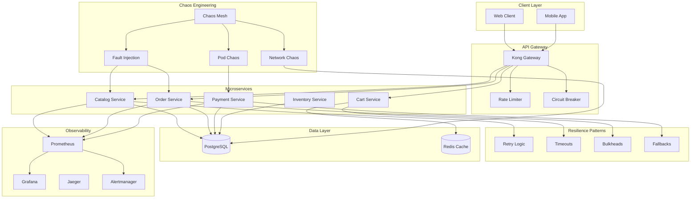

# Resilient Microservices with Chaos Engineering and Operational Resilience: A Complete Integration Tutorial

**Objective**: Build a production-ready resilient microservices system that integrates chaos engineering, operational resilience patterns, observability-driven development, service decomposition, and system resilience patterns. This tutorial demonstrates how to build systems that survive failures gracefully.

This tutorial combines:
- **[Chaos Engineering, Fault Injection, and Reliability Validation](../../best-practices/operations-monitoring/chaos-engineering-governance.md)** - Safe fault injection and reliability testing
- **[Operational Resilience and Incident Response](../../best-practices/operations-monitoring/operational-resilience-and-incident-response.md)** - Resilience patterns and incident response
- **[System Resilience, Rate Limiting, Concurrency Control & Backpressure](../../best-practices/operations-monitoring/system-resilience-and-concurrency.md)** - Resilience patterns
- **[Observability-Driven Development](../../best-practices/operations-monitoring/observability-driven-development.md)** - Telemetry-first resilience
- **[Service Decomposition Strategy](../../best-practices/architecture-design/service-decomposition-strategy.md)** - Domain boundaries for resilience

## 1) Prerequisites

```bash
# Required tools
docker --version          # >= 20.10
docker compose --version  # >= 2.0
kubectl --version         # >= 1.28
python --version          # >= 3.10
chaos-mesh --version      # For chaos engineering
curl --version           # For testing

# Python packages
pip install chaos-mesh-client prometheus-client \
    opentelemetry-api opentelemetry-sdk \
    circuitbreaker retry tenacity
```

**Why**: Building resilient systems requires chaos engineering tools (Chaos Mesh), observability (Prometheus, OpenTelemetry), and resilience libraries (circuitbreaker, retry) to test and validate resilience patterns.

## 2) Architecture Overview

We'll build a **Resilient E-Commerce System** with comprehensive resilience patterns:



**Resilience Patterns**:
1. **Circuit Breakers**: Prevent cascading failures
2. **Retries**: Handle transient failures
3. **Timeouts**: Prevent hanging requests
4. **Bulkheads**: Isolate failure domains
5. **Fallbacks**: Graceful degradation
6. **Rate Limiting**: Prevent overload

## 3) Repository Layout

```
resilient-microservices/
├── docker-compose.yaml
├── services/
│   ├── catalog-service/
│   │   ├── Dockerfile
│   │   ├── requirements.txt
│   │   ├── app/
│   │   │   ├── __init__.py
│   │   │   ├── main.py
│   │   │   ├── resilience.py
│   │   │   ├── circuit_breaker.py
│   │   │   ├── observability.py
│   │   │   └── handlers.py
│   │   └── tests/
│   │       └── test_resilience.py
│   ├── order-service/
│   │   └── [similar structure]
│   └── payment-service/
│       └── [similar structure]
├── chaos/
│   ├── experiments/
│   │   ├── pod-failure.yaml
│   │   ├── network-latency.yaml
│   │   └── cpu-stress.yaml
│   └── run-chaos.sh
├── observability/
│   ├── prometheus/
│   │   └── prometheus.yml
│   ├── grafana/
│   │   └── dashboards/
│   └── alertmanager/
│       └── alerts.yml
└── scripts/
    ├── run-resilience-tests.sh
    └── validate-slos.sh
```

## 4) Circuit Breaker Implementation

Create `services/catalog-service/app/circuit_breaker.py`:

```python
"""Circuit breaker pattern for resilience."""
import time
import logging
from enum import Enum
from typing import Callable, Any, Optional
from functools import wraps
from dataclasses import dataclass

from prometheus_client import Counter, Histogram, Gauge

logger = logging.getLogger(__name__)


class CircuitState(Enum):
    """Circuit breaker states."""
    CLOSED = "closed"  # Normal operation
    OPEN = "open"  # Failing, reject requests
    HALF_OPEN = "half_open"  # Testing if service recovered


@dataclass
class CircuitBreakerConfig:
    """Circuit breaker configuration."""
    failure_threshold: int = 5  # Open after N failures
    success_threshold: int = 2  # Close after N successes in half-open
    timeout_seconds: int = 60  # Time before attempting half-open
    expected_exception: type = Exception


class CircuitBreaker:
    """Circuit breaker implementation."""
    
    def __init__(self, name: str, config: CircuitBreakerConfig):
        self.name = name
        self.config = config
        self.state = CircuitState.CLOSED
        self.failure_count = 0
        self.success_count = 0
        self.last_failure_time: Optional[float] = None
        self.last_state_change: float = time.time()
        
        # Metrics
        self.circuit_state = Gauge(
            f"circuit_breaker_state_{name}",
            f"Circuit breaker state for {name}",
            ["state"]
        )
        self.circuit_failures = Counter(
            f"circuit_breaker_failures_{name}_total",
            f"Circuit breaker failures for {name}"
        )
        self.circuit_opens = Counter(
            f"circuit_breaker_opens_{name}_total",
            f"Circuit breaker opens for {name}"
        )
        self.circuit_closes = Counter(
            f"circuit_breaker_closes_{name}_total",
            f"Circuit breaker closes for {name}"
        )
    
    def call(self, func: Callable, *args, **kwargs) -> Any:
        """Execute function with circuit breaker protection."""
        # Check if circuit should transition
        self._check_state_transition()
        
        # Reject if circuit is open
        if self.state == CircuitState.OPEN:
            self.circuit_failures.inc()
            raise CircuitBreakerOpenError(
                f"Circuit breaker {self.name} is OPEN"
            )
        
        # Attempt call
        try:
            result = func(*args, **kwargs)
            self._on_success()
            return result
        except self.config.expected_exception as e:
            self._on_failure()
            raise
    
    def _check_state_transition(self):
        """Check if circuit should transition state."""
        now = time.time()
        
        if self.state == CircuitState.OPEN:
            # Check if timeout has passed
            if (now - self.last_failure_time) >= self.config.timeout_seconds:
                self.state = CircuitState.HALF_OPEN
                self.success_count = 0
                self.last_state_change = now
                logger.info(f"Circuit breaker {self.name} transitioned to HALF_OPEN")
        
        self._update_metrics()
    
    def _on_success(self):
        """Handle successful call."""
        if self.state == CircuitState.HALF_OPEN:
            self.success_count += 1
            if self.success_count >= self.config.success_threshold:
                self.state = CircuitState.CLOSED
                self.failure_count = 0
                self.last_state_change = time.time()
                self.circuit_closes.inc()
                logger.info(f"Circuit breaker {self.name} transitioned to CLOSED")
        elif self.state == CircuitState.CLOSED:
            self.failure_count = 0
    
    def _on_failure(self):
        """Handle failed call."""
        self.failure_count += 1
        self.last_failure_time = time.time()
        self.circuit_failures.inc()
        
        if self.state == CircuitState.HALF_OPEN:
            # Immediately open on failure in half-open
            self.state = CircuitState.OPEN
            self.last_state_change = time.time()
            self.circuit_opens.inc()
            logger.warning(f"Circuit breaker {self.name} transitioned to OPEN (half-open failure)")
        elif self.state == CircuitState.CLOSED:
            if self.failure_count >= self.config.failure_threshold:
                self.state = CircuitState.OPEN
                self.last_state_change = time.time()
                self.circuit_opens.inc()
                logger.error(f"Circuit breaker {self.name} transitioned to OPEN")
        
        self._update_metrics()
    
    def _update_metrics(self):
        """Update Prometheus metrics."""
        self.circuit_state.labels(state=self.state.value).set(1)


class CircuitBreakerOpenError(Exception):
    """Raised when circuit breaker is open."""
    pass


def circuit_breaker(name: str, config: Optional[CircuitBreakerConfig] = None):
    """Decorator for circuit breaker."""
    if config is None:
        config = CircuitBreakerConfig()
    
    breaker = CircuitBreaker(name, config)
    
    def decorator(func: Callable):
        @wraps(func)
        def wrapper(*args, **kwargs):
            return breaker.call(func, *args, **kwargs)
        return wrapper
    return decorator
```

## 5) Resilience Patterns

Create `services/catalog-service/app/resilience.py`:

```python
"""Resilience patterns: retry, timeout, bulkhead, fallback."""
import asyncio
import logging
from typing import Callable, Any, Optional, TypeVar, Awaitable
from functools import wraps
from tenacity import (
    retry,
    stop_after_attempt,
    wait_exponential,
    retry_if_exception_type
)
from circuitbreaker import circuit_breaker, CircuitBreakerConfig

from observability.metrics import resilience_metrics

logger = logging.getLogger(__name__)

T = TypeVar('T')


def with_retry(
    max_attempts: int = 3,
    initial_wait: float = 1.0,
    max_wait: float = 10.0,
    exponential_base: float = 2.0
):
    """Retry decorator with exponential backoff."""
    def decorator(func: Callable):
        @retry(
            stop=stop_after_attempt(max_attempts),
            wait=wait_exponential(
                multiplier=initial_wait,
                max=max_wait,
                exp_base=exponential_base
            ),
            retry=retry_if_exception_type((ConnectionError, TimeoutError)),
            reraise=True
        )
        @wraps(func)
        async def wrapper(*args, **kwargs):
            try:
                result = await func(*args, **kwargs)
                resilience_metrics.retry_success.labels(
                    function=func.__name__
                ).inc()
                return result
            except Exception as e:
                resilience_metrics.retry_failure.labels(
                    function=func.__name__,
                    error_type=type(e).__name__
                ).inc()
                raise
        return wrapper
    return decorator


def with_timeout(timeout_seconds: float):
    """Timeout decorator."""
    def decorator(func: Callable):
        @wraps(func)
        async def wrapper(*args, **kwargs):
            try:
                result = await asyncio.wait_for(
                    func(*args, **kwargs),
                    timeout=timeout_seconds
                )
                resilience_metrics.timeout_success.labels(
                    function=func.__name__
                ).inc()
                return result
            except asyncio.TimeoutError:
                resilience_metrics.timeout_failure.labels(
                    function=func.__name__
                ).inc()
                raise TimeoutError(
                    f"Function {func.__name__} timed out after {timeout_seconds}s"
                )
        return wrapper
    return decorator


def with_fallback(fallback_func: Callable, fallback_value: Any = None):
    """Fallback decorator."""
    def decorator(func: Callable):
        @wraps(func)
        async def wrapper(*args, **kwargs):
            try:
                result = await func(*args, **kwargs)
                resilience_metrics.fallback_not_used.labels(
                    function=func.__name__
                ).inc()
                return result
            except Exception as e:
                logger.warning(
                    f"Function {func.__name__} failed, using fallback: {e}",
                    exc_info=True
                )
                resilience_metrics.fallback_used.labels(
                    function=func.__name__,
                    error_type=type(e).__name__
                ).inc()
                
                if fallback_func:
                    return await fallback_func(*args, **kwargs)
                return fallback_value
        return wrapper
    return decorator


class Bulkhead:
    """Bulkhead pattern for resource isolation."""
    
    def __init__(self, name: str, max_concurrent: int = 10):
        self.name = name
        self.semaphore = asyncio.Semaphore(max_concurrent)
        self.max_concurrent = max_concurrent
        
        resilience_metrics.bulkhead_capacity.labels(
            bulkhead=name
        ).set(max_concurrent)
    
    async def execute(self, func: Callable, *args, **kwargs):
        """Execute function with bulkhead protection."""
        async with self.semaphore:
            current = self.max_concurrent - self.semaphore._value
            resilience_metrics.bulkhead_active.labels(
                bulkhead=self.name
            ).set(current)
            
            try:
                result = await func(*args, **kwargs)
                resilience_metrics.bulkhead_success.labels(
                    bulkhead=self.name
                ).inc()
                return result
            except Exception as e:
                resilience_metrics.bulkhead_failure.labels(
                    bulkhead=self.name,
                    error_type=type(e).__name__
                ).inc()
                raise
```

## 6) Service Implementation with Resilience

Create `services/catalog-service/app/handlers.py`:

```python
"""Catalog service handlers with resilience patterns."""
from fastapi import FastAPI, HTTPException, Depends
from sqlalchemy.orm import Session
from typing import List

from app.resilience import (
    with_retry,
    with_timeout,
    with_fallback,
    Bulkhead
)
from app.circuit_breaker import circuit_breaker, CircuitBreakerConfig
from app.observability import trace_operation
from app.models import Product, get_db

app = FastAPI()

# Bulkhead for database operations
db_bulkhead = Bulkhead("database", max_concurrent=20)

# Circuit breaker for external API
external_api_breaker = circuit_breaker(
    "external_api",
    CircuitBreakerConfig(
        failure_threshold=5,
        timeout_seconds=30
    )
)


async def get_product_from_db(product_id: str, db: Session) -> Product:
    """Get product from database."""
    return db.query(Product).filter(Product.id == product_id).first()


async def get_product_from_cache(product_id: str) -> Optional[Product]:
    """Get product from cache (fallback)."""
    # In production, use Redis
    return None


async def get_product_from_external_api(product_id: str) -> Product:
    """Get product from external API."""
    # Simulate external API call
    raise ConnectionError("External API unavailable")


@with_retry(max_attempts=3, initial_wait=1.0)
@with_timeout(timeout_seconds=5.0)
@trace_operation("get_product")
async def get_product_with_resilience(
    product_id: str,
    db: Session = Depends(get_db)
) -> Product:
    """Get product with resilience patterns."""
    # Try database first
    product = await db_bulkhead.execute(
        get_product_from_db,
        product_id,
        db
    )
    
    if product:
        return product
    
    # Fallback to cache
    product = await get_product_from_cache(product_id)
    if product:
        return product
    
    # Fallback to external API (with circuit breaker)
    try:
        product = await external_api_breaker.call(
            get_product_from_external_api,
            product_id
        )
        return product
    except Exception as e:
        raise HTTPException(
            status_code=503,
            detail=f"Product {product_id} not available: {str(e)}"
        )


@app.get("/products/{product_id}")
async def get_product(product_id: str, db: Session = Depends(get_db)):
    """Get product endpoint with resilience."""
    return await get_product_with_resilience(product_id, db)


@app.get("/products")
@with_retry(max_attempts=2)
@with_timeout(timeout_seconds=10.0)
async def list_products(
    skip: int = 0,
    limit: int = 100,
    db: Session = Depends(get_db)
) -> List[Product]:
    """List products with resilience."""
    products = await db_bulkhead.execute(
        lambda: db.query(Product).offset(skip).limit(limit).all()
    )
    return products
```

## 7) Chaos Engineering Experiments

### 7.1) Pod Failure Experiment

Create `chaos/experiments/pod-failure.yaml`:

```yaml
apiVersion: chaos-mesh.org/v1alpha1
kind: PodChaos
metadata:
  name: catalog-service-pod-failure
  namespace: default
spec:
  action: pod-failure
  mode: one
  selector:
    namespaces:
      - default
    labelSelectors:
      app: catalog-service
  duration: "30s"
  scheduler:
    cron: "@every 5m"
```

### 7.2) Network Latency Experiment

Create `chaos/experiments/network-latency.yaml`:

```yaml
apiVersion: chaos-mesh.org/v1alpha1
kind: NetworkChaos
metadata:
  name: database-network-latency
  namespace: default
spec:
  action: delay
  mode: one
  selector:
    namespaces:
      - default
    labelSelectors:
      app: postgres
  delay:
    latency: "500ms"
    correlation: "100"
    jitter: "100ms"
  duration: "2m"
  scheduler:
    cron: "@every 10m"
```

### 7.3) CPU Stress Experiment

Create `chaos/experiments/cpu-stress.yaml`:

```yaml
apiVersion: chaos-mesh.org/v1alpha1
kind: StressChaos
metadata:
  name: payment-service-cpu-stress
  namespace: default
spec:
  mode: one
  selector:
    namespaces:
      - default
    labelSelectors:
      app: payment-service
  stressors:
    cpu:
      workers: 4
      load: 80
  duration: "1m"
  scheduler:
    cron: "@every 15m"
```

## 8) Chaos Experiment Runner

Create `chaos/run-chaos.sh`:

```bash
#!/bin/bash
# Run chaos experiments safely

set -euo pipefail

EXPERIMENT="${1:-}"

if [[ -z "$EXPERIMENT" ]]; then
    echo "Usage: $0 <experiment-name>"
    echo "Available experiments:"
    echo "  - pod-failure"
    echo "  - network-latency"
    echo "  - cpu-stress"
    exit 1
fi

# Validate cluster is ready
echo "Validating cluster state..."
kubectl get nodes
kubectl get pods

# Check SLOs before chaos
echo "Checking SLOs before chaos..."
./scripts/validate-slos.sh

# Apply chaos experiment
echo "Applying chaos experiment: $EXPERIMENT"
kubectl apply -f "chaos/experiments/${EXPERIMENT}.yaml"

# Wait for experiment to complete
echo "Waiting for experiment to complete..."
sleep 60

# Check SLOs after chaos
echo "Checking SLOs after chaos..."
./scripts/validate-slos.sh

# Cleanup
echo "Cleaning up chaos experiment..."
kubectl delete -f "chaos/experiments/${EXPERIMENT}.yaml" || true

echo "Chaos experiment completed!"
```

## 9) SLO Validation

Create `scripts/validate-slos.sh`:

```bash
#!/bin/bash
# Validate SLOs during chaos experiments

set -euo pipefail

# SLO thresholds
MAX_ERROR_RATE=0.01  # 1% error rate
MAX_LATENCY_P99=500  # 500ms p99 latency
MIN_AVAILABILITY=0.99  # 99% availability

# Query Prometheus
PROMETHEUS_URL="${PROMETHEUS_URL:-http://localhost:9090}"

# Get error rate
ERROR_RATE=$(curl -s "${PROMETHEUS_URL}/api/v1/query?query=rate(http_requests_total{status=~\"5..\"}[5m])" | \
    jq -r '.data.result[0].value[1] // "0"')

# Get p99 latency
P99_LATENCY=$(curl -s "${PROMETHEUS_URL}/api/v1/query?query=histogram_quantile(0.99,rate(http_request_duration_seconds_bucket[5m]))" | \
    jq -r '.data.result[0].value[1] // "0"')

# Get availability
AVAILABILITY=$(curl -s "${PROMETHEUS_URL}/api/v1/query?query=avg_over_time(up[5m])" | \
    jq -r '.data.result[0].value[1] // "1"')

# Validate SLOs
VIOLATIONS=0

if (( $(echo "$ERROR_RATE > $MAX_ERROR_RATE" | bc -l) )); then
    echo "✗ Error rate SLO violation: ${ERROR_RATE} > ${MAX_ERROR_RATE}"
    VIOLATIONS=$((VIOLATIONS + 1))
else
    echo "✓ Error rate within SLO: ${ERROR_RATE} <= ${MAX_ERROR_RATE}"
fi

if (( $(echo "$P99_LATENCY > $MAX_LATENCY_P99" | bc -l) )); then
    echo "✗ Latency SLO violation: ${P99_LATENCY}ms > ${MAX_LATENCY_P99}ms"
    VIOLATIONS=$((VIOLATIONS + 1))
else
    echo "✓ Latency within SLO: ${P99_LATENCY}ms <= ${MAX_LATENCY_P99}ms"
fi

if (( $(echo "$AVAILABILITY < $MIN_AVAILABILITY" | bc -l) )); then
    echo "✗ Availability SLO violation: ${AVAILABILITY} < ${MIN_AVAILABILITY}"
    VIOLATIONS=$((VIOLATIONS + 1))
else
    echo "✓ Availability within SLO: ${AVAILABILITY} >= ${MIN_AVAILABILITY}"
fi

if [[ $VIOLATIONS -gt 0 ]]; then
    echo "SLO violations detected: $VIOLATIONS"
    exit 1
else
    echo "All SLOs met!"
    exit 0
fi
```

## 10) Observability Metrics

Create `observability/metrics.py`:

```python
"""Resilience metrics."""
from prometheus_client import Counter, Histogram, Gauge

# Circuit breaker metrics
circuit_breaker_state = Gauge(
    "circuit_breaker_state",
    "Circuit breaker state",
    ["name", "state"]
)

circuit_breaker_opens = Counter(
    "circuit_breaker_opens_total",
    "Circuit breaker opens",
    ["name"]
)

circuit_breaker_closes = Counter(
    "circuit_breaker_closes_total",
    "Circuit breaker closes",
    ["name"]
)

# Retry metrics
retry_success = Counter(
    "retry_success_total",
    "Successful retries",
    ["function"]
)

retry_failure = Counter(
    "retry_failure_total",
    "Failed retries",
    ["function", "error_type"]
)

# Timeout metrics
timeout_success = Counter(
    "timeout_success_total",
    "Successful timeouts",
    ["function"]
)

timeout_failure = Counter(
    "timeout_failure_total",
    "Timeout failures",
    ["function"]
)

# Fallback metrics
fallback_used = Counter(
    "fallback_used_total",
    "Fallbacks used",
    ["function", "error_type"]
)

fallback_not_used = Counter(
    "fallback_not_used_total",
    "Fallbacks not used",
    ["function"]
)

# Bulkhead metrics
bulkhead_capacity = Gauge(
    "bulkhead_capacity",
    "Bulkhead capacity",
    ["bulkhead"]
)

bulkhead_active = Gauge(
    "bulkhead_active",
    "Active bulkhead requests",
    ["bulkhead"]
)

bulkhead_success = Counter(
    "bulkhead_success_total",
    "Bulkhead successes",
    ["bulkhead"]
)

bulkhead_failure = Counter(
    "bulkhead_failure_total",
    "Bulkhead failures",
    ["bulkhead", "error_type"]
)
```

## 11) Testing Resilience

### 11.1) Run Chaos Experiments

```bash
# Start services
docker compose up -d

# Run pod failure experiment
./chaos/run-chaos.sh pod-failure

# Run network latency experiment
./chaos/run-chaos.sh network-latency

# Run CPU stress experiment
./chaos/run-chaos.sh cpu-stress
```

### 11.2) Monitor Resilience

```bash
# View metrics
curl http://localhost:9090/api/v1/query?query=circuit_breaker_state

# View Grafana dashboards
# http://localhost:3000
```

## 12) Best Practices Integration Summary

This tutorial demonstrates:

1. **Chaos Engineering**: Safe fault injection to validate resilience
2. **Operational Resilience**: Circuit breakers, retries, timeouts, bulkheads, fallbacks
3. **Observability**: Comprehensive metrics for all resilience patterns
4. **SLO Validation**: Automated SLO validation during chaos experiments
5. **Service Decomposition**: Isolated failure domains through service boundaries

**Key Integration Points**:
- Chaos experiments validate resilience patterns
- Observability metrics track resilience effectiveness
- SLO validation ensures resilience meets requirements
- Service boundaries enable isolated failure domains

## 13) Next Steps

- Add automated chaos experiments to CI/CD
- Implement automated rollback on SLO violations
- Add resilience testing to load tests
- Implement chaos engineering runbooks
- Add resilience dashboards to Grafana

---

*This tutorial demonstrates how multiple best practices integrate to build production-ready resilient microservices systems.*

