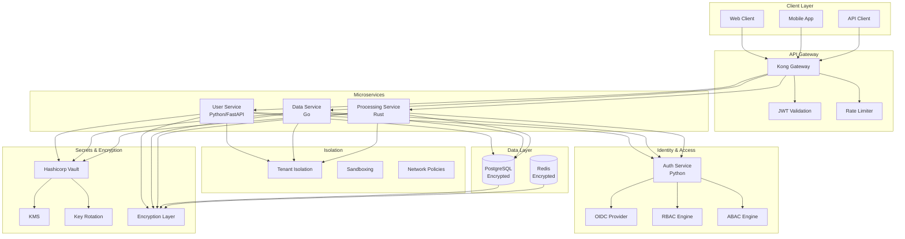

# Secure Polyglot System with Identity Federation and Encryption Lifecycle: A Complete Integration Tutorial

**Objective**: Build a production-ready secure polyglot system that integrates identity federation, encryption lifecycle management, secrets management, secure-by-design patterns, and multi-tenant isolation. This tutorial demonstrates how to secure systems across multiple languages and environments.

This tutorial combines:
- **[Cross-Domain Identity Federation, AuthZ/AuthN Architecture](../best-practices/security/identity-federation-authz-authn-architecture.md)** - Unified identity across systems
- **[Secret Supply Chains, Encryption Lifecycle Management](../best-practices/security/encryption-lifecycle-and-crypto-rotation.md)** - Encryption and key rotation
- **[End-to-End Secrets Management](../best-practices/security/secrets-governance.md)** - Secrets lifecycle
- **[Secure-by-Design Lifecycle Architecture](../best-practices/security/secure-by-design-polyglot.md)** - Security as lifecycle concern
- **[Secure Computes, Sandboxing, and Multi-Tenant Isolation](../best-practices/security/secure-sandboxing-and-multi-tenant-isolation.md)** - Isolation patterns

## 1) Prerequisites

```bash
# Required tools
docker --version          # >= 20.10
docker compose --version  # >= 2.0
kubectl --version         # >= 1.28
vault --version           # Hashicorp Vault
python --version          # >= 3.10
go --version              # >= 1.21
rust --version            # >= 1.70

# Python packages
pip install fastapi python-jose[cryptography] passlib[bcrypt] \
    opentelemetry-api opentelemetry-sdk vault-python

# Go packages
go get github.com/hashicorp/vault/api
go get golang.org/x/crypto/bcrypt
go get github.com/golang-jwt/jwt/v5
```

**Why**: Secure polyglot systems require identity management (OIDC, JWT), secrets management (Vault), encryption (TLS, application-level), and isolation patterns across Python, Go, and Rust services.

## 2) Architecture Overview

We'll build a **Secure Multi-Tenant API Platform** with comprehensive security:



**Security Layers**:
1. **Identity**: OIDC, JWT, RBAC/ABAC
2. **Secrets**: Vault, KMS, key rotation
3. **Encryption**: TLS, application-level, at-rest
4. **Isolation**: Tenant isolation, sandboxing, network policies
5. **Access Control**: API gateway, rate limiting, authorization

## 3) Repository Layout

```
secure-polyglot/
├── docker-compose.yaml
├── services/
│   ├── auth-service/
│   │   ├── Dockerfile
│   │   ├── requirements.txt
│   │   ├── app/
│   │   │   ├── __init__.py
│   │   │   ├── main.py
│   │   │   ├── oidc.py
│   │   │   ├── rbac.py
│   │   │   ├── abac.py
│   │   │   └── jwt.py
│   │   └── tests/
│   ├── user-service/
│   │   ├── Dockerfile
│   │   ├── requirements.txt
│   │   └── app/
│   ├── data-service/
│   │   ├── Dockerfile
│   │   ├── go.mod
│   │   └── main.go
│   └── processing-service/
│       ├── Dockerfile
│       ├── Cargo.toml
│       └── src/
├── vault/
│   ├── policies/
│   │   ├── user-service.hcl
│   │   ├── data-service.hcl
│   │   └── processing-service.hcl
│   └── init.sh
├── encryption/
│   ├── key-rotation/
│   │   └── rotate-keys.sh
│   └── kms/
│       └── setup.sh
└── scripts/
    ├── setup-vault.sh
    └── rotate-secrets.sh
```

## 4) Identity Federation (Python)

Create `services/auth-service/app/oidc.py`:

```python
"""OIDC identity federation."""
from typing import Optional, Dict, Any
from datetime import datetime, timedelta
import jwt
from jose import JWTError
from fastapi import HTTPException, Depends
from fastapi.security import OAuth2PasswordBearer
from passlib.context import CryptContext

from app.config import settings

pwd_context = CryptContext(schemes=["bcrypt"], deprecated="auto")
oauth2_scheme = OAuth2PasswordBearer(tokenUrl="token")


class OIDCProvider:
    """OIDC provider for identity federation."""
    
    def __init__(self, issuer: str, client_id: str, client_secret: str):
        self.issuer = issuer
        self.client_id = client_id
        self.client_secret = client_secret
        self.jwks_uri = f"{issuer}/.well-known/jwks.json"
    
    def verify_token(self, token: str) -> Dict[str, Any]:
        """Verify OIDC token."""
        try:
            # In production, fetch JWKS and verify
            payload = jwt.decode(
                token,
                options={"verify_signature": False}  # Simplified for demo
            )
            return payload
        except JWTError as e:
            raise HTTPException(
                status_code=401,
                detail=f"Invalid token: {str(e)}"
            )
    
    def get_user_info(self, token: str) -> Dict[str, Any]:
        """Get user info from OIDC provider."""
        payload = self.verify_token(token)
        return {
            "sub": payload.get("sub"),
            "email": payload.get("email"),
            "name": payload.get("name"),
            "roles": payload.get("roles", [])
        }


class JWTManager:
    """JWT token management."""
    
    def __init__(self, secret_key: str, algorithm: str = "HS256"):
        self.secret_key = secret_key
        self.algorithm = algorithm
    
    def create_token(
        self,
        data: Dict[str, Any],
        expires_delta: Optional[timedelta] = None
    ) -> str:
        """Create JWT token."""
        to_encode = data.copy()
        if expires_delta:
            expire = datetime.utcnow() + expires_delta
        else:
            expire = datetime.utcnow() + timedelta(hours=24)
        
        to_encode.update({
            "exp": expire,
            "iat": datetime.utcnow(),
            "iss": settings.JWT_ISSUER
        })
        
        return jwt.encode(to_encode, self.secret_key, algorithm=self.algorithm)
    
    def verify_token(self, token: str) -> Dict[str, Any]:
        """Verify JWT token."""
        try:
            payload = jwt.decode(
                token,
                self.secret_key,
                algorithms=[self.algorithm],
                options={"verify_exp": True}
            )
            return payload
        except JWTError as e:
            raise HTTPException(
                status_code=401,
                detail=f"Invalid token: {str(e)}"
            )


async def get_current_user(token: str = Depends(oauth2_scheme)) -> Dict[str, Any]:
    """Get current user from token."""
    oidc = OIDCProvider(
        issuer=settings.OIDC_ISSUER,
        client_id=settings.OIDC_CLIENT_ID,
        client_secret=settings.OIDC_CLIENT_SECRET
    )
    return oidc.get_user_info(token)
```

## 5) RBAC/ABAC (Python)

Create `services/auth-service/app/rbac.py`:

```python
"""RBAC and ABAC authorization."""
from typing import List, Dict, Any, Optional
from enum import Enum
from dataclasses import dataclass

from app.oidc import get_current_user
from fastapi import Depends, HTTPException


class Permission(Enum):
    """Permissions."""
    READ = "read"
    WRITE = "write"
    DELETE = "delete"
    ADMIN = "admin"


@dataclass
class Role:
    """Role definition."""
    name: str
    permissions: List[Permission]
    resources: List[str]


class RBACEngine:
    """RBAC authorization engine."""
    
    def __init__(self):
        self.roles = {
            "admin": Role(
                name="admin",
                permissions=[Permission.READ, Permission.WRITE, Permission.DELETE, Permission.ADMIN],
                resources=["*"]
            ),
            "user": Role(
                name="user",
                permissions=[Permission.READ, Permission.WRITE],
                resources=["users", "data"]
            ),
            "viewer": Role(
                name="viewer",
                permissions=[Permission.READ],
                resources=["users", "data"]
            )
        }
    
    def has_permission(
        self,
        user_roles: List[str],
        permission: Permission,
        resource: str
    ) -> bool:
        """Check if user has permission."""
        for role_name in user_roles:
            if role_name in self.roles:
                role = self.roles[role_name]
                if permission in role.permissions:
                    if "*" in role.resources or resource in role.resources:
                        return True
        return False


class ABACEngine:
    """ABAC authorization engine."""
    
    def evaluate_policy(
        self,
        subject: Dict[str, Any],
        resource: Dict[str, Any],
        action: str,
        environment: Dict[str, Any]
    ) -> bool:
        """Evaluate ABAC policy."""
        # Example policy: user can access their own data or admin can access all
        if subject.get("roles", []).__contains__("admin"):
            return True
        
        if action == "read" and subject.get("sub") == resource.get("owner"):
            return True
        
        if action == "write" and subject.get("sub") == resource.get("owner"):
            return True
        
        return False


def require_permission(permission: Permission, resource: str):
    """Decorator for permission checking."""
    def decorator(func):
        async def wrapper(
            *args,
            current_user: Dict[str, Any] = Depends(get_current_user),
            **kwargs
        ):
            rbac = RBACEngine()
            user_roles = current_user.get("roles", [])
            
            if not rbac.has_permission(user_roles, permission, resource):
                raise HTTPException(
                    status_code=403,
                    detail=f"Permission denied: {permission.value} on {resource}"
                )
            
            return await func(*args, current_user=current_user, **kwargs)
        return wrapper
    return decorator
```

## 6) Secrets Management (Python)

Create `services/user-service/app/secrets.py`:

```python
"""Secrets management with Vault."""
import hvac
from typing import Optional, Dict, Any
import os

from observability.metrics import secrets_metrics


class VaultClient:
    """Hashicorp Vault client."""
    
    def __init__(self, vault_url: str, vault_token: str):
        self.client = hvac.Client(url=vault_url, token=vault_token)
        self.client.is_authenticated()
    
    def get_secret(self, path: str, key: Optional[str] = None) -> Any:
        """Get secret from Vault."""
        try:
            response = self.client.secrets.kv.v2.read_secret_version(path=path)
            data = response["data"]["data"]
            
            if key:
                return data.get(key)
            return data
        except Exception as e:
            secrets_metrics.secret_access_failures.labels(
                path=path,
                error_type=type(e).__name__
            ).inc()
            raise
    
    def rotate_secret(self, path: str, new_secret: str) -> bool:
        """Rotate secret in Vault."""
        try:
            self.client.secrets.kv.v2.create_or_update_secret(
                path=path,
                secret={"value": new_secret}
            )
            secrets_metrics.secret_rotations.labels(path=path).inc()
            return True
        except Exception as e:
            secrets_metrics.secret_rotation_failures.labels(
                path=path,
                error_type=type(e).__name__
            ).inc()
            raise


# Global Vault client
vault_client = VaultClient(
    vault_url=os.getenv("VAULT_ADDR", "http://vault:8200"),
    vault_token=os.getenv("VAULT_TOKEN", "")
)
```

## 7) Encryption Lifecycle (Go)

Create `services/data-service/encryption.go`:

```go
package main

import (
	"crypto/aes"
	"crypto/cipher"
	"crypto/rand"
	"crypto/sha256"
	"encoding/base64"
	"fmt"
	"io"
	"time"

	"github.com/hashicorp/vault/api"
)

type EncryptionManager struct {
	vaultClient *api.Client
	keyVersion  string
	keyID       string
}

func NewEncryptionManager(vaultAddr, vaultToken string) (*EncryptionManager, error) {
	client, err := api.NewClient(&api.Config{
		Address: vaultAddr,
	})
	if err != nil {
		return nil, err
	}

	client.SetToken(vaultToken)

	return &EncryptionManager{
		vaultClient: client,
		keyVersion:  "v1",
		keyID:       "data-encryption-key",
	}, nil
}

func (em *EncryptionManager) getEncryptionKey() ([]byte, error) {
	// Get key from Vault KMS
	secret, err := em.vaultClient.Logical().Read(
		fmt.Sprintf("transit/keys/%s", em.keyID),
	)
	if err != nil {
		return nil, err
	}

	// In production, use Vault Transit for encryption
	// For demo, derive key from secret
	keyData := secret.Data["keys"].(map[string]interface{})[em.keyVersion].(map[string]interface{})
	keyStr := keyData["key"].(string)
	
	hash := sha256.Sum256([]byte(keyStr))
	return hash[:], nil
}

func (em *EncryptionManager) Encrypt(plaintext []byte) ([]byte, error) {
	key, err := em.getEncryptionKey()
	if err != nil {
		return nil, err
	}

	block, err := aes.NewCipher(key)
	if err != nil {
		return nil, err
	}

	gcm, err := cipher.NewGCM(block)
	if err != nil {
		return nil, err
	}

	nonce := make([]byte, gcm.NonceSize())
	if _, err := io.ReadFull(rand.Reader, nonce); err != nil {
		return nil, err
	}

	ciphertext := gcm.Seal(nonce, nonce, plaintext, nil)
	return ciphertext, nil
}

func (em *EncryptionManager) Decrypt(ciphertext []byte) ([]byte, error) {
	key, err := em.getEncryptionKey()
	if err != nil {
		return nil, err
	}

	block, err := aes.NewCipher(key)
	if err != nil {
		return nil, err
	}

	gcm, err := cipher.NewGCM(block)
	if err != nil {
		return nil, err
	}

	nonceSize := gcm.NonceSize()
	if len(ciphertext) < nonceSize {
		return nil, fmt.Errorf("ciphertext too short")
	}

	nonce, ciphertext := ciphertext[:nonceSize], ciphertext[nonceSize:]
	plaintext, err := gcm.Open(nil, nonce, ciphertext, nil)
	if err != nil {
		return nil, err
	}

	return plaintext, nil
}

func (em *EncryptionManager) RotateKey() error {
	// Rotate key in Vault
	_, err := em.vaultClient.Logical().Write(
		fmt.Sprintf("transit/keys/%s/rotate", em.keyID),
		nil,
	)
	if err != nil {
		return err
	}

	// Update key version
	em.keyVersion = fmt.Sprintf("v%d", time.Now().Unix())
	return nil
}
```

## 8) Multi-Tenant Isolation (Rust)

Create `services/processing-service/src/isolation.rs`:

```rust
/// Multi-tenant isolation patterns.
use std::collections::HashMap;
use serde::{Deserialize, Serialize};

#[derive(Debug, Clone, Serialize, Deserialize)]
pub struct Tenant {
    pub id: String,
    pub name: String,
    pub isolation_level: IsolationLevel,
}

#[derive(Debug, Clone, Serialize, Deserialize)]
pub enum IsolationLevel {
    Shared,      // Shared resources
    Dedicated,   // Dedicated resources
    Isolated,    // Fully isolated
}

pub struct TenantIsolator {
    tenants: HashMap<String, Tenant>,
}

impl TenantIsolator {
    pub fn new() -> Self {
        Self {
            tenants: HashMap::new(),
        }
    }

    pub fn register_tenant(&mut self, tenant: Tenant) {
        self.tenants.insert(tenant.id.clone(), tenant);
    }

    pub fn get_tenant(&self, tenant_id: &str) -> Option<&Tenant> {
        self.tenants.get(tenant_id)
    }

    pub fn is_isolated(&self, tenant_id: &str) -> bool {
        match self.get_tenant(tenant_id) {
            Some(tenant) => matches!(tenant.isolation_level, IsolationLevel::Isolated),
            None => false,
        }
    }

    pub fn validate_tenant_access(
        &self,
        tenant_id: &str,
        resource_tenant_id: &str,
    ) -> bool {
        // Tenant can only access their own resources
        tenant_id == resource_tenant_id
    }
}

pub struct Sandbox {
    pub tenant_id: String,
    pub resource_limits: ResourceLimits,
}

#[derive(Debug, Clone, Serialize, Deserialize)]
pub struct ResourceLimits {
    pub cpu_millis: u64,
    pub memory_mb: u64,
    pub max_execution_time_secs: u64,
}

impl Sandbox {
    pub fn new(tenant_id: String, limits: ResourceLimits) -> Self {
        Self {
            tenant_id,
            resource_limits: limits,
        }
    }

    pub fn enforce_limits(&self) -> Result<(), String> {
        // In production, enforce resource limits
        // For demo, just validate
        if self.resource_limits.cpu_millis == 0 {
            return Err("CPU limit must be > 0".to_string());
        }
        if self.resource_limits.memory_mb == 0 {
            return Err("Memory limit must be > 0".to_string());
        }
        Ok(())
    }
}
```

## 9) Key Rotation Script

Create `encryption/key-rotation/rotate-keys.sh`:

```bash
#!/bin/bash
# Automated key rotation script

set -euo pipefail

KEY_ID="${1:-data-encryption-key}"
VAULT_ADDR="${VAULT_ADDR:-http://localhost:8200}"
VAULT_TOKEN="${VAULT_TOKEN:-}"

if [[ -z "$VAULT_TOKEN" ]]; then
    echo "Error: VAULT_TOKEN not set"
    exit 1
fi

echo "Rotating encryption key: $KEY_ID"

# Rotate key in Vault
vault write -f "transit/keys/$KEY_ID/rotate"

# Get new key version
NEW_VERSION=$(vault read -format=json "transit/keys/$KEY_ID" | \
    jq -r '.data.latest_version')

echo "Key rotated to version: $NEW_VERSION"

# Update services (in production, use service discovery or config management)
kubectl set env deployment/user-service ENCRYPTION_KEY_VERSION="$NEW_VERSION"
kubectl set env deployment/data-service ENCRYPTION_KEY_VERSION="$NEW_VERSION"
kubectl set env deployment/processing-service ENCRYPTION_KEY_VERSION="$NEW_VERSION"

echo "Services updated with new key version"

# Verify rotation
echo "Verifying key rotation..."
vault read "transit/keys/$KEY_ID"

echo "Key rotation completed successfully!"
```

## 10) Testing Security

### 10.1) Setup Vault

```bash
# Start Vault
docker compose up -d vault

# Initialize Vault
./scripts/setup-vault.sh

# Create encryption key
vault write -f transit/keys/data-encryption-key
```

### 10.2) Test Identity Federation

```bash
# Get token from OIDC provider
TOKEN=$(curl -X POST http://localhost:8080/token \
  -d "username=user&password=pass" | jq -r '.access_token')

# Access protected resource
curl -H "Authorization: Bearer $TOKEN" \
  http://localhost:8000/api/users
```

### 10.3) Test Key Rotation

```bash
# Rotate encryption key
./encryption/key-rotation/rotate-keys.sh data-encryption-key

# Verify services are using new key
kubectl get pods -l app=user-service
```

## 11) Best Practices Integration Summary

This tutorial demonstrates:

1. **Identity Federation**: OIDC, JWT, RBAC/ABAC across services
2. **Secrets Management**: Vault integration with automatic rotation
3. **Encryption Lifecycle**: Key rotation and cryptographic agility
4. **Secure-by-Design**: Security built into service architecture
5. **Multi-Tenant Isolation**: Tenant isolation and sandboxing

**Key Integration Points**:
- Identity tokens propagate across services
- Secrets are fetched from Vault at runtime
- Encryption keys rotate without downtime
- Tenant isolation enforced at service boundaries
- Security metrics track all security operations

## 12) Next Steps

- Add mTLS between services
- Implement audit logging
- Add security scanning to CI/CD
- Implement zero-trust networking
- Add security dashboards

---

*This tutorial demonstrates how multiple best practices integrate to create a production-ready secure polyglot system.*

