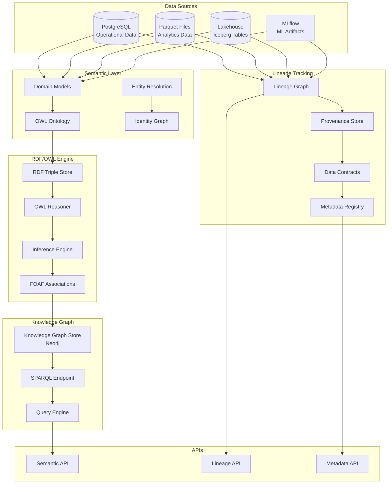

# Semantic Knowledge Graph Platform with RDF/OWL and Data Lineage: A Complete Integration Tutorial

**Objective**: Build a production-ready semantic knowledge graph platform that integrates semantic layer engineering, RDF/OWL metadata automation, cross-system data lineage contracts, and metadata provenance tracking. This tutorial demonstrates how to build intelligent, self-documenting data systems with automated relationship discovery and complete lineage tracking.

This tutorial combines:
- **[Semantic Layer Engineering, Domain Models, and Knowledge Graph Alignment](../best-practices/database-data/semantic-layer-engineering.md)** - Enterprise semantic layers
- **[RDF/OWL Metadata Automation](../best-practices/architecture-design/rdf-owl-metadata-automation.md)** - Dynamic knowledge graphs
- **[Cross-System Data Lineage, Inter-Service Metadata Contracts & Provenance Enforcement](../best-practices/database-data/data-lineage-contracts.md)** - Complete lineage tracking
- **[Metadata Standards, Schema Governance & Data Provenance Contracts](../best-practices/data-governance/metadata-provenance-contracts.md)** - Metadata and provenance

## 1) Prerequisites

```bash
# Required tools
docker --version          # >= 20.10
python --version          # >= 3.10
postgres --version        # >= 16.0
postgis --version         # >= 3.0
sparql --version          # SPARQL query engine

# Python packages
pip install rdflib owlready2 \
    sparqlwrapper pyshacl \
    networkx neo4j \
    sqlalchemy asyncpg \
    prometheus-client \
    fastapi uvicorn
```

**Why**: Semantic knowledge graphs require RDF/OWL libraries (rdflib, owlready2), SPARQL engines, graph databases (Neo4j), and metadata management to enable automated relationship discovery and lineage tracking.

## 2) Architecture Overview

We'll build a **Semantic Knowledge Graph Platform** for enterprise data:



**Platform Capabilities**:
1. **Semantic Layer**: Domain models map to physical storage
2. **RDF/OWL Automation**: Automated relationship discovery
3. **Lineage Tracking**: Complete data flow tracking
4. **Provenance**: Full data provenance and metadata

## 3) Repository Layout

```
semantic-knowledge-graph/
├── docker-compose.yaml
├── semantic/
│   ├── __init__.py
│   ├── domain_models.py
│   ├── ontology.py
│   ├── entity_resolution.py
│   └── identity_graph.py
├── rdf/
│   ├── __init__.py
│   ├── rdf_store.py
│   ├── reasoner.py
│   ├── inference.py
│   └── foaf.py
├── lineage/
│   ├── __init__.py
│   ├── lineage_tracker.py
│   ├── provenance_store.py
│   ├── contracts.py
│   └── metadata_registry.py
├── knowledge_graph/
│   ├── __init__.py
│   ├── neo4j_store.py
│   ├── sparql_endpoint.py
│   └── query_engine.py
├── ontologies/
│   ├── enterprise.owl
│   ├── data.owl
│   └── lineage.owl
└── api/
    ├── semantic_api.py
    ├── lineage_api.py
    └── metadata_api.py
```

## 4) OWL Ontology Definition

Create `ontologies/enterprise.owl`:

```xml
<?xml version="1.0"?>
<rdf:RDF xmlns:rdf="http://www.w3.org/1999/02/22-rdf-syntax-ns#"
         xmlns:owl="http://www.w3.org/2002/07/owl#"
         xmlns:rdfs="http://www.w3.org/2000/01/rdf-schema#"
         xmlns:enterprise="http://example.org/enterprise#"
         xml:base="http://example.org/enterprise">

<owl:Ontology rdf:about="http://example.org/enterprise">
  <rdfs:comment>Enterprise data ontology for semantic layer</rdfs:comment>
  <owl:versionInfo>1.0.0</owl:versionInfo>
</owl:Ontology>

<!-- Domain Classes -->
<owl:Class rdf:about="http://example.org/enterprise#Order">
  <rdfs:label>Order</rdfs:label>
  <rdfs:comment>Represents a customer order</rdfs:comment>
  <rdfs:subClassOf rdf:resource="http://example.org/enterprise#BusinessEntity"/>
</owl:Class>

<owl:Class rdf:about="http://example.org/enterprise#Customer">
  <rdfs:label>Customer</rdfs:label>
  <rdfs:comment>Represents a customer</rdfs:comment>
  <rdfs:subClassOf rdf:resource="http://example.org/enterprise#BusinessEntity"/>
</owl:Class>

<owl:Class rdf:about="http://example.org/enterprise#Product">
  <rdfs:label>Product</rdfs:label>
  <rdfs:comment>Represents a product</rdfs:comment>
  <rdfs:subClassOf rdf:resource="http://example.org/enterprise#BusinessEntity"/>
</owl:Class>

<owl:Class rdf:about="http://example.org/enterprise#BusinessEntity">
  <rdfs:label>Business Entity</rdfs:label>
  <rdfs:comment>Base class for all business entities</rdfs:comment>
</owl:Class>

<!-- Properties -->
<owl:ObjectProperty rdf:about="http://example.org/enterprise#hasCustomer">
  <rdfs:label>has customer</rdfs:label>
  <rdfs:domain rdf:resource="http://example.org/enterprise#Order"/>
  <rdfs:range rdf:resource="http://example.org/enterprise#Customer"/>
</owl:ObjectProperty>

<owl:ObjectProperty rdf:about="http://example.org/enterprise#containsProduct">
  <rdfs:label>contains product</rdfs:label>
  <rdfs:domain rdf:resource="http://example.org/enterprise#Order"/>
  <rdfs:range rdf:resource="http://example.org/enterprise#Product"/>
</owl:ObjectProperty>

<owl:ObjectProperty rdf:about="http://example.org/enterprise#derivedFrom">
  <rdfs:label>derived from</rdfs:label>
  <rdfs:comment>Lineage relationship - entity derived from another</rdfs:comment>
  <rdfs:domain rdf:resource="http://example.org/enterprise#DataEntity"/>
  <rdfs:range rdf:resource="http://example.org/enterprise#DataEntity"/>
  <rdf:type rdf:resource="http://www.w3.org/2002/07/owl#TransitiveProperty"/>
</owl:ObjectProperty>

<owl:DatatypeProperty rdf:about="http://example.org/enterprise#orderId">
  <rdfs:label>order ID</rdfs:label>
  <rdfs:domain rdf:resource="http://example.org/enterprise#Order"/>
  <rdfs:range rdf:resource="http://www.w3.org/2001/XMLSchema#string"/>
</owl:DatatypeProperty>

<owl:DatatypeProperty rdf:about="http://example.org/enterprise#totalAmount">
  <rdfs:label>total amount</rdfs:label>
  <rdfs:domain rdf:resource="http://example.org/enterprise#Order"/>
  <rdfs:range rdf:resource="http://www.w3.org/2001/XMLSchema#decimal"/>
</owl:DatatypeProperty>

<!-- Data Lineage Classes -->
<owl:Class rdf:about="http://example.org/enterprise#Dataset">
  <rdfs:label>Dataset</rdfs:label>
  <rdfs:comment>Represents a dataset in the system</rdfs:comment>
  <rdfs:subClassOf rdf:resource="http://example.org/enterprise#DataEntity"/>
</owl:Class>

<owl:Class rdf:about="http://example.org/enterprise#Transformation">
  <rdfs:label>Transformation</rdfs:label>
  <rdfs:comment>Represents a data transformation</rdfs:comment>
</owl:Class>

<owl:ObjectProperty rdf:about="http://example.org/enterprise#transformedBy">
  <rdfs:label>transformed by</rdfs:label>
  <rdfs:domain rdf:resource="http://example.org/enterprise#Dataset"/>
  <rdfs:range rdf:resource="http://example.org/enterprise#Transformation"/>
</owl:ObjectProperty>

<owl:ObjectProperty rdf:about="http://example.org/enterprise#hasInput">
  <rdfs:label>has input</rdfs:label>
  <rdfs:domain rdf:resource="http://example.org/enterprise#Transformation"/>
  <rdfs:range rdf:resource="http://example.org/enterprise#Dataset"/>
</owl:ObjectProperty>

<owl:ObjectProperty rdf:about="http://example.org/enterprise#hasOutput">
  <rdfs:label>has output</rdfs:label>
  <rdfs:domain rdf:resource="http://example.org/enterprise#Transformation"/>
  <rdfs:range rdf:resource="http://example.org/enterprise#Dataset"/>
</owl:ObjectProperty>

</rdf:RDF>
```

## 5) Semantic Layer Domain Models

Create `semantic/domain_models.py`:

```python
"""Domain models for semantic layer engineering."""
from typing import Dict, List, Optional, Any
from dataclasses import dataclass, field
from enum import Enum
from datetime import datetime
import json

from prometheus_client import Counter, Gauge

semantic_metrics = {
    "domain_models_created": Counter("semantic_domain_models_created_total", "Domain models created", ["domain"]),
    "entity_resolutions": Counter("semantic_entity_resolutions_total", "Entity resolutions", ["entity_type"]),
    "semantic_queries": Counter("semantic_queries_total", "Semantic queries", ["query_type"]),
}


class StorageType(Enum):
    """Storage type enumeration."""
    POSTGRES = "postgres"
    PARQUET = "parquet"
    ICEBERG = "iceberg"
    OBJECT_STORE = "object_store"
    MLFLOW = "mlflow"


@dataclass
class DomainModel:
    """Domain model definition."""
    name: str
    domain: str
    description: str
    entities: List['Entity']
    relationships: List['Relationship']
    version: str = "1.0.0"
    created_at: datetime = field(default_factory=datetime.utcnow)


@dataclass
class Entity:
    """Entity definition in domain model."""
    name: str
    entity_type: str
    properties: List['Property']
    storage_mapping: 'StorageMapping'
    semantic_iri: Optional[str] = None  # RDF IRI


@dataclass
class Property:
    """Property definition."""
    name: str
    property_type: str
    required: bool = False
    semantic_property_iri: Optional[str] = None


@dataclass
class Relationship:
    """Relationship definition."""
    name: str
    from_entity: str
    to_entity: str
    relationship_type: str  # one-to-one, one-to-many, many-to-many
    semantic_property_iri: Optional[str] = None


@dataclass
class StorageMapping:
    """Storage mapping for entity."""
    storage_type: StorageType
    location: str  # Table name, file path, etc.
    schema: Optional[Dict[str, Any]] = None
    partition_keys: List[str] = field(default_factory=list)


class SemanticLayer:
    """Semantic layer that maps domain models to physical storage."""
    
    def __init__(self):
        self.domain_models: Dict[str, DomainModel] = {}
        self.entity_mappings: Dict[str, StorageMapping] = {}
    
    def register_domain_model(self, domain_model: DomainModel):
        """Register a domain model."""
        self.domain_models[domain_model.name] = domain_model
        
        # Register entity mappings
        for entity in domain_model.entities:
            self.entity_mappings[entity.name] = entity.storage_mapping
        
        semantic_metrics["domain_models_created"].labels(domain=domain_model.domain).inc()
    
    def get_entity_storage(self, entity_name: str) -> Optional[StorageMapping]:
        """Get storage mapping for an entity."""
        return self.entity_mappings.get(entity_name)
    
    def query_by_domain(self, domain: str) -> List[Entity]:
        """Get all entities in a domain."""
        entities = []
        for model in self.domain_models.values():
            if model.domain == domain:
                entities.extend(model.entities)
        return entities
    
    def map_to_storage(
        self,
        entity_name: str,
        query_filters: Dict[str, Any]
    ) -> Dict[str, Any]:
        """Map domain query to storage query."""
        entity = self._find_entity(entity_name)
        if not entity:
            raise ValueError(f"Entity {entity_name} not found")
        
        storage_mapping = entity.storage_mapping
        
        if storage_mapping.storage_type == StorageType.POSTGRES:
            return self._map_to_postgres(entity, storage_mapping, query_filters)
        elif storage_mapping.storage_type == StorageType.PARQUET:
            return self._map_to_parquet(entity, storage_mapping, query_filters)
        elif storage_mapping.storage_type == StorageType.ICEBERG:
            return self._map_to_iceberg(entity, storage_mapping, query_filters)
        else:
            raise ValueError(f"Unsupported storage type: {storage_mapping.storage_type}")
    
    def _find_entity(self, entity_name: str) -> Optional[Entity]:
        """Find entity by name."""
        for model in self.domain_models.values():
            for entity in model.entities:
                if entity.name == entity_name:
                    return entity
        return None
    
    def _map_to_postgres(
        self,
        entity: Entity,
        storage_mapping: StorageMapping,
        query_filters: Dict[str, Any]
    ) -> Dict[str, Any]:
        """Map to PostgreSQL query."""
        table_name = storage_mapping.location
        
        # Build WHERE clause from filters
        where_clauses = []
        params = []
        
        for prop in entity.properties:
            if prop.name in query_filters:
                where_clauses.append(f"{prop.name} = ${len(params) + 1}")
                params.append(query_filters[prop.name])
        
        where_sql = " AND ".join(where_clauses) if where_clauses else "1=1"
        
        return {
            "query": f"SELECT * FROM {table_name} WHERE {where_sql}",
            "params": params,
            "storage_type": "postgres"
        }
    
    def _map_to_parquet(
        self,
        entity: Entity,
        storage_mapping: StorageMapping,
        query_filters: Dict[str, Any]
    ) -> Dict[str, Any]:
        """Map to Parquet query."""
        file_path = storage_mapping.location
        
        # Build filter expression
        filters = []
        for prop in entity.properties:
            if prop.name in query_filters:
                filters.append(f"{prop.name} == '{query_filters[prop.name]}'")
        
        filter_expr = " & ".join(filters) if filters else None
        
        return {
            "query": f"SELECT * FROM read_parquet('{file_path}')",
            "filter": filter_expr,
            "storage_type": "parquet"
        }
    
    def _map_to_iceberg(
        self,
        entity: Entity,
        storage_mapping: StorageMapping,
        query_filters: Dict[str, Any]
    ) -> Dict[str, Any]:
        """Map to Iceberg query."""
        table_name = storage_mapping.location
        
        where_clauses = []
        for prop in entity.properties:
            if prop.name in query_filters:
                where_clauses.append(f"{prop.name} = '{query_filters[prop.name]}'")
        
        where_sql = " AND ".join(where_clauses) if where_clauses else ""
        
        return {
            "query": f"SELECT * FROM {table_name}",
            "where": where_sql,
            "storage_type": "iceberg"
        }
```

## 6) RDF/OWL Store and Reasoner

Create `rdf/rdf_store.py`:

```python
"""RDF/OWL store and reasoning engine."""
from typing import Dict, List, Optional, Set, Tuple
from rdflib import Graph, URIRef, Literal, Namespace, RDF, RDFS, OWL
from rdflib.namespace import FOAF, XSD
from owlready2 import get_ontology, World
import networkx as nx
from prometheus_client import Counter, Gauge, Histogram

rdf_metrics = {
    "triples_added": Counter("rdf_triples_added_total", "Triples added", ["graph"]),
    "inferences_made": Counter("rdf_inferences_total", "Inferences made", ["rule_type"]),
    "sparql_queries": Counter("rdf_sparql_queries_total", "SPARQL queries", ["query_type"]),
    "graph_size": Gauge("rdf_graph_size_triples", "Graph size in triples", ["graph"]),
    "reasoning_duration": Histogram("rdf_reasoning_duration_seconds", "Reasoning duration"),
}


class RDFStore:
    """RDF triple store with OWL reasoning."""
    
    def __init__(self, ontology_path: str):
        self.graph = Graph()
        self.ontology_path = ontology_path
        self.namespaces = {}
        self._load_ontology()
        self._initialize_namespaces()
    
    def _load_ontology(self):
        """Load OWL ontology."""
        # Load ontology file
        self.graph.parse(self.ontology_path, format="xml")
        
        # Initialize OWLReady2 for advanced reasoning
        self.owl_world = World()
        self.owl_ontology = self.owl_world.get_ontology(self.ontology_path).load()
    
    def _initialize_namespaces(self):
        """Initialize RDF namespaces."""
        ENTERPRISE = Namespace("http://example.org/enterprise#")
        self.namespaces = {
            "enterprise": ENTERPRISE,
            "rdf": RDF,
            "rdfs": RDFS,
            "owl": OWL,
            "foaf": FOAF,
            "xsd": XSD
        }
        self.graph.bind("enterprise", ENTERPRISE)
    
    def add_triple(
        self,
        subject: str,
        predicate: str,
        object_value: str,
        graph_name: str = "default"
    ):
        """Add triple to RDF store."""
        subj = URIRef(subject)
        pred = URIRef(predicate)
        
        # Determine if object is URI or literal
        if object_value.startswith("http://") or object_value.startswith("https://"):
            obj = URIRef(object_value)
        else:
            obj = Literal(object_value)
        
        self.graph.add((subj, pred, obj))
        
        rdf_metrics["triples_added"].labels(graph=graph_name).inc()
        rdf_metrics["graph_size"].labels(graph=graph_name).set(len(self.graph))
    
    def add_entity(
        self,
        entity_id: str,
        entity_type: str,
        properties: Dict[str, Any]
    ):
        """Add entity with properties to RDF store."""
        entity_uri = URIRef(f"http://example.org/enterprise#{entity_id}")
        type_uri = URIRef(f"http://example.org/enterprise#{entity_type}")
        
        # Add type assertion
        self.graph.add((entity_uri, RDF.type, type_uri))
        
        # Add properties
        for prop_name, prop_value in properties.items():
            prop_uri = URIRef(f"http://example.org/enterprise#{prop_name}")
            if isinstance(prop_value, str) and (prop_value.startswith("http://") or prop_value.startswith("https://")):
                value = URIRef(prop_value)
            else:
                value = Literal(prop_value)
            self.graph.add((entity_uri, prop_uri, value))
    
    def add_relationship(
        self,
        from_entity_id: str,
        relationship_type: str,
        to_entity_id: str
    ):
        """Add relationship between entities."""
        from_uri = URIRef(f"http://example.org/enterprise#{from_entity_id}")
        rel_uri = URIRef(f"http://example.org/enterprise#{relationship_type}")
        to_uri = URIRef(f"http://example.org/enterprise#{to_entity_id}")
        
        self.graph.add((from_uri, rel_uri, to_uri))
    
    def query_sparql(self, sparql_query: str) -> List[Dict[str, Any]]:
        """Execute SPARQL query."""
        rdf_metrics["sparql_queries"].labels(query_type="custom").inc()
        
        results = []
        for row in self.graph.query(sparql_query):
            result_dict = {}
            for key, value in row.asdict().items():
                result_dict[key] = str(value)
            results.append(result_dict)
        
        return results
    
    def infer_relationships(self) -> List[Tuple[str, str, str]]:
        """Infer relationships using OWL reasoning."""
        start_time = datetime.utcnow()
        
        # Use OWLReady2 reasoner
        with self.owl_ontology:
            # Get all classes
            inferred_relationships = []
            
            # Run reasoner
            self.owl_world.sync_reasoner()
            
            # Extract inferred relationships
            for individual in self.owl_ontology.individuals():
                # Get inferred properties
                for prop in individual.get_properties():
                    values = prop[individual]
                    for value in values:
                        inferred_relationships.append((
                            str(individual),
                            str(prop),
                            str(value)
                        ))
        
        duration = (datetime.utcnow() - start_time).total_seconds()
        rdf_metrics["reasoning_duration"].observe(duration)
        rdf_metrics["inferences_made"].labels(rule_type="owl").inc(len(inferred_relationships))
        
        return inferred_relationships
    
    def find_foaf_associations(self, entity_id: str, max_depth: int = 2) -> List[Dict[str, Any]]:
        """Find friend-of-a-friend associations."""
        entity_uri = URIRef(f"http://example.org/enterprise#{entity_id}")
        
        associations = []
        visited = set()
        
        def traverse(current_uri: URIRef, depth: int, path: List[str]):
            if depth > max_depth or current_uri in visited:
                return
            
            visited.add(current_uri)
            
            # Find all relationships
            for pred, obj in self.graph.predicate_objects(current_uri):
                if isinstance(obj, URIRef):
                    associations.append({
                        "from": str(current_uri),
                        "relationship": str(pred),
                        "to": str(obj),
                        "depth": depth,
                        "path": path + [str(pred)]
                    })
                    
                    if depth < max_depth:
                        traverse(obj, depth + 1, path + [str(pred)])
        
        traverse(entity_uri, 0, [])
        
        return associations
```

## 7) Data Lineage Tracking

Create `lineage/lineage_tracker.py`:

```python
"""Cross-system data lineage tracking."""
from typing import Dict, List, Optional, Set, Tuple
from dataclasses import dataclass, field
from datetime import datetime
from enum import Enum
import networkx as nx
import json

from prometheus_client import Counter, Gauge, Histogram

lineage_metrics = {
    "lineage_events": Counter("lineage_events_total", "Lineage events", ["event_type"]),
    "lineage_paths": Gauge("lineage_paths_count", "Number of lineage paths", ["source_type"]),
    "lineage_query_duration": Histogram("lineage_query_duration_seconds", "Lineage query duration"),
}


class LineageEventType(Enum):
    """Lineage event types."""
    DATASET_CREATED = "dataset_created"
    TRANSFORMATION_EXECUTED = "transformation_executed"
    DATASET_CONSUMED = "dataset_consumed"
    CONTRACT_VIOLATED = "contract_violated"


@dataclass
class LineageNode:
    """Node in lineage graph."""
    node_id: str
    node_type: str  # dataset, transformation, service
    name: str
    location: str
    metadata: Dict[str, Any] = field(default_factory=dict)
    created_at: datetime = field(default_factory=datetime.utcnow)


@dataclass
class LineageEdge:
    """Edge in lineage graph."""
    from_node_id: str
    to_node_id: str
    edge_type: str  # derived_from, transformed_by, consumed_by
    transformation_id: Optional[str] = None
    metadata: Dict[str, Any] = field(default_factory=dict)
    created_at: datetime = field(default_factory=datetime.utcnow)


class LineageTracker:
    """Tracks data lineage across systems."""
    
    def __init__(self):
        self.graph = nx.DiGraph()  # Directed graph for lineage
        self.nodes: Dict[str, LineageNode] = {}
        self.edges: List[LineageEdge] = []
        self.contracts: Dict[str, 'DataContract'] = {}
    
    def register_dataset(
        self,
        dataset_id: str,
        name: str,
        location: str,
        dataset_type: str,
        metadata: Optional[Dict[str, Any]] = None
    ) -> LineageNode:
        """Register a dataset in lineage graph."""
        node = LineageNode(
            node_id=dataset_id,
            node_type="dataset",
            name=name,
            location=location,
            metadata=metadata or {}
        )
        
        self.nodes[dataset_id] = node
        self.graph.add_node(dataset_id, **node.metadata)
        
        lineage_metrics["lineage_events"].labels(event_type="dataset_created").inc()
        
        return node
    
    def register_transformation(
        self,
        transformation_id: str,
        name: str,
        input_datasets: List[str],
        output_datasets: List[str],
        transformation_type: str,
        metadata: Optional[Dict[str, Any]] = None
    ):
        """Register a transformation and its lineage."""
        # Create transformation node
        trans_node = LineageNode(
            node_id=transformation_id,
            node_type="transformation",
            name=name,
            location="",  # Transformation doesn't have location
            metadata={
                "transformation_type": transformation_type,
                **(metadata or {})
            }
        )
        
        self.nodes[transformation_id] = trans_node
        self.graph.add_node(transformation_id, **trans_node.metadata)
        
        # Create edges from inputs to transformation
        for input_id in input_datasets:
            if input_id in self.nodes:
                edge = LineageEdge(
                    from_node_id=input_id,
                    to_node_id=transformation_id,
                    edge_type="input_to_transformation",
                    transformation_id=transformation_id
                )
                self.edges.append(edge)
                self.graph.add_edge(input_id, transformation_id, **edge.metadata)
        
        # Create edges from transformation to outputs
        for output_id in output_datasets:
            if output_id in self.nodes:
                edge = LineageEdge(
                    from_node_id=transformation_id,
                    to_node_id=output_id,
                    edge_type="transformation_to_output",
                    transformation_id=transformation_id
                )
                self.edges.append(edge)
                self.graph.add_edge(transformation_id, output_id, **edge.metadata)
        
        lineage_metrics["lineage_events"].labels(event_type="transformation_executed").inc()
    
    def add_derived_relationship(
        self,
        from_dataset_id: str,
        to_dataset_id: str,
        transformation_id: Optional[str] = None,
        metadata: Optional[Dict[str, Any]] = None
    ):
        """Add derived_from relationship."""
        if from_dataset_id not in self.nodes or to_dataset_id not in self.nodes:
            raise ValueError("Both datasets must be registered")
        
        edge = LineageEdge(
            from_node_id=from_dataset_id,
            to_node_id=to_dataset_id,
            edge_type="derived_from",
            transformation_id=transformation_id,
            metadata=metadata or {}
        )
        
        self.edges.append(edge)
        self.graph.add_edge(from_dataset_id, to_dataset_id, **edge.metadata)
    
    def get_lineage_path(
        self,
        dataset_id: str,
        direction: str = "upstream"  # upstream, downstream, both
    ) -> List[Dict[str, Any]]:
        """Get lineage path for a dataset."""
        start_time = datetime.utcnow()
        
        paths = []
        
        if direction in ["upstream", "both"]:
            # Get all ancestors (sources)
            ancestors = list(nx.ancestors(self.graph, dataset_id))
            for ancestor_id in ancestors:
                # Find all paths from ancestor to dataset
                for path in nx.all_simple_paths(self.graph, ancestor_id, dataset_id):
                    paths.append({
                        "path": path,
                        "direction": "upstream",
                        "depth": len(path) - 1
                    })
        
        if direction in ["downstream", "both"]:
            # Get all descendants (consumers)
            descendants = list(nx.descendants(self.graph, dataset_id))
            for descendant_id in descendants:
                # Find all paths from dataset to descendant
                for path in nx.all_simple_paths(self.graph, dataset_id, descendant_id):
                    paths.append({
                        "path": path,
                        "direction": "downstream",
                        "depth": len(path) - 1
                    })
        
        duration = (datetime.utcnow() - start_time).total_seconds()
        lineage_metrics["lineage_query_duration"].observe(duration)
        
        return paths
    
    def get_full_lineage(self, dataset_id: str) -> Dict[str, Any]:
        """Get complete lineage (upstream and downstream)."""
        upstream_paths = self.get_lineage_path(dataset_id, direction="upstream")
        downstream_paths = self.get_lineage_path(dataset_id, direction="downstream")
        
        # Build lineage tree
        lineage_tree = {
            "dataset": self.nodes[dataset_id].__dict__,
            "upstream": self._build_lineage_tree(upstream_paths, "upstream"),
            "downstream": self._build_lineage_tree(downstream_paths, "downstream")
        }
        
        return lineage_tree
    
    def _build_lineage_tree(
        self,
        paths: List[Dict[str, Any]],
        direction: str
    ) -> Dict[str, Any]:
        """Build hierarchical lineage tree from paths."""
        tree = {}
        
        for path_info in paths:
            path = path_info["path"]
            
            current = tree
            for i, node_id in enumerate(path):
                if node_id not in current:
                    node = self.nodes[node_id]
                    current[node_id] = {
                        "node": node.__dict__,
                        "children": {}
                    }
                current = current[node_id]["children"]
        
        return tree
    
    def validate_contracts(self, dataset_id: str) -> List[Dict[str, Any]]:
        """Validate data contracts for a dataset."""
        violations = []
        
        node = self.nodes.get(dataset_id)
        if not node:
            return violations
        
        # Check contracts
        for contract_id, contract in self.contracts.items():
            if contract.applies_to(dataset_id):
                is_valid, errors = contract.validate(node.metadata)
                if not is_valid:
                    violations.append({
                        "contract_id": contract_id,
                        "dataset_id": dataset_id,
                        "errors": errors
                    })
                    lineage_metrics["lineage_events"].labels(event_type="contract_violated").inc()
        
        return violations
```

## 8) Provenance Store

Create `lineage/provenance_store.py`:

```python
"""Provenance store for metadata and data provenance."""
from typing import Dict, List, Optional, Any
from dataclasses import dataclass, field, asdict
from datetime import datetime
import hashlib
import json

from sqlalchemy import create_engine, Column, String, DateTime, JSON, Text, Integer
from sqlalchemy.ext.declarative import declarative_base
from sqlalchemy.orm import sessionmaker
from prometheus_client import Counter, Gauge

provenance_metrics = {
    "provenance_records": Counter("provenance_records_total", "Provenance records", ["record_type"]),
    "provenance_queries": Counter("provenance_queries_total", "Provenance queries", ["query_type"]),
    "provenance_store_size": Gauge("provenance_store_size_records", "Provenance store size"),
}


Base = declarative_base()


class ProvenanceRecord(Base):
    """Provenance record in database."""
    __tablename__ = "provenance_records"
    
    id = Column(String, primary_key=True)
    entity_id = Column(String, nullable=False, index=True)
    entity_type = Column(String, nullable=False)
    version = Column(String, nullable=False)
    source = Column(String, nullable=False)
    transformation = Column(Text)
    schema_version = Column(String)
    quality_score = Column(String)
    record_count = Column(String)
    checksum = Column(String, index=True)
    metadata = Column(JSON)
    created_at = Column(DateTime, default=datetime.utcnow, index=True)


@dataclass
class ProvenanceMetadata:
    """Provenance metadata structure."""
    entity_id: str
    entity_type: str
    version: str
    source: str
    transformation: Optional[str] = None
    schema_version: Optional[str] = None
    quality_score: Optional[float] = None
    record_count: Optional[int] = None
    checksum: Optional[str] = None
    metadata: Dict[str, Any] = field(default_factory=dict)
    created_at: datetime = field(default_factory=datetime.utcnow)


class ProvenanceStore:
    """Stores and queries data provenance."""
    
    def __init__(self, database_url: str):
        engine = create_engine(database_url)
        Base.metadata.create_all(engine)
        Session = sessionmaker(bind=engine)
        self.session = Session()
    
    def calculate_checksum(self, data: Any) -> str:
        """Calculate checksum for data."""
        if isinstance(data, dict):
            data_str = json.dumps(data, sort_keys=True, default=str)
        else:
            data_str = str(data)
        
        return hashlib.sha256(data_str.encode()).hexdigest()
    
    def record_provenance(
        self,
        entity_id: str,
        entity_type: str,
        version: str,
        source: str,
        transformation: Optional[str] = None,
        schema_version: Optional[str] = None,
        quality_score: Optional[float] = None,
        record_count: Optional[int] = None,
        data: Optional[Any] = None,
        metadata: Optional[Dict[str, Any]] = None
    ) -> str:
        """Record provenance information."""
        provenance_id = f"{entity_id}_{version}_{datetime.utcnow().isoformat()}"
        
        checksum = None
        if data is not None:
            checksum = self.calculate_checksum(data)
        
        record = ProvenanceRecord(
            id=provenance_id,
            entity_id=entity_id,
            entity_type=entity_type,
            version=version,
            source=source,
            transformation=transformation,
            schema_version=schema_version,
            quality_score=str(quality_score) if quality_score else None,
            record_count=str(record_count) if record_count else None,
            checksum=checksum,
            metadata=metadata or {}
        )
        
        self.session.add(record)
        self.session.commit()
        
        provenance_metrics["provenance_records"].labels(record_type=entity_type).inc()
        provenance_metrics["provenance_store_size"].inc()
        
        return provenance_id
    
    def get_provenance(
        self,
        entity_id: str,
        version: Optional[str] = None
    ) -> Optional[ProvenanceMetadata]:
        """Get provenance for an entity."""
        query = self.session.query(ProvenanceRecord).filter_by(entity_id=entity_id)
        
        if version:
            query = query.filter_by(version=version)
        else:
            # Get latest version
            query = query.order_by(ProvenanceRecord.created_at.desc()).limit(1)
        
        record = query.first()
        if not record:
            return None
        
        provenance_metrics["provenance_queries"].labels(query_type="get_provenance").inc()
        
        return ProvenanceMetadata(
            entity_id=record.entity_id,
            entity_type=record.entity_type,
            version=record.version,
            source=record.source,
            transformation=record.transformation,
            schema_version=record.schema_version,
            quality_score=float(record.quality_score) if record.quality_score else None,
            record_count=int(record.record_count) if record.record_count else None,
            checksum=record.checksum,
            metadata=record.metadata or {},
            created_at=record.created_at
        )
    
    def get_lineage_provenance(
        self,
        entity_id: str
    ) -> List[ProvenanceMetadata]:
        """Get provenance chain for lineage."""
        # Get all versions of entity
        records = self.session.query(ProvenanceRecord).filter_by(
            entity_id=entity_id
        ).order_by(ProvenanceRecord.created_at.asc()).all()
        
        provenance_metrics["provenance_queries"].labels(query_type="lineage_provenance").inc()
        
        return [
            ProvenanceMetadata(
                entity_id=r.entity_id,
                entity_type=r.entity_type,
                version=r.version,
                source=r.source,
                transformation=r.transformation,
                schema_version=r.schema_version,
                quality_score=float(r.quality_score) if r.quality_score else None,
                record_count=int(r.record_count) if r.record_count else None,
                checksum=r.checksum,
                metadata=r.metadata or {},
                created_at=r.created_at
            )
            for r in records
        ]
    
    def verify_checksum(
        self,
        entity_id: str,
        version: str,
        data: Any
    ) -> bool:
        """Verify data checksum matches provenance."""
        provenance = self.get_provenance(entity_id, version)
        if not provenance or not provenance.checksum:
            return False
        
        calculated_checksum = self.calculate_checksum(data)
        return calculated_checksum == provenance.checksum
```

## 9) Data Contracts

Create `lineage/contracts.py`:

```python
"""Data contracts for lineage and validation."""
from typing import Dict, List, Optional, Any, Callable
from dataclasses import dataclass, field
from enum import Enum
import json
import jsonschema

from prometheus_client import Counter, Gauge

contract_metrics = {
    "contract_validations": Counter("contract_validations_total", "Contract validations", ["contract", "result"]),
    "contract_violations": Counter("contract_violations_total", "Contract violations", ["contract", "violation_type"]),
    "active_contracts": Gauge("active_contracts_count", "Active contracts", ["contract_type"]),
}


class ContractType(Enum):
    """Contract type enumeration."""
    SCHEMA = "schema"
    QUALITY = "quality"
    FRESHNESS = "freshness"
    LINEAGE = "lineage"


@dataclass
class DataContract:
    """Data contract definition."""
    contract_id: str
    contract_type: ContractType
    name: str
    description: str
    schema: Optional[Dict[str, Any]] = None
    quality_rules: List[Dict[str, Any]] = field(default_factory=list)
    applies_to: List[str] = field(default_factory=list)  # Entity IDs or patterns
    version: str = "1.0.0"
    created_at: datetime = field(default_factory=datetime.utcnow)
    
    def applies_to_entity(self, entity_id: str) -> bool:
        """Check if contract applies to entity."""
        if not self.applies_to:
            return True  # Applies to all if empty
        
        for pattern in self.applies_to:
            if pattern in entity_id or entity_id.startswith(pattern):
                return True
        
        return False
    
    def validate(
        self,
        data: Dict[str, Any],
        metadata: Optional[Dict[str, Any]] = None
    ) -> tuple[bool, List[str]]:
        """Validate data against contract."""
        errors = []
        
        if self.contract_type == ContractType.SCHEMA and self.schema:
            # Validate against JSON Schema
            try:
                jsonschema.validate(data, self.schema)
            except jsonschema.ValidationError as e:
                errors.append(f"Schema validation failed: {e.message}")
                contract_metrics["contract_violations"].labels(
                    contract=self.contract_id,
                    violation_type="schema"
                ).inc()
        
        elif self.contract_type == ContractType.QUALITY:
            # Validate quality rules
            for rule in self.quality_rules:
                rule_type = rule.get("type")
                if rule_type == "completeness":
                    completeness = self._check_completeness(data, rule)
                    if completeness < rule.get("threshold", 0.95):
                        errors.append(
                            f"Completeness {completeness:.2%} below threshold {rule.get('threshold', 0.95):.2%}"
                        )
                        contract_metrics["contract_violations"].labels(
                            contract=self.contract_id,
                            violation_type="quality"
                        ).inc()
        
        is_valid = len(errors) == 0
        
        contract_metrics["contract_validations"].labels(
            contract=self.contract_id,
            result="pass" if is_valid else "fail"
        ).inc()
        
        return is_valid, errors
    
    def _check_completeness(self, data: Dict[str, Any], rule: Dict[str, Any]) -> float:
        """Check data completeness."""
        required_fields = rule.get("required_fields", [])
        if not required_fields:
            return 1.0
        
        present_fields = sum(1 for field in required_fields if field in data and data[field] is not None)
        return present_fields / len(required_fields) if required_fields else 1.0


class ContractRegistry:
    """Registry for data contracts."""
    
    def __init__(self):
        self.contracts: Dict[str, DataContract] = {}
    
    def register_contract(self, contract: DataContract):
        """Register a data contract."""
        self.contracts[contract.contract_id] = contract
        contract_metrics["active_contracts"].labels(
            contract_type=contract.contract_type.value
        ).inc()
    
    def get_contracts_for_entity(self, entity_id: str) -> List[DataContract]:
        """Get contracts that apply to an entity."""
        return [
            contract for contract in self.contracts.values()
            if contract.applies_to_entity(entity_id)
        ]
    
    def validate_entity(
        self,
        entity_id: str,
        data: Dict[str, Any],
        metadata: Optional[Dict[str, Any]] = None
    ) -> Dict[str, Any]:
        """Validate entity against all applicable contracts."""
        contracts = self.get_contracts_for_entity(entity_id)
        
        results = {
            "entity_id": entity_id,
            "valid": True,
            "violations": []
        }
        
        for contract in contracts:
            is_valid, errors = contract.validate(data, metadata)
            if not is_valid:
                results["valid"] = False
                results["violations"].append({
                    "contract_id": contract.contract_id,
                    "contract_name": contract.name,
                    "errors": errors
                })
        
        return results
```

## 10) Knowledge Graph Store (Neo4j)

Create `knowledge_graph/neo4j_store.py`:

```python
"""Neo4j knowledge graph store."""
from typing import Dict, List, Optional, Any
from neo4j import GraphDatabase
from prometheus_client import Counter, Histogram

kg_metrics = {
    "kg_nodes_created": Counter("kg_nodes_created_total", "KG nodes created", ["node_type"]),
    "kg_relationships_created": Counter("kg_relationships_created_total", "KG relationships created", ["rel_type"]),
    "kg_queries": Counter("kg_queries_total", "KG queries", ["query_type"]),
    "kg_query_duration": Histogram("kg_query_duration_seconds", "KG query duration"),
}


class Neo4jKnowledgeGraph:
    """Neo4j knowledge graph store."""
    
    def __init__(self, uri: str, user: str, password: str):
        self.driver = GraphDatabase.driver(uri, auth=(user, password))
        self._create_constraints()
    
    def _create_constraints(self):
        """Create constraints and indexes."""
        with self.driver.session() as session:
            # Create uniqueness constraints
            session.run("CREATE CONSTRAINT entity_id IF NOT EXISTS FOR (e:Entity) REQUIRE e.id IS UNIQUE")
            session.run("CREATE INDEX entity_type IF NOT EXISTS FOR (e:Entity) ON (e.type)")
    
    def add_entity(
        self,
        entity_id: str,
        entity_type: str,
        properties: Dict[str, Any]
    ):
        """Add entity to knowledge graph."""
        with self.driver.session() as session:
            query = """
            MERGE (e:Entity {id: $entity_id})
            SET e.type = $entity_type
            SET e += $properties
            RETURN e
            """
            
            session.run(query, {
                "entity_id": entity_id,
                "entity_type": entity_type,
                "properties": properties
            })
            
            kg_metrics["kg_nodes_created"].labels(node_type=entity_type).inc()
    
    def add_relationship(
        self,
        from_entity_id: str,
        relationship_type: str,
        to_entity_id: str,
        properties: Optional[Dict[str, Any]] = None
    ):
        """Add relationship to knowledge graph."""
        with self.driver.session() as session:
            query = f"""
            MATCH (from:Entity {{id: $from_id}})
            MATCH (to:Entity {{id: $to_id}})
            MERGE (from)-[r:{relationship_type}]->(to)
            SET r += $properties
            RETURN r
            """
            
            session.run(query, {
                "from_id": from_entity_id,
                "to_id": to_entity_id,
                "properties": properties or {}
            })
            
            kg_metrics["kg_relationships_created"].labels(rel_type=relationship_type).inc()
    
    def query_cypher(self, cypher_query: str, parameters: Optional[Dict[str, Any]] = None) -> List[Dict[str, Any]]:
        """Execute Cypher query."""
        start_time = datetime.utcnow()
        
        with self.driver.session() as session:
            result = session.run(cypher_query, parameters or {})
            records = [dict(record) for record in result]
        
        duration = (datetime.utcnow() - start_time).total_seconds()
        kg_metrics["kg_query_duration"].observe(duration)
        kg_metrics["kg_queries"].labels(query_type="cypher").inc()
        
        return records
    
    def find_paths(
        self,
        from_entity_id: str,
        to_entity_id: str,
        max_depth: int = 5
    ) -> List[List[str]]:
        """Find paths between entities."""
        query = """
        MATCH path = shortestPath(
            (from:Entity {id: $from_id})-[*1..{max_depth}]->(to:Entity {id: $to_id})
        )
        RETURN [node in nodes(path) | node.id] as path
        """
        
        results = self.query_cypher(query, {
            "from_id": from_entity_id,
            "to_id": to_entity_id,
            "max_depth": max_depth
        })
        
        return [result["path"] for result in results]
    
    def get_entity_neighbors(
        self,
        entity_id: str,
        relationship_types: Optional[List[str]] = None
    ) -> Dict[str, List[Dict[str, Any]]]:
        """Get entity neighbors grouped by relationship type."""
        if relationship_types:
            rel_filter = f"r:{'|'.join(relationship_types)}"
        else:
            rel_filter = "r"
        
        query = f"""
        MATCH (e:Entity {{id: $entity_id}})-[r:{rel_filter}]->(neighbor:Entity)
        RETURN type(r) as rel_type, neighbor
        """
        
        results = self.query_cypher(query, {"entity_id": entity_id})
        
        neighbors = {}
        for result in results:
            rel_type = result["rel_type"]
            neighbor = dict(result["neighbor"])
            
            if rel_type not in neighbors:
                neighbors[rel_type] = []
            neighbors[rel_type].append(neighbor)
        
        return neighbors
    
    def sync_from_rdf(self, rdf_store):
        """Sync knowledge graph from RDF store."""
        # Convert RDF triples to Neo4j nodes and relationships
        for subj, pred, obj in rdf_store.graph:
            subj_str = str(subj)
            obj_str = str(obj)
            pred_str = str(pred)
            
            # Extract entity IDs from URIs
            subj_id = subj_str.split("#")[-1] if "#" in subj_str else subj_str.split("/")[-1]
            obj_id = obj_str.split("#")[-1] if "#" in obj_str else obj_str.split("/")[-1]
            rel_type = pred_str.split("#")[-1] if "#" in pred_str else pred_str.split("/")[-1]
            
            # Add entities
            self.add_entity(subj_id, "Entity", {})
            if isinstance(obj, URIRef):
                self.add_entity(obj_id, "Entity", {})
                # Add relationship
                self.add_relationship(subj_id, rel_type, obj_id)
            else:
                # Literal value - add as property
                self.add_entity(subj_id, "Entity", {rel_type: str(obj)})
```

## 11) SPARQL Endpoint

Create `knowledge_graph/sparql_endpoint.py`:

```python
"""SPARQL endpoint for RDF queries."""
from typing import Dict, List, Any
from fastapi import FastAPI, HTTPException
from fastapi.responses import JSONResponse
from rdflib import Graph
from rdflib.plugins.sparql import prepareQuery
import json

from rdf.rdf_store import RDFStore

app = FastAPI(title="SPARQL Endpoint")


class SPARQLEndpoint:
    """SPARQL query endpoint."""
    
    def __init__(self, rdf_store: RDFStore):
        self.rdf_store = rdf_store
    
    def execute_query(
        self,
        sparql_query: str,
        output_format: str = "json"
    ) -> Dict[str, Any]:
        """Execute SPARQL query."""
        try:
            # Prepare and execute query
            prepared_query = prepareQuery(sparql_query)
            results = self.rdf_store.graph.query(prepared_query)
            
            # Format results
            if output_format == "json":
                return self._format_json_results(results)
            elif output_format == "xml":
                return self._format_xml_results(results)
            else:
                return self._format_json_results(results)
        
        except Exception as e:
            raise HTTPException(status_code=400, detail=f"SPARQL query error: {str(e)}")
    
    def _format_json_results(self, results) -> Dict[str, Any]:
        """Format SPARQL results as JSON."""
        bindings = []
        for row in results:
            binding = {}
            for key, value in row.asdict().items():
                binding[key] = {
                    "type": "uri" if isinstance(value, URIRef) else "literal",
                    "value": str(value)
                }
            bindings.append(binding)
        
        return {
            "head": {
                "vars": list(results.vars)
            },
            "results": {
                "bindings": bindings
            }
        }
    
    def _format_xml_results(self, results) -> Dict[str, Any]:
        """Format SPARQL results as XML."""
        # In production, use rdflib's XML formatter
        return {"format": "xml", "results": str(results)}


@app.post("/sparql")
async def sparql_query(
    query: str,
    format: str = "json"
):
    """SPARQL query endpoint."""
    endpoint = SPARQLEndpoint(rdf_store)  # Initialize with RDF store
    return endpoint.execute_query(query, format)


@app.get("/sparql/examples")
async def get_example_queries():
    """Get example SPARQL queries."""
    return {
        "find_orders": """
            PREFIX enterprise: <http://example.org/enterprise#>
            SELECT ?order ?customer ?total
            WHERE {
                ?order a enterprise:Order .
                ?order enterprise:hasCustomer ?customer .
                ?order enterprise:totalAmount ?total .
            }
        """,
        "find_lineage": """
            PREFIX enterprise: <http://example.org/enterprise#>
            SELECT ?dataset ?source
            WHERE {
                ?dataset enterprise:derivedFrom ?source .
            }
        """
    }
```

## 12) Semantic API

Create `api/semantic_api.py`:

```python
"""Semantic API for querying knowledge graph."""
from fastapi import FastAPI, HTTPException, Query
from typing import List, Optional, Dict, Any
from pydantic import BaseModel

from semantic.domain_models import SemanticLayer
from knowledge_graph.neo4j_store import Neo4jKnowledgeGraph
from rdf.rdf_store import RDFStore
from lineage.lineage_tracker import LineageTracker

app = FastAPI(title="Semantic Knowledge Graph API")


class EntityQuery(BaseModel):
    """Entity query model."""
    entity_id: str
    include_relationships: bool = True
    max_depth: int = 2


class LineageQuery(BaseModel):
    """Lineage query model."""
    dataset_id: str
    direction: str = "both"  # upstream, downstream, both
    max_depth: int = 10


@app.get("/api/v1/entities/{entity_id}")
async def get_entity(
    entity_id: str,
    include_relationships: bool = Query(True),
    max_depth: int = Query(2)
):
    """Get entity from knowledge graph."""
    # Query from Neo4j
    neighbors = kg_store.get_entity_neighbors(entity_id)
    
    # Query from RDF
    foaf_associations = rdf_store.find_foaf_associations(entity_id, max_depth)
    
    return {
        "entity_id": entity_id,
        "neighbors": neighbors,
        "foaf_associations": foaf_associations
    }


@app.get("/api/v1/lineage/{dataset_id}")
async def get_lineage(dataset_id: str, direction: str = "both"):
    """Get data lineage for a dataset."""
    paths = lineage_tracker.get_lineage_path(dataset_id, direction)
    
    return {
        "dataset_id": dataset_id,
        "direction": direction,
        "paths": paths
    }


@app.post("/api/v1/lineage/full")
async def get_full_lineage(query: LineageQuery):
    """Get complete lineage with provenance."""
    lineage = lineage_tracker.get_full_lineage(query.dataset_id)
    
    # Add provenance
    provenance = provenance_store.get_lineage_provenance(query.dataset_id)
    
    return {
        "lineage": lineage,
        "provenance": [p.__dict__ for p in provenance]
    }


@app.get("/api/v1/semantic/query")
async def semantic_query(
    domain: Optional[str] = None,
    entity_type: Optional[str] = None
):
    """Query semantic layer."""
    if domain:
        entities = semantic_layer.query_by_domain(domain)
    else:
        entities = []
    
    return {
        "domain": domain,
        "entities": [e.__dict__ for e in entities]
    }


@app.post("/api/v1/contracts/validate")
async def validate_contracts(
    entity_id: str,
    data: Dict[str, Any]
):
    """Validate entity against contracts."""
    result = contract_registry.validate_entity(entity_id, data)
    return result
```

## 13) Integration Example

Create `examples/integration_example.py`:

```python
"""Complete integration example."""
import asyncio
from semantic.domain_models import SemanticLayer, DomainModel, Entity, Property, StorageMapping, StorageType
from rdf.rdf_store import RDFStore
from lineage.lineage_tracker import LineageTracker
from lineage.provenance_store import ProvenanceStore
from lineage.contracts import ContractRegistry, DataContract, ContractType
from knowledge_graph.neo4j_store import Neo4jKnowledgeGraph


async def main():
    # Initialize components
    semantic_layer = SemanticLayer()
    rdf_store = RDFStore("ontologies/enterprise.owl")
    lineage_tracker = LineageTracker()
    provenance_store = ProvenanceStore("postgresql://localhost/semantic_db")
    contract_registry = ContractRegistry()
    kg_store = Neo4jKnowledgeGraph("bolt://localhost:7687", "neo4j", "password")
    
    # 1. Register domain model
    order_entity = Entity(
        name="Order",
        entity_type="BusinessEntity",
        properties=[
            Property(name="order_id", property_type="string", required=True),
            Property(name="customer_id", property_type="string", required=True),
            Property(name="total_amount", property_type="decimal", required=True)
        ],
        storage_mapping=StorageMapping(
            storage_type=StorageType.POSTGRES,
            location="orders",
            schema={"order_id": "VARCHAR(100)", "customer_id": "VARCHAR(100)"}
        ),
        semantic_iri="http://example.org/enterprise#Order"
    )
    
    domain_model = DomainModel(
        name="ecommerce",
        domain="sales",
        description="E-commerce domain model",
        entities=[order_entity],
        relationships=[]
    )
    
    semantic_layer.register_domain_model(domain_model)
    
    # 2. Add to RDF store
    rdf_store.add_entity(
        entity_id="order_123",
        entity_type="Order",
        properties={
            "order_id": "order_123",
            "customer_id": "cust_456",
            "total_amount": 99.99
        }
    )
    
    # 3. Track lineage
    lineage_tracker.register_dataset(
        dataset_id="orders_raw",
        name="Raw Orders",
        location="s3://data/raw/orders.parquet",
        dataset_type="parquet"
    )
    
    lineage_tracker.register_dataset(
        dataset_id="orders_processed",
        name="Processed Orders",
        location="s3://data/processed/orders.parquet",
        dataset_type="parquet"
    )
    
    lineage_tracker.register_transformation(
        transformation_id="transform_orders",
        name="Order Transformation",
        input_datasets=["orders_raw"],
        output_datasets=["orders_processed"],
        transformation_type="etl"
    )
    
    # 4. Record provenance
    provenance_store.record_provenance(
        entity_id="orders_processed",
        entity_type="dataset",
        version="1.0.0",
        source="orders_raw",
        transformation="transform_orders",
        schema_version="1.0.0",
        quality_score=0.95,
        record_count=1000
    )
    
    # 5. Register contract
    contract = DataContract(
        contract_id="order_schema_v1",
        contract_type=ContractType.SCHEMA,
        name="Order Schema Contract",
        description="Schema contract for orders",
        schema={
            "type": "object",
            "required": ["order_id", "customer_id", "total_amount"],
            "properties": {
                "order_id": {"type": "string"},
                "customer_id": {"type": "string"},
                "total_amount": {"type": "number"}
            }
        },
        applies_to=["orders"]
    )
    
    contract_registry.register_contract(contract)
    
    # 6. Sync to knowledge graph
    kg_store.add_entity(
        entity_id="order_123",
        entity_type="Order",
        properties={"order_id": "order_123", "total_amount": 99.99}
    )
    
    # 7. Query lineage
    lineage = lineage_tracker.get_full_lineage("orders_processed")
    print(f"Lineage: {lineage}")
    
    # 8. Query semantic layer
    storage_query = semantic_layer.map_to_storage(
        "Order",
        {"customer_id": "cust_456"}
    )
    print(f"Storage query: {storage_query}")
    
    # 9. Infer relationships
    inferred = rdf_store.infer_relationships()
    print(f"Inferred relationships: {len(inferred)}")
    
    # 10. Find FOAF associations
    associations = rdf_store.find_foaf_associations("order_123", max_depth=2)
    print(f"FOAF associations: {len(associations)}")


if __name__ == "__main__":
    asyncio.run(main())
```

## 14) Testing the Platform

### 14.1) Start Services

```bash
# Start Neo4j
docker run -d --name neo4j \
  -p 7474:7474 -p 7687:7687 \
  -e NEO4J_AUTH=neo4j/password \
  neo4j:latest

# Start PostgreSQL
docker run -d --name postgres \
  -e POSTGRES_PASSWORD=postgres \
  -p 5432:5432 \
  postgres:16-alpine

# Start API
uvicorn api.semantic_api:app --reload
```

### 14.2) Query Knowledge Graph

```python
# SPARQL query
query = """
PREFIX enterprise: <http://example.org/enterprise#>
SELECT ?order ?customer
WHERE {
    ?order a enterprise:Order .
    ?order enterprise:hasCustomer ?customer .
}
"""

results = rdf_store.query_sparql(query)
print(results)
```

## 15) Best Practices Integration Summary

This tutorial demonstrates:

1. **Semantic Layer Engineering**: Domain models map business concepts to physical storage
2. **RDF/OWL Automation**: Automated relationship discovery and inference
3. **Data Lineage**: Complete tracking of data flow across systems
4. **Provenance**: Full metadata and data provenance tracking

**Key Integration Points**:
- Semantic layer entities map to RDF/OWL classes
- Lineage graph integrates with RDF relationships
- Provenance metadata links to lineage nodes
- Knowledge graph syncs from RDF store
- Contracts validate data quality in lineage

## 16) Next Steps

- Add automated ontology generation from schemas
- Implement entity resolution algorithms
- Add semantic versioning for ontologies
- Integrate with ML model lineage
- Add graph visualization dashboards

---

*This tutorial demonstrates how multiple best practices integrate to create an intelligent, self-documenting semantic knowledge graph platform.*

