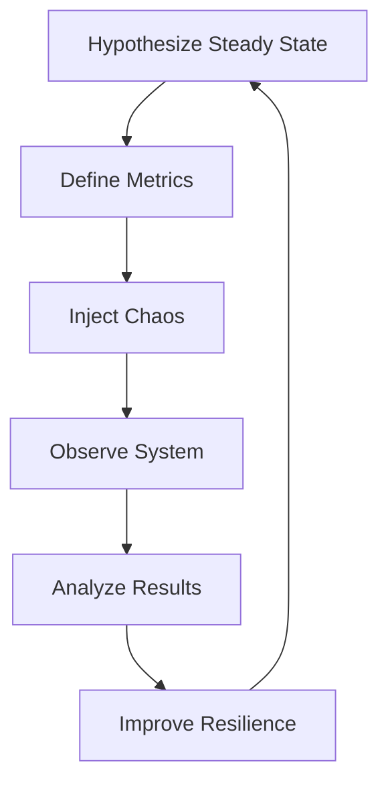

# Chaos Engineering with Kubernetes and Python

**Objective**: Master chaos engineering to build resilient distributed systems through controlled failure injection. When you need to verify system resilience, when you want to prevent production disasters, when you're building fault-tolerant applications—chaos engineering becomes your weapon of choice.

Chaos engineering is not "breaking things for fun"—it's controlled fault injection to verify resilience. This tutorial shows you how to wield chaos engineering with the precision of a seasoned reliability engineer, covering everything from basic pod kills to advanced network chaos and observability integration.

## 0) Prerequisites (Read Once, Live by Them)

### The Five Commandments

1. **Understand chaos principles**
   - Hypothesize steady state before injecting chaos
   - Vary real-world events systematically
   - Run experiments in production-like systems
   - Automate and repeat experiments
   - Minimize blast radius

2. **Master Kubernetes chaos tools**
   - Chaos Mesh operator for infrastructure chaos
   - Python chaos-toolkit for application chaos
   - Observability integration with Prometheus/Grafana
   - Safety controls and rollback procedures

3. **Know your system boundaries**
   - Identify critical failure points
   - Map failure propagation paths
   - Understand recovery mechanisms
   - Monitor system behavior during chaos

4. **Validate everything**
   - Test chaos experiments in staging first
   - Verify observability and alerting
   - Check rollback and recovery procedures
   - Document hypotheses and results

5. **Plan for production**
   - Start with small blast radius
   - Use feature flags for chaos experiments
   - Implement proper monitoring and alerting
   - Document and share learnings

**Why These Principles**: Chaos engineering requires understanding both system resilience and controlled failure injection. Understanding these patterns prevents production disasters and enables reliable distributed systems.

## 1) Prerequisites

### Required Tools

```bash
# Kubernetes cluster (choose one)
# Option 1: kind (local development)
kind create cluster --name chaos-lab
kubectl cluster-info

# Option 2: k3d (lightweight)
k3d cluster create chaos-lab --port "8080:80@loadbalancer"
kubectl cluster-info

# Option 3: RKE2 (production-like)
# See RKE2 documentation for setup

# Required tools
kubectl version --client
helm version
python --version  # 3.11+
```

**Why Prerequisites Matter**: Proper tooling enables safe chaos experimentation. Understanding these requirements prevents setup issues and enables effective chaos engineering.

### Observability Stack

```yaml
# monitoring-stack.yaml
apiVersion: v1
kind: Namespace
metadata:
  name: monitoring

---
apiVersion: apps/v1
kind: Deployment
metadata:
  name: prometheus
  namespace: monitoring
spec:
  replicas: 1
  selector:
    matchLabels:
      app: prometheus
  template:
    metadata:
      labels:
        app: prometheus
    spec:
      containers:
      - name: prometheus
        image: prom/prometheus:latest
        ports:
        - containerPort: 9090
        volumeMounts:
        - name: config
          mountPath: /etc/prometheus
      volumes:
      - name: config
        configMap:
          name: prometheus-config

---
apiVersion: apps/v1
kind: Deployment
metadata:
  name: grafana
  namespace: monitoring
spec:
  replicas: 1
  selector:
    matchLabels:
      app: grafana
  template:
    metadata:
      labels:
        app: grafana
    spec:
      containers:
      - name: grafana
        image: grafana/grafana:latest
        ports:
        - containerPort: 3000
        env:
        - name: GF_SECURITY_ADMIN_PASSWORD
          value: "admin"
```

**Why Observability Matters**: Chaos without observability is just breaking things. Proper monitoring enables learning from chaos experiments.

## 2) Core Principles of Chaos

### The Chaos Engineering Process



**Why Process Matters**: Structured chaos engineering prevents random destruction and enables systematic resilience improvement.

### Steady State Hypothesis

```python
# chaos-hypothesis.py
class SteadyStateHypothesis:
    def __init__(self):
        self.metrics = {
            "response_time_p95": "< 200ms",
            "error_rate": "< 0.1%",
            "availability": "> 99.9%",
            "throughput": "> 1000 req/s"
        }
    
    def validate_before_chaos(self):
        """Validate system is in steady state before chaos."""
        # Check metrics
        response_time = self.get_p95_response_time()
        error_rate = self.get_error_rate()
        availability = self.get_availability()
        
        assert response_time < 0.2, f"Response time too high: {response_time}"
        assert error_rate < 0.001, f"Error rate too high: {error_rate}"
        assert availability > 0.999, f"Availability too low: {availability}"
    
    def validate_during_chaos(self):
        """Validate system behavior during chaos."""
        # Monitor for cascading failures
        # Check if circuit breakers activate
        # Verify retry mechanisms work
        pass
    
    def validate_after_chaos(self):
        """Validate system recovers after chaos."""
        # Check if metrics return to steady state
        # Verify no permanent damage
        # Confirm system is healthy
        pass
```

**Why Hypothesis Matters**: Clear hypotheses enable meaningful chaos experiments and prevent random system destruction.

## 3) Cluster Setup

### Local Development Cluster

```bash
# Create kind cluster for chaos experiments
kind create cluster --name chaos-lab --config kind-config.yaml

# Verify cluster is ready
kubectl get nodes
kubectl get pods --all-namespaces
```

### Kind Configuration

```yaml
# kind-config.yaml
kind: Cluster
apiVersion: kind.x-k8s.io/v1alpha4
nodes:
- role: control-plane
  kubeadmConfigPatches:
  - |
    kind: InitConfiguration
    nodeRegistration:
      kubeletExtraArgs:
        node-labels: "ingress-ready=true"
  extraPortMappings:
  - containerPort: 80
    hostPort: 80
    protocol: TCP
  - containerPort: 443
    hostPort: 443
    protocol: TCP
- role: worker
- role: worker
```

**Why Cluster Setup Matters**: Proper cluster configuration enables realistic chaos experiments and prevents local development issues.

### Sample Application

```yaml
# sample-app.yaml
apiVersion: apps/v1
kind: Deployment
metadata:
  name: nginx
  labels:
    app: nginx
spec:
  replicas: 3
  selector:
    matchLabels:
      app: nginx
  template:
    metadata:
      labels:
        app: nginx
    spec:
      containers:
      - name: nginx
        image: nginx:latest
        ports:
        - containerPort: 80
        resources:
          requests:
            memory: "64Mi"
            cpu: "50m"
          limits:
            memory: "128Mi"
            cpu: "100m"

---
apiVersion: v1
kind: Service
metadata:
  name: nginx-service
spec:
  selector:
    app: nginx
  ports:
  - port: 80
    targetPort: 80
  type: ClusterIP
```

**Why Sample App Matters**: Realistic test application enables meaningful chaos experiments and demonstrates recovery patterns.

## 4) Installing Chaos Mesh

### Helm Installation

```bash
# Add Chaos Mesh repository
helm repo add chaos-mesh https://charts.chaos-mesh.org
helm repo update

# Install Chaos Mesh
helm install chaos-mesh chaos-mesh/chaos-mesh \
  --namespace chaos-testing \
  --create-namespace \
  --set chaosDaemon.runtime=containerd \
  --set chaosDaemon.socketPath=/run/containerd/containerd.sock

# Verify installation
kubectl get pods -n chaos-testing
kubectl get crds | grep chaos
```

**Why Chaos Mesh Matters**: Chaos Mesh is a battle-tested operator for injecting chaos experiments in Kubernetes.

### RBAC Configuration

```yaml
# chaos-rbac.yaml
apiVersion: v1
kind: ServiceAccount
metadata:
  name: chaos-experimenter
  namespace: chaos-testing

---
apiVersion: rbac.authorization.k8s.io/v1
kind: ClusterRole
metadata:
  name: chaos-experimenter
rules:
- apiGroups: [""]
  resources: ["pods"]
  verbs: ["get", "list", "watch", "delete"]
- apiGroups: ["apps"]
  resources: ["deployments", "replicasets"]
  verbs: ["get", "list", "watch"]
- apiGroups: ["chaos-mesh.org"]
  resources: ["*"]
  verbs: ["*"]

---
apiVersion: rbac.authorization.k8s.io/v1
kind: ClusterRoleBinding
metadata:
  name: chaos-experimenter
roleRef:
  apiGroup: rbac.authorization.k8s.io
  kind: ClusterRole
  name: chaos-experimenter
subjects:
- kind: ServiceAccount
  name: chaos-experimenter
  namespace: chaos-testing
```

**Why RBAC Matters**: Proper permissions enable safe chaos experiments while preventing unauthorized system access.

## 5) Simple Pod Kill Experiment

### Basic Pod Kill

```yaml
# pod-kill-experiment.yaml
apiVersion: chaos-mesh.org/v1alpha1
kind: PodChaos
metadata:
  name: kill-nginx
  namespace: chaos-testing
spec:
  action: pod-kill
  mode: one
  selector:
    namespaces: ["default"]
    labelSelectors:
      app: nginx
  duration: "30s"
  scheduler:
    cron: "0 2 * * *"  # Daily at 2 AM UTC
```

**Why Pod Kill Matters**: Start small—kill a pod, verify the Deployment/ReplicaSet recovers.

### Advanced Pod Chaos

```yaml
# advanced-pod-chaos.yaml
apiVersion: chaos-mesh.org/v1alpha1
kind: PodChaos
metadata:
  name: stress-nginx
  namespace: chaos-testing
spec:
  action: pod-failure
  mode: fixed-percent
  value: "50"  # Kill 50% of pods
  selector:
    namespaces: ["default"]
    labelSelectors:
      app: nginx
  duration: "2m"
  scheduler:
    cron: "0 */6 * * *"  # Every 6 hours
```

**Why Advanced Pod Chaos Matters**: Gradual pod failures test recovery mechanisms and prevent cascading failures.

### Monitoring Pod Recovery

```python
# monitor-recovery.py
import time
import requests
from kubernetes import client, config

def monitor_pod_recovery():
    """Monitor pod recovery after chaos injection."""
    config.load_kube_config()
    v1 = client.CoreV1Api()
    
    # Get initial pod count
    initial_pods = v1.list_namespaced_pod(
        namespace="default",
        label_selector="app=nginx"
    )
    initial_count = len(initial_pods.items)
    print(f"Initial pod count: {initial_count}")
    
    # Wait for chaos to complete
    time.sleep(30)
    
    # Check pod count during chaos
    chaos_pods = v1.list_namespaced_pod(
        namespace="default",
        label_selector="app=nginx"
    )
    chaos_count = len(chaos_pods.items)
    print(f"Pod count during chaos: {chaos_count}")
    
    # Wait for recovery
    time.sleep(60)
    
    # Check final pod count
    final_pods = v1.list_namespaced_pod(
        namespace="default",
        label_selector="app=nginx"
    )
    final_count = len(final_pods.items)
    print(f"Final pod count: {final_count}")
    
    # Verify recovery
    assert final_count == initial_count, "Pods did not recover"
    print("✅ Pod recovery successful")

if __name__ == "__main__":
    monitor_pod_recovery()
```

**Why Recovery Monitoring Matters**: Proper monitoring enables learning from chaos experiments and verifies system resilience.

## 6) Network Delay Experiment

### Network Latency Injection

```yaml
# network-delay-experiment.yaml
apiVersion: chaos-mesh.org/v1alpha1
kind: NetworkChaos
metadata:
  name: delay-mysql
  namespace: chaos-testing
spec:
  action: delay
  mode: all
  selector:
    namespaces: ["default"]
    labelSelectors:
      app: mysql
  delay:
    latency: "200ms"
    correlation: "100"
    jitter: "0ms"
  duration: "1m"
```

**Why Network Delay Matters**: Simulates real-world latency spikes; observe retry logic and connection pooling.

### Network Partition Chaos

```yaml
# network-partition-experiment.yaml
apiVersion: chaos-mesh.org/v1alpha1
kind: NetworkChaos
metadata:
  name: partition-frontend-backend
  namespace: chaos-testing
spec:
  action: partition
  mode: fixed-percent
  value: "50"
  selector:
    namespaces: ["default"]
    labelSelectors:
      app: frontend
  direction: to
  target:
    selector:
      namespaces: ["default"]
      labelSelectors:
        app: backend
  duration: "5m"
```

**Why Network Partition Matters**: Tests system behavior under network partitions and verifies circuit breaker patterns.

### Network Chaos Monitoring

```python
# network-chaos-monitor.py
import time
import requests
import statistics

def monitor_network_chaos():
    """Monitor system behavior during network chaos."""
    base_url = "http://nginx-service.default.svc.cluster.local"
    
    response_times = []
    error_count = 0
    total_requests = 100
    
    print("Starting network chaos monitoring...")
    
    for i in range(total_requests):
        start_time = time.time()
        try:
            response = requests.get(base_url, timeout=5)
            response_time = time.time() - start_time
            response_times.append(response_time)
            
            if response.status_code != 200:
                error_count += 1
                
        except requests.exceptions.RequestException as e:
            error_count += 1
            print(f"Request {i} failed: {e}")
        
        time.sleep(0.1)  # 10 requests per second
    
    # Analyze results
    avg_response_time = statistics.mean(response_times)
    p95_response_time = statistics.quantiles(response_times, n=20)[18]  # 95th percentile
    error_rate = error_count / total_requests
    
    print(f"Average response time: {avg_response_time:.3f}s")
    print(f"P95 response time: {p95_response_time:.3f}s")
    print(f"Error rate: {error_rate:.2%}")
    
    # Verify system resilience
    assert error_rate < 0.1, f"Error rate too high: {error_rate}"
    assert p95_response_time < 1.0, f"P95 response time too high: {p95_response_time}"

if __name__ == "__main__":
    monitor_network_chaos()
```

**Why Network Monitoring Matters**: Network chaos reveals system behavior under stress and enables optimization of retry and timeout mechanisms.

## 7) Python: Running Chaos with chaostoolkit

### Installation and Setup

```bash
# Install chaos toolkit
pip install chaostoolkit chaostoolkit-kubernetes chaostoolkit-prometheus

# Verify installation
chaos --version
```

**Why Chaos Toolkit Matters**: Python-based chaos engineering enables programmatic chaos experiments and integration with observability tools.

### Basic Chaos Experiment

```json
{
  "title": "Kill a pod and verify recovery",
  "description": "Test pod recovery after termination",
  "method": [
    {
      "type": "action",
      "name": "terminate-nginx",
      "provider": {
        "type": "python",
        "module": "chaosk8s.pod.actions",
        "func": "terminate_pods",
        "arguments": {
          "label_selector": "app=nginx",
          "name_pattern": "nginx.*",
          "ns": "default"
        }
      }
    }
  ],
  "steady-state-hypothesis": {
    "title": "Nginx stays available",
    "probes": [
      {
        "type": "probe",
        "name": "http-alive",
        "provider": {
          "type": "python",
          "module": "chaoslib.probes.http",
          "func": "probe_http",
          "arguments": {
            "url": "http://nginx-service.default.svc.cluster.local"
          }
        }
      }
    ]
  },
  "rollbacks": [
    {
      "type": "action",
      "name": "restart-nginx",
      "provider": {
        "type": "python",
        "module": "chaosk8s.pod.actions",
        "func": "restart_pods",
        "arguments": {
          "label_selector": "app=nginx",
          "ns": "default"
        }
      }
    }
  ]
}
```

**Why JSON Experiments Matter**: Structured chaos experiments enable repeatable testing and clear documentation of chaos scenarios.

### Advanced Chaos Experiment

```json
{
  "title": "Network chaos with recovery verification",
  "description": "Test system resilience under network stress",
  "method": [
    {
      "type": "action",
      "name": "inject-network-delay",
      "provider": {
        "type": "python",
        "module": "chaosk8s.network.actions",
        "func": "inject_network_delay",
        "arguments": {
          "label_selector": "app=nginx",
          "delay": "200ms",
          "duration": "60s",
          "ns": "default"
        }
      }
    }
  ],
  "steady-state-hypothesis": {
    "title": "System remains responsive",
    "probes": [
      {
        "type": "probe",
        "name": "response-time-check",
        "provider": {
          "type": "python",
          "module": "chaoslib.probes.http",
          "func": "probe_http",
          "arguments": {
            "url": "http://nginx-service.default.svc.cluster.local",
            "timeout": 5
          }
        }
      }
    ]
  },
  "rollbacks": [
    {
      "type": "action",
      "name": "restore-network",
      "provider": {
        "type": "python",
        "module": "chaosk8s.network.actions",
        "func": "remove_network_delay",
        "arguments": {
          "label_selector": "app=nginx",
          "ns": "default"
        }
      }
    }
  ]
}
```

**Why Advanced Experiments Matter**: Complex chaos scenarios test multiple failure modes and verify comprehensive system resilience.

### Running Chaos Experiments

```bash
# Run basic pod kill experiment
chaos run pod-kill-experiment.json

# Run with verbose output
chaos run pod-kill-experiment.json --verbose

# Run with custom configuration
chaos run pod-kill-experiment.json --config chaos-config.yaml
```

**Why Experiment Execution Matters**: Proper execution enables systematic chaos testing and learning from failure scenarios.

## 8) Observability: Watch Failures in Grafana

### Prometheus Integration

```yaml
# prometheus-chaos-config.yaml
apiVersion: v1
kind: ConfigMap
metadata:
  name: prometheus-config
  namespace: monitoring
data:
  prometheus.yml: |
    global:
      scrape_interval: 15s
    scrape_configs:
    - job_name: 'kubernetes-pods'
      kubernetes_sd_configs:
      - role: pod
      relabel_configs:
      - source_labels: [__meta_kubernetes_pod_annotation_prometheus_io_scrape]
        action: keep
        regex: true
    - job_name: 'chaos-experiments'
      kubernetes_sd_configs:
      - role: pod
        namespaces:
          names:
          - chaos-testing
      relabel_configs:
      - source_labels: [__meta_kubernetes_pod_label_app]
        action: keep
        regex: chaos-mesh
```

**Why Prometheus Integration Matters**: Chaos experiments without observability are just breaking things. Proper monitoring enables learning from chaos.

### Grafana Dashboard

```json
{
  "dashboard": {
    "title": "Chaos Engineering Dashboard",
    "panels": [
      {
        "title": "Pod Count During Chaos",
        "type": "graph",
        "targets": [
          {
            "expr": "kube_deployment_status_replicas{deployment=\"nginx\"}",
            "legendFormat": "Nginx Replicas"
          }
        ]
      },
      {
        "title": "Response Time P95",
        "type": "graph",
        "targets": [
          {
            "expr": "histogram_quantile(0.95, rate(http_request_duration_seconds_bucket[5m]))",
            "legendFormat": "P95 Response Time"
          }
        ]
      },
      {
        "title": "Error Rate",
        "type": "graph",
        "targets": [
          {
            "expr": "rate(http_requests_total{status=~\"5..\"}[5m]) / rate(http_requests_total[5m])",
            "legendFormat": "Error Rate"
          }
        ]
      }
    ]
  }
}
```

**Why Grafana Dashboards Matter**: Visual monitoring enables real-time observation of chaos experiments and system behavior.

### Chaos Event Annotations

```python
# chaos-annotations.py
import time
from kubernetes import client, config

def annotate_chaos_event(event_type, description):
    """Add annotations to Prometheus for chaos events."""
    config.load_kube_config()
    v1 = client.CoreV1Api()
    
    # Create event annotation
    event = client.V1Event(
        metadata=client.V1ObjectMeta(
            name=f"chaos-{event_type}-{int(time.time())}",
            namespace="chaos-testing"
        ),
        involved_object=client.V1ObjectReference(
            kind="Pod",
            name="chaos-mesh-controller",
            namespace="chaos-testing"
        ),
        reason=event_type,
        message=description,
        first_timestamp=time.time(),
        last_timestamp=time.time()
    )
    
    v1.create_namespaced_event(
        namespace="chaos-testing",
        body=event
    )
    print(f"Chaos event annotated: {event_type} - {description}")

# Usage
annotate_chaos_event("pod-kill", "Nginx pod terminated for chaos experiment")
annotate_chaos_event("network-delay", "200ms network delay injected")
annotate_chaos_event("recovery", "System recovered from chaos experiment")
```

**Why Event Annotations Matter**: Chaos event annotations enable correlation between chaos experiments and system metrics.

## 9) Advanced Patterns

### Node Drain Chaos

```yaml
# node-drain-experiment.yaml
apiVersion: chaos-mesh.org/v1alpha1
kind: PodChaos
metadata:
  name: drain-worker-node
  namespace: chaos-testing
spec:
  action: pod-failure
  mode: all
  selector:
    namespaces: ["default"]
    labelSelectors:
      app: nginx
  duration: "5m"
  scheduler:
    cron: "0 2 * * 1"  # Weekly on Monday at 2 AM
```

**Why Node Drain Matters**: Simulates node failures and tests pod rescheduling and workload distribution.

### Disk I/O Chaos

```yaml
# disk-io-chaos.yaml
apiVersion: chaos-mesh.org/v1alpha1
kind: IOChaos
metadata:
  name: disk-stress
  namespace: chaos-testing
spec:
  action: io-stress
  mode: one
  selector:
    namespaces: ["default"]
    labelSelectors:
      app: database
  ioStressors:
    workers: 1
    load: 1
    size: "1GB"
  duration: "10m"
```

**Why Disk I/O Chaos Matters**: Tests system behavior under disk stress and verifies storage resilience patterns.

### Multi-Region Failover

```yaml
# multi-region-failover.yaml
apiVersion: chaos-mesh.org/v1alpha1
kind: NetworkChaos
metadata:
  name: region-partition
  namespace: chaos-testing
spec:
  action: partition
  mode: all
  selector:
    namespaces: ["default"]
    labelSelectors:
      region: "us-west"
  direction: to
  target:
    selector:
      namespaces: ["default"]
      labelSelectors:
        region: "us-east"
  duration: "15m"
```

**Why Multi-Region Chaos Matters**: Tests cross-region failover and verifies global system resilience.

## 10) Mermaid Diagram: Failure Propagation

```mermaid
flowchart LR
    A[User Request] --> B[Ingress Controller]
    B --> C[Service]
    C --> D[(Database)]
    style D fill=#f99,stroke=#600,stroke-width=2px
    B -.Chaos Mesh kills pod.-> C
    D -.Injected latency.-> D
```

**Why Failure Propagation Matters**: Understanding failure paths enables targeted chaos experiments and systematic resilience improvement.

### Failure Cascade Analysis

```python
# failure-cascade-analysis.py
import networkx as nx
import matplotlib.pyplot as plt

def analyze_failure_cascade():
    """Analyze potential failure cascades in the system."""
    G = nx.DiGraph()
    
    # Add nodes (services)
    G.add_node("user", type="external")
    G.add_node("ingress", type="load_balancer")
    G.add_node("frontend", type="service")
    G.add_node("backend", type="service")
    G.add_node("database", type="data_store")
    G.add_node("cache", type="data_store")
    
    # Add edges (dependencies)
    G.add_edge("user", "ingress")
    G.add_edge("ingress", "frontend")
    G.add_edge("frontend", "backend")
    G.add_edge("backend", "database")
    G.add_edge("backend", "cache")
    
    # Analyze failure propagation
    print("Critical paths:")
    for path in nx.all_simple_paths(G, "user", "database"):
        print(f"  {' -> '.join(path)}")
    
    # Identify critical nodes
    centrality = nx.betweenness_centrality(G)
    critical_nodes = sorted(centrality.items(), key=lambda x: x[1], reverse=True)
    
    print("\nCritical nodes (by betweenness centrality):")
    for node, centrality in critical_nodes:
        print(f"  {node}: {centrality:.3f}")
    
    return G

if __name__ == "__main__":
    G = analyze_failure_cascade()
```

**Why Cascade Analysis Matters**: Understanding failure cascades enables targeted chaos experiments and prevents system-wide failures.

## 11) Best Practices

### Chaos Engineering Best Practices

```python
# chaos-best-practices.py
class ChaosBestPractices:
    def __init__(self):
        self.blast_radius = "small"
        self.duration = "short"
        self.frequency = "controlled"
    
    def start_small(self):
        """Start with small blast radius."""
        return {
            "scope": "single_pod",
            "duration": "30s",
            "frequency": "daily"
        }
    
    def measure_steady_state(self):
        """Always measure steady state before chaos."""
        return {
            "metrics": ["response_time", "error_rate", "throughput"],
            "baseline": "24_hours",
            "thresholds": {
                "response_time_p95": "< 200ms",
                "error_rate": "< 0.1%",
                "throughput": "> 1000 req/s"
            }
        }
    
    def run_in_staging_first(self):
        """Test in staging before production."""
        return {
            "staging": "full_chaos_experiments",
            "production": "controlled_experiments",
            "rollback": "automatic"
        }
    
    def document_hypotheses(self):
        """Document hypotheses and results."""
        return {
            "hypothesis": "System will recover within 30s",
            "metrics": "Pod count, response time, error rate",
            "results": "Actual recovery time and behavior",
            "learnings": "What we discovered about system resilience"
        }
    
    def automate_chaos(self):
        """Automate chaos experiments in CI/CD."""
        return {
            "trigger": "scheduled_or_manual",
            "scope": "non_critical_services",
            "monitoring": "real_time_alerts",
            "rollback": "automatic_on_failure"
        }
```

**Why Best Practices Matter**: Proper chaos engineering practices prevent system destruction and enable systematic resilience improvement.

### Safety Controls

```yaml
# chaos-safety-controls.yaml
apiVersion: v1
kind: ConfigMap
metadata:
  name: chaos-safety-config
  namespace: chaos-testing
data:
  safety-rules.yaml: |
    rules:
      - name: "max-pod-kill-percentage"
        value: 50
        description: "Never kill more than 50% of pods"
      - name: "max-chaos-duration"
        value: "10m"
        description: "Maximum chaos experiment duration"
      - name: "critical-services-protection"
        services: ["database", "auth", "payment"]
        description: "Never inject chaos into critical services"
      - name: "business-hours-restriction"
        schedule: "0 2 * * *"  # Only at 2 AM UTC
        description: "Only run chaos during low-traffic hours"
```

**Why Safety Controls Matter**: Proper safety controls prevent chaos experiments from causing production disasters.

## 12) TL;DR Runbook

### Essential Commands

```bash
# Setup chaos engineering lab
kind create cluster --name chaos-lab
helm install chaos-mesh chaos-mesh/chaos-mesh -n chaos-testing --create-namespace

# Run basic pod kill experiment
kubectl apply -f pod-kill-experiment.yaml

# Monitor with chaos toolkit
chaos run pod-kill-experiment.json

# Monitor system recovery
kubectl get pods -l app=nginx -w
```

### Essential Patterns

```yaml
# Essential chaos patterns
chaos_patterns:
  pod_kill: "Start with single pod termination"
  network_delay: "Inject latency to test retry logic"
  node_drain: "Simulate node failures"
  disk_stress: "Test storage resilience"
  network_partition: "Test cross-service communication"
```

### Quick Reference

```bash
# Chaos engineering workflow
1. hypothesize_steady_state()    # Define expected behavior
2. inject_chaos()                # Controlled failure injection
3. observe_system()             # Monitor system behavior
4. analyze_results()             # Learn from chaos
5. improve_resilience()          # Build better systems
```

**Why This Runbook**: These patterns cover 90% of chaos engineering needs. Master these before exploring advanced scenarios.

## 13) The Machine's Summary

Chaos engineering requires understanding both system resilience and controlled failure injection. When used correctly, chaos engineering prevents production disasters, enables systematic resilience improvement, and builds confidence in distributed systems. The key is understanding failure patterns, mastering controlled chaos injection, and following safety best practices.

**The Dark Truth**: Without proper chaos engineering, your system is fragile and unreliable. Chaos engineering is your weapon. Use it wisely.

**The Machine's Mantra**: "In chaos we trust, in resilience we build, and in the failure we find the path to system reliability."

**Why This Matters**: Chaos engineering enables efficient resilience testing that can handle complex failure scenarios, prevent production disasters, and provide reliable distributed systems while ensuring safety and learning.

---

*This tutorial provides the complete machinery for chaos engineering. The patterns scale from simple pod kills to complex distributed system chaos, from basic resilience testing to advanced failure scenario analysis.*
