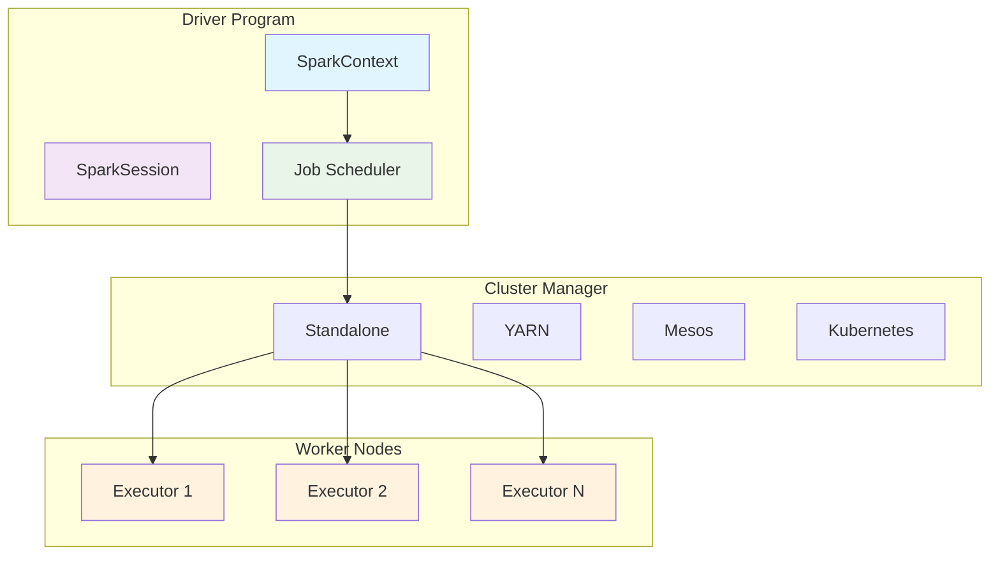

# Apache Spark Mastery: Complete Guide to Distributed Data Processing

**Objective**: Master Apache Spark for distributed data processing, analytics, and machine learning. When you need to process massive datasets, when you're building real-time analytics pipelines, when you need to scale data processing across clusters—Apache Spark becomes your weapon of choice.

Apache Spark is the foundation of modern big data processing. Without proper Spark understanding, you're building on shaky ground with inefficient processing, memory issues, and poor performance. This guide shows you how to wield Spark with the precision of a distributed systems engineer.

## 0) Prerequisites (Read Once, Live by Them)

### The Five Commandments

1. **Understand the architecture**
   - Distributed computing model
   - Lazy evaluation and DAG optimization
   - Memory management and persistence

2. **Master the APIs**
   - RDD (Resilient Distributed Datasets)
   - DataFrame and Dataset APIs
   - Structured Streaming

3. **Know your patterns**
   - Transformations and actions
   - Caching and persistence strategies
   - Partitioning and optimization

4. **Validate everything**
   - Performance under load
   - Memory usage and garbage collection
   - Data quality and correctness

5. **Plan for production**
   - Cluster configuration and tuning
   - Monitoring and debugging
   - Security and governance

**Why These Principles**: Apache Spark mastery is the foundation of distributed data processing. Understanding the architecture, mastering the APIs, and following best practices is essential for building scalable, efficient data processing systems.

## 1) What is Apache Spark? (The Foundation)

### Core Concepts

```python
# Spark is a unified analytics engine for large-scale data processing
# It provides high-level APIs in Java, Scala, Python, and R

# Key characteristics:
# - In-memory computing (faster than MapReduce)
# - Lazy evaluation (optimization through DAG)
# - Fault tolerance (lineage-based recovery)
# - Unified platform (SQL, streaming, ML, GraphX)
```

### Spark Architecture



### Spark Components

```yaml
# Spark Components
spark_components:
  core:
    - "Spark Core (RDD, scheduling, memory management)"
    - "Spark SQL (DataFrames, SQL queries)"
    - "Spark Streaming (real-time processing)"
    - "MLlib (machine learning)"
    - "GraphX (graph processing)"
  
  execution_model:
    - "Driver Program (main application)"
    - "Cluster Manager (resource allocation)"
    - "Worker Nodes (task execution)"
    - "Executors (JVM processes)"
  
  data_abstraction:
    - "RDD (Resilient Distributed Dataset)"
    - "DataFrame (structured data)"
    - "Dataset (type-safe DataFrame)"
```

**Why Spark Matters**: Apache Spark provides a unified platform for big data processing, combining batch processing, streaming, machine learning, and graph processing in a single framework. It's essential for modern data engineering and analytics.

## 2) Setting Up Spark (The Environment)

### Local Development Setup

```python
# Install PySpark
pip install pyspark

# Or with specific version
pip install pyspark==3.5.0

# Basic Spark session
from pyspark.sql import SparkSession

# Create Spark session
spark = SparkSession.builder \
    .appName("MyApp") \
    .config("spark.sql.adaptive.enabled", "true") \
    .config("spark.sql.adaptive.coalescePartitions.enabled", "true") \
    .getOrCreate()

# Get Spark context
sc = spark.sparkContext

# Stop session
spark.stop()
```

### Production Cluster Setup

```yaml
# spark-defaults.conf
spark.master                     yarn
spark.submit.deployMode          cluster
spark.executor.memory            4g
spark.executor.cores             4
spark.executor.instances          10
spark.driver.memory              2g
spark.driver.maxResultSize       2g
spark.sql.adaptive.enabled       true
spark.sql.adaptive.coalescePartitions.enabled true
spark.serializer                 org.apache.spark.serializer.KryoSerializer
spark.sql.adaptive.skewJoin.enabled true
```

### Docker Compose for Development

```yaml
# docker-compose-spark.yml
version: "3.9"

services:
  spark-master:
    image: bitnami/spark:3.5.0
    environment:
      - SPARK_MODE=master
      - SPARK_RPC_AUTHENTICATION_ENABLED=no
      - SPARK_RPC_ENCRYPTION_ENABLED=no
      - SPARK_LOCAL_STORAGE_ENCRYPTION_ENABLED=no
      - SPARK_SSL_ENABLED=no
    ports:
      - "8080:8080"
      - "7077:7077"
    volumes:
      - spark_data:/opt/bitnami/spark/data

  spark-worker-1:
    image: bitnami/spark:3.5.0
    environment:
      - SPARK_MODE=worker
      - SPARK_MASTER_URL=spark://spark-master:7077
      - SPARK_WORKER_MEMORY=2G
      - SPARK_WORKER_CORES=2
    depends_on:
      - spark-master
    volumes:
      - spark_data:/opt/bitnami/spark/data

  spark-worker-2:
    image: bitnami/spark:3.5.0
    environment:
      - SPARK_MODE=worker
      - SPARK_MASTER_URL=spark://spark-master:7077
      - SPARK_WORKER_MEMORY=2G
      - SPARK_WORKER_CORES=2
    depends_on:
      - spark-master
    volumes:
      - spark_data:/opt/bitnami/spark/data

  jupyter:
    image: jupyter/pyspark-notebook:latest
    ports:
      - "8888:8888"
    environment:
      - JUPYTER_ENABLE_LAB=yes
    volumes:
      - ./notebooks:/home/jovyan/work
    depends_on:
      - spark-master

volumes:
  spark_data:
```

**Why This Setup**: Proper Spark setup is essential for development and production. Local development enables rapid prototyping, while production clusters provide scalability and reliability.

## 3) Spark APIs (The Tools)

### RDD (Resilient Distributed Dataset)

```python
# RDD - Low-level API
from pyspark import SparkContext

# Create RDD from collection
data = [1, 2, 3, 4, 5]
rdd = sc.parallelize(data)

# Transformations (lazy)
squared_rdd = rdd.map(lambda x: x * x)
filtered_rdd = rdd.filter(lambda x: x > 2)

# Actions (eager)
result = rdd.collect()
count = rdd.count()
sum_result = rdd.sum()

# RDD operations
def process_data(partition):
    """Process each partition"""
    return [x * 2 for x in partition]

processed_rdd = rdd.mapPartitions(process_data)

# Key-value operations
kv_rdd = rdd.map(lambda x: (x, x * x))
grouped = kv_rdd.groupByKey()
reduced = kv_rdd.reduceByKey(lambda a, b: a + b)
```

### DataFrame API

```python
# DataFrame - High-level API
from pyspark.sql import SparkSession
from pyspark.sql.functions import col, when, sum, avg, count
from pyspark.sql.types import StructType, StructField, StringType, IntegerType

# Create DataFrame from data
data = [
    ("Alice", 25, "Engineer"),
    ("Bob", 30, "Manager"),
    ("Charlie", 35, "Engineer")
]

df = spark.createDataFrame(data, ["name", "age", "job"])

# DataFrame operations
df.select("name", "age").show()
df.filter(col("age") > 25).show()
df.groupBy("job").agg(count("*"), avg("age")).show()

# SQL operations
df.createOrReplaceTempView("people")
result = spark.sql("SELECT job, AVG(age) FROM people GROUP BY job")
result.show()
```

### Dataset API (Scala/Java)

```scala
// Dataset - Type-safe API (Scala)
case class Person(name: String, age: Int, job: String)

val people = Seq(
  Person("Alice", 25, "Engineer"),
  Person("Bob", 30, "Manager"),
  Person("Charlie", 35, "Engineer")
).toDS()

// Type-safe operations
val engineers = people.filter(_.job == "Engineer")
val avgAge = engineers.agg(avg("age"))
```

**Why These APIs**: Different Spark APIs serve different purposes. RDD provides low-level control, DataFrame offers high-level operations, and Dataset provides type safety. Understanding when to use each is essential for effective Spark development.

## 4) Data Processing Patterns (The Workflows)

### Batch Processing

```python
# Batch processing pattern
def batch_processing_example():
    """Process large dataset in batches"""
    
    # Read data
    df = spark.read.parquet("s3://data-lake/raw/events/")
    
    # Transform data
    processed_df = df \
        .filter(col("event_type") == "purchase") \
        .withColumn("processed_at", current_timestamp()) \
        .withColumn("revenue", col("price") * col("quantity")) \
        .select("user_id", "product_id", "revenue", "processed_at")
    
    # Write results
    processed_df.write \
        .mode("overwrite") \
        .parquet("s3://data-lake/processed/purchases/")
    
    return processed_df
```

### Streaming Processing

```python
# Structured Streaming
def streaming_processing_example():
    """Process streaming data"""
    
    # Read streaming data
    streaming_df = spark \
        .readStream \
        .format("kafka") \
        .option("kafka.bootstrap.servers", "localhost:9092") \
        .option("subscribe", "events") \
        .load()
    
    # Process streaming data
    processed_stream = streaming_df \
        .select(from_json(col("value").cast("string"), schema).alias("data")) \
        .select("data.*") \
        .filter(col("event_type") == "purchase") \
        .withWatermark("timestamp", "1 hour") \
        .groupBy(window(col("timestamp"), "1 hour"), col("product_id")) \
        .agg(sum("price").alias("total_revenue"))
    
    # Write to sink
    query = processed_stream \
        .writeStream \
        .outputMode("update") \
        .format("console") \
        .start()
    
    return query
```

### Machine Learning Pipeline

```python
# MLlib pipeline
from pyspark.ml import Pipeline
from pyspark.ml.feature import VectorAssembler, StringIndexer
from pyspark.ml.classification import RandomForestClassifier
from pyspark.ml.evaluation import MulticlassClassificationEvaluator

def ml_pipeline_example():
    """Machine learning pipeline"""
    
    # Load data
    df = spark.read.parquet("s3://data-lake/processed/features/")
    
    # Feature engineering
    string_indexer = StringIndexer(inputCol="category", outputCol="categoryIndex")
    vector_assembler = VectorAssembler(
        inputCols=["feature1", "feature2", "categoryIndex"],
        outputCol="features"
    )
    
    # Model training
    rf = RandomForestClassifier(
        featuresCol="features",
        labelCol="label",
        numTrees=100
    )
    
    # Pipeline
    pipeline = Pipeline(stages=[string_indexer, vector_assembler, rf])
    model = pipeline.fit(df)
    
    # Predictions
    predictions = model.transform(df)
    
    # Evaluation
    evaluator = MulticlassClassificationEvaluator(
        labelCol="label",
        predictionCol="prediction",
        metricName="accuracy"
    )
    accuracy = evaluator.evaluate(predictions)
    
    return model, predictions, accuracy
```

**Why These Patterns**: Data processing patterns provide proven approaches for common Spark use cases. Batch processing handles large datasets, streaming processes real-time data, and ML pipelines enable machine learning workflows.

## 5) Performance Optimization (The Speed)

### Caching and Persistence

```python
# Caching strategies
def caching_example():
    """Demonstrate caching strategies"""
    
    # Read data
    df = spark.read.parquet("s3://data-lake/large-dataset/")
    
    # Cache in memory
    df.cache()
    
    # Persist with storage level
    df.persist(StorageLevel.MEMORY_AND_DISK_SER)
    
    # Multiple operations on cached data
    result1 = df.filter(col("category") == "A").count()
    result2 = df.filter(col("category") == "B").count()
    
    # Unpersist when done
    df.unpersist()
    
    return result1, result2
```

### Partitioning Optimization

```python
# Partitioning strategies
def partitioning_example():
    """Optimize partitioning"""
    
    # Read data
    df = spark.read.parquet("s3://data-lake/data/")
    
    # Repartition for better parallelism
    df_repartitioned = df.repartition(200, col("user_id"))
    
    # Coalesce to reduce partitions
    df_coalesced = df.coalesce(50)
    
    # Partition by column for better performance
    df.write \
        .partitionBy("date", "category") \
        .parquet("s3://data-lake/partitioned/")
    
    return df_repartitioned
```

### Memory Management

```python
# Memory optimization
def memory_optimization_example():
    """Optimize memory usage"""
    
    # Configure Spark session for memory optimization
    spark = SparkSession.builder \
        .appName("MemoryOptimized") \
        .config("spark.sql.adaptive.enabled", "true") \
        .config("spark.sql.adaptive.coalescePartitions.enabled", "true") \
        .config("spark.sql.adaptive.skewJoin.enabled", "true") \
        .config("spark.serializer", "org.apache.spark.serializer.KryoSerializer") \
        .getOrCreate()
    
    # Use broadcast joins for small tables
    small_df = spark.read.parquet("s3://data-lake/small-table/")
    large_df = spark.read.parquet("s3://data-lake/large-table/")
    
    # Broadcast small table
    small_df_broadcast = broadcast(small_df)
    
    # Join with broadcast
    result = large_df.join(small_df_broadcast, "key")
    
    return result
```

### SQL Optimization

```python
# SQL optimization techniques
def sql_optimization_example():
    """Optimize SQL queries"""
    
    # Enable adaptive query execution
    spark.conf.set("spark.sql.adaptive.enabled", "true")
    spark.conf.set("spark.sql.adaptive.coalescePartitions.enabled", "true")
    
    # Use broadcast hints
    spark.sql("""
        SELECT /*+ BROADCAST(small_table) */
            large_table.id,
            large_table.value,
            small_table.category
        FROM large_table
        JOIN small_table ON large_table.id = small_table.id
    """)
    
    # Use column pruning
    df.select("id", "value").filter(col("category") == "A")
    
    # Use predicate pushdown
    df.filter(col("date") >= "2024-01-01").select("id", "value")
```

**Why This Optimization**: Performance optimization is essential for production Spark applications. Caching, partitioning, memory management, and SQL optimization provide the foundation for efficient data processing.

## 6) Advanced Patterns (The Mastery)

### Delta Lake Integration

```python
# Delta Lake for ACID transactions
def delta_lake_example():
    """Delta Lake integration"""
    
    # Read Delta table
    df = spark.read.format("delta").load("s3://data-lake/delta-table/")
    
    # Upsert data
    df.write \
        .format("delta") \
        .mode("append") \
        .option("mergeSchema", "true") \
        .save("s3://data-lake/delta-table/")
    
    # Time travel
    historical_df = spark.read \
        .format("delta") \
        .option("timestampAsOf", "2024-01-01") \
        .load("s3://data-lake/delta-table/")
    
    return historical_df
```

### Graph Processing with GraphX

```python
# GraphX for graph processing
def graphx_example():
    """Graph processing with GraphX"""
    
    # Create graph
    vertices = sc.parallelize([
        (1, "Alice"),
        (2, "Bob"),
        (3, "Charlie")
    ])
    
    edges = sc.parallelize([
        (1, 2, "friend"),
        (2, 3, "colleague"),
        (1, 3, "friend")
    ])
    
    # Build graph
    graph = Graph(vertices, edges)
    
    # Graph algorithms
    page_rank = graph.pageRank(0.001)
    connected_components = graph.connectedComponents()
    
    return page_rank, connected_components
```

### Custom UDFs and UDAFs

```python
# User-defined functions
from pyspark.sql.functions import udf
from pyspark.sql.types import StringType, DoubleType
from pyspark.sql import functions as F

def custom_udf_example():
    """Custom UDF example"""
    
    # Define UDF
    def categorize_age(age):
        if age < 25:
            return "young"
        elif age < 50:
            return "middle"
        else:
            return "senior"
    
    # Register UDF
    categorize_udf = udf(categorize_age, StringType())
    
    # Use UDF
    df = spark.createDataFrame([(25,), (35,), (55,)], ["age"])
    result = df.withColumn("category", categorize_udf(col("age")))
    
    return result

# User-defined aggregate function
from pyspark.sql.expressions import UserDefinedAggregateFunction
from pyspark.sql.types import StructType, StructField, DoubleType

class GeometricMean(UDAF):
    def __init__(self):
        self.inputType = DoubleType()
        self.bufferSchema = StructType([
            StructField("product", DoubleType(), True),
            StructField("count", DoubleType(), True)
        ])
        self.dataType = DoubleType()
    
    def initialize(self, buffer):
        buffer[0] = 1.0
        buffer[1] = 0.0
    
    def update(self, buffer, input):
        buffer[0] *= input
        buffer[1] += 1.0
    
    def merge(self, buffer1, buffer2):
        buffer1[0] *= buffer2[0]
        buffer1[1] += buffer2[1]
    
    def evaluate(self, buffer):
        return buffer[0] ** (1.0 / buffer[1])
```

**Why These Patterns**: Advanced patterns enable sophisticated data processing workflows. Delta Lake provides ACID transactions, GraphX enables graph processing, and custom functions extend Spark's capabilities.

## 7) Monitoring and Debugging (The Operations)

### Spark UI Monitoring

```python
# Monitoring Spark applications
def monitoring_example():
    """Monitor Spark application"""
    
    # Access Spark UI
    # Web UI: http://localhost:4040
    
    # Get application ID
    app_id = spark.sparkContext.applicationId
    
    # Get job information
    status_tracker = spark.sparkContext.statusTracker()
    job_ids = status_tracker.getJobIdsForGroup("my_job_group")
    
    # Monitor stages
    for job_id in job_ids:
        job_info = status_tracker.getJobInfo(job_id)
        for stage_id in job_info.stageIds:
            stage_info = status_tracker.getStageInfo(stage_id)
            print(f"Stage {stage_id}: {stage_info.numTasks} tasks")
    
    return app_id
```

### Performance Tuning

```python
# Performance tuning
def performance_tuning_example():
    """Tune Spark performance"""
    
    # Configure Spark session
    spark = SparkSession.builder \
        .appName("PerformanceTuned") \
        .config("spark.sql.adaptive.enabled", "true") \
        .config("spark.sql.adaptive.coalescePartitions.enabled", "true") \
        .config("spark.sql.adaptive.skewJoin.enabled", "true") \
        .config("spark.sql.adaptive.localShuffleReader.enabled", "true") \
        .config("spark.serializer", "org.apache.spark.serializer.KryoSerializer") \
        .config("spark.sql.adaptive.advisoryPartitionSizeInBytes", "128MB") \
        .getOrCreate()
    
    # Monitor memory usage
    sc = spark.sparkContext
    print(f"Executor memory: {sc.getConf().get('spark.executor.memory')}")
    print(f"Driver memory: {sc.getConf().get('spark.driver.memory')}")
    
    return spark
```

### Error Handling

```python
# Error handling and recovery
def error_handling_example():
    """Handle errors gracefully"""
    
    try:
        # Risky operation
        df = spark.read.parquet("s3://data-lake/data/")
        result = df.filter(col("invalid_column") > 0)
        return result
    except Exception as e:
        print(f"Error occurred: {e}")
        # Log error
        spark.sparkContext.setLogLevel("ERROR")
        # Return empty DataFrame
        return spark.createDataFrame([], StructType([]))
```

**Why This Monitoring**: Monitoring and debugging are essential for production Spark applications. Performance tuning, error handling, and monitoring provide the foundation for reliable data processing.

## 8) Best Practices (The Wisdom)

### Code Organization

```python
# Best practices for Spark code
class SparkDataProcessor:
    """Organized Spark data processor"""
    
    def __init__(self, spark_session):
        self.spark = spark_session
        self.sc = spark_session.sparkContext
    
    def process_data(self, input_path, output_path):
        """Process data with best practices"""
        
        # Read data
        df = self.spark.read.parquet(input_path)
        
        # Validate data
        if df.count() == 0:
            raise ValueError("Input data is empty")
        
        # Process data
        processed_df = self._transform_data(df)
        
        # Write data
        processed_df.write \
            .mode("overwrite") \
            .parquet(output_path)
        
        return processed_df
    
    def _transform_data(self, df):
        """Private method for data transformation"""
        return df.filter(col("status") == "active")
```

### Testing Strategies

```python
# Testing Spark applications
import unittest
from pyspark.sql import SparkSession

class SparkTestCase(unittest.TestCase):
    """Base class for Spark tests"""
    
    @classmethod
    def setUpClass(cls):
        cls.spark = SparkSession.builder \
            .appName("TestApp") \
            .master("local[2]") \
            .getOrCreate()
    
    @classmethod
    def tearDownClass(cls):
        cls.spark.stop()
    
    def test_data_processing(self):
        """Test data processing logic"""
        
        # Create test data
        test_data = [("Alice", 25), ("Bob", 30)]
        df = self.spark.createDataFrame(test_data, ["name", "age"])
        
        # Test transformation
        result = df.filter(col("age") > 25)
        self.assertEqual(result.count(), 1)
        
        # Test aggregation
        avg_age = df.agg(avg("age")).collect()[0][0]
        self.assertEqual(avg_age, 27.5)
```

### Production Deployment

```python
# Production deployment patterns
def production_deployment_example():
    """Production deployment example"""
    
    # Submit Spark application
    # spark-submit --class MyApp --master yarn --deploy-mode cluster myapp.jar
    
    # Configuration for production
    spark = SparkSession.builder \
        .appName("ProductionApp") \
        .config("spark.sql.adaptive.enabled", "true") \
        .config("spark.sql.adaptive.coalescePartitions.enabled", "true") \
        .config("spark.serializer", "org.apache.spark.serializer.KryoSerializer") \
        .config("spark.sql.adaptive.skewJoin.enabled", "true") \
        .getOrCreate()
    
    # Set up logging
    spark.sparkContext.setLogLevel("INFO")
    
    # Process data
    df = spark.read.parquet("s3://data-lake/production-data/")
    result = df.filter(col("status") == "active")
    
    # Write results
    result.write \
        .mode("overwrite") \
        .parquet("s3://data-lake/processed-data/")
    
    return result
```

**Why These Practices**: Best practices ensure reliable, maintainable, and efficient Spark applications. Code organization, testing, and production deployment provide the foundation for successful Spark projects.

## 9) Common Pitfalls (The Traps)

### Memory Issues

```python
# ❌ WRONG: Collecting large datasets
def bad_memory_pattern():
    """Don't collect large datasets"""
    df = spark.read.parquet("s3://data-lake/large-dataset/")
    result = df.collect()  # This will cause OOM
    return result

# ✅ CORRECT: Use actions that don't collect to driver
def good_memory_pattern():
    """Use appropriate actions"""
    df = spark.read.parquet("s3://data-lake/large-dataset/")
    count = df.count()  # This is safe
    sample = df.sample(0.1)  # This is safe
    return count, sample
```

### Inefficient Joins

```python
# ❌ WRONG: Large table joins without optimization
def bad_join_pattern():
    """Don't join large tables without optimization"""
    large_df1 = spark.read.parquet("s3://data-lake/large-table1/")
    large_df2 = spark.read.parquet("s3://data-lake/large-table2/")
    result = large_df1.join(large_df2, "key")  # This will be slow
    return result

# ✅ CORRECT: Use broadcast joins for small tables
def good_join_pattern():
    """Use broadcast joins for small tables"""
    large_df = spark.read.parquet("s3://data-lake/large-table/")
    small_df = spark.read.parquet("s3://data-lake/small-table/")
    
    # Broadcast small table
    small_df_broadcast = broadcast(small_df)
    result = large_df.join(small_df_broadcast, "key")
    return result
```

### Schema Evolution Issues

```python
# ❌ WRONG: Ignoring schema evolution
def bad_schema_pattern():
    """Don't ignore schema evolution"""
    df = spark.read.parquet("s3://data-lake/data/")
    # This will fail if schema changes
    result = df.select("old_column")
    return result

# ✅ CORRECT: Handle schema evolution
def good_schema_pattern():
    """Handle schema evolution gracefully"""
    df = spark.read.parquet("s3://data-lake/data/")
    
    # Check if column exists
    if "new_column" in df.columns:
        result = df.select("new_column")
    else:
        result = df.select("old_column")
    
    return result
```

**Why These Pitfalls Matter**: Common pitfalls lead to performance issues, memory problems, and application failures. Understanding these pitfalls prevents costly mistakes and ensures reliable Spark applications.

## 10) TL;DR Quickstart (The Essentials)

### Essential Commands

```bash
# Start Spark cluster
docker-compose -f docker-compose-spark.yml up -d

# Submit Spark application
spark-submit --class MyApp --master spark://localhost:7077 myapp.py

# Access Spark UI
open http://localhost:8080
```

### Essential Python Code

```python
# Basic Spark session
from pyspark.sql import SparkSession

spark = SparkSession.builder \
    .appName("MyApp") \
    .getOrCreate()

# Read data
df = spark.read.parquet("s3://data-lake/data/")

# Process data
result = df.filter(col("status") == "active")

# Write data
result.write.parquet("s3://data-lake/processed/")

# Stop session
spark.stop()
```

### Essential Configuration

```yaml
# spark-defaults.conf
spark.sql.adaptive.enabled: true
spark.sql.adaptive.coalescePartitions.enabled: true
spark.serializer: org.apache.spark.serializer.KryoSerializer
spark.sql.adaptive.skewJoin.enabled: true
```

**Why This Quickstart**: These commands and code snippets cover 90% of daily Spark usage. Master these before exploring advanced features.

## 11) The Machine's Summary

Apache Spark mastery provides the foundation for distributed data processing. When used correctly, it enables scalable analytics, real-time processing, and machine learning workflows. The key is understanding the architecture, mastering the APIs, and following best practices.

**The Dark Truth**: Without proper Spark understanding, your data processing is inefficient. Apache Spark is your weapon. Use it wisely.

**The Machine's Mantra**: "In distributed computing we trust, in lazy evaluation we build, and in the cluster we find the path to scalable data processing."

**Why This Matters**: Apache Spark enables applications to process massive datasets efficiently. It provides the foundation for modern data engineering, analytics, and machine learning workflows.

---

*This guide provides the complete machinery for mastering Apache Spark. The patterns scale from development to production, from simple transformations to complex machine learning pipelines.*
