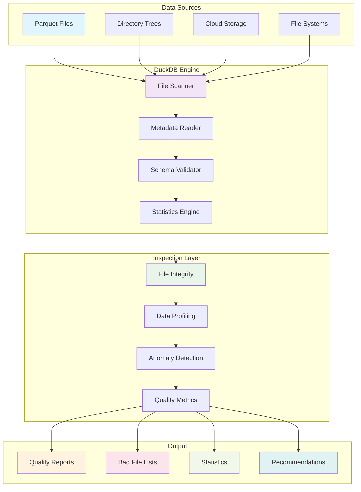

# DuckDB Parquet Data Quality Inspection: Finding Bad Data Files

**Objective**: Master DuckDB for comprehensive Parquet file inspection and data quality analysis. When you need to identify corrupted files, when you want to detect data anomalies, when you're building data quality pipelines—DuckDB becomes your weapon of choice.

DuckDB provides the foundation for efficient Parquet file inspection and data quality analysis. Without proper understanding of file validation, data profiling, and anomaly detection, you're building unreliable data pipelines that miss the power of automated data quality assessment. This guide shows you how to wield DuckDB with the precision of a senior data engineer.

## 0) Prerequisites (Read Once, Live by Them)

### The Five Commandments

1. **Understand DuckDB fundamentals**
   - Parquet file reading and writing
   - SQL query capabilities
   - Performance optimization
   - File system integration

2. **Master data quality patterns**
   - File corruption detection
   - Schema validation
   - Data profiling and statistics
   - Anomaly detection algorithms

3. **Know your inspection techniques**
   - Metadata analysis
   - Row group inspection
   - Column statistics
   - Data type validation

4. **Validate everything**
   - File integrity checks
   - Schema consistency
   - Data completeness
   - Performance under scale

5. **Plan for production**
   - Scalable inspection pipelines
   - Monitoring and alerting
   - Automated remediation
   - Integration with existing systems

**Why These Principles**: DuckDB mastery is the foundation of reliable data quality inspection. Understanding file validation, mastering data profiling, and following best practices is essential for building production-ready data quality systems.

## 1) What is DuckDB Parquet Inspection? (The Foundation)

### Core Concepts

```yaml
# DuckDB enables efficient Parquet file inspection
duckdb_inspection:
  file_validation:
    - "File corruption detection"
    - "Schema validation"
    - "Metadata inspection"
    - "Row group analysis"
  
  data_quality:
    - "Statistical profiling"
    - "Anomaly detection"
    - "Completeness analysis"
    - "Consistency validation"
  
  performance:
    - "Fast file scanning"
    - "Parallel processing"
    - "Memory optimization"
    - "Query optimization"
```

### DuckDB Architecture



### Why DuckDB for Parquet Inspection

```python
# DuckDB enables efficient Parquet file inspection
import duckdb

# Connect to DuckDB
conn = duckdb.connect()

# Scan directory for Parquet files
files = conn.execute("""
    SELECT file_name, file_size, file_modified
    FROM glob('data/*.parquet')
    ORDER BY file_modified DESC
""").fetchall()

# Inspect file metadata
for file_name, file_size, file_modified in files:
    print(f"File: {file_name}")
    print(f"Size: {file_size} bytes")
    print(f"Modified: {file_modified}")
```

**Why DuckDB Matters**: DuckDB provides fast, SQL-based access to Parquet files with built-in optimization for analytical workloads. It enables comprehensive data quality inspection without the overhead of traditional database systems.

## 2) File Integrity Inspection (The Foundation)

### Basic File Validation

```python
# Basic file integrity inspection
import duckdb
import os
from pathlib import Path

def inspect_parquet_files(directory: str):
    """Inspect Parquet files for basic integrity issues"""
    conn = duckdb.connect()
    
    # Get all Parquet files in directory
    query = f"""
    SELECT 
        file_name,
        file_size,
        file_modified,
        CASE 
            WHEN file_size = 0 THEN 'EMPTY_FILE'
            WHEN file_size < 1000 THEN 'SUSPICIOUSLY_SMALL'
            ELSE 'OK'
        END as file_status
    FROM glob('{directory}/**/*.parquet')
    ORDER BY file_size ASC
    """
    
    results = conn.execute(query).fetchall()
    
    print("File Integrity Inspection Results:")
    print("=" * 50)
    
    for file_name, file_size, file_modified, status in results:
        print(f"File: {file_name}")
        print(f"Size: {file_size} bytes")
        print(f"Status: {status}")
        print(f"Modified: {file_modified}")
        print("-" * 30)
    
    return results

def detect_corrupted_files(directory: str):
    """Detect potentially corrupted Parquet files"""
    conn = duckdb.connect()
    
    corrupted_files = []
    
    # Get all Parquet files
    files = conn.execute(f"SELECT file_name FROM glob('{directory}/**/*.parquet')").fetchall()
    
    for (file_name,) in files:
        try:
            # Try to read file metadata
            metadata_query = f"""
            SELECT COUNT(*) as row_count
            FROM read_parquet('{file_name}')
            LIMIT 1
            """
            conn.execute(metadata_query).fetchone()
            
        except Exception as e:
            print(f"Corrupted file detected: {file_name}")
            print(f"Error: {e}")
            corrupted_files.append(file_name)
    
    return corrupted_files
```

### Advanced File Inspection

```python
# Advanced file inspection with detailed metadata
def advanced_file_inspection(directory: str):
    """Advanced Parquet file inspection with detailed metadata"""
    conn = duckdb.connect()
    
    # Create comprehensive file inspection query
    query = f"""
    WITH file_info AS (
        SELECT 
            file_name,
            file_size,
            file_modified,
            -- Try to get row count
            CASE 
                WHEN file_size > 0 THEN
                    (SELECT COUNT(*) FROM read_parquet(file_name) LIMIT 1000000)
                ELSE 0
            END as estimated_rows,
            -- Try to get column count
            CASE 
                WHEN file_size > 0 THEN
                    (SELECT COUNT(*) FROM pragma_table_info('read_parquet(file_name)'))
                ELSE 0
            END as column_count
        FROM glob('{directory}/**/*.parquet')
    )
    SELECT 
        file_name,
        file_size,
        file_modified,
        estimated_rows,
        column_count,
        CASE 
            WHEN file_size = 0 THEN 'EMPTY_FILE'
            WHEN file_size < 1000 THEN 'SUSPICIOUSLY_SMALL'
            WHEN estimated_rows = 0 AND file_size > 1000 THEN 'POTENTIALLY_CORRUPTED'
            WHEN column_count = 0 THEN 'SCHEMA_ISSUE'
            ELSE 'OK'
        END as file_status,
        ROUND(file_size / 1024.0 / 1024.0, 2) as size_mb
    FROM file_info
    ORDER BY file_status, file_size ASC
    """
    
    results = conn.execute(query).fetchall()
    
    # Group results by status
    status_groups = {}
    for result in results:
        status = result[5]  # file_status
        if status not in status_groups:
            status_groups[status] = []
        status_groups[status].append(result)
    
    # Print results by status
    for status, files in status_groups.items():
        print(f"\n{status} Files ({len(files)} files):")
        print("=" * 50)
        for file_name, file_size, file_modified, estimated_rows, column_count, _, size_mb in files:
            print(f"File: {file_name}")
            print(f"Size: {size_mb} MB ({file_size} bytes)")
            print(f"Rows: {estimated_rows}")
            print(f"Columns: {column_count}")
            print(f"Modified: {file_modified}")
            print("-" * 30)
    
    return results
```

## 3) Schema Validation (The Structure)

### Schema Consistency Analysis

```python
# Schema validation and consistency analysis
def validate_schemas(directory: str):
    """Validate schema consistency across Parquet files"""
    conn = duckdb.connect()
    
    # Get schema information for all files
    query = f"""
    WITH schema_info AS (
        SELECT 
            file_name,
            column_name,
            data_type,
            is_nullable
        FROM (
            SELECT 
                file_name,
                unnest(column_names) as column_name,
                unnest(column_types) as data_type,
                unnest(column_nullable) as is_nullable
            FROM (
                SELECT 
                    file_name,
                    list(column_name) as column_names,
                    list(data_type) as column_types,
                    list(nullable) as column_nullable
                FROM (
                    SELECT 
                        file_name,
                        column_name,
                        data_type,
                        nullable
                    FROM glob('{directory}/**/*.parquet') as files,
                    pragma_table_info('read_parquet(files.file_name)')
                )
                GROUP BY file_name
            )
        )
    )
    SELECT 
        file_name,
        column_name,
        data_type,
        is_nullable
    FROM schema_info
    ORDER BY file_name, column_name
    """
    
    results = conn.execute(query).fetchall()
    
    # Analyze schema consistency
    schema_analysis = {}
    for file_name, column_name, data_type, is_nullable in results:
        if column_name not in schema_analysis:
            schema_analysis[column_name] = {
                'data_types': set(),
                'nullable_values': set(),
                'files': set()
            }
        
        schema_analysis[column_name]['data_types'].add(data_type)
        schema_analysis[column_name]['nullable_values'].add(is_nullable)
        schema_analysis[column_name]['files'].add(file_name)
    
    # Report schema inconsistencies
    print("Schema Consistency Analysis:")
    print("=" * 50)
    
    for column_name, info in schema_analysis.items():
        if len(info['data_types']) > 1:
            print(f"INCONSISTENT: Column '{column_name}' has multiple types: {info['data_types']}")
            print(f"Files: {info['files']}")
            print("-" * 30)
        elif len(info['nullable_values']) > 1:
            print(f"INCONSISTENT: Column '{column_name}' has mixed nullable values: {info['nullable_values']}")
            print(f"Files: {info['files']}")
            print("-" * 30)
    
    return schema_analysis

def detect_schema_drift(directory: str, reference_schema: dict):
    """Detect schema drift from reference schema"""
    conn = duckdb.connect()
    
    # Get current schema
    current_schema = validate_schemas(directory)
    
    # Compare with reference schema
    drift_detected = []
    
    for column_name, info in current_schema.items():
        if column_name in reference_schema:
            ref_info = reference_schema[column_name]
            
            # Check for type drift
            if info['data_types'] != ref_info['data_types']:
                drift_detected.append({
                    'column': column_name,
                    'type': 'TYPE_DRIFT',
                    'current': info['data_types'],
                    'reference': ref_info['data_types']
                })
            
            # Check for nullable drift
            if info['nullable_values'] != ref_info['nullable_values']:
                drift_detected.append({
                    'column': column_name,
                    'type': 'NULLABLE_DRIFT',
                    'current': info['nullable_values'],
                    'reference': ref_info['nullable_values']
                })
        else:
            # New column detected
            drift_detected.append({
                'column': column_name,
                'type': 'NEW_COLUMN',
                'current': info['data_types'],
                'reference': 'N/A'
            })
    
    # Check for removed columns
    for column_name in reference_schema:
        if column_name not in current_schema:
            drift_detected.append({
                'column': column_name,
                'type': 'REMOVED_COLUMN',
                'current': 'N/A',
                'reference': reference_schema[column_name]['data_types']
            })
    
    return drift_detected
```

## 4) Data Quality Profiling (The Analysis)

### Statistical Data Profiling

```python
# Statistical data profiling for quality assessment
def profile_data_quality(directory: str):
    """Profile data quality across Parquet files"""
    conn = duckdb.connect()
    
    # Get all files
    files = conn.execute(f"SELECT file_name FROM glob('{directory}/**/*.parquet')").fetchall()
    
    quality_report = {}
    
    for (file_name,) in files:
        try:
            # Get basic statistics
            stats_query = f"""
            SELECT 
                COUNT(*) as total_rows,
                COUNT(DISTINCT *) as unique_rows,
                COUNT(*) - COUNT(DISTINCT *) as duplicate_rows
            FROM read_parquet('{file_name}')
            """
            
            stats = conn.execute(stats_query).fetchone()
            total_rows, unique_rows, duplicate_rows = stats
            
            # Get column statistics
            column_stats_query = f"""
            SELECT 
                column_name,
                data_type,
                COUNT(*) as non_null_count,
                COUNT(*) - COUNT(column_name) as null_count,
                COUNT(DISTINCT column_name) as distinct_count
            FROM (
                SELECT 
                    unnest(column_names) as column_name,
                    unnest(column_types) as data_type
                FROM (
                    SELECT 
                        list(column_name) as column_names,
                        list(data_type) as column_types
                    FROM pragma_table_info('read_parquet('{file_name}'))
                )
            )
            GROUP BY column_name, data_type
            """
            
            column_stats = conn.execute(column_stats_query).fetchall()
            
            # Calculate quality metrics
            quality_metrics = {
                'total_rows': total_rows,
                'unique_rows': unique_rows,
                'duplicate_rows': duplicate_rows,
                'duplicate_percentage': (duplicate_rows / total_rows * 100) if total_rows > 0 else 0,
                'columns': {}
            }
            
            for column_name, data_type, non_null_count, null_count, distinct_count in column_stats:
                quality_metrics['columns'][column_name] = {
                    'data_type': data_type,
                    'non_null_count': non_null_count,
                    'null_count': null_count,
                    'distinct_count': distinct_count,
                    'null_percentage': (null_count / total_rows * 100) if total_rows > 0 else 0,
                    'distinct_percentage': (distinct_count / total_rows * 100) if total_rows > 0 else 0
                }
            
            quality_report[file_name] = quality_metrics
            
        except Exception as e:
            print(f"Error profiling file {file_name}: {e}")
            quality_report[file_name] = {'error': str(e)}
    
    return quality_report

def detect_data_anomalies(directory: str):
    """Detect data anomalies in Parquet files"""
    conn = duckdb.connect()
    
    anomalies = []
    
    # Get all files
    files = conn.execute(f"SELECT file_name FROM glob('{directory}/**/*.parquet')").fetchall()
    
    for (file_name,) in files:
        try:
            # Check for empty files
            row_count_query = f"SELECT COUNT(*) FROM read_parquet('{file_name}')"
            row_count = conn.execute(row_count_query).fetchone()[0]
            
            if row_count == 0:
                anomalies.append({
                    'file': file_name,
                    'type': 'EMPTY_FILE',
                    'description': 'File contains no data rows'
                })
                continue
            
            # Check for suspicious patterns
            # Check for all null columns
            null_columns_query = f"""
            SELECT 
                column_name,
                COUNT(*) as total_count,
                COUNT(column_name) as non_null_count,
                COUNT(*) - COUNT(column_name) as null_count
            FROM (
                SELECT 
                    unnest(column_names) as column_name
                FROM (
                    SELECT 
                        list(column_name) as column_names
                    FROM pragma_table_info('read_parquet('{file_name}'))
                )
            )
            GROUP BY column_name
            HAVING COUNT(*) - COUNT(column_name) = COUNT(*)
            """
            
            null_columns = conn.execute(null_columns_query).fetchall()
            for column_name, total_count, non_null_count, null_count in null_columns:
                anomalies.append({
                    'file': file_name,
                    'type': 'ALL_NULL_COLUMN',
                    'description': f'Column {column_name} is completely null'
                })
            
            # Check for duplicate rows
            duplicate_query = f"""
            SELECT 
                COUNT(*) as total_rows,
                COUNT(DISTINCT *) as unique_rows
            FROM read_parquet('{file_name}')
            """
            
            total_rows, unique_rows = conn.execute(duplicate_query).fetchone()
            if total_rows > unique_rows:
                duplicate_percentage = ((total_rows - unique_rows) / total_rows) * 100
                anomalies.append({
                    'file': file_name,
                    'type': 'HIGH_DUPLICATE_RATE',
                    'description': f'{duplicate_percentage:.2f}% of rows are duplicates'
                })
            
        except Exception as e:
            anomalies.append({
                'file': file_name,
                'type': 'PROCESSING_ERROR',
                'description': f'Error processing file: {e}'
            })
    
    return anomalies
```

## 5) Performance and Optimization (The Speed)

### Efficient File Scanning

```python
# Performance optimization for large-scale file inspection
def optimized_file_scanning(directory: str, batch_size: int = 100):
    """Optimized file scanning for large directories"""
    conn = duckdb.connect()
    
    # Configure DuckDB for performance
    conn.execute("SET memory_limit='4GB'")
    conn.execute("SET threads=4")
    
    # Get all files in batches
    all_files = conn.execute(f"SELECT file_name FROM glob('{directory}/**/*.parquet')").fetchall()
    
    results = []
    
    for i in range(0, len(all_files), batch_size):
        batch_files = all_files[i:i + batch_size]
        
        # Process batch
        batch_results = process_file_batch(conn, batch_files)
        results.extend(batch_results)
        
        print(f"Processed batch {i//batch_size + 1}/{(len(all_files) + batch_size - 1)//batch_size}")
    
    return results

def process_file_batch(conn, files):
    """Process a batch of files efficiently"""
    results = []
    
    for (file_name,) in files:
        try:
            # Quick file validation
            validation_query = f"""
            SELECT 
                file_name,
                file_size,
                COUNT(*) as row_count,
                COUNT(DISTINCT *) as unique_rows
            FROM read_parquet('{file_name}')
            """
            
            result = conn.execute(validation_query).fetchone()
            results.append({
                'file_name': file_name,
                'file_size': result[1],
                'row_count': result[2],
                'unique_rows': result[3],
                'status': 'OK'
            })
            
        except Exception as e:
            results.append({
                'file_name': file_name,
                'file_size': 0,
                'row_count': 0,
                'unique_rows': 0,
                'status': 'ERROR',
                'error': str(e)
            })
    
    return results

def parallel_file_inspection(directory: str, max_workers: int = 4):
    """Parallel file inspection for better performance"""
    import concurrent.futures
    from pathlib import Path
    
    # Get all files
    files = list(Path(directory).rglob("*.parquet"))
    
    def inspect_single_file(file_path):
        """Inspect a single file"""
        conn = duckdb.connect()
        
        try:
            # Basic file info
            file_size = file_path.stat().st_size
            
            # Try to read file
            row_count = conn.execute(f"SELECT COUNT(*) FROM read_parquet('{file_path}')").fetchone()[0]
            
            return {
                'file_name': str(file_path),
                'file_size': file_size,
                'row_count': row_count,
                'status': 'OK'
            }
            
        except Exception as e:
            return {
                'file_name': str(file_path),
                'file_size': 0,
                'row_count': 0,
                'status': 'ERROR',
                'error': str(e)
            }
        finally:
            conn.close()
    
    # Process files in parallel
    with concurrent.futures.ThreadPoolExecutor(max_workers=max_workers) as executor:
        results = list(executor.map(inspect_single_file, files))
    
    return results
```

## 6) Production Data Quality Pipeline (The Scale)

### Complete Data Quality Pipeline

```python
# Complete data quality pipeline for production
class ParquetDataQualityPipeline:
    """Production-ready data quality pipeline for Parquet files"""
    
    def __init__(self, directory: str, config: dict = None):
        self.directory = directory
        self.config = config or self._default_config()
        self.conn = duckdb.connect()
        self._setup_connection()
    
    def _default_config(self):
        """Default configuration for data quality pipeline"""
        return {
            'max_file_size_mb': 1000,
            'min_file_size_bytes': 1000,
            'max_null_percentage': 50,
            'max_duplicate_percentage': 10,
            'required_columns': [],
            'excluded_files': [],
            'parallel_workers': 4
        }
    
    def _setup_connection(self):
        """Setup DuckDB connection with optimizations"""
        self.conn.execute("SET memory_limit='4GB'")
        self.conn.execute("SET threads=4")
        self.conn.execute("SET enable_progress_bar=true")
    
    def run_full_inspection(self):
        """Run complete data quality inspection"""
        print("Starting Parquet Data Quality Inspection...")
        print("=" * 50)
        
        # 1. File integrity check
        print("1. Checking file integrity...")
        integrity_results = self._check_file_integrity()
        
        # 2. Schema validation
        print("2. Validating schemas...")
        schema_results = self._validate_schemas()
        
        # 3. Data quality profiling
        print("3. Profiling data quality...")
        quality_results = self._profile_data_quality()
        
        # 4. Anomaly detection
        print("4. Detecting anomalies...")
        anomaly_results = self._detect_anomalies()
        
        # 5. Generate report
        print("5. Generating quality report...")
        report = self._generate_quality_report(
            integrity_results,
            schema_results,
            quality_results,
            anomaly_results
        )
        
        return report
    
    def _check_file_integrity(self):
        """Check file integrity and basic properties"""
        query = f"""
        SELECT 
            file_name,
            file_size,
            file_modified,
            CASE 
                WHEN file_size = 0 THEN 'EMPTY_FILE'
                WHEN file_size < {self.config['min_file_size_bytes']} THEN 'SUSPICIOUSLY_SMALL'
                WHEN file_size > {self.config['max_file_size_mb'] * 1024 * 1024} THEN 'SUSPICIOUSLY_LARGE'
                ELSE 'OK'
            END as integrity_status
        FROM glob('{self.directory}/**/*.parquet')
        WHERE file_name NOT IN ({','.join([f"'{f}'" for f in self.config['excluded_files']])})
        ORDER BY file_size ASC
        """
        
        return self.conn.execute(query).fetchall()
    
    def _validate_schemas(self):
        """Validate schema consistency"""
        # Implementation for schema validation
        pass
    
    def _profile_data_quality(self):
        """Profile data quality metrics"""
        # Implementation for data quality profiling
        pass
    
    def _detect_anomalies(self):
        """Detect data anomalies"""
        # Implementation for anomaly detection
        pass
    
    def _generate_quality_report(self, integrity, schema, quality, anomalies):
        """Generate comprehensive quality report"""
        report = {
            'summary': {
                'total_files': len(integrity),
                'corrupted_files': len([f for f in integrity if f[3] != 'OK']),
                'schema_issues': len(schema),
                'quality_issues': len(quality),
                'anomalies': len(anomalies)
            },
            'file_integrity': integrity,
            'schema_validation': schema,
            'data_quality': quality,
            'anomalies': anomalies,
            'recommendations': self._generate_recommendations(integrity, schema, quality, anomalies)
        }
        
        return report
    
    def _generate_recommendations(self, integrity, schema, quality, anomalies):
        """Generate recommendations based on findings"""
        recommendations = []
        
        # File integrity recommendations
        corrupted_files = [f for f in integrity if f[3] != 'OK']
        if corrupted_files:
            recommendations.append({
                'type': 'FILE_INTEGRITY',
                'priority': 'HIGH',
                'description': f'Found {len(corrupted_files)} files with integrity issues',
                'action': 'Review and potentially remove corrupted files'
            })
        
        # Schema recommendations
        if schema:
            recommendations.append({
                'type': 'SCHEMA_CONSISTENCY',
                'priority': 'MEDIUM',
                'description': 'Schema inconsistencies detected',
                'action': 'Standardize schemas across files'
            })
        
        # Quality recommendations
        if quality:
            recommendations.append({
                'type': 'DATA_QUALITY',
                'priority': 'MEDIUM',
                'description': 'Data quality issues detected',
                'action': 'Review data quality metrics and clean data'
            })
        
        return recommendations
```

## 7) Common Pitfalls (The Traps)

### File Inspection Mistakes

```python
# ❌ WRONG: Inefficient file inspection
def bad_file_inspection(directory: str):
    # Reading entire files for inspection
    for file_path in glob.glob(f"{directory}/**/*.parquet"):
        df = pd.read_parquet(file_path)  # Loads entire file!
        print(f"File: {file_path}, Rows: {len(df)}")

# ✅ CORRECT: Efficient file inspection
def good_file_inspection(directory: str):
    conn = duckdb.connect()
    
    # Use DuckDB for efficient inspection
    query = f"""
    SELECT 
        file_name,
        file_size,
        COUNT(*) as row_count
    FROM glob('{directory}/**/*.parquet')
    GROUP BY file_name, file_size
    """
    
    results = conn.execute(query).fetchall()
    for file_name, file_size, row_count in results:
        print(f"File: {file_name}, Rows: {row_count}")
```

### Memory Management Issues

```python
# ❌ WRONG: Memory-intensive operations
def bad_memory_usage(directory: str):
    conn = duckdb.connect()
    
    # Loading all files into memory
    all_data = conn.execute(f"SELECT * FROM glob('{directory}/**/*.parquet')").fetchall()
    # This will consume massive amounts of memory!

# ✅ CORRECT: Memory-efficient operations
def good_memory_usage(directory: str):
    conn = duckdb.connect()
    
    # Process files one at a time
    files = conn.execute(f"SELECT file_name FROM glob('{directory}/**/*.parquet')").fetchall()
    
    for (file_name,) in files:
        # Process each file individually
        stats = conn.execute(f"""
            SELECT COUNT(*) as row_count
            FROM read_parquet('{file_name}')
        """).fetchone()
        print(f"File: {file_name}, Rows: {stats[0]}")
```

**Why These Pitfalls Matter**: Common mistakes lead to poor performance, memory issues, and unreliable results. Understanding these pitfalls prevents costly errors and ensures efficient data quality inspection.

## 8) Best Practices Checklist (The Wisdom)

### Data Quality Inspection Checklist

```python
# ✅ DO: Complete data quality inspection checklist
def data_quality_checklist():
    checklist = {
        "file_integrity": [
            "Check file sizes and corruption",
            "Validate file accessibility",
            "Detect empty or suspiciously small files",
            "Identify potentially corrupted files"
        ],
        "schema_validation": [
            "Validate schema consistency",
            "Detect schema drift",
            "Check column types and nullability",
            "Identify missing or extra columns"
        ],
        "data_quality": [
            "Profile data statistics",
            "Detect null values and completeness",
            "Identify duplicate records",
            "Check data type consistency"
        ],
        "anomaly_detection": [
            "Detect unusual patterns",
            "Identify outliers and anomalies",
            "Check for data quality issues",
            "Validate business rules"
        ]
    }
    return checklist
```

### Performance Optimization Checklist

```python
# ✅ DO: Performance optimization checklist
def performance_optimization_checklist():
    checklist = {
        "connection_optimization": [
            "Set appropriate memory limits",
            "Configure thread count",
            "Enable progress bars",
            "Use connection pooling"
        ],
        "query_optimization": [
            "Use efficient file scanning",
            "Limit data reading to necessary columns",
            "Use appropriate batch sizes",
            "Implement parallel processing"
        ],
        "memory_management": [
            "Process files individually",
            "Use streaming for large files",
            "Implement proper cleanup",
            "Monitor memory usage"
        ],
        "monitoring": [
            "Track processing time",
            "Monitor memory usage",
            "Log errors and issues",
            "Generate performance reports"
        ]
    }
    return checklist
```

**Why These Practices Matter**: Best practices ensure successful data quality inspection. Following established patterns prevents common mistakes and enables production-ready data quality systems.

## 9) TL;DR Quickstart (The Essentials)

### Essential DuckDB Setup

```bash
# 1) Install DuckDB
pip install duckdb

# 2) Basic file inspection
python -c "
import duckdb
conn = duckdb.connect()
files = conn.execute('SELECT file_name, file_size FROM glob(\"data/*.parquet\")').fetchall()
for file_name, file_size in files:
    print(f'{file_name}: {file_size} bytes')
"
```

### Essential Inspection Queries

```sql
-- Basic file information
SELECT 
    file_name,
    file_size,
    file_modified
FROM glob('data/**/*.parquet')
ORDER BY file_size DESC;

-- File integrity check
SELECT 
    file_name,
    file_size,
    CASE 
        WHEN file_size = 0 THEN 'EMPTY'
        WHEN file_size < 1000 THEN 'SUSPICIOUS'
        ELSE 'OK'
    END as status
FROM glob('data/**/*.parquet');

-- Row count per file
SELECT 
    file_name,
    COUNT(*) as row_count
FROM glob('data/**/*.parquet')
GROUP BY file_name;
```

### Essential Python Patterns

```python
# Essential DuckDB patterns for Parquet inspection
def essential_inspection_patterns():
    conn = duckdb.connect()
    
    # 1. Basic file scanning
    files = conn.execute("SELECT file_name FROM glob('data/*.parquet')").fetchall()
    
    # 2. File integrity check
    for (file_name,) in files:
        try:
            row_count = conn.execute(f"SELECT COUNT(*) FROM read_parquet('{file_name}')").fetchone()[0]
            print(f"File: {file_name}, Rows: {row_count}")
        except Exception as e:
            print(f"Error reading {file_name}: {e}")
    
    # 3. Schema validation
    schema = conn.execute("DESCRIBE read_parquet('data/sample.parquet')").fetchall()
    print("Schema:", schema)
```

**Why This Quickstart**: These patterns cover 90% of DuckDB Parquet inspection usage. Master these before exploring advanced features.

## 10) The Machine's Summary

DuckDB provides the foundation for efficient Parquet file inspection and data quality analysis. When used correctly, it enables comprehensive data quality assessment without the overhead of traditional database systems. The key is understanding file validation, mastering data profiling, and following best practices.

**The Dark Truth**: Without proper DuckDB understanding, your data quality inspection is inefficient and unreliable. DuckDB is your weapon. Use it wisely.

**The Machine's Mantra**: "In file integrity we trust, in data profiling we build, and in the quality report we find the path to reliable data."

**Why This Matters**: DuckDB enables applications to efficiently inspect Parquet files and detect data quality issues. It provides the foundation for reliable data pipelines that can identify and handle bad data files automatically.

---

*This guide provides the complete machinery for mastering DuckDB Parquet data quality inspection. The patterns scale from simple file validation to complex data quality pipelines, from basic integrity checks to advanced anomaly detection.*
