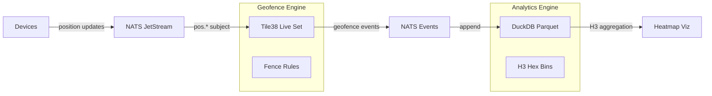

# Hexes in Motion: H3 + Tile38 + NATS + DuckDB

**Objective**: Build a geo event bus where devices publish positions to NATS JetStream, Tile38 triggers geofence enter/exit events, DuckDB keeps a compact columnar history for offline analytics, and H3 powers hex aggregation for heatmaps. Real-time geofences with hex aggregation and offline analytics.

## Architecture



**Why**: H3 provides consistent hexagonal indexing for spatial aggregation, Tile38 handles real-time geofencing with sub-millisecond latency, NATS JetStream ensures message durability, and DuckDB enables fast analytical queries on historical data.

## Docker Compose with Profiles

```yaml
# docker-compose.yml
version: "3.9"
x-hc: &hc { interval: 5s, timeout: 3s, retries: 40 }

services:
  nats:
    image: nats:2.10-alpine
    command: ["-js", "-m", "8222"]  # JetStream + monitoring
    ports: ["4222:4222", "8222:8222"]
    healthcheck: { test: ["CMD", "nats", "server", "check", "jetstream"], <<: *hc }

  tile38:
    image: tile38/tile38:1.40.0
    command: ["tile38-server", "-h", "0.0.0.0", "-p", "9851"]
    ports: ["9851:9851"]
    healthcheck: { test: ["CMD", "tile38-cli", "-h", "localhost", "ping"], <<: *hc }

  duckdb:
    image: duckdb/duckdb:latest
    command: ["duckdb", "-c", "CREATE TABLE IF NOT EXISTS positions (id TEXT, lat DOUBLE, lon DOUBLE, ts BIGINT, h3_index TEXT);"]
    volumes:
      - duckdb_data:/data
    healthcheck: { test: ["CMD", "duckdb", "/data/positions.db", "-c", "SELECT 1"], <<: *hc }

  # Random walker publisher (profile)
  walker:
    build: ./walker
    profiles: ["demo"]
    environment:
      NATS_URL: nats://nats:4222
    depends_on:
      nats: { condition: service_healthy }
      tile38: { condition: service_healthy }

  # Analytics processor (profile)
  processor:
    build: ./processor
    profiles: ["analytics"]
    environment:
      NATS_URL: nats://nats:4222
      DUCKDB_PATH: /data/positions.db
    volumes:
      - duckdb_data:/data
    depends_on:
      nats: { condition: service_healthy }
      duckdb: { condition: service_healthy }

  # Simple MapLibre UI (profile)
  viz:
    build: ./viz
    profiles: ["viz"]
    ports: ["3000:3000"]
    environment:
      NATS_URL: nats://nats:4222
    depends_on:
      nats: { condition: service_healthy }

  # NATS CLI for ops (profile)
  nats-cli:
    image: natsio/nats-box:latest
    profiles: ["ops"]
    command: ["sleep", "infinity"]
    depends_on:
      nats: { condition: service_healthy }

volumes:
  duckdb_data:
    driver: local
```

### Operator Recipes

```bash
# Core geo event bus
docker compose up -d

# Add random walkers (demo data)
docker compose --profile demo up -d

# Add analytics processing
docker compose --profile analytics up -d

# Add visualization
docker compose --profile viz up -d

# Add ops tools
docker compose --profile ops up -d
```

## Data Model & Event Shape

### Position Update
```json
{
  "id": "device-123",
  "lat": 40.7589,
  "lon": -73.9851,
  "ts": 1704067200000,
  "h3_index": "8a2a1072b59ffff"
}
```

### Geofence Event
```json
{
  "event_type": "enter|exit",
  "fence_id": "office_zone",
  "device_id": "device-123",
  "position": {"lat": 40.7589, "lon": -73.9851},
  "timestamp": 1704067200000
}
```

## Python Walker (Random Position Publisher)

### walker/Dockerfile
```dockerfile
FROM python:3.11-slim

RUN pip install nats-py h3

WORKDIR /app
COPY walker.py .

CMD ["python", "walker.py"]
```

### walker/walker.py
```python
import os, time, json, random, uuid, asyncio
from nats.aio.client import Client as NATS
import h3

async def main():
    nc = NATS()
    await nc.connect(os.getenv("NATS_URL", "nats://localhost:4222"))
    
    # Create JetStream context
    js = nc.jetstream()
    
    # Create stream for position updates
    await js.add_stream(name="positions", subjects=["pos.*"])
    
    # Create subject for geofence events
    await js.add_stream(name="events", subjects=["events.*"])
    
    # Random walker parameters
    center_lat, center_lon = 40.7589, -73.9851
    walk_radius = 0.01  # ~1km radius
    
    while True:
        # Random walk from center
        lat = center_lat + random.uniform(-walk_radius, walk_radius)
        lon = center_lon + random.uniform(-walk_radius, walk_radius)
        
        # Generate H3 index at resolution 9
        h3_index = h3.latlng_to_cell(lat, lon, 9)
        
        msg = {
            "id": f"walker-{random.randint(1, 10)}",
            "lat": lat,
            "lon": lon,
            "ts": int(time.time() * 1000),
            "h3_index": h3_index
        }
        
        # Publish to NATS JetStream
        await js.publish("pos.walkers", json.dumps(msg).encode())
        
        await asyncio.sleep(0.1)

if __name__ == "__main__":
    asyncio.run(main())
```

## Tile38 Geofence Configuration

### tile38/setup.sh
```bash
#!/bin/bash

# Wait for Tile38 to be ready
sleep 5

# Create live set for tracking positions
tile38-cli -h tile38 SET live walkers POINT 40.7589 -73.9851

# Create geofence rules
# Office zone (circle)
tile38-cli -h tile38 SETHOOK office_zone nats://nats:4222/events.office FENCE DETECT enter,exit COMMAND nearby live FENCE POINT 40.7589 -73.9851 1000

# Home zone (polygon)
tile38-cli -h tile38 SETHOOK home_zone nats://nats:4222/events.home FENCE DETECT enter,exit COMMAND within live FENCE OBJECT '{"type":"Polygon","coordinates":[[[-73.99,40.75],[-73.98,40.75],[-73.98,40.76],[-73.99,40.76],[-73.99,40.75]]]}'

# Highway zone (line)
tile38-cli -h tile38 SETHOOK highway_zone nats://nats:4222/events.highway FENCE DETECT enter,exit COMMAND nearby live FENCE POINT 40.7589 -73.9851 500

echo "Tile38 geofences configured"
```

## DuckDB Analytics Processor

### processor/Dockerfile
```dockerfile
FROM python:3.11-slim

RUN pip install nats-py duckdb h3

WORKDIR /app
COPY processor.py .

CMD ["python", "processor.py"]
```

### processor/processor.py
```python
import os, json, asyncio, duckdb
from nats.aio.client import Client as NATS
import h3

class AnalyticsProcessor:
    def __init__(self):
        self.nats_url = os.getenv("NATS_URL", "nats://localhost:4222")
        self.db_path = os.getenv("DUCKDB_PATH", "/data/positions.db")
        self.conn = duckdb.connect(self.db_path)
        self.setup_database()
    
    def setup_database(self):
        """Create tables and views for analytics."""
        # Create positions table
        self.conn.execute("""
            CREATE TABLE IF NOT EXISTS positions (
                id TEXT,
                lat DOUBLE,
                lon DOUBLE,
                ts BIGINT,
                h3_index TEXT,
                hour_bucket BIGINT
            )
        """)
        
        # Create geofence events table
        self.conn.execute("""
            CREATE TABLE IF NOT EXISTS geofence_events (
                event_type TEXT,
                fence_id TEXT,
                device_id TEXT,
                lat DOUBLE,
                lon DOUBLE,
                timestamp BIGINT,
                hour_bucket BIGINT
            )
        """)
        
        # Create H3 aggregation view
        self.conn.execute("""
            CREATE OR REPLACE VIEW h3_heatmap AS
            SELECT 
                h3_index,
                COUNT(*) as position_count,
                AVG(lat) as avg_lat,
                AVG(lon) as avg_lon,
                MIN(ts) as first_seen,
                MAX(ts) as last_seen
            FROM positions
            GROUP BY h3_index
        """)
    
    async def process_positions(self, msg):
        """Process position updates and store in DuckDB."""
        try:
            data = json.loads(msg.data.decode())
            
            # Calculate hour bucket for partitioning
            hour_bucket = (data['ts'] // 3600000) * 3600000
            
            # Insert into DuckDB
            self.conn.execute("""
                INSERT INTO positions (id, lat, lon, ts, h3_index, hour_bucket)
                VALUES (?, ?, ?, ?, ?, ?)
            """, [
                data['id'], data['lat'], data['lon'], 
                data['ts'], data['h3_index'], hour_bucket
            ])
            
            print(f"Processed position: {data['id']} at {data['lat']}, {data['lon']}")
            
        except Exception as e:
            print(f"Error processing position: {e}")
    
    async def process_geofence_events(self, msg):
        """Process geofence events and store in DuckDB."""
        try:
            data = json.loads(msg.data.decode())
            
            # Calculate hour bucket
            hour_bucket = (data['timestamp'] // 3600000) * 3600000
            
            # Insert into DuckDB
            self.conn.execute("""
                INSERT INTO geofence_events (event_type, fence_id, device_id, lat, lon, timestamp, hour_bucket)
                VALUES (?, ?, ?, ?, ?, ?, ?)
            """, [
                data['event_type'], data['fence_id'], data['device_id'],
                data['position']['lat'], data['position']['lon'],
                data['timestamp'], hour_bucket
            ])
            
            print(f"Geofence event: {data['event_type']} {data['fence_id']} for {data['device_id']}")
            
        except Exception as e:
            print(f"Error processing geofence event: {e}")
    
    async def run(self):
        """Main processing loop."""
        nc = NATS()
        await nc.connect(self.nats_url)
        
        # Subscribe to position updates
        await nc.subscribe("pos.*", cb=self.process_positions)
        
        # Subscribe to geofence events
        await nc.subscribe("events.*", cb=self.process_geofence_events)
        
        print("Analytics processor started")
        
        # Keep running
        while True:
            await asyncio.sleep(1)

if __name__ == "__main__":
    processor = AnalyticsProcessor()
    asyncio.run(processor.run())
```

## H3 Hex Aggregation Queries

### DuckDB H3 Analytics
```sql
-- H3 heatmap aggregation
SELECT 
    h3_index,
    COUNT(*) as position_count,
    AVG(lat) as avg_lat,
    AVG(lon) as avg_lon,
    MIN(ts) as first_seen,
    MAX(ts) as last_seen
FROM positions
WHERE ts >= (strftime('%s', 'now') * 1000) - 3600000  -- Last hour
GROUP BY h3_index
ORDER BY position_count DESC;

-- H3 hex density by resolution
SELECT 
    SUBSTR(h3_index, 1, 2) as resolution,
    COUNT(DISTINCT h3_index) as hex_count,
    COUNT(*) as total_positions
FROM positions
WHERE ts >= (strftime('%s', 'now') * 1000) - 86400000  -- Last day
GROUP BY resolution
ORDER BY resolution;

-- Geofence event summary
SELECT 
    fence_id,
    event_type,
    COUNT(*) as event_count,
    COUNT(DISTINCT device_id) as unique_devices
FROM geofence_events
WHERE timestamp >= (strftime('%s', 'now') * 1000) - 3600000  -- Last hour
GROUP BY fence_id, event_type
ORDER BY event_count DESC;
```

## Simple MapLibre Visualization

### viz/Dockerfile
```dockerfile
FROM node:18-alpine

WORKDIR /app
COPY package.json .
RUN npm install

COPY . .
EXPOSE 3000

CMD ["npm", "start"]
```

### viz/package.json
```json
{
  "name": "h3-viz",
  "version": "1.0.0",
  "scripts": {
    "start": "node server.js"
  },
  "dependencies": {
    "express": "^4.18.2",
    "nats": "^2.16.0",
    "ws": "^8.14.2"
  }
}
```

### viz/server.js
```javascript
const express = require('express');
const { connect } = require('nats');
const WebSocket = require('ws');

const app = express();
const port = 3000;

// Serve static files
app.use(express.static('public'));

// WebSocket for real-time updates
const wss = new WebSocket.Server({ port: 8080 });

// NATS connection for real-time data
let nc;
async function initNATS() {
    nc = await connect({ servers: process.env.NATS_URL || 'nats://localhost:4222' });
    
    // Subscribe to position updates
    const sub = nc.subscribe('pos.*');
    for await (const msg of sub) {
        const data = JSON.parse(msg.data.toString());
        
        // Broadcast to all connected clients
        wss.clients.forEach(client => {
            if (client.readyState === WebSocket.OPEN) {
                client.send(JSON.stringify({
                    type: 'position',
                    data: data
                }));
            }
        });
    }
}

// Start NATS connection
initNATS().catch(console.error);

app.listen(port, () => {
    console.log(`H3 visualization server running on port ${port}`);
});
```

### viz/public/index.html
```html
<!DOCTYPE html>
<html>
<head>
    <title>H3 Geofence Visualization</title>
    <script src="https://unpkg.com/maplibre-gl@3.6.2/dist/maplibre-gl.js"></script>
    <link href="https://unpkg.com/maplibre-gl@3.6.2/dist/maplibre-gl.css" rel="stylesheet">
    <style>
        body { margin: 0; padding: 0; }
        #map { height: 100vh; width: 100vw; }
    </style>
</head>
<body>
    <div id="map"></div>
    <script>
        const map = new maplibregl.Map({
            container: 'map',
            style: 'https://demotiles.maplibre.org/style.json',
            center: [-73.9851, 40.7589],
            zoom: 12
        });

        // WebSocket connection for real-time updates
        const ws = new WebSocket('ws://localhost:8080');
        
        ws.onmessage = function(event) {
            const message = JSON.parse(event.data);
            
            if (message.type === 'position') {
                const { lat, lon, id, h3_index } = message.data;
                
                // Add marker for position
                new maplibregl.Marker()
                    .setLngLat([lon, lat])
                    .setPopup(new maplibregl.Popup().setHTML(`
                        <div>
                            <strong>Device:</strong> ${id}<br>
                            <strong>H3 Index:</strong> ${h3_index}
                        </div>
                    `))
                    .addTo(map);
            }
        };
    </script>
</body>
</html>
```

## Observability & Monitoring

### NATS JetStream Monitoring
```bash
# Check stream status
nats stream info positions

# Check consumer status
nats consumer info positions walker-consumer

# Monitor message flow
nats monitor
```

### Tile38 Monitoring
```bash
# Check geofence status
tile38-cli -h tile38 INFO

# List active hooks
tile38-cli -h tile38 HOOKS

# Check live set size
tile38-cli -h tile38 SIZE live
```

### DuckDB Analytics
```sql
-- System performance
SELECT 
    COUNT(*) as total_positions,
    COUNT(DISTINCT id) as unique_devices,
    MIN(ts) as earliest_position,
    MAX(ts) as latest_position
FROM positions;

-- H3 hex coverage
SELECT 
    COUNT(DISTINCT h3_index) as unique_hexes,
    COUNT(*) as total_positions
FROM positions
WHERE ts >= (strftime('%s', 'now') * 1000) - 3600000;
```

## Failure Modes & Runbook

### Backpressure in NATS
- **Problem**: JetStream consumer lag increases
- **Solution**: Scale consumers, increase memory limits, optimize message size
- **Monitoring**: `nats consumer info positions walker-consumer`

### Tile38 Memory Keys
- **Problem**: Live set grows too large, memory pressure
- **Solution**: Implement TTL on live keys, rotate sets periodically
- **Prevention**: Monitor `tile38-cli -h tile38 INFO` memory usage

### Parquet Compaction Cadence
- **Problem**: Too many small files, slow queries
- **Solution**: Implement hourly compaction, use DuckDB's COPY TO PARQUET
- **Automation**: Schedule compaction via cron or Kubernetes jobs

### H3 Resolution Mismatch
- **Problem**: Inconsistent hex sizes across queries
- **Solution**: Standardize on resolution 9 for most use cases
- **Debug**: Validate H3 indices with `h3.is_valid_cell()`

## TL;DR Runbook

```bash
# 1. Start core stack
docker compose up -d

# 2. Add random walkers
docker compose --profile demo up -d

# 3. Add analytics processing
docker compose --profile analytics up -d

# 4. Add visualization
docker compose --profile viz up -d

# 5. Configure Tile38 geofences
docker compose exec tile38 bash /setup.sh

# 6. Monitor the system
# - NATS: http://localhost:8222
# - Tile38: tile38-cli -h localhost INFO
# - DuckDB: duckdb /data/positions.db

# 7. Query H3 analytics
# - Heatmap: SELECT h3_index, COUNT(*) FROM positions GROUP BY h3_index
# - Geofences: SELECT fence_id, COUNT(*) FROM geofence_events GROUP BY fence_id
```

---

*This tutorial provides the complete machinery for real-time geofencing with hexagonal spatial analytics. Each component is production-ready, copy-paste runnable, and designed to handle high-frequency position updates with sub-millisecond geofence detection.*
