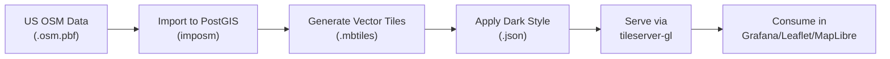

# Generating Dark OpenMapTiles for the Entire US at Zoom Level 12

**Objective**: Master generating dark-themed vector tiles for the United States using OpenMapTiles. When you need custom basemaps for dashboards, offline mapping, or air-gapped deployments—this tutorial provides a complete, reproducible pipeline.

## Introduction

OpenMapTiles is a vector tile schema and toolchain that transforms OpenStreetMap data into efficient vector tiles. Unlike raster tiles, vector tiles are scalable, styleable, and compact. This tutorial walks through generating dark-themed tiles covering the entire United States at zoom level 12, suitable for use in Grafana, Leaflet, MapLibre GL, and other mapping tools.

**What You'll Build**:
- Vector tiles covering the entire United States
- Zoom levels 0-12 (strategic/overview level)
- Dark basemap style (Dark Matter-inspired)
- Self-hosted tile server using tileserver-gl

**Why Zoom 12?**:
- Balances detail with file size
- Suitable for state/regional overview maps
- Keeps MBTiles file manageable (< 10GB typically)
- Good for dashboard and strategic mapping use cases

## High-Level Overview

### What is OpenMapTiles?

OpenMapTiles is:
- **Vector tile schema**: Standardized layer structure (water, landuse, roads, buildings, etc.)
- **Toolchain**: Docker-based pipeline for importing OSM data and generating tiles
- **Open source**: Built on PostGIS, imposm, and standard OSM tooling

### Pipeline Overview



**Workflow Steps**:

1. **Get OSM data**: Download US extract (Geofabrik or similar)
2. **Import to PostGIS**: Use OpenMapTiles Docker tooling to import OSM data
3. **Generate tiles**: Create `.mbtiles` file with vector tiles
4. **Apply dark style**: Create or use existing dark Mapbox GL style
5. **Serve tiles**: Use tileserver-gl to serve tiles with style
6. **Consume**: Use tiles in your mapping applications

## Environment & Prerequisites

### Required Tools

- **Git**: For cloning OpenMapTiles repository
- **Docker**: Version 20.10+ with Docker Compose
- **Disk Space**: ~50GB free (for data, PostGIS, and tiles)
- **RAM**: 16GB+ recommended (8GB minimum)
- **CPU**: Multi-core recommended (tile generation is CPU-intensive)

### Recommended Host OS

- **Linux**: Ubuntu 22.04+ or Debian 11+ (best performance)
- **WSL2**: Windows with WSL2 (acceptable, slightly slower)
- **macOS**: Docker Desktop (works, but slower due to filesystem)

### Directory Structure

Create the following structure:

```bash
openmaptiles-us-dark/
├── data/              # OSM data files
│   └── us.osm.pbf
├── openmaptiles/      # OpenMapTiles repository
│   ├── data/
│   │   └── osm/
│   └── ...
├── styles/            # Mapbox GL style JSON files
│   └── us-dark.json
└── tileserver/        # Tileserver configuration
    ├── data/
    │   └── us.mbtiles
    └── styles/
        └── us-dark.json
```

**Setup Commands**:

```bash
mkdir -p openmaptiles-us-dark/{data,styles,tileserver/{data,styles}}
cd openmaptiles-us-dark
```

## Getting the Source Data for the US

### Option 1: Pre-cut US Extract (Recommended)

**Geofabrik Downloads**:

Geofabrik provides pre-cut OSM extracts. For the United States:

```bash
cd data

# Download US extract (~1.5GB compressed)
wget https://download.geofabrik.de/north-america/us-latest.osm.pbf

# Verify download
ls -lh us-latest.osm.pbf
```

**Alternative: Direct US Extract**:

```bash
# If you need a specific date or region
wget https://download.geofabrik.de/north-america/us-latest.osm.pbf -O us.osm.pbf
```

**File Size**: ~1.5GB compressed, ~8-10GB uncompressed in PostGIS

### Option 2: Bounding Box / Polygon Extract (Advanced)

For custom regions, use `osmium` or `osmosis`:

```bash
# Install osmium-tool
sudo apt-get install osmium-tool

# Extract by bounding box (example: California)
osmium extract -b -122.5,32.5,-114.0,42.0 us-latest.osm.pbf -o california.osm.pbf

# Extract by polygon (requires .poly file)
osmium extract -p california.poly us-latest.osm.pbf -o california.osm.pbf
```

**For this tutorial**: We'll use the full US extract to keep things simple.

## Setting Up OpenMapTiles

### Clone OpenMapTiles Repository

```bash
cd openmaptiles-us-dark

# Clone OpenMapTiles
git clone https://github.com/openmaptiles/openmaptiles.git
cd openmaptiles

# Checkout stable version (adjust to latest stable)
git checkout v4.0.0
```

### Copy OSM Data to Expected Location

```bash
# Create data/osm directory if it doesn't exist
mkdir -p data/osm

# Copy US extract
cp ../data/us-latest.osm.pbf data/osm/us.osm.pbf
```

### Configure OpenMapTiles for US

**Edit `.env` file**:

```bash
# Copy example .env if it doesn't exist
cp .env.example .env

# Edit .env
nano .env
```

**Key Configuration**:

```bash
# .env
MIN_ZOOM=0
MAX_ZOOM=12
BBOX=-180,-85,180,85  # World bbox (will be filtered by area)

# PostGIS settings
POSTGRES_DB=openmaptiles
POSTGRES_USER=openmaptiles
POSTGRES_PASSWORD=openmaptiles
POSTGRES_HOST=postgres
POSTGRES_PORT=5432

# Area to generate (US bounding box)
AREA=us
```

**Create `data/us.bbox` file** (optional, for area filtering):

```bash
# US bounding box (approximate)
echo "-125.0,24.0,-66.0,49.0" > data/us.bbox
```

### Configure Zoom Levels in openmaptiles.yaml

**Edit `openmaptiles.yaml`**:

```yaml
# openmaptiles.yaml
tileset: |
  minzoom: 0
  maxzoom: 12
  center: [-95.7129, 37.0902]  # Center of US
  bounds: [-125.0, 24.0, -66.0, 49.0]  # US bounding box
  attribution: '<a href="https://www.openstreetmap.org/copyright">OpenStreetMap</a>'
  name: "US Dark Tiles"
  description: "Dark-themed vector tiles for the United States"
  version: "1.0.0"
  format: "pbf"
  type: "baselayer"
  scheme: "xyz"
```

**Layer-Specific Zoom Configuration**:

Some layers can be limited to reduce tile size:

```yaml
# Example: Limit building layer to zoom 12+
layers:
  - id: "building"
    minzoom: 12
    maxzoom: 12
```

## Running the OpenMapTiles Pipeline for the US

### Step 1: Pull Docker Images

```bash
cd openmaptiles

# Pull all required Docker images
docker-compose pull
```

**Expected Images**:
- `openmaptiles/openmaptiles-tools`
- `postgis/postgis`
- `imposm3/imposm3`

### Step 2: Start PostGIS Database

```bash
# Start PostGIS container
docker-compose up -d postgres

# Wait for database to be ready
docker-compose run --rm import-osm wait-for-postgres
```

### Step 3: Import OSM Data

**Using Make Targets** (recommended):

```bash
# Import OSM data into PostGIS
make import-data

# Or using docker-compose directly
docker-compose run --rm import-osm
```

**Manual Import** (if make doesn't work):

```bash
docker-compose run --rm \
  -e PBF_FILE=/data/osm/us.osm.pbf \
  import-osm
```

**What This Does**:
- Imports OSM data using imposm3
- Creates PostGIS tables with OpenMapTiles schema
- Processes ~1.5GB of OSM data (takes 30-60 minutes)

### Step 4: Generate Vector Tiles

**Generate Tiles**:

```bash
# Generate tiles into .mbtiles file
make generate-tiles

# Or specify output file
make generate-tiles-pg
```

**Expected Output**: `data/tiles.mbtiles` or `data/us.mbtiles`

**Manual Generation**:

```bash
docker-compose run --rm \
  -e MIN_ZOOM=0 \
  -e MAX_ZOOM=12 \
  generate-tiles-pg
```

**What This Does**:
- Generates vector tiles from PostGIS data
- Creates `.mbtiles` file with all zoom levels 0-12
- Takes 2-4 hours for full US at z12
- Output file: ~5-10GB depending on data density

### Step 5: Verify Output

```bash
# Check .mbtiles file
ls -lh data/*.mbtiles

# Inspect tile metadata (requires mb-util or similar)
docker run --rm -v $(pwd)/data:/data \
  maptiler/tileserver-gl \
  --mbtiles /data/tiles.mbtiles \
  --info
```

### Troubleshooting Import/Generation

**Resume Failed Import**:

```bash
# Check PostGIS tables
docker-compose exec postgres psql -U openmaptiles -d openmaptiles -c "\dt"

# If import failed, clean and restart
make clean
make import-data
```

**Monitor Progress**:

```bash
# Watch PostGIS logs
docker-compose logs -f postgres

# Check tile generation progress
docker-compose logs -f generate-tiles-pg
```

**Resource Usage**:
- **Import**: ~4-8GB RAM, 2-4 CPU cores, 30-60 minutes
- **Generation**: ~8-16GB RAM, 4-8 CPU cores, 2-4 hours
- **Disk**: ~30-50GB total (OSM + PostGIS + tiles)

## Creating / Selecting a Dark Style

### Understanding Vector Tiles and Styles

**Vector tiles** are data (geometry + attributes). **Styles** define how they're rendered. The same tiles can be styled as light, dark, or any theme.

### Option 1: Use Existing Dark Style

**Clone OpenMapTiles Styles Repository**:

```bash
cd ../styles

# Clone styles repository
git clone https://github.com/openmaptiles/maptiler-tileservices.git
cd maptiler-tileservices/styles

# Copy dark style
cp dark-matter/style.json ../../us-dark.json
cd ../../..
```

**Or Download Directly**:

```bash
cd styles

# Download dark matter style
wget https://raw.githubusercontent.com/openmaptiles/dark-matter-gl-style/master/style.json -O us-dark.json
```

### Option 2: Customize from Base Style

**Start from Bright Style**:

```bash
cd styles

# Clone bright style
git clone https://github.com/openmaptiles/osm-bright-gl-style.git
cd osm-bright-gl-style

# Copy as starting point
cp style.json ../us-dark.json
cd ..
```

**Edit `us-dark.json`**:

```json
{
  "version": 8,
  "name": "US Dark",
  "metadata": {
    "mapbox:autocomposite": false,
    "mapbox:type": "template"
  },
  "sources": {
    "openmaptiles": {
      "type": "vector",
      "url": "mbtiles://us.mbtiles"
    }
  },
  "sprite": "https://openmaptiles.github.io/osm-bright-gl-style/sprite",
  "glyphs": "https://fonts.openmaptiles.org/{fontstack}/{range}.pbf",
  "layers": [
    {
      "id": "background",
      "type": "background",
      "paint": {
        "background-color": "#1a1a1a"
      }
    },
    {
      "id": "water",
      "type": "fill",
      "source": "openmaptiles",
      "source-layer": "water",
      "paint": {
        "fill-color": "#0a0a0a"
      }
    },
    {
      "id": "landcover",
      "type": "fill",
      "source": "openmaptiles",
      "source-layer": "landcover",
      "paint": {
        "fill-color": "#2a2a2a"
      }
    },
    {
      "id": "landuse",
      "type": "fill",
      "source": "openmaptiles",
      "source-layer": "landuse",
      "paint": {
        "fill-color": "#1f1f1f"
      }
    },
    {
      "id": "park",
      "type": "fill",
      "source": "openmaptiles",
      "source-layer": "park",
      "paint": {
        "fill-color": "#1a2a1a"
      }
    },
    {
      "id": "boundary",
      "type": "line",
      "source": "openmaptiles",
      "source-layer": "boundary",
      "paint": {
        "line-color": "#404040",
        "line-width": 1
      }
    },
    {
      "id": "road",
      "type": "line",
      "source": "openmaptiles",
      "source-layer": "transportation",
      "paint": {
        "line-color": "#404040",
        "line-width": {
          "base": 1.2,
          "stops": [[10, 0.5], [12, 2]]
        }
      }
    },
    {
      "id": "road-label",
      "type": "symbol",
      "source": "openmaptiles",
      "source-layer": "transportation_name",
      "layout": {
        "text-field": "{name}",
        "text-font": ["Noto Sans Regular"],
        "text-size": 10
      },
      "paint": {
        "text-color": "#cccccc"
      }
    },
    {
      "id": "place-label",
      "type": "symbol",
      "source": "openmaptiles",
      "source-layer": "place",
      "layout": {
        "text-field": "{name}",
        "text-font": ["Noto Sans Regular"],
        "text-size": {
          "base": 1,
          "stops": [[10, 10], [12, 14]]
        }
      },
      "paint": {
        "text-color": "#ffffff"
      }
    }
  ]
}
```

**Key Dark Style Elements**:
- **Background**: Dark gray/black (`#1a1a1a`)
- **Water**: Very dark (`#0a0a0a`)
- **Land**: Dark gray (`#2a2a2a`)
- **Roads**: Medium gray (`#404040`)
- **Labels**: Light text (`#cccccc`, `#ffffff`)

### Update Style Source

**Important**: Update the `sources` section to match your tileserver:

```json
{
  "sources": {
    "openmaptiles": {
      "type": "vector",
      "url": "mbtiles://us.mbtiles"
    }
  }
}
```

Or for HTTP tileserver:

```json
{
  "sources": {
    "openmaptiles": {
      "type": "vector",
      "tiles": ["http://localhost:8080/data/us.json"]
    }
  }
}
```

## Serving the Tiles with tileserver-gl

### Copy Files to Tileserver Directory

```bash
# Copy .mbtiles file
cp openmaptiles/data/tiles.mbtiles tileserver/data/us.mbtiles

# Copy style
cp styles/us-dark.json tileserver/styles/us-dark.json
```

### Run tileserver-gl

**Using Docker**:

```bash
cd tileserver

docker run --rm -it \
  -v $(pwd)/data:/data \
  -v $(pwd)/styles:/styles \
  -p 8080:80 \
  maptiler/tileserver-gl \
  --mbtiles /data/us.mbtiles \
  --public_url http://localhost:8080 \
  --port 80
```

**Using Docker Compose** (recommended):

```yaml
# tileserver/docker-compose.yml
version: '3.8'

services:
  tileserver:
    image: maptiler/tileserver-gl:latest
    ports:
      - "8080:80"
    volumes:
      - ./data:/data
      - ./styles:/styles
    command:
      - "--mbtiles"
      - "/data/us.mbtiles"
      - "--public_url"
      - "http://localhost:8080"
      - "--port"
      - "80"
    restart: unless-stopped
```

```bash
cd tileserver
docker-compose up -d
```

### Access Tileserver UI

**Open in Browser**:

```
http://localhost:8080
```

**Available Endpoints**:
- **Tiles**: `http://localhost:8080/data/us.json`
- **Style**: `http://localhost:8080/styles/us-dark.json`
- **Preview**: `http://localhost:8080`

### Configure Style in Tileserver

**Update `us-dark.json` source**:

```json
{
  "sources": {
    "openmaptiles": {
      "type": "vector",
      "tiles": ["http://localhost:8080/data/us/{z}/{x}/{y}.pbf"]
    }
  }
}
```

**Or use tileserver's JSON endpoint**:

```json
{
  "sources": {
    "openmaptiles": {
      "type": "vector",
      "url": "http://localhost:8080/data/us.json"
    }
  }
}
```

## Using the Dark US Tiles at Zoom 12

### MapLibre GL JS

**HTML Example**:

```html
<!DOCTYPE html>
<html>
<head>
    <meta charset="utf-8">
    <title>US Dark Map</title>
    <script src="https://unpkg.com/maplibre-gl@3.6.2/dist/maplibre-gl.js"></script>
    <link href="https://unpkg.com/maplibre-gl@3.6.2/dist/maplibre-gl.css" rel="stylesheet">
    <style>
        body { margin: 0; padding: 0; }
        #map { position: absolute; top: 0; bottom: 0; width: 100%; }
    </style>
</head>
<body>
    <div id="map"></div>
    <script>
        const map = new maplibregl.Map({
            container: 'map',
            style: 'http://localhost:8080/styles/us-dark.json',
            center: [-95.7129, 37.0902],  // Center of US
            zoom: 4,
            maxZoom: 12  // Match tile data
        });
    </script>
</body>
</html>
```

### Leaflet with MapLibre GL

**Using maplibre-gl-leaflet**:

```html
<!DOCTYPE html>
<html>
<head>
    <link rel="stylesheet" href="https://unpkg.com/leaflet@1.9.4/dist/leaflet.css" />
    <script src="https://unpkg.com/leaflet@1.9.4/dist/leaflet.js"></script>
    <script src="https://unpkg.com/maplibre-gl@3.6.2/dist/maplibre-gl.js"></script>
    <script src="https://unpkg.com/@maplibre/maplibre-gl-leaflet@0.0.17/dist/leaflet-maplibre-gl.js"></script>
</head>
<body>
    <div id="map" style="height: 100vh;"></div>
    <script>
        const map = L.map('map').setView([37.0902, -95.7129], 4);
        
        const gl = L.maplibreGL({
            style: 'http://localhost:8080/styles/us-dark.json',
            maxZoom: 12
        }).addTo(map);
    </script>
</body>
</html>
```

### Grafana

**Configure as Custom Tile Layer**:

1. **Grafana Settings** → **Plugins** → **Map**
2. **Add Custom Tile Layer**:
   - **Name**: US Dark
   - **URL**: `http://localhost:8080/data/us/{z}/{x}/{y}.pbf`
   - **Type**: Vector (if supported) or XYZ
   - **Max Zoom**: 12

**Or Use Style JSON**:

```json
{
  "type": "maplibre",
  "config": {
    "style": "http://localhost:8080/styles/us-dark.json",
    "center": [-95.7129, 37.0902],
    "zoom": 4,
    "maxZoom": 12
  }
}
```

### Important: Max Zoom Configuration

**Always set `maxZoom: 12`** in client applications to match your tile data:

```javascript
// MapLibre GL JS
maxZoom: 12

// Leaflet
maxZoom: 12

// Grafana
maxZoom: 12
```

**Why**: Zooming beyond 12 will request tiles that don't exist, causing blank areas or errors.

## Performance & Storage Considerations

### File Sizes

**US at Zoom 12**:
- **OSM Data**: ~1.5GB compressed, ~8-10GB in PostGIS
- **MBTiles**: ~5-10GB (depends on data density)
- **Total Disk**: ~30-50GB (including intermediate files)

**Comparison by Zoom Level**:
- **Zoom 10**: ~1-2GB
- **Zoom 12**: ~5-10GB
- **Zoom 14**: ~20-40GB
- **Zoom 16**: ~80-160GB

### CPU and RAM

**Import Phase**:
- **CPU**: 2-4 cores utilized
- **RAM**: 4-8GB
- **Time**: 30-60 minutes

**Tile Generation**:
- **CPU**: 4-8 cores (highly parallel)
- **RAM**: 8-16GB
- **Time**: 2-4 hours for z12

**Recommendations**:
- Use SSD for PostGIS data directory
- Allocate sufficient Docker resources
- Monitor disk I/O during generation

### Reducing Tile Size

**Limit Layers**:

Edit `openmaptiles.yaml` to exclude unnecessary layers:

```yaml
layers:
  - id: "building"
    minzoom: 12  # Only show at max zoom
    maxzoom: 12
```

**Simplify Geometry**:

```yaml
# Reduce detail for lower zooms
simplification:
  - zoom: 0-8
    tolerance: 10
  - zoom: 9-12
    tolerance: 5
```

**Clean Up After Generation**:

```bash
cd openmaptiles

# Remove PostGIS data (reclaim ~20-30GB)
make clean

# Or manually
docker-compose down -v
```

## Variations & Extensions

### Generate Specific States

**Using Bounding Box**:

```bash
# California bounding box
BBOX="-124.5,32.5,-114.0,42.0"

# Extract California
osmium extract -b -124.5,32.5,-114.0,42.0 us-latest.osm.pbf -o california.osm.pbf

# Import and generate
cp california.osm.pbf openmaptiles/data/osm/california.osm.pbf
cd openmaptiles
make import-data
make generate-tiles
```

**Using Polygon File**:

```bash
# Download state polygon (from OSM relation)
wget https://www.openstreetmap.org/api/0.6/relation/165475/ways -O california.poly

# Extract
osmium extract -p california.poly us-latest.osm.pbf -o california.osm.pbf
```

### Higher Zoom for Smaller Regions

**City-Level Tiles (z16)**:

```bash
# Extract city (e.g., San Francisco)
osmium extract -b -122.6,37.7,-122.3,37.9 us-latest.osm.pbf -o sf.osm.pbf

# Generate with higher zoom
export MAX_ZOOM=16
make import-data
make generate-tiles
```

**File Size**: ~500MB-2GB for city at z16

### Custom Sprites and Fonts

**Add Custom Sprites**:

```json
{
  "sprite": "http://localhost:8080/sprites/sprite"
}
```

**Host Sprites**:

```bash
# Create sprite directory
mkdir -p tileserver/sprites

# Copy sprite files
cp sprite.png tileserver/sprites/sprite.png
cp sprite.json tileserver/sprites/sprite.json
```

**Custom Fonts**:

```json
{
  "glyphs": "http://localhost:8080/fonts/{fontstack}/{range}.pbf"
}
```

### Language-Specific Labels

**Configure in openmaptiles.yaml**:

```yaml
layers:
  - id: "place"
    fields:
      name: ["name:en", "name"]  # Prefer English, fallback to default
```

**Style JSON**:

```json
{
  "layout": {
    "text-field": "{name:en}"
  }
}
```

## Troubleshooting & Common Pitfalls

### Mismatched Source Names

**Symptom**: Map shows blank tiles or "Source not found" errors

**Cause**: Style JSON `sources` section doesn't match tileserver endpoint

**Fix**: Update style JSON:

```json
{
  "sources": {
    "openmaptiles": {
      "type": "vector",
      "url": "http://localhost:8080/data/us.json"  // Match tileserver endpoint
    }
  }
}
```

### Wrong MinZoom/MaxZoom

**Symptom**: Blank map at certain zoom levels

**Cause**: Client `maxZoom` exceeds tile data `maxZoom`

**Fix**: Set client `maxZoom: 12` to match tile data:

```javascript
const map = new maplibregl.Map({
    maxZoom: 12  // Match your tile generation
});
```

### Outdated Schema vs Style

**Symptom**: Layers missing or rendering incorrectly

**Cause**: Style JSON uses layer names/fields that don't match OpenMapTiles schema version

**Fix**: Use style JSON compatible with your OpenMapTiles version:

```bash
# Check OpenMapTiles version
cd openmaptiles
git describe --tags

# Use matching style version
git clone --branch v4.0.0 https://github.com/openmaptiles/osm-bright-gl-style.git
```

### Permission Issues

**Symptom**: Docker volumes can't write files

**Cause**: File permissions on host filesystem

**Fix**:

```bash
# Fix permissions
sudo chown -R $USER:$USER openmaptiles-us-dark/
chmod -R 755 openmaptiles-us-dark/
```

### Tiles Not Found (404 Errors)

**Symptom**: HTTP 404 when requesting tiles

**Cause**: Incorrect tile path or tileserver configuration

**Fix**: Verify tileserver endpoint:

```bash
# Test tile endpoint
curl http://localhost:8080/data/us/12/656/1582.pbf

# Check tileserver logs
docker-compose logs tileserver
```

### PostGIS Import Fails

**Symptom**: Import stops or errors

**Cause**: Insufficient disk space, RAM, or corrupted OSM data

**Fix**:

```bash
# Check disk space
df -h

# Check Docker resources
docker stats

# Verify OSM file
osmium fileinfo data/osm/us.osm.pbf

# Clean and retry
make clean
make import-data
```

### Tile Generation Takes Too Long

**Symptom**: Generation runs for hours without progress

**Cause**: Insufficient resources or PostGIS not optimized

**Fix**:

```bash
# Increase Docker resources (Docker Desktop → Settings → Resources)

# Optimize PostGIS
docker-compose exec postgres psql -U openmaptiles -d openmaptiles -c "VACUUM ANALYZE;"

# Monitor progress
docker-compose logs -f generate-tiles-pg
```

## Summary

### Pipeline Recap

1. **Download US OSM extract** → `data/us.osm.pbf`
2. **Clone OpenMapTiles** → `openmaptiles/`
3. **Configure zoom levels** → `MAX_ZOOM=12` in `.env`
4. **Import to PostGIS** → `make import-data`
5. **Generate tiles** → `make generate-tiles` → `us.mbtiles`
6. **Create dark style** → `styles/us-dark.json`
7. **Serve with tileserver-gl** → `http://localhost:8080`
8. **Consume in applications** → MapLibre, Leaflet, Grafana

### Use Cases

**This pipeline enables**:
- **Offline basemaps**: Self-hosted tiles for air-gapped environments
- **Custom styling**: Dark themes for dashboards and presentations
- **Regional tiles**: Focus on specific areas (states, cities)
- **Dashboard integration**: Grafana, Kibana, custom dashboards
- **Mobile apps**: Offline mapping with pre-generated tiles

### Next Steps

- **Scale up**: Generate tiles for higher zoom levels (z14-z16) for specific regions
- **Customize**: Add your own data layers (custom POIs, boundaries)
- **Optimize**: Reduce tile size by limiting layers or simplifying geometry
- **Deploy**: Serve tiles via CDN or object storage for production use

**Remember**: Vector tiles are powerful but require careful configuration. Start with zoom 12, validate your pipeline, then scale up as needed.

## See Also

- **[PostGIS Best Practices](../../best-practices/postgres/postgis-best-practices.md)** - Spatial database patterns
- **[Go-Glue OSM → PostGIS → Tiles Pipeline](go-osm-tiling-pipeline.md)** - Alternative tiling pipeline
- **[Martin + PostGIS Tiling](../../tutorials/just-for-fun/martin-postgis-tiling.md)** - PostGIS-native tile server

---

*This tutorial provides a complete, reproducible pipeline for generating dark-themed vector tiles. The patterns scale from regional extracts to full-country coverage, from basic styles to fully customized themes.*

