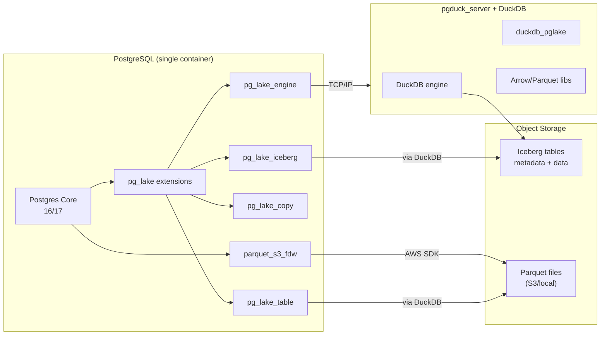

# Building a Postgres Lakehouse Image with pg_lake and parquet_s3_fdw

**Objective**: Master building a single PostgreSQL Docker image that includes both Snowflake-Labs' `pg_lake` (Iceberg + DuckDB-backed lakehouse access) and PGSpider's `parquet_s3_fdw` (FDW for Parquet on S3/local). When you need unified lakehouse operations and traditional FDW-based Parquet access in one container, this tutorial becomes your weapon of choice.

## Introduction

PostgreSQL has evolved beyond transactional workloads. Modern data engineering demands the ability to query object storage directly—whether that's Apache Iceberg tables managed by a lakehouse, or raw Parquet files sitting in S3 buckets. Two extensions solve different parts of this puzzle:

**pg_lake** (Snowflake-Labs) provides a lakehouse interface to PostgreSQL. It uses DuckDB under the hood via `pgduck_server` to execute queries against Iceberg tables and various file formats (Parquet, CSV, JSON, Geo formats) stored in object storage. Think of it as bringing lakehouse semantics directly into Postgres: you can create Iceberg tables, manage metadata, and perform COPY operations that leverage DuckDB's columnar engine.

**parquet_s3_fdw** (PGSpider) is a more traditional Foreign Data Wrapper that exposes Parquet files (local filesystem or S3) as foreign tables. It's a direct FDW implementation that gives you SQL access to Parquet data with predicate pushdown and row group pruning where supported.

Why combine them? Because real-world lakehouse operations aren't monolithic. You might use `pg_lake` for Iceberg-managed tables and lakehouse workflows, but still need `parquet_s3_fdw` for direct Parquet ingestion, legacy S3 layouts, or when you want the predictable behavior of a traditional FDW. Having both in a single image means one container can handle both patterns without juggling multiple Postgres instances.

This tutorial walks through building a production-ready Docker image that includes both extensions, properly configured and ready to query S3/MinIO-backed data.

## Conceptual Architecture

Understanding how these components fit together is crucial before diving into the build.

### Component Roles

**PostgreSQL Core**: The base database server. Both extensions integrate via the standard PostgreSQL extension mechanism (shared libraries loaded via `CREATE EXTENSION`).

**pg_lake Extensions**: The `pg_lake` project provides several related extensions:
- `pg_lake_iceberg`: Manages Apache Iceberg table metadata and operations
- `pg_lake_table`: Provides table-level abstractions for lakehouse data
- `pg_lake_copy`: Enables COPY operations to/from object storage formats
- `pg_lake_engine`: Core engine integration layer

**pgduck_server**: A separate server process that runs DuckDB and handles query execution. `pg_lake` extensions communicate with `pgduck_server` over a network protocol (typically localhost TCP). DuckDB does the heavy lifting for columnar operations, predicate pushdown, and format parsing.

**parquet_s3_fdw**: A Foreign Data Wrapper extension. It compiles to a shared library (`parquet_s3_fdw.so`) that Postgres loads when you `CREATE EXTENSION parquet_s3_fdw`. It uses the AWS SDK for C++ to access S3 and Apache Arrow/Parquet libraries to read Parquet files.

### How They Co-Exist



**Key Points**:
- Both extensions are independent PostgreSQL extensions; they don't conflict
- `pg_lake` delegates execution to DuckDB via `pgduck_server` (separate process)
- `parquet_s3_fdw` is a direct FDW that Postgres calls during query execution
- Both can query the same S3 buckets, but use different code paths
- `pg_lake` is optimized for Iceberg and lakehouse workflows
- `parquet_s3_fdw` is optimized for direct Parquet file access

## Choosing Base Image and Versions

### PostgreSQL Version

Both extensions support PostgreSQL 13–17. For this tutorial, we'll use **PostgreSQL 16** as a stable, well-supported version. PostgreSQL 17 is also viable, but 16 has broader ecosystem support at the time of writing.

**parquet_s3_fdw** explicitly supports PostgreSQL 13, 14, 15, 16, and 17. The build process uses `USE_PGXS=1`, which means it works with any Postgres installation that has development headers.

**pg_lake** targets modern Postgres versions (14+) and is actively developed. Check the repository's CI matrix for the latest supported versions.

### Base Image Choice

We'll use the official `postgres:16` Debian-based image. Why Debian over Alpine?

1. **C Library Compatibility**: Both extensions require substantial C++ dependencies (AWS SDK, Arrow, DuckDB). Debian's package ecosystem makes these easier to install.
2. **Build Tools**: Debian has mature `build-essential` packages with GCC, CMake, and other build tools.
3. **Runtime Libraries**: Debian images include standard C++ runtime libraries that these extensions expect.

Alpine *could* work, but you'd spend significant time resolving musl libc compatibility issues and building dependencies from source. For production, Debian is the pragmatic choice.

### Version Pinning

We'll pin to specific versions for reproducibility:
- **PostgreSQL**: `16` (or `postgres:16` tag)
- **pg_lake**: Latest main branch (or a specific release tag if available)
- **parquet_s3_fdw**: Latest release tag (e.g., `v1.1.1` or newer)

Always check the repositories for the latest stable releases before building.

## Dockerfile: Multi-Stage Build

Here's a complete, production-ready Dockerfile that builds both extensions and creates a single runtime image.

```dockerfile
# ============================================================================
# Builder stage: Compile both extensions
# ============================================================================
FROM postgres:16 AS builder

# Install build dependencies
RUN apt-get update && apt-get install -y \
    build-essential \
    cmake \
    git \
    pkg-config \
    libcurl4-openssl-dev \
    libssl-dev \
    libxml2-dev \
    libpq-dev \
    postgresql-server-dev-16 \
    libarrow-dev \
    libparquet-dev \
    libaws-cpp-sdk-core-dev \
    libaws-cpp-sdk-s3-dev \
    libzstd-dev \
    zlib1g-dev \
    && rm -rf /var/lib/apt/lists/*

# Set working directory for builds
WORKDIR /build

# ============================================================================
# Build pg_lake
# ============================================================================
RUN git clone --depth 1 https://github.com/Snowflake-Labs/pg_lake.git /build/pg_lake

WORKDIR /build/pg_lake

# Build pg_lake extensions
# Note: Adjust build flags based on pg_lake's actual Makefile/CMake setup
RUN make PG_CONFIG=/usr/bin/pg_config || \
    (echo "If pg_lake uses CMake, adjust this step" && \
     cmake . && make)

# Install pg_lake extensions to a staging directory
RUN mkdir -p /build/stage/pg_lake/lib \
    && mkdir -p /build/stage/pg_lake/share/extension \
    && find . -name "*.so" -exec cp {} /build/stage/pg_lake/lib/ \; \
    && find . -name "*.sql" -exec cp {} /build/stage/pg_lake/share/extension/ \; \
    && find . -name "*.control" -exec cp {} /build/stage/pg_lake/share/extension/ \;

# Build pgduck_server if it's a separate component
# Adjust path based on pg_lake's actual structure
RUN if [ -d "pgduck_server" ] || [ -f "pgduck_server/Makefile" ]; then \
        cd pgduck_server && \
        make && \
        mkdir -p /build/stage/pgduck_server/bin && \
        cp pgduck_server /build/stage/pgduck_server/bin/ || true; \
    fi

# ============================================================================
# Build parquet_s3_fdw
# ============================================================================
WORKDIR /build

RUN git clone --depth 1 --branch v1.1.1 https://github.com/pgspider/parquet_s3_fdw.git /build/parquet_s3_fdw || \
    git clone --depth 1 https://github.com/pgspider/parquet_s3_fdw.git /build/parquet_s3_fdw

WORKDIR /build/parquet_s3_fdw

# Build parquet_s3_fdw using PGXS
RUN USE_PGXS=1 make PG_CONFIG=/usr/bin/pg_config

# Install parquet_s3_fdw to staging directory
RUN mkdir -p /build/stage/parquet_fdw/lib \
    && mkdir -p /build/stage/parquet_fdw/share/extension \
    && cp src/parquet_s3_fdw.so /build/stage/parquet_fdw/lib/ \
    && cp parquet_s3_fdw.control /build/stage/parquet_fdw/share/extension/ \
    && cp parquet_s3_fdw--*.sql /build/stage/parquet_fdw/share/extension/ 2>/dev/null || true

# ============================================================================
# Runtime stage: Assemble final image
# ============================================================================
FROM postgres:16

# Install runtime dependencies
RUN apt-get update && apt-get install -y \
    libarrow1000 \
    libparquet1000 \
    libaws-cpp-sdk-core \
    libaws-cpp-sdk-s3 \
    libcurl4 \
    libssl3 \
    libzstd1 \
    zlib1g \
    && rm -rf /var/lib/apt/lists/*

# Copy pg_lake extensions
COPY --from=builder /build/stage/pg_lake/lib/*.so /usr/lib/postgresql/16/lib/
COPY --from=builder /build/stage/pg_lake/share/extension/* /usr/share/postgresql/16/extension/

# Copy parquet_s3_fdw extension
COPY --from=builder /build/stage/parquet_fdw/lib/*.so /usr/lib/postgresql/16/lib/
COPY --from=builder /build/stage/parquet_fdw/share/extension/* /usr/share/postgresql/16/extension/

# Copy pgduck_server if built
COPY --from=builder /build/stage/pgduck_server/bin/pgduck_server /usr/local/bin/pgduck_server 2>/dev/null || true
RUN chmod +x /usr/local/bin/pgduck_server 2>/dev/null || true

# Create directory for pgduck_server data/cache
RUN mkdir -p /var/lib/pgduck_server && chown postgres:postgres /var/lib/pgduck_server

# Copy custom entrypoint script
COPY docker-entrypoint-lakehouse.sh /usr/local/bin/
RUN chmod +x /usr/local/bin/docker-entrypoint-lakehouse.sh

# Set custom entrypoint
ENTRYPOINT ["docker-entrypoint-lakehouse.sh"]
CMD ["postgres"]
```

### Notes on the Dockerfile

1. **Builder Stage**: Installs all build dependencies, clones both repositories, and compiles the extensions. The exact build commands may need adjustment based on each project's current build system.

2. **Staging Directory**: We copy built artifacts to `/build/stage/` to make the runtime stage cleaner.

3. **Runtime Stage**: Only includes runtime libraries and the compiled extensions. The base `postgres:16` image already has Postgres installed.

4. **Extension Paths**: PostgreSQL 16 extensions go in:
   - Libraries: `/usr/lib/postgresql/16/lib/`
   - Extension files: `/usr/share/postgresql/16/extension/`

5. **pgduck_server**: If `pg_lake` includes `pgduck_server` as a separate binary, we copy it to `/usr/local/bin/`.

## Container Entrypoint and pgduck_server

`pg_lake` requires `pgduck_server` to be running before you can use the extensions. We need a custom entrypoint that starts `pgduck_server` in the background, then starts Postgres.

### docker-entrypoint-lakehouse.sh

```bash
#!/bin/bash
set -e

# Start pgduck_server in background if it exists
if [ -x /usr/local/bin/pgduck_server ]; then
    echo "Starting pgduck_server..."
    /usr/local/bin/pgduck_server \
        --memory_limit 2GB \
        --cache_dir /var/lib/pgduck_server/cache \
        --port 5433 \
        > /var/log/pgduck_server.log 2>&1 &
    
    PGDUCK_PID=$!
    echo "pgduck_server started with PID $PGDUCK_PID"
    
    # Wait a moment for pgduck_server to initialize
    sleep 2
fi

# Call the original Postgres entrypoint
exec /usr/local/bin/docker-entrypoint.sh "$@"
```

### Configuration Options

`pgduck_server` accepts several configuration flags:

- `--memory_limit`: Maximum memory for DuckDB (e.g., `2GB`, `4GB`)
- `--cache_dir`: Directory for DuckDB's cache files
- `--port`: TCP port for pg_lake to connect (default may vary; check pg_lake docs)
- `--s3_endpoint`: Custom S3 endpoint (for MinIO: `http://minio:9000`)
- `--s3_access_key_id`: S3 access key (or use environment variables)
- `--s3_secret_access_key`: S3 secret key (or use environment variables)

You can also configure DuckDB's S3 access via environment variables that DuckDB reads:
- `AWS_ACCESS_KEY_ID`
- `AWS_SECRET_ACCESS_KEY`
- `AWS_ENDPOINT` (for MinIO)

### Enhanced Entrypoint with Environment Variables

Here's a more robust version that reads environment variables:

```bash
#!/bin/bash
set -e

# Start pgduck_server if it exists
if [ -x /usr/local/bin/pgduck_server ]; then
    echo "Starting pgduck_server..."
    
    PGDUCK_ARGS="--memory_limit ${PGDUCK_MEMORY_LIMIT:-2GB}"
    PGDUCK_ARGS="$PGDUCK_ARGS --cache_dir ${PGDUCK_CACHE_DIR:-/var/lib/pgduck_server/cache}"
    PGDUCK_ARGS="$PGDUCK_ARGS --port ${PGDUCK_PORT:-5433}"
    
    if [ -n "$S3_ENDPOINT" ]; then
        PGDUCK_ARGS="$PGDUCK_ARGS --s3_endpoint $S3_ENDPOINT"
    fi
    
    /usr/local/bin/pgduck_server $PGDUCK_ARGS \
        > /var/log/pgduck_server.log 2>&1 &
    
    PGDUCK_PID=$!
    echo "pgduck_server started with PID $PGDUCK_PID"
    sleep 2
fi

# Call the original Postgres entrypoint
exec /usr/local/bin/docker-entrypoint.sh "$@"
```

Update the Dockerfile to copy this enhanced version:

```dockerfile
COPY docker-entrypoint-lakehouse.sh /usr/local/bin/
RUN chmod +x /usr/local/bin/docker-entrypoint-lakehouse.sh
```

## Initializing the Extensions

Once your container is running, you need to enable the extensions in your database. Here's how to set up both.

### Enable pg_lake Extensions

```sql
-- Connect to your database
\c your_database

-- Enable pg_lake with CASCADE to install dependencies
CREATE EXTENSION IF NOT EXISTS pg_lake CASCADE;

-- Verify installation
\dx pg_lake*
```

This should create:
- `pg_lake`
- `pg_lake_iceberg`
- `pg_lake_table`
- `pg_lake_copy`
- `pg_lake_engine`

### Configure pg_lake for S3/MinIO

Set the default location prefix for Iceberg tables:

```sql
-- For AWS S3
ALTER SYSTEM SET pg_lake_iceberg.default_location_prefix = 's3://your-bucket/iceberg/';

-- For MinIO (example)
ALTER SYSTEM SET pg_lake_iceberg.default_location_prefix = 's3://lakehouse/iceberg/';
SELECT pg_reload_conf();
```

Or set it per-session:

```sql
SET pg_lake_iceberg.default_location_prefix = 's3://your-bucket/iceberg/';
```

### Create a pg_lake Server

`pg_lake` uses a server definition to connect to `pgduck_server`:

```sql
-- Create server pointing to pgduck_server
CREATE SERVER pgduck_server
FOREIGN DATA WRAPPER pg_lake_engine
OPTIONS (
    host 'localhost',
    port '5433'
);
```

### Create an Example Iceberg Table

```sql
-- Create an Iceberg table
CREATE TABLE example_iceberg (
    id INTEGER,
    name TEXT,
    value DOUBLE PRECISION,
    created_at TIMESTAMP
) USING iceberg
LOCATION 's3://your-bucket/iceberg/example_table';

-- Insert some test data
INSERT INTO example_iceberg VALUES
    (1, 'Alice', 42.5, NOW()),
    (2, 'Bob', 99.9, NOW()),
    (3, 'Charlie', 3.14, NOW());

-- Query it
SELECT * FROM example_iceberg;
```

### Enable parquet_s3_fdw

```sql
-- Enable parquet_s3_fdw
CREATE EXTENSION IF NOT EXISTS parquet_s3_fdw;

-- Verify
\dx parquet_s3_fdw
```

### Configure parquet_s3_fdw for S3

Create a foreign server and user mapping:

```sql
-- Create foreign server for S3
CREATE SERVER s3_parquet_server
FOREIGN DATA WRAPPER parquet_s3_fdw
OPTIONS (
    endpoint 's3.amazonaws.com',
    -- For MinIO, use: endpoint 'http://minio:9000'
    use_ssl 'true',
    -- For MinIO, use: use_ssl 'false'
    region 'us-east-1'
);

-- Create user mapping with credentials
CREATE USER MAPPING FOR CURRENT_USER
SERVER s3_parquet_server
OPTIONS (
    access_key 'your-access-key',
    secret_key 'your-secret-key'
);

-- Or use IAM role (if running on AWS)
-- CREATE USER MAPPING FOR CURRENT_USER
-- SERVER s3_parquet_server
-- OPTIONS (iam_role 'arn:aws:iam::123456789012:role/PostgresS3Role');
```

### Create a Foreign Table on Parquet Files

```sql
-- Create foreign table pointing to a Parquet file in S3
CREATE FOREIGN TABLE example_parquet (
    id INTEGER,
    name TEXT,
    value DOUBLE PRECISION,
    created_at TIMESTAMP
)
SERVER s3_parquet_server
OPTIONS (
    filename 's3://your-bucket/data/example.parquet'
    -- For directory of Parquet files:
    -- dirname 's3://your-bucket/data/'
    -- sorted 'true'  -- if files are sorted
);

-- Query it
SELECT * FROM example_parquet WHERE id > 1;
```

## Example docker-compose.yml

Here's a complete `docker-compose.yml` that runs the custom image with proper configuration:

```yaml
version: '3.8'

services:
  postgres-lakehouse:
    build:
      context: .
      dockerfile: Dockerfile
    image: postgres-lakehouse:latest
    container_name: postgres-lakehouse
    environment:
      # Postgres configuration
      POSTGRES_USER: lakehouse
      POSTGRES_PASSWORD: change_me_in_production
      POSTGRES_DB: lakehouse_db
      
      # pgduck_server configuration
      PGDUCK_MEMORY_LIMIT: 4GB
      PGDUCK_CACHE_DIR: /var/lib/pgduck_server/cache
      PGDUCK_PORT: 5433
      
      # S3/MinIO credentials (for DuckDB)
      AWS_ACCESS_KEY_ID: minioadmin
      AWS_SECRET_ACCESS_KEY: minioadmin
      AWS_ENDPOINT: http://minio:9000
      AWS_REGION: us-east-1
      
      # For parquet_s3_fdw (if using environment-based auth)
      S3_ACCESS_KEY: minioadmin
      S3_SECRET_KEY: minioadmin
      S3_ENDPOINT: http://minio:9000
    ports:
      - "5432:5432"
    volumes:
      - postgres_data:/var/lib/postgresql/data
      - pgduck_cache:/var/lib/pgduck_server/cache
    networks:
      - lakehouse_net
    depends_on:
      - minio

  minio:
    image: minio/minio:latest
    container_name: minio
    environment:
      MINIO_ROOT_USER: minioadmin
      MINIO_ROOT_PASSWORD: minioadmin
    command: server /data --console-address ":9001"
    ports:
      - "9000:9000"
      - "9001:9001"
    volumes:
      - minio_data:/data
    networks:
      - lakehouse_net

volumes:
  postgres_data:
  pgduck_cache:
  minio_data:

networks:
  lakehouse_net:
    driver: bridge
```

### Usage

```bash
# Build the image
docker-compose build

# Start services
docker-compose up -d

# Check logs
docker-compose logs -f postgres-lakehouse

# Connect to Postgres
docker-compose exec postgres-lakehouse psql -U lakehouse -d lakehouse_db
```

## End-to-End Usage Examples

Let's walk through two concrete workflows that demonstrate both extensions working together.

### Workflow 1: pg_lake Iceberg Flow

This workflow creates an Iceberg table, inserts data, and uses `pg_lake_copy` to export to Parquet.

```sql
-- 1. Create an Iceberg table
CREATE TABLE sales_iceberg (
    sale_id INTEGER,
    product_name TEXT,
    quantity INTEGER,
    price DECIMAL(10,2),
    sale_date DATE
) USING iceberg
LOCATION 's3://lakehouse/iceberg/sales';

-- 2. Insert sample data
INSERT INTO sales_iceberg VALUES
    (1, 'Widget A', 10, 29.99, '2024-01-15'),
    (2, 'Widget B', 5, 49.99, '2024-01-16'),
    (3, 'Widget A', 20, 29.99, '2024-01-17'),
    (4, 'Widget C', 8, 19.99, '2024-01-18');

-- 3. Query the Iceberg table
SELECT 
    product_name,
    SUM(quantity) as total_quantity,
    SUM(price * quantity) as total_revenue
FROM sales_iceberg
GROUP BY product_name;

-- 4. Use pg_lake_copy to export to Parquet
-- (Syntax may vary based on pg_lake version)
COPY (
    SELECT * FROM sales_iceberg WHERE sale_date >= '2024-01-16'
) TO 's3://lakehouse/parquet/sales_export.parquet'
WITH (FORMAT parquet);

-- 5. Verify metadata was created
-- Iceberg metadata should be in s3://lakehouse/iceberg/sales/metadata/
```

### Workflow 2: parquet_s3_fdw Flow

Now let's query the Parquet file we just created using `parquet_s3_fdw`.

```sql
-- 1. Create foreign table on the exported Parquet file
CREATE FOREIGN TABLE sales_parquet_fdw (
    sale_id INTEGER,
    product_name TEXT,
    quantity INTEGER,
    price DECIMAL(10,2),
    sale_date DATE
)
SERVER s3_parquet_server
OPTIONS (
    filename 's3://lakehouse/parquet/sales_export.parquet'
);

-- 2. Query the foreign table
SELECT * FROM sales_parquet_fdw;

-- 3. Join Iceberg table with Parquet FDW table
SELECT 
    i.product_name,
    i.total_quantity as iceberg_qty,
    p.total_quantity as parquet_qty
FROM (
    SELECT product_name, SUM(quantity) as total_quantity
    FROM sales_iceberg
    GROUP BY product_name
) i
FULL OUTER JOIN (
    SELECT product_name, SUM(quantity) as total_quantity
    FROM sales_parquet_fdw
    GROUP BY product_name
) p USING (product_name);
```

### Workflow 3: Combined Analysis

Demonstrate using both extensions in a single analytical query:

```sql
-- Create a materialized view that combines both data sources
CREATE MATERIALIZED VIEW sales_combined AS
SELECT 
    'iceberg' as source,
    sale_id,
    product_name,
    quantity,
    price,
    sale_date
FROM sales_iceberg
UNION ALL
SELECT 
    'parquet_fdw' as source,
    sale_id,
    product_name,
    quantity,
    price,
    sale_date
FROM sales_parquet_fdw;

-- Refresh and query
REFRESH MATERIALIZED VIEW sales_combined;

SELECT 
    source,
    product_name,
    COUNT(*) as sale_count,
    SUM(quantity * price) as total_revenue
FROM sales_combined
GROUP BY source, product_name
ORDER BY total_revenue DESC;
```

## Performance & Operational Notes

### pg_lake Performance Characteristics

- **DuckDB Execution**: `pg_lake` delegates query execution to DuckDB via `pgduck_server`. This means:
  - DuckDB's columnar engine handles scans efficiently
  - Predicate pushdown works well for Iceberg and Parquet
  - DuckDB can cache metadata and data in memory
  - Network overhead between Postgres and `pgduck_server` exists but is typically minimal for analytical workloads

- **Iceberg Optimizations**: Iceberg's metadata layer enables:
  - Partition pruning based on metadata
  - File-level filtering without scanning all files
  - Time travel queries (querying historical snapshots)

- **Memory Usage**: `pgduck_server` can be memory-intensive for large scans. Monitor `PGDUCK_MEMORY_LIMIT` and adjust based on workload.

### parquet_s3_fdw Performance Characteristics

- **Direct FDW**: `parquet_s3_fdw` is a traditional FDW that Postgres calls directly:
  - No separate process overhead
  - Predicate pushdown depends on FDW implementation
  - Row group pruning may be supported (check release notes)
  - Less memory overhead than DuckDB for simple scans

- **S3 Access**: Uses AWS SDK for C++, which provides:
  - Efficient S3 byte-range requests
  - Connection pooling
  - Retry logic

### When to Use Which

**Use pg_lake when**:
- You need Iceberg table management (create, write, time travel)
- You want lakehouse semantics (COPY to/from multiple formats)
- You're doing complex analytical queries that benefit from DuckDB's optimizer
- You need to query multiple formats (Parquet, CSV, JSON) in one query

**Use parquet_s3_fdw when**:
- You have existing Parquet files and want direct FDW access
- You need predictable, traditional FDW behavior
- You're doing simple scans without complex analytics
- You want to minimize memory usage (no DuckDB overhead)

**Use both when**:
- You have a mixed workload (Iceberg tables + legacy Parquet files)
- You want to compare query performance between approaches
- You're migrating from FDW-based access to lakehouse patterns

## Troubleshooting Section

### Extension Not Found Errors

**Symptom**: `ERROR: could not open extension control file`

**Causes**:
- Extension files not copied to correct directory
- Wrong PostgreSQL version path (`/usr/share/postgresql/16/extension/` vs `15/`)

**Debug**:
```bash
# Check extension files exist
docker exec postgres-lakehouse ls -la /usr/share/postgresql/16/extension/ | grep -E "(pg_lake|parquet)"

# Check library files
docker exec postgres-lakehouse ls -la /usr/lib/postgresql/16/lib/ | grep -E "(pg_lake|parquet)"

# In Postgres, check available extensions
psql -c "SELECT * FROM pg_available_extensions WHERE name LIKE '%lake%' OR name LIKE '%parquet%';"
```

**Fix**: Verify Dockerfile COPY commands use correct paths for your Postgres version.

### Shared Library Not Found

**Symptom**: `ERROR: could not load library "/usr/lib/postgresql/16/lib/pg_lake.so": libarrow.so.1000: cannot open shared object file`

**Causes**: Missing runtime dependencies (Arrow, AWS SDK, etc.)

**Debug**:
```bash
# Check library dependencies
docker exec postgres-lakehouse ldd /usr/lib/postgresql/16/lib/pg_lake.so
docker exec postgres-lakehouse ldd /usr/lib/postgresql/16/lib/parquet_s3_fdw.so

# Check if libraries are installed
docker exec postgres-lakehouse dpkg -l | grep -E "(arrow|aws|parquet)"
```

**Fix**: Ensure runtime stage installs all required `-dev` packages' runtime counterparts (e.g., `libarrow-dev` → `libarrow1000`).

### pgduck_server Not Running

**Symptom**: `pg_lake` queries fail with connection errors

**Causes**: `pgduck_server` not started, wrong port, or network issues

**Debug**:
```bash
# Check if pgduck_server process is running
docker exec postgres-lakehouse ps aux | grep pgduck

# Check logs
docker exec postgres-lakehouse cat /var/log/pgduck_server.log

# Test connection from Postgres container
docker exec postgres-lakehouse nc -zv localhost 5433
```

**Fix**: Verify entrypoint script starts `pgduck_server` and check `PGDUCK_PORT` matches server definition in Postgres.

### S3 Credential Issues

**Symptom**: Queries fail with "Access Denied" or "Invalid credentials"

**Causes**: Wrong credentials, endpoint misconfiguration, or IAM permissions

**Debug**:
```sql
-- For parquet_s3_fdw, test server connection
SELECT * FROM s3_parquet_server OPTIONS;

-- Check user mapping
SELECT * FROM pg_user_mappings WHERE srvname = 's3_parquet_server';
```

**Fix**: 
- Verify `AWS_ACCESS_KEY_ID` and `AWS_SECRET_ACCESS_KEY` environment variables
- For MinIO, ensure `AWS_ENDPOINT` is set and `use_ssl 'false'` in server options
- Check S3 bucket policies and IAM roles

### Build Failures

**Symptom**: Docker build fails during `make` step

**Causes**: Missing build dependencies, version incompatibilities, or build system changes

**Debug**:
```bash
# Build with verbose output
docker build --progress=plain --no-cache -t postgres-lakehouse .

# Check build logs for specific errors
docker build 2>&1 | grep -A 10 "error\|Error\|ERROR"
```

**Fix**:
- Update Dockerfile with latest build dependencies from each project's README
- Check if projects have moved to CMake (adjust build commands)
- Verify Postgres version compatibility

### Performance Issues

**Symptom**: Queries are slow or time out

**Causes**: Insufficient memory, network latency, or missing indexes/partitions

**Debug**:
```sql
-- Check pgduck_server memory usage (if exposed)
-- Monitor Postgres connections
SELECT count(*) FROM pg_stat_activity;

-- Check query plans
EXPLAIN ANALYZE SELECT * FROM your_table;
```

**Fix**:
- Increase `PGDUCK_MEMORY_LIMIT` for large scans
- Ensure S3 endpoint is close (same region/VPC)
- Use Iceberg partitioning for large tables
- Consider materialized views for frequently queried data

## Further Reading

- **[pg_lake Repository](https://github.com/Snowflake-Labs/pg_lake)**: Official repository with documentation, examples, and issue tracker
- **[parquet_s3_fdw Repository](https://github.com/pgspider/parquet_s3_fdw)**: Official repository with build instructions and usage examples
- **[PostgreSQL Foreign Data Wrappers](https://www.postgresql.org/docs/current/postgres-fdw.html)**: Official documentation on FDW architecture
- **[Apache Iceberg Specification](https://iceberg.apache.org/spec/)**: Understanding Iceberg table format
- **[DuckDB Documentation](https://duckdb.org/docs/)**: DuckDB's query engine and S3 integration

## See Also

- **[parquet_s3_fdw with Multiple Backends](../database-data-engineering/parquet-s3-fdw.md)** - Detailed guide on using parquet_s3_fdw with local, MinIO, Vast, and AWS
- **[PostgreSQL Foreign Data Wrappers](../../best-practices/postgres/fdw-postgres.md)** - Best practices for FDW design and usage
- **[Docker & Compose](../../best-practices/docker-infrastructure/docker-and-compose.md)** - Production containerization patterns

---

*This tutorial provides the complete machinery for building a unified Postgres lakehouse image. The patterns scale from development to production, from simple Parquet queries to complex Iceberg-managed lakehouse operations.*

