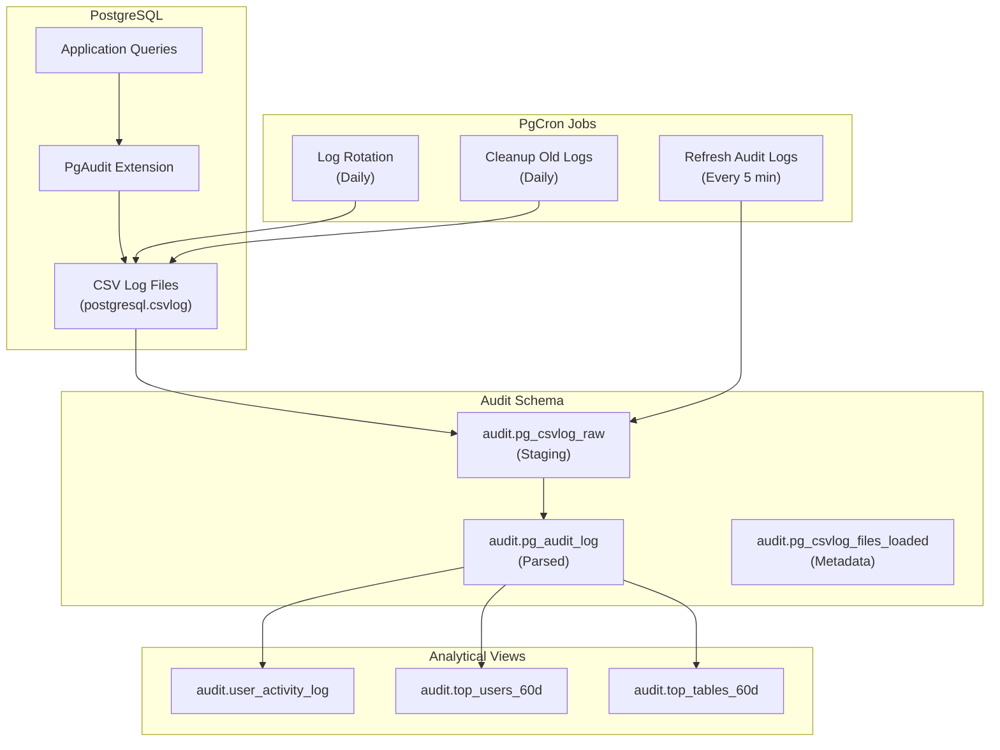

# Auditing PostgreSQL with PgAudit and PgCron: Log Rotation, Top Users/Tables, and Activity Log Views

**Objective**: Master production-grade PostgreSQL auditing with PgAudit and PgCron. When you need comprehensive audit trails, automated log rotation, and analytical views of database activity—this tutorial provides a complete, reproducible setup.

## Introduction

PostgreSQL auditing requires structured logging, automated maintenance, and analytical capabilities. PgAudit provides detailed audit logs of user actions, while PgCron enables scheduled tasks for log rotation and data refresh. This tutorial combines both to create a complete auditing solution.

**What You'll Build**:
- PgAudit logging of all user actions
- CSV log rotation with 60-day retention
- Automated ingestion of audit logs into database tables
- Analytical views: activity log, top users, top tables
- Scheduled maintenance via PgCron

**Prerequisites**:
- PostgreSQL 14+ (tested on 14, 15, 16)
- Superuser access to PostgreSQL
- Ability to edit `postgresql.conf` and restart PostgreSQL
- PgAudit and PgCron extensions installed

## High-Level Architecture

### System Overview



### Data Flow

1. **Application queries** → PgAudit intercepts and logs to CSV
2. **CSV logs** → Ingested into `audit.pg_csvlog_raw` via refresh function
3. **Raw logs** → Parsed into `audit.pg_audit_log` (structured format)
4. **Parsed logs** → Exposed via views (activity, top users, top tables)
5. **PgCron** → Automates rotation, ingestion, and cleanup

## Prerequisites & Environment

### PostgreSQL Version

This tutorial assumes **PostgreSQL 14+**. PgAudit and PgCron are available for:
- PostgreSQL 12, 13, 14, 15, 16
- Tested on PostgreSQL 14 and 15

### Installing Extensions

**Debian/Ubuntu**:

```bash
# Install PgAudit
sudo apt-get install postgresql-14-pgaudit

# Install PgCron
sudo apt-get install postgresql-14-cron

# Or for PostgreSQL 15
sudo apt-get install postgresql-15-pgaudit postgresql-15-cron
```

**Red Hat/CentOS**:

```bash
# Install from PGDG repository
sudo yum install pgaudit14_14
sudo yum install pg_cron_14
```

**From Source** (if packages unavailable):

```bash
# PgAudit
git clone https://github.com/pgaudit/pgaudit.git
cd pgaudit
make USE_PGXS=1
sudo make USE_PGXS=1 install

# PgCron
git clone https://github.com/citusdata/pg_cron.git
cd pg_cron
make
sudo make install
```

### Required Permissions

You need:
- **Superuser access** to PostgreSQL
- **File system access** to PostgreSQL log directory
- **Ability to restart** PostgreSQL service
- **Edit access** to `postgresql.conf` and `pg_hba.conf`

### Verify Extensions Available

```sql
-- Connect as superuser
psql -U postgres -d postgres

-- Check if extensions are available
SELECT name, default_version FROM pg_available_extensions 
WHERE name IN ('pgaudit', 'pg_cron');
```

Expected output:
```
   name   | default_version
----------+-----------------
 pgaudit  | 1.7
 pg_cron  | 1.6
```

## Configuring Postgres for PgAudit

### Step 1: Enable PgAudit in postgresql.conf

**Locate postgresql.conf**:

```bash
# Find config file location
sudo -u postgres psql -c "SHOW config_file;"
```

**Edit postgresql.conf**:

```bash
sudo nano /etc/postgresql/14/main/postgresql.conf
# Or wherever your config file is located
```

**Add PgAudit Configuration**:

```ini
# postgresql.conf

# Enable PgAudit extension
shared_preload_libraries = 'pgaudit,pg_cron'

# PgAudit Settings
pgaudit.log = 'all'                    # Log all statements
pgaudit.log_catalog = off              # Don't log system catalog queries
pgaudit.log_client = on                 # Log to client (optional, for debugging)
pgaudit.log_level = log                # Log level
pgaudit.log_parameter = on              # Include query parameters
pgaudit.log_statement_once = off       # Log each statement
pgaudit.log_relation = on              # Log relation access
pgaudit.log_rows = off                 # Don't log row data (performance)

# Restrict auditing to specific role (optional)
# pgaudit.role = 'audited'
```

**Configuration Options Explained**:

- **`pgaudit.log = 'all'`**: Logs all DDL, DML, and function calls
  - Alternatives: `'ddl'`, `'dml'`, `'read'`, `'write'`, `'function'`
  - `'all'` provides comprehensive auditing but has performance overhead
- **`pgaudit.log_parameter = on`**: Includes query parameters in logs (useful for debugging, but may log sensitive data)
- **`pgaudit.log_relation = on`**: Logs which tables/views are accessed
- **`pgaudit.role`**: If set, only actions by users with this role are audited

### Step 2: Configure CSV Logging

**Add CSV Logging Configuration**:

```ini
# CSV Logging for PgAudit
log_destination = 'csvlog'
logging_collector = on
log_directory = 'log'                  # Relative to data directory
log_filename = 'postgresql-%Y-%m-%d_%H%M%S.csv'
log_rotation_age = 1d                  # Rotate daily
log_rotation_size = 0                  # Disable size-based rotation
log_truncate_on_rotation = on           # Overwrite if filename exists
log_line_prefix = '%t [%p]: [%l-1] user=%u,db=%d,app=%a,client=%h '

# Log all statements (for PgAudit)
log_statement = 'none'                 # PgAudit handles statement logging
log_min_duration_statement = -1        # Log all statements (via PgAudit)
```

**Key Settings**:
- **`log_destination = 'csvlog'`**: Enables CSV format (required for parsing)
- **`log_directory`**: Where log files are written (relative to `$PGDATA`)
- **`log_filename`**: Pattern with date/time for rotation
- **`log_rotation_age = 1d`**: Rotate logs daily
- **`log_line_prefix`**: Optional prefix (PgAudit uses CSV fields, but prefix helps with general logs)

### Step 3: Restart PostgreSQL

```bash
# Restart PostgreSQL
sudo systemctl restart postgresql

# Or
sudo service postgresql restart

# Verify it started
sudo systemctl status postgresql
```

### Step 4: Create PgAudit Extension

```sql
-- Connect as superuser
psql -U postgres -d postgres

-- Create extension
CREATE EXTENSION IF NOT EXISTS pgaudit;

-- Verify
\dx pgaudit
```

### Step 5: Configure Audited Role (Optional)

**Create Audited Role**:

```sql
-- Create role for audited users
CREATE ROLE audited;

-- Grant to users you want to audit
GRANT audited TO app_user;
GRANT audited TO admin_user;

-- Set in postgresql.conf or per-database
ALTER DATABASE mydb SET pgaudit.role = 'audited';
```

**Per-Database Configuration**:

```sql
-- Audit only specific database
ALTER DATABASE production SET pgaudit.role = 'audited';
```

**Note**: If `pgaudit.role` is not set, all users are audited (when `pgaudit.log = 'all'`).

### Step 6: Focus on Public Schema

PgAudit logs all actions. We'll filter to `public` schema at query time:

```sql
-- Strategy: Log everything, filter in views
-- This allows flexibility to audit other schemas later
```

**Filtering Strategy**:
- PgAudit logs all schema access
- Views filter `WHERE schema_name = 'public'`
- Raw audit log retains all data for compliance

## Configuring PgCron for Scheduled Jobs

### Step 1: Enable PgCron in postgresql.conf

**Already Added** (from PgAudit step):

```ini
shared_preload_libraries = 'pgaudit,pg_cron'
```

**Additional PgCron Settings** (optional):

```ini
# PgCron Settings
cron.database_name = 'postgres'        # Database where pg_cron extension lives
```

### Step 2: Restart PostgreSQL

```bash
sudo systemctl restart postgresql
```

### Step 3: Create PgCron Extension

```sql
-- Connect as superuser
psql -U postgres -d postgres

-- Create extension
CREATE EXTENSION IF NOT EXISTS pg_cron;

-- Verify
\dx pg_cron
```

### Step 4: Security Considerations

**PgCron Security**:
- Jobs run as the **database user** that created them
- Use **superuser** (`postgres`) for system-level tasks (log rotation)
- Use **dedicated admin role** for application-level tasks
- Jobs can execute **any SQL** the user has permission for

**Best Practice**:

```sql
-- Create dedicated role for audit maintenance
CREATE ROLE audit_admin WITH LOGIN;
GRANT USAGE ON SCHEMA audit TO audit_admin;
GRANT ALL ON ALL TABLES IN SCHEMA audit TO audit_admin;

-- Jobs created by audit_admin run with its permissions
```

## Log Rotation Every 60 Days via PgCron

### Strategy: Daily Rotation with 60-Day Retention

**Approach**:
- **Rotate logs daily** using `pg_rotate_logfile()`
- **Retain 60 days** via OS-level cleanup or PostgreSQL function
- **PgCron schedules** both rotation and cleanup

**Why This Approach**:
- Daily rotation prevents log files from growing too large
- 60-day retention balances storage with compliance needs
- OS-level cleanup is simpler and more reliable than PostgreSQL file operations

### Implementation

**Step 1: Create Rotation Function**

```sql
-- Create audit schema
CREATE SCHEMA IF NOT EXISTS audit AUTHORIZATION postgres;

-- Function to rotate logs and clean up old files
CREATE OR REPLACE FUNCTION audit.rotate_audit_logs()
RETURNS void
LANGUAGE plpgsql
SECURITY DEFINER
AS $$
DECLARE
    log_dir text;
    log_file text;
    file_age interval;
    cutoff_date timestamptz;
    deleted_count int := 0;
BEGIN
    -- Get log directory
    SELECT setting INTO log_dir
    FROM pg_settings
    WHERE name = 'log_directory';
    
    -- Resolve to absolute path (relative to data directory)
    IF log_dir !~ '^/' THEN
        SELECT setting || '/' || log_dir INTO log_dir
        FROM pg_settings
        WHERE name = 'data_directory';
    END IF;
    
    -- Rotate current log file
    PERFORM pg_rotate_logfile();
    
    -- Calculate cutoff date (60 days ago)
    cutoff_date := now() - interval '60 days';
    
    -- Clean up old CSV log files
    FOR log_file IN
        SELECT filename
        FROM pg_ls_dir(log_dir) AS filename
        WHERE filename ~ '^postgresql-.*\.csv$'
    LOOP
        -- Get file modification time
        SELECT (pg_stat_file(log_dir || '/' || log_file)).modification
        INTO file_age;
        
        -- Delete if older than 60 days
        IF (pg_stat_file(log_dir || '/' || log_file)).modification < cutoff_date THEN
            PERFORM pg_read_file(log_dir || '/' || log_file, 0, 1); -- Verify readable
            -- Note: PostgreSQL cannot delete files directly
            -- Use OS-level logrotate or external script
            RAISE NOTICE 'File % is older than 60 days and should be deleted', log_file;
            deleted_count := deleted_count + 1;
        END IF;
    END LOOP;
    
    RAISE NOTICE 'Rotated logs. Found % files older than 60 days (use OS cleanup)', deleted_count;
END;
$$;
```

**Note**: PostgreSQL cannot delete files directly. We'll use OS-level cleanup.

**Step 2: OS-Level Log Cleanup (Recommended)**

**Create logrotate config**:

```bash
# /etc/logrotate.d/postgresql-audit
/var/lib/postgresql/14/main/log/postgresql-*.csv {
    daily
    rotate 60
    compress
    delaycompress
    missingok
    notifempty
    create 0640 postgres postgres
    sharedscripts
    postrotate
        /bin/systemctl reload postgresql > /dev/null 2>&1 || true
    endscript
}
```

**Or use cron job**:

```bash
# Add to crontab (as postgres user)
sudo -u postgres crontab -e

# Delete CSV logs older than 60 days
0 3 * * * find /var/lib/postgresql/14/main/log -name "postgresql-*.csv" -mtime +60 -delete
```

**Step 3: PgCron Job for Daily Rotation**

```sql
-- Schedule daily log rotation at 3 AM
SELECT cron.schedule(
    'rotate_audit_logs',
    '0 3 * * *',  -- Daily at 03:00
    $$SELECT audit.rotate_audit_logs();$$
);
```

**Verify Job**:

```sql
-- List all cron jobs
SELECT * FROM cron.job;

-- Check job details
SELECT * FROM cron.job WHERE jobname = 'rotate_audit_logs';
```

## Creating an Audit Schema and Base Tables

### Step 1: Create Audit Schema

```sql
-- Create dedicated audit schema
CREATE SCHEMA IF NOT EXISTS audit AUTHORIZATION postgres;

-- Grant access to audit_admin role (if created)
GRANT USAGE ON SCHEMA audit TO audit_admin;
```

### Step 2: Create Raw CSV Log Table

**Table for Staging CSV Logs**:

```sql
-- Table to load raw CSV log rows
CREATE TABLE IF NOT EXISTS audit.pg_csvlog_raw (
    log_time            timestamptz,
    user_name           text,
    database_name       text,
    process_id         integer,
    connection_from     text,
    session_id          text,
    session_line_num    bigint,
    command_tag         text,
    session_start_time  timestamptz,
    virtual_transaction_id text,
    transaction_id      bigint,
    error_severity      text,
    sql_state_code      text,
    message             text,
    detail              text,
    hint                text,
    internal_query      text,
    internal_query_pos  integer,
    context             text,
    query               text,
    query_pos           integer,
    location            text,
    application_name    text,
    loaded_at           timestamptz DEFAULT now()
);

-- Create index for performance
CREATE INDEX IF NOT EXISTS idx_pg_csvlog_raw_log_time 
ON audit.pg_csvlog_raw(log_time);

CREATE INDEX IF NOT EXISTS idx_pg_csvlog_raw_message 
ON audit.pg_csvlog_raw(message) 
WHERE message IS NOT NULL;
```

**Column Mapping**:
- Matches standard PostgreSQL CSV log format
- `message` column contains PgAudit entries (prefixed with `AUDIT:`)
- `query` column contains SQL statements
- `loaded_at` tracks when row was ingested

### Step 3: Create Parsed Audit Log Table

**Table for Structured Audit Data**:

```sql
-- Parsed PgAudit log entries
CREATE TABLE IF NOT EXISTS audit.pg_audit_log (
    log_time            timestamptz NOT NULL,
    user_name           text NOT NULL,
    database_name       text NOT NULL,
    schema_name         text,
    object_name         text,
    object_type         text,  -- TABLE, VIEW, FUNCTION, etc.
    action              text,  -- READ, WRITE, DDL, FUNCTION, etc.
    statement           text,
    command_tag         text,
    client_addr         inet,
    application_name    text,
    session_id          text,
    transaction_id      bigint,
    error_severity      text,
    parsed_at           timestamptz DEFAULT now()
);

-- Indexes for common queries
CREATE INDEX IF NOT EXISTS idx_pg_audit_log_log_time 
ON audit.pg_audit_log(log_time);

CREATE INDEX IF NOT EXISTS idx_pg_audit_log_user_name 
ON audit.pg_audit_log(user_name);

CREATE INDEX IF NOT EXISTS idx_pg_audit_log_schema_object 
ON audit.pg_audit_log(schema_name, object_name) 
WHERE schema_name IS NOT NULL AND object_name IS NOT NULL;

-- Partition by month for large volumes (optional)
-- CREATE TABLE audit.pg_audit_log_2024_01 PARTITION OF audit.pg_audit_log
-- FOR VALUES FROM ('2024-01-01') TO ('2024-02-01');
```

### Step 4: Create Metadata Table

**Track Loaded Files**:

```sql
-- Track which CSV log files have been loaded
CREATE TABLE IF NOT EXISTS audit.pg_csvlog_files_loaded (
    filename            text PRIMARY KEY,
    file_size           bigint,
    file_modification   timestamptz,
    rows_loaded         bigint DEFAULT 0,
    loaded_at           timestamptz NOT NULL DEFAULT now(),
    last_checked       timestamptz DEFAULT now()
);

-- Index for lookups
CREATE INDEX IF NOT EXISTS idx_pg_csvlog_files_loaded_loaded_at 
ON audit.pg_csvlog_files_loaded(loaded_at);
```

## Refresh Function to Ingest CSV Logs

### Complete Refresh Function

```sql
-- Function to refresh audit logs from CSV files
CREATE OR REPLACE FUNCTION audit.refresh_pgaudit_logs()
RETURNS TABLE(
    files_processed int,
    rows_loaded int,
    rows_parsed int
)
LANGUAGE plpgsql
SECURITY DEFINER
AS $$
DECLARE
    log_dir text;
    data_dir text;
    log_file text;
    file_path text;
    file_info record;
    rows_copied bigint;
    rows_parsed_count bigint := 0;
    files_processed_count int := 0;
    total_rows_loaded bigint := 0;
BEGIN
    -- Get log and data directories
    SELECT setting INTO log_dir FROM pg_settings WHERE name = 'log_directory';
    SELECT setting INTO data_dir FROM pg_settings WHERE name = 'data_directory';
    
    -- Resolve absolute path
    IF log_dir !~ '^/' THEN
        file_path := data_dir || '/' || log_dir;
    ELSE
        file_path := log_dir;
    END IF;
    
    -- Loop through CSV log files
    FOR log_file IN
        SELECT filename
        FROM pg_ls_dir(file_path) AS filename
        WHERE filename ~ '^postgresql-.*\.csv$'
        ORDER BY filename
    LOOP
        -- Skip if already loaded
        IF EXISTS (
            SELECT 1 FROM audit.pg_csvlog_files_loaded 
            WHERE filename = log_file
        ) THEN
            CONTINUE;
        END IF;
        
        -- Get file info
        SELECT * INTO file_info
        FROM pg_stat_file(file_path || '/' || log_file);
        
        BEGIN
            -- Load CSV file into staging table
            EXECUTE format(
                'COPY audit.pg_csvlog_raw (
                    log_time, user_name, database_name, process_id,
                    connection_from, session_id, session_line_num,
                    command_tag, session_start_time, virtual_transaction_id,
                    transaction_id, error_severity, sql_state_code,
                    message, detail, hint, internal_query, internal_query_pos,
                    context, query, query_pos, location, application_name
                ) FROM %L WITH (FORMAT csv, HEADER false, DELIMITER E''\t'')',
                file_path || '/' || log_file
            );
            
            GET DIAGNOSTICS rows_copied = ROW_COUNT;
            
            -- Mark file as loaded
            INSERT INTO audit.pg_csvlog_files_loaded (
                filename, file_size, file_modification, rows_loaded
            ) VALUES (
                log_file, file_info.size, file_info.modification, rows_copied
            )
            ON CONFLICT (filename) 
            DO UPDATE SET 
                rows_loaded = EXCLUDED.rows_loaded,
                last_checked = now();
            
            total_rows_loaded := total_rows_loaded + rows_copied;
            files_processed_count := files_processed_count + 1;
            
        EXCEPTION WHEN OTHERS THEN
            RAISE WARNING 'Error loading file %: %', log_file, SQLERRM;
            CONTINUE;
        END;
    END LOOP;
    
    -- Parse PgAudit entries from raw logs
    INSERT INTO audit.pg_audit_log (
        log_time, user_name, database_name, schema_name, object_name,
        object_type, action, statement, command_tag, client_addr,
        application_name, session_id, transaction_id, error_severity
    )
    SELECT DISTINCT ON (log_time, user_name, database_name, message)
        r.log_time,
        r.user_name,
        r.database_name,
        -- Parse schema and object from PgAudit message
        CASE 
            WHEN r.message ~ 'AUDIT:.*schema=([^,]+)' THEN
                (regexp_match(r.message, 'schema=([^,]+)'))[1]
            ELSE NULL
        END AS schema_name,
        CASE 
            WHEN r.message ~ 'AUDIT:.*table=([^,]+)' THEN
                (regexp_match(r.message, 'table=([^,]+)'))[1]
            WHEN r.message ~ 'AUDIT:.*relation=([^,]+)' THEN
                (regexp_match(r.message, 'relation=([^,]+)'))[1]
            ELSE NULL
        END AS object_name,
        CASE 
            WHEN r.message ~ 'AUDIT:.*object_type=([^,]+)' THEN
                (regexp_match(r.message, 'object_type=([^,]+)'))[1]
            ELSE NULL
        END AS object_type,
        -- Extract action type
        CASE 
            WHEN r.message ~ 'AUDIT:.*,([A-Z]+),' THEN
                (regexp_match(r.message, 'AUDIT:.*,([A-Z]+),'))[1]
            WHEN r.message ~ 'AUDIT: ([A-Z]+)' THEN
                (regexp_match(r.message, 'AUDIT: ([A-Z]+)'))[1]
            ELSE 'UNKNOWN'
        END AS action,
        COALESCE(r.query, r.message) AS statement,
        r.command_tag,
        -- Parse IP address from connection_from
        CASE 
            WHEN r.connection_from ~ '^[0-9.]+$' THEN
                r.connection_from::inet
            ELSE NULL
        END AS client_addr,
        r.application_name,
        r.session_id,
        r.transaction_id,
        r.error_severity
    FROM audit.pg_csvlog_raw r
    WHERE r.message LIKE 'AUDIT:%'
        AND r.log_time > (
            SELECT COALESCE(MAX(log_time), '1970-01-01'::timestamptz)
            FROM audit.pg_audit_log
        )
    ORDER BY r.log_time, r.user_name, r.database_name, r.message;
    
    GET DIAGNOSTICS rows_parsed_count = ROW_COUNT;
    
    -- Return summary
    RETURN QUERY SELECT 
        files_processed_count,
        total_rows_loaded,
        rows_parsed_count;
END;
$$;
```

### Function Explanation

**What It Does**:
1. **Scans log directory** for CSV files matching pattern
2. **Skips already loaded** files (tracked in metadata table)
3. **Loads new files** into `audit.pg_csvlog_raw` using `COPY`
4. **Parses PgAudit entries** from `message` column using regex
5. **Inserts parsed data** into `audit.pg_audit_log`
6. **Returns summary** of files processed and rows loaded

**Security Notes**:
- Uses `SECURITY DEFINER` to run with superuser privileges
- Requires `pg_read_server_files` role (PostgreSQL 15+) or superuser
- File paths are validated to prevent directory traversal

### Grant Permissions

```sql
-- Grant execute to audit_admin (if using dedicated role)
GRANT EXECUTE ON FUNCTION audit.refresh_pgaudit_logs() TO audit_admin;

-- Or grant to specific users
GRANT EXECUTE ON FUNCTION audit.refresh_pgaudit_logs() TO monitoring_user;
```

## PgCron Job for Ingest/Refresh

### Schedule Refresh Job

```sql
-- Schedule refresh every 5 minutes
SELECT cron.schedule(
    'refresh_pgaudit_logs',
    '*/5 * * * *',  -- Every 5 minutes
    $$SELECT audit.refresh_pgaudit_logs();$$
);
```

**Schedule Options**:
- **`*/5 * * * *`**: Every 5 minutes (high frequency, good for real-time monitoring)
- **`*/15 * * * *`**: Every 15 minutes (balanced)
- **`0 * * * *`**: Every hour (lower overhead)
- **`0 */6 * * *`**: Every 6 hours (low frequency, batch processing)

**Trade-offs**:
- **Higher frequency**: More up-to-date data, more database load
- **Lower frequency**: Less load, but delayed visibility

### Verify Job

```sql
-- Check scheduled jobs
SELECT 
    jobid,
    schedule,
    command,
    nodename,
    nodeport,
    database,
    username,
    active
FROM cron.job
WHERE jobname = 'refresh_pgaudit_logs';
```

### Manual Refresh

```sql
-- Run refresh manually
SELECT * FROM audit.refresh_pgaudit_logs();

-- Check results
SELECT 
    files_processed,
    rows_loaded,
    rows_parsed
FROM audit.refresh_pgaudit_logs();
```

## Views for Activity Log, Top Users, Top Tables

### Activity Log View

**Complete User Activity View**:

```sql
-- Activity log view (public schema only)
CREATE OR REPLACE VIEW audit.user_activity_log AS
SELECT
    log_time,
    user_name,
    database_name,
    schema_name,
    object_name,
    object_type,
    action,
    statement,
    command_tag,
    client_addr,
    application_name,
    session_id,
    transaction_id,
    error_severity
FROM audit.pg_audit_log
WHERE schema_name = 'public'
ORDER BY log_time DESC;

-- Grant access
GRANT SELECT ON audit.user_activity_log TO monitoring_user;
```

**Usage**:

```sql
-- Recent activity
SELECT * FROM audit.user_activity_log LIMIT 50;

-- Activity for specific user
SELECT * FROM audit.user_activity_log 
WHERE user_name = 'app_user'
ORDER BY log_time DESC
LIMIT 100;

-- Activity for specific table
SELECT * FROM audit.user_activity_log 
WHERE object_name = 'users'
ORDER BY log_time DESC;
```

### Top Users View

**Top Users by Activity (60 Days)**:

```sql
-- Top users in public schema over last 60 days
CREATE OR REPLACE VIEW audit.top_users_60d AS
SELECT
    user_name,
    database_name,
    COUNT(*) AS total_actions,
    COUNT(DISTINCT object_name) AS tables_accessed,
    COUNT(DISTINCT DATE(log_time)) AS active_days,
    MIN(log_time) AS first_seen,
    MAX(log_time) AS last_seen,
    COUNT(*) FILTER (WHERE action = 'READ') AS read_actions,
    COUNT(*) FILTER (WHERE action = 'WRITE') AS write_actions,
    COUNT(*) FILTER (WHERE action = 'DDL') AS ddl_actions
FROM audit.pg_audit_log
WHERE schema_name = 'public'
    AND log_time >= now() - interval '60 days'
GROUP BY user_name, database_name
ORDER BY total_actions DESC;

-- Grant access
GRANT SELECT ON audit.top_users_60d TO monitoring_user;
```

**Usage**:

```sql
-- Top 10 most active users
SELECT * FROM audit.top_users_60d LIMIT 10;

-- Users with most write operations
SELECT * FROM audit.top_users_60d 
ORDER BY write_actions DESC 
LIMIT 10;
```

### Top Tables View

**Top Tables by Activity (60 Days)**:

```sql
-- Top tables in public schema over last 60 days
CREATE OR REPLACE VIEW audit.top_tables_60d AS
SELECT
    schema_name,
    object_name AS table_name,
    object_type,
    COUNT(*) AS total_accesses,
    COUNT(DISTINCT user_name) AS unique_users,
    COUNT(DISTINCT DATE(log_time)) AS active_days,
    MIN(log_time) AS first_seen,
    MAX(log_time) AS last_seen,
    COUNT(*) FILTER (WHERE action = 'READ') AS read_accesses,
    COUNT(*) FILTER (WHERE action = 'WRITE') AS write_accesses,
    COUNT(*) FILTER (WHERE action = 'DDL') AS ddl_accesses
FROM audit.pg_audit_log
WHERE schema_name = 'public'
    AND object_type IN ('TABLE', 'VIEW')
    AND log_time >= now() - interval '60 days'
GROUP BY schema_name, object_name, object_type
ORDER BY total_accesses DESC;

-- Grant access
GRANT SELECT ON audit.top_tables_60d TO monitoring_user;
```

**Usage**:

```sql
-- Top 10 most accessed tables
SELECT * FROM audit.top_tables_60d LIMIT 10;

-- Tables with most write operations
SELECT * FROM audit.top_tables_60d 
ORDER BY write_accesses DESC 
LIMIT 10;
```

### Materialized Views (Optional)

**For Better Performance**:

```sql
-- Materialized view for top users
CREATE MATERIALIZED VIEW IF NOT EXISTS audit.top_users_60d_mv AS
SELECT * FROM audit.top_users_60d;

-- Create index
CREATE INDEX IF NOT EXISTS idx_top_users_60d_mv_user_name 
ON audit.top_users_60d_mv(user_name);

-- Materialized view for top tables
CREATE MATERIALIZED VIEW IF NOT EXISTS audit.top_tables_60d_mv AS
SELECT * FROM audit.top_tables_60d;

-- Create index
CREATE INDEX IF NOT EXISTS idx_top_tables_60d_mv_table_name 
ON audit.top_tables_60d_mv(table_name);

-- Refresh function
CREATE OR REPLACE FUNCTION audit.refresh_top_views()
RETURNS void
LANGUAGE plpgsql
AS $$
BEGIN
    REFRESH MATERIALIZED VIEW CONCURRENTLY audit.top_users_60d_mv;
    REFRESH MATERIALIZED VIEW CONCURRENTLY audit.top_tables_60d_mv;
END;
$$;

-- Schedule nightly refresh
SELECT cron.schedule(
    'refresh_top_views',
    '0 2 * * *',  -- Daily at 02:00
    $$SELECT audit.refresh_top_views();$$
);
```

## Sanity Checks & Example Queries

### Step 1: Generate Test Activity

```sql
-- Connect as test user
psql -U app_user -d mydb

-- Create test table
CREATE TABLE IF NOT EXISTS public.test_audit (
    id SERIAL PRIMARY KEY,
    name TEXT,
    created_at TIMESTAMPTZ DEFAULT now()
);

-- Generate activity
INSERT INTO public.test_audit (name) VALUES ('test1'), ('test2');
SELECT * FROM public.test_audit;
UPDATE public.test_audit SET name = 'updated' WHERE id = 1;
DELETE FROM public.test_audit WHERE id = 2;
```

### Step 2: Refresh Audit Logs

```sql
-- Connect as superuser
psql -U postgres -d postgres

-- Run refresh
SELECT * FROM audit.refresh_pgaudit_logs();
```

**Expected Output**:
```
 files_processed | rows_loaded | rows_parsed
------------------+-------------+-------------
                1 |         150 |          45
```

### Step 3: Query Views

**Activity Log**:

```sql
-- Recent activity
SELECT 
    log_time,
    user_name,
    object_name,
    action,
    LEFT(statement, 100) AS statement_preview
FROM audit.user_activity_log
ORDER BY log_time DESC
LIMIT 20;
```

**Sample Output**:
```
        log_time         | user_name | object_name | action |     statement_preview
-------------------------+-----------+-------------+--------+--------------------------
 2024-01-15 10:30:45+00 | app_user  | test_audit  | WRITE  | INSERT INTO public.test_audit (name) VALUES ('test1')
 2024-01-15 10:30:44+00 | app_user  | test_audit  | READ   | SELECT * FROM public.test_audit
```

**Top Users**:

```sql
-- Top users
SELECT 
    user_name,
    total_actions,
    tables_accessed,
    active_days,
    read_actions,
    write_actions
FROM audit.top_users_60d
ORDER BY total_actions DESC
LIMIT 10;
```

**Sample Output**:
```
 user_name | total_actions | tables_accessed | active_days | read_actions | write_actions
-----------+---------------+-----------------+--------------+--------------+---------------
 app_user  |          1250 |              15 |           30 |         1000 |          250
 admin     |           450 |               8 |           20 |          300 |          150
```

**Top Tables**:

```sql
-- Top tables
SELECT 
    table_name,
    total_accesses,
    unique_users,
    active_days,
    read_accesses,
    write_accesses
FROM audit.top_tables_60d
ORDER BY total_accesses DESC
LIMIT 10;
```

**Sample Output**:
```
 table_name | total_accesses | unique_users | active_days | read_accesses | write_accesses
------------+----------------+--------------+-------------+----------------+----------------
 users      |          5000 |            5 |           60 |           4500 |           500
 orders     |          3000 |            3 |           60 |           2000 |          1000
 products   |          2500 |            4 |           60 |           2400 |           100
```

## Security & Performance Considerations

### Security Checklist

**✅ Extension Management**:
- Only superusers can enable/disable PgAudit and PgCron
- Extensions in `shared_preload_libraries` require restart (prevents unauthorized changes)

**✅ File System Access**:
- `pg_ls_dir()` and `COPY FROM` require superuser or `pg_read_server_files` role
- Functions use `SECURITY DEFINER` to limit who can execute them
- File paths are validated to prevent directory traversal

**✅ Audit Data Protection**:
- Audit logs may contain sensitive data (query parameters, table names)
- Restrict access to `audit` schema:
  ```sql
  REVOKE ALL ON SCHEMA audit FROM PUBLIC;
  GRANT USAGE ON SCHEMA audit TO monitoring_user;
  GRANT SELECT ON audit.* TO monitoring_user;
  ```

**✅ Role-Based Auditing**:
- Use `pgaudit.role` to audit only specific users
- Prevents auditing system/internal operations
- Reduces log volume and performance impact

### Performance Considerations

**✅ PgAudit Overhead**:
- **`pgaudit.log = 'all'`**: 5-15% performance overhead
- **`pgaudit.log = 'ddl'`**: 1-3% overhead (DDL only)
- **`pgaudit.log_rows = off`**: Reduces overhead (recommended)

**Tuning Recommendations**:

```ini
# Reduce overhead
pgaudit.log = 'ddl,write'  # Instead of 'all'
pgaudit.log_rows = off     # Don't log row data
pgaudit.log_parameter = off  # Don't log parameters (unless needed)
```

**✅ Incremental Ingestion**:
- Refresh function only processes new files
- Parsing only processes new log entries (uses `MAX(log_time)`)
- Prevents re-processing entire log history

**✅ Indexing Strategy**:
- Indexes on `log_time`, `user_name`, `schema_name`, `object_name`
- Partial indexes for common filters (`WHERE schema_name = 'public'`)
- Consider partitioning by date for high-volume systems

**✅ Partitioning for Scale**:

```sql
-- Partition audit log by month
CREATE TABLE audit.pg_audit_log (
    -- columns...
) PARTITION BY RANGE (log_time);

-- Create monthly partitions
CREATE TABLE audit.pg_audit_log_2024_01 
PARTITION OF audit.pg_audit_log
FOR VALUES FROM ('2024-01-01') TO ('2024-02-01');

-- Auto-create partitions (via function + pg_cron)
CREATE OR REPLACE FUNCTION audit.create_monthly_partition()
RETURNS void
LANGUAGE plpgsql
AS $$
DECLARE
    partition_name text;
    start_date date;
    end_date date;
BEGIN
    start_date := date_trunc('month', now() + interval '1 month');
    end_date := start_date + interval '1 month';
    partition_name := 'pg_audit_log_' || to_char(start_date, 'YYYY_MM');
    
    EXECUTE format(
        'CREATE TABLE IF NOT EXISTS audit.%I PARTITION OF audit.pg_audit_log
         FOR VALUES FROM (%L) TO (%L)',
        partition_name, start_date, end_date
    );
END;
$$;

-- Schedule monthly partition creation
SELECT cron.schedule(
    'create_audit_partition',
    '0 0 1 * *',  -- First day of month
    $$SELECT audit.create_monthly_partition();$$
);
```

**✅ Retention Policy**:

```sql
-- Function to purge old audit data
CREATE OR REPLACE FUNCTION audit.purge_old_logs(retention_days int DEFAULT 90)
RETURNS void
LANGUAGE plpgsql
AS $$
BEGIN
    -- Delete old parsed logs
    DELETE FROM audit.pg_audit_log
    WHERE log_time < now() - (retention_days || ' days')::interval;
    
    -- Delete old raw logs (optional, keep for compliance)
    -- DELETE FROM audit.pg_csvlog_raw
    -- WHERE log_time < now() - (retention_days || ' days')::interval;
END;
$$;

-- Schedule quarterly cleanup
SELECT cron.schedule(
    'purge_old_audit_logs',
    '0 3 1 */3 *',  -- First day of quarter at 03:00
    $$SELECT audit.purge_old_logs(90);$$
);
```

## Summary

### Complete Setup Recap

**What We Built**:

1. **PgAudit Configuration**:
   - Enabled in `postgresql.conf` with `shared_preload_libraries`
   - Configured to log all actions (`pgaudit.log = 'all'`)
   - CSV logging enabled for structured parsing

2. **PgCron Configuration**:
   - Enabled alongside PgAudit
   - Scheduled jobs for rotation, refresh, and cleanup

3. **Log Rotation (60-Day Retention)**:
   - Daily rotation via `pg_rotate_logfile()`
   - 60-day retention via OS-level cleanup (logrotate or cron)
   - PgCron job schedules daily rotation

4. **Audit Schema**:
   - `audit.pg_csvlog_raw`: Staging table for CSV logs
   - `audit.pg_audit_log`: Parsed, structured audit data
   - `audit.pg_csvlog_files_loaded`: Metadata tracking

5. **Refresh Function**:
   - `audit.refresh_pgaudit_logs()`: Ingests new CSV files
   - Parses PgAudit entries into structured format
   - Idempotent (only processes new files)

6. **Analytical Views**:
   - `audit.user_activity_log`: Complete activity log (public schema)
   - `audit.top_users_60d`: Top users by activity (60 days)
   - `audit.top_tables_60d`: Top tables by activity (60 days)

7. **Scheduled Jobs**:
   - **Log rotation**: Daily at 03:00
   - **Refresh logs**: Every 5 minutes
   - **Refresh views** (optional): Daily at 02:00

### Key Features

- **Comprehensive Auditing**: All DDL, DML, and function calls logged
- **Automated Maintenance**: Log rotation and data refresh via PgCron
- **Analytical Capabilities**: Views for activity analysis and compliance reporting
- **Performance Optimized**: Incremental ingestion, indexing, optional partitioning
- **Security Hardened**: Role-based access, file path validation, audit data protection

### Next Steps

- **Monitor Performance**: Track PgAudit overhead and adjust `pgaudit.log` settings
- **Tune Retention**: Adjust 60-day retention based on compliance requirements
- **Scale Up**: Add partitioning for high-volume systems
- **Integrate Dashboards**: Connect views to Grafana or other BI tools
- **Alert on Anomalies**: Create alerts for unusual activity patterns

**Remember**: Audit logs are sensitive. Protect access to the `audit` schema and consider encryption for audit data at rest.

## See Also

- **[PostgreSQL Security Best Practices](../../best-practices/postgres/postgres-security-best-practices.md)** - Database security patterns
- **[PostgreSQL Monitoring & Observability](../../best-practices/postgres/postgres-monitoring-observability.md)** - Database monitoring patterns
- **[Structured Logging & Observability](../../best-practices/operations-monitoring/logging-observability.md)** - Logging best practices

---

*This tutorial provides a complete, production-ready PostgreSQL auditing solution. The patterns scale from single databases to enterprise deployments, from basic logging to comprehensive compliance reporting.*

