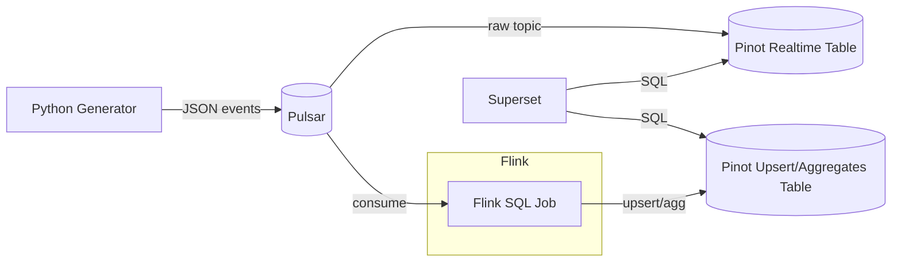

# Realtime Analytics: Pulsar → Flink → Pinot with Superset (2025 Edition)

**Objective**: Build a sub-second analytics stack: Pulsar streams data, Flink shapes it, Pinot serves OLAP queries, and Superset paints the truth. One compose.yml, toggle systems with profiles, and watch time bend.

## Architecture



**Why**: Pinot can ingest directly from Pulsar for raw live data and accept Flink's processed stream. Superset queries both.

## Docker Compose with Profiles

```yaml
# docker-compose.yml
version: "3.9"
x-hc: &hc { interval: 5s, timeout: 3s, retries: 40 }

services:
  zookeeper:
    image: zookeeper:3.8
    ports: ["2181:2181"]
    healthcheck: { test: ["CMD","bash","-lc","echo ruok | nc -w 2 localhost 2181"], <<: *hc }

  pulsar:
    image: apachepulsar/pulsar:3.2.0
    command: ["bin/pulsar","standalone","-nss"]  # standalone, no stream storage
    ports: ["6650:6650","8080:8080"]             # broker + admin
    healthcheck: { test: ["CMD","curl","-sf","http://localhost:8080/admin/v2/brokers/health"], <<: *hc }

  pinot-controller:
    image: apachepinot/pinot:latest
    command: ["StartController","-zkAddress","zookeeper:2181","-controllerPort","9000"]
    depends_on: [zookeeper]
    ports: ["9000:9000"]
    healthcheck: { test: ["CMD","curl","-sf","http://localhost:9000/health"], <<: *hc }

  pinot-broker:
    image: apachepinot/pinot:latest
    command: ["StartBroker","-zkAddress","zookeeper:2181","-controllerHost","pinot-controller"]
    depends_on: [pinot-controller]
    ports: ["8099:8099"]
    healthcheck: { test: ["CMD","curl","-sf","http://localhost:8099/"], <<: *hc }

  pinot-server:
    image: apachepinot/pinot:latest
    command: ["StartServer","-zkAddress","zookeeper:2181","-controllerHost","pinot-controller"]
    depends_on: [pinot-controller]
    ports: ["8098:8098"]

  flink-jobmanager:
    image: flink:1.19-scala_2.12
    command: jobmanager
    environment:
      - |
        FLINK_PROPERTIES=
        jobmanager.rpc.address: flink-jobmanager
    ports: ["8081:8081"]
    healthcheck: { test: ["CMD","bash","-lc","nc -z localhost 6123"], <<: *hc }

  flink-taskmanager:
    image: flink:1.19-scala_2.12
    command: taskmanager
    depends_on: [flink-jobmanager]
    environment:
      - |
        FLINK_PROPERTIES=
        jobmanager.rpc.address: flink-jobmanager
        taskmanager.numberOfTaskSlots: 2

  # Demo data generator (profile)
  generator:
    build: ./generator
    profiles: ["demo"]
    environment:
      PULSAR_URL: pulsar://pulsar:6650
      TOPIC: persistent://public/default/events
    depends_on:
      pulsar: { condition: service_healthy }

  # Superset (profile)
  superset:
    image: apache/superset:latest
    profiles: ["viz"]
    environment:
      SUPERSET_SECRET_KEY: superset
    ports: ["8088:8088"]
    depends_on:
      pinot-broker: { condition: service_healthy }
```

### Operator Recipes

```bash
# Core streaming analytics (no UI)
docker compose up -d

# Add generator (demo events)
docker compose --profile demo up -d

# Add Superset UI
docker compose --profile viz up -d
```

## Data Model & Event Shape

```json
{
  "event_id": "uuid",
  "ts":  "2025-10-04T14:12:08Z",
  "org": "acme",
  "user_id": "u-123",
  "geo": { "lat": 40.74, "lon": -73.98 },
  "action": "click|view|purchase",
  "value": 12.34,
  "attrs": { "device": "ios", "campaign": "night" }
}
```

- Keep it flat for Pinot; Flink will flatten
- Partition logic: hourly buckets by ts
- Use Pulsar topic: `persistent://public/default/events`

## Python Generator (Profile Demo)

### generator/Dockerfile

```dockerfile
FROM python:3.11-slim

RUN pip install pulsar-client

WORKDIR /app
COPY app.py .

CMD ["python", "app.py"]
```

### generator/app.py

```python
import os, json, time, uuid, random, datetime
from pulsar import Client

client = Client(os.getenv("PULSAR_URL","pulsar://pulsar:6650"))
producer = client.create_producer(os.getenv("TOPIC","persistent://public/default/events"))

orgs = ["acme","hollow","nightco"]
actions = ["view","click","purchase"]

def event():
    now = datetime.datetime.utcnow().replace(microsecond=0).isoformat()+"Z"
    return {
      "event_id": str(uuid.uuid4()),
      "ts": now,
      "org": random.choice(orgs),
      "user_id": f"u-{random.randint(1,1000)}",
      "geo": {"lat": 40.0+random.random(), "lon": -74.0+random.random()},
      "action": random.choice(actions),
      "value": round(random.random()*50,2),
      "attrs": {"device": random.choice(["ios","android","web"]),
                "campaign": random.choice(["night","dawn","salt"])}
    }

while True:
    msg = json.dumps(event()).encode()
    producer.send(msg)
    time.sleep(0.05)
```

## Pinot Realtime Table (Ingest from Pulsar)

### pinot/rawEvents.schema.json

```json
{
  "schemaName": "rawEvents",
  "dimensionFieldSpecs": [
    {"name":"event_id","dataType":"STRING"},
    {"name":"org","dataType":"STRING"},
    {"name":"user_id","dataType":"STRING"},
    {"name":"action","dataType":"STRING"},
    {"name":"device","dataType":"STRING"},
    {"name":"campaign","dataType":"STRING"}
  ],
  "metricFieldSpecs":[
    {"name":"value","dataType":"DOUBLE"}
  ],
  "dateTimeFieldSpecs":[
    {"name":"ts","dataType":"TIMESTAMP","format":"1:MILLISECONDS:EPOCH","granularity":"1:MILLISECONDS"},
    {"name":"ingest_time","dataType":"TIMESTAMP","format":"1:MILLISECONDS:EPOCH","granularity":"1:MILLISECONDS"}
  ]
}
```

### pinot/rawEvents.table.json

```json
{
  "tableName": "rawEvents",
  "tableType": "REALTIME",
  "segmentsConfig": {
    "timeColumnName": "ts",
    "replication": 1,
    "schemaName": "rawEvents"
  },
  "ingestionConfig": {
    "transformConfigs":[
      {"columnName":"device","transformFunction":"jsonExtractScalar(attrs,'$.device','STRING')"},
      {"columnName":"campaign","transformFunction":"jsonExtractScalar(attrs,'$.campaign','STRING')"},
      {"columnName":"ingest_time","transformFunction":"fromEpochMillis(now())"}
    ]
  },
  "streamConfigs": {
    "streamType": "pulsar",
    "stream.pulsar.topic.name": "persistent://public/default/events",
    "stream.pulsar.bootstrap.servers": "pulsar://pulsar:6650",
    "stream.pulsar.consumer.type": "lowlevel",
    "stream.pulsar.ack.timeout.msecs": "30000",
    "realtime.segment.flush.threshold.time": "3600000"
  },
  "tenants": {}
}
```

### Pinot Apply Steps

```bash
# From controller container or API:
curl -X POST -H "Content-Type: application/json" \
  -d @pinot/rawEvents.schema.json \
  http://localhost:9000/schemas

curl -X POST -H "Content-Type: application/json" \
  -d @pinot/rawEvents.table.json \
  http://localhost:9000/tables
```

## Flink SQL Job (Enrichment & Rolling Aggregates)

### flink/queries.sql

```sql
-- Pulsar source (using pulsar-flink connector jar mounted in image)
CREATE TABLE events_src (
  event_id STRING,
  ts TIMESTAMP(3),
  org STRING,
  user_id STRING,
  action STRING,
  value DOUBLE,
  device STRING,
  campaign STRING,
  WATERMARK FOR ts AS ts - INTERVAL '10' SECOND
) WITH (
  'connector' = 'pulsar',
  'topic' = 'persistent://public/default/events',
  'service-url' = 'pulsar://pulsar:6650',
  'format' = 'json'
);

-- Rolling aggregates
CREATE TABLE org_action_agg (
  window_start TIMESTAMP(3),
  window_end   TIMESTAMP(3),
  org STRING,
  action STRING,
  cnt BIGINT,
  sum_value DOUBLE,
  avg_value DOUBLE
) WITH (
  'connector' = 'jdbc',
  'url' = 'jdbc:pinot://pinot-broker:8099?controller=http://pinot-controller:9000',
  'table-name' = 'orgActionAgg' -- Pre-created Pinot OFFLINE/REALTIME table
);

INSERT INTO org_action_agg
SELECT
  WINDOW_START(w), WINDOW_END(w),
  org, action,
  COUNT(*) AS cnt,
  SUM(value) AS sum_value,
  AVG(value) AS avg_value
FROM TABLE(
  TUMBLE(TABLE events_src, DESCRIPTOR(ts), INTERVAL '5' MINUTES)
) GROUP BY org, action, w;
```

**Note**: Deploy job via Flink UI (http://localhost:8081) or CLI.

## Superset Wiring (Profile Viz)

### Pinot Database Connection

1. Navigate to http://localhost:8088
2. Go to Settings → Database Connections
3. Add new database:
   - **Database**: Pinot
   - **SQLAlchemy URI**: `pinot://pinot-broker:8099`
   - **Display Name**: Pinot Analytics

### Starter Dashboard

#### Timeseries Chart
```sql
SELECT 
  ts,
  COUNT(*) as event_count
FROM rawEvents
WHERE ts >= ago('1 hour')
GROUP BY ts
ORDER BY ts
```

#### Pivot Table
```sql
SELECT 
  org,
  action,
  SUM(value) as total_value,
  COUNT(*) as event_count
FROM rawEvents
WHERE ts >= ago('1 hour')
GROUP BY org, action
ORDER BY total_value DESC
```

## Example Queries (Pinot)

### Realtime Read
```sql
SELECT org, action, COUNT(*) AS cnt, SUM(value) AS revenue
FROM rawEvents
WHERE ts >= ago('10 minutes')
GROUP BY org, action
ORDER BY cnt DESC
LIMIT 10
```

### Window Aggregate (Flink Output)
```sql
SELECT window_start, org, action, cnt, avg_value
FROM orgActionAgg
WHERE window_start >= ago('1 hour')
ORDER BY window_start DESC, cnt DESC
```

## Observability & Consoles

- **Pulsar Admin**: http://localhost:8080/ (topics & subscriptions)
- **Flink UI**: http://localhost:8081/ (job graph, backpressure)
- **Pinot Controller**: http://localhost:9000/ (query console, tables)
- **Superset**: http://localhost:8088/ (dashboards, SQL Lab)

## Failure Modes & Runbook

### Schema Drift
- **Problem**: JSON structure changes break ingestion
- **Solution**: Keep JSON flat; add columns rather than nesting deep
- **Prevention**: Version your schemas; use transform functions for complex extractions

### Flink Watermarks
- **Problem**: Late events > allowed lateness → lost in aggregate
- **Solution**: Surface lateness metrics; adjust watermark strategy
- **Monitoring**: Check Flink UI for backpressure and late events

### Pinot Ingestion Stalls
- **Problem**: Segments not flushing; consumer lag
- **Solution**: Check segment flush thresholds, controller logs, and Pulsar consumer lag
- **Debug**: `curl http://localhost:9000/health` and check Pinot controller logs

### Superset Time Grain Mismatch
- **Problem**: Charts not rendering; timezone issues
- **Solution**: Align ts to time column; ensure timezone is UTC
- **Fix**: Use `DATE_TRUNC('minute', ts)` for minute-level aggregation

### Throughput Spikes
- **Problem**: System can't handle load
- **Solution**: Scale Flink task slots; add Pinot servers; shard by org
- **Scaling**: `docker compose up --scale flink-taskmanager=3`

## TL;DR Runbook

```bash
# 1. Start core stack
docker compose up -d

# 2. Add demo data (optional)
docker compose --profile demo up -d

# 3. Create Pinot schema+table
curl -X POST -H "Content-Type: application/json" \
  -d @pinot/rawEvents.schema.json \
  http://localhost:9000/schemas

curl -X POST -H "Content-Type: application/json" \
  -d @pinot/rawEvents.table.json \
  http://localhost:9000/tables

# 4. Deploy Flink SQL job
# Upload queries.sql via Flink UI at http://localhost:8081

# 5. Add Superset UI
docker compose --profile viz up -d

# 6. Configure Superset
# Add Pinot connection: pinot://pinot-broker:8099
# Build dashboard with rawEvents and orgActionAgg tables

# 7. Query raw + aggregates with sub-second latencies
```

---

*This tutorial provides the complete machinery for sub-second streaming analytics. Each component is production-ready, copy-paste runnable, and designed to handle real-world data volumes with millisecond query latencies.*
