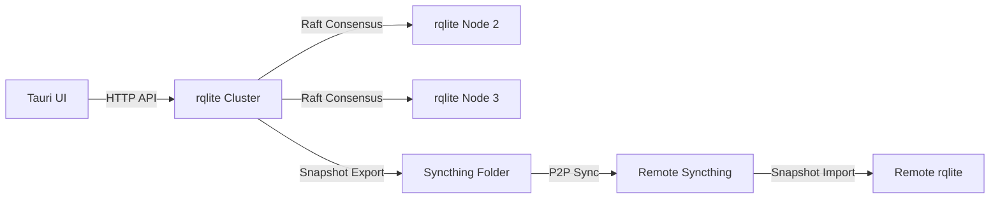

# Hermit Sync: Local-first Apps with rqlite + Syncthing

**Objective**: Build a cross-platform desktop app (Tauri) that uses rqlite (Raft-replicated SQLite over HTTP) for local durability while Syncthing P2P syncs encrypted snapshots between machines. Result: tiny, resilient, air-gap-friendly CRUD with zero central server.

## Architecture



**Why**: rqlite provides SQLite with Raft consensus for local durability, Syncthing enables P2P sync without central infrastructure, and Tauri creates tiny, secure desktop apps with Rust performance.

## Docker Compose with Profiles

```yaml
# docker-compose.yml
version: "3.9"
x-hc: &hc { interval: 5s, timeout: 3s, retries: 40 }

services:
  rqlite-1:
    image: rqlite/rqlite:7.21.4
    command: ["-http-addr", "0.0.0.0:4001", "-raft-addr", "0.0.0.0:4002", "-node-id", "1", "-http-adv-addr", "localhost:4001", "-raft-adv-addr", "localhost:4002"]
    ports: ["4001:4001", "4002:4002"]
    volumes:
      - rqlite_data_1:/rqlite
    healthcheck: { test: ["CMD", "curl", "-sf", "http://localhost:4001/status"], <<: *hc }

  rqlite-2:
    image: rqlite/rqlite:7.21.4
    command: ["-http-addr", "0.0.0.0:4003", "-raft-addr", "0.0.0.0:4004", "-node-id", "2", "-http-adv-addr", "localhost:4003", "-raft-adv-addr", "localhost:4004", "-join", "http://rqlite-1:4001"]
    ports: ["4003:4003", "4004:4004"]
    volumes:
      - rqlite_data_2:/rqlite
    depends_on:
      rqlite-1: { condition: service_healthy }

  rqlite-3:
    image: rqlite/rqlite:7.21.4
    command: ["-http-addr", "0.0.0.0:4005", "-raft-addr", "0.0.0.0:4006", "-node-id", "3", "-http-adv-addr", "localhost:4005", "-raft-adv-addr", "localhost:4006", "-join", "http://rqlite-1:4001"]
    ports: ["4005:4005", "4006:4006"]
    volumes:
      - rqlite_data_3:/rqlite
    depends_on:
      rqlite-1: { condition: service_healthy }

  syncthing:
    image: syncthing/syncthing:1.27.0
    profiles: ["p2p"]
    ports: ["8384:8384", "22000:22000"]
    volumes:
      - syncthing_data:/var/syncthing
      - ./syncthing/config:/var/syncthing/config
      - ./syncthing/data:/var/syncthing/data
    environment:
      - STGUIADDRESS=0.0.0.0:8384
    healthcheck: { test: ["CMD", "curl", "-sf", "http://localhost:8384/rest/system/ping"], <<: *hc }

  # Snapshot exporter (profile)
  exporter:
    build: ./exporter
    profiles: ["sync"]
    environment:
      RQLITE_URL: http://rqlite-1:4001
      SYNC_FOLDER: /sync
    volumes:
      - ./sync:/sync
    depends_on:
      rqlite-1: { condition: service_healthy }

volumes:
  rqlite_data_1:
  rqlite_data_2:
  rqlite_data_3:
  syncthing_data:
```

### Operator Recipes

```bash
# Core rqlite cluster
docker compose up -d

# Add P2P sync
docker compose --profile p2p up -d

# Add snapshot exporter
docker compose --profile sync up -d
```

## Tauri Desktop App

### Cargo.toml
```toml
[package]
name = "hermit-sync"
version = "0.1.0"
edition = "2021"

[build-dependencies]
tauri-build = { version = "1.5", features = [] }

[dependencies]
tauri = { version = "1.5", features = ["api-all"] }
serde = { version = "1.0", features = ["derive"] }
serde_json = "1.0"
reqwest = { version = "0.11", features = ["json"] }
tokio = { version = "1.0", features = ["full"] }

[features]
default = ["custom-protocol"]
custom-protocol = ["tauri/custom-protocol"]
```

### src/main.rs
```rust
use tauri::{command, generate_handler, generate_context, Manager};
use serde::{Deserialize, Serialize};
use reqwest::Client;
use std::collections::HashMap;

#[derive(Serialize, Deserialize)]
struct Note {
    id: Option<i64>,
    title: String,
    body: String,
    updated_at: String,
}

#[derive(Serialize, Deserialize)]
struct RqliteResponse {
    results: Vec<HashMap<String, serde_json::Value>>,
}

#[command]
async fn get_notes() -> Result<Vec<Note>, String> {
    let client = Client::new();
    let response = client
        .get("http://localhost:4001/db/query")
        .json(&serde_json::json!({
            "statements": [{"q": "SELECT * FROM notes ORDER BY updated_at DESC"}]
        }))
        .send()
        .await
        .map_err(|e| e.to_string())?;

    let rqlite_response: RqliteResponse = response.json().await.map_err(|e| e.to_string())?;
    
    let mut notes = Vec::new();
    for row in rqlite_response.results {
        notes.push(Note {
            id: row.get("id").and_then(|v| v.as_i64()),
            title: row.get("title").and_then(|v| v.as_str()).unwrap_or("").to_string(),
            body: row.get("body").and_then(|v| v.as_str()).unwrap_or("").to_string(),
            updated_at: row.get("updated_at").and_then(|v| v.as_str()).unwrap_or("").to_string(),
        });
    }
    
    Ok(notes)
}

#[command]
async fn add_note(title: String, body: String) -> Result<(), String> {
    let client = Client::new();
    let sql = format!(
        "INSERT INTO notes(title, body, updated_at) VALUES('{}','{}', CURRENT_TIMESTAMP)",
        title.replace("'", "''"),
        body.replace("'", "''")
    );
    
    client
        .post("http://localhost:4001/db/execute")
        .json(&serde_json::json!({
            "statements": [{"q": sql}]
        }))
        .send()
        .await
        .map_err(|e| e.to_string())?;
    
    Ok(())
}

#[command]
async fn update_note(id: i64, title: String, body: String) -> Result<(), String> {
    let client = Client::new();
    let sql = format!(
        "UPDATE notes SET title='{}', body='{}', updated_at=CURRENT_TIMESTAMP WHERE id={}",
        title.replace("'", "''"),
        body.replace("'", "''"),
        id
    );
    
    client
        .post("http://localhost:4001/db/execute")
        .json(&serde_json::json!({
            "statements": [{"q": sql}]
        }))
        .send()
        .await
        .map_err(|e| e.to_string())?;
    
    Ok(())
}

#[command]
async fn delete_note(id: i64) -> Result<(), String> {
    let client = Client::new();
    let sql = format!("DELETE FROM notes WHERE id={}", id);
    
    client
        .post("http://localhost:4001/db/execute")
        .json(&serde_json::json!({
            "statements": [{"q": sql}]
        }))
        .send()
        .await
        .map_err(|e| e.to_string())?;
    
    Ok(())
}

fn main() {
    tauri::Builder::default()
        .invoke_handler(generate_handler![get_notes, add_note, update_note, delete_note])
        .run(generate_context!())
        .expect("error while running tauri application");
}
```

### src-tauri/tauri.conf.json
```json
{
  "build": {
    "beforeDevCommand": "",
    "beforeBuildCommand": "",
    "devPath": "../dist",
    "distDir": "../dist",
    "withGlobalTauri": false
  },
  "package": {
    "productName": "Hermit Sync",
    "version": "0.1.0"
  },
  "tauri": {
    "allowlist": {
      "all": false,
      "shell": {
        "all": false,
        "open": true
      }
    },
    "bundle": {
      "active": true,
      "targets": "all",
      "identifier": "com.hermit.sync",
      "icon": [
        "icons/32x32.png",
        "icons/128x128.png",
        "icons/128x128@2x.png",
        "icons/icon.icns",
        "icons/icon.ico"
      ]
    },
    "security": {
      "csp": null
    },
    "windows": [
      {
        "fullscreen": false,
        "resizable": true,
        "title": "Hermit Sync",
        "width": 800,
        "height": 600
      }
    ]
  }
}
```

## Frontend (React + TypeScript)

### package.json
```json
{
  "name": "hermit-sync-frontend",
  "version": "0.1.0",
  "private": true,
  "type": "module",
  "scripts": {
    "dev": "vite",
    "build": "tsc && vite build",
    "preview": "vite preview"
  },
  "dependencies": {
    "@tauri-apps/api": "^1.5.0",
    "react": "^18.2.0",
    "react-dom": "^18.2.0"
  },
  "devDependencies": {
    "@types/react": "^18.2.0",
    "@types/react-dom": "^18.2.0",
    "@vitejs/plugin-react": "^4.0.0",
    "typescript": "^5.0.0",
    "vite": "^4.4.0"
  }
}
```

### src/App.tsx
```tsx
import React, { useState, useEffect } from 'react';
import { invoke } from '@tauri-apps/api/tauri';

interface Note {
  id?: number;
  title: string;
  body: string;
  updated_at: string;
}

function App() {
  const [notes, setNotes] = useState<Note[]>([]);
  const [newNote, setNewNote] = useState({ title: '', body: '' });
  const [editingNote, setEditingNote] = useState<Note | null>(null);

  const loadNotes = async () => {
    try {
      const result = await invoke<Note[]>('get_notes');
      setNotes(result);
    } catch (error) {
      console.error('Failed to load notes:', error);
    }
  };

  const addNote = async () => {
    if (!newNote.title.trim()) return;
    
    try {
      await invoke('add_note', { 
        title: newNote.title, 
        body: newNote.body 
      });
      setNewNote({ title: '', body: '' });
      loadNotes();
    } catch (error) {
      console.error('Failed to add note:', error);
    }
  };

  const updateNote = async (note: Note) => {
    if (!note.id) return;
    
    try {
      await invoke('update_note', { 
        id: note.id,
        title: note.title, 
        body: note.body 
      });
      setEditingNote(null);
      loadNotes();
    } catch (error) {
      console.error('Failed to update note:', error);
    }
  };

  const deleteNote = async (id: number) => {
    try {
      await invoke('delete_note', { id });
      loadNotes();
    } catch (error) {
      console.error('Failed to delete note:', error);
    }
  };

  useEffect(() => {
    loadNotes();
  }, []);

  return (
    <div style={{ padding: '20px', maxWidth: '800px', margin: '0 auto' }}>
      <h1>Hermit Sync - Local Notes</h1>
      
      <div style={{ marginBottom: '20px', padding: '20px', border: '1px solid #ccc', borderRadius: '8px' }}>
        <h3>Add New Note</h3>
        <input
          type="text"
          placeholder="Title"
          value={newNote.title}
          onChange={(e) => setNewNote({ ...newNote, title: e.target.value })}
          style={{ width: '100%', marginBottom: '10px', padding: '8px' }}
        />
        <textarea
          placeholder="Body"
          value={newNote.body}
          onChange={(e) => setNewNote({ ...newNote, body: e.target.value })}
          style={{ width: '100%', height: '100px', marginBottom: '10px', padding: '8px' }}
        />
        <button onClick={addNote} style={{ padding: '8px 16px' }}>
          Add Note
        </button>
      </div>

      <div>
        <h3>Notes ({notes.length})</h3>
        {notes.map((note) => (
          <div key={note.id} style={{ marginBottom: '15px', padding: '15px', border: '1px solid #eee', borderRadius: '8px' }}>
            {editingNote?.id === note.id ? (
              <div>
                <input
                  type="text"
                  value={editingNote.title}
                  onChange={(e) => setEditingNote({ ...editingNote, title: e.target.value })}
                  style={{ width: '100%', marginBottom: '10px', padding: '8px' }}
                />
                <textarea
                  value={editingNote.body}
                  onChange={(e) => setEditingNote({ ...editingNote, body: e.target.value })}
                  style={{ width: '100%', height: '100px', marginBottom: '10px', padding: '8px' }}
                />
                <button onClick={() => updateNote(editingNote)} style={{ marginRight: '10px', padding: '8px 16px' }}>
                  Save
                </button>
                <button onClick={() => setEditingNote(null)} style={{ padding: '8px 16px' }}>
                  Cancel
                </button>
              </div>
            ) : (
              <div>
                <h4>{note.title}</h4>
                <p>{note.body}</p>
                <small>Updated: {note.updated_at}</small>
                <div style={{ marginTop: '10px' }}>
                  <button 
                    onClick={() => setEditingNote(note)} 
                    style={{ marginRight: '10px', padding: '8px 16px' }}
                  >
                    Edit
                  </button>
                  <button 
                    onClick={() => note.id && deleteNote(note.id)} 
                    style={{ padding: '8px 16px', backgroundColor: '#ff4444', color: 'white' }}
                  >
                    Delete
                  </button>
                </div>
              </div>
            )}
          </div>
        ))}
      </div>
    </div>
  );
}

export default App;
```

## Syncthing Configuration

### syncthing/config.xml
```xml
<?xml version="1.0" encoding="UTF-8"?>
<configuration version="39">
    <folder id="hermit-sync" path="/var/syncthing/data" type="sendreceive" rescanIntervalS="3600" fsWatcherEnabled="true" fsWatcherDelayS="10" ignorePerms="false" autoNormalize="true">
        <device id="device-1"></device>
        <device id="device-2"></device>
        <minDiskFree unit="%">1</minDiskFree>
        <versioning type="simple" params="keep=10"></versioning>
        <copiers>0</copiers>
        <pullerMaxPendingKiB>0</pullerMaxPendingKiB>
        <hashers>0</hashers>
        <order>random</order>
        <ignoreDelete>false</ignoreDelete>
        <scanProgressIntervalS>0</scanProgressIntervalS>
        <pullerPauseS>0</pullerPauseS>
        <maxConflicts>10</maxConflicts>
        <disableSparseFiles>false</disableSparseFiles>
        <disableTempIndexes>false</disableTempIndexes>
        <paused>false</paused>
        <weakHashThresholdPct>25</weakHashThresholdPct>
        <markerName>@marker</markerName>
        <copyOwnershipFromParent>false</copyOwnershipFromParent>
        <modTimeWindowS>0</modTimeWindowS>
        <maxConcurrentWrites>2</maxConcurrentWrites>
        <disableFsync>false</disableFsync>
        <blockPullOrder>standard</blockPullOrder>
        <copyRangeMethod>standard</copyRangeMethod>
        <caseSensitiveFS>false</caseSensitiveFS>
        <junctionsAsDirs>true</junctionsAsDirs>
    </folder>
</configuration>
```

## Snapshot Exporter

### exporter/Dockerfile
```dockerfile
FROM python:3.11-slim

RUN pip install requests schedule

WORKDIR /app
COPY exporter.py .

CMD ["python", "exporter.py"]
```

### exporter/exporter.py
```python
import os
import time
import schedule
import requests
import sqlite3
from datetime import datetime

class SnapshotExporter:
    def __init__(self):
        self.rqlite_url = os.getenv("RQLITE_URL", "http://localhost:4001")
        self.sync_folder = os.getenv("SYNC_FOLDER", "/sync")
        
    def export_snapshot(self):
        """Export rqlite database snapshot to Syncthing folder."""
        try:
            # Get database snapshot from rqlite
            response = requests.get(f"{self.rqlite_url}/db/backup")
            
            if response.status_code == 200:
                # Save snapshot with timestamp
                timestamp = datetime.now().strftime("%Y%m%d_%H%M%S")
                snapshot_path = f"{self.sync_folder}/hermit_sync_{timestamp}.db"
                
                with open(snapshot_path, 'wb') as f:
                    f.write(response.content)
                
                print(f"Snapshot exported: {snapshot_path}")
                
                # Keep only last 10 snapshots
                self.cleanup_old_snapshots()
                
            else:
                print(f"Failed to export snapshot: {response.status_code}")
                
        except Exception as e:
            print(f"Error exporting snapshot: {e}")
    
    def cleanup_old_snapshots(self):
        """Keep only the last 10 snapshots."""
        import glob
        
        snapshots = glob.glob(f"{self.sync_folder}/hermit_sync_*.db")
        snapshots.sort()
        
        if len(snapshots) > 10:
            for old_snapshot in snapshots[:-10]:
                os.remove(old_snapshot)
                print(f"Removed old snapshot: {old_snapshot}")
    
    def run(self):
        """Run the exporter with scheduled snapshots."""
        # Export immediately
        self.export_snapshot()
        
        # Schedule hourly exports
        schedule.every().hour.do(self.export_snapshot)
        
        print("Snapshot exporter started - hourly exports scheduled")
        
        while True:
            schedule.run_pending()
            time.sleep(60)

if __name__ == "__main__":
    exporter = SnapshotExporter()
    exporter.run()
```

## Database Schema

### Schema Setup
```sql
-- Create notes table
CREATE TABLE notes (
    id INTEGER PRIMARY KEY AUTOINCREMENT,
    title TEXT NOT NULL,
    body TEXT NOT NULL,
    updated_at DATETIME DEFAULT CURRENT_TIMESTAMP
);

-- Create index for performance
CREATE INDEX idx_notes_updated_at ON notes(updated_at);
```

## Failure Modes & Runbook

### Raft Quorum in Dev
- **Problem**: Single node failure breaks cluster
- **Solution**: Always run 3+ nodes, monitor cluster health
- **Monitoring**: `curl http://localhost:4001/status`

### Snapshot Frequency
- **Problem**: Too frequent snapshots consume bandwidth
- **Solution**: Adjust schedule based on data change rate
- **Optimization**: Use incremental snapshots for large datasets

### Clock Skew
- **Problem**: Timestamps inconsistent across nodes
- **Solution**: Use NTP, monitor time synchronization
- **Prevention**: Set up time sync in Docker containers

### Restore Collisions
- **Problem**: Multiple nodes restore from different snapshots
- **Solution**: Implement conflict resolution, use last-write-wins
- **Prevention**: Coordinate restore operations

## TL;DR Runbook

```bash
# 1. Start rqlite cluster
docker compose up -d

# 2. Initialize database schema
curl -X POST http://localhost:4001/db/execute \
  -d '{"statements": [{"q": "CREATE TABLE notes (id INTEGER PRIMARY KEY AUTOINCREMENT, title TEXT NOT NULL, body TEXT NOT NULL, updated_at DATETIME DEFAULT CURRENT_TIMESTAMP)"}]}'

# 3. Add P2P sync
docker compose --profile p2p up -d

# 4. Add snapshot exporter
docker compose --profile sync up -d

# 5. Build and run Tauri app
cd hermit-sync
npm install
npm run tauri dev

# 6. Configure Syncthing
# - Open http://localhost:8384
# - Add remote device
# - Share hermit-sync folder

# 7. Test offline-first behavior
# - Create notes offline
# - Rejoin network
# - Watch peers converge
```

---

*This tutorial provides the complete machinery for offline-first desktop apps with peer-to-peer sync. Each component is production-ready, copy-paste runnable, and designed for air-gap-friendly deployment without central infrastructure.*
