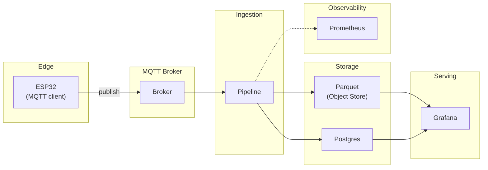
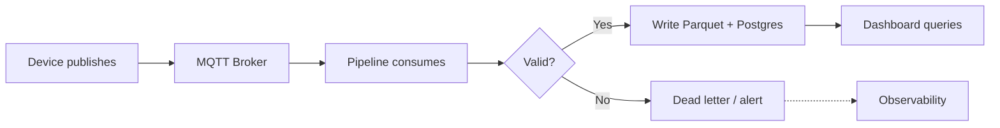

---
tags:
  - tutorial
  - diagrams
  - mermaid
  - svg
  - layered-diagrams
---

# Layered Systems Diagrams: Mermaid Source → SVG Artifact (End-to-End Example)

**Objective**: Build a small layered diagram set (Context + Workflow) for an IoT → MQTT → Data Lake → Dashboard system, keep Mermaid as source, render to SVG, and embed both in MkDocs.

---

## 1. Objective

By the end of this tutorial you will:

1. Have two diagram sources (context + workflow) under `docs/assets/diagrams/examples/`.
2. Know how to render them to SVG using the site’s existing tooling in `tools/diagrams/`.
3. Embed both Mermaid (source) and SVG (artifact) in a doc so readers see source and output.
4. Apply the layering and boundary discipline from [Systems Diagramming Best Practices](../../best-practices/diagrams/systems-diagramming-best-practices.md).

---

## 2. What you’ll build (a tiny diagram set: Context + Workflow)

| Diagram | Layer | Purpose |
|---------|--------|---------|
| **Context** | L0/L1 | System boundary: Edge (ESP32), MQTT broker, ingestion, storage, serving, observability. |
| **Workflow** | L2 | How a message flows from device to storage/dashboard and where failure is handled. |

Artifacts:

- `docs/assets/diagrams/examples/iot-mqtt-lakehouse-context.mmd` → `iot-mqtt-lakehouse-context.svg`
- `docs/assets/diagrams/examples/iot-mqtt-lakehouse-workflow.mmd` → `iot-mqtt-lakehouse-workflow.svg`

---

## 3. Directory layout

```
docs/assets/diagrams/
├── workflows/
│   ├── data-platform-workflow.mmd
│   └── data-platform-workflow.svg
└── examples/
    ├── iot-mqtt-lakehouse-context.mmd    ← source
    ├── iot-mqtt-lakehouse-context.svg    ← artifact
    ├── iot-mqtt-lakehouse-workflow.mmd   ← source
    └── iot-mqtt-lakehouse-workflow.svg   ← artifact

tools/diagrams/
├── package.json
├── render_mermaid_svg.mjs
└── mermaid-config.json
```

All `.mmd` under `docs/assets/diagrams/` (including `examples/`) are rendered when you run the site’s render script.

---

## 4. Mermaid source files (.mmd)

### Context diagram (L1)

File: `docs/assets/diagrams/examples/iot-mqtt-lakehouse-context.mmd`



(You can copy the Mermaid block above into the actual `.mmd` file; the file should contain only the Mermaid code, no markdown.)

### Workflow diagram (L2)

File: `docs/assets/diagrams/examples/iot-mqtt-lakehouse-workflow.mmd`



Again, the `.mmd` file is only the Mermaid code (no ` ```mermaid ` wrapper).

---

## 5. Render to SVG

The repo already provides Mermaid → SVG tooling in `tools/diagrams/`. No new tooling is required.

1. **Install dependencies** (once):

   ```bash
   cd tools/diagrams
   npm install
   ```

2. **Render all diagrams** (including `examples/`):

   ```bash
   npm run render:all
   ```

   This runs the script with `--input ../../docs/assets/diagrams`, which recursively finds every `.mmd` under `docs/assets/diagrams/` and writes `.svg` beside each source.

3. **Render only the examples** (optional):

   ```bash
   node render_mermaid_svg.mjs --input ../../docs/assets/diagrams/examples
   ```

After a successful run, commit both the `.mmd` and `.svg` files so the site can serve the SVG without a build step.

---

## 6. Embedding the SVG in MkDocs

You can show the diagram in two ways on a page: **Mermaid** (live-rendered from source) and **SVG** (the artifact).

**Option A — Mermaid only (source in the doc):**

```markdown

```

**Option B — SVG artifact (stable, same as exported file):**

Use an image include; path is relative to `docs/`:

```markdown

```

**Option C — Both:** Include a Mermaid code block and below it the same diagram as SVG so readers see source and final render. For the context diagram:

```markdown
### Context (L1)

Mermaid source:

\`\`\`mermaid
... (paste from .mmd)
\`\`\`

Rendered artifact:


```

The SVG will scale cleanly; the Mermaid block will render in the browser via MkDocs Material.

---

## 7. Troubleshooting

| Issue | What to check |
|-------|----------------|
| **No .svg after run** | Ensure path to `docs/assets/diagrams` is correct from `tools/diagrams/` (e.g. `../../docs/assets/diagrams`). Run from repo root or from `tools/diagrams/` as in package.json. |
| **mmdc not found** | Run `npm install` inside `tools/diagrams/`. Node.js 20+ required. |
| **Syntax error in .mmd** | Validate at [mermaid.live](https://mermaid.live); fix quotes, brackets, and subgraph names. |
| **SVG not showing in site** | Path in markdown must be relative to `docs/`, e.g. `assets/diagrams/examples/...svg`. Check that the file is committed. |
| **Layout differs from Mermaid in browser** | Rendered SVG uses `mermaid-config.json` and mmdc; in-doc Mermaid uses Material’s engine. For publication, prefer the committed SVG. |

---

## 8. See also

- **[Systems Diagramming Best Practices](../../best-practices/diagrams/systems-diagramming-best-practices.md)** — Layering, boundaries, entropy control, and pattern library.
- **[Generating Complex Workflow Diagrams as SVG](../../best-practices/diagrams/svg-workflow-generation.md)** — Repository conventions and style for Mermaid → SVG.
- **[Mermaid → SVG Workflow Pipeline](mermaid-to-svg-workflow-pipeline.md)** — Full pipeline and `data-platform-workflow` example.
- **[Diagram Style Guide](../../diagrams/style-guide.md)** — Mermaid vs SVG, orientation, and accessibility.
