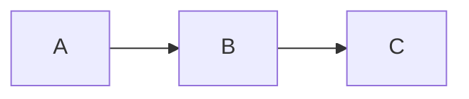
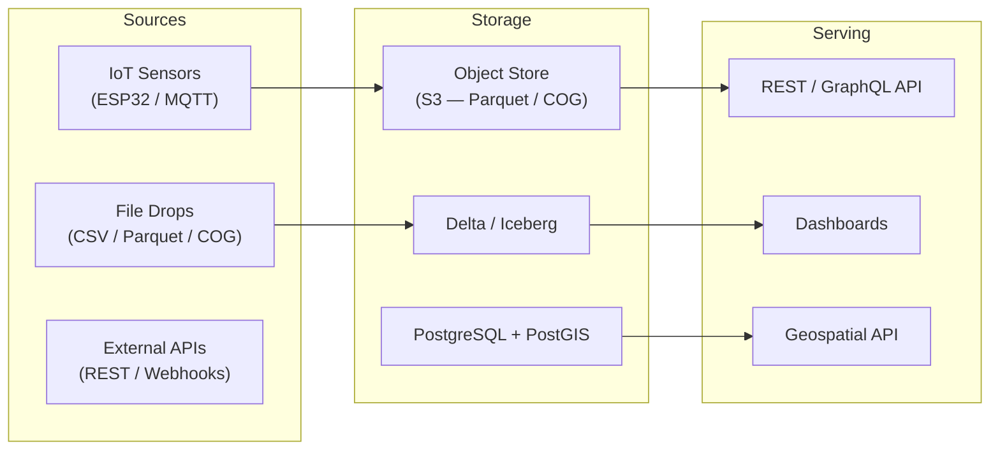

---
tags:
  - tutorial
  - diagrams
  - mermaid
  - svg
  - tooling
---

# Mermaid → SVG Workflow Pipeline (From Diagram Source to Published Artifact)

---

## Objective

This tutorial walks you through the full pipeline for producing a committed, renderable SVG from a Mermaid source file. By the end you will have:

1. A `.mmd` Mermaid source file under `docs/assets/diagrams/`
2. A Node.js render script that produces a `.svg` artifact next to each source
3. A committed `.svg` that renders in GitHub Pages and MkDocs Material without a build step

This is the workflow used throughout this site. Once set up, adding a new diagram takes three steps: write the `.mmd`, run the render script, commit both files.

---

## What You Will Produce

| File | Role |
|---|---|
| `docs/assets/diagrams/workflows/data-platform-workflow.mmd` | Mermaid source — the diagram as code |
| `tools/diagrams/package.json` | Node.js project config with render scripts |
| `tools/diagrams/render_mermaid_svg.mjs` | Render script — finds and renders all `.mmd` files |
| `tools/diagrams/mermaid-config.json` | Mermaid theme configuration |
| `docs/assets/diagrams/workflows/data-platform-workflow.svg` | Rendered artifact — committed and served directly |

---

## Project Layout

```
sempervent.github.io/
├── docs/
│   └── assets/
│       └── diagrams/
│           └── workflows/
│               ├── data-platform-workflow.mmd   ← author this
│               └── data-platform-workflow.svg   ← generated, then committed
└── tools/
    └── diagrams/
        ├── package.json
        ├── render_mermaid_svg.mjs
        └── mermaid-config.json
```

---

## Step-by-Step

### 1. Install Dependencies

The render pipeline uses `@mermaid-js/mermaid-cli` via npm. Install it from the `tools/diagrams/` directory.

```bash
cd tools/diagrams
npm install
```

This installs `mmdc` (the Mermaid CLI binary) into `tools/diagrams/node_modules/.bin/`. The render script references this local binary path directly — no global install is required.

**Requirements**: Node.js 20 or later. Check with:

```bash
node --version
```

### 2. Write or Edit the `.mmd` Source

Create or edit a file under `docs/assets/diagrams/`. Use the `%%{init}%%` directive to set rendering options, and follow the style guide for orientation, subgraph boundaries, and node text length.

Example structure for a new workflow diagram:

```
%%{init: {"flowchart": {"curve": "linear"}} }%%
flowchart LR

  subgraph Sources["Sources"]
    Sensors["IoT Sensors\n(ESP32 / MQTT)"]
    APIs["External APIs"]
  end

  subgraph Storage["Storage"]
    ObjStore["Object Store\n(S3 / Parquet)"]
  end

  Sensors --> ObjStore
  APIs --> ObjStore
```

The example diagram at `docs/assets/diagrams/workflows/data-platform-workflow.mmd` shows a full multi-subsystem workflow with governance and observability cross-cuts.

### 3. Render the Diagram

From `tools/diagrams/`, run one of the two npm scripts:

```bash
# Render the example workflow only:
npm run render:workflow

# Render all .mmd files under docs/assets/diagrams/ (recursive):
npm run render:all
```

The script will print a summary:

```
Rendering 1 diagram(s)...

  ✓  /path/to/docs/assets/diagrams/workflows/data-platform-workflow.svg

Done: 1 rendered, 0 failed.
```

The `.svg` is created next to the `.mmd` file. If the `.svg` already exists, it is overwritten.

### 4. Verify Locally

Open the `.svg` file in a browser (`open docs/assets/diagrams/workflows/data-platform-workflow.svg` on macOS) to verify it renders correctly before committing.

If you are running the MkDocs dev server:

```bash
mkdocs serve
```

Navigate to the page that embeds the SVG and confirm it renders at the correct size and with readable text.

### 5. Embed the SVG in Your Documentation

Reference the SVG from any Markdown page using a standard image link:

```markdown

```

Adjust the relative path based on the location of the Markdown file. Use a descriptive alt text — this is the accessible fallback for screen readers and the text shown if the image fails to load.

You can also embed the Mermaid source directly in the page (for inline Mermaid rendering in MkDocs) if you want both the rendered diagram and the source visible:

````markdown

````

### 6. Commit Both Files

Always commit the `.mmd` source and the `.svg` artifact together. This ensures the published site never serves a stale diagram, and the source of truth is always alongside the artifact in version history.

```bash
git add docs/assets/diagrams/workflows/data-platform-workflow.mmd \
        docs/assets/diagrams/workflows/data-platform-workflow.svg
git commit -m "docs: add data platform workflow diagram"
```

---

## How to Keep Diagrams Maintainable

### Split by Layer

A single diagram that covers sources, ingestion, storage, orchestration, serving, governance, and observability will be too dense to read at a glance. The example workflow in this repository works because it uses subgraphs and the LR layout to create clear visual columns. For more complex systems, consider separate diagrams:

- **Overview diagram**: major subsystem blocks only, no internal detail
- **Data flow diagram**: how data moves between subsystems (paths and labels)
- **Governance overlay**: which governance components apply to which storage layers
- **Failure mode diagram**: what breaks and what is affected when a specific component fails

Each diagram gets its own `.mmd` and `.svg` pair.

### Use Subgraphs as Boundaries

Subgraphs are the primary tool for managing visual complexity. A subgraph groups related nodes under a labeled boundary, reducing the cognitive load of the overall diagram. A well-subgraphed diagram with 25 nodes reads more clearly than a flat diagram with 10 nodes.

### Enforce the 15-Node Limit

If a diagram exceeds approximately 15 nodes (not counting subgraph labels), split it. The render script has no limit, but human cognition does.

### Name Diagrams After Concepts, Not Tickets

`data-platform-workflow.mmd` is a stable name. `JIRA-1234-diagram.mmd` is not. Names should reflect the diagram's analytical scope, not its origin.

---

## Troubleshooting

### Font rendering issues (text too small or too large)

Edit `tools/diagrams/mermaid-config.json`:

```json
{
  "fontSize": 14,
  "fontFamily": "ui-sans-serif, system-ui, -apple-system, sans-serif"
}
```

Increase `fontSize` for larger text. The default of 14px is legible at 1x scale.

### Missing `viewBox` (diagram does not scale)

`mmdc` adds a `viewBox` attribute to the output SVG by default. If a hand-edited SVG loses its `viewBox`, add it back:

```xml
<svg viewBox="0 0 1280 720" xmlns="http://www.w3.org/2000/svg">
```

The `viewBox` must match the actual content dimensions. Open the SVG in a browser and inspect the bounding box if unsure.

### Broken rendering in MkDocs Material

Verify that the SVG path in the Markdown image link is correct relative to the page's location. If the SVG embeds external font references (which `mmdc` sometimes produces), the font will fail to load on GitHub Pages due to CORS restrictions.

To avoid external font references, ensure `mermaid-config.json` specifies a system font family (not a remote Google Font URL).

### `mmdc` binary not found

Run `npm install` from `tools/diagrams/`. The binary is at `node_modules/.bin/mmdc`. The render script resolves this path relative to its own location and does not use a global install.

### Puppeteer / Chromium errors

`mmdc` uses Puppeteer (headless Chromium) for rendering. On Linux servers or CI environments, you may need to install Chromium dependencies:

```bash
# Debian/Ubuntu
apt-get install -y chromium-browser fonts-liberation libatk-bridge2.0-0 \
  libatk1.0-0 libcups2 libdbus-1-3 libdrm2 libgbm1 libgtk-3-0 \
  libnspr4 libnss3 libx11-xcb1 libxcomposite1 libxdamage1 libxrandr2
```

---

## Example: Full Data Platform Workflow

The diagram below is the rendered output of `docs/assets/diagrams/workflows/data-platform-workflow.mmd`.

**Mermaid source** (abbreviated for clarity — full source at `docs/assets/diagrams/workflows/data-platform-workflow.mmd`):



**Rendered SVG artifact**:


---

!!! tip "See also"
    - [SVG Workflow Generation Best Practices](../../best-practices/diagrams/svg-workflow-generation.md) — principles, conventions, and the full style guide for Mermaid-first diagram authoring
    - [Diagram Style Guide](../../diagrams/style-guide.md) — reusable Mermaid snippet library and formatting rules
    - [ADR 0015: Standardize Diagrams on Mermaid](../../adr/0015-diagrams-mermaid.md) — the architectural decision behind this pipeline
