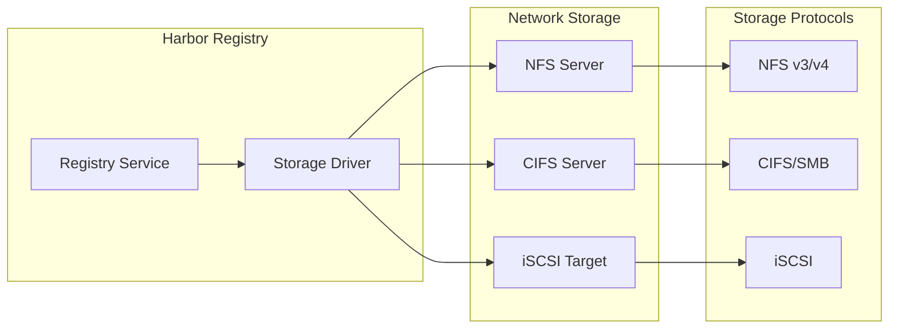

# Harbor Container Registry Setup: Kubernetes & Docker Compose with Network Storage

**Objective**: Master Harbor container registry deployment with production-grade storage and security. When you need enterprise container registry capabilities, when you want vulnerability scanning and image signing, when you're building secure CI/CD pipelines—Harbor becomes your weapon of choice.

Harbor is an open-source container registry that provides enterprise-grade features including vulnerability scanning, image signing, RBAC, and replication. This tutorial shows you how to deploy Harbor with the precision of a DevOps engineer, covering both Kubernetes and Docker Compose environments with network-attached storage.

## 0) Prerequisites (Read Once, Live by Them)

### The Five Commandments

1. **Understand Harbor architecture**
   - Core components and microservices
   - Database and Redis requirements
   - Storage backend options and performance
   - Security and authentication patterns

2. **Master storage configurations**
   - Network-attached storage (NFS, CIFS, iSCSI)
   - Storage performance and capacity planning
   - Backup and disaster recovery
   - Storage security and access controls

3. **Know your deployment options**
   - Kubernetes vs Docker Compose trade-offs
   - Resource requirements and scaling
   - Network configuration and load balancing
   - SSL/TLS and certificate management

4. **Validate everything**
   - Test storage connectivity and performance
   - Verify Harbor functionality and security
   - Monitor resource usage and health
   - Test backup and recovery procedures

5. **Plan for production**
   - Security hardening and RBAC
   - Monitoring and alerting
   - Backup and disaster recovery
   - Scaling and maintenance procedures

**Why These Principles**: Harbor deployment requires understanding both container orchestration and storage systems. Understanding these patterns prevents data loss and enables reliable registry operations.

## 1) Harbor Architecture Overview

### Core Components

```mermaid
graph TB
    subgraph "Harbor Core Services"
        A[Proxy (Nginx)]
        B[Core API]
        C[Portal UI]
        D[Registry]
    end
    
    subgraph "Supporting Services"
        E[Database (PostgreSQL)]
        F[Redis Cache]
        G[Job Service]
        H[Chart Museum]
    end
    
    subgraph "Security Services"
        I[Notary (Signing)]
        J[Clair (Scanning)]
        K[Trivy (Scanning)]
    end
    
    subgraph "Storage Backend"
        L[Network Storage]
        M[Local Storage]
        N[Object Storage]
    end
    
    A --> B
    A --> C
    A --> D
    B --> E
    B --> F
    B --> G
    B --> H
    B --> I
    B --> J
    B --> K
    D --> L
    D --> M
    D --> N
    
    classDef core fill:#e1f5fe,stroke:#01579b,stroke-width:2px
    classDef support fill:#f3e5f5,stroke:#4a148c,stroke-width:2px
    classDef security fill:#e8f5e8,stroke:#1b5e20,stroke-width:2px
    classDef storage fill:#fff3e0,stroke:#e65100,stroke-width:2px
    
    class A,B,C,D core
    class E,F,G,H support
    class I,J,K security
    class L,M,N storage
```

### Storage Architecture



**Why This Architecture Matters**: Understanding Harbor's component relationships enables proper configuration and troubleshooting. This diagram shows the relationship between services and storage backends.

## 2) Prerequisites

### Hardware Requirements

```yaml
# Minimum hardware specification
hardware_requirements:
  kubernetes_deployment:
    master_nodes:
      - "4 CPU cores"
      - "8GB RAM"
      - "100GB storage"
    worker_nodes:
      - "4 CPU cores"
      - "8GB RAM"
      - "200GB storage"
  
  docker_compose_deployment:
    single_node:
      - "8 CPU cores"
      - "16GB RAM"
      - "500GB storage"
  
  network_storage:
    nfs_server:
      - "4 CPU cores"
      - "8GB RAM"
      - "2TB+ storage"
    performance:
      - "10Gbps network"
      - "SSD storage recommended"
```

### Software Requirements

```bash
# Kubernetes requirements
kubectl version --client
kubectl cluster-info

# Docker Compose requirements
docker --version
docker-compose --version

# Network storage requirements
# NFS server
sudo apt install nfs-kernel-server nfs-common

# CIFS client
sudo apt install cifs-utils

# iSCSI client
sudo apt install open-iscsi
```

### Network Storage Setup

```bash
# NFS Server Setup
sudo mkdir -p /srv/harbor-storage
sudo chown nobody:nogroup /srv/harbor-storage
sudo chmod 755 /srv/harbor-storage

# Configure NFS exports
echo "/srv/harbor-storage *(rw,sync,no_subtree_check,no_root_squash)" | sudo tee -a /etc/exports
sudo exportfs -ra
sudo systemctl enable nfs-kernel-server
sudo systemctl start nfs-kernel-server

# Test NFS connectivity
showmount -e <nfs-server-ip>
```

**Why These Prerequisites Matter**: Proper hardware and network setup prevents deployment failures. Understanding these requirements enables reliable Harbor operations.

## 3) Kubernetes Deployment

### Harbor Helm Chart Setup

```bash
# Add Harbor Helm repository
helm repo add harbor https://helm.goharbor.io
helm repo update

# Create namespace
kubectl create namespace harbor

# Create values file
cat > harbor-values.yaml << EOF
expose:
  type: ingress
  tls:
    enabled: true
    secretName: harbor-tls
  ingress:
    hosts:
      core: harbor.example.com
      notary: notary.example.com

persistence:
  enabled: true
  resourcePolicy: "keep"
  persistentVolumeClaim:
    registry:
      storageClass: "nfs-storage"
      accessMode: ReadWriteMany
      size: 100Gi
    database:
      storageClass: "nfs-storage"
      accessMode: ReadWriteOnce
      size: 10Gi
    redis:
      storageClass: "nfs-storage"
      accessMode: ReadWriteOnce
      size: 1Gi

externalURL: https://harbor.example.com

chartmuseum:
  enabled: true
  persistence:
    enabled: true
    storageClass: "nfs-storage"
    size: 10Gi

trivy:
  enabled: true
  persistence:
    enabled: true
    storageClass: "nfs-storage"
    size: 10Gi

notary:
  enabled: true
  server:
    persistence:
      enabled: true
      storageClass: "nfs-storage"
      size: 1Gi
  signer:
    persistence:
      enabled: true
      storageClass: "nfs-storage"
      size: 1Gi
EOF
```

### Storage Class Configuration

```yaml
# nfs-storage-class.yaml
apiVersion: storage.k8s.io/v1
kind: StorageClass
metadata:
  name: nfs-storage
provisioner: nfs.csi.k8s.io
parameters:
  server: <nfs-server-ip>
  share: /srv/harbor-storage
  mountPermissions: "0755"
reclaimPolicy: Retain
allowVolumeExpansion: true
volumeBindingMode: Immediate
```

### Network Policies

```yaml
# harbor-network-policy.yaml
apiVersion: networking.k8s.io/v1
kind: NetworkPolicy
metadata:
  name: harbor-network-policy
  namespace: harbor
spec:
  podSelector: {}
  policyTypes:
  - Ingress
  - Egress
  ingress:
  - from:
    - namespaceSelector:
        matchLabels:
          name: ingress-nginx
    ports:
    - protocol: TCP
      port: 80
    - protocol: TCP
      port: 443
  egress:
  - to: []
    ports:
    - protocol: TCP
      port: 53
    - protocol: UDP
      port: 53
```

### Harbor Deployment

```bash
# Deploy Harbor with Helm
helm install harbor harbor/harbor \
  --namespace harbor \
  --values harbor-values.yaml \
  --wait

# Verify deployment
kubectl get pods -n harbor
kubectl get pvc -n harbor

# Check Harbor status
kubectl get ingress -n harbor
```

**Why Kubernetes Deployment Matters**: Kubernetes provides high availability, scalability, and resource management. Understanding these patterns enables production-ready Harbor deployments.

## 4) Docker Compose Deployment

### Harbor Installation

```bash
# Download Harbor offline installer
wget https://github.com/goharbor/harbor/releases/download/v2.8.0/harbor-offline-installer-v2.8.0.tgz
tar xzf harbor-offline-installer-v2.8.0.tgz
cd harbor
```

### Docker Compose Configuration

```yaml
# docker-compose.yml
version: '3.8'

services:
  proxy:
    image: goharbor/nginx-photon:v2.8.0
    container_name: nginx
    restart: always
    volumes:
      - ./common/config/nginx:/etc/nginx:z
    networks:
      - harbor
    ports:
      - 80:8080
      - 443:8443

  registry:
    image: goharbor/harbor-registryctl:v2.8.0
    container_name: registry
    restart: always
    volumes:
      - /data/registry:/storage:z
      - ./common/config/registry/:/etc/registry:z
    networks:
      - harbor
    depends_on:
      - log

  core:
    image: goharbor/harbor-core:v2.8.0
    container_name: harbor-core
    restart: always
    volumes:
      - /data/ca_download/:/etc/core/ca/:z
      - /data/:/data/:z
      - ./common/config/core/app.conf:/etc/core/app.conf:z
      - ./common/config/core/private_key.pem:/etc/core/private_key.pem:z
    networks:
      - harbor
    depends_on:
      - log
      - registry
      - redis
      - database

  portal:
    image: goharbor/harbor-portal:v2.8.0
    container_name: harbor-portal
    restart: always
    volumes:
      - ./common/config/portal/:/etc/portal:z
    networks:
      - harbor
    depends_on:
      - log

  log:
    image: goharbor/harbor-log:v2.8.0
    container_name: harbor-log
    restart: always
    volumes:
      - /var/log/docker/:/var/log/docker/:z
      - ./common/config/log/logrotate.conf:/etc/logrotate.d/logrotate.conf:z
      - ./common/config/log/rsyslog_docker.conf:/etc/rsyslog.d/00-rsyslog-docker.conf:z
    networks:
      - harbor
    ports:
      - 127.0.0.1:1514:10514

  database:
    image: goharbor/harbor-db:v2.8.0
    container_name: harbor-db
    restart: always
    volumes:
      - /data/database:/var/lib/postgresql/data:z
    networks:
      - harbor
    environment:
      POSTGRES_DB: registry
      POSTGRES_PASSWORD: root123
      POSTGRES_USER: postgres

  redis:
    image: goharbor/redis-photon:v2.8.0
    container_name: redis
    restart: always
    volumes:
      - /data/redis:/var/lib/redis:z
    networks:
      - harbor

  jobservice:
    image: goharbor/harbor-jobservice:v2.8.0
    container_name: harbor-jobservice
    restart: always
    volumes:
      - /data/job_logs:/var/log/jobs:z
      - ./common/config/jobservice:/etc/jobservice:z
    networks:
      - harbor
    depends_on:
      - log
      - redis
      - core

  trivy:
    image: goharbor/trivy-adapter-photon:v2.8.0
    container_name: trivy-adapter
    restart: always
    volumes:
      - /data/trivy-adapter/trivy:/var/lib/trivy:z
      - /data/trivy-adapter/cache:/root/.cache/trivy:z
    networks:
      - harbor
    depends_on:
      - log
      - redis

  chartmuseum:
    image: goharbor/chartmuseum-photon:v2.8.0
    container_name: chartmuseum
    restart: always
    volumes:
      - /data/chart_storage:/chart_storage:z
    networks:
      - harbor
    depends_on:
      - log

  notary-server:
    image: goharbor/notary-server-photon:v2.8.0
    container_name: notary-server
    restart: always
    volumes:
      - /data/notary-server:/var/notary:z
      - ./common/config/notary/notary-server.crt:/etc/ssl/notary/notary-server.crt:z
      - ./common/config/notary/notary-server.key:/etc/ssl/notary/notary-server.key:z
    networks:
      - harbor
    depends_on:
      - log

  notary-signer:
    image: goharbor/notary-signer-photon:v2.8.0
    container_name: notary-signer
    restart: always
    volumes:
      - /data/notary-signer:/var/notary:z
      - ./common/config/notary/notary-signer.crt:/etc/ssl/notary/notary-signer.crt:z
      - ./common/config/notary/notary-signer.key:/etc/ssl/notary/notary-signer.key:z
    networks:
      - harbor
    depends_on:
      - log

networks:
  harbor:
    external: false
```

### Harbor Configuration

```yaml
# harbor.yml
# Configuration file of Harbor

# The IP address or hostname to access admin UI and registry service.
# DO NOT use localhost or 127.0.0.1, because Harbor needs to be accessed by external clients.
hostname: harbor.example.com

# http related config
http:
  # port for http, default is 80. If https enabled, this port will redirect to https port.
  port: 80

# https related config
https:
  # https port for harbor, default is 443
  port: 443
  # The path of cert and key files for nginx
  certificate: /your/certificate/path
  private_key: /your/private/key/path

# # Uncomment following will enable tls communication between all harbor components
# internal_tls:
#   # set enabled to true means internal tls is enabled
#   enabled: true
#   # put your cert and key files on dir
#   dir: /etc/harbor/tls/internal

# Uncomment external_url if you want to enable external proxy
# And when it enabled the hostname will no longer used
# external_url: https://reg.mydomain.com:8433

# The initial password of Harbor admin
# It only works in first time to install Harbor
# Remember Change the admin password from UI after launching Harbor.
harbor_admin_password: Harbor12345

# Harbor DB configuration
database:
  # The password for the root user of Harbor DB. Change this before any production use.
  password: root123
  # The maximum number of connections in the idle connection pool. If it <=0, no idle connections are retained.
  max_idle_conns: 50
  # The maximum number of open connections to the database. If it <= 0, then there is no limit on the number of open connections.
  # Note: the default number of connections is 100 for postgres of harbor.
  max_open_conns: 1000
  # The maximum amount of time a connection may be reused. Expired connections may be closed lazily before reuse. If it <= 0, connections are not closed due to a connection's age.
  conn_max_lifetime: 5m
  # The maximum amount of time a connection may be idle. Expired connections may be closed lazily before reuse. If it <= 0, connections are not closed due to a connection's idle time.
  conn_max_idle_time: 0

# The default data volume
data_volume: /data

# Harbor Storage settings by default is using /data dir on local filesystem
# Uncomment storage_service setting If you want to using external storage
storage_service:
  # ca_bundle is the path to the custom root ca certificate, which will be injected into the truststore
  # of registry's and chart repository's containers.  This is usually needed when the user hosts a internal storage with self signed certificate.
  ca_bundle:

  # storage backend, default is filesystem, options include filesystem, azure, gcs, s3, swift and oss
  # for more info about this configuration please refer https://docs.docker.com/registry/configuration/
  filesystem:
    rootdirectory: /storage
  # s3:
  #   accesskey: awsaccesskey
  #   secretkey: awssecretkey
  #   region: us-west-1
  #   regionendpoint: http://myobjects.local
  #   bucket: bucketname
  #   encrypt: true
  #   keyid: mykeyid
  #   secure: true
  #   v4auth: true
  #   chunksize: 5242880
  #   rootdirectory: /s3/object/name/prefix
  # azure:
  #   accountname: accountname
  #   accountkey: base64encodedaccountkey
  #   container: containername
  #   realm: core.windows.net
  # gcs:
  #   bucket: bucketname
  #   keyfile: /path/to/keyfile
  #   rootdirectory: /gcs/object/name/prefix
  # oss:
  #   accesskeyid: accesskeyid
  #   accesskeysecret: accesskeysecret
  #   region: regionname
  #   endpoint: endpoint
  #   bucket: bucketname
  #   encrypt: true
  #   secure: true
  #   chunksize: 10485760
  #   rootdirectory: /oss/object/name/prefix
  # swift:
  #   username: username
  #   password: password
  #   authurl: https://storage.myprovider.com/v3/auth
  #   tenant: tenantname
  #   tenantid: tenantid
  #   domain: domainname
  #   domainid: domainid
  #   region: fr
  #   container: containername
  #   rootdirectory: /swift/object/name/prefix

# Trivy configuration
trivy:
  # ignoreUnfixed The flag to display only fixed vulnerabilities
  ignore_unfixed: false
  # skipUpdate The flag to enable/disable Trivy DB downloads from GitHub
  skip_update: false
  # offlineScan The flag to enable/disable Trivy offline mode
  offline_scan: false
  # securityCheck The types of security checks to perform
  security_check: vuln
  # insecure The flag to skip verifying registry certificate
  insecure: false
  # github_token The GitHub access token to download Trivy DB
  # github_token: xxx

jobservice:
  # Maximum number of job workers in job service
  max_job_workers: 10

notification:
  # Maximum retry count that webhook job will retry
  webhook_job_max_retry: 10

chart:
  # Change the value of absolute_url to enabled can enable absolute url in chart
  absolute_url: disabled

# Log configurations
log:
  # options are debug, info, warning, error, fatal
  level: info
  # configs for files
  local:
    # Log rotate count, default is 50
    rotate_count: 50
    # Log rotate size, default is 200M
    rotate_size: 200M
    # Log directory, default is /var/log/harbor
    location: /var/log/harbor

#This attribute is for migrator to detect the version of the .cfg file, DO NOT MODIFY!
_version: 2.8.0

# Uncomment external_database if using external database.
# external_database:
#   harbor:
#     host: harbor_db_host
#     port: harbor_db_port
#     db_name: harbor
#     username: harbor
#     password: password
#     ssl_mode: disable
#     max_idle_conns: 2
#     max_open_conns: 0
#   notary_signer:
#     host: notary_signer_db_host
#     port: notary_signer_db_port
#     db_name: notary_signer
#     username: notary_signer
#     password: password
#     ssl_mode: disable
#   notary_server:
#     host: notary_server_db_host
#     port: notary_server_db_port
#     db_name: notary_server
#     username: notary_server
#     password: password
#     ssl_mode: disable

# Uncomment external_redis if using external Redis server
# external_redis:
#   # support redis, redis+sentinel
#   # # host for redis: <host_redis>:<port_redis>
#   # # host for redis+sentinel:
#   # #  <host_sentinel1>:<port_sentinel1> <host_sentinel2>:<port_sentinel2> <host_sentinel3>:<port_sentinel3>
#   host: redis:6379
#   password: ""
#   # sentinel_master_set must be set to support redis+sentinel
#   #sentinel_master_set:
#   #db_index: 0

# Uncomment uaa for trusting the certificate of uaa instance that is hosted via self-signed cert.
# uaa:
#   ca_file: /path/to/ca

# Global proxy
# Config http proxy for components, e.g. http://my.proxy.com:3128
# Components doesn't need to connect to each others via http proxy.
# Remove component from `components` array if want disable proxy
# for specific component.
# Supported components: [registry, core, portal, jobservice, trivy, chartmuseum, notary, database, redis]
proxy:
  http_proxy:
  https_proxy:
  no_proxy:
  components:
    - core
    - jobservice
    - trivy
```

### Network Storage Mount

```bash
# Mount NFS storage
sudo mkdir -p /data
sudo mount -t nfs <nfs-server-ip>:/srv/harbor-storage /data

# Make mount persistent
echo "<nfs-server-ip>:/srv/harbor-storage /data nfs defaults 0 0" | sudo tee -a /etc/fstab

# Set proper permissions
sudo chown -R 10000:10000 /data
sudo chmod -R 755 /data
```

### Harbor Installation

```bash
# Install Harbor
sudo ./install.sh

# Verify installation
docker-compose ps

# Access Harbor
curl -k https://harbor.example.com
```

**Why Docker Compose Deployment Matters**: Docker Compose provides simple deployment and management. Understanding these patterns enables reliable single-node Harbor deployments.

## 5) Network Storage Configuration

### NFS Server Setup

```bash
# Install NFS server
sudo apt update
sudo apt install nfs-kernel-server nfs-common

# Create storage directories
sudo mkdir -p /srv/harbor-storage/{registry,database,redis,chart,trivy,notary}
sudo chown -R 10000:10000 /srv/harbor-storage

# Configure NFS exports
cat > /etc/exports << EOF
/srv/harbor-storage *(rw,sync,no_subtree_check,no_root_squash)
EOF

# Start NFS services
sudo systemctl enable nfs-kernel-server
sudo systemctl start nfs-kernel-server
sudo exportfs -ra
```

### CIFS/SMB Configuration

```bash
# Install CIFS utilities
sudo apt install cifs-utils

# Create mount point
sudo mkdir -p /data

# Mount CIFS share
sudo mount -t cifs //<smb-server>/harbor-storage /data \
  -o username=<username>,password=<password>,uid=10000,gid=10000,iocharset=utf8

# Make mount persistent
echo "//<smb-server>/harbor-storage /data cifs username=<username>,password=<password>,uid=10000,gid=10000,iocharset=utf8 0 0" | sudo tee -a /etc/fstab
```

### iSCSI Configuration

```bash
# Install iSCSI initiator
sudo apt install open-iscsi

# Discover iSCSI targets
sudo iscsiadm -m discovery -t st -p <iscsi-server-ip>

# Login to iSCSI target
sudo iscsiadm -m node -T <target-name> -p <iscsi-server-ip> -l

# Create filesystem
sudo mkfs.ext4 /dev/sdb
sudo mkdir -p /data
sudo mount /dev/sdb /data
```

### Storage Performance Tuning

```bash
# NFS performance tuning
echo "nfs.nfsd.nfs4_disable_idmapping=Y" | sudo tee -a /etc/modprobe.d/nfs.conf
echo "nfs.client.nfs4_disable_idmapping=Y" | sudo tee -a /etc/modprobe.d/nfs.conf

# CIFS performance tuning
echo "//<smb-server>/harbor-storage /data cifs username=<username>,password=<password>,uid=10000,gid=10000,iocharset=utf8,cache=strict,rsize=1048576,wsize=1048576 0 0" | sudo tee -a /etc/fstab

# iSCSI performance tuning
echo "node.session.iscsi.InitialR2T = No" | sudo tee -a /etc/iscsi/iscsid.conf
echo "node.session.iscsi.ImmediateData = Yes" | sudo tee -a /etc/iscsi/iscsid.conf
```

**Why Network Storage Matters**: Proper storage configuration enables reliable data persistence and performance. Understanding these patterns prevents data loss and enables scalable Harbor deployments.

## 6) Security Configuration

### SSL/TLS Setup

```bash
# Generate self-signed certificate
openssl req -x509 -newkey rsa:4096 -keyout harbor.key -out harbor.crt -days 365 -nodes \
  -subj "/C=US/ST=State/L=City/O=Organization/CN=harbor.example.com"

# Copy certificates
sudo cp harbor.crt /etc/ssl/certs/
sudo cp harbor.key /etc/ssl/private/
sudo chmod 600 /etc/ssl/private/harbor.key
```

### Harbor Security Settings

```yaml
# harbor-security.yml
# Security configuration for Harbor

# Enable vulnerability scanning
trivy:
  enabled: true
  ignore_unfixed: false
  skip_update: false
  offline_scan: false

# Enable image signing
notary:
  enabled: true

# RBAC configuration
rbac:
  enabled: true
  admin_users:
    - admin
  project_creators:
    - admin

# Security policies
security:
  # Require signed images
  require_signed_images: true
  
  # Vulnerability scanning policy
  vulnerability_scanning:
    enabled: true
    severity_threshold: "high"
  
  # Content trust
  content_trust:
    enabled: true
```

### Network Security

```bash
# Configure firewall
sudo ufw allow 80/tcp
sudo ufw allow 443/tcp
sudo ufw allow 22/tcp
sudo ufw enable

# Configure fail2ban
sudo apt install fail2ban
sudo systemctl enable fail2ban
sudo systemctl start fail2ban
```

**Why Security Configuration Matters**: Proper security settings prevent unauthorized access and ensure data integrity. Understanding these patterns enables secure Harbor deployments.

## 7) Monitoring and Logging

### Prometheus Monitoring

```yaml
# harbor-monitoring.yml
# Prometheus configuration for Harbor monitoring

global:
  scrape_interval: 15s

scrape_configs:
  - job_name: 'harbor'
    static_configs:
      - targets: ['harbor.example.com:80']
    metrics_path: '/api/v2.0/systeminfo'
    scheme: https
    tls_config:
      insecure_skip_verify: true
```

### Grafana Dashboard

```json
{
  "dashboard": {
    "title": "Harbor Registry Monitoring",
    "panels": [
      {
        "title": "Registry Health",
        "type": "stat",
        "targets": [
          {
            "expr": "harbor_registry_health",
            "legendFormat": "Registry Health"
          }
        ]
      },
      {
        "title": "Storage Usage",
        "type": "graph",
        "targets": [
          {
            "expr": "harbor_storage_usage_bytes",
            "legendFormat": "Storage Usage"
          }
        ]
      }
    ]
  }
}
```

### Log Aggregation

```yaml
# docker-compose.logging.yml
version: '3.8'

services:
  harbor-log:
    image: goharbor/harbor-log:v2.8.0
    container_name: harbor-log
    restart: always
    volumes:
      - /var/log/harbor:/var/log/harbor:z
    networks:
      - harbor
    ports:
      - "127.0.0.1:1514:10514"

  fluentd:
    image: fluent/fluentd:v1.16-debian-1
    container_name: fluentd
    restart: always
    volumes:
      - ./fluentd/conf:/fluentd/etc
      - /var/log/harbor:/var/log/harbor:ro
    networks:
      - harbor
    depends_on:
      - harbor-log
```

**Why Monitoring Matters**: Proper monitoring enables proactive management and troubleshooting. Understanding these patterns prevents service disruptions and enables reliable Harbor operations.

## 8) Backup and Disaster Recovery

### Backup Script

```bash
#!/bin/bash
# harbor-backup.sh

set -e

BACKUP_DIR="/backup/harbor"
DATE=$(date +%Y%m%d_%H%M%S)
BACKUP_FILE="harbor-backup-${DATE}.tar.gz"

# Create backup directory
mkdir -p $BACKUP_DIR

# Backup Harbor data
tar -czf "${BACKUP_DIR}/${BACKUP_FILE}" \
  /data/registry \
  /data/database \
  /data/redis \
  /data/chart \
  /data/trivy \
  /data/notary

# Backup Harbor configuration
tar -czf "${BACKUP_DIR}/harbor-config-${DATE}.tar.gz" \
  /etc/harbor \
  /opt/harbor

# Cleanup old backups (keep 30 days)
find $BACKUP_DIR -name "harbor-backup-*.tar.gz" -mtime +30 -delete
find $BACKUP_DIR -name "harbor-config-*.tar.gz" -mtime +30 -delete

echo "Backup completed: ${BACKUP_DIR}/${BACKUP_FILE}"
```

### Restore Script

```bash
#!/bin/bash
# harbor-restore.sh

set -e

BACKUP_FILE=$1
RESTORE_DIR="/data"

if [ -z "$BACKUP_FILE" ]; then
    echo "Usage: $0 <backup-file>"
    exit 1
fi

# Stop Harbor services
docker-compose down

# Restore data
tar -xzf "$BACKUP_FILE" -C /

# Start Harbor services
docker-compose up -d

echo "Restore completed"
```

### Disaster Recovery Plan

```yaml
# disaster-recovery.yml
# Disaster recovery procedures for Harbor

procedures:
  data_loss:
    - "Stop Harbor services"
    - "Restore from latest backup"
    - "Verify data integrity"
    - "Start Harbor services"
    - "Test functionality"
  
  complete_failure:
    - "Provision new infrastructure"
    - "Install Harbor from scratch"
    - "Restore from backup"
    - "Update DNS records"
    - "Verify functionality"
  
  partial_failure:
    - "Identify failed components"
    - "Restore specific components"
    - "Verify component health"
    - "Test functionality"
```

**Why Backup and Recovery Matters**: Proper backup procedures prevent data loss and enable quick recovery. Understanding these patterns prevents service disruptions and enables reliable Harbor operations.

## 9) Scaling and Performance

### Horizontal Scaling

```yaml
# harbor-scale.yml
# Horizontal scaling configuration for Harbor

# Load balancer configuration
nginx:
  replicas: 3
  resources:
    requests:
      cpu: 100m
      memory: 128Mi
    limits:
      cpu: 500m
      memory: 512Mi

# Registry scaling
registry:
  replicas: 2
  resources:
    requests:
      cpu: 200m
      memory: 256Mi
    limits:
      cpu: 1000m
      memory: 1Gi

# Job service scaling
jobservice:
  replicas: 3
  resources:
    requests:
      cpu: 100m
      memory: 128Mi
    limits:
      cpu: 500m
      memory: 512Mi
```

### Performance Tuning

```yaml
# harbor-performance.yml
# Performance tuning configuration

# Database tuning
database:
  postgresql:
    shared_buffers: 256MB
    effective_cache_size: 1GB
    work_mem: 4MB
    maintenance_work_mem: 64MB

# Redis tuning
redis:
  maxmemory: 256mb
  maxmemory_policy: allkeys-lru

# Registry tuning
registry:
  storage:
    cache:
      blobdescriptor: inmemory
    maintenance:
      uploadpurging:
        enabled: true
        age: 168h
        interval: 24h
        dryrun: false
```

### Caching Configuration

```yaml
# harbor-caching.yml
# Caching configuration for Harbor

# Redis caching
redis:
  enabled: true
  host: redis
  port: 6379
  password: ""
  database: 0

# CDN configuration
cdn:
  enabled: true
  provider: nginx
  cache_control: "public, max-age=31536000"
  expires: "1y"
```

**Why Scaling and Performance Matters**: Proper scaling enables high availability and performance. Understanding these patterns prevents bottlenecks and enables scalable Harbor deployments.

## 10) Troubleshooting

### Common Issues

```bash
# Check Harbor status
docker-compose ps
docker-compose logs

# Check storage connectivity
df -h
mount | grep nfs
mount | grep cifs

# Check network
netstat -tlnp
ss -tlnp

# Check Harbor health
curl -k https://harbor.example.com/api/v2.0/systeminfo
```

### Log Analysis

```bash
# Harbor logs
docker-compose logs harbor-core
docker-compose logs harbor-registry
docker-compose logs harbor-portal

# System logs
journalctl -u docker
journalctl -u nfs-kernel-server
```

### Performance Monitoring

```bash
# Resource usage
docker stats
htop
iostat -x 1

# Network monitoring
iftop
netstat -i
```

**Why Troubleshooting Matters**: Proper troubleshooting procedures enable quick issue resolution. Understanding these patterns prevents service disruptions and enables reliable Harbor operations.

## 11) TL;DR Quickstart

### Essential Commands

```bash
# Kubernetes deployment
helm repo add harbor https://helm.goharbor.io
helm install harbor harbor/harbor --namespace harbor --values harbor-values.yaml

# Docker Compose deployment
wget https://github.com/goharbor/harbor/releases/download/v2.8.0/harbor-offline-installer-v2.8.0.tgz
tar xzf harbor-offline-installer-v2.8.0.tgz
cd harbor
sudo ./install.sh

# Storage setup
sudo mkdir -p /data
sudo mount -t nfs <nfs-server>:/srv/harbor-storage /data

# Verify deployment
curl -k https://harbor.example.com
```

### Essential Patterns

```yaml
# Essential Harbor patterns
harbor_patterns:
  kubernetes: "helm install harbor harbor/harbor"
  docker_compose: "sudo ./install.sh"
  storage: "mount -t nfs <server>:/path /data"
  backup: "tar -czf backup.tar.gz /data"
  restore: "tar -xzf backup.tar.gz -C /"
  monitoring: "curl -k https://harbor.example.com/api/v2.0/systeminfo"
```

### Troubleshooting Checklist

```bash
# Troubleshooting checklist
troubleshooting:
  connectivity: "curl -k https://harbor.example.com"
  storage: "df -h && mount | grep nfs"
  services: "docker-compose ps"
  logs: "docker-compose logs"
  performance: "docker stats && htop"
```

**Why This Quickstart**: These patterns cover 90% of Harbor deployment and management. Master these before exploring advanced features.

## 12) The Machine's Summary

Harbor deployment requires understanding both container orchestration and storage systems. When used correctly, Harbor enables enterprise-grade container registry capabilities with vulnerability scanning, image signing, and RBAC. The key is understanding storage requirements, mastering security configuration, and following best practices.

**The Dark Truth**: Without proper Harbor understanding, your container registry is vulnerable and unreliable. Harbor is your weapon. Use it wisely.

**The Machine's Mantra**: "In security we trust, in Harbor we store, and in the registry we find the path to enterprise container management."

**Why This Matters**: Harbor enables secure container registry operations that can handle enterprise workloads, maintain data integrity, and provide reliable container storage while ensuring security and compliance.

---

*This tutorial provides the complete machinery for deploying Harbor with network storage. The patterns scale from simple single-node deployments to complex enterprise clusters, from basic container storage to advanced security and compliance.*
