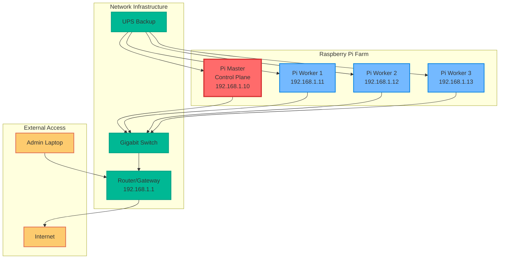
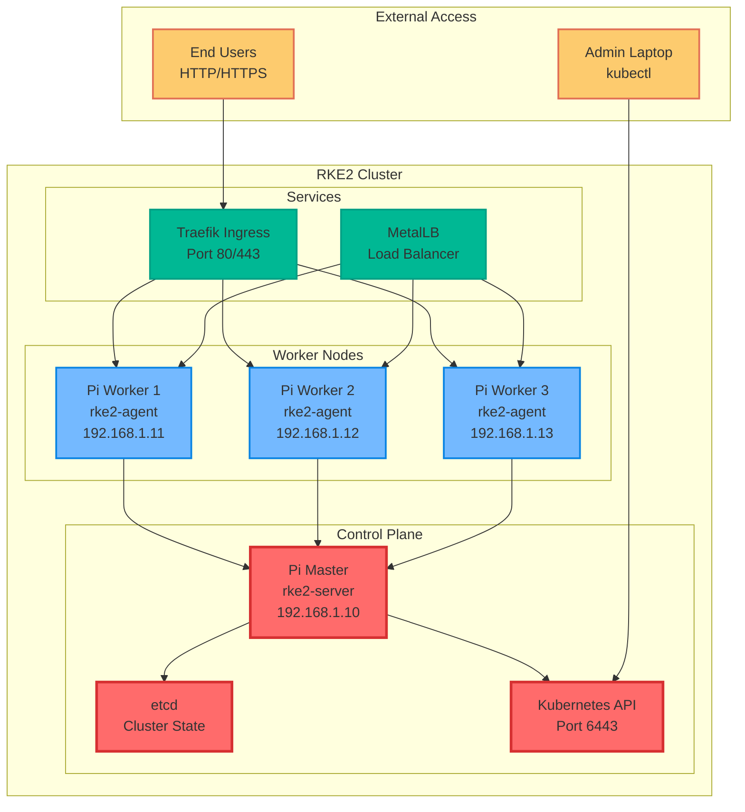

# RKE2 on a Raspberry Pi Farm

**Objective**: Build a production-ready Kubernetes cluster using RKE2 on Raspberry Pi hardware. Transform your Pi collection into a mini data center with enterprise-grade orchestration.

Why use RKE2? ARM64 support, lightweight, secure defaults, manageable at scale. Why Raspberry Pi? Affordable lab cluster to learn Kubernetes orchestration without breaking the bank. This is your gateway to understanding how real data centers work.

## 1) Hardware Prep: The Foundation

### Minimum Requirements

```bash
# Control Plane Node
- Raspberry Pi 4 (4GB+ RAM recommended)
- 32GB+ SSD via USB 3.0 (preferred over microSD)
- Gigabit Ethernet connection
- Heat sink + fan (these Pis run hot under load)

# Worker Nodes (2+ recommended)
- Raspberry Pi 4 (2GB+ RAM minimum)
- 16GB+ SSD via USB 3.0
- Gigabit Ethernet connection
- Heat sink + fan

# Network Infrastructure
- Gigabit switch (managed preferred)
- UPS (Pis are fragile to power loss)
- Quality power supplies (2.5A+ per Pi)
```

**Why This Hardware**: Pis are ARM64, energy-efficient, and perfect for learning. SSDs prevent SD card burnout, and proper cooling prevents thermal throttling.

### Network Topology



**Why This Topology**: Simple, scalable, and mirrors real data center patterns. Each Pi has a dedicated role and IP address.

## 2) OS & Base Config: The Operating System

### Install Raspberry Pi OS Lite (64-bit)

```bash
# Download Raspberry Pi Imager
# Flash Raspberry Pi OS Lite (64-bit) to SSD
# Enable SSH during imaging
# Boot and connect via SSH
```

**Why Raspberry Pi OS Lite**: Minimal overhead, ARM64 support, and optimized for Pi hardware.

### Base System Configuration

```bash
# Update system
sudo apt update && sudo apt upgrade -y

# Install essential tools
sudo apt install -y curl wget git vim htop iotop nethogs

# Set hostname (on master)
sudo hostnamectl set-hostname rpi-master

# Set hostname (on workers)
sudo hostnamectl set-hostname rpi-worker-1
sudo hostnamectl set-hostname rpi-worker-2
sudo hostnamectl set-hostname rpi-worker-3
```

**Why These Tools**: Essential for debugging and monitoring. You'll need them when things go wrong.

### Static IP Configuration

```bash
# Edit /etc/dhcpcd.conf
sudo vim /etc/dhcpcd.conf

# Add at the end:
interface eth0
static ip_address=192.168.1.10/24  # Master
static ip_address=192.168.1.11/24  # Worker 1
static ip_address=192.168.1.12/24  # Worker 2
static ip_address=192.168.1.13/24  # Worker 3
static routers=192.168.1.1
static domain_name_servers=192.168.1.1 8.8.8.8

# Restart networking
sudo systemctl restart dhcpcd
```

**Why Static IPs**: Kubernetes needs predictable networking. DHCP can cause cluster instability.

### Enable cgroups (Critical for Kubernetes)

```bash
# Edit /boot/firmware/cmdline.txt
sudo vim /boot/firmware/cmdline.txt

# Add to the end of the line:
cgroup_enable=cpuset cgroup_memory=1 cgroup_enable=memory

# Reboot
sudo reboot
```

**Why cgroups**: Kubernetes requires cgroups for resource management. Without this, kubelet won't start.

### SSH Key Setup

```bash
# Generate SSH key on your laptop
ssh-keygen -t ed25519 -C "rke2-pi-farm"

# Copy to all Pis
ssh-copy-id pi@192.168.1.10
ssh-copy-id pi@192.168.1.11
ssh-copy-id pi@192.168.1.12
ssh-copy-id pi@192.168.1.13

# Test passwordless SSH
ssh pi@192.168.1.10
```

**Why SSH Keys**: You'll be managing multiple Pis. Passwordless SSH saves time and prevents lockouts.

## 3) RKE2 Installation: The Kubernetes Engine

### Control Plane Installation

```bash
# Install RKE2 on master
curl -sfL https://get.rke2.io | sh -

# Enable and start RKE2 server
sudo systemctl enable rke2-server.service
sudo systemctl start rke2-server.service

# Check status
sudo systemctl status rke2-server.service

# Get the cluster token (save this!)
sudo cat /var/lib/rancher/rke2/server/node-token
```

**Why RKE2**: Lightweight, secure defaults, ARM64 support, and easier to manage than kubeadm.

### Worker Node Installation

```bash
# Install RKE2 agent on each worker
curl -sfL https://get.rke2.io | INSTALL_RKE2_TYPE="agent" sh -

# Create config directory
sudo mkdir -p /etc/rancher/rke2/

# Create config file (replace with your master IP and token)
sudo tee /etc/rancher/rke2/config.yaml << EOF
server: https://192.168.1.10:9345
token: <your-node-token-here>
EOF

# Enable and start RKE2 agent
sudo systemctl enable rke2-agent.service
sudo systemctl start rke2-agent.service

# Check status
sudo systemctl status rke2-agent.service
```

**Why This Config**: RKE2 agents need to know where the server is and how to authenticate.

### Verify Cluster Status

```bash
# Copy kubeconfig to your laptop
scp pi@192.168.1.10:/etc/rancher/rke2/rke2.yaml ~/.kube/config

# Edit kubeconfig to use master IP
sed -i 's/127.0.0.1/192.168.1.10/g' ~/.kube/config

# Test cluster access
kubectl get nodes -o wide
kubectl get pods -A
```

**Why This Works**: RKE2 creates a working cluster with minimal configuration. The hard work is done for you.

## 4) Cluster Topology: Visualizing Your Farm

### Network Flow Diagram



**Why This Architecture**: Clear separation of concerns. Control plane manages, workers run workloads, services provide access.

## 5) Add-Ons and Workloads: Making It Useful

### Install Helm

```bash
# Install Helm on your laptop
curl https://raw.githubusercontent.com/helm/helm/main/scripts/get-helm-3 | bash

# Add common repositories
helm repo add stable https://charts.helm.sh/stable
helm repo add bitnami https://charts.bitnami.com/bitnami
helm repo add metallb https://metallb.github.io/metallb
helm repo update
```

**Why Helm**: Package manager for Kubernetes. Makes installing complex applications trivial.

### Install MetalLB (Load Balancer)

```bash
# Install MetalLB
helm repo add metallb https://metallb.github.io/metallb
helm install metallb metallb/metallb -n metallb-system --create-namespace

# Configure IP pool
kubectl apply -f - << EOF
apiVersion: metallb.io/v1beta1
kind: IPAddressPool
metadata:
  name: first-pool
  namespace: metallb-system
spec:
  addresses:
  - 192.168.1.100-192.168.1.110
---
apiVersion: metallb.io/v1beta1
kind: L2Advertisement
metadata:
  name: example
  namespace: metallb-system
spec:
  ipAddressPools:
  - first-pool
EOF
```

**Why MetalLB**: Bare-metal load balancing. Gives you LoadBalancer services without cloud provider.

### Install Metrics Server

```bash
# Install metrics server
kubectl apply -f https://github.com/kubernetes-sigs/metrics-server/releases/latest/download/components.yaml

# Verify
kubectl top nodes
kubectl top pods -A
```

**Why Metrics Server**: Resource monitoring. Essential for understanding cluster performance.

### Install Longhorn (Distributed Storage)

```bash
# Install Longhorn
helm repo add longhorn https://charts.longhorn.io
helm install longhorn longhorn/longhorn -n longhorn-system --create-namespace

# Check status
kubectl get pods -n longhorn-system
```

**Why Longhorn**: Distributed storage for persistent volumes. Perfect for Pi clusters.

## 6) Best Practices for Pi Farm: Production Readiness

### Node Labels and Taints

```bash
# Label master node
kubectl label node rpi-master node-role.kubernetes.io/master=true

# Taint master to prevent workloads
kubectl taint node rpi-master node-role.kubernetes.io/master=true:NoSchedule

# Label workers
kubectl label node rpi-worker-1 node-role.kubernetes.io/worker=true
kubectl label node rpi-worker-2 node-role.kubernetes.io/worker=true
kubectl label node rpi-worker-3 node-role.kubernetes.io/worker=true
```

**Why Labels and Taints**: Control where workloads run. Keep system pods on master, user workloads on workers.

### etcd Backup Strategy

```bash
# Create backup script
sudo tee /usr/local/bin/etcd-backup.sh << 'EOF'
#!/bin/bash
BACKUP_DIR="/var/lib/rancher/rke2/backups"
mkdir -p $BACKUP_DIR
sudo rke2 etcd-snapshot save --name="backup-$(date +%Y%m%d-%H%M%S)"
find $BACKUP_DIR -name "*.db" -mtime +7 -delete
EOF

sudo chmod +x /usr/local/bin/etcd-backup.sh

# Add to crontab
echo "0 2 * * * /usr/local/bin/etcd-backup.sh" | sudo crontab -
```

**Why etcd Backups**: etcd contains all cluster state. Without backups, you lose everything.

### Resource Limits and Monitoring

```bash
# Install Prometheus and Grafana
helm repo add prometheus-community https://prometheus-community.github.io/helm-charts
helm install prometheus prometheus-community/kube-prometheus-stack -n monitoring --create-namespace

# Check resources
kubectl top nodes
kubectl top pods -A
```

**Why Monitoring**: Pi clusters have limited resources. Monitoring prevents overload and helps optimize performance.

### Security Hardening

```bash
# Install Falco for runtime security
helm repo add falcosecurity https://falcosecurity.github.io/charts
helm install falco falcosecurity/falco -n falco-system --create-namespace

# Install Sealed Secrets for secret management
helm repo add sealed-secrets https://bitnami-labs.github.io/sealed-secrets
helm install sealed-secrets sealed-secrets/sealed-secrets -n sealed-secrets --create-namespace
```

**Why Security**: Even lab clusters need security. Good practices scale to production.

## 7) Scaling the Farm: Growing Your Cluster

### Adding More Workers

```bash
# On new Pi, install RKE2 agent
curl -sfL https://get.rke2.io | INSTALL_RKE2_TYPE="agent" sh -

# Configure with existing token
sudo mkdir -p /etc/rancher/rke2/
sudo tee /etc/rancher/rke2/config.yaml << EOF
server: https://192.168.1.10:9345
token: <your-existing-token>
EOF

# Start agent
sudo systemctl enable rke2-agent.service
sudo systemctl start rke2-agent.service
```

**Why This Works**: RKE2 makes adding nodes trivial. Just configure and start.

### External etcd for Large Clusters

```bash
# For 6+ nodes, consider external etcd
# Dedicate 3 Pis to etcd quorum
# Install etcd on dedicated nodes
# Configure RKE2 to use external etcd
```

**Why External etcd**: Large clusters need dedicated etcd for performance and reliability.

### High Availability Setup

```bash
# Add more control plane nodes
# Configure load balancer for API server
# Use external etcd cluster
# Implement backup and disaster recovery
```

**Why HA**: Production clusters need redundancy. Plan for failure.

## 8) Testing the Cluster: Real Workloads

### Deploy a Geospatial Service

```bash
# Deploy PostGIS
kubectl create deployment postgis --image=postgis/postgis:15-3.3
kubectl expose deployment postgis --type=LoadBalancer --port=5432

# Check service
kubectl get services
kubectl get pods
```

**Why PostGIS**: Real-world geospatial workload. Tests persistent storage and networking.

### Deploy a Tile Server

```bash
# Deploy tileserver-gl
kubectl create deployment tileserver --image=maptiler/tileserver-gl
kubectl expose deployment tileserver --type=LoadBalancer --port=8080

# Access via LoadBalancer IP
curl http://192.168.1.100:8080
```

**Why Tile Server**: Tests networking, storage, and performance. Real geospatial workload.

### Load Testing

```bash
# Install hey for load testing
go install github.com/rakyll/hey@latest

# Test API server
hey -n 1000 -c 10 https://192.168.1.10:6443/api/v1

# Test application
hey -n 1000 -c 10 http://192.168.1.100:8080
```

**Why Load Testing**: Understand cluster limits. Find bottlenecks before production.

## 9) Troubleshooting: When Things Go Wrong

### Common Issues and Solutions

```bash
# Nodes not joining
# Check firewall ports
sudo ufw allow 9345/tcp
sudo ufw allow 6443/tcp
sudo ufw allow 10250/tcp

# Check kubelet logs
journalctl -u rke2-agent -f

# Check server logs
journalctl -u rke2-server -f
```

**Why These Ports**: Kubernetes needs specific ports for communication. Firewall blocks are common.

### Performance Issues

```bash
# Check resource usage
kubectl top nodes
kubectl top pods -A

# Check disk usage
df -h
du -sh /var/lib/rancher/rke2/

# Check memory usage
free -h
cat /proc/meminfo
```

**Why Monitoring**: Pi clusters have limited resources. Monitor to prevent overload.

### Network Issues

```bash
# Test connectivity
ping 192.168.1.10
telnet 192.168.1.10 6443

# Check DNS
nslookup kubernetes.default.svc.cluster.local

# Check network policies
kubectl get networkpolicies -A
```

**Why Network Testing**: Kubernetes is network-dependent. Connectivity issues break everything.

## 10) Maintenance and Operations

### Regular Maintenance

```bash
# Update system packages
sudo apt update && sudo apt upgrade -y

# Update RKE2
curl -sfL https://get.rke2.io | sh -

# Restart services
sudo systemctl restart rke2-server
sudo systemctl restart rke2-agent
```

**Why Regular Updates**: Security patches and bug fixes. Keep your cluster current.

### Backup and Recovery

```bash
# Backup etcd
sudo rke2 etcd-snapshot save --name="backup-$(date +%Y%m%d)"

# Backup kubeconfig
cp ~/.kube/config ~/.kube/config.backup

# Backup certificates
sudo cp -r /etc/rancher/rke2 /etc/rancher/rke2.backup
```

**Why Backups**: Disasters happen. Backups enable recovery.

### Monitoring and Alerting

```bash
# Install monitoring stack
helm install prometheus prometheus-community/kube-prometheus-stack -n monitoring --create-namespace

# Configure alerts
kubectl apply -f - << EOF
apiVersion: monitoring.coreos.com/v1
kind: PrometheusRule
metadata:
  name: pi-cluster-alerts
  namespace: monitoring
spec:
  groups:
  - name: pi-cluster
    rules:
    - alert: HighCPUUsage
      expr: cpu_usage_percent > 80
      for: 5m
      labels:
        severity: warning
      annotations:
        summary: "High CPU usage on {{ $labels.instance }}"
EOF
```

**Why Monitoring**: Proactive issue detection. Prevent problems before they become disasters.

## 11) TL;DR Quickstart

```bash
# 1. Hardware prep
# - 3+ Raspberry Pi 4s
# - SSDs via USB 3.0
# - Gigabit switch
# - UPS backup

# 2. OS setup
sudo apt update && sudo apt upgrade -y
sudo hostnamectl set-hostname rpi-master
# Add cgroups to /boot/firmware/cmdline.txt
sudo reboot

# 3. Install RKE2 master
curl -sfL https://get.rke2.io | sh -
sudo systemctl enable --now rke2-server
sudo cat /var/lib/rancher/rke2/server/node-token

# 4. Install RKE2 workers
curl -sfL https://get.rke2.io | INSTALL_RKE2_TYPE="agent" sh -
sudo mkdir -p /etc/rancher/rke2/
echo "server: https://192.168.1.10:9345" | sudo tee /etc/rancher/rke2/config.yaml
echo "token: <your-token>" | sudo tee -a /etc/rancher/rke2/config.yaml
sudo systemctl enable --now rke2-agent

# 5. Test cluster
kubectl get nodes -o wide
kubectl get pods -A

# 6. Install add-ons
helm install metallb metallb/metallb -n metallb-system --create-namespace
helm install longhorn longhorn/longhorn -n longhorn-system --create-namespace
helm install prometheus prometheus-community/kube-prometheus-stack -n monitoring --create-namespace
```

## 12) The Machine's Summary

RKE2 on Raspberry Pi creates a powerful, affordable Kubernetes learning environment. It's not just a toy—it's a mini data center that teaches real orchestration principles.

**The Dark Truth**: Pi clusters are fragile. Power loss kills them, thermal throttling slows them, and SD cards wear out. But with proper planning, they become reliable learning platforms.

**The Machine's Mantra**: "In redundancy we trust, in monitoring we observe, and in the Pi farm we find the path to orchestration mastery."

**Why This Matters**: Understanding Kubernetes on small scale prepares you for production clusters. The principles are the same, only the scale changes.

---

*This tutorial provides the complete machinery for building a production-ready RKE2 cluster on Raspberry Pi hardware. The cluster scales from learning to production, from megabytes to terabytes.*
