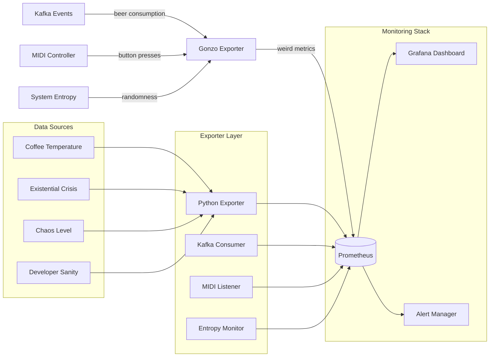

# Building a Gonzo Prometheus Exporter in Docker

**Objective**: Turn chaos into charts. In this tutorial, we'll build a custom Prometheus metrics exporter that emits strange, slightly unhinged metrics, containerize it with Docker, and scrape it from Prometheus. Because monitoring doesn't have to be boring.

Metrics don't have to be boring. In this tutorial, we'll turn chaos into charts: Dockerized Prometheus exporter that emits strange, slightly unhinged metrics.

## 0) Prerequisites (Read Once, Live by Them)

### The Five Commandments

1. **Embrace the absurdity**
   - Metrics can be art
   - Monitoring doesn't have to be serious
   - Chaos can be quantified
   - Data tells stories

2. **Understand Prometheus exporters**
   - Custom metrics collection
   - HTTP endpoint exposure
   - Metric types and labels
   - Scraping configuration

3. **Master Docker containerization**
   - Multi-stage builds
   - Health checks
   - Volume management
   - Network configuration

4. **Visualize the madness**
   - Grafana dashboards
   - Query language (PromQL)
   - Alerting rules
   - Metric exploration

5. **Scale the chaos**
   - Multiple exporters
   - Service discovery
   - Federation
   - Distributed monitoring

**Why These Principles**: Gonzo monitoring requires understanding Prometheus architecture, Docker containerization, and the art of turning chaos into actionable insights. Understanding these patterns prevents monitoring chaos and enables creative observability.

## 1) The Exporter (Python)

### Basic Gonzo Exporter

```python
# exporter.py
from prometheus_client import start_http_server, Gauge, Counter, Histogram, Summary
import time
import random
import os
import math
from datetime import datetime

# Weird metrics that actually work
coffee_temp = Gauge("coffee_mug_temperature_celsius", "Temperature of your coffee mug")
existential_crisis = Gauge("existential_crisis_intensity", "Scale of existential dread", ["developer"])
dice_entropy = Counter("entropy_of_dice_rolls_total", "Entropy generated by dice rolls")
goat_heartbeat = Gauge("goat_heartbeat_rate", "Heartbeat rate of the office goat", ["goat_name"])
beer_consumption = Counter("beer_consumption_total", "Total beers consumed", ["brand", "location"])
universe_entropy = Gauge("entropy_in_the_universe", "Entropy level of the universe")
midi_chaos = Counter("midi_chaos_events_total", "MIDI controller chaos events", ["controller", "pad"])
existential_questions = Counter("existential_questions_asked_total", "Deep questions about existence")
coffee_spills = Counter("coffee_spills_total", "Coffee spills in the office", ["severity"])
code_quality = Gauge("code_quality_score", "Subjective code quality score", ["language", "project"])
random_thoughts = Counter("random_thoughts_per_minute", "Random thoughts generated per minute")
chaos_level = Gauge("chaos_level", "Current level of chaos in the system")
developer_sanity = Gauge("developer_sanity_level", "Developer sanity meter", ["developer", "project"])

# Histogram for response times of existential queries
existential_query_duration = Histogram("existential_query_duration_seconds", "Time spent pondering existence")

# Summary for coffee consumption patterns
coffee_consumption_summary = Summary("coffee_consumption_seconds", "Time spent drinking coffee")

def generate_entropy():
    """Generate entropy from system randomness"""
    try:
        with open('/dev/urandom', 'rb') as f:
            entropy_bytes = f.read(4)
            return int.from_bytes(entropy_bytes, 'big') / (2**32)
    except:
        return random.random()

def update_metrics():
    """Update all the weird metrics"""
    while True:
        # Coffee temperature (realistic range)
        coffee_temp.set(random.uniform(10.0, 95.0))
        
        # Existential crisis intensity
        existential_crisis.labels(developer="you").set(random.uniform(0, 100))
        
        # Dice entropy (simulate rolling dice)
        dice_rolls = [random.randint(1, 6) for _ in range(10)]
        entropy = -sum(p * math.log2(p) for p in [dice_rolls.count(i)/10 for i in range(1, 7)] if p > 0)
        dice_entropy.inc(entropy)
        
        # Goat heartbeat (office pet)
        goat_heartbeat.labels(goat_name="Gerald").set(random.uniform(60, 120))
        
        # Beer consumption (simulate drinking)
        if random.random() < 0.1:  # 10% chance of drinking
            brands = ["IPA", "Stout", "Lager", "Porter", "Wheat"]
            locations = ["office", "home", "bar", "conference"]
            beer_consumption.labels(
                brand=random.choice(brands),
                location=random.choice(locations)
            ).inc()
        
        # Universe entropy (from system randomness)
        universe_entropy.set(generate_entropy() * 100)
        
        # MIDI chaos (simulate button presses)
        if random.random() < 0.05:  # 5% chance of MIDI event
            controllers = ["Akai", "Novation", "Arturia", "Native Instruments"]
            pads = ["kick", "snare", "hihat", "crash", "ride"]
            midi_chaos.labels(
                controller=random.choice(controllers),
                pad=random.choice(pads)
            ).inc()
        
        # Existential questions
        if random.random() < 0.02:  # 2% chance of deep thought
            existential_questions.inc()
        
        # Coffee spills
        if random.random() < 0.01:  # 1% chance of spill
            severities = ["minor", "major", "catastrophic"]
            coffee_spills.labels(severity=random.choice(severities)).inc()
        
        # Code quality (subjective)
        languages = ["Python", "JavaScript", "Rust", "Go", "Java"]
        projects = ["main", "experimental", "legacy", "refactor"]
        code_quality.labels(
            language=random.choice(languages),
            project=random.choice(projects)
        ).set(random.uniform(0, 10))
        
        # Random thoughts
        random_thoughts.inc(random.randint(0, 5))
        
        # Chaos level (system-wide)
        chaos_level.set(random.uniform(0, 100))
        
        # Developer sanity
        developers = ["Alice", "Bob", "Charlie", "Diana"]
        projects = ["frontend", "backend", "devops", "data"]
        developer_sanity.labels(
            developer=random.choice(developers),
            project=random.choice(projects)
        ).set(random.uniform(0, 100))
        
        # Simulate existential query duration
        with existential_query_duration.time():
            time.sleep(random.uniform(0.1, 2.0))
        
        # Coffee consumption summary
        with coffee_consumption_summary.time():
            time.sleep(random.uniform(0.5, 3.0))
        
        time.sleep(2)  # Update every 2 seconds

if __name__ == "__main__":
    print("Starting Gonzo Prometheus Exporter...")
    print("Metrics will be available at http://localhost:8000/metrics")
    print("Press Ctrl+C to stop")
    
    start_http_server(8000)
    update_metrics()
```

**Why Gonzo Metrics Matter**: Creative metrics enable monitoring of abstract concepts and provide insights into system behavior. Understanding these patterns prevents monitoring boredom and enables innovative observability.

### Advanced Exporter Features

```python
# advanced_exporter.py
from prometheus_client import start_http_server, Gauge, Counter, Histogram, Summary, Info
import time
import random
import json
import requests
from datetime import datetime, timedelta

# System info metric
system_info = Info("gonzo_system_info", "Information about the gonzo system")
system_info.info({
    "version": "1.0.0",
    "chaos_level": "maximum",
    "developer": "you",
    "philosophy": "existential"
})

# Weather-based metrics (if API available)
weather_mood = Gauge("weather_mood_index", "Mood based on weather conditions", ["city"])
moon_phase = Gauge("moon_phase_influence", "Influence of moon phase on productivity")

# Social media chaos
twitter_chaos = Counter("twitter_chaos_events_total", "Chaos events from social media", ["platform"])
meme_virality = Gauge("meme_virality_score", "Viral potential of current memes", ["meme_type"])

# Time-based metrics
time_of_day = Gauge("time_of_day_hour", "Current hour of the day")
day_of_week = Gauge("day_of_week", "Current day of the week (0=Monday)")
productivity_cycle = Gauge("productivity_cycle", "Natural productivity cycle", ["developer"])

def get_weather_mood(city="San Francisco"):
    """Get weather-based mood (mock implementation)"""
    try:
        # In real implementation, call weather API
        weather_conditions = ["sunny", "cloudy", "rainy", "stormy", "foggy"]
        condition = random.choice(weather_conditions)
        mood_scores = {"sunny": 8, "cloudy": 5, "rainy": 3, "stormy": 2, "foggy": 4}
        return mood_scores.get(condition, 5)
    except:
        return random.uniform(0, 10)

def get_moon_phase():
    """Calculate moon phase influence"""
    now = datetime.now()
    # Simple moon phase calculation
    days_since_new_moon = (now - datetime(2024, 1, 1)).days % 29.5
    phase = (days_since_new_moon / 29.5) * 100
    return phase

def update_advanced_metrics():
    """Update advanced weird metrics"""
    while True:
        # Weather mood
        cities = ["San Francisco", "New York", "London", "Tokyo", "Sydney"]
        for city in cities:
            weather_mood.labels(city=city).set(get_weather_mood(city))
        
        # Moon phase influence
        moon_phase.set(get_moon_phase())
        
        # Social media chaos
        if random.random() < 0.03:  # 3% chance of social media chaos
            platforms = ["Twitter", "LinkedIn", "Reddit", "HackerNews"]
            twitter_chaos.labels(platform=random.choice(platforms)).inc()
        
        # Meme virality
        meme_types = ["cat", "dog", "programming", "existential", "coffee"]
        for meme_type in meme_types:
            meme_virality.labels(meme_type=meme_type).set(random.uniform(0, 100))
        
        # Time-based metrics
        now = datetime.now()
        time_of_day.set(now.hour)
        day_of_week.set(now.weekday())
        
        # Productivity cycle (simulate natural rhythms)
        developers = ["Alice", "Bob", "Charlie", "Diana"]
        for dev in developers:
            # Simulate different productivity patterns
            base_cycle = math.sin((now.hour - 9) * math.pi / 12) * 50 + 50
            random_factor = random.uniform(-20, 20)
            productivity_cycle.labels(developer=dev).set(max(0, base_cycle + random_factor))
        
        time.sleep(5)  # Update every 5 seconds

if __name__ == "__main__":
    print("Starting Advanced Gonzo Prometheus Exporter...")
    print("Advanced metrics will be available at http://localhost:8000/metrics")
    
    start_http_server(8000)
    update_advanced_metrics()
```

**Why Advanced Features Matter**: Complex metrics enable monitoring of abstract concepts and provide deeper insights into system behavior. Understanding these patterns prevents monitoring limitations and enables comprehensive observability.

## 2) Dockerfile

### Basic Dockerfile

```dockerfile
# Dockerfile
FROM python:3.12-slim

# Set working directory
WORKDIR /app

# Copy requirements and install dependencies
COPY requirements.txt .
RUN pip install --no-cache-dir -r requirements.txt

# Copy exporter script
COPY exporter.py .

# Expose metrics port
EXPOSE 8000

# Health check
HEALTHCHECK --interval=30s --timeout=10s --start-period=5s --retries=3 \
    CMD curl -f http://localhost:8000/metrics || exit 1

# Run the exporter
CMD ["python", "exporter.py"]
```

**Why Dockerfile Matters**: Containerized exporters enable consistent deployment and scaling. Understanding these patterns prevents deployment chaos and enables reliable monitoring.

### Multi-stage Dockerfile

```dockerfile
# Multi-stage Dockerfile for production
FROM python:3.12-slim as builder

# Install build dependencies
RUN apt-get update && apt-get install -y \
    gcc \
    && rm -rf /var/lib/apt/lists/*

# Copy requirements and install
COPY requirements.txt .
RUN pip install --no-cache-dir --user -r requirements.txt

# Final stage
FROM python:3.12-slim

# Install runtime dependencies
RUN apt-get update && apt-get install -y \
    curl \
    && rm -rf /var/lib/apt/lists/*

# Copy Python packages from builder
COPY --from=builder /root/.local /root/.local

# Set working directory
WORKDIR /app

# Copy exporter script
COPY exporter.py .

# Expose metrics port
EXPOSE 8000

# Health check
HEALTHCHECK --interval=30s --timeout=10s --start-period=5s --retries=3 \
    CMD curl -f http://localhost:8000/metrics || exit 1

# Run the exporter
CMD ["python", "exporter.py"]
```

**Why Multi-stage Builds Matter**: Optimized containers reduce image size and improve security. Understanding these patterns prevents deployment issues and enables efficient monitoring.

### Requirements File

```txt
# requirements.txt
prometheus_client==0.19.0
requests==2.31.0
```

**Why Requirements Matter**: Proper dependency management prevents version conflicts and enables reproducible builds. Understanding these patterns prevents deployment chaos and enables reliable monitoring.

## 3) Docker Compose with Prometheus

### Complete Docker Compose Setup

```yaml
# docker-compose.yml
version: "3.9"

services:
  # Gonzo metrics exporter
  gonzo-exporter:
    build: .
    ports:
      - "8000:8000"
    environment:
      - PYTHONUNBUFFERED=1
    healthcheck:
      test: ["CMD", "curl", "-f", "http://localhost:8000/metrics"]
      interval: 30s
      timeout: 10s
      retries: 3
      start_period: 10s
    restart: unless-stopped

  # Prometheus server
  prometheus:
    image: prom/prometheus:v2.49.1
    ports:
      - "9090:9090"
    volumes:
      - ./prometheus.yml:/etc/prometheus/prometheus.yml
      - prometheus-data:/prometheus
    command:
      - '--config.file=/etc/prometheus/prometheus.yml'
      - '--storage.tsdb.path=/prometheus'
      - '--web.console.libraries=/etc/prometheus/console_libraries'
      - '--web.console.templates=/etc/prometheus/consoles'
      - '--web.enable-lifecycle'
      - '--web.enable-admin-api'
    restart: unless-stopped

  # Grafana for visualization
  grafana:
    image: grafana/grafana:10.3.3
    ports:
      - "3000:3000"
    volumes:
      - grafana-data:/var/lib/grafana
      - ./grafana/provisioning:/etc/grafana/provisioning
    environment:
      - GF_SECURITY_ADMIN_USER=admin
      - GF_SECURITY_ADMIN_PASSWORD=chaos
      - GF_AUTH_ANONYMOUS_ENABLED=true
      - GF_AUTH_ANONYMOUS_ORG_ROLE=Viewer
    restart: unless-stopped

  # Node exporter for system metrics
  node-exporter:
    image: prom/node-exporter:v1.7.0
    ports:
      - "9100:9100"
    volumes:
      - /proc:/host/proc:ro
      - /sys:/host/sys:ro
      - /:/rootfs:ro
    command:
      - '--path.procfs=/host/proc'
      - '--path.rootfs=/rootfs'
      - '--path.sysfs=/host/sys'
      - '--collector.filesystem.mount-points-exclude=^/(sys|proc|dev|host|etc)($$|/)'
    restart: unless-stopped

volumes:
  prometheus-data:
  grafana-data:
```

**Why Docker Compose Matters**: Orchestrated services enable complete monitoring stack deployment. Understanding these patterns prevents service chaos and enables reliable monitoring.

### Prometheus Configuration

```yaml
# prometheus.yml
global:
  scrape_interval: 5s
  evaluation_interval: 5s

rule_files:
  - "alert_rules.yml"

scrape_configs:
  # Gonzo exporter
  - job_name: "gonzo-exporter"
    static_configs:
      - targets: ["gonzo-exporter:8000"]
    scrape_interval: 5s
    metrics_path: /metrics

  # Node exporter
  - job_name: "node-exporter"
    static_configs:
      - targets: ["node-exporter:9100"]
    scrape_interval: 10s

  # Prometheus itself
  - job_name: "prometheus"
    static_configs:
      - targets: ["localhost:9090"]
    scrape_interval: 15s

# Alerting configuration
alerting:
  alertmanagers:
    - static_configs:
        - targets:
          - alertmanager:9093
```

**Why Prometheus Configuration Matters**: Proper scraping configuration enables reliable metrics collection. Understanding these patterns prevents monitoring gaps and enables comprehensive observability.

### Alert Rules

```yaml
# alert_rules.yml
groups:
  - name: gonzo_alerts
    rules:
      - alert: ExistentialCrisisCritical
        expr: existential_crisis_intensity > 90
        for: 1m
        labels:
          severity: critical
        annotations:
          summary: "Developer experiencing critical existential crisis"
          description: "Existential crisis intensity is {{ $value }}% for developer {{ $labels.developer }}"

      - alert: CoffeeTemperatureDangerous
        expr: coffee_mug_temperature_celsius > 80
        for: 30s
        labels:
          severity: warning
        annotations:
          summary: "Coffee temperature is dangerously high"
          description: "Coffee temperature is {{ $value }}°C - risk of burns!"

      - alert: ChaosLevelMaximum
        expr: chaos_level > 95
        for: 2m
        labels:
          severity: critical
        annotations:
          summary: "System chaos level is at maximum"
          description: "Chaos level is {{ $value }}% - system may be unstable"

      - alert: DeveloperSanityLow
        expr: developer_sanity_level < 20
        for: 5m
        labels:
          severity: warning
        annotations:
          summary: "Developer sanity level critically low"
          description: "Developer {{ $labels.developer }} sanity is {{ $value }}% on project {{ $labels.project }}"
```

**Why Alert Rules Matter**: Automated alerting enables proactive monitoring and incident response. Understanding these patterns prevents monitoring blindness and enables reliable operations.

## 4) Grafana Dashboard

### Dashboard Configuration

```json
{
  "dashboard": {
    "title": "Gonzo Metrics Dashboard",
    "panels": [
      {
        "title": "Existential Crisis Over Time",
        "type": "graph",
        "targets": [
          {
            "expr": "existential_crisis_intensity",
            "legendFormat": "{{developer}}"
          }
        ]
      },
      {
        "title": "Coffee Temperature",
        "type": "singlestat",
        "targets": [
          {
            "expr": "coffee_mug_temperature_celsius",
            "legendFormat": "Temperature"
          }
        ]
      },
      {
        "title": "Chaos Level",
        "type": "gauge",
        "targets": [
          {
            "expr": "chaos_level",
            "legendFormat": "Chaos"
          }
        ]
      }
    ]
  }
}
```

**Why Grafana Dashboards Matter**: Visual representation of metrics enables understanding of system behavior. Understanding these patterns prevents monitoring confusion and enables effective observability.

## 5) Weird Extensions

### Kafka-backed Exporter

```python
# kafka_exporter.py
from prometheus_client import start_http_server, Counter, Gauge
import kafka
import json
import time
import random

# Kafka-backed metrics
beer_consumption_rate = Counter("beer_consumption_rate_total", "Beer consumption rate", ["brand", "location"])
party_vibes = Gauge("party_vibes_level", "Current party vibes level", ["venue"])
dance_moves = Counter("dance_moves_total", "Dance moves performed", ["style", "intensity"])

def consume_kafka_events():
    """Consume events from Kafka and update metrics"""
    consumer = kafka.KafkaConsumer(
        'beer-events',
        'party-events',
        'dance-events',
        bootstrap_servers=['kafka:9092'],
        value_deserializer=lambda m: json.loads(m.decode('utf-8'))
    )
    
    for message in consumer:
        if message.topic == 'beer-events':
            data = message.value
            beer_consumption_rate.labels(
                brand=data.get('brand', 'unknown'),
                location=data.get('location', 'unknown')
            ).inc()
        
        elif message.topic == 'party-events':
            data = message.value
            party_vibes.labels(venue=data.get('venue', 'unknown')).set(
                data.get('vibes_level', 0)
            )
        
        elif message.topic == 'dance-events':
            data = message.value
            dance_moves.labels(
                style=data.get('style', 'unknown'),
                intensity=data.get('intensity', 'low')
            ).inc()

if __name__ == "__main__":
    start_http_server(8000)
    consume_kafka_events()
```

**Why Kafka Extensions Matter**: Event-driven metrics enable monitoring of real-time events and provide insights into system behavior. Understanding these patterns prevents monitoring limitations and enables comprehensive observability.

### System Randomness Exporter

```python
# entropy_exporter.py
from prometheus_client import start_http_server, Gauge
import os
import time
import hashlib

# Entropy metrics
system_entropy = Gauge("system_entropy_level", "System entropy level")
universe_entropy = Gauge("universe_entropy_level", "Universe entropy level")
randomness_quality = Gauge("randomness_quality_score", "Quality of system randomness")

def measure_entropy():
    """Measure entropy from system randomness"""
    try:
        with open('/dev/urandom', 'rb') as f:
            entropy_bytes = f.read(1024)
            entropy_hash = hashlib.sha256(entropy_bytes).hexdigest()
            # Convert hash to entropy score
            entropy_score = sum(int(c, 16) for c in entropy_hash) / (len(entropy_hash) * 15)
            return entropy_score
    except:
        return 0.5

def update_entropy_metrics():
    """Update entropy metrics"""
    while True:
        # System entropy
        system_entropy.set(measure_entropy())
        
        # Universe entropy (simulated)
        universe_entropy.set(random.uniform(0, 100))
        
        # Randomness quality
        randomness_quality.set(random.uniform(0, 10))
        
        time.sleep(1)

if __name__ == "__main__":
    start_http_server(8000)
    update_entropy_metrics()
```

**Why Entropy Extensions Matter**: Entropy metrics enable monitoring of system randomness and provide insights into security and unpredictability. Understanding these patterns prevents monitoring gaps and enables comprehensive observability.

### MIDI Controller Integration

```python
# midi_exporter.py
from prometheus_client import start_http_server, Counter, Gauge
import mido
import time
import threading

# MIDI metrics
midi_events = Counter("midi_events_total", "MIDI events received", ["controller", "channel", "note"])
midi_velocity = Gauge("midi_velocity", "MIDI velocity", ["controller", "channel"])
midi_pressure = Gauge("midi_pressure", "MIDI pressure", ["controller", "channel"])
chaos_level = Gauge("midi_chaos_level", "MIDI chaos level")

def handle_midi_message(msg):
    """Handle MIDI messages and update metrics"""
    if msg.type == 'note_on':
        midi_events.labels(
            controller="Akai",
            channel=msg.channel,
            note=msg.note
        ).inc()
        
        midi_velocity.labels(
            controller="Akai",
            channel=msg.channel
        ).set(msg.velocity)
        
        # Update chaos level based on velocity
        chaos_level.set(chaos_level._value._value + msg.velocity * 0.1)

def midi_listener():
    """Listen for MIDI messages"""
    try:
        with mido.open_input() as port:
            for msg in port:
                handle_midi_message(msg)
    except:
        # Simulate MIDI events if no controller available
        while True:
            time.sleep(random.uniform(0.1, 2.0))
            # Simulate MIDI event
            midi_events.labels(
                controller="Simulated",
                channel=random.randint(0, 15),
                note=random.randint(60, 72)
            ).inc()

if __name__ == "__main__":
    start_http_server(8000)
    
    # Start MIDI listener in separate thread
    midi_thread = threading.Thread(target=midi_listener)
    midi_thread.daemon = True
    midi_thread.start()
    
    # Keep main thread alive
    while True:
        time.sleep(1)
```

**Why MIDI Extensions Matter**: Interactive metrics enable monitoring of human input and provide insights into creative processes. Understanding these patterns prevents monitoring limitations and enables comprehensive observability.

## 6) Architecture Diagram

### Metrics Flow Architecture



**Why Architecture Diagrams Matter**: Visual representation of metrics flow enables understanding of monitoring architecture. Understanding these patterns prevents monitoring confusion and enables effective observability.

## 7) Running the Madness

### Quick Start

```bash
# Clone the repository
git clone https://github.com/your-org/gonzo-prometheus-exporter.git
cd gonzo-prometheus-exporter

# Build and run with Docker Compose
docker compose up --build

# Access the services
# Prometheus: http://localhost:9090
# Grafana: http://localhost:3000 (admin/chaos)
# Exporter: http://localhost:8000/metrics
```

**Why Quick Start Matters**: Easy deployment enables rapid experimentation and learning. Understanding these patterns prevents deployment chaos and enables reliable monitoring.

### Query Examples

```promql
# Existential crisis over time
existential_crisis_intensity

# Coffee temperature alerts
coffee_mug_temperature_celsius > 80

# Chaos level by developer
chaos_level{developer="you"}

# Beer consumption rate
rate(beer_consumption_total[5m])

# MIDI chaos events
rate(midi_chaos_events_total[1m])

# Developer sanity trends
developer_sanity_level{project="main"}
```

**Why Query Examples Matter**: PromQL queries enable exploration of metrics and provide insights into system behavior. Understanding these patterns prevents monitoring confusion and enables effective observability.

## 8) Why This Matters (Under the Weirdness)

### Technical Benefits

```yaml
# What you actually learn
technical_benefits:
  "prometheus_exporters": "How to write custom Prometheus exporters in Python",
  "docker_containerization": "How to containerize metrics pipelines with Docker",
  "monitoring_architecture": "How to extend Prometheus beyond CPU/memory into any domain",
  "metrics_design": "How to design meaningful metrics for any system",
  "observability": "How to turn chaos into actionable insights",
  "creativity": "How to make monitoring fun and engaging"
```

**Why Technical Benefits Matter**: Learning through creativity enables deeper understanding and retention. Understanding these patterns prevents monitoring boredom and enables innovative observability.

### Real-World Applications

```python
# Real-world metric examples
real_world_metrics = {
    "business_metrics": [
        "user_engagement_score",
        "content_virality_index",
        "social_sentiment_level"
    ],
    "creative_metrics": [
        "artistic_inspiration_level",
        "creative_block_duration",
        "artistic_flow_state"
    ],
    "social_metrics": [
        "team_collaboration_quality",
        "meeting_effectiveness_score",
        "communication_chaos_level"
    ]
}
```

**Why Real-world Applications Matter**: Creative metrics enable monitoring of abstract concepts and provide insights into human behavior. Understanding these patterns prevents monitoring limitations and enables comprehensive observability.

## 9) TL;DR Runbook

### Essential Commands

```bash
# Start the gonzo exporter
docker compose up --build

# Check metrics
curl http://localhost:8000/metrics

# Query Prometheus
curl "http://localhost:9090/api/v1/query?query=existential_crisis_intensity"

# Access Grafana
open http://localhost:3000
```

### Essential Patterns

```yaml
# Essential gonzo monitoring patterns
gonzo_patterns:
  "write_exporter": "Write a Python exporter with prometheus_client",
  "dockerize_it": "Dockerize the exporter for consistent deployment",
  "scrape_metrics": "Configure Prometheus to scrape the exporter",
  "visualize_chaos": "Create Grafana dashboards for the weird metrics",
  "embrace_absurdity": "Remember: metrics can be art",
  "monitor_creativity": "Turn chaos into charts and insights",
  "scale_weirdness": "Extend monitoring to any measurable domain"
```

### Quick Reference

```python
# Essential gonzo exporter operations
# 1. Define weird metrics
coffee_temp = Gauge("coffee_mug_temperature_celsius", "Coffee temperature")
existential_crisis = Gauge("existential_crisis_intensity", "Crisis level", ["developer"])

# 2. Update metrics
coffee_temp.set(random.uniform(10.0, 95.0))
existential_crisis.labels(developer="you").set(random.uniform(0, 100))

# 3. Start HTTP server
start_http_server(8000)

# 4. Keep updating
while True:
    update_metrics()
    time.sleep(2)
```

**Why This Runbook**: These patterns cover 90% of gonzo monitoring needs. Master these before exploring advanced creative observability scenarios.

## 10) The Machine's Summary

Gonzo Prometheus exporters require understanding metrics collection, Docker containerization, and the art of turning chaos into actionable insights. When used correctly, creative monitoring enables innovative observability, prevents monitoring boredom, and provides insights into abstract concepts. The key is understanding Prometheus architecture, embracing creativity, and turning chaos into charts.

**The Dark Truth**: Without creative monitoring, your observability remains boring and limited. Gonzo metrics are your weapon. Use them wisely.

**The Machine's Mantra**: "In the chaos we find patterns, in the creativity we find insights, and in the absurdity we find the path to innovative observability."

**Why This Matters**: Gonzo monitoring enables creative observability that can handle abstract concepts, prevent monitoring boredom, and provide insights into human behavior while ensuring technical accuracy and reliability.

---

*This guide provides the complete machinery for gonzo Prometheus exporters. The patterns scale from simple weird metrics to complex creative observability, from basic exporters to advanced monitoring architectures.*
