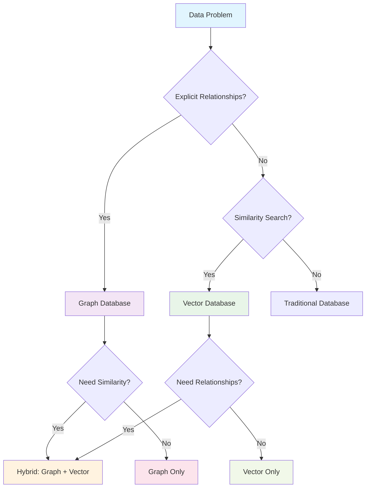

# Graph vs Vector Databases: When Relationships Meet Similarity

**Objective**: Master the fundamental differences between graph and vector databases for modern data applications. When you need to model explicit relationships, when you're building similarity search systems, when you need to understand the trade-offs between graph traversal and vector similarity—graph and vector databases become your weapons of choice.

Graph and vector databases solve fundamentally different problems in data architecture. Without proper understanding of their strengths and limitations, you're building inefficient systems, choosing wrong technologies, and missing the power of hybrid approaches. This guide shows you how to wield both with the precision of a senior data engineer.

## 0) Prerequisites (Read Once, Live by Them)

### The Five Commandments

1. **Understand the data models**
   - Graph: explicit relationships, nodes, edges, properties
   - Vector: learned similarities, embeddings, distance metrics
   - Hybrid: combining both for comprehensive solutions

2. **Master the query patterns**
   - Graph: traversals, shortest paths, community detection
   - Vector: similarity search, nearest neighbors, clustering
   - Hybrid: graph-guided vector search, vector-enhanced graph queries

3. **Know your use cases**
   - Graph: social networks, fraud detection, knowledge graphs
   - Vector: semantic search, recommendation systems, multimodal retrieval
   - Hybrid: explainable recommendations, contextual similarity

4. **Validate everything**
   - Query performance and scalability
   - Data consistency and accuracy
   - System integration and maintenance

5. **Plan for production**
   - Indexing strategies and optimization
   - Monitoring and observability
   - Security and access control

**Why These Principles**: Understanding graph and vector databases is essential for modern data applications. Each serves distinct purposes, and knowing when to use which—or both—enables optimal data architecture decisions.

## 1) What Are Graph Databases? (The Relationships)

### Core Concepts

```yaml
# Graph databases model relationships explicitly
graph_database:
  nodes:
    - "Entities (users, products, concepts)"
    - "Properties (attributes, metadata)"
    - "Labels (types, categories)"
  
  edges:
    - "Relationships (connections between nodes)"
    - "Properties (relationship attributes)"
    - "Types (relationship categories)"
  
  queries:
    - "Traversals (following relationships)"
    - "Shortest paths (optimal routes)"
    - "Community detection (clusters)"
    - "Pattern matching (complex queries)"
```

### Graph Database Architecture

```mermaid
graph TD
    subgraph "Graph Database Model"
        A[User: Alice<br/>age: 25<br/>city: NYC]
        B[User: Bob<br/>age: 30<br/>city: SF]
        C[Product: Book<br/>title: "Data Science"<br/>price: $29.99]
        D[Product: Laptop<br/>title: "MacBook Pro"<br/>price: $1999]
        
        A -->|friends_with| B
        B -->|purchased| C
        A -->|purchased| D
        B -->|recommended| D
    end
    
    subgraph "Query Patterns"
        E[Traversal<br/>Find friends of friends]
        F[Shortest Path<br/>Connection between users]
        G[Community Detection<br/>User clusters]
        H[Pattern Matching<br/>Complex relationships]
    end
    
    A --> E
    B --> F
    C --> G
    D --> H
    
    style A fill:#e1f5fe
    style B fill:#f3e5f5
    style C fill:#e8f5e8
    style D fill:#fff3e0
    style E fill:#fce4ec
    style F fill:#f1f8e9
    style G fill:#fff8e1
    style H fill:#f3e5f5
```

### Neo4j Example

```yaml
# Docker Compose for Neo4j
version: "3.9"

services:
  neo4j:
    image: neo4j:5.22
    ports:
      - "7474:7474"
      - "7687:7687"
    environment:
      - NEO4J_AUTH=neo4j/test123
      - NEO4J_PLUGINS=["apoc"]
    volumes:
      - neo4j_data:/data
    healthcheck:
      test: ["CMD", "cypher-shell", "-u", "neo4j", "-p", "test123", "RETURN 1"]
      interval: 10s
      timeout: 5s
      retries: 5

volumes:
  neo4j_data:
```

### Cypher Query Examples

```cypher
-- Create nodes and relationships
CREATE (a:User {name: 'Alice', age: 25, city: 'NYC'})
CREATE (b:User {name: 'Bob', age: 30, city: 'SF'})
CREATE (c:Product {name: 'Book', title: 'Data Science', price: 29.99})
CREATE (d:Product {name: 'Laptop', title: 'MacBook Pro', price: 1999})

-- Create relationships
CREATE (a)-[:FRIENDS_WITH {since: '2020-01-01'}]->(b)
CREATE (b)-[:PURCHASED {date: '2024-01-15', rating: 5}]->(c)
CREATE (a)-[:PURCHASED {date: '2024-01-20', rating: 4}]->(d)
CREATE (b)-[:RECOMMENDED {reason: 'great for work'}]->(d)

-- Find friends of friends who purchased products
MATCH (u:User)-[:FRIENDS_WITH]->(f)-[:PURCHASED]->(p:Product)
WHERE u.name = 'Alice'
RETURN f.name, p.title, p.price

-- Shortest path between users
MATCH (a:User {name: 'Alice'}), (b:User {name: 'Bob'})
MATCH path = shortestPath((a)-[:FRIENDS_WITH*]-(b))
RETURN path

-- Community detection (find user clusters)
CALL gds.louvain.stream('user-graph')
YIELD nodeId, communityId
RETURN gds.util.asNode(nodeId).name AS name, communityId
ORDER BY communityId, name
```

**Why Graph Databases Matter**: Graph databases excel at modeling explicit relationships and enabling complex traversals. They're essential for social networks, fraud detection, knowledge graphs, and any application where relationships are first-class citizens.

## 2) What Are Vector Databases? (The Similarities)

### Core Concepts

```yaml
# Vector databases model learned similarities
vector_database:
  embeddings:
    - "High-dimensional vectors (384, 768, 1536 dimensions)"
    - "Learned representations (semantic meaning)"
    - "Distance metrics (cosine, euclidean, dot product)"
  
  indexes:
    - "HNSW (Hierarchical Navigable Small World)"
    - "IVF (Inverted File Index)"
    - "Product Quantization (compression)"
  
  queries:
    - "Similarity search (nearest neighbors)"
    - "Clustering (group similar items)"
    - "Recommendation (find similar users/items)"
    - "Multimodal retrieval (text, image, audio)"
```

### Vector Database Architecture

```mermaid
flowchart TD
    subgraph "Vector Database Model"
        A[Text: "Machine Learning"] --> B[Embedding: [0.1, 0.3, -0.2, ...]]
        C[Image: cat.jpg] --> D[Embedding: [0.5, -0.1, 0.8, ...]]
        E[Audio: speech.wav] --> F[Embedding: [-0.2, 0.4, 0.1, ...]]
        
        B --> G((Vector Space))
        D --> G
        F --> G
        
        G --> H[Nearest Neighbors]
        G --> I[Similarity Search]
        G --> J[Clustering]
    end
    
    subgraph "Index Types"
        K[HNSW<br/>Fast approximate search]
        L[IVF<br/>Inverted file index]
        M[PQ<br/>Product quantization]
    end
    
    G --> K
    G --> L
    G --> M
    
    style A fill:#e1f5fe
    style C fill:#f3e5f5
    style E fill:#e8f5e8
    style G fill:#fff3e0
    style H fill:#fce4ec
    style I fill:#f1f8e9
    style J fill:#fff8e1
```

### Qdrant Example

```yaml
# Docker Compose for Qdrant
version: "3.9"

services:
  qdrant:
    image: qdrant/qdrant:v1.10.0
    ports:
      - "6333:6333"
      - "6334:6334"
    volumes:
      - qdrant_data:/qdrant/storage
    environment:
      - QDRANT__SERVICE__HTTP_PORT=6333
      - QDRANT__SERVICE__GRPC_PORT=6334
    healthcheck:
      test: ["CMD", "curl", "-f", "http://localhost:6333/health"]
      interval: 10s
      timeout: 5s
      retries: 5

volumes:
  qdrant_data:
```

### Python Client Examples

```python
# Qdrant client setup
from qdrant_client import QdrantClient
from qdrant_client.http import models
import numpy as np

# Connect to Qdrant
client = QdrantClient("http://localhost:6333")

# Create collection
client.recreate_collection(
    collection_name="documents",
    vectors_config=models.VectorParams(
        size=384,  # Vector dimension
        distance=models.Distance.COSINE
    )
)

# Insert vectors
documents = [
    {"id": 1, "text": "Machine learning algorithms", "vector": [0.1] * 384},
    {"id": 2, "text": "Deep learning neural networks", "vector": [0.2] * 384},
    {"id": 3, "text": "Natural language processing", "vector": [0.3] * 384},
    {"id": 4, "text": "Computer vision applications", "vector": [0.4] * 384}
]

points = [
    models.PointStruct(
        id=doc["id"],
        vector=doc["vector"],
        payload={"text": doc["text"]}
    )
    for doc in documents
]

client.upsert(
    collection_name="documents",
    points=points
)

# Search for similar documents
search_result = client.search(
    collection_name="documents",
    query_vector=[0.15] * 384,  # Query vector
    limit=3,
    with_payload=True
)

for result in search_result:
    print(f"ID: {result.id}, Score: {result.score}, Text: {result.payload['text']}")
```

**Why Vector Databases Matter**: Vector databases excel at similarity search and recommendation systems. They're essential for semantic search, content recommendation, and any application where similarity is more important than explicit relationships.

## 3) When to Use Graph vs Vector (The Decision Matrix)

### Use Case Comparison

| Use Case | Graph Database | Vector Database | Hybrid Approach |
|----------|----------------|-----------------|-----------------|
| **Social Networks** | ✅ Explicit relationships | ❌ No relationship model | ✅ Graph + vector similarity |
| **Fraud Detection** | ✅ Pattern matching | ❌ No explainability | ✅ Graph rules + vector anomalies |
| **Recommendation Systems** | ❌ Limited scalability | ✅ Collaborative filtering | ✅ Graph context + vector similarity |
| **Semantic Search** | ❌ No semantic understanding | ✅ Embedding similarity | ✅ Graph metadata + vector search |
| **Knowledge Graphs** | ✅ RDF/OWL support | ❌ No logical reasoning | ✅ Graph reasoning + vector retrieval |
| **Content Discovery** | ❌ No content understanding | ✅ Content similarity | ✅ Graph categories + vector content |

### Decision Framework



### Hybrid Use Cases

```python
# Hybrid approach: Graph + Vector
# 1. Use vector DB for similarity search
similar_users = vector_db.search(
    query_vector=user_embedding,
    limit=100
)

# 2. Use graph DB for relationship context
for user_id in similar_users:
    # Check if users are connected in graph
    if graph_db.has_path(current_user, user_id, max_depth=2):
        # Add relationship context to recommendation
        recommendation = {
            "user_id": user_id,
            "similarity_score": user_score,
            "relationship_path": graph_db.get_path(current_user, user_id)
        }
```

**Why This Comparison Matters**: Understanding when to use graph vs vector databases prevents architectural mistakes. The decision matrix provides clear guidance for technology selection.

## 4) Hands-on Examples (The Implementation)

### Graph Database: Neo4j with Docker

```bash
# Start Neo4j
docker compose up -d neo4j

# Access Neo4j Browser
open http://localhost:7474
# Username: neo4j
# Password: test123
```

```cypher
-- Create a social network
CREATE (alice:User {name: 'Alice', age: 25, interests: ['AI', 'Data Science']})
CREATE (bob:User {name: 'Bob', age: 30, interests: ['AI', 'Machine Learning']})
CREATE (charlie:User {name: 'Charlie', age: 28, interests: ['Data Science', 'Statistics']})
CREATE (diana:User {name: 'Diana', age: 32, interests: ['Machine Learning', 'Deep Learning']})

-- Create relationships
CREATE (alice)-[:FRIENDS_WITH {strength: 0.8}]->(bob)
CREATE (bob)-[:FRIENDS_WITH {strength: 0.9}]->(charlie)
CREATE (charlie)-[:FRIENDS_WITH {strength: 0.7}]->(diana)
CREATE (alice)-[:FRIENDS_WITH {strength: 0.6}]->(diana)

-- Find friends of friends
MATCH (u:User {name: 'Alice'})-[:FRIENDS_WITH*2]->(fof)
RETURN fof.name, fof.interests

-- Find shortest path between users
MATCH (a:User {name: 'Alice'}), (d:User {name: 'Diana'})
MATCH path = shortestPath((a)-[:FRIENDS_WITH*]-(d))
RETURN path, length(path) as path_length
```

### Vector Database: Qdrant with Docker

```bash
# Start Qdrant
docker compose up -d qdrant

# Access Qdrant Dashboard
open http://localhost:6333/dashboard
```

```python
# Complete Qdrant example
import numpy as np
from qdrant_client import QdrantClient
from qdrant_client.http import models

# Initialize client
client = QdrantClient("http://localhost:6333")

# Create collection
client.recreate_collection(
    collection_name="users",
    vectors_config=models.VectorParams(
        size=128,  # Embedding dimension
        distance=models.Distance.COSINE
    )
)

# Generate sample user embeddings
users = [
    {"id": 1, "name": "Alice", "interests": ["AI", "Data Science"]},
    {"id": 2, "name": "Bob", "interests": ["AI", "Machine Learning"]},
    {"id": 3, "name": "Charlie", "interests": ["Data Science", "Statistics"]},
    {"id": 4, "name": "Diana", "interests": ["Machine Learning", "Deep Learning"]}
]

# Create embeddings (simplified - in practice, use real embedding models)
embeddings = np.random.rand(4, 128).tolist()

# Insert users
points = [
    models.PointStruct(
        id=user["id"],
        vector=embeddings[i],
        payload={"name": user["name"], "interests": user["interests"]}
    )
    for i, user in enumerate(users)
]

client.upsert(
    collection_name="users",
    points=points
)

# Search for similar users
query_vector = np.random.rand(128).tolist()
search_result = client.search(
    collection_name="users",
    query_vector=query_vector,
    limit=3,
    with_payload=True
)

print("Similar users:")
for result in search_result:
    print(f"Name: {result.payload['name']}, Score: {result.score}")
```

### Hybrid Approach: Graph + Vector

```python
# Hybrid recommendation system
class HybridRecommender:
    def __init__(self, graph_db, vector_db):
        self.graph_db = graph_db
        self.vector_db = vector_db
    
    def recommend_users(self, user_id, limit=10):
        # 1. Get user embedding from vector DB
        user_embedding = self.vector_db.get_user_embedding(user_id)
        
        # 2. Find similar users in vector space
        similar_users = self.vector_db.search(
            query_vector=user_embedding,
            limit=100
        )
        
        # 3. Filter by graph relationships
        recommendations = []
        for user in similar_users:
            # Check if users are connected in graph
            if self.graph_db.has_connection(user_id, user.id, max_depth=3):
                recommendations.append({
                    "user_id": user.id,
                    "similarity_score": user.score,
                    "connection_path": self.graph_db.get_connection_path(user_id, user.id)
                })
        
        return recommendations[:limit]
```

**Why These Examples Matter**: Hands-on examples demonstrate the practical differences between graph and vector databases. The hybrid approach shows how to combine both for comprehensive solutions.

## 5) Best Practices (The Wisdom)

### Graph Database Best Practices

```cypher
-- ✅ DO: Model relationships explicitly
CREATE (u:User)-[:PURCHASED {date: '2024-01-15'}]->(p:Product)

-- ❌ DON'T: Flatten relationships into JSON
CREATE (u:User {purchases: '[{"product": "book", "date": "2024-01-15"}]'})

-- ✅ DO: Index node properties for filtering
CREATE INDEX user_name_index FOR (u:User) ON (u.name)

-- ❌ DON'T: Traverse without depth limits
MATCH (u:User)-[:FRIENDS_WITH*]-(f)  -- No depth limit!

-- ✅ DO: Limit traversal depth
MATCH (u:User)-[:FRIENDS_WITH*1..3]-(f)
WHERE u.name = 'Alice'
RETURN f.name
```

### Vector Database Best Practices

```python
# ✅ DO: Normalize embeddings
def normalize_embedding(embedding):
    return embedding / np.linalg.norm(embedding)

# ❌ DON'T: Store raw embeddings without normalization
raw_embedding = [0.1, 0.2, 0.3, ...]  # Not normalized

# ✅ DO: Choose appropriate distance metrics
# Cosine: for normalized embeddings
# Euclidean: for raw embeddings
# Dot product: for similarity scores

# ❌ DON'T: Use wrong distance metrics
# Cosine distance on unnormalized vectors
# Euclidean distance on normalized vectors

# ✅ DO: Batch operations
def batch_insert_vectors(vectors, batch_size=1000):
    for i in range(0, len(vectors), batch_size):
        batch = vectors[i:i + batch_size]
        client.upsert(collection_name="vectors", points=batch)

# ❌ DON'T: Insert vectors one by one
for vector in vectors:
    client.upsert(collection_name="vectors", points=[vector])  # Inefficient
```

### Hybrid Best Practices

```python
# ✅ DO: Use graph for explainability
def explain_recommendation(user_id, recommended_user_id):
    # Get similarity score from vector DB
    similarity = vector_db.get_similarity(user_id, recommended_user_id)
    
    # Get relationship path from graph DB
    path = graph_db.get_connection_path(user_id, recommended_user_id)
    
    return {
        "similarity_score": similarity,
        "connection_path": path,
        "explanation": f"Similar interests (score: {similarity}) and connected via {path}"
    }

# ❌ DON'T: Use graph for bulk similarity search
def bad_similarity_search():
    # This will be slow and inefficient
    all_users = graph_db.get_all_users()
    for user in all_users:
        similarity = calculate_similarity(current_user, user)
        if similarity > threshold:
            recommendations.append(user)
```

**Why These Practices Matter**: Best practices ensure optimal performance and maintainability. Following established patterns prevents common mistakes and enables scalable solutions.

## 6) Common Pitfalls (The Traps)

### Graph Database Pitfalls

```cypher
-- ❌ WRONG: No depth limits on traversals
MATCH (u:User)-[:FRIENDS_WITH*]-(f)
RETURN f.name
-- This can traverse the entire graph!

-- ✅ CORRECT: Limit traversal depth
MATCH (u:User)-[:FRIENDS_WITH*1..3]-(f)
RETURN f.name

-- ❌ WRONG: No indexes on filtered properties
MATCH (u:User)
WHERE u.age > 25 AND u.city = 'NYC'
RETURN u.name
-- This will be slow without indexes

-- ✅ CORRECT: Create indexes for filtered properties
CREATE INDEX user_age_index FOR (u:User) ON (u.age)
CREATE INDEX user_city_index FOR (u:User) ON (u.city)
```

### Vector Database Pitfalls

```python
# ❌ WRONG: Storing embeddings in PostgreSQL arrays
# This will be slow and inefficient
CREATE TABLE users (
    id SERIAL PRIMARY KEY,
    name VARCHAR(100),
    embedding FLOAT[]  -- Don't do this!
);

# ✅ CORRECT: Use dedicated vector database
# Qdrant, Weaviate, Pinecone, etc.

# ❌ WRONG: Not normalizing embeddings
raw_embedding = [0.1, 0.2, 0.3, ...]  # Not normalized
client.upsert(collection_name="vectors", points=[raw_embedding])

# ✅ CORRECT: Normalize embeddings
normalized_embedding = normalize_embedding(raw_embedding)
client.upsert(collection_name="vectors", points=[normalized_embedding])

# ❌ WRONG: Using wrong distance metrics
# Cosine distance on unnormalized vectors
# Euclidean distance on normalized vectors

# ✅ CORRECT: Match distance metric to embedding type
# Cosine: for normalized embeddings
# Euclidean: for raw embeddings
```

### Hybrid Pitfalls

```python
# ❌ WRONG: Using graph for similarity search
def bad_similarity_search():
    # This will be extremely slow
    all_users = graph_db.get_all_users()
    similarities = []
    for user in all_users:
        similarity = calculate_similarity(current_user, user)
        similarities.append((user, similarity))
    return sorted(similarities, key=lambda x: x[1], reverse=True)

# ✅ CORRECT: Use vector DB for similarity search
def good_similarity_search():
    # Fast approximate search
    similar_users = vector_db.search(
        query_vector=current_user_embedding,
        limit=100
    )
    return similar_users

# ❌ WRONG: Using vector DB for relationship queries
def bad_relationship_query():
    # This won't work - vector DB doesn't understand relationships
    friends = vector_db.search(
        query_vector=user_embedding,
        filter={"relationship": "friend"}  # Not supported!
    )

# ✅ CORRECT: Use graph DB for relationship queries
def good_relationship_query():
    # Graph DB understands relationships
    friends = graph_db.get_friends(user_id)
    return friends
```

**Why These Pitfalls Matter**: Common mistakes lead to performance issues, incorrect results, and architectural problems. Understanding these pitfalls prevents costly errors.

## 7) Performance Optimization (The Speed)

### Graph Database Optimization

```cypher
-- ✅ DO: Use appropriate indexes
CREATE INDEX user_name_index FOR (u:User) ON (u.name)
CREATE INDEX user_age_index FOR (u:User) ON (u.age)

-- ✅ DO: Use query hints
MATCH (u:User {name: 'Alice'})-[:FRIENDS_WITH*1..3]-(f)
USING INDEX u:User(name)
RETURN f.name

-- ✅ DO: Limit result sets
MATCH (u:User)-[:FRIENDS_WITH*1..3]-(f)
WHERE u.name = 'Alice'
RETURN f.name
LIMIT 100

-- ✅ DO: Use EXPLAIN to analyze queries
EXPLAIN MATCH (u:User)-[:FRIENDS_WITH*1..3]-(f)
WHERE u.name = 'Alice'
RETURN f.name
```

### Vector Database Optimization

```python
# ✅ DO: Choose appropriate index type
# HNSW: Fast approximate search
# IVF: Balanced performance
# PQ: Memory-efficient

# ✅ DO: Batch operations
def batch_upsert(vectors, batch_size=1000):
    for i in range(0, len(vectors), batch_size):
        batch = vectors[i:i + batch_size]
        client.upsert(collection_name="vectors", points=batch)

# ✅ DO: Use filters for pre-filtering
search_result = client.search(
    collection_name="vectors",
    query_vector=query_vector,
    query_filter=models.Filter(
        must=[
            models.FieldCondition(
                key="category",
                match=models.MatchValue(value="technology")
            )
        ]
    ),
    limit=10
)

# ✅ DO: Monitor index performance
def monitor_performance():
    collection_info = client.get_collection("vectors")
    print(f"Index status: {collection_info.status}")
    print(f"Vector count: {collection_info.vectors_count}")
```

### Hybrid Optimization

```python
# ✅ DO: Use vector DB for candidate generation
def hybrid_recommendation(user_id, limit=10):
    # Fast vector search for candidates
    candidates = vector_db.search(
        query_vector=user_embedding,
        limit=1000  # Get more candidates
    )
    
    # Graph filtering for context
    recommendations = []
    for candidate in candidates:
        if graph_db.has_connection(user_id, candidate.id, max_depth=2):
            recommendations.append(candidate)
            if len(recommendations) >= limit:
                break
    
    return recommendations

# ❌ DON'T: Use graph for similarity search
def bad_hybrid_recommendation(user_id, limit=10):
    # This will be extremely slow
    all_users = graph_db.get_all_users()
    similarities = []
    for user in all_users:
        similarity = calculate_similarity(user_id, user.id)
        similarities.append((user, similarity))
    return sorted(similarities, key=lambda x: x[1], reverse=True)[:limit]
```

**Why This Optimization Matters**: Performance optimization ensures scalable solutions. Understanding the strengths of each database type enables optimal hybrid architectures.

## 8) Monitoring and Observability (The Operations)

### Graph Database Monitoring

```cypher
-- Monitor query performance
PROFILE MATCH (u:User)-[:FRIENDS_WITH*1..3]-(f)
WHERE u.name = 'Alice'
RETURN f.name

-- Monitor database size
MATCH (n)
RETURN labels(n) as node_type, count(n) as count
ORDER BY count DESC

-- Monitor relationship distribution
MATCH ()-[r]->()
RETURN type(r) as relationship_type, count(r) as count
ORDER BY count DESC
```

### Vector Database Monitoring

```python
# Monitor collection health
def monitor_collection_health():
    collection_info = client.get_collection("vectors")
    print(f"Collection status: {collection_info.status}")
    print(f"Vector count: {collection_info.vectors_count}")
    print(f"Indexed vector count: {collection_info.indexed_vectors_count}")
    
    # Check index performance
    if collection_info.indexed_vectors_count < collection_info.vectors_count:
        print("WARNING: Not all vectors are indexed!")

# Monitor search performance
import time

def benchmark_search(query_vector, iterations=100):
    start_time = time.time()
    
    for _ in range(iterations):
        client.search(
            collection_name="vectors",
            query_vector=query_vector,
            limit=10
        )
    
    end_time = time.time()
    avg_time = (end_time - start_time) / iterations
    print(f"Average search time: {avg_time:.3f} seconds")
```

### Hybrid Monitoring

```python
# Monitor hybrid system performance
class HybridMonitor:
    def __init__(self, graph_db, vector_db):
        self.graph_db = graph_db
        self.vector_db = vector_db
    
    def monitor_system_health(self):
        # Graph DB health
        graph_health = self.graph_db.check_health()
        
        # Vector DB health
        vector_health = self.vector_db.check_health()
        
        # Hybrid performance
        hybrid_performance = self.benchmark_hybrid_queries()
        
        return {
            "graph_db": graph_health,
            "vector_db": vector_health,
            "hybrid_performance": hybrid_performance
        }
    
    def benchmark_hybrid_queries(self):
        # Test hybrid recommendation performance
        start_time = time.time()
        
        for user_id in self.get_test_users():
            self.hybrid_recommendation(user_id)
        
        end_time = time.time()
        return {
            "total_time": end_time - start_time,
            "queries_per_second": len(self.get_test_users()) / (end_time - start_time)
        }
```

**Why This Monitoring Matters**: Monitoring ensures system health and performance. Observability provides insight into bottlenecks and optimization opportunities.

## 9) Security and Access Control (The Protection)

### Graph Database Security

```cypher
-- Create user roles
CREATE ROLE reader;
CREATE ROLE writer;
CREATE ROLE admin;

-- Grant permissions
GRANT MATCH ON GRAPH * TO reader;
GRANT CREATE, DELETE, SET, REMOVE ON GRAPH * TO writer;
GRANT ALL ON GRAPH * TO admin;

-- Create users
CREATE USER alice SET PASSWORD 'password123';
CREATE USER bob SET PASSWORD 'password456';

-- Assign roles
GRANT ROLE reader TO alice;
GRANT ROLE writer TO bob;
```

### Vector Database Security

```python
# Qdrant security configuration
from qdrant_client.http import models

# Create collection with access control
client.create_collection(
    collection_name="private_documents",
    vectors_config=models.VectorParams(size=384, distance=models.Distance.COSINE),
    # Add access control
    hnsw_config=models.HnswConfigDiff(
        on_disk=True  # Store index on disk for security
    )
)

# Search with user context
def secure_search(user_id, query_vector, limit=10):
    # Get user permissions
    user_permissions = get_user_permissions(user_id)
    
    # Apply filters based on permissions
    search_filter = models.Filter(
        must=[
            models.FieldCondition(
                key="access_level",
                match=models.MatchValue(value=user_permissions["access_level"])
            )
        ]
    )
    
    return client.search(
        collection_name="private_documents",
        query_vector=query_vector,
        query_filter=search_filter,
        limit=limit
    )
```

### Hybrid Security

```python
# Hybrid security model
class HybridSecurity:
    def __init__(self, graph_db, vector_db):
        self.graph_db = graph_db
        self.vector_db = vector_db
    
    def secure_hybrid_query(self, user_id, query_vector):
        # Check graph permissions
        if not self.graph_db.has_permission(user_id, "read"):
            raise PermissionError("User lacks read permission")
        
        # Apply graph-based filtering
        allowed_entities = self.graph_db.get_allowed_entities(user_id)
        
        # Search vector DB with graph filters
        search_filter = models.Filter(
            must=[
                models.FieldCondition(
                    key="entity_id",
                    match=models.MatchAny(any=allowed_entities)
                )
            ]
        )
        
        return self.vector_db.search(
            query_vector=query_vector,
            query_filter=search_filter
        )
```

**Why This Security Matters**: Security ensures data protection and compliance. Access control prevents unauthorized access and maintains data integrity.

## 10) TL;DR Quickstart (The Essentials)

### Essential Commands

```bash
# Start Graph Database (Neo4j)
docker compose up -d neo4j
# Access: http://localhost:7474 (neo4j/test123)

# Start Vector Database (Qdrant)
docker compose up -d qdrant
# Access: http://localhost:6333/dashboard
```

### Essential Queries

```cypher
-- Graph: Find friends of friends
MATCH (u:User)-[:FRIENDS_WITH*2]-(fof)
WHERE u.name = 'Alice'
RETURN fof.name

-- Graph: Shortest path
MATCH (a:User {name: 'Alice'}), (b:User {name: 'Bob'})
MATCH path = shortestPath((a)-[:FRIENDS_WITH*]-(b))
RETURN path
```

```python
# Vector: Similarity search
similar_users = client.search(
    collection_name="users",
    query_vector=user_embedding,
    limit=10
)

# Vector: Batch insert
client.upsert(
    collection_name="users",
    points=user_points
)
```

### Essential Patterns

```python
# Hybrid: Graph + Vector
def hybrid_recommendation(user_id):
    # Vector similarity for candidates
    candidates = vector_db.search(user_embedding, limit=100)
    
    # Graph filtering for context
    recommendations = []
    for candidate in candidates:
        if graph_db.has_connection(user_id, candidate.id):
            recommendations.append(candidate)
    
    return recommendations
```

**Why This Quickstart**: These commands and patterns cover 90% of daily graph and vector database usage. Master these before exploring advanced features.

## 11) The Machine's Summary

Graph and vector databases solve fundamentally different problems in modern data architecture. When used correctly, they enable powerful applications that understand both explicit relationships and learned similarities. The key is understanding their strengths, limitations, and when to combine them.

**The Dark Truth**: Without proper understanding of graph vs vector databases, your data architecture is incomplete. Graph and vector databases are your weapons. Use them wisely.

**The Machine's Mantra**: "In relationships we trust, in similarity we build, and in the hybrid we find the path to comprehensive data understanding."

**Why This Matters**: Graph and vector databases enable applications to understand both explicit relationships and learned similarities. They provide the foundation for modern recommendation systems, knowledge graphs, and semantic search.

---

*This guide provides the complete machinery for mastering graph and vector databases. The patterns scale from simple queries to complex hybrid architectures, from development to production.*
