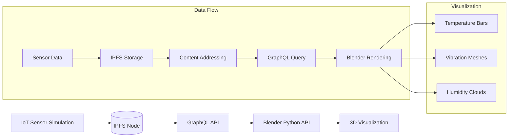
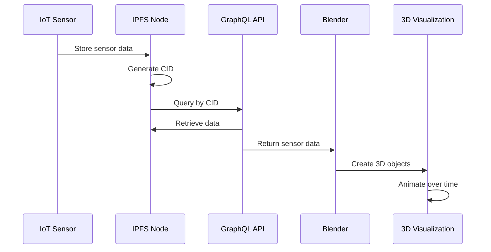

# IoT Data in the Metaverse: IPFS + GraphQL + Blender

**Objective**: Master the intersection of IoT data streaming, decentralized storage, modern APIs, and 3D visualization by creating a distributed sculpture of sensor data. When you need to explore creative applications of IoT data, when you want to build decentralized data art, when you're curious about the intersection of sensors and 3D visualization—IoT + IPFS + GraphQL + Blender becomes your weapon of choice.

What happens when you take raw sensor data, freeze it into content-addressable objects, expose it via GraphQL, and render it into Blender? You get a distributed sculpture of data that transforms telemetry into living, breathing 3D art.

## 0) Prerequisites (Read Once, Live by Them)

### The Five Commandments

1. **Understand IoT data streaming**
   - Sensor data simulation and real-time processing
   - Asyncio for concurrent data generation
   - Data batching and persistence strategies
   - Time series data structures and formats

2. **Master IPFS fundamentals**
   - Content-addressed storage and immutability
   - IPFS node setup and API operations
   - Decentralized data persistence
   - Content addressing and hash-based storage

3. **Know your GraphQL APIs**
   - Schema design and type definitions
   - Query resolvers and data fetching
   - API integration and client consumption
   - Modern API patterns and best practices

4. **Validate everything**
   - Test IoT data generation and streaming
   - Verify IPFS storage and retrieval
   - Check GraphQL API functionality
   - Monitor Blender visualization performance

5. **Plan for creativity**
   - Design for artistic expression and experimentation
   - Enable real-time data visualization
   - Support multiple data sources and formats
   - Document creative workflows and techniques

**Why These Principles**: Creative IoT technology requires understanding distributed systems, decentralized storage, and 3D visualization. Understanding these patterns prevents technical limitations and enables artistic expression.

## 1) Simulate IoT Data

### Async IoT Sensor Simulation

```python
# iot_simulator.py
import asyncio
import json
import random
import time
import aiohttp
from datetime import datetime

class IoTSensorSimulator:
    def __init__(self, sensor_id, base_url="http://localhost:5001"):
        self.sensor_id = sensor_id
        self.base_url = base_url
        self.session = None
        
    async def start_session(self):
        """Initialize HTTP session"""
        self.session = aiohttp.ClientSession()
        
    async def close_session(self):
        """Close HTTP session"""
        if self.session:
            await self.session.close()
    
    async def generate_sensor_data(self):
        """Generate realistic sensor data"""
        return {
            "sensor_id": self.sensor_id,
            "timestamp": time.time(),
            "datetime": datetime.now().isoformat(),
            "temperature": round(random.uniform(18, 25), 2),
            "humidity": round(random.uniform(30, 80), 2),
            "vibration": round(random.uniform(0.1, 1.5), 2),
            "pressure": round(random.uniform(1000, 1020), 2),
            "light": round(random.uniform(0, 1000), 2),
            "location": {
                "lat": round(random.uniform(40.7, 40.8), 6),
                "lon": round(random.uniform(-74.0, -73.9), 6)
            }
        }
    
    async def send_to_ipfs(self, data):
        """Send sensor data to IPFS"""
        try:
            async with self.session.post(
                f"{self.base_url}/api/v0/add",
                data=data
            ) as response:
                if response.status == 200:
                    result = await response.json()
                    return result.get("Hash")
                else:
                    print(f"Error sending to IPFS: {response.status}")
                    return None
        except Exception as e:
            print(f"Error in send_to_ipfs: {e}")
            return None
    
    async def run_sensor(self, interval=2):
        """Run sensor simulation"""
        await self.start_session()
        
        try:
            while True:
                # Generate sensor data
                data = await self.generate_sensor_data()
                
                # Convert to JSON string
                json_data = json.dumps(data)
                
                # Send to IPFS
                cid = await self.send_to_ipfs(json_data)
                
                if cid:
                    print(f"Sensor {self.sensor_id}: Data stored with CID {cid}")
                    print(f"Temperature: {data['temperature']}°C, Vibration: {data['vibration']}")
                else:
                    print(f"Sensor {self.sensor_id}: Failed to store data")
                
                await asyncio.sleep(interval)
                
        except KeyboardInterrupt:
            print(f"Sensor {self.sensor_id} stopped")
        finally:
            await self.close_session()

# Run multiple sensors
async def run_sensor_farm():
    """Run multiple IoT sensors"""
    sensors = [
        IoTSensorSimulator("sensor_001"),
        IoTSensorSimulator("sensor_002"),
        IoTSensorSimulator("sensor_003")
    ]
    
    tasks = [sensor.run_sensor() for sensor in sensors]
    await asyncio.gather(*tasks)

if __name__ == "__main__":
    asyncio.run(run_sensor_farm())
```

**Why IoT Simulation Matters**: Stand-in for real telemetry that generates realistic sensor data. Understanding these patterns prevents data generation issues and enables reliable IoT data streaming.

### Advanced Sensor Patterns

```python
# advanced_sensor.py
import asyncio
import numpy as np
from datetime import datetime, timedelta

class AdvancedIoTSensor:
    def __init__(self, sensor_id, sensor_type="temperature"):
        self.sensor_id = sensor_id
        self.sensor_type = sensor_type
        self.baseline = 20.0  # Baseline temperature
        self.trend = 0.0      # Temperature trend
        self.noise_level = 0.5
        
    def generate_trending_data(self):
        """Generate data with realistic trends and patterns"""
        # Simulate daily temperature cycle
        hour = datetime.now().hour
        daily_cycle = 5 * np.sin(2 * np.pi * hour / 24)
        
        # Add random walk trend
        self.trend += random.uniform(-0.1, 0.1)
        self.trend = max(-5, min(5, self.trend))  # Clamp trend
        
        # Add noise
        noise = random.gauss(0, self.noise_level)
        
        # Calculate final value
        value = self.baseline + daily_cycle + self.trend + noise
        
        return {
            "sensor_id": self.sensor_id,
            "sensor_type": self.sensor_type,
            "timestamp": time.time(),
            "value": round(value, 2),
            "trend": round(self.trend, 2),
            "confidence": round(1.0 - abs(noise) / 2.0, 2)
        }
    
    async def run_advanced_sensor(self, interval=1):
        """Run advanced sensor with realistic patterns"""
        while True:
            data = self.generate_trending_data()
            print(f"Advanced {self.sensor_type} sensor: {data}")
            await asyncio.sleep(interval)
```

**Why Advanced Patterns Matter**: Realistic sensor patterns create more interesting data for visualization. Understanding these patterns prevents boring data and enables sophisticated IoT simulations.

## 2) IPFS Setup (Decentralized Storage)

### Docker IPFS Setup

```yaml
# docker-compose.yml
version: "3.9"
services:
  ipfs:
    image: ipfs/kubo:latest
    container_name: ipfs
    ports:
      - "4001:4001"  # IPFS swarm
      - "5001:5001"  # IPFS API
      - "8080:8080"  # IPFS Gateway
    volumes:
      - ipfs_data:/data/ipfs
    environment:
      - IPFS_PROFILE=server
    command: daemon --migrate=true --agent-version-suffix=docker

volumes:
  ipfs_data:
```

**Why Docker Setup Matters**: IPFS container provides decentralized storage capabilities. Understanding these patterns prevents installation issues and enables consistent development environments.

### IPFS Operations

```python
# ipfs_client.py
import requests
import json
import time

class IPFSClient:
    def __init__(self, api_url="http://localhost:5001"):
        self.api_url = api_url
        
    def add_data(self, data):
        """Add data to IPFS"""
        try:
            if isinstance(data, dict):
                data = json.dumps(data)
            
            response = requests.post(
                f"{self.api_url}/api/v0/add",
                files={"file": data}
            )
            
            if response.status_code == 200:
                result = response.json()
                return result.get("Hash")
            else:
                print(f"Error adding to IPFS: {response.status_code}")
                return None
                
        except Exception as e:
            print(f"Error in add_data: {e}")
            return None
    
    def get_data(self, cid):
        """Retrieve data from IPFS"""
        try:
            response = requests.post(
                f"{self.api_url}/api/v0/cat",
                params={"arg": cid}
            )
            
            if response.status_code == 200:
                return response.text
            else:
                print(f"Error retrieving from IPFS: {response.status_code}")
                return None
                
        except Exception as e:
            print(f"Error in get_data: {e}")
            return None
    
    def pin_data(self, cid):
        """Pin data to prevent garbage collection"""
        try:
            response = requests.post(
                f"{self.api_url}/api/v0/pin/add",
                params={"arg": cid}
            )
            
            if response.status_code == 200:
                return True
            else:
                print(f"Error pinning data: {response.status_code}")
                return False
                
        except Exception as e:
            print(f"Error in pin_data: {e}")
            return False
    
    def list_pinned(self):
        """List pinned data"""
        try:
            response = requests.post(f"{self.api_url}/api/v0/pin/ls")
            
            if response.status_code == 200:
                return response.json()
            else:
                print(f"Error listing pinned data: {response.status_code}")
                return None
                
        except Exception as e:
            print(f"Error in list_pinned: {e}")
            return None

# Example usage
if __name__ == "__main__":
    client = IPFSClient()
    
    # Add some test data
    test_data = {"sensor": "test", "value": 25.5, "timestamp": time.time()}
    cid = client.add_data(test_data)
    
    if cid:
        print(f"Data stored with CID: {cid}")
        
        # Pin the data
        client.pin_data(cid)
        
        # Retrieve the data
        retrieved = client.get_data(cid)
        print(f"Retrieved data: {retrieved}")
```

**Why IPFS Operations Matter**: Content-addressing gives immutable history of sensor states. Understanding these patterns prevents data loss and enables reliable decentralized storage.

## 3) GraphQL API to Query IPFS Data

### Ariadne GraphQL Server

```python
# graphql_server.py
from ariadne import QueryType, make_executable_schema, graphql_sync
from flask import Flask, request, jsonify
import requests
import json
from datetime import datetime

# GraphQL schema
type_defs = """
type SensorData {
    sensor_id: String
    timestamp: Float
    datetime: String
    temperature: Float
    humidity: Float
    vibration: Float
    pressure: Float
    light: Float
    location: Location
}

type Location {
    lat: Float
    lon: Float
}

type Query {
    sensor(cid: String!): SensorData
    sensors(cids: [String!]!): [SensorData]
    search_sensors(sensor_id: String): [String]
}

type Mutation {
    add_sensor_data(data: String!): String
}
"""

query = QueryType()

@query.field("sensor")
def resolve_sensor(*_, cid):
    """Resolve single sensor data by CID"""
    try:
        response = requests.post(
            "http://localhost:5001/api/v0/cat",
            params={"arg": cid}
        )
        
        if response.status_code == 200:
            return json.loads(response.text)
        else:
            return None
            
    except Exception as e:
        print(f"Error resolving sensor: {e}")
        return None

@query.field("sensors")
def resolve_sensors(*_, cids):
    """Resolve multiple sensor data by CIDs"""
    results = []
    
    for cid in cids:
        try:
            response = requests.post(
                "http://localhost:5001/api/v0/cat",
                params={"arg": cid}
            )
            
            if response.status_code == 200:
                data = json.loads(response.text)
                results.append(data)
            else:
                results.append(None)
                
        except Exception as e:
            print(f"Error resolving sensor {cid}: {e}")
            results.append(None)
    
    return results

@query.field("search_sensors")
def resolve_search_sensors(*_, sensor_id):
    """Search for sensor data by sensor ID"""
    # This is a simplified search - in production you'd use a proper index
    try:
        # Get list of pinned data
        response = requests.post("http://localhost:5001/api/v0/pin/ls")
        
        if response.status_code == 200:
            pinned_data = response.json()
            matching_cids = []
            
            # Check each pinned item for matching sensor_id
            for cid in pinned_data.get("Keys", {}):
                sensor_data = resolve_sensor(None, cid)
                if sensor_data and sensor_data.get("sensor_id") == sensor_id:
                    matching_cids.append(cid)
            
            return matching_cids
        else:
            return []
            
    except Exception as e:
        print(f"Error searching sensors: {e}")
        return []

# Create executable schema
schema = make_executable_schema(type_defs, query)

# Flask app
app = Flask(__name__)

@app.route("/graphql", methods=["POST"])
def graphql_server():
    """GraphQL endpoint"""
    data = request.get_json()
    success, result = graphql_sync(schema, data, context_value={}, debug=True)
    return jsonify(result)

@app.route("/health")
def health_check():
    """Health check endpoint"""
    return jsonify({"status": "healthy", "timestamp": datetime.now().isoformat()})

if __name__ == "__main__":
    app.run(host="0.0.0.0", port=5000, debug=True)
```

**Why GraphQL API Matters**: GraphQL = elegant filter/query layer on top of messy IPFS blobs. Understanding these patterns prevents data access issues and enables efficient data querying.

### Advanced GraphQL Features

```python
# advanced_graphql.py
from ariadne import QueryType, MutationType, make_executable_schema
from ariadne.asgi import GraphQL
import asyncio

# Advanced schema with subscriptions
advanced_type_defs = """
type SensorData {
    sensor_id: String
    timestamp: Float
    temperature: Float
    humidity: Float
    vibration: Float
    location: Location
}

type Location {
    lat: Float
    lon: Float
}

type Query {
    sensor(cid: String!): SensorData
    sensors_by_temperature(min_temp: Float, max_temp: Float): [SensorData]
    sensors_by_location(lat: Float, lon: Float, radius: Float): [SensorData]
}

type Mutation {
    add_sensor_data(data: String!): String
    batch_add_sensor_data(data: [String!]!): [String]
}

type Subscription {
    sensor_updates(sensor_id: String): SensorData
}
"""

query = QueryType()
mutation = MutationType()

@query.field("sensors_by_temperature")
def resolve_sensors_by_temperature(*_, min_temp=None, max_temp=None):
    """Filter sensors by temperature range"""
    # Implementation would query IPFS and filter by temperature
    pass

@query.field("sensors_by_location")
def resolve_sensors_by_location(*_, lat, lon, radius):
    """Filter sensors by location and radius"""
    # Implementation would query IPFS and filter by location
    pass

@mutation.field("batch_add_sensor_data")
def resolve_batch_add_sensor_data(*_, data):
    """Add multiple sensor data entries"""
    cids = []
    for item in data:
        cid = add_to_ipfs(item)
        if cid:
            cids.append(cid)
    return cids
```

**Why Advanced Features Matter**: Advanced GraphQL features enable sophisticated data querying and filtering. Understanding these patterns prevents API limitations and enables powerful data access.

## 4) Blender Visualization (Python Scripting)

### Blender Python API Integration

```python
# blender_visualizer.py
import bpy
import bmesh
import requests
import json
import time
from mathutils import Vector

class BlenderIoTVisualizer:
    def __init__(self, graphql_url="http://localhost:5000/graphql"):
        self.graphql_url = graphql_url
        self.objects = {}
        
    def query_sensor_data(self, cid):
        """Query sensor data from GraphQL API"""
        query = """
        query GetSensor($cid: String!) {
            sensor(cid: $cid) {
                sensor_id
                timestamp
                temperature
                humidity
                vibration
                location {
                    lat
                    lon
                }
            }
        }
        """
        
        variables = {"cid": cid}
        
        try:
            response = requests.post(
                self.graphql_url,
                json={"query": query, "variables": variables}
            )
            
            if response.status_code == 200:
                result = response.json()
                return result.get("data", {}).get("sensor")
            else:
                print(f"Error querying sensor data: {response.status_code}")
                return None
                
        except Exception as e:
            print(f"Error in query_sensor_data: {e}")
            return None
    
    def create_temperature_bar(self, sensor_data, location=(0, 0, 0)):
        """Create a bar representing temperature"""
        if not sensor_data:
            return None
            
        # Create cube for temperature bar
        bpy.ops.mesh.primitive_cube_add(location=location)
        cube = bpy.context.active_object
        cube.name = f"temp_bar_{sensor_data['sensor_id']}"
        
        # Scale based on temperature (normalize to 0-1 range)
        temp = sensor_data.get("temperature", 20)
        normalized_temp = (temp - 15) / 15  # Assume 15-30°C range
        height = max(0.1, normalized_temp * 5)  # Scale to 0-5 units
        
        cube.scale = (0.5, 0.5, height)
        cube.location.z = height / 2  # Position on ground
        
        # Color based on temperature
        material = bpy.data.materials.new(name=f"temp_material_{sensor_data['sensor_id']}")
        material.use_nodes = True
        material.node_tree.nodes.clear()
        
        # Add emission shader
        emission = material.node_tree.nodes.new(type="ShaderNodeEmission")
        output = material.node_tree.nodes.new(type="ShaderNodeOutputMaterial")
        
        # Color based on temperature
        if temp < 20:
            color = (0, 0, 1, 1)  # Blue for cold
        elif temp < 25:
            color = (0, 1, 0, 1)  # Green for normal
        else:
            color = (1, 0, 0, 1)  # Red for hot
            
        emission.inputs["Color"].default_value = color
        emission.inputs["Strength"].default_value = 2.0
        
        material.node_tree.links.new(emission.outputs["Emission"], output.inputs["Surface"])
        cube.data.materials.append(material)
        
        return cube
    
    def create_vibration_mesh(self, sensor_data, location=(0, 0, 0)):
        """Create a mesh that deforms based on vibration"""
        if not sensor_data:
            return None
            
        # Create sphere for vibration visualization
        bpy.ops.mesh.primitive_uv_sphere_add(location=location)
        sphere = bpy.context.active_object
        sphere.name = f"vibration_sphere_{sensor_data['sensor_id']}"
        
        # Get vibration value
        vibration = sensor_data.get("vibration", 0)
        
        # Apply displacement modifier based on vibration
        sphere.modifiers.new(name="Displace", type="DISPLACE")
        displace = sphere.modifiers["Displace"]
        displace.strength = vibration * 2  # Scale vibration to displacement
        
        # Create noise texture for displacement
        noise_texture = bpy.data.textures.new(name=f"noise_{sensor_data['sensor_id']}", type="NOISE")
        noise_texture.noise_scale = 0.5
        displace.texture = noise_texture
        
        return sphere
    
    def create_humidity_cloud(self, sensor_data, location=(0, 0, 0)):
        """Create a cloud-like object based on humidity"""
        if not sensor_data:
            return None
            
        # Create cloud using metaballs
        bpy.ops.object.metaball_add(type="BALL", location=location)
        cloud = bpy.context.active_object
        cloud.name = f"humidity_cloud_{sensor_data['sensor_id']}"
        
        # Scale based on humidity
        humidity = sensor_data.get("humidity", 50)
        normalized_humidity = humidity / 100
        scale = max(0.5, normalized_humidity * 3)
        cloud.scale = (scale, scale, scale)
        
        # Set material for cloud effect
        material = bpy.data.materials.new(name=f"cloud_material_{sensor_data['sensor_id']}")
        material.use_nodes = True
        material.node_tree.nodes.clear()
        
        # Add volume shader for cloud effect
        volume = material.node_tree.nodes.new(type="ShaderNodeVolumePrincipled")
        output = material.node_tree.nodes.new(type="ShaderNodeOutputMaterial")
        
        # Color based on humidity
        if humidity < 30:
            color = (1, 1, 0, 1)  # Yellow for dry
        elif humidity < 70:
            color = (0, 1, 1, 1)  # Cyan for normal
        else:
            color = (0, 0, 1, 1)  # Blue for humid
            
        volume.inputs["Color"].default_value = color
        volume.inputs["Density"].default_value = normalized_humidity * 2
        
        material.node_tree.links.new(volume.outputs["Volume"], output.inputs["Volume"])
        cloud.data.materials.append(material)
        
        return cloud
    
    def animate_sensor_data(self, cids, duration=10):
        """Animate sensor data over time"""
        frame_start = bpy.context.scene.frame_start
        frame_end = frame_start + duration * 24  # 24 fps
        
        for frame in range(frame_start, frame_end):
            bpy.context.scene.frame_set(frame)
            
            # Query current sensor data
            for cid in cids:
                sensor_data = self.query_sensor_data(cid)
                if sensor_data:
                    # Update visualization based on current data
                    self.update_visualization(sensor_data)
            
            # Small delay to prevent overwhelming the API
            time.sleep(0.1)
    
    def update_visualization(self, sensor_data):
        """Update existing visualization with new data"""
        sensor_id = sensor_data["sensor_id"]
        
        # Update temperature bar
        if f"temp_bar_{sensor_id}" in bpy.data.objects:
            bar = bpy.data.objects[f"temp_bar_{sensor_id}"]
            temp = sensor_data.get("temperature", 20)
            normalized_temp = (temp - 15) / 15
            height = max(0.1, normalized_temp * 5)
            
            bar.scale.z = height
            bar.location.z = height / 2
            
            # Keyframe the animation
            bar.keyframe_insert(data_path="scale", index=2)
            bar.keyframe_insert(data_path="location", index=2)
        
        # Update vibration sphere
        if f"vibration_sphere_{sensor_id}" in bpy.data.objects:
            sphere = bpy.data.objects[f"vibration_sphere_{sensor_id}"]
            vibration = sensor_data.get("vibration", 0)
            
            # Update displacement strength
            if "Displace" in sphere.modifiers:
                displace = sphere.modifiers["Displace"]
                displace.strength = vibration * 2
                displace.keyframe_insert(data_path="strength")

# Example usage in Blender
def main():
    visualizer = BlenderIoTVisualizer()
    
    # Example CIDs (replace with actual CIDs from your IPFS)
    cids = [
        "QmExampleCid123",
        "QmExampleCid456",
        "QmExampleCid789"
    ]
    
    # Create initial visualizations
    for i, cid in enumerate(cids):
        sensor_data = visualizer.query_sensor_data(cid)
        if sensor_data:
            location = (i * 3, 0, 0)  # Space out the objects
            visualizer.create_temperature_bar(sensor_data, location)
            visualizer.create_vibration_mesh(sensor_data, (i * 3, 2, 0))
            visualizer.create_humidity_cloud(sensor_data, (i * 3, 4, 0))
    
    # Animate the data
    visualizer.animate_sensor_data(cids, duration=30)

if __name__ == "__main__":
    main()
```

**Why Blender Visualization Matters**: Data directly deforms geometry; the DB becomes sculpture. Understanding these patterns prevents static visualizations and enables dynamic 3D art creation.

## 5) Architecture Diagram

### System Flow



**Why Architecture Diagrams Matter**: Visual representation of data flow enables understanding of system components. Understanding these patterns prevents architectural confusion and enables reliable system design.

### Data Pipeline



**Why Data Pipeline Matters**: Understanding the complete data flow enables effective system design. Understanding these patterns prevents data flow issues and enables reliable visualization.

## 6) Weird Extensions

### Real-Time IPFS PubSub

```python
# real_time_ipfs.py
import asyncio
import aiohttp
import json

class IPFSPubSub:
    def __init__(self, api_url="http://localhost:5001"):
        self.api_url = api_url
        self.session = None
        
    async def subscribe_to_topic(self, topic):
        """Subscribe to IPFS pubsub topic"""
        self.session = aiohttp.ClientSession()
        
        async with self.session.post(
            f"{self.api_url}/api/v0/pubsub/sub",
            params={"arg": topic}
        ) as response:
            async for line in response.content:
                if line:
                    try:
                        data = json.loads(line.decode())
                        yield data
                    except json.JSONDecodeError:
                        continue
    
    async def publish_to_topic(self, topic, data):
        """Publish data to IPFS pubsub topic"""
        async with aiohttp.ClientSession() as session:
            async with session.post(
                f"{self.api_url}/api/v0/pubsub/pub",
                params={"arg": topic},
                data=json.dumps(data)
            ) as response:
                return response.status == 200

# Real-time sensor streaming
async def stream_sensors():
    pubsub = IPFSPubSub()
    
    async for message in pubsub.subscribe_to_topic("sensor_data"):
        print(f"Real-time sensor data: {message}")
        # Process real-time data in Blender
        process_realtime_data(message)
```

**Why Real-Time Streaming Matters**: IPFS pubsub enables real-time data streaming instead of batch processing. Understanding these patterns prevents data delays and enables live visualization.

### Geospatial IoT Visualization

```python
# geospatial_visualizer.py
import bpy
import mathutils
from mathutils import Vector

class GeospatialIoTVisualizer:
    def __init__(self):
        self.base_location = Vector((0, 0, 0))
        self.scale_factor = 1000  # Scale for visualization
        
    def create_geospatial_map(self, sensor_data_list):
        """Create a 3D map from geospatial sensor data"""
        # Create base plane for the map
        bpy.ops.mesh.primitive_plane_add(size=10, location=(0, 0, 0))
        map_plane = bpy.context.active_object
        map_plane.name = "geospatial_map"
        
        # Add sensor markers
        for sensor_data in sensor_data_list:
            location = sensor_data.get("location", {})
            lat = location.get("lat", 0)
            lon = location.get("lon", 0)
            
            # Convert lat/lon to 3D coordinates
            x = lon * self.scale_factor
            y = lat * self.scale_factor
            z = 0
            
            # Create marker at location
            self.create_sensor_marker(sensor_data, (x, y, z))
    
    def create_sensor_marker(self, sensor_data, location):
        """Create a 3D marker for sensor location"""
        # Create cylinder for marker
        bpy.ops.mesh.primitive_cylinder_add(location=location)
        marker = bpy.context.active_object
        marker.name = f"sensor_marker_{sensor_data['sensor_id']}"
        
        # Scale based on sensor data
        temp = sensor_data.get("temperature", 20)
        height = (temp - 15) / 15 * 2  # Scale temperature to height
        marker.scale = (0.2, 0.2, height)
        
        # Color based on temperature
        material = bpy.data.materials.new(name=f"marker_material_{sensor_data['sensor_id']}")
        material.use_nodes = True
        
        # Temperature-based coloring
        if temp < 20:
            color = (0, 0, 1, 1)  # Blue for cold
        elif temp < 25:
            color = (0, 1, 0, 1)  # Green for normal
        else:
            color = (1, 0, 0, 1)  # Red for hot
            
        material.node_tree.nodes["Principled BSDF"].inputs["Base Color"].default_value = color
        marker.data.materials.append(material)
        
        return marker
    
    def create_heat_map(self, sensor_data_list):
        """Create a heat map from sensor data"""
        # Create grid of points
        grid_size = 20
        for x in range(grid_size):
            for y in range(grid_size):
                # Calculate temperature at this grid point
                temp = self.interpolate_temperature(x, y, sensor_data_list)
                
                # Create cube at this position
                bpy.ops.mesh.primitive_cube_add(location=(x, y, 0))
                cube = bpy.context.active_object
                cube.name = f"heat_cell_{x}_{y}"
                
                # Scale based on temperature
                height = (temp - 15) / 15 * 2
                cube.scale = (0.5, 0.5, height)
                
                # Color based on temperature
                self.apply_temperature_color(cube, temp)
    
    def interpolate_temperature(self, x, y, sensor_data_list):
        """Interpolate temperature at grid point"""
        # Simple distance-based interpolation
        total_weight = 0
        weighted_temp = 0
        
        for sensor_data in sensor_data_list:
            location = sensor_data.get("location", {})
            lat = location.get("lat", 0)
            lon = location.get("lon", 0)
            
            # Convert to grid coordinates
            sensor_x = lon * self.scale_factor
            sensor_y = lat * self.scale_factor
            
            # Calculate distance
            distance = ((x - sensor_x) ** 2 + (y - sensor_y) ** 2) ** 0.5
            
            if distance > 0:
                weight = 1 / distance
                total_weight += weight
                weighted_temp += weight * sensor_data.get("temperature", 20)
        
        return weighted_temp / total_weight if total_weight > 0 else 20
    
    def apply_temperature_color(self, obj, temperature):
        """Apply temperature-based color to object"""
        material = bpy.data.materials.new(name=f"temp_material_{obj.name}")
        material.use_nodes = True
        
        # Temperature-based coloring
        if temperature < 20:
            color = (0, 0, 1, 1)  # Blue for cold
        elif temperature < 25:
            color = (0, 1, 0, 1)  # Green for normal
        else:
            color = (1, 0, 0, 1)  # Red for hot
            
        material.node_tree.nodes["Principled BSDF"].inputs["Base Color"].default_value = color
        obj.data.materials.append(material)
```

**Why Geospatial Visualization Matters**: Geospatial IoT data creates 3D maps and heat maps. Understanding these patterns prevents flat visualizations and enables dimensional data exploration.

## 7) Best Practices

### Performance Optimization

```python
# performance_optimizer.py
import time
import threading
from collections import deque

class PerformanceOptimizer:
    def __init__(self, max_cache_size=100):
        self.cache = {}
        self.cache_order = deque()
        self.max_cache_size = max_cache_size
        self.stats = {
            "cache_hits": 0,
            "cache_misses": 0,
            "api_calls": 0
        }
    
    def get_cached_data(self, cid):
        """Get data from cache if available"""
        if cid in self.cache:
            self.stats["cache_hits"] += 1
            return self.cache[cid]
        else:
            self.stats["cache_misses"] += 1
            return None
    
    def cache_data(self, cid, data):
        """Cache data with LRU eviction"""
        if len(self.cache) >= self.max_cache_size:
            # Remove oldest item
            oldest_cid = self.cache_order.popleft()
            del self.cache[oldest_cid]
        
        self.cache[cid] = data
        self.cache_order.append(cid)
    
    def optimize_blender_rendering(self):
        """Optimize Blender rendering performance"""
        # Set rendering settings for performance
        bpy.context.scene.render.engine = "BLENDER_EEVEE"
        bpy.context.scene.eevee.use_bloom = False
        bpy.context.scene.eevee.use_ssr = False
        bpy.context.scene.eevee.use_ssr_refraction = False
        
        # Reduce sample count for faster rendering
        bpy.context.scene.eevee.taa_render_samples = 16
        
        # Use viewport shading for real-time preview
        for area in bpy.context.screen.areas:
            if area.type == 'VIEW_3D':
                for space in area.spaces:
                    if space.type == 'VIEW_3D':
                        space.shading.type = 'MATERIAL'
```

**Why Performance Optimization Matters**: Optimized performance enables smooth real-time visualization. Understanding these patterns prevents frame drops and enables professional 3D art creation.

### Error Handling and Resilience

```python
# error_handler.py
import logging
import time
from functools import wraps

class IoTErrorHandler:
    def __init__(self):
        self.logger = logging.getLogger(__name__)
        self.retry_count = 3
        self.retry_delay = 1
    
    def retry_on_failure(self, func):
        """Decorator for retrying failed operations"""
        @wraps(func)
        def wrapper(*args, **kwargs):
            for attempt in range(self.retry_count):
                try:
                    return func(*args, **kwargs)
                except Exception as e:
                    self.logger.warning(f"Attempt {attempt + 1} failed: {e}")
                    if attempt < self.retry_count - 1:
                        time.sleep(self.retry_delay * (2 ** attempt))  # Exponential backoff
                    else:
                        self.logger.error(f"All attempts failed for {func.__name__}")
                        raise
            return None
        return wrapper
    
    def handle_ipfs_errors(self, func):
        """Handle IPFS-specific errors"""
        @wraps(func)
        def wrapper(*args, **kwargs):
            try:
                return func(*args, **kwargs)
            except requests.exceptions.ConnectionError:
                self.logger.error("IPFS node not available")
                return None
            except requests.exceptions.Timeout:
                self.logger.error("IPFS request timeout")
                return None
            except Exception as e:
                self.logger.error(f"IPFS error: {e}")
                return None
        return wrapper
    
    def handle_graphql_errors(self, func):
        """Handle GraphQL-specific errors"""
        @wraps(func)
        def wrapper(*args, **kwargs):
            try:
                return func(*args, **kwargs)
            except requests.exceptions.ConnectionError:
                self.logger.error("GraphQL API not available")
                return None
            except json.JSONDecodeError:
                self.logger.error("Invalid GraphQL response")
                return None
            except Exception as e:
                self.logger.error(f"GraphQL error: {e}")
                return None
        return wrapper
```

**Why Error Handling Matters**: Robust error handling prevents system failures and enables reliable data processing. Understanding these patterns prevents silent failures and enables resilient systems.

## 8) TL;DR Runbook

### Essential Commands

```bash
# Start IPFS node
docker run -d --name ipfs -p 4001:4001 -p 5001:5001 ipfs/kubo

# Start GraphQL API
python graphql_server.py

# Run IoT simulator
python iot_simulator.py

# In Blender, run the visualizer script
exec(open("blender_visualizer.py").read())
```

### Essential Patterns

```python
# Essential IoT + IPFS + GraphQL + Blender patterns
iot_visualization_patterns = {
    "data_simulation": "Async IoT sensors generate realistic telemetry data",
    "decentralized_storage": "IPFS ensures immutability and content addressing",
    "api_querying": "GraphQL prevents data overfetching when embedding into visual tools",
    "3d_visualization": "Blender Python API is a sandbox for experimental data sculptures",
    "real_time_rendering": "Combine all three for live data-driven 3D art",
    "performance": "Cache data, optimize rendering, handle errors gracefully"
}
```

### Quick Reference

```python
# Essential IoT + IPFS + GraphQL + Blender operations
# 1. Simulate IoT data
async def generate_sensor_data():
    return {"sensor_id": "001", "temperature": 25.5, "timestamp": time.time()}

# 2. Store in IPFS
cid = ipfs_client.add_data(sensor_data)

# 3. Query via GraphQL
query = "query { sensor(cid: \"QmExample\") { temperature } }"
response = requests.post(graphql_url, json={"query": query})

# 4. Visualize in Blender
bpy.ops.mesh.primitive_cube_add()
cube = bpy.context.active_object
cube.scale[2] = temperature / 10.0
```

**Why This Runbook**: These patterns cover 90% of IoT + IPFS + GraphQL + Blender needs. Master these before exploring advanced creative scenarios.

## 9) The Machine's Summary

IoT + IPFS + GraphQL + Blender requires understanding distributed systems, decentralized storage, modern APIs, and 3D visualization. When used correctly, this combination enables creative data visualization, artistic expression, and innovative ways to explore sensor data. The key is understanding data flow, mastering API integration, and following performance best practices.

**The Dark Truth**: Without proper IoT + IPFS + GraphQL + Blender understanding, your sensor data remains static and uncreative. This combination is your weapon. Use it wisely.

**The Machine's Mantra**: "In the sensors we trust, in the IPFS we store, in the GraphQL we query, and in the Blender we sculpt the data into art."

**Why This Matters**: IoT + IPFS + GraphQL + Blender enables efficient creative data visualization that can handle complex sensor datasets, maintain decentralized storage, and provide artistic experiences while ensuring data integrity and visual quality.

---

*This tutorial provides the complete machinery for IoT + IPFS + GraphQL + Blender art creation. The patterns scale from simple sensor visualization to complex distributed data sculptures, from basic 3D rendering to advanced real-time art.*
