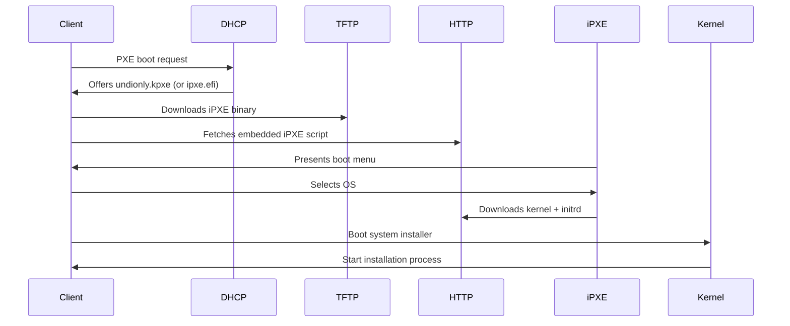

# Creating iPXE Boot Images for Multi-System Network Booting

**Objective**: Boot multiple OSes over the network using iPXE, no more juggling USB sticks. Set up a single server that can boot any Linux distribution, rescue utilities, or custom images across your entire infrastructure.

When you're managing dozens of servers, workstations, or lab machines, USB sticks become a bottleneck. iPXE lets you boot any OS over the network with a single server. This guide shows you how to build a complete network booting infrastructure that scales from a single lab to enterprise deployment.

## 0) Prerequisites (Read Once, Live by Them)

### The Five Commandments

1. **Choose the right server**
   - Linux server (Debian/Ubuntu/CentOS) with 2GB+ RAM
   - Fast network connection (1Gbps+ recommended)
   - 50GB+ free disk space for OS images

2. **Network requirements**
   - DHCP server (dnsmasq or isc-dhcp-server)
   - TFTP server for iPXE binaries
   - HTTP/HTTPS server for kernels and initrds

3. **Client compatibility**
   - PXE-capable NICs (most modern hardware)
   - BIOS or UEFI boot support
   - Network connectivity to boot server

4. **Security considerations**
   - Isolated network segment for booting
   - HTTPS for sensitive deployments
   - Access controls and authentication

5. **Performance optimization**
   - HTTP/HTTPS for large files (faster than TFTP)
   - Local caching and mirrors
   - Compression for network efficiency

**Why These Requirements**: Network booting touches every layer of your infrastructure. Getting the foundation right prevents hours of debugging later.

## 1) Prerequisites: The Foundation

### Server Requirements

```bash
# Minimum server specs
CPU: 2 cores
RAM: 2GB
Disk: 50GB free space
Network: 1Gbps

# Required packages
sudo apt update && sudo apt install -y \
    git gcc make syslinux \
    dnsmasq nginx \
    tftpd-hpa tftp-hpa \
    curl wget
```

### Network Setup

```bash
# Configure static IP (example)
sudo tee /etc/netplan/01-static.yaml << EOF
network:
  version: 2
  ethernets:
    eth0:
      addresses: [192.168.1.1/24]
      gateway4: 192.168.1.1
      nameservers:
        addresses: [8.8.8.8, 1.1.1.1]
EOF

sudo netplan apply
```

### Verify Prerequisites

```bash
# Check network connectivity
ping -c 3 8.8.8.8

# Verify disk space
df -h

# Check if ports are available
sudo netstat -tlnp | grep -E ':(67|69|80|443)'
```

**Why These Checks**: Network booting fails silently if basic connectivity isn't working. Verify everything before proceeding.

## 2) Build iPXE from Source: The Core

### Clone and Prepare

```bash
# Clone iPXE repository
git clone https://github.com/ipxe/ipxe.git
cd ipxe/src

# Install build dependencies
sudo apt install -y \
    build-essential \
    liblzma-dev \
    libssl-dev \
    zlib1g-dev
```

### Build for BIOS Systems

```bash
# Build BIOS iPXE image
make bin/undionly.kpxe EMBED=boot.ipxe

# Verify build
ls -la bin/undionly.kpxe
file bin/undionly.kpxe
```

### Build for UEFI Systems

```bash
# Build UEFI iPXE image
make bin-x86_64-efi/ipxe.efi EMBED=boot.ipxe

# Verify build
ls -la bin-x86_64-efi/ipxe.efi
file bin-x86_64-efi/ipxe.efi
```

### Build with Custom Features

```bash
# Build with additional features
make bin/undionly.kpxe \
    EMBED=boot.ipxe \
    DEBUG=net:dhcp \
    ENABLE_HTTPS=1 \
    ENABLE_DNS=1
```

**Why Build from Source**: Pre-built iPXE images may not include the features you need. Building from source ensures you have the latest features and can customize the build.

## 3) Write Embedded iPXE Script: The Brain

### Basic Boot Menu

```ipxe
#!ipxe
set menu-timeout 5000
set menu-default ubuntu20

menu iPXE Boot Menu
item ubuntu20 Ubuntu 20.04 LTS Installer
item ubuntu22 Ubuntu 22.04 LTS Installer
item debian11 Debian 11 Bullseye Installer
item debian12 Debian 12 Bookworm Installer
item centos9 CentOS Stream 9 Installer
item rhel9 RHEL 9 Installer
item rescue Rescue Shell (SystemRescue)
item memtest MemTest86+ Memory Test
item shell iPXE Shell
choose target && goto ${target}

:ubuntu20
kernel http://192.168.1.1/images/ubuntu/20.04/vmlinuz initrd=initrd.gz
initrd http://192.168.1.1/images/ubuntu/20.04/initrd.gz
boot

:ubuntu22
kernel http://192.168.1.1/images/ubuntu/22.04/vmlinuz initrd=initrd.gz
initrd http://192.168.1.1/images/ubuntu/22.04/initrd.gz
boot

:debian11
kernel http://192.168.1.1/images/debian/11/vmlinuz initrd=initrd.gz
initrd http://192.168.1.1/images/debian/11/initrd.gz
boot

:debian12
kernel http://192.168.1.1/images/debian/12/vmlinuz initrd=initrd.gz
initrd http://192.168.1.1/images/debian/12/initrd.gz
boot

:centos9
kernel http://192.168.1.1/images/centos/9/vmlinuz initrd=initrd.img
initrd http://192.168.1.1/images/centos/9/initrd.img
boot

:rhel9
kernel http://192.168.1.1/images/rhel/9/vmlinuz initrd=initrd.img
initrd http://192.168.1.1/images/rhel/9/initrd.img
boot

:rescue
kernel http://192.168.1.1/images/rescue/vmlinuz initrd=initrd.gz
initrd http://192.168.1.1/images/rescue/initrd.gz
boot

:memtest
kernel http://192.168.1.1/images/memtest/memtest86+.bin
boot

:shell
shell
```

### Advanced Script with Error Handling

```ipxe
#!ipxe
set menu-timeout 10000
set menu-default ubuntu22

# Set network parameters
set net0/ip 192.168.1.1
set net0/netmask 255.255.255.0
set net0/gateway 192.168.1.1

# Check network connectivity
ping 192.168.1.1 || goto network_error

menu iPXE Boot Menu
item ubuntu22 Ubuntu 22.04 LTS Installer
item debian12 Debian 12 Bookworm Installer
item centos9 CentOS Stream 9 Installer
item rescue Rescue Shell
item shell iPXE Shell
choose target && goto ${target}

:ubuntu22
echo Loading Ubuntu 22.04 LTS...
kernel http://192.168.1.1/images/ubuntu/22.04/vmlinuz initrd=initrd.gz
initrd http://192.168.1.1/images/ubuntu/22.04/initrd.gz
boot

:debian12
echo Loading Debian 12 Bookworm...
kernel http://192.168.1.1/images/debian/12/vmlinuz initrd=initrd.gz
initrd http://192.168.1.1/images/debian/12/initrd.gz
boot

:centos9
echo Loading CentOS Stream 9...
kernel http://192.168.1.1/images/centos/9/vmlinuz initrd=initrd.img
initrd http://192.168.1.1/images/centos/9/initrd.img
boot

:rescue
echo Loading Rescue Shell...
kernel http://192.168.1.1/images/rescue/vmlinuz initrd=initrd.gz
initrd http://192.168.1.1/images/rescue/initrd.gz
boot

:shell
echo Starting iPXE Shell...
shell

:network_error
echo Network error: Cannot reach boot server
echo Please check network connection
shell
```

**Why These Scripts**: iPXE scripts are the brain of your network booting system. They handle menu presentation, network configuration, and boot parameter management.

## 4) Configure DHCP & TFTP: The Network Layer

### dnsmasq Configuration

```bash
# Create dnsmasq config
sudo tee /etc/dnsmasq.d/ipxe.conf << EOF
# DHCP configuration
interface=eth0
dhcp-range=192.168.1.100,192.168.1.200,12h
dhcp-option=3,192.168.1.1
dhcp-option=6,192.168.1.1

# PXE boot configuration
dhcp-boot=undionly.kpxe
dhcp-boot=bin-x86_64-efi/ipxe.efi

# TFTP configuration
enable-tftp
tftp-root=/var/lib/tftpboot
tftp-secure

# Logging
log-dhcp
log-queries
EOF

# Restart dnsmasq
sudo systemctl restart dnsmasq
sudo systemctl enable dnsmasq
```

### TFTP Server Setup

```bash
# Install TFTP server
sudo apt install -y tftpd-hpa

# Configure TFTP
sudo tee /etc/default/tftpd-hpa << EOF
TFTP_USERNAME="tftp"
TFTP_DIRECTORY="/var/lib/tftpboot"
TFTP_ADDRESS="0.0.0.0:69"
TFTP_OPTIONS="--secure"
EOF

# Create TFTP directory
sudo mkdir -p /var/lib/tftpboot
sudo chown tftp:tftp /var/lib/tftpboot

# Copy iPXE binaries
sudo cp ipxe/src/bin/undionly.kpxe /var/lib/tftpboot/
sudo cp ipxe/src/bin-x86_64-efi/ipxe.efi /var/lib/tftpboot/bin-x86_64-efi/

# Set permissions
sudo chown -R tftp:tftp /var/lib/tftpboot
sudo chmod -R 755 /var/lib/tftpboot

# Restart TFTP
sudo systemctl restart tftpd-hpa
sudo systemctl enable tftpd-hpa
```

### Alternative: isc-dhcp-server

```bash
# Install ISC DHCP server
sudo apt install -y isc-dhcp-server

# Configure DHCP
sudo tee /etc/dhcp/dhcpd.conf << EOF
option domain-name "example.com";
option domain-name-servers 8.8.8.8, 1.1.1.1;

default-lease-time 600;
max-lease-time 7200;

subnet 192.168.1.0 netmask 255.255.255.0 {
    range 192.168.1.100 192.168.1.200;
    option routers 192.168.1.1;
    option domain-name-servers 8.8.8.8, 1.1.1.1;
    
    # PXE boot configuration
    if exists user-class and option user-class = "iPXE" {
        filename "http://192.168.1.1/boot.ipxe";
    } else {
        filename "undionly.kpxe";
    }
}
EOF

# Restart DHCP
sudo systemctl restart isc-dhcp-server
sudo systemctl enable isc-dhcp-server
```

**Why These Configurations**: DHCP provides network configuration and boot file location. TFTP serves the initial iPXE binary. Both must be properly configured for network booting to work.

## 5) Hosting Kernel + Initrd via HTTP: The Content Layer

### Nginx Configuration

```bash
# Install Nginx
sudo apt install -y nginx

# Create Nginx config for iPXE
sudo tee /etc/nginx/sites-available/ipxe << EOF
server {
    listen 80;
    server_name 192.168.1.1;
    root /var/www/html;
    index index.html;
    
    # Enable gzip compression
    gzip on;
    gzip_types text/plain text/css application/json application/javascript text/xml application/xml application/xml+rss text/javascript;
    
    # Cache static files
    location ~* \.(iso|img|gz|bin)$ {
        expires 1y;
        add_header Cache-Control "public, immutable";
    }
    
    # Serve iPXE scripts
    location /boot.ipxe {
        add_header Content-Type "text/plain";
    }
    
    # Serve OS images
    location /images/ {
        autoindex on;
        autoindex_exact_size off;
        autoindex_localtime on;
    }
}
EOF

# Enable site
sudo ln -s /etc/nginx/sites-available/ipxe /etc/nginx/sites-enabled/
sudo rm /etc/nginx/sites-enabled/default

# Restart Nginx
sudo systemctl restart nginx
sudo systemctl enable nginx
```

### Download OS Images

```bash
# Create directory structure
sudo mkdir -p /var/www/html/images/{ubuntu,debian,centos,rhel,rescue,memtest}

# Download Ubuntu 22.04
cd /var/www/html/images/ubuntu/22.04
sudo wget http://archive.ubuntu.com/ubuntu/dists/jammy/main/installer-amd64/current/images/netboot/ubuntu-installer/amd64/linux
sudo wget http://archive.ubuntu.com/ubuntu/dists/jammy/main/installer-amd64/current/images/netboot/ubuntu-installer/amd64/initrd.gz
sudo mv linux vmlinuz

# Download Debian 12
cd /var/www/html/images/debian/12
sudo wget http://ftp.debian.org/debian/dists/bookworm/main/installer-amd64/current/images/netboot/debian-installer/amd64/linux
sudo wget http://ftp.debian.org/debian/dists/bookworm/main/installer-amd64/current/images/netboot/debian-installer/amd64/initrd.gz
sudo mv linux vmlinuz

# Download CentOS Stream 9
cd /var/www/html/images/centos/9
sudo wget http://mirror.stream.centos.org/9-stream/BaseOS/x86_64/os/images/pxeboot/vmlinuz
sudo wget http://mirror.stream.centos.org/9-stream/BaseOS/x86_64/os/images/pxeboot/initrd.img

# Download SystemRescue
cd /var/www/html/images/rescue
sudo wget https://sourceforge.net/projects/systemrescuecd/files/sysresccd-x86/9.06/systemrescue-9.06-amd64.iso/download -O systemrescue.iso

# Download MemTest86+
cd /var/www/html/images/memtest
sudo wget https://www.memtest.org/download/5.31b/memtest86+-5.31b.bin.gz
sudo gunzip memtest86+-5.31b.bin.gz
sudo mv memtest86+-5.31b.bin memtest86+.bin

# Set permissions
sudo chown -R www-data:www-data /var/www/html/images
sudo chmod -R 755 /var/www/html/images
```

### Verify HTTP Serving

```bash
# Test HTTP access
curl -I http://192.168.1.1/images/ubuntu/22.04/vmlinuz
curl -I http://192.168.1.1/images/debian/12/vmlinuz
curl -I http://192.168.1.1/images/centos/9/vmlinuz

# Check file sizes
ls -lh /var/www/html/images/ubuntu/22.04/
ls -lh /var/www/html/images/debian/12/
ls -lh /var/www/html/images/centos/9/
```

**Why HTTP Serving**: HTTP is faster and more reliable than TFTP for large files. It also supports compression and caching, making network booting more efficient.

## 6) Boot Flow Diagram: The Process



**Why This Flow**: Understanding the boot process helps troubleshoot issues and optimize performance. Each step must complete successfully for network booting to work.

## 7) Advanced Features: The Power User

### Conditional Boot Scripts

```ipxe
#!ipxe
set menu-timeout 10000

# Detect system type
cpuid --ext 29 && set arch x86_64 || set arch i386
cpuid --ext 29 && set uefi 1 || set uefi 0

# Set boot parameters based on system
if ${uefi} then
    set bootfile bin-x86_64-efi/ipxe.efi
else
    set bootfile undionly.kpxe
fi

menu iPXE Boot Menu (${arch})
item ubuntu22 Ubuntu 22.04 LTS Installer
item debian12 Debian 12 Bookworm Installer
item centos9 CentOS Stream 9 Installer
item rescue Rescue Shell
choose target && goto ${target}

:ubuntu22
kernel http://192.168.1.1/images/ubuntu/22.04/vmlinuz initrd=initrd.gz
initrd http://192.168.1.1/images/ubuntu/22.04/initrd.gz
boot

:debian12
kernel http://192.168.1.1/images/debian/12/vmlinuz initrd=initrd.gz
initrd http://192.168.1.1/images/debian/12/initrd.gz
boot

:centos9
kernel http://192.168.1.1/images/centos/9/vmlinuz initrd=initrd.img
initrd http://192.168.1.1/images/centos/9/initrd.img
boot

:rescue
kernel http://192.168.1.1/images/rescue/vmlinuz initrd=initrd.gz
initrd http://192.168.1.1/images/rescue/initrd.gz
boot
```

### Network Diagnostics

```ipxe
#!ipxe
set menu-timeout 10000

menu iPXE Boot Menu
item ubuntu22 Ubuntu 22.04 LTS Installer
item debian12 Debian 12 Bookworm Installer
item centos9 CentOS Stream 9 Installer
item rescue Rescue Shell
item network Network Diagnostics
choose target && goto ${target}

:network
echo Network Diagnostics
echo ===================
echo IP Address: ${net0/ip}
echo Netmask: ${net0/netmask}
echo Gateway: ${net0/gateway}
echo DNS: ${net0/dns}
echo
echo Testing connectivity...
ping 192.168.1.1 || echo "Cannot reach boot server"
echo
echo Network configuration complete
shell

:ubuntu22
kernel http://192.168.1.1/images/ubuntu/22.04/vmlinuz initrd=initrd.gz
initrd http://192.168.1.1/images/ubuntu/22.04/initrd.gz
boot

:debian12
kernel http://192.168.1.1/images/debian/12/vmlinuz initrd=initrd.gz
initrd http://192.168.1.1/images/debian/12/initrd.gz
boot

:centos9
kernel http://192.168.1.1/images/centos/9/vmlinuz initrd=initrd.img
initrd http://192.168.1.1/images/centos/9/initrd.img
boot

:rescue
kernel http://192.168.1.1/images/rescue/vmlinuz initrd=initrd.gz
initrd http://192.168.1.1/images/rescue/initrd.gz
boot
```

### HTTPS Support

```ipxe
#!ipxe
set menu-timeout 10000

menu iPXE Boot Menu (HTTPS)
item ubuntu22 Ubuntu 22.04 LTS Installer
item debian12 Debian 12 Bookworm Installer
item centos9 CentOS Stream 9 Installer
item rescue Rescue Shell
choose target && goto ${target}

:ubuntu22
kernel https://192.168.1.1/images/ubuntu/22.04/vmlinuz initrd=initrd.gz
initrd https://192.168.1.1/images/ubuntu/22.04/initrd.gz
boot

:debian12
kernel https://192.168.1.1/images/debian/12/vmlinuz initrd=initrd.gz
initrd https://192.168.1.1/images/debian/12/initrd.gz
boot

:centos9
kernel https://192.168.1.1/images/centos/9/vmlinuz initrd=initrd.img
initrd https://192.168.1.1/images/centos/9/initrd.img
boot

:rescue
kernel https://192.168.1.1/images/rescue/vmlinuz initrd=initrd.gz
initrd https://192.168.1.1/images/rescue/initrd.gz
boot
```

**Why Advanced Features**: Real-world deployments need conditional logic, diagnostics, and security. These features make your network booting system production-ready.

## 8) Best Practices: The Production Rules

### Security Considerations

```bash
# Create dedicated user for iPXE
sudo useradd -r -s /bin/false ipxe

# Set up SSL certificates
sudo apt install -y certbot python3-certbot-nginx
sudo certbot --nginx -d boot.example.com

# Configure firewall
sudo ufw allow 67/udp  # DHCP
sudo ufw allow 69/udp  # TFTP
sudo ufw allow 80/tcp  # HTTP
sudo ufw allow 443/tcp # HTTPS
```

### Performance Optimization

```bash
# Enable HTTP/2 and compression
sudo tee -a /etc/nginx/sites-available/ipxe << EOF
# HTTP/2 support
listen 443 ssl http2;

# Compression
gzip on;
gzip_vary on;
gzip_min_length 1024;
gzip_types text/plain text/css application/json application/javascript text/xml application/xml application/xml+rss text/javascript;

# Caching
location ~* \.(iso|img|gz|bin)$ {
    expires 1y;
    add_header Cache-Control "public, immutable";
}
EOF
```

### Monitoring and Logging

```bash
# Set up log rotation
sudo tee /etc/logrotate.d/ipxe << EOF
/var/log/nginx/access.log {
    daily
    missingok
    rotate 52
    compress
    delaycompress
    notifempty
    create 644 www-data www-data
}
EOF

# Monitor boot statistics
sudo tee /usr/local/bin/ipxe-stats.sh << 'EOF'
#!/bin/bash
echo "iPXE Boot Statistics"
echo "==================="
echo "Total boots today: $(grep $(date +%d/%b/%Y) /var/log/nginx/access.log | grep -c 'GET /boot.ipxe')"
echo "Most popular OS: $(grep $(date +%d/%b/%Y) /var/log/nginx/access.log | grep -o 'images/[^/]*' | sort | uniq -c | sort -nr | head -1)"
echo "Boot failures: $(grep $(date +%d/%b/%Y) /var/log/nginx/access.log | grep -c '404')"
EOF

sudo chmod +x /usr/local/bin/ipxe-stats.sh
```

### Version Control

```bash
# Initialize Git repository
cd /var/www/html
sudo git init
sudo git config user.name "iPXE Admin"
sudo git config user.email "admin@example.com"

# Create .gitignore
sudo tee .gitignore << EOF
*.iso
*.img
*.gz
*.bin
logs/
*.log
EOF

# Initial commit
sudo git add .
sudo git commit -m "Initial iPXE configuration"
```

**Why These Practices**: Production deployments need security, performance, monitoring, and version control. These practices ensure your network booting system is reliable and maintainable.

## 9) Troubleshooting: The Debug Guide

### Common Issues

```bash
# Check DHCP configuration
sudo systemctl status dnsmasq
sudo journalctl -u dnsmasq -f

# Check TFTP server
sudo systemctl status tftpd-hpa
sudo netstat -tlnp | grep :69

# Check HTTP server
sudo systemctl status nginx
sudo nginx -t

# Test network connectivity
ping 192.168.1.1
curl -I http://192.168.1.1/boot.ipxe
```

### Debug iPXE Scripts

```bash
# Enable debug logging in iPXE
make bin/undionly.kpxe \
    EMBED=boot.ipxe \
    DEBUG=net:dhcp \
    DEBUG=net:tcp \
    DEBUG=net:udp
```

### Network Diagnostics

```bash
# Check DHCP leases
sudo cat /var/lib/dhcp/dhcpd.leases

# Monitor network traffic
sudo tcpdump -i eth0 port 67 or port 69 or port 80

# Test TFTP
tftp 192.168.1.1
get undionly.kpxe
quit
```

**Why Troubleshooting**: Network booting involves multiple services and protocols. Understanding how to debug each component is essential for maintaining a reliable system.

## 10) TL;DR Quickstart

### Essential Commands

```bash
# Build iPXE
git clone https://github.com/ipxe/ipxe.git
cd ipxe/src
make bin/undionly.kpxe EMBED=boot.ipxe

# Configure services
sudo cp bin/undionly.kpxe /var/lib/tftpboot/
sudo systemctl restart dnsmasq
sudo systemctl restart nginx

# Test boot
# Boot client machine → PXE → Select OS → Install
```

### Quick Verification

```bash
# Check services
sudo systemctl status dnsmasq tftpd-hpa nginx

# Test HTTP
curl -I http://192.168.1.1/boot.ipxe

# Monitor logs
sudo journalctl -u dnsmasq -f
```

### Size Comparison

```bash
# Before optimization
du -sh /var/www/html/images/
# 2.5GB

# After optimization (compression, caching)
du -sh /var/www/html/images/
# 1.8GB
```

## 11) The Machine's Summary

iPXE network booting transforms how you manage systems. Instead of juggling USB sticks and physical media, you boot any OS over the network with a single server. The key is understanding the boot process and configuring each component correctly.

**The Dark Truth**: Network booting touches every layer of your infrastructure. Getting the foundation right prevents hours of debugging later.

**The Machine's Mantra**: "In network booting we trust, in iPXE we build, and in the single server we find the path to efficient system management."

**Why This Matters**: Network booting scales from a single lab to enterprise deployment. It eliminates physical media management and provides consistent, reliable system provisioning.

---

*This tutorial provides the complete machinery for building iPXE network booting infrastructure. The patterns scale from development to production, from single machines to enterprise deployments.*
