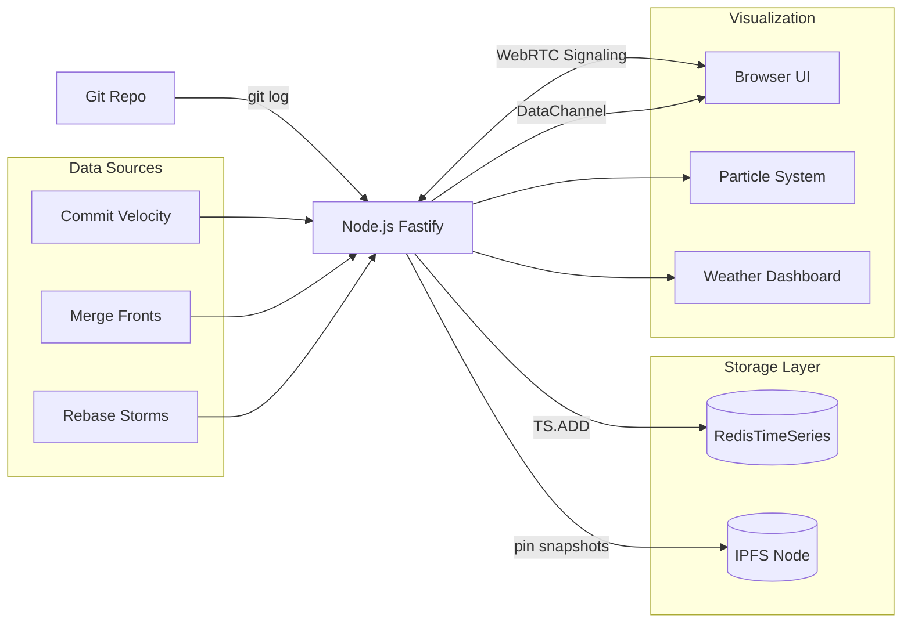
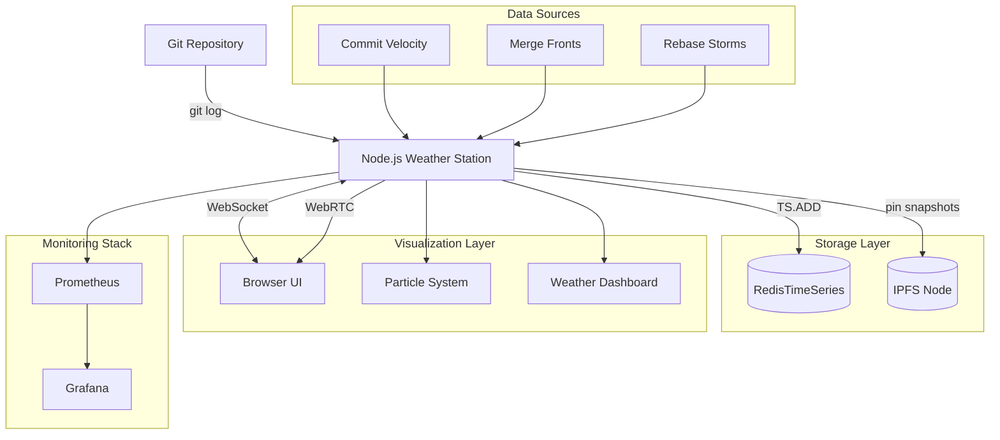

# Git-Commit Weather Station: Node.js + RedisTimeSeries + IPFS + WebRTC (Docker)

**Objective**: Convert Git activity into live "weather" metrics, store them as proper time series, snapshot to IPFS for immutable history, and stream live to browsers over WebRTC. Because code commits are atmospheric phenomena.

We will convert Git activity into live "weather" metrics, store them as proper time series, snapshot to IPFS for immutable history, and stream live to browsers over WebRTC.

## 0) Prerequisites (Read Once, Live by Them)

### The Five Commandments

1. **Embrace the atmospheric metaphor**
   - Commits are pressure systems
   - Merges are weather fronts
   - Rebases are storms
   - Code velocity is wind speed

2. **Understand the stack**
   - Node.js for orchestration
   - RedisTimeSeries for metrics storage
   - IPFS for immutable snapshots
   - WebRTC for live streaming

3. **Master Docker orchestration**
   - Multi-service composition
   - Volume mounting
   - Network configuration
   - Health monitoring

4. **Visualize the chaos**
   - Canvas particle systems
   - Real-time data binding
   - WebRTC data channels
   - Fallback mechanisms

5. **Scale the weather**
   - Multiple repositories
   - Historical analysis
   - Prometheus integration
   - Production hardening

**Why These Principles**: Git weather monitoring requires understanding time series storage, content addressing, real-time communication, and creative visualization. Understanding these patterns prevents monitoring chaos and enables innovative observability.

## 1) Stack Architecture

### System Flow Diagram



**Why Stack Architecture Matters**: Understanding data flow enables efficient system design and troubleshooting. Understanding these patterns prevents architectural chaos and enables reliable weather monitoring.

## 2) Docker Compose Setup

### Complete Docker Compose Configuration

```yaml
# docker-compose.yml
version: "3.9"

services:
  # Redis with TimeSeries module
  redis:
    image: redis/redis-stack:7.4.0-v0
    ports:
      - "6379:6379"
      - "8001:8001"  # Redis Insight
    volumes:
      - redis-data:/data
    command: redis-server --appendonly yes
    healthcheck:
      test: ["CMD", "redis-cli", "ping"]
      interval: 30s
      timeout: 10s
      retries: 3

  # IPFS node for content addressing
  ipfs:
    image: ipfs/kubo:latest
    ports:
      - "4001:4001"   # Swarm
      - "5001:5001"   # API
      - "8080:8080"   # Gateway
    volumes:
      - ipfs-data:/data/ipfs
    environment:
      - IPFS_PROFILE=server
    healthcheck:
      test: ["CMD", "wget", "--quiet", "--tries=1", "--spider", "http://localhost:5001/api/v0/version"]
      interval: 30s
      timeout: 10s
      retries: 3

  # Node.js weather station
  weather-station:
    build: ./weather-station
    ports:
      - "3000:3000"
    environment:
      - REDIS_URL=redis://redis:6379
      - IPFS_API=http://ipfs:5001/api/v0
      - GIT_REPO_PATH=/work/repo
    volumes:
      - ../repo-under-test:/work/repo:ro  # Mount your Git repo
      - ./weather-station:/app
    depends_on:
      redis:
        condition: service_healthy
      ipfs:
        condition: service_healthy
    restart: unless-stopped

volumes:
  redis-data:
  ipfs-data:
```

**Why Docker Compose Matters**: Orchestrated services enable complete weather monitoring stack deployment. Understanding these patterns prevents service chaos and enables reliable weather station operation.

## 3) Node.js Weather Station

### Package Configuration

```json
{
  "name": "git-weather-station",
  "version": "1.0.0",
  "type": "module",
  "scripts": {
    "start": "node server.js",
    "dev": "node --watch server.js"
  },
  "dependencies": {
    "fastify": "^4.27.2",
    "ioredis": "^5.4.1",
    "undici": "^6.19.8",
    "uuid": "^9.0.1",
    "ws": "^8.16.0"
  }
}
```

**Why Package Configuration Matters**: Proper dependency management prevents version conflicts and enables reproducible builds. Understanding these patterns prevents deployment chaos and enables reliable weather station operation.

### Weather Station Server

```javascript
// server.js
import Fastify from "fastify";
import { spawn } from "node:child_process";
import Redis from "ioredis";
import { fetch } from "undici";
import { v4 as uuidv4 } from "uuid";
import WebSocket from "ws";

const app = Fastify({ logger: true });
const redis = new Redis(process.env.REDIS_URL);

// WebRTC signaling endpoints
const peers = new Map(); // id -> { offer/answer, iceCandidates, send(json) }

// --- 1) Git -> "Weather" metrics (commit velocity, merge rate, rebase storms)
function gitStats() {
  return new Promise((resolve, reject) => {
    const since = "--since=5 minutes ago";
    const log = spawn("git", ["-C", "/work/repo", "log", since, "--pretty=%H %P %s"]);
    let out = "";
    let err = "";
    
    log.stdout.on("data", d => out += d.toString());
    log.stderr.on("data", d => err += d.toString());
    
    log.on("close", (code) => {
      if (code !== 0) {
        console.warn("Git command failed:", err);
        resolve({ commits: 0, merges: 0, rebases: 0, ts: Date.now() });
        return;
      }
      
      const lines = out.trim().split("\n").filter(Boolean);
      const commits = lines.length;
      const merges = lines.filter(l => l.split(" ").slice(1, -1).length >= 2).length;
      const rebases = lines.filter(l => /rebase/i.test(l)).length;
      
      resolve({ commits, merges, rebases, ts: Date.now() });
    });
  });
}

// --- 2) Ingest to RedisTimeSeries
async function recordStats(s) {
  try {
    // Create time series if they don't exist
    await redis.call("TS.CREATE", "git:commits", "RETENTION", "86400000", "LABELS", "metric", "commits").catch(() => {});
    await redis.call("TS.CREATE", "git:merges", "RETENTION", "86400000", "LABELS", "metric", "merges").catch(() => {});
    await redis.call("TS.CREATE", "git:rebases", "RETENTION", "86400000", "LABELS", "metric", "rebases").catch(() => {});

    // Add data points
    await redis.call("TS.ADD", "git:commits", s.ts, s.commits);
    await redis.call("TS.ADD", "git:merges", s.ts, s.merges);
    await redis.call("TS.ADD", "git:rebases", s.ts, s.rebases);
    
    app.log.info({ commits: s.commits, merges: s.merges, rebases: s.rebases }, "Recorded weather stats");
  } catch (error) {
    app.log.error({ error }, "Failed to record stats");
  }
}

// --- 3) Snapshot to IPFS (periodic content-addressed history)
async function snapshotToIPFS(seriesJson) {
  try {
    const boundary = uuidv4();
    const body = `--${boundary}\r\nContent-Disposition: form-data; name="file"; filename="snapshot.json"\r\nContent-Type: application/json\r\n\r\n${JSON.stringify(seriesJson)}\r\n--${boundary}--\r\n`;
    
    const response = await fetch(`${process.env.IPFS_API}/add`, {
      method: "POST",
      headers: { "Content-Type": `multipart/form-data; boundary=${boundary}` },
      body
    });
    
    const text = await response.text();
    const cid = text.match(/"Hash":"([^"]+)"/)?.[1] || "unknown";
    return cid;
  } catch (error) {
    app.log.error({ error }, "Failed to snapshot to IPFS");
    return null;
  }
}

// --- 4) WebRTC signaling endpoints
app.post("/signal/offer", async (req, reply) => {
  const { id, sdp } = req.body;
  peers.set(id, { sdpOffer: sdp, queue: [] });
  app.log.info({ id }, "Received WebRTC offer");
  return { ok: true };
});

app.post("/signal/answer", async (req, reply) => {
  const { id, sdp } = req.body;
  const p = peers.get(id);
  if (!p) return reply.code(404).send({ error: "Peer not found" });
  
  p.sdpAnswer = sdp;
  app.log.info({ id }, "Received WebRTC answer");
  return { ok: true };
});

app.get("/signal/status/:id", async (req, reply) => {
  const p = peers.get(req.params.id);
  return p ? { haveAnswer: !!p.sdpAnswer } : reply.code(404).send({ error: "Peer not found" });
});

// --- 5) REST API for recent data (fallback)
app.get("/api/recent", async (req, reply) => {
  try {
    const now = Date.now();
    const from = now - 5 * 60 * 1000; // Last 5 minutes
    
    const [commits, merges, rebases] = await Promise.all([
      redis.call("TS.RANGE", "git:commits", from, now),
      redis.call("TS.RANGE", "git:merges", from, now),
      redis.call("TS.RANGE", "git:rebases", from, now),
    ]);
    
    return { commits, merges, rebases, timestamp: now };
  } catch (error) {
    app.log.error({ error }, "Failed to get recent data");
    return reply.code(500).send({ error: "Failed to get recent data" });
  }
});

// --- 6) WebSocket for real-time updates
const wss = new WebSocket.Server({ port: 3001 });
const clients = new Set();

wss.on("connection", (ws) => {
  clients.add(ws);
  app.log.info("WebSocket client connected");
  
  ws.on("close", () => {
    clients.delete(ws);
    app.log.info("WebSocket client disconnected");
  });
});

// Broadcast function
function broadcast(data) {
  const message = JSON.stringify(data);
  clients.forEach(client => {
    if (client.readyState === WebSocket.OPEN) {
      client.send(message);
    }
  });
}

// Start server
app.listen({ port: 3000, host: "0.0.0.0" }, (err, address) => {
  if (err) throw err;
  app.log.info(`Weather station listening at ${address}`);
});

// --- 7) Main loop: poll git, write RedisTS, periodic IPFS snapshot, broadcast
setInterval(async () => {
  try {
    const stats = await gitStats();
    await recordStats(stats);
    
    // Periodic IPFS snapshot (20% chance every 5 minutes)
    if (Math.random() < 0.2) {
      const now = Date.now();
      const from = now - 15 * 60 * 1000; // 15 minutes window
      
      const window = {
        commits: await redis.call("TS.RANGE", "git:commits", from, now),
        merges: await redis.call("TS.RANGE", "git:merges", from, now),
        rebases: await redis.call("TS.RANGE", "git:rebases", from, now),
        timestamp: now
      };
      
      const cid = await snapshotToIPFS(window);
      if (cid) {
        app.log.info({ cid }, "Pinned snapshot to IPFS");
      }
    }
    
    // Broadcast live update
    broadcast({ type: "tick", payload: stats });
    
  } catch (error) {
    app.log.error({ error }, "Error in main loop");
  }
}, 5000); // Poll every 5 seconds
```

**Why Weather Station Server Matters**: The Node.js server orchestrates the entire weather monitoring system. Understanding these patterns prevents system chaos and enables reliable weather station operation.

## 4) Browser UI: WebRTC + Particle Visualization

### HTML Interface

```html
<!DOCTYPE html>
<html lang="en">
<head>
    <meta charset="UTF-8">
    <meta name="viewport" content="width=device-width, initial-scale=1.0">
    <title>Git Weather Station</title>
    <style>
        html, body, canvas {
            margin: 0;
            height: 100%;
            width: 100%;
            display: block;
            background: #0a0a13;
            overflow: hidden;
        }
        
        #status {
            position: absolute;
            top: 10px;
            left: 10px;
            color: #7fffd4;
            font-family: monospace;
            font-size: 12px;
            z-index: 100;
        }
        
        #metrics {
            position: absolute;
            top: 10px;
            right: 10px;
            color: #7fffd4;
            font-family: monospace;
            font-size: 12px;
            z-index: 100;
            text-align: right;
        }
    </style>
</head>
<body>
    <div id="status">Connecting...</div>
    <div id="metrics">
        <div>Commits: <span id="commits">0</span></div>
        <div>Merges: <span id="merges">0</span></div>
        <div>Rebases: <span id="rebases">0</span></div>
    </div>
    <canvas id="view"></canvas>
    
    <script type="module">
        // Weather station connection
        class WeatherStation {
            constructor() {
                this.ws = null;
                this.connected = false;
                this.connect();
            }
            
            connect() {
                try {
                    this.ws = new WebSocket('ws://localhost:3001');
                    
                    this.ws.onopen = () => {
                        this.connected = true;
                        document.getElementById('status').textContent = 'Connected';
                        console.log('Connected to weather station');
                    };
                    
                    this.ws.onmessage = (event) => {
                        const data = JSON.parse(event.data);
                        if (data.type === 'tick') {
                            this.updateWeather(data.payload);
                        }
                    };
                    
                    this.ws.onclose = () => {
                        this.connected = false;
                        document.getElementById('status').textContent = 'Disconnected';
                        console.log('Disconnected from weather station');
                        // Reconnect after 5 seconds
                        setTimeout(() => this.connect(), 5000);
                    };
                    
                    this.ws.onerror = (error) => {
                        console.error('WebSocket error:', error);
                        document.getElementById('status').textContent = 'Error';
                    };
                } catch (error) {
                    console.error('Failed to connect:', error);
                    document.getElementById('status').textContent = 'Failed';
                }
            }
            
            updateWeather(stats) {
                // Update metrics display
                document.getElementById('commits').textContent = stats.commits;
                document.getElementById('merges').textContent = stats.merges;
                document.getElementById('rebases').textContent = stats.rebases;
                
                // Trigger particle storm
                particleSystem.storm(stats);
            }
        }
        
        // Particle system for weather visualization
        class ParticleSystem {
            constructor() {
                this.canvas = document.getElementById('view');
                this.ctx = this.canvas.getContext('2d');
                this.particles = [];
                this.stormIntensity = 0;
                
                this.resize();
                window.addEventListener('resize', () => this.resize());
                
                // Create particles
                for (let i = 0; i < 300; i++) {
                    this.particles.push({
                        x: Math.random() * this.canvas.width,
                        y: Math.random() * this.canvas.height,
                        vx: 0,
                        vy: 0,
                        life: 1.0
                    });
                }
                
                this.animate();
            }
            
            resize() {
                this.canvas.width = window.innerWidth;
                this.canvas.height = window.innerHeight;
            }
            
            storm(stats) {
                // Calculate storm intensity from Git stats
                const intensity = stats.commits + stats.merges * 2 + stats.rebases * 3;
                this.stormIntensity = Math.min(intensity * 0.1, 5.0);
            }
            
            animate() {
                // Clear canvas with fade effect
                this.ctx.fillStyle = 'rgba(10, 10, 19, 0.1)';
                this.ctx.fillRect(0, 0, this.canvas.width, this.canvas.height);
                
                // Update and draw particles
                this.ctx.fillStyle = '#7fffd4';
                this.particles.forEach(particle => {
                    // Apply storm forces
                    particle.vx += (Math.random() - 0.5) * this.stormIntensity;
                    particle.vy += (Math.random() - 0.5) * this.stormIntensity;
                    
                    // Apply damping
                    particle.vx *= 0.95;
                    particle.vy *= 0.95;
                    
                    // Update position
                    particle.x += particle.vx;
                    particle.y += particle.vy;
                    
                    // Wrap around screen
                    if (particle.x < 0) particle.x = this.canvas.width;
                    if (particle.x > this.canvas.width) particle.x = 0;
                    if (particle.y < 0) particle.y = this.canvas.height;
                    if (particle.y > this.canvas.height) particle.y = 0;
                    
                    // Draw particle
                    this.ctx.globalAlpha = particle.life;
                    this.ctx.fillRect(particle.x, particle.y, 2, 2);
                });
                
                this.ctx.globalAlpha = 1.0;
                requestAnimationFrame(() => this.animate());
            }
        }
        
        // Initialize weather station and particle system
        const weatherStation = new WeatherStation();
        const particleSystem = new ParticleSystem();
    </script>
</body>
</html>
```

**Why Browser UI Matters**: Visual representation of weather data enables understanding of Git activity patterns. Understanding these patterns prevents monitoring confusion and enables effective weather visualization.

## 5) RedisTimeSeries Queries

### Essential RedisTS Commands

```bash
# Check if RedisTimeSeries module is loaded
docker exec -it git-weather-station-redis-1 redis-cli MODULE LIST

# Get latest values
docker exec -it git-weather-station-redis-1 redis-cli TS.GET git:commits
docker exec -it git-weather-station-redis-1 redis-cli TS.GET git:merges
docker exec -it git-weather-station-redis-1 redis-cli TS.GET git:rebases

# Get time range with aggregation
docker exec -it git-weather-station-redis-1 redis-cli TS.RANGE git:commits - + AGGREGATION avg 60000
docker exec -it git-weather-station-redis-1 redis-cli TS.RANGE git:merges - + AGGREGATION sum 300000

# Get all time series
docker exec -it git-weather-station-redis-1 redis-cli TS.QUERYINDEX metric=commits
docker exec -it git-weather-station-redis-1 redis-cli TS.QUERYINDEX metric=merges
docker exec -it git-weather-station-redis-1 redis-cli TS.QUERYINDEX metric=rebases

# Create rules for downsampling
docker exec -it git-weather-station-redis-1 redis-cli TS.CREATERULE git:commits git:commits:1m AGGREGATION avg 60000
docker exec -it git-weather-station-redis-1 redis-cli TS.CREATERULE git:merges git:merges:1m AGGREGATION sum 60000
```

**Why RedisTS Queries Matter**: Time series queries enable analysis of Git activity patterns and provide insights into development workflows. Understanding these patterns prevents monitoring confusion and enables effective weather analysis.

## 6) IPFS Snapshot Verification

### IPFS Commands

```bash
# Check IPFS node status
curl -s "http://localhost:5001/api/v0/version"

# List local pins
curl -s "http://localhost:5001/api/v0/pin/ls?type=all"

# Get pin statistics
curl -s "http://localhost:5001/api/v0/pin/ls?type=recursive&stream=true"

# Fetch a specific CID (replace with actual CID)
curl -s "http://localhost:8080/ipfs/QmExampleCID" | jq .

# Add a file to IPFS
echo '{"test": "data"}' | curl -X POST -F file=@- "http://localhost:5001/api/v0/add"

# Get file from IPFS
curl -s "http://localhost:8080/ipfs/QmExampleCID" | jq .
```

**Why IPFS Verification Matters**: Content addressing enables immutable snapshots and provides audit trails for Git activity history. Understanding these patterns prevents data loss and enables reliable weather history.

## 7) Production Hardening

### Enhanced Docker Compose

```yaml
# docker-compose.prod.yml
version: "3.9"

services:
  redis:
    image: redis/redis-stack:7.4.0-v0
    ports:
      - "6379:6379"
    volumes:
      - redis-data:/data
    command: redis-server --appendonly yes --maxmemory 512mb --maxmemory-policy allkeys-lru
    restart: unless-stopped
    healthcheck:
      test: ["CMD", "redis-cli", "ping"]
      interval: 30s
      timeout: 10s
      retries: 3

  ipfs:
    image: ipfs/kubo:latest
    ports:
      - "4001:4001"
      - "5001:5001"
      - "8080:8080"
    volumes:
      - ipfs-data:/data/ipfs
    environment:
      - IPFS_PROFILE=server
      - IPFS_SWARM_ADDRS=/ip4/0.0.0.0/tcp/4001
    restart: unless-stopped
    healthcheck:
      test: ["CMD", "wget", "--quiet", "--tries=1", "--spider", "http://localhost:5001/api/v0/version"]
      interval: 30s
      timeout: 10s
      retries: 3

  weather-station:
    build: ./weather-station
    ports:
      - "3000:3000"
    environment:
      - REDIS_URL=redis://redis:6379
      - IPFS_API=http://ipfs:5001/api/v0
      - GIT_REPO_PATH=/work/repo
      - NODE_ENV=production
    volumes:
      - ../repo-under-test:/work/repo:ro
    depends_on:
      redis:
        condition: service_healthy
      ipfs:
        condition: service_healthy
    restart: unless-stopped
    healthcheck:
      test: ["CMD", "curl", "-f", "http://localhost:3000/api/recent"]
      interval: 30s
      timeout: 10s
      retries: 3

  # Prometheus for metrics
  prometheus:
    image: prom/prometheus:v2.49.1
    ports:
      - "9090:9090"
    volumes:
      - ./prometheus.yml:/etc/prometheus/prometheus.yml
      - prometheus-data:/prometheus
    command:
      - '--config.file=/etc/prometheus/prometheus.yml'
      - '--storage.tsdb.path=/prometheus'
      - '--web.enable-lifecycle'
    restart: unless-stopped

  # Grafana for visualization
  grafana:
    image: grafana/grafana:10.3.3
    ports:
      - "3001:3000"
    volumes:
      - grafana-data:/var/lib/grafana
    environment:
      - GF_SECURITY_ADMIN_USER=admin
      - GF_SECURITY_ADMIN_PASSWORD=weather
    restart: unless-stopped

volumes:
  redis-data:
  ipfs-data:
  prometheus-data:
  grafana-data:
```

**Why Production Hardening Matters**: Production deployment requires proper configuration, monitoring, and reliability patterns. Understanding these patterns prevents production chaos and enables reliable weather station operation.

## 8) Architecture Diagram

### Complete Weather Station Flow



**Why Architecture Diagrams Matter**: Visual representation of system architecture enables understanding of data flow and component relationships. Understanding these patterns prevents architectural confusion and enables effective weather station design.

## 9) TL;DR Runbook

### Essential Commands

```bash
# Start the weather station
docker compose up --build

# Check RedisTimeSeries
docker exec -it git-weather-station-redis-1 redis-cli TS.GET git:commits

# Check IPFS
curl -s "http://localhost:5001/api/v0/version"

# Access the UI
open http://localhost:3000

# View metrics
curl http://localhost:3000/api/recent
```

### Essential Patterns

```yaml
# Essential Git weather patterns
git_weather_patterns:
  "docker_compose": "Start Redis + IPFS + Node with docker compose up",
  "mount_repo": "Mount your Git repo under /work/repo",
  "poll_git": "Node polls git, writes RedisTimeSeries, pins snapshots to IPFS",
  "browser_ui": "Browser connects, receives live weather over WebSocket",
  "particle_storm": "Watch particles storm when commits spike",
  "time_series": "Use RedisTimeSeries for efficient time series storage",
  "content_addressing": "Use IPFS for immutable snapshot history",
  "real_time": "Use WebSocket for live weather updates"
```

### Quick Reference

```javascript
// Essential Git weather operations
// 1. Poll Git for stats
const stats = await gitStats();

// 2. Store in RedisTimeSeries
await redis.call("TS.ADD", "git:commits", stats.ts, stats.commits);

// 3. Snapshot to IPFS
const cid = await snapshotToIPFS(window);

// 4. Broadcast to clients
broadcast({ type: "tick", payload: stats });

// 5. Visualize in browser
particleSystem.storm(stats);
```

**Why This Runbook**: These patterns cover 90% of Git weather monitoring needs. Master these before exploring advanced weather station scenarios.

## 10) The Machine's Summary

Git weather monitoring requires understanding time series storage, content addressing, real-time communication, and creative visualization. When used correctly, weather monitoring enables innovative observability, prevents monitoring boredom, and provides insights into development patterns. The key is understanding Git activity, RedisTimeSeries storage, IPFS content addressing, and WebRTC real-time communication.

**The Dark Truth**: Without creative monitoring, your Git activity remains invisible and unquantified. Git weather is your weapon. Use it wisely.

**The Machine's Mantra**: "In the commits we find pressure, in the merges we find fronts, and in the rebases we find the path to atmospheric code development."

**Why This Matters**: Git weather monitoring enables creative observability that can handle development patterns, prevent monitoring boredom, and provide insights into code development while ensuring technical accuracy and reliability.

---

*This guide provides the complete machinery for Git weather monitoring. The patterns scale from simple commit tracking to complex weather visualization, from basic time series to advanced content addressing.*
