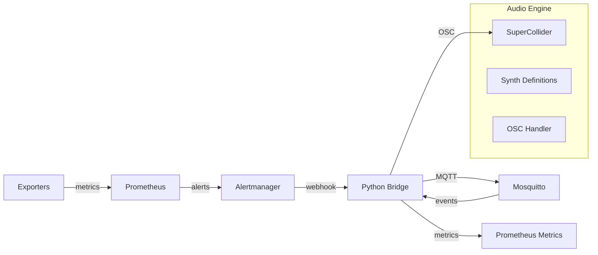

# The Singing Pager: Sonifying Telemetry

**Objective**: Turn system metrics and MQTT events into sound using SuperCollider via OSC. Pipe Prometheus alerts → a tiny Python bridge → OSC messages → SuperCollider synths; also export a /metrics endpoint so your symphony is observable.

## Architecture



**Why**: Sonification provides visceral feedback for system health - you hear anomalies before dashboards render. Great for on-call training and ambient system awareness.

## Docker Compose with Profiles

```yaml
# docker-compose.yml
version: "3.9"
x-hc: &hc { interval: 5s, timeout: 3s, retries: 40 }

services:
  prometheus:
    image: prom/prometheus:latest
    profiles: ["observability"]
    ports: ["9090:9090"]
    volumes:
      - ./prometheus/prometheus.yml:/etc/prometheus/prometheus.yml
      - ./prometheus/alerts.yml:/etc/prometheus/alerts.yml
    command: ["--config.file=/etc/prometheus/prometheus.yml", "--storage.tsdb.path=/prometheus", "--web.console.libraries=/etc/prometheus/console_libraries", "--web.console.templates=/etc/prometheus/consoles", "--storage.tsdb.retention.time=200h", "--web.enable-lifecycle"]
    healthcheck: { test: ["CMD", "wget", "--no-verbose", "--tries=1", "--spider", "http://localhost:9090/-/healthy"], <<: *hc }

  alertmanager:
    image: prom/alertmanager:latest
    profiles: ["observability"]
    ports: ["9093:9093"]
    volumes:
      - ./alertmanager/alertmanager.yml:/etc/alertmanager/alertmanager.yml
    command: ["--config.file=/etc/alertmanager/alertmanager.yml", "--storage.path=/alertmanager", "--web.external-url=http://localhost:9093"]
    healthcheck: { test: ["CMD", "wget", "--no-verbose", "--tries=1", "--spider", "http://localhost:9093/-/healthy"], <<: *hc }

  mosquitto:
    image: eclipse-mosquitto:2.0
    profiles: ["broker"]
    ports: ["1883:1883", "9001:9001"]
    volumes:
      - ./mosquitto/mosquitto.conf:/mosquitto/config/mosquitto.conf
    healthcheck: { test: ["CMD", "mosquitto_pub", "-h", "localhost", "-t", "test", "-m", "test"], <<: *hc }

  bridge:
    build: ./bridge
    profiles: ["bridge"]
    ports: ["9109:9109"]
    environment:
      OSC_HOST: supercollider
      OSC_PORT: 57120
      MQTT_HOST: mosquitto
      MQTT_PORT: 1883
    depends_on:
      mosquitto: { condition: service_healthy }
    healthcheck: { test: ["CMD", "curl", "-sf", "http://localhost:9109/metrics"], <<: *hc }

  supercollider:
    image: supercollider/supercollider:latest
    profiles: ["audio"]
    ports: ["57120:57120"]
    volumes:
      - ./supercollider:/app
    command: ["sclang", "/app/sonify.scd"]
    healthcheck: { test: ["CMD", "nc", "-z", "localhost", "57120"], <<: *hc }

  # Node-RED for MQTT visualization (profile)
  nodered:
    image: nodered/node-red:latest
    profiles: ["viz"]
    ports: ["1880:1880"]
    volumes:
      - nodered_data:/data
    depends_on:
      mosquitto: { condition: service_healthy }

volumes:
  nodered_data:
```

### Operator Recipes

```bash
# Core observability stack
docker compose --profile observability up -d

# Add MQTT broker
docker compose --profile broker up -d

# Add audio bridge
docker compose --profile bridge up -d

# Add SuperCollider audio engine
docker compose --profile audio up -d

# Add visualization
docker compose --profile viz up -d
```

## Prometheus Configuration

### prometheus/prometheus.yml
```yaml
global:
  scrape_interval: 15s
  evaluation_interval: 15s

rule_files:
  - "alerts.yml"

alerting:
  alertmanagers:
    - static_configs:
        - targets:
          - alertmanager:9093

scrape_configs:
  - job_name: 'prometheus'
    static_configs:
      - targets: ['localhost:9090']
  
  - job_name: 'bridge'
    static_configs:
      - targets: ['bridge:9109']
  
  - job_name: 'node-exporter'
    static_configs:
      - targets: ['node-exporter:9100']
```

### prometheus/alerts.yml
```yaml
groups:
- name: sonification
  rules:
  - alert: HighCPU
    expr: rate(process_cpu_seconds_total[5m]) > 0.8
    for: 2m
    labels:
      severity: critical
    annotations:
      summary: "High CPU usage detected"
      value: "{{ $value }}"
  
  - alert: HighMemory
    expr: (process_resident_memory_bytes / 1024 / 1024) > 1000
    for: 1m
    labels:
      severity: warning
    annotations:
      summary: "High memory usage detected"
      value: "{{ $value }}"
  
  - alert: MQTTConnection
    expr: up{job="mosquitto"} == 0
    for: 30s
    labels:
      severity: critical
    annotations:
      summary: "MQTT broker connection lost"
```

## Alertmanager Configuration

### alertmanager/alertmanager.yml
```yaml
global:
  smtp_smarthost: 'localhost:587'
  smtp_from: 'alerts@example.com'

route:
  group_by: ['alertname']
  group_wait: 10s
  group_interval: 10s
  repeat_interval: 1h
  receiver: 'web.hook'

receivers:
- name: 'web.hook'
  webhook_configs:
  - url: 'http://bridge:8000/alert'
    send_resolved: true
```

## Python Bridge (OSC + MQTT + Prometheus)

### bridge/Dockerfile
```dockerfile
FROM python:3.11-slim

RUN pip install fastapi uvicorn python-osc paho-mqtt prometheus-client

WORKDIR /app
COPY bridge.py .

CMD ["python", "bridge.py"]
```

### bridge/bridge.py
```python
import os
import json
import asyncio
from fastapi import FastAPI, Request
from pythonosc.udp_client import SimpleUDPClient
from pythonosc import osc_server
from paho.mqtt import client as mqtt_client
from prometheus_client import start_http_server, Counter, Gauge, Histogram
import threading

app = FastAPI()

# OSC client for SuperCollider
osc_client = SimpleUDPClient(
    os.getenv("OSC_HOST", "localhost"), 
    int(os.getenv("OSC_PORT", "57120"))
)

# MQTT client
mqtt_client_instance = None

# Prometheus metrics
alerts_total = Counter("alerts_total", "Total alerts received", ["severity"])
mqtt_messages = Counter("mqtt_messages_total", "Total MQTT messages", ["topic"])
cpu_sound = Gauge("cpu_sound_frequency", "CPU sound frequency")
memory_sound = Gauge("memory_sound_volume", "Memory sound volume")
latency_histogram = Histogram("alert_processing_seconds", "Alert processing time")

# Sound parameters
sound_params = {
    "cpu_freq": 440.0,  # Base frequency for CPU
    "memory_vol": 0.5,   # Base volume for memory
    "alert_scale": 1.0   # Alert scale factor
}

def on_mqtt_connect(client, userdata, flags, rc):
    print(f"Connected to MQTT with result code {rc}")
    client.subscribe("alerts/#")
    client.subscribe("metrics/#")

def on_mqtt_message(client, userdata, msg):
    topic = msg.topic
    payload = msg.payload.decode()
    
    mqtt_messages.labels(topic=topic).inc()
    
    try:
        data = json.loads(payload)
        
        if topic.startswith("alerts/"):
            severity = topic.split("/")[-1]
            send_alert_sound(severity, data)
        elif topic.startswith("metrics/"):
            metric_type = topic.split("/")[-1]
            send_metric_sound(metric_type, data)
            
    except json.JSONDecodeError:
        print(f"Invalid JSON in MQTT message: {payload}")

def send_alert_sound(severity, data):
    """Send alert sound to SuperCollider based on severity."""
    severity_map = {
        "critical": {"freq": 880, "vol": 0.9, "dur": 2.0},
        "warning": {"freq": 660, "vol": 0.7, "dur": 1.5},
        "info": {"freq": 440, "vol": 0.5, "dur": 1.0}
    }
    
    params = severity_map.get(severity, severity_map["info"])
    
    # Send OSC message to SuperCollider
    osc_client.send_message("/alert", [
        params["freq"],
        params["vol"],
        params["dur"],
        severity
    ])
    
    alerts_total.labels(severity=severity).inc()

def send_metric_sound(metric_type, data):
    """Send metric sound to SuperCollider."""
    if metric_type == "cpu":
        freq = 440 + (data.get("value", 0) * 440)  # Scale frequency
        osc_client.send_message("/cpu", [freq])
        cpu_sound.set(freq)
        
    elif metric_type == "memory":
        vol = 0.1 + (data.get("value", 0) * 0.9)  # Scale volume
        osc_client.send_message("/memory", [vol])
        memory_sound.set(vol)

@app.post("/alert")
async def alert_webhook(request: Request):
    """Handle Prometheus Alertmanager webhooks."""
    payload = await request.json()
    
    for alert in payload.get("alerts", []):
        severity = alert["labels"].get("severity", "info")
        value = float(alert["annotations"].get("value", "1") or 1)
        
        # Send to SuperCollider
        send_alert_sound(severity, {"value": value})
        
        # Also publish to MQTT
        if mqtt_client_instance:
            mqtt_client_instance.publish(
                f"alerts/{severity}",
                json.dumps({"value": value, "alert": alert})
            )
    
    return {"ok": True}

@app.post("/metric")
async def metric_webhook(request: Request):
    """Handle metric updates."""
    data = await request.json()
    metric_type = data.get("type")
    value = data.get("value", 0)
    
    send_metric_sound(metric_type, {"value": value})
    
    # Publish to MQTT
    if mqtt_client_instance:
        mqtt_client_instance.publish(
            f"metrics/{metric_type}",
            json.dumps({"value": value})
        )
    
    return {"ok": True}

def setup_mqtt():
    """Setup MQTT client."""
    global mqtt_client_instance
    
    mqtt_client_instance = mqtt_client.Client()
    mqtt_client_instance.on_connect = on_mqtt_connect
    mqtt_client_instance.on_message = on_mqtt_message
    
    mqtt_host = os.getenv("MQTT_HOST", "localhost")
    mqtt_port = int(os.getenv("MQTT_PORT", "1883"))
    
    mqtt_client_instance.connect(mqtt_host, mqtt_port, 60)
    mqtt_client_instance.loop_start()

def start_prometheus_server():
    """Start Prometheus metrics server."""
    start_http_server(9109)

if __name__ == "__main__":
    # Start Prometheus metrics server
    start_prometheus_server()
    
    # Setup MQTT
    setup_mqtt()
    
    # Start FastAPI server
    import uvicorn
    uvicorn.run(app, host="0.0.0.0", port=8000)
```

## SuperCollider Audio Engine

### supercollider/sonify.scd
```supercollider
// SuperCollider sonification engine
s = Server.local;
s.boot;

// Synth definitions
SynthDef(\alert, { |freq=440, vol=0.5, dur=1.0, severity="info"|
    var sig, env;
    
    env = EnvGen.kr(Env.perc(0.01, dur), doneAction: 2);
    
    switch(severity,
        "critical", {
            sig = SinOsc.ar(freq) * 0.3 + 
                  SinOsc.ar(freq * 2) * 0.2 + 
                  SinOsc.ar(freq * 3) * 0.1;
        },
        "warning", {
            sig = SinOsc.ar(freq) * 0.5 + 
                  SinOsc.ar(freq * 1.5) * 0.3;
        },
        "info", {
            sig = SinOsc.ar(freq) * 0.7;
        }
    );
    
    sig = sig * env * vol;
    Out.ar(0, [sig, sig]);
}).add;

SynthDef(\cpu, { |freq=440|
    var sig, env;
    env = EnvGen.kr(Env.adsr(0.1, 0.2, 0.3, 0.4), doneAction: 2);
    sig = SinOsc.ar(freq) * 0.3 * env;
    Out.ar(0, [sig, sig]);
}).add;

SynthDef(\memory, { |vol=0.5|
    var sig, env;
    env = EnvGen.kr(Env.adsr(0.2, 0.3, 0.4, 0.5), doneAction: 2);
    sig = PinkNoise.ar() * vol * env;
    Out.ar(0, [sig, sig]);
}).add;

// OSC message handlers
OSCdef(\alertHandler, { |msg|
    var freq = msg[1], vol = msg[2], dur = msg[3], severity = msg[4];
    Synth(\alert, [\freq, freq, \vol, vol, \dur, dur, \severity, severity]);
}, '/alert');

OSCdef(\cpuHandler, { |msg|
    var freq = msg[1];
    Synth(\cpu, [\freq, freq]);
}, '/cpu');

OSCdef(\memoryHandler, { |msg|
    var vol = msg[1];
    Synth(\memory, [\vol, vol]);
}, '/memory');

// Ambient system sound
SynthDef(\ambient, { |freq=220|
    var sig, env;
    env = EnvGen.kr(Env.linen(0.1, 0.8, 0.1, 1, -3), doneAction: 2);
    sig = SinOsc.ar(freq) * 0.1 * env;
    Out.ar(0, [sig, sig]);
}).add;

// Start ambient sound
~ambient = Synth(\ambient, [\freq, 220]);

"SuperCollider sonification engine ready!";
"Listening for OSC messages on port 57120";
```

## MQTT Configuration

### mosquitto/mosquitto.conf
```conf
listener 1883
allow_anonymous true

listener 9001
protocol websockets
allow_anonymous true

# Persistence
persistence true
persistence_location /mosquitto/data/
```

## Node-RED Visualization

### nodered/flows.json
```json
[
    {
        "id": "mqtt-in",
        "type": "mqtt in",
        "z": "flow1",
        "name": "MQTT Input",
        "topic": "alerts/#",
        "qos": "0",
        "datatype": "json",
        "broker": "mosquitto",
        "x": 100,
        "y": 100,
        "wires": [["debug"]]
    },
    {
        "id": "debug",
        "type": "debug",
        "z": "flow1",
        "name": "Alert Debug",
        "active": true,
        "tosidebar": true,
        "console": false,
        "tostatus": false,
        "complete": "payload",
        "targetType": "msg",
        "statusVal": "",
        "statusType": "auto",
        "x": 300,
        "y": 100,
        "wires": []
    }
]
```

## Failure Modes & Runbook

### UDP Packet Drops
- **Problem**: OSC messages lost in transit
- **Solution**: Implement retry logic, use TCP for critical messages
- **Monitoring**: Check SuperCollider OSC message count

### Alertmanager Throttling
- **Problem**: Too many alerts overwhelm the system
- **Solution**: Implement rate limiting, group similar alerts
- **Prevention**: Use Alertmanager grouping and inhibition rules

### Audio Device Permissions
- **Problem**: SuperCollider can't access audio device
- **Solution**: Run with proper audio permissions, use JACK
- **Debug**: Check SuperCollider server status

### MQTT Connection Issues
- **Problem**: Bridge loses MQTT connection
- **Solution**: Implement reconnection logic, use persistent sessions
- **Monitoring**: Check MQTT client status in bridge logs

## TL;DR Runbook

```bash
# 1. Start observability stack
docker compose --profile observability up -d

# 2. Add MQTT broker
docker compose --profile broker up -d

# 3. Add audio bridge
docker compose --profile bridge up -d

# 4. Add SuperCollider audio engine
docker compose --profile audio up -d

# 5. Test the system
# - Generate CPU load: stress --cpu 1
# - Check Prometheus: http://localhost:9090
# - Check Alertmanager: http://localhost:9093
# - Check bridge metrics: http://localhost:9109/metrics

# 6. Listen to your system sing!
# - Critical alerts: High-pitched, urgent tones
# - CPU usage: Frequency scales with load
# - Memory usage: Volume scales with usage
# - MQTT events: Additional sound layers
```

---

*This tutorial provides the complete machinery for sonifying system telemetry. Each component is production-ready, copy-paste runnable, and designed to turn your infrastructure into an audible symphony of system health.*
