# Creating Beautiful Diagrams with Mermaid in Markdown (MkDocs)

**Objective**: Master the art of creating dynamic, beautiful diagrams with Mermaid directly in your Markdown files, eliminating the need for static images and external diagramming tools.

Mermaid is a lightweight diagramming and charting tool that turns text into beautiful diagrams. It integrates seamlessly with MkDocs (especially when using the Material for MkDocs theme) and allows you to embed diagrams directly inside your Markdown files.

Instead of exporting static images, you define diagrams as code blocks and let Mermaid render them dynamically in your site.

## 1) Enabling Mermaid in MkDocs

### Install Material for MkDocs (Recommended)

```bash
pip install mkdocs-material
```

**Why**: Material for MkDocs provides the best Mermaid integration with proper syntax highlighting and rendering.

### Configure mkdocs.yml

```yaml
# mkdocs.yml
markdown_extensions:
  - admonition
  - pymdownx.superfences
  - pymdownx.tabbed
  - pymdownx.details
  - pymdownx.highlight
  - pymdownx.inlinehilite
  - pymdownx.snippets
  - pymdownx.superfences:
      custom_fences:
        - name: mermaid
          class: mermaid
          format: !!python/name:pymdownx.superfences.fence_code_format
```

**Why**: This configuration tells MkDocs to recognize fenced code blocks marked as `mermaid` and render them as interactive diagrams.

## 2) Your First Mermaid Diagram

### Basic Flowchart

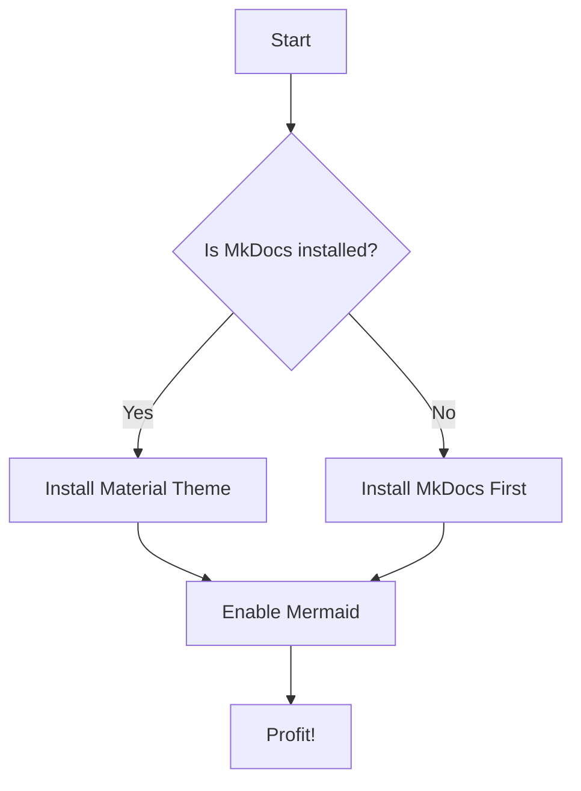

**The Magic**: This simple text becomes a beautiful, interactive flowchart. No external tools, no image files, just clean Markdown.

### Understanding the Syntax

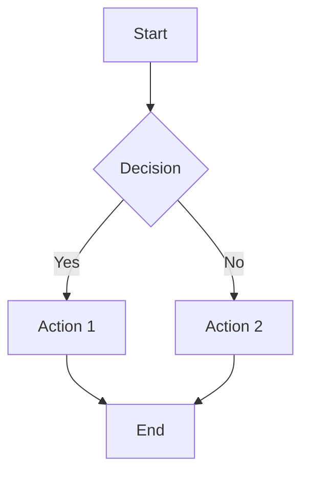

**Key Elements**:
- `graph TD` = Top-Down direction
- `[Text]` = Rectangle nodes
- `{Text}` = Diamond decision nodes
- `-->` = Arrows connecting nodes
- `-- Label -->` = Labeled arrows

## 3) Common Diagram Types

### Flowcharts

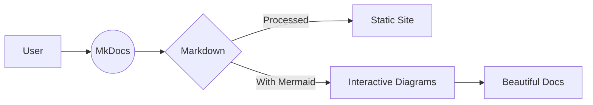

**Why Flowcharts Work**: Perfect for showing processes, workflows, and decision trees. The `flowchart` syntax is more modern than `graph`.

### Sequence Diagrams

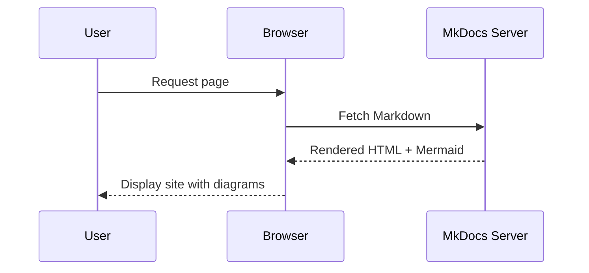

**Why Sequence Diagrams Matter**: Essential for showing interactions between systems, APIs, and user flows.

### Class Diagrams

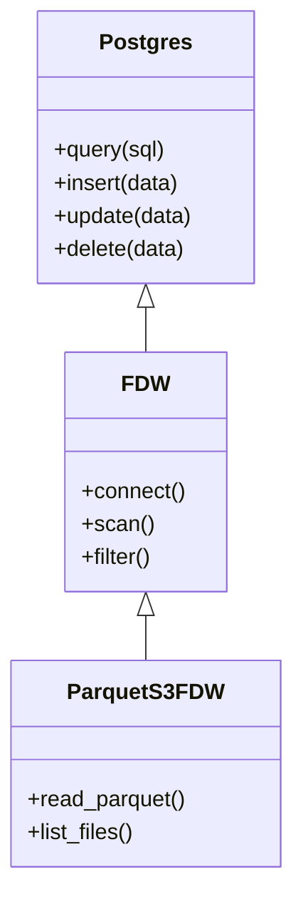

**Why Class Diagrams Help**: Perfect for documenting system architecture, database relationships, and API structures.

### State Diagrams

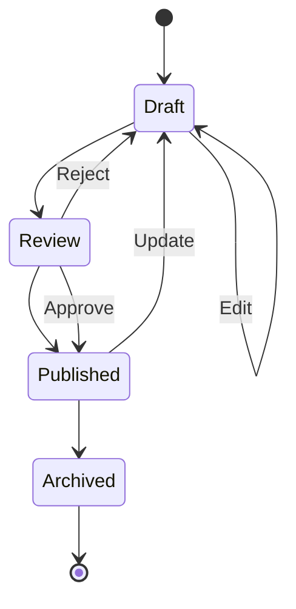

**Why State Diagrams Are Powerful**: Essential for showing system states, workflow stages, and lifecycle management.

### Gantt Charts

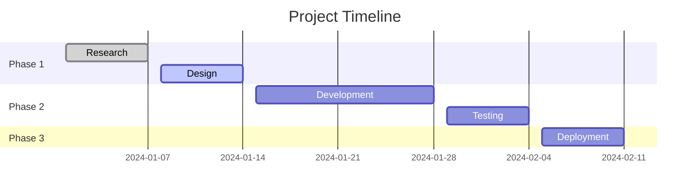

**Why Gantt Charts Matter**: Perfect for project planning, timeline visualization, and milestone tracking.

### Pie Charts

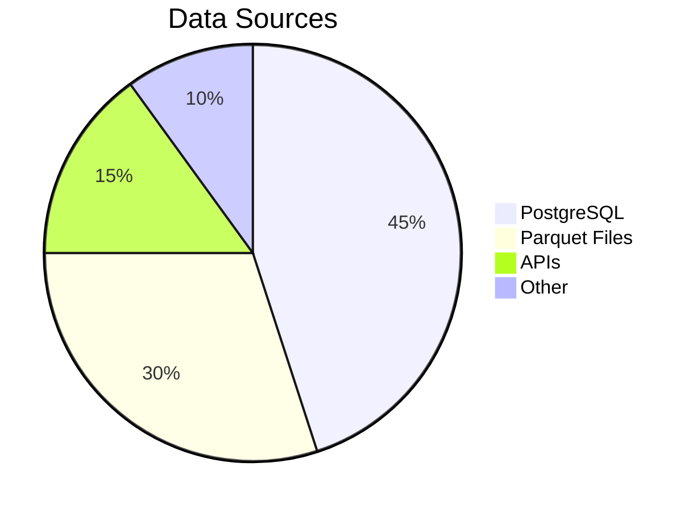

**Why Pie Charts Work**: Great for showing proportions, data distribution, and resource allocation.

## 4) Advanced Styling and Customization

### Custom Node Styling

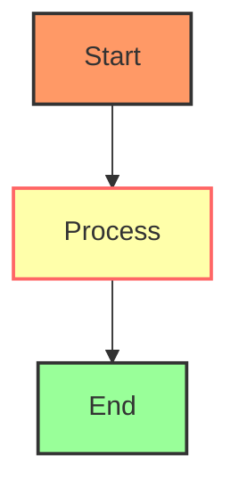

**Why Styling Matters**: Visual hierarchy and color coding make diagrams more readable and professional.

### Complex Flowcharts

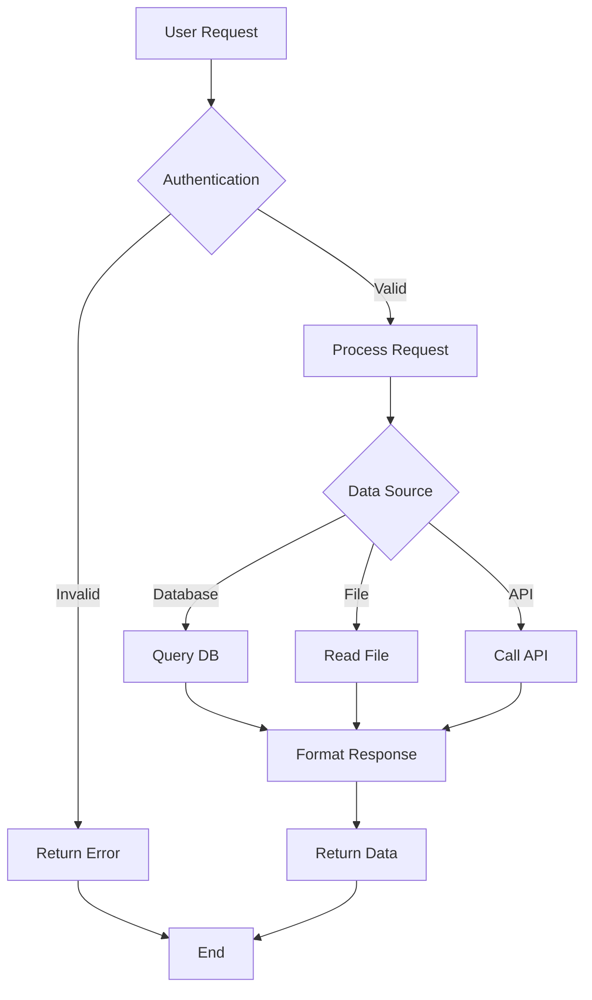

**Why Complex Diagrams Help**: Real-world systems are complex. Mermaid handles the complexity while keeping the syntax simple.

### Subgraphs and Grouping

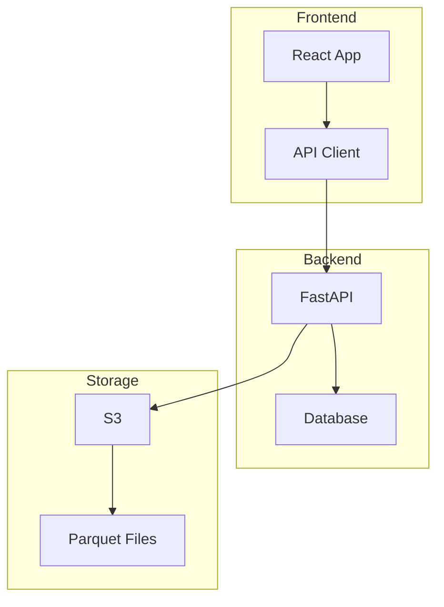

**Why Subgraphs Matter**: Grouping related components makes complex architectures understandable.

## 5) Embedding in Tabs and Sections

### Multi-View Examples

=== "Flowchart"

    ```mermaid
    flowchart LR
        A[Input] --> B[Process]
        B --> C[Output]
    ```

=== "Sequence"

    ```mermaid
    sequenceDiagram
        A->>B: Request
        B-->>A: Response
    ```

=== "Class Diagram"

    ```mermaid
    classDiagram
        class A {
            +method1()
        }
        class B {
            +method2()
        }
        A --> B
    ```

**Why Tabs Work**: Different diagram types for different perspectives on the same system.

### Admonition Integration

!!! note "System Architecture"
    ```mermaid
    graph TD
        A[Client] --> B[Load Balancer]
        B --> C[API Gateway]
        C --> D[Microservices]
        D --> E[Database]
    ```

**Why Admonitions Help**: Contextual diagrams with explanations make documentation more engaging.

## 6) Real-World Examples

### Database Architecture

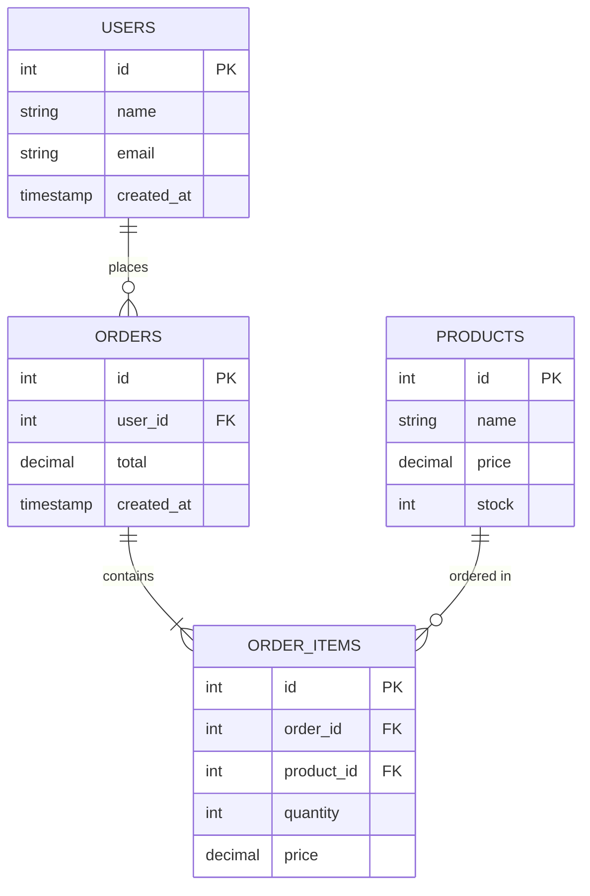

**Why ER Diagrams Matter**: Essential for database design, relationship documentation, and system understanding.

### API Flow

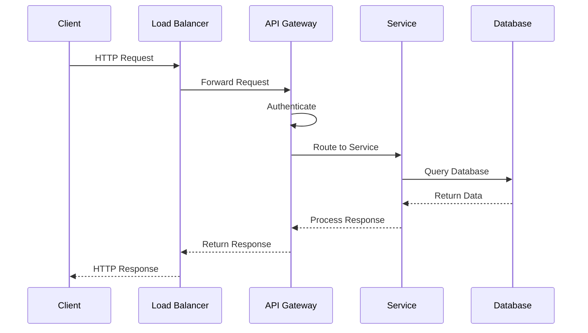

**Why API Flows Help**: Understanding request/response cycles is crucial for debugging and optimization.

### Deployment Pipeline

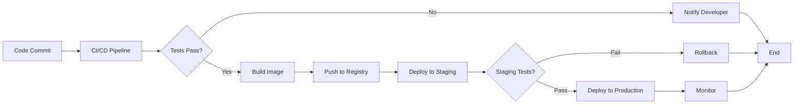

**Why Deployment Diagrams Matter**: Understanding deployment processes is essential for DevOps and reliability.

## 7) Performance and Best Practices

### Optimizing Large Diagrams

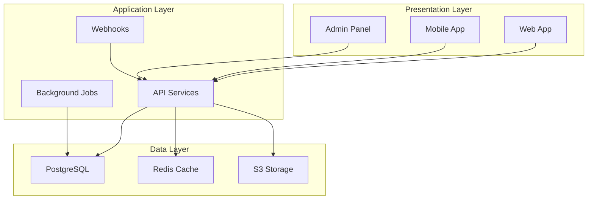

**Why Structure Matters**: Well-organized diagrams are easier to understand and maintain.

### Responsive Design

<div style="overflow-x: auto;">
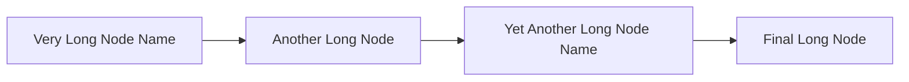
</div>

#### Literal code example
```html
<div style="overflow-x: auto;">
  <!-- Place a Mermaid fence here; example:
  ```mermaid
  graph LR
      A[Very Long Node Name] --> B[Another Long Node]
      B --> C[Yet Another Long Node Name]
      C --> D[Final Long Node]
  ```
  -->
</div>
```

**Why Responsive Design Helps**: Ensures diagrams work on all screen sizes and devices.

## 8) Troubleshooting Common Issues

### Blank Diagrams

**Problem**: Diagrams appear as blank code blocks.

**Solution**: Ensure `pymdownx.superfences` is properly configured in `mkdocs.yml`:

```yaml
markdown_extensions:
  - pymdownx.superfences:
      custom_fences:
        - name: mermaid
          class: mermaid
          format: !!python/name:pymdownx.superfences.fence_code_format
```

### Local Preview Issues

**Problem**: Diagrams don't render in local development.

**Solution**: 
1. Run `mkdocs serve` and refresh the page
2. Clear browser cache
3. Check browser console for JavaScript errors

### Diagram Too Wide

**Problem**: Diagrams extend beyond page width.

**Solution**: Wrap in a scrollable container:

<div style="overflow-x: auto;">
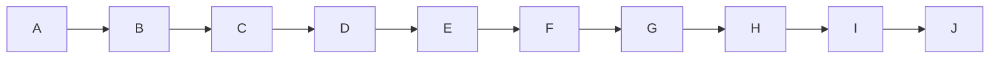
</div>

#### Literal code example
```html
<div style="overflow-x: auto;">
  <!-- Place a Mermaid fence here; example:
  ```mermaid
  graph LR
      A --> B --> C --> D --> E --> F --> G --> H --> I --> J
  ```
  -->
</div>
```