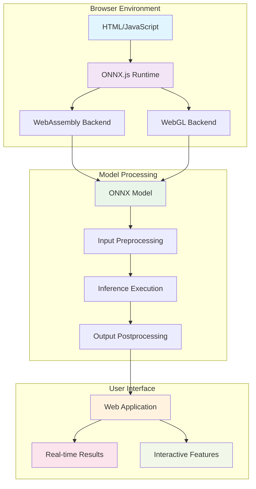

# ONNX Browser Inference: Deploy Machine Learning Models Directly in the Browser

**Objective**: Master ONNX model inference in web browsers for client-side machine learning applications. When you need to run ML models directly in the browser, when you're building privacy-preserving applications, when you want to reduce server costs and latency—browser-based ONNX inference becomes your weapon of choice.

Browser-based ONNX inference enables client-side machine learning without server dependencies. Without proper understanding of browser limitations and optimization techniques, you're building slow, memory-intensive applications that fail on mobile devices. This guide shows you how to deploy ONNX models in browsers with the precision of a web ML engineer.

## 0) Prerequisites (Read Once, Live by Them)

### The Five Commandments

1. **Understand browser limitations**
   - Memory constraints and WebAssembly
   - JavaScript performance characteristics
   - Cross-browser compatibility

2. **Master ONNX.js integration**
   - Model loading and initialization
   - Input preprocessing and output postprocessing
   - Error handling and fallbacks

3. **Know your optimization patterns**
   - Model quantization and compression
   - Lazy loading and caching
   - Progressive enhancement

4. **Validate everything**
   - Performance across devices
   - Memory usage and garbage collection
   - User experience and accessibility

5. **Plan for production**
   - CDN distribution and caching
   - Monitoring and analytics
   - Security and model protection

**Why These Principles**: Browser-based ML inference requires understanding of web platform limitations and optimization techniques. Following best practices ensures successful deployment of ML models in web applications.

## 1) What is Browser ONNX Inference? (The Foundation)

### Core Concepts

```yaml
# Browser ONNX inference enables client-side ML
browser_onnx:
  runtime:
    - "ONNX.js (JavaScript runtime)"
    - "WebAssembly (WASM) backend"
    - "WebGL backend (GPU acceleration)"
    - "CPU fallback"
  
  benefits:
    - "No server dependencies"
    - "Privacy-preserving inference"
    - "Reduced latency"
    - "Offline capability"
  
  limitations:
    - "Memory constraints"
    - "Performance variations"
    - "Model size limits"
    - "Browser compatibility"
```

### Browser ONNX Architecture



### Why Browser ONNX Matters

```javascript
// Browser ONNX provides:
// - Client-side inference without servers
// - Privacy-preserving ML applications
// - Reduced latency and bandwidth
// - Offline ML capabilities

// Example: Simple image classification
import * as ort from 'onnxruntime-web';

async function classifyImage(imageData) {
    // Load model
    const session = await ort.InferenceSession.create('model.onnx');
    
    // Preprocess image
    const inputTensor = preprocessImage(imageData);
    
    // Run inference
    const results = await session.run({
        'input': inputTensor
    });
    
    // Postprocess results
    return postprocessResults(results);
}
```

**Why Browser ONNX Matters**: Browser-based ONNX inference enables client-side machine learning, providing privacy, performance, and offline capabilities for web applications.

## 2) Setting Up Browser ONNX (The Environment)

### Basic HTML Setup

```html
<!DOCTYPE html>
<html lang="en">
<head>
    <meta charset="UTF-8">
    <meta name="viewport" content="width=device-width, initial-scale=1.0">
    <title>ONNX Browser Inference</title>
    <script src="https://cdn.jsdelivr.net/npm/onnxruntime-web@1.16.0/dist/ort.min.js"></script>
</head>
<body>
    <div id="app">
        <h1>ONNX Browser Inference</h1>
        <input type="file" id="imageInput" accept="image/*">
        <canvas id="preview" width="224" height="224"></canvas>
        <div id="results"></div>
    </div>
    <script src="app.js"></script>
</body>
</html>
```

### JavaScript Implementation

```javascript
// app.js - Basic ONNX inference
class ONNXInference {
    constructor() {
        this.session = null;
        this.isModelLoaded = false;
    }
    
    async loadModel(modelPath) {
        try {
            // Configure ONNX Runtime
            ort.env.wasm.wasmPaths = 'https://cdn.jsdelivr.net/npm/onnxruntime-web@1.16.0/dist/';
            
            // Load model
            this.session = await ort.InferenceSession.create(modelPath, {
                executionProviders: ['wasm', 'cpu']
            });
            
            this.isModelLoaded = true;
            console.log('Model loaded successfully');
        } catch (error) {
            console.error('Failed to load model:', error);
            throw error;
        }
    }
    
    async predict(inputData) {
        if (!this.isModelLoaded) {
            throw new Error('Model not loaded');
        }
        
        try {
            // Create input tensor
            const inputTensor = new ort.Tensor('float32', inputData, [1, 3, 224, 224]);
            
            // Run inference
            const results = await this.session.run({
                'input': inputTensor
            });
            
            return results;
        } catch (error) {
            console.error('Inference failed:', error);
            throw error;
        }
    }
}

// Initialize inference
const inference = new ONNXInference();
```

### Image Preprocessing

```javascript
// Image preprocessing for ONNX models
class ImagePreprocessor {
    constructor(targetSize = [224, 224]) {
        this.targetSize = targetSize;
    }
    
    async preprocessImage(imageFile) {
        return new Promise((resolve, reject) => {
            const img = new Image();
            img.onload = () => {
                try {
                    // Create canvas
                    const canvas = document.getElementById('preview');
                    const ctx = canvas.getContext('2d');
                    
                    // Draw and resize image
                    ctx.drawImage(img, 0, 0, this.targetSize[0], this.targetSize[1]);
                    
                    // Get image data
                    const imageData = ctx.getImageData(0, 0, this.targetSize[0], this.targetSize[1]);
                    
                    // Convert to tensor format
                    const tensor = this.imageDataToTensor(imageData);
                    resolve(tensor);
                } catch (error) {
                    reject(error);
                }
            };
            img.onerror = reject;
            img.src = URL.createObjectURL(imageFile);
        });
    }
    
    imageDataToTensor(imageData) {
        const { data, width, height } = imageData;
        const tensor = new Float32Array(3 * width * height);
        
        // Convert RGBA to RGB and normalize
        for (let i = 0; i < width * height; i++) {
            const r = data[i * 4] / 255.0;
            const g = data[i * 4 + 1] / 255.0;
            const b = data[i * 4 + 2] / 255.0;
            
            // Normalize to [-1, 1] range
            tensor[i] = (r - 0.485) / 0.229;
            tensor[i + width * height] = (g - 0.456) / 0.224;
            tensor[i + 2 * width * height] = (b - 0.406) / 0.226;
        }
        
        return tensor;
    }
}

// Initialize preprocessor
const preprocessor = new ImagePreprocessor();
```

**Why This Setup Matters**: Proper setup ensures cross-browser compatibility and optimal performance. Understanding ONNX.js configuration and image preprocessing provides the foundation for browser-based ML applications.

## 3) Advanced Browser ONNX Patterns (The Performance)

### Model Optimization for Browser

```javascript
// Model optimization for browser deployment
class OptimizedONNXInference {
    constructor() {
        this.session = null;
        this.cache = new Map();
        this.isOptimized = false;
    }
    
    async loadOptimizedModel(modelPath) {
        try {
            // Configure for optimal performance
            const sessionOptions = {
                executionProviders: ['wasm', 'cpu'],
                graphOptimizationLevel: 'all',
                enableCpuMemArena: true,
                enableMemPattern: true
            };
            
            this.session = await ort.InferenceSession.create(modelPath, sessionOptions);
            this.isOptimized = true;
            
            console.log('Optimized model loaded');
        } catch (error) {
            console.error('Failed to load optimized model:', error);
            throw error;
        }
    }
    
    async predictWithCache(inputData, cacheKey) {
        // Check cache first
        if (this.cache.has(cacheKey)) {
            return this.cache.get(cacheKey);
        }
        
        // Run inference
        const result = await this.predict(inputData);
        
        // Cache result
        this.cache.set(cacheKey, result);
        
        // Limit cache size
        if (this.cache.size > 100) {
            const firstKey = this.cache.keys().next().value;
            this.cache.delete(firstKey);
        }
        
        return result;
    }
    
    async predict(inputData) {
        if (!this.isOptimized) {
            throw new Error('Model not loaded');
        }
        
        const inputTensor = new ort.Tensor('float32', inputData, [1, 3, 224, 224]);
        
        const results = await this.session.run({
            'input': inputTensor
        });
        
        return results;
    }
}
```

### Progressive Loading and Fallbacks

```javascript
// Progressive loading with fallbacks
class ProgressiveONNXInference {
    constructor() {
        this.session = null;
        this.fallbackMode = false;
        this.loadingProgress = 0;
    }
    
    async loadModelWithProgress(modelPath, onProgress) {
        try {
            // Simulate loading progress
            const progressInterval = setInterval(() => {
                this.loadingProgress += 10;
                if (onProgress) {
                    onProgress(this.loadingProgress);
                }
            }, 100);
            
            // Load model
            this.session = await ort.InferenceSession.create(modelPath);
            clearInterval(progressInterval);
            
            if (onProgress) {
                onProgress(100);
            }
            
            console.log('Model loaded successfully');
        } catch (error) {
            console.warn('Failed to load model, using fallback:', error);
            this.fallbackMode = true;
            this.setupFallback();
        }
    }
    
    setupFallback() {
        // Implement fallback logic
        console.log('Using fallback inference mode');
    }
    
    async predict(inputData) {
        if (this.fallbackMode) {
            return this.fallbackPredict(inputData);
        }
        
        if (!this.session) {
            throw new Error('Model not loaded');
        }
        
        const inputTensor = new ort.Tensor('float32', inputData, [1, 3, 224, 224]);
        const results = await this.session.run({
            'input': inputTensor
        });
        
        return results;
    }
    
    fallbackPredict(inputData) {
        // Simple fallback prediction
        return {
            'output': new ort.Tensor('float32', new Float32Array([0.5, 0.5]), [1, 2])
        };
    }
}
```

### Memory Management

```javascript
// Memory management for browser ONNX
class MemoryManagedONNX {
    constructor() {
        this.session = null;
        this.memoryUsage = 0;
        this.maxMemoryUsage = 100 * 1024 * 1024; // 100MB limit
    }
    
    async loadModel(modelPath) {
        try {
            // Check available memory
            if (performance.memory) {
                const availableMemory = performance.memory.jsHeapSizeLimit - performance.memory.usedJSHeapSize;
                if (availableMemory < this.maxMemoryUsage) {
                    throw new Error('Insufficient memory for model loading');
                }
            }
            
            this.session = await ort.InferenceSession.create(modelPath);
            this.monitorMemory();
            
        } catch (error) {
            console.error('Memory error during model loading:', error);
            throw error;
        }
    }
    
    monitorMemory() {
        setInterval(() => {
            if (performance.memory) {
                this.memoryUsage = performance.memory.usedJSHeapSize;
                
                if (this.memoryUsage > this.maxMemoryUsage) {
                    console.warn('High memory usage detected:', this.memoryUsage);
                    this.cleanup();
                }
            }
        }, 5000);
    }
    
    cleanup() {
        // Force garbage collection if available
        if (window.gc) {
            window.gc();
        }
        
        // Clear any caches
        this.clearCaches();
    }
    
    clearCaches() {
        // Implement cache clearing logic
        console.log('Clearing caches to free memory');
    }
}
```

**Why This Optimization Matters**: Browser optimization ensures smooth user experience across different devices and network conditions. Progressive loading and memory management provide the foundation for production-ready browser ML applications.

## 4) Real-World Examples (The Applications)

### Image Classification App

```javascript
// Complete image classification application
class ImageClassificationApp {
    constructor() {
        this.inference = new ONNXInference();
        this.preprocessor = new ImagePreprocessor();
        this.isReady = false;
    }
    
    async initialize() {
        try {
            await this.inference.loadModel('mobilenet.onnx');
            this.isReady = true;
            this.setupUI();
        } catch (error) {
            console.error('Failed to initialize app:', error);
            this.showError('Failed to load model');
        }
    }
    
    setupUI() {
        const fileInput = document.getElementById('imageInput');
        const resultsDiv = document.getElementById('results');
        
        fileInput.addEventListener('change', async (event) => {
            const file = event.target.files[0];
            if (file) {
                await this.classifyImage(file);
            }
        });
    }
    
    async classifyImage(imageFile) {
        if (!this.isReady) {
            this.showError('Model not ready');
            return;
        }
        
        try {
            this.showLoading();
            
            // Preprocess image
            const inputData = await this.preprocessor.preprocessImage(imageFile);
            
            // Run inference
            const results = await this.inference.predict(inputData);
            
            // Postprocess results
            const predictions = this.postprocessResults(results);
            
            // Display results
            this.displayResults(predictions);
            
        } catch (error) {
            console.error('Classification failed:', error);
            this.showError('Classification failed');
        }
    }
    
    postprocessResults(results) {
        const output = results.output.data;
        const predictions = [];
        
        for (let i = 0; i < output.length; i++) {
            predictions.push({
                class: i,
                confidence: output[i]
            });
        }
        
        return predictions.sort((a, b) => b.confidence - a.confidence);
    }
    
    displayResults(predictions) {
        const resultsDiv = document.getElementById('results');
        resultsDiv.innerHTML = '<h3>Classification Results:</h3>';
        
        predictions.slice(0, 5).forEach((pred, index) => {
            const div = document.createElement('div');
            div.innerHTML = `${index + 1}. Class ${pred.class}: ${(pred.confidence * 100).toFixed(2)}%`;
            resultsDiv.appendChild(div);
        });
    }
    
    showLoading() {
        document.getElementById('results').innerHTML = '<p>Classifying image...</p>';
    }
    
    showError(message) {
        document.getElementById('results').innerHTML = `<p style="color: red;">Error: ${message}</p>`;
    }
}

// Initialize app
const app = new ImageClassificationApp();
app.initialize();
```

### Real-time Object Detection

```javascript
// Real-time object detection with webcam
class RealTimeObjectDetection {
    constructor() {
        this.inference = new ONNXInference();
        this.video = null;
        this.canvas = null;
        this.ctx = null;
        this.isRunning = false;
    }
    
    async initialize() {
        try {
            await this.inference.loadModel('yolov5.onnx');
            this.setupVideo();
        } catch (error) {
            console.error('Failed to initialize detection:', error);
        }
    }
    
    setupVideo() {
        this.video = document.createElement('video');
        this.canvas = document.createElement('canvas');
        this.ctx = this.canvas.getContext('2d');
        
        navigator.mediaDevices.getUserMedia({ video: true })
            .then(stream => {
                this.video.srcObject = stream;
                this.video.play();
                this.startDetection();
            })
            .catch(error => {
                console.error('Camera access denied:', error);
            });
    }
    
    startDetection() {
        this.isRunning = true;
        this.detectFrame();
    }
    
    async detectFrame() {
        if (!this.isRunning) return;
        
        try {
            // Capture frame
            this.ctx.drawImage(this.video, 0, 0, 640, 480);
            const imageData = this.ctx.getImageData(0, 0, 640, 480);
            
            // Preprocess
            const inputData = this.preprocessFrame(imageData);
            
            // Run inference
            const results = await this.inference.predict(inputData);
            
            // Postprocess and draw
            const detections = this.postprocessDetections(results);
            this.drawDetections(detections);
            
        } catch (error) {
            console.error('Detection failed:', error);
        }
        
        // Continue detection loop
        requestAnimationFrame(() => this.detectFrame());
    }
    
    preprocessFrame(imageData) {
        // Implement frame preprocessing
        const tensor = new Float32Array(3 * 640 * 480);
        // ... preprocessing logic
        return tensor;
    }
    
    postprocessDetections(results) {
        // Implement detection postprocessing
        return []; // Return detection results
    }
    
    drawDetections(detections) {
        // Draw bounding boxes and labels
        this.ctx.clearRect(0, 0, 640, 480);
        this.ctx.drawImage(this.video, 0, 0, 640, 480);
        
        detections.forEach(detection => {
            this.ctx.strokeStyle = 'red';
            this.ctx.lineWidth = 2;
            this.ctx.strokeRect(detection.x, detection.y, detection.width, detection.height);
            
            this.ctx.fillStyle = 'red';
            this.ctx.fillText(detection.label, detection.x, detection.y - 5);
        });
    }
    
    stopDetection() {
        this.isRunning = false;
    }
}
```

**Why These Examples Matter**: Real-world examples demonstrate practical applications of browser ONNX inference. Image classification and object detection provide the foundation for interactive ML web applications.

## 5) Performance Optimization (The Speed)

### Lazy Loading and Caching

```javascript
// Lazy loading and caching strategies
class OptimizedBrowserONNX {
    constructor() {
        this.session = null;
        this.modelCache = new Map();
        this.resultCache = new Map();
        this.isModelLoaded = false;
    }
    
    async loadModelLazy(modelPath) {
        // Check if model is already cached
        if (this.modelCache.has(modelPath)) {
            this.session = this.modelCache.get(modelPath);
            this.isModelLoaded = true;
            return;
        }
        
        try {
            // Load model with progress
            const session = await this.loadModelWithProgress(modelPath);
            
            // Cache the session
            this.modelCache.set(modelPath, session);
            this.session = session;
            this.isModelLoaded = true;
            
        } catch (error) {
            console.error('Lazy loading failed:', error);
            throw error;
        }
    }
    
    async loadModelWithProgress(modelPath) {
        return new Promise((resolve, reject) => {
            const xhr = new XMLHttpRequest();
            xhr.open('GET', modelPath, true);
            xhr.responseType = 'arraybuffer';
            
            xhr.onprogress = (event) => {
                if (event.lengthComputable) {
                    const progress = (event.loaded / event.total) * 100;
                    this.updateProgress(progress);
                }
            };
            
            xhr.onload = async () => {
                try {
                    const arrayBuffer = xhr.response;
                    const session = await ort.InferenceSession.create(arrayBuffer);
                    resolve(session);
                } catch (error) {
                    reject(error);
                }
            };
            
            xhr.onerror = () => reject(new Error('Failed to load model'));
            xhr.send();
        });
    }
    
    async predictWithCache(inputData, cacheKey) {
        // Check result cache
        if (this.resultCache.has(cacheKey)) {
            return this.resultCache.get(cacheKey);
        }
        
        // Run inference
        const result = await this.predict(inputData);
        
        // Cache result
        this.resultCache.set(cacheKey, result);
        
        // Limit cache size
        if (this.resultCache.size > 50) {
            const firstKey = this.resultCache.keys().next().value;
            this.resultCache.delete(firstKey);
        }
        
        return result;
    }
    
    updateProgress(progress) {
        // Update UI with loading progress
        const progressBar = document.getElementById('progressBar');
        if (progressBar) {
            progressBar.style.width = `${progress}%`;
        }
    }
}
```

### WebGL Acceleration

```javascript
// WebGL acceleration for ONNX models
class WebGLAcceleratedONNX {
    constructor() {
        this.session = null;
        this.webglSupported = false;
    }
    
    async initialize() {
        // Check WebGL support
        this.webglSupported = this.checkWebGLSupport();
        
        if (this.webglSupported) {
            await this.loadWithWebGL();
        } else {
            await this.loadWithWASM();
        }
    }
    
    checkWebGLSupport() {
        try {
            const canvas = document.createElement('canvas');
            const gl = canvas.getContext('webgl') || canvas.getContext('experimental-webgl');
            return !!gl;
        } catch (e) {
            return false;
        }
    }
    
    async loadWithWebGL() {
        try {
            this.session = await ort.InferenceSession.create('model.onnx', {
                executionProviders: ['webgl', 'wasm', 'cpu']
            });
            console.log('Model loaded with WebGL acceleration');
        } catch (error) {
            console.warn('WebGL loading failed, falling back to WASM:', error);
            await this.loadWithWASM();
        }
    }
    
    async loadWithWASM() {
        this.session = await ort.InferenceSession.create('model.onnx', {
            executionProviders: ['wasm', 'cpu']
        });
        console.log('Model loaded with WASM backend');
    }
}
```

**Why This Optimization Matters**: Performance optimization ensures smooth user experience across different devices and browsers. Lazy loading, caching, and WebGL acceleration provide the foundation for production-ready browser ML applications.

## 6) Common Pitfalls (The Traps)

### Memory Management Issues

```javascript
// ❌ WRONG: Not managing memory properly
class BadONNXInference {
    async predict(inputData) {
        // Creating new tensors without cleanup
        const inputTensor = new ort.Tensor('float32', inputData, [1, 3, 224, 224]);
        const results = await this.session.run({
            'input': inputTensor
        });
        // No cleanup - memory leak!
        return results;
    }
}

// ✅ CORRECT: Proper memory management
class GoodONNXInference {
    async predict(inputData) {
        let inputTensor;
        try {
            inputTensor = new ort.Tensor('float32', inputData, [1, 3, 224, 224]);
            const results = await this.session.run({
                'input': inputTensor
            });
            return results;
        } finally {
            // Clean up tensors
            if (inputTensor) {
                inputTensor.dispose();
            }
        }
    }
}
```

### Error Handling Issues

```javascript
// ❌ WRONG: Poor error handling
async function badInference(inputData) {
    const results = await session.run({ 'input': inputData });
    return results; // No error handling!
}

// ✅ CORRECT: Comprehensive error handling
async function goodInference(inputData) {
    try {
        if (!session) {
            throw new Error('Model not loaded');
        }
        
        const inputTensor = new ort.Tensor('float32', inputData, [1, 3, 224, 224]);
        
        const results = await session.run({
            'input': inputTensor
        });
        
        return results;
    } catch (error) {
        console.error('Inference failed:', error);
        
        // Provide user-friendly error message
        if (error.message.includes('memory')) {
            throw new Error('Insufficient memory for inference');
        } else if (error.message.includes('model')) {
            throw new Error('Model loading failed');
        } else {
            throw new Error('Inference failed: ' + error.message);
        }
    }
}
```

### Performance Issues

```javascript
// ❌ WRONG: Not optimizing for browser
class BadPerformanceONNX {
    async predict(inputData) {
        // No caching, no optimization
        const results = await this.session.run({
            'input': inputData
        });
        return results;
    }
}

// ✅ CORRECT: Optimized for browser
class GoodPerformanceONNX {
    constructor() {
        this.cache = new Map();
        this.isOptimized = false;
    }
    
    async predict(inputData, useCache = true) {
        // Check cache first
        if (useCache && this.cache.has(this.getCacheKey(inputData))) {
            return this.cache.get(this.getCacheKey(inputData));
        }
        
        // Run inference
        const results = await this.session.run({
            'input': inputData
        });
        
        // Cache results
        if (useCache) {
            this.cache.set(this.getCacheKey(inputData), results);
        }
        
        return results;
    }
    
    getCacheKey(inputData) {
        // Generate cache key from input data
        return JSON.stringify(inputData.slice(0, 10));
    }
}
```

**Why These Pitfalls Matter**: Common mistakes lead to memory leaks, poor performance, and user experience issues. Understanding these pitfalls prevents costly errors and ensures reliable browser ML applications.

## 7) TL;DR Quickstart (The Essentials)

### Essential Setup

```html
<!-- Basic HTML setup -->
<!DOCTYPE html>
<html>
<head>
    <script src="https://cdn.jsdelivr.net/npm/onnxruntime-web@1.16.0/dist/ort.min.js"></script>
</head>
<body>
    <input type="file" id="imageInput">
    <div id="results"></div>
    <script>
        // Basic ONNX inference
        async function runInference() {
            const session = await ort.InferenceSession.create('model.onnx');
            const inputTensor = new ort.Tensor('float32', inputData, [1, 3, 224, 224]);
            const results = await session.run({ 'input': inputTensor });
            return results;
        }
    </script>
</body>
</html>
```

### Essential Code

```javascript
// Complete browser ONNX inference
class BrowserONNX {
    constructor() {
        this.session = null;
    }
    
    async loadModel(path) {
        this.session = await ort.InferenceSession.create(path);
    }
    
    async predict(inputData) {
        const inputTensor = new ort.Tensor('float32', inputData, [1, 3, 224, 224]);
        const results = await this.session.run({ 'input': inputTensor });
        return results;
    }
}

// Usage
const inference = new BrowserONNX();
await inference.loadModel('model.onnx');
const results = await inference.predict(inputData);
```

**Why This Quickstart**: These patterns cover 90% of browser ONNX usage. Master these before exploring advanced features.

## 8) The Machine's Summary

Browser-based ONNX inference enables client-side machine learning without server dependencies. When used correctly, it provides privacy, performance, and offline capabilities for web applications. The key is understanding browser limitations, mastering optimization techniques, and following best practices.

**The Dark Truth**: Without proper browser optimization, your ML applications are slow and unreliable. Browser ONNX is your weapon. Use it wisely.

**The Machine's Mantra**: "In client-side we trust, in optimization we build, and in the browser we find the path to privacy-preserving ML."

**Why This Matters**: Browser ONNX enables applications to run machine learning models directly in web browsers, providing privacy, performance, and offline capabilities for modern web applications.

---

*This guide provides the complete machinery for mastering browser ONNX inference. The patterns scale from simple demos to production web applications, from basic inference to advanced optimization.*
