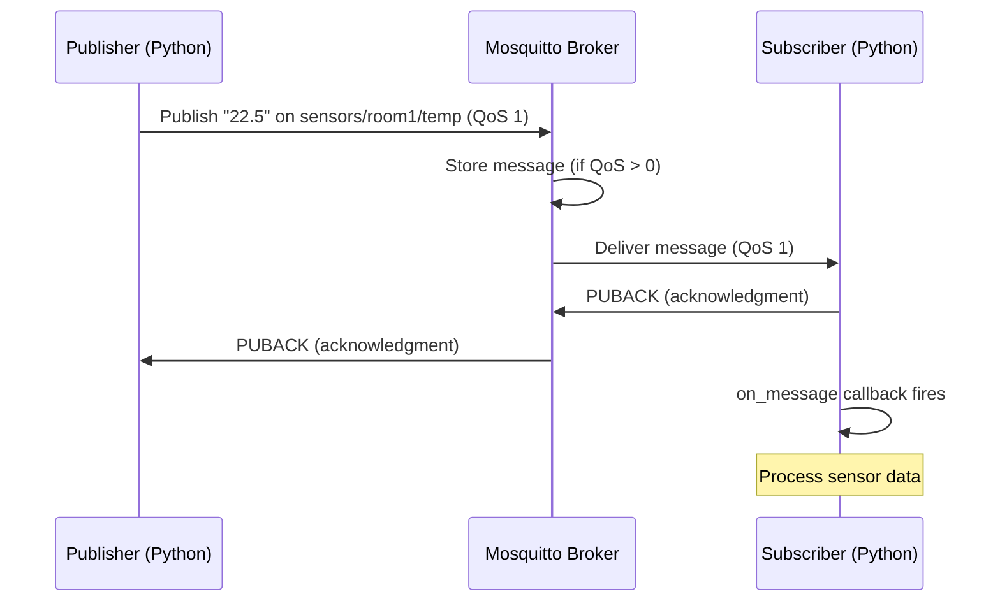

# Mosquitto MQTT Best Practices & Python Clients

**Objective**: Master MQTT messaging with Mosquitto broker and Python clients for reliable, production-ready IoT and event-driven applications. When you need to connect sensors, devices, and services, when you need real-time messaging with guaranteed delivery, when you need to scale to thousands of connections—MQTT becomes your weapon of choice.

MQTT (Message Queuing Telemetry Transport) is the bridge between your IoT devices and your applications. Without proper MQTT setup, you're flying blind into production with messaging that could lose data, overwhelm your broker, or fail under load. This guide shows you how to wield Mosquitto and Python MQTT clients with the precision of a seasoned DevOps engineer.

## 0) Prerequisites (Read Once, Live by Them)

### The Five Commandments

1. **Understand the messaging model**
   - Publish/subscribe patterns
   - Quality of Service (QoS) levels
   - Topic hierarchies and wildcards

2. **Master the broker configuration**
   - Security and authentication
   - Performance tuning
   - Persistence and reliability

3. **Know your client patterns**
   - Connection management
   - Message handling
   - Error recovery

4. **Validate everything**
   - Message delivery guarantees
   - Connection stability
   - Performance under load

5. **Plan for production**
   - Security hardening
   - Monitoring and alerting
   - Scaling strategies

**Why These Principles**: MQTT messaging is the foundation of reliable IoT and event-driven applications. Understanding the broker, mastering client patterns, and following best practices is essential for maintaining message delivery at scale.

## 1) Installing Mosquitto (The Foundation)

### Linux Installation

```bash
# Ubuntu/Debian
sudo apt update
sudo apt install mosquitto mosquitto-clients

# CentOS/RHEL
sudo yum install mosquitto mosquitto-clients

# Start and enable service
sudo systemctl start mosquitto
sudo systemctl enable mosquitto

# Check status
sudo systemctl status mosquitto
```

### Docker Installation

```bash
# Run Mosquitto in Docker
docker run -it -p 1883:1883 -p 9001:9001 \
  -v $(pwd)/mosquitto.conf:/mosquitto/config/mosquitto.conf \
  eclipse-mosquitto:latest

# Or with docker-compose
cat > docker-compose.yml << EOF
version: '3.8'
services:
  mosquitto:
    image: eclipse-mosquitto:latest
    ports:
      - "1883:1883"
      - "9001:9001"
    volumes:
      - ./mosquitto.conf:/mosquitto/config/mosquitto.conf
      - mosquitto_data:/mosquitto/data
      - mosquitto_logs:/mosquitto/log
    restart: unless-stopped

volumes:
  mosquitto_data:
  mosquitto_logs:
EOF

docker-compose up -d
```

### Python Client Installation

```bash
# Install paho-mqtt client
pip install paho-mqtt

# For async support
pip install paho-mqtt[async]

# For additional features
pip install paho-mqtt[all]
```

**Why These Installations**: Mosquitto provides the MQTT broker, while paho-mqtt provides the Python client library. Docker installation offers easy deployment and configuration management.

## 2) Configuring Mosquitto — Best Practices

### Basic Configuration

```ini
# /etc/mosquitto/mosquitto.conf
# Basic listener configuration
listener 1883
allow_anonymous false
password_file /etc/mosquitto/passwd

# Persistence for reliability
persistence true
persistence_location /var/lib/mosquitto/
persistence_file mosquitto.db

# Logging
log_dest file /var/log/mosquitto/mosquitto.log
log_type error
log_type warning
log_type notice
log_type information

# Connection limits
max_connections 1000
max_inflight_messages 20
max_queued_messages 100
```

### Production Security Configuration

```ini
# /etc/mosquitto/mosquitto-secure.conf
# TLS listener for secure connections
listener 8883
cafile /etc/mosquitto/ca.crt
certfile /etc/mosquitto/server.crt
keyfile /etc/mosquitto/server.key
require_certificate false
use_identity_as_username true

# Standard listener with authentication
listener 1883
allow_anonymous false
password_file /etc/mosquitto/passwd

# ACL for fine-grained access control
acl_file /etc/mosquitto/acl.conf

# Persistence and reliability
persistence true
persistence_location /var/lib/mosquitto/
autosave_interval 1800

# Performance tuning
max_connections 5000
max_inflight_messages 100
max_queued_messages 1000
message_size_limit 268435456

# Logging
log_dest file /var/log/mosquitto/mosquitto.log
log_type error
log_type warning
log_type notice
log_type information
connection_messages true
log_timestamp true
```

### User Authentication Setup

```bash
# Create password file
sudo mosquitto_passwd -c /etc/mosquitto/passwd admin
sudo mosquitto_passwd -b /etc/mosquitto/passwd sensor1 sensor1pass
sudo mosquitto_passwd -b /etc/mosquitto/passwd sensor2 sensor2pass

# Set proper permissions
sudo chown mosquitto:mosquitto /etc/mosquitto/passwd
sudo chmod 600 /etc/mosquitto/passwd
```

### Access Control Lists (ACL)

```ini
# /etc/mosquitto/acl.conf
# Admin user - full access
user admin
topic readwrite #

# Sensor users - limited access
user sensor1
topic readwrite sensors/device1/+
topic read sensors/status

user sensor2
topic readwrite sensors/device2/+
topic read sensors/status

# Anonymous users (if enabled)
user anonymous
topic read public/+
```

**Why These Configurations**: Security is paramount for production MQTT deployments. Authentication, authorization, and TLS encryption protect against unauthorized access and data interception.

## 3) Testing with CLI (The Validation)

### Basic Publishing and Subscribing

```bash
# Publish a message
mosquitto_pub -h localhost -t "sensors/room1/temp" -m "22.5"

# Subscribe to a topic
mosquitto_sub -h localhost -t "sensors/room1/temp"

# Subscribe with wildcards
mosquitto_sub -h localhost -t "sensors/+/temp"

# Subscribe to all sensor topics
mosquitto_sub -h localhost -t "sensors/#"
```

### Advanced CLI Testing

```bash
# Publish with QoS 1 (at least once delivery)
mosquitto_pub -h localhost -t "sensors/room1/temp" -m "22.5" -q 1

# Subscribe with QoS 1
mosquitto_sub -h localhost -t "sensors/room1/temp" -q 1

# Publish retained message
mosquitto_pub -h localhost -t "sensors/room1/temp" -m "22.5" -r

# Publish with authentication
mosquitto_pub -h localhost -u sensor1 -P sensor1pass -t "sensors/device1/temp" -m "23.1"

# Subscribe with authentication
mosquitto_sub -h localhost -u sensor1 -P sensor1pass -t "sensors/device1/+"
```

### Testing TLS Connections

```bash
# Publish over TLS
mosquitto_pub -h localhost -p 8883 --cafile /etc/mosquitto/ca.crt \
  -t "sensors/room1/temp" -m "22.5"

# Subscribe over TLS
mosquitto_sub -h localhost -p 8883 --cafile /etc/mosquitto/ca.crt \
  -t "sensors/room1/temp"
```

**Why CLI Testing**: Command-line tools provide immediate validation of broker configuration and message flow. They're essential for debugging and testing before implementing Python clients.

## 4) Python Client Setup (The Foundation)

### Basic Client Configuration

```python
import paho.mqtt.client as mqtt
import json
import time
from typing import Optional, Callable

class MQTTClient:
    def __init__(self, broker: str, port: int = 1883, client_id: Optional[str] = None):
        self.broker = broker
        self.port = port
        self.client_id = client_id or f"python_client_{int(time.time())}"
        self.client = mqtt.Client(client_id=self.client_id)
        self.connected = False
        
        # Set up callbacks
        self.client.on_connect = self._on_connect
        self.client.on_disconnect = self._on_disconnect
        self.client.on_message = self._on_message
        self.client.on_publish = self._on_publish
        self.client.on_subscribe = self._on_subscribe
    
    def _on_connect(self, client, userdata, flags, rc):
        """Callback for when the client connects to the broker"""
        if rc == 0:
            print(f"Connected to {self.broker}:{self.port}")
            self.connected = True
        else:
            print(f"Failed to connect, return code {rc}")
            self.connected = False
    
    def _on_disconnect(self, client, userdata, rc):
        """Callback for when the client disconnects from the broker"""
        print(f"Disconnected from {self.broker}:{self.port}")
        self.connected = False
    
    def _on_message(self, client, userdata, msg):
        """Callback for when a message is received"""
        print(f"Received: {msg.topic} -> {msg.payload.decode()}")
    
    def _on_publish(self, client, userdata, mid):
        """Callback for when a message is published"""
        print(f"Message {mid} published")
    
    def _on_subscribe(self, client, userdata, mid, granted_qos):
        """Callback for when a subscription is confirmed"""
        print(f"Subscribed to topic with QoS {granted_qos}")
    
    def connect(self, username: Optional[str] = None, password: Optional[str] = None):
        """Connect to the MQTT broker"""
        if username and password:
            self.client.username_pw_set(username, password)
        
        try:
            self.client.connect(self.broker, self.port, 60)
            self.client.loop_start()
        except Exception as e:
            print(f"Connection error: {e}")
    
    def disconnect(self):
        """Disconnect from the MQTT broker"""
        self.client.loop_stop()
        self.client.disconnect()
```

**Why This Setup**: Proper client configuration with callbacks provides reliable connection management and message handling. The class-based approach enables reuse and error handling.

## 5) Writing Messages (Publisher)

### Basic Publisher

```python
import paho.mqtt.client as mqtt
import json
import time
from datetime import datetime

class MQTTPublisher:
    def __init__(self, broker: str, port: int = 1883, username: str = None, password: str = None):
        self.broker = broker
        self.port = port
        self.username = username
        self.password = password
        self.client = mqtt.Client()
        
        if username and password:
            self.client.username_pw_set(username, password)
        
        self.client.on_connect = self._on_connect
        self.client.on_publish = self._on_publish
    
    def _on_connect(self, client, userdata, flags, rc):
        if rc == 0:
            print(f"Publisher connected to {self.broker}:{self.port}")
        else:
            print(f"Publisher connection failed with code {rc}")
    
    def _on_publish(self, client, userdata, mid):
        print(f"Message {mid} published successfully")
    
    def connect(self):
        """Connect to the MQTT broker"""
        self.client.connect(self.broker, self.port, 60)
        self.client.loop_start()
    
    def disconnect(self):
        """Disconnect from the MQTT broker"""
        self.client.loop_stop()
        self.client.disconnect()
    
    def publish_sensor_data(self, device_id: str, sensor_type: str, value: float, unit: str = None):
        """Publish sensor data with structured payload"""
        topic = f"sensors/{device_id}/{sensor_type}"
        
        payload = {
            "device_id": device_id,
            "sensor_type": sensor_type,
            "value": value,
            "unit": unit,
            "timestamp": datetime.now().isoformat()
        }
        
        message = json.dumps(payload)
        result = self.client.publish(topic, message, qos=1, retain=True)
        
        if result.rc == mqtt.MQTT_ERR_SUCCESS:
            print(f"Published to {topic}: {message}")
        else:
            print(f"Failed to publish to {topic}")
    
    def publish_batch(self, messages: list):
        """Publish multiple messages efficiently"""
        for topic, payload, qos in messages:
            self.client.publish(topic, payload, qos)
            time.sleep(0.01)  # Small delay to prevent overwhelming the broker

# Usage example
if __name__ == "__main__":
    publisher = MQTTPublisher("localhost", username="sensor1", password="sensor1pass")
    publisher.connect()
    
    # Publish sensor data
    publisher.publish_sensor_data("device1", "temperature", 22.5, "°C")
    publisher.publish_sensor_data("device1", "humidity", 65.2, "%")
    publisher.publish_sensor_data("device2", "temperature", 23.1, "°C")
    
    time.sleep(2)
    publisher.disconnect()
```

### Advanced Publisher with Error Handling

```python
import paho.mqtt.client as mqtt
import json
import time
import logging
from typing import Dict, Any, Optional
from datetime import datetime

class AdvancedMQTTPublisher:
    def __init__(self, broker: str, port: int = 1883, username: str = None, password: str = None):
        self.broker = broker
        self.port = port
        self.username = username
        self.password = password
        self.client = mqtt.Client()
        self.connected = False
        self.message_queue = []
        
        # Configure logging
        logging.basicConfig(level=logging.INFO)
        self.logger = logging.getLogger(__name__)
        
        # Set up callbacks
        self.client.on_connect = self._on_connect
        self.client.on_disconnect = self._on_disconnect
        self.client.on_publish = self._on_publish
        self.client.on_log = self._on_log
    
    def _on_connect(self, client, userdata, flags, rc):
        if rc == 0:
            self.connected = True
            self.logger.info(f"Connected to {self.broker}:{self.port}")
            # Publish queued messages
            self._publish_queued_messages()
        else:
            self.connected = False
            self.logger.error(f"Connection failed with code {rc}")
    
    def _on_disconnect(self, client, userdata, rc):
        self.connected = False
        self.logger.warning(f"Disconnected from {self.broker}:{self.port}")
    
    def _on_publish(self, client, userdata, mid):
        self.logger.debug(f"Message {mid} published")
    
    def _on_log(self, client, userdata, level, buf):
        self.logger.debug(f"MQTT Log: {buf}")
    
    def _publish_queued_messages(self):
        """Publish messages that were queued while disconnected"""
        while self.message_queue:
            topic, payload, qos, retain = self.message_queue.pop(0)
            self.client.publish(topic, payload, qos, retain)
    
    def connect(self):
        """Connect to the MQTT broker"""
        if self.username and self.password:
            self.client.username_pw_set(self.username, self.password)
        
        try:
            self.client.connect(self.broker, self.port, 60)
            self.client.loop_start()
        except Exception as e:
            self.logger.error(f"Connection error: {e}")
    
    def disconnect(self):
        """Disconnect from the MQTT broker"""
        self.client.loop_stop()
        self.client.disconnect()
    
    def publish(self, topic: str, payload: str, qos: int = 0, retain: bool = False):
        """Publish a message with error handling"""
        if not self.connected:
            # Queue message for later delivery
            self.message_queue.append((topic, payload, qos, retain))
            self.logger.warning(f"Not connected, queuing message for {topic}")
            return False
        
        try:
            result = self.client.publish(topic, payload, qos, retain)
            if result.rc == mqtt.MQTT_ERR_SUCCESS:
                self.logger.info(f"Published to {topic}: {payload}")
                return True
            else:
                self.logger.error(f"Failed to publish to {topic}")
                return False
        except Exception as e:
            self.logger.error(f"Publish error: {e}")
            return False
    
    def publish_sensor_data(self, device_id: str, sensor_type: str, value: float, 
                          unit: str = None, metadata: Dict[str, Any] = None):
        """Publish structured sensor data"""
        topic = f"sensors/{device_id}/{sensor_type}"
        
        payload = {
            "device_id": device_id,
            "sensor_type": sensor_type,
            "value": value,
            "unit": unit,
            "timestamp": datetime.now().isoformat(),
            "metadata": metadata or {}
        }
        
        message = json.dumps(payload)
        return self.publish(topic, message, qos=1, retain=True)
```

**Why These Publishers**: Structured publishers with error handling provide reliable message delivery. JSON payloads enable complex data structures, while error handling ensures message delivery even during connection issues.

## 6) Reading Messages (Subscriber)

### Basic Subscriber

```python
import paho.mqtt.client as mqtt
import json
import time
from typing import Callable, Dict, Any

class MQTTSubscriber:
    def __init__(self, broker: str, port: int = 1883, username: str = None, password: str = None):
        self.broker = broker
        self.port = port
        self.username = username
        self.password = password
        self.client = mqtt.Client()
        self.message_handler = None
        
        if username and password:
            self.client.username_pw_set(username, password)
        
        self.client.on_connect = self._on_connect
        self.client.on_message = self._on_message
        self.client.on_subscribe = self._on_subscribe
    
    def _on_connect(self, client, userdata, flags, rc):
        if rc == 0:
            print(f"Subscriber connected to {self.broker}:{self.port}")
        else:
            print(f"Subscriber connection failed with code {rc}")
    
    def _on_message(self, client, userdata, msg):
        """Handle incoming messages"""
        try:
            # Try to parse as JSON
            payload = json.loads(msg.payload.decode())
            print(f"Received JSON: {msg.topic} -> {payload}")
        except json.JSONDecodeError:
            # Fall back to plain text
            payload = msg.payload.decode()
            print(f"Received text: {msg.topic} -> {payload}")
        
        # Call custom message handler if set
        if self.message_handler:
            self.message_handler(msg.topic, payload)
    
    def _on_subscribe(self, client, userdata, mid, granted_qos):
        print(f"Subscribed to topic with QoS {granted_qos}")
    
    def set_message_handler(self, handler: Callable[[str, Any], None]):
        """Set custom message handler"""
        self.message_handler = handler
    
    def connect(self):
        """Connect to the MQTT broker"""
        self.client.connect(self.broker, self.port, 60)
        self.client.loop_start()
    
    def disconnect(self):
        """Disconnect from the MQTT broker"""
        self.client.loop_stop()
        self.client.disconnect()
    
    def subscribe(self, topic: str, qos: int = 0):
        """Subscribe to a topic"""
        self.client.subscribe(topic, qos)
        print(f"Subscribed to {topic}")
    
    def loop_forever(self):
        """Keep the client running"""
        self.client.loop_forever()

# Usage example
if __name__ == "__main__":
    def handle_message(topic: str, payload: Any):
        print(f"Custom handler: {topic} -> {payload}")
    
    subscriber = MQTTSubscriber("localhost", username="sensor1", password="sensor1pass")
    subscriber.set_message_handler(handle_message)
    subscriber.connect()
    
    # Subscribe to sensor topics
    subscriber.subscribe("sensors/+/temperature", qos=1)
    subscriber.subscribe("sensors/+/humidity", qos=1)
    
    try:
        subscriber.loop_forever()
    except KeyboardInterrupt:
        print("Stopping subscriber...")
        subscriber.disconnect()
```

### Advanced Subscriber with Data Processing

```python
import paho.mqtt.client as mqtt
import json
import time
import logging
from typing import Callable, Dict, Any, Optional
from datetime import datetime
from collections import defaultdict

class AdvancedMQTTSubscriber:
    def __init__(self, broker: str, port: int = 1883, username: str = None, password: str = None):
        self.broker = broker
        self.port = port
        self.username = username
        self.password = password
        self.client = mqtt.Client()
        self.connected = False
        self.subscriptions = set()
        self.message_handlers = defaultdict(list)
        self.data_buffer = defaultdict(list)
        
        # Configure logging
        logging.basicConfig(level=logging.INFO)
        self.logger = logging.getLogger(__name__)
        
        # Set up callbacks
        self.client.on_connect = self._on_connect
        self.client.on_disconnect = self._on_disconnect
        self.client.on_message = self._on_message
        self.client.on_subscribe = self._on_subscribe
    
    def _on_connect(self, client, userdata, flags, rc):
        if rc == 0:
            self.connected = True
            self.logger.info(f"Connected to {self.broker}:{self.port}")
            # Re-subscribe to topics
            for topic in self.subscriptions:
                self.client.subscribe(topic)
        else:
            self.connected = False
            self.logger.error(f"Connection failed with code {rc}")
    
    def _on_disconnect(self, client, userdata, rc):
        self.connected = False
        self.logger.warning(f"Disconnected from {self.broker}:{self.port}")
    
    def _on_message(self, client, userdata, msg):
        """Handle incoming messages with processing"""
        try:
            # Parse JSON payload
            payload = json.loads(msg.payload.decode())
            self.logger.info(f"Received: {msg.topic} -> {payload}")
            
            # Store in buffer
            self.data_buffer[msg.topic].append({
                "timestamp": datetime.now(),
                "payload": payload
            })
            
            # Call topic-specific handlers
            for handler in self.message_handlers[msg.topic]:
                try:
                    handler(msg.topic, payload)
                except Exception as e:
                    self.logger.error(f"Handler error for {msg.topic}: {e}")
            
            # Call wildcard handlers
            for pattern, handlers in self.message_handlers.items():
                if pattern != msg.topic and self._topic_matches(msg.topic, pattern):
                    for handler in handlers:
                        try:
                            handler(msg.topic, payload)
                        except Exception as e:
                            self.logger.error(f"Handler error for {pattern}: {e}")
            
        except json.JSONDecodeError:
            # Handle non-JSON messages
            payload = msg.payload.decode()
            self.logger.info(f"Received text: {msg.topic} -> {payload}")
    
    def _on_subscribe(self, client, userdata, mid, granted_qos):
        self.logger.info(f"Subscribed with QoS {granted_qos}")
    
    def _topic_matches(self, topic: str, pattern: str) -> bool:
        """Check if topic matches pattern (supports + and # wildcards)"""
        if pattern == topic:
            return True
        
        # Handle + wildcard (single level)
        if '+' in pattern:
            pattern_parts = pattern.split('/')
            topic_parts = topic.split('/')
            
            if len(pattern_parts) != len(topic_parts):
                return False
            
            for p, t in zip(pattern_parts, topic_parts):
                if p != '+' and p != t:
                    return False
            return True
        
        # Handle # wildcard (multi-level)
        if pattern.endswith('/#'):
            prefix = pattern[:-2]  # Remove /#
            return topic.startswith(prefix)
        
        return False
    
    def connect(self):
        """Connect to the MQTT broker"""
        if self.username and self.password:
            self.client.username_pw_set(self.username, self.password)
        
        try:
            self.client.connect(self.broker, self.port, 60)
            self.client.loop_start()
        except Exception as e:
            self.logger.error(f"Connection error: {e}")
    
    def disconnect(self):
        """Disconnect from the MQTT broker"""
        self.client.loop_stop()
        self.client.disconnect()
    
    def subscribe(self, topic: str, qos: int = 0, handler: Optional[Callable] = None):
        """Subscribe to a topic with optional handler"""
        self.subscriptions.add(topic)
        self.client.subscribe(topic, qos)
        
        if handler:
            self.message_handlers[topic].append(handler)
        
        self.logger.info(f"Subscribed to {topic}")
    
    def get_data(self, topic: str, limit: int = 100) -> list:
        """Get buffered data for a topic"""
        return self.data_buffer[topic][-limit:]
    
    def clear_data(self, topic: str = None):
        """Clear buffered data"""
        if topic:
            self.data_buffer[topic].clear()
        else:
            self.data_buffer.clear()
    
    def loop_forever(self):
        """Keep the client running"""
        self.client.loop_forever()
```

**Why These Subscribers**: Advanced subscribers provide data buffering, topic pattern matching, and custom message handling. They enable complex data processing and analysis workflows.

## 7) Reliable Messaging & QoS

### Quality of Service Levels

```python
import paho.mqtt.client as mqtt
import time
import json

class ReliableMQTTClient:
    def __init__(self, broker: str, port: int = 1883):
        self.broker = broker
        self.port = port
        self.client = mqtt.Client()
        self.client.on_connect = self._on_connect
        self.client.on_publish = self._on_publish
        self.client.on_message = self._on_message
    
    def _on_connect(self, client, userdata, flags, rc):
        print(f"Connected with result code {rc}")
    
    def _on_publish(self, client, userdata, mid):
        print(f"Message {mid} published")
    
    def _on_message(self, client, userdata, msg):
        print(f"Received: {msg.topic} -> {msg.payload.decode()}")
    
    def connect(self):
        self.client.connect(self.broker, self.port, 60)
        self.client.loop_start()
    
    def disconnect(self):
        self.client.loop_stop()
        self.client.disconnect()
    
    def publish_with_qos(self, topic: str, payload: str, qos: int = 0, retain: bool = False):
        """Publish with specific QoS level"""
        result = self.client.publish(topic, payload, qos, retain)
        
        if qos > 0:
            # Wait for acknowledgment
            result.wait_for_publish()
            if result.rc == mqtt.MQTT_ERR_SUCCESS:
                print(f"Message published with QoS {qos}")
            else:
                print(f"Failed to publish with QoS {qos}")
        
        return result.rc == mqtt.MQTT_ERR_SUCCESS
    
    def subscribe_with_qos(self, topic: str, qos: int = 0):
        """Subscribe with specific QoS level"""
        result = self.client.subscribe(topic, qos)
        if result[0] == mqtt.MQTT_ERR_SUCCESS:
            print(f"Subscribed to {topic} with QoS {qos}")
        else:
            print(f"Failed to subscribe to {topic}")
        return result[0] == mqtt.MQTT_ERR_SUCCESS

# QoS Level Examples
def demonstrate_qos_levels():
    client = ReliableMQTTClient("localhost")
    client.connect()
    
    # QoS 0: At most once (fire and forget)
    client.publish_with_qos("test/qos0", "QoS 0 message", qos=0)
    
    # QoS 1: At least once (acknowledged delivery)
    client.publish_with_qos("test/qos1", "QoS 1 message", qos=1)
    
    # QoS 2: Exactly once (assured delivery)
    client.publish_with_qos("test/qos2", "QoS 2 message", qos=2)
    
    # Subscribe with different QoS levels
    client.subscribe_with_qos("test/qos0", qos=0)
    client.subscribe_with_qos("test/qos1", qos=1)
    client.subscribe_with_qos("test/qos2", qos=2)
    
    time.sleep(5)
    client.disconnect()

if __name__ == "__main__":
    demonstrate_qos_levels()
```

### Message Flow Diagram



**Why QoS Matters**: Quality of Service levels provide different delivery guarantees. Choose the appropriate level based on your reliability requirements and performance constraints.

## 8) Scaling & Security (Production)

### TLS Configuration

```ini
# /etc/mosquitto/mosquitto-tls.conf
# TLS listener for secure connections
listener 8883
cafile /etc/mosquitto/ca.crt
certfile /etc/mosquitto/server.crt
keyfile /etc/mosquitto/server.key
require_certificate false
use_identity_as_username true

# Standard listener with authentication
listener 1883
allow_anonymous false
password_file /etc/mosquitto/passwd

# ACL for fine-grained access control
acl_file /etc/mosquitto/acl.conf

# Performance tuning for high load
max_connections 10000
max_inflight_messages 1000
max_queued_messages 10000
message_size_limit 268435456

# Persistence for reliability
persistence true
persistence_location /var/lib/mosquitto/
autosave_interval 1800

# Logging
log_dest file /var/log/mosquitto/mosquitto.log
log_type error
log_type warning
log_type notice
log_type information
connection_messages true
log_timestamp true
```

### Python Client with TLS

```python
import paho.mqtt.client as mqtt
import ssl
import json

class SecureMQTTClient:
    def __init__(self, broker: str, port: int = 8883, ca_cert: str = None, 
                 client_cert: str = None, client_key: str = None):
        self.broker = broker
        self.port = port
        self.client = mqtt.Client()
        
        # Configure TLS
        if ca_cert:
            self.client.tls_set(ca_certs=ca_cert, certfile=client_cert, 
                               keyfile=client_key, cert_reqs=ssl.CERT_REQUIRED,
                               tls_version=ssl.PROTOCOL_TLSv1_2)
        else:
            self.client.tls_set(tls_version=ssl.PROTOCOL_TLSv1_2)
        
        self.client.on_connect = self._on_connect
        self.client.on_message = self._on_message
    
    def _on_connect(self, client, userdata, flags, rc):
        if rc == 0:
            print(f"Secure connection established to {self.broker}:{self.port}")
        else:
            print(f"Connection failed with code {rc}")
    
    def _on_message(self, client, userdata, msg):
        print(f"Received: {msg.topic} -> {msg.payload.decode()}")
    
    def connect(self, username: str = None, password: str = None):
        if username and password:
            self.client.username_pw_set(username, password)
        
        self.client.connect(self.broker, self.port, 60)
        self.client.loop_start()
    
    def disconnect(self):
        self.client.loop_stop()
        self.client.disconnect()
    
    def publish(self, topic: str, payload: str, qos: int = 0):
        self.client.publish(topic, payload, qos)
    
    def subscribe(self, topic: str, qos: int = 0):
        self.client.subscribe(topic, qos)

# Usage with TLS
if __name__ == "__main__":
    client = SecureMQTTClient(
        broker="localhost",
        port=8883,
        ca_cert="/etc/mosquitto/ca.crt",
        client_cert="/etc/mosquitto/client.crt",
        client_key="/etc/mosquitto/client.key"
    )
    
    client.connect(username="sensor1", password="sensor1pass")
    client.subscribe("sensors/#", qos=1)
    
    # Keep running
    try:
        while True:
            time.sleep(1)
    except KeyboardInterrupt:
        client.disconnect()
```

### Monitoring with $SYS Topics

```python
import paho.mqtt.client as mqtt
import json
import time

class MQTTMonitor:
    def __init__(self, broker: str, port: int = 1883):
        self.broker = broker
        self.port = port
        self.client = mqtt.Client()
        self.client.on_connect = self._on_connect
        self.client.on_message = self._on_message
    
    def _on_connect(self, client, userdata, flags, rc):
        if rc == 0:
            print("Connected to broker for monitoring")
            # Subscribe to system topics
            client.subscribe("$SYS/#")
        else:
            print(f"Connection failed with code {rc}")
    
    def _on_message(self, client, userdata, msg):
        if msg.topic.startswith("$SYS/"):
            print(f"System info: {msg.topic} -> {msg.payload.decode()}")
    
    def start_monitoring(self):
        self.client.connect(self.broker, self.port, 60)
        self.client.loop_start()
    
    def stop_monitoring(self):
        self.client.loop_stop()
        self.client.disconnect()

# Monitor broker statistics
if __name__ == "__main__":
    monitor = MQTTMonitor("localhost")
    monitor.start_monitoring()
    
    try:
        while True:
            time.sleep(1)
    except KeyboardInterrupt:
        monitor.stop_monitoring()
```

**Why Production Security**: TLS encryption, authentication, and monitoring are essential for production MQTT deployments. They protect against unauthorized access and provide visibility into broker performance.

## 9) Best Practices (The Wisdom)

### Topic Design Best Practices

```python
# GOOD: Hierarchical topic structure
topics = {
    "sensors": "sensors/{device_id}/{sensor_type}",
    "status": "status/{device_id}",
    "commands": "commands/{device_id}/{command_type}",
    "alerts": "alerts/{severity}/{device_id}"
}

# BAD: Flat topic structure
bad_topics = [
    "temperature",
    "humidity", 
    "pressure",
    "status"
]

# GOOD: Use wildcards for flexible subscriptions
subscriber.subscribe("sensors/+/temperature")  # All temperature sensors
subscriber.subscribe("sensors/device1/+")     # All sensors for device1
subscriber.subscribe("alerts/critical/+")    # All critical alerts
```

### Performance Best Practices

```python
# Message size limits
MAX_MESSAGE_SIZE = 256 * 1024  # 256 KB
MAX_PAYLOAD_SIZE = 1024        # 1 KB for sensor data

def validate_message_size(payload: str) -> bool:
    """Validate message size before publishing"""
    if len(payload.encode('utf-8')) > MAX_PAYLOAD_SIZE:
        print(f"Message too large: {len(payload)} bytes")
        return False
    return True

# Batch publishing for efficiency
def publish_batch_messages(publisher, messages: list):
    """Publish multiple messages efficiently"""
    for topic, payload, qos in messages:
        if validate_message_size(payload):
            publisher.publish(topic, payload, qos)
        time.sleep(0.001)  # Small delay to prevent overwhelming
```

### Error Handling Best Practices

```python
import paho.mqtt.client as mqtt
import time
import logging
from typing import Optional

class RobustMQTTClient:
    def __init__(self, broker: str, port: int = 1883, max_retries: int = 5):
        self.broker = broker
        self.port = port
        self.max_retries = max_retries
        self.retry_count = 0
        self.client = mqtt.Client()
        self.connected = False
        
        # Configure logging
        logging.basicConfig(level=logging.INFO)
        self.logger = logging.getLogger(__name__)
        
        self.client.on_connect = self._on_connect
        self.client.on_disconnect = self._on_disconnect
        self.client.on_message = self._on_message
    
    def _on_connect(self, client, userdata, flags, rc):
        if rc == 0:
            self.connected = True
            self.retry_count = 0
            self.logger.info(f"Connected to {self.broker}:{self.port}")
        else:
            self.connected = False
            self.logger.error(f"Connection failed with code {rc}")
    
    def _on_disconnect(self, client, userdata, rc):
        self.connected = False
        self.logger.warning(f"Disconnected from {self.broker}:{self.port}")
    
    def _on_message(self, client, userdata, msg):
        self.logger.info(f"Received: {msg.topic} -> {msg.payload.decode()}")
    
    def connect_with_retry(self):
        """Connect with automatic retry"""
        while self.retry_count < self.max_retries:
            try:
                self.client.connect(self.broker, self.port, 60)
                self.client.loop_start()
                
                # Wait for connection
                time.sleep(1)
                
                if self.connected:
                    return True
                else:
                    self.retry_count += 1
                    self.logger.warning(f"Connection attempt {self.retry_count} failed")
                    time.sleep(2 ** self.retry_count)  # Exponential backoff
                    
            except Exception as e:
                self.retry_count += 1
                self.logger.error(f"Connection error: {e}")
                time.sleep(2 ** self.retry_count)
        
        self.logger.error("Max retries exceeded")
        return False
    
    def publish_with_retry(self, topic: str, payload: str, qos: int = 0):
        """Publish with automatic retry"""
        if not self.connected:
            if not self.connect_with_retry():
                return False
        
        try:
            result = self.client.publish(topic, payload, qos)
            if result.rc == mqtt.MQTT_ERR_SUCCESS:
                self.logger.info(f"Published to {topic}")
                return True
            else:
                self.logger.error(f"Failed to publish to {topic}")
                return False
        except Exception as e:
            self.logger.error(f"Publish error: {e}")
            return False
```

**Why These Best Practices**: Proper topic design, performance optimization, and error handling ensure reliable MQTT messaging in production environments. They prevent common issues and improve system resilience.

## 10) TL;DR Quickstart (The Essentials)

### Essential Commands

```bash
# Start Mosquitto broker
docker run -it -p 1883:1883 eclipse-mosquitto

# Install Python client
pip install paho-mqtt

# Test with CLI
mosquitto_pub -h localhost -t "test/topic" -m "Hello MQTT"
mosquitto_sub -h localhost -t "test/topic"
```

### Essential Python Code

```python
import paho.mqtt.client as mqtt
import time

# Publisher
def publish_message():
    client = mqtt.Client()
    client.connect("localhost", 1883, 60)
    client.publish("sensors/room1/temp", "22.5")
    client.disconnect()

# Subscriber
def subscribe_messages():
    def on_message(client, userdata, msg):
        print(f"Received: {msg.topic} -> {msg.payload.decode()}")
    
    client = mqtt.Client()
    client.on_message = on_message
    client.connect("localhost", 1883, 60)
    client.subscribe("sensors/#")
    client.loop_forever()

# Usage
if __name__ == "__main__":
    publish_message()
    subscribe_messages()
```

### Essential Configuration

```ini
# /etc/mosquitto/mosquitto.conf
listener 1883
allow_anonymous false
password_file /etc/mosquitto/passwd
persistence true
persistence_location /var/lib/mosquitto/
```

**Why This Quickstart**: These commands and code snippets cover 90% of daily MQTT usage. Master these before exploring advanced features.

## 11) The Machine's Summary

MQTT messaging with Mosquitto and Python provides reliable, scalable communication for IoT and event-driven applications. When configured properly, it enables efficient message delivery, real-time communication, and robust error handling. The key is understanding the broker configuration, mastering client patterns, and following best practices.

**The Dark Truth**: Without proper MQTT setup, your messaging is unreliable. Mosquitto and Python clients are your weapons. Use them wisely.

**The Machine's Mantra**: "In message delivery we trust, in broker configuration we build, and in the network we find the path to reliable communication."

**Why This Matters**: MQTT messaging enables applications to communicate reliably across networks. It provides efficient message delivery, real-time communication, and robust error handling for IoT and event-driven systems.

---

*This tutorial provides the complete machinery for mastering MQTT messaging with Mosquitto and Python. The patterns scale from development to production, from simple sensors to enterprise-grade IoT systems.*
