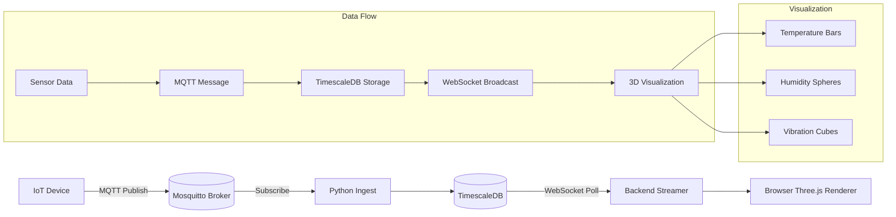
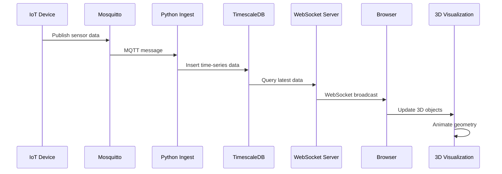

# From Sensors to Sculptures: MQTT + TimescaleDB + WebSockets + Three.js

**Objective**: Master the intersection of IoT data streaming, time-series databases, real-time communication, and 3D visualization by creating living, breathing 3D sculptures from sensor data. When you need to explore creative applications of IoT data, when you want to build real-time data visualization systems, when you're curious about the intersection of sensors and 3D art—MQTT + TimescaleDB + WebSockets + Three.js becomes your weapon of choice.

This isn't just a dashboard. It's data reborn as geometry. Let's transform IoT sensor readings into living, breathing 3D sculptures that pulse and mutate with real-time metrics.

## 0) Prerequisites (Read Once, Live by Them)

### The Five Commandments

1. **Understand IoT data streaming**
   - MQTT messaging and pub/sub patterns
   - Real-time data ingestion and processing
   - Time-series data structures and formats
   - Sensor data simulation and validation

2. **Master time-series databases**
   - TimescaleDB hypertables and compression
   - Time-series indexing and querying
   - Data retention and archival strategies
   - Performance optimization for IoT workloads

3. **Know your real-time communication**
   - WebSocket connections and message handling
   - Real-time data broadcasting and subscription
   - Connection management and error handling
   - Browser compatibility and fallbacks

4. **Validate everything**
   - Test MQTT message flow and reliability
   - Verify TimescaleDB data ingestion and querying
   - Check WebSocket connection stability
   - Monitor Three.js rendering performance

5. **Plan for creativity**
   - Design for artistic expression and experimentation
   - Enable real-time data visualization
   - Support multiple sensor types and formats
   - Document creative workflows and techniques

**Why These Principles**: Creative IoT technology requires understanding distributed systems, time-series databases, and 3D visualization. Understanding these patterns prevents technical limitations and enables artistic expression.

## 1) Infrastructure Setup with Docker Compose

### Complete Docker Compose Stack

```yaml
# docker-compose.yml
version: "3.9"
services:
  mosquitto:
    image: eclipse-mosquitto:2
    container_name: mosquitto
    ports:
      - "1883:1883"
      - "9001:9001"
    volumes:
      - ./mosquitto.conf:/mosquitto/config/mosquitto.conf
      - mosquitto_data:/mosquitto/data
      - mosquitto_logs:/mosquitto/log
    restart: unless-stopped

  timescaledb:
    image: timescale/timescaledb:2.15-pg15
    container_name: timescaledb
    environment:
      POSTGRES_USER: postgres
      POSTGRES_PASSWORD: secret
      POSTGRES_DB: iot_data
    ports:
      - "5432:5432"
    volumes:
      - timescaledb_data:/var/lib/postgresql/data
    restart: unless-stopped

  mqtt_ingest:
    build: ./mqtt_ingest
    container_name: mqtt_ingest
    environment:
      - MQTT_BROKER=mosquitto
      - DB_HOST=timescaledb
      - DB_USER=postgres
      - DB_PASSWORD=secret
      - DB_NAME=iot_data
    depends_on:
      - mosquitto
      - timescaledb
    restart: unless-stopped

  websocket_server:
    build: ./websocket_server
    container_name: websocket_server
    environment:
      - DB_HOST=timescaledb
      - DB_USER=postgres
      - DB_PASSWORD=secret
      - DB_NAME=iot_data
    ports:
      - "8765:8765"
    depends_on:
      - timescaledb
    restart: unless-stopped

volumes:
  mosquitto_data:
  mosquitto_logs:
  timescaledb_data:
```

**Why Docker Compose Matters**: Complete infrastructure stack enables reliable IoT data processing. Understanding these patterns prevents setup issues and enables consistent development environments.

### Mosquitto Configuration

```conf
# mosquitto.conf
listener 1883
allow_anonymous true
persistence true
persistence_location /mosquitto/data/
log_dest file /mosquitto/log/mosquitto.log
log_type error
log_type warning
log_type notice
log_type information
```

**Why Mosquitto Config Matters**: Proper MQTT configuration enables reliable message delivery. Understanding these patterns prevents connection issues and enables robust IoT communication.

## 2) Simulate IoT Sensor Publishing

### Python IoT Simulator

```python
# iot_simulator.py
import paho.mqtt.client as mqtt
import json
import time
import random
import asyncio
from datetime import datetime

class IoTSensorSimulator:
    def __init__(self, device_id, broker_host="localhost", broker_port=1883):
        self.device_id = device_id
        self.broker_host = broker_host
        self.broker_port = broker_port
        self.client = mqtt.Client()
        self.running = False
        
    def connect_mqtt(self):
        """Connect to MQTT broker"""
        try:
            self.client.connect(self.broker_host, self.broker_port, 60)
            print(f"Device {self.device_id} connected to MQTT broker")
            return True
        except Exception as e:
            print(f"Failed to connect to MQTT broker: {e}")
            return False
    
    def generate_sensor_data(self):
        """Generate realistic sensor data"""
        base_temp = 20.0
        temp_variation = random.uniform(-5, 5)
        temp = base_temp + temp_variation + random.uniform(-1, 1)
        
        return {
            "device": self.device_id,
            "timestamp": int(time.time()),
            "datetime": datetime.now().isoformat(),
            "temperature": round(temp, 2),
            "humidity": round(random.uniform(30, 80), 2),
            "vibration": round(random.uniform(0.1, 2.0), 2),
            "pressure": round(random.uniform(1000, 1020), 2),
            "light": round(random.uniform(0, 1000), 2),
            "location": {
                "lat": round(random.uniform(40.7, 40.8), 6),
                "lon": round(random.uniform(-74.0, -73.9), 6)
            }
        }
    
    def publish_sensor_data(self, topic, data):
        """Publish sensor data to MQTT topic"""
        try:
            message = json.dumps(data)
            result = self.client.publish(topic, message)
            if result.rc == mqtt.MQTT_ERR_SUCCESS:
                print(f"Published to {topic}: {data['temperature']}°C")
            else:
                print(f"Failed to publish to {topic}")
        except Exception as e:
            print(f"Error publishing data: {e}")
    
    def run_sensor(self, interval=2):
        """Run sensor simulation"""
        if not self.connect_mqtt():
            return
            
        self.running = True
        self.client.loop_start()
        
        try:
            while self.running:
                # Generate and publish temperature data
                temp_data = self.generate_sensor_data()
                self.publish_sensor_data(f"sensors/{self.device_id}/temperature", temp_data)
                
                # Generate and publish humidity data
                humidity_data = self.generate_sensor_data()
                self.publish_sensor_data(f"sensors/{self.device_id}/humidity", humidity_data)
                
                # Generate and publish vibration data
                vibration_data = self.generate_sensor_data()
                self.publish_sensor_data(f"sensors/{self.device_id}/vibration", vibration_data)
                
                time.sleep(interval)
                
        except KeyboardInterrupt:
            print(f"Sensor {self.device_id} stopped")
        finally:
            self.running = False
            self.client.loop_stop()
            self.client.disconnect()

# Run multiple sensors
def run_sensor_farm():
    """Run multiple IoT sensors"""
    sensors = [
        IoTSensorSimulator("device_001"),
        IoTSensorSimulator("device_002"),
        IoTSensorSimulator("device_003")
    ]
    
    for sensor in sensors:
        sensor.run_sensor(interval=1)

if __name__ == "__main__":
    run_sensor_farm()
```

**Why IoT Simulation Matters**: Realistic sensor data generation enables testing and development. Understanding these patterns prevents data generation issues and enables reliable IoT data streaming.

### Manual MQTT Publishing

```bash
# Manual sensor data publishing
mosquitto_pub -h localhost -t sensors/device_001/temperature -m '{"device":"device_001","temp":22.5,"ts":1697042000}'
mosquitto_pub -h localhost -t sensors/device_001/humidity -m '{"device":"device_001","humidity":65.2,"ts":1697042000}'
mosquitto_pub -h localhost -t sensors/device_001/vibration -m '{"device":"device_001","vibration":1.3,"ts":1697042000}'
```

**Why Manual Publishing Matters**: Manual testing enables debugging and validation. Understanding these patterns prevents automation issues and enables reliable IoT communication.

## 3) Python Subscriber → TimescaleDB Ingest

### MQTT to TimescaleDB Ingestor

```python
# mqtt_ingest.py
import paho.mqtt.client as mqtt
import psycopg2
import json
import time
from datetime import datetime

class MQTTTimescaleDBIngestor:
    def __init__(self, mqtt_broker="localhost", mqtt_port=1883, 
                 db_host="localhost", db_user="postgres", 
                 db_password="secret", db_name="iot_data"):
        self.mqtt_broker = mqtt_broker
        self.mqtt_port = mqtt_port
        self.db_host = db_host
        self.db_user = db_user
        self.db_password = db_password
        self.db_name = db_name
        
        self.mqtt_client = mqtt.Client()
        self.db_conn = None
        self.db_cursor = None
        
    def connect_database(self):
        """Connect to TimescaleDB"""
        try:
            self.db_conn = psycopg2.connect(
                host=self.db_host,
                database=self.db_name,
                user=self.db_user,
                password=self.db_password
            )
            self.db_cursor = self.db_conn.cursor()
            print("Connected to TimescaleDB")
            return True
        except Exception as e:
            print(f"Failed to connect to database: {e}")
            return False
    
    def setup_database(self):
        """Setup TimescaleDB hypertables"""
        try:
            # Create sensor data table
            self.db_cursor.execute("""
                CREATE TABLE IF NOT EXISTS sensor_data (
                    device TEXT,
                    ts TIMESTAMPTZ,
                    temperature DOUBLE PRECISION,
                    humidity DOUBLE PRECISION,
                    vibration DOUBLE PRECISION,
                    pressure DOUBLE PRECISION,
                    light DOUBLE PRECISION,
                    location_lat DOUBLE PRECISION,
                    location_lon DOUBLE PRECISION,
                    PRIMARY KEY (device, ts)
                );
            """)
            
            # Create hypertable
            self.db_cursor.execute("""
                SELECT create_hypertable('sensor_data', 'ts', if_not_exists => TRUE);
            """)
            
            # Create indexes for performance
            self.db_cursor.execute("""
                CREATE INDEX IF NOT EXISTS idx_sensor_data_device_ts 
                ON sensor_data (device, ts DESC);
            """)
            
            self.db_cursor.execute("""
                CREATE INDEX IF NOT EXISTS idx_sensor_data_ts 
                ON sensor_data (ts DESC);
            """)
            
            self.db_conn.commit()
            print("Database setup completed")
            return True
            
        except Exception as e:
            print(f"Database setup failed: {e}")
            return False
    
    def on_mqtt_connect(self, client, userdata, flags, rc):
        """MQTT connection callback"""
        if rc == 0:
            print("Connected to MQTT broker")
            # Subscribe to all sensor topics
            client.subscribe("sensors/+/temperature")
            client.subscribe("sensors/+/humidity")
            client.subscribe("sensors/+/vibration")
            client.subscribe("sensors/+/pressure")
            client.subscribe("sensors/+/light")
        else:
            print(f"Failed to connect to MQTT broker: {rc}")
    
    def on_mqtt_message(self, client, userdata, msg):
        """MQTT message callback"""
        try:
            data = json.loads(msg.payload.decode())
            topic_parts = msg.topic.split('/')
            sensor_type = topic_parts[-1]
            device = topic_parts[-2]
            
            # Insert data into TimescaleDB
            self.insert_sensor_data(device, sensor_type, data)
            
        except Exception as e:
            print(f"Error processing message: {e}")
    
    def insert_sensor_data(self, device, sensor_type, data):
        """Insert sensor data into TimescaleDB"""
        try:
            timestamp = datetime.fromtimestamp(data.get('timestamp', time.time()))
            
            # Prepare data for insertion
            insert_data = {
                'device': device,
                'ts': timestamp,
                'temperature': data.get('temperature'),
                'humidity': data.get('humidity'),
                'vibration': data.get('vibration'),
                'pressure': data.get('pressure'),
                'light': data.get('light'),
                'location_lat': data.get('location', {}).get('lat'),
                'location_lon': data.get('location', {}).get('lon')
            }
            
            # Insert with conflict resolution
            self.db_cursor.execute("""
                INSERT INTO sensor_data (
                    device, ts, temperature, humidity, vibration, 
                    pressure, light, location_lat, location_lon
                ) VALUES (
                    %(device)s, %(ts)s, %(temperature)s, %(humidity)s, 
                    %(vibration)s, %(pressure)s, %(light)s, 
                    %(location_lat)s, %(location_lon)s
                ) ON CONFLICT (device, ts) DO UPDATE SET
                    temperature = EXCLUDED.temperature,
                    humidity = EXCLUDED.humidity,
                    vibration = EXCLUDED.vibration,
                    pressure = EXCLUDED.pressure,
                    light = EXCLUDED.light,
                    location_lat = EXCLUDED.location_lat,
                    location_lon = EXCLUDED.location_lon
            """, insert_data)
            
            self.db_conn.commit()
            print(f"Inserted {sensor_type} data for {device}: {data.get(sensor_type)}")
            
        except Exception as e:
            print(f"Error inserting sensor data: {e}")
            self.db_conn.rollback()
    
    def connect_mqtt(self):
        """Connect to MQTT broker"""
        try:
            self.mqtt_client.on_connect = self.on_mqtt_connect
            self.mqtt_client.on_message = self.on_mqtt_message
            self.mqtt_client.connect(self.mqtt_broker, self.mqtt_port, 60)
            print("Connected to MQTT broker")
            return True
        except Exception as e:
            print(f"Failed to connect to MQTT broker: {e}")
            return False
    
    def run(self):
        """Run the ingestor"""
        if not self.connect_database():
            return
            
        if not self.setup_database():
            return
            
        if not self.connect_mqtt():
            return
            
        try:
            self.mqtt_client.loop_forever()
        except KeyboardInterrupt:
            print("Ingestor stopped")
        finally:
            if self.db_cursor:
                self.db_cursor.close()
            if self.db_conn:
                self.db_conn.close()
            self.mqtt_client.disconnect()

if __name__ == "__main__":
    ingestor = MQTTTimescaleDBIngestor()
    ingestor.run()
```

**Why TimescaleDB Ingest Matters**: TimescaleDB makes IoT streams queryable and compressed for history. Understanding these patterns prevents data loss and enables reliable time-series storage.

## 4) WebSocket API for Real-Time Streaming

### WebSocket Server

```python
# websocket_server.py
import asyncio
import websockets
import psycopg2
import json
import time
from datetime import datetime, timedelta

class WebSocketDataStreamer:
    def __init__(self, db_host="localhost", db_user="postgres", 
                 db_password="secret", db_name="iot_data"):
        self.db_host = db_host
        self.db_user = db_user
        self.db_password = db_password
        self.db_name = db_name
        self.connected_clients = set()
        
    def connect_database(self):
        """Connect to TimescaleDB"""
        try:
            self.db_conn = psycopg2.connect(
                host=self.db_host,
                database=self.db_name,
                user=self.db_user,
                password=self.db_password
            )
            self.db_cursor = self.db_conn.cursor()
            return True
        except Exception as e:
            print(f"Database connection failed: {e}")
            return False
    
    def get_latest_sensor_data(self):
        """Get latest sensor data from TimescaleDB"""
        try:
            self.db_cursor.execute("""
                SELECT device, ts, temperature, humidity, vibration, 
                       pressure, light, location_lat, location_lon
                FROM sensor_data 
                WHERE ts > NOW() - INTERVAL '1 minute'
                ORDER BY ts DESC
                LIMIT 100
            """)
            
            rows = self.db_cursor.fetchall()
            return [
                {
                    "device": row[0],
                    "timestamp": row[1].timestamp(),
                    "temperature": row[2],
                    "humidity": row[3],
                    "vibration": row[4],
                    "pressure": row[5],
                    "light": row[6],
                    "location": {
                        "lat": row[7],
                        "lon": row[8]
                    }
                }
                for row in rows
            ]
        except Exception as e:
            print(f"Error querying sensor data: {e}")
            return []
    
    def get_aggregated_data(self):
        """Get aggregated sensor data"""
        try:
            self.db_cursor.execute("""
                SELECT 
                    device,
                    AVG(temperature) as avg_temp,
                    MAX(temperature) as max_temp,
                    MIN(temperature) as min_temp,
                    AVG(humidity) as avg_humidity,
                    AVG(vibration) as avg_vibration,
                    COUNT(*) as data_points
                FROM sensor_data 
                WHERE ts > NOW() - INTERVAL '5 minutes'
                GROUP BY device
                ORDER BY device
            """)
            
            rows = self.db_cursor.fetchall()
            return [
                {
                    "device": row[0],
                    "avg_temperature": float(row[1]) if row[1] else None,
                    "max_temperature": float(row[2]) if row[2] else None,
                    "min_temperature": float(row[3]) if row[3] else None,
                    "avg_humidity": float(row[4]) if row[4] else None,
                    "avg_vibration": float(row[5]) if row[5] else None,
                    "data_points": row[6]
                }
                for row in rows
            ]
        except Exception as e:
            print(f"Error querying aggregated data: {e}")
            return []
    
    async def handle_client(self, websocket, path):
        """Handle WebSocket client connection"""
        self.connected_clients.add(websocket)
        print(f"Client connected. Total clients: {len(self.connected_clients)}")
        
        try:
            while True:
                # Get latest sensor data
                sensor_data = self.get_latest_sensor_data()
                aggregated_data = self.get_aggregated_data()
                
                # Send data to client
                message = {
                    "type": "sensor_data",
                    "timestamp": time.time(),
                    "sensor_data": sensor_data,
                    "aggregated_data": aggregated_data
                }
                
                await websocket.send(json.dumps(message))
                await asyncio.sleep(1)  # Send updates every second
                
        except websockets.exceptions.ConnectionClosed:
            print("Client disconnected")
        finally:
            self.connected_clients.remove(websocket)
            print(f"Client removed. Total clients: {len(self.connected_clients)}")
    
    async def broadcast_to_all(self, message):
        """Broadcast message to all connected clients"""
        if self.connected_clients:
            await asyncio.gather(
                *[client.send(message) for client in self.connected_clients],
                return_exceptions=True
            )
    
    async def run_server(self, host="0.0.0.0", port=8765):
        """Run WebSocket server"""
        if not self.connect_database():
            return
            
        print(f"Starting WebSocket server on {host}:{port}")
        
        async with websockets.serve(self.handle_client, host, port):
            await asyncio.Future()  # Run forever

if __name__ == "__main__":
    streamer = WebSocketDataStreamer()
    asyncio.run(streamer.run_server())
```

**Why WebSocket Streaming Matters**: WebSockets = push channel → browsers see live changes. Understanding these patterns prevents polling issues and enables real-time data visualization.

## 5) Three.js Visualization in Browser

### Complete Three.js Visualization

```html
<!DOCTYPE html>
<html>
<head>
    <title>IoT Data 3D Visualization</title>
    <style>
        body { margin: 0; background: #000; color: #fff; font-family: monospace; }
        #info { position: absolute; top: 10px; left: 10px; z-index: 100; }
        #stats { position: absolute; bottom: 10px; left: 10px; z-index: 100; }
    </style>
</head>
<body>
    <div id="info">
        <h3>IoT Data 3D Visualization</h3>
        <div id="connection-status">Connecting...</div>
    </div>
    <div id="stats">
        <div id="device-count">Devices: 0</div>
        <div id="data-points">Data Points: 0</div>
    </div>
    
    <script src="https://cdn.jsdelivr.net/npm/three@0.158.0/build/three.min.js"></script>
    <script>
        class IoTDataVisualizer {
            constructor() {
                this.scene = new THREE.Scene();
                this.camera = new THREE.PerspectiveCamera(75, window.innerWidth / window.innerHeight, 0.1, 1000);
                this.renderer = new THREE.WebGLRenderer({ antialias: true });
                this.renderer.setSize(window.innerWidth, window.innerHeight);
                this.renderer.setClearColor(0x000000);
                document.body.appendChild(this.renderer.domElement);
                
                this.deviceObjects = new Map();
                this.animationId = null;
                this.ws = null;
                this.stats = {
                    deviceCount: 0,
                    dataPoints: 0
                }
                
                this.init();
            }
            
            init() {
                // Setup camera
                this.camera.position.z = 10;
                this.camera.position.y = 5;
                this.camera.lookAt(0, 0, 0);
                
                // Add lighting
                const ambientLight = new THREE.AmbientLight(0x404040, 0.6);
                this.scene.add(ambientLight);
                
                const directionalLight = new THREE.DirectionalLight(0xffffff, 0.8);
                directionalLight.position.set(10, 10, 5);
                this.scene.add(directionalLight);
                
                // Connect to WebSocket
                this.connectWebSocket();
                
                // Start animation loop
                this.animate();
                
                // Handle window resize
                window.addEventListener('resize', () => this.onWindowResize());
            }
            
            connectWebSocket() {
                this.ws = new WebSocket('ws://localhost:8765');
                
                this.ws.onopen = () => {
                    console.log('Connected to WebSocket');
                    document.getElementById('connection-status').textContent = 'Connected';
                };
                
                this.ws.onmessage = (event) => {
                    const data = JSON.parse(event.data);
                    this.updateVisualization(data);
                };
                
                this.ws.onclose = () => {
                    console.log('WebSocket disconnected');
                    document.getElementById('connection-status').textContent = 'Disconnected';
                    // Attempt to reconnect
                    setTimeout(() => this.connectWebSocket(), 5000);
                };
                
                this.ws.onerror = (error) => {
                    console.error('WebSocket error:', error);
                    document.getElementById('connection-status').textContent = 'Error';
                };
            }
            
            updateVisualization(data) {
                if (data.type === 'sensor_data') {
                    this.updateSensorData(data.sensor_data);
                    this.updateAggregatedData(data.aggregated_data);
                    this.updateStats(data);
                }
            }
            
            updateSensorData(sensorData) {
                sensorData.forEach(data => {
                    const device = data.device;
                    
                    if (!this.deviceObjects.has(device)) {
                        this.createDeviceObject(device);
                    }
                    
                    const deviceObj = this.deviceObjects.get(device);
                    this.updateDeviceObject(deviceObj, data);
                });
            }
            
            createDeviceObject(device) {
                // Create group for device
                const group = new THREE.Group();
                group.name = `device_${device}`;
                
                // Temperature bar
                const tempGeometry = new THREE.BoxGeometry(0.5, 1, 0.5);
                const tempMaterial = new THREE.MeshLambertMaterial({ color: 0x00ff00 });
                const tempBar = new THREE.Mesh(tempGeometry, tempMaterial);
                tempBar.name = 'temperature_bar';
                tempBar.position.y = 0.5;
                group.add(tempBar);
                
                // Humidity sphere
                const humidityGeometry = new THREE.SphereGeometry(0.3, 16, 16);
                const humidityMaterial = new THREE.MeshLambertMaterial({ color: 0x0088ff });
                const humiditySphere = new THREE.Mesh(humidityGeometry, humidityMaterial);
                humiditySphere.name = 'humidity_sphere';
                humiditySphere.position.set(1, 0, 0);
                group.add(humiditySphere);
                
                // Vibration cube
                const vibrationGeometry = new THREE.BoxGeometry(0.4, 0.4, 0.4);
                const vibrationMaterial = new THREE.MeshLambertMaterial({ color: 0xff8800 });
                const vibrationCube = new THREE.Mesh(vibrationGeometry, vibrationMaterial);
                vibrationCube.name = 'vibration_cube';
                vibrationCube.position.set(-1, 0, 0);
                group.add(vibrationCube);
                
                // Position device in a grid
                const deviceIndex = this.deviceObjects.size;
                const gridSize = Math.ceil(Math.sqrt(10)); // Max 10 devices
                const x = (deviceIndex % gridSize) * 3 - (gridSize - 1) * 1.5;
                const z = Math.floor(deviceIndex / gridSize) * 3 - (gridSize - 1) * 1.5;
                group.position.set(x, 0, z);
                
                this.scene.add(group);
                this.deviceObjects.set(device, group);
            }
            
            updateDeviceObject(deviceObj, data) {
                // Update temperature bar
                const tempBar = deviceObj.getObjectByName('temperature_bar');
                if (tempBar && data.temperature) {
                    const height = Math.max(0.1, data.temperature / 10);
                    tempBar.scale.y = height;
                    tempBar.position.y = height / 2;
                    
                    // Color based on temperature
                    const hue = (data.temperature - 15) / 30; // 15-45°C range
                    tempBar.material.color.setHSL(hue, 1, 0.5);
                }
                
                // Update humidity sphere
                const humiditySphere = deviceObj.getObjectByName('humidity_sphere');
                if (humiditySphere && data.humidity) {
                    const scale = Math.max(0.1, data.humidity / 100);
                    humiditySphere.scale.setScalar(scale);
                    
                    // Color based on humidity
                    const hue = data.humidity / 100 * 0.3; // Blue to cyan
                    humiditySphere.material.color.setHSL(hue, 1, 0.5);
                }
                
                // Update vibration cube
                const vibrationCube = deviceObj.getObjectByName('vibration_cube');
                if (vibrationCube && data.vibration) {
                    const scale = Math.max(0.1, data.vibration / 2);
                    vibrationCube.scale.setScalar(scale);
                    
                    // Rotation based on vibration
                    vibrationCube.rotation.x += data.vibration * 0.1;
                    vibrationCube.rotation.y += data.vibration * 0.1;
                    vibrationCube.rotation.z += data.vibration * 0.1;
                }
            }
            
            updateAggregatedData(aggregatedData) {
                // Update aggregated visualization if needed
                console.log('Aggregated data:', aggregatedData);
            }
            
            updateStats(data) {
                this.stats.deviceCount = data.sensor_data.length;
                this.stats.dataPoints = data.sensor_data.reduce((sum, item) => sum + 1, 0);
                
                document.getElementById('device-count').textContent = `Devices: ${this.stats.deviceCount}`;
                document.getElementById('data-points').textContent = `Data Points: ${this.stats.dataPoints}`;
            }
            
            animate() {
                this.animationId = requestAnimationFrame(() => this.animate());
                
                // Rotate camera for dynamic view
                this.camera.position.x = Math.cos(Date.now() * 0.001) * 15;
                this.camera.position.z = Math.sin(Date.now() * 0.001) * 15;
                this.camera.lookAt(0, 0, 0);
                
                this.renderer.render(this.scene, this.camera);
            }
            
            onWindowResize() {
                this.camera.aspect = window.innerWidth / window.innerHeight;
                this.camera.updateProjectionMatrix();
                this.renderer.setSize(window.innerWidth, window.innerHeight);
            }
        }
        
        // Initialize visualizer
        const visualizer = new IoTDataVisualizer();
    </script>
</body>
</html>
```

**Why Three.js Visualization Matters**: Sensor values mutate 3D objects → the DB becomes living geometry. Understanding these patterns prevents static visualizations and enables dynamic 3D art creation.

## 6) Architecture Diagram

### System Flow



**Why Architecture Diagrams Matter**: Visual representation of data flow enables understanding of system components. Understanding these patterns prevents architectural confusion and enables reliable system design.

### Data Pipeline



**Why Data Pipeline Matters**: Understanding the complete data flow enables effective system design. Understanding these patterns prevents data flow issues and enables reliable visualization.

## 7) Weird Extensions

### Advanced 3D Effects

```javascript
// Advanced 3D effects
class AdvancedIoTVisualizer extends IoTDataVisualizer {
    createParticleSystem(device, data) {
        // Create particle system for light data
        const particleCount = Math.floor(data.light / 10);
        const particles = new THREE.BufferGeometry();
        const positions = new Float32Array(particleCount * 3);
        
        for (let i = 0; i < particleCount; i++) {
            positions[i * 3] = (Math.random() - 0.5) * 10;
            positions[i * 3 + 1] = (Math.random() - 0.5) * 10;
            positions[i * 3 + 2] = (Math.random() - 0.5) * 10;
        }
        
        particles.setAttribute('position', new THREE.BufferAttribute(positions, 3));
        
        const particleMaterial = new THREE.PointsMaterial({
            color: 0xffff00,
            size: 0.1
        });
        
        const particleSystem = new THREE.Points(particles, particleMaterial);
        return particleSystem;
    }
    
    createMeshDeformation(device, data) {
        // Create mesh deformation based on vibration
        const geometry = new THREE.PlaneGeometry(2, 2, 32, 32);
        const material = new THREE.MeshLambertMaterial({ 
            color: 0xff0000,
            wireframe: true 
        });
        
        const mesh = new THREE.Mesh(geometry, material);
        
        // Deform vertices based on vibration
        const vertices = geometry.attributes.position.array;
        for (let i = 0; i < vertices.length; i += 3) {
            vertices[i + 2] = Math.sin(vertices[i] * data.vibration) * 0.5;
        }
        geometry.attributes.position.needsUpdate = true;
        
        return mesh;
    }
}
```

**Why Advanced Effects Matter**: Creative 3D effects enable sophisticated data visualization. Understanding these patterns prevents boring visualizations and enables artistic expression.

### Real-Time Analytics

```python
# real_time_analytics.py
class RealTimeAnalytics:
    def __init__(self, db_conn):
        self.db_conn = db_conn
        self.analytics_cache = {}
        
    def calculate_trends(self, device, time_window=300):
        """Calculate trends for a device"""
        try:
            cursor = self.db_conn.cursor()
            cursor.execute("""
                SELECT 
                    AVG(temperature) as avg_temp,
                    STDDEV(temperature) as temp_std,
                    AVG(humidity) as avg_humidity,
                    AVG(vibration) as avg_vibration
                FROM sensor_data 
                WHERE device = %s AND ts > NOW() - INTERVAL '%s seconds'
            """, (device, time_window))
            
            result = cursor.fetchone()
            if result:
                return {
                    "avg_temperature": float(result[0]) if result[0] else 0,
                    "temp_volatility": float(result[1]) if result[1] else 0,
                    "avg_humidity": float(result[2]) if result[2] else 0,
                    "avg_vibration": float(result[3]) if result[3] else 0
                }
        except Exception as e:
            print(f"Error calculating trends: {e}")
        return None
    
    def detect_anomalies(self, device, threshold=2.0):
        """Detect anomalies in sensor data"""
        try:
            cursor = self.db_conn.cursor()
            cursor.execute("""
                SELECT temperature, humidity, vibration
                FROM sensor_data 
                WHERE device = %s 
                ORDER BY ts DESC 
                LIMIT 10
            """, (device,))
            
            recent_data = cursor.fetchall()
            if len(recent_data) < 5:
                return None
                
            # Simple anomaly detection
            temps = [row[0] for row in recent_data if row[0]]
            if temps:
                avg_temp = sum(temps) / len(temps)
                current_temp = temps[0]
                
                if abs(current_temp - avg_temp) > threshold:
                    return {
                        "anomaly": True,
                        "type": "temperature",
                        "value": current_temp,
                        "expected": avg_temp
                    }
                    
        except Exception as e:
            print(f"Error detecting anomalies: {e}")
        return None
```

**Why Real-Time Analytics Matters**: Advanced analytics enable intelligent data visualization. Understanding these patterns prevents simple visualizations and enables sophisticated data insights.

## 8) Best Practices

### Performance Optimization

```javascript
// Performance optimization
class OptimizedIoTVisualizer extends IoTDataVisualizer {
    constructor() {
        super();
        this.objectPool = [];
        this.maxObjects = 100;
        this.frameRate = 60;
        this.lastFrameTime = 0;
    }
    
    optimizeRendering() {
        // Use object pooling
        this.objectPool = [];
        for (let i = 0; i < this.maxObjects; i++) {
            const geometry = new THREE.BoxGeometry(0.5, 1, 0.5);
            const material = new THREE.MeshLambertMaterial({ color: 0x00ff00 });
            const mesh = new THREE.Mesh(geometry, material);
            mesh.visible = false;
            this.scene.add(mesh);
            this.objectPool.push(mesh);
        }
    }
    
    animate() {
        const currentTime = performance.now();
        const deltaTime = currentTime - this.lastFrameTime;
        
        if (deltaTime >= 1000 / this.frameRate) {
            this.updateVisualization();
            this.renderer.render(this.scene, this.camera);
            this.lastFrameTime = currentTime;
        }
        
        this.animationId = requestAnimationFrame(() => this.animate());
    }
    
    updateVisualization() {
        // Optimized update logic
        this.deviceObjects.forEach((deviceObj, device) => {
            // Only update visible objects
            if (deviceObj.visible) {
                this.updateDeviceObject(deviceObj, this.latestData[device]);
            }
        });
    }
}
```

**Why Performance Optimization Matters**: Optimized rendering enables smooth real-time visualization. Understanding these patterns prevents frame drops and enables professional 3D art creation.

### Error Handling and Resilience

```python
# error_handler.py
class IoTErrorHandler:
    def __init__(self):
        self.retry_count = 3
        self.retry_delay = 1
        
    def handle_mqtt_errors(self, func):
        """Handle MQTT-specific errors"""
        def wrapper(*args, **kwargs):
            for attempt in range(self.retry_count):
                try:
                    return func(*args, **kwargs)
                except Exception as e:
                    print(f"MQTT error (attempt {attempt + 1}): {e}")
                    if attempt < self.retry_count - 1:
                        time.sleep(self.retry_delay * (2 ** attempt))
                    else:
                        print(f"MQTT operation failed after {self.retry_count} attempts")
                        return None
        return wrapper
    
    def handle_database_errors(self, func):
        """Handle database-specific errors"""
        def wrapper(*args, **kwargs):
            try:
                return func(*args, **kwargs)
            except psycopg2.OperationalError:
                print("Database connection lost, attempting to reconnect...")
                return None
            except psycopg2.IntegrityError:
                print("Database integrity error, skipping duplicate data")
                return None
            except Exception as e:
                print(f"Database error: {e}")
                return None
        return wrapper
```

**Why Error Handling Matters**: Robust error handling prevents system failures and enables reliable data processing. Understanding these patterns prevents silent failures and enables resilient systems.

## 9) TL;DR Runbook

### Essential Commands

```bash
# Start infrastructure
docker-compose up -d

# Run IoT simulator
python iot_simulator.py

# Run MQTT ingestor
python mqtt_ingest.py

# Run WebSocket server
python websocket_server.py

# Open browser to visualization
open http://localhost:8000/visualization.html
```

### Essential Patterns

```python
# Essential MQTT + TimescaleDB + WebSockets + Three.js patterns
iot_visualization_patterns = {
    "mqtt_messaging": "Mosquitto is ideal for lightweight IoT messaging with backpressure",
    "timescale_storage": "TimescaleDB compresses and indexes sensor history (hypertables)",
    "websocket_streaming": "WebSockets give push semantics vs polling",
    "threejs_rendering": "Three.js teaches how to turn numbers into real-time geometry",
    "real_time_art": "Together, they force developers to think infra + DB + API + visualization as one continuous flow",
    "performance": "Optimize rendering, handle errors gracefully, cache data efficiently"
}
```

### Quick Reference

```python
# Essential MQTT + TimescaleDB + WebSockets + Three.js operations
# 1. Publish sensor data
mosquitto_pub -h localhost -t sensors/device_001/temperature -m '{"device":"device_001","temp":22.5,"ts":1697042000}'

# 2. Ingest to TimescaleDB
INSERT INTO sensor_data (device, ts, temperature) VALUES ('device_001', NOW(), 22.5);

# 3. Stream via WebSocket
await websocket.send(json.dumps({"device": "device_001", "temperature": 22.5}))

# 4. Render in Three.js
cube.scale.y = temperature / 10.0;
cube.material.color.setHSL(temperature/40.0, 1.0, 0.5);
```

**Why This Runbook**: These patterns cover 90% of MQTT + TimescaleDB + WebSockets + Three.js needs. Master these before exploring advanced creative scenarios.

## 10) The Machine's Summary

MQTT + TimescaleDB + WebSockets + Three.js requires understanding distributed systems, time-series databases, real-time communication, and 3D visualization. When used correctly, this combination enables creative data visualization, artistic expression, and innovative ways to explore IoT data. The key is understanding data flow, mastering real-time communication, and following performance best practices.

**The Dark Truth**: Without proper MQTT + TimescaleDB + WebSockets + Three.js understanding, your IoT data remains static and uncreative. This combination is your weapon. Use it wisely.

**The Machine's Mantra**: "In the sensors we trust, in the MQTT we publish, in the TimescaleDB we store, in the WebSockets we stream, and in the Three.js we sculpt the data into living geometry."

**Why This Matters**: MQTT + TimescaleDB + WebSockets + Three.js enables efficient creative data visualization that can handle complex IoT datasets, maintain real-time performance, and provide artistic experiences while ensuring data integrity and visual quality.

---

*This tutorial provides the complete machinery for MQTT + TimescaleDB + WebSockets + Three.js art creation. The patterns scale from simple sensor visualization to complex real-time data sculptures, from basic 3D rendering to advanced IoT data art.*
