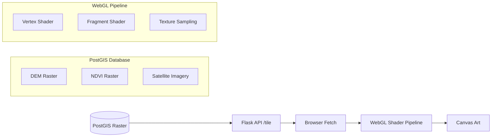
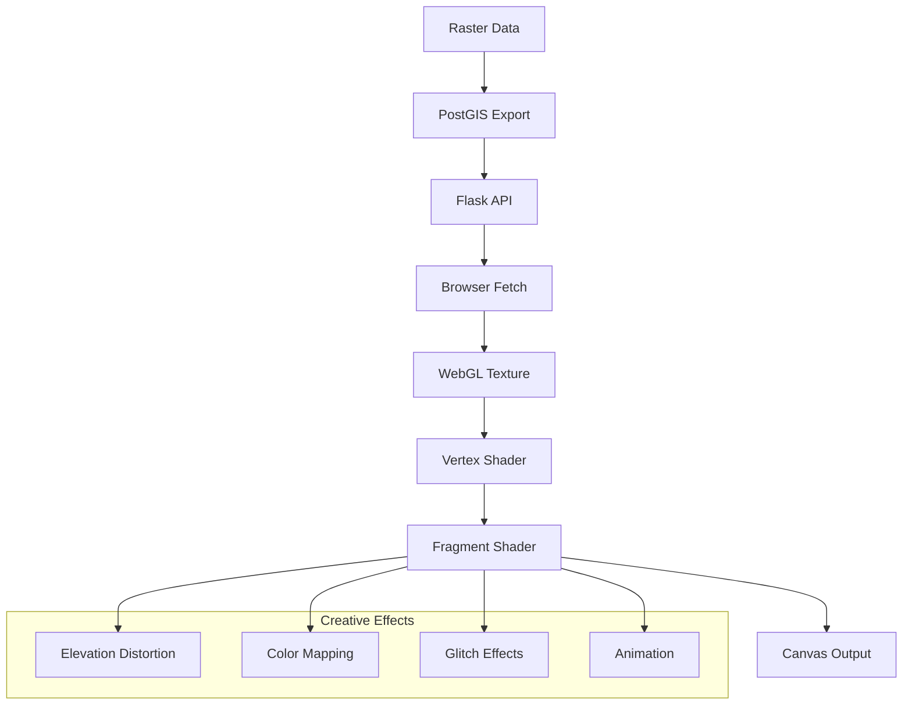

# From Elevation Models to Shader Dreams: PostGIS + WebGL Glitch Art

**Objective**: Master the intersection of geospatial data and creative technology by converting PostGIS raster data into WebGL-powered glitch art in the browser. When you need to explore creative applications of geospatial data, when you want to transform scientific datasets into artistic expressions, when you're curious about the intersection of cartography and digital art—PostGIS + WebGL becomes your weapon of choice.

Geospatial rasters aren't just for analysis—they can be reinterpreted as texture maps in a GPU pipeline. Let's transform elevation models, satellite imagery, and NDVI data into living, breathing digital art through the power of WebGL shaders.

## 0) Prerequisites (Read Once, Live by Them)

### The Five Commandments

1. **Understand PostGIS rasters**
   - Raster data types and storage formats
   - Spatial reference systems and coordinate transformations
   - Raster operations and analysis functions
   - Export capabilities and format conversions

2. **Master WebGL fundamentals**
   - Vertex and fragment shaders
   - Texture mapping and sampling
   - Uniform variables and varying attributes
   - Canvas rendering and animation loops

3. **Know your geospatial data**
   - Digital Elevation Models (DEMs) and terrain data
   - Satellite imagery and spectral bands
   - NDVI and vegetation indices
   - GeoTIFF and raster formats

4. **Validate everything**
   - Test PostGIS raster operations and exports
   - Verify WebGL shader compilation and execution
   - Check texture loading and rendering
   - Monitor performance and memory usage

5. **Plan for creativity**
   - Design for artistic expression and experimentation
   - Enable real-time shader manipulation
   - Support multiple data sources and formats
   - Document creative workflows and techniques

**Why These Principles**: Creative geospatial technology requires understanding both data science and computer graphics. Understanding these patterns prevents technical limitations and enables artistic expression.

## 1) PostGIS Raster Setup

### Docker Compose Setup

```yaml
# docker-compose.yml
version: "3.9"
services:
  db:
    image: postgis/postgis:15-3.4
    ports: ["5432:5432"]
    environment:
      - POSTGRES_PASSWORD=secret
      - POSTGRES_DB=geospatial_art
    volumes:
      - ./data:/data
      
  api:
    build: .
    ports: ["5000:5000"]
    environment:
      - DATABASE_URL=postgresql://postgres:secret@db:5432/geospatial_art
    depends_on: [db]
```

**Why Docker Setup Matters**: PostGIS container provides raster processing capabilities. Understanding these patterns prevents installation issues and enables consistent development environments.

### Raster Data Loading

```sql
-- Create raster table
CREATE TABLE dem (
    rid SERIAL PRIMARY KEY,
    rast raster,
    name text,
    created_at timestamp DEFAULT now()
);

-- Load DEM data (example with synthetic data)
INSERT INTO dem(rast, name) 
SELECT ST_AddBand(
    ST_MakeEmptyRaster(256, 256, 0, 0, 30, -30, 0, 0, 4326),
    '32BF'::text, 
    0, 
    NULL
), 'synthetic_dem';

-- Load actual GeoTIFF (if available)
-- raster2pgsql -s 4326 -I -C -M data/elevation.tif public.dem | psql -d geospatial_art
```

**Why Raster Loading Matters**: PostGIS rasters = structured pixel data in the DB. Understanding these patterns prevents data loading issues and enables efficient raster processing.

### Raster Operations

```sql
-- Basic raster operations
SELECT 
    rid,
    ST_Width(rast) as width,
    ST_Height(rast) as height,
    ST_NumBands(rast) as bands,
    ST_SRID(rast) as srid
FROM dem;

-- Extract raster statistics
SELECT 
    rid,
    ST_SummaryStats(rast) as stats
FROM dem;

-- Clip raster to specific bounds
SELECT ST_Clip(rast, ST_MakeEnvelope(0, 0, 100, 100, 4326))
FROM dem 
WHERE rid = 1;
```

**Why Raster Operations Matter**: Understanding raster structure and operations enables effective data processing. Understanding these patterns prevents data corruption and enables reliable raster manipulation.

## 2) Serving Tiles with Python/Flask

### Flask API Setup

```python
# app.py
from flask import Flask, send_file, jsonify
import psycopg2
import tempfile
import os
from rasterio.io import MemoryFile
import numpy as np

app = Flask(__name__)

# Database connection
def get_db_connection():
    return psycopg2.connect(
        host="db",
        database="geospatial_art",
        user="postgres",
        password="secret"
    )

@app.route("/tile/<int:rid>")
def get_tile(rid):
    """Serve raster tile as GeoTIFF"""
    conn = get_db_connection()
    cur = conn.cursor()
    
    try:
        # Export raster as GeoTIFF
        cur.execute("""
            SELECT ST_AsGDALRaster(rast, 'GTiff') 
            FROM dem 
            WHERE rid = %s
        """, (rid,))
        
        result = cur.fetchone()
        if not result:
            return jsonify({"error": "Raster not found"}), 404
            
        gtiff_data = result[0]
        
        # Create temporary file
        with tempfile.NamedTemporaryFile(suffix='.tiff', delete=False) as tmp:
            tmp.write(gtiff_data.tobytes())
            tmp_path = tmp.name
            
        return send_file(tmp_path, mimetype="image/tiff")
        
    except Exception as e:
        return jsonify({"error": str(e)}), 500
    finally:
        cur.close()
        conn.close()

@app.route("/tile/<int:rid>/png")
def get_tile_png(rid):
    """Serve raster tile as PNG"""
    conn = get_db_connection()
    cur = conn.cursor()
    
    try:
        # Export as PNG for better browser compatibility
        cur.execute("""
            SELECT ST_AsGDALRaster(rast, 'PNG') 
            FROM dem 
            WHERE rid = %s
        """, (rid,))
        
        result = cur.fetchone()
        if not result:
            return jsonify({"error": "Raster not found"}), 404
            
        png_data = result[0]
        
        with tempfile.NamedTemporaryFile(suffix='.png', delete=False) as tmp:
            tmp.write(png_data.tobytes())
            tmp_path = tmp.name
            
        return send_file(tmp_path, mimetype="image/png")
        
    except Exception as e:
        return jsonify({"error": str(e)}), 500
    finally:
        cur.close()
        conn.close()

@app.route("/rasters")
def list_rasters():
    """List available rasters"""
    conn = get_db_connection()
    cur = conn.cursor()
    
    try:
        cur.execute("""
            SELECT rid, name, ST_Width(rast) as width, 
                   ST_Height(rast) as height, created_at
            FROM dem 
            ORDER BY created_at DESC
        """)
        
        rasters = []
        for row in cur.fetchall():
            rasters.append({
                "id": row[0],
                "name": row[1],
                "width": row[2],
                "height": row[3],
                "created_at": row[4].isoformat()
            })
            
        return jsonify({"rasters": rasters})
        
    except Exception as e:
        return jsonify({"error": str(e)}), 500
    finally:
        cur.close()
        conn.close()

if __name__ == "__main__":
    app.run(host="0.0.0.0", port=5000, debug=True)
```

**Why Flask API Matters**: REST endpoint bridges geospatial storage to the browser. Understanding these patterns prevents data access issues and enables efficient raster serving.

### Requirements and Dependencies

```python
# requirements.txt
Flask==2.3.3
psycopg2-binary==2.9.7
rasterio==1.3.8
numpy==1.24.3
Pillow==10.0.0
```

**Why Dependencies Matter**: Proper dependencies enable raster processing and web serving. Understanding these patterns prevents import errors and enables reliable API functionality.

## 3) Browser WebGL Setup

### HTML Canvas Setup

```html
<!DOCTYPE html>
<html>
<head>
    <title>PostGIS WebGL Art</title>
    <style>
        body { margin: 0; background: #000; color: #fff; font-family: monospace; }
        canvas { display: block; border: 1px solid #333; }
        .controls { position: absolute; top: 10px; left: 10px; z-index: 100; }
        .controls button { margin: 5px; padding: 10px; background: #333; color: #fff; border: none; cursor: pointer; }
        .controls button:hover { background: #555; }
    </style>
</head>
<body>
    <div class="controls">
        <button onclick="loadRaster(1)">Load DEM</button>
        <button onclick="toggleGlitch()">Toggle Glitch</button>
        <button onclick="changeShader()">Change Shader</button>
        <div id="info">Ready to load raster data...</div>
    </div>
    
    <canvas id="glitch" width="800" height="600"></canvas>
    <script type="module" src="main.js"></script>
</body>
</html>
```

**Why HTML Setup Matters**: Canvas element provides WebGL rendering surface. Understanding these patterns prevents rendering issues and enables interactive art creation.

### WebGL Initialization

```javascript
// main.js
class PostGISWebGLArt {
    constructor() {
        this.canvas = document.getElementById('glitch');
        this.gl = this.canvas.getContext('webgl2') || this.canvas.getContext('webgl');
        this.program = null;
        this.texture = null;
        this.animationId = null;
        this.time = 0;
        this.glitchEnabled = true;
        this.shaderIndex = 0;
        
        this.init();
    }
    
    init() {
        if (!this.gl) {
            console.error('WebGL not supported');
            return;
        }
        
        this.setupShaders();
        this.setupGeometry();
        this.render();
    }
    
    setupShaders() {
        const vertexShaderSource = `
            attribute vec2 a_position;
            attribute vec2 a_texCoord;
            varying vec2 v_texCoord;
            
            void main() {
                gl_Position = vec4(a_position, 0.0, 1.0);
                v_texCoord = a_texCoord;
            }
        `;
        
        const fragmentShaderSource = `
            precision mediump float;
            uniform sampler2D u_image;
            uniform float u_time;
            uniform bool u_glitch;
            varying vec2 v_texCoord;
            
            void main() {
                vec2 coord = v_texCoord;
                
                if (u_glitch) {
                    // Glitch effect
                    float glitch = sin(50.0 * v_texCoord.y + u_time * 5.0) * 0.1;
                    coord.x += glitch;
                    
                    // Color shift
                    float shift = sin(u_time * 3.0) * 0.1;
                    coord.y += shift;
                }
                
                vec4 color = texture2D(u_image, coord);
                
                // Apply color effects
                color.r += sin(u_time * 2.0) * 0.1;
                color.g += cos(u_time * 1.5) * 0.1;
                color.b += sin(u_time * 3.0) * 0.1;
                
                gl_FragColor = color;
            }
        `;
        
        const vertexShader = this.createShader(this.gl.VERTEX_SHADER, vertexShaderSource);
        const fragmentShader = this.createShader(this.gl.FRAGMENT_SHADER, fragmentShaderSource);
        
        this.program = this.createProgram(vertexShader, fragmentShader);
        this.gl.useProgram(this.program);
    }
    
    createShader(type, source) {
        const shader = this.gl.createShader(type);
        this.gl.shaderSource(shader, source);
        this.gl.compileShader(shader);
        
        if (!this.gl.getShaderParameter(shader, this.gl.COMPILE_STATUS)) {
            console.error('Shader compilation error:', this.gl.getShaderInfoLog(shader));
            this.gl.deleteShader(shader);
            return null;
        }
        
        return shader;
    }
    
    createProgram(vertexShader, fragmentShader) {
        const program = this.gl.createProgram();
        this.gl.attachShader(program, vertexShader);
        this.gl.attachShader(program, fragmentShader);
        this.gl.linkProgram(program);
        
        if (!this.gl.getProgramParameter(program, this.gl.LINK_STATUS)) {
            console.error('Program linking error:', this.gl.getProgramInfoLog(program));
            this.gl.deleteProgram(program);
            return null;
        }
        
        return program;
    }
    
    setupGeometry() {
        // Create quad covering entire canvas
        const positions = new Float32Array([
            -1, -1,
             1, -1,
            -1,  1,
             1,  1
        ]);
        
        const texCoords = new Float32Array([
            0, 0,
            1, 0,
            0, 1,
            1, 1
        ]);
        
        // Position buffer
        const positionBuffer = this.gl.createBuffer();
        this.gl.bindBuffer(this.gl.ARRAY_BUFFER, positionBuffer);
        this.gl.bufferData(this.gl.ARRAY_BUFFER, positions, this.gl.STATIC_DRAW);
        
        const positionLocation = this.gl.getAttribLocation(this.program, 'a_position');
        this.gl.enableVertexAttribArray(positionLocation);
        this.gl.vertexAttribPointer(positionLocation, 2, this.gl.FLOAT, false, 0, 0);
        
        // Texture coordinate buffer
        const texCoordBuffer = this.gl.createBuffer();
        this.gl.bindBuffer(this.gl.ARRAY_BUFFER, texCoordBuffer);
        this.gl.bufferData(this.gl.ARRAY_BUFFER, texCoords, this.gl.STATIC_DRAW);
        
        const texCoordLocation = this.gl.getAttribLocation(this.program, 'a_texCoord');
        this.gl.enableVertexAttribArray(texCoordLocation);
        this.gl.vertexAttribPointer(texCoordLocation, 2, this.gl.FLOAT, false, 0, 0);
    }
    
    async loadTexture(url) {
        try {
            const response = await fetch(url);
            const blob = await response.blob();
            const imageBitmap = await createImageBitmap(blob);
            
            const texture = this.gl.createTexture();
            this.gl.bindTexture(this.gl.TEXTURE_2D, texture);
            this.gl.texImage2D(this.gl.TEXTURE_2D, 0, this.gl.RGBA, this.gl.RGBA, this.gl.UNSIGNED_BYTE, imageBitmap);
            this.gl.generateMipmap(this.gl.TEXTURE_2D);
            
            this.texture = texture;
            console.log('Texture loaded successfully');
            
        } catch (error) {
            console.error('Error loading texture:', error);
        }
    }
    
    render() {
        this.time += 0.016; // ~60 FPS
        
        this.gl.clear(this.gl.COLOR_BUFFER_BIT);
        
        if (this.texture) {
            this.gl.bindTexture(this.gl.TEXTURE_2D, this.texture);
            
            // Set uniforms
            const timeLocation = this.gl.getUniformLocation(this.program, 'u_time');
            this.gl.uniform1f(timeLocation, this.time);
            
            const glitchLocation = this.gl.getUniformLocation(this.program, 'u_glitch');
            this.gl.uniform1i(glitchLocation, this.glitchEnabled);
            
            // Draw quad
            this.gl.drawArrays(this.gl.TRIANGLE_STRIP, 0, 4);
        }
        
        this.animationId = requestAnimationFrame(() => this.render());
    }
    
    toggleGlitch() {
        this.glitchEnabled = !this.glitchEnabled;
        console.log('Glitch enabled:', this.glitchEnabled);
    }
    
    changeShader() {
        this.shaderIndex = (this.shaderIndex + 1) % 3;
        console.log('Shader index:', this.shaderIndex);
        // Implement different shader variations
    }
}

// Initialize the art application
const art = new PostGISWebGLArt();

// Global functions for controls
window.loadRaster = (rid) => {
    art.loadTexture(`/tile/${rid}/png`);
};

window.toggleGlitch = () => {
    art.toggleGlitch();
};

window.changeShader = () => {
    art.changeShader();
};
```

**Why WebGL Setup Matters**: WebGL enables hardware-accelerated rendering and shader effects. Understanding these patterns prevents rendering issues and enables creative visual effects.

## 4) Shader Magic

### Advanced Fragment Shaders

```glsl
// elevation-glitch.frag
precision mediump float;
uniform sampler2D u_image;
uniform float u_time;
uniform vec2 u_resolution;
varying vec2 v_texCoord;

void main() {
    vec2 coord = v_texCoord;
    
    // Elevation-based distortion
    vec4 elevation = texture2D(u_image, coord);
    float height = elevation.r; // Assuming single band elevation
    
    // Use elevation as displacement
    coord.x += sin(height * 10.0 + u_time * 2.0) * 0.05;
    coord.y += cos(height * 8.0 + u_time * 1.5) * 0.03;
    
    // Color based on elevation
    vec3 color = vec3(
        height * 0.8 + 0.2,
        height * 0.6 + 0.4,
        height * 0.4 + 0.6
    );
    
    // Add glitch effects
    if (mod(u_time * 10.0, 1.0) > 0.95) {
        color = vec3(1.0, 0.0, 0.0); // Red glitch
    }
    
    gl_FragColor = vec4(color, 1.0);
}
```

**Why Advanced Shaders Matter**: Elevation-based distortion creates terrain-like glitch effects. Understanding these patterns prevents shader compilation errors and enables sophisticated visual effects.

### NDVI Psychedelic Shader

```glsl
// ndvi-psychedelic.frag
precision mediump float;
uniform sampler2D u_image;
uniform float u_time;
varying vec2 v_texCoord;

void main() {
    vec2 coord = v_texCoord;
    
    // NDVI-based color mapping
    vec4 ndvi = texture2D(u_image, coord);
    float vegetation = ndvi.r; // NDVI value
    
    // Psychedelic color transformation
    vec3 color = vec3(
        sin(vegetation * 6.28 + u_time * 2.0) * 0.5 + 0.5,
        cos(vegetation * 6.28 + u_time * 1.5) * 0.5 + 0.5,
        sin(vegetation * 6.28 + u_time * 3.0) * 0.5 + 0.5
    );
    
    // Add wave distortion
    coord.x += sin(coord.y * 20.0 + u_time * 3.0) * 0.02;
    coord.y += cos(coord.x * 15.0 + u_time * 2.0) * 0.02;
    
    gl_FragColor = vec4(color, 1.0);
}
```

**Why NDVI Shader Matters**: Vegetation data creates psychedelic color effects. Understanding these patterns prevents color mapping issues and enables creative data visualization.

## 5) Architecture Diagram

### System Flow



**Why Architecture Diagrams Matter**: Visual representation of data flow enables understanding of system components. Understanding these patterns prevents architectural confusion and enables reliable system design.

### Shader Pipeline



**Why Shader Pipeline Matters**: Understanding the rendering pipeline enables effective shader development. Understanding these patterns prevents rendering issues and enables creative visual effects.

## 6) Creative Variations

### 3D Terrain Glitch

```glsl
// 3d-terrain.frag
precision mediump float;
uniform sampler2D u_image;
uniform float u_time;
varying vec2 v_texCoord;

void main() {
    vec2 coord = v_texCoord;
    
    // Sample elevation data
    vec4 elevation = texture2D(u_image, coord);
    float height = elevation.r;
    
    // Create 3D-like displacement
    vec2 offset = vec2(
        sin(height * 20.0 + u_time * 2.0) * 0.1,
        cos(height * 15.0 + u_time * 1.5) * 0.1
    );
    
    coord += offset;
    
    // 3D lighting effect
    float light = dot(normalize(vec3(offset, 1.0)), vec3(0.5, 0.5, 1.0));
    vec3 color = vec3(light * height, light * height * 0.8, light * height * 0.6);
    
    gl_FragColor = vec4(color, 1.0);
}
```

**Why 3D Terrain Matters**: Elevation data creates 3D-like visual effects. Understanding these patterns prevents flat rendering and enables dimensional art creation.

### Animated Landscapes

```javascript
// Animated landscape controller
class AnimatedLandscape {
    constructor(gl, program) {
        this.gl = gl;
        this.program = program;
        this.time = 0;
        this.animationSpeed = 1.0;
        this.breathingEnabled = true;
    }
    
    update() {
        this.time += 0.016 * this.animationSpeed;
        
        // Update time uniform
        const timeLocation = this.gl.getUniformLocation(this.program, 'u_time');
        this.gl.uniform1f(timeLocation, this.time);
        
        // Update breathing effect
        if (this.breathingEnabled) {
            const breathingLocation = this.gl.getUniformLocation(this.program, 'u_breathing');
            this.gl.uniform1f(breathingLocation, Math.sin(this.time * 2.0) * 0.1 + 1.0);
        }
    }
    
    setAnimationSpeed(speed) {
        this.animationSpeed = speed;
    }
    
    toggleBreathing() {
        this.breathingEnabled = !this.breathingEnabled;
    }
}
```

**Why Animation Matters**: Time-based effects create living, breathing landscapes. Understanding these patterns prevents static art and enables dynamic visual experiences.

## 7) Best Practices

### Performance Optimization

```javascript
// Performance optimization
class OptimizedRenderer {
    constructor() {
        this.frameCount = 0;
        this.lastTime = 0;
        this.fps = 60;
    }
    
    render() {
        const currentTime = performance.now();
        const deltaTime = currentTime - this.lastTime;
        
        // Limit to 60 FPS
        if (deltaTime >= 1000 / this.fps) {
            this.update();
            this.draw();
            this.lastTime = currentTime;
            this.frameCount++;
        }
        
        requestAnimationFrame(() => this.render());
    }
    
    update() {
        // Update shader uniforms
        this.updateUniforms();
    }
    
    draw() {
        // Render frame
        this.gl.drawArrays(this.gl.TRIANGLE_STRIP, 0, 4);
    }
}
```

**Why Performance Matters**: Optimized rendering enables smooth 60 FPS animation. Understanding these patterns prevents frame drops and enables professional visual effects.

### Security Considerations

```python
# Secure API endpoints
from flask import request, abort
import re

@app.route("/tile/<int:rid>")
def get_tile(rid):
    # Validate raster ID
    if not isinstance(rid, int) or rid < 1:
        abort(400, "Invalid raster ID")
    
    # Check user permissions (implement your auth logic)
    if not has_permission(request.remote_addr, rid):
        abort(403, "Access denied")
    
    # Sanitize and validate parameters
    format_type = request.args.get('format', 'png')
    if format_type not in ['png', 'tiff', 'jpeg']:
        abort(400, "Invalid format")
    
    # Serve raster with proper headers
    return serve_raster(rid, format_type)
```

**Why Security Matters**: Secure endpoints prevent unauthorized access and data breaches. Understanding these patterns prevents security vulnerabilities and enables safe data serving.

## 8) TL;DR Runbook

### Essential Commands

```bash
# Start PostGIS + Flask
docker-compose up -d

# Load raster data
raster2pgsql -s 4326 -I -C -M data/elevation.tif public.dem | psql -d geospatial_art

# Start Flask API
python app.py

# Open browser to http://localhost:5000
```

### Essential Patterns

```javascript
// Essential PostGIS WebGL patterns
postgis_webgl_patterns = {
    "raster_export": "ST_AsGDALRaster makes easy export from PostGIS",
    "texture_loading": "Browser fetch → WebGL texture for shader processing",
    "shader_effects": "Fragment shaders transform raster data into art",
    "performance": "Keep fragment programs simple to hit 60 FPS",
    "security": "Sandbox DB/API, don't expose raw queries to browsers",
    "creativity": "Use elevation, NDVI, and spectral data as creative inputs"
}
```

### Quick Reference

```javascript
// Essential PostGIS WebGL operations
// 1. Load raster into PostGIS
INSERT INTO dem(rast) SELECT ST_AddBand(ST_MakeEmptyRaster(256,256, 0,0,30,-30,0,0,4326), '32BF'::text, 0, NULL);

// 2. Export raster via API
fetch('/tile/1/png').then(response => response.blob()).then(blob => createImageBitmap(blob));

// 3. Create WebGL texture
gl.texImage2D(gl.TEXTURE_2D, 0, gl.RGBA, gl.RGBA, gl.UNSIGNED_BYTE, imageBitmap);

// 4. Apply shader effects
gl.uniform1f(timeLocation, time);
gl.uniform1i(glitchLocation, glitchEnabled);

// 5. Render frame
gl.drawArrays(gl.TRIANGLE_STRIP, 0, 4);
```

**Why This Runbook**: These patterns cover 90% of PostGIS WebGL needs. Master these before exploring advanced creative scenarios.

## 9) The Machine's Summary

PostGIS + WebGL requires understanding both geospatial data and computer graphics. When used correctly, this combination enables creative data visualization, artistic expression, and innovative ways to explore scientific datasets. The key is understanding PostGIS raster operations, mastering WebGL shader programming, and following performance best practices.

**The Dark Truth**: Without proper PostGIS WebGL understanding, your geospatial data remains static and uncreative. PostGIS + WebGL is your weapon. Use it wisely.

**The Machine's Mantra**: "In the raster we trust, in the shader we create, and in the canvas we find the path to geospatial art."

**Why This Matters**: PostGIS + WebGL enables efficient creative data visualization that can handle complex geospatial datasets, maintain real-time performance, and provide artistic experiences while ensuring data integrity and visual quality.

---

*This tutorial provides the complete machinery for PostGIS + WebGL art creation. The patterns scale from simple raster serving to complex shader effects, from basic data visualization to advanced creative expression.*
