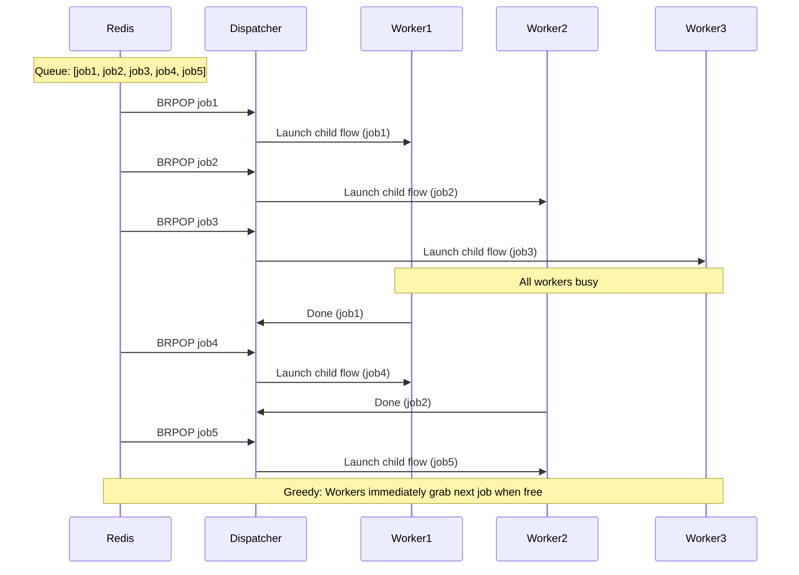

# Greedy FIFO Prefect Flow with Redis-backed Parameters

**Objective**: Implement a FIFO greedy scheduler pattern in Prefect where a parent flow continuously pulls parameter sets from Redis, and child flows run concurrently in a greedy, FIFO manner. Transform your orchestration from sequential to parallel while maintaining order.

Why FIFO? Ensures jobs are processed in order of arrival, keeps GPUs/CPUs hot by dispatching immediately to idle workers. This pattern scales from single machines to distributed clusters while maintaining job order and maximizing resource utilization.

## 1) Prerequisites: The Foundation

### System Requirements

```bash
# Install dependencies
pip install prefect redis

# Start Redis (Docker)
docker run -d --name redis -p 6379:6379 redis:7-alpine

# Or install locally
sudo apt install redis-server
sudo systemctl start redis-server
```

**Why These Dependencies**: Prefect provides orchestration, Redis provides reliable queuing. Together they create a robust distributed task system.

### Verify Installation

```python
# Test Redis connection
import redis
r = redis.Redis()
r.ping()  # Should return True

# Test Prefect
from prefect import flow
print("Prefect ready")
```

**Why This Verification**: Broken Redis means no queuing. Broken Prefect means no orchestration. Test before building.

## 2) Redis Setup: The Queue Foundation

### Queue Structure

```python
import redis
import json
from typing import Dict, Any

# Connect to Redis
r = redis.Redis(host='localhost', port=6379, db=0, decode_responses=True)

# Queue configuration
QUEUE_NAME = "task_queue"
MAX_QUEUE_SIZE = 1000
```

**Why This Structure**: Redis lists provide FIFO ordering. JSON serialization handles complex parameters. Connection pooling improves performance.

### Push Parameters to Queue

```python
def push_job_to_queue(job_id: int, payload: str, priority: int = 0) -> bool:
    """
    Push a job to the Redis queue with metadata.
    
    Args:
        job_id: Unique job identifier
        payload: Job data/parameters
        priority: Job priority (higher = more important)
    
    Returns:
        bool: Success status
    """
    job_data = {
        "job_id": job_id,
        "payload": payload,
        "priority": priority,
        "created_at": time.time(),
        "retries": 0,
        "max_retries": 3
    }
    
    try:
        # Push to queue (left push for FIFO)
        r.lpush(QUEUE_NAME, json.dumps(job_data))
        print(f"Pushed job {job_id} to queue")
        return True
    except Exception as e:
        print(f"Failed to push job {job_id}: {e}")
        return False

# Example usage
push_job_to_queue(1, "alpha", priority=1)
push_job_to_queue(2, "beta", priority=2)
push_job_to_queue(3, "gamma", priority=1)
```

**Why This Metadata**: Job tracking, priority handling, retry logic, and monitoring require rich metadata.

### Queue Management

```python
def get_queue_status() -> Dict[str, Any]:
    """Get queue status and statistics."""
    queue_length = r.llen(QUEUE_NAME)
    
    # Get sample jobs (without removing them)
    sample_jobs = []
    if queue_length > 0:
        # Get first 5 jobs
        for i in range(min(5, queue_length)):
            job_data = r.lindex(QUEUE_NAME, i)
            if job_data:
                sample_jobs.append(json.loads(job_data))
    
    return {
        "queue_length": queue_length,
        "sample_jobs": sample_jobs,
        "queue_name": QUEUE_NAME
    }

# Check queue status
status = get_queue_status()
print(f"Queue length: {status['queue_length']}")
```

**Why Queue Management**: Monitoring queue health prevents deadlocks and helps with capacity planning.

## 3) Parent Flow (Dispatcher): The Orchestrator

### Basic Dispatcher

```python
from prefect import flow, task
import time
import json
from typing import Dict, Any

@flow
def dispatcher(num_tasks: int = 10, timeout: int = 30):
    """
    Parent flow that dispatches jobs from Redis queue to child flows.
    
    Args:
        num_tasks: Number of tasks to process
        timeout: Timeout for Redis blocking operations
    """
    processed_count = 0
    
    while processed_count < num_tasks:
        try:
            # Blocking pop from queue (FIFO order)
            result = r.brpop(QUEUE_NAME, timeout=timeout)
            
            if result is None:
                print("No jobs available, waiting...")
                continue
                
            _, raw_job_data = result
            job_data = json.loads(raw_job_data)
            
            print(f"Dispatching job {job_data['job_id']}")
            
            # Submit child flow asynchronously
            child_flow.submit(job_data)
            processed_count += 1
            
        except Exception as e:
            print(f"Error in dispatcher: {e}")
            time.sleep(5)  # Back off on errors
    
    print(f"Dispatched {processed_count} jobs")

# Run dispatcher
dispatcher(num_tasks=10)
```

**Why This Pattern**: Blocking pop ensures efficient waiting, async submission enables concurrency, error handling prevents crashes.

### Advanced Dispatcher with Monitoring

```python
@flow
def advanced_dispatcher(
    num_tasks: int = 10, 
    timeout: int = 30,
    max_concurrent: int = 2,
    monitor_interval: int = 10
):
    """
    Advanced dispatcher with concurrency control and monitoring.
    """
    active_jobs = set()
    processed_count = 0
    start_time = time.time()
    
    while processed_count < num_tasks:
        try:
            # Check if we can start more jobs
            if len(active_jobs) < max_concurrent:
                result = r.brpop(QUEUE_NAME, timeout=timeout)
                
                if result is None:
                    print("No jobs available, waiting...")
                    continue
                    
                _, raw_job_data = result
                job_data = json.loads(raw_job_data)
                
                # Submit child flow
                future = child_flow.submit(job_data)
                active_jobs.add(future)
                
                print(f"Dispatching job {job_data['job_id']} (active: {len(active_jobs)})")
            
            # Check for completed jobs
            completed_jobs = set()
            for future in active_jobs:
                if future.is_completed():
                    completed_jobs.add(future)
                    processed_count += 1
                    
                    # Handle completion
                    try:
                        result = future.result()
                        print(f"Job completed successfully: {result}")
                    except Exception as e:
                        print(f"Job failed: {e}")
            
            # Remove completed jobs
            active_jobs -= completed_jobs
            
            # Monitor queue health
            if processed_count % monitor_interval == 0:
                queue_status = get_queue_status()
                elapsed = time.time() - start_time
                print(f"Processed: {processed_count}, Active: {len(active_jobs)}, "
                      f"Queue: {queue_status['queue_length']}, Elapsed: {elapsed:.2f}s")
                
        except Exception as e:
            print(f"Error in advanced dispatcher: {e}")
            time.sleep(5)
    
    print(f"Completed {processed_count} jobs in {time.time() - start_time:.2f}s")
```

**Why Advanced Features**: Concurrency control prevents resource exhaustion, monitoring provides visibility, error handling ensures robustness.

## 4) Child Flow (Worker): The Processor

### Basic Worker

```python
@task
def process_job(params: Dict[str, Any]) -> Dict[str, Any]:
    """
    Process a single job with the given parameters.
    
    Args:
        params: Job parameters from Redis queue
    
    Returns:
        Dict containing job results
    """
    job_id = params['job_id']
    payload = params['payload']
    
    print(f"Processing job {job_id} with payload: {payload}")
    
    # Simulate work (replace with actual processing)
    time.sleep(2)  # Simulate processing time
    
    # Simulate occasional failures for testing
    if job_id % 7 == 0:  # Fail every 7th job
        raise Exception(f"Simulated failure for job {job_id}")
    
    result = {
        "job_id": job_id,
        "status": "completed",
        "result": f"processed_{payload}",
        "processed_at": time.time()
    }
    
    print(f"Job {job_id} completed successfully")
    return result

@flow
def child_flow(params: Dict[str, Any]) -> Dict[str, Any]:
    """
    Child flow that processes a single job.
    
    Args:
        params: Job parameters from Redis queue
    
    Returns:
        Job processing results
    """
    try:
        result = process_job(params)
        return result
    except Exception as e:
        print(f"Job {params['job_id']} failed: {e}")
        raise
```

**Why This Structure**: Task-level processing enables retries, flow-level orchestration provides monitoring, error handling ensures robustness.

### Advanced Worker with Retries

```python
@task(
    retries=3,
    retry_delay_seconds=30,
    retry_jitter_factor=0.5
)
def robust_process_job(params: Dict[str, Any]) -> Dict[str, Any]:
    """
    Robust job processing with retries and error handling.
    """
    job_id = params['job_id']
    payload = params['payload']
    max_retries = params.get('max_retries', 3)
    current_retries = params.get('retries', 0)
    
    print(f"Processing job {job_id} (attempt {current_retries + 1}/{max_retries + 1})")
    
    try:
        # Simulate work with potential failures
        if job_id % 5 == 0 and current_retries < 2:  # Fail first 2 attempts
            raise Exception(f"Simulated failure for job {job_id}")
        
        # Actual processing would go here
        time.sleep(1)
        
        result = {
            "job_id": job_id,
            "status": "completed",
            "result": f"processed_{payload}",
            "processed_at": time.time(),
            "attempts": current_retries + 1
        }
        
        print(f"Job {job_id} completed successfully")
        return result
        
    except Exception as e:
        print(f"Job {job_id} failed: {e}")
        
        # Update retry count
        params['retries'] = current_retries + 1
        
        # If max retries reached, mark as failed
        if current_retries >= max_retries:
            return {
                "job_id": job_id,
                "status": "failed",
                "error": str(e),
                "attempts": current_retries + 1
            }
        
        # Re-raise for retry
        raise

@flow
def robust_child_flow(params: Dict[str, Any]) -> Dict[str, Any]:
    """
    Robust child flow with comprehensive error handling.
    """
    try:
        result = robust_process_job(params)
        return result
    except Exception as e:
        print(f"Job {params['job_id']} failed permanently: {e}")
        return {
            "job_id": params['job_id'],
            "status": "failed",
            "error": str(e)
        }
```

**Why Robust Processing**: Retries handle transient failures, error handling prevents crashes, monitoring provides visibility.

## 5) Greedy FIFO Behavior: The Core Pattern

### FIFO Dispatch Sequence



**Why This Pattern**: FIFO ensures job order, greedy dispatch maximizes throughput, blocking pop prevents busy waiting.

### Concurrency Control

```python
@flow
def controlled_dispatcher(
    num_tasks: int = 10,
    max_concurrent: int = 3,
    timeout: int = 30
):
    """
    Dispatcher with controlled concurrency.
    """
    active_jobs = {}
    processed_count = 0
    
    while processed_count < num_tasks:
        # Check for completed jobs
        completed_jobs = []
        for job_id, future in active_jobs.items():
            if future.is_completed():
                completed_jobs.append(job_id)
                processed_count += 1
                
                try:
                    result = future.result()
                    print(f"Job {job_id} completed: {result}")
                except Exception as e:
                    print(f"Job {job_id} failed: {e}")
        
        # Remove completed jobs
        for job_id in completed_jobs:
            del active_jobs[job_id]
        
        # Start new jobs if under limit
        if len(active_jobs) < max_concurrent:
            try:
                result = r.brpop(QUEUE_NAME, timeout=timeout)
                if result:
                    _, raw_job_data = result
                    job_data = json.loads(raw_job_data)
                    
                    # Submit new job
                    future = child_flow.submit(job_data)
                    active_jobs[job_data['job_id']] = future
                    
                    print(f"Started job {job_data['job_id']} (active: {len(active_jobs)})")
            except Exception as e:
                print(f"Error starting job: {e}")
                time.sleep(5)
        
        # Brief pause to prevent busy waiting
        time.sleep(0.1)
    
    print(f"Completed {processed_count} jobs")
```

**Why Concurrency Control**: Prevents resource exhaustion, enables scaling, maintains order while maximizing throughput.

## 6) Scaling & Concurrency: The Production Pattern

### Multiple Agents

```bash
# Start multiple Prefect agents for different worker types
prefect agent start -q gpu --limit 2
prefect agent start -q cpu --limit 4
prefect agent start -q memory --limit 1
```

**Why Multiple Agents**: Different resource types, specialized workers, load balancing across capabilities.

### Worker Labeling

```python
@flow
def specialized_worker(params: Dict[str, Any]) -> Dict[str, Any]:
    """
    Worker with specific resource requirements.
    """
    # Process based on job type
    job_type = params.get('type', 'cpu')
    
    if job_type == 'gpu':
        # GPU-intensive processing
        result = gpu_process_job(params)
    elif job_type == 'memory':
        # Memory-intensive processing
        result = memory_process_job(params)
    else:
        # CPU processing
        result = cpu_process_job(params)
    
    return result

# Submit with specific work queue
specialized_worker.submit(params, work_queue="gpu")
```

**Why Worker Labeling**: Resource optimization, specialized processing, load balancing.

### Distributed Scaling

```python
# Multiple dispatchers across machines
@flow
def distributed_dispatcher(
    machine_id: str,
    num_tasks: int = 100,
    max_concurrent: int = 5
):
    """
    Distributed dispatcher for multi-machine setup.
    """
    # Machine-specific configuration
    r = redis.Redis(host='redis-cluster.example.com', port=6379)
    
    active_jobs = {}
    processed_count = 0
    
    while processed_count < num_tasks:
        # Check for completed jobs
        completed_jobs = []
        for job_id, future in active_jobs.items():
            if future.is_completed():
                completed_jobs.append(job_id)
                processed_count += 1
                
                try:
                    result = future.result()
                    print(f"Machine {machine_id}: Job {job_id} completed")
                except Exception as e:
                    print(f"Machine {machine_id}: Job {job_id} failed: {e}")
        
        # Remove completed jobs
        for job_id in completed_jobs:
            del active_jobs[job_id]
        
        # Start new jobs
        if len(active_jobs) < max_concurrent:
            try:
                result = r.brpop(QUEUE_NAME, timeout=30)
                if result:
                    _, raw_job_data = result
                    job_data = json.loads(raw_job_data)
                    
                    # Add machine info
                    job_data['machine_id'] = machine_id
                    
                    # Submit job
                    future = child_flow.submit(job_data)
                    active_jobs[job_data['job_id']] = future
                    
                    print(f"Machine {machine_id}: Started job {job_data['job_id']}")
            except Exception as e:
                print(f"Machine {machine_id}: Error: {e}")
                time.sleep(5)
        
        time.sleep(0.1)
    
    print(f"Machine {machine_id}: Completed {processed_count} jobs")
```

**Why Distributed Scaling**: Horizontal scaling, fault tolerance, load distribution across machines.

## 7) Error Handling & Retries: The Resilience

### Retry Logic

```python
@task(
    retries=3,
    retry_delay_seconds=30,
    retry_jitter_factor=0.5
)
def resilient_process_job(params: Dict[str, Any]) -> Dict[str, Any]:
    """
    Job processing with comprehensive retry logic.
    """
    job_id = params['job_id']
    max_retries = params.get('max_retries', 3)
    current_retries = params.get('retries', 0)
    
    print(f"Processing job {job_id} (attempt {current_retries + 1})")
    
    try:
        # Simulate work with potential failures
        if job_id % 3 == 0 and current_retries < 2:
            raise Exception(f"Transient failure for job {job_id}")
        
        # Actual processing
        time.sleep(1)
        
        return {
            "job_id": job_id,
            "status": "completed",
            "attempts": current_retries + 1
        }
        
    except Exception as e:
        print(f"Job {job_id} failed: {e}")
        
        # Update retry count
        params['retries'] = current_retries + 1
        
        if current_retries >= max_retries:
            return {
                "job_id": job_id,
                "status": "failed",
                "error": str(e),
                "attempts": current_retries + 1
            }
        
        raise
```

**Why Retry Logic**: Transient failures are common, retries improve success rates, jitter prevents thundering herd.

### Dead Letter Queue

```python
def handle_failed_job(job_data: Dict[str, Any], error: str):
    """
    Handle permanently failed jobs by moving to dead letter queue.
    """
    failed_job = {
        **job_data,
        "failed_at": time.time(),
        "error": error,
        "status": "permanently_failed"
    }
    
    # Move to dead letter queue
    r.lpush("dead_letter_queue", json.dumps(failed_job))
    
    print(f"Job {job_data['job_id']} moved to dead letter queue")

@flow
def resilient_child_flow(params: Dict[str, Any]) -> Dict[str, Any]:
    """
    Child flow with comprehensive error handling.
    """
    try:
        result = resilient_process_job(params)
        return result
    except Exception as e:
        print(f"Job {params['job_id']} failed permanently: {e}")
        
        # Move to dead letter queue
        handle_failed_job(params, str(e))
        
        return {
            "job_id": params['job_id'],
            "status": "failed",
            "error": str(e)
        }
```

**Why Dead Letter Queue**: Failed jobs need investigation, manual intervention, audit trail.

## 8) Monitoring & Observability: The Operations

### Queue Monitoring

```python
def monitor_queue_health():
    """
    Monitor queue health and performance.
    """
    queue_length = r.llen(QUEUE_NAME)
    dead_letter_length = r.llen("dead_letter_queue")
    
    # Get queue statistics
    stats = {
        "queue_length": queue_length,
        "dead_letter_length": dead_letter_length,
        "timestamp": time.time()
    }
    
    print(f"Queue Health: {stats}")
    return stats

# Continuous monitoring
@flow
def monitor_flow():
    """
    Continuous monitoring flow.
    """
    while True:
        stats = monitor_queue_health()
        
        # Alert if queue is too long
        if stats['queue_length'] > 100:
            print("WARNING: Queue length exceeds threshold")
        
        # Alert if too many dead letters
        if stats['dead_letter_length'] > 10:
            print("WARNING: Too many failed jobs")
        
        time.sleep(30)  # Check every 30 seconds
```

**Why Monitoring**: Proactive issue detection, capacity planning, performance optimization.

### Performance Metrics

```python
def collect_metrics():
    """
    Collect performance metrics.
    """
    # Queue metrics
    queue_length = r.llen(QUEUE_NAME)
    
    # Processing metrics (from Redis)
    processed_count = r.get("processed_count") or 0
    failed_count = r.get("failed_count") or 0
    
    # Calculate rates
    current_time = time.time()
    start_time = r.get("start_time") or current_time
    elapsed = current_time - float(start_time)
    
    if elapsed > 0:
        processing_rate = float(processed_count) / elapsed
    else:
        processing_rate = 0
    
    metrics = {
        "queue_length": queue_length,
        "processed_count": int(processed_count),
        "failed_count": int(failed_count),
        "processing_rate": processing_rate,
        "elapsed_time": elapsed
    }
    
    print(f"Metrics: {metrics}")
    return metrics
```

**Why Metrics**: Performance monitoring, capacity planning, optimization insights.

## 9) Complete Example: Production Setup

### Project Structure

```
prefect-fifo-redis/
├── requirements.txt
├── docker-compose.yml
├── config.py
├── dispatcher.py
├── worker.py
├── monitor.py
└── examples/
    ├── basic_example.py
    └── advanced_example.py
```

### requirements.txt

```txt
prefect==2.14.0
redis==5.0.1
pydantic==2.5.0
```

### docker-compose.yml

```yaml
version: '3.8'

services:
  redis:
    image: redis:7-alpine
    ports:
      - "6379:6379"
    volumes:
      - redis_data:/data
    command: redis-server --appendonly yes

  dispatcher:
    build: .
    command: python dispatcher.py
    depends_on:
      - redis
    environment:
      - REDIS_URL=redis://redis:6379
      - PREFECT_API_URL=http://prefect-server:4200/api

  worker:
    build: .
    command: python worker.py
    depends_on:
      - redis
    environment:
      - REDIS_URL=redis://redis:6379
      - PREFECT_API_URL=http://prefect-server:4200/api
    deploy:
      replicas: 3

volumes:
  redis_data:
```

### config.py

```python
import os
from typing import Dict, Any

# Redis configuration
REDIS_URL = os.getenv("REDIS_URL", "redis://localhost:6379")
QUEUE_NAME = "task_queue"
DEAD_LETTER_QUEUE = "dead_letter_queue"

# Prefect configuration
PREFECT_API_URL = os.getenv("PREFECT_API_URL", "http://localhost:4200/api")

# Processing configuration
MAX_CONCURRENT_JOBS = int(os.getenv("MAX_CONCURRENT_JOBS", "5"))
JOB_TIMEOUT = int(os.getenv("JOB_TIMEOUT", "300"))
RETRY_COUNT = int(os.getenv("RETRY_COUNT", "3"))

# Monitoring configuration
MONITOR_INTERVAL = int(os.getenv("MONITOR_INTERVAL", "30"))
QUEUE_ALERT_THRESHOLD = int(os.getenv("QUEUE_ALERT_THRESHOLD", "100"))
```

### dispatcher.py

```python
import redis
import json
import time
from prefect import flow
from config import REDIS_URL, QUEUE_NAME, MAX_CONCURRENT_JOBS
from worker import child_flow

# Connect to Redis
r = redis.from_url(REDIS_URL)

@flow
def dispatcher(num_tasks: int = 100):
    """
    Main dispatcher flow.
    """
    active_jobs = {}
    processed_count = 0
    
    while processed_count < num_tasks:
        # Check for completed jobs
        completed_jobs = []
        for job_id, future in active_jobs.items():
            if future.is_completed():
                completed_jobs.append(job_id)
                processed_count += 1
                
                try:
                    result = future.result()
                    print(f"Job {job_id} completed: {result}")
                except Exception as e:
                    print(f"Job {job_id} failed: {e}")
        
        # Remove completed jobs
        for job_id in completed_jobs:
            del active_jobs[job_id]
        
        # Start new jobs
        if len(active_jobs) < MAX_CONCURRENT_JOBS:
            try:
                result = r.brpop(QUEUE_NAME, timeout=30)
                if result:
                    _, raw_job_data = result
                    job_data = json.loads(raw_job_data)
                    
                    # Submit job
                    future = child_flow.submit(job_data)
                    active_jobs[job_data['job_id']] = future
                    
                    print(f"Started job {job_data['job_id']}")
            except Exception as e:
                print(f"Error starting job: {e}")
                time.sleep(5)
        
        time.sleep(0.1)
    
    print(f"Completed {processed_count} jobs")

if __name__ == "__main__":
    dispatcher()
```

### worker.py

```python
import redis
import json
import time
from prefect import flow, task
from config import REDIS_URL, QUEUE_NAME

# Connect to Redis
r = redis.from_url(REDIS_URL)

@task(retries=3, retry_delay_seconds=30)
def process_job(params: dict) -> dict:
    """
    Process a single job.
    """
    job_id = params['job_id']
    payload = params['payload']
    
    print(f"Processing job {job_id} with payload: {payload}")
    
    # Simulate work
    time.sleep(2)
    
    # Simulate occasional failures
    if job_id % 7 == 0:
        raise Exception(f"Simulated failure for job {job_id}")
    
    result = {
        "job_id": job_id,
        "status": "completed",
        "result": f"processed_{payload}",
        "processed_at": time.time()
    }
    
    print(f"Job {job_id} completed successfully")
    return result

@flow
def child_flow(params: dict) -> dict:
    """
    Child flow that processes a single job.
    """
    try:
        result = process_job(params)
        return result
    except Exception as e:
        print(f"Job {params['job_id']} failed: {e}")
        raise

if __name__ == "__main__":
    # Worker can also run standalone
    while True:
        try:
            result = r.brpop(QUEUE_NAME, timeout=30)
            if result:
                _, raw_job_data = result
                job_data = json.loads(raw_job_data)
                child_flow(job_data)
        except Exception as e:
            print(f"Worker error: {e}")
            time.sleep(5)
```

## 10) TL;DR Quickstart

### Setup and Run

```python
# 1. Install dependencies
pip install prefect redis

# 2. Start Redis
docker run -d --name redis -p 6379:6379 redis:7-alpine

# 3. Push jobs to queue
import redis, json
r = redis.Redis()
for i in range(10):
    r.lpush("task_queue", json.dumps({"job_id": i, "payload": f"data-{i}"}))

# 4. Run dispatcher
dispatcher(num_tasks=10)
```

### Key Commands

```bash
# Start Prefect server
prefect server start

# Start worker agent
prefect agent start -q default

# Run dispatcher
python dispatcher.py

# Monitor queue
python monitor.py
```

## 11) The Machine's Summary

FIFO greedy scheduling with Prefect and Redis creates a robust, scalable orchestration system. Jobs are processed in order while maximizing resource utilization through greedy dispatch.

**The Dark Truth**: Orchestration without proper queuing leads to lost jobs and resource waste. FIFO ensures order, greedy dispatch ensures efficiency.

**The Machine's Mantra**: "In order we trust, in greed we dispatch, and in the Redis queue we find the path to scalable orchestration."

**Why This Pattern Matters**: Production systems need reliability, scalability, and efficiency. This pattern provides all three while maintaining job order and maximizing throughput.

---

*This tutorial provides the complete machinery for building production-ready FIFO greedy orchestration systems. The patterns scale from single machines to distributed clusters.*
