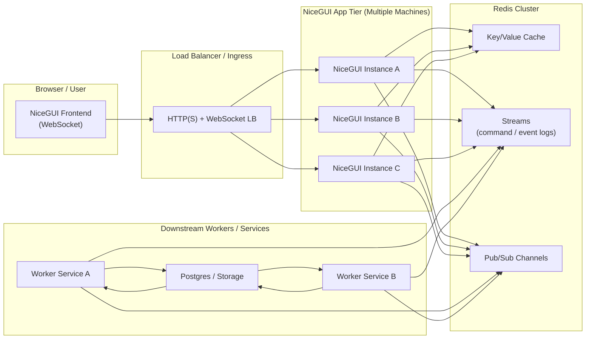
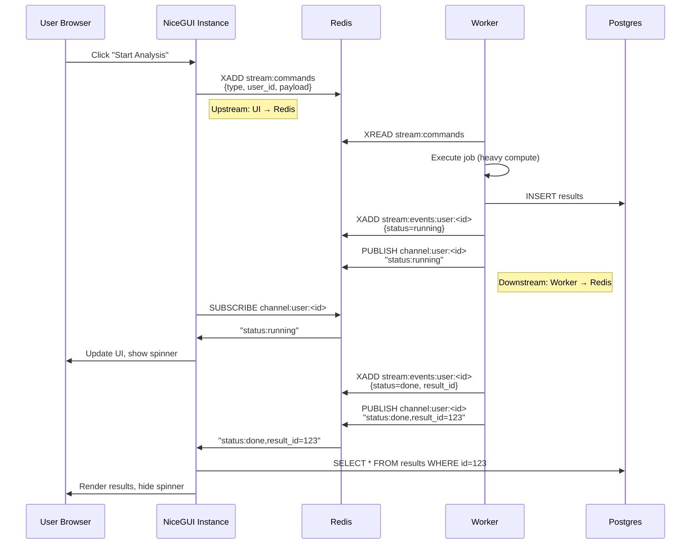

# Distributed NiceGUI Architecture with Redis: Horizontal Scaling and Real-Time Updates

**Objective**: Master building horizontally scalable NiceGUI applications using Redis as the central nervous system. When you need to run multiple NiceGUI instances across machines, coordinate real-time updates, and scale workers independently—this tutorial becomes your weapon of choice.

## Introduction

Single-instance NiceGUI apps work for prototypes. Production systems need horizontal scaling: multiple NiceGUI instances behind a load balancer, stateless workers processing jobs, and real-time updates flowing through a message bus. Redis provides the perfect foundation for this architecture.

**Why Distributed Architecture Matters**:

- **Horizontal Scaling**: Add NiceGUI instances without code changes
- **Fault Tolerance**: One instance fails, others continue serving users
- **Worker Separation**: Heavy computation runs in separate processes/machines
- **Real-Time Coordination**: All instances receive updates simultaneously
- **Stateless Design**: Any instance can serve any user

**Redis as the Central Nervous System**:

- **Upstream (UI → Backend)**: NiceGUI writes commands to Redis, workers consume them
- **Downstream (Backend → UI)**: Workers publish events to Redis, NiceGUI instances push to WebSocket clients
- **State Management**: Session state, job queues, event streams all live in Redis
- **Pub/Sub**: Real-time push notifications to connected clients

## High-Level Architecture



**Core Principles**:

1. **NiceGUI instances are stateless**: No sticky state in memory except ephemeral UI state
2. **Redis holds all shared state**: Sessions, job queues, event streams, pub/sub channels
3. **Workers process heavy tasks**: Read from Redis, write results back
4. **NiceGUI listens to Redis**: Subscribes to channels/streams and pushes updates to WebSocket clients

## Project Structure

Complete repository skeleton for distributed NiceGUI:

```
distributed-nicegui-app/
├── app.py                    # NiceGUI entry point
├── worker.py                 # Background worker service
├── core/
│   ├── __init__.py
│   ├── redis_bus.py          # Redis connection & pub/sub
│   ├── redis_streams.py      # Redis Streams operations
│   ├── redis_cache.py        # Cache operations
│   ├── session_manager.py    # Session state management
│   └── config.py             # Configuration
├── pages/
│   ├── __init__.py
│   ├── base.py               # BasePage class
│   ├── dashboard.py          # Main dashboard
│   ├── realtime_metrics.py   # Real-time metrics with Redis
│   ├── job_submitter.py      # Submit jobs to workers
│   └── job_status.py         # Monitor job status
├── workers/
│   ├── __init__.py
│   ├── job_processor.py      # Process jobs from Redis
│   └── metrics_collector.py  # Collect and publish metrics
├── components/
│   ├── __init__.py
│   ├── metric_chart.py       # Realtime chart component
│   └── job_progress.py       # Job progress component
├── requirements.txt
├── docker-compose.yml        # Local development stack
└── .env.example
```

## Communication Patterns

### Upstream: UI → Backend (NiceGUI → Redis → Workers)

When a user triggers an action:

1. NiceGUI handler receives event
2. NiceGUI writes command to Redis Stream or List
3. Workers consume commands asynchronously
4. Workers execute work and write results back

**Pattern**: UI emits intent into Redis, workers pick it up asynchronously.

### Downstream: Backend → UI (Workers → Redis → NiceGUI → UI)

When work completes or progress updates:

1. Worker publishes events to Redis (Stream + Pub/Sub)
2. NiceGUI instances subscribe to relevant channels
3. Background tasks update UI components reactively
4. WebSocket pushes updates to connected clients

**Pattern**: Workers don't know which NiceGUI instance serves the user. They publish to Redis, and all relevant instances receive updates.

## Redis Data Models

### Cache (Key/Value)

Use for ephemeral, fast-access data:

- **Session state**: `session:<session_id>` → JSON blob
- **UI-scoped data**: `view:<user_id>:dashboard` → precomputed metrics
- **Job results**: `job:<job_id>:result` → cached results

**Semantics**: TTL for ephemeral data, no ordering requirements.

### Streams (Command & Event Logs)

Use Redis Streams where ordering and replay matter:

- **Commands**: `stream:commands` for job queue
  - Fields: `type`, `user_id`, `payload`, `created_at`
- **Events**: `stream:events:user:<user_id>` for user-specific events
- **Broadcast**: `stream:events:broadcast` for global updates

**Properties**: Consumers can resume from last ID, multiple consumer groups, good for analytics.

### Pub/Sub (Real-Time Push)

Use Pub/Sub for low-latency push, no history needed:

- **User channels**: `channel:user:<user_id>`
- **Topic channels**: `channel:topic:<name>` (e.g., `channel:metrics:realtime`)

**Hybrid Model**: Worker writes to Stream (durable) + Pub/Sub (instant push).

## Core Redis Integration

### core/redis_bus.py

```python
# core/redis_bus.py
from __future__ import annotations

import asyncio
import json
import logging
from typing import Callable, Optional
import redis.asyncio as redis
from redis.asyncio import ConnectionPool, Redis

logger = logging.getLogger(__name__)


class RedisBus:
    """Redis connection pool with pub/sub support for distributed NiceGUI."""

    def __init__(self, url: str, max_connections: int = 50):
        self.url = url
        self.max_connections = max_connections
        self.pool: Optional[ConnectionPool] = None
        self.client: Optional[Redis] = None
        self._subscribers: dict[str, list[Callable]] = {}
        self._listener_tasks: list[asyncio.Task] = []
        self._running = False

    async def initialize(self) -> None:
        """Initialize connection pool."""
        if self.pool is None:
            self.pool = ConnectionPool.from_url(
                self.url,
                max_connections=self.max_connections,
                decode_responses=True,
            )
            self.client = Redis(connection_pool=self.pool)
            self._running = True
            logger.info("Redis bus initialized")

    async def get_client(self) -> Redis:
        """Get Redis client."""
        if self.client is None:
            await self.initialize()
        assert self.client is not None
        return self.client

    async def publish(self, channel: str, message: str | dict) -> int:
        """Publish message to channel."""
        client = await self.get_client()
        if isinstance(message, dict):
            message = json.dumps(message)
        return await client.publish(channel, message)

    async def subscribe(
        self, channel: str, callback: Callable, auto_start: bool = True
    ) -> None:
        """Subscribe to channel and register callback."""
        if channel not in self._subscribers:
            self._subscribers[channel] = []
        self._subscribers[channel].append(callback)

        if auto_start and self._running:
            asyncio.create_task(self._listen_channel(channel))

    async def _listen_channel(self, channel: str) -> None:
        """Background task that listens to a specific channel."""
        client = await self.get_client()
        pubsub = client.pubsub()

        try:
            await pubsub.subscribe(channel)
            logger.info(f"Subscribed to channel: {channel}")

            async for message in pubsub.listen():
                if not self._running:
                    break
                if message["type"] == "message":
                    data = message["data"]
                    # Call all registered callbacks
                    for callback in self._subscribers.get(channel, []):
                        try:
                            if asyncio.iscoroutinefunction(callback):
                                await callback(data)
                            else:
                                callback(data)
                        except Exception as e:
                            logger.error(f"Error in pub/sub callback: {e}")

        except asyncio.CancelledError:
            logger.info(f"Channel listener cancelled: {channel}")
        except Exception as e:
            logger.error(f"Channel listener error: {e}")
        finally:
            await pubsub.unsubscribe()
            await pubsub.close()

    async def close(self) -> None:
        """Close connections and cleanup."""
        self._running = False
        for task in self._listener_tasks:
            task.cancel()
        await asyncio.gather(*self._listener_tasks, return_exceptions=True)

        if self.client:
            await self.client.close()
        if self.pool:
            await self.pool.aclose()

        logger.info("Redis bus closed")
```

### core/redis_streams.py

```python
# core/redis_streams.py
from __future__ import annotations

import json
import time
from typing import Optional
from core.redis_bus import RedisBus


class RedisStreams:
    """Redis Streams operations for commands and events."""

    def __init__(self, redis_bus: RedisBus):
        self.redis = redis_bus

    async def add_command(
        self,
        command_type: str,
        user_id: str,
        payload: dict,
        stream_name: str = "stream:commands",
    ) -> str:
        """Add command to stream."""
        client = await self.redis.get_client()
        message_id = await client.xadd(
            stream_name,
            {
                "type": command_type,
                "user_id": user_id,
                "payload": json.dumps(payload),
                "created_at": time.time(),
            },
        )
        return message_id

    async def add_event(
        self,
        event_type: str,
        user_id: Optional[str],
        payload: dict,
        stream_name: Optional[str] = None,
    ) -> str:
        """Add event to stream."""
        if stream_name is None:
            if user_id:
                stream_name = f"stream:events:user:{user_id}"
            else:
                stream_name = "stream:events:broadcast"

        client = await self.redis.get_client()
        message_id = await client.xadd(
            stream_name,
            {
                "type": event_type,
                "user_id": user_id or "",
                "payload": json.dumps(payload),
                "created_at": time.time(),
            },
        )
        return message_id

    async def read_stream(
        self,
        stream_name: str,
        last_id: str = "0",
        count: int = 10,
    ) -> list[dict]:
        """Read messages from stream."""
        client = await self.redis.get_client()
        messages = await client.xread({stream_name: last_id}, count=count, block=0)
        results = []
        for stream, msgs in messages:
            for msg_id, data in msgs:
                results.append(
                    {
                        "id": msg_id,
                        "stream": stream,
                        "data": data,
                    }
                )
        return results

    async def read_user_events(
        self,
        user_id: str,
        last_id: str = "0",
        count: int = 10,
    ) -> list[dict]:
        """Read events for specific user."""
        return await self.read_stream(f"stream:events:user:{user_id}", last_id, count)
```

### core/redis_cache.py

```python
# core/redis_cache.py
from __future__ import annotations

import json
from typing import Any, Optional
from core.redis_bus import RedisBus


class RedisCache:
    """Redis cache operations for session and UI state."""

    def __init__(self, redis_bus: RedisBus):
        self.redis = redis_bus

    async def get(self, key: str) -> Optional[str]:
        """Get value from cache."""
        client = await self.redis.get_client()
        return await client.get(key)

    async def set(
        self, key: str, value: str, ex: Optional[int] = None
    ) -> bool:
        """Set value in cache with optional TTL."""
        client = await self.redis.get_client()
        return await client.set(key, value, ex=ex)

    async def get_json(self, key: str) -> Optional[dict]:
        """Get JSON value from cache."""
        value = await self.get(key)
        if value:
            return json.loads(value)
        return None

    async def set_json(
        self, key: str, value: dict, ex: Optional[int] = None
    ) -> bool:
        """Set JSON value in cache."""
        return await self.set(key, json.dumps(value), ex=ex)

    async def delete(self, key: str) -> int:
        """Delete key from cache."""
        client = await self.redis.get_client()
        return await client.delete(key)

    # Session management helpers
    async def get_session(self, session_id: str) -> Optional[dict]:
        """Get session data."""
        return await self.get_json(f"session:{session_id}")

    async def set_session(
        self, session_id: str, data: dict, ex: int = 3600
    ) -> bool:
        """Set session data with 1 hour TTL."""
        return await self.set_json(f"session:{session_id}", data, ex=ex)

    # View state helpers
    async def get_view_state(
        self, user_id: str, view_name: str
    ) -> Optional[dict]:
        """Get view-specific state."""
        return await self.get_json(f"view:{user_id}:{view_name}")

    async def set_view_state(
        self, user_id: str, view_name: str, data: dict, ex: int = 300
    ) -> bool:
        """Set view-specific state with 5 minute TTL."""
        return await self.set_json(f"view:{user_id}:{view_name}", data, ex=ex)
```

### core/config.py

```python
# core/config.py
from __future__ import annotations

import os
from dataclasses import dataclass


@dataclass
class Config:
    """Application configuration."""

    redis_url: str = os.getenv("REDIS_URL", "redis://localhost:6379/0")
    instance_id: str = os.getenv("INSTANCE_ID", "nicegui-1")
    host: str = os.getenv("HOST", "0.0.0.0")
    port: int = int(os.getenv("PORT", "8080"))
    reload: bool = os.getenv("RELOAD", "false").lower() == "true"


config = Config()
```

## NiceGUI Integration Pattern

### pages/base.py

```python
# pages/base.py
from __future__ import annotations

from abc import ABC, abstractmethod
from typing import Optional, Any
from nicegui import ui

from core.redis_bus import RedisBus
from core.redis_streams import RedisStreams
from core.redis_cache import RedisCache


class BasePage(ABC):
    """Base page class with Redis integration."""

    route: str = "/"
    title: str = "Untitled"

    def __init__(
        self,
        redis_bus: Optional[RedisBus] = None,
        redis_streams: Optional[RedisStreams] = None,
        redis_cache: Optional[RedisCache] = None,
    ) -> None:
        self.redis_bus = redis_bus
        self.redis_streams = redis_streams
        self.redis_cache = redis_cache

    @classmethod
    def register(
        cls,
        app,
        redis_bus: Optional[RedisBus] = None,
        redis_streams: Optional[RedisStreams] = None,
        redis_cache: Optional[RedisCache] = None,
    ) -> None:
        """Register page with NiceGUI."""
        page_instance = cls(redis_bus, redis_streams, redis_cache)

        @ui.page(cls.route)
        def _() -> None:
            page_instance.render()

    def render(self) -> None:
        """Default render flow."""
        with ui.column().classes("w-full items-stretch gap-4 p-4"):
            self._render_header()
            self.build()

    def _render_header(self) -> None:
        with ui.row().classes("w-full justify-between items-center"):
            ui.label(self.title).classes("text-2xl font-bold")
            self.render_actions()

    def render_actions(self) -> None:
        """Override in subclasses for header actions."""
        ...

    @abstractmethod
    def build(self) -> None:
        """Subclasses must implement to build the page contents."""
        raise NotImplementedError
```

## Dashboard Page

### pages/dashboard.py

```python
# pages/dashboard.py
from __future__ import annotations

import asyncio
from nicegui import ui

from pages.base import BasePage


class DashboardPage(BasePage):
    """Main dashboard page."""

    route = "/"
    title = "Dashboard"

    def build(self) -> None:
        ui.label("Distributed NiceGUI Dashboard").classes("text-2xl font-bold mb-4")
        ui.label(
            "This app runs across multiple NiceGUI instances, coordinated via Redis"
        ).classes("text-sm text-gray-600 mb-4")

        with ui.card().classes("w-full max-w-2xl"):
            ui.label("Architecture Overview").classes("text-lg font-semibold mb-2")
            ui.markdown(
                """
                - **Multiple NiceGUI Instances**: Run behind load balancer
                - **Redis Central Hub**: Commands, events, and state
                - **Background Workers**: Process jobs asynchronously
                - **Real-Time Updates**: Pub/Sub for live UI updates
                """
            )

        with ui.row().classes("gap-4 mt-4"):
            with ui.card():
                ui.label("Real-Time Metrics").classes("font-semibold mb-2")
                ui.label("Live metrics across all instances").classes("text-sm text-gray-600")
                ui.button(
                    "View Metrics",
                    on_click=lambda: ui.open("/realtime-metrics"),
                ).classes("mt-2")

            with ui.card():
                ui.label("Job Submission").classes("font-semibold mb-2")
                ui.label("Submit jobs to workers").classes("text-sm text-gray-600")
                ui.button(
                    "Submit Job",
                    on_click=lambda: ui.open("/submit-job"),
                ).classes("mt-2")

            with ui.card():
                ui.label("Job Status").classes("font-semibold mb-2")
                ui.label("Monitor job progress").classes("text-sm text-gray-600")
                ui.button(
                    "View Status",
                    on_click=lambda: ui.open("/job-status"),
                ).classes("mt-2")
```

## Real-Time Metrics Page

### components/metric_chart.py

```python
# components/metric_chart.py
from __future__ import annotations

import json
from typing import Optional
from nicegui import ui


class MetricChart:
    """Real-time updating chart component."""

    def __init__(
        self,
        title: str,
        max_points: int = 50,
        y_label: str = "Value",
    ):
        self.title = title
        self.max_points = max_points
        self.y_label = y_label
        self.data_points: list[tuple[float, float]] = []  # (time, value)
        self.chart: Optional[ui.plotly] = None
        self.start_time: Optional[float] = None

    def render(self, parent: Optional[ui.element] = None) -> ui.card:
        """Render chart component."""
        import time

        if self.start_time is None:
            self.start_time = time.time()

        container = parent or ui.column()
        with container:
            card = ui.card().classes("w-full p-4")
            with card:
                ui.label(self.title).classes("text-lg font-semibold mb-2")

                # Create Plotly chart
                import plotly.graph_objects as go

                fig = go.Figure()
                fig.add_trace(
                    go.Scatter(
                        x=[],
                        y=[],
                        mode="lines+markers",
                        name="Metric",
                    )
                )
                fig.update_layout(
                    xaxis_title="Time (seconds)",
                    yaxis_title=self.y_label,
                    height=300,
                )

                self.chart = ui.plotly(fig).classes("w-full")

        return card

    def add_point(self, value: float) -> None:
        """Add data point to chart."""
        import time

        if self.start_time is None:
            self.start_time = time.time()

        current_time = time.time() - self.start_time
        self.data_points.append((current_time, value))

        # Keep only last N points
        if len(self.data_points) > self.max_points:
            self.data_points = self.data_points[-self.max_points :]

        # Update chart
        if self.chart:
            import plotly.graph_objects as go

            times = [p[0] for p in self.data_points]
            values = [p[1] for p in self.data_points]

            fig = go.Figure()
            fig.add_trace(
                go.Scatter(
                    x=times,
                    y=values,
                    mode="lines+markers",
                    name="Metric",
                    line=dict(color="blue"),
                )
            )
            fig.update_layout(
                xaxis_title="Time (seconds)",
                yaxis_title=self.y_label,
                height=300,
            )

            self.chart.figure = fig
```

### pages/realtime_metrics.py

```python
# pages/realtime_metrics.py
from __future__ import annotations

import asyncio
import json
from typing import Any
from nicegui import ui

from pages.base import BasePage
from components.metric_chart import MetricChart


class RealTimeMetricsPage(BasePage):
    """Real-time metrics page that subscribes to Redis pub/sub."""

    route = "/realtime-metrics"
    title = "Real-Time Metrics"

    def __init__(
        self,
        redis_bus: Any = None,
        redis_streams: Any = None,
        redis_cache: Any = None,
    ) -> None:
        super().__init__(redis_bus, redis_streams, redis_cache)
        self.metrics: dict[str, MetricChart] = {}
        self.metric_labels: dict[str, ui.label] = {}
        self.subscribed = False

    async def _handle_metric_update(self, message: str) -> None:
        """Handle metric update from Redis pub/sub."""
        try:
            data = json.loads(message)
            metric_name = data.get("name")
            value = data.get("value")
            timestamp = data.get("timestamp")

            if metric_name in self.metrics:
                self.metrics[metric_name].add_point(value)
                if metric_name in self.metric_labels:
                    self.metric_labels[metric_name].text = (
                        f"{metric_name}: {value:.2f}"
                    )
        except Exception as e:
            print(f"Error handling metric update: {e}")

    def _subscribe_to_metrics(self) -> None:
        """Subscribe to metrics channel."""
        if not self.redis_bus or self.subscribed:
            return

        # Subscribe to broadcast metrics channel
        asyncio.create_task(
            self.redis_bus.subscribe(
                "channel:metrics:realtime",
                self._handle_metric_update,
            )
        )
        self.subscribed = True

    def build(self) -> None:
        ui.label("Real-Time Metrics Dashboard").classes("text-2xl font-bold mb-4")
        ui.label(
            "Metrics update in real-time across all NiceGUI instances via Redis pub/sub"
        ).classes("text-sm text-gray-600 mb-4")

        # Status indicator
        status_badge = ui.badge("Subscribed", color="green").classes("mb-4")

        # Create metric charts
        metric_names = ["cpu_usage", "memory_usage", "request_rate", "error_rate"]

        with ui.grid(columns=2).classes("w-full gap-4"):
            for metric_name in metric_names:
                with ui.column():
                    # Current value label
                    label = ui.label(f"{metric_name}: —").classes("text-sm font-semibold")
                    self.metric_labels[metric_name] = label

                    # Chart
                    chart = MetricChart(
                        title=metric_name.replace("_", " ").title(),
                        max_points=50,
                    )
                    chart.render()
                    self.metrics[metric_name] = chart

        # Subscribe to metrics
        self._subscribe_to_metrics()

        # Manual refresh button
        async def publish_test_metric():
            """Publish test metric (for demo purposes)."""
            import time
            import random

            if self.redis_bus:
                for metric_name in metric_names:
                    await self.redis_bus.publish(
                        "channel:metrics:realtime",
                        json.dumps(
                            {
                                "name": metric_name,
                                "value": random.uniform(0, 100),
                                "timestamp": time.time(),
                            }
                        ),
                    )

        ui.button(
            "Publish Test Metrics",
            on_click=lambda: asyncio.create_task(publish_test_metric()),
        ).classes("mt-4")
```

## Job Submission and Status

### pages/job_submitter.py

```python
# pages/job_submitter.py
from __future__ import annotations

import asyncio
import uuid
from nicegui import ui

from pages.base import BasePage


class JobSubmitterPage(BasePage):
    """Page for submitting jobs to workers via Redis."""

    route = "/submit-job"
    title = "Submit Job"

    def build(self) -> None:
        ui.label("Submit Background Job").classes("text-2xl font-bold mb-4")

        with ui.card().classes("w-full max-w-lg"):
            job_type_input = ui.select(
                ["analysis", "processing", "export"],
                label="Job Type",
                value="analysis",
            ).classes("mb-2")

            payload_input = ui.textarea(
                label="Payload (JSON)",
                placeholder='{"param1": "value1"}',
            ).classes("mb-2")
            payload_input.value = '{"param1": "value1"}'

            result_label = ui.label("").classes("text-sm mt-2")

            async def submit_job() -> None:
                """Submit job to Redis stream."""
                if not self.redis_streams:
                    ui.notify("Redis streams not available", type="negative")
                    return

                try:
                    import json

                    job_id = str(uuid.uuid4())
                    user_id = "user-123"  # In real app, get from session

                    payload = json.loads(payload_input.value or "{}")
                    payload["job_id"] = job_id

                    # Add command to stream
                    message_id = await self.redis_streams.add_command(
                        command_type=job_type_input.value,
                        user_id=user_id,
                        payload=payload,
                    )

                    result_label.text = (
                        f"Job submitted! ID: {job_id}, Message ID: {message_id}"
                    )
                    ui.notify("Job submitted successfully", type="positive")

                    # Store job ID in cache for status tracking
                    if self.redis_cache:
                        await self.redis_cache.set(
                            f"job:{job_id}:status", "pending", ex=3600
                        )

                except Exception as e:
                    result_label.text = f"Error: {e}"
                    ui.notify(f"Error submitting job: {e}", type="negative")

            ui.button("Submit Job", on_click=lambda: asyncio.create_task(submit_job()))
```

### pages/job_status.py

```python
# pages/job_status.py
from __future__ import annotations

import asyncio
import json
from typing import Optional
from nicegui import ui

from pages.base import BasePage


class JobStatusPage(BasePage):
    """Page for monitoring job status via Redis pub/sub."""

    route = "/job-status"
    title = "Job Status"

    def __init__(self, *args, **kwargs) -> None:
        super().__init__(*args, **kwargs)
        self.status_table: Optional[ui.table] = None
        self.jobs: dict[str, dict] = {}
        self.subscribed = False

    async def _handle_job_update(self, message: str) -> None:
        """Handle job status update from Redis."""
        try:
            data = json.loads(message)
            job_id = data.get("job_id")
            status = data.get("status")
            result = data.get("result")

            if job_id:
                self.jobs[job_id] = {
                    "id": job_id,
                    "status": status,
                    "result": result or "",
                    "updated_at": data.get("timestamp", ""),
                }

                # Update table
                if self.status_table:
                    self.status_table.rows = list(self.jobs.values())

        except Exception as e:
            print(f"Error handling job update: {e}")

    def _subscribe_to_job_updates(self) -> None:
        """Subscribe to job status channel."""
        if not self.redis_bus or self.subscribed:
            return

        asyncio.create_task(
            self.redis_bus.subscribe(
                "channel:jobs:status",
                self._handle_job_update,
            )
        )
        self.subscribed = True

    def build(self) -> None:
        ui.label("Job Status Monitor").classes("text-2xl font-bold mb-4")

        # Status indicator
        ui.badge("Subscribed to job updates", color="green").classes("mb-4")

        # Job status table
        columns = [
            {"name": "id", "label": "Job ID", "field": "id"},
            {"name": "status", "label": "Status", "field": "status"},
            {"name": "result", "label": "Result", "field": "result"},
            {"name": "updated_at", "label": "Updated", "field": "updated_at"},
        ]

        self.status_table = ui.table(
            columns=columns,
            rows=[],
            row_key="id",
        ).classes("w-full")

        # Subscribe to updates
        self._subscribe_to_job_updates()

        # Refresh button
        async def refresh_jobs() -> None:
            """Manually refresh job statuses."""
            # In production, read from Redis cache or database
            ui.notify("Refreshing jobs...", type="info")

        ui.button(
            "Refresh",
            on_click=lambda: asyncio.create_task(refresh_jobs()),
        ).classes("mt-4")
```

## Worker Service

### workers/job_processor.py

```python
# workers/job_processor.py
from __future__ import annotations

import asyncio
import json
import time
import logging
from core.redis_bus import RedisBus
from core.redis_streams import RedisStreams

logger = logging.getLogger(__name__)


class JobProcessor:
    """Background worker that processes jobs from Redis streams."""

    def __init__(self, redis_bus: RedisBus, redis_streams: RedisStreams):
        self.redis_bus = redis_bus
        self.redis_streams = redis_streams
        self.running = False
        self.consumer_group = "workers"
        self.stream_name = "stream:commands"

    async def initialize(self) -> None:
        """Initialize consumer group."""
        client = await self.redis_bus.get_client()
        try:
            await client.xgroup_create(
                self.stream_name,
                self.consumer_group,
                id="0",
                mkstream=True,
            )
        except Exception:
            # Group already exists
            pass

    async def process_job(self, job_data: dict) -> dict:
        """Process a single job (override in subclasses)."""
        job_type = job_data.get("type")
        payload = json.loads(job_data.get("payload", "{}"))
        user_id = job_data.get("user_id")

        logger.info(f"Processing job: {job_type} for user: {user_id}")

        # Simulate work
        await asyncio.sleep(2)

        return {
            "status": "completed",
            "result": f"Processed {job_type} job",
            "job_id": payload.get("job_id"),
        }

    async def run(self) -> None:
        """Main worker loop."""
        await self.initialize()
        self.running = True
        client = await self.redis_bus.get_client()

        logger.info("Worker started, listening for jobs...")

        while self.running:
            try:
                # Read from stream with consumer group
                messages = await client.xreadgroup(
                    self.consumer_group,
                    "worker-1",
                    {self.stream_name: ">"},
                    count=1,
                    block=1000,
                )

                for stream, msgs in messages:
                    for msg_id, data in msgs:
                        try:
                            # Process job
                            result = await self.process_job(data)

                            # Publish status update
                            await self.redis_bus.publish(
                                "channel:jobs:status",
                                json.dumps(
                                    {
                                        "job_id": result.get("job_id"),
                                        "status": result["status"],
                                        "result": result.get("result", ""),
                                        "timestamp": time.time(),
                                    }
                                ),
                            )

                            # Add to event stream
                            await self.redis_streams.add_event(
                                event_type="job_completed",
                                user_id=data.get("user_id"),
                                payload=result,
                            )

                            # Acknowledge message
                            await client.xack(self.stream_name, self.consumer_group, msg_id)

                        except Exception as e:
                            logger.error(f"Error processing job: {e}")

            except asyncio.CancelledError:
                break
            except Exception as e:
                logger.error(f"Error in worker loop: {e}")
                await asyncio.sleep(1)

    async def stop(self) -> None:
        """Stop worker."""
        self.running = False
        logger.info("Worker stopped")
```

### workers/metrics_collector.py

```python
# workers/metrics_collector.py
from __future__ import annotations

import asyncio
import json
import time
import random
import logging
from core.redis_bus import RedisBus

logger = logging.getLogger(__name__)


class MetricsCollector:
    """Background service that collects and publishes metrics."""

    def __init__(self, redis_bus: RedisBus):
        self.redis_bus = redis_bus
        self.running = False

    async def collect_metrics(self) -> dict:
        """Collect system metrics (override with real metrics)."""
        return {
            "cpu_usage": random.uniform(0, 100),
            "memory_usage": random.uniform(0, 100),
            "request_rate": random.uniform(0, 1000),
            "error_rate": random.uniform(0, 10),
        }

    async def run(self) -> None:
        """Main metrics collection loop."""
        self.running = True
        logger.info("Metrics collector started")

        while self.running:
            try:
                metrics = await self.collect_metrics()
                current_time = time.time()

                # Publish each metric
                for name, value in metrics.items():
                    await self.redis_bus.publish(
                        "channel:metrics:realtime",
                        json.dumps(
                            {
                                "name": name,
                                "value": value,
                                "timestamp": current_time,
                            }
                        ),
                    )

                await asyncio.sleep(1)  # Publish every second

            except asyncio.CancelledError:
                break
            except Exception as e:
                logger.error(f"Error collecting metrics: {e}")
                await asyncio.sleep(1)

    async def stop(self) -> None:
        """Stop metrics collector."""
        self.running = False
        logger.info("Metrics collector stopped")
```

### worker.py

```python
# worker.py
from __future__ import annotations

import asyncio
import logging
from core.config import config
from core.redis_bus import RedisBus
from core.redis_streams import RedisStreams
from workers.job_processor import JobProcessor
from workers.metrics_collector import MetricsCollector

logging.basicConfig(level=logging.INFO)
logger = logging.getLogger(__name__)


async def main() -> None:
    """Main worker entry point."""
    # Initialize Redis
    redis_bus = RedisBus(config.redis_url)
    await redis_bus.initialize()

    redis_streams = RedisStreams(redis_bus)

    # Start workers
    job_processor = JobProcessor(redis_bus, redis_streams)
    metrics_collector = MetricsCollector(redis_bus)

    # Run workers concurrently
    await asyncio.gather(
        job_processor.run(),
        metrics_collector.run(),
        return_exceptions=True,
    )


if __name__ == "__main__":
    try:
        asyncio.run(main())
    except KeyboardInterrupt:
        logger.info("Worker shutting down...")
```

## App Factory and Lifecycle

### core/app_factory.py

```python
# core/app_factory.py
from __future__ import annotations

import asyncio
import logging
from nicegui import ui
from typing import Type

from pages.base import BasePage
from pages.dashboard import DashboardPage
from pages.realtime_metrics import RealTimeMetricsPage
from pages.job_submitter import JobSubmitterPage
from pages.job_status import JobStatusPage

from core.config import config
from core.redis_bus import RedisBus
from core.redis_streams import RedisStreams
from core.redis_cache import RedisCache
from workers.metrics_collector import MetricsCollector

logger = logging.getLogger(__name__)

# Global services (initialized on startup)
redis_bus: RedisBus | None = None
redis_streams: RedisStreams | None = None
redis_cache: RedisCache | None = None
metrics_collector: MetricsCollector | None = None


async def on_startup() -> None:
    """Initialize services on app startup."""
    global redis_bus, redis_streams, redis_cache, metrics_collector

    # Initialize Redis
    redis_bus = RedisBus(config.redis_url)
    await redis_bus.initialize()

    redis_streams = RedisStreams(redis_bus)
    redis_cache = RedisCache(redis_bus)

    logger.info("Redis services initialized")

    # Start metrics collector (runs in background)
    metrics_collector = MetricsCollector(redis_bus)
    asyncio.create_task(metrics_collector.run())

    logger.info("Background services started")


async def on_shutdown() -> None:
    """Cleanup services on app shutdown."""
    global redis_bus, metrics_collector

    if metrics_collector:
        await metrics_collector.stop()

    if redis_bus:
        await redis_bus.close()

    logger.info("Services closed")


def create_app() -> ui:
    """Create and configure NiceGUI app."""
    global redis_bus, redis_streams, redis_cache

    # Register pages
    page_classes: list[Type[BasePage]] = [
        DashboardPage,
        RealTimeMetricsPage,
        JobSubmitterPage,
        JobStatusPage,
    ]

    for page_cls in page_classes:
        page_cls.register(
            ui,
            redis_bus=redis_bus,
            redis_streams=redis_streams,
            redis_cache=redis_cache,
        )

    # Global header
    @ui.header()
    def header():
        with ui.row().classes(
            "w-full justify-between items-center px-4 py-2 bg-blue-600 text-white"
        ):
            ui.label("Distributed NiceGUI App").classes("text-lg font-semibold")
            with ui.row().classes("gap-2"):
                ui.button("Dashboard", on_click=lambda: ui.open("/")).props("flat")
                ui.button(
                    "Real-Time", on_click=lambda: ui.open("/realtime-metrics")
                ).props("flat")
                ui.button("Submit Job", on_click=lambda: ui.open("/submit-job")).props(
                    "flat"
                )
                ui.button("Job Status", on_click=lambda: ui.open("/job-status")).props(
                    "flat"
                )

    # Lifecycle handlers
    ui.on_startup(lambda: asyncio.create_task(on_startup()))
    ui.on_shutdown(lambda: asyncio.create_task(on_shutdown()))

    return ui
```

### app.py

```python
# app.py
from __future__ import annotations

import os
from dotenv import load_dotenv
from core.app_factory import create_app
from core.config import config

load_dotenv()

app = create_app()

if __name__ in {"__main__", "__mp_main__"}:
    app.run(
        title="Distributed NiceGUI App",
        reload=config.reload,
        host=config.host,
        port=config.port,
    )
```

## Deployment and Scaling

### docker-compose.yml

```yaml
version: '3.8'

services:
  redis:
    image: redis:7-alpine
    ports:
      - "6379:6379"
    volumes:
      - redis_data:/data
    command: redis-server --appendonly yes

  nicegui-1:
    build: .
    environment:
      - REDIS_URL=redis://redis:6379/0
      - INSTANCE_ID=nicegui-1
      - PORT=8080
    ports:
      - "8080:8080"
    depends_on:
      - redis

  nicegui-2:
    build: .
    environment:
      - REDIS_URL=redis://redis:6379/0
      - INSTANCE_ID=nicegui-2
      - PORT=8080
    ports:
      - "8081:8080"
    depends_on:
      - redis

  nicegui-3:
    build: .
    environment:
      - REDIS_URL=redis://redis:6379/0
      - INSTANCE_ID=nicegui-3
      - PORT=8080
    ports:
      - "8082:8080"
    depends_on:
      - redis

  worker:
    build: .
    command: python worker.py
    environment:
      - REDIS_URL=redis://redis:6379/0
    depends_on:
      - redis
    deploy:
      replicas: 2

  nginx:
    image: nginx:alpine
    ports:
      - "80:80"
    volumes:
      - ./nginx.conf:/etc/nginx/nginx.conf:ro
    depends_on:
      - nicegui-1
      - nicegui-2
      - nicegui-3

volumes:
  redis_data:
```

### nginx.conf (Load Balancer)

```nginx
events {
    worker_connections 1024;
}

http {
    upstream nicegui_backend {
        least_conn;
        server nicegui-1:8080;
        server nicegui-2:8080;
        server nicegui-3:8080;
    }

    map $http_upgrade $connection_upgrade {
        default upgrade;
        '' close;
    }

    server {
        listen 80;

        location / {
            proxy_pass http://nicegui_backend;
            proxy_http_version 1.1;
            proxy_set_header Upgrade $http_upgrade;
            proxy_set_header Connection $connection_upgrade;
            proxy_set_header Host $host;
            proxy_set_header X-Real-IP $remote_addr;
            proxy_set_header X-Forwarded-For $proxy_add_x_forwarded_for;
            proxy_set_header X-Forwarded-Proto $scheme;
        }
    }
}
```

## Complete Flow Example

### Sequence Diagram: User Triggers Job, UI Updates Live



## Design Guidelines

### 1. UI Doesn't Talk to Workers Directly

Everything goes through Redis. Clean separation, easy scaling.

### 2. NiceGUI Instances Are Stateless

Any state preserved across connections goes into Redis or DB.

### 3. Use Naming Conventions for Redis Keys

- `session:<session_id>` - Session state
- `stream:commands` - Command queue
- `stream:events:user:<user_id>` - User event stream
- `channel:user:<user_id>` - User pub/sub channel
- `channel:metrics:realtime` - Metrics broadcast channel
- `cache:dashboard:<user_id>` - Cached dashboard data
- `job:<job_id>:status` - Job status cache

### 4. Don't Overuse Pub/Sub

Pub/Sub is for "right now". Use Streams for anything you might need to replay or debug.

### 5. Wrap Redis in Your Own Client Layer

Never sprinkle raw Redis calls through every page class. One abstraction, many consumers.

### 6. Treat NiceGUI as the "View Layer"

All business logic lives in workers/services. NiceGUI pulls and pushes via Redis and DB only.

## Troubleshooting

### Connection Pool Exhaustion

**Symptom**: Redis connection errors, timeouts

**Solution**: Increase pool size, ensure connections are released:

```python
redis_bus = RedisBus(url, max_connections=100)
```

### Messages Not Received

**Symptom**: Pub/Sub messages not reaching UI

**Causes**:
- Subscription not started
- Wrong channel name
- Message format mismatch

**Debug**:
```python
# Check subscription
await redis_bus.subscribe("channel:test", lambda m: print(f"Received: {m}"))

# Publish test message
await redis_bus.publish("channel:test", "hello")
```

### WebSocket Reconnection

**Symptom**: Real-time updates stop after network issues

**Solution**: Implement reconnection in RealtimeUpdater component:

```python
async def _subscribe_with_retry(self):
    while True:
        try:
            await self._subscribe()
        except Exception as e:
            logger.error(f"Subscription error: {e}, retrying...")
            await asyncio.sleep(5)
```

## See Also

- **[Advanced NiceGUI Architecture](advanced-nicegui-architecture.md)** - Production-grade NiceGUI with persistent backends
- **[Class-Based NiceGUI Pages and Integrations](nicegui-class-based-pages.md)** - Foundation patterns for structured NiceGUI apps
- **[Prefect FIFO Flow with Redis](../system-administration/prefect-fifo-redis.md)** - Workflow orchestration patterns

---

*This tutorial provides the complete machinery for building horizontally scalable NiceGUI applications. The patterns scale from single instances to distributed clusters, from prototypes to enterprise systems with real-time coordination across multiple machines.*

