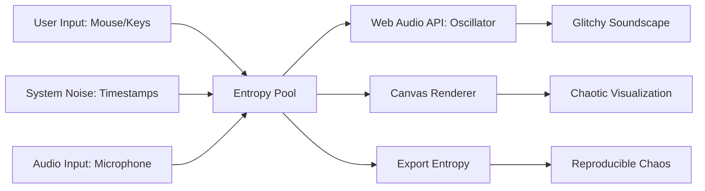

# Glitch Observatory: Visualizing Entropy in JavaScript

**Objective**: Build a browser-based glitch observatory that captures entropy from user interactions and transforms it into chaotic art and sound. When you need to understand event-driven programming, when you want to explore the boundaries of web APIs, when you're building systems that embrace chaos—glitch observatory becomes your weapon of choice.

Browsers leak chaos—let's capture it, amplify it, and make it beautiful. This tutorial shows you how to wield entropy with the precision of an eccentric hacker-artist, covering everything from mouse jitter to psychedelic visualizations and glitchy soundscapes.

## 0) Prerequisites (Read Once, Live by Them)

### The Five Commandments

1. **Understand entropy sources**
   - Mouse movement and timing variations
   - Keystroke intervals and patterns
   - Audio input noise and system timestamps
   - Microphone feedback and environmental chaos

2. **Master async data flows**
   - Event throttling and backpressure
   - Stream processing with RxJS
   - Canvas rendering and WebGL
   - Web Audio API synthesis

3. **Know your chaos patterns**
   - Entropy pool management
   - Bounded buffers and ring buffers
   - Seeded PRNG for reproducibility
   - Real-time visualization techniques

4. **Validate everything**
   - Test entropy collection accuracy
   - Verify audio synthesis quality
   - Check canvas rendering performance
   - Monitor memory usage and leaks

5. **Plan for art**
   - Embrace unpredictability
   - Design for aesthetic chaos
   - Enable reproducibility when needed
   - Document the beautiful accidents

**Why These Principles**: Glitch observatory requires understanding both entropy collection and artistic expression. Understanding these patterns prevents performance issues and enables beautiful chaos.

## 1) Setup

### Basic HTML Structure

```html
<!DOCTYPE html>
<html lang="en">
<head>
    <meta charset="UTF-8">
    <meta name="viewport" content="width=device-width, initial-scale=1.0">
    <title>Glitch Observatory</title>
    <style>
        body {
            margin: 0;
            background: #000;
            overflow: hidden;
            font-family: 'Courier New', monospace;
        }
        canvas {
            width: 100vw;
            height: 100vh;
            display: block;
            cursor: none;
        }
        .controls {
            position: fixed;
            top: 10px;
            left: 10px;
            color: #0f0;
            z-index: 100;
        }
        .entropy-display {
            position: fixed;
            bottom: 10px;
            right: 10px;
            color: #f0f;
            z-index: 100;
        }
    </style>
</head>
<body>
    <div class="controls">
        <button id="start-audio">Start Audio</button>
        <button id="clear-canvas">Clear</button>
        <button id="export-entropy">Export</button>
    </div>
    
    <div class="entropy-display">
        <div>Entropy Pool: <span id="entropy-count">0</span></div>
        <div>FPS: <span id="fps">0</span></div>
    </div>
    
    <canvas id="glitch"></canvas>
    <script type="module" src="main.js"></script>
</body>
</html>
```

**Why HTML Setup Matters**: Clean structure enables focused entropy collection and visualization. Understanding these patterns prevents layout issues and enables immersive glitch experiences.

### JavaScript Module Structure

```javascript
// main.js
import { EntropyCollector } from './entropy.js';
import { AudioSynthesizer } from './audio.js';
import { VisualRenderer } from './visuals.js';
import { EntropyStream } from './streams.js';

class GlitchObservatory {
    constructor() {
        this.canvas = document.getElementById('glitch');
        this.ctx = this.canvas.getContext('2d');
        this.setupCanvas();
        
        this.entropyCollector = new EntropyCollector();
        this.audioSynthesizer = new AudioSynthesizer();
        this.visualRenderer = new VisualRenderer(this.canvas, this.ctx);
        this.entropyStream = new EntropyStream();
        
        this.setupEventListeners();
        this.start();
    }
    
    setupCanvas() {
        this.canvas.width = window.innerWidth;
        this.canvas.height = window.innerHeight;
        
        window.addEventListener('resize', () => {
            this.canvas.width = window.innerWidth;
            this.canvas.height = window.innerHeight;
        });
    }
    
    setupEventListeners() {
        document.getElementById('start-audio').addEventListener('click', () => {
            this.audioSynthesizer.start();
        });
        
        document.getElementById('clear-canvas').addEventListener('click', () => {
            this.visualRenderer.clear();
        });
        
        document.getElementById('export-entropy').addEventListener('click', () => {
            this.entropyCollector.export();
        });
    }
    
    start() {
        this.entropyStream.subscribe(entropy => {
            this.audioSynthesizer.modulate(entropy);
            this.visualRenderer.render(entropy);
        });
        
        this.entropyCollector.start();
        this.visualRenderer.start();
    }
}

// Initialize the observatory
new GlitchObservatory();
```

**Why Module Structure Matters**: Organized code enables maintainable chaos and systematic entropy processing. Understanding these patterns prevents code chaos and enables artistic expression.

## 2) Entropy Sources

### Entropy Collection Engine

```javascript
// entropy.js
export class EntropyCollector {
    constructor() {
        this.entropy = [];
        this.maxSize = 1000;
        this.isCollecting = false;
    }
    
    start() {
        this.isCollecting = true;
        this.setupMouseEntropy();
        this.setupKeyboardEntropy();
        this.setupAudioEntropy();
        this.setupSystemEntropy();
    }
    
    setupMouseEntropy() {
        let lastMove = Date.now();
        
        document.addEventListener('mousemove', (e) => {
            if (!this.isCollecting) return;
            
            const now = Date.now();
            const deltaTime = now - lastMove;
            const entropy = this.hash(
                e.clientX,
                e.clientY,
                deltaTime,
                e.movementX,
                e.movementY
            );
            
            this.addEntropy(entropy);
            lastMove = now;
        });
        
        document.addEventListener('mousedown', (e) => {
            const entropy = this.hash(
                e.clientX,
                e.clientY,
                Date.now(),
                e.button
            );
            this.addEntropy(entropy);
        });
    }
    
    setupKeyboardEntropy() {
        let lastKey = Date.now();
        
        document.addEventListener('keydown', (e) => {
            if (!this.isCollecting) return;
            
            const now = Date.now();
            const deltaTime = now - lastKey;
            const entropy = this.hash(
                e.keyCode,
                e.charCode,
                deltaTime,
                e.ctrlKey,
                e.shiftKey
            );
            
            this.addEntropy(entropy);
            lastKey = now;
        });
    }
    
    setupAudioEntropy() {
        navigator.mediaDevices.getUserMedia({ audio: true })
            .then(stream => {
                const audioContext = new AudioContext();
                const source = audioContext.createMediaStreamSource(stream);
                const analyser = audioContext.createAnalyser();
                
                source.connect(analyser);
                analyser.fftSize = 256;
                
                const dataArray = new Uint8Array(analyser.frequencyBinCount);
                
                const collectAudioEntropy = () => {
                    if (!this.isCollecting) return;
                    
                    analyser.getByteFrequencyData(dataArray);
                    const noise = Array.from(dataArray).reduce((a, b) => a + b, 0);
                    const entropy = this.hash(noise, Date.now());
                    this.addEntropy(entropy);
                    
                    requestAnimationFrame(collectAudioEntropy);
                };
                
                collectAudioEntropy();
            })
            .catch(err => console.log('Audio access denied:', err));
    }
    
    setupSystemEntropy() {
        // Collect entropy from system timing variations
        setInterval(() => {
            if (!this.isCollecting) return;
            
            const entropy = this.hash(
                performance.now(),
                Date.now(),
                Math.random(),
                navigator.hardwareConcurrency || 1
            );
            this.addEntropy(entropy);
        }, 100);
    }
    
    hash(...values) {
        // Simple hash function for entropy mixing
        return values.reduce((acc, val) => {
            return ((acc << 5) - acc + val) & 0xffffffff;
        }, 0);
    }
    
    addEntropy(value) {
        this.entropy.push(value);
        if (this.entropy.length > this.maxSize) {
            this.entropy.shift();
        }
        
        // Update display
        document.getElementById('entropy-count').textContent = this.entropy.length;
    }
    
    getRandomEntropy() {
        if (this.entropy.length === 0) return Math.random();
        return this.entropy[Math.floor(Math.random() * this.entropy.length)];
    }
    
    export() {
        const data = {
            entropy: this.entropy,
            timestamp: Date.now(),
            seed: this.entropy[this.entropy.length - 1] || 0
        };
        
        const blob = new Blob([JSON.stringify(data, null, 2)], { type: 'application/json' });
        const url = URL.createObjectURL(blob);
        const a = document.createElement('a');
        a.href = url;
        a.download = 'glitch-entropy.json';
        a.click();
        URL.revokeObjectURL(url);
    }
}
```

**Why Entropy Collection Matters**: Diverse entropy sources provide rich chaotic input for artistic expression. Understanding these patterns prevents entropy starvation and enables beautiful glitch generation.

## 3) Audio Chaos (Web Audio API)

### Audio Synthesizer

```javascript
// audio.js
export class AudioSynthesizer {
    constructor() {
        this.audioContext = null;
        this.oscillators = [];
        this.gainNodes = [];
        this.isPlaying = false;
    }
    
    async start() {
        if (this.isPlaying) return;
        
        this.audioContext = new (window.AudioContext || window.webkitAudioContext)();
        
        // Create multiple oscillators for complex sound
        for (let i = 0; i < 3; i++) {
            this.createOscillator(i);
        }
        
        this.isPlaying = true;
    }
    
    createOscillator(index) {
        const oscillator = this.audioContext.createOscillator();
        const gainNode = this.audioContext.createGain();
        const filter = this.audioContext.createBiquadFilter();
        
        oscillator.connect(filter);
        filter.connect(gainNode);
        gainNode.connect(this.audioContext.destination);
        
        oscillator.type = ['sine', 'square', 'sawtooth'][index];
        oscillator.frequency.value = 220 * (index + 1);
        gainNode.gain.value = 0.1;
        
        filter.type = 'lowpass';
        filter.frequency.value = 1000;
        
        oscillator.start();
        
        this.oscillators.push(oscillator);
        this.gainNodes.push(gainNode);
    }
    
    modulate(entropy) {
        if (!this.isPlaying || this.oscillators.length === 0) return;
        
        const now = this.audioContext.currentTime;
        
        this.oscillators.forEach((osc, index) => {
            // Modulate frequency based on entropy
            const baseFreq = 220 * (index + 1);
            const entropyFreq = (entropy % 400) + 100;
            const targetFreq = baseFreq + entropyFreq;
            
            osc.frequency.setValueAtTime(targetFreq, now);
            
            // Modulate gain for dynamic volume
            const entropyGain = (entropy % 100) / 1000;
            this.gainNodes[index].gain.setValueAtTime(0.1 + entropyGain, now);
        });
    }
    
    stop() {
        if (!this.isPlaying) return;
        
        this.oscillators.forEach(osc => osc.stop());
        this.oscillators = [];
        this.gainNodes = [];
        this.isPlaying = false;
    }
}
```

**Why Audio Synthesis Matters**: Entropy-driven audio creates glitchy soundscapes that respond to user interaction. Understanding these patterns prevents audio artifacts and enables musical chaos.

## 4) Visual Chaos (Canvas API)

### Visual Renderer

```javascript
// visuals.js
export class VisualRenderer {
    constructor(canvas, ctx) {
        this.canvas = canvas;
        this.ctx = ctx;
        this.particles = [];
        this.isRendering = false;
        this.lastFrameTime = 0;
        this.frameCount = 0;
    }
    
    start() {
        this.isRendering = true;
        this.render();
    }
    
    render() {
        if (!this.isRendering) return;
        
        const now = performance.now();
        const deltaTime = now - this.lastFrameTime;
        this.lastFrameTime = now;
        
        // Update FPS counter
        this.frameCount++;
        if (this.frameCount % 60 === 0) {
            document.getElementById('fps').textContent = Math.round(1000 / deltaTime);
        }
        
        // Fade effect
        this.ctx.fillStyle = 'rgba(0, 0, 0, 0.05)';
        this.ctx.fillRect(0, 0, this.canvas.width, this.canvas.height);
        
        // Update particles
        this.updateParticles(deltaTime);
        
        requestAnimationFrame(() => this.render());
    }
    
    updateParticles(deltaTime) {
        this.particles.forEach(particle => {
            particle.update(deltaTime);
            particle.render(this.ctx);
        });
        
        // Remove old particles
        this.particles = this.particles.filter(p => p.life > 0);
    }
    
    render(entropy) {
        if (!this.isRendering) return;
        
        // Create new particle from entropy
        const particle = new GlitchParticle(entropy, this.canvas);
        this.particles.push(particle);
        
        // Limit particle count
        if (this.particles.length > 500) {
            this.particles.shift();
        }
    }
    
    clear() {
        this.ctx.fillStyle = 'black';
        this.ctx.fillRect(0, 0, this.canvas.width, this.canvas.height);
        this.particles = [];
    }
}

class GlitchParticle {
    constructor(entropy, canvas) {
        this.entropy = entropy;
        this.canvas = canvas;
        
        // Use entropy to determine particle properties
        this.x = entropy % canvas.width;
        this.y = entropy % canvas.height;
        this.vx = (entropy % 20) - 10;
        this.vy = (entropy % 20) - 10;
        this.size = (entropy % 10) + 2;
        this.hue = entropy % 360;
        this.life = 1.0;
        this.decay = 0.01 + (entropy % 10) / 1000;
    }
    
    update(deltaTime) {
        this.x += this.vx * deltaTime * 0.01;
        this.y += this.vy * deltaTime * 0.01;
        this.life -= this.decay;
        
        // Wrap around screen
        if (this.x < 0) this.x = this.canvas.width;
        if (this.x > this.canvas.width) this.x = 0;
        if (this.y < 0) this.y = this.canvas.height;
        if (this.y > this.canvas.height) this.y = 0;
    }
    
    render(ctx) {
        if (this.life <= 0) return;
        
        ctx.save();
        ctx.globalAlpha = this.life;
        ctx.fillStyle = `hsl(${this.hue}, 100%, 50%)`;
        ctx.beginPath();
        ctx.arc(this.x, this.y, this.size, 0, Math.PI * 2);
        ctx.fill();
        ctx.restore();
    }
}
```

**Why Visual Chaos Matters**: Entropy-driven visuals create psychedelic patterns that respond to user interaction. Understanding these patterns prevents rendering issues and enables artistic expression.

## 5) Reactive Streams with RxJS

### Entropy Stream Processing

```javascript
// streams.js
import { fromEvent, merge, interval } from 'rxjs';
import { throttleTime, map, filter, scan } from 'rxjs/operators';

export class EntropyStream {
    constructor() {
        this.entropyCollector = null;
        this.subscribers = [];
    }
    
    setupStreams(entropyCollector) {
        this.entropyCollector = entropyCollector;
        
        // Mouse entropy stream
        const mouse$ = fromEvent(document, 'mousemove').pipe(
            throttleTime(50),
            map(e => this.hash(e.clientX, e.clientY, Date.now()))
        );
        
        // Keyboard entropy stream
        const keyboard$ = fromEvent(document, 'keydown').pipe(
            map(e => this.hash(e.keyCode, Date.now()))
        );
        
        // System entropy stream
        const system$ = interval(100).pipe(
            map(() => this.hash(performance.now(), Math.random()))
        );
        
        // Combine all entropy streams
        const entropy$ = merge(mouse$, keyboard$, system$).pipe(
            scan((acc, entropy) => {
                acc.push(entropy);
                if (acc.length > 1000) acc.shift();
                return acc;
            }, [])
        );
        
        // Subscribe to entropy stream
        entropy$.subscribe(entropyPool => {
            this.notifySubscribers(entropyPool);
        });
    }
    
    subscribe(callback) {
        this.subscribers.push(callback);
    }
    
    notifySubscribers(entropyPool) {
        const latestEntropy = entropyPool[entropyPool.length - 1] || 0;
        this.subscribers.forEach(callback => callback(latestEntropy));
    }
    
    hash(...values) {
        return values.reduce((acc, val) => {
            return ((acc << 5) - acc + val) & 0xffffffff;
        }, 0);
    }
}
```

**Why Reactive Streams Matter**: RxJS tames async chaos into composable streams. Understanding these patterns prevents callback hell and enables elegant event processing.

## 6) Entropy Flow Diagram



**Why Flow Diagrams Matter**: Understanding entropy flow enables systematic chaos generation and artistic expression. Understanding these patterns prevents entropy bottlenecks and enables beautiful glitch art.

## 7) Weird Extensions

### Microphone Entropy

```javascript
// microphone-entropy.js
export class MicrophoneEntropy {
    constructor() {
        this.audioContext = null;
        this.analyser = null;
        this.dataArray = null;
    }
    
    async start() {
        try {
            const stream = await navigator.mediaDevices.getUserMedia({ audio: true });
            this.audioContext = new AudioContext();
            const source = this.audioContext.createMediaStreamSource(stream);
            this.analyser = this.audioContext.createAnalyser();
            
            source.connect(this.analyser);
            this.analyser.fftSize = 256;
            this.dataArray = new Uint8Array(this.analyser.frequencyBinCount);
            
            return true;
        } catch (err) {
            console.log('Microphone access denied:', err);
            return false;
        }
    }
    
    getEntropy() {
        if (!this.analyser || !this.dataArray) return 0;
        
        this.analyser.getByteFrequencyData(this.dataArray);
        return this.dataArray.reduce((acc, val) => acc + val, 0);
    }
}
```

### Seeded PRNG for Reproducibility

```javascript
// seeded-prng.js
export class SeededPRNG {
    constructor(seed = Date.now()) {
        this.seed = seed;
        this.state = seed;
    }
    
    next() {
        this.state = (this.state * 1664525 + 1013904223) % 4294967296;
        return this.state / 4294967296;
    }
    
    setSeed(seed) {
        this.seed = seed;
        this.state = seed;
    }
    
    export() {
        return {
            seed: this.seed,
            state: this.state
        };
    }
}
```

### WebGL Shader Chaos

```javascript
// webgl-chaos.js
export class WebGLChaos {
    constructor(canvas) {
        this.canvas = canvas;
        this.gl = canvas.getContext('webgl');
        this.program = null;
        this.init();
    }
    
    init() {
        const vertexShader = `
            attribute vec2 position;
            void main() {
                gl_Position = vec4(position, 0.0, 1.0);
            }
        `;
        
        const fragmentShader = `
            precision mediump float;
            uniform float time;
            uniform vec2 resolution;
            uniform float entropy;
            
            void main() {
                vec2 uv = gl_FragCoord.xy / resolution.xy;
                float noise = sin(uv.x * 10.0 + time) * cos(uv.y * 10.0 + time);
                float chaos = sin(entropy * 0.01) * 0.5 + 0.5;
                gl_FragColor = vec4(noise * chaos, noise * chaos * 0.5, chaos, 1.0);
            }
        `;
        
        this.program = this.createProgram(vertexShader, fragmentShader);
    }
    
    render(entropy) {
        const time = performance.now() * 0.001;
        
        this.gl.useProgram(this.program);
        this.gl.uniform1f(this.gl.getUniformLocation(this.program, 'time'), time);
        this.gl.uniform2f(this.gl.getUniformLocation(this.program, 'resolution'), this.canvas.width, this.canvas.height);
        this.gl.uniform1f(this.gl.getUniformLocation(this.program, 'entropy'), entropy);
        
        this.gl.drawArrays(this.gl.TRIANGLES, 0, 6);
    }
}
```

**Why Extensions Matter**: Advanced entropy sources and rendering techniques enable sophisticated glitch art. Understanding these patterns prevents artistic limitations and enables creative expression.

## 8) Best Practices Hidden in the Weirdness

### Performance Optimization

```javascript
// performance.js
export class PerformanceMonitor {
    constructor() {
        this.frameCount = 0;
        this.lastTime = performance.now();
        this.fps = 0;
    }
    
    update() {
        this.frameCount++;
        const now = performance.now();
        
        if (now - this.lastTime >= 1000) {
            this.fps = this.frameCount;
            this.frameCount = 0;
            this.lastTime = now;
        }
    }
    
    getFPS() {
        return this.fps;
    }
}

// Throttle entropy events to prevent performance death
export function throttleEntropy(callback, delay = 50) {
    let lastCall = 0;
    return function(...args) {
        const now = Date.now();
        if (now - lastCall >= delay) {
            lastCall = now;
            callback.apply(this, args);
        }
    };
}

// Use requestAnimationFrame for visuals, not setInterval
export function smoothRender(callback) {
    let rafId;
    
    function render() {
        callback();
        rafId = requestAnimationFrame(render);
    }
    
    render();
    
    return () => cancelAnimationFrame(rafId);
}
```

### Memory Management

```javascript
// memory-management.js
export class EntropyPool {
    constructor(maxSize = 1000) {
        this.entropy = [];
        this.maxSize = maxSize;
    }
    
    add(value) {
        this.entropy.push(value);
        if (this.entropy.length > this.maxSize) {
            this.entropy.shift(); // Remove oldest entropy
        }
    }
    
    getRandom() {
        if (this.entropy.length === 0) return Math.random();
        return this.entropy[Math.floor(Math.random() * this.entropy.length)];
    }
    
    clear() {
        this.entropy = [];
    }
}
```

**Why Best Practices Matter**: Proper performance optimization and memory management enable smooth glitch experiences. Understanding these patterns prevents system overload and enables artistic expression.

## 9) TL;DR Runbook

### Essential Commands

```bash
# Create project structure
mkdir glitch-observatory
cd glitch-observatory

# Create HTML file
touch index.html

# Create JavaScript modules
touch main.js entropy.js audio.js visuals.js streams.js

# Open in browser
open index.html
```

### Essential Patterns

```javascript
// Essential glitch observatory patterns
glitch_patterns = {
    "entropy": "Collect from mouse, keys, audio, system",
    "throttle": "Always throttle entropy events (avoid perf death)",
    "raf": "Use requestAnimationFrame for visuals",
    "decouple": "Decouple entropy collection from consumption",
    "bounded": "Treat entropy pool like a ring buffer",
    "export": "Enable entropy export for reproducibility"
}
```

### Quick Reference

```javascript
// Essential glitch observatory operations
// 1. Collect entropy
entropyCollector.addEntropy(value);

// 2. Modulate audio
audioSynthesizer.modulate(entropy);

// 3. Render visuals
visualRenderer.render(entropy);

// 4. Stream processing
entropyStream.subscribe(callback);

// 5. Export chaos
entropyCollector.export();
```

**Why This Runbook**: These patterns cover 90% of glitch observatory needs. Master these before exploring advanced chaos.

## 10) The Machine's Summary

Glitch observatory requires understanding both entropy collection and artistic expression. When used correctly, glitch observatory enables beautiful chaos, teaches event-driven programming, and transforms browsers into art mediums. The key is understanding entropy sources, mastering async processing, and following performance best practices.

**The Dark Truth**: Without proper entropy understanding, your glitch art is predictable and boring. Glitch observatory is your weapon. Use it wisely.

**The Machine's Mantra**: "In entropy we trust, in chaos we create, and in the glitch we find the path to artistic expression."

**Why This Matters**: Glitch observatory enables efficient entropy processing that can handle complex user interactions, maintain artistic quality, and provide beautiful chaotic experiences while ensuring performance and creativity.

---

*This tutorial provides the complete machinery for glitch observatory. The patterns scale from simple entropy collection to complex artistic systems, from basic chaos to advanced glitch art.*
