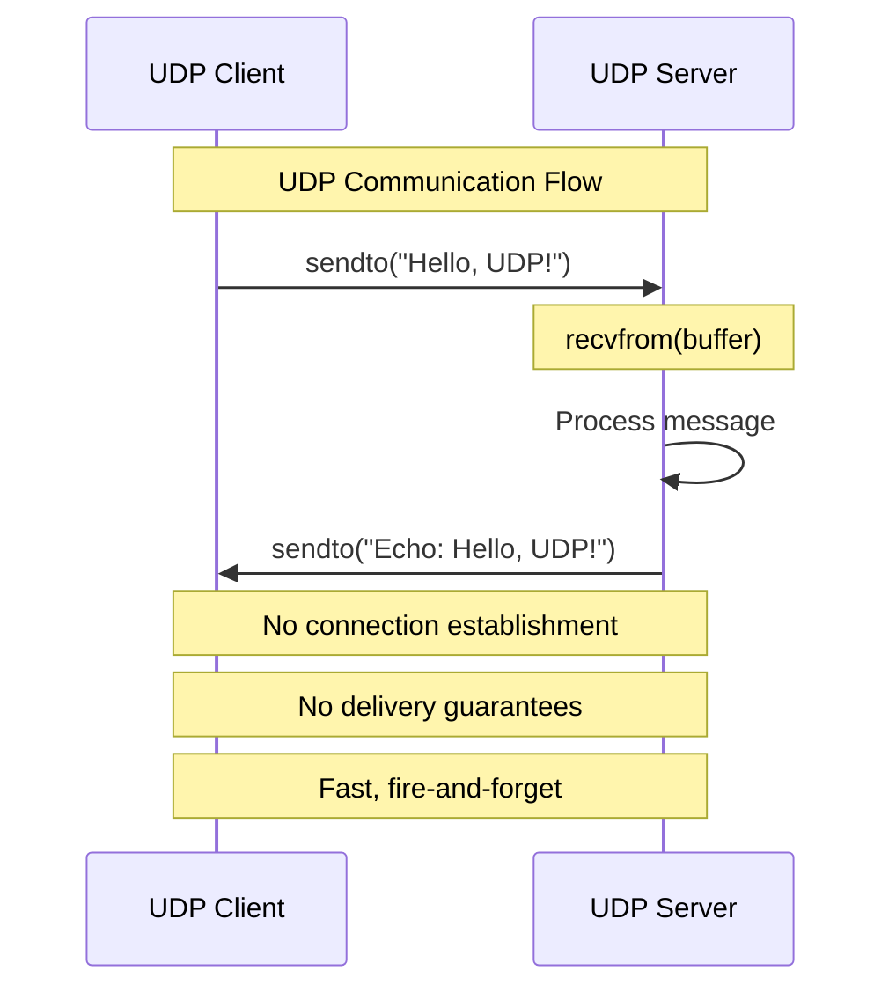

# Reading & Writing UDP Messages with Python

**Objective**: Master UDP (User Datagram Protocol) messaging with Python for high-performance, low-latency applications. When you need fast, connectionless communication, when you're building real-time systems, when you need to handle thousands of concurrent connections—UDP becomes your weapon of choice.

UDP is the foundation of fast, connectionless networking. Without proper UDP understanding, you're building on shaky ground with unreliable message delivery, buffer overflows, and performance bottlenecks. This guide shows you how to wield Python's socket and asyncio libraries with the precision of a network engineer.

## 0) Prerequisites (Read Once, Live by Them)

### The Five Commandments

1. **Understand the protocol**
   - Connectionless, unreliable, fast
   - Datagram boundaries and atomicity
   - No delivery guarantees or ordering

2. **Master buffer management**
   - Appropriate buffer sizes
   - Handling partial reads
   - Memory efficiency

3. **Know your patterns**
   - Blocking vs non-blocking I/O
   - Async vs synchronous
   - Error handling strategies

4. **Validate everything**
   - Message delivery testing
   - Performance benchmarking
   - Error condition handling

5. **Plan for production**
   - Scalability considerations
   - Monitoring and debugging
   - Security implications

**Why These Principles**: UDP messaging is the foundation of high-performance networking. Understanding the protocol, mastering buffer management, and following best practices is essential for building reliable real-time systems.

## 1) UDP Crash Course (The Foundation)

### What is UDP?

UDP (User Datagram Protocol) is a connectionless, unreliable transport protocol that provides:
- **Fast delivery**: No connection establishment overhead
- **Low latency**: Minimal protocol overhead
- **Simplicity**: Fire-and-forget messaging
- **No guarantees**: No delivery confirmation, ordering, or retransmission

### UDP Characteristics

```python
# UDP is connectionless - no handshake required
# Each sendto() creates a complete datagram
# Maximum datagram size: ~65,535 bytes (practical limit: ~1,500 bytes due to MTU)

# Typical use cases:
# - DNS queries (fast, simple)
# - VoIP (low latency, can tolerate packet loss)
# - Game state updates (real-time, frequent)
# - Telemetry data (high volume, loss acceptable)
# - Service discovery (broadcasting)
```

### UDP vs TCP Comparison

| Feature | UDP | TCP |
|---------|-----|-----|
| Connection | Connectionless | Connection-oriented |
| Reliability | Unreliable | Reliable |
| Ordering | No guarantee | Guaranteed |
| Speed | Fast | Slower |
| Overhead | Low | High |
| Use Cases | Real-time, games, telemetry | Web, email, file transfer |

**Why UDP Matters**: UDP provides the speed and simplicity needed for real-time applications where occasional packet loss is acceptable but low latency is critical.

## 2) Writing UDP Messages (Client)

### Basic UDP Client

```python
import socket
import time
from typing import Tuple

class UDPClient:
    def __init__(self, server_host: str = "127.0.0.1", server_port: int = 9999):
        self.server_addr = (server_host, server_port)
        self.sock = None
    
    def connect(self):
        """Create UDP socket"""
        self.sock = socket.socket(socket.AF_INET, socket.SOCK_DGRAM)
        # Optional: set socket options
        self.sock.setsockopt(socket.SOL_SOCKET, socket.SO_REUSEADDR, 1)
    
    def send_message(self, message: str) -> bool:
        """Send a message to the server"""
        if not self.sock:
            raise RuntimeError("Socket not connected. Call connect() first.")
        
        try:
            data = message.encode('utf-8')
            bytes_sent = self.sock.sendto(data, self.server_addr)
            print(f"Sent {bytes_sent} bytes to {self.server_addr}")
            return True
        except Exception as e:
            print(f"Error sending message: {e}")
            return False
    
    def send_binary(self, data: bytes) -> bool:
        """Send binary data to the server"""
        if not self.sock:
            raise RuntimeError("Socket not connected. Call connect() first.")
        
        try:
            bytes_sent = self.sock.sendto(data, self.server_addr)
            print(f"Sent {bytes_sent} bytes to {self.server_addr}")
            return True
        except Exception as e:
            print(f"Error sending binary data: {e}")
            return False
    
    def close(self):
        """Close the socket"""
        if self.sock:
            self.sock.close()
            self.sock = None

# Usage example
if __name__ == "__main__":
    client = UDPClient("127.0.0.1", 9999)
    client.connect()
    
    # Send text messages
    client.send_message("Hello, UDP!")
    client.send_message("This is a test message")
    
    # Send binary data
    binary_data = b'\x01\x02\x03\x04\x05'
    client.send_binary(binary_data)
    
    client.close()
```

### Advanced UDP Client with Error Handling

```python
import socket
import time
import json
from typing import Optional, Dict, Any
from datetime import datetime

class AdvancedUDPClient:
    def __init__(self, server_host: str = "127.0.0.1", server_port: int = 9999, 
                 timeout: float = 5.0):
        self.server_addr = (server_host, server_port)
        self.timeout = timeout
        self.sock = None
        self.connected = False
    
    def connect(self) -> bool:
        """Create and configure UDP socket"""
        try:
            self.sock = socket.socket(socket.AF_INET, socket.SOCK_DGRAM)
            self.sock.settimeout(self.timeout)
            self.sock.setsockopt(socket.SOL_SOCKET, socket.SO_REUSEADDR, 1)
            self.connected = True
            print(f"Connected to {self.server_addr}")
            return True
        except Exception as e:
            print(f"Connection error: {e}")
            return False
    
    def send_json(self, data: Dict[str, Any]) -> bool:
        """Send JSON data to the server"""
        if not self.connected:
            print("Not connected to server")
            return False
        
        try:
            message = json.dumps(data)
            data_bytes = message.encode('utf-8')
            bytes_sent = self.sock.sendto(data_bytes, self.server_addr)
            print(f"Sent JSON: {bytes_sent} bytes to {self.server_addr}")
            return True
        except Exception as e:
            print(f"Error sending JSON: {e}")
            return False
    
    def send_telemetry(self, device_id: str, sensor_type: str, value: float, 
                      unit: str = None) -> bool:
        """Send structured telemetry data"""
        telemetry = {
            "device_id": device_id,
            "sensor_type": sensor_type,
            "value": value,
            "unit": unit,
            "timestamp": datetime.now().isoformat()
        }
        return self.send_json(telemetry)
    
    def send_with_retry(self, message: str, max_retries: int = 3) -> bool:
        """Send message with retry logic"""
        for attempt in range(max_retries):
            if self.send_message(message):
                return True
            print(f"Retry {attempt + 1}/{max_retries}")
            time.sleep(0.1 * (attempt + 1))  # Exponential backoff
        return False
    
    def send_message(self, message: str) -> bool:
        """Send a text message to the server"""
        if not self.connected:
            print("Not connected to server")
            return False
        
        try:
            data = message.encode('utf-8')
            bytes_sent = self.sock.sendto(data, self.server_addr)
            print(f"Sent: {bytes_sent} bytes to {self.server_addr}")
            return True
        except socket.timeout:
            print("Send timeout")
            return False
        except Exception as e:
            print(f"Error sending message: {e}")
            return False
    
    def close(self):
        """Close the socket"""
        if self.sock:
            self.sock.close()
            self.sock = None
            self.connected = False

# Usage example
if __name__ == "__main__":
    client = AdvancedUDPClient("127.0.0.1", 9999)
    
    if client.connect():
        # Send telemetry data
        client.send_telemetry("sensor001", "temperature", 22.5, "°C")
        client.send_telemetry("sensor001", "humidity", 65.2, "%")
        
        # Send with retry
        client.send_with_retry("Important message")
        
        client.close()
```

**Why These Clients**: Structured UDP clients provide reliable message delivery with error handling. They enable complex data structures and retry logic for production applications.

## 3) Reading UDP Messages (Server)

### Basic UDP Server

```python
import socket
from typing import Tuple, Optional

class UDPServer:
    def __init__(self, host: str = "0.0.0.0", port: int = 9999, buffer_size: int = 4096):
        self.host = host
        self.port = port
        self.buffer_size = buffer_size
        self.sock = None
        self.running = False
    
    def start(self):
        """Start the UDP server"""
        try:
            self.sock = socket.socket(socket.AF_INET, socket.SOCK_DGRAM)
            self.sock.bind((self.host, self.port))
            self.sock.setsockopt(socket.SOL_SOCKET, socket.SO_REUSEADDR, 1)
            self.running = True
            
            print(f"UDP Server listening on {self.host}:{self.port}")
            print("Press Ctrl+C to stop...")
            
            while self.running:
                try:
                    data, addr = self.sock.recvfrom(self.buffer_size)
                    self.handle_message(data, addr)
                except KeyboardInterrupt:
                    print("\nShutting down server...")
                    self.running = False
                except Exception as e:
                    print(f"Error receiving data: {e}")
        
        except Exception as e:
            print(f"Server error: {e}")
        finally:
            self.stop()
    
    def handle_message(self, data: bytes, addr: Tuple[str, int]):
        """Handle incoming message"""
        try:
            message = data.decode('utf-8')
            print(f"Received from {addr}: {message}")
        except UnicodeDecodeError:
            print(f"Received binary data from {addr}: {data.hex()}")
    
    def stop(self):
        """Stop the server"""
        self.running = False
        if self.sock:
            self.sock.close()
            self.sock = None

# Usage example
if __name__ == "__main__":
    server = UDPServer("0.0.0.0", 9999)
    server.start()
```

### Advanced UDP Server with Message Processing

```python
import socket
import json
import time
import threading
from typing import Dict, Any, Callable, Optional
from datetime import datetime
from collections import defaultdict

class AdvancedUDPServer:
    def __init__(self, host: str = "0.0.0.0", port: int = 9999, 
                 buffer_size: int = 4096, max_clients: int = 1000):
        self.host = host
        self.port = port
        self.buffer_size = buffer_size
        self.max_clients = max_clients
        self.sock = None
        self.running = False
        self.clients = {}  # Track client connections
        self.message_handlers = {}  # Topic-based message handlers
        self.stats = {
            "messages_received": 0,
            "bytes_received": 0,
            "clients_connected": 0,
            "start_time": None
        }
    
    def start(self):
        """Start the advanced UDP server"""
        try:
            self.sock = socket.socket(socket.AF_INET, socket.SOCK_DGRAM)
            self.sock.bind((self.host, self.port))
            self.sock.setsockopt(socket.SOL_SOCKET, socket.SO_REUSEADDR, 1)
            self.running = True
            self.stats["start_time"] = datetime.now()
            
            print(f"Advanced UDP Server listening on {self.host}:{self.port}")
            print("Press Ctrl+C to stop...")
            
            # Start statistics thread
            stats_thread = threading.Thread(target=self._print_stats, daemon=True)
            stats_thread.start()
            
            while self.running:
                try:
                    data, addr = self.sock.recvfrom(self.buffer_size)
                    self._handle_message(data, addr)
                except KeyboardInterrupt:
                    print("\nShutting down server...")
                    self.running = False
                except Exception as e:
                    print(f"Error receiving data: {e}")
        
        except Exception as e:
            print(f"Server error: {e}")
        finally:
            self.stop()
    
    def _handle_message(self, data: bytes, addr: tuple):
        """Handle incoming message with processing"""
        self.stats["messages_received"] += 1
        self.stats["bytes_received"] += len(data)
        
        # Update client tracking
        if addr not in self.clients:
            self.clients[addr] = {
                "first_seen": datetime.now(),
                "last_seen": datetime.now(),
                "message_count": 0
            }
            self.stats["clients_connected"] = len(self.clients)
        
        self.clients[addr]["last_seen"] = datetime.now()
        self.clients[addr]["message_count"] += 1
        
        try:
            # Try to parse as JSON
            message = json.loads(data.decode('utf-8'))
            self._handle_json_message(message, addr)
        except json.JSONDecodeError:
            # Handle as plain text
            message = data.decode('utf-8')
            self._handle_text_message(message, addr)
        except UnicodeDecodeError:
            # Handle as binary data
            self._handle_binary_message(data, addr)
    
    def _handle_json_message(self, message: Dict[str, Any], addr: tuple):
        """Handle JSON message"""
        print(f"JSON from {addr}: {message}")
        
        # Route based on message type
        if "device_id" in message:
            self._handle_telemetry(message, addr)
        elif "command" in message:
            self._handle_command(message, addr)
        else:
            self._handle_generic_json(message, addr)
    
    def _handle_telemetry(self, message: Dict[str, Any], addr: tuple):
        """Handle telemetry data"""
        device_id = message.get("device_id")
        sensor_type = message.get("sensor_type")
        value = message.get("value")
        
        print(f"Telemetry from {device_id}: {sensor_type} = {value}")
        
        # Store or process telemetry data
        # This could save to database, forward to other services, etc.
    
    def _handle_command(self, message: Dict[str, Any], addr: tuple):
        """Handle command message"""
        command = message.get("command")
        print(f"Command from {addr}: {command}")
        
        # Process command and send response
        response = {"status": "acknowledged", "command": command}
        self._send_response(response, addr)
    
    def _handle_text_message(self, message: str, addr: tuple):
        """Handle text message"""
        print(f"Text from {addr}: {message}")
        
        # Echo back the message
        response = f"Echo: {message}"
        self._send_response(response, addr)
    
    def _handle_binary_message(self, data: bytes, addr: tuple):
        """Handle binary message"""
        print(f"Binary from {addr}: {len(data)} bytes")
        print(f"Hex: {data.hex()}")
    
    def _handle_generic_json(self, message: Dict[str, Any], addr: tuple):
        """Handle generic JSON message"""
        print(f"Generic JSON from {addr}: {message}")
    
    def _send_response(self, response: Any, addr: tuple):
        """Send response to client"""
        try:
            if isinstance(response, dict):
                data = json.dumps(response).encode('utf-8')
            else:
                data = str(response).encode('utf-8')
            
            self.sock.sendto(data, addr)
            print(f"Sent response to {addr}")
        except Exception as e:
            print(f"Error sending response: {e}")
    
    def _print_stats(self):
        """Print server statistics periodically"""
        while self.running:
            time.sleep(10)  # Print stats every 10 seconds
            if self.running:
                uptime = datetime.now() - self.stats["start_time"]
                print(f"\n--- Server Stats ---")
                print(f"Uptime: {uptime}")
                print(f"Messages received: {self.stats['messages_received']}")
                print(f"Bytes received: {self.stats['bytes_received']}")
                print(f"Active clients: {self.stats['clients_connected']}")
                print("-------------------\n")
    
    def stop(self):
        """Stop the server"""
        self.running = False
        if self.sock:
            self.sock.close()
            self.sock = None

# Usage example
if __name__ == "__main__":
    server = AdvancedUDPServer("0.0.0.0", 9999)
    server.start()
```

**Why These Servers**: Advanced UDP servers provide message processing, client tracking, and statistics. They enable complex data handling and monitoring for production applications.

## 4) Async UDP with asyncio

### Basic Async UDP Server

```python
import asyncio
import socket
from typing import Optional

class AsyncUDPServer:
    def __init__(self, host: str = "0.0.0.0", port: int = 9999):
        self.host = host
        self.port = port
        self.transport = None
        self.protocol = None
    
    async def start(self):
        """Start the async UDP server"""
        loop = asyncio.get_running_loop()
        
        # Create datagram endpoint
        self.transport, self.protocol = await loop.create_datagram_endpoint(
            lambda: UDPProtocol(),
            local_addr=(self.host, self.port)
        )
        
        print(f"Async UDP Server listening on {self.host}:{self.port}")
        print("Press Ctrl+C to stop...")
        
        try:
            # Keep server running
            await asyncio.sleep(3600)  # Run for 1 hour
        except KeyboardInterrupt:
            print("\nShutting down server...")
        finally:
            self.stop()
    
    def stop(self):
        """Stop the server"""
        if self.transport:
            self.transport.close()

class UDPProtocol(asyncio.DatagramProtocol):
    def __init__(self):
        self.transport = None
    
    def connection_made(self, transport):
        """Called when connection is established"""
        self.transport = transport
        print("UDP connection established")
    
    def datagram_received(self, data: bytes, addr: tuple):
        """Called when datagram is received"""
        try:
            message = data.decode('utf-8')
            print(f"Received from {addr}: {message}")
            
            # Echo back the message
            response = f"Echo: {message}"
            self.transport.sendto(response.encode('utf-8'), addr)
        except UnicodeDecodeError:
            print(f"Received binary data from {addr}: {data.hex()}")
    
    def error_received(self, exc):
        """Called when error occurs"""
        print(f"UDP error: {exc}")
    
    def connection_lost(self, exc):
        """Called when connection is lost"""
        print(f"UDP connection lost: {exc}")

# Usage example
async def main():
    server = AsyncUDPServer("0.0.0.0", 9999)
    await server.start()

if __name__ == "__main__":
    asyncio.run(main())
```

### Advanced Async UDP Server with Message Routing

```python
import asyncio
import json
import time
from typing import Dict, Any, Callable, Optional
from datetime import datetime
from collections import defaultdict

class AdvancedAsyncUDPServer:
    def __init__(self, host: str = "0.0.0.0", port: int = 9999):
        self.host = host
        self.port = port
        self.transport = None
        self.protocol = None
        self.message_handlers = defaultdict(list)
        self.stats = {
            "messages_received": 0,
            "bytes_received": 0,
            "start_time": datetime.now()
        }
    
    async def start(self):
        """Start the advanced async UDP server"""
        loop = asyncio.get_running_loop()
        
        self.transport, self.protocol = await loop.create_datagram_endpoint(
            lambda: AdvancedUDPProtocol(self),
            local_addr=(self.host, self.port)
        )
        
        print(f"Advanced Async UDP Server listening on {self.host}:{self.port}")
        print("Press Ctrl+C to stop...")
        
        # Start statistics task
        stats_task = asyncio.create_task(self._print_stats())
        
        try:
            # Keep server running
            await asyncio.sleep(3600)  # Run for 1 hour
        except KeyboardInterrupt:
            print("\nShutting down server...")
        finally:
            stats_task.cancel()
            self.stop()
    
    def add_message_handler(self, message_type: str, handler: Callable):
        """Add message handler for specific type"""
        self.message_handlers[message_type].append(handler)
    
    def _handle_message(self, data: bytes, addr: tuple):
        """Handle incoming message"""
        self.stats["messages_received"] += 1
        self.stats["bytes_received"] += len(data)
        
        try:
            # Try to parse as JSON
            message = json.loads(data.decode('utf-8'))
            self._route_message(message, addr)
        except json.JSONDecodeError:
            # Handle as plain text
            message = data.decode('utf-8')
            self._handle_text_message(message, addr)
        except UnicodeDecodeError:
            # Handle as binary data
            self._handle_binary_message(data, addr)
    
    def _route_message(self, message: Dict[str, Any], addr: tuple):
        """Route message to appropriate handler"""
        message_type = message.get("type", "generic")
        
        # Call type-specific handlers
        for handler in self.message_handlers[message_type]:
            try:
                handler(message, addr)
            except Exception as e:
                print(f"Handler error: {e}")
        
        # Call generic handlers
        for handler in self.message_handlers["generic"]:
            try:
                handler(message, addr)
            except Exception as e:
                print(f"Generic handler error: {e}")
    
    def _handle_text_message(self, message: str, addr: tuple):
        """Handle text message"""
        print(f"Text from {addr}: {message}")
        
        # Echo back the message
        response = f"Echo: {message}"
        self._send_response(response, addr)
    
    def _handle_binary_message(self, data: bytes, addr: tuple):
        """Handle binary message"""
        print(f"Binary from {addr}: {len(data)} bytes")
    
    def _send_response(self, response: Any, addr: tuple):
        """Send response to client"""
        try:
            if isinstance(response, dict):
                data = json.dumps(response).encode('utf-8')
            else:
                data = str(response).encode('utf-8')
            
            self.transport.sendto(data, addr)
        except Exception as e:
            print(f"Error sending response: {e}")
    
    async def _print_stats(self):
        """Print server statistics periodically"""
        while True:
            await asyncio.sleep(10)  # Print stats every 10 seconds
            uptime = datetime.now() - self.stats["start_time"]
            print(f"\n--- Async Server Stats ---")
            print(f"Uptime: {uptime}")
            print(f"Messages received: {self.stats['messages_received']}")
            print(f"Bytes received: {self.stats['bytes_received']}")
            print("---------------------------\n")
    
    def stop(self):
        """Stop the server"""
        if self.transport:
            self.transport.close()

class AdvancedUDPProtocol(asyncio.DatagramProtocol):
    def __init__(self, server):
        self.server = server
        self.transport = None
    
    def connection_made(self, transport):
        """Called when connection is established"""
        self.transport = transport
        print("Advanced UDP connection established")
    
    def datagram_received(self, data: bytes, addr: tuple):
        """Called when datagram is received"""
        self.server._handle_message(data, addr)
    
    def error_received(self, exc):
        """Called when error occurs"""
        print(f"Advanced UDP error: {exc}")
    
    def connection_lost(self, exc):
        """Called when connection is lost"""
        print(f"Advanced UDP connection lost: {exc}")

# Usage example with message handlers
async def main():
    server = AdvancedAsyncUDPServer("0.0.0.0", 9999)
    
    # Add message handlers
    def handle_telemetry(message, addr):
        print(f"Telemetry from {addr}: {message}")
    
    def handle_command(message, addr):
        print(f"Command from {addr}: {message}")
        # Send acknowledgment
        response = {"status": "acknowledged", "command": message.get("command")}
        server._send_response(response, addr)
    
    server.add_message_handler("telemetry", handle_telemetry)
    server.add_message_handler("command", handle_command)
    
    await server.start()

if __name__ == "__main__":
    asyncio.run(main())
```

**Why Async UDP**: Asyncio provides high-performance, non-blocking UDP servers that can handle thousands of concurrent connections. It's essential for scalable real-time applications.

## 5) Message Flow Diagram



**Why This Flow**: UDP communication is connectionless and unreliable. The diagram shows the simple request-response pattern without connection establishment or delivery guarantees.

## 6) Advanced: Broadcasting & Multicast

### UDP Broadcasting

```python
import socket
import time

class UDPBroadcaster:
    def __init__(self, port: int = 9999):
        self.port = port
        self.sock = None
    
    def start_broadcasting(self):
        """Start broadcasting messages"""
        try:
            self.sock = socket.socket(socket.AF_INET, socket.SOCK_DGRAM)
            self.sock.setsockopt(socket.SOL_SOCKET, socket.SO_BROADCAST, 1)
            
            print(f"Starting UDP broadcast on port {self.port}")
            
            message_count = 0
            while True:
                message = f"Broadcast message {message_count}"
                self.sock.sendto(message.encode('utf-8'), ("255.255.255.255", self.port))
                print(f"Broadcasted: {message}")
                
                message_count += 1
                time.sleep(1)
                
        except KeyboardInterrupt:
            print("\nStopping broadcaster...")
        finally:
            if self.sock:
                self.sock.close()

class UDPBroadcastReceiver:
    def __init__(self, port: int = 9999):
        self.port = port
        self.sock = None
    
    def start_listening(self):
        """Start listening for broadcast messages"""
        try:
            self.sock = socket.socket(socket.AF_INET, socket.SOCK_DGRAM)
            self.sock.bind(("0.0.0.0", self.port))
            
            print(f"Listening for broadcasts on port {self.port}")
            
            while True:
                data, addr = self.sock.recvfrom(4096)
                message = data.decode('utf-8')
                print(f"Received broadcast from {addr}: {message}")
                
        except KeyboardInterrupt:
            print("\nStopping receiver...")
        finally:
            if self.sock:
                self.sock.close()

# Usage example
if __name__ == "__main__":
    import sys
    
    if len(sys.argv) > 1 and sys.argv[1] == "broadcast":
        broadcaster = UDPBroadcaster(9999)
        broadcaster.start_broadcasting()
    else:
        receiver = UDPBroadcastReceiver(9999)
        receiver.start_listening()
```

### UDP Multicasting

```python
import socket
import struct
import time

class UDPMulticaster:
    def __init__(self, multicast_group: str = "224.1.1.1", port: int = 9999):
        self.multicast_group = multicast_group
        self.port = port
        self.sock = None
    
    def start_multicasting(self):
        """Start multicasting messages"""
        try:
            self.sock = socket.socket(socket.AF_INET, socket.SOCK_DGRAM)
            
            print(f"Starting UDP multicast to {self.multicast_group}:{self.port}")
            
            message_count = 0
            while True:
                message = f"Multicast message {message_count}"
                self.sock.sendto(message.encode('utf-8'), (self.multicast_group, self.port))
                print(f"Multicasted: {message}")
                
                message_count += 1
                time.sleep(1)
                
        except KeyboardInterrupt:
            print("\nStopping multicaster...")
        finally:
            if self.sock:
                self.sock.close()

class UDPMulticastReceiver:
    def __init__(self, multicast_group: str = "224.1.1.1", port: int = 9999):
        self.multicast_group = multicast_group
        self.port = port
        self.sock = None
    
    def start_listening(self):
        """Start listening for multicast messages"""
        try:
            self.sock = socket.socket(socket.AF_INET, socket.SOCK_DGRAM)
            self.sock.bind(("", self.port))
            
            # Join multicast group
            mreq = struct.pack("4sl", socket.inet_aton(self.multicast_group), socket.INADDR_ANY)
            self.sock.setsockopt(socket.IPPROTO_IP, socket.IP_ADD_MEMBERSHIP, mreq)
            
            print(f"Listening for multicasts from {self.multicast_group}:{self.port}")
            
            while True:
                data, addr = self.sock.recvfrom(4096)
                message = data.decode('utf-8')
                print(f"Received multicast from {addr}: {message}")
                
        except KeyboardInterrupt:
            print("\nStopping receiver...")
        finally:
            if self.sock:
                self.sock.close()

# Usage example
if __name__ == "__main__":
    import sys
    
    if len(sys.argv) > 1 and sys.argv[1] == "multicast":
        multicaster = UDPMulticaster("224.1.1.1", 9999)
        multicaster.start_multicasting()
    else:
        receiver = UDPMulticastReceiver("224.1.1.1", 9999)
        receiver.start_listening()
```

**Why Broadcasting & Multicast**: These patterns enable one-to-many communication for service discovery, real-time updates, and distributed systems. They're essential for scalable network applications.

## 7) Best Practices (The Wisdom)

### Buffer Management

```python
# GOOD: Appropriate buffer sizes
BUFFER_SIZE = 4096  # 4KB buffer for most applications
LARGE_BUFFER_SIZE = 65536  # 64KB for large datagrams

# BAD: Too small buffers
SMALL_BUFFER_SIZE = 1024  # May truncate large messages

# GOOD: Handle partial reads
def receive_complete_message(sock, buffer_size=4096):
    """Receive complete message, handling partial reads"""
    data, addr = sock.recvfrom(buffer_size)
    return data, addr

# BAD: Assuming complete message
def receive_message_bad(sock):
    data, addr = sock.recvfrom(1024)  # May truncate
    return data, addr
```

### Error Handling Best Practices

```python
import socket
import time
from typing import Optional

class RobustUDPClient:
    def __init__(self, server_host: str, server_port: int, timeout: float = 5.0):
        self.server_addr = (server_host, server_port)
        self.timeout = timeout
        self.sock = None
    
    def connect(self) -> bool:
        """Create socket with error handling"""
        try:
            self.sock = socket.socket(socket.AF_INET, socket.SOCK_DGRAM)
            self.sock.settimeout(self.timeout)
            self.sock.setsockopt(socket.SOL_SOCKET, socket.SO_REUSEADDR, 1)
            return True
        except Exception as e:
            print(f"Socket creation error: {e}")
            return False
    
    def send_with_retry(self, message: str, max_retries: int = 3) -> bool:
        """Send message with retry logic"""
        for attempt in range(max_retries):
            try:
                if self._send_message(message):
                    return True
                print(f"Send attempt {attempt + 1} failed")
                time.sleep(0.1 * (attempt + 1))  # Exponential backoff
            except Exception as e:
                print(f"Send error: {e}")
                time.sleep(0.1 * (attempt + 1))
        return False
    
    def _send_message(self, message: str) -> bool:
        """Send single message"""
        if not self.sock:
            return False
        
        try:
            data = message.encode('utf-8')
            bytes_sent = self.sock.sendto(data, self.server_addr)
            print(f"Sent {bytes_sent} bytes to {self.server_addr}")
            return True
        except socket.timeout:
            print("Send timeout")
            return False
        except Exception as e:
            print(f"Send error: {e}")
            return False
    
    def close(self):
        """Close socket safely"""
        if self.sock:
            try:
                self.sock.close()
            except:
                pass
            self.sock = None
```

### Performance Best Practices

```python
# Message size limits
MAX_MESSAGE_SIZE = 1500  # MTU size for Ethernet
RECOMMENDED_SIZE = 512   # Safe size for most networks

def validate_message_size(message: str) -> bool:
    """Validate message size before sending"""
    size = len(message.encode('utf-8'))
    if size > MAX_MESSAGE_SIZE:
        print(f"Message too large: {size} bytes (max: {MAX_MESSAGE_SIZE})")
        return False
    return True

# Batch processing for efficiency
def send_batch_messages(client, messages: list):
    """Send multiple messages efficiently"""
    for message in messages:
        if validate_message_size(message):
            client.send_message(message)
        time.sleep(0.001)  # Small delay to prevent overwhelming
```

**Why These Best Practices**: Proper buffer management, error handling, and performance optimization ensure reliable UDP communication in production environments.

## 8) TL;DR Quickstart (The Essentials)

### Essential Commands

```bash
# Start UDP server
python udp_server.py

# Start UDP client
python udp_client.py

# Test with netcat
nc -u localhost 9999
```

### Essential Python Code

```python
# Simple UDP Client
import socket

sock = socket.socket(socket.AF_INET, socket.SOCK_DGRAM)
sock.sendto(b"Hello, UDP!", ("127.0.0.1", 9999))
sock.close()

# Simple UDP Server
import socket

sock = socket.socket(socket.AF_INET, socket.SOCK_DGRAM)
sock.bind(("0.0.0.0", 9999))

while True:
    data, addr = sock.recvfrom(4096)
    print(f"Received: {data.decode()} from {addr}")
```

### Essential Configuration

```python
# Socket options for production
sock.setsockopt(socket.SOL_SOCKET, socket.SO_REUSEADDR, 1)
sock.settimeout(5.0)  # 5 second timeout
sock.setsockopt(socket.SOL_SOCKET, socket.SO_BROADCAST, 1)  # For broadcasting
```

**Why This Quickstart**: These commands and code snippets cover 90% of daily UDP usage. Master these before exploring advanced features.

## 9) The Machine's Summary

UDP messaging with Python provides fast, connectionless communication for real-time applications. When configured properly, it enables high-performance networking, low-latency communication, and scalable message handling. The key is understanding the protocol, mastering buffer management, and following best practices.

**The Dark Truth**: Without proper UDP understanding, your networking is unreliable. Python's socket and asyncio libraries are your weapons. Use them wisely.

**The Machine's Mantra**: "In speed we trust, in buffers we build, and in the network we find the path to real-time communication."

**Why This Matters**: UDP messaging enables applications to communicate with minimal overhead and maximum speed. It provides the foundation for real-time systems, IoT applications, and high-performance networking.

---

*This tutorial provides the complete machinery for mastering UDP messaging with Python. The patterns scale from development to production, from simple clients to enterprise-grade real-time systems.*
