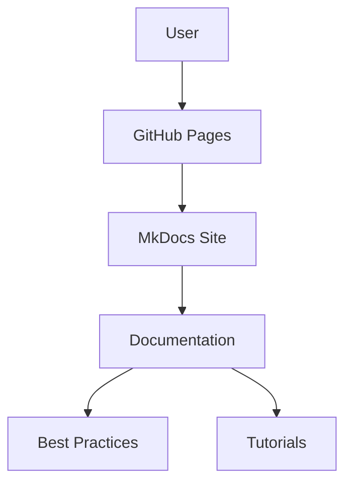

# Creating a MkDocs GitHub Site

This tutorial walks through creating a professional MkDocs site hosted on GitHub Pages, based on this exact repository structure. We'll cover repository setup, MkDocs configuration, GitHub Actions deployment, and advanced features like navigation, theming, and plugins.

## 1. Repository Setup and Initial Configuration

### Create GitHub Repository

```bash
# Create new repository (replace 'your-username' with your GitHub username)
gh repo create your-username.github.io --public --clone
cd your-username.github.io
```

**Why:** GitHub Pages requires the repository to be named `username.github.io` for user sites. This enables automatic deployment to `https://your-username.github.io`.

### Initialize MkDocs Project

```bash
# Install MkDocs and Material theme
pip install mkdocs mkdocs-material

# Initialize MkDocs project
mkdocs new .
```

**Why:** MkDocs provides a static site generator optimized for documentation. The Material theme offers modern design and extensive customization options.

## 2. Core Configuration (mkdocs.yml)

### Basic Site Configuration

```yaml
# mkdocs.yml
site_name: Your Name - Professional Portfolio
site_description: Professional portfolio and technical documentation
site_author: Your Name
site_url: https://your-username.github.io

theme:
  name: material
  palette:
    - media: "(prefers-color-scheme: light)"
      scheme: default
      primary: blue
      accent: blue
      toggle:
        icon: material/brightness-7
        name: Switch to dark mode
    - media: "(prefers-color-scheme: dark)"
      scheme: slate
      primary: blue
      accent: blue
      toggle:
        icon: material/brightness-4
        name: Switch to system preference
  features:
    - navigation.tabs
    - navigation.sections
    - navigation.top
    - navigation.tracking
    - toc.integrate
    - toc.follow
    - search.suggest
    - search.highlight
    - content.code.copy
    - content.action.edit
    - content.action.view
    - meta
  icon:
    repo: fontawesome/brands/github
    edit: material/pencil
    view: material/eye
```

**Why:** This configuration provides a professional appearance with dark/light mode support, comprehensive navigation features, and GitHub integration.

### Navigation Structure

```yaml
nav:
  - Home: index.md
  - Professional Profile: about.md
  - Projects: projects.md
  - Technical Documentation: documentation.md
  - Best Practices:
    - Python Package: best-practices/python-package.md
    - Docker & Compose: best-practices/docker-and-compose.md
  - Tutorials:
    - Creating MkDocs GitHub Site: tutorials/creating-mkdocs-github-site.md
  - Contact & Collaboration: getting-started.md
```

**Why:** Hierarchical navigation enables organized content structure. Nested sections group related content while maintaining clear information architecture.

## 3. Advanced Markdown Extensions

### Enhanced Markdown Processing

```yaml
markdown_extensions:
  - pymdownx.highlight:
      anchor_linenums: true
      line_spans: __span
      pygments_lang_class: true
  - pymdownx.inlinehilite
  - pymdownx.superfences:
      custom_fences:
        - name: mermaid
          class: mermaid
          format: !!python/name:pymdownx.superfences.fence_code_format
  - pymdownx.tabbed:
      alternate_style: true
      combine_header_slug: true
  - pymdownx.emoji:
      emoji_index: !!python/name:materialx.emoji.twemoji
      emoji_generator: !!python/name:materialx.emoji.to_svg
  - pymdownx.arithmatex:
      generic: true
  - pymdownx.critic
  - pymdownx.caret
  - pymdownx.details
  - pymdownx.keys
  - pymdownx.mark
  - pymdownx.smartsymbols
  - pymdownx.tilde
  - admonition
  - attr_list
  - def_list
  - footnotes
  - md_in_html
  - toc:
      permalink: true
      title: On this page
  - tables
  - pymdownx.tasklist:
      custom_checkbox: true
  - pymdownx.magiclink:
      normalize_issue_symbols: true
      repo_url_shorthand: true
      user: your-username
      repo: your-username.github.io
```

**Why:** These extensions provide rich markdown features including syntax highlighting, diagrams, tabs, emojis, and GitHub integration. They transform basic markdown into a professional documentation experience.

## 4. Essential Plugins Configuration

### Plugin Setup

```yaml
plugins:
  - search:
      lang: en
  - git-revision-date-localized:
      enable_creation_date: true
      type: timeago
  - minify:
      minify_html: true
      minify_js: true
      minify_css: true
```

**Why:** Search enables full-text search across documentation. Git revision dates show content freshness. Minification improves site performance and loading times.

### Social Links and Metadata

```yaml
extra:
  social:
    - icon: fontawesome/brands/github
      link: https://github.com/your-username
    - icon: fontawesome/brands/linkedin
      link: https://linkedin.com/in/your-profile
    - icon: fontawesome/solid/envelope
      link: mailto:your-email@example.com
    - icon: fontawesome/solid/globe
      link: https://your-website.com
  version:
    provider: mike
  generator: false
  consent:
    title: Cookie consent
    description: >- 
      This site uses cookies to enhance your browsing experience and analyze site traffic.
      By continuing to use this site, you consent to our use of cookies.
    necessary: true
    strict: true
  copyright: |
    Copyright &copy; 2025 Your Name - 
    <a href="https://github.com/your-username/your-username.github.io/blob/main/LICENSE" target="_blank" rel="noopener">MIT License</a>
```

**Why:** Social links provide professional networking integration. Cookie consent ensures GDPR compliance. Copyright information protects intellectual property.

## 5. GitHub Actions Deployment

### Create Workflow Directory

```bash
mkdir -p .github/workflows
```

### Deploy Workflow

```yaml
# .github/workflows/deploy-mkdocs.yml
name: Deploy MkDocs

on:
  push:
    branches:
      - main
  pull_request:
    branches:
      - main
  workflow_dispatch:

permissions:
  contents: write
  pages: write
  id-token: write

concurrency:
  group: "pages"
  cancel-in-progress: false

jobs:
  build:
    runs-on: ubuntu-latest
    steps:
      - name: Checkout code
        uses: actions/checkout@v4
        with:
          fetch-depth: 0

      - name: Set up Python
        uses: actions/setup-python@v5
        with:
          python-version: '3.11'
          cache: 'pip'

      - name: Cache dependencies
        uses: actions/cache@v3
        with:
          path: ~/.cache/pip
          key: ${{ runner.os }}-pip-${{ hashFiles('**/requirements.txt') }}
          restore-keys: |
            ${{ runner.os }}-pip-

      - name: Install dependencies
        run: |
          python -m pip install --upgrade pip
          pip install -r requirements.txt

      - name: Setup Pages
        uses: actions/configure-pages@v4

      - name: Build with MkDocs
        run: |
          mkdocs build --clean

      - name: Upload artifact
        uses: actions/upload-pages-artifact@v3
        with:
          path: ./site

  deploy:
    environment:
      name: github-pages
      url: ${{ steps.deployment.outputs.page_url }}
    runs-on: ubuntu-latest
    needs: build
    if: github.ref == 'refs/heads/main'
    steps:
      - name: Deploy to GitHub Pages
        id: deployment
        uses: actions/deploy-pages@v4
```

**Why:** GitHub Actions provides automated deployment on every push to main. The workflow builds the site, uploads artifacts, and deploys to GitHub Pages with proper permissions and caching.

## 6. Dependencies Management

### Create requirements.txt

```txt
# Core MkDocs and Material Theme
mkdocs>=1.5.0
mkdocs-material>=9.4.0

# Enhanced Markdown Extensions
pymdown-extensions>=9.2

# Essential Plugins
mkdocs-git-revision-date-localized-plugin>=1.2.0
mkdocs-minify-plugin>=0.7.0

# Mermaid Support
mkdocs-mermaid2-plugin>=1.1.0

# Additional Modern Features
mkdocs-redirects>=1.2.0
mkdocs-exclude>=1.0.0
mkdocs-macros-plugin>=0.7.0
mkdocs-awesome-pages-plugin>=2.9.0
```

**Why:** Pinning versions ensures reproducible builds. The requirements file enables consistent deployment across different environments.

## 7. Content Structure and Organization

### Directory Structure

```
docs/
├── index.md
├── about.md
├── projects.md
├── documentation.md
├── getting-started.md
├── best-practices/
│   ├── python-package.md
│   └── docker-and-compose.md
└── tutorials/
    └── creating-mkdocs-github-site.md
```

### Homepage Template

```markdown
# Welcome to Your Professional Portfolio

## About This Site

This site showcases my professional work, technical expertise, and contributions to the field of [your domain]. Here you'll find:

- **Professional Profile**: Background, experience, and expertise
- **Projects**: Technical implementations and case studies  
- **Best Practices**: Industry-standard methodologies and patterns
- **Tutorials**: Step-by-step guides for common tasks

## Quick Links

- [Professional Profile](about.md) - Learn about my background
- [Projects](projects.md) - Explore technical implementations
- [Best Practices](best-practices/) - Industry-standard methodologies
- [Contact](getting-started.md) - Get in touch

## Recent Updates

- Added comprehensive Python packaging best practices
- Published Docker and Compose workflow guide
- Updated monitoring tutorial with Grafana and Prometheus
```

**Why:** Clear homepage structure guides visitors to relevant content. Recent updates section demonstrates active maintenance and value.

## 8. Local Development and Testing

### Development Server

```bash
# Start local development server
mkdocs serve

# Build site locally
mkdocs build

# Serve built site
mkdocs serve --dev-addr=0.0.0.0:8000
```

### Testing Configuration

```bash
# Validate configuration
mkdocs build --strict

# Check for broken links
mkdocs build --clean
```

**Why:** Local development enables rapid iteration and testing. Strict mode catches configuration errors before deployment.

## 9. Advanced Features

### Custom CSS and JavaScript

```bash
# Create custom assets directory
mkdir -p docs/assets/css
mkdir -p docs/assets/js
```

Create `docs/assets/css/custom.css`:

```css
/* Custom styling */
.md-header {
    background-color: #1976d2;
}

.md-tabs__link--active {
    border-bottom: 2px solid #1976d2;
}
```

**Why:** Custom styling enables brand consistency and professional appearance. CSS customization provides fine-grained control over visual presentation.

### Mermaid Diagrams

```markdown

```

**Why:** Mermaid diagrams provide visual documentation that enhances understanding. Diagrams are rendered client-side and integrate seamlessly with the Material theme.

## 10. Deployment and Maintenance

### Enable GitHub Pages

1. Go to repository Settings
2. Navigate to Pages section
3. Select "GitHub Actions" as source
4. The workflow will automatically deploy

### Maintenance Checklist

```bash
# Update dependencies
pip install --upgrade -r requirements.txt

# Test locally
mkdocs serve

# Build and validate
mkdocs build --strict

# Commit and push
git add .
git commit -m "Update documentation"
git push origin main
```

**Why:** Regular maintenance ensures site reliability and security. Automated deployment reduces manual errors and enables continuous delivery.

## 11. TL;DR (Quickstart)

```bash
# 1. Create repository
gh repo create your-username.github.io --public --clone
cd your-username.github.io

# 2. Install dependencies
pip install mkdocs mkdocs-material

# 3. Initialize project
mkdocs new .

# 4. Configure mkdocs.yml (copy from this tutorial)

# 5. Create GitHub Actions workflow
mkdir -p .github/workflows
# Copy deploy-mkdocs.yml from this tutorial

# 6. Enable GitHub Pages in repository settings

# 7. Deploy
git add .
git commit -m "Initial MkDocs setup"
git push origin main
```

**Why:** This sequence establishes a complete MkDocs GitHub Pages site in under 10 minutes. Each command builds on the previous, ensuring a deterministic setup that matches production deployment.
