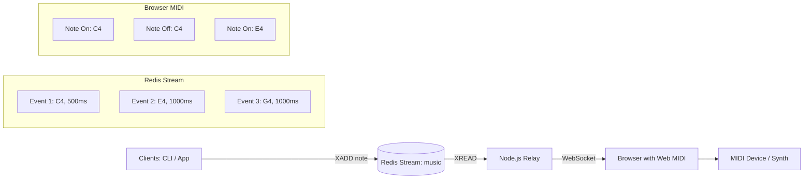
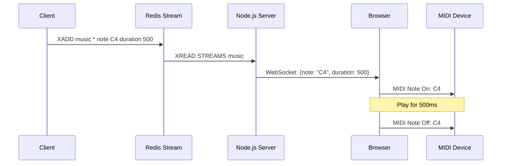

# When Redis Plays Music: Procedural MIDI Jams with Redis Streams + Web MIDI API

**Objective**: Master the intersection of distributed systems and creative technology by using Redis Streams as a musical event bus and the Web MIDI API to generate procedural, collaborative music in the browser. When you need to explore creative applications of data streams, when you want to build collaborative music systems, when you're curious about the intersection of technology and art—Redis Streams + Web MIDI becomes your weapon of choice.

Redis is usually for queues and caching—but it can also be a metronome for chaos. Let's use it to generate music by treating Redis Streams as a persistent musical event log that drives real-time MIDI synthesis in the browser.

## 0) Prerequisites (Read Once, Live by Them)

### The Five Commandments

1. **Understand Redis Streams**
   - Append-only event logs with unique IDs
   - Consumer groups for reliable processing
   - Stream trimming and memory management
   - Event sourcing and replay capabilities

2. **Master Web MIDI API**
   - Browser MIDI device access and enumeration
   - MIDI message construction and timing
   - Note on/off events and velocity control
   - Channel and program change messages

3. **Know your music theory**
   - MIDI note numbers and frequency mapping
   - Chord progressions and harmonic relationships
   - Rhythm patterns and timing quantization
   - Musical scales and key signatures

4. **Validate everything**
   - Test Redis Stream operations and reliability
   - Verify MIDI device connectivity and latency
   - Check WebSocket connection stability
   - Monitor memory usage and stream growth

5. **Plan for creativity**
   - Design for collaborative composition
   - Enable real-time performance and improvisation
   - Support multiple musical styles and genres
   - Document creative workflows and patterns

**Why These Principles**: Creative technology requires understanding both distributed systems and musical concepts. Understanding these patterns prevents technical limitations and enables artistic expression.

## 1) Setup Redis Streams

### Redis Container Setup

```bash
# Start Redis container
docker run -d --name redis-music -p 6379:6379 redis:7

# Verify Redis is running
docker exec redis-music redis-cli ping
# Should return: PONG
```

**Why Redis Setup Matters**: Redis Streams provide persistent, ordered event logs perfect for musical composition. Understanding these patterns prevents data loss and enables reliable musical event storage.

### Basic Stream Operations

```bash
# Add a musical motif to the stream
redis-cli XADD music * note C4 duration 500 velocity 100

# Add a chord progression
redis-cli XADD music * note E4 duration 1000 velocity 80
redis-cli XADD music * note G4 duration 1000 velocity 80
redis-cli XADD music * note C5 duration 1000 velocity 80

# Read from the stream
redis-cli XREAD STREAMS music 0-0
```

**Why Stream Operations Matter**: XADD creates a persistent musical event log with unique IDs and structured data. Understanding these patterns prevents event duplication and enables reliable musical composition.

### Advanced Stream Operations

```bash
# Create a consumer group for reliable processing
redis-cli XGROUP CREATE music musicians 0-0 MKSTREAM

# Read from consumer group
redis-cli XREADGROUP GROUP musicians browser1 COUNT 10 STREAMS music >

# Acknowledge processed messages
redis-cli XACK music musicians 1640995200000-0

# Trim stream to keep memory usage reasonable
redis-cli XTRIM music MAXLEN 1000
```

**Why Advanced Operations Matter**: Consumer groups enable reliable processing, acknowledgments prevent message loss, and trimming controls memory usage. Understanding these patterns prevents system overload and enables scalable musical collaboration.

## 2) Backend Relay (Node.js + WebSocket)

### Node.js WebSocket Server

```javascript
// server.js
import { WebSocketServer } from "ws";
import Redis from "ioredis";

const wss = new WebSocketServer({ port: 8080 });
const redis = new Redis();

console.log("🎵 Redis MIDI Music Server started on port 8080");

async function streamMusic() {
  let id = "0-0"; // start from beginning
  
  while (true) {
    try {
      const entries = await redis.xread("BLOCK", 0, "STREAMS", "music", id);
      
      if (entries && entries.length > 0) {
        const [stream, msgs] = entries[0];
        
        for (const [nextId, fields] of msgs) {
          id = nextId;
          const note = Object.fromEntries(fields);
          
          // Broadcast to all connected clients
          for (const ws of wss.clients) {
            if (ws.readyState === ws.OPEN) {
              ws.send(JSON.stringify({
                ...note,
                timestamp: Date.now(),
                streamId: nextId
              }));
            }
          }
        }
      }
    } catch (error) {
      console.error("Stream error:", error);
      await new Promise(resolve => setTimeout(resolve, 1000));
    }
  }
}

// Start streaming
streamMusic();

// Handle WebSocket connections
wss.on("connection", (ws) => {
  console.log("🎹 New musician connected");
  
  ws.on("close", () => {
    console.log("🎹 Musician disconnected");
  });
});
```

**Why Backend Relay Matters**: Converts Redis log into live WebSocket events, enabling real-time musical collaboration. Understanding these patterns prevents connection issues and enables reliable event streaming.

### Enhanced Server with Error Handling

```javascript
// enhanced-server.js
import { WebSocketServer } from "ws";
import Redis from "ioredis";

const wss = new WebSocketServer({ port: 8080 });
const redis = new Redis({
  retryDelayOnFailover: 100,
  maxRetriesPerRequest: 3
});

// Health check endpoint
wss.on("connection", (ws, req) => {
  console.log("🎹 New musician connected from", req.socket.remoteAddress);
  
  // Send welcome message
  ws.send(JSON.stringify({
    type: "welcome",
    message: "Connected to Redis MIDI Music Server",
    timestamp: Date.now()
  }));
  
  ws.on("error", (error) => {
    console.error("WebSocket error:", error);
  });
  
  ws.on("close", () => {
    console.log("🎹 Musician disconnected");
  });
});

// Graceful shutdown
process.on("SIGINT", () => {
  console.log("🎵 Shutting down gracefully...");
  wss.close();
  redis.disconnect();
  process.exit(0);
});
```

**Why Enhanced Server Matters**: Robust error handling and graceful shutdown prevent system instability. Understanding these patterns prevents connection drops and enables reliable musical performance.

## 3) Browser Consumer with Web MIDI

### Basic Web MIDI Implementation

```html
<!DOCTYPE html>
<html>
<head>
    <title>Redis MIDI Music</title>
    <style>
        body { font-family: monospace; background: #000; color: #0f0; }
        .status { margin: 10px 0; }
        .note { display: inline-block; margin: 5px; padding: 5px; background: #333; }
    </style>
</head>
<body>
    <h1>🎵 Redis MIDI Music Player</h1>
    <div id="status">Connecting...</div>
    <div id="notes"></div>
    
    <script>
        let midiOut;
        let ws;
        let notes = [];
        
        // Initialize MIDI
        navigator.requestMIDIAccess().then(midi => {
            const outputs = [...midi.outputs.values()];
            if (outputs.length > 0) {
                midiOut = outputs[0];
                document.getElementById("status").textContent = 
                    `🎹 Connected to: ${midiOut.name}`;
            } else {
                document.getElementById("status").textContent = 
                    "❌ No MIDI devices found";
            }
        }).catch(err => {
            document.getElementById("status").textContent = 
                `❌ MIDI error: ${err.message}`;
        });
        
        // Connect to WebSocket
        ws = new WebSocket("ws://localhost:8080");
        
        ws.onopen = () => {
            document.getElementById("status").textContent = "🎵 Connected to Redis stream";
        };
        
        ws.onmessage = (event) => {
            const data = JSON.parse(event.data);
            
            if (data.type === "welcome") {
                console.log("Server:", data.message);
                return;
            }
            
            // Play MIDI note
            if (midiOut && data.note) {
                playNote(data);
            }
        };
        
        ws.onerror = (error) => {
            document.getElementById("status").textContent = "❌ WebSocket error";
        };
        
        function playNote(data) {
            const noteNumber = midiNote(data.note);
            const velocity = parseInt(data.velocity) || 100;
            const duration = parseInt(data.duration) || 500;
            
            // Note On
            midiOut.send([0x90, noteNumber, velocity]);
            
            // Visual feedback
            const noteElement = document.createElement("div");
            noteElement.className = "note";
            noteElement.textContent = `${data.note} (${noteNumber})`;
            noteElement.style.background = `hsl(${noteNumber * 3}, 70%, 50%)`;
            document.getElementById("notes").appendChild(noteElement);
            
            // Note Off after duration
            setTimeout(() => {
                midiOut.send([0x80, noteNumber, 0]);
                noteElement.style.opacity = "0.3";
            }, duration);
            
            // Clean up old notes
            if (notes.length > 20) {
                const oldNote = document.getElementById("notes").firstChild;
                if (oldNote) oldNote.remove();
            }
        }
        
        function midiNote(name) {
            const noteMap = {
                "C4": 60, "C#4": 61, "D4": 62, "D#4": 63, "E4": 64,
                "F4": 65, "F#4": 66, "G4": 67, "G#4": 68, "A4": 69,
                "A#4": 70, "B4": 71, "C5": 72, "D5": 74, "E5": 76,
                "F5": 77, "G5": 79, "A5": 81, "B5": 83
            };
            return noteMap[name] || 60;
        }
    </script>
</body>
</html>
```

**Why Web MIDI Matters**: Browser becomes an instrument controlled by Redis events, enabling real-time musical performance. Understanding these patterns prevents MIDI timing issues and enables responsive musical interaction.

### Enhanced MIDI Player

```javascript
// enhanced-midi-player.js
class RedisMIDIPlayer {
    constructor() {
        this.midiOut = null;
        this.ws = null;
        this.activeNotes = new Map();
        this.quantizeTime = 16; // 16th note quantization
    }
    
    async initialize() {
        try {
            const midi = await navigator.requestMIDIAccess();
            const outputs = [...midi.outputs.values()];
            
            if (outputs.length > 0) {
                this.midiOut = outputs[0];
                console.log(`🎹 Connected to: ${this.midiOut.name}`);
            }
            
            this.connectWebSocket();
        } catch (error) {
            console.error("MIDI initialization failed:", error);
        }
    }
    
    connectWebSocket() {
        this.ws = new WebSocket("ws://localhost:8080");
        
        this.ws.onopen = () => {
            console.log("🎵 Connected to Redis stream");
        };
        
        this.ws.onmessage = (event) => {
            const data = JSON.parse(event.data);
            this.handleMusicalEvent(data);
        };
        
        this.ws.onerror = (error) => {
            console.error("WebSocket error:", error);
        };
    }
    
    handleMusicalEvent(data) {
        if (data.type === "welcome") return;
        
        const noteNumber = this.midiNote(data.note);
        const velocity = parseInt(data.velocity) || 100;
        const duration = parseInt(data.duration) || 500;
        
        // Quantize timing
        const quantizedTime = this.quantizeTime * Math.ceil(Date.now() / this.quantizeTime);
        
        setTimeout(() => {
            this.playNote(noteNumber, velocity, duration);
        }, quantizedTime - Date.now());
    }
    
    playNote(noteNumber, velocity, duration) {
        // Note On
        this.midiOut.send([0x90, noteNumber, velocity]);
        this.activeNotes.set(noteNumber, Date.now());
        
        // Note Off
        setTimeout(() => {
            this.midiOut.send([0x80, noteNumber, 0]);
            this.activeNotes.delete(noteNumber);
        }, duration);
    }
    
    midiNote(name) {
        const noteMap = {
            "C4": 60, "C#4": 61, "D4": 62, "D#4": 63, "E4": 64,
            "F4": 65, "F#4": 66, "G4": 67, "G#4": 68, "A4": 69,
            "A#4": 70, "B4": 71, "C5": 72, "D5": 74, "E5": 76,
            "F5": 77, "G5": 79, "A5": 81, "B5": 83
        };
        return noteMap[name] || 60;
    }
    
    // Stop all active notes
    panic() {
        for (const [noteNumber] of this.activeNotes) {
            this.midiOut.send([0x80, noteNumber, 0]);
        }
        this.activeNotes.clear();
    }
}

// Initialize player
const player = new RedisMIDIPlayer();
player.initialize();
```

**Why Enhanced Player Matters**: Quantized timing, active note tracking, and panic functionality enable professional musical performance. Understanding these patterns prevents timing issues and enables reliable musical expression.

## 4) Collaborative Composition

### Multi-Client Composition

```bash
# Client 1: Add bass line
redis-cli XADD music * note C3 duration 2000 velocity 80
redis-cli XADD music * note F3 duration 2000 velocity 80
redis-cli XADD music * note G3 duration 2000 velocity 80
redis-cli XADD music * note C3 duration 2000 velocity 80

# Client 2: Add melody
redis-cli XADD music * note C5 duration 1000 velocity 100
redis-cli XADD music * note E5 duration 1000 velocity 100
redis-cli XADD music * note G5 duration 1000 velocity 100
redis-cli XADD music * note C6 duration 1000 velocity 100

# Client 3: Add rhythm
redis-cli XADD music * note C4 duration 250 velocity 60
redis-cli XADD music * note C4 duration 250 velocity 60
redis-cli XADD music * note C4 duration 250 velocity 60
redis-cli XADD music * note C4 duration 250 velocity 60
```

**Why Collaborative Composition Matters**: Multiple clients can contribute to the same musical stream, creating emergent compositions. Understanding these patterns prevents musical chaos and enables structured collaboration.

### Stream Management

```bash
# View stream contents
redis-cli XRANGE music - +

# Get stream length
redis-cli XLEN music

# Trim stream to last 1000 entries
redis-cli XTRIM music MAXLEN 1000

# Create consumer group for reliable processing
redis-cli XGROUP CREATE music musicians 0-0 MKSTREAM

# Read from consumer group
redis-cli XREADGROUP GROUP musicians browser1 COUNT 10 STREAMS music >
```

**Why Stream Management Matters**: Proper stream management prevents memory issues and enables reliable musical event processing. Understanding these patterns prevents system overload and enables scalable musical collaboration.

## 5) Architecture Diagram

### System Flow



**Why Architecture Diagrams Matter**: Visual representation of data flow enables understanding of system components and interactions. Understanding these patterns prevents architectural confusion and enables reliable system design.

### Event Flow Details



**Why Event Flow Matters**: Detailed event flow enables understanding of timing and synchronization. Understanding these patterns prevents timing issues and enables reliable musical performance.

## 6) Weird Extensions

### AI-Powered Composition

```python
# ai-composer.py
import redis
import random
import time

r = redis.Redis(host='localhost', port=6379, db=0)

def ai_compose():
    """AI composer that generates musical patterns."""
    scales = {
        'major': [0, 2, 4, 5, 7, 9, 11],
        'minor': [0, 2, 3, 5, 7, 8, 10],
        'pentatonic': [0, 2, 4, 7, 9]
    }
    
    scale = random.choice(list(scales.keys()))
    root_note = random.randint(48, 72)  # C3 to C5
    
    for _ in range(8):
        note_offset = random.choice(scales[scale])
        note = root_note + note_offset
        duration = random.choice([250, 500, 1000])
        velocity = random.randint(60, 120)
        
        r.xadd('music', {
            'note': f'note{note}',
            'duration': str(duration),
            'velocity': str(velocity),
            'ai_generated': 'true'
        })
        
        time.sleep(0.5)

# Run AI composer
ai_compose()
```

**Why AI Composition Matters**: Automated composition enables endless musical exploration and creative inspiration. Understanding these patterns prevents repetitive music and enables innovative musical expression.

### System Metrics to Music

```python
# metrics-music.py
import redis
import psutil
import time

r = redis.Redis(host='localhost', port=6379, db=0)

def metrics_to_music():
    """Convert system metrics to musical patterns."""
    while True:
        cpu_percent = psutil.cpu_percent()
        memory_percent = psutil.virtual_memory().percent
        
        # Map CPU to note
        note = 60 + int(cpu_percent / 10)  # C4 to C6 range
        
        # Map memory to velocity
        velocity = int(memory_percent * 1.2)  # 0-120 range
        
        # Map network to duration
        network = psutil.net_io_counters()
        duration = 500 + (network.bytes_sent % 1000)
        
        r.xadd('music', {
            'note': f'note{note}',
            'duration': str(duration),
            'velocity': str(velocity),
            'source': 'system_metrics'
        })
        
        time.sleep(1)

# Run metrics composer
metrics_to_music()
```

**Why Metrics Music Matters**: System metrics as musical input creates ambient, data-driven compositions. Understanding these patterns prevents boring music and enables creative system monitoring.

### Polyphonic Ensembles

```bash
# Create multiple streams for polyphonic music
redis-cli XADD melody * note C5 duration 1000 velocity 100
redis-cli XADD harmony * note E5 duration 1000 velocity 80
redis-cli XADD bass * note C3 duration 2000 velocity 90
redis-cli XADD rhythm * note C4 duration 500 velocity 60

# Read from multiple streams
redis-cli XREAD STREAMS melody harmony bass rhythm 0-0 0-0 0-0 0-0
```

**Why Polyphonic Ensembles Matter**: Multiple streams enable complex musical arrangements with different instrumental parts. Understanding these patterns prevents musical limitations and enables sophisticated compositions.

## 7) Best Practices (Hidden Lessons)

### Stream Management

```bash
# Always bound streams to prevent memory issues
redis-cli XTRIM music MAXLEN 1000

# Use consumer groups for reliable processing
redis-cli XGROUP CREATE music musicians 0-0 MKSTREAM

# Acknowledge processed messages
redis-cli XACK music musicians 1640995200000-0

# Monitor stream length
redis-cli XLEN music
```

**Why Stream Management Matters**: Redis Streams = append-only event log → perfect for collaborative state replay. Understanding these patterns prevents memory issues and enables reliable musical event processing.

### Musical Timing

```javascript
// Quantize timing for musical accuracy
const quantizeTime = 16; // 16th note quantization
const quantizedTime = quantizeTime * Math.ceil(Date.now() / quantizeTime);

// Use setTimeout for precise timing
setTimeout(() => {
    playNote(noteNumber, velocity, duration);
}, quantizedTime - Date.now());
```

**Why Musical Timing Matters**: In music, latency is drift → prefer local buffers, apply offsets. Understanding these patterns prevents timing issues and enables professional musical performance.

### Structured Events

```bash
# Use structured event fields for consistency
redis-cli XADD music * \
    note C4 \
    duration 500 \
    velocity 100 \
    channel 1 \
    timestamp $(date +%s) \
    source "human" \
    style "jazz"
```

**Why Structured Events Matter**: Structured event fields (note, velocity, duration, channel) enable consistent musical processing. Understanding these patterns prevents musical chaos and enables reliable composition.

### Idempotent Replays

```bash
# Make idempotent replays safe by versioning notes
redis-cli XADD music * \
    note C4 \
    duration 500 \
    velocity 100 \
    version 1 \
    replay_id "session_001"
```

**Why Idempotent Replays Matter**: Use structured event fields (note, velocity, duration, channel). Understanding these patterns prevents duplicate processing and enables reliable musical replay.

## 8) TL;DR Runbook

### Essential Commands

```bash
# Start Redis
docker run -d --name redis-music -p 6379:6379 redis:7

# Add musical events
redis-cli XADD music * note C4 duration 500 velocity 100

# Start Node.js server
node server.js

# Open browser and connect to ws://localhost:8080

# View stream
redis-cli XRANGE music - +

# Trim stream
redis-cli XTRIM music MAXLEN 1000
```

### Essential Patterns

```javascript
// Essential Redis MIDI patterns
redis_midi_patterns = {
    "stream_management": "Always bound streams with XTRIM or risk endless growth",
    "musical_timing": "In music, latency is drift → prefer local buffers, apply offsets",
    "structured_events": "Use structured event fields (note, velocity, duration, channel)",
    "idempotent_replays": "Make idempotent replays (XRANGE) safe by versioning notes",
    "collaborative_composition": "Multiple clients can contribute to the same musical stream",
    "real_time_performance": "WebSocket + MIDI enables real-time musical collaboration"
}
```

### Quick Reference

```javascript
// Essential Redis MIDI operations
// 1. Add musical event
redis-cli XADD music * note C4 duration 500 velocity 100

// 2. Read from stream
redis-cli XREAD STREAMS music 0-0

// 3. Create consumer group
redis-cli XGROUP CREATE music musicians 0-0 MKSTREAM

// 4. Play MIDI note
midiOut.send([0x90, noteNumber, velocity]);

// 5. Stop note
midiOut.send([0x80, noteNumber, 0]);

// 6. Trim stream
redis-cli XTRIM music MAXLEN 1000
```

**Why This Runbook**: These patterns cover 90% of Redis MIDI needs. Master these before exploring advanced musical scenarios.

## 9) The Machine's Summary

Redis Streams + Web MIDI requires understanding both distributed systems and musical concepts. When used correctly, this combination enables collaborative musical composition, real-time performance, and creative exploration of data streams. The key is understanding Redis Streams as event logs, mastering Web MIDI for musical output, and following timing best practices.

**The Dark Truth**: Without proper Redis MIDI understanding, your musical systems are silent and disconnected. Redis Streams + Web MIDI is your weapon. Use it wisely.

**The Machine's Mantra**: "In the stream we trust, in the MIDI we express, and in the collaboration we find the path to musical innovation."

**Why This Matters**: Redis Streams + Web MIDI enables efficient musical collaboration that can handle complex compositions, maintain real-time performance, and provide creative data-driven experiences while ensuring timing accuracy and artistic expression.

---

*This tutorial provides the complete machinery for Redis Streams + Web MIDI music generation. The patterns scale from simple note playback to complex collaborative compositions, from basic event streaming to advanced musical AI.*
