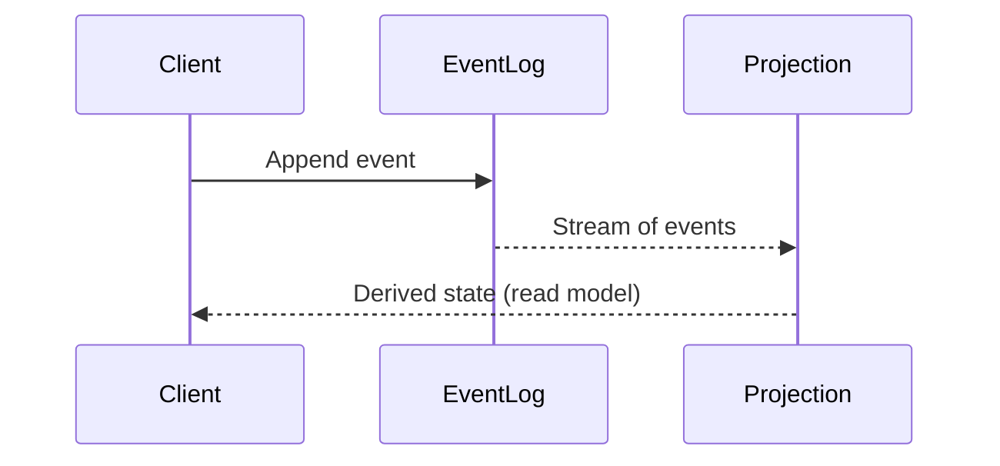
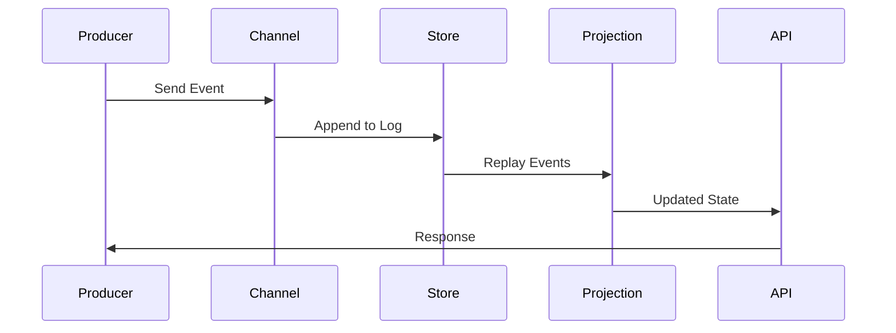

# Event-Sourcing in Rust with Async Streams and RocksDB

**Objective**: Build a high-performance event-sourcing engine that treats the log as the source of truth. When you need audit trails, when you want to replay history, when you're building systems where state is derived from events—event sourcing becomes your weapon of choice.

Event sourcing flips persistence—don't store the final state, store every event. State is a derived view. This tutorial shows you how to wield event sourcing with the precision of a provocative systems engineer, covering everything from async event ingestion to high-performance projections and benchmarking.

## 0) Prerequisites (Read Once, Live by Them)

### The Five Commandments

1. **Understand event sourcing principles**
   - Events capture intent, not just state changes
   - Log is the source of truth, state is derived
   - Immutable append-only event streams
   - Projections rebuild state from events

2. **Master async Rust patterns**
   - Tokio async runtime and channels
   - Backpressure handling with bounded channels
   - Concurrent event processing
   - Stream processing and aggregation

3. **Know your storage patterns**
   - RocksDB for high-performance persistence
   - Serialization formats and performance trade-offs
   - Event ordering and consistency
   - Snapshot strategies for performance

4. **Validate everything**
   - Benchmark event ingestion throughput
   - Test projection convergence
   - Verify event replay correctness
   - Measure latency and memory usage

5. **Plan for production**
   - Distributed event stores and sharding
   - Event versioning and schema evolution
   - Monitoring and observability
   - Backup and disaster recovery

**Why These Principles**: Event sourcing requires understanding both domain modeling and system architecture patterns. Understanding these patterns prevents data loss and enables scalable event-driven systems.

## 1) Event-Sourcing Primer

### Event-Sourcing vs CRUD



**Why Event Sourcing Matters**: Events capture business intent and provide complete audit trails. Understanding these patterns prevents data loss and enables temporal queries.

### Core Concepts

```rust
// Traditional CRUD: Update state directly
struct Account {
    id: String,
    balance: i64,
}

impl Account {
    fn deposit(&mut self, amount: i64) {
        self.balance += amount;  // State mutation
    }
}

// Event Sourcing: Capture intent as events
#[derive(Debug, Clone, Serialize, Deserialize)]
enum AccountEvent {
    Opened { account_id: String },
    Deposited { account_id: String, amount: i64 },
    Withdrawn { account_id: String, amount: i64 },
    Closed { account_id: String },
}
```

**Why Event Sourcing Matters**: Events provide complete history, enable replay, and capture business intent. Understanding these patterns prevents data loss and enables temporal analysis.

## 2) Rust Project Setup

### Cargo Configuration

```toml
# Cargo.toml
[package]
name = "event_sourcing"
version = "0.1.0"
edition = "2021"

[dependencies]
tokio = { version = "1.0", features = ["full"] }
serde = { version = "1.0", features = ["derive"] }
serde_json = "1.0"
rocksdb = "0.21"
anyhow = "1.0"
futures = "0.3"
tracing = "0.1"
tracing-subscriber = "0.3"
criterion = { version = "0.5", features = ["html_reports"] }

[dev-dependencies]
criterion = { version = "0.5", features = ["html_reports"] }

[[bench]]
name = "event_ingestion"
harness = false
```

**Why Project Setup Matters**: Proper dependencies enable high-performance event processing and comprehensive testing. Understanding these patterns prevents dependency conflicts and enables efficient development.

### Project Structure

```
event_sourcing/
├── src/
│   ├── lib.rs
│   ├── main.rs
│   ├── events.rs
│   ├── store.rs
│   ├── projections.rs
│   └── benchmarks.rs
├── benches/
│   └── event_ingestion.rs
└── Cargo.toml
```

**Why Structure Matters**: Organized code structure enables maintainability and scalability. Understanding these patterns prevents code chaos and enables team collaboration.

## 3) Defining Events

### Domain Events

```rust
// src/events.rs
use serde::{Serialize, Deserialize};
use std::time::SystemTime;

#[derive(Debug, Clone, Serialize, Deserialize)]
pub struct EventMetadata {
    pub event_id: String,
    pub timestamp: SystemTime,
    pub version: u32,
}

#[derive(Debug, Clone, Serialize, Deserialize)]
pub struct Event<T> {
    pub metadata: EventMetadata,
    pub payload: T,
}

#[derive(Debug, Clone, Serialize, Deserialize)]
pub enum AccountEvent {
    Opened {
        account_id: String,
        initial_balance: i64,
    },
    Deposited {
        account_id: String,
        amount: i64,
        transaction_id: String,
    },
    Withdrawn {
        account_id: String,
        amount: i64,
        transaction_id: String,
    },
    Transferred {
        from_account: String,
        to_account: String,
        amount: i64,
        transaction_id: String,
    },
    Closed {
        account_id: String,
        reason: String,
    },
}

impl AccountEvent {
    pub fn account_id(&self) -> &str {
        match self {
            AccountEvent::Opened { account_id, .. } => account_id,
            AccountEvent::Deposited { account_id, .. } => account_id,
            AccountEvent::Withdrawn { account_id, .. } => account_id,
            AccountEvent::Transferred { from_account, .. } => from_account,
            AccountEvent::Closed { account_id, .. } => account_id,
        }
    }
}
```

**Why Domain Events Matter**: Events capture business intent and provide complete audit trails. Understanding these patterns prevents data loss and enables business analysis.

### Event Serialization

```rust
// src/events.rs (continued)
use serde_json;
use std::collections::HashMap;

pub trait EventStore {
    fn append_event(&self, event: Event<AccountEvent>) -> anyhow::Result<u64>;
    fn get_events(&self, account_id: &str) -> anyhow::Result<Vec<Event<AccountEvent>>>;
    fn get_all_events(&self) -> anyhow::Result<Vec<Event<AccountEvent>>>;
}

// Event versioning for schema evolution
#[derive(Debug, Clone, Serialize, Deserialize)]
pub enum VersionedAccountEvent {
    V1(AccountEvent),
    V2(AccountEventV2),
}

#[derive(Debug, Clone, Serialize, Deserialize)]
pub enum AccountEventV2 {
    Opened {
        account_id: String,
        initial_balance: i64,
        currency: String,
    },
    // ... other events with new fields
}
```

**Why Event Versioning Matters**: Schema evolution enables system growth while maintaining backward compatibility. Understanding these patterns prevents breaking changes and enables system evolution.

## 4) Event Store with RocksDB

### RocksDB Implementation

```rust
// src/store.rs
use rocksdb::{DB, Options, IteratorMode};
use serde_json;
use std::path::Path;
use anyhow::Result;
use crate::events::{Event, AccountEvent, EventStore};

pub struct RocksDBEventStore {
    db: DB,
    next_sequence: u64,
}

impl RocksDBEventStore {
    pub fn new<P: AsRef<Path>>(path: P) -> Result<Self> {
        let mut opts = Options::default();
        opts.create_if_missing(true);
        opts.set_compression_type(rocksdb::DBCompressionType::Lz4);
        opts.set_write_buffer_size(64 * 1024 * 1024); // 64MB
        opts.set_max_write_buffer_number(3);
        
        let db = DB::open(&opts, path)?;
        let next_sequence = Self::get_next_sequence(&db)?;
        
        Ok(Self { db, next_sequence })
    }
    
    fn get_next_sequence(db: &DB) -> Result<u64> {
        let mut iter = db.iterator(IteratorMode::End);
        if let Some((key, _)) = iter.next() {
            let sequence = u64::from_be_bytes(key[0..8].try_into()?);
            Ok(sequence + 1)
        } else {
            Ok(0)
        }
    }
    
    fn sequence_to_key(sequence: u64) -> [u8; 8] {
        sequence.to_be_bytes()
    }
}

impl EventStore for RocksDBEventStore {
    fn append_event(&mut self, event: Event<AccountEvent>) -> Result<u64> {
        let sequence = self.next_sequence;
        let key = Self::sequence_to_key(sequence);
        let value = serde_json::to_vec(&event)?;
        
        self.db.put(key, value)?;
        self.next_sequence += 1;
        
        Ok(sequence)
    }
    
    fn get_events(&self, account_id: &str) -> Result<Vec<Event<AccountEvent>>> {
        let mut events = Vec::new();
        
        for item in self.db.iterator(IteratorMode::Start) {
            let (_, value) = item?;
            let event: Event<AccountEvent> = serde_json::from_slice(&value)?;
            
            if event.payload.account_id() == account_id {
                events.push(event);
            }
        }
        
        Ok(events)
    }
    
    fn get_all_events(&self) -> Result<Vec<Event<AccountEvent>>> {
        let mut events = Vec::new();
        
        for item in self.db.iterator(IteratorMode::Start) {
            let (_, value) = item?;
            let event: Event<AccountEvent> = serde_json::from_slice(&value)?;
            events.push(event);
        }
        
        Ok(events)
    }
}
```

**Why RocksDB Matters**: RocksDB provides high-performance persistence with excellent write throughput and compression. Understanding these patterns prevents storage bottlenecks and enables scalable event stores.

### Event Store with Snapshots

```rust
// src/store.rs (continued)
use std::collections::HashMap;
use serde::{Serialize, Deserialize};

#[derive(Debug, Clone, Serialize, Deserialize)]
pub struct Snapshot {
    pub sequence: u64,
    pub timestamp: SystemTime,
    pub state: HashMap<String, i64>, // account_id -> balance
}

impl RocksDBEventStore {
    pub fn create_snapshot(&self) -> Result<Snapshot> {
        let mut state = HashMap::new();
        let mut last_sequence = 0;
        let mut last_timestamp = SystemTime::UNIX_EPOCH;
        
        for item in self.db.iterator(IteratorMode::Start) {
            let (key, value) = item?;
            let sequence = u64::from_be_bytes(key[0..8].try_into()?);
            let event: Event<AccountEvent> = serde_json::from_slice(&value)?;
            
            // Replay events into state
            match &event.payload {
                AccountEvent::Opened { account_id, initial_balance } => {
                    state.insert(account_id.clone(), *initial_balance);
                }
                AccountEvent::Deposited { account_id, amount, .. } => {
                    *state.entry(account_id.clone()).or_default() += amount;
                }
                AccountEvent::Withdrawn { account_id, amount, .. } => {
                    *state.entry(account_id.clone()).or_default() -= amount;
                }
                AccountEvent::Transferred { from_account, to_account, amount, .. } => {
                    *state.entry(from_account.clone()).or_default() -= amount;
                    *state.entry(to_account.clone()).or_default() += amount;
                }
                AccountEvent::Closed { .. } => {
                    // Handle account closure
                }
            }
            
            last_sequence = sequence;
            last_timestamp = event.metadata.timestamp;
        }
        
        Ok(Snapshot {
            sequence: last_sequence,
            timestamp: last_timestamp,
            state,
        })
    }
    
    pub fn save_snapshot(&self, snapshot: &Snapshot) -> Result<()> {
        let key = b"snapshot";
        let value = serde_json::to_vec(snapshot)?;
        self.db.put(key, value)?;
        Ok(())
    }
    
    pub fn load_snapshot(&self) -> Result<Option<Snapshot>> {
        if let Some(value) = self.db.get(b"snapshot")? {
            let snapshot: Snapshot = serde_json::from_slice(&value)?;
            Ok(Some(snapshot))
        } else {
            Ok(None)
        }
    }
}
```

**Why Snapshots Matter**: Snapshots enable fast recovery and reduce replay time for large event stores. Understanding these patterns prevents performance degradation and enables efficient state reconstruction.

## 5) Async Event Ingestion

### Async Event Processing

```rust
// src/main.rs
use tokio::sync::mpsc;
use tokio::time::{Duration, Instant};
use std::sync::Arc;
use anyhow::Result;
use tracing::{info, error};
use crate::events::{Event, AccountEvent, EventMetadata};
use crate::store::RocksDBEventStore;

#[tokio::main]
async fn main() -> Result<()> {
    tracing_subscriber::fmt::init();
    
    let (tx, mut rx) = mpsc::channel::<Event<AccountEvent>>(1000);
    let store = Arc::new(tokio::sync::Mutex::new(
        RocksDBEventStore::new("events.db")?
    ));
    
    // Event producers
    let producer_handle = tokio::spawn(async move {
        let mut event_id = 0;
        let mut account_id = 0;
        
        for i in 0..10000 {
            let event = Event {
                metadata: EventMetadata {
                    event_id: format!("evt_{}", event_id),
                    timestamp: SystemTime::now(),
                    version: 1,
                },
                payload: match i % 4 {
                    0 => AccountEvent::Opened {
                        account_id: format!("acc_{}", account_id),
                        initial_balance: 1000,
                    },
                    1 => AccountEvent::Deposited {
                        account_id: format!("acc_{}", account_id),
                        amount: 100,
                        transaction_id: format!("txn_{}", i),
                    },
                    2 => AccountEvent::Withdrawn {
                        account_id: format!("acc_{}", account_id),
                        amount: 50,
                        transaction_id: format!("txn_{}", i),
                    },
                    _ => AccountEvent::Transferred {
                        from_account: format!("acc_{}", account_id),
                        to_account: format!("acc_{}", account_id + 1),
                        amount: 25,
                        transaction_id: format!("txn_{}", i),
                    },
                },
            };
            
            if let Err(e) = tx.send(event).await {
                error!("Failed to send event: {}", e);
                break;
            }
            
            event_id += 1;
            if i % 100 == 0 {
                account_id += 1;
            }
        }
        
        info!("Producer finished");
    });
    
    // Event consumer
    let consumer_handle = tokio::spawn(async move {
        let mut processed = 0;
        let start = Instant::now();
        
        while let Some(event) = rx.recv().await {
            let mut store = store.lock().await;
            if let Err(e) = store.append_event(event) {
                error!("Failed to store event: {}", e);
                continue;
            }
            
            processed += 1;
            if processed % 1000 == 0 {
                let elapsed = start.elapsed();
                let rate = processed as f64 / elapsed.as_secs_f64();
                info!("Processed {} events at {:.2} events/sec", processed, rate);
            }
        }
        
        let elapsed = start.elapsed();
        let rate = processed as f64 / elapsed.as_secs_f64();
        info!("Final: {} events in {:?} at {:.2} events/sec", processed, elapsed, rate);
    });
    
    // Wait for completion
    let _ = tokio::join!(producer_handle, consumer_handle);
    
    Ok(())
}
```

**Why Async Ingestion Matters**: Async processing enables high-throughput event ingestion with backpressure control. Understanding these patterns prevents blocking and enables scalable event processing.

### Backpressure Handling

```rust
// src/main.rs (continued)
use tokio::sync::mpsc::error::TrySendError;

async fn handle_backpressure(
    tx: &mpsc::Sender<Event<AccountEvent>>,
    event: Event<AccountEvent>,
) -> Result<()> {
    match tx.try_send(event) {
        Ok(_) => Ok(()),
        Err(TrySendError::Full(event)) => {
            // Channel is full, wait a bit and retry
            tokio::time::sleep(Duration::from_millis(10)).await;
            tx.send(event).await?;
            Ok(())
        }
        Err(TrySendError::Closed(_)) => {
            Err(anyhow::anyhow!("Channel closed"))
        }
    }
}

// Bounded channel with backpressure
let (tx, mut rx) = mpsc::channel::<Event<AccountEvent>>(1000);

// Producer with backpressure handling
tokio::spawn(async move {
    for i in 0..10000 {
        let event = create_test_event(i);
        
        if let Err(e) = handle_backpressure(&tx, event).await {
            error!("Failed to send event: {}", e);
            break;
        }
        
        // Rate limiting
        if i % 100 == 0 {
            tokio::time::sleep(Duration::from_millis(1)).await;
        }
    }
});
```

**Why Backpressure Matters**: Proper backpressure handling prevents memory exhaustion and enables stable event processing. Understanding these patterns prevents system overload and enables reliable event ingestion.

## 6) Event Replay → State Projection

### Projection Engine

```rust
// src/projections.rs
use std::collections::HashMap;
use anyhow::Result;
use crate::events::{Event, AccountEvent};
use crate::store::RocksDBEventStore;

#[derive(Debug, Clone)]
pub struct AccountBalance {
    pub account_id: String,
    pub balance: i64,
    pub last_updated: SystemTime,
}

#[derive(Debug, Clone)]
pub struct AccountProjection {
    pub balances: HashMap<String, AccountBalance>,
    pub total_accounts: usize,
    pub total_balance: i64,
}

impl AccountProjection {
    pub fn new() -> Self {
        Self {
            balances: HashMap::new(),
            total_accounts: 0,
            total_balance: 0,
        }
    }
    
    pub fn apply_event(&mut self, event: &Event<AccountEvent>) {
        match &event.payload {
            AccountEvent::Opened { account_id, initial_balance } => {
                self.balances.insert(account_id.clone(), AccountBalance {
                    account_id: account_id.clone(),
                    balance: *initial_balance,
                    last_updated: event.metadata.timestamp,
                });
                self.total_accounts += 1;
                self.total_balance += initial_balance;
            }
            AccountEvent::Deposited { account_id, amount, .. } => {
                if let Some(balance) = self.balances.get_mut(account_id) {
                    balance.balance += amount;
                    balance.last_updated = event.metadata.timestamp;
                    self.total_balance += amount;
                }
            }
            AccountEvent::Withdrawn { account_id, amount, .. } => {
                if let Some(balance) = self.balances.get_mut(account_id) {
                    balance.balance -= amount;
                    balance.last_updated = event.metadata.timestamp;
                    self.total_balance -= amount;
                }
            }
            AccountEvent::Transferred { from_account, to_account, amount, .. } => {
                if let Some(from_balance) = self.balances.get_mut(from_account) {
                    from_balance.balance -= amount;
                    from_balance.last_updated = event.metadata.timestamp;
                }
                if let Some(to_balance) = self.balances.get_mut(to_account) {
                    to_balance.balance += amount;
                    to_balance.last_updated = event.metadata.timestamp;
                }
            }
            AccountEvent::Closed { account_id, .. } => {
                if let Some(balance) = self.balances.remove(account_id) {
                    self.total_accounts -= 1;
                    self.total_balance -= balance.balance;
                }
            }
        }
    }
    
    pub fn get_balance(&self, account_id: &str) -> Option<i64> {
        self.balances.get(account_id).map(|b| b.balance)
    }
    
    pub fn get_all_balances(&self) -> &HashMap<String, AccountBalance> {
        &self.balances
    }
}

impl RocksDBEventStore {
    pub fn replay_into_projection(&self) -> Result<AccountProjection> {
        let mut projection = AccountProjection::new();
        
        for item in self.db.iterator(IteratorMode::Start) {
            let (_, value) = item?;
            let event: Event<AccountEvent> = serde_json::from_slice(&value)?;
            projection.apply_event(&event);
        }
        
        Ok(projection)
    }
    
    pub fn replay_from_sequence(&self, from_sequence: u64) -> Result<AccountProjection> {
        let mut projection = AccountProjection::new();
        
        for item in self.db.iterator(IteratorMode::Start) {
            let (key, value) = item?;
            let sequence = u64::from_be_bytes(key[0..8].try_into()?);
            
            if sequence >= from_sequence {
                let event: Event<AccountEvent> = serde_json::from_slice(&value)?;
                projection.apply_event(&event);
            }
        }
        
        Ok(projection)
    }
}
```

**Why Projections Matter**: Projections rebuild state from events and provide fast read access. Understanding these patterns prevents state inconsistencies and enables efficient queries.

### Streaming Projections

```rust
// src/projections.rs (continued)
use tokio::sync::mpsc;
use futures::StreamExt;

pub struct StreamingProjection {
    projection: AccountProjection,
    tx: mpsc::Sender<AccountProjection>,
}

impl StreamingProjection {
    pub fn new() -> (Self, mpsc::Receiver<AccountProjection>) {
        let (tx, rx) = mpsc::channel(100);
        let projection = AccountProjection::new();
        
        (Self { projection, tx }, rx)
    }
    
    pub async fn apply_event(&mut self, event: &Event<AccountEvent>) -> Result<()> {
        self.projection.apply_event(event);
        
        // Send updated projection to subscribers
        if let Err(_) = self.tx.try_send(self.projection.clone()) {
            // Channel is full, skip this update
        }
        
        Ok(())
    }
}

// Async projection streaming
pub async fn stream_projection_updates(
    mut event_rx: mpsc::Receiver<Event<AccountEvent>>,
    mut projection: StreamingProjection,
) -> Result<()> {
    while let Some(event) = event_rx.recv().await {
        projection.apply_event(&event).await?;
    }
    Ok(())
}
```

**Why Streaming Projections Matter**: Real-time projections enable immediate state updates and event-driven architectures. Understanding these patterns prevents stale data and enables responsive systems.

## 7) Performance Benchmarking

### Benchmarking Framework

```rust
// benches/event_ingestion.rs
use criterion::{criterion_group, criterion_main, Criterion, BenchmarkId};
use event_sourcing::*;
use std::time::Duration;
use tempfile::TempDir;

fn benchmark_event_ingestion(c: &mut Criterion) {
    let mut group = c.benchmark_group("event_ingestion");
    group.measurement_time(Duration::from_secs(10));
    
    for size in [1000, 10000, 100000].iter() {
        group.bench_with_input(BenchmarkId::new("rocksdb", size), size, |b, &size| {
            b.iter(|| {
                let temp_dir = TempDir::new().unwrap();
                let store = RocksDBEventStore::new(temp_dir.path()).unwrap();
                
                for i in 0..size {
                    let event = create_test_event(i);
                    store.append_event(event).unwrap();
                }
            });
        });
    }
    
    group.finish();
}

fn benchmark_serialization_formats(c: &mut Criterion) {
    let mut group = c.benchmark_group("serialization");
    
    let event = create_test_event(0);
    
    group.bench_function("json", |b| {
        b.iter(|| {
            serde_json::to_vec(&event).unwrap()
        });
    });
    
    group.bench_function("cbor", |b| {
        b.iter(|| {
            serde_cbor::to_vec(&event).unwrap()
        });
    });
    
    group.finish();
}

fn benchmark_projection_replay(c: &mut Criterion) {
    let mut group = c.benchmark_group("projection_replay");
    
    for size in [1000, 10000, 100000].iter() {
        group.bench_with_input(BenchmarkId::new("replay", size), size, |b, &size| {
            let temp_dir = TempDir::new().unwrap();
            let mut store = RocksDBEventStore::new(temp_dir.path()).unwrap();
            
            // Pre-populate with events
            for i in 0..size {
                let event = create_test_event(i);
                store.append_event(event).unwrap();
            }
            
            b.iter(|| {
                store.replay_into_projection().unwrap()
            });
        });
    }
    
    group.finish();
}

criterion_group!(
    benches,
    benchmark_event_ingestion,
    benchmark_serialization_formats,
    benchmark_projection_replay
);
criterion_main!(benches);
```

**Why Benchmarking Matters**: Performance measurement enables optimization and capacity planning. Understanding these patterns prevents performance bottlenecks and enables scalable systems.

### Throughput Measurement

```rust
// src/benchmarks.rs
use std::time::{Duration, Instant};
use anyhow::Result;

pub struct ThroughputBenchmark {
    start: Instant,
    events_processed: u64,
}

impl ThroughputBenchmark {
    pub fn new() -> Self {
        Self {
            start: Instant::now(),
            events_processed: 0,
        }
    }
    
    pub fn record_event(&mut self) {
        self.events_processed += 1;
    }
    
    pub fn get_throughput(&self) -> f64 {
        let elapsed = self.start.elapsed().as_secs_f64();
        self.events_processed as f64 / elapsed
    }
    
    pub fn get_events_per_second(&self) -> u64 {
        self.get_throughput() as u64
    }
    
    pub fn get_mb_per_second(&self, avg_event_size: usize) -> f64 {
        let bytes_per_second = self.get_throughput() * avg_event_size as f64;
        bytes_per_second / (1024.0 * 1024.0)
    }
}

// Async throughput measurement
pub async fn measure_async_throughput(
    mut event_rx: tokio::sync::mpsc::Receiver<Event<AccountEvent>>,
    mut store: RocksDBEventStore,
) -> Result<ThroughputBenchmark> {
    let mut benchmark = ThroughputBenchmark::new();
    let mut last_report = Instant::now();
    
    while let Some(event) = event_rx.recv().await {
        store.append_event(event)?;
        benchmark.record_event();
        
        // Report every 5 seconds
        if last_report.elapsed() >= Duration::from_secs(5) {
            let throughput = benchmark.get_throughput();
            println!("Throughput: {:.2} events/sec", throughput);
            last_report = Instant::now();
        }
    }
    
    Ok(benchmark)
}
```

**Why Throughput Measurement Matters**: Accurate performance measurement enables optimization and capacity planning. Understanding these patterns prevents performance bottlenecks and enables scalable systems.

## 8) Mermaid Architecture Diagram

```mermaid
flowchart LR
    A[Producers] -->|async mpsc| B[Event Store (RocksDB)]
    B -->|iterator replay| C[Projection: Account Balances]
    C --> D[API/Client Reads]
    
    E[Snapshot] -->|fast recovery| C
    B -->|periodic| E
    
    F[Sharding] -->|partition| B
    G[Replication] -->|backup| B
```

**Why Architecture Diagrams Matter**: Visual architecture enables understanding of system components and data flow. Understanding these patterns prevents design confusion and enables system optimization.

### Data Flow Diagram



**Why Data Flow Matters**: Understanding event flow enables optimization and debugging. Understanding these patterns prevents data inconsistencies and enables efficient processing.

## 9) Extensions

### Distributed Event Store

```rust
// src/distributed.rs
use std::collections::HashMap;
use anyhow::Result;

pub struct ShardedEventStore {
    shards: HashMap<u32, RocksDBEventStore>,
    shard_count: u32,
}

impl ShardedEventStore {
    pub fn new(shard_count: u32, base_path: &str) -> Result<Self> {
        let mut shards = HashMap::new();
        
        for i in 0..shard_count {
            let path = format!("{}/shard_{}", base_path, i);
            let store = RocksDBEventStore::new(&path)?;
            shards.insert(i, store);
        }
        
        Ok(Self { shards, shard_count })
    }
    
    fn get_shard(&self, account_id: &str) -> u32 {
        use std::collections::hash_map::DefaultHasher;
        use std::hash::{Hash, Hasher};
        
        let mut hasher = DefaultHasher::new();
        account_id.hash(&mut hasher);
        hasher.finish() as u32 % self.shard_count
    }
    
    pub fn append_event(&mut self, event: Event<AccountEvent>) -> Result<u64> {
        let shard_id = self.get_shard(event.payload.account_id());
        let store = self.shards.get_mut(&shard_id).unwrap();
        store.append_event(event)
    }
}
```

**Why Sharding Matters**: Sharding enables horizontal scaling and reduces contention. Understanding these patterns prevents bottlenecks and enables distributed systems.

### Event Sourcing with Kafka

```rust
// src/kafka.rs
use rdkafka::producer::{FutureProducer, FutureRecord};
use rdkafka::consumer::{Consumer, StreamConsumer};
use rdkafka::Message;

pub struct KafkaEventStore {
    producer: FutureProducer,
    consumer: StreamConsumer,
    topic: String,
}

impl KafkaEventStore {
    pub fn new(brokers: &str, topic: &str) -> Result<Self> {
        let producer: FutureProducer = ClientConfig::new()
            .set("bootstrap.servers", brokers)
            .set("message.timeout.ms", "5000")
            .create()?;
            
        let consumer: StreamConsumer = ClientConfig::new()
            .set("group.id", "event-sourcing")
            .set("bootstrap.servers", brokers)
            .set("enable.partition.eof", "false")
            .set("session.timeout.ms", "6000")
            .set("enable.auto.commit", "true")
            .create()?;
            
        consumer.subscribe(&[topic])?;
        
        Ok(Self {
            producer,
            consumer,
            topic: topic.to_string(),
        })
    }
    
    pub async fn append_event(&self, event: Event<AccountEvent>) -> Result<u64> {
        let payload = serde_json::to_vec(&event)?;
        let record = FutureRecord::to(&self.topic)
            .key(event.payload.account_id())
            .payload(&payload);
            
        let (partition, offset) = self.producer.send(record, Duration::from_secs(0)).await?;
        Ok(offset)
    }
    
    pub async fn stream_events(&self) -> Result<impl Stream<Item = Event<AccountEvent>>> {
        let stream = self.consumer.stream()
            .filter_map(|result| async {
                match result {
                    Ok(message) => {
                        let payload = message.payload()?;
                        serde_json::from_slice(payload).ok()
                    }
                    Err(e) => {
                        eprintln!("Error receiving message: {}", e);
                        None
                    }
                }
            });
            
        Ok(stream)
    }
}
```

**Why Kafka Integration Matters**: Kafka enables distributed event streaming and provides durability guarantees. Understanding these patterns prevents data loss and enables scalable event processing.

## 10) Best Practices

### Event Sourcing Best Practices

```rust
// src/best_practices.rs
use std::collections::HashMap;
use anyhow::Result;

pub struct EventSourcingBestPractices {
    // Immutable events
    pub events_are_immutable: bool,
    
    // Event versioning
    pub event_versioning: bool,
    
    // Snapshot strategy
    pub snapshot_frequency: u64,
    
    // Performance optimization
    pub batch_size: usize,
    pub compression_enabled: bool,
}

impl EventSourcingBestPractices {
    pub fn new() -> Self {
        Self {
            events_are_immutable: true,
            event_versioning: true,
            snapshot_frequency: 1000, // Every 1000 events
            batch_size: 100,
            compression_enabled: true,
        }
    }
    
    pub fn optimize_for_throughput(&mut self) {
        self.batch_size = 1000;
        self.compression_enabled = true;
        self.snapshot_frequency = 10000;
    }
    
    pub fn optimize_for_latency(&mut self) {
        self.batch_size = 1;
        self.compression_enabled = false;
        self.snapshot_frequency = 100;
    }
}

// Event schema evolution
pub trait EventSchemaEvolution {
    fn migrate_event(&self, event: &[u8], from_version: u32, to_version: u32) -> Result<Vec<u8>>;
    fn is_compatible(&self, from_version: u32, to_version: u32) -> bool;
}

// Performance monitoring
pub struct EventSourcingMetrics {
    pub events_per_second: f64,
    pub average_event_size: usize,
    pub storage_used: u64,
    pub projection_lag: Duration,
}

impl EventSourcingMetrics {
    pub fn new() -> Self {
        Self {
            events_per_second: 0.0,
            average_event_size: 0,
            storage_used: 0,
            projection_lag: Duration::from_secs(0),
        }
    }
    
    pub fn update(&mut self, events_processed: u64, elapsed: Duration, storage_size: u64) {
        self.events_per_second = events_processed as f64 / elapsed.as_secs_f64();
        self.storage_used = storage_size;
    }
}
```

**Why Best Practices Matter**: Proper event sourcing patterns prevent data corruption and enable scalable systems. Understanding these patterns prevents common pitfalls and enables reliable event-driven architectures.

### Error Handling and Recovery

```rust
// src/error_handling.rs
use anyhow::Result;
use std::time::Duration;

pub enum EventSourcingError {
    EventStoreFull,
    SerializationError,
    NetworkError,
    ConsistencyError,
}

impl EventSourcingError {
    pub fn is_retryable(&self) -> bool {
        match self {
            EventSourcingError::EventStoreFull => true,
            EventSourcingError::NetworkError => true,
            _ => false,
        }
    }
    
    pub fn retry_delay(&self) -> Duration {
        match self {
            EventSourcingError::EventStoreFull => Duration::from_secs(1),
            EventSourcingError::NetworkError => Duration::from_millis(100),
            _ => Duration::from_secs(0),
        }
    }
}

// Retry mechanism
pub async fn retry_operation<F, T>(operation: F, max_retries: u32) -> Result<T>
where
    F: Fn() -> Result<T>,
{
    let mut retries = 0;
    
    loop {
        match operation() {
            Ok(result) => return Ok(result),
            Err(e) => {
                if retries >= max_retries {
                    return Err(e);
                }
                
                retries += 1;
                tokio::time::sleep(Duration::from_millis(100 * retries)).await;
            }
        }
    }
}
```

**Why Error Handling Matters**: Proper error handling prevents data loss and enables system recovery. Understanding these patterns prevents system failures and enables reliable event processing.

## 11) TL;DR Runbook

### Essential Commands

```bash
# Create new Rust project
cargo new event_sourcing
cd event_sourcing

# Add dependencies
cargo add tokio serde serde_json rocksdb anyhow futures

# Run the application
cargo run

# Run benchmarks
cargo bench

# Run tests
cargo test
```

### Essential Patterns

```rust
// Essential event sourcing patterns
event_sourcing_patterns = {
    "events": "Capture business intent, not state changes",
    "log": "Append-only event store (RocksDB, Kafka)",
    "projections": "Rebuild state from events",
    "snapshots": "Periodic state snapshots for performance",
    "versioning": "Event schema evolution",
    "monitoring": "Track throughput, latency, and consistency"
}
```

### Quick Reference

```rust
// Essential event sourcing operations
// 1. Define events
enum AccountEvent { Opened { id: String }, Deposited { amount: i64 } }

// 2. Store events
store.append_event(event).await?;

// 3. Replay events
let projection = store.replay_into_projection()?;

// 4. Create snapshots
let snapshot = store.create_snapshot()?;

// 5. Monitor performance
let throughput = benchmark.get_throughput();
```

**Why This Runbook**: These patterns cover 90% of event sourcing needs. Master these before exploring advanced features.

## 12) The Machine's Summary

Event sourcing requires understanding both domain modeling and system architecture patterns. When used correctly, event sourcing enables complete audit trails, temporal queries, and scalable event-driven systems. The key is understanding event modeling, mastering async processing, and following performance best practices.

**The Dark Truth**: Without proper event sourcing understanding, your system is fragile and unreliable. Event sourcing is your weapon. Use it wisely.

**The Machine's Mantra**: "In events we trust, in projections we build, and in the log we find the path to temporal truth."

**Why This Matters**: Event sourcing enables efficient temporal data processing that can handle complex business scenarios, maintain complete audit trails, and provide reliable event-driven architectures while ensuring performance and scalability.

---

*This tutorial provides the complete machinery for event sourcing in Rust. The patterns scale from simple event storage to complex distributed systems, from basic projections to advanced streaming architectures.*
