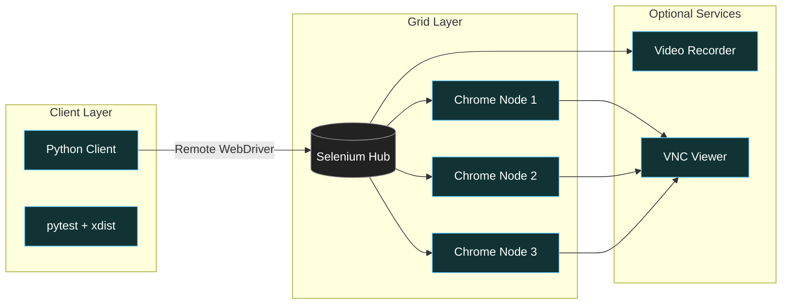

# Selenium Grid in Docker Compose with ChromeDriver (Headless) + Python

**Objective**: Stand up a Selenium cluster locally, then drive it from Python like a tiny cloud. Scale workers, add video when you need proof, keep everything reproducible.

Stand up a Selenium cluster locally, then drive it from Python like a tiny cloud. Scale workers, add video when you need proof, keep everything reproducible.

## 0) Prerequisites (Read Once, Live by Them)

### The Five Commandments

1. **Never ignore resource limits**
   - Set shm_size to 2gb minimum
   - Limit sessions per node to 1
   - Scale by containers, not sessions
   - Monitor memory usage

2. **Master explicit waits**
   - Use WebDriverWait with expected_conditions
   - Set reasonable timeouts
   - Avoid fixed sleeps
   - Capture screenshots on failure

3. **Understand Grid architecture**
   - Hub schedules sessions
   - Nodes run Chrome/ChromeDriver
   - Horizontal scale = faster suites
   - Network isolation matters

4. **Plan for production**
   - Use headless=new mode
   - Set deterministic window sizes
   - Configure download directories
   - Implement retry logic

5. **Monitor and debug**
   - Use video recording for flaky tests
   - Enable VNC for live debugging
   - Log everything
   - Health check the Grid

**Why These Principles**: Selenium Grid requires understanding resource management, explicit waits, and scaling patterns. Understanding these patterns prevents test flakiness and enables reliable automation.

## 1) Architecture Diagram

### Selenium Grid Flow



**Why Architecture Matters**: Understanding Grid architecture enables efficient test distribution and resource management. Understanding these patterns prevents test chaos and enables reliable automation.

## 2) Docker Compose Setup

### Complete Docker Compose Configuration

```yaml
# docker-compose.yml
version: "3.9"

services:
  # Selenium Hub - schedules sessions
  selenium-hub:
    image: selenium/hub:4.22.0
    container_name: selenium-hub
    ports:
      - "4442:4442"  # Grid Router
      - "4443:4443"  # Event Bus
      - "4444:4444"  # Grid UI
    environment:
      - SE_OPTS=--log-level INFO
      - SE_SESSION_REQUEST_TIMEOUT=300
      - SE_SESSION_RETRY_INTERVAL=5
    healthcheck:
      test: ["CMD", "curl", "-f", "http://localhost:4444/status"]
      interval: 30s
      timeout: 10s
      retries: 3
      start_period: 10s
    restart: unless-stopped

  # Chrome nodes - run actual tests
  chrome:
    image: selenium/node-chrome:124.0
    shm_size: 2gb  # Critical: prevents Chrome OOM crashes
    depends_on:
      selenium-hub:
        condition: service_healthy
    environment:
      - SE_EVENT_BUS_HOST=selenium-hub
      - SE_EVENT_BUS_PUBLISH_PORT=4442
      - SE_EVENT_BUS_SUBSCRIBE_PORT=4443
      - SE_NODE_MAX_SESSIONS=1  # 1 session per container for stability
      - SE_NODE_SESSION_TIMEOUT=300
      - SE_NODE_SESSION_QUEUE_TIMEOUT=300
      - START_XVFB=false  # New headless mode doesn't need Xvfb
      - SE_NODE_OVERRIDE_MAX_SESSIONS=true
    deploy:
      replicas: 3  # Start with 3 workers
    restart: unless-stopped

  # Optional: Video recording for debugging
  video:
    image: selenium/video:ffmpeg-7.0-20240427
    profiles: ["video"]
    shm_size: 1gb
    environment:
      - DISPLAY_CONTAINER_NAME=chrome
      - FILE_NAME=selenium-session-{sessionId}
    volumes:
      - ./videos:/videos
    depends_on:
      - selenium-hub
    restart: unless-stopped

  # Optional: VNC for live debugging
  chrome-vnc:
    image: selenium/node-chrome:124.0
    profiles: ["vnc"]
    shm_size: 2gb
    ports:
      - "5900:5900"  # VNC port
    environment:
      - SE_EVENT_BUS_HOST=selenium-hub
      - SE_EVENT_BUS_PUBLISH_PORT=4442
      - SE_EVENT_BUS_SUBSCRIBE_PORT=4443
      - SE_NODE_MAX_SESSIONS=1
      - SE_NODE_SESSION_TIMEOUT=300
      - START_XVFB=false
      - SE_VNC_NO_PASSWORD=1
      - SE_VNC_VIEW_ONLY=0
    depends_on:
      selenium-hub:
        condition: service_healthy
    restart: unless-stopped

networks:
  default:
    name: selenium-grid
    driver: bridge

volumes:
  videos:
    driver: local
```

**Why Docker Compose Matters**: Orchestrated Selenium Grid enables scalable test execution and resource management. Understanding these patterns prevents test chaos and enables reliable automation.

### Production Docker Compose

```yaml
# docker-compose.prod.yml
version: "3.9"

services:
  selenium-hub:
    image: selenium/hub:4.22.0
    container_name: selenium-hub-prod
    ports:
      - "4444:4444"
    environment:
      - SE_OPTS=--log-level WARN --session-request-timeout 300
      - SE_SESSION_REQUEST_TIMEOUT=300
      - SE_SESSION_RETRY_INTERVAL=5
      - SE_DISTRIBUTOR_HOST=selenium-hub
      - SE_DISTRIBUTOR_PORT=4442
      - SE_DISTRIBUTOR_EVENTS_PORT=4443
    healthcheck:
      test: ["CMD", "curl", "-f", "http://localhost:4444/status"]
      interval: 15s
      timeout: 5s
      retries: 3
    restart: unless-stopped
    deploy:
      resources:
        limits:
          memory: 512M
        reservations:
          memory: 256M

  chrome:
    image: selenium/node-chrome:124.0
    shm_size: 2gb
    environment:
      - SE_EVENT_BUS_HOST=selenium-hub
      - SE_EVENT_BUS_PUBLISH_PORT=4442
      - SE_EVENT_BUS_SUBSCRIBE_PORT=4443
      - SE_NODE_MAX_SESSIONS=1
      - SE_NODE_SESSION_TIMEOUT=300
      - SE_NODE_SESSION_QUEUE_TIMEOUT=300
      - START_XVFB=false
      - SE_NODE_OVERRIDE_MAX_SESSIONS=true
      - SE_NODE_APPLICATION_NAME=chrome-node
    depends_on:
      selenium-hub:
        condition: service_healthy
    restart: unless-stopped
    deploy:
      replicas: 6  # Scale for production
      resources:
        limits:
          memory: 2G
        reservations:
          memory: 1G

networks:
  default:
    name: selenium-grid-prod
    driver: bridge
```

**Why Production Configuration Matters**: Production Selenium Grid requires proper resource limits, health checks, and scaling patterns. Understanding these patterns prevents production chaos and enables reliable test automation.

## 3) Python Client Setup

### Basic Python Client

```python
# client.py
import os
import time
from selenium import webdriver
from selenium.webdriver.chrome.options import Options
from selenium.webdriver.common.by import By
from selenium.webdriver.support.wait import WebDriverWait
from selenium.webdriver.support import expected_conditions as EC
from selenium.common.exceptions import TimeoutException, WebDriverException

GRID_URL = os.getenv("GRID_URL", "http://localhost:4444/wd/hub")

def create_driver():
    """Create a new WebDriver with optimal settings"""
    options = Options()
    
    # Modern headless mode (Chrome 109+)
    options.add_argument("--headless=new")
    options.add_argument("--no-sandbox")
    options.add_argument("--disable-dev-shm-usage")
    options.add_argument("--disable-gpu")
    options.add_argument("--disable-web-security")
    options.add_argument("--disable-features=VizDisplayCompositor")
    options.add_argument("--window-size=1366,768")
    options.add_argument("--user-agent=Mozilla/5.0 (X11; Linux x86_64) AppleWebKit/537.36")
    
    # Performance optimizations
    options.add_argument("--disable-extensions")
    options.add_argument("--disable-plugins")
    options.add_argument("--disable-images")
    options.add_argument("--disable-javascript")
    
    # Create Remote WebDriver
    try:
        driver = webdriver.Remote(
            command_executor=GRID_URL,
            options=options
        )
        
        # Set timeouts
        driver.set_page_load_timeout(30)
        driver.implicitly_wait(10)
        
        return driver
    except WebDriverException as e:
        print(f"Failed to create driver: {e}")
        raise

def demo_test():
    """Basic demo test"""
    driver = None
    try:
        driver = create_driver()
        wait = WebDriverWait(driver, 20)
        
        # Navigate to test page
        driver.get("https://example.org/")
        
        # Wait for page to load
        wait.until(EC.presence_of_element_located((By.TAG_NAME, "h1")))
        
        # Get page title
        title = driver.title
        print(f"Page title: {title}")
        
        # Take screenshot
        screenshot_path = "example_screenshot.png"
        driver.save_screenshot(screenshot_path)
        print(f"Screenshot saved: {screenshot_path}")
        
        # Assert title
        assert "Example Domain" in title, f"Expected 'Example Domain' in title, got: {title}"
        print("✅ Test passed!")
        
    except TimeoutException:
        print("❌ Timeout waiting for element")
        if driver:
            driver.save_screenshot("timeout_error.png")
    except Exception as e:
        print(f"❌ Test failed: {e}")
        if driver:
            driver.save_screenshot("error_screenshot.png")
    finally:
        if driver:
            driver.quit()

if __name__ == "__main__":
    demo_test()
```

**Why Python Client Matters**: Proper WebDriver setup enables reliable test execution and debugging. Understanding these patterns prevents test flakiness and enables effective automation.

### Advanced Python Client

```python
# advanced_client.py
import os
import time
import json
from selenium import webdriver
from selenium.webdriver.chrome.options import Options
from selenium.webdriver.common.by import By
from selenium.webdriver.support.wait import WebDriverWait
from selenium.webdriver.support import expected_conditions as EC
from selenium.webdriver.common.action_chains import ActionChains
from selenium.webdriver.common.keys import Keys
from selenium.common.exceptions import TimeoutException, WebDriverException

class SeleniumGridClient:
    def __init__(self, grid_url=None):
        self.grid_url = grid_url or os.getenv("GRID_URL", "http://localhost:4444/wd/hub")
        self.driver = None
        self.wait = None
    
    def create_driver(self, download_dir="/tmp/downloads"):
        """Create WebDriver with download configuration"""
        options = Options()
        
        # Headless configuration
        options.add_argument("--headless=new")
        options.add_argument("--no-sandbox")
        options.add_argument("--disable-dev-shm-usage")
        options.add_argument("--disable-gpu")
        options.add_argument("--window-size=1366,768")
        
        # Download configuration
        prefs = {
            "download.default_directory": download_dir,
            "download.prompt_for_download": False,
            "download.directory_upgrade": True,
            "safebrowsing.enabled": True,
            "profile.default_content_settings.popups": 0
        }
        options.add_experimental_option("prefs", prefs)
        
        # Create driver
        self.driver = webdriver.Remote(
            command_executor=self.grid_url,
            options=options
        )
        
        # Set timeouts
        self.driver.set_page_load_timeout(30)
        self.driver.implicitly_wait(10)
        
        # Create wait object
        self.wait = WebDriverWait(self.driver, 20)
        
        return self.driver
    
    def navigate_and_wait(self, url, element_locator):
        """Navigate to URL and wait for specific element"""
        try:
            self.driver.get(url)
            element = self.wait.until(EC.presence_of_element_located(element_locator))
            return element
        except TimeoutException:
            self.driver.save_screenshot(f"timeout_{int(time.time())}.png")
            raise
    
    def take_screenshot(self, filename=None):
        """Take screenshot with timestamp"""
        if not filename:
            filename = f"screenshot_{int(time.time())}.png"
        self.driver.save_screenshot(filename)
        return filename
    
    def get_page_info(self):
        """Get comprehensive page information"""
        return {
            "title": self.driver.title,
            "url": self.driver.current_url,
            "window_size": self.driver.get_window_size(),
            "cookies": self.driver.get_cookies(),
            "local_storage": self.driver.execute_script("return localStorage;"),
            "session_storage": self.driver.execute_script("return sessionStorage;")
        }
    
    def close(self):
        """Close driver and cleanup"""
        if self.driver:
            self.driver.quit()

def advanced_demo():
    """Advanced demo with multiple operations"""
    client = SeleniumGridClient()
    
    try:
        # Create driver
        driver = client.create_driver()
        
        # Navigate to test page
        client.navigate_and_wait("https://httpbin.org/", (By.TAG_NAME, "body"))
        
        # Get page info
        info = client.get_page_info()
        print(f"Page info: {json.dumps(info, indent=2)}")
        
        # Take screenshot
        screenshot = client.take_screenshot("advanced_demo.png")
        print(f"Screenshot saved: {screenshot}")
        
        # Test form interaction
        driver.get("https://httpbin.org/forms/post")
        
        # Fill form
        name_field = client.wait.until(EC.presence_of_element_located((By.NAME, "custname")))
        name_field.send_keys("Test User")
        
        email_field = driver.find_element(By.NAME, "custemail")
        email_field.send_keys("test@example.com")
        
        # Submit form
        submit_button = driver.find_element(By.CSS_SELECTOR, "input[type='submit']")
        submit_button.click()
        
        # Wait for response
        client.wait.until(EC.presence_of_element_located((By.TAG_NAME, "pre")))
        
        # Take final screenshot
        client.take_screenshot("form_submission.png")
        print("✅ Advanced demo completed!")
        
    except Exception as e:
        print(f"❌ Advanced demo failed: {e}")
        client.take_screenshot("advanced_demo_error.png")
    finally:
        client.close()

if __name__ == "__main__":
    advanced_demo()
```

**Why Advanced Client Matters**: Sophisticated WebDriver patterns enable complex test scenarios and reliable automation. Understanding these patterns prevents test limitations and enables comprehensive automation.

## 4) Python in Docker Compose

### Test Container Configuration

```yaml
# docker-compose.python.yml
version: "3.9"

services:
  # Python test runner
  tester:
    image: python:3.12-slim
    working_dir: /tests
    command: bash -lc "pip install selenium==4.* pytest==8.* pytest-xdist==3.* && python -m pytest tests/ -v"
    volumes:
      - ./tests:/tests
      - ./downloads:/downloads
    environment:
      - GRID_URL=http://selenium-hub:4444/wd/hub
      - PYTHONUNBUFFERED=1
    depends_on:
      selenium-hub:
        condition: service_healthy
      chrome:
        condition: service_started
    networks:
      - selenium-grid
    restart: "no"

  # Single test execution
  single-test:
    image: python:3.12-slim
    working_dir: /tests
    command: bash -lc "pip install selenium==4.* && python client.py"
    volumes:
      - ./tests:/tests
    environment:
      - GRID_URL=http://selenium-hub:4444/wd/hub
    depends_on:
      selenium-hub:
        condition: service_healthy
    networks:
      - selenium-grid
    restart: "no"

networks:
  selenium-grid:
    external: true
```

**Why Python in Docker Matters**: Containerized test execution enables hermetic runs and CI parity. Understanding these patterns prevents environment chaos and enables reproducible automation.

## 5) Parallel Testing with pytest + xdist

### Test Configuration

```python
# conftest.py
import pytest
import os
from selenium import webdriver
from selenium.webdriver.chrome.options import Options

@pytest.fixture(scope="function")
def driver():
    """Create WebDriver for each test"""
    options = Options()
    options.add_argument("--headless=new")
    options.add_argument("--no-sandbox")
    options.add_argument("--disable-dev-shm-usage")
    options.add_argument("--window-size=1366,768")
    
    driver = webdriver.Remote(
        command_executor=os.getenv("GRID_URL", "http://localhost:4444/wd/hub"),
        options=options
    )
    
    driver.set_page_load_timeout(30)
    driver.implicitly_wait(10)
    
    yield driver
    
    driver.quit()

@pytest.fixture(scope="function")
def wait(driver):
    """Create WebDriverWait for each test"""
    from selenium.webdriver.support.wait import WebDriverWait
    return WebDriverWait(driver, 20)
```

### Test Examples

```python
# tests/test_example.py
import pytest
from selenium.webdriver.common.by import By
from selenium.webdriver.support import expected_conditions as EC

def test_example_domain(driver, wait):
    """Test example.org page"""
    driver.get("https://example.org/")
    
    # Wait for page to load
    h1 = wait.until(EC.presence_of_element_located((By.TAG_NAME, "h1")))
    
    # Assertions
    assert "Example Domain" in driver.title
    assert h1.text == "Example Domain"
    
    # Take screenshot
    driver.save_screenshot("example_domain.png")

def test_httpbin_get(driver, wait):
    """Test httpbin.org GET endpoint"""
    driver.get("https://httpbin.org/get")
    
    # Wait for JSON response
    pre = wait.until(EC.presence_of_element_located((By.TAG_NAME, "pre")))
    
    # Assert JSON contains expected fields
    response_text = pre.text
    assert "origin" in response_text
    assert "headers" in response_text
    
    # Take screenshot
    driver.save_screenshot("httpbin_get.png")

def test_form_submission(driver, wait):
    """Test form submission"""
    driver.get("https://httpbin.org/forms/post")
    
    # Fill form
    name_field = wait.until(EC.presence_of_element_located((By.NAME, "custname")))
    name_field.send_keys("Test User")
    
    email_field = driver.find_element(By.NAME, "custemail")
    email_field.send_keys("test@example.com")
    
    # Submit form
    submit_button = driver.find_element(By.CSS_SELECTOR, "input[type='submit']")
    submit_button.click()
    
    # Wait for response
    response = wait.until(EC.presence_of_element_located((By.TAG_NAME, "pre")))
    
    # Assert response contains form data
    response_text = response.text
    assert "Test User" in response_text
    assert "test@example.com" in response_text
    
    # Take screenshot
    driver.save_screenshot("form_submission.png")

@pytest.mark.parametrize("url,expected_title", [
    ("https://example.org/", "Example Domain"),
    ("https://httpbin.org/", "httpbin.org"),
    ("https://www.google.com/", "Google"),
])
def test_multiple_sites(driver, wait, url, expected_title):
    """Test multiple sites with parametrization"""
    driver.get(url)
    
    # Wait for page to load
    wait.until(EC.presence_of_element_located((By.TAG_NAME, "body")))
    
    # Assert title contains expected text
    assert expected_title in driver.title
    
    # Take screenshot
    screenshot_name = f"test_{url.replace('https://', '').replace('/', '_')}.png"
    driver.save_screenshot(screenshot_name)
```

### Parallel Execution

```bash
# Run tests in parallel
pytest -n auto tests/

# Run with specific number of workers
pytest -n 3 tests/

# Run with verbose output
pytest -n auto -v tests/

# Run specific test file
pytest -n auto tests/test_example.py

# Run with coverage
pytest -n auto --cov=tests tests/
```

**Why Parallel Testing Matters**: Parallel execution enables faster test suites and efficient resource utilization. Understanding these patterns prevents test bottlenecks and enables scalable automation.

## 6) Downloads and File I/O

### Download Configuration

```python
# download_client.py
import os
import time
from selenium import webdriver
from selenium.webdriver.chrome.options import Options

def create_driver_with_downloads(download_dir="/downloads"):
    """Create WebDriver with download configuration"""
    options = Options()
    options.add_argument("--headless=new")
    options.add_argument("--no-sandbox")
    options.add_argument("--disable-dev-shm-usage")
    options.add_argument("--window-size=1366,768")
    
    # Download preferences
    prefs = {
        "download.default_directory": download_dir,
        "download.prompt_for_download": False,
        "download.directory_upgrade": True,
        "safebrowsing.enabled": True,
        "profile.default_content_settings.popups": 0,
        "profile.default_content_setting_values.automatic_downloads": 1
    }
    options.add_experimental_option("prefs", prefs)
    
    # Create driver
    driver = webdriver.Remote(
        command_executor=os.getenv("GRID_URL", "http://localhost:4444/wd/hub"),
        options=options
    )
    
    return driver

def test_download():
    """Test file download functionality"""
    driver = create_driver_with_downloads()
    
    try:
        # Navigate to download test page
        driver.get("https://httpbin.org/")
        
        # Find download link (example)
        download_link = driver.find_element("link text", "Download")
        download_link.click()
        
        # Wait for download to complete
        time.sleep(5)
        
        # Check if file was downloaded
        download_dir = "/downloads"
        files = os.listdir(download_dir)
        print(f"Downloaded files: {files}")
        
        # Take screenshot
        driver.save_screenshot("download_test.png")
        
    finally:
        driver.quit()

if __name__ == "__main__":
    test_download()
```

**Why Download Configuration Matters**: Proper download handling enables file-based test scenarios and data validation. Understanding these patterns prevents download chaos and enables comprehensive automation.

## 7) Video Recording and VNC

### Video Recording Setup

```yaml
# docker-compose.video.yml
version: "3.9"

services:
  selenium-hub:
    image: selenium/hub:4.22.0
    container_name: selenium-hub-video
    ports:
      - "4444:4444"
    environment:
      - SE_OPTS=--log-level INFO

  chrome:
    image: selenium/node-chrome:124.0
    shm_size: 2gb
    environment:
      - SE_EVENT_BUS_HOST=selenium-hub
      - SE_EVENT_BUS_PUBLISH_PORT=4442
      - SE_EVENT_BUS_SUBSCRIBE_PORT=4443
      - SE_NODE_MAX_SESSIONS=1
      - SE_NODE_SESSION_TIMEOUT=300
      - START_XVFB=false
    depends_on:
      - selenium-hub

  video:
    image: selenium/video:ffmpeg-7.0-20240427
    shm_size: 1gb
    environment:
      - DISPLAY_CONTAINER_NAME=chrome
      - FILE_NAME=selenium-session-{sessionId}
      - VIDEO_FILE_EXTENSION=mp4
    volumes:
      - ./videos:/videos
    depends_on:
      - selenium-hub
    restart: unless-stopped

volumes:
  videos:
    driver: local
```

### VNC Configuration

```yaml
# docker-compose.vnc.yml
version: "3.9"

services:
  selenium-hub:
    image: selenium/hub:4.22.0
    container_name: selenium-hub-vnc
    ports:
      - "4444:4444"

  chrome-vnc:
    image: selenium/node-chrome:124.0
    shm_size: 2gb
    ports:
      - "5900:5900"  # VNC port
    environment:
      - SE_EVENT_BUS_HOST=selenium-hub
      - SE_EVENT_BUS_PUBLISH_PORT=4442
      - SE_EVENT_BUS_SUBSCRIBE_PORT=4443
      - SE_NODE_MAX_SESSIONS=1
      - SE_NODE_SESSION_TIMEOUT=300
      - START_XVFB=false
      - SE_VNC_NO_PASSWORD=1
      - SE_VNC_VIEW_ONLY=0
    depends_on:
      - selenium-hub
```

**Why Video/VNC Matters**: Recording and live debugging enable flaky test reproduction and visual verification. Understanding these patterns prevents debugging chaos and enables effective test troubleshooting.

## 8) Production Hardening

### Production Best Practices

```yaml
# docker-compose.prod.yml
version: "3.9"

services:
  selenium-hub:
    image: selenium/hub:4.22.0
    container_name: selenium-hub-prod
    ports:
      - "4444:4444"
    environment:
      - SE_OPTS=--log-level WARN --session-request-timeout 300
      - SE_SESSION_REQUEST_TIMEOUT=300
      - SE_SESSION_RETRY_INTERVAL=5
    healthcheck:
      test: ["CMD", "curl", "-f", "http://localhost:4444/status"]
      interval: 15s
      timeout: 5s
      retries: 3
    restart: unless-stopped
    deploy:
      resources:
        limits:
          memory: 512M
        reservations:
          memory: 256M

  chrome:
    image: selenium/node-chrome:124.0
    shm_size: 2gb
    environment:
      - SE_EVENT_BUS_HOST=selenium-hub
      - SE_EVENT_BUS_PUBLISH_PORT=4442
      - SE_EVENT_BUS_SUBSCRIBE_PORT=4443
      - SE_NODE_MAX_SESSIONS=1
      - SE_NODE_SESSION_TIMEOUT=300
      - SE_NODE_SESSION_QUEUE_TIMEOUT=300
      - START_XVFB=false
      - SE_NODE_OVERRIDE_MAX_SESSIONS=true
      - SE_NODE_APPLICATION_NAME=chrome-node
    depends_on:
      selenium-hub:
        condition: service_healthy
    restart: unless-stopped
    deploy:
      replicas: 6
      resources:
        limits:
          memory: 2G
        reservations:
          memory: 1G

  # Monitoring
  prometheus:
    image: prom/prometheus:v2.49.1
    ports:
      - "9090:9090"
    volumes:
      - ./prometheus.yml:/etc/prometheus/prometheus.yml
    command:
      - '--config.file=/etc/prometheus/prometheus.yml'
      - '--storage.tsdb.path=/prometheus'
    restart: unless-stopped

  # Grafana for visualization
  grafana:
    image: grafana/grafana:10.3.3
    ports:
      - "3000:3000"
    environment:
      - GF_SECURITY_ADMIN_USER=admin
      - GF_SECURITY_ADMIN_PASSWORD=selenium
    restart: unless-stopped

networks:
  default:
    name: selenium-grid-prod
    driver: bridge
```

### Monitoring Configuration

```yaml
# prometheus.yml
global:
  scrape_interval: 15s

scrape_configs:
  - job_name: 'selenium-hub'
    static_configs:
      - targets: ['selenium-hub:4444']
    metrics_path: '/metrics'
    scrape_interval: 30s

  - job_name: 'selenium-nodes'
    static_configs:
      - targets: ['chrome:4444']
    metrics_path: '/metrics'
    scrape_interval: 30s
```

**Why Production Hardening Matters**: Production Selenium Grid requires proper monitoring, resource limits, and reliability patterns. Understanding these patterns prevents production chaos and enables reliable test automation.

## 9) TL;DR Runbook

### Essential Commands

```bash
# Start the Grid
docker compose up -d

# Scale workers
docker compose up -d --scale chrome=6

# Run Python client
python client.py

# Run pytest in parallel
pytest -n auto tests/

# Start with video recording
docker compose --profile video up -d

# Start with VNC
docker compose --profile vnc up -d

# Check Grid status
curl http://localhost:4444/status

# View Grid UI
open http://localhost:4444/ui
```

### Essential Patterns

```yaml
# Essential Selenium Grid patterns
selenium_grid_patterns:
  "docker_compose": "Start Grid with docker compose up -d",
  "scale_workers": "Scale with --scale chrome=6",
  "python_client": "Use Remote WebDriver with proper options",
  "explicit_waits": "Use WebDriverWait with expected_conditions",
  "screenshots": "Take screenshots on failure for debugging",
  "parallel_tests": "Use pytest-xdist for parallel execution",
  "resource_limits": "Set shm_size=2gb and max_sessions=1",
  "headless_mode": "Use --headless=new for stability",
  "timeouts": "Set page_load_timeout and implicit_wait",
  "monitoring": "Use Prometheus + Grafana for observability"
```

### Quick Reference

```python
# Essential Selenium Grid operations
# 1. Create driver with options
options = Options()
options.add_argument("--headless=new")
options.add_argument("--no-sandbox")
options.add_argument("--disable-dev-shm-usage")

# 2. Connect to Grid
driver = webdriver.Remote(
    command_executor="http://localhost:4444/wd/hub",
    options=options
)

# 3. Set timeouts
driver.set_page_load_timeout(30)
driver.implicitly_wait(10)

# 4. Use explicit waits
wait = WebDriverWait(driver, 20)
element = wait.until(EC.presence_of_element_located((By.TAG_NAME, "h1")))

# 5. Take screenshots
driver.save_screenshot("test.png")

# 6. Clean up
driver.quit()
```

**Why This Runbook**: These patterns cover 90% of Selenium Grid needs. Master these before exploring advanced automation scenarios.

## 10) The Machine's Summary

Selenium Grid requires understanding resource management, explicit waits, and scaling patterns. When used correctly, Selenium Grid enables reliable test automation, prevents test flakiness, and provides insights into application behavior. The key is understanding Grid architecture, proper WebDriver configuration, and production hardening patterns.

**The Dark Truth**: Without proper Selenium Grid understanding, your tests remain flaky and unreliable. Selenium Grid is your weapon. Use it wisely.

**The Machine's Mantra**: "In the Grid we trust, in the explicit waits we find reliability, and in the screenshots we find the path to bulletproof automation."

**Why This Matters**: Selenium Grid enables reliable test automation that can handle complex scenarios, prevent test flakiness, and provide insights into application behavior while ensuring technical accuracy and reliability.

---

*This guide provides the complete machinery for Selenium Grid automation. The patterns scale from simple test execution to complex parallel automation, from basic WebDriver usage to advanced production deployment.*
