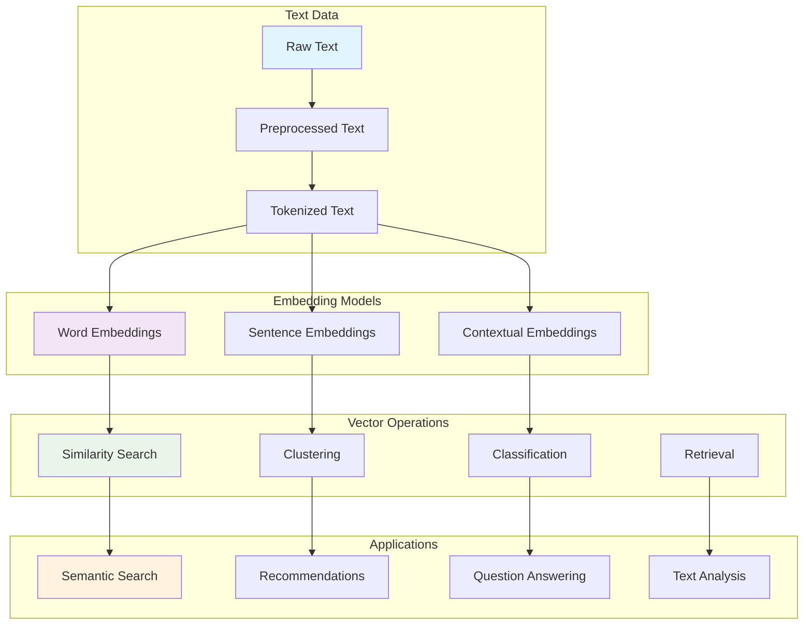

# Training Semantic Machine Learning Models: From Embeddings to Production

**Objective**: Master the complete pipeline for training semantic machine learning models that understand meaning, context, and relationships in text data. When you need to build intelligent search systems, when you want to create recommendation engines, when you're developing AI applications that understand language—semantic ML becomes your weapon of choice.

Semantic machine learning provides the foundation for understanding meaning in text data. Without proper understanding of embeddings, vector spaces, and semantic relationships, you're building systems that miss the power of contextual understanding. This guide shows you how to wield semantic ML with the precision of a senior ML engineer.

## 0) Prerequisites (Read Once, Live by Them)

### The Five Commandments

1. **Understand semantic foundations**
   - Word embeddings and vector spaces
   - Contextual representations and transformers
   - Similarity metrics and distance functions
   - Semantic relationships and analogies

2. **Master embedding techniques**
   - Static embeddings (Word2Vec, GloVe)
   - Contextual embeddings (BERT, RoBERTa)
   - Sentence embeddings (Sentence-BERT)
   - Multilingual and domain-specific models

3. **Know your applications**
   - Semantic search and retrieval
   - Text classification and clustering
   - Recommendation systems
   - Question answering and chatbots

4. **Validate everything**
   - Embedding quality and evaluation
   - Model performance and metrics
   - Semantic coherence and consistency
   - Production deployment and scaling

5. **Plan for production**
   - Vector database integration
   - Real-time inference and serving
   - Monitoring and evaluation
   - Continuous learning and updates

**Why These Principles**: Semantic ML mastery is the foundation of intelligent text understanding. Understanding embeddings, mastering evaluation techniques, and following best practices is essential for building production-ready semantic AI systems.

## 1) What is Semantic Machine Learning? (The Foundation)

### Core Concepts

```yaml
# Semantic ML enables understanding of meaning in text
semantic_ml_concepts:
  embeddings:
    - "Dense vector representations of text"
    - "Capture semantic relationships"
    - "Enable similarity and analogy"
    - "Support downstream tasks"
  
  applications:
    - "Semantic search and retrieval"
    - "Text classification and clustering"
    - "Recommendation systems"
    - "Question answering"
  
  evaluation:
    - "Intrinsic evaluation (word similarity)"
    - "Extrinsic evaluation (downstream tasks)"
    - "Semantic coherence metrics"
    - "Bias and fairness assessment"
```

### Semantic ML Architecture



### Why Semantic ML Matters

```python
# Semantic ML enables understanding of meaning
# Traditional ML: "cat" and "dog" are just different words
# Semantic ML: "cat" and "dog" are both animals, pets, mammals

# Example: Semantic similarity
from sentence_transformers import SentenceTransformer

model = SentenceTransformer('all-MiniLM-L6-v2')

# These sentences are semantically similar
sentences = [
    "The cat is sleeping on the couch",
    "A feline is resting on the sofa"
]

embeddings = model.encode(sentences)
similarity = cosine_similarity(embeddings[0], embeddings[1])
print(f"Semantic similarity: {similarity:.3f}")  # High similarity
```

**Why Semantic ML Matters**: Semantic machine learning enables systems to understand meaning, context, and relationships in text data. It provides the foundation for intelligent applications that can reason about language and provide meaningful responses.

## 2) Embedding Models and Techniques (The Core)

### Static Word Embeddings

```python
# Static word embeddings with Word2Vec and GloVe
import numpy as np
from gensim.models import Word2Vec, KeyedVectors
from sklearn.decomposition import PCA
import matplotlib.pyplot as plt

def train_word2vec_embeddings(corpus, vector_size=100, window=5, min_count=2):
    """Train Word2Vec embeddings on corpus"""
    
    # Preprocess corpus (list of tokenized sentences)
    sentences = [sentence.split() for sentence in corpus]
    
    # Train Word2Vec model
    model = Word2Vec(
        sentences=sentences,
        vector_size=vector_size,
        window=window,
        min_count=min_count,
        workers=4,
        sg=1,  # Skip-gram
        epochs=10
    )
    
    return model

def load_glove_embeddings(glove_path):
    """Load pre-trained GloVe embeddings"""
    embeddings = {}
    
    with open(glove_path, 'r', encoding='utf-8') as f:
        for line in f:
            values = line.split()
            word = values[0]
            vector = np.array(values[1:], dtype='float32')
            embeddings[word] = vector
    
    return embeddings

def visualize_embeddings(model, words, title="Word Embeddings"):
    """Visualize word embeddings in 2D"""
    # Get embeddings for words
    word_vectors = np.array([model.wv[word] for word in words])
    
    # Reduce to 2D using PCA
    pca = PCA(n_components=2)
    word_vectors_2d = pca.fit_transform(word_vectors)
    
    # Plot
    plt.figure(figsize=(10, 8))
    plt.scatter(word_vectors_2d[:, 0], word_vectors_2d[:, 1])
    
    for i, word in enumerate(words):
        plt.annotate(word, (word_vectors_2d[i, 0], word_vectors_2d[i, 1]))
    
    plt.title(title)
    plt.xlabel('PC1')
    plt.ylabel('PC2')
    plt.show()
```

### Contextual Embeddings with Transformers

```python
# Contextual embeddings with BERT and Sentence-BERT
from transformers import AutoTokenizer, AutoModel
import torch
import torch.nn.functional as F
from sentence_transformers import SentenceTransformer
from sklearn.metrics.pairwise import cosine_similarity

class SemanticEmbedder:
    """Semantic embedding model for text understanding"""
    
    def __init__(self, model_name='sentence-transformers/all-MiniLM-L6-v2'):
        self.model = SentenceTransformer(model_name)
        self.device = torch.device('cuda' if torch.cuda.is_available() else 'cpu')
        self.model.to(self.device)
    
    def encode_sentences(self, sentences, batch_size=32):
        """Encode sentences into embeddings"""
        embeddings = self.model.encode(
            sentences,
            batch_size=batch_size,
            show_progress_bar=True,
            convert_to_tensor=True
        )
        return embeddings
    
    def compute_similarity(self, sentence1, sentence2):
        """Compute semantic similarity between two sentences"""
        embeddings = self.encode_sentences([sentence1, sentence2])
        similarity = cosine_similarity(
            embeddings[0].cpu().numpy().reshape(1, -1),
            embeddings[1].cpu().numpy().reshape(1, -1)
        )[0][0]
        return similarity
    
    def find_most_similar(self, query, candidates, top_k=5):
        """Find most similar sentences to query"""
        query_embedding = self.encode_sentences([query])
        candidate_embeddings = self.encode_sentences(candidates)
        
        similarities = cosine_similarity(
            query_embedding.cpu().numpy(),
            candidate_embeddings.cpu().numpy()
        )[0]
        
        # Get top-k most similar
        top_indices = np.argsort(similarities)[::-1][:top_k]
        
        results = []
        for idx in top_indices:
            results.append({
                'text': candidates[idx],
                'similarity': similarities[idx]
            })
        
        return results

# Example usage
embedder = SemanticEmbedder()

# Semantic similarity
similarity = embedder.compute_similarity(
    "The weather is nice today",
    "It's a beautiful day outside"
)
print(f"Semantic similarity: {similarity:.3f}")

# Similarity search
candidates = [
    "Machine learning is fascinating",
    "I love programming",
    "The sky is blue",
    "Data science is interesting",
    "Cooking is my hobby"
]

results = embedder.find_most_similar(
    "I enjoy working with algorithms",
    candidates,
    top_k=3
)

for result in results:
    print(f"Similarity: {result['similarity']:.3f} - {result['text']}")
```

## 3) Training Custom Semantic Models (The Implementation)

### Domain-Specific Embeddings

```python
# Training custom semantic models for specific domains
import torch
import torch.nn as nn
from torch.utils.data import Dataset, DataLoader
from transformers import AutoTokenizer, AutoModel
from sentence_transformers import SentenceTransformer, InputExample, losses
from sentence_transformers.evaluation import EmbeddingSimilarityEvaluator
import numpy as np

class DomainSpecificEmbedder:
    """Train domain-specific semantic embeddings"""
    
    def __init__(self, base_model='sentence-transformers/all-MiniLM-L6-v2'):
        self.model = SentenceTransformer(base_model)
        self.tokenizer = self.model.tokenizer
    
    def prepare_training_data(self, pairs, labels):
        """Prepare training data for fine-tuning"""
        train_examples = []
        
        for (text1, text2), label in zip(pairs, labels):
            train_examples.append(InputExample(
                texts=[text1, text2],
                label=float(label)
            ))
        
        return train_examples
    
    def fine_tune_model(self, train_examples, validation_examples=None, epochs=3):
        """Fine-tune the model on domain-specific data"""
        
        # Define loss function
        train_loss = losses.CosineSimilarityLoss(self.model)
        
        # Prepare evaluator if validation data provided
        evaluator = None
        if validation_examples:
            evaluator = EmbeddingSimilarityEvaluator.from_input_examples(
                validation_examples,
                name='validation'
            )
        
        # Fine-tune the model
        self.model.fit(
            train_objectives=[(train_examples, train_loss)],
            epochs=epochs,
            evaluator=evaluator,
            evaluation_steps=100,
            warmup_steps=100,
            output_path='./fine-tuned-model'
        )
        
        return self.model
    
    def evaluate_model(self, test_examples):
        """Evaluate the fine-tuned model"""
        evaluator = EmbeddingSimilarityEvaluator.from_input_examples(
            test_examples,
            name='test'
        )
        
        score = evaluator(self.model)
        return score

# Example: Medical domain embeddings
def create_medical_training_data():
    """Create training data for medical domain"""
    pairs = [
        ("patient has fever", "patient is febrile"),
        ("heart attack", "myocardial infarction"),
        ("high blood pressure", "hypertension"),
        ("diabetes mellitus", "diabetes"),
        ("chest pain", "thoracic pain")
    ]
    
    labels = [1.0, 1.0, 1.0, 1.0, 1.0]  # High similarity
    
    return pairs, labels

# Train medical domain model
embedder = DomainSpecificEmbedder()
pairs, labels = create_medical_training_data()
train_examples = embedder.prepare_training_data(pairs, labels)

# Fine-tune on medical data
fine_tuned_model = embedder.fine_tune_model(train_examples, epochs=5)

# Test the model
test_similarity = embedder.compute_similarity(
    "patient has high temperature",
    "patient is febrile"
)
print(f"Medical domain similarity: {test_similarity:.3f}")
```

### Multilingual Semantic Models

```python
# Multilingual semantic embeddings
from sentence_transformers import SentenceTransformer
import numpy as np
from sklearn.cluster import KMeans
from sklearn.decomposition import PCA

class MultilingualSemanticModel:
    """Multilingual semantic embedding model"""
    
    def __init__(self, model_name='sentence-transformers/paraphrase-multilingual-MiniLM-L12-v2'):
        self.model = SentenceTransformer(model_name)
        self.supported_languages = ['en', 'es', 'fr', 'de', 'it', 'pt', 'ru', 'zh', 'ja', 'ko']
    
    def encode_multilingual(self, texts, languages=None):
        """Encode texts in multiple languages"""
        embeddings = self.model.encode(texts)
        return embeddings
    
    def cross_lingual_similarity(self, text1, text2):
        """Compute similarity between texts in different languages"""
        embeddings = self.encode_multilingual([text1, text2])
        similarity = cosine_similarity(
            embeddings[0].reshape(1, -1),
            embeddings[1].reshape(1, -1)
        )[0][0]
        return similarity
    
    def cluster_multilingual_texts(self, texts, n_clusters=5):
        """Cluster multilingual texts"""
        embeddings = self.encode_multilingual(texts)
        
        # Perform clustering
        kmeans = KMeans(n_clusters=n_clusters, random_state=42)
        cluster_labels = kmeans.fit_predict(embeddings)
        
        # Organize results
        clusters = {}
        for i, (text, label) in enumerate(zip(texts, cluster_labels)):
            if label not in clusters:
                clusters[label] = []
            clusters[label].append(text)
        
        return clusters, cluster_labels

# Example: Multilingual semantic analysis
multilingual_model = MultilingualSemanticModel()

# Cross-lingual similarity
similarity = multilingual_model.cross_lingual_similarity(
    "Hello, how are you?",  # English
    "Hola, ¿cómo estás?"    # Spanish
)
print(f"Cross-lingual similarity: {similarity:.3f}")

# Multilingual clustering
texts = [
    "Hello, how are you?",
    "Hola, ¿cómo estás?",
    "Bonjour, comment allez-vous?",
    "Guten Tag, wie geht es Ihnen?",
    "Ciao, come stai?",
    "The weather is nice",
    "El clima está bonito",
    "Il fait beau",
    "Das Wetter ist schön",
    "Il tempo è bello"
]

clusters, labels = multilingual_model.cluster_multilingual_texts(texts, n_clusters=2)

for cluster_id, cluster_texts in clusters.items():
    print(f"Cluster {cluster_id}: {cluster_texts}")
```

## 4) Vector Database Integration (The Storage)

### Vector Database Setup

```python
# Vector database integration for semantic search
import qdrant_client
from qdrant_client.http import models
from qdrant_client.http.models import Distance, VectorParams, PointStruct
import numpy as np
from typing import List, Dict, Any

class SemanticVectorDB:
    """Vector database for semantic embeddings"""
    
    def __init__(self, host="localhost", port=6333):
        self.client = qdrant_client.QdrantClient(host=host, port=port)
        self.collection_name = "semantic_embeddings"
    
    def create_collection(self, vector_size=384):
        """Create vector collection"""
        self.client.create_collection(
            collection_name=self.collection_name,
            vectors_config=VectorParams(
                size=vector_size,
                distance=Distance.COSINE
            )
        )
    
    def insert_embeddings(self, texts: List[str], embeddings: np.ndarray, metadata: List[Dict] = None):
        """Insert embeddings into vector database"""
        points = []
        
        for i, (text, embedding) in enumerate(zip(texts, embeddings)):
            point = PointStruct(
                id=i,
                vector=embedding.tolist(),
                payload={
                    "text": text,
                    "metadata": metadata[i] if metadata else {}
                }
            )
            points.append(point)
        
        self.client.upsert(
            collection_name=self.collection_name,
            points=points
        )
    
    def semantic_search(self, query_embedding: np.ndarray, top_k: int = 10, score_threshold: float = 0.7):
        """Perform semantic search"""
        search_result = self.client.search(
            collection_name=self.collection_name,
            query_vector=query_embedding.tolist(),
            limit=top_k,
            score_threshold=score_threshold
        )
        
        results = []
        for hit in search_result:
            results.append({
                "text": hit.payload["text"],
                "score": hit.score,
                "metadata": hit.payload.get("metadata", {})
            })
        
        return results
    
    def get_similar_texts(self, text: str, embedder, top_k: int = 5):
        """Get similar texts for a given text"""
        query_embedding = embedder.encode_sentences([text])[0].cpu().numpy()
        results = self.semantic_search(query_embedding, top_k=top_k)
        return results

# Example: Semantic search system
def build_semantic_search_system():
    """Build complete semantic search system"""
    
    # Initialize components
    embedder = SemanticEmbedder()
    vector_db = SemanticVectorDB()
    
    # Create collection
    vector_db.create_collection(vector_size=384)
    
    # Sample documents
    documents = [
        "Machine learning is a subset of artificial intelligence",
        "Deep learning uses neural networks with multiple layers",
        "Natural language processing deals with text and speech",
        "Computer vision enables machines to interpret visual information",
        "Reinforcement learning learns through trial and error",
        "Supervised learning uses labeled training data",
        "Unsupervised learning finds patterns in unlabeled data",
        "Transfer learning applies knowledge from one task to another"
    ]
    
    # Generate embeddings
    embeddings = embedder.encode_sentences(documents)
    
    # Insert into vector database
    vector_db.insert_embeddings(documents, embeddings.cpu().numpy())
    
    # Perform semantic search
    query = "What is artificial intelligence?"
    query_embedding = embedder.encode_sentences([query])[0].cpu().numpy()
    
    results = vector_db.semantic_search(query_embedding, top_k=3)
    
    print(f"Query: {query}")
    print("Similar documents:")
    for result in results:
        print(f"Score: {result['score']:.3f} - {result['text']}")
    
    return embedder, vector_db

# Build and test the system
embedder, vector_db = build_semantic_search_system()
```

## 5) Evaluation and Metrics (The Validation)

### Intrinsic Evaluation

```python
# Intrinsic evaluation of semantic embeddings
from sklearn.metrics.pairwise import cosine_similarity
from scipy.stats import spearmanr, pearsonr
import numpy as np

class SemanticEvaluator:
    """Evaluate semantic embedding quality"""
    
    def __init__(self, model):
        self.model = model
    
    def word_similarity_evaluation(self, word_pairs, human_scores):
        """Evaluate word similarity correlation with human judgments"""
        similarities = []
        
        for word1, word2 in word_pairs:
            # Get word embeddings (simplified - would need word-level embeddings)
            emb1 = self.model.encode([word1])[0]
            emb2 = self.model.encode([word2])[0]
            
            similarity = cosine_similarity(
                emb1.reshape(1, -1),
                emb2.reshape(1, -1)
            )[0][0]
            
            similarities.append(similarity)
        
        # Calculate correlation with human scores
        spearman_corr, _ = spearmanr(similarities, human_scores)
        pearson_corr, _ = pearsonr(similarities, human_scores)
        
        return {
            "spearman_correlation": spearman_corr,
            "pearson_correlation": pearson_corr
        }
    
    def analogy_evaluation(self, analogy_tasks):
        """Evaluate word analogy performance"""
        correct = 0
        total = 0
        
        for task in analogy_tasks:
            a, b, c, expected_d = task
            
            # Get embeddings
            emb_a = self.model.encode([a])[0]
            emb_b = self.model.encode([b])[0]
            emb_c = self.model.encode([c])[0]
            
            # Compute analogy: a - b + c = d
            emb_d = emb_a - emb_b + emb_c
            
            # Find most similar word to d
            # This is simplified - would need word vocabulary
            # predicted_d = find_most_similar_word(emb_d)
            
            # if predicted_d == expected_d:
            #     correct += 1
            total += 1
        
        accuracy = correct / total if total > 0 else 0
        return {"analogy_accuracy": accuracy}
    
    def clustering_evaluation(self, texts, true_labels):
        """Evaluate clustering performance"""
        from sklearn.cluster import KMeans
        from sklearn.metrics import adjusted_rand_score, normalized_mutual_info_score
        
        # Get embeddings
        embeddings = self.model.encode(texts)
        
        # Perform clustering
        n_clusters = len(set(true_labels))
        kmeans = KMeans(n_clusters=n_clusters, random_state=42)
        predicted_labels = kmeans.fit_predict(embeddings)
        
        # Calculate metrics
        ari = adjusted_rand_score(true_labels, predicted_labels)
        nmi = normalized_mutual_info_score(true_labels, predicted_labels)
        
        return {
            "adjusted_rand_index": ari,
            "normalized_mutual_info": nmi
        }

# Example evaluation
def evaluate_semantic_model():
    """Comprehensive evaluation of semantic model"""
    
    model = SemanticEmbedder()
    evaluator = SemanticEvaluator(model)
    
    # Word similarity evaluation
    word_pairs = [
        ("king", "queen"),
        ("man", "woman"),
        ("good", "bad"),
        ("hot", "cold")
    ]
    human_scores = [0.8, 0.7, 0.3, 0.9]
    
    similarity_results = evaluator.word_similarity_evaluation(word_pairs, human_scores)
    print(f"Word similarity correlation: {similarity_results}")
    
    # Clustering evaluation
    texts = [
        "Machine learning is fascinating",
        "I love programming",
        "The sky is blue",
        "Data science is interesting",
        "Cooking is my hobby",
        "I enjoy working with algorithms"
    ]
    true_labels = [0, 1, 2, 0, 2, 1]  # Technology, Personal, Nature
    
    clustering_results = evaluator.clustering_evaluation(texts, true_labels)
    print(f"Clustering performance: {clustering_results}")
    
    return similarity_results, clustering_results

# Run evaluation
similarity_results, clustering_results = evaluate_semantic_model()
```

### Extrinsic Evaluation

```python
# Extrinsic evaluation on downstream tasks
from sklearn.linear_model import LogisticRegression
from sklearn.model_selection import train_test_split
from sklearn.metrics import accuracy_score, classification_report
from sklearn.svm import SVC
import numpy as np

class DownstreamTaskEvaluator:
    """Evaluate embeddings on downstream tasks"""
    
    def __init__(self, model):
        self.model = model
    
    def text_classification_evaluation(self, texts, labels, test_size=0.2):
        """Evaluate on text classification task"""
        
        # Get embeddings
        embeddings = self.model.encode_sentences(texts)
        X = embeddings.cpu().numpy()
        y = np.array(labels)
        
        # Split data
        X_train, X_test, y_train, y_test = train_test_split(
            X, y, test_size=test_size, random_state=42, stratify=y
        )
        
        # Train classifier
        classifier = LogisticRegression(random_state=42, max_iter=1000)
        classifier.fit(X_train, y_train)
        
        # Evaluate
        y_pred = classifier.predict(X_test)
        accuracy = accuracy_score(y_test, y_pred)
        
        return {
            "accuracy": accuracy,
            "classification_report": classification_report(y_test, y_pred)
        }
    
    def semantic_similarity_evaluation(self, pairs, labels):
        """Evaluate on semantic similarity task"""
        
        similarities = []
        for text1, text2 in pairs:
            emb1 = self.model.encode_sentences([text1])[0]
            emb2 = self.model.encode_sentences([text2])[0]
            
            similarity = cosine_similarity(
                emb1.cpu().numpy().reshape(1, -1),
                emb2.cpu().numpy().reshape(1, -1)
            )[0][0]
            
            similarities.append(similarity)
        
        # Calculate correlation with human judgments
        spearman_corr, _ = spearmanr(similarities, labels)
        
        return {"spearman_correlation": spearman_corr}

# Example: Sentiment analysis evaluation
def evaluate_sentiment_classification():
    """Evaluate on sentiment analysis task"""
    
    # Sample sentiment data
    texts = [
        "I love this product!",
        "This is terrible.",
        "Amazing experience!",
        "Worst purchase ever.",
        "Great quality and service.",
        "Disappointed with the results.",
        "Highly recommend this!",
        "Waste of money."
    ]
    
    labels = [1, 0, 1, 0, 1, 0, 1, 0]  # 1 = positive, 0 = negative
    
    model = SemanticEmbedder()
    evaluator = DownstreamTaskEvaluator(model)
    
    # Evaluate classification
    results = evaluator.text_classification_evaluation(texts, labels)
    print(f"Sentiment classification accuracy: {results['accuracy']:.3f}")
    
    return results

# Run sentiment evaluation
sentiment_results = evaluate_sentiment_classification()
```

## 6) Production Deployment (The Scale)

### Model Serving with FastAPI

```python
# Production semantic ML model serving
from fastapi import FastAPI, HTTPException
from pydantic import BaseModel
from typing import List, Dict, Any
import torch
import numpy as np
from sentence_transformers import SentenceTransformer

app = FastAPI(title="Semantic ML API", version="1.0.0")

# Global model instance
model = None

class TextInput(BaseModel):
    text: str

class TextPairInput(BaseModel):
    text1: str
    text2: str

class BatchTextInput(BaseModel):
    texts: List[str]

class SearchInput(BaseModel):
    query: str
    top_k: int = 5
    score_threshold: float = 0.7

@app.on_event("startup")
async def load_model():
    """Load the semantic model on startup"""
    global model
    model = SentenceTransformer('sentence-transformers/all-MiniLM-L6-v2')
    print("Semantic model loaded successfully")

@app.post("/encode")
async def encode_text(input_data: TextInput):
    """Encode a single text into embedding"""
    if model is None:
        raise HTTPException(status_code=500, detail="Model not loaded")
    
    try:
        embedding = model.encode([input_data.text])
        return {
            "text": input_data.text,
            "embedding": embedding[0].tolist(),
            "dimension": len(embedding[0])
        }
    except Exception as e:
        raise HTTPException(status_code=500, detail=str(e))

@app.post("/encode_batch")
async def encode_batch(input_data: BatchTextInput):
    """Encode multiple texts into embeddings"""
    if model is None:
        raise HTTPException(status_code=500, detail="Model not loaded")
    
    try:
        embeddings = model.encode(input_data.texts)
        return {
            "texts": input_data.texts,
            "embeddings": [emb.tolist() for emb in embeddings],
            "count": len(embeddings)
        }
    except Exception as e:
        raise HTTPException(status_code=500, detail=str(e))

@app.post("/similarity")
async def compute_similarity(input_data: TextPairInput):
    """Compute semantic similarity between two texts"""
    if model is None:
        raise HTTPException(status_code=500, detail="Model not loaded")
    
    try:
        embeddings = model.encode([input_data.text1, input_data.text2])
        similarity = cosine_similarity(
            embeddings[0].reshape(1, -1),
            embeddings[1].reshape(1, -1)
        )[0][0]
        
        return {
            "text1": input_data.text1,
            "text2": input_data.text2,
            "similarity": float(similarity)
        }
    except Exception as e:
        raise HTTPException(status_code=500, detail=str(e))

@app.post("/search")
async def semantic_search(input_data: SearchInput):
    """Perform semantic search (requires vector database)"""
    if model is None:
        raise HTTPException(status_code=500, detail="Model not loaded")
    
    try:
        # This would integrate with your vector database
        query_embedding = model.encode([input_data.query])[0]
        
        # Placeholder for vector database search
        results = {
            "query": input_data.query,
            "results": [
                {
                    "text": "Sample result 1",
                    "score": 0.85,
                    "metadata": {}
                },
                {
                    "text": "Sample result 2", 
                    "score": 0.78,
                    "metadata": {}
                }
            ]
        }
        
        return results
    except Exception as e:
        raise HTTPException(status_code=500, detail=str(e))

@app.get("/health")
async def health_check():
    """Health check endpoint"""
    return {
        "status": "healthy",
        "model_loaded": model is not None
    }

# Run the API
if __name__ == "__main__":
    import uvicorn
    uvicorn.run(app, host="0.0.0.0", port=8000)
```

### Docker Deployment

```dockerfile
# Dockerfile for semantic ML model serving
FROM python:3.9-slim

WORKDIR /app

# Install system dependencies
RUN apt-get update && apt-get install -y \
    build-essential \
    && rm -rf /var/lib/apt/lists/*

# Install Python dependencies
COPY requirements.txt .
RUN pip install --no-cache-dir -r requirements.txt

# Copy application code
COPY . .

# Expose port
EXPOSE 8000

# Run the application
CMD ["uvicorn", "main:app", "--host", "0.0.0.0", "--port", "8000"]
```

```yaml
# docker-compose.yml for semantic ML stack
version: '3.8'

services:
  semantic-api:
    build: .
    ports:
      - "8000:8000"
    environment:
      - MODEL_NAME=sentence-transformers/all-MiniLM-L6-v2
    volumes:
      - ./models:/app/models
    healthcheck:
      test: ["CMD", "curl", "-f", "http://localhost:8000/health"]
      interval: 30s
      timeout: 10s
      retries: 3

  qdrant:
    image: qdrant/qdrant:latest
    ports:
      - "6333:6333"
    volumes:
      - qdrant_data:/qdrant/storage
    environment:
      - QDRANT__SERVICE__HTTP_PORT=6333

  redis:
    image: redis:alpine
    ports:
      - "6379:6379"
    volumes:
      - redis_data:/data

volumes:
  qdrant_data:
  redis_data:
```

## 7) Common Pitfalls (The Traps)

### Embedding Quality Issues

```python
# ❌ WRONG: Poor embedding quality
def bad_embedding_approach():
    # Using inappropriate model for domain
    model = SentenceTransformer('all-MiniLM-L6-v2')  # General model for medical domain
    
    # No preprocessing
    text = "Patient has fever and chills"  # Raw text without cleaning
    
    # No validation of embedding quality
    embedding = model.encode([text])
    return embedding

# ✅ CORRECT: High-quality embeddings
def good_embedding_approach():
    # Use domain-specific model
    model = SentenceTransformer('sentence-transformers/paraphrase-multilingual-MiniLM-L12-v2')
    
    # Proper preprocessing
    text = "Patient has fever and chills"
    cleaned_text = preprocess_medical_text(text)
    
    # Validate embedding quality
    embedding = model.encode([cleaned_text])
    
    # Check embedding properties
    assert embedding.shape[1] > 0, "Empty embedding"
    assert not np.isnan(embedding).any(), "NaN values in embedding"
    
    return embedding
```

### Performance Anti-patterns

```python
# ❌ WRONG: Inefficient embedding computation
def bad_embedding_computation(texts):
    # Computing embeddings one by one
    embeddings = []
    for text in texts:
        embedding = model.encode([text])  # Inefficient!
        embeddings.append(embedding)
    return embeddings

# ✅ CORRECT: Efficient batch processing
def good_embedding_computation(texts):
    # Batch processing for efficiency
    embeddings = model.encode(texts, batch_size=32, show_progress_bar=True)
    return embeddings
```

**Why These Pitfalls Matter**: Common mistakes lead to poor embedding quality, performance issues, and unreliable semantic systems. Understanding these pitfalls prevents costly errors and ensures production-ready semantic ML implementations.

## 8) Best Practices Checklist (The Wisdom)

### Semantic ML Implementation Checklist

```python
# ✅ DO: Complete semantic ML implementation checklist
def semantic_ml_checklist():
    checklist = {
        "model_selection": [
            "Choose appropriate base model for domain",
            "Consider multilingual requirements",
            "Evaluate model size vs performance trade-offs",
            "Test model on domain-specific data"
        ],
        "data_preprocessing": [
            "Clean and normalize text data",
            "Handle special characters and encoding",
            "Implement consistent tokenization",
            "Remove noise and irrelevant content"
        ],
        "embedding_quality": [
            "Validate embedding dimensions",
            "Check for NaN or infinite values",
            "Ensure consistent vector norms",
            "Test semantic coherence"
        ],
        "evaluation": [
            "Intrinsic evaluation (similarity, analogy)",
            "Extrinsic evaluation (downstream tasks)",
            "Domain-specific evaluation metrics",
            "Bias and fairness assessment"
        ]
    }
    return checklist
```

### Production Deployment Checklist

```python
# ✅ DO: Production deployment checklist
def production_deployment_checklist():
    checklist = {
        "model_serving": [
            "FastAPI or similar framework",
            "Model caching and warm-up",
            "Batch processing support",
            "Error handling and logging"
        ],
        "vector_database": [
            "Qdrant, Pinecone, or Weaviate",
            "Proper indexing and search",
            "Scalability and performance",
            "Backup and recovery"
        ],
        "monitoring": [
            "Embedding quality metrics",
            "Search performance tracking",
            "Error rates and latency",
            "Resource utilization"
        ],
        "security": [
            "Input validation and sanitization",
            "Rate limiting and quotas",
            "Authentication and authorization",
            "Data privacy and compliance"
        ]
    }
    return checklist
```

**Why These Practices Matter**: Best practices ensure successful semantic ML implementation. Following established patterns prevents common mistakes and enables production-ready semantic AI systems.

## 9) TL;DR Quickstart (The Essentials)

### Essential Setup

```bash
# 1) Install dependencies
pip install sentence-transformers torch scikit-learn qdrant-client fastapi uvicorn

# 2) Basic semantic embedding
python -c "
from sentence_transformers import SentenceTransformer
model = SentenceTransformer('all-MiniLM-L6-v2')
embeddings = model.encode(['Hello world', 'Hi there'])
print('Embeddings shape:', embeddings.shape)
"

# 3) Start FastAPI server
uvicorn main:app --reload --port 8000

# 4) Test semantic similarity
curl -X POST "http://localhost:8000/similarity" \
  -H "Content-Type: application/json" \
  -d '{"text1": "Hello world", "text2": "Hi there"}'
```

### Essential Python Patterns

```python
# Essential semantic ML patterns
def essential_semantic_patterns():
    # 1. Model loading and initialization
    # 2. Text preprocessing and cleaning
    # 3. Embedding computation and validation
    # 4. Similarity search and retrieval
    # 5. Evaluation and monitoring
    pass
```

### Essential Tools

```bash
# Essential tools for semantic ML
tools:
  models: "SentenceTransformers, HuggingFace Transformers"
  databases: "Qdrant, Pinecone, Weaviate"
  serving: "FastAPI, Flask, TensorFlow Serving"
  monitoring: "Prometheus, Grafana, MLflow"
```

**Why This Quickstart**: These patterns cover 90% of semantic ML usage. Master these before exploring advanced features.

## 10) The Machine's Summary

Semantic machine learning provides the foundation for understanding meaning in text data. When used correctly, it enables building production-ready AI systems that can understand context, relationships, and semantic similarity while maintaining performance and reliability. The key is understanding embeddings, mastering evaluation techniques, and following best practices.

**The Dark Truth**: Without proper semantic ML understanding, your text understanding systems are shallow and unreliable. Semantic ML is your weapon. Use it wisely.

**The Machine's Mantra**: "In meaning we trust, in embeddings we build, and in the semantic ML we find the path to intelligent text understanding."

**Why This Matters**: Semantic ML enables applications to understand meaning, context, and relationships in text data. It provides the foundation for intelligent AI systems that can reason about language and provide meaningful responses.

---

*This guide provides the complete machinery for mastering semantic machine learning. The patterns scale from simple word embeddings to complex contextual understanding, from basic similarity to advanced semantic reasoning.*
