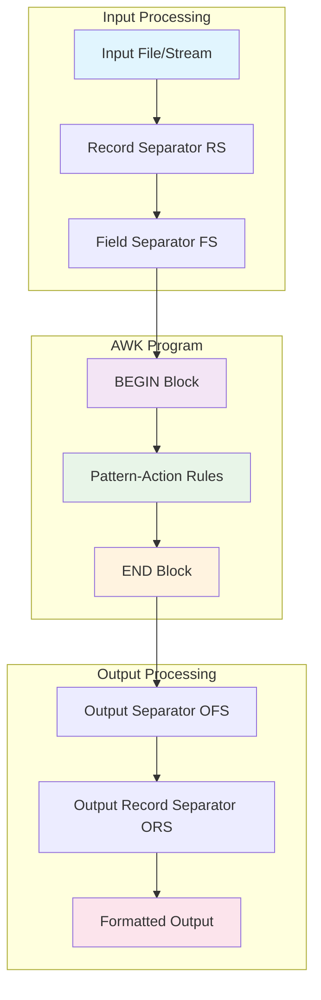

# AWK Unix Text Processing Mastery: Parse ls, ps aux, and System Data Like a Pro

**Objective**: Master AWK for parsing Unix command output, system data, and text processing. When you need to extract specific data from `ls`, `ps aux`, `df`, `netstat`, and other Unix utilities, when you're building system monitoring scripts, when you need to process log files and structured text—AWK becomes your weapon of choice.

AWK is the Swiss Army knife of Unix text processing. Without proper AWK mastery, you're parsing text inefficiently, writing complex shell scripts, and missing the power of pattern-action programming. This guide shows you how to wield AWK with the precision of a Unix systems engineer.

## 0) Prerequisites (Read Once, Live by Them)

### The Five Commandments

1. **Understand the AWK model**
   - Pattern-action programming paradigm
   - Field-based processing with FS and OFS
   - Built-in variables and functions

2. **Master the syntax**
   - Patterns (conditions, ranges, BEGIN/END)
   - Actions (print, printf, assignments, control flow)
   - Functions (string, arithmetic, user-defined)

3. **Know your patterns**
   - Field extraction and manipulation
   - Conditional processing and filtering
   - Aggregation and reporting

4. **Validate everything**
   - Output format and accuracy
   - Performance with large datasets
   - Error handling and edge cases

5. **Plan for production**
   - Script organization and reusability
   - Performance optimization
   - Integration with shell pipelines

**Why These Principles**: AWK mastery is the foundation of Unix text processing. Understanding the model, mastering the syntax, and following best practices is essential for efficient system administration and data processing.

## 1) What is AWK? (The Foundation)

### Core Concepts

```bash
# AWK is a pattern-action programming language
# It processes text line by line, field by field

# Basic syntax: pattern { action }
# Pattern: condition that determines when to execute action
# Action: what to do when pattern matches

# AWK processes input in records (lines) and fields (columns)
# Built-in variables: NR (record number), NF (field count), $0 (entire line)
```

### AWK Architecture



### AWK Variables

```bash
# Built-in variables
FS          # Field separator (default: whitespace)
OFS         # Output field separator (default: space)
RS          # Record separator (default: newline)
ORS         # Output record separator (default: newline)
NF          # Number of fields in current record
NR          # Record number (line number)
FNR         # Record number in current file
$0          # Entire current record
$1, $2, ... # Individual fields
```

**Why AWK Matters**: AWK provides powerful text processing capabilities with a simple, elegant syntax. It's essential for system administration, log analysis, and data extraction tasks.

## 2) Setting Up AWK (The Environment)

### AWK Variants

```bash
# Different AWK implementations
awk          # Original AWK (POSIX)
gawk         # GNU AWK (most features)
mawk         # Mike's AWK (fast)
nawk         # New AWK (Solaris)

# Check which AWK you have
which awk
awk --version

# Use gawk for best compatibility
gawk --version
```

### Basic AWK Usage

```bash
# Command line usage
awk 'pattern { action }' file

# From pipeline
command | awk 'pattern { action }'

# Multiple patterns
awk 'pattern1 { action1 } pattern2 { action2 }' file

# BEGIN and END blocks
awk 'BEGIN { print "Starting" } { print $0 } END { print "Done" }' file
```

### AWK Script Files

```bash
# Create AWK script
cat > process.awk << 'EOF'
BEGIN {
    print "Processing started"
    FS = ","
    OFS = "|"
}

{
    if (NF > 0) {
        print $1, $2, $3
    }
}

END {
    print "Processing completed"
}
EOF

# Run AWK script
awk -f process.awk data.csv
```

**Why This Setup**: Proper AWK setup enables efficient text processing. Understanding variants and usage patterns provides the foundation for effective AWK programming.

## 3) Parsing ls Output (The File System)

### Basic ls Parsing

```bash
# List files with sizes
ls -la | awk '{ print $9, $5 }'

# Filter files by size (larger than 1MB)
ls -la | awk '$5 > 1048576 { print $9, $5 }'

# Format file sizes in human-readable format
ls -la | awk '{
    if ($5 > 1073741824) {
        size = $5 / 1073741824
        unit = "GB"
    } else if ($5 > 1048576) {
        size = $5 / 1048576
        unit = "MB"
    } else if ($5 > 1024) {
        size = $5 / 1024
        unit = "KB"
    } else {
        size = $5
        unit = "B"
    }
    printf "%s: %.2f %s\n", $9, size, unit
}'
```

### Advanced ls Processing

```bash
# Find largest files
ls -la | awk 'NR > 1 && $5 > 0 { print $5, $9 }' | sort -nr | head -10

# Group files by extension
ls -la | awk '{
    if (NF > 0) {
        n = split($9, parts, ".")
        if (n > 1) {
            ext = parts[n]
            count[ext]++
            size[ext] += $5
        }
    }
}
END {
    for (ext in count) {
        printf "Extension: %s, Files: %d, Total Size: %d\n", ext, count[ext], size[ext]
    }
}'

# Find duplicate files by size
ls -la | awk 'NR > 1 && $5 > 0 {
    size = $5
    if (count[size] == 0) {
        files[size] = $9
    } else {
        files[size] = files[size] ", " $9
    }
    count[size]++
}
END {
    for (size in count) {
        if (count[size] > 1) {
            printf "Size %d: %s\n", size, files[size]
        }
    }
}'
```

### File System Monitoring

```bash
# Monitor directory size changes
ls -la | awk '{
    if (NF > 0 && $5 > 0) {
        total_size += $5
        file_count++
    }
}
END {
    printf "Total files: %d, Total size: %d bytes\n", file_count, total_size
}'

# Find files modified in last 24 hours
find . -type f -mtime -1 | awk -F/ '{
    n = split($0, parts, "/")
    if (n > 0) {
        filename = parts[n]
        print filename
    }
}'
```

**Why This ls Parsing**: ls output parsing is essential for file system monitoring and management. AWK provides powerful tools for extracting, filtering, and analyzing file information.

## 4) Parsing ps aux Output (The Process System)

### Basic Process Parsing

```bash
# Show all processes with CPU usage
ps aux | awk '{ print $2, $3, $11 }'

# Find processes using most CPU
ps aux | awk 'NR > 1 { print $3, $2, $11 }' | sort -nr | head -10

# Find processes using most memory
ps aux | awk 'NR > 1 { print $4, $2, $11 }' | sort -nr | head -10

# Filter processes by user
ps aux | awk '$1 == "root" { print $2, $3, $4, $11 }'
```

### Advanced Process Analysis

```bash
# Process summary by user
ps aux | awk 'NR > 1 {
    user = $1
    cpu = $3
    mem = $4
    user_cpu[user] += cpu
    user_mem[user] += mem
    user_count[user]++
}
END {
    printf "%-15s %8s %8s %8s\n", "User", "CPU%", "Memory%", "Processes"
    printf "%-15s %8s %8s %8s\n", "----", "----", "-------", "---------"
    for (user in user_cpu) {
        printf "%-15s %8.1f %8.1f %8d\n", user, user_cpu[user], user_mem[user], user_count[user]
    }
}'

# Find zombie processes
ps aux | awk '$8 == "Z" { print $2, $11 }'

# Monitor specific process
ps aux | awk '$11 ~ /nginx/ { print $2, $3, $4, $11 }'

# Process tree analysis
ps aux | awk '{
    if (NF > 0) {
        pid = $2
        ppid = $3
        cmd = $11
        if (ppid > 0) {
            children[ppid]++
            parent[pid] = ppid
        }
        process[pid] = cmd
    }
}
END {
    for (pid in children) {
        if (children[pid] > 1) {
            printf "PID %d (%s) has %d children\n", pid, process[pid], children[pid]
        }
    }
}'
```

### System Resource Monitoring

```bash
# CPU usage by process
ps aux | awk 'NR > 1 {
    cpu = $3
    if (cpu > 0) {
        total_cpu += cpu
        if (cpu > 5) {
            high_cpu++
        }
    }
}
END {
    printf "Total CPU usage: %.1f%%\n", total_cpu
    printf "Processes using >5%% CPU: %d\n", high_cpu
}'

# Memory usage analysis
ps aux | awk 'NR > 1 {
    mem = $4
    if (mem > 0) {
        total_mem += mem
        if (mem > 1) {
            high_mem++
        }
    }
}
END {
    printf "Total memory usage: %.1f%%\n", total_mem
    printf "Processes using >1%% memory: %d\n", high_mem
}'
```

**Why This ps Parsing**: Process monitoring is essential for system administration. AWK provides powerful tools for analyzing process data, identifying resource usage, and monitoring system health.

## 5) Parsing df Output (The Disk System)

### Basic Disk Usage

```bash
# Show disk usage with human-readable sizes
df -h | awk 'NR > 1 {
    if ($5 ~ /%/) {
        usage = $5
        gsub(/%/, "", usage)
        if (usage > 80) {
            printf "WARNING: %s is %s full\n", $1, $5
        }
    }
}'

# Find filesystems with high usage
df | awk 'NR > 1 {
    usage = $5
    gsub(/%/, "", usage)
    if (usage > 90) {
        printf "CRITICAL: %s is %s%% full\n", $1, usage
    } else if (usage > 80) {
        printf "WARNING: %s is %s%% full\n", $1, usage
    }
}'
```

### Advanced Disk Analysis

```bash
# Disk usage summary
df | awk 'NR > 1 {
    total += $2
    used += $3
    avail += $4
}
END {
    printf "Total disk space: %d GB\n", total / 1024 / 1024
    printf "Used disk space: %d GB\n", used / 1024 / 1024
    printf "Available disk space: %d GB\n", avail / 1024 / 1024
    printf "Usage percentage: %.1f%%\n", (used / total) * 100
}'

# Filesystem type analysis
df -T | awk 'NR > 1 {
    fstype = $2
    size = $3
    used = $4
    fstype_size[fstype] += size
    fstype_used[fstype] += used
    fstype_count[fstype]++
}
END {
    printf "%-15s %8s %8s %8s\n", "Filesystem", "Count", "Size(GB)", "Used(GB)"
    printf "%-15s %8s %8s %8s\n", "----------", "-----", "--------", "--------"
    for (fstype in fstype_size) {
        printf "%-15s %8d %8.1f %8.1f\n", fstype, fstype_count[fstype], 
               fstype_size[fstype] / 1024 / 1024, fstype_used[fstype] / 1024 / 1024
    }
}'
```

### Disk Monitoring Script

```bash
# Create disk monitoring script
cat > disk_monitor.awk << 'EOF'
BEGIN {
    print "Disk Usage Monitor"
    print "=================="
    critical = 0
    warning = 0
}

NR > 1 {
    filesystem = $1
    usage = $5
    gsub(/%/, "", usage)
    
    if (usage > 90) {
        printf "CRITICAL: %s is %s%% full\n", filesystem, usage
        critical++
    } else if (usage > 80) {
        printf "WARNING: %s is %s%% full\n", filesystem, usage
        warning++
    }
}

END {
    printf "\nSummary: %d critical, %d warning\n", critical, warning
    if (critical > 0) {
        exit 1
    }
}
EOF

# Run disk monitoring
df | awk -f disk_monitor.awk
```

**Why This df Parsing**: Disk usage monitoring is critical for system administration. AWK provides powerful tools for analyzing disk usage, identifying problems, and generating alerts.

## 6) Parsing netstat Output (The Network System)

### Basic Network Analysis

```bash
# Show listening ports
netstat -tln | awk 'NR > 2 { print $4 }'

# Count connections by state
netstat -an | awk 'NR > 2 {
    state = $6
    if (state != "") {
        count[state]++
    }
}
END {
    for (state in count) {
        printf "State %s: %d connections\n", state, count[state]
    }
}'

# Find processes using specific ports
netstat -tlnp | awk 'NR > 2 {
    port = $4
    gsub(/.*:/, "", port)
    if (port > 0) {
        printf "Port %s: %s\n", port, $7
    }
}'
```

### Advanced Network Monitoring

```bash
# Connection analysis by remote IP
netstat -an | awk 'NR > 2 {
    if ($1 == "tcp" || $1 == "udp") {
        remote = $5
        gsub(/.*:/, "", remote)
        if (remote != "" && remote != "::" && remote != "0.0.0.0") {
            count[remote]++
        }
    }
}
END {
    printf "%-15s %8s\n", "Remote IP", "Connections"
    printf "%-15s %8s\n", "---------", "-----------"
    for (ip in count) {
        if (count[ip] > 5) {
            printf "%-15s %8d\n", ip, count[ip]
        }
    }
}'

# Network interface statistics
cat /proc/net/dev | awk 'NR > 2 {
    interface = $1
    gsub(/:/, "", interface)
    rx_bytes = $2
    tx_bytes = $10
    printf "Interface %s: RX %d bytes, TX %d bytes\n", interface, rx_bytes, tx_bytes
}'
```

### Network Security Analysis

```bash
# Find suspicious connections
netstat -an | awk 'NR > 2 {
    if ($1 == "tcp") {
        local = $4
        remote = $5
        state = $6
        
        # Check for connections to suspicious ports
        gsub(/.*:/, "", remote)
        if (remote > 1024 && remote < 65535) {
            printf "Suspicious connection: %s -> %s (%s)\n", local, $5, state
        }
    }
}'

# Monitor failed connection attempts
netstat -an | awk 'NR > 2 {
    if ($1 == "tcp" && $6 == "SYN_SENT") {
        printf "Failed connection attempt to %s\n", $5
    }
}'
```

**Why This netstat Parsing**: Network monitoring is essential for security and performance. AWK provides powerful tools for analyzing network connections, identifying security issues, and monitoring network health.

## 7) Combining with grep (The Power Combo)

### AWK + grep Patterns

```bash
# Find specific processes and extract details
ps aux | grep nginx | awk '{ print $2, $3, $4, $11 }'

# Filter log files and extract timestamps
grep "ERROR" /var/log/syslog | awk '{ print $1, $2, $3, $NF }'

# Find large files and show details
find /var/log -type f -size +100M | xargs ls -la | awk '{ print $5, $9 }'

# Monitor system load and extract values
uptime | awk '{ print $10, $11, $12 }'
```

### Advanced grep + AWK Workflows

```bash
# Process Apache access logs
grep "GET" /var/log/apache2/access.log | awk '{
    ip = $1
    timestamp = $4
    gsub(/\[/, "", timestamp)
    gsub(/:/, " ", timestamp)
    request = $7
    status = $9
    
    if (status == "200") {
        success[ip]++
    } else if (status >= 400) {
        error[ip]++
    }
}
END {
    printf "%-15s %8s %8s\n", "IP Address", "Success", "Errors"
    printf "%-15s %8s %8s\n", "----------", "-------", "------"
    for (ip in success) {
        printf "%-15s %8d %8d\n", ip, success[ip], error[ip]
    }
}'

# Monitor system resources
ps aux | grep -v grep | awk '{
    if ($3 > 10) {
        printf "High CPU: %s (PID: %s, CPU: %s%%)\n", $11, $2, $3
    }
    if ($4 > 5) {
        printf "High Memory: %s (PID: %s, Memory: %s%%)\n", $11, $2, $4
    }
}'
```

### Log Analysis Patterns

```bash
# Analyze system logs
grep "kernel" /var/log/syslog | awk '{
    timestamp = $1 " " $2 " " $3
    message = $0
    gsub(/^[^:]*: /, "", message)
    
    if (message ~ /error/i) {
        error_count++
        printf "ERROR: %s - %s\n", timestamp, message
    } else if (message ~ /warning/i) {
        warning_count++
        printf "WARNING: %s - %s\n", timestamp, message
    }
}
END {
    printf "Summary: %d errors, %d warnings\n", error_count, warning_count
}'

# Monitor application logs
tail -f /var/log/myapp.log | awk '{
    if ($0 ~ /ERROR/) {
        printf "[%s] ERROR: %s\n", strftime("%Y-%m-%d %H:%M:%S"), $0
    } else if ($0 ~ /WARN/) {
        printf "[%s] WARNING: %s\n", strftime("%Y-%m-%d %H:%M:%S"), $0
    }
}'
```

**Why This Combination**: AWK + grep provides powerful text processing capabilities. This combination enables efficient log analysis, system monitoring, and data extraction from complex text sources.

## 8) Performance Optimization (The Speed)

### Efficient AWK Patterns

```bash
# Use field numbers instead of field names
# ❌ SLOW
awk '{ print $1, $2, $3 }' file

# ✅ FAST
awk '{ print $1, $2, $3 }' file

# Use built-in functions instead of custom logic
# ❌ SLOW
awk '{ if (length($0) > 10) print $0 }' file

# ✅ FAST
awk 'length($0) > 10 { print $0 }' file

# Minimize string operations
# ❌ SLOW
awk '{ gsub(/old/, "new"); print }' file

# ✅ FAST
awk '{ print $0 }' file | sed 's/old/new/g'
```

### Memory Optimization

```bash
# Process large files efficiently
awk 'BEGIN { RS = "\n\n" } { print $0 }' large_file.txt

# Use streaming processing
tail -f /var/log/syslog | awk '{
    if ($0 ~ /ERROR/) {
        print "ERROR: " $0
    }
}'

# Avoid storing large arrays
awk '{
    if (count[$1]++ > 10) {
        print "Frequent: " $1
    }
}' file
```

### Performance Monitoring

```bash
# Time AWK operations
time awk '{ print $1, $2 }' large_file.txt

# Profile AWK scripts
awk 'BEGIN { start = systime() } { print $1 } END { print "Time: " (systime() - start) " seconds" }' file

# Monitor memory usage
ps aux | awk '$11 ~ /awk/ { print $2, $4, $11 }'
```

**Why This Optimization**: Performance optimization is essential for production AWK scripts. Efficient patterns, memory management, and performance monitoring provide the foundation for scalable text processing.

## 9) Advanced Patterns (The Mastery)

### Custom AWK Functions

```bash
# Define custom functions
awk '
function human_size(bytes) {
    if (bytes >= 1073741824) {
        return sprintf("%.2f GB", bytes / 1073741824)
    } else if (bytes >= 1048576) {
        return sprintf("%.2f MB", bytes / 1048576)
    } else if (bytes >= 1024) {
        return sprintf("%.2f KB", bytes / 1024)
    } else {
        return sprintf("%d B", bytes)
    }
}

{
    print $9, human_size($5)
}' <(ls -la)
```

### Complex Data Processing

```bash
# Process CSV files
awk -F, 'BEGIN { OFS = "|" } {
    if (NF == 3) {
        print $1, $2, $3
    } else {
        print "ERROR: Invalid line: " $0
    }
}' data.csv

# Parse JSON-like data
awk '{
    if ($0 ~ /^{/) {
        in_json = 1
        json_line = $0
    } else if (in_json && $0 ~ /^}/) {
        json_line = json_line $0
        print json_line
        in_json = 0
    } else if (in_json) {
        json_line = json_line $0
    }
}' log_file.txt
```

### System Administration Scripts

```bash
# Create system monitoring script
cat > system_monitor.awk << 'EOF'
BEGIN {
    print "System Monitor Report"
    print "====================="
    print strftime("%Y-%m-%d %H:%M:%S")
    print ""
}

# Process ps output
/^[^ ]+ +[0-9]+/ {
    user = $1
    pid = $2
    cpu = $3
    mem = $4
    cmd = $11
    
    user_cpu[user] += cpu
    user_mem[user] += mem
    user_count[user]++
    
    if (cpu > 10) {
        high_cpu++
        printf "High CPU: %s (PID: %s, CPU: %s%%)\n", cmd, pid, cpu
    }
}

END {
    printf "\nUser Summary:\n"
    printf "%-15s %8s %8s %8s\n", "User", "CPU%", "Memory%", "Processes"
    printf "%-15s %8s %8s %8s\n", "----", "----", "-------", "---------"
    for (user in user_cpu) {
        printf "%-15s %8.1f %8.1f %8d\n", user, user_cpu[user], user_mem[user], user_count[user]
    }
    printf "\nHigh CPU processes: %d\n", high_cpu
}
EOF

# Run system monitoring
ps aux | awk -f system_monitor.awk
```

**Why These Patterns**: Advanced patterns enable sophisticated text processing workflows. Custom functions, complex data processing, and system administration scripts provide the foundation for professional AWK programming.

## 10) Best Practices (The Wisdom)

### Code Organization

```bash
# Organize AWK scripts
cat > process_files.awk << 'EOF'
# File processing script
# Usage: awk -f process_files.awk file1 file2 ...

BEGIN {
    print "Processing files..."
    FS = ","
    OFS = "|"
    error_count = 0
}

{
    if (NF < 3) {
        print "ERROR: Invalid line: " $0 > "/dev/stderr"
        error_count++
        next
    }
    
    # Process valid lines
    print $1, $2, $3
}

END {
    if (error_count > 0) {
        print "WARNING: " error_count " errors found" > "/dev/stderr"
        exit 1
    }
    print "Processing completed successfully"
}
EOF
```

### Error Handling

```bash
# Robust error handling
awk '{
    if (NF == 0) {
        print "ERROR: Empty line at " NR > "/dev/stderr"
        next
    }
    
    if ($1 == "") {
        print "ERROR: Empty first field at " NR > "/dev/stderr"
        next
    }
    
    # Process valid data
    print $1, $2, $3
}' file
```

### Testing and Validation

```bash
# Test AWK scripts
echo "test,data,123" | awk -f process_files.awk

# Validate output
awk '{ print $1, $2 }' file | wc -l

# Performance testing
time awk '{ print $1 }' large_file.txt
```

**Why These Practices**: Best practices ensure reliable, maintainable, and efficient AWK scripts. Code organization, error handling, and testing provide the foundation for professional text processing.

## 11) Common Pitfalls (The Traps)

### Field Processing Issues

```bash
# ❌ WRONG: Assuming fixed field count
awk '{ print $1, $2, $3 }' file  # Fails if line has < 3 fields

# ✅ CORRECT: Check field count
awk 'NF >= 3 { print $1, $2, $3 }' file

# ❌ WRONG: Not handling empty fields
awk '{ print $1, $2 }' file  # May print empty values

# ✅ CORRECT: Handle empty fields
awk '{ if ($1 != "" && $2 != "") print $1, $2 }' file
```

### Performance Issues

```bash
# ❌ SLOW: Using shell commands in AWK
awk '{ system("echo " $1) }' file

# ✅ FAST: Use AWK built-ins
awk '{ print $1 }' file

# ❌ SLOW: Complex regex in every line
awk '{ if ($0 ~ /complex.*pattern/) print $0 }' file

# ✅ FAST: Use grep first
grep "complex.*pattern" file | awk '{ print $1, $2 }'
```

### Memory Issues

```bash
# ❌ WRONG: Storing large arrays
awk '{ data[NR] = $0 } END { for (i in data) print data[i] }' large_file

# ✅ CORRECT: Process line by line
awk '{ print $0 }' large_file

# ❌ WRONG: Not cleaning up
awk '{ count[$1]++ } END { for (i in count) print i, count[i] }' file

# ✅ CORRECT: Use appropriate data structures
awk '{ count[$1]++ } END { for (i in count) if (count[i] > 1) print i, count[i] }' file
```

**Why These Pitfalls Matter**: Common pitfalls lead to performance issues, memory problems, and script failures. Understanding these pitfalls prevents costly mistakes and ensures reliable AWK programming.

## 12) TL;DR Quickstart (The Essentials)

### Essential Commands

```bash
# Basic AWK usage
awk '{ print $1, $2 }' file

# Process pipeline
command | awk '{ print $1, $2 }'

# AWK script
awk -f script.awk file
```

### Essential Patterns

```bash
# Parse ls output
ls -la | awk '{ print $9, $5 }'

# Parse ps output
ps aux | awk '{ print $2, $3, $4, $11 }'

# Parse df output
df | awk 'NR > 1 { print $1, $5 }'

# Parse netstat output
netstat -an | awk 'NR > 2 { print $1, $4, $5 }'
```

### Essential Scripts

```bash
# System monitoring
ps aux | awk 'NR > 1 { print $2, $3, $4, $11 }'

# Disk monitoring
df | awk 'NR > 1 { if ($5 > 80) print $1, $5 }'

# Network monitoring
netstat -an | awk 'NR > 2 { print $1, $4, $5 }'
```

**Why This Quickstart**: These commands and patterns cover 90% of daily AWK usage. Master these before exploring advanced features.

## 13) The Machine's Summary

AWK mastery provides the foundation for Unix text processing. When used correctly, it enables efficient system administration, log analysis, and data extraction. The key is understanding the pattern-action model, mastering field processing, and following best practices.

**The Dark Truth**: Without proper AWK understanding, your text processing is inefficient. AWK is your weapon. Use it wisely.

**The Machine's Mantra**: "In pattern-action we trust, in field processing we build, and in the pipeline we find the path to efficient text processing."

**Why This Matters**: AWK enables applications to process text data efficiently. It provides the foundation for system administration, log analysis, and data processing workflows.

---

*This guide provides the complete machinery for mastering AWK text processing. The patterns scale from simple field extraction to complex system monitoring, from basic scripts to production-grade data processing.*
