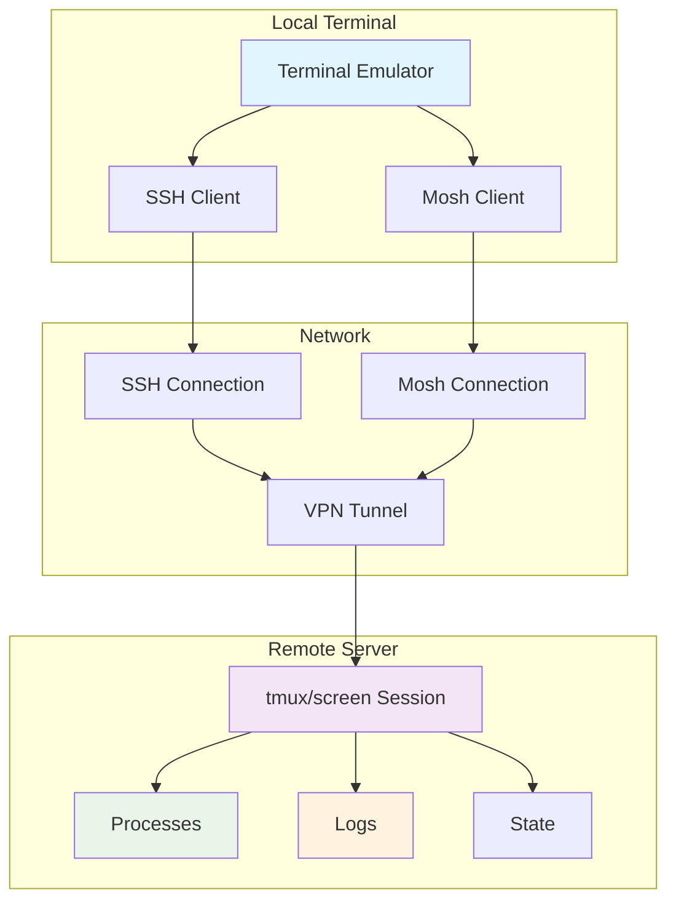

# Remote Development with tmux & screen: Best Practices for When the Wire Goes Dead

**Objective**: Master terminal multiplexers for bulletproof remote development that survives network chaos, SSH drops, and your own judgment failures. When you need to keep long-running processes alive, when you want to maintain context across network interruptions, when you're working on critical deployments—tmux and screen become your weapons of choice.

Terminal multiplexers provide the foundation for resilient remote development. Without proper understanding of session management, persistence patterns, and network failure recovery, you're building fragile systems that miss the power of continuous productivity. This guide shows you how to wield tmux and screen with the precision of a senior systems engineer.

## 0) Prerequisites (Read Once, Live by Them)

### The Five Commandments

1. **Understand multiplexer fundamentals**
   - Session persistence and process survival
   - Window and pane management
   - Copy/paste and clipboard integration
   - Network failure recovery

2. **Master configuration patterns**
   - Terminal color and compatibility
   - Keybinding customization
   - Plugin management and automation
   - Security and access control

3. **Know your workflows**
   - Session naming and organization
   - Layout scripting and automation
   - Collaboration and sharing
   - Logging and audit trails

4. **Validate everything**
   - Network resilience testing
   - Session recovery procedures
   - Performance under load
   - Security boundary enforcement

5. **Plan for production**
   - Scalable session management
   - Monitoring and alerting
   - Backup and recovery
   - Integration with existing workflows

**Why These Principles**: Terminal multiplexer mastery is the foundation of resilient remote development. Understanding session management, mastering persistence patterns, and following best practices is essential for building production-ready remote development systems.

## 1) Why Multiplexers for Remote Work? (The Foundation)

### Core Benefits

```yaml
# Terminal multiplexers enable resilient remote development
multiplexer_benefits:
  persistence:
    - "Processes survive SSH drops"
    - "Sessions persist across reboots"
    - "State restoration and recovery"
    - "Continuous productivity"
  
  multiplexing:
    - "Multiple windows/panes per connection"
    - "Low overhead and resource usage"
    - "Efficient screen real estate"
    - "Context switching without disconnection"
  
  collaboration:
    - "Shared sessions for pair programming"
    - "Incident response coordination"
    - "Knowledge transfer and handoffs"
    - "Audit trails and logging"
  
  reliability:
    - "Network failure resilience"
    - "Process isolation and protection"
    - "Automatic reconnection"
    - "Disaster recovery"
```

### Multiplexer Architecture



### Why Multiplexers Matter

```bash
# Without multiplexers: fragile remote development
ssh user@server
# Start long-running process
./deploy.sh  # 30 minutes later...
# Network drops, process dies, work lost

# With multiplexers: resilient remote development
tmux new -s work
# Start long-running process
./deploy.sh  # Network drops, process continues
# Reconnect and reattach
tmux attach -t work  # Process still running
```

**Why Multiplexers Matter**: Terminal multiplexers provide session persistence, process isolation, and network failure resilience. They enable continuous productivity even when network connections are unreliable or interrupted.

## 2) Prerequisites & Terminal Settings (The Setup)

### Terminal Configuration

```bash
# Essential terminal settings for remote development
# 1. Enable truecolor support
export TERM="xterm-256color"  # or tmux-256color

# 2. Install terminfo on remote host
infocmp tmux-256color >/dev/null 2>&1 || \
  tic -x <(curl -fsSL https://invisible-island.net/datafiles/current/terminfo.src)

# 3. Configure SSH keepalives
cat >> ~/.ssh/config << 'EOF'
Host *
  ServerAliveInterval 30
  ServerAliveCountMax 4
  TCPKeepAlive yes
EOF

# 4. Test OSC52 clipboard support
printf '\e]52;c;SGVsbG8=\a'  # Should copy "Hello" to clipboard
```

### Terminal Emulator Requirements

```yaml
# Terminal emulator features for remote development
terminal_requirements:
  color_support:
    - "Truecolor (24-bit) support"
    - "256-color fallback"
    - "Proper terminfo handling"
    - "Color accuracy across SSH"
  
  clipboard_integration:
    - "OSC52 clipboard protocol"
    - "Local clipboard access"
    - "Copy/paste across SSH"
    - "Security considerations"
  
  network_resilience:
    - "Automatic reconnection"
    - "Connection state management"
    - "Mosh integration"
    - "Proxy support"
  
  performance:
    - "Low latency rendering"
    - "Efficient memory usage"
    - "Smooth scrolling"
    - "Responsive input"
```

**Why These Settings Matter**: Proper terminal configuration ensures color accuracy, clipboard functionality, and network resilience. Understanding these requirements prevents common issues with remote development workflows.

## 3) The Opinionated ~/.tmux.conf (The Configuration)

### Complete tmux Configuration

```bash
# ~/.tmux.conf - Production-ready tmux configuration
# Sane defaults
set -g default-terminal "tmux-256color"
set -ga terminal-overrides ",*:Tc"           # advertise truecolor
set -g escape-time 10
set -g history-limit 200000
set -g base-index 1
setw -g pane-base-index 1
set -g renumber-windows on
set -g mouse on                              # optional: drag/resize/select

# Prefix & ergonomics
set -g prefix C-a                            # replace default C-b
unbind C-b
bind C-a send-prefix
bind r source-file ~/.tmux.conf \; display "reloaded"

# Splits & windows (vim-style)
bind | split-window -h -c "#{pane_current_path}"
bind - split-window -v -c "#{pane_current_path}"
bind c new-window -c "#{pane_current_path}"
bind -r h select-pane -L
bind -r j select-pane -D
bind -r k select-pane -U
bind -r l select-pane -R
bind -r H resize-pane -L 5
bind -r J resize-pane -D 5
bind -r K resize-pane -U 5
bind -r L resize-pane -R 5

# Status line minimalism
set -g status on
set -g status-style "bg=colour236 fg=white"
set -g status-left  "#[bold]#S #[default]"
set -g status-right "#(whoami)@#H %Y-%m-%d %H:%M "

# Copy-mode with OSC52 clipboard
setw -g mode-keys vi
bind -T copy-mode-vi y send-keys -X copy-pipe-and-cancel "pbcopy 2>/dev/null || xclip -sel clip 2>/dev/null || wl-copy 2>/dev/null || cat >/dev/null"

# Bells & detach safety
set -g visual-activity off
set -g detach-on-destroy off                 # keep client attached if pane dies

# Plugins (using TPM)
set -g @plugin 'tmux-plugins/tpm'
set -g @plugin 'tmux-plugins/tmux-resurrect'
set -g @plugin 'tmux-plugins/tmux-continuum'
set -g @plugin 'samoshkin/tmux-config'       # extras; optional
set -g @resurrect-capture-pane-contents 'on'
set -g @continuum-restore 'on'
run '~/.tmux/plugins/tpm/tpm'

# Security settings
set -g lock-after-time 300
set -g lock-command "tmux display-message '🔒' ; vlock || lock || loginctl lock-session"

# Mouse toggle
bind m set -g mouse \; display "mouse: #{?mouse,on,off}"

# Session locking
bind -n C-l lock-session
```

### TPM Installation

```bash
# Install TPM (Tmux Plugin Manager)
git clone https://github.com/tmux-plugins/tpm ~/.tmux/plugins/tpm

# Install plugins (inside tmux)
# Press prefix + I (capital i) to install plugins
```

### Configuration Rationale

```yaml
# Why these configuration choices matter
config_rationale:
  terminal_overrides:
    - "tmux-256color + Tc → real colors for editors"
    - "Prevents color degradation across SSH"
    - "Enables truecolor in Neovim and other apps"
  
  copy_paste:
    - "OSC52 clipboard for seamless copy/paste"
    - "Fallback to system clipboard tools"
    - "Works across SSH connections"
    - "Maintains security boundaries"
  
  plugins:
    - "resurrect → session state persistence"
    - "continuum → automatic session restoration"
    - "config → additional utilities"
    - "TPM → plugin management"
  
  security:
    - "Session locking for idle protection"
    - "Detach safety for process protection"
    - "Lock commands for system integration"
    - "Access control and permissions"
```

**Why This Configuration Works**: The tmux configuration provides color accuracy, clipboard integration, session persistence, and security features. Understanding these settings enables reliable remote development workflows.

## 4) Screen Configuration (The Fallback)

### Pragmatic ~/.screenrc

```bash
# ~/.screenrc - Production-ready screen configuration
defscrollback 200000
altscreen on
vbell off
caption always "%{= kG} %H %{= kw} | %`%Y-%m-%d %c %{= kY} | %{-} %n %t"
hardstatus alwayslastline "%{= kW}screen: %{-} %H | %l"
term xterm-256color

# Vim-style navigation
bind k focus up
bind j focus down
bind h focus left
bind l focus right

# Splits and windows
bind | split -v
bind - split -h
bind c screen
bind ^A screen

# Logging
bind H log on
bind h log off

# Security
bind L lockscreen
```

### Screen Usage Patterns

```bash
# Essential screen commands
# Start named session
screen -S work

# Detach from session
# Ctrl-a d

# List sessions
screen -ls

# Reattach or create if missing
screen -xRR work

# Split horizontally
# Ctrl-a S

# Split vertically  
# Ctrl-a |

# Navigate between regions
# Ctrl-a Tab

# Copy mode
# Ctrl-a [ (start selection)
# Space (start selection)
# Enter (copy)
# Ctrl-a ] (paste)
```

**Why Screen Matters**: Screen provides universal availability and compatibility across all Unix systems. Understanding screen patterns ensures productivity even on legacy or restricted systems.

## 5) Session Strategy (The Organization)

### Named Sessions and Workspaces

```bash
# Session naming and organization
# Create named workspace
tmux new -s work

# Attach to existing session
tmux attach -t work

# List all sessions
tmux list-sessions

# Kill specific session
tmux kill-session -t work

# Rename session
tmux rename-session -t old-name new-name
```

### Layout Scripting with tmuxp

```yaml
# ~/.config/tmuxp/geo.yml - Automated layout configuration
session_name: geo
windows:
  - window_name: editor
    layout: main-vertical
    panes:
      - shell_command: [ 'cd ~/code/project', 'nvim' ]
      - shell_command: [ 'cd ~/code/project', 'git status' ]
  - window_name: services
    panes:
      - shell_command: [ 'docker compose up --build' ]
      - shell_command: [ 'tail -f logs/app.log' ]
  - window_name: database
    panes:
      - shell_command: [ 'psql -d project_db' ]
      - shell_command: [ 'redis-cli' ]
```

### Raw Shell Scripting

```bash
# ~/bin/setup-dev-session.sh - Manual layout scripting
#!/bin/bash

# Create development session
tmux new-session -d -s dev

# Window 1: Editor
tmux rename-window -t dev:1 editor
tmux split-window -h -t dev:1
tmux send-keys -t dev:1.1 'cd ~/code/project && nvim' Enter
tmux send-keys -t dev:1.2 'cd ~/code/project && git status' Enter

# Window 2: Services
tmux new-window -t dev -n services
tmux split-window -v -t dev:2
tmux send-keys -t dev:2.1 'docker compose up --build' Enter
tmux send-keys -t dev:2.2 'tail -f logs/app.log' Enter

# Window 3: Database
tmux new-window -t dev -n database
tmux split-window -h -t dev:3
tmux send-keys -t dev:3.1 'psql -d project_db' Enter
tmux send-keys -t dev:3.2 'redis-cli' Enter

# Attach to session
tmux attach -t dev
```

### Session Automation

```bash
# ~/.bashrc or ~/.zshrc - Session automation
# Quick session start/attach
alias w='tmux new -As work'
alias d='tmux new -As dev'
alias i='tmux new -As incident'

# Session management
alias tls='tmux list-sessions'
alias ta='tmux attach'
alias tk='tmux kill-session'

# Layout loading
alias geo='tmuxp load geo'
alias api='tmuxp load api'
alias data='tmuxp load data'
```

**Why Session Strategy Matters**: Proper session organization enables repeatable workflows, context preservation, and efficient remote development. Understanding these patterns prevents session chaos and improves productivity.

## 6) Copy/Paste That Actually Works (The Clipboard)

### OSC52 Clipboard Integration

```bash
# OSC52 clipboard configuration for tmux
# Enable OSC52 in tmux
set -g set-clipboard on

# Copy-mode configuration
setw -g mode-keys vi
bind -T copy-mode-vi y send-keys -X copy-pipe-and-cancel "pbcopy 2>/dev/null || xclip -sel clip 2>/dev/null || wl-copy 2>/dev/null || cat >/dev/null"

# Test OSC52 support
printf '\e]52;c;SGVsbG8=\a'  # Should copy "Hello" to clipboard
```

### Copy/Paste Workflows

```bash
# tmux copy/paste workflow
# 1. Enter copy mode
# Prefix + [ (or v in vi mode)

# 2. Navigate and select text
# Use vim keys: h, j, k, l, w, b, etc.

# 3. Copy selection
# y (yank/copy)

# 4. Paste
# Prefix + ] (paste)

# 5. Exit copy mode
# q (quit)
```

### Screen Copy/Paste

```bash
# screen copy/paste workflow
# 1. Enter copy mode
# Ctrl-a [

# 2. Start selection
# Space (start selection)

# 3. End selection
# Enter (copy)

# 4. Paste
# Ctrl-a ]

# 5. Exit copy mode
# Esc
```

### Clipboard Troubleshooting

```bash
# Troubleshoot clipboard issues
# 1. Check OSC52 support
printf '\e]52;c;SGVsbG8=\a'

# 2. Test system clipboard tools
echo "test" | pbcopy        # macOS
echo "test" | xclip -sel clip  # Linux X11
echo "test" | wl-copy       # Linux Wayland

# 3. Check tmux clipboard settings
tmux show -g set-clipboard

# 4. Verify terminal emulator support
# Check terminal documentation for OSC52 support
```

**Why Copy/Paste Matters**: Reliable copy/paste functionality is essential for remote development productivity. Understanding clipboard integration prevents workflow interruptions and enables seamless text manipulation.

## 7) Network Chaos Mitigation (The Resilience)

### Mosh Integration

```bash
# Mosh + tmux for network resilience
# Install mosh
# macOS: brew install mosh
# Ubuntu: sudo apt install mosh
# CentOS: sudo yum install mosh

# Connect with mosh
mosh user@host -- tmux new -As work

# Mosh configuration
# ~/.mosh/config
MOSH_TITLE_NOPREFIX=1
MOSH_ESCAPE_KEY='~'
```

### SSH Keepalives

```bash
# SSH configuration for connection stability
# ~/.ssh/config
Host *
  ServerAliveInterval 30
  ServerAliveCountMax 4
  TCPKeepAlive yes
  Compression yes
  ControlMaster auto
  ControlPath ~/.ssh/control-%h-%p-%r
  ControlPersist 10m
```

### Connection Recovery

```bash
# Automatic reconnection scripts
# ~/bin/reconnect.sh
#!/bin/bash

HOST="$1"
SESSION="$2"

while true; do
  if ! tmux has-session -t "$SESSION" 2>/dev/null; then
    echo "Session $SESSION not found, creating..."
    tmux new-session -d -s "$SESSION"
  fi
  
  if ! ssh -o ConnectTimeout=5 "$HOST" "tmux has-session -t $SESSION" 2>/dev/null; then
    echo "Connection lost, reconnecting..."
    sleep 5
    continue
  fi
  
  echo "Connected to $SESSION on $HOST"
  tmux attach -t "$SESSION"
  break
done
```

### Network Monitoring

```bash
# Network quality monitoring
# ~/bin/network-monitor.sh
#!/bin/bash

while true; do
  if ping -c 1 -W 5 8.8.8.8 >/dev/null 2>&1; then
    echo "$(date): Network OK"
  else
    echo "$(date): Network DOWN"
    # Alert or take action
  fi
  sleep 30
done
```

**Why Network Resilience Matters**: Network failures are inevitable in remote development. Understanding resilience patterns prevents work loss and maintains productivity during network interruptions.

## 8) Collaboration & Handoffs (The Teamwork)

### Session Sharing

```bash
# tmux session sharing
# Create shared session
tmux new -s incident

# Teammate attaches to same session
tmux attach -t incident

# Multiple users can attach to same session
# Each user has independent view but shared state
```

### tmate Integration

```bash
# tmate for secure session sharing
# Install tmate
# macOS: brew install tmate
# Ubuntu: sudo apt install tmate

# Start tmate session
tmate

# Share the connection URL with team
# tmate displays connection command
# Example: ssh 12345@nyc.tmate.io
```

### Screen Sharing

```bash
# screen session sharing
# Create shared screen session
screen -S review

# Teammate attaches to shared session
screen -x review

# Both users see same screen
# Useful for pair programming or debugging
```

### Session Locking

```bash
# Lock session when stepping away
# tmux session locking
bind -n C-l lock-session

# screen session locking
bind L lockscreen

# Automatic locking on idle
# tmux configuration
set -g lock-after-time 300
set -g lock-command "tmux display-message '🔒' ; vlock || lock || loginctl lock-session"
```

### Handoff Procedures

```bash
# Session handoff checklist
# 1. Document current state
tmux list-sessions
tmux list-windows -t work
tmux list-panes -t work:1

# 2. Save important work
# Commit changes, save files, document progress

# 3. Lock session
# Ctrl-a l (screen) or Ctrl-l (tmux)

# 4. Handoff instructions
# Document what was running, what needs attention
# Share session name and any special instructions
```

**Why Collaboration Matters**: Remote development often involves team collaboration and handoffs. Understanding sharing patterns enables effective teamwork and knowledge transfer.

## 9) Logging and Audit Trails (The Documentation)

### tmux Logging

```bash
# tmux logging configuration
# Pipe pane to log file
# Prefix + : → pipe-pane -o 'cat >> ~/tmux-%Y%m%d-%H%M-%n.log'

# Log specific pane
tmux pipe-pane -t work:1.1 -o 'cat >> ~/logs/editor.log'

# Log all panes in window
tmux pipe-pane -t work:1 -o 'cat >> ~/logs/window1.log'

# Toggle logging
tmux pipe-pane -o 'cat >> ~/tmux.log'
```

### Screen Logging

```bash
# screen logging
# Start logging
# Ctrl-a H

# Log to specific file
screen -L -Logfile ~/screen.log -S work

# Log with timestamps
screen -L -Logfile ~/screen-%Y%m%d-%H%M.log -S work
```

### Log Management

```bash
# Log rotation and cleanup
# ~/bin/log-cleanup.sh
#!/bin/bash

# Rotate old logs
find ~/logs -name "*.log" -mtime +7 -exec gzip {} \;
find ~/logs -name "*.log.gz" -mtime +30 -delete

# Compress large logs
find ~/logs -name "*.log" -size +100M -exec gzip {} \;
```

### Audit Trail Configuration

```bash
# Comprehensive logging setup
# ~/bin/setup-audit.sh
#!/bin/bash

# Create log directory
mkdir -p ~/logs/{tmux,screen,ssh}

# Configure tmux logging
cat >> ~/.tmux.conf << 'EOF'
# Logging configuration
bind L pipe-pane -o 'cat >> ~/logs/tmux/tmux-#S-#I-#P-%Y%m%d-%H%M.log'
EOF

# Configure screen logging
cat >> ~/.screenrc << 'EOF'
# Logging configuration
bind H log on
bind h log off
EOF
```

**Why Logging Matters**: Comprehensive logging provides audit trails, debugging information, and compliance documentation. Understanding logging patterns enables effective troubleshooting and knowledge preservation.

## 10) Common Pitfalls (The Traps)

### Configuration Mistakes

```bash
# ❌ WRONG: Poor terminal configuration
export TERM="xterm"  # Limited color support
# No OSC52 support
# No SSH keepalives

# ✅ CORRECT: Proper terminal configuration
export TERM="xterm-256color"  # Full color support
# OSC52 clipboard enabled
# SSH keepalives configured
```

### Session Management Errors

```bash
# ❌ WRONG: Unnamed sessions
tmux new  # Creates unnamed session
# Hard to find and manage
# No persistence strategy

# ✅ CORRECT: Named sessions
tmux new -s work  # Creates named session
# Easy to find and manage
# Clear persistence strategy
```

### Network Resilience Issues

```bash
# ❌ WRONG: No network resilience
ssh user@host
# Start long process
# Network drops, process dies

# ✅ CORRECT: Network resilience
mosh user@host -- tmux new -As work
# Start long process
# Network drops, process continues
# Reconnect and reattach
```

**Why These Pitfalls Matter**: Common mistakes lead to lost work, poor productivity, and unreliable remote development. Understanding these pitfalls prevents costly errors and ensures resilient workflows.

## 11) Best Practices Checklist (The Wisdom)

### Remote Development Checklist

```bash
# ✅ DO: Complete remote development checklist
def remote_dev_checklist():
    checklist = {
        "terminal_setup": [
            "Enable truecolor support",
            "Configure OSC52 clipboard",
            "Set up SSH keepalives",
            "Test network resilience"
        ],
        "multiplexer_config": [
            "Install and configure tmux/screen",
            "Set up plugins and automation",
            "Configure security settings",
            "Test session persistence"
        ],
        "workflow_automation": [
            "Create session templates",
            "Script common layouts",
            "Set up aliases and shortcuts",
            "Configure logging and audit"
        ],
        "collaboration": [
            "Enable session sharing",
            "Set up handoff procedures",
            "Configure access controls",
            "Document team workflows"
        ]
    }
    return checklist
```

### Production Deployment Checklist

```bash
# ✅ DO: Production deployment checklist
def production_deployment_checklist():
    checklist = {
        "security": [
            "Configure session locking",
            "Set up access controls",
            "Enable audit logging",
            "Implement security policies"
        ],
        "monitoring": [
            "Set up session monitoring",
            "Configure alerting",
            "Implement health checks",
            "Track performance metrics"
        ],
        "backup": [
            "Configure session backup",
            "Set up state restoration",
            "Implement disaster recovery",
            "Test recovery procedures"
        ],
        "scaling": [
            "Configure resource limits",
            "Set up load balancing",
            "Implement session management",
            "Monitor resource usage"
        ]
    }
    return checklist
```

**Why These Practices Matter**: Best practices ensure successful remote development. Following established patterns prevents common mistakes and enables production-ready remote development systems.

## 12) TL;DR Quickstart (The Essentials)

### Essential Setup

```bash
# 1) Install multiplexers
# macOS
brew install tmux screen mosh

# Ubuntu
sudo apt install tmux screen mosh

# CentOS
sudo yum install tmux screen mosh

# 2) Configure tmux
cp ~/.tmux.conf ~/.tmux.conf.backup
# Install configuration from guide

# 3) Test setup
tmux new -s test
# Detach: Ctrl-a d
# Reattach: tmux attach -t test

# 4) Set up aliases
echo 'alias w="tmux new -As work"' >> ~/.bashrc
source ~/.bashrc
```

### Essential Commands

```bash
# Essential tmux commands
tmux new -s work          # Create named session
tmux attach -t work       # Attach to session
tmux list-sessions        # List all sessions
tmux kill-session -t work # Kill session

# Essential screen commands
screen -S work            # Create named session
screen -xRR work          # Attach or create
screen -ls                # List sessions
screen -S work -X quit    # Kill session
```

### Essential Workflows

```bash
# Daily workflow
w                          # Start/attach work session
# Do work
# Detach: Ctrl-a d
# Reattach: w

# Incident workflow
tmux new -s incident
# Enable logging
# Share with team
# Document findings
```

**Why This Quickstart**: These patterns cover 90% of remote development usage. Master these before exploring advanced features.

## 13) The Machine's Summary

Terminal multiplexers provide the foundation for resilient remote development. When used correctly, they enable continuous productivity even when network connections are unreliable or interrupted. The key is understanding session management, mastering persistence patterns, and following best practices.

**The Dark Truth**: Without proper multiplexer understanding, your remote development is fragile and unreliable. tmux and screen are your weapons. Use them wisely.

**The Machine's Mantra**: "In persistence we trust, in sessions we build, and in the multiplexer we find the path to resilient remote development."

**Why This Matters**: Terminal multiplexers enable applications to maintain state, survive network failures, and provide continuous productivity. They provide the foundation for reliable remote development systems that can work effectively across any network condition.

---

*This guide provides the complete machinery for mastering remote development with tmux and screen. The patterns scale from simple session management to complex collaborative workflows, from basic persistence to advanced automation.*
